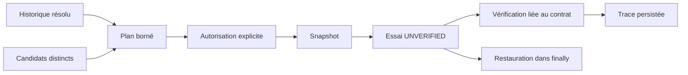

# Spirale de déblocage — élargir des interventions vérifiées

- **Statut** : planification, exécution avec restauration et recherche intégrées au backend.
- **Portée** : recherche contrefactuelle sous budget et autorité explicites.
- **Dernière revue** : 2026-10-06.

## 1. Domaine et objectif

Répéter une intervention sous un autre nom ne débloque pas une recherche.
La spirale garde la mémoire des essais, préfère une intervention distincte
dans le voisinage courant, puis élargit ce voisinage après des échecs vérifiés.
Un succès vérifié permet de repartir au voisinage local.

L'échelle désigne une portée concrète déclarée par l'appelant : paramètre,
outil, procédure, architecture ou environnement. L'élargissement ne confère
aucune permission supplémentaire et n'efface aucune dépense.

## 2. Contrat et invariants

Un candidat porte une intervention, ses outils, contraintes, preuves,
échelle et `verifierId`. Sa signature canonique inclut l'intervention.
Les changements de libellé ne créent pas une intervention nouvelle.
Une réplication désigne l'essai original et un autre vérificateur ; plusieurs
réplications par le même vérificateur ne comptent pas comme indépendantes.

L'ordre historique utilise l'ordre d'insertion SQLite, même quand les IDs
ou les horodatages ont le même préfixe. Les preuves doivent rester résolubles.
Un essai inachevé ou devenu invérifiable bloque la progression.

## 3. Algorithme

`scaleLimit` compte les échecs consécutifs vérifiés au niveau courant.
Le seuil configurable ouvre la prochaine échelle ; les échecs d'une ancienne
échelle ne justifient pas plusieurs élargissements successifs. `planNext`
écarte les signatures déjà tentées et celles qui dépassent la portée autorisée.
La suite de rayons peut utiliser φ ; les gates reposent sur les preuves.

Un simple booléen `newEvidence` ne recentre pas la recherche. Le chemin
opérationnel s'appuie sur les outcomes vérifiés du registre. Une nouvelle
preuve peut recentrer via `recenterEvidenceRef` : un artefact
`spiral-context-verification` doit lier le dernier essai, le nouvel état initial,
le `contextVerifierId` attendu et ses preuves accessibles. La limite locale
est rétablie et la référence est ajoutée au contrat ; ce n'est pas un succès fictif.

## 4. Architecture technique

[spiralRuntime](../../backend/src/services/morphogenesis/capabilities/spiralRuntime.js)
coordonne le registre et les adaptateurs. `finish` recharge le contrat original,
compare sa signature et vérifie un artefact `intervention-verification` portant
le même vérificateur, la même signature et un statut admissible.
[spiralSearch](../../backend/src/services/morphogenesis/synthesis/spiralSearch.js)
branche cette exécution dans `CounterfactualSearch.search` quand `context.spiral`
est fourni. Le résultat distingue explicitement ce mode par `verified-spiral`.

## 5. Processus d'exécution

1. Proposer un ensemble fini de candidats avec preuves accessibles.
2. Résoudre l'historique, calculer la limite d'échelle, sélectionner un candidat.
3. Obtenir l'autorisation de cette intervention auprès de la politique effective.
4. Prendre le snapshot et enregistrer l'essai UNVERIFIED avant exécution.
5. Vérifier l'outcome ; finaliser l'essai avec sa référence de preuve.
6. Restaurer le snapshot, y compris si exécution, écriture ou vérification échoue.
7. Replanifier seulement après résolution de tous les essais précédents.

Les adaptateurs obligatoires sont `snapshot`, `execute`, `verify` et `restore`.
L'autorisation est une fonction explicite, jamais déduite d'un score.
La restauration doit être implémentée par le propriétaire de l'environnement.

## 6. Exemple

Deux modifications locales échouent sur le même test. Le seuil est atteint à
cette échelle ; une intervention sur la procédure devient éligible. Elle ne
peut pas modifier une infrastructure distante si cette action n'est pas autorisée.
Un crash entre exécution et vérification laisse l'essai en attente de preuve.

## 7. Activation et reprise

Dans le synthétiseur, fournir `db` et `spiral` avec `scopeId`, `runId`,
`propose`, `authorize` et les adaptateurs. La boucle conserve son nombre maximal
d'itérations. L'absence de candidat distinct renvoie un blocage explicite.
Le CLI local expose `spiral.plan` et `spiral.finish` ; l'exécution d'une commande
arbitraire n'est pas exposée par ces opérations.

Pour reprendre un essai interrompu, produire une preuve liée au contrat original
et le finaliser. Une référence nouvelle avec une signature différente est refusée.
Une seconde finalisation identique est idempotente ; une finalisation contradictoire
échoue. Restaurer un snapshot ne supprime pas l'historique des essais.

## 8. Validation et comparaison

[test_capability_spiral_runtime](../../backend/tests/test_capability_spiral_runtime.js)
exerce l'ordre d'insertion, les répétitions, l'élargissement borné, le refus
d'autorisation, la restauration et le blocage sur interruption.
[test_capability_integration_runtime](../../backend/tests/test_capability_integration_runtime.js)
exerce le chemin du synthétiseur et son résultat opérationnel.

Le benchmark fait varier le seuil d'élargissement sur des cibles synthétiques.
Il compare les coûts et le taux de résolution ; il ne démontre pas que φ
surpasse d'autres politiques. Des politiques peuvent produire le même parcours.

## 9. Limites et garde-fous

Une signature distingue les champs déclarés ; elle ne détecte pas toutes les
équivalences sémantiques. Le snapshot et son confinement appartiennent au harnais.
Les erreurs de restauration sont propagées. Un receipt n'autorise pas une action.
Une expérience interrompue ne devient jamais un échec vérifié par expiration.

## 10. Références internes

Voir [Morphogenèse](topologies/morphogenese.md),
[ADR initial](../adr/0299-capacites-transversales-morphogenese.md) et
[ADR runtime](../adr/0332-capacites-morphogenese-runtime.md).
