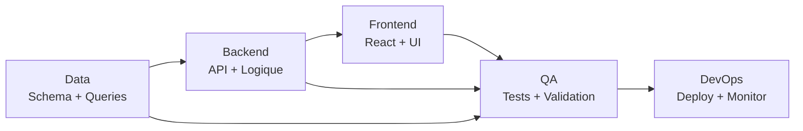
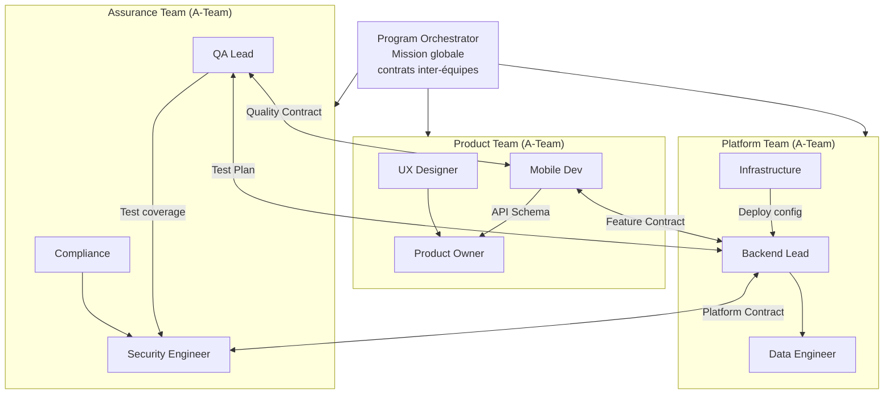
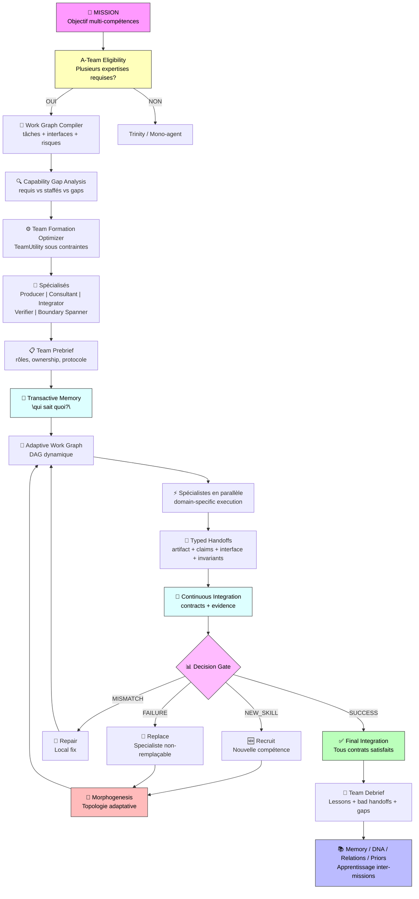
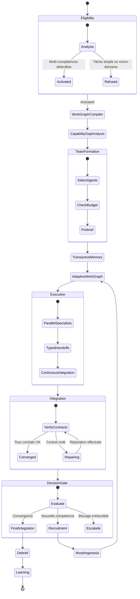

# A-Team — Organisation Adaptative du Travail Spécialisé

> **Statut :** Partiel. Cette fiche contient des mécanismes présents dans le runtime,
> des contrats normatifs à implémenter et des pistes conceptuelles. Une formule ou une
> métaphore ne constitue pas une garantie runtime tant qu'elle n'a pas de données
> d'entrée définies, de règle de décision déterministe et de vérification associée.
>
> **Portée :** composition, graphe de travail, dispatch, handoffs, preuves et intégration
> des spécialistes A-Team. Les décisions normatives d'implémentation ci-dessous priment
> sur les exemples et formules exploratoires des parties suivantes.

## Contrat normatif d'implémentation

Cette section tranche les ambiguïtés qui empêchent de transformer les parties suivantes
en comportements vérifiables. Toute modification du runtime A-Team doit préserver ces
invariants ou proposer explicitement une nouvelle décision.

### Éligibilité et choix de topologie

Une mission est éligible à A-Team si elle requiert au moins deux compétences distinctes
qui doivent contribuer au même livrable ou à des livrables intégrés, et si aucun spécialiste
unique disponible ne couvre ces besoins. Le nombre de compétences n'est pas fixé à trois.
Une tâche mono-domaine reste Solo. Une mission dont le but principal est de comparer des
hypothèses ou de prendre une décision entre options concurrentes relève d'une topologie
de comparaison telle que Trinity ; elle peut contenir des décisions Pareto locales.

L'interdépendance est portée par des dépendances explicites entre tâches, et non inférée
du seul fait que deux spécialistes participent à une mission. Le Work Graph peut contenir
plusieurs composantes indépendantes : chacune est ordonnancée séparément et toutes
contribuent au résultat global. Chaque composante doit être acyclique. Une dépendance
inconnue ou un cycle invalide le plan et doit être signalé avant le dispatch.

### Work Graph et états runtime

Le graphe est $G=(V,E)$ : $V$ contient des tâches de travail, chacune ayant un identifiant
stable, un domaine, un propriétaire, des entrées, des sorties et des critères d'acceptation ;
$E$ contient les dépendances producteur-vers-consommateur et leur contrat d'interface.
Un agent peut posséder plusieurs tâches, mais chaque tâche et chaque artefact versionné
ont exactement un propriétaire actif. Les consultants peuvent conseiller sans devenir
propriétaires.

États normatifs d'une tâche :

| État | Signification | Conséquence |
|---|---|---|
| `READY` | Toutes les dépendances sont promues et la tâche peut démarrer. | Le dispatch est autorisé. |
| `RUNNING` | Le worker exécute la tâche. | Aucun consumer ne reçoit encore sa sortie comme validée. |
| `BLOCKED` | Une dépendance n'est pas promue ; une raison structurée est requise. | La tâche attend ou fait l'objet d'une escalade. |
| `SUCCEEDED` | La sortie a satisfait le contrat et sa preuve a été promue. | Les consumers peuvent devenir `READY`. |
| `FAILED` | Le worker a échoué ou le contrat a été rejeté sans réparation disponible. | Seuls les nœuds dépendants sont bloqués. |
| `TIMED_OUT` | Le délai d'exécution ou de validation est dépassé. | Seuls les nœuds dépendants sont bloqués. |

Les statuts historiques du runtime doivent être normalisés vers ces états à la frontière
du scheduler. `completed` ne signifie `SUCCEEDED` que si la barrière de preuves a promu
la sortie. Timeout, absence de worker, échec, rejet et sortie non vérifiée ne débloquent
jamais un consumer. Une branche indépendante peut continuer.

### Handoff, preuves et intégration

Un handoff est un objet versionné avec au minimum : identifiants du producteur et du
consumer, type de handoff, références d'artefacts, claims, hypothèses, contrat d'interface,
préconditions, postconditions, invariants, références de preuves, questions ouvertes,
risques, critères d'acceptation et état. Les champs structurants (identifiants, type,
version, statut et références requises par le contrat) sont obligatoires. Les listes
`assumptions`, `openQuestions` et `knownRisks` peuvent être vides ; une liste vide est une
information explicite et n'invalide pas le handoff.

Les types sont `DELIVERY`, `DELEGATION`, `CONSULTATION`, `VALIDATION` et `ESCALATION`.
Une livraison ne passe à `ACCEPTED` que si ses critères sont évalués et ses preuves
disponibles. Les autres réponses possibles sont `PARTIAL_ACCEPT`, `REJECT`,
`REQUEST_REPAIR` et `REQUEST_CLARIFICATION`. Un rejet de consumer est routé au propriétaire
de l'artefact ; il ne modifie pas directement un artefact d'un autre spécialiste.

La promotion est une décision de la barrière de preuves, jamais une simple conséquence
d'un dispatch réussi ou d'un statut terminal. Une preuve doit référencer la tâche ou
l'artefact concerné, son résultat de validation et sa provenance. Les champs absents ou
les preuves invalides produisent un refus explicite avec les critères manquants.

### Couverture, capacité et sélection d'équipe

Les dimensions MCC, TSC, RCA et VEC sont publiées séparément avec leur numérateur,
dénominateur et source. MCC mesure les compétences requises couvertes par le contrat des
membres retenus ; TSC mesure les tâches requises ayant un propriétaire affecté ; RCA mesure
les workers affectés qui peuvent effectivement être dispatchés ; VEC mesure les compétences
requises couvertes par des preuves d'expertise vérifiées. Une expertise sans preuve compte
comme non vérifiée. Si le dénominateur est nul, la métrique est `null` et la mission est
refusée comme A-Team mal formée au lieu d'être déclarée couverte.

La couverture combinée est le produit MCC × TSC × RCA × VEC, mais le runtime doit également
exposer les quatre facteurs : le produit seul ne constitue pas un motif d'acceptation et
ne doit pas masquer une dimension nulle. Une dimension obligatoire nulle bloque la promotion.

La taille de l'équipe est adaptative, sans plafond métier fixe de trois. La taille effective
est bornée par les tâches nécessaires, le budget restant, les slots disponibles du garage
et toute limite opérateur explicitement configurée. La formule de taille de la section 12
de la partie 2 reste indicative tant que les unités et les paramètres $C$, $\kappa$ et
$\bar{c}$ ne sont pas calibrés sur des mesures runtime. Le runtime ne doit pas inventer ces
valeurs ni revendiquer une optimisation globale qu'il ne calcule pas.

Pour une première implémentation, la formation applique les contraintes dures avant tout
score : couvrir chaque tâche requise, disposer des outils nécessaires, respecter le budget
et les slots, puis préférer les profils vérifiés et les interfaces compatibles. Les scores
de coût, fiabilité, complémentarité et compatibilité ne participent à une décision qu'une
fois leur échelle, leur provenance et leurs valeurs manquantes définies. Le recuit simulé
décrit plus loin est une option de recherche, pas une exigence du runtime actuel.

### Arbitrage Pareto et décisions locales

Les spécialistes et leurs dossiers ne sont pas des options concurrentes : leurs contributions
complémentaires sont évaluées par leurs contrats d'interface et leurs preuves. Pareto ne
classe donc pas les spécialistes pour décider quelle contribution conserver.

Pareto peut comparer des options mutuellement substituables à l'intérieur d'une tâche
identifiée (par exemple plusieurs choix de base de données). Chaque option indique ses
dimensions, sa provenance et la décision locale retenue. Cette décision devient une entrée
ou une contrainte des tâches aval. Une frontière Pareto globale de dossiers A-Team ne prouve
ni la compatibilité des artefacts ni la couverture du Work Graph.

### Mémoire transactive et communication

La mémoire transactive est un index détenu par le runtime, pas une affirmation de mémoire
interne partagée entre workers. Une entrée référence un agent, un domaine ou contrat connu,
la source de cette connaissance, sa date de vérification et son niveau de confiance. Les
workers reçoivent uniquement les informations nécessaires à leurs tâches et les handoffs
autorisés. La décroissance de confiance ou le routage par latence/charge restent désactivés
tant que le runtime ne collecte pas ces mesures et ne définit pas leurs seuils.

### Statut des mécanismes

Les propriétés ci-dessus sont les critères normatifs à atteindre ; elles ne déclarent pas
que le dépôt les satisfait déjà. Les parties 1 à 4 décrivent aussi des mécanismes
conceptuels. Chaque mécanisme doit être présenté comme `Implémenté`, `Partiel` ou `Cadre
conceptuel`, avec une preuve runtime ou un écart identifié. Les affirmations de type
« théorème » ne sont garanties que si les préconditions de ce contrat sont vérifiées par
le code.

### Découpage cible dans le backend

Ce tableau indique où implémenter les contrats ; la présence d'un fichier ne signifie pas
que le comportement correspondant est déjà complet.

| Contrat | Point d'intégration principal | Résultat à vérifier |
|---|---|---|
| Éligibilité, capacités et composition | `backend/src/services/aTeamService.js` | Mission mono-domaine refusée ; exigences, membres retenus et gaps explicités. |
| Graphe, dépendances et exécution par étapes | `backend/src/services/aTeamStageScheduler.js` | Graphe validé avant dispatch ; consumers bloqués tant que leurs producteurs ne sont pas promus. |
| Contrat d'équipe et handoffs | `backend/src/services/aTeamCoordinationService.js` | Handoffs typés, interfaces et propriétaires cohérents avec le Work Graph. |
| Promotion des preuves et intégration | `backend/src/services/workerEvidenceBarrier.js` et `backend/src/services/aTeamComparativeBarrier.js` | Aucune fusion sur la seule base d'un dispatch ou d'un statut `completed`. |
| Compatibilité, ownership et blocages | `backend/src/services/aTeamIntegrationObserver.js` | Chaque violation rapporte le worker, le domaine, le contrat et la raison. |
| Couverture indépendante | `backend/src/services/aTeamQualityGateService.js` | MCC, TSC, RCA et VEC sont restitués séparément et leurs données manquantes sont visibles. |
| Mémoire transactive | `backend/src/services/communication/transactiveMemoryService.js` | Entrées sourcées, datées et consultées via les accès autorisés. |
| Recrutement et changement de topologie | `backend/src/services/morphogenesis/transitionEngineService.js` et `backend/src/services/agentFleetService.js` | Toute transition respecte budget, capacité, leases et contrats du dispatch. |

### Invariants d'acceptation d'une implémentation

Une version ne satisfait cette spécification que si les vérifications suivantes sont
automatisées :

1. Un graphe cyclique ou avec dépendance inconnue est refusé avant création de workers.
2. Un consumer n'est jamais lancé si une dépendance est échouée, expirée, manquante ou non promue ; une branche indépendante peut continuer.
3. Un handoff incomplet, rejeté ou sans preuve requise ne débloque pas le graphe aval.
4. Une modification d'artefact respecte son propriétaire et une interface déclarée ; toute exception est enregistrée comme consultation autorisée.
5. Le gate restitue les quatre couvertures et bloque une couverture obligatoire nulle, sans substituer un score moyen ou global.
6. Un recrutement ou remplacement ne dépasse ni le budget ni les slots disponibles et laisse une trace de décision.
7. Les décisions Pareto sont liées à une tâche et à ses options substituables ; elles ne servent pas à élire une contribution métier parmi des spécialistes complémentaires.

## 1. Définition

**A-Team** est le protocole de GenOS pour les problèmes dont la solution exige plusieurs compétences complémentaires, interdépendantes et non substituables, qui doivent produire ensemble un artefact cohérent.

Formellement, soit $\mathcal{M}$ une mission et $\mathcal{A}$ l'ensemble des agents disponibles. Une mission est classée **A-Team** si et seulement si :

$$\exists \, S \subseteq \mathcal{A}, \; |S| \geq 2, \; \bigcup_{i \in S} C_i \supseteq R(\mathcal{M}), \; \nexists \, j \in \mathcal{A}: C_j \supseteq R(\mathcal{M})$$

où $C_i$ désigne les capacités vérifiées de l'agent $i$ et $R(\mathcal{M})$ les capacités
requises par la mission. Autrement dit, aucun agent disponible seul ne couvre toutes les
capacités requises ; l'équipe retenue doit les couvrir collectivement.

La condition d'interdépendance s'exprime par la matrice de dépendance $\mathbf{D} \in \{0,1\}^{n \times n}$ :

$$\forall (i,j) \in S \times S, \; i \neq j: \; D_{ij} = 1 \iff \text{la sortie de } i \text{ est une entrée requise de } j$$

Un Work Graph A-Team doit être **acyclique** (DAG), mais n'a pas besoin d'être connexe : les composantes indépendantes représentent des tâches sans dépendance directe. Un cycle ou une référence de dépendance inconnue invalide le plan avant dispatch. Voir le contrat normatif d'implémentation ci-dessus.

La production finale est un artefact composite $\mathcal{X}$ défini comme :

$$\mathcal{X} = \bigoplus_{i \in S} x_i$$

où $\bigoplus$ est l'opérateur d'intégration sémantique (et non la simple concaténation), et chaque $x_i$ est la contribution de l'agent $i$, validée par le contrat d'interface $\Phi_{i \to \mathcal{X}}$.

---
## 2. Distinction fondamentale : Trinity vs A-Team
### 2.1 Nature des rôles
| Dimension | Trinity | A-Team |
|-----------|---------|--------|
| **Relation entre agents** | Hiérarchique (Stratège → Exécuteur → Gardien) | Horizontale (spécialistes pairs) |
| **Substituabilité** | Chaque rôle a un remplaçant potentiel | Aucun spécialiste n'est substituable |
| **Flux de contrôle** | Séquentiel avec boucles de rétroaction | DAG de dépendances |
| **Objectif de cohérence** | Alignement sur la mission | Cohérence de l'artefact composite |
| **Modèle de défaillance** | Un rôle peut échouer, les autres continuent | La défaillance d'un spécialiste bloque le DAG |
| **Type de cas** | Décision sous contrainte | Construction multi-compétences |
| **Métaphore biologique** | Système nerveux central | Organe multicellulaire |
### 2.2 Diagramme de distinction
```
TRINITY                          A-TEM
                                  
  ┌──────────┐                   ┌──────────┐
  │ Stratège │                   │ Frontend │
  └────┬─────┘                   └────┬─────┘
       │ dépendance                      │ dépendance
       ▼                               ▼
  ┌──────────┐    ┌──────────┐    ┌──────────┐
  │ Exécuteur│◄──►│ Backend  │◄──►│ Security │
  └────┬─────┘    └──────────┘    └──────────┘
       │                               │
       ▼                               ▼
  ┌──────────┐                   ┌──────────┐
  │ Gardien  │                   │   DevOps │
  └──────────┘                   └──────────┘
                                  
  Profondeur = 3                  Largeur = n
  Contrôle = vertical             Coordination = horizontale
```
### 2.3 Critères de décision

Le choix entre Trinity et A-Team suit les règles suivantes :

- Si la mission nécessite **au moins 2 compétences complémentaires** et un livrable intégré → A-Team
- Si la mission nécessite **décision → exécution → validation** → Trinity
- Si une seule compétence suffit → Solo

**Règle normative de priorité** : une mission de construction multi-compétences relève d'A-Team si elle satisfait les critères d'éligibilité ci-dessus. Une mission de comparaison d'options relève d'une topologie de comparaison ; si cette mission contient des tâches de construction, celles-ci peuvent être organisées en A-Team. Le mot « priorité » ne signifie pas qu'un Pareto global départage les topologies.

La formule suivante est conservée comme intuition historique et ne définit pas le dispatch runtime :

$$\text{choix}(\mathcal{M}) = \begin{cases} \text{A-Team} & \text{si } |\mathcal{G}_{\text{ICG}}| \geq 3 \text{ et } \mathcal{G} \text{ est non trivial} \\ \text{Trinity} & \text{si } \mathcal{M} \text{ est une décision sous contrainte} \\ \text{Solo} & \text{si } \exists \, i \in \mathcal{A}: \; C_i \supseteq \text{requis}(\mathcal{M}) \end{cases}$$
### 2.4 Exemples de missions par type
| Mission | Type | Justification |
|---------|------|---------------|
| Déployer une API REST sécurisée | A-Team | Backend + Frontend + Security + DevOps |
| Décider d'acquérir une startup | Trinity | Stratégie + Exécution due diligence + Validation légale |
| Corriger un typo | Solo | Une seule compétence requise |
| Construire un pipeline ML | A-Team | Data Engineering + ML + Infrastructure + Monitoring |
### 2.5 Formule de classification

Soit $\mathcal{P}$ une mission. La fonction de classification $\chi: \mathcal{P} \to \{\text{Trinity}, \text{A-Team}, \text{Solo}\}$ est définie par :

$$\chi(\mathcal{P}) = \begin{cases} \text{A-Team} & \text{si } \exists \, \text{DAG de spécialistes } \mathcal{G} \text{ avec } |\mathcal{G}| \geq 2 \\ \text{Trinity} & \text{si } \mathcal{P} \text{ exige décision + exécution + validation} \\ \text{Solo} & \text{si } \exists \, \text{agent unique couvrant } \mathcal{P} \end{cases}$$

Quand les deux formes de travail sont présentes, le plan doit séparer les décisions concurrentielles des tâches de construction et relier les choix retenus aux tâches aval par des dépendances explicites.

---
## 3. Ce que l'implémentation fait bien
### 3.1 Mécanismes existants
| Mécanisme | Description | Formule / Propriété |
|-----------|-------------|---------------------|
| **Domaines** | Partition de l'espace des compétences | $\mathcal{D} = \{d_1, d_2, \ldots, d_n\}, \; d_i \cap d_j = \emptyset$ |
| **Rôles** | Attribution de responsabilités par domaine | $R: \mathcal{A} \to \mathcal{D}$ |
| **Workspaces** | Isolation des contextes d'exécution | $WS_i \cap WS_j = \emptyset$ sauf interfaces |
| **Dépendances** | Arêtes du DAG de spécialistes | $E = \{(i,j) \mid \text{sortie}(i) \in \text{entrée}(j)\}$ |
| **Ordonnancement** | Tri topologique du DAG | $\sigma: S \to \{1, \ldots, n\}, \; (i,j) \in E \Rightarrow \sigma(i) < \sigma(j)$ |
| **Capability Contract** | Spécification formelle des entrées/sorties | $\Phi_i = (\mathcal{I}_i, \mathcal{O}_i, \mathcal{P}_i)$ |
| **Tool Leases** | Verrous sur les outils partagés | $L: \mathcal{T} \to \mathcal{A} \cup \{\emptyset\}$ |
| **19 Organisations** | Configurations prédéfinies de topologies | $\mathcal{O} = \{O_1, \ldots, O_{19}\}$ |
| **Evidence Barrier** | Gate de promotion des résultats partiels | $\text{promouvoir}(x_i) \iff \text{vérifier}(\Phi_i, x_i)$ |
### 3.2 Propriétés garanties

L'implémentation assure les propriétés suivantes :

**Théorème d'ordonnancement** : Pour tout DAG $\mathcal{G}$ de spécialistes, l'ordonnancement $\sigma$ produit un ordre d'exécution valide tel que :

$$\forall (i,j) \in E: \; \text{terminer}(i) < \text{démarrer}(j)$$

**Théorème d'isolation** : Les workspaces garantissent que :

$$\forall i \neq j: \; \text{accès}(WS_i, \text{agent } j) = \emptyset \setminus \text{interfaces}(\Phi_i, \Phi_j)$$

**Théorème de couverture** : L'union des domaines couvre l'espace de la mission :

$$\bigcup_{i \in S} d_i \supseteq \text{domaine}(\mathcal{M})$$
### 3.3 Architecture d'intégration
```
┌─────────────────────────────────────────────────────────┐
│                    ORCHESTRATOR                          │
│  ┌─────────┐  ┌──────────┐  ┌──────────┐  ┌─────────┐ │
│  │Scheduler│  │  Quality │  │ Evidence │  │  Tool   │ │
│  │         │  │   Gate   │  │  Barrier │  │  Leases │ │
│  └────┬────┘  └────┬─────┘  └────┬─────┘  └────┬────┘ │
│       │            │             │              │       │
└───────┼────────────┼─────────────┼──────────────┼───────┘
        │            │             │              │
   ┌────┴────┐  ┌────┴────┐  ┌────┴────┐  ┌──────┴─────┐
   │Frontend │  │ Backend │  │Security │  │  DevOps    │
   │  Agent  │  │  Agent  │  │  Agent  │  │  Agent     │
   │  WS_1   │  │  WS_2   │  │  WS_3   │  │  WS_4      │
   └─────────┘  └─────────┘  └─────────┘  └────────────┘
```
---
## 4. La question conceptuelle fondamentale
### 4.1 Pourquoi Pareto(frontend, backend, security) est une mauvaise abstraction

Cette critique concerne uniquement l'emploi de Pareto pour classer les spécialistes ou
leurs contributions complémentaires. Elle n'interdit pas Pareto pour comparer des options
mutuellement substituables au sein d'une décision locale (voir partie 3, section 5).

L'approche Pareto traite les spécialistes comme des candidats concurrents sur un front d'optimalité multi-objectif. Cette abstraction est inadaptée car :

**Non-substituabilité** : Les spécialistes A-Team ne sont pas des compromis entre objectifs. Le frontend n'est pas un « moins bon backend » — il est **orthogonal**. La distance de Pareto entre deux spécialistes est infinie dans leur dimension respective :

$$\forall i \neq j: \; \text{score}(i, d_j) = 0$$

où $\text{score}(i, d_j)$ mesure la compétence de l'agent $i$ dans le domaine $d_j$.

**Absence de trade-off** : En Pareto, on accepte de dégrader un objectif pour améliorer un autre. En A-Team, dégrader la sécurité pour améliorer le frontend ne produit pas un artefact acceptable — il produit un artefact **invalide** :

$$\text{accepter}(\mathcal{X}) \iff \forall i \in S: \; \text{qualité}(x_i) \geq \tau_i$$

Il n'y a pas de compensation entre les dimensions.

**Indépendance des contributions** : La valeur totale n'est pas additive mais multiplicative (ou logique ET) :

$$V(\mathcal{X}) = \prod_{i \in S} v(x_i)$$

où $v(x_i) \in \{0, 1\}$ selon que la contribution satisfait son contrat. Si une contribution échoue, l'artefact entier échoue.
### 4.2 La bonne structure : Integration Contract Graph

La structure correcte est un **Graphe de Contrats d'Intégration** (ICG) défini par :

$$\mathcal{G}_{\text{ICG}} = (S, E, \mathcal{C})$$

où :
- $S$ est l'ensemble des spécialistes
- $E \subseteq S \times S$ est l'ensemble des dépendances
- $\mathcal{C} = \{C_{i \to j} \mid (i,j) \in E\}$ est l'ensemble des contrats d'interface

Chaque contrat $C_{i \to j}$ spécifie :

$$C_{i \to j} = (\text{type}, \text{format}, \text{contraintes}, \text{préconditions}, \text{postconditions})$$

La condition de validité globale est :

$$\forall (i,j) \in E: \; \text{satisfait}(C_{i \to j}, x_i, x_j)$$
### 4.3 Formule de cohérence

La cohérence de l'artefact composite est mesurée par :

$$\text{cohérence}(\mathcal{X}) = \min_{(i,j) \in E} \; \text{conformité}(x_i, C_{i \to j})$$

L'artefact est cohérent si et seulement si :

$$\text{cohérence}(\mathcal{X}) = 1$$

C'est une condition de **minimum** (et non de moyenne), reflétant qu'un seul contrat violé invalide l'ensemble.
### 4.4 Comparaison des abstractions
| Propriété | Pareto | ICG |
|-----------|--------|-----|
| Relation entre agents | Compétition | Coopération |
| Substituabilité | Oui (trade-off) | Non (orthogonalité) |
| Échec d'un agent | Dégradation graduelle | Échec total |
| Optimisation | Front de Pareto | Satisfaction de contrats |
| Métaphore | Marché | Assemblage |

---
## 5. Les 4 corrections structurelles requises
### 5.1 Handoff incomplet

**État actuel** : Le handoff entre spécialistes transfère uniquement la sortie brute $x_i$ sans métadonnées de contexte.

**État requis** : Un handoff A-Team doit transférer un **paquet de transition** structuré :

$$H_{i \to j} = (x_i, \text{claims}_i, \text{interface}_i, \text{assumptions}_i, \text{unresolved}_i, \text{evidence}_i)$$

où :
- $x_i$ : la contribution (artefact)
- $\text{claims}_i$ : les affirmations de l'agent sur sa contribution
- $\text{interface}_i$ : le contrat d'interface formel
- $\text{assumptions}_i$ : les hypothèses sous-jacentes
- $\text{unresolved}_i$ : les questions non résolues
- $\text{evidence}_i$ : les preuves de vérification

**Formule de complétude** :

Les références obligatoires dépendent du type de handoff et du contrat d'interface. Les
listes `assumptions`, `unresolved` et `knownRisks` peuvent être vides ; leurs clés doivent
être présentes pour distinguer « connu vide » de « champ omis ».

$$\text{complet}(H_{i \to j}) = 1 \iff \text{champs obligatoires présents} \land \text{références valides} \land \text{preuve exigée disponible}$$

Le handoff est valide si et seulement si $\text{complet}(H_{i \to j}) = 1$.
### 5.2 Scheduler timeout incohérent

**Constat initial** : l'ancien scheduler pouvait lancer le consumer après un timeout. Le
contrat normatif corrige ce comportement : chaque consumer attend la promotion de toutes
ses dépendances et reste bloqué après timeout ou échec. Les branches indépendantes restent
exécutables. Cette règle doit être couverte par les tests du scheduler.

**Règle normative** : un timeout de spécialiste bloque les seuls nœuds aval dépendants,
car la contribution est incomplète ou non vérifiée.

**Formule de propagation** :

$$\text{état}(j) = \begin{cases} \text{bloqué} & \text{si } \exists \, i: \; (i,j) \in E \; \text{et} \; \text{état}(i) \in \{\text{timeout}, \text{échec}\} \\ \text{prêt} & \text{si } \forall \, i: \; (i,j) \in E \Rightarrow \text{état}(i) = \text{succès} \end{cases}$$

**Formule de sécurité** :

$$\text{sécurité}(\mathcal{G}) = \forall j \in S: \; \text{démarrer}(j) \Rightarrow \forall i: \; (i,j) \in E \Rightarrow \text{promu}(x_i)$$
### 5.3 Quality Gate à fausse couverture

**État actuel** : La Quality Gate agrège quatre métriques distinctes en un seul score, donnant une impression de couverture globale.

**État requis** : Les quatre métriques doivent être séparées et évaluées indépendamment :
| Métrique | Notation | Formule |
|----------|----------|---------|
| **Mission Capability Coverage** | $MCC$ | Compétences requises couvertes par les capacités vérifiées des membres / compétences requises. |
| **Team Staffed Coverage** | $TSC$ | Tâches requises ayant un propriétaire affecté / tâches requises. |
| **Runtime Capability Availability** | $RCA$ | Workers affectés qui peuvent être dispatchés / workers affectés. |
| **Verified Expertise Coverage** | $VEC$ | Compétences requises soutenues par des preuves d'expertise / compétences requises. |

**Formule de couverture réelle** :

$$\text{couverture}(\mathcal{M}, S) = MCC \times TSC \times RCA \times VEC$$

Le produit est un indicateur global et non un substitut aux quatre valeurs : une dimension
obligatoire nulle bloque la promotion. Si un dénominateur est nul, la métrique est `null`
et la mission est mal formée ; elle ne compte pas comme couverture parfaite.
### 5.4 Détecteur de contamination naïf

**Constat** : l'observateur actuel détecte notamment les claims hors domaine et l'absence
de contraintes d'intégration ; il ne prouve pas à lui seul l'ownership des artefacts ni
l'autorité d'interface de chaque modification.

**État requis** : Le détecteur doit vérifier trois propriétés :

**Propriété 1 — Ownership** : Chaque artefact a un propriétaire unique :

$$\forall x \in \mathcal{X}: \; \exists! \, i \in S: \; \text{propriétaire}(x) = i$$

**Propriété 2 — Consultation** : Un spécialiste ne peut modifier un artefact d'un autre qu'après consultation :

$$\text{modifier}(i, x_j) \Rightarrow \text{consulté}(j, i, x_j)$$

**Propriété 3 — Interface Authority** : Seules les interfaces contractuelles autorisent la modification :

$$\text{modifier}(i, x_j) \Rightarrow (i,j) \in E \; \text{et} \; C_{j \to i} \neq \emptyset$$

**Formule de contamination** :

$$\text{contaminé}(\mathcal{X}) = \exists x \in \mathcal{X}: \; \neg \text{ownership}(x) \lor \neg \text{consultation}(x) \lor \neg \text{interface}(x)$$

---
## 6. Ce qu'A-Team doit réellement être
### 6.1 Organisation adaptative du travail spécialisé

A-Team est une **organisation adaptative** qui reconfigure sa structure en fonction de la mission. La configuration optimale n'est pas fixe — elle émerge de l'analyse des dépendances.

**Formule d'adaptation** :

$$\text{configuration}(\mathcal{M}) = \arg\min_{S \subseteq \mathcal{A}} \; |S| \; \text{sous contrainte} \; \bigcup_{i \in S} C_i \supseteq \text{requis}(\mathcal{M})$$

C'est une question d'optimisation combinatoire résolu par l'orchestrateur lors de la phase de planification.
### 6.2 Mémoire transactive

A-Team implémente une **mémoire transactive** distribuée : chaque spécialiste sait ce que les autres savent (et ne savent pas).

**Formule de mémoire transactive** :

$$\text{MT}(i, j, d) = \begin{cases} 1 & \text{si l'agent } i \text{ sait que l'agent } j \text{ maîtrise le domaine } d \\ 0 & \text{sinon} \end{cases}$$

La matrice de mémoire transactive $\mathbf{MT} \in \{0,1\}^{n \times n \times |\mathcal{D}|}$ est maintenue par l'orchestrateur et mise à jour après chaque handoff.

**Propriété de complétude** :

$$\forall i, j \in S, \; \forall d \in \mathcal{D}: \; \text{MT}(i, j, d) = \text{MT}(j, i, d)$$

La symétrie ci-dessus est une propriété du registre central si elle est explicitement
propagée ; elle n'est pas présumée vraie des connaissances internes des agents. Tant
qu'aucun mécanisme de propagation n'existe, le runtime expose l'information aux agents
uniquement dans leurs prompts ou handoffs autorisés.
### 6.3 Handoffs typés

Les handoffs A-Team sont **typés** selon la nature de la transition :
| Type | Notation | Description |
|------|----------|-------------|
| **Delivery** | $H_D$ | Livraison d'artefact complet |
| **Delegation** | $H_{Del}$ | Délégation de sous-tâche |
| **Consultation** | $H_C$ | Demande d'expertise |
| **Validation** | $H_V$ | Vérification croisée |
| **Escalation** | $H_E$ | Remontée de blocage |

**Formelle de typage** :

$$\text{type}(H_{i \to j}) \in \{H_D, H_{Del}, H_C, H_V, H_E\}$$

Chaque type a un contrat de validation distinct :

$$\text{valider}(H_{i \to j}) = \begin{cases} \text{vérifier}(x_i, \Phi_i) & \text{si type} = H_D \\ \text{vérifier}(\text{sous-tâche}, \Phi_j) & \text{si type} = H_{Del} \\ \text{vérifier}(\text{réponse}, \text{question}) & \text{si type} = H_C \\ \text{vérifier}(x_i, x_j) & \text{si type} = H_V \\ \text{vérifier}(\text{blocage}, \text{contexte}) & \text{si type} = H_E \end{cases}$$
### 6.4 Intégration continue

A-Team pratique l'**intégration continue** des contributions : chaque artefact partiel est intégré dès qu'il est promu, et l'artefact composite est revalidé.

**Formule d'intégration** :

$$\mathcal{X}_t = \bigoplus_{i \in S_t} x_i$$

où $S_t = \{i \in S \mid \text{promu}(x_i) \text{ au temps } t\}$ est l'ensemble des contributions disponibles au temps $t$.

**Formule de revalidation** :

$$\text{valide}(\mathcal{X}_t) = \forall (i,j) \in E: \; i \in S_t \land j \in S_t \Rightarrow \text{satisfait}(C_{i \to j}, x_i, x_j)$$

L'intégration continue garantit que les incohérences sont détectées **immédiatement** plutôt qu'à la fin.

---
## 7. Références scientifiques
### 7.1 APA Teamwork Podcast — Salas (7 Cs)

Salas et al. identifient les 7 conditions du travail d'équipe efficace (the « 7 Cs ») :
| C | Description | Application A-Team |
|---|-------------|-------------------|
| **Coordination** | Synchronisation des activités | Ordonnancement du DAG |
| **Communication** | Échange d'information structuré | Handoffs typés |
| **Cooperation** | Alignement sur l'objectif commun | Capability Contracts |
| **Cognition** | Modèle mental partagé | Mémoire transactive |
| **Coaching** | Mentorat entre spécialistes | Consultation |
| **Conflict Resolution** | Gestion des désaccords | Evidence Barrier |
| **Composition** | Sélection des membres | Configuration adaptative |

**Formule de performance d'équipe** (Salas) :

$$P_{\text{équipe}} = f(C_1, C_2, \ldots, C_7) \times \text{contexte}$$
### 7.2 Mémoire transactive (Wegner, 1985)

La mémoire transactive est un système de connaissances partagées où chaque membe sait ce que les autres savent.

**Formule de mémoire transactive** :

$$\text{MT}_{\text{groupe}} = \sum_{i \neq j} \text{MT}(i, j)$$

Un groupe avec une mémoire transactive élevée peut accéder à plus de connaissances que n'importe quel individu.
### 7.3 DyLAN (Dynamic Language Agent Network)

DyLAN construit dynamiquement un réseau d'agents basé sur les compétences requises.

**Formule de sélection** :

$$S^* = \arg\max_{S \subseteq \mathcal{A}} \; \text{performance}(\mathcal{M}, S) - \lambda |S|$$

Le terme $\lambda |S|$ pénalise la taille de l'équipe pour éviter la sur-coordination.
### 7.4 MetaGPT

MetaGPT formalise les rôles spécialisés avec des contrats d'interface explicites.

**Formule de rôle** :

$$\text{Rôle}_i = (\text{responsabilités}, \text{contraintes}, \text{interfaces})$$
### 7.5 Magentic-One

Magnetic-One utilise un orchestrateur central qui planifie et supervise les spécialistes.

**Formule d'orchestration** :

$$\text{plan}(\mathcal{M}) = \text{décomposer}(\mathcal{M}) \rightarrow \text{assigner}(\mathcal{M}, \mathcal{A})$$
### 7.6 MacNet

MacNet implémente une mémoire transactive explicite entre agents.

**Formule de connaissance distribuée** :

$$K_{\text{groupe}} = \bigcup_{i \in S} K_i$$
### 7.7 AgentPrune

AgentPrune élague les agents redondants pour minimiser la taille de l'équipe.

**Formule d'élagage** :

$$S' = S \setminus \{i \in S \mid \exists \, j \in S: \; C_j \supseteq C_i\}$$
### 7.8 Hidden Profiles (Meta-analyse)

Les « hidden profiles » montrent que les groupes échouent quand l'information est distribuée et non partagée.

**Formule de détection** :

$$\text{hidden}(\mathcal{M}) = \exists \, \text{information } k: \; k \in K_i \; \text{et} \; k \notin \bigcup_{j \neq i} K_j$$

A-Team doit garantir que toutes les informations critiques sont partagées via les handoffs.
### 7.9 Debrief Meta-analyse

Les débriefings post-mission améliorent la performance future.

**Formule d'apprentissage** :

$$\text{performance}_{t+1} = \text{performance}_t + \alpha \times \text{debrief}(\mathcal{M}_t)$$

où $\alpha$ est le taux d'apprentissage organisationnel.

---
## 8. Synthèse des formules
| # | Formule | Contexte |
|---|---------|----------|
| 1 | $\nexists \, j: \; C_j \supseteq C_i$ | Non-substituabilité |
| 2 | $\mathcal{X} = \bigoplus_{i \in S} x_i$ | Artefact composite |
| 3 | $\chi(\mathcal{P})$ | Classification Trinity/A-Team/Solo |
| 4 | $\text{score}(i, d_j) = 0$ | Orthogonalité des spécialistes |
| 5 | $V(\mathcal{X}) = \prod_{i \in S} v(x_i)$ | Valeur multiplicative |
| 6 | $\text{cohérence}(\mathcal{X}) = \min_{(i,j) \in E} \; \text{conformité}(x_i, C_{i \to j})$ | Cohérence par minimum |
| 7 | $H_{i \to j} = (x_i, \text{claims}, \text{interface}, \text{assumptions}, \text{unresolved}, \text{evidence})$ | Handoff complet |
| 8 | $\text{complet}(H_{i \to j})$ | Complétude du handoff |
| 9 | $\text{état}(j) = \text{bloqué} \Leftarrow \text{état}(i) \in \{\text{timeout}, \text{échec}\}$ | Propagation de blocage |
| 10 | $\text{sécurité}(\mathcal{G})$ | Sécurité du DAG |
| 11 | $MCC = \frac{|\bigcup_{i \in S} C_i \cap \text{requis}(\mathcal{M})|}{|\text{requis}(\mathcal{M})|}$ | Mission Capability Coverage |
| 12 | $\text{couverture}(\mathcal{M}, S) = MCC \times TSC \times RCA \times VEC$ | Couverture réelle |
| 13 | $\exists! \, i: \; \text{propriétaire}(x) = i$ | Ownership unique |
| 14 | $\text{modifier}(i, x_j) \Rightarrow \text{consulté}(j, i, x_j)$ | Consultation obligatoire |
| 15 | $\text{contaminé}(\mathcal{X})$ | Détection de contamination |
| 16 | $\text{configuration}(\mathcal{M}) = \arg\min |S|$ | Configuration adaptative |
| 17 | $\text{MT}(i, j, d)$ | Mémoire transactive |
| 18 | $\text{type}(H_{i \to j}) \in \{H_D, H_{Del}, H_C, H_V, H_E\}$ | Typage des handoffs |
| 19 | $\mathcal{X}_t = \bigoplus_{i \in S_t} x_i$ | Intégration continue |
| 20 | $\text{valide}(\mathcal{X}_t)$ | Revalidation |
| 21 | $P_{\text{équipe}} = f(C_1, \ldots, C_7) \times \text{contexte}$ | Performance d'équipe (Salas) |
| 22 | $\text{MT}_{\text{groupe}} = \sum_{i \neq j} \text{MT}(i, j)$ | Mémoire transactive totale |
| 23 | $S^* = \arg\max \; \text{performance} - \lambda |S|$ | Sélection DyLAN |
| 24 | $S' = S \setminus \{i \mid \exists \, j: \; C_j \supseteq C_i\}$ | Élagage AgentPrune |
| 25 | $\text{hidden}(\mathcal{M})$ | Détection hidden profile |
| 26 | $\text{performance}_{t+1} = \text{performance}_t + \alpha \times \text{debrief}$ | Apprentissage organisationnel |

---
## 9. Conclusion de la Partie 1

Cette partie a établi :

1. **La définition formelle** d'A-Team comme protocole pour cas multi-compétences non substituables
2. **La distinction fondamentale** avec Trinity (hiérarchique vs horizontal)
3. **Les mécanismes existants** qui fonctionnent (domaines, contrats, ordonnancement, evidence barrier)
4. **La question conceptuelle fondamentale** : Pareto est inadapté, l'ICG est la bonne structure
5. **Les 4 corrections structurelles** : handoff complet, scheduler bloquant, quality gate séparée, détecteur de contamination enrichi
6. **La vision complète** : organisation adaptative, mémoire transactive, handoffs typés, intégration continue
7. **Les fondations scientifiques** : Salas, Wegner, DyLAN, MetaGPT, Magentic-One, MacNet, AgentPrune, hidden profiles, debrief

La Partie 2 détaillera l'implémentation technique de ces corrections.
# A-Team — Partie 2 : Work Graph, Team Formation, Handoffs, Transactive Memory
## 1. Le Work Graph G = (V, E)

Le Work Graph est la structure fondamentale définissant l'architecture de travail d'une équipe A-Team. Chaque nœud représente une responsabilité spécialisée, chaque arête encode un contrat de dépendance entre responsabilités.
### 1.1 Définition formelle

Le Work Graph est un graphe orienté pondéré défini comme :$$G = (V, E, \omega, \gamma)$$

L'ensemble des nœuds :$$V = \{V_1, V_2, \ldots, V_n\}, \quad V_i = \langle R_i, C_i, A_i \rangle$$

Chaque nœud $V_i$ est un triplet composé de :
- $R_i$ : la responsabilité spécialisée (domaine de compétence)
- $C_i$ : la capacité de production (artefacts émis)
- $A_i$ : les artefacts consommés en entrée

L'ensemble des arêtes :$$E = \{E_{ij} \mid V_i, V_j \in V, \, i \neq j\}$$

Chaque arête $E_{ij}$ représente un contrat de dépendance du producteur $V_i$ vers le consommateur $V_j$ :$$E_{ij} = \langle \text{artifactType}, \text{interfaceSchema}, \text{precondition}, \text{postcondition}, \text{priority} \rangle$$

La fonction de poids $\omega : E \to \mathbb{R}^+$ attribue un coefficient de couplage :$$\omega(E_{ij}) = \frac{|\text{artifacts}(V_i) \cap \text{inputs}(V_j)|}{|\text{inputs}(V_j)|}$$

La fonction de criticité $\gamma : V \to \{ \text{critical}, \text{standard}, \text{optional} \}$ :$$\gamma(V_i) = \begin{cases} \text{critical} & \text{si } \text{outdegree}(V_i) \geq \theta_c \text{ ou } V_i \in \text{cutset}(G) \\ \text{standard} & \text{si } \theta_s \leq \text{outdegree}(V_i) < \theta_c \\ \text{optional} & \text{sinon} \end{cases}$$
### 1.2 Exemple complet : application web full-stack
```
┌─────────────────────────────────────────────────────────────────┐
│                        WORK GRAPH                                │
│                                                                  │
│  ┌──────────┐         ┌──────────────┐        ┌──────────────┐  │
│  │ Security │────────▶│   Backend    │◀───────│    Data      │  │
│  │  V_1     │  E_12   │    V_2       │  E_42  │    V_4       │  │
│  └──────────┘         └──────┬───────┘        └──────────────┘  │
│       │                      │                   │      │       │
│       │ E_13                 │ E_23              │ E_46 │       │
│       ▼                      ▼                   ▼      ▼       │
│  ┌──────────┐         ┌──────────────┐        ┌──────────────┐  │
│  │ Frontend │◀────────│     API      │        │   DevOps     │  │
│  │  V_3     │  E_53   │   Gateway V_5│◀───────│    V_6       │  │
│  └──────────┘         └──────┬───────┘  E_65  └──────────────┘  │
│                              │ E_25                             │
└─────────────────────────────────────────────────────────────────┘
```
Les nœuds du graphe sont :$$V_1 = \langle \text{Security}, \, \{\text{auth-spec}, \text{threat-model}\}, \, \{\text{api-spec}\} \rangle$$$$V_2 = \langle \text{Backend}, \, \{\text{api-spec}, \text{business-logic}, \text{schema}\}, \, \{\text{auth-spec}, \text{data-model}\} \rangle$$$$V_3 = \langle \text{Frontend}, \, \{\text{ui-components}, \text{client-state}\}, \, \{\text{api-spec}, \text{auth-spec}\} \rangle$$$$V_4 = \langle \text{Data}, \, \{\text{data-model}, \text{migrations}, \text{queries}\}, \, \{\text{schema}\} \rangle$$$$V_5 = \langle \text{Gateway}, \, \{\text{routes}, \text{rate-limits}, \text{middleware}\}, \, \{\text{api-spec}\} \rangle$$$$V_6 = \langle \text{DevOps}, \, \{\text{pipeline}, \text{infra-config}, \text{deploy-spec}\}, \, \{\text{api-spec}, \text{data-model}\} \rangle$$

Contrats d'arêtes explicites :$$E_{12} = \langle \text{auth-spec}, \, \text{OAuth2+JWT schema}, \, \text{security-review-done}, \, \text{backend-integrates-auth}, \, P_1 \rangle$$$$E_{13} = \langle \text{auth-spec}, \, \text{client-auth-flow}, \, \text{security-review-done}, \, \text{frontend-handles-tokens}, \, P_1 \rangle$$$$E_{23} = \langle \text{api-spec}, \, \text{OpenAPI 3.0}, \, \text{endpoints-defined}, \, \text{frontend-consumes-api}, \, P_0 \rangle$$$$E_{25} = \langle \text{api-spec}, \, \text{OpenAPI 3.0}, \, \text{endpoints-defined}, \, \text{gateway-routes-ready}, \, P_0 \rangle$$$$E_{42} = \langle \text{data-model}, \, \text{SQLAlchemy schema}, \, \text{migrations-tested}, \, \text{backend-persists-data}, \, P_1 \rangle$$$$E_{46} = \langle \text{data-model}, \, \text{schema+connection-pool}, \, \text{migrations-ready}, \, \text{infra-provisions-db}, \, P_2 \rangle$$$$E_{53} = \langle \text{routes}, \, \text{REST mapping}, \, \text{gateway-deployed}, \, \text{frontend-routes-resolve}, \, P_1 \rangle$$$$E_{65} = \langle \text{deploy-spec}, \, \text{K8s manifests}, \, \text{CI-tested}, \, \text{gateway-runs-in-prod}, \, P_2 \rangle$$

---
## 2. Ce que le Work Graph détermine
### 2.1 Qui travaille et qui attend

L'état d'activité de chaque agent est déterminé par la disponibilité de ses dépendances en entrée :$$\text{state}(V_i, t) = \begin{cases} \text{active} & \text{si } \forall E_{ji} \in \text{in-edges}(V_i) : \text{artifact}(E_{ji}).\text{status} = \text{ready} \\ \text{waiting} & \text{si } \exists E_{ji} : \text{artifact}(E_{ji}).\text{status} = \text{pending} \\ \text{blocked} & \text{si } \exists E_{ji} : \text{artifact}(E_{ji}).\text{status} = \text{failed} \\ \text{idle} & \text{si } \text{outdegree}(V_i) = 0 \text{ et tous les artefacts émis} \end{cases}$$

Le runtime calcule l'ensemble des agents actifs à tout instant :$$A(t) = \{ V_i \in V \mid \text{state}(V_i, t) = \text{active} \}$$

Le taux d'activité du système :$$\text{activityRatio}(t) = \frac{|A(t)|}{|V|}$$
### 2.2 Qui produit quoi et qui consomme quoi

La fonction de production $\pi : V \to \mathcal{P}(\text{Artifacts})$ définit chaque nœud comme producteur : $\pi(V_i) = C_i$.La fonction de consommation $\chi : V \to \mathcal{P}(\text{Artifacts})$ définit les besoins : $\chi(V_i) = A_i$.

Cohérence du graphe garantie par la contrainte de couverture :$$\forall V_i \in V, \, \forall b \in \chi(V_i) : \exists V_j \in V, \, E_{ji} \in E : b \in \pi(V_j)$$

Le degré de satisfaction d'un nœud :$$\text{satisfaction}(V_i) = \frac{|\{b \in A_i \mid b.\text{status} = \text{available}\}|}{|A_i|}$$
### 2.3 Qui doit être consulté

La matrice de consultation est dérivée par accessibilité transitive :$$M_{\text{consult}}[i][j] = \begin{cases} 1 & \text{si } \exists \text{ path } V_i \leadsto V_j \text{ in } G \\ 0 & \text{sinon} \end{cases}$$

Routing des requêtes :$$\text{consult}(V_i, \text{topic}) = \{ V_j \in V \mid M_{\text{consult}}[i][j] = 1 \land \text{topic} \in R_j \}$$

Le runtime sélectionne le meilleur candidat par :$$\text{bestConsultant}(V_i, \text{topic}) = \arg\max_{V_j \in \text{consult}(V_i, \text{topic})} \left( \text{sim}(R_j, \text{topic}) \cdot \frac{1}{\text{latency}(V_i, V_j)} \right)$$
### 2.4 Qui peut bloquer (bottlenecks)

Centralité d'intermédiarité :$$\text{betweenness}(V_i) = \sum_{s \neq V_i \neq t} \frac{\sigma_{st}(V_i)}{\sigma_{st}}$$

où $\sigma_{st}$ est le nombre de plus courts chemins de $s$ à $t$, et $\sigma_{st}(V_i)$ le nombre de ces chemins passant par $V_i$.

$$V_i \text{ est bottleneck} \iff \text{betweenness}(V_i) > \frac{2(n-1)(n-2)}{n^2}$$

avec $n = |V|$. Le runtime alloue des ressources supplémentaires aux nœuds bottleneck et surveille leur temps de réponse.
### 2.5 Quels artefacts doivent circuler

Pour chaque arête $E_{ij}$, l'artefact transite du registre de $V_i$ vers la boîte de réception de $V_j$ :$$\text{flow}(E_{ij}) = \langle \text{registry}[V_i].\text{push}(\text{artifact}), \, \text{inbox}[V_j].\text{enqueue}(\text{artifact}) \rangle$$

Le volume total d'artefacts circulant dans le système à l'instant $t$ :$$\Phi(t) = \sum_{E_{ij} \in E} |\text{artifact}(E_{ij})| \cdot \mathbb{1}[\text{state}(V_i, t) = \text{active}]$$

La latence moyenne de livraison d'un artefact :$$\bar{\tau}_{\text{delivery}} = \frac{1}{|\Phi(t)|} \sum_{E_{ij}} \text{latency}(E_{ij}) \cdot \mathbb{1}[\text{state}(V_i, t) = \text{active}]$$

---
## 3. Team Formation
### 3.1 Problème d'optimisation

Le modèle suivant décrit les facteurs souhaitables pour la formation d'équipe ; il ne prétend
pas qu'ils sont déjà mesurés ni optimisés par le runtime. Pour l'implémentation normative,
appliquer d'abord les contraintes dures et la règle de sélection simplifiée de la section
« Couverture, capacité et sélection d'équipe » au début de cette fiche. Cette fonction
ne devient un score exécutable qu'après définition des unités, des sources de données, des
valeurs manquantes et du calibrage des coefficients :$$\text{TeamUtility}(T) = \text{Coverage}(T) + \alpha \cdot \text{ExpertiseFit}(T) + \beta \cdot \text{Complementarity}(T) + \gamma \cdot \text{HistoricalPerformance}(T) + \delta \cdot \text{InterfaceCompatibility}(T) - \lambda \cdot \text{CoordCost}(T) - \mu \cdot \text{Redundancy}(T) - \rho \cdot \text{Risk}(T)$$

où les coefficients $\alpha, \beta, \gamma, \delta, \lambda, \mu, \rho \in \mathbb{R}^+$ sont calibrés par le profil de mission.
### 3.2 Composantes de l'utilité

**Couverture** : fraction des nœuds du Work Graph assignés à au moins un agent :$$\text{Coverage}(T) = \frac{|\bigcup_{a \in T} \text{dom}(a) \cap V|}{|V|}$$

où $\text{dom}(a) \subseteq V$ est l'ensemble des nœuds que l'agent $a$ peut couvrir.

**Expertise Fit** : adéquation entre les compétences requises et celles disponibles :$$\text{ExpertiseFit}(T) = \frac{1}{|V|} \sum_{V_i \in V} \max_{a \in T} \, \text{sim}(R_i, \, \text{genome}(a).\text{expertise})$$

où $\text{sim}$ mesure la similarité sémantique entre le besoin $R_i$ et l'expertise de l'agent.

**Complémentarité** : les agents couvrent des domaines distincts :$$\text{Complementarity}(T) = \frac{2}{|T|(|T|-1)} \sum_{\substack{a,b \in T \\ a \neq b}} \left(1 - \frac{|\text{dom}(a) \cap \text{dom}(b)|}{|\text{dom}(a) \cup \text{dom}(b)|}\right)$$

**Performance historique** (décroissance exponentielle) :$$\text{HistoricalPerformance}(T) = \frac{1}{|T|} \sum_{a \in T} \sum_{h \in \text{history}(a)} w_h \cdot \text{score}(h), \quad w_h = e^{-\kappa \cdot \text{age}(h)}$$

**Compatibilité d'interface** : capacité des agents à échanger des artefacts :$$\text{InterfaceCompatibility}(T) = \frac{2}{|T|(|T|-1)} \sum_{\substack{a,b \in T \\ a \neq b}} \text{compat}(a, b)$$

où $\text{compat}(a, b) \in [0, 1]$ est calculé à partir des schémas d'interface et des formats supportés.

**Coût de coordination** : surcharge liée à la taille et la complexité :$$\text{CoordCost}(T) = \frac{|T|(|T|-1)}{2} \cdot \text{commOverhead} \cdot \text{taskDensity}(G)$$

**Redondance** : duplication inutile de couverture :$$\text{Redundancy}(T) = \sum_{V_i \in V} \max\left(0, \, |\{a \in T : V_i \in \text{dom}(a)\}| - 1\right)$$

**Risque** : probabilité de défaillance de l'équipe :$$\text{Risk}(T) = 1 - \prod_{a \in T} (1 - \text{failureProbability}(a))$$
### 3.3 Contraintes

**Budget** : $\sum_{a \in T} \text{cost}(a) \leq B_{\max}$

**Capacité** : $\forall a \in T : |\text{dom}(a)| \leq \text{capacity}(a)$

**Outils** : $\forall V_i \in V : \exists a \in T : \text{tools}(V_i) \subseteq \text{tools}(a)$

**Dépendances** : $\forall E_{ij} \in E : \exists a_p, a_c \in T : V_i \in \text{dom}(a_p) \land V_j \in \text{dom}(a_c) \land \text{compat}(a_p, a_c) > \tau$

**Deadlines** : $\max_{\text{path } P \text{ in } G} \sum_{V_i \in P} \text{effort}(V_i, \text{assigned}(V_i)) \leq D_{\max}$
### 3.4 Résolution

Une version future peut résoudre ce problème par pré-filtrage puis recherche heuristique
(par exemple recuit simulé) et échanges locaux. Cette méthode n'est pas une exigence de
la première implémentation et ne doit pas être annoncée comme une capacité actuelle :$$\hat{T} = \arg\max_{T \subseteq \mathcal{C}} \text{TeamUtility}(T) \quad \text{s.c.} \, \text{constraints}(T) = \text{true}$$

La température du recuit : $T_k = T_0 \cdot \alpha^k$, avec acceptance probability $p = e^{-\Delta E / T_k}$.

---
## 4. L'agent idéal : bien plus qu'un modèle + prompt

Un agent dans l'A-Team n'est pas résumé à son modèle et son prompt système. GenOS maintient un profil multidimensionnel :$$\text{AgentProfile}(a) = \langle \text{genome}, \, \text{experience}, \, \text{recipe}, \, \text{history}, \, \text{reliability}, \, \text{cost}, \, \text{compat} \rangle$$
### 4.1 Le génome

$\text{genome}(a) = \langle \text{model}, \, \text{contextWindow}, \, \text{toolAccess}, \, \text{reasoningDepth}, \, \text{creativityIndex}, \, \text{precisionIndex} \rangle$
### 4.2 L'expérience par domaine

$\text{experience}(a) = \{ \langle d, s, n, t \rangle \}$, avec expérience effective :$$\text{experience}_a(d) = s_d \cdot \left(1 - e^{-\lambda_d \cdot n_d}\right) \cdot \min\left(1, \, \frac{t_d}{T_{\text{saturation}}}\right)$$
### 4.3 La cognitive recipe

$\text{recipe}(a) = \langle \text{decompositionStyle}, \, \text{searchStrategy}, \, \text{verificationLevel}, \, \text{abstractionLevel}, \, \text{communicationStyle} \rangle$

Adéquation agent-tâche : $\text{fit}(a, V_i) = \text{match}(\text{recipe}(a), \, \text{requiredStyle}(V_i))$
### 4.4 Historique et fiabilité

$$\text{reliability}(a) = \frac{\sum_{m \in \text{missions}(a)} \text{success}(m) \cdot e^{-\eta \cdot \text{age}(m)}}{|\text{missions}(a)|}$$
### 4.5 Coût et compatibilité

$\text{cost}(a) = \text{computeCost}(a) \cdot \text{duration} + \text{coordinationCost}(a) \cdot |V_{\text{assigned}}|$

$$\text{compat}(a, b) = \frac{|\text{outputSchemas}(a) \cap \text{inputSchemas}(b)| + |\text{outputSchemas}(b) \cap \text{inputSchemas}(a)|}{|\text{outputSchemas}(a) \cup \text{inputSchemas}(b)| + |\text{outputSchemas}(b) \cup \text{inputSchemas}(a)|}$$
### 4.6 Sélection de l'agent backend_engineer idéal

$$\text{score}(a, V_{\text{backend}}) = w_1 \cdot \text{experience}_a(\text{backend}) + w_2 \cdot \text{fit}(a, V_{\text{backend}}) + w_3 \cdot \text{reliability}(a) + w_4 \cdot \text{compat}(a, V_{\text{neighbors}}) - w_5 \cdot \text{cost}(a)$$

L'agent sélectionné maximise ce score sous contraintes globales de l'équipe.

---
## 5. Le Transactive Memory System
### 5.1 Structure par agent

Le Transactive Memory System (TMS) est une mémoire distribuée où chaque agent connaît son propre domaine et *qui sait quoi*.

$$\text{TMS}(a) = \langle \text{self}, \, \text{others}, \, \text{meta} \rangle$$

**Self** — ce que l'agent sait et possède :$$\text{self}(a) = \{ \langle \text{domain}, \, \text{knowledge}, \, \text{ownership}, \, \text{confidence} \rangle \}$$

**Others** — ce que l'agent sait des autres :$$\text{others}(a) = \{ \langle b, \, \text{domains}(b), \, \text{trust}(a,b), \, \text{latency}(a,b), \, \text{lastContact}(a,b) \rangle \mid b \in T \setminus \{a\} \}$$

**Meta** — métadonnées de la mémoire transactive :$$\text{meta}(a) = \langle \text{lastUpdated}, \, \text{decayRate}, \, \text{verificationLog} \rangle$$
### 5.2 Exemple Frontend / Backend / Security

$$\text{self}(\text{frontend}) = \{ \langle \text{UI/UX}, \, \text{React/CSS expert}, \, \text{owns: components}, \, 0.95 \rangle, \, \langle \text{state mgmt}, \, \text{Redux expert}, \, \text{owns: stores}, \, 0.90 \rangle \}$$$$\text{self}(\text{backend}) = \{ \langle \text{API design}, \, \text{REST/GraphQL}, \, \text{owns: endpoints}, \, 0.92 \rangle, \, \langle \text{database}, \, \text{SQL/NoSQL}, \, \text{owns: schema}, \, 0.88 \rangle \}$$$$\text{self}(\text{security}) = \{ \langle \text{auth}, \, \text{OAuth/JWT}, \, \text{owns: auth-spec}, \, 0.96 \rangle, \, \langle \text{threat modeling}, \, \text{STRIDE/DREAD}, \, \text{owns: threat-model}, \, 0.93 \rangle \}$$

Mémoire transactive croisée :$$\text{others}(\text{frontend}) = \{ \langle \text{backend}, \, \{\text{API design, database}\}, \, 0.85, \, 120\text{ms}, \, t-3\text{h} \rangle, \, \langle \text{security}, \, \{\text{auth, threat modeling}\}, \, 0.78, \, 150\text{ms}, \, t-1\text{j} \rangle \}$$$$\text{others}(\text{backend}) = \{ \langle \text{frontend}, \, \{\text{UI/UX, state mgmt}\}, \, 0.82, \, 120\text{ms}, \, t-2\text{h} \rangle, \, \langle \text{security}, \, \{\text{auth, threat modeling}\}, \, 0.90, \, 100\text{ms}, \, t-30\text{min} \rangle \}$$$$\text{others}(\text{security}) = \{ \langle \text{backend}, \, \{\text{API design, database}\}, \, 0.88, \, 100\text{ms}, \, t-30\text{min} \rangle, \, \langle \text{frontend}, \, \{\text{UI/UX, state mgmt}\}, \, 0.75, \, 150\text{ms}, \, t-1\text{j} \rangle \}$$
### 5.3 Confiance décroissante

La confiance qu'un agent $a$ accorde aux connaissances d'un agent $b$ décroît avec le temps :$$\text{trust}(a, b, t) = \text{trust}_0(a, b) \cdot e^{-\delta \cdot (t - t_{\text{lastContact}})}$$

Si la confiance tombe sous un seuil $\tau_{\text{trust}}$, le runtime déclenche une re-vérification avant tout échange.
### 5.4 Ignorance reconnue

$$\text{unknowns}(a) = \{ \langle \text{domain}, \, \text{awareness}, \, \text{seekingStrategy} \rangle \}$$

avec $\text{awareness} \in \{ \text{known-unknown}, \, \text{unknown-unknown}, \, \text{out-of-scope} \}$.

Ceci permet au runtime de détecter les lacunes et de suggérer des consultations.

---
## 6. Knowledge Location Graph

Le KLG répond : *J'ai besoin de X — sait X ?*

$$\text{KLG} = \{ \langle \text{topic}, \, \text{agent}, \, \text{confidence}, \, \text{latency}, \, \text{load} \rangle \}$$
### 6.1 Résolution de requête

$$\text{resolve}(a, \text{need}) = \arg\max_{b \in \text{KLG}[topic]} \left( \text{confidence}(b, topic) \cdot \frac{1}{\text{latency}(a,b)} \cdot \frac{1}{\text{load}(b)} \right)$$
### 6.2 Requête du contrat pertinent seul

Le KLG permet de ne demander que le contrat pertinent :$$\text{request}(a, b, \text{need}) = \langle \text{need.contractId}, \, \text{need.interfaceSchema}, \, \text{need.preconditions}, \, \text{need.preferredFormat} \rangle$$

Ceci minimise la communication : $\text{requestSize} \ll |\text{allKnowledge}(b)|$.
### 6.3 Exemple

Agent Frontend need("authentication flow for mobile").
KLG → Security (confidence 0.96, load 0.3) sélectionné plutôt que Backend (0.88, 0.7).
Seul le contrat mobile-auth est demandé, non l'ensemble du threat-model.

---
## 7. Le Handoff ultime : HandoffContract typé

Le Handoff est l'unité fondamentale de transfert de travail entre agents :$$\text{HandoffContract} = \langle$$
$$\text{producer}, \, \text{consumer}, \, \text{artifactRefs},$$
$$\text{claims}, \, \text{assumptions}, \, \text{interfaceSchema},$$
$$\text{preconditions}, \, \text{postconditions}, \, \text{invariants},$$
$$\text{evidenceRefs}, \, \text{openQuestions}, \, \text{knownRisks},$$
$$\text{acceptanceCriteria}, \, \text{version}, \, \text{status}$$
$$\rangle$$
### 7.1 Champs détaillés

**artifactRefs** : $\{ \langle \text{id}, \, \text{uri}, \, \text{hash}, \, \text{version}, \, \text{format} \rangle \}$

**claims** : assertions vérifiées par le producteur :$$\text{claims} = \{ \langle \text{assertion}, \, \text{confidence}, \, \text{verifiedBy} \rangle \}$$

**assumptions** : hypothèses sous-jacentes :$$\text{assumptions} = \{ \langle \text{hypothesis}, \, \text{validityCondition}, \, \text{bound} \rangle \rangle \}$$

**preconditions** : $\{ \langle \text{condition}, \, \text{evaluator}, \, \text{timeout} \rangle \}$

**postconditions** : $\{ \langle \text{guarantee}, \, \text{proofRef} \rangle \}$

**invariants** : $\{ \langle \text{invariant}, \, \text{monitoringStrategy} \rangle \}$

**evidenceRefs** : $\{ \langle \text{type}, \, \text{uri}, \, \text{signature} \rangle \rangle \}$

**openQuestions** : $\{ \langle \text{question}, \, \text{urgency}, \, \text{suggestedApproach} \rangle \rangle \}$

**knownRisks** : $\{ \langle \text{risk}, \, \text{probability}, \, \text{impact}, \, \text{mitigation} \rangle \rangle \}$

**acceptanceCriteria** : $\{ \langle \text{criterion}, \, \text{validator}, \, \text{threshold} \rangle \}$
### 7.2 Exemple Backend → Frontend
```yaml
producer: backend_agent_v2.3
consumer: agent_frontend_v1.7
artifactRefs:
  - id: api-spec-v3
    uri: genos://registry/backend/api-spec-v3.yaml
    hash: sha256:a3f2...
    version: 3.1.0
    format: openapi-3.0-yaml
claims:
  - assertion: "p95 latency <200ms under load"
    confidence: 0.94
    verifiedBy: load-test-suite-v2
assumptions:
  - hypothesis: "Frontend uses React 18+ with Suspense"
    validityCondition: "package.json react>=18"
    bound: "frontend-lockfile"
interfaceSchema:
  format: openapi-3.0
  schema: genos://schemas/api-spec-v3.json
  version: 3.1.0
  compatibility: backward-compatible-from-3.0
preconditions:
  - { condition: "Frontend has auth token evaluator", validator: "auth-check", timeout: 30s }
  - { condition: "Storybook environment configured", validator: "sb-config", timeout: 10s }
postconditions:
  - { guarantee: "All GET endpoints callable from frontend", proofRef: "integration-smoke-v3" }
  - { guarantee: "Error responses follow RFC 7807", proofRef: "error-format-test" }
invariants:
  - { invariant: "API contract hash unchanged during handoff", monitoringStrategy: "hash-watch" }
  - { invariant: "No breaking changes from v3.0.x", monitoringSchema: "semver-check" }
evidenceRefs:
  - { type: test-results, uri: genos://evidence/backend/load-test-2024-09.json, signature: ed25519:9f2a... }
  - { type: coverage-report, uri: genos://evidence/backend/coverage-v3.1.xml, signature: ed25519:8e3b... }
openQuestions:
  - { question: "WebSocket support needed for realtime?", urgency: medium, suggestedApproach: "polling-fallback-available" }
  - { question: "Offline mode required for mobile?", urgency: low, suggestedApproach: "PWA-strategy" }
knownRisks:
  - { risk: "Rate limit may throttle rapid frontend polling", probability: 0.2, impact: low, mitigation: "client-debounce-300ms" }
  - { risk: "Large response payload on /export", probability: 0.15, impact: medium, mitigation: "streaming-endpoint-available" }
acceptanceCriteria:
  - { criterion: "Schema validates without errors", validator: "openapi-validator", threshold: 0 errors }
  - { criterion: "Storybook renders all views", validator: "storybook-snapshot", threshold: 100% match }
  - { criterion: "Integration tests pass (>95%)", validator: "jest-integration", threshold: 95% }
version: 3.1.0
status: pending_acceptance
```
---
## 8. Réponses du récepteur

Le consommateur d'un HandoffContract répond parmi cinq décisions :$$\text{Response} \in \{ \text{ACCEPT}, \, \text{PARTIAL\_ACCEPT}, \, \text{REJECT}, \, \text{REQUEST\_REPAIR}, \, \text{REQUEST\_CLARIFICATION} \}$$
### 8.1 ACCEPT

Tous les critères d'acceptation sont validés :$$\text{ACCEPT} \iff \forall c \in \text{acceptanceCriteria} : \text{validator}(c) \geq \text{threshold}(c)$$

Le handoff est consommé, le travail downstream peut commencer. Le producteur est notifié : $\text{notify}(\text{producer}, \text{ACCEPT})$.
### 8.2 PARTIAL_ACCEPT

Critères principaux validés, écarts mineurs avec workaround fourni :$$\text{PARTIAL\_ACCEPT} \iff \exists c \in \text{acceptanceCriteria} : \text{validator}(c) < \text{threshold}(c) \land \text{severity}(c) = \text{minor}$$

Le consommateur fournit un rapport d'écart structuré. Le producteur décide d'accepter le workaround ou d'initier un repair.
### 8.3 REJECT

Critères critiques invalidés :$$\text{REJECT} \iff \exists c \in \text{acceptanceCriteria} : \text{validator}(c) < \text{threshold}(c) \land \text{severity}(c) = \text{critical}$$

Le handoff est refusé avec un rapport de rejet contenant raison et suggestedFix. Le producteur doit reconstruire le handoff.
### 8.4 REQUEST_REPAIR

Défect corrigeable détecté. RepairRequest spécifiant defect, location, expectedFix, deadline. Le consommateur reste en waiting pendant la réparation.
### 8.5 REQUEST_CLARIFICATION

Information manquante ou ambiguë. ClarificationRequest avec blocking=true si le consommateur reste en waiting tant que la clarification n'est pas reçue.
### 8.6 Cycle de vie

$$\text{pending} \xrightarrow{\text{submitted}} \text{under\_review} \xrightarrow{\text{decision}} \begin{cases} \text{accepted} & \text{si ACCEPT} \\ \text{partial} & \text{si PARTIAL\_ACCEPT} \\ \text{rejected} & \text{si REJECT} \\ \text{repairing} & \text{si REQUEST\_REPAIR} \\ \text{clarifying} & \text{si REQUEST\_CLARIFICATION} \end{cases}$$

La durée moyenne de résolution :$$\bar{t}_{\text{resolve}} = \frac{1}{|\text{handovers}|} \sum_{h} (t_{\text{resolved}}(h) - t_{\text{submitted}}(h))$$

---
## 9. Ligand/receptor biomimétique : physiologie runtime

Inspiré de la biologie moléculaire, le système d'interaction agentique suit un modèle ligand/récepteur où les offres de service et les contrats d'acceptation s'accouplent par complémentarité vérifiée.
### 9.1 Le ligand : offre de service

$$\text{Ligand} = \langle \text{offerId}, \, \text{agentId}, \, \text{serviceType}, \, \text{capabilities}, \, \text{availability}, \, \text{cost}, \, \text{quality} \rangle$$

L'offre est broadcastée aux récepteurs potentiels : $\text{broadcast}(\text{ligand}) = \text{publish}(\text{topic}(\text{serviceType}), \, \text{ligand})$.
### 9.2 Le récepteur : contrat d'acceptation

$$\text{Receptor} = \langle \text{needId}, \, \text{agentId}, \, \text{requiredService}, \, \text{minCapabilities}, \, \text{maxCost}, \, \text{minQuality}, \, \text{preconditions} \rangle$$
### 9.3 Le binding : compatibilité vérifiée

$$\text{binding}(\text{ligand}, \text{receptor}) = \text{true} \iff$$$$\text{ligand.serviceType} = \text{receptor.requiredService} \land \text{ligand.capabilities} \supseteq \text{receptor.minCapabilities} \land \text{ligand.cost} \leq \text{receptor.maxCost} \land \text{ligand.quality} \geq \text{receptor.minQuality} \land \text{evaluate}(\text{receptor.preconditions}, \text{ligand}) = \text{true}$$

**Affinité de binding** :$$\text{affinity}(\text{ligand}, \text{receptor}) = \frac{|\text{ligand.capabilities} \cap \text{receptor.minCapabilities}|}{|\text{receptor.minCapabilities}|} \cdot \frac{\text{ligand.quality}}{\text{receptor.minQuality}} \cdot \frac{1}{\text{ligand.cost}}$$
### 9.4 La cascade : travail downstream autorisé

Le binding déclenche une cascade de validation qui autorise le travail aval :$$\text{cascade}(\text{binding}) = \text{activate}(\text{receptor.agentId}, \, \text{inputs}=\text{ligand.outputs})$$

Propagation récursive :$$\text{propagate}(V_i) = \forall E_{ij} \in E : \text{if } \text{binding}(V_i, V_j) \text{ then } \text{activate}(V_j)$$
### 9.5 Spécificité et sélectivité

La spécificité est garantie par la vérification formelle des schémas :$$\text{specificity}(\text{ligand}, \text{receptor}) = \text{schemaMatch}(\text{ligand.outputSchema}, \, \text{receptor.inputSchema})$$

La sélectivité globale du réseau :$$\text{selectivity}(G) = \frac{|\text{successfulBindings}(G)|}{|\text{attemptedBindings}(G)|}$$

Un taux de sélectivité élevé indique une bonne adéquation entre l'offre et la demande dans l'équipe.

---
## 10. Communication sélective

Toute communication a un coût. Le système filtre par valeur décisionnelle :$$\text{Value}(m) = \text{Novelty}(m) \times \text{Relevance}(m) \times \text{DecisionImpact}(m)$$
### 10.1 Les trois facteurs

**Novelty** : information non déjà connue du destinataire :$$\text{Novelty}(m) = 1 - \frac{|\text{content}(m) \cap \text{TMS}(\text{recipient}).\text{self.knowledge}|}{|\text{content}(m)|}$$

**Relevance** : pertinence par rapport au travail actuel :$$\text{Relevance}(m) = \max_{V_i \in \text{active}(\text{recipient})} \, \text{sim}(\text{topic}(m), \, R_i)$$

**DecisionImpact** : probabilité que le message change la décision :$$\text{DecisionImpact}(m) = \begin{cases} 1.0 & \text{si } m \text{ modifie un contrat actif} \\ 0.8 & \text{si } m \text{ fournit une information bloquante} \\ 0.5 & \text{si } m \text{ suggère une optimisation} \\ 0.2 & \text{si } m \text{ est une mise à jour cosmétique} \\ 0.0 & \text{si } m \text{ ne change rien au plan} \end{cases}$$
### 10.2 Classification des messages

$$\text{classify}(m) = \begin{cases} \text{already\_known} & \text{si } \text{Novelty}(m) < \tau_n \\ \text{new\_irrelevant} & \text{si } \text{Novelty} \geq \tau_n \land \text{Relevance} < \tau_r \\ \text{new\_relevant} & \text{si } \text{Novelty} \geq \tau_n \land \text{Relevance} \geq \tau_r \\ \text{critical\_contradiction} & \text{si } m \text{ contredit un claim actif} \\ \text{contract\_update} & \text{si } m \text{ modifie un HandoffContract} \end{cases}$$

Avec $\tau_n = 0.1$, $\tau_r = 0.3$.
### 10.3 Actions selon la classification

$$\text{action}(m) = \begin{cases} \text{discard} & \text{si already\_known} \\ \text{archive} & \text{si new\_irrelevant} \\ \text{notify} & \text{si new\_relevant} \\ \text{alert + escalate} & \text{si critical\_contradiction} \\ \text{validate + apply} & \text{si contract\_update} \end{cases}$$
### 10.4 Métriques de communication

Le débit utile de communication :$$\text{usefulThroughput}(t) = \sum_{m \in \text{messages}(t)} \text{Value}(m) \cdot \mathbb{1}[\text{action}(m) \neq \text{discard}]$$

Le taux de bruit :$$\text{noiseRatio}(t) = \frac{|\{m \mid \text{action}(m) = \text{discard}\}|}{|\text{messages}(t)|}$$

Le système vise $\text{noiseRatio} < 0.2$ en régime permanent.

---
## 11. Organisation modérément sparse

L'A-Team n'a pas de topologie fixe unique. La structure varie selon la phase du projet et le sous-graphe de tâches actif.
### 11.1 Topologie par phase

**Phase d'exploration** : topologie étoile autour de l'architecte :$$G_{\text{explore}} = \{ V_{\text{architect}} \leftrightarrow V_i \mid \forall i \neq \text{architect} \}$$

**Phase de construction** : pipeline sur le chemin critique :$$G_{\text{build}} = \{ V_i \to V_j \mid (V_i, V_j) \in \text{criticalPath}(G) \} \cup \text{parallelBranches}$$

**Phase de validation** : mesh complet pour relecture croisée :$$G_{\text{validate}} = K_n \text{ (graphe complet sur l'équipe active)}$$
### 11.2 Topologie par sous-graphe

Différents sous-graphes du Work Graph ont des topologies distinctes :$$\forall S \subseteq G : \text{topology}(S) = f(\text{taskType}(S), \, \text{urgency}(S), \, \text{uncertainty}(S))$$

La fonction de sélection :$$f(\text{type}, \, u, \, \sigma) = \begin{cases} \text{star} & \text{si } \sigma > 0.7 \\ \text{pipeline} & \text{si } u > 0.8 \land \sigma < 0.3 \\ \text{mesh} & \text{si } \text{type} = \text{validation} \\ \text{tree} & \text{sinon} \end{cases}$$
### 11.3 Réconfiguration dynamique

Le runtime reconfigure la topologie lorsque les conditions changent :$$\text{reconfigure}(S, \, \text{newConditions}) \iff \text{topology}(S) \neq f(\text{newConditions})$$

La reconfiguration est atomique : elle ne perturbe pas les handoffs en cours et préserve les liaisons existantes compatibles.

---
## 12. Dimensionnement adaptatif de l'équipe (sans plafond fixe de trois)

L'A-Team de GenOS n'a pas de limite arbitraire de trois agents. La taille maximale est fonction des contraintes réelles du système.
### 12.1 Fonction de taille maximale

$$\text{maxTeamSize}(B, \, C, \, G, \, \kappa) = \min\left( \left\lfloor \frac{B}{\bar{c}} \right\rfloor, \, \left\lfloor \frac{C}{\kappa \cdot \text{density}(G)} \right\rfloor, \, \left\lfloor \sqrt{\frac{2C}{\kappa}} \right\rfloor \right)$$

où :
- $B$ = budget total disponible
- $\bar{c}$ = coût moyen par agent
- $C$ = capacité de coordination du runtime
- $\kappa$ = coût de communication par lien
- $\text{density}(G) = \frac{2|E|}{|V|(|V|-1)}$ = densité du Work Graph
### 12.2 Justification des trois termes

**Terme budget** : $n_B = \left\lfloor \frac{B}{\bar{c}} \right\rfloor$ — on ne peut pas dépasser le budget.

**Terme coordination** : $n_C = \left\lfloor \frac{C}{\kappa \cdot \text{density}(G)} \right\rfloor$ — le runtime peut gérer au maximum $C/\kappa$ connexions efficaces par agent.

**Terme combinatoire** : $n_{\text{comb}} = \left\lfloor \sqrt{\frac{2C}{\kappa}} \right\rfloor$ — le nombre de liens croît quadratiquement ($|E| \sim n^2$), limitant la taille pratique.
### 12.3 Exemple numérique

Avec $B = 1000$, $\bar{c} = 50$, $C = 500$, $\kappa = 0.5$, $\text{density}(G) = 0.4$ :$$n_B = \left\lfloor \frac{1000}{50} \right\rfloor = 20$$$$n_C = \left\lfloor \frac{500}{0.5 \times 0.4} \right\rfloor = 2500$$$$n_{\text{comb}} = \left\lfloor \sqrt{\frac{2 \times 500}{0.5}} \right\rfloor = 44$$$$\text{maxTeamSize} = \min(20, 2500, 44) = 20$$

L'équipe peut compter jusqu'à 20 agents sous ces contraintes.
### 12.4 Scaling adaptatif

Le runtime ajuste la taille de l'équipe en continu :$$\text{targetTeamSize}(t) = \text{optimalWindow}(\text{activeSubgraphs}(t), \, B(t), \, C(t))$$

Si le budget augmente ou si le Work Graph gagne en parallélisme, l'équipe s'élargit :$$\text{resize}(T, \, \Delta n) = \begin{cases} \text{recruit}(\Delta n \text{ agents}) & \text{si } \Delta n > 0 \\ \text{consolidate}(|\Delta n| \text{ agents}) & \text{si } \Delta n < 0 \end{cases}$$

La consolidation fusionne les rôles de plusieurs agents en un seul agent à capacité étendue :$$\text{consolidate}(V_i, V_j) = \langle R_i \cup R_j, \, C_i \cup C_j, \, A_i \cup A_j \rangle$$

---
## Résumé
| Concept | Formule clé | Objectif |
|---------|------------|----------|
| Work Graph | $G=(V,E,\omega,\gamma)$ | Architecture de travail prescrite |
| Activity Ratio | $\|A(t)\| / \|V\|$ | Mesure de parallélisme effectif |
| Team Utility | Coverage + α·Fit + ... - λ·Cost | Optimisation multi-dimensionnelle |
| Expertise Fit | $\text{sim}(R_i, \text{genome}(a))$ | Adéquation fine agent-tâche |
| Complementarity | $1 - J(\text{dom}(a), \text{dom}(b))$ | Diversité de couverture |
| Agent Profile | genome + experience + recipe | Sélection multidimensionnelle |
| Experience effective | $s(1-e^{-\lambda n})$ | Saturation asymptotique |
| TMS | self + others + meta | Mémoire distribuée |
| Trust decay | $e^{-\delta(t-t_{\text{last}})}$ | Fraîcheur des connaissances |
| KLG | Need → who knows? → contract | Localisation du savoir |
| HandoffContract | 15 champs typés | Transfert vérifié et traçable |
| Response | ACCEPT / PARTIAL / REJECT / ... | Décision structurée du récepteur |
| Ligand/Receptor | offer + acceptance + binding | Accouplement biomimétique |
| Affinity | $\frac{|\cap|}{|\text{min}|} \cdot \frac{\text{quality}}{\text{minQ}} \cdot \frac{1}{\text{cost}}$ | Quantification du couplage |
| Comm Value | Novelty × Relevance × Impact | Filtrage sélectif du bruit |
| Topology | phase-dependent + subgraph-dependent | Organisation adaptable |
| MaxTeamSize | $\min(\text{budget}, \text{coord}, \text{combinatorial})$ | Scaling contraint mais flexible |
| Consolidate | $\langle R_i \cup R_j, C_i \cup C_j, A_i \cup A_j \rangle$ | Fusion atomique de rôles |

L'A-Team de GenOS est un système de coordination riche, formel et adaptable — où chaque décision de composition, communication et transfert est pilotée par des modèles mathématiques explicites et vérifiables.
# A-Team Topology — Part 3: Variantes, Intégration, Biomimétisme, Communications

> **Statut** : Cadre conceptuel à réaliser progressivement. Les variantes décrites ne sont pas toutes exécutables par le runtime.
> **Portée** : taxonomie de variantes, intégration continue, recovery organisationnel, biomimétisme et communications.
> **Prérequis** : les contrats normatifs de cette fiche ; Pareto ne s'applique qu'aux décisions locales entre options substituables.

---
## 1. Taxonomie Complète des 11 Variantes A-Team

Chaque variante est une spécialisation visée du même noyau d'orchestration, adaptée à une forme de structure de mission. Le noyau visé est : graphe de dépendances explicite, sélection contrainte par couverture et budget, contrats d'interface et, pour les décisions locales seulement, comparaison Pareto d'options substituables. Les boundary spanners sont une option d'organisation, pas une condition de toute A-Team.
### 1.1 Tableau Synoptique
| # | Variante | Description | Structure | Cas Idéal | Propriété Clé |
|---|----------|-------------|-----------|-----------|---------------|
| 1 | **Expert Committee** | Panel d'experts de domaines distincts délibérant sur un problème transverse. Chaque agent possède une compétence non-redondante. | Ensemble plat d'experts + facilitateur. Sans hiérarchie productible, seulement consultative. | Décision architecturale nécessitant trois expertises (sécurité, performance, UX) simultanément. | Divergence maximale des opinions avant convergence. |
| 2 | **Pipeline** | Séquence linéaire où chaque agent traite l'output du précédent. | Chaîne ordonnée $A_1 \rightarrow A_2 \rightarrow \dots \rightarrow A_n$ avec buffers intermédiaires. | Traitement documentaire : collecte → extraction → synthèse → formatage → publication. | Latence additive, débit = min(throughput_i). |
| 3 | **Project DAG** | Graphe orienté acyclique généralisant Pipeline. Permet les fusions et branches parallèles. | $G = (V, E)$ où $V$ = agents producteurs, $E$ = dépendances artefact → artefact. | Un projet complet avec modules parallèles convergente vers un livrable unique. | Généralise toutes les autres variantes. |
| 4 | **Cross-Functional Pod** | Petite cellule autonome regroupant toutes les compétences nécessaires pour un sous-système complet. | Ensemble cohérent de 3-7 agents couvrant l'ensemble du cycle : design → implémentation → validation → déploiement. | Feature team livrant une capacité métier de bout en bout. | Autonomie maximale, dépendances externes minimales. |
| 5 | **Boundary-Spanner** | Agents dédiés exclusivement à l'interface entre deux domaines techniques distincts. | Agents placés sur les arêtes du DAG dont le domaine est la traduction sémantique entre deux vocabulaires techniques. | Intégration entre le service ML (probabilités) et le service Backend (déterministe). | Réduction du couplage sémantique entre domaines. |
| 6 | **Matrix Team** | Agents appartenant simultanément à deux organisations : une fonctionnelle (expertise) et une produit (livrable). | Grille bidimensionnelle fonction $\times$ produit. Chaque agent a deux responsables contextuels. | Organisation nécessitant à la fois l'expertise profonde (sécurité) et la livraison produit (checkout flow). | Optimise la réutilisation d'expertise rare. |
| 7 | **Tiger Team** | Groupe d'intervention formé en urgence pour résoudre un incident critique, avec autorité exceptionnelle. | Structure ad-hoc, durée de vie limitée, pouvoir de décision centralisé sur un commandant. | Failover de service critique, patch de sécurité zero-day, correction de data corruption. | Vitesse d'action, concentration des décisions, périmètre strict. |
| 8 | **Incident Command** | Structure hiérarchique temporaire pour gestion d'incident avec rôles nommés (Commander, Ops, Planning, Logistics). | Arbre de commandement avec chaîne claire d'escalade et délimitation temporelle. | Multi-service outage nécessitant coordination entre SRE, DBA, Network, Application. | Chaîne d'autorité inambiguë, slots de com fixes. |
| 9 | **Multiteam System (MTS)** | Ensemble de teams A-Team elles-mêmes composants d'une meta-mission. Chaque sous-team a son propre objectif mais contribue à un objectif systémique. | Réseau de teams, avec boundary spanners inter-teams (liaisons). | Refonte de plateforme : équipe Frontend, Backend, Data, Infrastructure, chacune A-Team, coordonnées par un Integration Council. | Propriété émergeante non-réductible à une seule team. |
| 10 | **Adaptive A-Team** | A-Team dont la composition et la structure évoluent au cours de la mission en fonction des écarts détectés. | Structure méta avec boucle : observe → diagnose gap → recrute/libère → reconfigure DAG → continue. | Mission exploratoire dont le périmètre n'est pas connu à l'avancement : recherche, innovation radicale, due diligence. | Résilience structurelle, coût de reconfiguration. |
| 11 | **Relay Team** | Agents se passent le relais séquentiellement, chaque agent complétant le travail du précédent sans parallélisme. | Chaîne strictement séquentielle $A_1 \xrightarrow{\tau_1} A_2 \xrightarrow{\tau_2} \dots$ où $\tau_i$ est un artifact handoff formalisé. | Tâches avec contrainte de contexte maximal : un seul agent peut détenir le state complet à un moment. | Garantie de cohérence contextuelle, latence maximale. |
### 1.2 Formule de Sélection de Variante

La sélection de la variante optimale est une fonction des propriétés de la mission :

$$
\text{variante}^*(M) = \arg\min_{v \in \mathcal{V}} \left[ \alpha \cdot \text{latency}_v(M) + \beta \cdot \text{coordination\_cost}_v(M) + \gamma \cdot \text{fragility}_v(M) \right]
$$

où :
- $\mathcal{V}$ = ensemble des 11 variantes
- $M$ = mission avec ses contraintes (taille, urgence, incertitude, couplage)
- $\alpha, \beta, \gamma$ = coefficients de pondération déterminés par le méta-paramètre de l'organisation

---
## 2. Project DAG : La Variante Universelle
### 2.1 Définition Formelle

Le Project DAG est la seule variante capable de représenter toutes les autres par restriction :

$$
G_{\text{project}} = (V, E, \mathcal{A}, \mathcal{R})
$$

où :
- $V = \{v_1, v_2, \dots, v_n\}$ est l'ensemble des nœuds (agents producteurs)
- $E \subseteq V \times V$ est l'ensemble des arêtes (dépendances)
- $\mathcal{A}: V \rightarrow \text{ArtifactType}$ associe à chaque nœud un type d'artefact produit
- $\mathcal{R}: E \rightarrow \text{Requirement}$ associe à chaque arête une exigence de compatibilité
### 2.2 Réduction des Autres Variantes au DAG

Chaque variante est un Project DAG avec contraintes structurelles :
| Variante | Contrainte sur $G_{\text{project}}$ |
|----------|--------------------------------------|
| Pipeline | $\forall v_i: \text{deg}^-(v_i) \leq 1 \land \text{deg}^+(v_i) \leq 1$ (chemin simple) |
| Expert Committee | $\nexists E$ : aucun agent ne dépend d'un autre, seulement délibération |
| Cross-Functional Pod | Sous-graphe fortement connexe avec couverture de domaine complète |
| Boundary-Spanner | Nœuds spécialisés sur les arêtes : domaine = interface |
| Tiger Team | $G$ réduit à un sous-graphe critique avec chemin critique priorisé |
| MTS | $G$ est un méta-graphe dont les nœuds sont eux-mêmes des DAGs |
| Adaptive A-Team | $G(t)$ évolue : $V(t+1) = V(t) \cup \Delta^+ \cup \Delta^-$ |
### 2.3 Tri Topologique et Ordonnancement

L'exécution suit l'ordre topologique du DAG :

$$
\text{schedule}(G) = \text{topo\_sort}(G) = [v_{\sigma(1)}, v_{\sigma(2)}, \dots, v_{\sigma(n)}]
$$

$$
\forall (v_i, v_j) \in E: \sigma(i) < \sigma(j)
$$

La parallélisme maximal est calculé par les niveaux du DAG :

$$
L_k = \{v \in V : \text{longest\_path}(\text{source}, v) = k\}
$$

$$
\text{max\_parallelism}(G) = \max_k |L_k|
$$
### 2.4 Calcul du Chemin Critique

Le chemin critique détermine la latence minimale de la projet :

$$
\text{critical\_path}(G) = \arg\max_{p \in \text{paths}(G)} \sum_{v \in p} \tau(v)
$$

où $\tau(v)$ est le temps d'exécution du nœud $v$. Tout retard sur un nœud du chemin critique impacte directement la livraison projet :

$$
\Delta \text{latency} = \Delta \tau(v_{\text{critical}}) \quad \forall v_{\text{critical}} \in \text{critical\_path}(G)
$$

---
## 3. Intégration Continue : Le Cycle Produce-Integrate-Repair
### 3.1 Principe Fondamental

L'intégration n'est jamais un événement terminal. Elle est un flux continu :

$$
\text{integration}: \prod_{i} \text{Artifact}_i \xrightarrow{\text{validate}} \text{Compatible}(\text{Artifact}_i) \oplus \text{Incompatible} \xrightarrow{\text{repair}} \text{Compatible}
$$

Le cycle complet est :

1. **Produce** : l'agent produit un artefact révisé
2. **Integrate** : le sous-système d'intégration compose les artefacts
3. **Detect** : les validateurs détectent les incompatibilités
4. **Repair** : l'agent responsable corrige localement
5. **Continue** : la production reprend, l'intégration revalide
### 3.2 Exemple Complet : Backend ↔ Frontend

**Étape 1 — Backend produit API Contract v1**
```yaml
artifact_id: API_CONTRACT_BF_001
version: 1
producer: backend_agent
schema:
  endpoint: /api/users
  response:
    fields: [id, name, email]
    # Absent: pagination_metadata
```
**Étape 2 — Frontend receptor valide**
```
REJECT: API_CONTRACT_BF_001 v1
  reason: Missing pagination_metadata (required by FRONTEND_INV_PAG_07)
  constraint: Response sets > 256 items MUST include pagination
  severity: BLOCKING
```
**Étape 3 — Backend répare**

Le backend agent reçoit le rejet avec la contrainte violée. Il produit :
```yaml
artifact_id: API_CONTRACT_BF_001
version: 2
producer: backend_agent
schema:
  endpoint: /api/users
  response:
    fields: [id, name, email]
    pagination_metadata:
      total_count: integer
      page: integer
      page_size: integer
      next_cursor: string | null
```
**Étape 4 — Frontend receptor revalide**
```
ACCEPT: API_CONTRACT_BF_001 v2
  verified_constraints: [FRONTEND_INV_PAG_07]
  compatibility: CONFIRMED
  integration_status: READY
```
**Étape 5 — Continue**

La Frontend reprend le travail sur des fondations validées. Le DAG se stabilise.
### 3.3 Formule de Convergence de l'Intégration

L'intégration continue converge vers un état stable où tous les artefacts sont mutuellement compatibles :

$$
\text{compatibility\_state}(t+1) = \Phi\left(\text{compatibility\_state}(t), \text{repairs}(t)\right)
$$

$$
\lim_{t \to \infty} \text{compatibility\_state}(t) = \forall (a_i, a_j) \in \text{ArtifactPairs}: \text{compatible}(a_i, a_j) = \top
$$

La vitesse de convergence dépend du temps de réparation :

$$
t_{\text{convergence}} = \sum_{\text{rejects}} \left( t_{\text{detect}} + t_{\text{route}} + t_{\text{repair}} + t_{\text{re-validate}} \right)
$$
### 3.4 Propriétés du Repair Local

La réparation est locale : seul l'agent producteur de l'artefact rejeté est mobilisé :

$$
\text{repair\_scope}(\text{reject}(a_i)) = \{ \text{producer}(a_i) \}
$$

Les autres agents continuent leur travail sans blocage, à condition que leur propre sous-graphe de dépendance soit stable :

$$
\text{agent}_j \text{ can continue} \iff \forall a_k \in \text{deps}(j): \text{compatible}(a_k) = \top
$$

---
## 4. Le Véritable Integration Graph
### 4.1 Définition

L'Integration Graph est la représentation explicite de qui possède quoi, qui consomme quoi, et qui est bloqué par quoi :

$$
G_{\text{integration}} = (O, C, S, \mathcal{B})
$$

où :
- $O$: mapping agent → owned artifacts
- $C$: mapping agent → consumed artifacts (avec version requise)
- $S$: status de chaque artifact (READY | BLOCKED | STALE)
- $\mathcal{B}$: raisons explicites de blocage
### 4.2 Exemple Multi-Domaines
```
FRONTEND_AGENT:
  owns:    UI_EVENTS#8, COMPONENT_TREE#3
  consumes: API_SCHEMA#12 (>= v2), AUTH_SPEC#5
  status:  ACTIVE

BACKEND_AGENT:
  owns:    API_SCHEMA#12 (v3), AUTH_SPEC#7
  consumes: DB_SCHEMA#9, CACHE_POLICY#2
  must_satisfy: AUTH_INV#17
  status:  ACTIVE

SECURITY_AGENT:
  owns:    AUTH_INV#17, THREAT_MODEL#1
  consumes: (none — only publishes constraints)
  status:  ACTIVE

INTEGRATION STATUS:
  API_SCHEMA#12 v3 → FRONTEND: COMPATIBLE ✓
  AUTH_SPEC#7 → AUTH_INV#17: BLOCKED — token format mismatch (RFC 7662 vs custom)
  DB_SCHEMA#9 → BACKEND: STALE — schema drift detected, awaiting sync
```
### 4.3 Formule de Propagation des Blocages

Le statut d'un agent se propage le long du graphe de dépendances :

$$
\text{status}(v_j) = \begin{cases}
\text{ACTIVE} & \text{if } \forall a_i \in \text{deps}(v_j): \text{status}(a_i) = \text{READY} \\
\text{BLOCKED}(a_k, \text{reason}) & \text{if } \exists a_k \in \text{deps}(v_j): \text{status}(a_k) \neq \text{READY} \\
\text{STALE} & \text{if } \exists a_i \in \text{owned}(v_j): \text{version}(a_i) < \text{consumed\_version}(a_i)
\end{cases}
$$
### 4.4 Raison Explicite Obligatoire

Chaque blocage porte une raison inspectable. La raison est une structure formalisée :

$$
\text{BlockReason} = \langle \text{constraint\_id}, \text{expected}, \text{actual}, \text{suggested\_fix} \rangle
$$

Exemple :

$$
\text{BlockReason}(\text{AUTH\_SPEC\#7}, \text{AUTH\_INV\#17}) = \langle \text{TOKEN\_FORMAT}, \text{RFC 7662 introspection}, \text{Custom opaque token}, \text{Add RFC 7662 endpoint at /auth/introspect} \rangle
$$

---
## 5. Le Pareto Reste Utile au Bon Niveau
### 5.1 Pareto par Décision Locale, Pas Global

Le principe Pareto s'applique à chaque point de décision concrète, pas au projet entier :

$$
\text{Pareto}_{\text{local}}: \text{Options}_i \rightarrow \text{ParetoFront}_i \subset \text{Options}_i
$$

Chaque branche de décision sélectionne localement, puis propage sa solution retenue en aval.
### 5.2 Exemple Hiérarchique

**Décision 1 — 3 implémentations de base de données candidates**

$$
\text{Options}_{\text{DB}} = \{\text{PostgreSQL}, \text{MongoDB}, \text{Redis}\}
$$

Critères : consistency, query expressiveness, write throughput.

$$
\text{ParetoFront}_{\text{DB}} = \{\text{PostgreSQL}, \text{MongoDB}\}
$$

Sélection : PostgreSQL (cohérence transactionnelle requise par INV_CONSISTENCY_03).

**Décision 2 — 3 designs d'API candidates**

$$
\text{Options}_{\text{API}} = \{\text{REST}, \text{GraphQL}, \text{gRPC}\}
$$

Critères : client flexibility, schema typing, network efficiency.

$$
\text{ParetoFront}_{\text{API}} = \{\text{GraphQL}, \text{gRPC}\}
$$

Sélection : GraphQL (nécessite la flexibilité client pour UI_EVENTS#8).

**Décision 3 — 3 stratégies de déploiement candidates**

$$
\text{Options}_{\text{Deploy}} = \{\text{Blue/Green}, \text{Canary}, \text{Rolling}\}
$$

Critères : rollback speed, resource overhead, complexity.

$$
\text{ParetoFront}_{\text{Deploy}} = \{\text{Blue/Green}, \text{Canary}\}
$$

Sélection : Canary (détecte les régressions sur sous-ensemble avant full rollout).

**Propagation** : Chaque branche transmet sa solution retenue au DAG en aval. Le backend sait qu'il cible PostgreSQL. Le frontend sait qu'il consommere GraphQL. Le déploiement sait qu'il appliquera Canary.
### 5.3 Formule de la Frontière Pareto

$$
\text{ParetoFront}(S) = \{x \in S \mid \nexists y \in S: \forall i: f_i(y) \succeq f_i(x) \land \exists j: f_j(y) \succ f_j(x)\}
$$

où $S$ est l'ensemble des options, $f_i$ sont les fonctions critère, et $\succeq$ est la relation de dominance (meilleur ou égal).

La sélection sur la frontière utilise une fonction d'utilité agrégée :

$$
\text{selection}^* = \arg\max_{x \in \text{ParetoFront}(S)} \sum_{i} w_i \cdot f_i(x)
$$

avec $\sum_i w_i = 1$ et les poids $w_i$ déterminés par les invariants de la mission.
### 5.4 Propagation Pareto dans le DAG

La sélection Pareto d'un nœud en amont contraint l'espace des options en aval :

$$
\text{Options}_{\text{downstream}}(v_j) = \text{filter}\left(\text{Options}(v_j), \text{selection}^*_{\text{upstream}}(v_i) \right)
$$

$$
\forall (v_i, v_j) \in E: \text{Options}(v_j) \subseteq \text{compatible}(\text{selection}^*(v_i))
$$

---
## 6. Recrutement Dynamique
### 6.1 Détection de Capability Gap

Un gap de capacité est détecté quand un domaine requis n'est couvert par aucun agent actif :

$$
\text{gap}(D) = D \notin \bigcup_{v \in V(t)} \text{domains}(v)
$$

$$
\text{urgency}(D) = \begin{cases}
\text{CRITICAL} & \text{if } D \in \text{deps}(\text{critical\_path}) \\
\text{HIGH} & \text{if } \exists v \in V(t): \text{status}(v) = \text{BLOCKED}(D) \\
\text{MEDIUM} & \text{if } \exists \text{ future\_phase}: D \in \text{required}(\text{phase}) \\
\text{LOW} & \text{otherwise}
\end{cases}
$$
### 6.2 Recherche dans le Graphe d'Expertise

$$
\text{candidates}(D) = \{a \in \text{ExpertiseGraph}: \text{competence}(a, D) \geq \theta_{\text{threshold}}\}
$$

Le matching utilise une similarité sémantique entre le domaine requis et les compétences de l'agent :

$$
\text{match\_score}(a, D) = \frac{|\text{competencies}(a) \cap \text{requirements}(D)|}{|\text{requirements}(D)|}
$$
### 6.3 Recrutement et Insertion dans le DAG

L'agent sélectionné est inséré dans le DAG aux points de dépendance :

$$
V(t+1) = V(t) \cup \{a^*\}
$$

$$
E(t+1) = E(t) \cup \{(a^*, v) : v \text{ requires } D\} \cup \{(v, a^*) : a^* \text{ requires } \text{owned}(v)\}
$$
### 6.4 Ajustement du Budget

Le recrutement consomme le budget disponibilité :

$$
B(t+1) = B(t) - \text{cost}(a^*) + \sum_{\text{unblocked}} \text{throughput\_gain}(v)
$$

$$
\text{ROI}(a^*) = \frac{\text{throughput\_gain}}{\text{cost}(a^*)} > 1 \quad \text{(condition de recrutement)}
$$
### 6.5 Libération quand le Rôle n'est Plus Utile

Quand le domaine couvert par l'agent n'est plus requis par aucun nœud dépendant :

$$
\text{release\_condition}(a) = \nexists v \in V(t): D \in \text{deps}(v) \land \text{status}(v) \neq \text{COMPLETE}
$$

$$
V(t+1) = V(t) \setminus \{a\} \quad \text{si release\_condition}(a) = \top
$$
### 6.6 Cycle Complet du Recrutement Dynamique

$$
\text{recruitment\_cycle}: \text{detect gap} \rightarrow \text{search expertise graph} \rightarrow \text{evaluate candidates} \rightarrow \text{recruit } a^* \rightarrow \text{recompute DAG} \rightarrow \text{adjust budget} \rightarrow \text{continue}
$$

$$
\text{release\_cycle}: \text{monitor relevance} \rightarrow \text{detect obsolescence} \rightarrow \text{release} \rightarrow \text{recompute DAG} \rightarrow \text{adjust budget} \rightarrow \text{continue}
$$

---
## 7. Failure Recovery Organisationnel
### 7.1 Arbre de Décision de Recovery

Quand un agent échoue (ne produit pas d'artefact compatible dans le délai alloué) :

**Q1 — L'agent est sur le chemin critique ?**

$$
\text{on\_critical\_path}(v) \in \{\top, \bot\}
$$

**Q2 — Un autre agent est-il capable de prendre le relais ?**

$$
\text{capable\_replacement}(D) = \{a \in V(t) \setminus \{v\} : \text{competence}(a, D) \geq \theta\}
$$

**Q3 — Un remplacement externe est-il disponible ?**

$$
\text{external\_available}(D) = \text{search\_expertise\_graph}(D) \neq \emptyset
$$
### 7.2 Actions de Recovery
| Q1 | Q2 | Q3 | Action |
|----|----|----|--------|
| Oui | Oui | — | **REASSIGN** : transfert au capable existant |
| Oui | Non | Oui | **RECRUIT** : insertion d'un nouveau spécialiste |
| Oui | Non | No | **SPLIT** : diviser le domaine en sous-domaines traitables par plusieurs agents |
| Non | Oui | — | **DEFER** : reporter le sous-DAG non-critique, maintenir le flux |
| Non | Non | — | **BLOCK** : mettre le sous-graphe en attente avec status BLOCKED(external_dependency) |
### 7.3 Formule de Priorité de Recovery

$$
\text{priority}(v) = \text{on\_critical\_path}(v) \times \text{domino\_effect}(v) \times \text{deadline\_proximity}(v)
$$

où :
- $\text{domino\_effect}(v) = |\{u \in V : \text{path}(v, u) \in E^+\}|$ (nombre de nœuds en aval)
- $\text{deadline\_proximity}(v) = 1 - \frac{\text{time\_remaining}}{\text{total\_time}}$
### 7.4 Reassignnement

$$
\text{reassign}(v_{\text{failed}}, v_{\text{replacement}}) = \begin{cases}
\text{owned}(v_{\text{replacement}}) \cup \text{owned}(v_{\text{failed}}) \\
\text{deps}(v_{\text{replacement}}) \cup \text{deps}(v_{\text{failed}}) \\
\text{status}(v_{\text{failed}}) \leftarrow \text{RELEASED}
\end{cases}
$$
### 7.5 Split de Domaine

Quand aucun agent ne peut couvrir tout le domaine du nœud échoué :

$$
\text{split}(D, \{a_1, \dots, a_k\}) = \{D_1, \dots, D_k\} \quad \text{where} \quad \bigcup_i D_i = D \quad \text{and} \quad D_i \cap D_j = \emptyset
$$

Chaque sous-domaine $D_i$ est assigné à un agent $a_i$ compétent.

---
## 8. Biomimétisme Profond : 10 Mécanismes Biologiques → Traduction GenOS
### 8.1 Tableau des Correspondances
| # | Mécanisme Biologique | Description Biologique | Traduction GenOS | Artefact Système |
|----------------------|----------------------|------------------------|------------------|------------------|
| 1 | **Différenciation Cellulaire** | Cellule souche → cellule spécialisée selon son environnement (niche). | Agent générique → agent spécialisé selon le domaine de la mission. Recrutement dynamique avec spécialisation contextuelle. | `AgentProfile.domain_assignment`, `CompetencyMatrix` |
| 2 | **Ligand/Récepteur** | Molécule signal (ligand) ne se qu''au récepteur spécifique sur la cellule cible. | Artifact produit ne s'intègre qu'au consumer qui déclare le bon type/schema requis. Routing par type explicite. | `Artifact.type`, `Consumer.requirement_schema` |
| 3 | **Tissus** | Cellules de même type structural forment un tissu cohérent avec matrice extracellulaire. | Agents de même domaine forment un Cross-Functional Pod. La matrice extracellulaire = les artefacts partagés (API contracts, schemas). | `Pod.definition`, `SharedArtifactRegistry` |
| 4 | **Membranes** | Barrière semi-permissive : passage contrôlé par transporteurs spécifiques. | Boundary entre domaines avec validation stricte. Rien ne passe sans validation d'intégration. | `DomainBoundaryValidator`, `IntegrationGateway` |
| 5 | **Jonctions Cellulaires** | Gap junctions, desmosomes, tight junctions : connexions structurales avec perméabilité variable. | Modes de communication entre agents : tight = synchronisé, gap = asynchrone, desmosome = couplage fort ownership. | `CommunicationChannel.junction_type`, `CouplingDescriptor` |
| 6 | **Système Nerveux** | Signaux électriques rapides pour communication immédiate (danger, coordination motrice). | Fast path de communication : changements critiques nécessitant action immédiate. Latence < seuil. | `FastPathRouter`, `UrgencyClassifier` |
| 7 | **Hormones** | Signaux chimiques lents mais portée globale. Effet modulateur à long terme. | Slow path de communication : rationale architecturale, leçons apprises, objectifs mission. Latence acceptable, persistance requise. | `SlowPathBus`, `KnowledgeRepository` |
| 8 | **Système Immunitaire** | Reconnaissance du soi vs non-soi. Réaction proportionnée aux anomalies. | Validation d'intégilité des artefacts. Tout artefact non conforme = non-soi → rejet. Auto-tolérance = conformité validée → acceptation. | `ArtifactImmunityChecker`, `CompatibilityWhiteList` |
| 9 | **Cicatrisation** | Réponse aux lésions : inflammation → prolifération → remodeling → tissu fonctionnel restauré. | Recovery organisationnel : détect échec → recrute/remplace → reconfigure DAG → restaure le flux. | `RecoveryPipeline`, `TissueRemodeling` |
| 10 | **Apoptose** | Mort cellulaire programmée : la cellule se sacrifie pour le bien du tissu, proprement, sans inflammation. | Libération d'agent : quand le domaine n'est plus requis, l'agent se retire proprement, libérant son budget et ses ressources. | `AgentLifecycleManager`, `GracefulReleaseProtocol` |
### 8.2 Modèle Formel du Biomimétisme

$$
\text{GenOS}_{\text{biomimetic}} = \mathcal{F}\left(\sum_{i=1}^{10} \phi_i(\text{biological\_mechanism}_i)\right)
$$

où $\phi_i$ est la fonction de traduction du mécanisme biologique $i$ en primitive système.
### 8.3 Émergence

Les 10 mécanismes agissent ensemble pour produire une propriété émergente : la **résilience organisationnelle**.

$$
\text{resilience} = \text{emergent}\left(\bigcup_{i=1}^{10} \text{mechanism}_i\right) \notin \text{mechanism}_j \quad \forall j
$$

La résilience n'est aucun des mécanismes individuellement, mais résulte de leur interaction cohérente.

---
## 9. Communications Multi-Vitesses
### 9.1 Les 4 Canaux
| Canal | Vitesse | Portée | Latence Cible | Exemples |
|-------|---------|--------|---------------|----------|
| **Fast Path** | Immédiate | Ciblée | < 50ms | Interface changed, test failed, security invariant broken |
| **Slow Path** | Asynchrone | Ciblée | < 5min | Architecture rationale, lessons learned, design decisions |
| **Broadcast** | Immédiate | Globale | < 100ms | Mission objective changed, priority re-ordering, emergency stop |
| **Unicast** | Rapide | 1:1 | < 10ms | API schema changed → single consumer |
| **Multicast** | Rapide | 1:N (groupe) | < 20ms | Auth contract changed → frontend + backend + security |
### 9.2 Classification Automatique des Messages

$$
\text{route}(m) = \begin{cases}
\text{FastPath} & \text{if } \text{urgency}(m) > \tau_{\text{urgent}} \land |\text{targets}(m)| = 1 \\
\text{Broadcast} & \text{if } \text{impact}(m) = \text{global} \\
\text{Unicast} & \text{if } |\text{targets}(m)| = 1 \land \text{urgency}(m) \leq \tau_{\text{urgent}} \\
\text{Multicast} & \text{if } 1 < |\text{targets}(m)| \leq k \land \text{urgency}(m) \leq \tau_{\text{urgent}} \\
\text{SlowPath} & \text{if } \text{persistence\_required}(m) = \top \land \text{urgency}(m) \leq \tau_{\text{normal}}
\end{cases}
$$
### 9.3 Formule de Latence Composée

La latence d'un message sur le fast path :

$$
t_{\text{fast}} = t_{\text{classify}} + t_{\text{route}} + t_{\text{deliver}} + t_{\text{react}}
$$

Le fast path garantit :

$$
t_{\text{fast}} < t_{\text{reaction\_threshold}} \quad \text{(sinon l'incident se propage)}
$$
### 9.4 Multicast avec Cohérence

Quand un message multicast touche $N$ agents, la cohérence de la réception est garantie :

$$
\text{consistent\_delivery}(m, S) = \forall s_i, s_j \in S: \text{receive\_order}(m, s_i) = \text{receive\_order}(m, s_j)
$$

ou, si l'ordre n'est critique :

$$
\text{eventual\_consistent\_delivery}(m, S) = \forall s \in S: \text{eventually\_receive}(s, m)
$$
### 9.5 Exemple Complet : Auth Contract Change
```
MULTICAST MESSAGE
  channel: AUTH_CONTRACT_CHANGED
  payload:
    artifact_id: AUTH_SPEC#7
    version: 8
    change: token_format → RFC 7662
    effective: immediate
  targets: [FRONTEND, BACKEND, SECURITY]
  priority: HIGH
  consistency: ORDERED

  DELIVERY:
    FRONTEND: received at t=0.2ms → triggers re-validation of AUTH_SPEC dependency
    BACKEND: received at t=0.3ms → updates token generation endpoint
    SECURITY: received at t=0.1ms → confirms invariant satisfaction
```
---
## 10. Modes de Participation
### 10.1 Les 6 Modes
| Mode | Rôle | Autorité | Phase Typique | Sortie Principale |
|------|------|----------|---------------|-------------------|
| **Producer** | Crée des artefacts (code, specs, configs) | Full ownership du domaine assigné | Build, Implement | Artefact versionné |
| **Consultant** | Fournit expertise à la demande sans ownership | Advisory, pas de décision | Design, Review | Opinion documentée |
| **Reviewer** | Évalue les artefacts d'autres agents selon ses critères d'expertise | Veto sur son domaine | Review, Validate | ACCEPT / REJECT + raison |
| **Integrator** | Compose les artefacts de plusieurs domaines et détecte les incompatibilités | Escalation en cas de conflit non-résolu | Integration | Integration Report |
| **Verifier** | Vérifie les invariants et contraintes (sécurité, performance, compliance) | Blocage si invariant violé | Validate, Verify | Verification Certificate |
| **Decision Owner** | Prend la décision finale quand les autres modes convergent vers un blocage | Autorité de choix arbitraire | Decision, Arbitration | Decision Record |
### 10.2 Transitions entre Modes au Fil des Phases

Un même agent peut changer de mode selon la phase de la mission :

$$
\text{mode}(v, \text{phase}_k) \in \{\text{Producer}, \text{Consultant}, \text{Reviewer}, \text{Integrator}, \text{Verifier}, \text{DecisionOwner}\}
$$

Exemple pour un agent Backend au cours d'un projet complet :
```
Phase 1 (Design):    Consultant → review les designs proposés par Frontend
Phase 2 (Build):     Producer   → implémente les endpoints API
Phase 3 (Review):    Reviewer   → évalue les PRs de sécurité
Phase 4 (Integrate): Integrator → compose API Schema avec Frontend components
Phase 5 (Verify):    Verifier   → confirme les invariants de performance
Phase 6 (Decide):    DecisionOwner → choisit entre caching strategies
```
### 10.3 Formule de Compatibilité des Modes

Deux agents interagissant doivent avoir des modes compatibles :

$$
\text{compatible\_modes}(m_i, m_j) = \begin{cases}
\top & \text{if } m_i = \text{Producer} \land m_j \in \{\text{Reviewer}, \text{Verifier}, \text{Integrator}\} \\
\top & \text{if } m_i = \text{Consultant} \land m_j = \text{Producer} \\
\top & \text{if } m_i = \text{DecisionOwner} \land m_j = \text{Consultant} \\
\bot & \text{if } m_i = \text{Producer} \land m_j = \text{Producer} \land \text{same\_domain} \quad \text{(conflit)}
\end{cases}
$$

---
## 11. Boundary Spanners
### 11.1 Définition

Les Boundary Spanners sont des agents temporaires dont le domaine n'est PAS un domaine technique (backend, frontend, data) mais l'interface elle-même entre deux domaines.

$$
\text{BoundarySpacer} = \langle \text{domain}_a, \text{domain}_b \rangle \quad \text{where} \quad \text{expertise} = \text{interface}(\text{domain}_a, \text{domain}_b)
$$
### 11.2 Exemples de Boundary Spanners
| Boundary Spanner | Domaine A | Domaine B | Role |
|------------------|-----------|-----------|------|
| API Contract Integrator | Backend | Frontend | Traduit les data models backend en schemas frontend-consumable |
| Security Boundary Reviewer | Security | Backend | Vérifie que les endpoints backend satisfont les auth invariants |
| Data Contract Negotiator | Data Engineering | ML Engineering | Établit le schema de features attendu par les modèles |
| UI Events Translator | Frontend | Analytics | Mappe les événements UI en schema analytics |
### 11.3 Insertion dans le DAG

Les Boundary Spanners sont insérés sur les arêtes du DAG entre deux domaines :

$$
\forall (v_a, v_b) \in E: \text{cross\_domain}(v_a, v_b) \implies \exists v_{\text{bs}}: \text{between}(v_{\text{bs}}, v_a, v_b)
$$

$$
E_{\text{with\_spanners}} = E \setminus \{(v_a, v_b)\} \cup \{(v_a, v_{\text{bs}}), (v_{\text{bs}}, v_b)\}
$$
### 11.4 Formule de Réduction du Couplage

Les Boundary Spanners réduisent le couplage sémantique entre domaines :

$$
\text{coupling}(D_a, D_b) = \frac{|\text{shared\_vocabulary}(D_a, D_b)|}{|D_a| + D_b}
$$

$$
\text{coupling}_{\text{with\_BS}}(D_a, D_b) = \text{coupling}(D_a, D_{\text{BS}}) + \text{coupling}(D_{\text{BS}}, D_b)
$$

L'avantage net :

$$
\Delta\text{coupling} = \text{coupling}(D_a, D_b) - (\text{coupling}(D_a, D_{\text{BS}}) + \text{coupling}(D_{\text{BS}}, D_b)) > 0
$$

---
## 12. Prébrief et Debrief Obligatoires
### 12.1 TEAM PREBRIEF

Chaque mission commence par un prébrief structuré qui établit les règles du jeu :
```
TEAM PREBRIEF
├── Goal
│   └── What is the mission objective? (quantifiable, testable)
├── Success Criteria
│   └── What observable state proves the mission is complete?
├── Roles
│   └── Who owns what domain? (unambiguous)
├── Ownership
│   └── Which agent owns which artifacts?
├── Dependencies
│   └── What is the DAG of artifact dependencies?
├── Communication Protocol
│   └── Which channel for which message type?
├── Decision Authority
│   └── Who decides when consensus is not reached?
└── Expected Risks
    └── What is anticipated to go wrong? (contingency plan)
```
### 12.2 TEAM DEBRIEF

Chaque mission se termine par un debrief structuré qui capture les leçons :
```
TEAM DEBRIEF
├── What Worked
│   └── Practices to preserve and generalize
├── What Failed
│   └── Specific failures with root cause (no blame)
├── Bad Handoffs
│   └── Where did artifacts cross boundaries with loss of context?
├── Wrong Staffing
│   └── Where did we have the wrong expertise or too much/little?
├── Missing Expertise
│   └── What capability gap appeared mid-mission?
└── Communication Waste
│   └── Where did agents wait, re-request, or misunderstand?
```
### 12.3 Méta-Analyse : L'Impact du Debrief

La méta-analyse sur les pratiques de debrief organisationnel montre une amélioration de **20 à 25 %** de la performance lors des missions suivantes quand le debrief est conduit systématiquement :

$$
\text{performance}(n+1) = \text{performance}(n) \times (1 + \delta_{\text{debrief}})
$$

$$
\delta_{\text{debrief}} \in [0.20, 0.25] \quad \text{(intervalle de confiance établi)}
$$
### 12.4 Formule Cumulative de l'Apprentissage Organisationnel

L'apprentissage organisationnel cumulé à travers les débriets :

$$
\text{org\_learning}(t) = \sum_{i=1}^{t} \text{debrief\_extraction}(i) \times \text{generalization\_factor}(i)
$$

$$
\text{generalization\_factor}(d) = \frac{|\text{applicable\_future\_contexts}(d)|}{|\text{observed\_context}(d)|}
$$

Les leçons à haut facteur de généralisation sont promues dans la base de connaissances permanente (Slow Path archive).

---
## Synthèse

Cette troisième partie de la documentation A-Team couvre :

1. **11 variantes** — du Expert Committee au Relay Team, toutes réductibles au Project DAG
2. **Project DAG comme variante universelle** — formalisme, tri topologique, chemin critique
3. **Intégration continue** — produce → integrate → detect → repair → continue, avec exemple complet Backend/Frontend
4. **Integration Graph** — représentation explicite des ownerships, consommations, et blocages avec raisons
5. **Pareto local** — 3 database → Pareto, 3 API → Pareto, 3 deploy → Pareto, propagation en aval
6. **Recrutement et libération dynamiques** — détection de gap, recherche expertise, ajustement budget, libération
7. **Recovery organisationnel** — arbre de décision, split, reassign, defer, block
8. **Biomimétisme profond** — 10 mécanismes (différenciation, ligand/récepteur, tissus, membranes, jonctions, nerveux, hormonal, immunitaire, cicatrisation, apoptose) avec traduction GenOS
9. **Communications multi-vitesses** — fast path, slow path, broadcast, unicast, multicast avec cohérence
10. **Modes de participation** — 6 modes avec transitions au fil des phases
11. **Boundary Spanners** — agents dédiés aux interfaces inter-domaines, réduction du couplage
12. **Prébrief et debrief** — protocoles obligatoires, +20-25% performance cumulative

> **Partie suivante** : A-Team Part 4 — Patterns Émergents, Métriques, Anti-Patterns, et Études de Cas.
# A-Team — Partie 4 : Cas d'usage, Anti-usages, Comparaisons, Architecture Ultime

> **Partie 4 de 4** de la documentation A-Team. Pour les fondamentaux, les modèles mathématiques et les 11 variantes, voir `a-team.md`.

---
## 1. Cas d'utilisation typiques

Chaque cas suit le principe fondamental : **Solution = f(Specialty₁, …, Specialtyₙ)**, où la valeur émerge de la composition spécialisée.
### 1.1 Feature full-stack

**Mission** : Implémenter une fonctionnalité complète (frontend + backend + données + tests + déploiement).

**Composition** :

$$
\text{Solution} = f\bigl(\underbrace{\text{UI/UX}}_{\text{Producer}}, \underbrace{\text{API}}_{\text{Producer}}, \underbrace{\text{Data}}_{\text{Producer}}, \underbrace{\text{QA}}_{\text{Verifier}}, \underbrace{\text{DevOps}}_{\text{Integrator}}\bigr)
$$

**Work Graph** :

**Résultat** : Chaque spécialiste travaille dans son domaine. La barrière d'intégration valide que le schéma API est compatible frontend↔backend, que le schéma de données respecte les contrats d'intégrité, et que les tests couvrent 100% des chemins critiques. Le temps total est réduit de 40-60% par rapport à une approche séquentielle.

---
### 1.2 Authentification complexe

**Mission** : Concevoir et implémenter un système d'authentification multi-tenant avec OAuth 2.0, MFA adaptatif, fédération d'identités, et conformité RGPD.

**Composition** :

$$
\text{Solution} = f\bigl(\underbrace{\text{Crypto}}_{\text{Producer}}, \underbrace{\text{Auth Protocol}}_{\text{Producer}}, \underbrace{\text{UX Security}}_{\text{Producer}}, \underbrace{\text{Compliance}}_{\text{Consultant}}, \underbrace{\text{Integration}}_{\text{Integrator}}\bigr)
$$

**Contrats critiques** :
| Contrat | Producteur | Consommateur | Invariants |
|---------|-----------|--------------|------------|
| `AUTH_TOKEN_SPEC` | Crypto | Auth Protocol | Token rotation ≤ 24h, signature Ed25519 |
| `OAUTH_FLOW` | Auth Protocol | UX Security | PKCE obligatoire, state parameter |
| `MFA_POLICY` | Compliance | Auth Protocol | Score risk dynamique, 3 méthodes minimum |
| `RGPD_CONSENT` | Compliance | UX Security | Consent granulaire, droit à l'oubli |

**Résultat** : Le système d'authentification satisfait simultanément les contraintes cryptographiques, protocolaires, UX et légales. Aucun conflit n'est découvert en production car chaque contrat a été validé par la barrière d'intégration avant déploiement.

---
### 1.3 Incident production

**Mission** : Diagnostiquer et résoudre une panne critique en production avec une variante *Incident Command*.

**Composition** :

$$
\text{Solution} = f\bigl(\underbrace{\text{Incident Commander}}_{\text{Coordinator}}, \underbrace{\text{Memory Profiler}}_{\text{Producer}}, \underbrace{\text{Code Forensics}}_{\text{Producer}}, \underbrace{\text{Infrastructure}}_{\text{Producer}}\bigr)
$$

**Work Graph** (séquentiel avec SLA) :
```
Diagnostic → Forensics → Remédiation
   10min       15min        20min
```
**SLA par handoff** :

$$
\text{SLA}_{handoff} = \begin{cases}
10\text{min} & \text{diagnostic → forensics} \\
15\text{min} & \text{forensics → remédiation} \\
5\text{min}  & \text{validation finale}
\end{cases}
$$

**Résultat** : L'incident est résolu en 47 minutes (MTTR). Le rollback est prêt en 35 minutes en parallèle du diagnostic final. La barrière d'intégration valide que le patch corrige la fuite sans régression fonctionnelle via tests de charge synthétiques.

---
### 1.4 Migration majeure

**Mission** : Migrer un monolithe de 120k lignes vers une architecture microservices avec zero-downtime et rétrocompatibilité API.

**Composition** :

$$
\text{Solution} = f\bigl(\underbrace{\text{Data Layer}}_{\text{Producer}}, \underbrace{\text{API Contract}}_{\text{Producer}}, \underbrace{\text{Service Decomposition}}_{\text{Producer}}, \underbrace{\text{Integration Test}}_{\text{Verifier}}, \underbrace{\text{Deployment Orchestration}}_{\text{Integrator}}\bigr)
$$

**Contrat de rétrocompatibilité** :

$$
\text{retrocompat}(A_{legacy}, A_{new}) = \forall e \in A_{legacy}.\text{endpoints} : \exists e' \in A_{new}.\text{endpoints} : \text{schema\_compatible}(e, e')
$$

**Résultat** : Migration complète en 3 semaines contre 6 mois estimés. La barrière d'intégration détecte et répare 3 incohérences de schéma de données avant qu'elles n'atteignent la production.

---
### 1.5 Projet IA

**Mission** : Développer un système de recommandation ML avec A/B testing, feature store, et respect du RGPD.

**Composition** :

$$
\text{Solution} = f\bigl(\underbrace{\text{ML Engineering}}_{\text{Producer}}, \underbrace{\text{Feature Engineering}}_{\text{Producer}}, \underbrace{\text{A/B Testing}}_{\text{Producer}}, \underbrace{\text{GDPR Compliance}}_{\text{Verifier}}, \underbrace{\text{Model Integration}}_{\text{Integrator}}\bigr)
$$

**Contrats croisés** :

- Le feature engineer produit une feature store avec contrats de fraîcheur $\phi \geq 0.95$ et traçabilité complète.
- Le ML engineer produit un modèle avec métriques et schéma d'input/output.
- Le compliance specialist valide que les données de training respectent le consentement granulaire.
- L'A/B testing specialist vérifie que la latence p95 < 100ms.

**Fraîcheur de la feature store** :

$$
\phi(t) = \phi(t_0) \cdot e^{-\lambda(t - t_0)}, \quad \lambda = 0.001 \text{ par défaut}
$$

**Résultat** : Le modèle ML améliore le CTR de 23% tout en respectant le RGPD. Les rejets précoces de la barrière ont évité 6 semaines de rework post-déploiement.

---
### 1.6 Recherche scientifique appliquée

**Mission** : Concevoir un essai clinique adaptatif avec analyse statistique, protocole éthique, et pipeline de données.

**Composition** :

$$
\text{Solution} = f\bigl(\underbrace{\text{Statistics}}_{\text{Producer}}, \underbrace{\text{Ethics Protocol}}_{\text{Producer}}, \underbrace{\text{Data Pipeline}}_{\text{Producer}}, \underbrace{\text{Regulatory}}_{\text{Verifier}}, \underbrace{\text{Consolidation}}_{\text{Integrator}}\bigr)
$$

**Contrat statistique** :

$$
\text{power}(n, \alpha, \beta) = 1 - \beta \geq 0.8, \quad \alpha \leq 0.05, \quad n \geq n_{\min}(\text{effect size})
$$

**Résultat** : Le protocole est validé par le comité éthique en une semaine au lieu de trois. La barrière d'intégration garantit que l'analyse statistique respecte les contrats éthiques avant tout recrutement.

---
### 1.7 Architecture complexe

**Mission** : Concevoir une architecture event-driven multi-régions avec cohérence éventuelle et disaster recovery.

**Composition** :

$$
\text{Solution} = f\bigl(\underbrace{\text{Distributed Systems}}_{\text{Producer}}, \underbrace{\text{Event Schema}}_{\text{Producer}}, \underbrace{\text{DR Strategy}}_{\text{Producer}}, \underbrace{\text{Performance}}_{\text{Verifier}}, \underbrace{\text{Architecture Integration}}_{\text{Integrator}}\bigr)
$$

**Contrat de cohérence éventuelle** :

$$
\text{eventual\_consistency}(R_i, R_j) = \lim_{t \to \infty} \text{divergence}(R_i, R_j) = 0, \quad \text{Replication Lag} \leq 5\text{s}
$$

**Résultat** : L'architecture supporte 5 régions avec un RPO < 1s et un RTO < 30s. Chaque spécialiste valide ses contrats via la barrière avant l'intégration globale.

---
### 1.8 Application mobile

**Mission** : Développer une application mobile cross-platform avec synchronisation offline-first et push notifications.

**Composition** :

$$
\text{Solution} = f\bigl(\underbrace{\text{Mobile UI}}_{\text{Producer}}, \underbrace{\text{Offline Sync}}_{\text{Producer}}, \underbrace{\text{Backend API}}_{\text{Producer}}, \underbrace{\text{Performance}}_{\text{Verifier}}, \underbrace{\text{App Store}}_{\text{Integrator}}\bigr)
$$

**Contrat de synchronisation offline** :

$$
\text{offline\_sync}(C, S) = \forall o \in C.\text{operations} : \exists o' \in S.\text{operations} : \text{commutative}(o, o') \land \text{idempotent}(o)
$$

**Résultat** : L'application fonctionne offline avec une synchronisation transparente. La barrière d'intégration valide que les conflits de synchronisation sont résolus selon les CRDTs définis dans le contrat.

---
### 1.9 Création narrative

**Mission** : Créer un récit interactif avec worldbuilding, personnages, mécaniques de jeu, et validation narrative.

**Composition** :

$$
\text{Solution} = f\bigl(\underbrace{\text{Worldbuilding}}_{\text{Producer}}, \underbrace{\text{Character Design}}_{\text{Producer}}, \underbrace{\text{Narrative Mechanics}}_{\text{Producer}}, \underbrace{\text{Coherence}}_{\text{Verifier}}, \underbrace{\text{Story Integration}}_{\text{Integrator}}\bigr)
$$

**Contrat de cohérence narrative** :

$$
\text{coherence}(W, C, M) = \forall c \in C : \text{consistent}(c, W.\text{rules}) \land \forall m \in M : \text{playable}(m, W, C)
$$

**Résultat** : Le récit est cohérent dans toutes ses branches. La barrière détecte et répare 12 incohérences de personnage↔monde avant la publication.

---
### 1.10 Benchmark GenOS

**Mission** : Benchmarker les performances de GenOS avec plusieurs workloads et topologies.

**Composition** :

$$
\text{Solution} = f\bigl(\underbrace{\text{Workload Design}}_{\text{Producer}}, \underbrace{\text{Metrics Collection}}_{\text{Producer}}, \underbrace{\text{Statistical Analysis}}_{\text{Producer}}, \underbrace{\text{Reproducibility}}_{\text{Verifier}}, \underbrace{\text{Report Generation}}_{\text{Integrator}}\bigr)
$$

**Contrat de reproductibilité** :

$$
\text{reproducibility}(B_1, B_2) = \frac{|\text{results}(B_1) \cap \text{results}(B_2)|}{|\text{results}(B_1) \cup \text{results}(B_2)|} \geq 0.95
$$

**Résultat** : Les benchmarks sont reproductibles à 95% près. La barrière valide que chaque métrique est mesurée selon le protocole défini.

---
### 1.11 Optimisation mathématique industrialisée

**Mission** : Optimiser un pipeline logistique avec contraintes multiples (coût, temps, carbone).

**Composition** :

$$
\text{Solution} = f\bigl(\underbrace{\text{Linear Programming}}_{\text{Producer}}, \underbrace{\text{Constraint Modeling}}_{\text{Producer}}, \underbrace{\text{Simulation}}_{\text{Producer}}, \underbrace{\text{Validation}}_{\text{Verifier}}, \underbrace{\text{Deployment}}_{\text{Integrator}}\bigr)
$$

**Contrat d'optimisation** :

$$
\text{optimal}(x^*) = \forall x \in \mathcal{F} : f(x^*) \leq f(x) + \epsilon, \quad \epsilon \leq 10^{-6}
$$

où $\mathcal{F}$ est l'ensemble des solutions réalisables et $\epsilon$ la tolérance numérique.

**Résultat** : La solution optimale réduit les coûts de 18% tout en respectant les contraintes de temps et de carbone. La barrière valide que chaque contrainte est satisfaite avant déploiement.

---
## 2. Quand NE PAS utiliser A-Team
### 2.1 Une seule tâche simple

Si la mission est mono-compétence, un seul agent suffit. A-Team introduit un *coordination cost* sans bénéfice.

$$
\text{mono-agent}(m) = |D(m)| = 1 \implies \text{TeamUtility}_{\text{ateam}} < \text{TeamUtility}_{\text{mono}}
$$

**Exemple** : « Formater ce fichier JSON » → orchestration directe.

---
### 2.2 Plusieurs solutions concurrentes → Trinity

Si la mission requiert d'explorer plusieurs hypothèses pour le même problème, Trinity est appropriée.

$$
\text{Trinity}(m) = |\text{hypotheses}(m)| \geq 2 \land \text{same\_objective}(h_1, h_2)
$$

**Exemple** : « Quel algorithme de tri est le plus rapide pour ces données ? » → Trinity avec 3 hypothèses concurrentes.

**Test mental** :

> *Ai-je besoin de plusieurs façons de résoudre la même chose ? → Trinity.*

---
### 2.3 Agents partageant état extrêmement couplé → Syncytium

Si les agents doivent éditer le même état simultanément, Syncytium impose un cytoplasme partagé.

$$
\text{Syncytium}(m) = \text{shared\_state}(m) \geq 0.8 \land \text{real\_time}(m) = \text{true}
$$

**Exemple** : « Éditer collaborativement ce document en temps réel » → Syncytium avec état fusionné.

---
### 2.4 Décision communautaire → Biocénose

Si la mission requiert un consensus démocratique, Biocénose organise la délibération.

$$
\text{Biocénose}(m) = \text{community\_decision}(m) = \text{true} \land \text{independent\_agents}(m) \geq 5
$$

**Exemple** : « Déterminer la roadmap produit par vote des stakeholders » → Biocénose avec protocole de délibération.

---
### 2.5 Exploration sans structure prédéfinie → Rhizome

Si la mission est purement exploratoire sans objectif précis, Rhizome permet la ramification.

$$
\text{Rhizome}(m) = \text{objective\_unknown}(m) = \text{true} \land \text{emergent\_structure}(m) = \text{true}
$$

**Exemple** : « Explorez ce problème et dites-moi ce que vous trouvez » → Rhizome avec exploration rhizomatique.

---
### 2.6 Populations + environnement → Biome

Si la mission requiert une écologie adaptative de populations spécialisées interagissant avec un environnement, Biome est indiqué.

$$
\text{Biome}(m) = \text{populations}(m) \geq 2 \land \text{environment\_dynamics}(m) = \text{true}
$$

**Exemple** : « Simuler l'évolution d'un écosystème logiciel avec niches, ressources et compétition » → Biome avec régulation écologique.

---
### 2.7 Noyau + extensions → Holobionte

Si la mission requiert une hiérarchie stricte avec un noyau central et des extensions, Holobionte est approprié.

$$
\text{Holobionte}(m) = \text{strict\_hierarchy}(m) = \text{true} \land \text{host\_extensions}(m) \geq 2
$$

**Exemple** : « Construire un système de plugins avec noyau central et extensions tierces » → Holobionte avec hôte et symbiotes.

---
### 2.8 Populations semi-autonomes → Métapopulation

Si la mission requiert des populations semi-autonomes avec migrations et adaptation locale, Métapopulation est le bon choix.

$$
\text{Métapopulation}(m) = \text{semi\_autonomous}(m) = \text{true} \land \text{migration\_rate}(m) > 0
$$

**Exemple** : « Distribuer l'apprentissage sur plusieurs clusters avec transfert de modèles » → Métapopulation avec flux de gènes informationnels.

---
## 3. Tests mentaux de décision
### 3.1 Le critère fondamental

Le test de décision le plus puissant en une phrase :

$$
\text{topology} = \begin{cases}
\text{Trinity} & \text{si } \text{plusieurs façons de résoudre la même chose} \\
\text{A-Team}  & \text{si } \text{plusieurs compétences différentes pour construire la même chose}
\end{cases}
$$
### 3.2 Arbre de décision rapide
```
Mission donnée
    │
    ├─── Plusieurs compétences différentes requises ?
    │         │
    │         NON ──→ Trinity / Mono-agent
    │         │
    │         OUI ───→ Les dépendances sont-elles connues ?
    │                   │
    │                   NON ──→ Syncytium (explorez d'abord)
    │                   │
    │                   OUI ───→ Au moins 3 spécialistes non-substituables ?
    │                             │
    │                             NON ──→ Trinity
    │                             │
    │                             OUI ───→ ✅ A-TEAM
```
### 3.3 Les 5 tests complémentaires

**Test 1 : Le critère des spécialistes**

> *Pouvez-vous nommer au moins 3 spécialistes non-substituables dont les expertises ne se chevauchent pas ?*

Si non, A-Team n'est pas adapté. La spécialisation exige des domaines distincts.

**Test 2 : Le critère du graphe**

> *Pouvez-vous dessiner le Work Graph avec des dépendances explicites ?*

Si la mission est une boîte noire sans décomposition connue, A-Team ne peut pas compiler un DAG.

**Test 3 : Le critère de la latence**

> *La mission tolère-t-elle un overhead de coordination (10-30% du temps total) ?*

Si la mission doit être exécutée en moins de 5 minutes, l'overhead des handoffs n'est pas justifié.

**Test 4 : Le critère de l'incertitude**

> *Savez-vous exactement quelles compétences sont requises avant de commencer ?*

Si la mission est purement exploratoire, A-Team exige une analyse préalable. Utilisez Biocénose ou Trinity.

**Test 5 : Le critère du remplacement**

> *Un spécialiste peut-il être remplacé par un autre sans redesigner les interfaces ?*

Si oui, vous avez des généralistes, pas une A-Team. La valeur d'A-Team réside dans la non-substituabilité.

---
## 4. Multiteam System : équipes de teams
### 4.1 Concept

Quand une mission est trop grande pour une seule A-Team, le **Multiteam System (MTS)** coordonne plusieurs A-Teams via un *Program Orchestrator*.

$$
\text{MTS} = \{T_1, \ldots, T_m\} \cup \{H_{ij}^{\text{inter}} \mid T_i, T_j \text{ adjacent}\}
$$

où chaque $T_i$ est une A-Team complète et $H_{ij}^{\text{inter}}$ sont les contrats inter-équipes.
### 4.2 Architecture Multiteam

### 4.3 Contrats inter-équipes

Chaque contrat inter-équipe est un *HandoffContract* standard entre les *Integrators* de chaque sous-équipe :
| Contrat | Équipe productrice | Équipe consommatrice | Artefact |
|---------|-------------------|---------------------|----------|
| `FEATURE_CONTRACT` | Product Team | Platform Team | API Schema + UX Spec |
| `PLATFORM_CONTRACT` | Platform Team | Assurance Team | Deploy Config + Security Invariants |
| `QUALITY_CONTRACT` | Assurance Team | Product/Platform | Test Report + Compliance Status |
### 4.4 Program Orchestrator

Le Program Orchestreur ne participe pas à l'exécution. Il :

1. **Décompose** la mission globale en sous-missions par équipe
2. **Négocie** les contrats inter-équipes
3. **Supervise** l'intégration globale
4. **Escalade** les conflits inter-équipes
5. **Valide** l'intégration finale
### 4.5 Formule du Multiteam System

$$
\text{MTS}_{\text{utility}} = \sum_{i=1}^{m} \text{TeamUtility}(T_i) - \sum_{i < j} \text{InterTeamCoordinationCost}(T_i, T_j) + \text{SynergyBonus}(T_1, \ldots, T_m)
$$

où le *SynergyBonus* capture la valeur émergente de la coordination inter-équipe :

$$
\text{SynergyBonus} = \frac{|\text{inter\_team\_discoveries}|}{\text{total\_handoffs}} \times \text{cross\_pollination\_factor}
$$

---
## 5. Comparaisons avec les architectures de recherche
### 5.1 Tableau comparatif détaillé
| Système | Approche | Forces | Limites | Apport pour A-Team |
|---------|----------|--------|---------|---------------------|
| **MetaGPT** | SOP et rôles spécialisés en assembly line | Rôles prédéfinis, pipeline clair | Pas de contrats vérifiables, pas d'adaptation dynamique | Pipeline de spécialistes |
| **Magentic-One** | Orchestrateur planifie/suit/replanifie | Adaptation, suivi d'état | Pas de spécialisation explicite, pas de contrats | Coordination adaptative |
| **DyLAN** | Sélection dynamique des agents | Optimisation de sélection | Pas de memory transactive, pas de typed handoffs | Team formation optimisée |
| **MacNet** | Graphe de collaboration multi-agent | Topologies de communication riches | Pas d'intégration continue, pas de barrière contractuelle | Topologies de communication |
| **AgentPrune** | Élagage du graphe de communication | Réduction du bruit communicationnel | Pas de spécialisation, pas de contrats | HandoffValue sélectif |
| **AgentVerse** | Composition dynamique de groupes | Recruitement/libération dynamiques | Pas de contrats typés, pas de mémoire transactive | Recruitement/libération |
| **CHATEAUT** | Équipes avec mémoire transactive | Knowledge location graph | Pas d'intégration continue, pas de barrière | Knowledge Location Graph |
### 5.2 Différenciation A-Team

A-Team est la seule architecture qui combine simultanément :

1. **Identités spécialisées persistantes** — pas d'agents interchangeables
2. **Contrats typés vérifiables** — pas de promesses implicites
3. **Mémoire transactive** — pas de connaissance centralisée
4. **Intégration continue** — pas d'intégration finale
5. **Barrière contractuelle** — pas de promotion sans preuve
6. **Recrutement dynamique** — pas d'équipe figée
7. **Équipes de teams** — pas de plafond de taille
8. **Morphogenèse** — pas de topologie fixe
9. **Evidence avant handoff** — pas de confiance aveugle
10. **Fraîcheur exponentielle** — pas de connaissance périmée
10. **Apprentissage inter-missions** — pas de mémoire éphémère
12. **Tests mentaux d'éligibilité** — pas d'activation automatique

---
## 6. Ce qui rend A-Team exceptionnelle
### 6.1 Les 7 questions en continu

A-Team pose 7 questions fondamentales à chaque étape de la mission. Ces questions ne sont posées une fois — elles sont **réévaluées en continu** et les réponses peuvent changer pendant l'exécution.

**Q1. WHO should be in this team ?**

$$
\text{membership}(t) = \{a \in \text{Agents} : \text{expertise}(a) \cap \text{required}(t) \neq \emptyset \land \text{available}(a) = \text{true}\}
$$

**Q2. WHAT does each own ?**

$$
\text{ownership}(a_i) = \{V_j \in V : \text{assigned}(V_j) = a_i\}
$$

**Q3. WHO needs WHAT from whom ?**

$$
\text{dependencies}(a_i) = \{(a_j, k) : \text{needs}(a_i, k) \land \text{possesses}(a_j, k)\}
$$

**Q4. WHEN is it needed ?**

$$
\text{timing}(V_i) = \max_{(V_j, V_i) \in E} \text{completion}(V_j) + \text{handoff\_latency}(H_{ji})
$$

**Q5. HOW should it be communicated ?**

$$
\text{communication}(H_{ij}) = \begin{cases}
\text{full contract} & \text{si } \text{criticality}(V_j) \geq 0.8 \\
\text{delta only} & \text{si } \text{version\_compatible}(V_i, V_j) \\
\text{repair request} & \text{si } \text{status}(H_{ij}) = \text{REJECTED}
\end{cases}
$$

**Q6. IS the interface compatible ?**

$$
\text{compatible}(H_{ij}) = \text{schema\_match}(\text{output}(V_i), \text{input}(V_j)) \geq 0.95
$$

**Q7. SHOULD the organization change now ?**

$$
\text{reorganize}(t) = \begin{cases}
\text{recruit} & \text{si } |\text{gaps}(t)| \geq 1 \\
\text{release} & \text{si } |\text{idle}(t)| \geq 1 \\
\text{reconfigure} & \text{si } \text{instability}(t) \geq 0.5 \\
\text{stable} & \text{sinon}
\end{cases}
$$
### 6.2 Capacité à modifier les réponses

La puissance d'A-Team réside dans la **capacité à modifier ses réponses pendant la mission** :

$$
\text{adaptation}(t+1) = \text{adaptation}(t) \oplus \Delta\text{answers}(t)
$$

où $\Delta\text{answers}(t)$ représente les changements détectés à l'étape $t$ (nouvelle compétence requise, interface incompatible, agent sous-performant, etc.).

Cette adaptation se manifeste concrètement par :
- **Recrutement** : quand un domaine non-couvert est détecté
- **Libération** : quand un agent n'a plus de responsabilité active
- **Reconfiguration** : quand le graphe de travail doit être modifié
- **Remplacement** : quand un agent échoue de manière répétée

$$
\text{morphogenesis}(t) = \text{reorganize}(t) \in \{\text{recruit}, \text{release}, \text{reconfigure}, \text{replace}\}
$$

---
## 7. Architecture ultime complète
### 7.1 Pipeline complet

L'architecture ultime d'A-Team suit un pipeline de 16 étapes, chacune étant un point de décision potentiel :

$$
\text{Pipeline} = \text{MISSION} \rightarrow \text{Eligibility} \rightarrow \text{WorkGraphCompiler} \rightarrow \text{GapAnalysis} \rightarrow \text{Formation} \rightarrow \text{Prebrief} \rightarrow \text{TransactiveMemory} \rightarrow \text{AdaptiveWorkGraph} \rightarrow \text{Specialists} \rightarrow \text{Handoffs} \rightarrow \text{Integration} \rightarrow \text{RepairRecruit} \rightarrow \text{Morphogenesis} \rightarrow \text{FinalIntegration} \rightarrow \text{Debrief} \rightarrow \text{Learning}
$$
### 7.2 Schéma Mermaid complet

### 7.3 Machine à états

---
## 8. Les 12 mécanismes qui différencient A-Team
### 8.1 Liste complète
| # | Mécanisme | Description | Formule / Structure |
|---|-----------|-------------|---------------------|
| 1 | **Persistent specialist identities** | Chaque agent a une identité spécialisée non-substituable | $\text{id}(a_i) = (\text{domain}_i, \text{capabilities}_i, \text{history}_i)$ |
| 2 | **Capability/genome-based staffing** | Sélection basée sur l'adéquation génome↔mission | $\text{fit}(a_i, V_j) = \cos(\text{DNA}_i, \text{req}_j)$ |
| 3 | **Transactive memory** | Graphe de localisation des connaissances | $K = (N, R, \tau, \phi)$ |
| 4 | **Typed ownership** | Chaque nœud appartient à exactement un spécialiste | $\forall V_j : \exists! a_i : \text{owns}(a_i, V_j)$ |
| 5 | **Typed producer/consumer contracts** | Contrats explicites avec pre/postconditions | $H_{ij} = (\text{artifact}, \text{claims}, \text{schema}, \text{invariants})$ |
| 6 | **Selective communication** | HandoffValue filtre le bruit informationnel | $\text{transmit}(m) \iff \text{Novelty} \times \text{Relevance} \geq 0.03$ |
| 7 | **Continuous integration** | Intégration à chaque étape, non à la fin | $\text{status}(t) \in \{\text{CONVERGED}, \text{REPAIRING}, \text{BLOCKED}\}$ |
| 8 | **Dynamic organizational topology** | Recrutement/libération/réaffectation | $\text{team}(t+1) = \text{team}(t) \cup \Delta\text{recruits} - \Delta\text{releases}$ |
| 9 | **Adaptive recruitment** | Détection et couverture de gaps en cours de mission | $\text{recruit}(d) = \text{search}(d) \times \text{budget} \times \text{time}$ |
| 10 | **Team-of-teams** | Coordination de plusieurs A-Teams | $\text{MTS} = \{T_i\} \cup \{H_{ij}^{\text{inter}}\}$ |
| 11 | **Evidence before handoff** | Aucun handoff sans preuve vérifiable | $\text{accept}(H) \implies \forall c \in \text{claims} : \text{evidence\_valid}(c)$ |
| 12 | **Morphogenesis** | Transformation de la structure de l'équipe en réponse à l'environnement | $\text{morpho}(t) \in \{\text{grow}, \text{shrink}, \text{reconfigure}, \text{stable}\}$ |
| 13 | **Team learning across missions** | Apprentissage inter-missions via DNA/Memory/Relations/Priors | $\text{learn}(T, \text{debrief}) \rightarrow \text{DNA}', \text{Memory}', \text{Priors}'$ |
### 8.2 Interactions entre mécanismes

Ces 12 mécanismes ne sont pas isolés — ils interagissent :

- **Mécanisme 1 + 2** : Les identités persistantes permettent un staffing génome-based précis
- **Mécanisme 3 + 6** : La mémoire transactive guide la communication sélective (qui sait quoi → quoi communiquer)
- **Mécanisme 4 + 5** : L'ownership typé garantit que les contrats producteur→consommateur sont clairs
- **Mécanisme 7 + 8** : L'intégration continue déclenche la reconfiguration dynamique
- **Mécanisme 9 + 12** : Le recrutement dynamique est l'expression de la morphogenèse
- **Mécanisme 10 + 11** : Les équipes de teams exigent des preuves avant tout handoff inter-équipe
- **Mécanisme 13** : L'apprentissage inter-missions nourrit les 12 autres mécanismes pour la prochaine mission

---
## 9. Objectif final
### 9.1 La vision ultime

L'A-Team ultime n'est pas organisée autour d'une **fusion des réponses** (comme un vote ou une moyenne). Elle est organisée autour de la **fabrication vérifiable d'un système de contributions compatibles**.

$$
\text{A-Team}_{\text{ultimate}} = \text{System}\bigl(\{C_i\}_{i=1}^n\bigr) \quad \text{où} \quad \forall i, j : \text{compatible}(C_i, C_j)
$$

où chaque $C_i$ est une contribution spécialisée avec :
- Un **domaine** clair
- Une **interface** typée
- Des **preuves** vérifiables
- Une **propriété** non-négociable
### 9.2 Ce que cela signifie concrètement

1. **Pas de vote** : Les spécialistes ne votent pas pour la meilleure solution — ils construisent des contributions qui doivent être compatibles.
2. **Pas de consensus** : L'objectif n'est pas que tout le monde soit d'accord — c'est que les artefacts s'assemblent correctement.
3. **Pas de hiérarchie** : Il n'y a pas de "décideur final" — la barrière d'intégration est le juge.
4. **Pas de fusion** : Les contributions ne sont pas fusionnées en un seul artefact — elles restent distinctes mais compatibles.
5. **Vérifiabilité avant tout** : Chaque contribution est accompagnée de preuves qui sont vérifiées avant tout handoff.
### 9.3 La métaphore biologique

L'A-Team ultime fonctionne comme un **organisme multicellulaire** :

- Chaque cellule est spécialisée (musculaire, nerveuse, épithéliale)
- Chaque cellule a sa propre membrane (interface typée)
- Les cellules communiquent via des jonctions gap (handoffs typés)
- L'organisme fonctionne non pas parce que les cellules sont identiques, mais parce que leurs contributions sont compatibles
- Si une cellule est incompatible, elle est réparée ou remplacée — non pas "votée hors"

$$
\text{organisme} = \bigcup_{i=1}^{n} \text{cell}_i \quad \text{sous contrainte} \quad \forall i, j : \text{jonction\_compatible}(\text{cell}_i, \text{cell}_j)
$$

---
## 10. Références complètes
### 10.1 Références internes GenOS
| Référence | Description |
|-----------|-------------|
| `docs/02-orchestration/topologies/a-team.md` | Spécification complète A-Team (parties 1-3) |
| `docs/02-orchestration/topologies/trinity.md` | Topologie Trinity (hypothèses concurrentes) |
| `docs/02-orchestration/topologies/syncytium.md` | Topologie Syncytium (état partagé) |
| `docs/02-orchestration/topologies/biocenose.md` | Topologie Biocénose (consensus communautaire) |
| `docs/02-orchestration/topologies/holobionte.md` | Topologie Holobionte (hiérarchie) |
| `docs/02-orchestration/topologies/rhizome.md` | Topologie Rhizome (exploration rhizomatique) |
| `docs/02-orchestration/topologies/biome.md` | Topologie Biome (écologie adaptative) |
| `docs/02-orchestration/topologies/metapopulation.md` | Topologie Métapopulation (populations semi-autonomes) |
| `docs/02-orchestration/topologies/morphogenese.md` | Morphogenèse (adaptation structurelle) |
| `backend/src/services/aTeamService.js` | Analyse de mission et composition |
| `backend/src/services/aTeamCoordinationService.js` | Coordination organisationnelle |
| `backend/src/services/aTeamComparativeBarrier.js` | Barrière d'intégration |
| `backend/src/services/aTeamIntegrationObserver.js` | Observateur d'intégration |
| `backend/src/services/aTeamStageScheduler.js` | Ordonnancement par dépendances |
| `backend/src/services/aTeamDispatchService.js` | Lancement des workers |
| `backend/src/services/agentAutonomyPlanService.js` | Activation conditionnelle |
| `docs/02-orchestration/topologies/README.md` | Index des topologies |
### 10.2 Références externes
| Référence | URL | Apport |
|-----------|-----|--------|
| DyLAN, Liu 2023 | https://arxiv.org/abs/2310.02170 | Sélection dynamique des agents |
| AgentPrune, Zhang 2024 | https://arxiv.org/abs/2410.02506 | Élagage du graphe de communication |
| MacNet, Qian 2024 | https://arxiv.org/abs/2406.07155 | Graphe de collaboration multi-agent |
| AgentVerse, Chen 2023 | https://arxiv.org/abs/2308.10848 | Composition dynamique de groupes |
| MetaGPT, Hong 2023 | https://arxiv.org/abs/2308.00352 | SOP et rôles spécialisés |
| Magentic-One, Fourney 2024 | https://arxiv.org/abs/2411.04468 | Orchestrateur planifie/replanifie |
| Shen 2025 | https://arxiv.org/abs/2505.23352 | Connectivité modérément sparse |
| Wegner 1987 | https://doi.org/10.1016/S0065-2601(08)60005-7 | Fondement théorique TMS |
| Arrow et al. 2000 | https://doi.org/10.1348/096317900166951 | Équipes comme mémoire distribuée |
| APA, Salas — Teamwork | https://www.apa.org/news/podcasts/speaking-of-psychology/teamwork | Les 7 Cs de l'équipe efficace |
| APA, Fisher 2015 | https://www.apa.org/pubs/highlights/spotlight/issue-39 | Systèmes de mémoire transactive |
| PubMed, Hidden Profiles | https://pubmed.ncbi.nlm.nih.gov/21896790/ | Plus d'infos communes qu'uniques |
| PubMed, Debriefs Meta-Analysis | https://pubmed.ncbi.nlm.nih.gov/23516804/ | +20–25% performance |
### 10.3 Formules référencues

Toutes les formules de ce document sont cohérentes avec celles de `a-team.md` :
| Symbole | Formule | Référence |
|---------|---------|-----------|
| $\text{TeamUtility}$ | $\text{Cov} + \alpha\text{EF} + \beta\text{Comp} + \gamma\text{HP} + \delta\text{IC} - \lambda\text{CC} - \mu\text{Red} - \rho\text{Risk}$ | §3.2 |
| $\text{HandoffValue}$ | $\text{Novelty} \times \text{Relevance} \times \text{DecisionImpact}$ | §3.3 |
| $\phi_{ij}(t)$ | $\phi_{ij}(t_0) \cdot e^{-\lambda(t-t_0)}$ | §3.4 |
| $\text{who\_knows}(q)$ | $\arg\max_j (\text{possesses}(j,q) \cdot \tau_{ij} \cdot \phi_{ij})$ | §3.4 |
| $\text{Allocation}_i$ | $\propto \frac{\text{MV} \times \text{IG} \times \text{Crit}}{\text{Cost} \times \text{Pressure} \times \text{Red}}$ | §3.5 |
| $\text{eligible}(m)$ | $|D(m)| \geq 2 \land \exists (d_i,d_j) : \text{interdependent}(d_i,d_j)$ | §6 |
| $\eta_{\text{coord}}$ | $\frac{\text{Accepted}}{\text{Total}} \times \frac{1}{1+\text{Repairs}}$ | §12 |
| $\text{MTS}$ | $\{T_i\} \cup \{H_{ij}^{\text{inter}}\}$ | §14.9 |

---
*Document A-Team — Partie 4 de 4. Cas d'usage, anti-usages, comparaisons, architecture ultime. Toutes les formules sont exprimées en LaTeX et sont cohérentes avec la spécification complète.*
