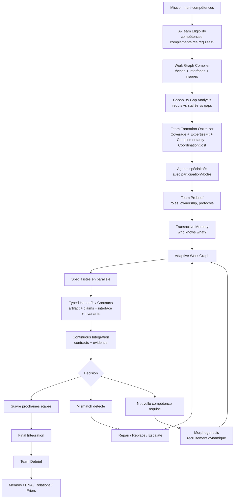
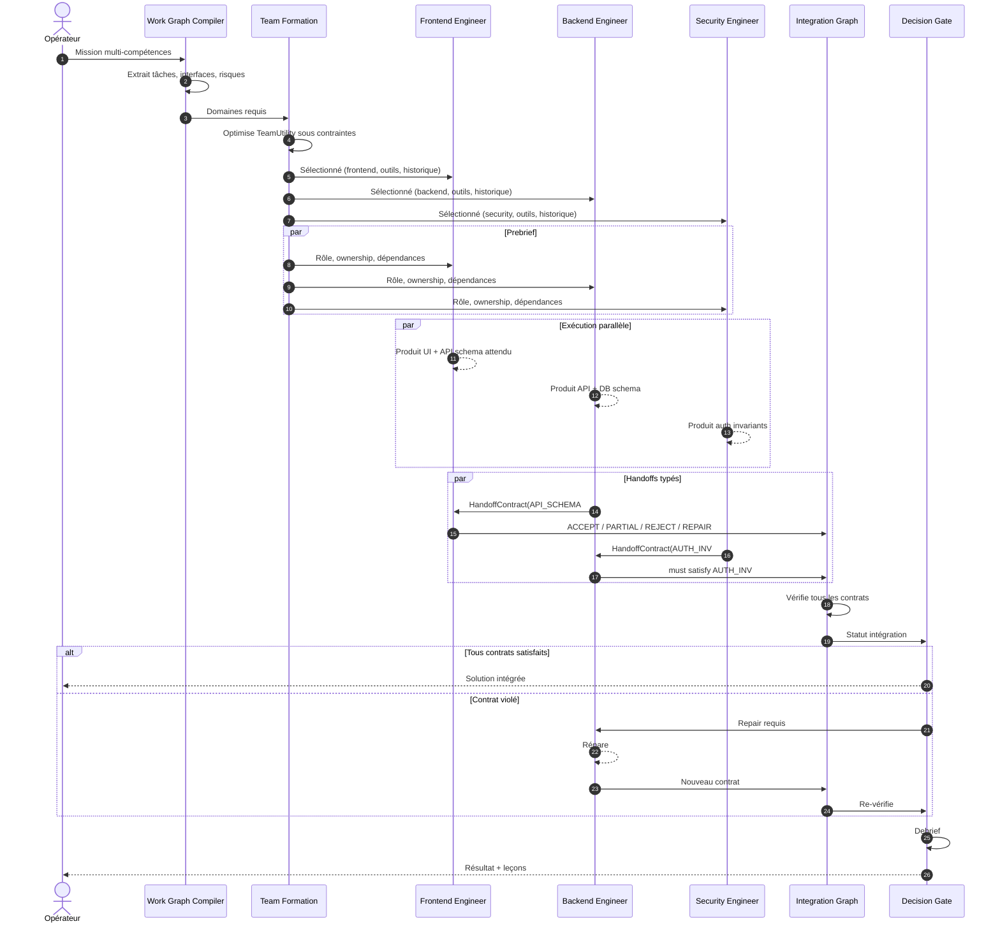
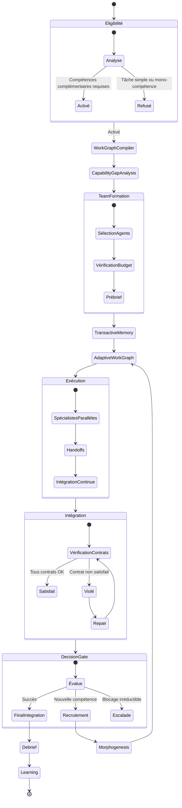

# A-Team : Organisation Adaptative du Travail Spécialisé

## 1. Principe fondamental

> **A-Team est le protocole de GenOS pour les problèmes dont la solution exige plusieurs compétences complémentaires, interdépendantes et non substituables, qui doivent produire ensemble un artefact cohérent.**

C'est la distinction fondamentale avec Trinity :

```text
Trinity
    plusieurs hypothèses concurrentes
    → laquelle résiste aux preuves ?

A-Team
    plusieurs expertises complémentaires
    → comment faire fonctionner leurs contributions ensemble ?
```

Une A-Team n'a donc pas pour objectif de trouver **le meilleur expert**. Elle doit fabriquer **une équipe qui soit meilleure que la somme de ses membres**.

La recherche sur les équipes humaines va exactement dans cette direction : performance collective ne signifie pas seulement avoir des experts, mais aussi clarifier les rôles, partager une compréhension de la mission, coordonner les dépendances et disposer de protocoles de communication adaptés. Les travaux sur les systèmes de mémoire transactive ajoutent une idée particulièrement importante : chacun n'a pas besoin de tout savoir, mais l'équipe doit savoir **qui sait quoi** ([APA][1]).

C'est très compatible avec le principe GenOS de **0 prompt inutile**.

---

## 2. Ce que l'implémentation actuelle fait déjà bien

`aTeamService.js`, `aTeamCoordinationService.js`, `aTeamStageScheduler.js`, `aTeamComparativeBarrier.js` et `aTeamIntegrationObserver.js` donnent déjà plusieurs fondations importantes.

| Mécanisme actuel | État |
|------------------|------|
| Détection de plusieurs domaines | réel |
| Rôles spécialisés | réel |
| Workspaces de workers isolés | réel |
| Dépendances et stages | réel |
| Ordonnancement déterministe | réel |
| Domaines non staffés exposés via `overflowDomains` | réel |
| Capability contract | réel |
| Tool leases | réel |
| 19 organisations possibles | présentes |
| Handoffs ligand/receptor | structurés mais pas runtime-driving |
| Evidence barrier | réel |
| Integration observer | réel mais faible |
| Pareto/Elo | réel mais mal appliqué conceptuellement |
| Adaptation dynamique de l'équipe | presque absente |

A-Team n'est pas décorative. Mais plusieurs mécanismes importants n'ont pas encore la sémantique qu'ils prétendent avoir.

---

## 3. Le problème conceptuel majeur : les spécialistes ne sont pas des candidats concurrents

Actuellement `aTeamComparativeBarrier.js` transforme les dossiers des spécialistes en candidats Arena puis cherche notamment un `kneePoint`.

Pour Trinity, comparer des mondes concurrents a du sens. Pour Frontend, Backend, Security, Database, cela n'en a quasiment aucun.

Le frontend n'est pas censé « battre » le backend. Le security engineer n'est pas un candidat alternatif au data engineer. Ce sont des **organes différents du même système**.

Donc `Pareto(frontend, backend, security)` est une mauvaise abstraction pour l'intégration générale.

Le bon problème est plutôt :

$$
\forall (i,j) \in E: Contract_{i\rightarrow j}\; satisfied?
$$

où $E$ représente les dépendances entre spécialistes.

La structure centrale d'A-Team ne devrait donc pas être une leaderboard. Elle devrait être un **Integration Contract Graph**.

---

## 4. L'autre problème majeur : le handoff n'est pas réellement un handoff

Le code actuel possède `buildHandoff()`, `evaluateHandoff()`, `handoffLigand()` avec ligand, receptor et concentration.

Mais `evaluateHandoff()` n'est utilisé que dans les tests et son service. Le runtime explicite `dispatch_team` transmet surtout `depends_on` et `pipeline_stage` au membre suivant. Il attend que les producteurs terminent puis lance le consommateur.

Il ne transmet pas réellement :
```text
artifact, claims, interface, assumptions, unresolved questions, evidence, required decisions
```
du producteur au consommateur.

C'est donc davantage « A finished → start B » que « A produced X → B validates X against receptor R → accept / reject / repair ».

Et le chemin autonome a un problème similaire : `workerEvidenceBarrierPipeline.js` construit bien un digest amont puis écrit ce digest dans `agents.current_task`, mais le worker est ensuite lancé avec l'objet worker et son `prompt` déjà construit. Il n'y a pas de mécanisme garantissant que le digest modifié devienne effectivement l'entrée de mission du worker.

Le « ligand » est donc actuellement surtout une **bonne abstraction non encore devenue physiologie runtime**.

---

## 5. Il y a aussi un bug de scheduler à corriger

`aTeamStageScheduler.runStagePlan()` fait :
```text
wait dependencies
↓
timeout ?
↓
oui → note timedOut
↓
lance quand même le consumer
```

Le test `test_ateam_stage_scheduler.js` exige même actuellement `assert.ok(blockedLaunches.includes('w-integ'))` après timeout.

Ce comportement est exactement opposé à une A-Team rigoureuse. Et une dépendance simplement `error`, `blocked` ou `unverified` est considérée terminale exactement comme `completed`.

Donc actuellement « Backend FAILED, Frontend COMPLETED → Integration starts » est possible.

La bonne condition doit être :
```text
dependency terminal
AND required deliverable exists
AND required evidence valid
AND handoff contract accepted
```
sinon `REPAIR / REPLACE / ESCALATE / REPLAN` mais jamais « continuer parce que le timeout a expiré ».

---

## 6. Le Quality Gate actuel donne une impression de couverture plus forte qu'elle ne l'est

Pour les missions techniques, `requiredCapabilities(selectedDomains)` est construit à partir des domaines sélectionnés. Puis chaque membre reçoit `capabilities: [domain]`.

La couverture devient donc presque tautologiquement :
```text
frontend required → frontend member supplies frontend
backend required → backend member supplies backend
```

Et les domaines dans `overflowDomains` ne participent pas au dénominateur. Une mission peut donc détecter 6 domaines, n'en staffer que 3, et afficher malgré tout une excellente couverture des **domaines qu'elle a choisi de compter**.

Il faut séparer :
```text
mission capability coverage
team staffed coverage
runtime capability availability
verified expertise coverage
```

Ce sont quatre métriques différentes.

---

## 7. Le détecteur de « contamination » est trop naïf

`aTeamIntegrationObserver.js` analyse le texte des claims avec les regex de détection de domaine.

Ainsi un frontend engineer déclarant « le frontend doit appeler l'API OAuth » peut mentionner un domaine étranger et être considéré comme contaminant. Mais dans une vraie équipe multidisciplinaire, connaître ses interfaces avec les autres domaines est précisément souhaitable.

La frontière correcte n'est pas « Tu ne dois jamais parler du domaine des autres » mais « Tu sais ce que les autres possèdes, mais tu ne revendiques pas leur responsabilité ou leur autorité sans coordination ».

Il faut donc passer d'un modèle `DOMAIN ISOLATION` à `OWNERSHIP + CONSULTATION + INTERFACE AUTHORITY`. Exemple :
```text
frontend:
    owns: UI components
    consumes: API schema
    consults: security
    may_propose: API changes
    may_not_commit: auth policy
```

---

## 8. A-Team ultime : le Work Graph

L'élément central devrait être un graphe de travail $G=(V,E)$ où chaque nœud $V_i$ représente une responsabilité spécialisée et chaque arête $E_{ij}$ un contrat de dépendance.

Exemple :
```text
                    Product
                      │
              ┌───────┴────────┐
              ▼                ▼
            UX/UI          Architecture
              │                │
              ▼                ▼
          Frontend ───────► Backend
                               │
                    ┌──────────┼─────────┐
                    ▼          ▼         ▼
                  Data      Security    Ops
                    │          │         │
                    └──────┬───┴─────────┘
                           ▼
                          QA
                           │
                           ▼
                     Integration
```

Ce graphe doit déterminer : qui travaille, qui attend, qui produit quoi, qui consomme quoi, qui doit être consulté, qui peut bloquer, quels artefacts doivent circuler.

A-Team devient alors beaucoup plus proche d'un **compilateur d'organisation**.

---

## 9. Team Formation : choisir les bons agents

Aujourd'hui A-Team choisit surtout `domain → role → modelTier`. L'implémentation ultime doit choisir un **agent réel** parmi les candidats.

On peut formaliser :
$$
TeamUtility(T) = Coverage(T) + \alpha ExpertiseFit + \beta Complementarity + \gamma HistoricalPerformance + \delta InterfaceCompatibility - \lambda CoordinationCost - \mu Redundancy - \rho Risk
$$
sous contraintes de Budget, Capacity, Tools, Dependencies, Deadlines.

L'agent `backend_engineer` idéal ne serait donc pas simplement « standard model + backend prompt » mais celui dont GenOS sait :
```text
expérience backend, outils disponibles, génome/capacités, cognitive recipe, historique sur tâches similaires, fiabilité, coût, compatibilité avec les agents voisins
```

DyLAN a déjà montré l'intérêt d'une sélection dynamique des agents plutôt qu'une équipe fixe, avec une phase explicite de team optimization avant la résolution ([arXiv][2]).

---

## 10. Le Transactive Memory System : cerveau social de A-Team

Chaque agent n'a pas besoin de connaître toutes les informations. Il doit connaître :
```text
what I know, what I own, what I don't know, who knows it, how to reach them, how trustworthy/recent that knowledge is
```

Exemple :
```text
Frontend worker
I own: React components, accessibility implementation
I know that: Backend owns API contracts, Security owns authentication invariants, Product owns acceptance criteria
I do NOT need: complete security reasoning, complete DB internals
```

Cela produit un **Knowledge Location Graph** :
```text
Need OAuth invariant → who knows? → security_worker_17 → request only relevant contract
```

Au lieu de recopier tout le contexte à tous les agents. C'est exactement l'une des idées des systèmes de mémoire transactive : performance par spécialisation combinée à la connaissance de « qui sait quoi » ([APA][3]).

---

## 11. Le handoff ultime doit devenir un contrat typé

Je remplacerais le simple ligand `handoff:backend->frontend` par un objet ressemblant à :
```text
HandoffContract
────────────────────────────
producer, consumer
artifactRefs, claims, assumptions
interfaceSchema, preconditions, postconditions, invariants
evidenceRefs
openQuestions, knownRisks
acceptanceCriteria
version, status
```

Le récepteur peut répondre : `ACCEPT / PARTIAL_ACCEPT / REJECT / REQUEST_REPAIR / REQUEST_CLARIFICATION`.

Le ligand/receptor biomimétique devient alors réellement utile :
```text
ligand      = typed offer / event
receptor    = consumer acceptance contract
binding     = compatibility verified
cascade     = downstream work allowed
```

C'est beaucoup plus biologique que simplement appeler un JSON « ligand ».

---

## 12. Les handoffs ne doivent pas transmettre tout

Les recherches sur les équipes montrent un problème connu : les groupes ont tendance à discuter beaucoup plus les informations déjà partagées que les informations uniques. Une méta-analyse sur 65 études de « hidden profiles » observe que les groupes mentionnaient beaucoup plus d'informations communes que d'informations uniques, et que la couverture des informations uniques était liée à la qualité de décision ([PubMed][4]).

A-Team devrait donc optimiser $Value(message) = Novelty \times Relevance \times DecisionImpact` et non `broadcast everything`.

Chaque message pourrait être classé : already known / new but irrelevant / new + relevant / critical contradiction / contract update. Seules les dernières catégories circulent.

Cela rejoint AgentPrune, qui a montré que l'élagage du graphe de communication pouvait fortement diminuer les tokens tout en conservant ou améliorant les performances ([arXiv][5]).

---

## 13. Une organisation modérément sparse est probablement préférable

GenOS possède déjà 19 organisations. Mais A-Team devrait arrêter de penser `A-Team organization = specialist_expert_committee` comme une organisation unique.

Les travaux récents sur les topologies multi-agents indiquent que la structure de communication change matériellement la propagation des bonnes et mauvaises informations, et qu'une connectivité modérément sparse peut être préférable à un graphe trop dense ou trop pauvre ([arXiv][6]).

Donc A-Team ultime devrait pouvoir faire :
```text
DISCOVERY           → specialist_expert_committee
IMPLEMENTATION      → dependency DAG
SECURITY SUBGRAPH   → red_blue_coevolution
INTEGRATION         → hierarchical_merge
LEARNING            → memory_compilation
```

Autrement dit : **une A-Team n'a pas une topologie de communication ; elle peut avoir une topologie différente par phase et même par sous-graphe.**

---

## 14. Les variantes utiles de A-Team

| Variante | Structure | Cas idéal |
|----------|-----------|-----------|
| **Expert Committee** | experts parallèles + intégrateur | audit, diagnostic multidomaine |
| **Pipeline** | A → B → C → D | artefact transformé étape par étape |
| **Project DAG** | graphe arbitraire de dépendances | logiciel, ingénierie, recherche |
| **Cross-Functional Pod** | petite équipe fortement couplée | feature produit complète |
| **Boundary-Spanner** | experts + agents d'interface | domaines avec interfaces difficiles |
| **Matrix Team** | rôles métier × expertises transverses | gros projet complexe |
| **Tiger Team** | équipe minimale créée autour d'un blocage | bug critique, incident localisé |
| **Incident Command** | commandement + fonctions spécialisées | panne, cyberincident, urgence |
| **Multiteam System** | plusieurs A-Teams coordonnées | projet trop grand pour une seule équipe |
| **Adaptive A-Team** | recrutement/libération/réaffectation dynamiques | mission longue et incertaine |
| **Relay Team** | transfert temporel d'un même artefact | travail long / environnements asynchrones |

La plus importante est probablement **Project DAG**, car elle généralise la majorité des autres.

---

## 15. Le plafond de trois spécialistes doit disparaître

Trois est un bon budget initial. Ce n'est pas une propriété d'une équipe multidisciplinaire.

Les travaux MacNet ont exploré des graphes de collaboration beaucoup plus grands et montrent que la structure du réseau est elle-même un facteur important de performance. La limite pertinente est la complexité de coordination, pas le chiffre trois ([arXiv][7]).

Je remplacerais `MAX_A_TEAM_MEMBERS = 3` par :
```text
maxTeamSize = function(budget, coordinationCapacity, taskGraph, communicationCost)
```

Exemples :
```text
mission simple multidomaine     → 3 agents
application complète            → 6 agents
gros projet                     → 3 sous-A-Teams de 4 agents
```

Le garage peut toujours imposer une limite physique. Ce n'est simplement plus une limite conceptuelle.

---

## 16. A-Team doit supporter des équipes de teams

Prenons « Crée toute une application mobile bancaire ». Une seule équipe frontend/backend/security serait insuffisante.

Une structure ultime :
```text
                     Program Orchestrator
                            │
        ┌───────────────────┼───────────────────┐
        ▼                   ▼                   ▼
    Product Team       Platform Team       Assurance Team
    ────────────       ─────────────       ──────────────
    UX                 Backend             Security
    Mobile             Data                QA
    Accessibility      Infra               Compliance
```

Chaque groupe est une A-Team locale. Les interfaces entre équipes deviennent elles-mêmes des contrats. C'est le modèle **Multiteam System**.

---

## 17. La spécialisation doit aussi être temporelle

Un security engineer ne doit pas nécessairement attendre la fin. Il peut avoir plusieurs modes :
```text
DESIGN CONSULTANT → CHECKPOINT REVIEWER → RED TEAM → FINAL GATE
```

Même agent, différents droits au cours de la mission.

Le code actuel déduit le statut de consommateur/reviewer depuis le nom du rôle (`/reviewer|observer|integration/`). Ainsi `security_reviewer` est automatiquement mis après les producteurs. Ce n'est pas toujours souhaitable — la sécurité doit parfois intervenir **avant** le backend pour définir les invariants.

Il faut remplacer cette inférence par :
```text
participationMode: producer | consultant | reviewer | integrator | verifier | decision_owner
```
et permettre plusieurs modes au fil des phases.

---

## 18. A-Team doit savoir créer des Boundary Spanners

Certaines erreurs apparaissent précisément entre deux disciplines : Frontend ↔ Backend, Backend ↔ Data, Backend ↔ Security, ML ↔ Product, Research ↔ Engineering.

Un spécialiste de chaque côté peut être excellent et produire néanmoins une mauvaise interface. Il peut donc être rentable de créer un agent temporaire :
```text
API contract integrator
security/backend boundary reviewer
```
qui ne possède aucun domaine complet. Son domaine est **l'interface**. C'est une capacité qui manque beaucoup aux architectures multi-agents centrées uniquement sur les rôles.

---

## 19. L'intégration doit être continue, pas finale

Aujourd'hui la logique ressemble encore trop à « specialists work → all finish → integration ». Pour un travail complexe, il faut :
```text
produce → integrate → detect mismatch → repair locally → continue
```

Exemple :
```text
Backend publishes API Contract v1
        ↓
Frontend receptor validates
        ↓
REJECT: missing pagination metadata
        ↓
Backend repairs
        ↓
API Contract v2
        ↓
ACCEPT
```

On évite ainsi de découvrir tout à la fin que les différentes branches sont incompatibles.

---

## 20. Le véritable Integration Graph

Une A-Team ultime pourrait maintenir :
```text
Frontend
 ├── consumes API_SCHEMA#12      ✓
 ├── consumes AUTH_POLICY#4     ✓
 └── exports UI_EVENTS#8        ✓

Backend
 ├── consumes DATA_SCHEMA#7     ✓
 ├── exports API_SCHEMA#12      ✓
 └── must satisfy AUTH_INV#17   ✗

Security
 └── owns AUTH_INV#17

Data
 └── exports DATA_SCHEMA#7
```

À cet instant :
```text
Team status = BLOCKED
Reason = backend violates AUTH_INV#17
```

Pas besoin d'un LLM intégrateur pour deviner que quelque chose va mal. C'est un système de **contracts + evidence**.

---

## 21. Le Pareto reste utile, mais ailleurs

Il ne faut pas supprimer Arena/Pareto. Il faut l'appliquer au bon niveau :
```text
3 database implementations → Pareto
3 API designs → Pareto
3 deployment strategies → Pareto
```

Puis la branche Data ou Backend transmet la solution retenue à l'équipe. Pareto peut également gérer cost, latency, robustness, maintainability au niveau d'une décision commune.

Mais pas `frontend vs backend vs security`.

---

## 22. L'équipe doit recruter lorsque le problème change

Imagine : Frontend + Backend + Data travaillent. Le backend découvre « OAuth multi-tenant is much harder than expected ».

Aujourd'hui cela devient surtout une contrainte/escalade. A-Team ultime doit pouvoir :
```text
detect capability gap → search expertise graph → recruit security specialist → recompute dependency graph → adjust budget → continue
```

Puis libérer cet agent quand son rôle n'est plus utile.

AgentVerse explore déjà la composition dynamique de groupes et DyLAN la sélection dynamique d'agents ; A-Team peut aller plus loin en liant le recrutement à son graphe de capacités, son ADN, sa mémoire et Morphogenesis ([arXiv][8]).

---

## 23. Le failure recovery doit être organisationnel

Si le spécialiste Data échoue, ne pas nécessairement tuer la mission. A-Team doit demander :
```text
Is Data on critical path?
Is another member capable of temporary coverage?
Is replacement available?
Can work continue without this deliverable?
```

Puis : replace specialist / reassign responsibility / split domain / defer branch / block mission. Cela ressemble davantage à une vraie équipe résiliente.

---

## 24. Le biomimétisme peut devenir beaucoup plus profond

Le meilleur analogue biologique n'est pas « on appelle le message ligand ». Ce sont les mécanismes derrière.

| Mécanisme naturel | Traduction utile |
|-------------------|------------------|
| différenciation cellulaire | agents spécialisés exprimant des capacités différentes |
| ligand/récepteur | communication uniquement vers agents capables/intéressés |
| tissus | groupes de fonctions fortement couplées |
| membranes | frontières de responsabilité/interface |
| jonctions cellulaires | contrats directs entre voisins |
| système nerveux | signaux rapides et critiques |
| hormones | broadcast rares et globaux |
| système immunitaire | validation des outputs à risque |
| cicatrisation | recrutement/reconfiguration après panne |
| apoptose | retrait d'un membre nuisible/inutile |
| homéostasie | régulation charge/budget/capacité |

La règle biomimétique devient : **Communication sélective, différenciation fonctionnelle et adaptation structurelle.** Pas nomenclature biologique.

---

## 25. Les communications devraient avoir plusieurs vitesses

```text
fast path     → interface changed, test failed, security invariant broken
slow path     → architecture rationale, lessons learned, long-term memory
broadcast     → mission objective changed
unicast       → API schema changed for frontend
multicast     → authentication contract changed → frontend + backend + security
```

Cela exploite directement le système de communication GenOS déjà développé.

---

## 26. Prébrief et debrief doivent devenir obligatoires

La science des équipes humaines apporte ici quelque chose de très concret.

Avant exécution, **TEAM PREBRIEF** doit établir :
```text
goal, success criteria, roles, ownership, dependencies, communication protocol, decision authority, expected risks
```

Après mission, **TEAM DEBRIEF** doit enregistrer :
```text
what worked, what failed, bad handoffs, wrong staffing, missing expertise, communication waste, unexpected expertise
```

Une méta-analyse de 46 échantillons a trouvé une amélioration moyenne substantielle des performances avec des debriefs structurés, autour de 20–25 % par rapport aux contrôles ([PubMed][9]).

Pour GenOS, cela peut directement alimenter Agent memory, AgentDNA, relationship history, team formation priors, communication policies.

---

## 27. Les cas d'utilisation où A-Team est vraiment naturelle

| Mission | Composition possible |
|---------|----------------------|
| Feature full-stack | Product + Frontend + Backend + Data + QA |
| Authentification complexe | Backend + Security + Data + QA |
| Incident production | Incident lead + Ops + Backend + Data + Security |
| Migration majeure | Data + Backend + Ops + QA |
| Projet IA | ML/AI + Data + Backend + Product + Evaluation |
| Recherche scientifique appliquée | Researcher + Statistician + Engineer + Reviewer |
| Architecture complexe | Architect + Domain specialists + Security + Operations |
| Application mobile | Mobile + Backend + UX + Data + QA |
| Création narrative | Author + Dramaturg + Critic |
| Benchmark GenOS | Research + Experiment design + Implementation + Statistics |
| Optimisation mathématique industrialisée | Mathematician + Solver engineer + Software engineer + Verifier |

La condition générale est $Solution = f(Specialty_1,\ldots,Specialty_n)$ où aucune spécialité seule ne suffit.

---

## 28. Quand A-Team ne doit pas être utilisée

| Forme du problème | Topologie plus naturelle |
|-------------------|--------------------------|
| une seule tâche simple | direct |
| plusieurs solutions concurrentes | Trinity |
| agents partageant un état extrêmement couplé | Syncytium |
| décision communautaire/consensus | Biocénose |
| exploration sans structure prédéfinie | Rhizome |
| populations + environnement + ressources | Biome |
| noyau + extensions symbiotiques | Holobionte |
| populations semi-autonomes résilientes | Métapopulation |

Le test mental :
> **Ai-je besoin de plusieurs façons de résoudre la même chose ? → Trinity.**
> **Ai-je besoin de plusieurs compétences différentes pour construire la même chose ? → A-Team.**

---

## 29. Comparaison avec les architectures de recherche

MetaGPT a montré l'intérêt de transformer des workflows humains en SOP et rôles spécialisés, dans une logique d'assembly line ([arXiv][10]).

Magentic-One utilise un orchestrateur qui planifie, suit l'avancement et replanifie, avec plusieurs agents spécialisés ([arXiv][11]).

DyLAN pousse davantage la sélection dynamique des agents ([arXiv][2]).

MacNet explore le problème comme un graphe de collaboration et montre l'intérêt de topologies non triviales ([ICLR Proceedings][12]).

AgentPrune attaque l'autre extrême : trop de communication est coûteux et peut propager de mauvaises informations ([arXiv][5]).

L'A-Team ultime de GenOS devrait réunir ces dimensions mais ajouter :
```text
persistent specialist identities
+ capability/genome-based staffing
+ transactive memory
+ typed ownership
+ typed producer/consumer contracts
+ selective communication
+ continuous integration
+ dynamic organizational topology
+ adaptive recruitment
+ team-of-teams
+ evidence before handoff
+ Morphogenesis
+ team learning across missions
```

---

## 30. Architecture ultime

```text
                         MISSION
                            │
                            ▼
                    [A-Team Eligibility]
                 complementary skills needed?
                            │
                            ▼
                    [Work Graph Compiler]
                   tasks + interfaces + risks
                            │
                            ▼
                  [Capability Gap Analysis]
                            │
                            ▼
                  [Team Formation Optimizer]
               ┌────────────┼──────────────┐
               ▼            ▼              ▼
            agent A       agent B        agent C...
               │            │              │
               └────── Team Prebrief ──────┘
                            │
                            ▼
                   [Transactive Memory]
                     "who knows what?"
                            │
                            ▼
                   [Adaptive Work Graph]
                            │
          ┌─────────────────┼──────────────────┐
          ▼                 ▼                  ▼
       specialist       specialist         specialist
          │                 │                  │
          └────── typed handoffs/contracts ────┘
                            │
                            ▼
                 [Continuous Integration]
                   contracts + evidence
                            │
              mismatch ─────┼───── success
                  │         │
                  ▼         ▼
             repair /       next stages
             recruit
                  │
                  ▼
                 [Morphogenesis]
                            │
                            ▼
                    FINAL INTEGRATION
                            │
                            ▼
                       TEAM DEBRIEF
                            │
                            ▼
              Memory / DNA / Relations / Priors
```

---

## 31. Ce qui pourrait réellement rendre A-Team exceptionnelle

Le différenciateur ne serait pas « GenOS dispose de spécialistes ». C'est désormais courant.

Le vrai différenciateur serait qu'A-Team devienne capable de répondre en continu à sept questions :
```text
WHO should be in this team?
WHAT exactly does each member own?
WHO needs WHAT from whom?
WHEN is that information needed?
HOW should it be communicated?
IS the produced interface actually compatible?
SHOULD the organization change now?
```

Et surtout qu'elle puisse **modifier ses réponses pendant la mission**.

À ce stade, A-Team ne serait plus un pattern de prompts. Ce serait véritablement **le système d'organisation adaptative de GenOS : une équipe capable de se composer, se spécialiser, communiquer sélectivement, intégrer son travail, se réparer et apprendre à mieux travailler ensemble.**

A-Team ultime ne doit pas être organisée autour d'une « fusion des réponses », mais autour de la fabrication vérifiable d'un système de contributions compatibles.

---

## 32. Contrat runtime

### ATeamMission

```typescript
ATeamMission {
    missionId
    missionSnapshotHash
    domain
    variant  // expert_committee | pipeline | project_dag | cross_functional_pod | boundary_spanner | matrix_team | tiger_team | incident_command | multiteam_system | adaptive | relay_team
    workGraph
    capabilityGapAnalysis
    teamFormation
    transactiveMemory
    prebrief
    debrief
    status
    decision
}
```

### ATeamMember

```typescript
ATeamMember {
    memberId
    subSystem
    role
    model
    provider
    cognitiveRecipe
    capabilities
    ownedDomain
    consumedInterfaces
    consultedAgents
    participationModes  // producer | consultant | reviewer | integrator | verifier | decision_owner
    tokenBudget
    workspaceSnapshot
    handoffContracts
    evidenceDossier
    claimGraph
}
```

### HandoffContract

```typescript
HandoffContract {
    contractId
    producerId
    consumerId
    artifactRefs
    claims
    assumptions
    interfaceSchema
    preconditions
    postconditions
    invariants
    evidenceRefs
    openQuestions
    knownRisks
    acceptanceCriteria
    version
    status  // pending | accepted | partial_accept | reject | request_repair | request_clarification
}
```

---

## 33. Architecture du système (fichiers)

| Fichier | Rôle |
|---------|------|
| `backend/src/services/aTeamService.js` | Analyse de mission, détection de domaines, composition de l'équipe |
| `backend/src/services/aTeamCoordinationService.js` | Coordination (organisation, contrat de capacités, handoffs) |
| `backend/src/services/aTeamComparativeBarrier.js` | Arbitrage d'intégration (Pareto/Elo), `canMerge` et métriques |
| `backend/src/services/aTeamIntegrationObserver.js` | Observateur impartial (contamination, contraintes d'intégration) |
| `backend/src/services/aTeamStageScheduler.js` | Ordonnancement bloquant des étages |
| `backend/src/services/aTeamDispatchService.js` | Lancement de l'étage 0 et détachement du runner |
| `backend/src/services/agentAutonomyPlanService.js` | Activation conditionnelle selon budget et recommandation |
| `backend/src/services/agentFleetService.js` | Création des workers multidisciplinaires |
| `backend/src/services/agentOrchestrationState.js` | État partagé, barrières d'évidence |
| `backend/src/services/workerGarageService.js` | Gestion des slots de workers |

---

## 34. Télémétrie et observabilités

Nouvelles métriques enregistrées pour chaque mission A-Team :

```text
missionId, variant
workGraph: { nodes, edges, contracts }
capabilityGapAnalysis: { required, staffed, gaps }
teamFormation: { agents, expertiseFit, complementarity, coordinationCost }
transactiveMemory: { knowledgeLocations, queries, hits }
prebrief: { goal, roles, dependencies, protocol }
handoffs: { total, accepted, rejected, repaired, avgLatency }
integrationGraph: { contracts, satisfied, violated, blocked }
continuousIntegration: { cycles, mismatches, repairs, recruits }
debrief: { worked, failed, badHandoffs, missingExpertise, communicationWaste }
learningFeedback: { teamFormationPriors, communicationPolicies }
```

---

## 35. Moniteur TUI natif (`genos run --mode ateam --monitor`)

```text
backend/src/services/aTeamMonitorServer.js
  ↓ NDJSON TCP 127.0.0.1:4591
genos-tui (crates/genos-cli/src/commands/ateam_tui/)
  ├── live.rs      : client TCP, reconnexion automatique
  ├── model.rs     : applique snapshot / log / barrier / handoff
  └── view.rs      : rend Work Graph + panneau Integration Contracts
```

Protocole NDJSON :

```json
{"type":"snapshot", missionId, prompt, workGraph:[...], integration:{status, contracts:[...]}}
{"type":"log", missionId, memberId, line, severity, timestamp}
{"type":"handoff", missionId, contractId, producer, consumer, status}
{"type":"integration", missionId, status, violated:[...], blocked:[...]}
{"type":"decision", missionId, decision, reasoning}
```

Commande :

```bash
genos run --mode ateam --monitor
genos run --mode ateam --monitor --mission-id ateam_1234567890_ab12
```

---

## 36. Références internes

- [ORCHESTRATION.md](../orchestration.md) : orchestration générale, gates et phases
- [TRINITY.md](trinity.md) : orchestration comparative par hypothèses
- [RUNTIME_AGENTIQUE.md](../../01-concepts/runtime-agentique.md) : runtime des agents autonomes
- [PRIMITIVES_EXECUTABLES.md](../primitives-executables.md) : outils d'exécution et isolation
- [TOPOLOGIES_ET_CAPACITES.md](../topologies-et-capacites.md) : capacités A-Team dans v3
- [aTeamService.js](../../../backend/src/services/aTeamService.js) : implémentation analyse
- [aTeamCoordinationService.js](../../../backend/src/services/aTeamCoordinationService.js) : coordination
- [aTeamComparativeBarrier.js](../../../backend/src/services/aTeamComparativeBarrier.js) : arbitrage
- [aTeamIntegrationObserver.js](../../../backend/src/services/aTeamIntegrationObserver.js) : observateur
- [aTeamStageScheduler.js](../../../backend/src/services/aTeamStageScheduler.js) : ordonnancement
- [aTeamDispatchService.js](../../../backend/src/services/aTeamDispatchService.js) : déploiement
- [agentAutonomyPlanService.js](../../../backend/src/services/agentAutonomyPlanService.js) : activation
- Tests : [backend/tests/test_ateam_stage_scheduler.js](../../../backend/tests/test_ateam_stage_scheduler.js)

---

## 37. Références externes

| Référence | Apport pour A-Team |
|-----------|---------------------|
| [APA, Salas — Teamwork](https://www.apa.org/news/podcasts/speaking-of-psychology/teamwork) | Les 7 Cs de l'équipe efficace : capability, cooperation, coordination, cognition, communication, coaching, conditions |
| [DyLAN, Liu 2023](https://arxiv.org/abs/2310.02170) | Sélection dynamique des agents, team optimization avant résolution |
| [APA, Fisher 2015 — Transactive Memory](https://www.apa.org/pubs/highlights/spotlight/issue-39) | Systèmes de mémoire transactive : « qui sait quoi » |
| [PubMed, Hidden Profiles](https://pubmed.ncbi.nlm.nih.gov/21896790/) | Groupes discutent plus les infos communes que les infos uniques |
| [AgentPrune, Zhang 2024](https://arxiv.org/abs/2410.02506) | Élagage du graphe de communication : −72.8% tokens, performances conservées |
| [Shen 2025, Communication Topologies](https://arxiv.org/abs/2505.23352) | Connectivité modérément sparse préférable à dense/pauvre |
| [MacNet, Qian 2024](https://arxiv.org/abs/2406.07155) | Graphe de collaboration multi-agent, scaling law collaborative |
| [AgentVerse, Chen 2023](https://arxiv.org/abs/2308.10848) | Composition dynamique de groupes, comportements émergents |
| [PubMed, Debriefs Meta-Analysis](https://pubmed.ncbi.nlm.nih.gov/23516804/) | Debriefs structurés → +20–25% performance |
| [MetaGPT, Hong 2023](https://arxiv.org/abs/2308.00352) | SOP et rôles spécialisés en assembly line |
| [Magentic-One, Fourney 2024](https://arxiv.org/abs/2411.04468) | Orchestrateur planifie/suit/replanifie avec agents spécialisés |
| [ICLR, MacNet Proceedings](https://proceedings.iclr.cc/paper_files/paper/2025/hash/66a026c0d17040889b50f0dfa650e5e0-Abstract-Conference.html) | Topologies non triviales, collaborative emergence |

---

## 38. Implementation & capacités (GenOS v3)

Depuis la v3, cette topologie est câblée au runtime :

- Service de coordination : `aTeamCoordinationService.js + aTeamService.js`.
- Capacités requises : `EVIDENCE_BARRIER`, `EPISTEMICS_BARRIER`, `ARENA_COMPETITION`, `PROMOTION_GATE`, `INTEGRATION_CONTRACT_GRAPH`, `TRANSACTIVE_MEMORY`, `ADAPTIVE_WORK_GRAPH`.
- Contrat exposé par `topologyCapabilityService` et rendu effectif dans les leases d'outils.

---

*Schémas d'architecture*

### Architecture A-Team ultime



### Séquence A-Team avec Handoffs Typés



### Machine à états A-Team


