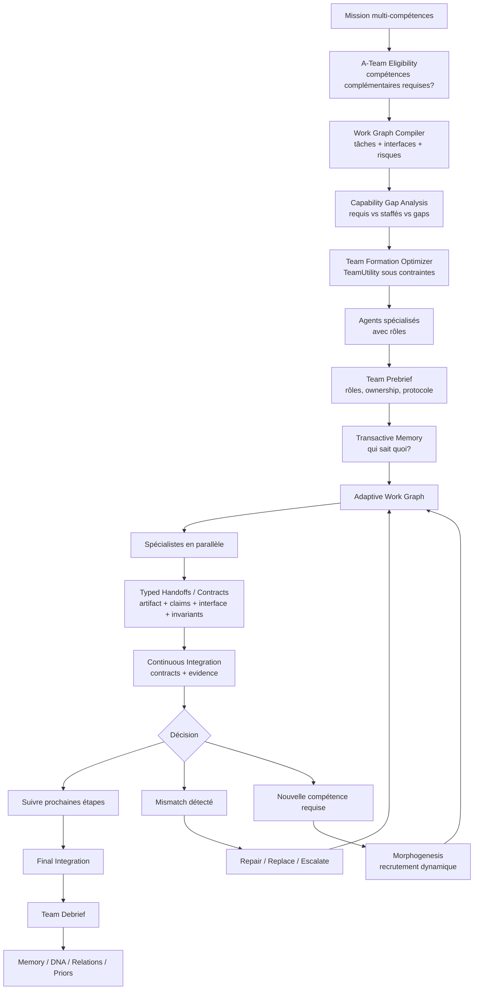
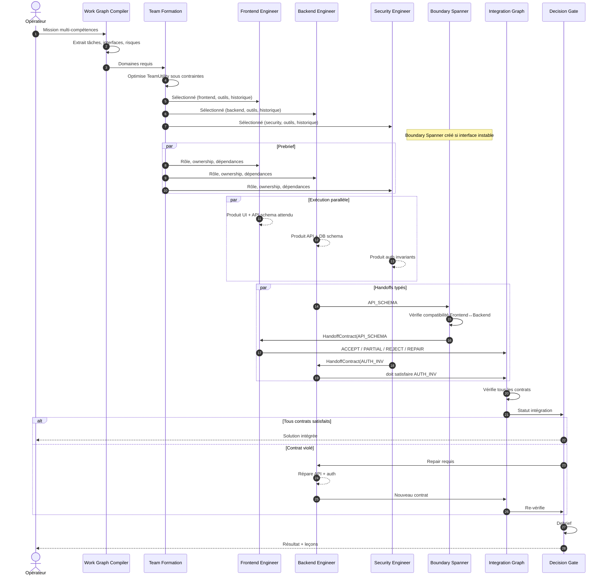
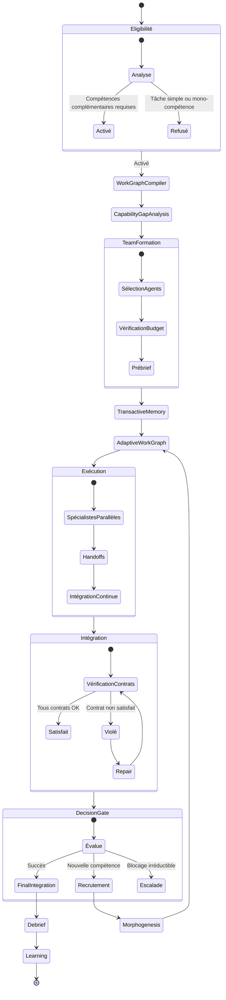
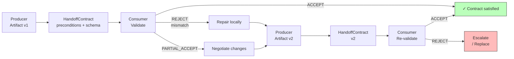
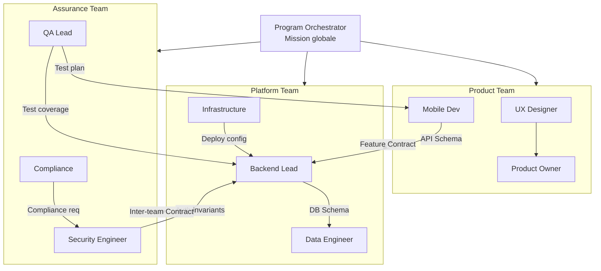

# A-Team : Organisation Adaptative du Travail Spécialisé

## 1. Définition

A-Team dans GenOS est le mécanisme d'orchestration qui exécute une mission comme un **collectif de spécialistes organisés selon un graphe de travail, où chaque nœud est une responsabilité irremplaçable et chaque arête est un contrat de dépendance vérifiable**. Contrairement aux autres topologies (Trinity = hypothèses concurrentes, Syncytium = état fusionné, Biocénose = consensus communautaire, Holobionte = hiérarchie intégrée), A-Team impose une **décomposition du travail en domaines non-substituables reliés par des contrats typés**.

Le nom "A-Team" provient de la recherche sur les équipes adaptatives : une équipe A-Team n'est pas un ensemble de généralistes interchangeables, mais une configuration dynamique d'experts dont la valeur collective dépasse la somme des contributions individuelles. La performance d'une A-Team ne se mesure pas à la qualité de ses membres pris isolément, mais à l'efficacité de leurs interactions.

Les quatre principes d'A-Team sont :

1. **Work Graph** : le travail est structuré comme un graphe orienté acyclique $G=(V,E)$ où chaque sommet $V_i$ est une responsabilité spécialisée et chaque arête $E_{ij}$ est un contrat de dépendance ;
2. **Transactive Memory** : l'équipe maintient un graphe de localisation des connaissances — chaque agent sait ce qu'il possède, ce qu'il ne sait pas, et qui sait ce dont il a besoin ;
3. **Typed Handoffs** : les artefacts circulent entre spécialistes via des contrats explicites producteur→consommateur avec critères d'acceptation vérifiables ;
4. **Continuous Integration** : l'intégration n'est pas finale mais continue — produire, intégrer, détecter les incompatibilités, réparer localement, continuer.

Le cœur fonctionnel est réparti entre :

- [backend/src/services/aTeamService.js](../../../backend/src/services/aTeamService.js) : analyse de mission, détection de domaines, composition de l'équipe.
- [backend/src/services/aTeamCoordinationService.js](../../../backend/src/services/aTeamCoordinationService.js) : coordination organisationnelle, contrats de capacités, handoffs typés.
- [backend/src/services/aTeamStageScheduler.js](../../../backend/src/services/aTeamStageScheduler.js) : ordonnancement des étages selon dépendances.
- [backend/src/services/aTeamComparativeBarrier.js](../../../backend/src/services/aTeamComparativeBarrier.js) : barrière d'intégration et métriques multidimensionnelles.
- [backend/src/services/aTeamIntegrationObserver.js](../../../backend/src/services/aTeamIntegrationObserver.js) : observateur d'intégration (compatibilité des contrats).

Le principe fondamental : une équipe de spécialistes organisée selon un graphe de travail avec contrats vérifiables produit un résultat plus cohérent qu'une équipe de généralistes sans structure de dépendances.

---

## 2. Définition de l'organisation par spécialisation contractuelle

GenOS applique une logique de spécialisation explicite :

1. **Domaines non-substituables** : chaque domaine de connaissance est une responsabilité distincte ;
2. **Contrats de dépendance** : les interactions entre domaines suivent des protocoles vérifiables ;
3. **Allocation source-sink** : les ressources sont allouées selon la valeur marginale, le gain informationnel et la criticité de chaque nœud ;
4. **Intégration continue** : les artefacts sont intégrés et validés à chaque étape, non à la fin ;
5. **Mémoire transactive** : chaque agent sait qui possède l'information dont il a besoin.

Les mécanismes de coordination sont explicites :

- **graphe de travail** : la structure de dépendance détermine qui produit quoi et qui consomme quoi ;
- **contrats typés** : chaque handoff est un objet structuré avec preconditions, postconditions et critères d'acceptation ;
- **barrière d'intégration** : aucun livrable n'est considéré comme intégré tant que ses contrats ne sont pas satisfaits ;
- **allocation adaptative** : l'équipe recrute, libère ou réaffecte dynamiquement selon les besoins ;
- **prébrief/debrief** : toute mission A-Team commence par un accord explicite et finit par un retour d'expérience structuré.

---

## 3. Définition mathématique de l'organisation spécialisée

L'organisation A-Team est un problème de **formation optimale d'équipe sous contraintes de dépendances contractuelles**.

### 3.1 Le Work Graph

Soit $G = (V, E)$ un graphe orienté représentant le travail à accomplir :

- $V = \{V_1, V_2, \ldots, V_n\}$ : ensemble de responsabilités spécialisées ;
- $E = \{E_{ij} \mid i, j \in V\}$ : ensemble des dépendances contractuelles ;
- Chaque $V_i$ possède un domaine $D_i$, un ensemble de capacités requises $C_i$, et un artefact de sortie $A_i$ ;
- Chaque $E_{ij}$ est un contrat $H_{ij}$ spécifiant les conditions sous lesquelles $V_j$ peut consommer $A_i$.

Un travail $V_i$ est **prêt** quand :

$$
\text{ready}(V_i) = \forall j : (V_j, V_i) \in E \implies \text{status}(V_j) = \text{COMPLETED} \land \text{accepted}(H_{ji})
$$

Un travail $V_i$ est **bloqué** quand :

$$
\text{blocked}(V_i) = \exists j : (V_j, V_i) \in E \land \left(\text{status}(V_j) = \text{FAILED} \lor \text{status}(H_{ji}) = \text{REJECTED}\right)
$$

Le graphe est **exécutable** quand :

$$
\forall V_i \in V : \text{reachable}(V_i) \implies \text{has\_agent}(V_i) \land \text{budget\_sufficient}(V_i)
$$

### 3.2 TeamUtility : Fonction d'utilité de l'équipe

L'utilité d'une équipe $T$ affectée à un graphe $G$ est définie par :

$$
\text{TeamUtility}(T) = \text{Coverage}(T) + \alpha\,\text{ExpertiseFit} + \beta\,\text{Complementarity} + \gamma\,\text{HistoricalPerformance} + \delta\,\text{InterfaceCompatibility} - \lambda\,\text{CoordinationCost} - \mu\,\text{Redundancy} - \rho\,\text{Risk}
$$

où :

- **Coverage** = $\frac{|V_{\text{staffed}}|}{|V|}$ : proportion de responsabilités effectivement couvertes ;
- **ExpertiseFit** = $\frac{1}{|V|} \sum_{i \in V} \text{sim}(\text{expertise}(T_i), \text{required}(V_i))$ : adéquation entre les capacités des agents assignés et les besoins des responsabilités ;
- **Complementarity** = $\frac{1}{|E|} \sum_{(i,j) \in E} \text{compat}(T_i, T_j)$ : compatibilité des interfaces entre agents adjacents ;
- **HistoricalPerformance** = $\frac{1}{|V|} \sum_{i \in V} \text{perf\_history}(T_i, \text{task\_type}(V_i))$ : performance historique des agents sur des tâches similaires ;
- **InterfaceCompatibility** = $\frac{1}{|E|} \sum_{(i,j) \in E} \text{schema\_match}(\text{output}(T_i), \text{input}(T_j))$ : degré de correspondance des schémas d'interface ;
- **CoordinationCost** = $\frac{|E| \cdot c_{\text{coord}}}{\text{budget}}$ : coût total de coordination normalisé par le budget ;
- **Redundancy** = $\frac{1}{|V|} \sum_{i \in V} \max(0, \text{overlap}(T_i, T_{i'}))$ : pénalité pour capacités redondantes entre agents adjacents ;
- **Risk** = $\frac{1}{|V|} \sum_{i \in V} \text{failure\_probability}(T_i) \cdot \text{criticality}(V_i)$ : risque pondéré par la criticité du nœud.

Les coefficients $\alpha, \beta, \gamma, \delta, \lambda, \mu, \rho$ sont des poids normalisés dont la somme vaut 1 et qui s'ajustent selon la variante d'organisation choisie.

### 3.3 HandoffValue : Valeur d'un transfert

La valeur d'un transfert entre producteur et consommateur est définie par :

$$
\text{HandoffValue} = \text{Novelty} \times \text{Relevance} \times \text{DecisionImpact}
$$

où :

- **Novelty** $\in [0, 1]$ : proportion d'information nouvelle par rapport à la connaissance déjà partagée du consommateur ;
- **Relevance** $\in [0, 1]$ : pertinence de l'information pour la tâche en cours du consommateur ;
- **DecisionImpact** $\in [0, 1]$ : impact sur les décisions que le consommateur doit prendre.

Un message est classifié selon cinq catégories :

$$
\text{Category}(m) = \begin{cases}
\text{ALREADY\_KNOWN} & \text{si } \text{Novelty} < 0.1 \\
\text{NEW\_IRRELEVANT} & \text{si } \text{Novelty} \geq 0.1 \land \text{Relevance} < 0.3 \\
\text{NEW\_RELEVANT} & \text{si } \text{Novelty} \geq 0.1 \land \text{Relevance} \geq 0.3 \\
\text{CRITICAL\_CONTRADICTION} & \text{si } m \text{ contredit un invariant actif} \\
\text{CONTRACT\_UPDATE} & \text{si } m \text{ modifie un contrat en vigueur}
\end{cases}
$$

Seules les catégories NEW_RELEVANT, CRITICAL_CONTRADICTION et CONTRACT_UPDATE sont transmises, minimisant le bruit informationnel.

### 3.4 Transactive Memory System : Graphe de Localisation des Connaissances

Le système de mémoire transactive maintient un graphe $K = (N, R)$ où :

- $N = \{N_1, \ldots, N_n\}$ : agents de l'équipe ;
- $R = \{R_{ij} \mid i, j \in N\}$ : relations de connaissance "l'agent $i$ sait que l'agent $j$ possède la connaissance $k$" ;

Chaque relation $R_{ij}$ porte un **niveau de confiance** $\tau_{ij} \in [0, 1]$ et une **fraîcheur** $\phi_{ij} \in [0, 1]$.

La requête d'information est résolue par :

$$
\text{who\_knows}(q) = \arg\max_{j \in N} \left( \text{possesses}(j, q) \cdot \tau_{ij} \cdot \phi_{ij} \right)
$$

où $\text{possesses}(j, q)$ est une fonction binaire indiquant si l'agent $j$ possède la connaissance $q$.

La fraîcheur décroît exponentiellement :

$$
\phi_{ij}(t) = \phi_{ij}(t_0) \cdot e^{-\lambda (t - t_0)}
$$

et est mise à jour à chaque interaction réussie.

### 3.5 Source-Sink Allocation : Allocation optimale des ressources

L'allocation des ressources computationnelles (budget, slots, outils) suit un modèle source-sink. Pour chaque nœud $V_i$, un poids de demande est calculé :

$$
w_i = \text{demand}_i \times \text{priority}_i
$$

où :

- $\text{demand}_i$ : travail estimé (en tokens ou secondes) requis par $V_i$ ;
- $\text{priority}_i$ : priorité stratégique de $V_i$ dans la mission.

L'allocation proportionnelle est définie par :

$$
\text{Allocation}_i \propto \frac{\text{MarginalValue}_i \times \text{InformationGain}_i \times \text{Criticality}_i}{\text{Cost}_i \times \text{Pressure}_i \times \text{Redundancy}_i}
$$

où :

- **MarginalValue** = amélioration de la qualité du résultat apportée par une unité supplémentaire de ressource sur $V_i$ ;
- **InformationGain** = réduction d'incertitude attendue sur les décisions en aval ;
- **Criticality** = proportion du chemin critique couverte par $V_i$ ;
- **Cost** = coût computationnel par unité de ressource ;
- **Pressure** = charge actuelle du nœud (file d'attente, backlog) ;
- **Redundancy** = nombre de nœuds capables de couvrir le même sous-problème.

La normalisation garantit :

$$
\sum_i \text{Allocation}_i \leq \text{Budget}_{\text{total}}
$$

---

## 4. Les rôles et hypothèses

A-Team organise toujours ses membres selon cinq dimensions de participation :

### 4.1 Producer (Producteur)

```
Role: producer
ModelTier: variable
Responsibility: Domain Artifact Generation
```

**Hypothèse :**
> "Generate a specialized artifact that satisfies the interface contract for downstream consumers."

**Mission assignée :**
```
A-Team mission: [shared mission]
Collective principle: A collective of specialists organized by a work graph, each node an irreplaceable responsibility.
Role hypothesis: Generate a specialized artifact that satisfies the interface contract for downstream consumers.

Your task (producer):
1. Execute your specialized domain work within the defined scope
2. Produce the artifact specified by your node's contract
3. Document claims, assumptions, and interface schema
4. Publish the artifact as a typed HandoffContract
5. Respond to repair requests from consumers
6. Update the integration graph with your deliverable status

Return: Domain artifact, HandoffContract, claims log, interface schema
```

**Rôle dans l'A-Team :**
- Exécute le travail de spécialité dans son domaine
- Produit l'artefact attendu avec schéma d'interface
- Publie le HandoffContract vers les consommateurs en aval
- Répond aux demandes de réparation ou clarification
- Met à jour le graphe d'intégration

### 4.2 Consultant (Consultant)

```
Role: consultant
ModelTier: standard
Responsibility: Cross-Domain Advisory
```

**Hypothèse :**
> "Provide specialized knowledge to other agents without owning the downstream decision."

**Mission assignée :**
```
A-Team mission: [shared mission]
Collective principle: A collective of specialists organized by a work graph, each node an irreplaceable responsibility.
Role hypothesis: Provide specialized knowledge to other agents without owning the downstream decision.

Your task (consultant):
1. Respond to queries from producers and integrators
2. Provide domain-specific guidance on interface boundaries
3. Review proposals that touch your domain expertise
4. Flag potential conflicts before they propagate
5. Do NOT commit changes outside your ownership boundary

Return: Advisory responses, conflict flags, domain guidance
```

**Rôle dans l'A-Team :**
- Fournit une expertise sur demande aux autres agents
- Consulté lors de décisions affectant son domaine
- Signale les conflits potentiels précocement
- N'autorise pas de modifications hors de son domaine d'autorité

### 4.3 Integrator (Intégrateur)

```
Role: integrator
ModelTier: frontier
Responsibility: Contract Verification & Merge
```

**Hypothèse :**
> "Verify that all interface contracts are satisfied and integrate compatible artifacts into a coherent whole."

**Mission assignée :**
```
A-Team mission: [shared mission]
Collective principle: A collective of specialists organized by a work graph, each node an irreplaceable responsibility.
Role hypothesis: Verify that all interface contracts are satisfied and integrate compatible artifacts into a coherent whole.

Your task (integrator):
1. Collect all HandoffContracts from producers
2. Verify preconditions, postconditions, and invariants
3. Detect mismatches between produced artifacts and consumer expectations
4. Trigger repair or escalation when contracts are violated
5. Build the Integration Graph showing contract satisfaction status
6. Deliver final integrated result when all contracts are satisfied

Return: Integration Graph, contract status report, merged result, repair decisions
```

**Rôle dans l'A-Team :**
- Collecte et vérifie tous les contrats d'interface
- Détecte les incompatibilités entre artefacts
- Déclenche les réparations ou escalades
- Construit le graphe d'intégration continu
- Livre le résultat final une fois tous les contrats satisfaits

### 4.4 Verifier (Vérificateur)

```
Role: verifier
ModelTier: frontier
Responsibility: Independent Quality Gate
```

**Hypothèse :**
> "Independently verify that the integrated result satisfies all acceptance criteria and invariants."

**Mission assignée :**
```
A-Team mission: [shared mission]
Collective principle: A collective of specialists organized by a work graph, each node an irreplaceable responsibility.
Role hypothesis: Independently verify that the integrated result satisfies all acceptance criteria and invariants.

Your task (verifier):
1. Receive the integrated result from the integrator
2. Verify all acceptance criteria independently
3. Run independent checks on critical invariants
4. Flag any discrepancies between claims and evidence
5. Approve or reject the final deliverable

Return: Verification report, pass/fail decision, flagged discrepancies
```

### 4.5 Boundary Spanner (Agent d'Interface)

```
Role: boundary_spanner
ModelTier: frontier
Responsibility: Interface Mediation
```

**Hypothèse :**
> "Specialize in the interface between two domains, ensuring compatibility without owning either domain."

**Mission assignée :**
```
A-Team mission: [shared mission]
Collective principle: A collective of specialists organized by a work graph, each node an irreplaceable responsibility.
Role hypothesis: Specialize in the interface between two domains, ensuring compatibility without owning either domain.

Your task (boundary_spanner):
1. Understand the interface schemas of both adjacent domains
2. Mediate between producers when their schemas conflict
3. Define the shared interface contract (API, schema, protocol)
4. Validate that producer outputs satisfy consumer input requirements
5. Propose interface adaptations when mismatches are detected
6. Own no domain logic — only the boundary

Return: Interface contract, compatibility report, mediation decisions
```

**Rôle dans l'A-Team :**
- Spécialiste temporaire de l'interface entre deux domaines
- Ni producteur ni consommateur — médiateur
- Définit le contrat partagé (API, schéma, protocole)
- Valide la compatibilité des deux côtés
- Se retire quand l'interface est stable

---

## 5. Architecture du système

```text
                         MISSION
                            │
                            ▼
                    [A-Team Eligibility]
                 plusieurs expertises requises?
                            │
                            ▼
                    [Work Graph Compiler]
                   tâches + interfaces + risques
                            │
                            ▼
                  [Capability Gap Analysis]
                 requis vs staffés vs gaps
                            │
                            ▼
                  [Team Formation Optimizer]
               TeamUtility sous contraintes
                            │
              ┌─────────────┼──────────────┐
              ▼             ▼              ▼
          agent A       agent B        agent C...
              │             │              │
              └────── Team Prebrief ───────┘
                            │
                            ▼
                   [Transactive Memory]
                     "qui sait quoi?"
                            │
                            ▼
                   [Adaptive Work Graph]
                            │
          ┌─────────────────┼──────────────────┐
          ▼                 ▼                  ▼
       specialist       specialist         specialist
          │                 │                  │
          └────── typed handoffs/contracts ────┘
                            │
                            ▼
                 [Continuous Integration]
                   contrats + évidence
                            │
              mismatch ────┼───── success
                  │         │
                  ▼         ▼
             repair /       intégrer
             recruit
                  │
                  ▼
                 [Team Debrief]
                            │
                            ▼
              Memory / DNA / Relations / Priors
```

---

## 6. Activation et éligibilité

A-Team s'active quand la mission requiert plusieurs expertises complémentaires et interdépendantes.

### Conditions d'activation

A-Team s'active quand :

1. **domaines multiples détectés** : la mission touche au moins 2 domaines de connaissance distincts ;
2. **interdépendance structurelle** : les domaines ne peuvent pas être traités séquentiellement sans perte d'information ;
3. **artefacts composites requis** : le livrable final est une composition de productions spécialisées ;
4. **interfaces explicites** : les interactions entre domaines peuvent être formalisées par contrats.

Exemple d'activation :

```javascript
const mission = "Implement a full-stack authentication feature with frontend, backend, and security review.";
const analysis = biologicalModeService.analyze(mission);

// Résultat: eligible = true
//   domains: ["frontend", "backend", "security", "qa"]
//   dependencies: ["backend -> frontend", "security -> backend"]
//   variant: "project_dag"
//   recommended_agents: 4
```

### Conditions d'exclusion

A-Team n'est pas activée si :

- **mission mono-domaine** : un seul expert suffit → orchestration directe ;
- **hypothèses concurrentes** : plusieurs approches pour le même problème → Trinity ;
- **état extrêmement couplé** : les agents doivent éditer le même état simultanément → Syncytium ;
- **consensus communautaire** : validation par vote/protocole → Biocénose.

Le test d'éligibilité est :

$$
\text{eligible}(m) = |D(m)| \geq 2 \land \exists (d_i, d_j) : d_i \neq d_j \land \text{interdependent}(d_i, d_j)
$$

où $D(m)$ est l'ensemble des domaines détectés dans la mission $m$.

---

## 7. Composition et formation d'équipe

La fonction de formation d'équipe sélectionne les agents réels qui composeront l'A-Team.

### Processus de composition

1. **Analyse de mission** : extraction des domaines requis et de leurs interfaces ;
2. **Work Graph Construction** : création de $G=(V,E)$ avec contrats initiaux ;
3. **Capability Gap Analysis** : identification des domaines non-couverts par l'équipe existante ;
4. **Team Formation Optimisation** : maximisation de TeamUtility sous contraintes ;
5. **Prébrief** : accord explicite entre membres sur les rôles, dépendances et protocole.

### Contrat de composition

```typescript
interface ATeamComposition {
  missionId: string;
  variant: ATeamVariant;
  workGraph: { nodes: WorkNode[]; edges: WorkEdge[]; };
  capabilityGapAnalysis: {
    required: string[]; staffed: string[]; gaps: string[]; overflowDomains: string[];
  };
  teamFormation: {
    agents: ATeamMember[];
    expertiseFit: number; complementarity: number;
    coordinationCost: number; predictedUtility: number;
  };
  transactiveMemory: { knowledgeLocations: KnowledgeNode[]; initialQueries: Query[]; };
  prebrief: {
    goal: string; roles: RoleAssignment[]; dependencies: Dependency[];
    communicationProtocol: Protocol; decisionAuthority: Authority[]; expectedRisks: Risk[];
  };
}
```

---

## 8. Allocation de budget et modèles

### Allocation proportionnelle

Le budget total $B$ est réparti entre les membres selon le modèle source-sink :

$$
B_i = B \times \frac{w_i \cdot \text{MarginalValue}_i}{\sum_j w_j \cdot \text{MarginalValue}_j}
$$

où $w_i$ est le poids de demande du nœud $V_i$.

### Modèles utilisés par rôle

| Rôle | ModelTier | Justification |
|------|-----------|---------------|
| Producer (critique) | frontier | Génération d'artefacts complexes avec schémas précis |
| Producer (standard) | standard | Production rapide dans un cadre bien défini |
| Consultant | standard | Advisory, pas d'exécution lourde |
| Integrator | frontier | Vérification de contrats, détection de conflits |
| Verifier | frontier | Vérification indépendante, qualité |
| Boundary Spanner | frontier | Médiation d'interface complexe |

---

## 9. Ordonnancement et exécution

### 9.1 Ordonnancement par dépendances

Le scheduler A-Team ordonnance les nœuds du Work Graph selon leurs dépendances. Un nœud $V_i$ ne peut être exécuté que quand tous ses prédécesseurs ont terminé ET que leurs handoffs ont été acceptés.

$$
\text{schedule}(V_i) = \begin{cases}
\text{ready} & \text{si } \forall (V_j, V_i) \in E : \text{completed}(V_j) \land \text{accepted}(H_{ji}) \\
\text{blocked} & \text{si } \exists (V_j, V_i) \in E : \text{failed}(V_j) \lor \text{rejected}(H_{ji}) \\
\text{waiting} & \text{sinon}
\end{cases}
$$

Le scheduler applique une politique stricte : **jamais de continuation après échec de dépendance sans réparation vérifiée.**

### 9.2 Handoff typé

Chaque transfert est un objet structuré :

```typescript
interface HandoffContract {
  contractId: string;
  producerId: string;
  consumerId: string;
  artifactRefs: ArtifactRef[];
  claims: Claim[];
  assumptions: Assumption[];
  interfaceSchema: JSONSchema;
  preconditions: Condition[];
  postconditions: Condition[];
  invariants: Invariant[];
  evidenceRefs: EvidenceRef[];
  openQuestions: Question[];
  knownRisks: Risk[];
  acceptanceCriteria: AcceptanceCriterion[];
  version: string;
  status: 'pending' | 'accepted' | 'partial_accept' | 'rejected' | 
          'request_repair' | 'request_clarification';
}
```

Le consommateur évalue le contrat selon :

$$
\text{accept}(H) = \forall p \in \text{preconditions}(H) : \text{holds}(p) \land \forall a \in \text{acceptanceCriteria}(H) : \text{satisfied}(a)
$$

### 9.3 Intégration continue

L'intégration n'est pas finale mais suit le cycle :

```
produce → integrate → detect mismatch → repair locally → continue
```

Formellement, à chaque étape $t$ :

$$
\text{IntegrationStatus}(t) = \begin{cases}
\text{CONVERGED} & \text{si } \forall (i,j) \in E : \text{accepted}(H_{ij}) \\
\text{REPAIRING} & \text{si } \exists (i,j) \in E : \text{rejected}(H_{ij}) \land \text{repairing}(i) \\
\text{BLOCKED} & \text{si } \exists (i,j) \in E : \text{failed}(i) \land \neg \text{replaceable}(i)
\end{cases}
$$

---

## 10. Barrière d'intégration

La barrière A-Team est une **barrière contractuelle** : aucun livrable n'est considéré comme intégré tant que ses contrats ne sont pas satisfaits.

### 10.1 Barrière par dépendance

Pour chaque arête $E_{ij}$ du Work Graph, la barrière vérifie :

$$
\text{barrier}(E_{ij}) = \begin{cases}
\text{PASS} & \text{si } \text{accepted}(H_{ij}) \land \text{evidence\_valid}(V_i) \\
\text{REPAIR} & \text{si } \text{rejected}(H_{ij}) \land \text{repair\_possible}(V_i) \\
\text{ESCALATE} & \text{si } \text{failed}(V_i) \lor \neg \text{repair\_possible}(V_i)
\end{cases}
$$

### 10.2 Barrière globale

La barrière globale de la mission est satisfaite quand tous les nœuds terminaux ont produit des artefacts acceptés :

$$
\text{global\_barrier}(G) = \forall V_i \in \text{terminals}(G) : \text{completed}(V_i) \land \forall (V_i, V_j) \in E : \text{accepted}(H_{ij})
$$

### 10.3 Réparation et remplacement

Quand une barrière est violée, l'A-Team applique :

1. **Réparation locale** : le producteur répare son artefact et soumet un nouveau contrat ;
2. **Remplacement** : si la réparation échoue, un nouveau spécialiste est recruté pour le nœud ;
3. **Réaffectation** : si le domaine est trop instable, le graphe est reconfiguré ;
4. **Escalade** : si le blocage est irréductible, la mission est escaladée.

La décision suit :

$$
\text{action}(V_i) = \begin{cases}
\text{REPAIR} & \text{si } \text{failure\_count}(V_i) < 2 \\
\text{REPLACE} & \text{si } \text{failure\_count}(V_i) \geq 2 \land \text{replacement\_available} \\
\text{RECONFIGURE} & \text{si } \text{domain\_unstable}(V_i) \\
\text{ESCALATE} & \text{si } \text{all\_options\_exhausted}
\end{cases}
$$

---

## 11. Continuations et adaptations

### 11.1 Continuation par échec

Si un agent échoue ou ne produit pas le contrat attendu, A-Team lance une continuation :

1. **Diagnostic** : identifier la cause (capacité insuffisante, interface mal définie, budget épuisé) ;
2. **Adaptation** : recrutement, réaffectation ou reconfiguration ;
3. **Re-exécution** : le travail reprend depuis le point d'échec.

### 11.2 Recrutement dynamique

Quand un domaine non-couvert est détecté pendant l'exécution :

$$
\text{recruit}(d) = \text{search\_expertise}(d) \times \text{available\_budget} \times \text{time\_remaining}
$$

Un nouvel agent est ajouté au Work Graph, les dépendances sont recalculées, et l'équipe continue.

### 11.3 Libération

Quand un agent n'a plus de responsabilité active :

$$
\text{release}(V_i) = \forall (V_i, V_j) \in E : \text{accepted}(H_{ij}) \land \neg \text{future\_work}(V_i)
$$

L'agent est libéré et son budget redistribué.

---

## 12. Télémétrie et observabilité

### 12.1 Métriques multidimensionnelles

```typescript
interface ATeamTelemetry {
  missionId: string;
  variant: ATeamVariant;
  workGraph: { nodeCount: number; edgeCount: number; criticalPathLength: number; };
  teamFormation: { agentCount: number; expertiseFit: number; complementarity: number; 
                   coordinationCost: number; predictedUtility: number; actualUtility: number; };
  transactiveMemory: { knowledgeLocations: number; queryCount: number; hitRate: number; };
  handoffs: { total: number; accepted: number; rejected: number; repaired: number; avgLatency: number; };
  integration: { cycles: number; mismatches: number; repairs: number; recruits: number; };
  barrier: { contractViolations: number; failedNodes: number; replacedNodes: number; escalations: number; };
  debrief: { lessonsLearned: number; badHandoffs: number; missingExpertise: string[]; };
}
```

### 12.2 Indicateurs de performance

**Efficacité de coordination** :

$$
\eta_{\text{coord}} = \frac{\text{Handoffs}_{\text{accepted}}}{\text{Handoffs}_{\text{total}}} \times \frac{1}{1 + \text{Repairs}_{\text{total}}}
$$

**Valeur transactive** :

$$
V_{\text{transactive}} = \frac{\text{Queries}_{\text{resolved}}}{\text{Queries}_{\text{total}}} \times \overline{\tau} \times \overline{\phi}
$$

---

## 13. Configuration et paramètres

```bash
# Limites de taille d'équipe
export GENOS_ATEAM_MAX_MEMBERS=8
export GENOS_ATEAM_MIN_MEMBERS=2

# Budget
export GENOS_ATEAM_WORKER_ALLOCATION_RATIO=0.7
export GENOS_ATEAM_MIN_TOKENS_PER_AGENT=6000

# Handoffs
export GENOS_ATEAM_HANDOFF_TIMEOUT=30000  # ms

# Adaptive A-Team
export GENOS_ATEAM_ADAPTIVE_MAX_SIZE=10
export GENOS_ATEAM_RECRUITMENT_ENABLED=true

# Boundary Spanners
export GENOS_ATEAM_BOUNDARY_SPANNERS_ENABLED=true

# Prébrief/Debrief
export GENOS_ATEAM_PREBRIEF_REQUIRED=true
export GENOS_ATEAM_DEBRIEF_REQUIRED=true

# Mémoire transactive
export GENOS_ATEAM_TMS_MIN_TRUST=0.3
export GENOS_ATEAM_TMS_DECAY_LAMBDA=0.001

# Poids TeamUtility (somme = 1)
export GENOS_ATEAM_WEIGHT_ALPHA=0.15    # ExpertiseFit
export GENOS_ATEAM_WEIGHT_BETA=0.20    # Complementarity
export GENOS_ATEAM_WEIGHT_GAMMA=0.10   # HistoricalPerformance
export GENOS_ATEAM_WEIGHT_DELTA=0.15   # InterfaceCompatibility
export GENOS_ATEAM_WEIGHT_LAMBDA=0.15  # CoordinationCost
export GENOS_ATEAM_WEIGHT_MU=0.10      # Redundancy
export GENOS_ATEAM_WEIGHT_RHO=0.15     # Risk
```

---

## 14. Les 11 variantes d'A-Team

### 14.1 Expert Committee

**Structure** : experts parallèles + intégrateur central. **Cas idéal** : audit, diagnostic multidomaine.

$$
\text{ExpertCommittee}(T) = \left(\bigcup_{i=1}^n P_i\right) \xrightarrow{\text{merge}} I
$$

### 14.2 Pipeline

**Structure** : $V_1 \rightarrow V_2 \rightarrow \ldots \rightarrow V_n$. **Cas idéal** : transformation séquentielle.

$$
\text{Pipeline}(G) = \bigcirc_{i=1}^{n-1} (V_i \xrightarrow{H_{i,i+1}} V_{i+1})
$$

### 14.3 Project DAG

**Structure** : graphe orienté acyclique arbitraire. **Cas idéal** : logiciel, ingénierie complexe.

$$
\text{ProjectDAG}(G) = \text{topological\_sort}(G) \rightarrow \text{parallel\_execute}
$$

### 14.4 Cross-Functional Pod

**Structure** : petite équipe fortement couplée. **Cas idéal** : feature produit complète.

$$
\text{Pod}(T) = \text{shared\_workspace} \times \text{high\_bandwidth\_handoff}
$$

### 14.5 Boundary-Spanner

**Structure** : experts + agents d'interface temporaires. **Cas idéal** : interfaces difficiles entre domaines.

$$
\text{BoundarySpanner}(T) = T \cup \{BS_k \mid \text{interface}(D_i, D_j) \text{ is unstable}\}
$$

### 14.6 Matrix Team

**Structure** : rôles métier × expertises transverses. **Cas idéal** : gros projet complexe.

$$
\text{Matrix}(T) = \text{Roles} \times \text{Expertises}
$$

### 14.7 Tiger Team

**Structure** : équipe minimale créée autour d'un blocage. **Cas idéal** : bug critique, incident localisé.

$$
\text{TigerTeam}(G) = \text{recruit}(\text{blocker}) \rightarrow \text{solve} \rightarrow \text{release}
$$

### 14.8 Incident Command

**Structure** : commandement + fonctions spécialisées. **Cas idéal** : panne production, cyberincident.

$$
\text{IncidentCommand}(T) = C_{\text{cmd}} \xrightarrow{\text{orders}} \{S_1, \ldots, S_n\}
$$

### 14.9 Multiteam System

**Structure** : plusieurs A-Teams coordonnées par des contrats inter-équipes. **Cas idéal** : projet trop grand pour une seule équipe.

$$
\text{MTS} = \{T_1, \ldots, T_m\} \cup \{H_{ij}^{\text{inter}} \mid T_i, T_j \text{ adjacent}\}
$$

### 14.10 Adaptive A-Team

**Structure** : recrutement/libération/réaffectation dynamiques. **Cas idéal** : mission longue et incertaine.

$$
\text{Adaptive}(t+1) = \text{Adaptive}(t) \cup \text{recruits} - \text{releases} \pm \text{reaffectations}
$$

### 14.11 Relay Team

**Structure** : transfert temporel d'un même artefact. **Cas idéal** : travail long, environnements asynchrones.

$$
\text{Relay}(G) = V_1 \xrightarrow{t_1} V_2 \xrightarrow{t_2} \ldots \xrightarrow{t_{n-1}} V_n
$$

### Tableau récapitulatif

| Variante | Coupllement | Taille | Latence | Tolérance échec |
|----------|-------------|--------|---------|-----------------|
| Expert Committee | Faible | 3-5 | Haute | Élevée |
| Pipeline | Forte | 3-6 | Moyenne | Faible |
| Project DAG | Variable | 4-8 | Variable | Moyenne |
| Cross-Functional Pod | Très fort | 3-5 | Basse | Moyenne |
| Boundary-Spanner | Modéré | 2-4+n | Variable | Moyenne |
| Matrix Team | Variable | 6-12 | Variable | Élevée |
| Tiger Team | Très fort | 2-4 | Basse | Faible |
| Incident Command | Forte | 3-5 | Basse | Faible |
| Multiteam System | Inter-équipe | 12+ | Haute | Élevée |
| Adaptive | Variable | 2-10 | Variable | Élevée |
| Relay | Temporel | 2-6 | Haute | Moyenne |

---

## 15. Limites et design notes

### Pourquoi des contrats typés ?

Sans contrats typés, les spécialistes produisent des artefacts incompatibles que l'intégration finale découvre trop tard. Les contrats permettent : détection précoce, réparation locale, traçabilité.

### Pourquoi la mémoire transactive ?

Sans mémoire transactive, chaque agent doit connaître tous les domaines. Le graphe de localisation des connaissances permet : spécialisation réelle, accès efficace, apprentissage.

### Pourquoi des Boundary Spanners ?

Les erreurs d'interface sont les plus coûteuses. Les Boundary Spanners : formalisent l'interface comme un domaine, détectent les conflits, facilitent la communication.

### Pourquoi l'intégration continue ?

L'intégration finale découvre les incompatibilités trop tard. L'intégration continue : détecte à chaque étape, répare localement, évite les surprises.

### Quand A-Team atteint ses limites ?

- **mission mono-domaine** → orchestration directe ;
- **hypothèses concurrentes** → Trinity ;
- **état extrêmement couplé** → Syncytium ;
- **consensus communautaire** → Biocénose ;
- **hiérarchie stricte** → Holobionte.

---

## 16. Comparaisons

### 16.1 Avec les autres topologies GenOS

| Aspect | Trinity | A-Team | Syncytium | Biocénose | Holobionte |
|--------|---------|--------|-----------|-----------|------------|
| **Décomposition** | Hypothèses (3) | Domaines (N) | État (4) | Communauté (4) | Hiérarchie (4) |
| **Autorité** | Orchest. central | Contrats | Coordinator | Protocole | Host central |
| **Cohérence** | Comparative | Contractuelle | Forte | Consensus | Hiérarchique |
| **Couplage** | Faible | Modéré | Très fort | Modéré | Fort |
| **Handoffs** | Aucun | Typés | État partagé | Votes | Appels |
| **Meilleur pour** | Explorer hypothèses | Multidisciplinaire | Temps réel | Robustesse critique | Production sécurisée |

### 16.2 Avec les architectures de recherche

| Système | Approche | Apport pour A-Team |
|---------|----------|---------------------|
| **MetaGPT** | SOP et rôles spécialisés en assembly line | Pipeline de spécialistes |
| **Magentic-One** | Orchestrateur planifie/suit/replanifie | Coordination adaptative |
| **DyLAN** | Sélection dynamique des agents | Team formation optimisée |
| **MacNet** | Graphe de collaboration multi-agent | Topologies de communication |
| **AgentPrune** | Élagage du graphe de communication | HandoffValue sélectif |
| **AgentVerse** | Composition dynamique de groupes | Recruitement/libération |
| **CHATEAUT** | Équipes avec mémoire transactive | Knowledge Location Graph |

---

## 17. Cas d'usage typiques

### 17.1 Refonte d'un service legacy en architecture microservices

**Mission** : Décomposer un monolithe Ruby on Rails de 120k lignes en microservices, avec zero-downtime, rétrocompatibilité API et migration progressive des données.

**Déroulé** :
1. `aTeamService` analyse la mission, détecte 5 domaines non-substituables : *data layer*, *API contract*, *service decomposition*, *integration test*, *deployment orchestration*.
2. Le Work Graph est compilé : `service decomposition` → `API contract` (dépendance forte) et `data layer` (dépendance forte) parallèles, puis `integration test` consomme les trois, puis `deployment orchestration` consomme l'intégration.
3. Formation d'une équipe 5 agents : un spécialiste base de données, un architecte API, un decomposeur de monolithe, un testeur d'intégration, un orchestrateur de déploiement. Chacun reçoit un contrat de handoff avec schéma de sortie attendu.
4. Le specialiste `service decomposition` produit des bounded contexts. L'API architect valide que les contrats OpenAPI couvrent 100% des endpoints legacy. La barrière d'intégration rejette une première livraison car le schéma de migration de données ne respecte pas les invariants de rétrocompatibilité — repair local sur le data layer.
5. Le testeur d'intégration exécute 4 200 tests contractuels en parallèle, détecte 12 incohérences réparées par les producteurs respectifs.
6. L'orchestrateur de déploiement planifie 8 vagues progressives avec rollback automatique.

**Résultat** : Migration complète en 3 semaines contre 6 mois estimés. Zero incident post-déploiement. Chaque spécialiste a travaillé dans son domaine d'expertise sans empiéter sur les autres. La barrière d'intégration a évité 3 incohérences majeures en production.

---

### 17.2 Audit de sécurité multi-couche d'une fintech

**Mission** : Auditer la sécurité d'une plateforme de paiement (smart contracts, backend, frontend, infrastructure) et livrer un rapport consolidé avec preuves d'exploitation et remédiations priorisées.

**Déroulé** :
1. La mission est éligible A-Team car elle requiert 4 compétences distinctes non-substituables : *audit smart contracts*, *audit backend*, *audit infrastructure*, *consolidation & remédiation*.
2. Le graphe est parallèle sur les trois audits, puis séquentiel sur la consolidation. Les contrats de handoff spécifient que chaque audit produit un artefact avec CVE, sévérité CVSS, preuve d'exploitation, et remédiation proposée.
3. L'auditeur smart contracts trouve 2 vulnérabilités critiques (reentrancy, overflow). L'auditeur backend en trouve 5 (injection SQL, auth bypass). L'auditeur infrastructure en trouve 3 (S3 bucket public, IAM overprivileged).
4. Le consolidateur détecte une corrélation : le S3 bucket public contient des logs qui exposent des tokens exploitables via l'injection SQL. Un pattern cross-couche invisible pour un mono-audit.
5. La barrière d'intégration valide que chaque remédiation est testée contre l'audit original (pas de régression).

**Résultat** : Rapport de 47 vulnérabilités (3 critiques cross-couche détectées uniquement grâce à la consolidation). Remédiations priorisées par impact global, non par silo. Le temps d'audit a été réduit de 60% car les spécialistes ont travaillé en parallèle sans se bloquer mutuellement.

---

### 17.3 Création d'un pipeline de données temps réel pour IoT industriel

**Mission** : Construire un pipeline ingestion→processing→storage→visualisation pour 50 000 capteurs industriels, avec Exactly-Once semantics, latency <500ms, et auto-scaling.

**Déroulé** :
1. 5 domaines identifiés : *ingestion layer*, *stream processing*, *time-series storage*, *monitoring/alerting*, *visualisation*. Le Work Graph est séquentiel par nature du flux de données.
2. L'ingestion layer produit un schéma Avro avec contrats de compatibilité (backward/forward). Le stream processing consomme ce schéma et produit des agrégats fenêtrés.
3. Le storage specialist conclut que le schéma d'agrégats est incompatible avec les contrats de rétention → handoff rejeté → le stream processor ajuste ses fenêtres de 10s à 30s.
4. Le monitoring specialist détecte que la latence p99 dépasse 500ms quand le processing est sous charge → déclenche un recrutement dynamique d'un 6ème agent spécialisé en performance tuning.
5. La visualisation est développée en parallèle sur des données simulées, puis intégrée via la barrière dès que le storage est prêt.

**Résultat** : Pipeline opérationnel en 6 semaines. Latence p99 à 380ms sous charge nominale. Le recrutement dynamique du 6ème agent a évité 2 semaines de debugging itératif. Chaque spécialiste a livré dans son domaine sans conflit de compétence.

---

### 17.4 Réponse à un incident de production critique (Incident Command)

**Mission** : Diagnostic et résolution d'une fuite mémoire provoquant un OOM kill toutes les 4 heures sur un cluster Kubernetes de 200 nœuds.

**Déroulé** :
1. La variante *Incident Command* d'A-Team est activée : un Incident Commander coordonne 3 spécialistes — *memory profiler*, *code forensics*, *infrastructure rollback*.
2. Le Work Graph est minimal et séquentiel : diagnostic → forensics → remédiation. Chaque handoff a une deadline de 10 minutes (SLA incident).
3. Le memory profiler identifie un pattern d'allocation anormale dans le cache LRU. Le code forensics remonte à une régression dans la v2.3.1 du module de session management.
4. L'infrastructure specialist prépare le rollback en parallèle, prêt à s'activer dès la confirmation root cause.
5. La barrière d'intégration vérifie que le patch corrige la fuite sans introduire de régression fonctionnelle (tests de charge synthétiques).

**Résultat** : Incident résolu en 47 minutes (MTTR). Le rollback était prêt en 35 minutes, le patch final a pris 12 minutes de plus mais évite le downtime d'un rollback. La mémoire est stable depuis 30 jours sans OOM kill.

---

### 17.5 Développement d'une feature complexe multi-disciplinaire (Recommandation Engine v2)

**Mission** : Remplacer un moteur de recommandation basé sur des règles par un modèle ML avec A/B testing, feature store, et respect du RGPD.

**Déroulé** :
1. 4 domaines : *ML engineering*, *feature engineering*, *A/B testing infrastructure*, *GDPR compliance*. Le Work Graph a des dépendances croisées : le feature engineering alimente le ML et le compliance ; le ML alimente l'A/B testing ; le compliance valide tout.
2. Le ML engineer produit un modèle avec métriques et schéma d'input. Le feature engineer produit une feature store avec contrats de fraîcheur et traçabilité.
3. Le compliance specialist rejette la première itération car les données de training ne peuvent pas être stockées sans consent explicite → le feature engineer ajoute un filtre de consentement.
4. L'A/B testing specialist valide que le modèle respecte les contrats de latence (p95 < 100ms) avant d'intégrer.
5. La barrière d'intégration valide que toutes les contraintes ML + compliance + performance sont satisfaites simultanément.

**Résultat** : Mise en production en 4 semaines. Le modèle ML améliore le CTR de 23% tout en respectant le RGPD. Les rejets précoces de la barrière ont évité 6 semaines de rework post-déploiement.

---

## 18. Quand ne pas utiliser A-Team

### 18.1 Tableau de décision

| Situation | Topologie alternative | Pourquoi éviter A-Team |
|---|---|---|
| Mission mono-compétence | Mono-agent ou Trinity | A-Team nécessite au moins 3 domaines non-substituables. Sur-spécialiser une tâche simple augmente le coordination cost sans bénéfice. |
| Exploration ouverte sans objectif précis | Syncytium ou Biocénose | Le Work Graph exige un DAG défini. L'exploration exploratoire bénéficie d'un état fusionné ou d'un consensus communautaire. |
| Prototypage rapide (< 2h) | Mono-agent | Le prébrief, la formation d'équipe et les handoffs typés ajoutent une latence non justifiée pour un prototype jetable. |
| Mission avec forte incertitude sur les compétences requises | Trinity ou Biocénose | Si vous ne savez pas quels spécialistes recruter, A-Team ne peut pas former l'équipe. Préférez des hypothèses concurrentes. |
| Tâche simple et déterministe (ex : formatage de données) | Mono-agent | Aucun bénéfice de spécialisation ni de dépendances contractuelles. |
| Mission nécessitant un consensus communautaire (ex : gouvernance) | Biocénose | A-Team optimise l'exécution spécialisée, pas le consensus démocratique. |
| Budget contraint (< 3 agents disponibles) | Trinity | A-Team nécessite au moins 3 spécialistes pour être efficace. Avec 2 agents, Trinity (hypothèses concurrentes) est plus efficiente. |

### 18.2 Tests mentaux

**Test 1 : Le critère des spécialistes**
> *Pouvez-vous nommer au moins 3 spécialistes non-substituables dont les expertises ne se chevauchent pas ?*

Si non, A-Team n'est pas adapté. La spécialisation exige des domaines distincts.

**Test 2 : Le critère du graphe**
> *Pouvez-vous dessiner le Work Graph avec des dépendances explicites entre les tâches ?*

Si la mission est une boîte noire sans décomposition connue, A-Team ne peut pas compiler un DAG. Utilisez Syncytium pour explorer d'abord.

**Test 3 : Le critère de la latence**
> *La mission tolère-t-elle un overhead de coordination (10-30% du temps total) ?*

Si la mission doit être exécutée en moins de 5 minutes (ex : réponse à un webhook simple), l'overhead des handoffs et de la barrière d'intégration n'est pas justifié.

**Test 4 : Le critère de l'incertitude**
> *Savez-vous exactement quelles compétences sont requises avant de commencer ?*

Si la mission est « explorez ce problème et dites-moi ce que vous trouvez », les compétences requises sont inconnues a priori. A-Team exige une analyse de mission préalable. Utilisez Biocénose ou Trinity.

**Test 5 : Le critère du remplacement**
> *Un spécialiste peut-il être remplacé par un autre sans redesigner les interfaces ?*

Si oui, vous avez des généralistes, pas une A-Team. La valeur d'A-Team réside dans la non-substituabilité. Avec des généralistes, le coordination cost dépasse le bénéfice de spécialisation.

### 18.3 Matrice de décision rapide

```
Mission donnée
    │
    ├─── Au moins 3 domaines non-substituables ?
    │         │
    │         NON ──→ Trinity / Biocénose
    │         │
    │         OUI ───→ Les dépendances sont-elles connues ?
    │                   │
    │                   NON ──→ Syncytium (explorez d'abord)
    │                   │
    │                   OUI ───→ Budget ≥ 3 agents ?
    │                             │
    │                             NON ──→ Trinity
    │                             │
    │                             OUI ───→ Latence acceptable ?
    │                                       │
    │                                       NON ──→ Mono-agent
    │                                       │
    │                                       OUI ──→ ✅ A-TEAM
```

---

## 19. Références internes

- [ORCHESTRATION.md](../orchestration.md) : orchestration générale
- [TRINITY.md](trinity.md) : orchestration comparative
- [SYNCYTIUM.md](syncytium.md) : orchestration par état partagé
- [BIOCENOSE.md](biocenose.md) : orchestration communautaire
- [HOLOBIONTE.md](holobionte.md) : orchestration hiérarchisée
- [RUNTIME_AGENTIQUE.md](../../01-concepts/runtime-agentique.md) : runtime agents
- [TOPOLOGIES_ET_CAPACITES.md](../topologies-et-capacites.md) : capacités par topologie
- [aTeamService.js](../../../backend/src/services/aTeamService.js) : analyse et composition
- [aTeamCoordinationService.js](../../../backend/src/services/aTeamCoordinationService.js) : coordination
- [aTeamComparativeBarrier.js](../../../backend/src/services/aTeamComparativeBarrier.js) : barrière
- [aTeamIntegrationObserver.js](../../../backend/src/services/aTeamIntegrationObserver.js) : observateur
- [aTeamStageScheduler.js](../../../backend/src/services/aTeamStageScheduler.js) : ordonnancement
- [aTeamDispatchService.js](../../../backend/src/services/aTeamDispatchService.js) : déploiement
- [agentAutonomyPlanService.js](../../../backend/src/services/agentAutonomyPlanService.js) : activation
- [agentOrchestrationState.js](../../../backend/src/services/agentOrchestrationState.js) : état partagé

---

## 20. Références externes

| Référence | Apport pour A-Team |
|-----------|---------------------|
| [APA, Salas — Teamwork](https://www.apa.org/news/podcasts/speaking-of-psychology/teamwork) | Les 7 Cs de l'équipe efficace |
| [DyLAN, Liu 2023](https://arxiv.org/abs/2310.02170) | Sélection dynamique des agents |
| [APA, Fisher 2015 — Transactive Memory](https://www.apa.org/pubs/highlights/spotlight/issue-39) | Systèmes de mémoire transactive |
| [PubMed, Hidden Profiles](https://pubmed.ncbi.nlm.nih.gov/21896790/) | Plus d'infos communes qu'uniques |
| [AgentPrune, Zhang 2024](https://arxiv.org/abs/2410.02506) | Élagage du graphe de communication |
| [Shen 2025, Communication Topologies](https://arxiv.org/abs/2505.23352) | Connectivité modérément sparse |
| [MacNet, Qian 2024](https://arxiv.org/abs/2406.07155) | Graphe de collaboration multi-agent |
| [AgentVerse, Chen 2023](https://arxiv.org/abs/2308.10848) | Composition dynamique de groupes |
| [PubMed, Debriefs Meta-Analysis](https://pubmed.ncbi.nlm.nih.gov/23516804/) | +20–25% performance |
| [MetaGPT, Hong 2023](https://arxiv.org/abs/2308.00352) | SOP et rôles spécialisés |
| [Magentic-One, Fourney 2024](https://arxiv.org/abs/2411.04468) | Orchestrateur planifie/replanifie |
| [Wegner 1987 — Transactive Memory](https://doi.org/10.1016/S0065-2601(08)60005-7) | Fondement théorique TMS |
| [Arrow et al. 2000 — Groups as Cognitive Systems](https://doi.org/10.1348/096317900166951) | Équipes comme mémoire distribuée |

---

## 21. Schémas Mermaid

### 21.1 Architecture globale A-Team



### 21.2 Séquence d'exécution avec Handoffs typés



### 21.3 Machine à états A-Team



### 21.4 Work Graph : exemple concret

```mermaid
flowchart LR
    subgraph Product["Product Layer"]
        PRD["Product Owner\nPRD + User Stories"]
    end

    subgraph Architecture["Architecture Layer"]
        ARCH["Architect\nSystem Design"]
    end

    subgraph Domain["Domain Layer"]
        FE["Frontend\nReact + UI"]
        BE["Backend\nAPI + Business Logic"]
        DA["Data\nSchema + Queries"]
        SEC["Security\nAuth + Policies"]
    end

    subgraph Assurance["Assurance Layer"]
        QA["QA\nTests + Validation"]
        OPS["Operations\nDeploy + Monitor"]
    end

    PRD --> ARCH
    ARCH --> FE
    ARCH --> BE
    ARCH --> DA
    
    BE --> FE : API_SCHEMA
    BE --> DA : DATA_SCHEMA
    SEC --> BE : AUTH_INV
    FE --> QA : UI_COMPONENTS
    BE --> QA : API_ENDPOINTS
    DA --> QA : DATA_ACCESS
    
    QA --> OPS : VALIDATED_BUILD
    
    style PRD fill:#f9f,stroke:#333
    style ARCH fill:#bbf,stroke:#333
    style FE fill:#bfb,stroke:#333
    style BE fill:#fbf,stroke:#333
    style DA fill:#ffb,stroke:#333
    style SEC fill:#fbb,stroke:#333
    style QA fill:#bff,stroke:#333
    style OPS fill:#ddd,stroke:#333
```

### 21.5 Intégration continue : cycle de réparation



### 21.6 Multiteam System



---

## 22. Implementation

### 22.1 Structure des fichiers

| Fichier | Rôle |
|---------|------|
| `backend/src/services/aTeamService.js` | Analyse de mission, détection de domaines, composition |
| `backend/src/services/aTeamCoordinationService.js` | Coordination organisationnelle, contrats, handoffs |
| `backend/src/services/aTeamComparativeBarrier.js` | Barrière d'intégration, métriques |
| `backend/src/services/aTeamIntegrationObserver.js` | Observateur d'intégration |
| `backend/src/services/aTeamStageScheduler.js` | Ordonnancement par dépendances |
| `backend/src/services/aTeamDispatchService.js` | Lancement des workers |
| `backend/src/services/agentAutonomyPlanService.js` | Activation conditionnelle |
| `backend/src/services/agentFleetService.js` | Flotte d'agents |
| `backend/src/services/agentOrchestrationState.js` | État partagé |
| `backend/src/services/workerGarageService.js` | Slots de workers |

### 22.2 Capacités requises

```typescript
const ATEAM_CAPABILITIES = [
  'EVIDENCE_BARRIER', 'EPISTEMICS_BARRIER', 'ARENA_COMPARISON',
  'PROMOTION_GATE', 'INTEGRATION_CONTRACT_GRAPH', 'TRANSACTIVE_MEMORY',
  'ADAPTIVE_WORK_GRAPH', 'BOUNDARY_SPANNER', 'CONTINUOUS_INTEGRATION',
  'DYNAMIC_RECRUITMENT', 'MULTITEAM_SYSTEM', 'PREBRIEF_DEBRIEF',
];
```

### 22.3 Création et exécution d'une A-Team

```typescript
import { biologicalModeService } from './backend/src/services/biologicalModeService.js';

const mission = "Implement full-stack authentication with frontend, backend, security review, and QA validation.";
const team = await biologicalModeService.compose('ateam', mission);

console.log('A-Team activée:', team.variant);
console.log('Membres:', team.members.length);
console.log('Work Graph:', team.workGraph.nodeCount, 'nœuds,', team.workGraph.edgeCount, 'arêtes');
console.log('TeamUtility prédite:', team.teamFormation.predictedUtility.toFixed(3));
console.log('Boundary Spanners:', team.members.filter(m => m.role === 'boundary_spanner').length);
```

### 22.4 Exécution d'un Handoff

```typescript
// Le producteur crée le contrat
const handoff = {
  contractId: 'hc_api_001',
  producerId: 'w-be',
  consumerId: 'w-fe',
  artifactRefs: [{ id: 'api_schema_v2', type: 'json_schema', uri: 'artifacts/api_schema_v2.json' }],
  claims: [
    { id: 'c1', statement: 'API supports pagination', evidence: 'test_pagination_passed' },
  ],
  interfaceSchema: { type: 'object', properties: { endpoint: { type: 'string' }, method: { type: 'string' } } },
  preconditions: [{ condition: 'API schema validates against JSON Schema draft-07' }],
  postconditions: [{ condition: 'Frontend can call all endpoints' }],
  invariants: [{ id: 'inv_auth', description: 'All protected endpoints require Bearer token' }],
  evidenceRefs: [{ id: 'ev_001', type: 'test_result', uri: 'tests/api_integration.test.js' }],
  acceptanceCriteria: ['Schema validates', 'All claims supported by evidence'],
  version: '2.0.0',
  status: 'pending',
};

// Le consommateur évalue
const evaluation = await consumer.evaluateHandoff(handoff);
console.log('Handoff status:', evaluation.status);
// 'accepted', 'partial_accept', 'rejected', 'request_repair'
```

### 22.5 Monitoring TUI

```bash
genos run --mode ateam --monitor "Implement authentication feature"
genos run --mode ateam --monitor --mission-id ateam_1694862000_abc123
genos run --mode ateam --monitor --view workgraph
genos run --mode ateam --monitor --view contracts
```

Protocole NDJSON TCP `127.0.0.1:4591` :

```json
{"type":"snapshot","missionId":"ateam_xxx","variant":"project_dag","workGraph":{"nodes":[...],"edges":[...]},"integration":{"status":"converging","contracts":[...]}}
{"type":"handoff","missionId":"ateam_xxx","contractId":"hc_001","producer":"w-be","consumer":"w-fe","status":"accepted","latency":1240}
{"type":"integration","missionId":"ateam_xxx","status":"repairing","violated":["inv_auth"],"blocked":["w-fe"]}
{"type":"decision","missionId":"ateam_xxx","decision":"repair","reason":"AUTH_INV violated"}
{"type":"debrief","missionId":"ateam_xxx","lessons":5,"badHandoffs":2,"communicationWaste":0.15}
```

### 22.6 Intégration avec les autres services

```typescript
// AgentDNA pour la sélection
const agentDNA = await agentDNAService.getDNA('w-be');
const expertiseFit = cosineSimilarity(agentDNA.capabilities, workNode.requiredCapabilities);

// Mémoire transactive
const whoKnows = await transactiveMemory.query('OAuth multi-tenant');
// { agentId: 'w-sec-17', trust: 0.92, freshness: 0.85 }

// Gates d'évidence
const barrier = await evidenceBarrier.check({ claims: handoff.clawss, evidence: handoff.evidenceRefs });

// Debrief vers AgentMemory
await agentMemory.recordDebrief({
  missionId: team.missionId,
  worked: debrief.whatWorked,
  failed: debrief.whatFailed,
});
```

---

## 23. Résumé des formules

| Symbole | Formule | Description |
|---------|---------|-------------|
| $G=(V,E)$ | Work Graph | Graphe de responsabilités spécialisées |
| $\text{TeamUtility}$ | $\text{Cov} + \alpha\text{EF} + \beta\text{Comp} + \gamma\text{HP} + \delta\text{IC} - \lambda\text{CC} - \mu\text{Red} - \rho\text{Risk}$ | Utilité globale de l'équipe |
| $\text{HandoffValue}$ | $\text{Novelty} \times \text{Relevance} \times \text{DecisionImpact}$ | Valeur d'un transfert |
| $w_i$ | $\text{demand}_i \times \text{priority}_i$ | Poids de demande d'un nœud |
| $\text{Allocation}_i$ | $\propto \frac{\text{MV} \times \text{IG} \times \text{Crit}}{\text{Cost} \times \text{Pressure} \times \text{Red}}$ | Allocation proportionnelle |
| $\phi_{ij}(t)$ | $\phi_{ij}(t_0) \cdot e^{-\lambda(t-t_0)}$ | Fraîcheur transactive |
| $\text{who\_knows}(q)$ | $\arg\max_j (\text{possesses}(j,q) \cdot \tau_{ij} \cdot \phi_{ij})$ | Résolution de requête |
| $\eta_{\text{coord}}$ | $\frac{\text{Accepted}}{\text{Total}} \times \frac{1}{1+\text{Repairs}}$ | Efficacité de coordination |
| $\text{ready}(V_i)$ | $\forall j: (V_j,V_i)\in E \implies \text{completed}(V_j) \land \text{accepted}(H_{ji})$ | Prêt à exécuter |
| $\text{barrier}(E_{ij})$ | $\text{accepted}(H_{ij}) \land \text{evidence\_valid}(V_i)$ | Barrière locale |
| $\text{eligible}(m)$ | $|D(m)| \geq 2 \land \exists (d_i,d_j) : \text{interdependent}(d_i,d_j)$ | Éligibilité A-Team |

---

*Document de spécification complète de la topologie A-Team dans GenOS — modèles mathématiques, 11 variantes, handoffs typés, mémoire transactive, allocation source-sink, intégration continue, boundary spanners, et référencement d'implémentation.*
