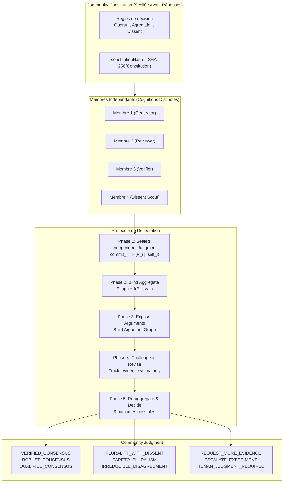
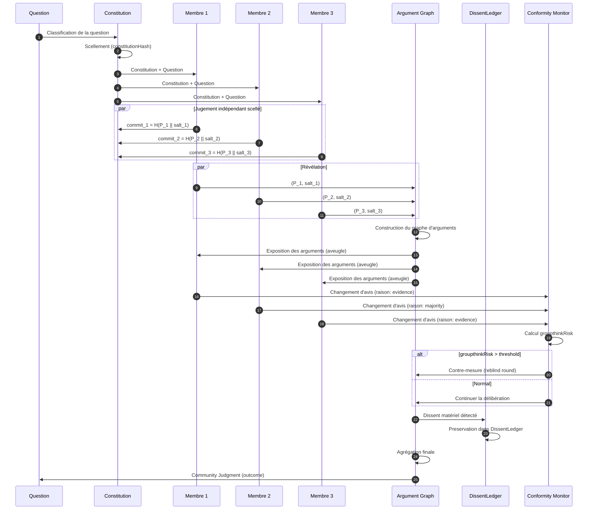
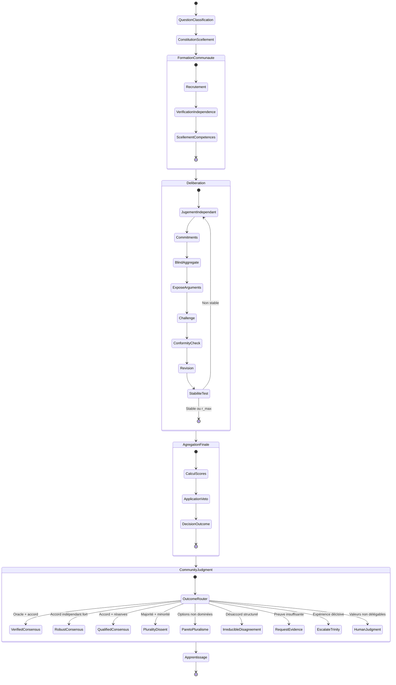
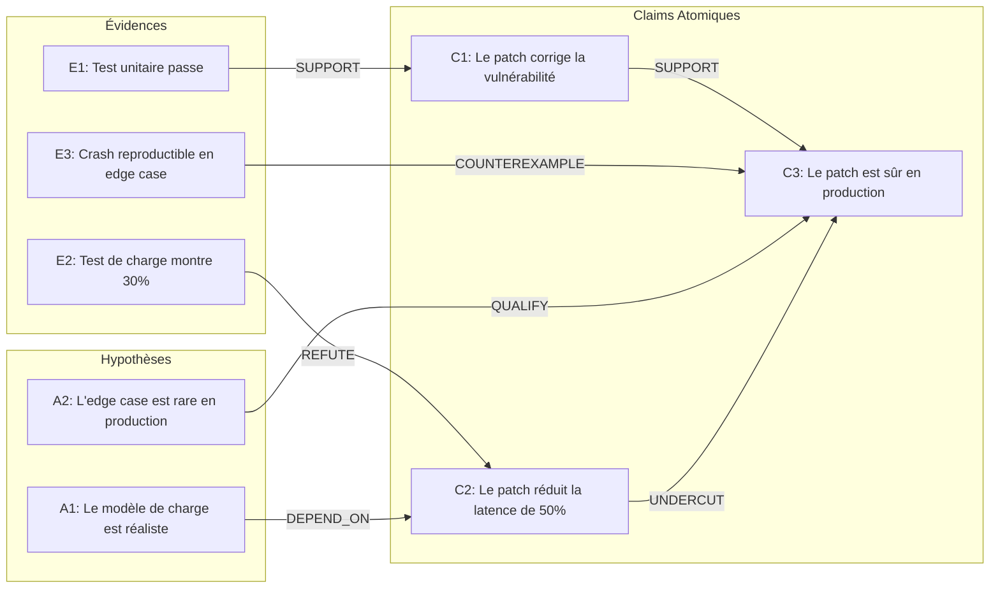

# Biocénose : Système de Délibération Collective et de Formation de Jugement

- **Statut** : Topologie disponible avec sessions persistées, services de délibération et contrôleur de tours bornés. Le parcours de bout en bout dépend encore des handlers fournis par l'appelant.
- **Portée implémentée** : composition des rôles, sélection de profils candidats, estimation conditionnelle de la taille effective, classification heuristique des questions, constitution versionnée et persistée, sessions auditées, engagements de jugement initiaux avec porte de divulgation, claims normalisés et dédupliqués après révélation, routage spécialisé vers reviewers et vérificateurs déclarés, graphe d'arguments persistant, registre de dissent append-only, historique append-only des révisions de croyance et signaux de conformité, agrégation initiale adaptée au type de question, calibration Brier par membre et domaine après résolution externe, jugement communautaire persisté et règles d'arrêt, recrutement adaptatif sur déficit de rôles ou de fournisseurs, conservation de la pluralité entre sous-communautés et bypass de preuves minoritaires vérifiées, frontière de confiance/quarantaine auditée, presets descriptifs de protocole, recommandations de transition à la Morphogenèse et contrôleur de tours piloté par handlers explicites, évaluation Pareto et métriques de diversité.
- **Dernière revue** : 2026-09-24

Biocénose est une topologie spécialisée dans le cadre morphogénétique de GenOS : la
Morphogenèse choisit et compose les organisations adaptées à une mission ; Biocénose
fournit le protocole de jugement collectif lorsqu'une communauté délibérante est
appropriée. Elle reste l'un des huit modes de composition, pas un mécanisme de
reconfiguration structurelle.

Voir aussi : [Morphogenèse](morphogenese.md), cadre de construction et de composition
d'organisations cognitives.

## État réel de l'implémentation

Cette distinction est essentielle : les sections qui suivent décrivent le modèle
épistémique visé et les composants runtime disponibles. Les capacités présentes dans
`biocenoseService` sont les suivantes :

- `composeBiocenose` valide la mission, compose les membres via
  `biologicalModeService`, puis retourne le seuil, le contrat de capacités et un plan
  de communication hiérarchique. L'option `population` permet de configurer plusieurs
  générateurs, reviewers et vérificateurs. `memberCandidates` permet de sélectionner
  parmi des profils fournis ; sans candidats ni population, la composition historique
  à quatre membres reste utilisée ;
- `communityFormationService` classe les profils fournis par rôle et privilégie la
  couverture d'expertise, les fournisseurs, stratégies et sources distincts, avec une
  pénalité de redondance. Sans assez de profils, il complète avec les gabarits de rôle ;
- `effectiveCommunitySizeService` calcule $N_{eff}=N/(1+(N-1)\bar{\rho})$ uniquement
  quand tous les membres ont des vecteurs d'erreurs historiques alignés sur le même
  périmètre. Sinon `effectiveSize` reste `null` ; un nombre d'agents seul n'est pas
  traité comme une mesure d'indépendance ;
- `prepareCommunity` demande à `dynamicOrganizationService` de changer d'organisation,
  crée d'abord une `BiocenoseSession` persistée avec ses membres et son événement
  `COMMUNITY_CREATED`, classe la question, enregistre la constitution initiale et son
  hash avant de retourner, puis ignore les erreurs du changement d'organisation ;
- `questionClassifier` classe par mots-clés (`FACTUAL`, `PROBABILISTIC`, `DESIGN`,
  `MULTI_CRITERIA`, `NORMATIVE`, `EXPLORATORY`, `MIXED`). Cette heuristique accepte un
  type explicite via `options.questionType` ; elle n'évalue pas la sémantique par un
  modèle ni un arbitre externe ;
- `constitutionService` associe les sémantiques et une politique d'agrégation par type
  de question, valide les champs et versionne la constitution. Toute nouvelle version
  après la première exige une raison et produit un événement d'audit ;
- `communityStore` restaure la session et ses membres depuis SQLite. Les événements
  sont ajoutés dans la même transaction que la révision de session, avec contrôle de
  révision optimiste ; les journaux et artefacts sont stockés dans des tables
  append-only ;
- `commitJudgment` enregistre un engagement par membre et par tour, avec un hash
  SHA-256 du jugement canonique et un nonce aléatoire. `revealJudgments` refuse la
  divulgation tant que tous les membres actifs (hors facilitateur) n'ont pas engagé,
  vérifie les hashes puis ouvre la phase de revue. Le contenu JSON reste lisible dans
  la base : le scellement empêche la divulgation par cette API avant la porte, mais
  ne chiffre pas les données au repos ;
- `publishClaim` n'accepte les claims qu'après la révélation des jugements initiaux.
  `communityClaimGraph` normalise les espaces et la casse, déduplique les textes
  normalisés et conserve les membres qui ont soutenu le même claim dans une table
  append-only. C'est une déduplication textuelle, pas une équivalence sémantique ;
- `routeClaimReview` dirige un claim vers les reviewers dont les spécialités déclarées
  correspondent au risque et au type indiqués. Sans correspondance spécialisée, un
  reviewer disponible est choisi en repli ;
- `routeClaimVerification` ne marque jamais un claim vérifié. Il renvoie les vérificateurs
  dont les capacités déterministes déclarées correspondent aux contrôles requis, ou
  `UNVERIFIED` si aucun ne correspond. L'exécution du contrôle et sa preuve restent à
  fournir par le plan de vérification ;
- `publishArgument` persiste une relation du vocabulaire contrôlé (`SUPPORT`, `ATTACK`,
  `REFUTE`, `UNDERCUT`, `QUALIFY`, `DEPENDS_ON`, `COUNTEREXAMPLE`) pendant la délibération.
  Les claims source et cible doivent appartenir à la communauté et au tour courant ;
  chaque ajout produit un événement append-only. Le graphe n'évalue pas lui-même la
  validité logique d'un argument ;
- `recordDissent` conserve les claims concernés, les membres de soutien, les preuves
  citées et les évaluations de matérialité/sévérité. Les changements de statut sont
  des événements append-only ; l'entrée d'origine reste intacte ;
- `reviseBelief` persiste les positions précédente/nouvelle, les claims modifiés, les
  motifs et les références de preuve. Une majorité ou une autorité seule est refusée
  pour les claims que l'appelant déclare critiques ; les révisions sociales sans preuve
  sont signalées comme conformité, et des changements rapprochés sur le même claim
  sont signalés comme risque de groupthink. Ces signaux restent des indicateurs, pas
  une détection de causalité ni un blocage automatique ;
- `aggregateCommunityJudgments` applique des sorties différentes selon le type : faits
  couverts par des reçus explicitement `VERIFIED`, pooling probabiliste pondéré seulement
  si les poids de calibration et d'indépendance sont fournis (sinon moyenne simple),
  front de Pareto pour options multi-critères, préservation explicite des perspectives
  normatives, et carte de claims pour l'exploration. Pour le Pareto générique, tous les
  critères déclarés avec `direction: max|min` respectent cette direction (les clés simples
  historiques sont maximisées). Ce résultat reste une agrégation intermédiaire,
  pas un jugement final persisté ;
- `recordCalibrationOutcome` n'accepte que des probabilités binaires valides et un outcome
  résolu accompagné d'une référence d'oracle. Il conserve un score Brier append-only une
  seule fois par événement/membre/domaine ; `communityMemberReputation` calcule ensuite
  une moyenne Brier et une réputation séparément pour chaque domaine. La référence d'oracle
  est enregistrée comme provenance, mais sa validité doit être assurée par l'appelant ;
- `finalizeCommunityJudgment` s'exécute après l'agrégation et applique la limite de tours,
  la stabilité et la valeur marginale de preuve définies dans la constitution. Il conserve
  explicitement l'incertitude et choisit `DECIDED`, `IRREDUCIBLE_DISAGREEMENT` ou une
  escalade lorsque persistent un dissent critique ou une revue humaine requise. Le
  jugement est append-only et la session passe à `DECIDED` ou `ESCALATED` ; il ne produit
  pas un état « consensus » par défaut ;
- `recruitForDiversityGap` compare les rôles de la session aux cibles déclarées et peut
  persister des candidats qui remplissent les rôles manquants. Une cible explicite de
  fournisseurs distincts peut aussi recruter un profil d'un fournisseur absent. La
  sélection ne déclenche pas d'elle-même un appel à un fournisseur externe ni la création
  d'un agent ; les profils candidats doivent être fournis par l'appelant ;
- `aggregateHierarchicalDeliberation` conserve les parts par position de chaque cluster
  et ne les écrase pas en un vote parent unique. Un bypass ne remonte qu'un dissent
  critique dont le reçu passe le vérificateur de confiance fourni ; le parent doit alors
  le revoir. Le routage vers une topologie enfant et la validation de confiance concrète
  ne sont pas encore branchés dans la Morphogenèse ;
- Les helpers de résilience peuvent exclure des identifiants mis en quarantaine du routage,
  signaler une confiance élevée sans preuve et filtrer des références dépourvues de
  provenance vérifiée/reproductible. La quarantaine est un événement d'audit ; elle ne
  supprime pas le membre et ne prouve aucune intention malveillante. Les presets
  `epistemic_jury`, `delphi` et `adversarial_assembly` sont des configurations descriptives,
  pas encore des variantes exécutant chacune leur protocole complet ;
- L'adaptateur Biocénose/Morphogenèse traduit le jugement final fourni au planner en
  signaux de transition : un désaccord testable propose Trinity, un jugement `DECIDED`
  avec exécution demandée propose A-Team, une résolution par preuves vérifiées propose
  Direct, et un jugement nécessitant une revue propose Human. Les propositions Trinity/A-Team
  alimentent le plan Morphogenèse et gardent les identifiants de communauté et de jugement
  en provenance. Direct/Human restent des recommandations de handoff, car ce ne sont pas
  des topologies de son registre ;
- `runBiocenoseRound` déroule un plan borné et exige un handler pour chaque étape. Chaque
  étape terminée est auditée par hash ; toute étape manquante ou en échec stoppe le tour
  et produit un événement de blocage. Les handlers restent responsables des appels aux
  agents et de l'application des services d'écriture ; le runtime ne simule pas leur résultat.
  `summarizeBiocenoseBenchmark` calcule le taux de faux consensus, la préservation des
  minorités correctes et le budget de tokens sur des cas marqués comme évalués ;
- `evaluateMinorityEvidenceVeto` requiert un reçu de vérification fourni par un
  vérificateur de confiance avant de retourner `PROMOTION_BLOCKED`. C'est un évaluateur
  de politique ; il n'est pas encore branché sur la porte générale de promotion et ne
  valide pas lui-même la provenance des reçus ;
- `evaluateCommunity` n'envoie à l'arène Pareto que les dossiers explicitement
  identifiés comme générateurs ou options candidates. Les rôles de revue,
  vérification, facilitation et observation en sont exclus. Le point genou est exposé
  comme `arenaRecommendation` uniquement lorsque l'arène classe au moins deux
  candidats ; il n'est jamais nommé « consensus » ;
- `diversity` utilise les indicateurs de diversité fonctionnelle, d'erreurs,
  fournisseurs, stratégies et outils de `epistemicBiocenoseService`. Ces proxys ne
  mesurent pas l'indépendance réelle des jugements ; le résultat l'indique comme non
  mesurée en l'absence de données de dépendance validées ;
- `brierConsensus` reste disponible pour compatibilité et nécessite un résultat
  d'oracle pour calculer le score et le soutien pondéré ; sans oracle, il retourne
  `oracleMissing`. Ce score n'est pas la règle de décision de `evaluateCommunity` ;
- `quorumWithAbstention` calcule un quorum pondéré simple et compte les abstentions ;
- `epistemicBiocenoseService` calcule des indicateurs de diversité et recommande une
  niche. `shouldRecruit` est une recommandation calculée : ce service ne recrute pas
  lui-même d'agent.

Le contrat de capacités déclaré pour ce mode est
`QUORUM`, `EPISTEMICS_BRIER`, `ARENA_COMPETITION`, `EVIDENCE_BARRIER`,
`SWARM_METRICS`, `SIGNALING_BUS` et `PROMOTION_GATE`. Ce contrat et la présence de
services de métriques ne prouvent pas à eux seuls que toutes les étapes sont reliées
dans un cycle de délibération.

Les composants de claims, d'arguments, de dissent, de révision des croyances, de
calibration et de jugement communautaire sont persistants et disposent de points
d'entrée dédiés. `runBiocenoseRound` fournit le plan borné des neuf étapes et audite
leurs résultats, mais chaque handler doit être fourni par l'appelant ; c'est à lui
d'appeler les services d'écriture et les agents appropriés. Le contrôleur ne relie donc
pas encore seul chaque sortie à l'étape suivante et ne constitue pas un cycle autonome
prêt à exécuter sans intégration.

La constitution est persistée, versionnée et validée. La porte de commit/révélation
des jugements et plusieurs évaluateurs de politique sont implémentés, mais les exigences
de la constitution ne sont pas toutes appliquées comme des gates transversaux : en
particulier, la vérification des reçus et le veto minoritaire ne sont pas reliés à la
porte générale de promotion. `recruitForDiversityGap` recrute à partir de rôles cibles ou
d'un minimum de fournisseurs explicitement demandé ; la détection de monoculture ne
déclenche pas encore automatiquement ce recrutement. `activateBiocenose` reste synchrone
et sans session persistée ; `prepareCommunity` crée le parcours persistant.

Les claims et attributions, engagements initiaux, arguments, dissent, révisions de
croyance, calibrations et jugements sont conservés dans leurs tables append-only. Les
événements audités tracent leurs opérations et les étapes de runtime terminées ou
bloquées.

---

## 1. Définition

Dans son modèle cible, Biocénose traite une mission comme un **collectif délibérant formant un jugement partagé à partir de connaissances distribuées, de perspectives indépendantes et de désaccords légitimes**. Les services runtime composent les membres et fournissent plusieurs mécanismes de délibération ; le contrôleur borné n'impose pas encore à lui seul l'enchaînement complet de ces mécanismes ni l'indépendance cognitive réelle des membres.

Le mot « Biocénose » vient de l'écologie : une biocénose est l'ensemble des organismes vivants partageant un même biotope, en interaction constante — compétition, coopération, prédation, symbiose — mais sans fusion en un super-organisme. GenOS emprunte ce concept : les agents ne partagent pas un état viscéral ; ils maintiennent des **cognitions distinctes** qui interagissent par des mécanismes épistémiques explicites.

Les principes du modèle cible sont :

1. **Indépendance cognitive scellée** : chaque agent forme sa position avant de voir les autres ;
2. **Constitution communautaire antérieure** : les règles de décision sont fixées avant toute réponse ;
3. **Délibération au niveau des claims** : confrontation par affirmation, pas par solution globale ;
4. **Agrégation adaptée au type de question** : pas d'algorithme unique ;
5. **Préservation du désaccord légitime** : le dissent utile n'est jamais écrasé par la majorité.

Dans le modèle cible, Biocénose n'est pas un vote multi-agent, mais une **formation de jugement collectif**. Le but visé est que chaque claim matérielle soit indépendamment proposée, contestée et évaluée, et que le jugement final préserve ce que les preuves supportent comme ce qui reste disputé. Le runtime actuel ne garantit pas ce protocole complet.

Les services associés actuellement sont :

- [backend/src/services/biocenoseService.js](../../../backend/src/services/biocenoseService.js) : composition, préparation, activation et évaluation ;
- [backend/src/services/biocenose/communityStore.js](../../../backend/src/services/biocenose/communityStore.js) : création, rechargement et journalisation versionnée des sessions ;
- [backend/src/services/biocenose/formation/](../../../backend/src/services/biocenose/formation/communityFormationService.js) : sélection de profils, diversité des niches et taille effective conditionnelle ;
- [backend/src/services/epistemic/epistemicBiocenoseService.js](../../../backend/src/services/epistemic/epistemicBiocenoseService.js) : calcul de métriques de diversité ;
- [backend/src/services/epistemic/epistemicIndependenceService.js](../../../backend/src/services/epistemic/epistemicIndependenceService.js) : service d'indépendance épistémique distinct, dont la présence ne signifie pas qu'il est appelé par le parcours Biocénose ;
- [backend/src/services/hierarchicalQuorumService.js](../../../backend/src/services/hierarchicalQuorumService.js) : production d'un plan de communication hiérarchique ;
- [backend/src/services/biologicalModeService.js](../../../backend/src/services/biologicalModeService.js) : composition des rôles.

Le principe visé est qu'une communauté diverse, si elle juge indépendamment puis délibère correctement, puisse cartographier le désaccord mieux qu'une autorité unique. C'est une hypothèse de conception, pas un résultat garanti par l'implémentation actuelle.

---

## 2. Non un consensus multi-agent, mais une épistémologie collective

Le modèle cible de GenOS propose une logique de délibération épistémique :

1. **Cognitions distinctes** : chaque agent maintient sa propre position jusqu'au moment prévu par le protocole ;
2. **Commitment scellé** : les jugements initiaux sont signés cryptographiquement avant exposition ;
3. **Agrégation par evidence, non par autorité** : le poids d'un jugement dépend de sa calibration historique, de son indépendance et de la qualité de ses preuves — pas de son statut ;
4. **Désaccord comme donnée** : une position minoritaire avec preuves est conservée, pas écrasée ;
5. **Arrêt sur critère explicite** : la communauté s'arrête quand le coût d'une autre ronde dépasse son espérance de valeur.

Les mécanismes de qualité sont explicites :

- **sealed judgment** : aucune influence sociale sur le jugement initial ;
- **commit-reveal** : les positions sont engagées avant d'être révélées ;
- **claim-level deliberation** : la confrontation se fait par affirmation atomique, pas par solution globale ;
- **argument graph** : les relations entre claims (SUPPORT, ATTACK, REFUTE, UNDERCUT, DEPEND_ON, QUALIFY, COUNTEREXAMPLE) sont structurées et auditable ;
- **effective diversity** : la diversité cognitive est mesurée, pas supposée ;
- **conformity monitoring** : les changements d'avis sont classés par cause (preuve vs majorité) ;
- **dissent preservation** : le dissent matériel persiste dans le DissentLedger.

La distinction avec les autres topologies est fondamentale :

```text
Trinity
    plusieurs hypothèses concurrentes
    → laquelle résiste à l'expérience contrôlée ?

A-Team
    plusieurs expertises complémentaires
    → comment construire ensemble un artefact ?

Syncytium
    état partagé et synchronisation continue
    → comment fusionner en temps réel ?

Holobionte
    hiérarchie host + symbionts
    → comment intégrer sécuritairement ?

Biocénose
    plusieurs perspectives légitimes ou incomplètes
    → que doit croire/décider la communauté
      après délibération, confrontation et agrégation ?
```

---

## 3. Définition mathématique de la délibération collective

La délibération Biocénose est un problème de **formation de jugement sous indépendance cognitive contrôlée**.

Soit :

- $Q$ : la question posée ;
- $\mathcal{M} = \{M_1, \ldots, M_N\}$ : les $N$ membres de la communauté ;
- $\mathcal{C} = \{C_1, \ldots, C_K\}$ : les claims atomiques décomposant $Q$ ;
- $\mathbf{P}_i = (p_{i,1}, \ldots, p_{i,K})$ : le vecteur de positions de $M_i$ sur chaque claim ;
- $w_i$ : le poids de jugement de $M_i$ ;
- $\mathcal{A}$ : l'argument graph sur $\mathcal{C}$.

### 3.1 Classification de la question

Le **Question Classifier** détermine :

$$\text{type}(Q) \in \{ \text{factual}, \text{probabilistic}, \text{design}, \text{normative}, \text{exploratory} \}$$

| Type | Nature | Méthode d'agrégation | Outcome typique |
|------|--------|---------------------|-----------------|
| Faitiel | Vérifiable par oracle externe | Oracle > communauté | VERIFIED_CONSENSUS |
| Probabiliste | Prévision sous incertitude | Probability pooling pondéré | ROBUST_CONSENSUS |
| Conception | Multi-critères, comproms | Pareto / argument graph | PARETO_PLURALISM |
| Normatif | Dépend de valeurs | Préservation du pluralisme | HUMAN_JUDGMENT_REQUIRED |
| Exploratoire | Cadrages multiples légitimes | Pluralisme explicite | IRREDUCIBLE_DISAGREEMENT |

### 3.2 Le protocole de délibération

Le protocole suit une séquence stricte de 8 phases :

$$\text{JUDGE} \rightarrow \text{COMMIT} \rightarrow \text{BLIND\_AGG} \rightarrow \text{EXPOSE} \rightarrow \text{CHALLENGE} \rightarrow \text{REVISE} \rightarrow \text{RE\_AGG} \rightarrow \text{DECIDE/PRESERVE}$$

**Phase 1 — Sealed Independent Judgment** :

$$\forall i : \mathbf{P}_i^{(r)} \perp \!\!\! \perp \{ \mathbf{P}_j^{(r)} : j \neq i \}$$

Chaque membre produit sa position sans connaître celle des autres.

**Phase 2 — Commit** :

$$\text{commit}_i^{(r)} = H(\mathbf{P}_i^{(r)} \| \text{salt}_i)$$

L'engagement cryptographique scelle la position avant révélation.

**Phase 3 — Blind Aggregate** :

$$\mathbf{P}_{\text{blind}}^{(r)} = f_{\text{agg}}(\{ \mathbf{P}_i^{(r)} \}, \{ w_i \})$$

L'agrégation initiale se fait sans que les membres aient vu les autres positions.

**Phase 4 — Expose Arguments** :

$$\mathcal{A}^{(r)} = \text{buildGraph}(\{ \mathbf{P}_i^{(r)} \}, \{ \text{args}_i^{(r)} \})$$

L'argument graph est construit à partir des positions révélées.

**Phase 5 — Challenge** :

$$\forall (C_k, C_l) \in \text{attackEdges}(\mathcal{A}) : \text{evaluateChallenge}(C_k, C_l)$$

Chaque relation d'attaque est évaluée.

**Phase 6 — Revise** :

$$\mathbf{P}_i^{(r+1)} = \text{update}(\mathbf{P}_i^{(r)}, \Delta_{\text{evidence}}, \Delta_{\text{social}})$$

La mise à jour est tracée : cause évidentielle vs cause sociale.

**Phase 7 — Re-aggregate** :

$$\mathbf{P}_{\text{final}} = f_{\text{agg}}(\{ \mathbf{P}_i^{(R)} \}, \{ w_i \}, \mathcal{A}^{(R)})$$

**Phase 8 — Decide or Preserve Dissent** :

$$\text{outcome} = \text{judge}(\mathbf{P}_{\text{final}}, \mathcal{A}^{(R)}, \text{dissentLedger})$$

### 3.3 Pondération des jugements

Le poids de chaque membre est calculé par :

$$w_i = \text{Calibration}_i \times \text{ExpertiseFit}_i \times \text{Independence}_i \times \text{EvidenceQuality}_i$$

Chaque composante est normalisée dans $[0, 1]$ et bornée pour éviter la domination :

$$w_i^{\text{clip}} = \min\left(w_i,\ w_{\max}\right) \quad \text{où } w_{\max} = 2 \cdot \text{median}(\{w_j\})$$

**Calibration** : Mesure la correspondance historique entre probabilités déclarées et fréquences observées.

$$\text{Calibration}_i = 1 - \frac{1}{|\mathcal{D}_i|} \sum_{d \in \mathcal{D}_i} \text{BS}_i(d)$$

où $\text{BS}_i(d)$ est le Brier score historique du membre $i$ sur le domaine $d$.

**Expertise Fit** : Correspondance entre capacités et exigences.

$$\text{ExpertiseFit}_i = \text{sim}(\text{capabilities}_i, \text{requirements}(Q))$$

Cosine similarity entre les capacités du membre et les exigences de la question.

**Indépendance** : Non-corrélation avec les autres membres.

$$\text{Independence}_i = 1 - \frac{1}{N-1} \sum_{j \neq i} |\rho_{ij}|$$

où $\rho_{ij}$ est la corrélation historique des jugements entre $M_i$ et $M_j$.

**Evidence Quality** : Qualité moyenne des preuves apportées.

$$\text{EvidenceQuality}_i = \frac{1}{K_i} \sum_{k=1}^{K_i} q(e_{i,k})$$

où $q(e)$ évalue la vérifiabilité, la reproductibilité et la source de chaque évidence.

### 3.4 Nombre effectif de membres

Des agents corrélés ne constituent pas une communauté diversifiée :

$$N_{\text{eff}} = \frac{N}{1 + \frac{2}{N} \sum_{i < j} \rho_{ij}}$$

ou par décomposition en valeurs propres de la matrice de corrélation $\Sigma$ :

$$N_{\text{eff}} = \frac{(\sum_k \lambda_k)^2}{\sum_k \lambda_k^2}$$

Cela empêche de présenter 93 votes / 100 comme très fort si les 100 sont des clones cognitifs. Un $N_{\text{eff}} \approx 1$ malgré $N = 100$ indique une monoculture.

### 3.5 Agrégation et Proper Scoring Rules

**Probability pooling pondéré** : 

$$p_{\text{agg}}(C_k) = \frac{\sum_i w_i \cdot p_{i,k}}{\sum_i w_i}$$

**Logarithmic pooling** (évite la compression vers 0.5) :

$$p_{\text{agg}}(C_k) \propto \prod_i p_{i,k}^{w_i / \sum_j w_j}$$

**Brier Score** : Mesure la calibration des probabilités.

$$\text{BS}_i = \frac{1}{T} \sum_{t=1}^{T} (p_{i,t} - o_t)^2$$

Décomposition : $\text{BS} = \text{Reliability} - \text{Resolution} + \text{Uncertainty}$

**Logarithmic Score** : Strictement propre, pénalise les certitudes fausses.

$$\text{LS}_i = -\frac{1}{T} \sum_{t=1}^{T} [o_t \ln p_{i,t} + (1 - o_t) \ln(1 - p_{i,t})]$$

**Spherical Score** : Borné dans $[0, 1]$, propre.

$$\text{SS}_i = \frac{1}{T} \sum_{t=1}^{T} \frac{p_{i,t}^{o_t} (1-p_{i,t})^{1-o_t}}{\sqrt{p_{i,t}^2 + (1-p_{i,t})^2}}$$

Ces scores sont **propres** : ils incitent le membre à déclarer sa vraie croyance, pas à manipuler sa prédiction pour apparaître calibré.

---

## 4. Les neuf outcomes et leurs conditions

Biocénose produit un **CommunityJudgment** avec un statut de décision parmi neuf possibles.

### 4.1 VERIFIED_CONSENSUS

Oracle externe disponible + accord communautaire. La communauté converge vers la réponse que l'oracle confirme. La vérification externe prime sur le vote.

$$\text{VERIFIED\_CONSENSUS} \iff \exists \text{oracle} : \text{oracle} = \text{majority} \land N_{\text{eff}} \geq N_{\min}$$

### 4.2 ROBUST_CONSENSUS

Accord fort sans oracle décisif + diversité effective suffisante. Le consensus est « robuste » car il repose sur des jugements indépendants diversifiés.

$$\text{ROBUST\_CONSENSUS} \iff \text{maj\_ratio} \geq 0.8 \land N_{\text{eff}} \geq N_{\min} \land \text{conformity\_risk} < \tau$$

### 4.3 QUALIFIED_CONSENSUS

Accord majoritaire avec réserves matérielles documentées dans le DissentLedger.

$$\text{QUALIFIED\_CONSENSUS} \iff \text{maj\_ratio} \in [0.6, 0.8) \land |\text{dissentLedger}| > 0$$

### 4.4 PLURALITY_WITH_DISSENT

Une position domine mais une minorité significative diverge avec des preuves matérielles.

$$\text{PLURALITY\_WITH\_DISSENT} \iff \text{maj\_ratio} \in [0.6, 0.8) \land \text{dissent\_materiality} > \tau_{\text{dissent}}$$

### 4.5 PARETO_PLURALISM

Plusieurs options légitimes non dominées selon les critères. Aucune option ne domine universellement ; le choix dépend de pondérations de valeurs.

$$\text{PARETO\_PLURALISM} \iff |\{o : \text{nonDominated}(o)\}| \geq 2 \land \text{questionType} \in \{\text{design}, \text{exploratory}\}$$

### 4.6 IRREDUCIBLE_DISAGREEMENT

Désaccord raisonnable persistant après toutes les rondes. La communauté a épuisé les rondes et les preuves ; le désaccord est structurel.

$$\text{IRREDUCIBLE\_DISAGREEMENT} \iff r = r_{\max} \land \text{belief\_change\_rate} < \epsilon \land \text{new\_evidence\_rate} < \epsilon$$

### 4.7 REQUEST_MORE_EVIDENCE

Preuve insuffisante pour toute position. La communauté demande davantage d'évidence.

$$\text{REQUEST\_MORE\_EVIDENCE} \iff \forall i : \text{evidenceStrength}_i < \tau_{\text{evidence}}$$

### 4.8 ESCALATE_EXPERIMENT

Question empirique non résolue par la délibération seule. Escalade vers Trinity.

$$\text{ESCALATE\_EXPERIMENT} \iff \text{empirical\_disagreement} \land \text{experiment\_feasible} \land \text{expectedInformationGain} > \tau_{\text{info}}$$

### 4.9 HUMAN_JUDGMENT_REQUIRED

Décision normative ou préférentielle non délégable. Implique des valeurs humaines.

$$\text{HUMAN\_JUDGMENT\_REQUIRED} \iff \text{questionType} = \text{normative} \land \text{values\_conflict} \land \text{no\_technical\_resolution}$$

---

## 5. Architecture du système

```text
                           QUESTION
                              │
                              ▼
                      Question Classifier
                              │
                              ▼
                   Community Constitution
                         [COMMITTED]
                              │
                              ▼
                    Community Formation
            expertise + diversity + independence
                              │
            ┌─────────────────┼─────────────────┐
            ▼                 ▼                 ▼
        Member A          Member B          Member C...
            │                 │                 │
            └──── SEALED INDEPENDENT ──────────┘
                              │
                              ▼
                          Commitments
                              │
                              ▼
                        Claim Graph
                              │
            ┌─────────────────┼─────────────────┐
            ▼                 ▼                 ▼
         Reviewers         Verifiers       Dissent scouts
            │                 │                 │
            └──── structured challenge ────────┘
                              │
                              ▼
                    Evidence Resolution
                              │
                              ▼
                    Belief Revision Round
                              │
                              ▼
                Independence / Groupthink Gate
                              │
                              ▼
                  Aggregation Policy Router
             ┌────────────────┼────────────────┐
             ▼                ▼                ▼
          Oracle          Probability       Argument/
          based             pooling          pluralism
             │                │                │
             └────────────────┴────────────────┘
                              │
                              ▼
                    Community Judgment
                              │
          ┌───────────────────┼───────────────────┐
          ▼                   ▼                   ▼
       consensus            dissent          unresolved
          │                   │                   │
          └───────────────────┴───────────────────┘
                              │
                              ▼
                        Learning
             calibration / reputation / protocol
```

---

## 6. Community Constitution

La **Community Constitution** est le contrat épistémique scellé avant la première réponse. Elle définit les règles du jeu délibératif et ne peut être modifiée après le début sans versionnage explicite.

### 6.1 Structure

```typescript
CommunityConstitution {
    constitutionId
    questionType          // factual | probabilistic | design | normative | exploratory
    variant               // epistemic_jury | delphi | adversarial_assembly | ...
    eligibility {
        minIndependence   // seuil d'indépendance minimum
        minCalibration    // seuil de calibration minimum
        requiredCapabilities[]
        excludedProviders[] // pour éviter monoculture
    }
    evidenceStandard {
        minEvidencePerClaim
        requiredVerifiability
        reproducibilityRequired
        sourceDiversityMin
    }
    independenceRequirements {
        sealedCommitment  // engagement cryptographique requis
        blindInitialRound // première ronde à l'aveugle
        maxCorrelation    // corrélation max entre membres
    }
    aggregation {
        method            // oracle | probability_pooling | pareto | argument_graph | pluralism
        weights           // calibration | expertise | independence | evidence
        quorumPolicy      // simple_majority | supermajority | effective_majority
        abstentionPolicy   // allowed | discouraged | forbidden
    }
    dissent {
        preservation      // dissent ledger activé
        materialityThreshold
        vetoEnabled       // minority veto activé
        vetoConditions    // deterministic_counterexample | formal_contradiction | ...
    }
    rounds {
        maxRounds
        stoppingRule      // stability | evidence_exhaustion | budget
        minRounds
    }
    escalation {
        toTrinity         // escalade vers Trinity possible
        toHuman           // escalade vers humain possible
        evidenceThreshold // seuil pour demander plus d'évidence
    }
    constitutionHash      // SHA-256 du contenu ci-dessus
}
```

### 6.2 Scellement de la constitution

$$\text{constitutionHash} = H(\text{CommunityConstitution})$$

Toute modification après le début crée une nouvelle version :

$$\text{constitutionHash}_{v+1} = H(\text{CommunityConstitution}_{v+1} \| \text{constitutionHash}_v)$$

La chaîne de versions est publique et auditable.

### 6.3 Pourquoi sceller avant les réponses

Sceller la constitution avant les réponses empêche :
- **L'ajustement des règles au résultat** : « on change le seuil de majorité parce que 51% ne suffit pas » ;
- **La manipulation du quorum** : « on recrute 5 agents supplémentaires pour faire basculer le vote » ;
- **Le changement de méthode d'agrégation** : « le pooling donne B, passons au vote majoritaire ».

La constitution est le cadre invariant dans lequel la délibération se déroule.

---

## 7. Question Classifier

Le **Question Classifier** détermine le type de question avant toute formation de communauté. Ce choix détermine la méthode d'agrégation, les critères d'éligibilité et les outcomes possibles.

```typescript
type QuestionType = 'factual' | 'probabilistic' | 'design' | 'normative' | 'exploratory';

function classify(question: string): QuestionType {
    // - Présence de « probabilité », « risque », « chance » → probabilistic
    // - Présence de « devrait », « acceptable », « éthique » → normative
    // - Présence de « architecture », « design », « implémentation » → design
    // - Présence de « explorer », « alternatives », « cadrages » → exploratory
    // - Présence de « est-ce que », « vérifier », « prouver » → factual
}
```

Les questions composites retournent un vecteur de types avec pondération :

$$\text{typeVector}(Q) = \{(\text{factual}, 0.6), (\text{normative}, 0.4)\}$$

Dans ce cas, la constitution est adaptée : la partie factuelle suit les règles factuelles, la partie normative préserve le pluralisme.

---

## 8. Sealed Independent Judgment

La phase de **Sealed Independent Judgment** est le cœur épistémique de Biocénose. Elle garantit que chaque membre forme sa position sans influence sociale.

### 8.1 Protocole de scellement

Pour chaque membre $M_i$ :

1. **Réception** : $M_i$ reçoit $Q$ et la constitution scellée ;
2. **Recherche de preuves** : collecte indépendante ;
3. **Formation de position** : production de $\mathbf{P}_i$ ;
4. **Génération de sel** : $\text{salt}_i$ aléatoire ;
5. **Calcul de l'engagement** : $\text{commit}_i = H(\mathbf{P}_i \| \text{salt}_i)$ ;
6. **Soumission** : $\text{commit}_i$ est publié (pas $\mathbf{P}_i$) ;
7. **Révélation** : après tous les engagements, révélation de $(\mathbf{P}_i, \text{salt}_i)$ ;
8. **Vérification** : $H(\mathbf{P}_i \| \text{salt}_i) = \text{commit}_i$.

### 8.2 Pourquoi le scellement est essentiel

La sagesse d'une foule dépend de l'indépendance des erreurs :

$$\text{Var}(\bar{P}) = \frac{1}{N^2} \left[ \sum_i \sigma_i^2 + \sum_{i \neq j} \rho_{ij} \sigma_i \sigma_j \right]$$

Si $\rho_{ij} = 1$ (parfaitement corrélés) : $\text{Var}(\bar{P}) = \sigma^2$ (équivalent à un seul jugement). Si $\rho_{ij} = 0$ (indépendants) : $\text{Var}(\bar{P}) = \frac{\sigma^2}{N}$ (réduction linéaire).

### 8.3 Engagement cryptographique

$$\text{commit}_i = \text{SHA-256}(\text{serialize}(\mathbf{P}_i) \| \text{salt}_i)$$

Le sel empêche les attaques par précalcul. Après révélation, le système vérifie que $\text{timing}(\text{reveal}_i) > \text{timing}(\text{commit}_j)$ pour tous les membres.

---

## 9. Argument Graph

L'**Argument Graph** est la structure centrale de la délibération Biocénose. Il représente les relations épistémiques entre claims, preuves et assumptions.

### 9.1 Structure du graphe

```typescript
ArgumentGraph {
    nodes: Claim[] | Evidence[] | Assumption[]
    edges: ArgumentEdge[]
}

ArgumentEdge {
    source: nodeId
    target: nodeId
    relation: RelationType
    weight: number
    proposer: memberId
}

enum RelationType {
    SUPPORT,        // C1 soutient C2
    ATTACK,         // C1 attaque C2 (relation générale)
    REFUTE,         // C1 réfute C2 (preuve directe contraire)
    UNDERCUT,       // E1 sape le raisonnement de C1 vers C2
    DEPEND_ON,      // C1 dépend de l'hypothèse A1
    QUALIFY,        // C1 qualifie C2 (condition, contexte, portée)
    COUNTEREXAMPLE  // E1 est un contre-exemple à C1
}
```

### 9.2 Sémantique des relations

| Relation | Sémantique | Effet |
|----------|-----------|-------|
| SUPPORT | Le claim source renforce le claim cible | Augmente le support score |
| ATTACK | Le claim source affaiblit le cible | Augmente l'attack score |
| REFUTE | Le claim source prouve la fausseté du cible | Augmente fortement l'attack score |
| UNDERCUT | L'évidence sape le raisonnement intermédiaire | Réduit le poids du raisonnement |
| DEPEND_ON | Le claim cible dépend d'une hypothèse | Si l'hypothèse est rejetée, le claim est affaibli |
| QUALIFY | Le claim source restreint la portée du cible | Modifie les conditions d'application |
| COUNTEREXAMPLE | L'évidence est un contre-exemple direct | Bloque la généralisation du claim |

### 9.3 Calcul des scores de claim

Pour chaque claim $C_k$ :

$$\text{supportScore}(C_k) = \sum_{(C_j, C_k, \text{SUPPORT}) \in \mathcal{A}} w_j \cdot q(C_j)$$

$$\text{attackScore}(C_k) = \sum_{(C_j, C_k, \text{ATTACK/REFUTE}) \in \mathcal{A}} w_j \cdot q(C_j)$$

$$\text{netScore}(C_k) = \text{supportScore}(C_k) - \text{attackScore}(C_k)$$

### 9.4 Statut des claims

$$\text{status}(C_k) = \begin{cases} \text{accepted} & \text{si } \text{netScore}(C_k) > \tau_{\text{accept}} \\ \text{rejected} & \text{si } \text{netScore}(C_k) < -\tau_{\text{accept}} \\ \text{contested} & \text{si } |\text{netScore}(C_k)| \leq \tau_{\text{accept}} \land \text{attackScore}(C_k) > 0 \\ \text{unresolved} & \text{si } \text{supportScore}(C_k) = 0 \land \text{attackScore}(C_k) = 0 \end{cases}$$

### 9.5 Sémantique quantitative (QBA)

Pour modéliser les attaques sur les raisonnements :

$$\text{strength}(C_k) = \text{baseStrength}(C_k) \cdot \prod_{(C_j, C_k, \text{UNDERCUT})} (1 - \text{undercutStrength}(C_j, C_k))$$

---

## 10. Conformity Monitor

Le **Conformity Monitor** détecte les dynamiques de groupe qui dégradent la qualité épistémique.

### 10.1 Mesures de conformité

Pour chaque membre $M_i$ et chaque ronde $r$ :

- $\Delta_{\text{evidence}, i}^{(r)}$ : changement après nouvelle preuve ;
- $\Delta_{\text{majority}, i}^{(r)}$ : changement après exposition à la majorité ;
- $\Delta_{\text{status}, i}^{(r)}$ : changement après exposition à un agent de haut statut ;
- $\Delta_{\text{none}, i}^{(r)}$ : changement sans nouvelle information.

### 10.2 Détection du groupthink

$$\text{groupthinkRisk}^{(r)} = \frac{\sum_i \Delta_{\text{majority}, i}^{(r)}}{\sum_i \Delta_{\text{evidence}, i}^{(r)} + \epsilon}$$

Si $\text{groupthinkRisk} > \tau_{\text{groupthink}}$ (typiquement 2.0), déclenchement de contre-mesures.

### 10.3 Contre-mesures

| Risque | Contre-mesure |
|--------|--------------|
| $\Delta_{\text{majority}} \gg \Delta_{\text{evidence}}$ | Reblind round : cacher les statistiques agrégées |
| $\Delta_{\text{status}} \gg \Delta_{\text{evidence}}$ | Anonymat renforcé : cacher les identités |
| $\Delta_{\text{none}} > 0$ | Injection de nouvelles preuves |
| Monoculture détectée | Recrutement adaptatif de perspectives divergentes |

### 10.4 Classification des changements d'avis

```typescript
enum BeliefUpdateReason {
    NEW_EVIDENCE,           // Nouvelle preuve apportée
    COUNTEREXAMPLE,         // Contre-exemple direct
    FORMAL_REFUTATION,      // Réfutation formelle
    BETTER_ARGUMENT,        // Argument supérieur présenté
    MAJORITY_SIGNAL,        // Influence de la majorité (conformité)
    AUTHORITY_SIGNAL,       // Influence d'un agent de haut statut
    SELF_CORRECTION,        // Auto-correction sans influence externe
    NONE                    // Pas de changement
}
```

Le ratio $\frac{|\text{MAJORITY\_SIGNAL}| + |\text{AUTHORITY\_SIGNAL}|}{|\text{NEW\_EVIDENCE}| + |\text{COUNTEREXAMPLE}| + |\text{FORMAL\_REFUTATION}|}$ est le cœur du Conformity Monitor.

---

## 11. Minority Veto et DissentLedger

### 11.1 Minority Veto

Mécanisme épistémique (pas politique) : un contre-exemple déterministe bloque la promotion d'un claim, quelle que soit la majorité.

$$\text{vetoTriggered}(C_k) \iff \exists e \in \text{Evidence} : \text{isCounterexample}(e, C_k) \land \text{isDeterministic}(e)$$

| Type | Condition | Effet |
|------|-----------|-------|
| Contre-exemple déterministe | Test reproductible qui échoue | PROMOTION_BLOCKED |
| Contradiction formelle | Preuve logique d'incohérence | PROMOTION_BLOCKED |
| Évidence de sécurité critique | Vulnérabilité reproductible | PROMOTION_BLOCKED |
| Évidence vérifiée unique | Source indépendante irréfutable | PROMOTION_BLOCKED |

**Exemple** : 9 agents « patch works », 1 agent avec test reproductible crashant → veto. L'évidence bat le nombre.

### 11.2 DissentLedger

```typescript
DissentLedger { entries: DissentEntry[] }

DissentEntry {
    claimId, position, claimRefs[], supportingEvidence[],
    supporters[], independence, materiality, novelty,
    counterexamples[], status  // active | resolved | preserved
}
```

### 11.3 Valeur du dissent

$$\text{DissentValue} = \text{EvidenceStrength} \times \text{Independence} \times \text{Materiality} \times \text{Novelty}$$

Un dissent de haute valeur est préservé même face à une large majorité. La littérature sur les « hidden profiles » montre que le dissent peut faire émerger des informations perdues par convergence prématurée.

---

## 12. Les douze variants de Biocénose

Biocénose décline en douze variants, chacun adapté à un contexte spécifique.

### 12.1 Epistemic Jury

Structure : N juges indépendants → preuves → verdict. Usage : Validation technique, revue de code, audit. Chaque juge produit son verdict en isolation. Les verdicts sont agrégés par vote pondéré. Pas de confrontation directe — l'indépendance est la protection.

### 12.2 Delphi Community

Structure : Rondes anonymes + feedback contrôlé + stopping rules. Usage : Expertise incertaine, prévision, estimation. Round 0 : réponse privée anonyme. Round 1 : agrégat anonyme + raisons (sans identité). Round 2 : reconsidération. Round 3 : test de stabilité. Stopping rules : $\text{stop} \iff \text{IQR}^{(r)} < \tau_{\text{spread}} \lor r = r_{\max} \lor \text{budgetExhausted}$. La convergence n'est pas obligatoire.

### 12.3 Adversarial Assembly

Structure : Propositions + attaque/défense + vérification. Usage : Robustesse, sécurité, stress-test. Des « red reviewers » attaquent, des « blue defenders » défendent, des « neutral verifiers » évaluent. Les engagements initiaux sont scellés. Attention : persuasion power ≠ epistemic authority.

### 12.4 Forecasting Crowd

Structure : Probabilités calibrées + scoring rules + marché prédictif interne. Usage : Prévision, estimation de risque. Marché prédictif : $p_{\text{market}}(A) = \frac{\sum_i \text{stake}_i(A)}{\sum_i \text{totalBudget}_i}$. Budget virtuel, se réinitialise à chaque mission.

### 12.5 Argumentation Community

Structure : Claim/argument graph + délibération structurée. Usage : Raisonnements contestables, décisions complexes. Variant le plus structuré. Chaque affirmation est un claim dans l'argument graph. Les relations (SUPPORT, ATTACK, REFUTE, UNDERCUT, DEPEND_ON, QUALIFY, COUNTEREXAMPLE) sont explicitement modélisées.

### 12.6 Polycentric Council

Structure : Sous-communautés semi-indépendantes + coordination. Usage : Grands systèmes, organisations multi-échelles. Plusieurs sous-communautés délibèrent localement. Leurs jugements sont agrégés par un conseil central. Chaque sous-communauté conserve son DissentLedger local.

### 12.7 Byzantine-Resilient Community

Structure : Filtrage local + evidence verification + reputation bounds. Usage : Environnements non fiables. Menaces : agents compromis, défaillants, trompeurs stratégiques, prompt-injected. Contre-mesures : filtrage local, evidence verification, reputation bounds, quarantaine, graph robustesse. Tolérance : $N \geq 3f + 1$.

### 12.8 Minority-Preserving Jury

Structure : Consensus + DissentLedger + veto épistémique. Usage : Décisions à fort risque, sécurité, éthique. Variant le plus conservateur. Le veto épistémique est activé par défaut. Le dissent est toujours préservé.

### 12.9 Representative Community

Structure : Échantillonnage de perspectives + pondération. Usage : Populations massives (1000+ agents). Sous-panels représentatifs selon expertise, indépendance, niche évidentielle, historique d'erreurs. Recrutement adaptatif : davantage seulement si l'incertitude reste élevée.

### 12.10 Persistent Community

Structure : Réputation long terme + culture communautaire. Usage : Projets durables, organisations apprenantes. La communauté persiste au-delà d'une seule mission. Les profils de calibration, DissentLedgers et cultures délibératives sont accumulés.

### 12.11 Human–AI Deliberation

Structure : Humains comme participants ou arbitres. Usage : Valeurs, ambiguïtés, décisions normatives. Les humains participent soit comme membres à part entière, soit comme arbitres finaux pour les questions normatives.

### 12.12 Hybrid Oracle Community

Structure : Crowd + vérificateurs déterministes. Usage : Science, code, mathématiques. La communauté produit des jugements, mais les vérificateurs déterministes (tests, preuves formelles) ont un pouvoir de veto.

---

## 13. Intégration Trinity : ESCALATE_EXPERIMENT

### 13.1 Principe

Quand Biocénose identifie un désaccord empirique non tranchable par délibération seule, elle escalade vers Trinity pour une expérience contrôlée.

### 13.2 Protocole

```
Biocénose → Désaccord empirique détecté → ESCALATE_EXPERIMENT
    → Trinity : hypothèses concurrentes → Expérience contrôlée
    → Résultat expérimental → Retour à Biocénose
    → Mise à jour des croyances
```

### 13.3 Formalisation

$$\text{ESCALATE\_EXPERIMENT} \iff \text{empiricalDisagreement}(C_k) \land \text{experimentFeasible}(C_k)$$

Trinity teste les hypothèses. Retour : $\forall i : \mathbf{P}_i^{(r+1)} = \text{updateBelief}(\mathbf{P}_i^{(r)}, \text{result})$

### 13.4 Exemple

Biocénose débat : « L'architecture X réduit-elle la latence de 50% ? » — 60% oui, 40% non. Le désaccord est empirique. ESCALATE_EXPERIMENT vers Trinity. Trinity teste X vs référence. Résultat : X réduit de 30% (pas 50%). Biocénose met à jour : le claim « réduction de 50% » est rejeté, le claim « réduction significative » est accepté avec qualification.

---

## 14. Cas d'usage typiques

### 14.1 Revue de code à haut risque

Mission : « Cette modification auth peut-elle être mergée ? » Communauté : 2 reviewers indépendants + security reviewer + test verifier + invariant reviewer + observer. Sortie : accepted (token validation correct), contested (refresh rotation), blocking dissent (replay attack reproductible). Même si quatre reviewers approuvent, le test bloquant empêche le merge.

### 14.2 Recherche scientifique

Mission : « Quelle conclusion les données permettent-elles réellement ? » Communauté : literature reviewers, methodology reviewers, statistical reviewers, replication reviewers, skeptics. Sortie : well-supported claims, weak claims, open controversies, missing experiments. Pas « answer=A » mais une cartographie de la certitude.

### 14.3 Architecture sans oracle unique

Mission : « Monolithe modulaire ou microservices ? » Communauté : operations, developer productivity, security, cost, scalability. Sortie : Option A dominates under conditions X / Option B dominates under conditions Y. PARETO_PLURALISM est souvent meilleur que consensus forcé.

### 14.4 Sécurité

Communauté : defender, attacker, implementation reviewer, incident responder, formal verifier. Le consensus n'autorise pas une vulnérabilité. Une seule faille reproductible : critical dissent bloque le résultat.

### 14.5 Validation modèle ML/IA

Communauté : performance, bias/fairness, distribution shift, adversarial evaluation, calibration, operational monitoring. Les désaccords sont conservés par dimension. Un bon score moyen n'efface pas une faille critique.

### 14.6 Décision organisationnelle

Communauté : engineering, cost, operations, security, UX. Sortie : facts, trade-offs, disagreements explicites, choix de valeurs final à l'humain (HUMAN_JUDGMENT_REQUIRED).

---

## 15. Biocénose vs autres topologies

| Aspect | Trinity | A-Team | Syncytium | Holobionte | Biocénose |
|--------|---------|--------|-----------|------------|-----------|
| Décomposition | Hypothèses (3) | Domaines (N) | État (4) | Hiérarchie (4) | Perspectives (N) |
| Autorité | Orchestrateur | Domaines isolés | Coordinator | Host central | Constitution |
| Objectif | Résister à l'expérience | Construire | Converger l'état | Production sécurisée | Former un jugement |
| Sortie | Hypothèse gagnante | Artefact | État fusionné | Système intégré | Judgment (9 outcomes) |
| Quand utiliser | Test discriminant | Artefact multi-disciplines | Temps réel collaboratif | Sécurité hiérarchique | Connaissances distribuées |

**Imbrication** : Biocénose ↔ Trinity (ESCALATE_EXPERIMENT). Biocénose peut contenir plusieurs communautés locales (Polycentric). Une Biocénose peut déléguer des sous-problèmes à A-Team.

---

## 16. Composition et allocation

### 16.1 Contrat d'entrée

```javascript
biologicalModeService.compose('biocenose', "Should we merge this security patch?")
```

### 16.2 Validation stricte

1. **mission présente** : aucune Biocénose sans mission explicite ;
2. **mode reconnu** : 'biocenose' dans les modes biologiques ;
3. **constitution générée** : une Community Constitution est scellée avant les réponses.

Erreurs : `BIOLOGICAL_MISSION_REQUIRED`, `BIOLOGICAL_MODE_UNKNOWN`, `BIOCENOSE_CONSTITUTION_FAILED`.

### 16.3 Sortie

```javascript
{
  sessionId: "bioc_12345", constitutionHash: "a1b2c3...",
  questionType: "factual", variant: "epistemic_jury",
  members: [
    { memberId: "M1", role: "generator", independenceScore: 0.92 },
    { memberId: "M2", role: "reviewer", independenceScore: 0.88 },
    { memberId: "M3", role: "verifier", independenceScore: 0.95 },
    { memberId: "M4", role: "dissent_scout", independenceScore: 0.90 }
  ],
  claimGraph: { nodes: [], edges: [] },
  dissentLedger: { entries: [] },
  conformityMonitor: { socialUpdates: 0, evidentialUpdates: 0, groupthinkRisk: 0 },
  status: "deliberating", roundCount: 0
}
```

---

## 17. Allocation de budget et modèles

$$T_{\text{per\_member}} = \frac{T_{\text{worker}} \times s}{N}$$

| Rôle | Modèle | Raison |
|------|--------|--------|
| Generator | `frontier` | Positions complexes |
| Reviewer | `frontier` | Analyse critique |
| Verifier | `standard` | Vérification ciblée |
| Dissent scout | `frontier` | Perspectives rares |
| Aggregator | `standard` | Combinaison pondérée |
| Observer | `standard` | Surveillance dynamiques |

Budget adaptatif : $N_{\text{actual}} = \min(N_{\max}, N_{\text{base}} + \Delta N \cdot \frac{\text{uncertainty}}{\tau_{\text{uncertainty}}})$

---

## 18. Télémétrie et observabilité

```typescript
BiocenoseTelemetry {
    sessionId, variant, questionType, constitutionHash, roundCount,
    members: [{ memberId, role, independenceScore, calibrationScore, beliefUpdateHistory }],
    claimGraph: { nodes, edges, accepted, rejected, contested, unresolved },
    dissentLedger: [{ claimId, supporters, evidenceStrength, independence, materiality, status }],
    conformity: { socialUpdates, evidentialUpdates, majoritySignalUpdates, groupthinkRisk },
    aggregation: { method, weights, diversityDimensions },
    judgment: { decisionStatus, confidence, dissentPreserved },
    calibration: [{ memberId, brierBefore, brierAfter, logScore, sphericalScore }]
}
```

Ces métriques aident à valider la qualité délibérative, détecter la conformité excessive, mesurer la diversité effective, évaluer la calibration, et auditer le dissent.

---

## 19. Configuration et paramètres

```bash
export GENOS_BIOCENOSE_DEFAULT_MEMBERS=4
export GENOS_BIOCENOSE_MAX_MEMBERS=100
export GENOS_BIOCENOSE_MAX_ROUNDS=5
export GENOS_BIOCENOSE_STABILITY_THRESHOLD=0.05
export GENOS_BIOCENOSE_GROUPTHINK_THRESHOLD=2.0
export GENOS_BIOCENOSE_DISSENT_MATERIALITY=0.3
export GENOS_BIOCENOSE_MAX_WEIGHT_RATIO=2.0
export GENOS_BIOCENOSE_MIN_CALIBRATION=0.6
export GENOS_BIOCENOSE_MIN_INDEPENDENCE=0.5
export GENOS_BIOCENOSE_TRINITY_ESCALATION=true
export GENOS_BIOCENOSE_HUMAN_ESCALATION=true
```

Les paramètres de constitution (quorum, méthode d'agrégation, veto, anonymat) sont définis dans la constitution scellée, pas en variable d'environnement.

---

## 20. Limitations et design notes

1. **Pas de consensus par défaut** : le consensus n'est pas synonyme de vérité. Neuf outcomes reflètent la diversité des situations épistémiques.
2. **Constitution scellée** : empêche l'ajustement des règles au résultat.
3. **Scellement des jugements** : garantit l'indépendance cognitive.
4. **Neuf outcomes** : couvrent l'espace des situations épistémiques.
5. **Inappropriée si** : oracle direct disponible, tâche séquentielle, urgence extrême, domaine monodisciplinaire. Préférer Trinity, A-Team, Syncytium, ou autorité unique.

---

## 16. Quand NE PAS utiliser Biocénose

| Si... | Pourquoi |
|-------|----------|
| La réponse est un fait objectif avec oracle externe | Un test ou un vérificateur déterministe décide sans délibération |
| Il existe une autorité légitime incontestable | L'humain seul décide — la Biocénose introduit du bruit |
| Le temps de délibération est trop coûteux | Chaque round multiplie les tokens et la latence |
| Il faut une décision unique immédiate | La Biocénose produit un jugement pluriel ou une abstention |
| Le problème est strictement technique et déterministe | Les algorithmes classiques sont plus fiables que la délibération |
| L'objectif est de produire un artefact complexe | L'A-Team construit, la Biocénose juge |

**Test mental :** La qualité du résultat dépend-elle de la diversité des perspectives et de la confrontation des connaissances ? Si oui, Biocénose est appropriée. Si la réponse est déjà connue ou si l'oracle est accessible, un vérificateur direct est préférable.

---

## 21. Références internes

- [ORCHESTRATION.md](../orchestration.md) : orchestration générale, gates et preuves
- [TRINITY.md](trinity.md) : orchestration comparative par hypothèses
- [A_TEAM.md](a-team.md) : orchestration multidisciplinaire par domaines
- [SYNCYTIUM.md](syncytium.md) : orchestration par état partagé
- [HOLOBIONTE.md](holobionte.md) : orchestration hiérarchisée intégrée
- [BIOME.md](biome.md) : orchestration par environnement et populations
- [METAPOPULATION.md](metapopulation.md) : orchestration par populations semi-indépendantes
- [biocenoseService.js](../../../backend/src/services/biocenoseService.js) : activation de Biocénose
- [epistemicBiocenoseService.js](../../../backend/src/services/epistemic/epistemicBiocenoseService.js) : diversité épistémique
- [epistemicIndependenceService.js](../../../backend/src/services/epistemic/epistemicIndependenceService.js) : indépendance épistémique
- [hierarchicalQuorumService.js](../../../backend/src/services/hierarchicalQuorumService.js) : quorum hiérarchique
- [biologicalModeService.js](../../../backend/src/services/biologicalModeService.js) : composition des modes

---

## 22. Références externes

| Référence | Apport pour Biocénose |
|-----------|----------------------|
| [Neyman & Roughgarden, Scoring Rules 2023](https://pubsonline.informs.org/doi/10.1287/opre.2022.2414) | Proper scoring rules pour agrégation de probabilités |
| [Zhu et al., MAD Confidence & Diversity 2026](https://aclanthology.org/2026.findings-acl.1694/) | Diversité initiale + confiance calibrée dans le débat multi-agent |
| [Okawa, Biased Consensus 2026](https://arxiv.org/abs/2608.02827) | Émergence de consensus biaisés, rôle de la conformité |
| [PubMed, Hidden Profiles](https://pubmed.ncbi.nlm.nih.gov/17144766/) | Le dissent améliore la qualité de décision en hidden profile |
| [PMC, Wisdom Crowd Diversity](https://pmc.ncbi.nlm.nih.gov/articles/PMC7549292/) | Indépendance des erreurs et sagesse des foules |
| [ACL:ARGSBASE, Structured Deliberation 2026](https://aclanthology.org/2026.eacl-demo.39/) | Interface multi-agent pour délibération structurée |
| [BMJ:DCAT, Delphi Appraisal 2025](https://www.bmj.com/content/391/bmj-2025-084509) | Outil d'évaluation critique de la méthode Delphi |
| [Wiley:Condorcet, Voting Rules 2025](https://onlinelibrary.wiley.com/doi/epdf/10.1111/cogs.70242) | Comparaison empirique de règles de vote |
| [PubsOnline:Atanasov, Prediction Markets 2016](https://pubsonline.informs.org/doi/10.1287/mnsc.2015.2374) | Agrégation statistique vs sondages de prévision |
| [Nature:Kraidia, Adversarial Persuasion 2026](https://www.nature.com/articles/s41598-026-42705-7) | Persuasion adverse dans le débat multi-agent |
| [arXiv:Lee, Byzantine Faults 2026](https://arxiv.org/abs/2605.09076) | Tolérance aux fautes byzantines dans consensus multi-LLM |
| [ACL:D3, Adversarial Evaluation 2026](https://aclanthology.org/2026.eacl-long.392/) | Débat budgété pour évaluation fiable et interprétable |

---

## 23. Schémas d'Architecture et de Délibération

### 23.1 Topologie de la Communauté Délibérante



### 23.2 Séquence de Délibération et Suivi de Conformité



### 23.3 Machine à états de la Délibération



### 23.4 Graphe d'Argumentation et Relations Épistémiques



---

## 24. Implémentation et capacités (GenOS v3)

Le runtime fournit les points d'entrée décrits dans « État réel de l'implémentation ». Le contrat actuellement déclaré est :

- Service : `backend/src/services/biocenoseService.js`.
- Capacités déclarées dans `topologyCapabilityService` : `QUORUM`, `EPISTEMICS_BRIER`, `ARENA_COMPETITION`, `EVIDENCE_BARRIER`, `SWARM_METRICS`, `SIGNALING_BUS`, `PROMOTION_GATE`.
- Ces étiquettes décrivent le contrat exposé par le service de capacités. Elles ne prouvent pas que le protocole cible de cette documentation est exécuté intégralement ni que chaque capacité est appliquée à chaque appel.

---

## 25. Invariant visé

> **Une communauté n'est pas réussie parce que tout le monde est d'accord.**
> **Une communauté est réussie lorsque chaque claim matérielle a été indépendamment proposée, proprement contestée, évidentiellement évaluée, et que le jugement final préserve à la fois ce que les preuves supportent et ce qui reste légitimement disputé.**

Si le processus aboutit à un consensus robuste, très bien. S'il aboutit à 60% A / 35% B / 5% abstention avec une objection minoritaire parfaitement valide, **le bon fonctionnement du système consiste précisément à ne pas faire disparaître cette objection**.

C'est là que Biocénose devient l'une des topologies les plus importantes de GenOS : **Trinity permet à GenOS de faire de la science expérimentale ; Biocénose lui permet de construire une véritable épistémologie collective.**
