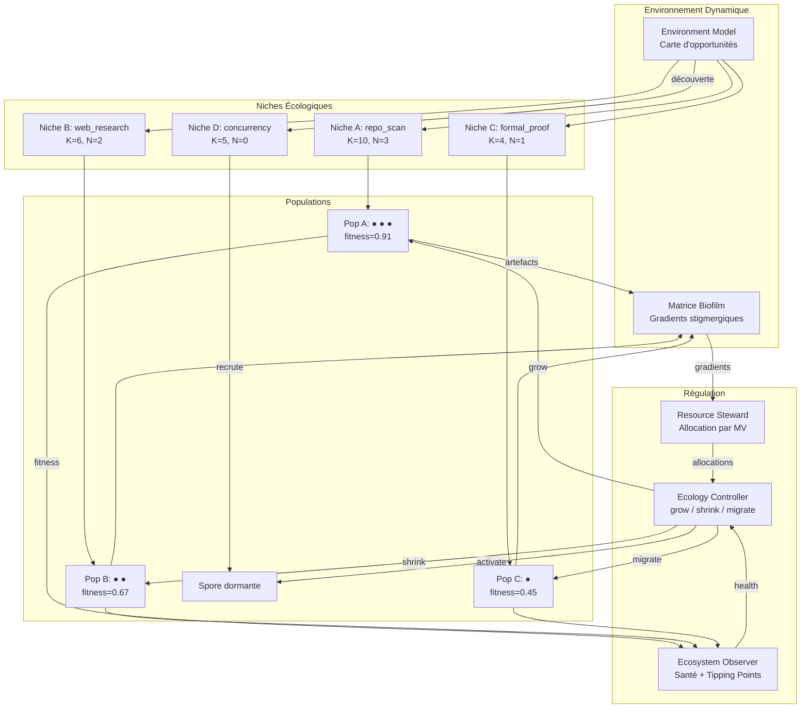
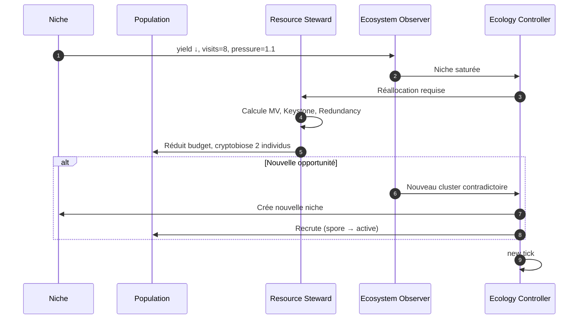
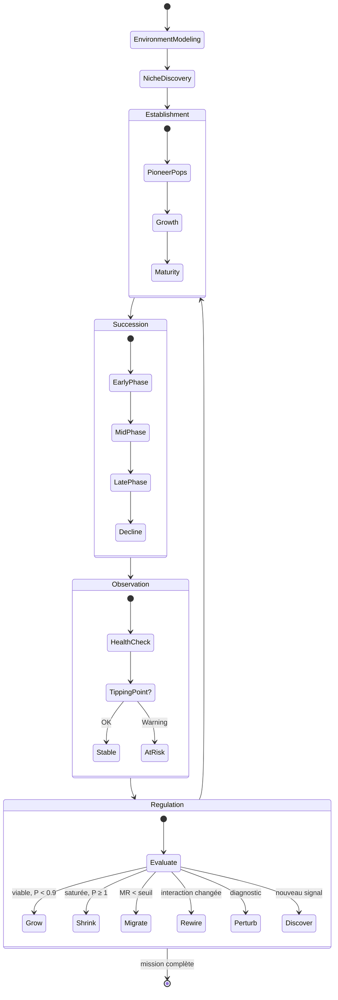
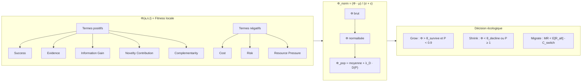

# Biome : Écologie Adaptative de GenOS

## 1. Définition

Biome dans GenOS est le mécanisme d'orchestration qui exécute une mission comme une **écologie adaptative de populations spécialisées**, où la structure optimale du travail n'est pas connue à l'avance et doit émerger de l'interaction entre niches, populations, ressources et résultats. Contrairement aux modèles précédents (Trinity = hypothèses isolées, A-Team = domaines isolés, Syncytium = état partagé continu, Biocénose = agents autonomes, Holobionte = hiérarchie), Biome impose une **régulation écologique dynamique** : les populations croissent, déclinent, migrent et s'éteignent en fonction de la productivité marginale des niches qu'elles exploitent.

Le mot « Biome » vient de l'écologie : un biome est un ensemble d'écosystèmes partageant des conditions environnementales similaires et des interactions biotiques structurantes. Les agents ne sont pas des workers interchangeables, mais des **individus** regroupés en **populations** occupant des **niches** dans un **environnement** dynamique.

Les quatre rôles du Biome sont :

1. **Environment Model** : maintient une représentation de l'environnement de mission, détecte les opportunités et les perturbations ;
2. **Resource Steward** : gère le vecteur de ressources multidimensionnel, calcule les capacités de charge, alloue par productivité marginale ;
3. **Population Regulation** : opère les dynamiques de naissance, mort, migration, cryptobiose des populations en fonction de leur fitness locale ;
4. **Ecosystem Observer** : mesure la santé écologique multidimensionnelle, détecte les tipping points, évalue la résilience.

Biome n'est pas une orchestration par allocation : c'est une orchestration par **sélection écologique**. Les populations ne survivent pas parce qu'elles existent, mais parce qu'elles exploitent des niches viables avec une fitness positive sous ressources limitées.

Le cœur fonctionnel est réparti entre :
- `biomeCoordinationService.js` : boucle écologique principale, allocation, foraging, santé ;
- `biologicalModeService.js` : composition des quatre rôles écologiques ;
- `foragingScoutHarvesterService.js` : foraging (Marginal Value Theorem, Lévy flights) ;
- `proceduralBiomePopulationService.js` : populations procédurales par niche ;
- `cryptobiosisSporeService.js` : dormance et réactivation ;
- `fossilizationService.js` : fossilisation et archive.

---

## 2. Non une équipe de workers, mais une écologie de populations

GenOS applique une logique de régulation écologique :

1. **Environnement modélisé** : l'espace de mission est un environnement dynamique avec des gradients de ressources, des opportunités et des perturbations ;
2. **Niches dynamiques** : les niches ne sont pas déclarées à l'avance — elles sont découvertes, créées, fusionnées ou abandonnées en fonction des signaux environnementaux ;
3. **Capacité de charge** : chaque niche porte une capacité $K_i$ fonction des ressources disponibles, de la productivité marginale et des coûts de coordination ;
4. **Fitness locale** : la fitness d'un agent est évaluée relativement à sa niche, pas globalement ;
5. **Sélection écologique** : les populations croissent dans les niches viables, déclinent dans les niches saturées ou improductives, migrent vers de meilleures opportunités ;
6. **Mémoire environnementale** : les populations laissent des traces (artefacts, gradients, marqueurs) qui influencent les futures décisions de forage.

Les mécanismes de régulation sont explicites : modélisation d'environnement partagée, découverte de niches émergentes, allocation par productivité marginale, préservation de la diversité par protection des minorités fonctionnellement distinctes, résilience par redondance fonctionnelle, et construction d'environnement par accumulation d'artefacts.

---

## 3. Définition mathématique de l'orchestration écologique

Soit :
- $M$ : mission ;
- $E_t$ : environnement au timestamp $t$ ;
- $\mathcal{N} = \{N_1, \ldots, N_k\}$ : ensemble des niches actives ;
- $\mathcal{P} = \{P_1, \ldots, P_m\}$ : ensemble des populations ;
- $R_i$ : vecteur de ressources de la population $i$ ;
- $K_i$ : capacité de charge de la niche ;
- $\Phi(a, n, t)$ : fitness de l'agent $a$ dans la niche $n$ au temps $t$.

À chaque tick écologique :

$$\text{For each population } i:$$

$$\text{if } \Phi(P_i, N_i, t) > \theta_{\text{survival}} \text{ and } R_i \geq R_{\min}:$$

$$R_{i,t+1} = R_{i,t} + \Delta R_{\text{grow}}(P_i, N_i)$$

$$\text{else if } \Phi(P_i, N_i, t) < \theta_{\text{decline}}:$$

$$R_{i,t+1} = R_{i,t} - \Delta R_{\text{shrink}}(P_i, N_i)$$

$$\text{else:}$$

$$R_{i,t+1} = R_{i,t} + \Delta R_{\text{maintain}}(P_i, N_i)$$

L'écosystème converge vers un état stable quand :

$$\text{equilibrium}(E_t) = 1 \iff \forall i : \left| \frac{\Delta R_i}{\Delta t} \right| < \epsilon$$

La diversité est maintenue quand :

$$\text{diversity}(\mathcal{P}, \mathcal{N}, t) > \theta_{\text{minimum}}$$

---

## 4. Les quatre rôles et hypothèses

Biome crée toujours exactement 4 rôles écologiques :

### 4.1 Environment Model

```
Role: environment_model | ModelTier: frontier | Member Number: 1
Responsibility: Ecological Cartography
Hypothesis: "Maintain a dynamic model of the mission environment,
detect ecological opportunities and perturbations, and produce
the niche opportunity map."
```

Tâches : modéliser l'environnement dynamique, détecter les nouvelles niches, suivre les capacités de charge, identifier les tipping points, prédire les phases de succession, maintenir le biofilm.

### 4.2 Resource Steward

```
Role: resource_steward | ModelTier: frontier | Member Number: 2
Responsibility: Resource Metabolism
Hypothesis: "Regulate the multidimensional resource vector,
compute carrying capacities, allocate budgets by marginal
productivity, and protect the resilience reserve."
```

Tâches : maintenir $R_i = (Tokens, Time, Calls, GPU, Memory, Tools, Concurrency, Risk, Attention)$, calculer $K_i$, calculer $\text{Pressure}_i = N_i / K_i$, allouer par $\frac{MV_i \times IG_i \times Crit_i}{Cost_i \times Press_i \times Risk_i}$, maintenir $R_{\text{reserve}}$.

### 4.3 Population Regulation

```
Role: population_regulation | ModelTier: standard | Member Number: 3
Responsibility: Population Dynamics
Hypothesis: "Operate population dynamics: birth, death, migration,
speciation, and cryptobiosis based on local fitness."
```

Tâches : évaluer $\Phi(a,n,t)$, croissance/déclin des populations, migration (MR > switch cost), recrutement via spores, stratégies de reproduction.

### 4.4 Ecosystem Observer

```
Role: ecosystem_observer | ModelTier: frontier | Member Number: 4
Responsibility: Ecological Health & Resilience
Hypothesis: "Measure multidimensional ecological health,
detect tipping points, evaluate functional redundancy,
and assess resilience capacity."
```

Tâches : calculer $H_{\text{taxonomic}}$, $H_{\text{functional}}$, $H_{\text{response}}$, détecter tipping points, identifier keystone populations, perturbations contrôlées.

---

## 5. Architecture du système

```text
Mission / Environnement Persistant
             │
             ▼
      Environment Model
             │
             ▼
       Niche Discovery
             │
             ▼
   Ecological Opportunity Map
             │
     ┌───────┼─────────┐
     ▼       ▼         ▼
   Niche A  Niche B   Niche C
     │       │         │
    Pop A   Pop B     Pop C
   ● ● ●    ● ●      ● ● ●
     │       │         │
     └──── environmental trails (biofilm) ──┐
                                            │
                                 Ecosystem Observer
                                            │
              ┌─────────────────────────────┼──────────┐
              ▼                             ▼          ▼
           fitness                      resources  interactions
              │                             │          │
              └────────────┬────────────────┴──────────┘
                           ▼
                     Ecology Controller
                           │
         ┌─────────────────┼────────────────┐
         ▼                 ▼                ▼
       grow             shrink            migrate
       split             merge            dormancy
       mutate           recruit           rewire
                           │
                           ▼
                       new tick
```

---

## 6. La niche : unité fondamentale

Une niche n'est pas un domaine. C'est un **espace de conditions écologiques** dans lequel une stratégie/population est productive. Chaque niche porte un état complet : nicheId, opportunity, environmentDescriptor, requiredCapabilities, availableResources, entryConditions, survivalConditions, exitConditions, rewardSignals, informationSignals, competitors, mutualists, predators, dependencies, carryingCapacity, occupancy, productivity, novelty, informationGain, uncertainty, stability, disturbanceLevel.

Exemples de niches GenOS : « chercher la cause dans l'historique Git », « tester l'hypothèse de race condition », « explorer documentation externe non officielle », « fuzzing de parser avec corpus mutatif ». Une même mission peut contenir des dizaines de niches non évidentes au départ.

---

## 7. Niche fondamentale vs niche réalisée

Chaque agent possède une **niche fondamentale** — tout ce qu'il pourrait théoriquement traiter compte tenu de son DNA, outils, modèle, skills, mémoire :

$$\text{FundamentalNiche}(a) = \{ t \mid \text{Capability}(a) \supseteq \text{Requirements}(t) \}$$

La **niche réalisée** est le sous-ensemble effectif dans le Biome :

$$\text{RealizedNiche}(a, B) = \text{FundamentalNiche}(a) \cap \text{AvailableOpportunities}(B)$$

La compression fondamentale → réalisée est mesurée par :

$$\text{NicheCompression}(a, B) = 1 - \frac{|\text{RealizedNiche}(a, B)|}{|\text{FundamentalNiche}(a)|}$$

Exemple : Agent A a pour fondamentale `{Python, SQL, debugging, algorithms}` mais la niche Python est saturée → sa réalisée devient `{SQL investigation}`. Le phénotype détermine la fondamentale, l'écologie détermine la réalisée, la fitness résultante $\Phi(a,n,t)$ évalue la correspondance.

---

## 8. Capacité de charge et pression écologique

Chaque niche porte une capacité de charge :

$$K_i = \left\lfloor \frac{R_{\text{available},i}}{r_{\min,i}} \cdot \frac{1}{1 + c_i \cdot \rho_i} \right\rfloor$$

où $R_{\text{available},i}$ est le budget disponible, $r_{\min,i}$ les ressources par individu, $c_i$ le coefficient de coordination, $\rho_i$ la densité de population.

La pression écologique mesure la saturation :

$$\text{Pressure}_i = \frac{N_i}{K_i}$$

Les trois régimes :
$$\text{Regime}(i) = \begin{cases} \text{vacant} & \text{if } \text{Pressure}_i < 0.3 \\ \text{viable} & \text{if } 0.3 \leq \text{Pressure}_i < 0.9 \\ \text{saturé} & \text{if } \text{Pressure}_i \geq 0.9 \end{cases}$$

Conséquences :
$$\text{For each niche } i:$$
- $\text{Pressure}_i < 0.3$ : recruter ou activer une spore
- $\text{Pressure}_i \geq 1.0$ : cryptobiose des excédents ou redirection
- $\text{marginalYield}(i) < \theta_{\text{departure}}$ : déclencher migration

Le coût de coordination croît non-linéairement :
$$C_{\text{coord}}(i) = c_i \cdot N_i \cdot \log(N_i) + \sum_{j \neq i} \text{InteractionCost}(i, j)$$

---

## 9. Fitness locale et environnementale

La fitness est évaluée **relativement à une niche et un moment** :

$$\Phi(a, n, t) = Success + Evidence + IG + NC + Complementarity - Cost - Risk - RP$$

où :
- $Success(a,n,t)$ : taux de succès des actions dans la niche ;
- $Evidence(a,n,t)$ : qualité des preuves produites ;
- $IG(a,n,t)$ : information gain (réduction d'incertitude) ;
- $NC(a,n,t)$ : contribution à la nouveauté (non-redondance) ;
- $Complementarity(a,n,t)$ : complémentarité mutualiste ;
- $Cost(a,n,t)$ : coût en ressources consommées ;
- $Risk(a,n,t)$ : risque (artefacts invalides, propagation d'erreurs) ;
- $RP(a,n,t)$ : pression sur les ressources (coût externe aux autres).

Forme normalisée :
$$\Phi_{\text{norm}}(a,n,t) = \frac{\Phi(a,n,t) - \mu_{\Phi}(n)}{\sigma_{\Phi}(n) + \epsilon}$$

Fitness d'une population (moyenne + bonus de diversité) :
$$\Phi(P, n, t) = \frac{1}{|P|} \sum_{a \in P} \Phi(a,n,t) + \lambda_D \cdot D(P)$$

Exemple multi-niche :
```
Agent A : Φ(repo_scan) = 0.91, Φ(web_research) = 0.42, Φ(formal_proof) = 0.11
```
L'agent n'est pas éliminé (moyenne 0.48) — il est affecté à `repo_scan` où il excelle. C'est l'esprit Quality-Diversity : la valeur est locale, pas globale.

---

## 10. Le vecteur de ressources multidimensionnel

Le Resource Steward gère un vecteur de 9 dimensions pour chaque population :

$$R_i = (R_i^{\text{tokens}}, R_i^{\text{time}}, R_i^{\text{calls}}, R_i^{\text{GPU}}, R_i^{\text{memory}}, R_i^{\text{tools}}, R_i^{\text{concurrency}}, R_i^{\text{risk}}, R_i^{\text{attention}})$$

Profiles de niches :
- **Formal proof** : (high tokens, high time, low calls, high GPU, high memory, solver tools, low concurrency, low risk, high attention)
- **Web research** : (moderate tokens, moderate time, high calls, low GPU, moderate memory, web tools, high concurrency, moderate risk, moderate attention)
- **Fuzzing** : (low tokens, high time, very high calls, high GPU, high memory, execution tools, high concurrency, high risk, low attention)

Allocation optimale :
$$Allocation_i \propto \frac{MV_i \times IG_i \times Crit_i \times LP_i \times KV_i}{Cost_i \times Press_i \times Redun_i \times Risk_i}$$

avec contraintes $R_i \ge R_{\min,i}$ et $\sum_i R_i + R_{\text{reserve}} \le R_{\text{total}}$.

La réserve de résilience $R_{\text{reserve}}$ est non-négociable — un Biome sans réserve n'est pas résilient.

Productivité marginale :
$$MV_i(t) = \frac{\partial Yield_i(t)}{\partial R_i(t)} \approx \frac{Yield_i(t) - Yield_i(t-\Delta t)}{R_i(t) - R_i(t-\Delta t)}$$

---

## 11. Les cinq relations écologiques

| Relation | Définition mathématique | Traduction GenOS |
|----------|------------------------|------------------|
| **Compétition** | $\frac{\partial \Phi_i}{\partial N_j} < 0$ et $\frac{\partial \Phi_j}{\partial N_i} < 0$ | Deux populations consomment les mêmes ressources — l'une réduit la fitness de l'autre |
| **Mutualisme** | $\frac{\partial \Phi_i}{\partial N_j} > 0$ et $\frac{\partial \Phi_j}{\partial N_i} > 0$ | Chaque population augmente la productivité de l'autre |
| **Commensalisme** | $\frac{\partial \Phi_i}{\partial N_j} > 0$ et $\frac{\partial \Phi_j}{\partial N_i} \approx 0$ | A bénéficie de B sans effet notable sur B |
| **Inhibition** | $\frac{\partial \Phi_i}{\partial N_j} \ll 0$ unilatéral | A produit un signal/artefact qui invalide ou diminue B |
| **Prédation** | $\Phi_{\text{pred}}(N_{\text{prey}}) > 0$ et $\Phi_{\text{prey}}(N_{\text{pred}}) < 0$ | Une population teste/détruit systématiquement les artefacts faibles d'une autre |

Exemples :
- **Compétition** : deux populations web search utilisent les mêmes sources → fusion ou redirection
- **Mutualisme** : générateur + vérificateur de candidats → les deux tirent valeur
- **Commensalisme** : une population d'indexation bénéficie à toutes les autres sans coût
- **Inhibition** : vérification formelle qui rejette les artefacts d'une génération rapide
- **Prédation** : fuzzing qui teste/détruit les artefacts produits par une population de construction

La matrice d'interaction $\mathbf{M}(t) \in \mathbb{R}^{n \times n}$ est réestimée à chaque tick. Elle peut changer de signe — c'est le **rewiring écologique**.

Redondance fonctionnelle :
$$Redundancy(A, B) = 1 - \frac{MarginalContribution(B | A)}{MarginalContribution(B)}$$

Si $Redundancy(A, B) \approx 1$, le Biome réduit B, fusionne, ou redirige.

---

## 12. Diversité : entropie de Shannon multidimensionnel

**Diversité taxonomique** (richesses en types) :
$$H_{\text{taxonomic}} = -\sum_{i=1}^{k} p_i \log_2(p_i), \quad J = \frac{H_{\text{tax}}}{\log_2(k)}$$

**Diversité fonctionnelle** (capacités comportementales distinctes) :
$$H_{\text{functional}} = -\sum_{f \in \mathcal{F}} p_f \log_2(p_f)$$

**Diversité de réponse** (stratégies distinctes pour une même fonction) :
$$H_{\text{response}}(f) = -\sum_{s \in S_f} p_s^{(f)} \log_2(p_s^{(f)})$$

Une haute diversité de réponse pour les fonctions critiques est le cœur de la **résilience**.

**Santé écologique** (vecteur, pas scalaire) :
$$\mathcal{H}(t) = \begin{pmatrix} H_{\text{taxonomic}}(t) \\ H_{\text{functional}}(t) \\ \overline{H_{\text{response}}}(t) \\ Productivity(t) \\ ResourcePressure(t) \\ DependencyHealth(t) \\ RecoveryCapacity(t) \end{pmatrix}$$

L'écosystème est sain quand $\forall j : \theta_{\min,j} \le \mathcal{H}_j(t) \le \theta_{\max,j}$.

---

## 13. Tipping Points : détection de changement de régime

Le Biome surveille 7 signaux précurseurs de régime shift :
1. Latence montante : $\frac{\partial \text{Latency}}{\partial t} > 0$ pendant $\geq 3$ ticks
2. Rendement marginal décroissant : $MV_i(t) < MV_i(t-1) < MV_i(t-2)$
3. Concentration des ressources : $H_{\text{resources}} < \theta_{\min}$
4. Corrélation d'erreurs montante : $\frac{\partial \text{ErrorCorrelation}}{\partial t} > 0$
5. Réserve épuisée : $R_{\text{reserve}} < 0.1 \times R_{\text{total}}$
6. Diversité fonctionnelle en chute : $H_{\text{functional}}(t) < 0.5 \times H_{\text{functional}}(t_0)$
7. Délais de dépendance croissants : $\frac{\partial \text{DependencyBacklog}}{\partial t} > 0$

Indice de proximité :
$$\text{TippingProximity}(t) = \sum_{k=1}^{7} w_k \cdot \sigma(s_k(t) - \bar{s}_k)$$

Niveaux d'alerte :
$$\text{AlertLevel}(t) = \begin{cases} \text{GREEN} & < 0.3 \\ \text{YELLOW} & 0.3 \leq \ldots < 0.6 \\ \text{ORANGE} & 0.6 \leq \ldots < 0.8 \\ \text{RED} & \geq 0.8 \end{cases}$$

En ORANGE/RED : redistribution forcée, cryptobiose de la population dominante, création de niches de secours, perturbation contrôlée.

---

## 14. Succession écologique

Les populations utiles au début d'une mission ne sont pas celles utiles à la fin :

```
Phase pionnière : exploration, cartographie, recherche, analyse superficielle
Phase d'établissement : architecture, implémentation, tests, artefacts structurants
Phase de maturité : hardening, intégration, sécurité, optimisation, vérification formelle
Phase de déclin/fermeture : archivage, fossilisation, nettoyage, transfert
```

Vecteur de proportions :
$$\vec{S}(t) = \begin{pmatrix} P_{\text{pioneer}}(t) \\ P_{\text{established}}(t) \\ P_{\text{mature}}(t) \\ P_{\text{decline}}(t) \end{pmatrix}, \quad \sum_i S_i(t) = 1$$

Phase dominante : $\text{Phase}(t) = \arg\max_i S_i(t)$

Transitions déclenchées par seuils :
$$\text{pioneer} \to \text{established} \iff \begin{cases} Coverage(artifacts) > 0.6 \\ Productivity(pioneer) < \theta_{\text{decline}} \\ ResourceReserve > 0.3 \end{cases}$$

À chaque transition : cryptobiose des populations sortantes, recrutement des entrantes, réallocation des ressources, archive des artefacts.

---

## 15. Niche Construction

Les populations modifient l'environnement par leurs artefacts :

$$E_{t+1} = E_t + \sum_{P \in \mathcal{P}} \text{Artifacts}(P, t)$$

Exemples :
- Population « code-scanner » crée un graphe de dépendances → nouvelles niches accessibles
- Population « test-harness-builder » génère des tests → nouvelle niche de vérification
- Population « doc-indexer » produit un index → recherche sémantique enrichie

Les artefacts modifient la capacité de charge :
$$K_i(t+1) = K_i(t) + \sum_{A \in \text{Artifacts}(t)} \text{Enrichment}(A, N_i)$$

$$\text{Enrichment}(A, N_i) = \alpha \cdot \frac{\partial r_{\min,i}}{\partial A} + \beta \cdot \frac{\partial Yield_i}{\partial A}$$

La communication devient `agent → environment → agents`, réduisant les coûts de coordination — c'est de la vraie stigmergie.

---

## 16. Foraging et Lévy flights

Le foraging suit le **Marginal Value Theorem** :

$$\text{Stay}(p) \iff MR(p) > \mathbb{E}[R(\text{alternatives})] - C_{\text{switch}}$$

où $MR(p) = \frac{\partial Yield(p)}{\partial t}$, $\mathbb{E}[R(\text{alternatives})]$ est le rendement attendu des alternatives, $C_{\text{switch}}$ le coût de migration.

Quand $MR(p) < \mathbb{E}[R(\text{alternatives})] - C_{\text{switch}}$ → PATCH_DEPARTURE → sélection nouveau patch → migration → mise à jour des interactions.

Le Lévy flight utilise une distribution de pas à queue lourde :
$$P(\ell) \sim \ell^{-\mu}, \quad 1 < \mu \le 3$$

Traduit en distances multiples :
```
Espace de capacités     : stepLength → capability distance
Espace sémantique       : stepLength → semantic distance (embedding cosine)
Espace des sources      : stepLength → source distance
Espace des stratégies   : stepLength → strategy distance
Espace du graphe repo   : stepLength → repository graph distance
```

Mode local ($\ell$ petit) : neighboring patch, exploitation fine.
Mode Lévy ($\ell$ grand) : distant niche, nouvelle source famille, représentation différente.

$$\text{Mode}(t) = \begin{cases} \text{LOCAL} & \text{if } MR(p) > \theta_{\text{high}} \\ \text{LEVY} & \text{if } MR(p) < \theta_{\text{low}} \text{ and } Uncertainty > \theta_{\text{novelty}} \end{cases}$$

---

## 17. Le biofilm : mémoire environnementale

Le biofilm est un **champ de gradients stigmergiques** qui guide le foraging sans communication explicite :

```
patch:file-family/auth        yield=0.02  visits=8  repellent=0.91
patch:git-history/oauth        yield=0.76  visits=2  attractant=0.83
niche:concurrency/fuzzing      yield=0.45  occupancy=3  pressure=0.67
source:arxiv/2406.04235        yield=0.88  provenance=high  trust=0.9
tool:ILP-solver                yield=0.33  calls=120  saturation=0.7
signal:dead-end/parser-v2      repellent=0.95  confidence=0.8
stepping-stone:arch-spec-v3    type=stepping  unlocks=formal-verif-niche
```

Navigation par gradients :
$$\nabla \text{Attractant}(p, t) = \sum_{q \in \text{visited}} \text{yield}(q) \cdot e^{-\frac{d(p,q)^2}{2\sigma^2}}$$

$$\nabla \text{Repellent}(p, t) = \sum_{q \in \text{failed}} (1 - \text{yield}(q)) \cdot e^{-\frac{d(p,q)^2}{2\sigma^2}}$$

Stigmergie zero-prompt : Population A explore X (yield=0.02, visits=8) → dépose repellent=0.91. Population B arrive → évite X sans LLM → suit le gradient vers Y (attractant=0.83).

Stepping stones :
$$\text{SteppingStone}(A) = \begin{cases} 1 & \text{if } \exists N' \notin \text{Accessible}(E_t) \text{ and } N' \in \text{Accessible}(E_t + A) \\ 0 & \text{sinon} \end{cases}$$

---

## 18. Métapopulation : capacité de la matrice $M_{ij}$

Quand le Biome opère sur plusieurs îlots, la matrice $\mathbf{M} \in \mathbb{R}^{n \times n}$ décrit les taux de migration :

$$M_{ij} = \text{migration rate from îlot } i \text{ to } j, \quad \sum_{j} M_{ij} = 1$$

La capacité globale est déterminée par la valeur propre dominante :

$$\lambda_{\max}(\mathbf{M}) = \max_i |\lambda_i(\mathbf{M})|$$

La métapopulation persiste si $\lambda_{\max}(\mathbf{M}) > 1$ — le flux de migration est suffisant pour recoloniser les îlots éteints.

Exemple :
```
Biome debugging :
  Îlot A : Python population (runtime analysis)
  Îlot B : JavaScript population (DOM inspection)
  Îlot C : Rust population (memory safety)
M_AB = 0.3 (migration quand corrélation détectée)
```

---

## 19. Biome + POET : couplage naturel

Biome et POET forment une boucle de coévolution :

```
POET crée nouvel environnement E'
    ↓
Biome évalue E' : quelle population coloniser ? Créer niche ? Transférer ? Budget ?
    ↓
Population colonise E'
    ↓
Biome mesure fitness et rendement
    ↓
Si rendement > seuil → population croît ; si < seuil → population migre
    ↓
Biome signale à POET : E' résolu (ou non)
    ↓
POET génère E'' à partir des stepping stones de E'
```

Transfert de stepping stones :
$$\text{TransferSuccess}(E_i \to E_j) = f\left(\text{Similarity}(E_i, E_j), \text{SteppingStoneQuality}(s_i), \text{NicheVacancy}(E_j)\right)$$

Biome évalue la niche vacancy et alloue une population pour recevoir le stepping stone.

---

## 20. Les 11 variants du Biome

| Variant | Principe | Usage |
|---------|----------|-------|
| **Resource Biome** | Compétition/allocation sous budget strict | Budget limité, beaucoup d'agents |
| **Exploration Biome** | Niches + foraging + curiosity | Recherche, debugging inconnu |
| **Quality-Diversity Biome** | Archive de niches et élites diverses | Créativité, optimisation |
| **Successional Biome** | Populations changent par phase | Gros projets longs |
| **Resilience Biome** | Redondance + perturbations + recovery | Systèmes critiques |
| **Persistent Biome** | Environnement longue durée | Repo/project/organisation |
| **Open-Ended Biome** | Niches/environnements nouveaux | Recherche NCE |
| **Adversarial Biome** | Populations attaquent/défendent | Cybersécurité |
| **Knowledge Biome** | Sources = niches, agents = foragers | Recherche profonde |
| **Compute Biome** | Ressources matérielles comme environnement | Local/cloud/multi-model |
| **Multi-scale Biome** | individus→populations→communautés | Très grandes missions |

Chaque variant est une politique écologique qui modifie les poids des termes de fitness, les seuils de régulation et les stratégies de foraging.

---

## 21. Contrat runtime

### BiomeSession

```typescript
BiomeSession {
    sessionId, missionId, missionSnapshotHash
    environmentModel
    variant  // resource | exploration | quality_diversity | successional |
             // resilience | persistent | open_ended | adversarial |
             // knowledge | compute | multi_scale
    niches[], populations[], resourceSteward, observer
    allocationModel, status, tickCount
    successionPhase  // pioneer | established | mature | decline
}
```

### Niche

```typescript
Niche {
    nicheId, opportunity, environmentDescriptor, requiredCapabilities
    availableResources, entryConditions, survivalConditions, exitConditions
    rewardSignals, informationSignals
    competitors[], mutualists[], predators[], dependencies[]
    carryingCapacity, occupancy, productivity, novelty, informationGain
    uncertainty, stability, disturbanceLevel
}
```

### Population

```typescript
Population {
    populationId, nicheId, individuals[]
    genotypeDistribution, phenotypeDistribution, strategies[], cognitiveRecipes[]
    resourcePool, localMemory, culturalMemory
    diversity, productivity, health
    birthRate, deathRate, migrationRate, lineage
}
```

### Individual

```typescript
Individual {
    individualId, populationId, nicheId
    phenotype, model, provider, cognitiveRecipe, toolset
    resourceAllocation, fitnessHistory, lineage
    status  // active | dormant | migrating | terminated
}
```

---

## 22. Architecture du système

| Fichier | Rôle |
|---------|------|
| `biomeCoordinationService.js` | Boucle écologique, allocation, foraging, santé |
| `biologicalModeService.js` | Composition des quatre rôles écologiques |
| `foragingScoutHarvesterService.js` | Foraging (MVT, Lévy flights, patch departure) |
| `proceduralBiomePopulationService.js` | Populations procédurales par niche |
| `cryptobiosisSporeService.js` | Dormance et réactivation des spores |
| `fossilizationService.js` | Fossilisation et archive des stepping stones |
| `agentFleetService.js` | Création, exécution et validation des workers |
| `agentOrchestrationState.js` | État de mission, continuations, télémétrie |
| `workerGarageService.js` | Gestion des slots de workers |
| `agentAutonomyPlanService.js` | Plan d'autonomie et activation |
| `crates/genos-orchestrator/src/director_planning.rs` | Planification avec preamble Biome |

---

## 23. Activation et composition

Biome s'activate quand :
1. Structure de recherche inconnue : on ne sait pas à l'avance qui doit faire quoi
2. Niches dynamiques : opportunités et populations doivent émerger et évoluer
3. Ressources limitées sous compétition : allocation par productivité marginale
4. Diversité requise : approches variées et couverture fonctionnelle large
5. Résilience critique : le système doit survivre aux perturbations

Biome est dégradée si décomposition connue (→ A-Team), ≤3 hypothèses (→ Trinity), collaboration temps réel (→ Syncytium), budget insuffisant.

```javascript
biologicalModeService.compose('biome', "Find the unknown bug in this repository")
// → [{role:'environment_model', modelTier:'frontier', memberNumber:1},
//    {role:'resource_steward', modelTier:'frontier', memberNumber:2},
//    {role:'population_regulation', modelTier:'standard', memberNumber:3},
//    {role:'ecosystem_observer', modelTier:'frontier', memberNumber:4}]
```

---

## 24. Télémétrie et observabilité

```
sessionId, variant, tickCount
niches: [{nicheId, carryingCapacity, occupancy, productivity, informationGain,
          uncertainty, stability, disturbanceLevel}]
populations: [{populationId, nicheId, size, diversity, health, birthRate,
               deathRate, migrationRate}]
resources: {allocated, consumed, reserve, pressure, vector}
ecologicalHealth: {taxonomicDiversity, functionalDiversity, responseDiversity,
                   productivity, resilience, tippingPointProximity}
interactions: [{source, target, type, strength, sign}]
successionPhase: pioneer | established | mature | decline
perturbations: [{type, target, effect, recoveryTime}]
keystonePopulations: [{populationId, impact}]
archiveStats: {nichesArchived, steppingStones, failedAdaptations}
stigmergySignals: {attractants, repellents, gradients}
foragingMetrics: {patchesVisited, levyFlights, patchDepartures, switchCosts}
```

---

## 25. Moniteur TUI natif

```
backend/src/services/biomeMonitorServer.js → NDJSON TCP 127.0.0.1:4592
genos-tui (biome_tui/)
  ├── live.rs      : client TCP, reconnexion automatique
  ├── model.rs     : applique snapshot / niche / population / signal
  └── view.rs      : rend Environment + Niches + panneau Écologie
```

```bash
genos run --mode biome --monitor
genos run --mode biome --monitor --session-id biome_1234567890_ab12
```

---

## 26. Biome vs autres topologies

| Aspect | Trinity | A-Team | Syncytium | Biocénose | Holobionte | Biome |
|--------|---------|--------|-----------|-----------|------------|-------|
| **Décomposition** | Hypothèses (3) | Domaines (N) | État (4) | Communauté (4) | Hiérarchie (4) | Niches (k) |
| **Autorité** | Orchestr. central | Domaines isolés | Coordinator | Consensus | Host central | Ecology Controller |
| **Synchronisation** | Asynchrone | Asynchrone | Continue | Asynchrone | Asynchrone | Tick écologique |
| **Allocation** | Par hypothèse | Par domaine | Par slice | Par consensus | Par délégation | Par MV marginale |
| **Meilleur pour** | Explorer hypothèses | Multidisciplinaire | Temps réel | Robustesse critique | Production sécurisée | Structure émergente |

**Biome vs Rhizome** : Rhizome optimise le réseau de capacités ; Biome optimise l'écologie des populations. Un Biome peut utiliser un Rhizome pour la connectivité interne.

**Biome vs Métapopulation** : La métapopulation est une structure à l'intérieur d'un Biome (ex: îlot A→Python, B→JS, C→Rust).

---

## 27. Cas d'usage détaillés

### 27.1 Cas 1 : Debugging de bug inconnu

**Mission :** « Trouve le bug inconnu dans ce repo. »

Biome excelle ici car la structure de recherche est inconnue au départ.

**Initialisation :**
```
Environment : repository (fichiers, historique, tests, documentation)
Niches initiales :
  - failing tests : reproduction des échecs de test
  - logs : analyse des logs d'exécution
  - recent commits : investigation de l'historique Git
  - static analysis : scan de code statique
  - runtime behaviour : observation du comportement à l'exécution
```

**Déroulement écologique :**

```
Tick 1-3 : Phase pionnière
  Les 5 populations initiales explorent leurs niches respectives.
  Le biofilm commence à accumuler des signaux :
    - tests/failing_yield : yield=0.12, visits=3, attractant=0.4
    - git/recent_auth     : yield=0.67, visits=2, attractant=0.8
    - logs/timing         : yield=0.45, visits=5, neutral=0.5

Tick 4 : Régulation
  static analysis : yield↓ (0.08), visits=6, pressure=0.33
    → Biome déclenche shrink : population passe de 3 à 1 individu
    → 2 individus cryptobiosés (spores créées)
  recent commits : yield↑ (0.72), visits=3, pressure=0.5
    → Biome déclenche grow : recrute 1 individu depuis le garage
    → pression monte à 0.67

Tick 5 : Découverte de niche
  logs population découvre une anomalie temporelle (clock drift)
    → Signal non expliqué détecté : residual = 0.89
    → Biome crée NOUVELLE NICHE : concurrency_investigation
    → Spore dormante (créée au tick 2 par un agent spécialisé) réactivée
    → Nouvelle population colonise la niche
    → Budget alloué depuis la réserve (R_reserve temporairement réduite)

Tick 6-8 : Exploitation et mutualisme
  concurrency niche finds reproducible race condition
    → yield=0.85, visits=1, attractant=0.91
    → Biome crée niche adjacente : verification_race
    → Population de vérification colonise (mutualisme : concurrency + verifier)
    → Matrice d'interaction : M_{concurrency,verifier} = +0.7

Tick 9 : Résolution
  Bug reproduit, evidence collectée, preuve formelle vérifiée
    → Productivité de la niche concurrency↓ (problème résolu)
    → Succession transition : exploration → resolution
    → Populations pionnières cryptobiosées
    → Populations de résolution recrutées (spores réactivées)
    → Archive : stepping stone « race reproduction → formal proof » fossilisé

Résultat : 12 niches découvertes, 7 populations actives à pic,
3 stepping stones archivés, bug résolu avec preuve vérifiée.
```

### 27.2 Cas 2 : Recherche approfondie multi-source

**Mission :** « Détermine ce qui est réellement vrai sur la sécurité de X. »

Ici les niches sont des écosystèmes de sources, pas des disciplines.

**Niches découvertes dynamiquement :**
```
Source académique (arXiv, IEEE, ACM)
Source officielle (documentation, advisories, CVEs)
Source industrielle (raports de sécurité, blogs techniques)
Source communautaire (GitHub issues, StackExchange, Twitter/X)
Source contradictoire (articles débunkant, opinions opposées)
Source de vérification (preuves formelles, PoC reproductibles)
```

**Dynamique :**
- Source académique : yield stable (0.75), visits élevées, saturée → shrink
- Source contradictoire : yield élevé (0.88), visits rares, attractant=0.9 → grow
- Source communautaire : yield variable, dépend de la curation → pression fluctuante
- Source de vérification : mutualisme fort avec toutes les autres → keystone population
  - KeystoneImpact(verifier) = 0.84 (sans elle, 84% des claims non vérifiées)

**Détection de tipping point :**
À T+15, 70% du budget va vers les sources communautaires (faciles d'accès mais peu fiables). TippingProximity monte à 0.72 (ORANGE). Le Biome gèle 50% du budget communauté, le redirige vers la vérification, et crée une niche « source primaire » pour remonter aux sources originales.

### 27.3 Cas 3 : Cybersécurité adversariale

**Mission :** « Trouve et exploite les vulnérabilités de cette application. »

Biome Adversarial active les relations de prédation et inhibition.

**Niches initiales :**
```
attack surface mapping
authentication bypass
authorization escalation
dependency vulnerability
fuzzing (input validation)
configuration audit
business logic flaws
```

**Dynamique adversariale :**
```
Population fuzzing → prédation sur population d'analyse statique
  (les artefacts fuzzés invalident les hypothèses statiques)
  M_{fuzzing,static_analysis} = -0.6 (inhibition)

Population auth-bypass → mutualisme avec authorization-escalation
  (un bypass auth permet tester l'escalation)
  M_{auth,escalation} = +0.8

Découverte CVE dans dépendance → nouvelle niche créée : exploitability
  → populations colonisent : PoC reproduction, mitigation, regression-test
```

Quand un patch est produit, l'environnement change (Niche Construction) :
- L'exploitability niche se ferme (patch appliqué)
- La regression-test niche s'ouvre (vérifier le fix)
- Les populations exploit migrent vers d'autres vulnérabilités

### 27.4 Cas 4 : Optimisation complexe (Conway 99, ILP)

**Mission :** « Résous l'instance X du problème Y de manière optimale. »

**Niches :**
```
CP-SAT solver
ILP (Integer Linear Programming)
Local search (hill climbing, simulated annealing)
Symmetry breaking
Constructive heuristics
Evolutionary strategies
Formal bounds (preuve d'optimalité)
```

**Succession :**
```
Phase pionnière : constructive heuristics + local search (rapides, explorent)
Phase d'établissement : CP-SAT + ILP (structurants, bornent)
Phase de maturité : formal bounds (vérifient l'optimalité)
```

**Transfert de stepping stone :**
Local-search trouve une solution partielle de qualité 0.7 → warm-start ILP → ILP converge vers optimalité 0.95 → formal bounds confirme. Le Biome archive le stepping stone « partial-solution → ILP-warm-start » pour les futures instances.

### 27.5 Cas 5 : Routing compute/modèles

**Mission :** « Résous ce problème avec le meilleur rapport qualité/coût. »

**Habitats (ressources matérielles) :**
```
Local CPU (gratuit, limité)
Local GPU (coût modéré, parallélisme)
Cloud cheap (spot/preemptible, peu fiable)
Cloud frontier (coût élevé, capacités maximales)
Formel solver (coût très élevé, preuves garanties)
```

**Populations :**
```
Light classifiers (peu coûteux, qualité modérée)
Heavy reasoners (coûteux, haute qualité)
Code workers (spécialisés, qualité variable)
Verificateurs (coût modulaire, détection d'erreurs)
```

Le Resource Steward observe qualité/€, qualité/token, latence, taux d'échec pour chaque population×habitat, et déplace les populations. Exemple : un heavy reasoner sur cloud cheap produit qualité=0.6 pour 0.1€/token, mais le même sur local GPU produit qualité=0.7 pour 0.01€/token → migration.

---

## 28. Quand ne pas utiliser Biome

Biome a un overhead significatif (4 rôles écologiques, régulation par tick, calcul de métriques multidimensionnelles). Il ne faut **surtout pas** l'utiliser quand la structure de travail est connue à l'avance.

### 28.1 Tests de décision

**Utiliser A-Team si :** la mission se décompose en disciplines/resp connues
> « Construire une API REST avec auth, DB, tests, déploiement »
→ Domaines connus, frontières claires → A-Team

**Utiliser Trinity si :** ≤ 3 hypothèses alternatives bien identifiées
> « Le bug est soit race condition, soit memory leak, soit off-by-one »
→ Trois hypothèses claires, évaluation comparative → Trinity

**Utiliser Syncytium si :** collaboration temps réel sur état partagé
> « Édition collaborative d'un document par 5 agents en temps réel »
→ État partagé continu nécessaire → Syncytium

**Utiliser Biocénose si :** consensus distribué nécessaire sans chef
> « Vote distribué sur l'acceptation d'un artifact critique »
→ Protocole de consensus, pas d'orchestrateur central → Biocénose

**Utiliser Holobionte si :** production sécurisée avec hiérarchie stricte
> « Déploiement multi-étapes avec gates obligatoires et rollback »
→ Hiérarchie de contrôle, étapes séquentielles → Holobionte

### 28.2 Le bon test

> Est-ce que je connais déjà la bonne décomposition ? Si oui → A-Team.
> Est-ce que je compare quelques hypothèses ? → Trinity.
> Est-ce que la structure de recherche, les populations utiles et l'allocation des ressources doivent changer en fonction de ce qu'on découvre ? → Biome.

---

## 29. Mécanismes avancés : cryptobiose et fossilisation

### 29.1 Cryptobiose

Quand une population est improductive mais potentiellement utile dans le futur (niche non saturée actuellement, ou stepping stone pour autre chose), le Biome ne la tue pas — il la met en **cryptobiose** :

$$\text{Cryptobiose}(P, t) \iff \Phi(P, n, t) < \theta_{\text{decline}} \text{ et } \exists n' : \Phi(P, n', t_{\text{futur}}) > \theta_{\text{survival}}$$

La cryptobiose :
1. Sérialise l'état complet de la population (phénotype, mémoire, stratégie, lineage) ;
2. Crée une **spore** dans l'archive ;
3. Libère les ressources allouées vers $R_{\text{reserve}}$ ;
4. Marque la spore avec les **conditions de réactivation** (niche, contexte, signaux).

### 29.2 Réactivation

Une spore est réactivée quand :
$$\text{Reactivate}(s, t) \iff \text{Conditions}(s) \subseteq \text{Signaux}(E_t)$$

Exemples de conditions :
- « Niche concurrency disponible avec uncertainty > 0.7 »
- « Source académique X non explorée mais mentionnée dans 3 preuves »
- « Artifact de type Y produit mais non vérifié »

La réactivation est un **recrutement écologique instantané** — pas de bootstrap, l'héritage est restauré.

### 29.3 Fossilisation

La fossilisation est l'archive permanente des **stepping stones** — les artefacts qui ne sont pas des solutions finales mais qui débloquent l'accès à de nouvelles niches :

$$\text{Fossilize}(A) \iff \text{SteppingStone}(A) \text{ et } \text{Qualité}(A) > \theta_{\text{archive}}$$

Les fossiles sont conservés dans `fossilizationService.js` et consultables par les futures missions via le Persistent Biome. Un fossile contient :
- L'artefact lui-même (code, preuve, index, graphe) ;
- Le contexte de production (niche, population, stratégie) ;
- Les conditions de réutilisation (niches débloquées, prérequis) ;
- La lignée (ancêtres, mutations, sélection).

### 29.4 Mémoire inter-missions

Un Persistent Biome accumule des fossiles et spores entre les missions. Quand une nouvelle mission démarre, le Biome consulte l'archive :

$$\text{InitialNiches}(M_{\text{new}}) = \text{Discover}(M_{\text{new}}) \cup \text{Reactivate}(F_{\text{relevant}})$$

Cela permet un **apprentissage écologique organisationnel** — les niches et stratégies découvertes dans une mission peuvent être réactivées dans une mission future similaire.

---

## 30. Les invariants du Biome

```
No population without a niche.
No niche without measurable opportunity or necessity.
No resource allocation without observed marginal value.
No "resilience" claim from diversity alone.
No foraging decision without behavioural consequence.
No ecological mechanism that exists only as metadata.
No permanent population simply because it existed at t0.
No consensus interpreted as health.
No dominant population allowed to erase useful functional diversity without evidence.
No ecosystem success if local successes produce global collapse.
```

---

## 31. Schémas d'architecture et de régulation

### 31.1 Topologie de l'Écologie Adaptative



### 31.2 Séquence de régulation



### 31.3 Machine à états du cycle



### 31.4 Modèle mathématique de la fitness



---

## 32. Configuration et paramètres

```bash
export GENOS_BIOME_ROLES=4
export GENOS_BIOME_TICK=5000                    # ms entre régulations
export GENOS_BIOME_RESERVE_RATIO=0.15            # réserve non-négociable
export GENOS_BIOME_CRYPTOBIOSIS_THRESHOLD=0.2    # fitness < seuil → dormance
export GENOS_BIOME_FORAGE_DEPARTURE_THRESHOLD=0.05
export GENOS_BIOME_TIPPING_ORANGE=0.6
export GENOS_BIOME_DIVERSITY_BONUS=0.1           # λ_D
export GENOS_BIOME_ARCHIVE_MAX=10000
export GENOS_BIOME_LEVY_MU=2.0                   # exposant Lévy
```

---

## 33. Limitations et design notes

**Pourquoi pas allocation par demande ?** Le Biome observe la productivité marginale réelle, pas la productivité déclarée. Les agents surestiment systématiquement leurs besoins futurs.

**Pourquoi la réserve est non-négociable ?** Un écosystème sans réserve ne peut pas absorber de perturbation. $R_{\text{reserve}} = 0.15 \times R_{\text{total}}$ garantit la recolonisation après perturbation.

**Pourquoi la diversité est-elle un terme de fitness ?** Un écosystème homogène est fragile face aux perturbations. $\lambda_D \cdot D(P)$ protège les minorités fonctionnellement distinctes contre la compétition asymétrique.

**Pourquoi le Lévy flight ?** Les distributions à queue lourde optimisent la recherche dans les espaces non structurés (Charnov MVT, Viswanathan 1999). Les macro-rares permettent de découvrir des niches éloignées que l'exploitation locale ne trouverait jamais.

**Pourquoi 4 rôles ?** 1 modèle d'environnement (carte), 1 intendant (ressources), 1 régulateur (populations), 1 observateur (santé). Chacun est essentiel et non-substituable — comme les quatre fonctions écologiques fondamentales.

**Pourquoi pas de « eventual consistency » ?** Biome exige une forte cohérence écologique (état unique, synchronisé par tick). L'eventual consistency tolère la divergence temporaire — acceptable pour Biocénose, pas pour Biome où la divergence = déséquilibre.

---

## 34. Cas d'usage typiques

### 34.1 Diagnostic de bug non reproductible

**Mission :** « Un bug intermittent apparaît en production mais pas en staging. Aucun test ne le capture. Trouve la cause racine et propose une correction. »

**Déroulé :**
- Le Biome initialise cinq niches : `log_analysis`, `static_analysis`, `commit_history`, `runtime_tracing`, `concurrency_model`.
- La population `static_analysis` (K=4) ne trouve rien après deux cycles → le Steward réduit son allocation à 1 individu et réalloue les ressources libérées.
- `commit_history` identifie un commit suspect il y a 3 jours → la population double (K=8) et se spécialise sur la régression introduite.
- Une anomalie de timing est détectée dans les logs → un spore dormant de type `concurrency_model` est activé (cryptobiose → réveil).
- La nouvelle niche `concurrency_model` confirme une race condition entre deux goroutines asynchrones.
- Le Biome déclenche une succession écologique : la niche `runtime_tracing` se spécialise en `race_verification`, une population de test fuzzer colonise la niche pour générer un cas reproductible.

**Résultat :** Cause racine identifiée (race condition), test de régression ajouté, patch proposé et vérifié par la population `race_verification`. La niche `concurrency_model` reste active avec une population de surveillance permanente.

---

### 34.2 Recherche multi-source sur un sujet controversé

**Mission :** « Détermine l'état de l'art sur [sujet X] avec fiabilité vérifiable, en distinguant consensus académique, pratiques industrielles et opinions non fondées. »

**Déroulé :**
- L'Environnement modèle l'espace informationnel en six niches : `academic_sources`, `official_documentation`, `industry_blogs`, `community_discussions`, `contradictory_claims`, `provenance_verification`.
- La population `academic_sources` (K=6) extrait les positions des articles peer-reviewed.
- `contradictory_claims` identifie un désaccord entre deux écoles de pensée → le Biome crée une niche de compétition `debate_analysis` où deux populations s'affrontent pour vérifier les preuves citées.
- `provenance_verification` détecte qu'un blog influent cite un preprint rétracté → la population `provenance_verification` (K=4) croît et émet un signal de faible confiance vers le biofilm.
- L'Observer écologique mesure une entropie élevée dans la niche `community_discussions` → interprété comme signe de polarisation, non de diversité fonctionnelle.

**Résultat :** Rapport structuré distinguant : (1) consensus académique vérifié, (2) pratiques industrielles majoritaires, (3) zones de controverse avec preuves pour chaque camp. Score de confiance par claim. La niche `provenance_verification` persiste comme population de surveillance pour les futures recherches.

---

### 34.3 Audit de sécurité d'une application web

**Mission :** « Audite l'application [Y] et identifie toutes les vulnérabilités exploitables, avec preuve d'exploitation et recommandation de mitigation. »

**Déroulé :**
- Sept niches initiales : `auth_sessions`, `input_validation`, `dependency_scoping`, `access_control`, `crypto_usage`, `business_logic`, `config_hardening`.
- `input_validation` trouve une injection SQL → le Biome crée une nouvelle niche `exploit_reproduction` et y recrute des spores dormantes de type `payload_crafting`.
- La population `exploit_reproduction` (K=3) produit un PoC fonctionnel → le Steward détecte une haute productivité marginale et alloue davantage de ressources.
- Simultanément, `access_control` trouve un IDOR → une seconde population `exploit_reproduction` colonise la niche en parallèle.
- `dependency_scoping` trouve une CVE critique dans une lib → la population `regression_testing` est activée pour vérifier que le patch proposé ne casse pas les fonctionnalités.
- L'Observer détecte une corrélation entre les niches `auth_sessions` et `config_hardening` → suggère une population de type `session_hardening` (niche construction).

**Résultat :** 3 vulnérabilités critiques et 7 modérées, chacune avec PoC, score CVSS vérifié, et patch testé par la population `regression_testing`. Rapport consolidé avec prioritisation par exploitabilité et impact.

---

### 34.4 Optimisation d'un système multi-objectif

**Mission :** « Optimise le pipeline de [Z] en minimisant coût, latence et taux d'erreur simultanément, avec des solutions Pareto-optimales. »

**Déroulé :**
- L'espace des solutions est modélisé en niches algorithmiques : `local_search`, `constraint_solver`, `genetic_algorithm`, `formal_bounds`, `heuristic_construction`.
- `local_search` trouve rapidement une solution satisfaisante → le biofilm stocke cette solution comme gradient pour `constraint_solver` (warm-start écologique).
- `genetic_algorithm` explore une région inattendue de l'espace → le Biome crée une niche fille `adaptive_mutation` spécialisée dans cette région.
- `formal_bounds` fournit une borne inférieure → permet au Steward d'élaguer les populations dont la fitness est en dessous du bound.
- Une succession écologique s'opère : `heuristic_construction` → `local_search` → `constraint_solver`, chaque population préparant le terrain pour la suivante (stepping-stone écologique).
- L'Observer maintient une archive MAP-Elites des meilleures solutions par région de l'espace objectif.

**Résultat :** Front Pareto-optimal avec 12 solutions non-dominées, classées par compromis coût/latence/erreur. La solution recommandée réduit le coût de 40% tout en maintenant le taux d'erreur < 0.1%. L'archive MAP-Elites persiste pour des requêtes futures similaires.

---

### 34.5 Orchestration de calcul hétérogène

**Mission :** « Exécute [Workload W] en répartissant les tâches entre ressources locales (CPU, GPU) et cloud (GPU spot, TPU, formal solver) selon qualité/prix/latence. »

**Déroulé :**
- Cinq niches/habitats : `local_cpu`, `local_gpu`, `cloud_spot`, `cloud_frontier`, `formal_solver`.
- Les populations déplacent leurs individus entre habitats selon le gradient de qualité/€ (productivité marginale par habitat).
- Un batch de tâches ML est envoyé sur `local_gpu` → latence élevée détectée → migration de 3 individus vers `cloud_spot`.
- `cloud_spot` subit une interruption (spot revocation) → le Biome déclenche une cryptobiose : les tâches en cours sont mises en spores dormantes sur `local_cpu` en attendant.
- `formal_solver` résout un sous-problème complexe mais coûteux → le Steward calcule que le coût marginal dépasse la valeur → la population est réduite et la niche reste occupée par une spore dormante.
- L'Observer détecte un pattern temporel : certains habitats sont moins chers la nuit → un Lévy flight temporel est planifié (migration nocturne).

**Résultat :** Le workload est complété avec un coût 35% inférieur au tout-cloud et 50% inférieur au tout-local. Le maintien de spores dormantes permet de réactiver `formal_solver` si une tâche future le nécessite. Le biofilm retient les gradients de qualité/€ par habitat et heure.

---

## 34. Références internes

- [ORCHESTRATION.md](../orchestration.md) : orchestration générale, gates et preuves
- [SYNCYTIUM.md](syncytium.md) : orchestration par état partagé
- [TRINITY.md](trinity.md) : orchestration comparative
- [A_TEAM.md](a-team.md) : orchestration multidisciplinaire
- [BIOCENOSE.md](biocenose.md) : orchestration communautaire
- [HOLOBIONTE.md](holobionte.md) : orchestration hiérarchisée
- [RUNTIME_AGENTIQUE.md](../../01-concepts/runtime-agentique.md)
- [BIOLOGIE_COMPUTATIONNELLE.md](../../01-concepts/biologie-computationnelle.md)
- [biomeCoordinationService.js](../../../backend/src/services/biomeCoordinationService.js)
- [biologicalModeService.js](../../../backend/src/services/biologicalModeService.js)
- [foragingScoutHarvesterService.js](../../../backend/src/services/foragingScoutHarvesterService.js)
- [cryptobiosisSporeService.js](../../../backend/src/services/cryptobiosisSporeService.js)

---

## 35. Références externes

| Référence | Apport |
|-----------|--------|
| [MAP-Elites, Mouret & Clune 2015](https://arxiv.org/abs/1504.04909) | Archive QD par niche |
| [AURORA, Faldor & Cully 2024](https://arxiv.org/pdf/2406.04235) | Descripteurs de niches appris |
| [Singh et al., Niche Concept 2024](https://www.nature.com/articles/s44358-025-00060-x) | Choice/Conformance/Construction |
| [POET, Wang et al. 2019](https://arxiv.org/abs/1901.01753) | Coévolution env-solution, stepping stones |
| [Thorogood et al., Resilience 2023](https://www.nature.com/articles/s44185-023-00022-6) | Résistance/récupération/régime |
| [XLand, DeepMind 2021](https://deepmind.google/blog/generally-capable-agents-emerge-from-open-ended-play/) | Curriculum open-ended |
| [Ward et al., Rewiring 2026](https://www.nature.com/articles/s44358-026-00159-9) | Réseaux écologiques dynamiques |
| [GovSim, Piatti et al. 2024](https://arxiv.org/abs/2404.16698) | Ressources communes par LLM |
| [TerraLingua, Paolo et al. 2026](https://arxiv.org/abs/2603.16910) | Écologie persistante de LLM |
| [Charnov, MVT 1976](https://doi.org/10.1016/0040-5809(76)90001-7) | Théorème valeur marginale |
| [Viswanathan, Lévy flights 1999](https://doi.org/10.1038/44593) | Optimisation recherche |

---

## 36. Implementation & capacités (GenOS v3)

- Service : `biomeCoordinationService.js`
- Capacités : `STIGMERGY`, `SWARM_METRICS`, `WEB_FORAGING`, `RESILIENCE_RECOVERY`, `NicheDiscovery`, `EcologicalArchive`, `PERTURBATION_DIAGNOSTIC`, `ForagingMVT`, `QualityDiversityArchive`, `BiofilmMemory`, `MetapopulationMigration`
- Contrat exposé par `topologyCapabilityService` et rendu effectif dans les leases d'outils (`toolLeasePolicy.leaseForCapabilities`).

