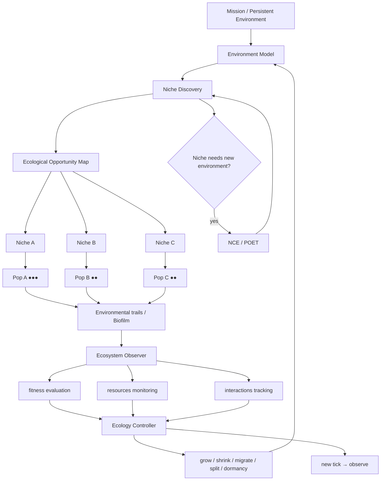

# Biome — Écologie Adaptative de GenOS

> *Biome est le protocole de GenOS pour maintenir et faire évoluer un ensemble de populations spécialisées dans un environnement dynamique, sous ressources limitées, lorsque la structure optimale du travail n'est pas connue à l'avance et doit émerger de l'interaction entre niches, populations, ressources et résultats.*

---

## 1. Définition et positionnement

### 1.1 Définition formelle

Soit un Biome $B_t$ à l'instant $t$ défini par le tuple :

$$B_t = (E_t, N_t, P_t, R_t, I_t)$$

où :
- $E_t$ est l'état de l'environnement à l'instant $t$
- $N_t = \{N_1, \ldots, N_k\}$ est l'ensemble des niches actives
- $P_t = \{P_1, \ldots, P_k\}$ est l'ensemble des populations
- $R_t = \{R_1, \ldots, R_k\}$ est l'allocation des ressources
- $I_t$ est la matrice d'interactions entre populations

Le Biome est **l'unité d'organisation écologique** de GenOS, distinct d'une simple collection d'agents par sa capacité à faire émerger, maintenir et transformer dynamiquement sa propre structure organisationnelle en réponse aux conditions observées.

### 1.2 Ce que le runtime fait bien

Le dépôt possède déjà des briques réelles et opérationnelles :

| Brique | État | Référence |
|--------|------|-----------|
| Session persistante | ✓ | `biomeCoordinationService.js` |
| Matrice biofilm | ✓ | `biofilmMatrixService.js` |
| 4 rôles génériques | ✓ | `biologicalModeService.js` |
| Allocation proportionnelle | ✓ | `allocateResources()` |
| Foraging Marginal Value Theorem | ✓ | `foragingScoutHarvesterService.js` |
| Pas de Lévy | ✓ | `computeLevyFlightStep()` |
| SearchPatchService | ✓ | `searchPatchService.js` |
| NCE | ✓ | `naturalCreativeEcologyService.js` |
| POET | ✓ | `poetExecutionEngine.js` |
| Plasticité phénotypique | ✓ | `phenotypicPlasticityService.js` |
| Évolution multi-îlots | ✓ | Rust `evolution.rs` |
| Stigmergie | ✓ | `rhizomeCoordinationService.js` |
| Cryptobiose | ✓ | `cryptobiosisSporeService.js` |
| Fossilisation | ✓ | `fossilizationService.js` |
| Curiosité par progrès | ✓ | `curiosityService.js` |
| Organismes procéduraux | ✓ | `proceduralOrganismService.js` |

La matière première est là. Mais le moteur écologique n'est pas encore assemblé.

### 1.3 Le problème central : aucune boucle écologique fermée

Actuellement, un opérateur externe doit explicitement invoquer `allocate()`, `forage()`, `health()`. Il n'existe aucune boucle autonome d'autorégulation.

L'implémentation ultime doit **être la boucle écologique** :

$$\text{observe} \rightarrow \text{estimate state} \rightarrow \text{decide} \rightarrow \text{transform} \rightarrow \text{reallocate} \rightarrow \text{observe effect} \rightarrow \circlearrowleft$$

C'est le **chantier central** de Biome.

### 1.4 Les 4 rôles ne doivent pas être 4 workers

`biologicalModeService` produit 4 rôles : `environment_mapper`, `resource_steward`, `population_specialist`, `ecosystem_observer`.

Ce modèle est pertinent comme **fonctions écologiques**, mais inadéquat comme composition d'exécution.

L'architecture ultime est :

```text
                        BIOME
                          │
                 Environment Model
                          │
        ┌─────────────────┼─────────────────┐
        ▼                 ▼                 ▼
   Niche: Repo       Niche: Web       Niche: Formal
   population         population       population
    scanners          researchers       solvers
     ● ● ●             ● ●              ● ●
        │                 │                 │
        └────────── ecological links ──────┘
                          │
                   Resource Steward
                          │
                   Ecosystem Observer
```

**1 Environment Model + 1 Resource Regulation Plane + N niches + N populations + N×M individuals + 1 Ecosystem Observer Plane**

### 1.5 La vraie unité fondamentale : la Niche

Une niche n'est pas simplement `domain = security`. Une niche est un **espace de conditions** dans lequel une stratégie ou population est utile.

Définition formelle :

$$\text{Niche} = \begin{cases} \text{nicheId} \\ \text{opportunity} \\ \text{environmentDescriptor} \\ \text{requiredCapabilities} \\ \text{availableResources} \\ \text{entryConditions} \\ \text{survivalConditions} \\ \text{exitConditions} \\ \text{rewardSignals} \\ \text{informationSignals} \\ \text{competitors} \\ \text{mutualists} \\ \text{predators} \\ \text{dependencies} \\ \text{carryingCapacity} \\ \text{occupancy} \\ \text{productivity} \\ \text{novelty} \\ \text{informationGain} \\ \text{uncertainty} \\ \text{stability} \\ \text{disturbanceLevel} \end{cases}$$

Exemples de niches GenOS :
- "chercher la cause dans l'historique Git"
- "explorer la DB pour requêtes lentes"
- "tester l'hypothèse de race condition"
- "chercher une preuve formelle du théorème T"
- "fuzzing de parser avec corpus C"
- "optimisation ILP du schedule S"
- "chercher exemples similaires dans mémoire"

**Une même mission backend peut contenir dix niches distinctes.**

### 1.6 Niche fondamentale vs réalisée

Un agent possède une **niche fondamentale** :

$$\text{FundamentalNiche}(a) = f(\text{DNA}, \text{tools}, \text{model}, \text{skills}, \text{memory}, \text{cognitive recipe})$$

Mais sa **niche réalisée** dépend de l'environnement :

$$\text{RealizedNiche}(a, t) = \text{FundamentalNiche}(a) \cap \text{AvailableResources}(t) \setminus \text{Competition}(t) \cap \text{MissionConstraints}(t)$$

Exemple : un agent avec Python, SQL, debugging en fundamental niche peut voir sa realized niche réduite à "SQL investigation" si Python debugging est saturé par d'autres agents.

Cela rend AgentDNA, phénotype et Biome **extrêmement bien connectés**.

### 1.7 Découverte dynamique de niches

Le modèle traditionnel à la MAP-Elites place des solutions dans des niches selon des dimensions comportementales. MAP-Elites cherche à conserver des solutions **diverses et performantes**, au lieu de ne garder qu'un unique optimum. [[@arxiv:1504.04909]]

Mais une grille fixe a des limites : les dimensions pertinentes ne sont pas connues à l'avance. Des approches ouvertes comme AURORA apprennent ou modifient les descripteurs de niches. [[@arxiv:2406.04235]]

Le Biome doit pouvoir observer et créer de nouvelles niches :

$$\text{NewNiche}(t+1) = \text{DetectOpportunity}(E_t, P_t, R_t) \rightarrow \text{SpawnPopulation}(N_{new})$$

Signaux de découverte :
- large unexplained residual
- new capability discovered
- repeated handoff failures
- novel artifact
- new source
- new failure mode

Exemple : logs population découvre clock drift anomalies → nouvelle niche "distributed-time investigation" → recrutement/création population spécialisée.

C'est fidèle à l'écologie moderne : les organismes ne font pas que s'adapter à une niche statique ; ils peuvent choisir, conformer et modifier leur niche (niche choice, niche conformance, niche construction). [[@nature:s44358-025-00060-x]]

### 1.8 Références

- MAP-Elites : [[@arxiv:1504.04909]]
- AURORA : [[@arxiv:2406.04235]]
- Hutchinson niche concept + Singh et al. 2024 : [[@nature:s44358-025-00060-x]]
- POET : [[@arxiv:1901.01753]]
- XLand : [[@deepmind:generally-capable-agents]]
- TerraLingua : [[@arxiv:2603.16910]]

---

## 2. Écologie, Fitness, Carrying Capacity, Succession

### 2.1 Resources ≠ tokens

`allocateResources()` gère aujourd'hui un simple entier. Le Resource Steward ultime doit gérer un vecteur multidimensionnel :

$$R_i = (\text{Tokens}, \text{Time}, \text{Calls}, \text{GPU}, \text{Memory}, \text{Tools}, \text{Concurrency}, \text{Risk}, \text{Attention})$$

Chaque niche possède une demande différente :
- **Formal proof niche** : high compute, low web, high verification
- **Web research niche** : high browsing, moderate LLM, high provenance
- **Fuzzing niche** : high execution, low LLM

Cela devient une véritable **économie écologique**.

### 2.2 Carrying capacity réelle

La documentation mentionne déjà $K$, mais le code ne l'implique pas comme mécanisme vivant.

Chaque niche devrait avoir :

$$K_i = f(\text{resources}, \text{marginal productivity}, \text{contention}, \text{coordination overhead})$$

et :

$$\text{Pressure}_i = \frac{\text{Population}_i}{K_i}$$

Régimes :
- Si $N \ll K_i$ : la niche peut recruter
- Si $N \approx K_i$ : saturée
- Si $N > K_i$ : freeze, reassign, merge, move, terminate

Cela transforme `workerGarage` d'une simple capacité globale en composante d'une écologie de ressources.

### 2.3 Fitness locale et environnementale

Un agent peut être mauvais globalement mais excellent dans une niche rare.

$$\text{Fitness}(a,n,t) = \alpha \cdot \text{Success} + \beta \cdot \text{Evidence} + \gamma \cdot \text{InformationGain} + \delta \cdot \text{NoveltyContribution} + \epsilon \cdot \text{Complementarity} - \zeta \cdot \text{Cost} - \eta \cdot \text{Risk} - \theta \cdot \text{ResourcePressure}$$

Exemple : Agent A avec $\text{fitness}(\text{repo\_scan}) = .91$, $\text{fitness}(\text{web}) = .42$, $\text{fitness}(\text{formal}) = .11$.

Sa fitness moyenne vaut $.48`, mais il possède une niche où il est excellent. **Il ne faut pas le tuer.**

C'est précisément l'esprit Quality-Diversity. [[@arxiv:1504.04909]]

### 2.4 EcologicalArchive

Chaque niche conserve un petit front de Pareto :
- best performer
- most robust
- cheapest
- most novel
- best verifier
- best stepping stone

Une solution non optimale aujourd'hui peut être utile plus tard.

POET a montré l'intérêt des **stepping stones** : une solution développée dans un environnement peut débloquer un autre environnement. [[@arxiv:1901.01753]]

GenOS possède déjà `cryptobiosisSporeService` et `fossilizationService`. Biome devrait être l'un des principaux consommateurs de ces mécanismes.

### 2.5 Population structurée

Une population n'est pas un rôle singulier. C'est un objet structuré :

$$\text{Population} = \begin{cases} \text{populationId} \\ \text{nicheId} \\ \text{individuals}[] \\ \text{genotypeDistribution} \\ \text{phenotypeDistribution} \\ \text{strategies}[] \\ \text{cognitiveRecipes}[] \\ \text{resourcePool} \\ \text{localMemory} \\ \text{culturalMemory} \\ \text{diversity} \\ \text{productivity} \\ \text{health} \\ \text{birthRate} \\ \text{deathRate} \\ \text{migrationRate} \\ \text{lineage} \end{cases}$$

Les individus peuvent être différents : different model, provider, recipe, toolset, strategy, memory subset. Ils appartiennent à une population parce qu'ils exploitent la même niche.

### 2.6 Stratégies de reproduction

Selon la situation :
- clone best individual
- mutate strategy
- recombine two useful individuals
- spawn specialist
- import individual from another niche
- reactivate dormant spore

Le principe : quand une niche est prometteuse, produire de nouvelles variantes autour de ce qui fonctionne, sans perdre la diversité.

C'est ici que l'évolution multi-îlots actuelle de GenOS peut se brancher directement.

### 2.7 Relations écologiques

| Relation | Traduction GenOS | Exemple |
|----------|------------------|---------|
| **Compétition** | Deux populations consomment même ressource | 2 web-search populations → même sources, même requêtes |
| **Mutualisme** | Chacune augmente productivité de l'autre | Generator population $\leftrightarrow$ Verifier population |
| **Commensalisme** | A bénéficie de B sans effet notable sur B | Read-only observer bénéficie des traces d'exécution |
| **Inhibition** | A produit signal invalide/diminue B | Population A dépose repellent sur niche de B |
| **Prédation** | Population teste/détruit artefacts faibles | Verifier population élimine systématiquement les sorties invalides du Generator |

### 2.8 Détection de redondance fonctionnelle

Deux populations peuvent avoir des rôles différents mais produire le même signal.

$$\text{MarginalContribution}(B|A) = \text{Performance}(A \cup B) - \text{Performance}(A)$$

Si $\text{MarginalContribution}(B|A) \approx 0$ : shrink B, redirect B, ou merge populations.

À l'inverse, une population minoritaire produisant régulièrement des informations uniques doit être **protégée**.

### 2.9 Santé écologique multidimensionnelle

`ecosystemHealth()` fait actuellement essentiellement $\text{entropy}(\text{labels}) \ge .5 \rightarrow \text{resilient}$. Six labels différents peuvent donner une grande diversité sans produire le moindre résultat utile.

La vraie santé écologique doit être multidimensionnelle :

$$H = f(\text{Diversity}, \text{FunctionalCoverage}, \text{Productivity}, \text{ResourcePressure}, \text{DependencyHealth}, \text{RecoveryCapacity}, \text{Redundancy}, \text{Novelty}, \text{Stability})$$

Distinguer :
- **taxonomic diversity** : combien de types différents ?
- **functional diversity** : combien de comportements/capacités différents ?
- **response diversity** : plusieurs façons différentes de remplir la même fonction ?
- **productivity** : valeur réellement produite
- **resilience** : capacité à absorber/recover d'une perturbation

La littérature sur la résilience écologique insiste sur la distinction entre **résistance**, **récupération** et changement de régime. [[@nature:s44185-023-00022-6]]

### 2.10 Succession écologique

Les populations utiles au début d'une mission ne sont pas celles utiles à la fin.

Exemple développement :
```
EARLY SUCCESSION          MID SUCCESSION           LATE SUCCESSION
exploration               architecture             hardening
requirements              implementation           integration
repo mapping              tests                     security
research                  code review               documentation
                          refactoring               performance
```

Les populations doivent apparaître, croître puis **décliner naturellement**. Pas rester vivantes jusqu'à la fin parce qu'elles ont été lancées au départ.

Un Biome mature doit avoir : pioneer populations, established populations, late-stage populations, decomposers/archive workers.

### 2.11 Niche construction

Certaines populations modifient l'environnement lui-même :

$$\text{Environment}_{t+1} = \text{Environment}_t + \text{Artifacts}(\text{populations}_t)$$

Exemple : search population crée index, summary, cache, graph. Test population crée harness automatique. L'environnement de recherche vient de changer.

Le Biome n'est plus seulement "agents adapt to environment" mais **agents $\leftrightarrow$ environment**.

### 2.12 Allocation des ressources

Au lieu de $w_i = \text{demand}_i \times \text{priority}_i$ :

$$\text{Allocation}_i \propto \frac{\text{MarginalValue}_i \times \text{InformationGain}_i \times \text{Criticality}_i \times \text{LearningProgress}_i \times \text{KeystoneValue}_i}{\text{Cost}_i \times \text{ResourcePressure}_i \times \text{Redundancy}_i \times \text{Risk}_i}$$

Contraintes :
- $R_i \ge R_{min,i}$
- $\sum R_i + R_{reserve} \le R$

La **réserve** doit être réelle. Un Biome sans réserve de récupération n'est pas résilient.

### 2.13 Références

- POET stepping stones : [[@arxiv:1901.01753]]
- MAP-Elites : [[@arxiv:1504.04909]]
- Résilience écologique : [[@nature:s44185-023-00022-6]]
- Disturbance/Connectivity : [[@nature:s41598-021-80987-1]]

---

## 3. Foraging, Biofilm, Perturbations, Communication

### 3.1 Foraging : décision optimale

`evaluatePatchYield()` calcule actuellement $\frac{\text{recentInfoGain}}{\text{elapsedTimeSec}}$ vs $\text{envMeanReturnRate}$ fixe. La vraie décision doit tenir compte de :

$$\text{Stay}(p) \iff \text{MarginalReturn}(p) > \text{ExpectedReturn}(\text{alternatives}) - \text{SwitchCost}$$

PATCH_DEPARTURE doit produire un comportement réel : stop exploiting → select new niche/patch → move worker/population → update resource allocation.

### 3.2 Lévy flight : distance dans un espace réel

`computeLevyFlightStep()` retourne LOCAL_INTENSIVE_EXPLOITATION ou LEVY_MACRO_JUMP mais n'exécute rien.

Le stepLength doit être traduit en distance dans un espace :
- capability distance
- semantic distance
- source distance
- strategy distance
- repository graph distance

Sinon le Lévy flight reste une métaphore.

### 3.3 Le biofilm = mémoire environnementale

`biofilmMatrixService` est actuellement un petit key-value store versionné. Bonne fondation.

Le biofilm ultime devrait porter :
- resource gradients
- risk gradients
- evidence deposits
- dead ends
- productive niches
- toxicity/repellent signals
- population density
- dependencies
- artifacts

Exemple :

```text
patch:file-family/auth
    yield = .02
    visits = 8
    repellent = .91

patch:git-history/oauth
    yield = .76
    visits = 2
    attractant = .83
```

Un nouveau worker n'a pas besoin de recevoir un long rapport. Il suit le gradient.

### 3.4 Communication par état environnemental compact

$$\text{agent} \rightarrow \text{environment} \rightarrow \text{agents}$$

Transmettre : pheromone, risk marker, occupancy, yield, claim refs. Réduction massive de tokens vs broadcast everything. C'est l'un des cas où le biomimétisme peut réellement réduire les tokens plutôt que simplement donner des noms biologiques.

### 3.5 Perturbations contrôlées = diagnostic

GenOS peut injecter de petites perturbations :
- remove one worker
- reduce one niche budget
- disable one source
- withhold one tool
- delay one dependency

Mesurer : does ecosystem continue? what compensates? which function collapses? → résistance, temps de récupération, redondance fonctionnelle, keystone populations.

C'est l'équivalent écologique du chaos engineering.

### 3.6 Keystone populations

$$\text{KeystoneImpact}(p) = \text{Performance}(E) - \text{Performance}(E \setminus p)$$

Exemple : dependency auditor produit 2% des artifacts mais sa suppression fait chuter integration success de 94% à 51%.

Le Resource Steward ne doit **jamais regarder uniquement la production brute**.

### 3.7 Détection de tipping points

Biome doit observer les signes annonciateurs de changement de régime :
- rising latency
- increasing retries
- declining marginal yield
- dependency backlog
- resource concentration
- falling diversity
- increased error correlation

$$\text{ECOSYSTEM\_APPROACHING\_TIPPING\_POINT}$$

et agir avant l'effondrement.

### 3.8 Rewiring dynamique des interactions

$A \leftrightarrow B$ n'est pas immuable. Si $B$ cesse de fournir des informations utiles et $C$ devient meilleur voisin $\rightarrow A \leftrightarrow C$.

C'est différent de Rhizome : Rhizome cherche surtout **des routes/capacités**. Biome rewiring vise **les relations écologiques en fonction de leur effet sur la santé et la productivité du système**.

Référence : rewiring écologique (Nature 2026). [[@nature:s44358-026-00159-9]]

### 3.9 XLand : challenge difficulty

L'expérience XLand de DeepMind générait dynamiquement les tâches en fonction de la progression des agents. [[@deepmind:generally-capable-agents]]

Pour GenOS :

$$P(\text{success}) \in [\alpha, \beta]$$

- Trop facile → peu d'info
- Trop dur → resource sink
- Learning frontier → invest resources

Cela rejoint directement le `curiosityService` actuel.

### 3.10 TerraLingua : 4 propriétés centrales

Resource constraints, persistent artifacts, agent turnover, long-lived environment. Produit division du travail, normes coopératives, structures de groupe, lignées d'artefacts. [[@arxiv:2603.16910]]

Ces quatre propriétés devraient être centrales dans le Biome GenOS.

### 3.11 Biome + POET = boucle naturelle

```
Biome
  │
  ├ niche ecology
  ├ resource dynamics
  ├ populations
  │
  └── when environment itself should evolve
          ↓
       NCE / POET
```

Et inversement : POET creates new environment → Biome decides which populations colonize it.

### 3.12 Références

- XLand : [[@deepmind:generally-capable-agents]]
- TerraLingua : [[@arxiv:2603.16910]]
- Rewiring : [[@nature:s44358-026-00159-9]]
- Résilience : [[@nature:s44185-023-00022-6]]
- GovSim : [[@arxiv:2404.16698]]

---

## 4. Variantes, Cas d'usage, Anti-usage, Architecture

### 4.1 Les 11 variantes

| Variant | Caractéristique | Usage |
|---------|-----------------|-------|
| **Resource Biome** | compétition/allocation ressources | budget limité, beaucoup d'agents |
| **Exploration Biome** | niches + foraging + curiosity | recherche, debugging inconnu |
| **Quality-Diversity Biome** | archive niches élites diverses | créativité, optimisation |
| **Successional Biome** | populations changent par phase | gros projets longs |
| **Resilience Biome** | redondance + perturbations + recovery | systèmes critiques |
| **Persistent Biome** | environnement longue durée | repo/project/organization |
| **Open-Ended Biome** | niches/environnements nouveaux | recherche NCE |
| **Adversarial Biome** | populations attaquent/défendent | cybersécurité |
| **Knowledge Biome** | sources = niches, agents = foragers | recherche profonde |
| **Compute Biome** | ressources matérielles | local/cloud/multi-model |
| **Multi-scale Biome** | individus→populations→communautés | très grandes missions |

Les plus importants pour la V1 ultime : **Exploration, Resource, Resilience, Persistent, Quality-Diversity**.

### 4.2 Cas d'usage typiques

**Bug inconnu** :
```
Environment: repository

Initial niches:          After some ticks:
├ failing tests           ├ yield ↓ → population shrinks
├ logs                    ├ yield ↑ → population grows
├ recent commits          ├ logs discover timing anomaly
├ static analysis         │  └ NEW NICHE: concurrency
└ runtime behaviour       └ concurrency finds race
                             └ verifier population colonizes it
```

**Deep research** : Niches = academic literature, official docs, industry reports, code/repos, community reports, contradictory evidence. Les populations se spécialisent par écosystème de source.

**Optimisation complexe** (Conway 99) : Niches = CP-SAT, ILP, local search, symmetry breaking, constructive heuristics, evolution, formal bounds. Si CP-SAT stagne, budget redirigé. Une solution partielle produite par une niche peut coloniser une autre (stepping stone ecological transfer).

**Cybersécurité** : Niches = attack surface, authentication, permissions, dependencies, fuzzing, configuration, business logic. Une vulnérabilité découverte crée nouvelle niche "exploitability".

**Très gros repo** : Le repo est l'environnement. Les modules deviennent des habitats. Populations se déplacent selon complexity, bug density, change frequency, unknownness, test failure density.

**Compute/model routing** : Habitat = local CPU, local GPU, cloud cheap, cloud frontier, formal solver. Populations = light classifiers, heavy reasoners, code workers, verifiers. Le Steward observe quality/€, quality/token, latency, failure rate et déplace les populations.

### 4.3 Quand NE PAS utiliser Biome

| Situation | Topologie alternative |
|-----------|----------------------|
| 2+2 | direct |
| Simple code patch | direct |
| Known linear workflow | A-Team |
| Three clean alternatives | Trinity |
| Well-known multidisciplinary project | A-Team |
| Shared-state realtime collaboration | Syncytium |

Tests :
- Est-ce que je connais déjà la bonne décomposition ? → **A-Team**
- Est-ce que je compare quelques hypothèses ? → **Trinity**
- Est-ce que la structure de recherche doit changer en fonction de ce qu'on découvre ? → **Biome**

### 4.4 Biome vs Rhizome

**Rhizome** : "Où puis-je faire pousser une nouvelle route/capacité ?"
**Biome** : "Quelles populations doivent vivre où, avec quelles ressources et quelles interactions ?"

Un Biome peut utiliser un Rhizome pour la connectivité interne.

### 4.5 Biome vs Métapopulation

**Biome** = environnement + niches + interactions + ressources
**Métapopulation** = plusieurs populations séparées avec migration, extinction, recolonisation

La métapopulation peut être une structure à l'intérieur d'un Biome :

```text
Biome
  niche = debugging
    metapopulation:
      island A → Python
      island B → JS
      island C → Rust
```

### 4.6 Architecture ultime



### 4.7 Les 10 invariants du vrai Biome

1. No population without a niche
2. No niche without measurable opportunity or necessity
3. No resource allocation without observed marginal value
4. No "resilience" claim from diversity alone
5. No foraging decision without behavioural consequence
6. No ecological mechanism that exists only as metadata
7. No permanent population simply because it existed at t0
8. No consensus interpreted as health
9. No dominant population allowed to erase useful functional diversity without evidence
10. No ecosystem success if local successes produce global collapse

### 4.8 Les 16 mécanismes qui rendent Biome exceptionnel

1. Dynamic niche discovery
2. Quality-diversity
3. Resource metabolism
4. Information foraging
5. Carrying capacity
6. Persistent environmental memory (biofilm)
7. Population birth/death/migration
8. Succession
9. Niche construction
10. Perturbation/resilience
11. Ecological network rewiring
12. POET environment coevolution
13. NCE curiosity
14. AgentDNA/phenotype adaptation
15. Stepping-stone conservation
16. Zero-prompt stigmergic coordination

### 4.9 Objectif final

Face à une tâche dont la structure de recherche est inconnue, **le Biome découvre de meilleures niches, réalloue intelligemment son compute et conserve davantage de pistes utiles qu'un orchestrateur statique, pour un budget total identique.**

C'est à ce moment-là que le biomimétisme de GenOS devient particulièrement convaincant : **la nature n'est plus utilisée comme catalogue de noms ou de solutions ; l'écosystème devient effectivement le processus de recherche.**

### 4.10 Références complètes

- MAP-Elites : [[@arxiv:1504.04909]]
- AURORA : [[@arxiv:2406.04235]]
- POET : [[@arxiv:1901.01753]]
- XLand : [[@deepmind:generally-capable-agents]]
- TerraLingua : [[@arxiv:2603.16910]]
- GovSim : [[@arxiv:2404.16698]]
- Résilience écologique : [[@nature:s44185-023-00022-6]]
- Rewiring : [[@nature:s44358-026-00159-9]]
- Hutchinson + Singh et al. : [[@nature:s44358-025-00060-x]]
- Disturbance/Connectivity : [[@nature:s41598-021-80987-1]]
