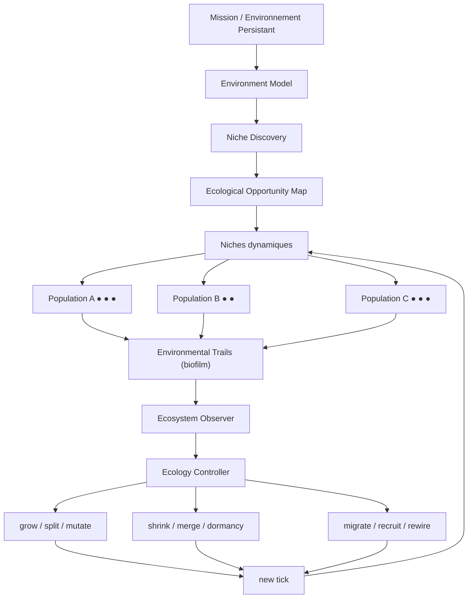
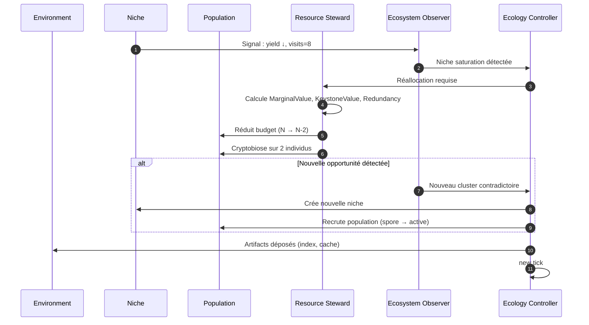
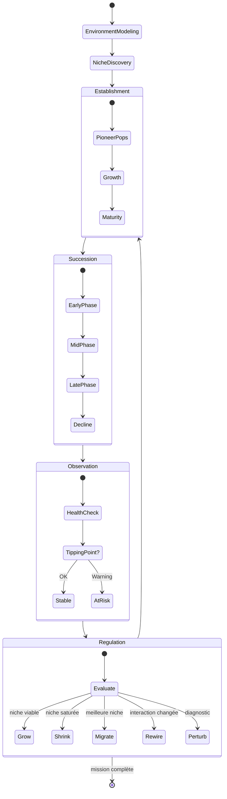

# Biome : Écologie Adaptative de GenOS

## 1. Principe fondamental

> **Biome est le protocole de GenOS pour maintenir et faire évoluer un ensemble de populations spécialisées dans un environnement dynamique, sous ressources limitées, lorsque la structure optimale du travail n'est pas connue à l'avance et doit émerger de l'interaction entre niches, populations, ressources et résultats.**

Biome n'est pas « A-Team avec allocation dynamique ». A-Team suppose que les domaines sont connus. Trinity suppose que les hypothèses sont identifiables. **Biome suppose que la structure de recherche elle-même doit émerger.**

La distinction est fondamentale :

```text
Trinity
    plusieurs hypothèses concurrentes
    → laquelle résiste aux preuves ?

A-Team
    plusieurs expertises complémentaires
    → comment faire fonctionner leurs contributions ensemble ?

Biome
    environnement + populations + niches + ressources
    → quelles niches valent encore la peine d'être exploitées ?
    → quelles populations doivent croître ou décroître ?
    → où déplacer les ressources ?
    → quelles interactions deviennent dangereuses ?
    → quelles nouvelles niches apparaissent ?
    → comment survivre aux perturbations ?
```

Biome devient **l'écologie adaptative** de GenOS : le système utilisé lorsque l'on ne sait pas seulement *qui doit faire quoi*, mais lorsque l'on doit continuellement décider **quelles niches valent encore la peine d'être exploitées, quelles populations doivent croître ou décroître, où déplacer les ressources, quelles interactions deviennent dangereuses, quelles nouvelles niches apparaissent et comment survivre aux perturbations**.

---

## 2. Ce que Biome actuel fait réellement

Le dépôt possède déjà plusieurs briques réelles.

`biomeCoordinationService.js` crée une session persistante avec une organisation `energy_huddle`, une matrice biofilm, quatre rôles génériques, une allocation de budget proportionnelle à `demand × priority`, une étape de foraging et une métrique de santé basée sur l'entropie de Shannon.

La session est persistée dans `topology_sessions`, et les opérations `snapshot`, `allocate`, `forage`, `health` sont accessibles via `genos_topology_session`.

Le foraging repose réellement sur `foragingScoutHarvesterService.js`, avec une approximation du Marginal Value Theorem et des pas de Lévy. GenOS possède aussi `SearchPatchService`, capable de représenter un patch comme une hypothèse, famille de fichiers, base documentaire, stratégie, branche, outil ou espace de paramètres.

Il existe également déjà plusieurs briques qu'un Biome ultime devrait impérativement réutiliser plutôt que réimplémenter : la Natural Creative Ecology, le moteur POET, la curiosité fondée sur le progrès, la plasticité phénotypique, l'évolution multi-îlots, les organismes procéduraux portant explicitement `niche`, `populationId` et `biomeId`, la stigmergie et les mécanismes de résilience.

Donc la matière première est là. Mais le moteur écologique n'est pas encore là.

---

## 3. Le problème principal : le Biome ne ferme aucune boucle écologique

Actuellement, quelqu'un doit explicitement appeler `allocate()`, `forage()`, `health()`. Ces opérations écrivent ensuite leurs résultats dans la matrice biofilm.

Il n'existe pas encore de boucle :
```text
observe → estimate ecological state → decide → grow / shrink / migrate / split populations → reallocate resources → change search behaviour → observe effect
```

Le document `topologies-et-capacites.md` le reconnaît d'ailleurs : la boucle autonome Biome reste à réaliser.

**Le futur Biome ne doit pas avoir pour rôle de fournir des fonctions écologiques à l'orchestrateur. Il doit être la boucle écologique.**

---

## 4. Les quatre rôles actuels ne doivent pas être quatre workers

Aujourd'hui `biologicalModeService` produit :
```text
environment_mapper
resource_steward
population_specialist
ecosystem_observer
```

Ce modèle est intéressant comme **fonctions écologiques**, mais mauvais comme composition concrète.

Un Biome ne devrait pas être 4 agents. Il devrait être :
```text
1 Environment Model
1 Resource Regulation Plane
N niches
N populations
N×M individuals
1 Ecosystem Observer Plane
```

Exemple :
```text
                        BIOME
                          │
                 Environment Model
                          │
        ┌─────────────────┼─────────────────┐
        ▼                 ▼                 ▼
   Niche: Repo       Niche: Web       Niche: Formal
   population         population       population
    scanners          researchers       solvers
     ● ● ●             ● ●              ● ●
        │                 │                 │
        └────────── ecological links ──────┘
                          │
                   Resource Steward
                          │
                   Ecosystem Observer
```

`environment_mapper`, `resource_steward` et `ecosystem_observer` deviennent principalement **services de contrôle**. `population_specialist` devient une abstraction de population, pas un unique agent.

---

## 5. La vraie unité fondamentale doit être la niche

A-Team possède des responsabilités. Biome doit posséder des **niches**.

Une niche n'est pas simplement `domain = security`. Une niche est un espace de conditions dans lequel une certaine stratégie/population est utile.

Je définirais :
```text
Niche {
    nicheId
    opportunity
    environmentDescriptor
    requiredCapabilities
    availableResources
    entryConditions
    survivalConditions
    exitConditions
    rewardSignals
    informationSignals
    competitors
    mutualists
    predators
    dependencies
    carryingCapacity
    occupancy
    productivity
    novelty
    informationGain
    uncertainty
    stability
    disturbanceLevel
}
```

Exemples de niches GenOS :
```text
"chercher la cause dans l'historique Git"
"explorer la DB"
"tester l'hypothèse de race condition"
"chercher une preuve formelle"
"explorer documentation externe"
"fuzzing de parser"
"optimisation ILP"
"chercher exemples similaires dans memory"
```

C'est radicalement différent d'un domaine. Une même mission backend peut contenir dix niches.

---

## 6. Et les niches doivent pouvoir apparaître et disparaître

C'est là que Biome devient réellement intéressant.

Le modèle traditionnel à la MAP-Elites place des solutions dans des niches définies selon des dimensions comportementales. MAP-Elites cherche précisément à conserver des solutions **diverses et performantes**, au lieu de ne garder qu'un unique optimum ([arXiv:1504.04909][1]).

Mais l'une des limites d'une grille fixe est justement que les dimensions pertinentes peuvent ne pas être connues à l'avance. Des approches plus ouvertes comme AURORA cherchent à apprendre ou modifier les descripteurs de niches ([arXiv:2406.04235][2]).

Pour GenOS, cela suggère :
```text
Niche discovery ≠ static array declared at mission start
```

Le Biome doit pouvoir observer :
```text
large unexplained residual
new capability discovered
repeated handoff failures
novel artifact
new source
new failure mode
```
et créer `NEW NICHE`.

Exemple :
```text
initial niches: code inspection, tests, logs
logs population discovers clock drift anomalies
→ new niche: distributed-time investigation
→ recruit/create population
```

C'est beaucoup plus proche de la vraie écologie : les organismes ne font pas que s'adapter à une niche statique ; ils peuvent choisir, conformer et parfois modifier leur niche. La littérature écologique moderne distingue justement niche choice, niche conformance et niche construction ([Nature][3]).

---

## 7. Il faut distinguer niche fondamentale et niche réalisée

Cette idée biologique devient extrêmement utile pour GenOS.

Un agent possède une **fundamental niche** = tout ce qu'il pourrait théoriquement traiter compte tenu de son DNA, outils, modèle, skills, mémoire, cognitive recipe.

Mais sa **realized niche** dépend de : available resources, competition, other agents, environment, current mission, permissions.

Exemple :
```text
Agent A
fundamental niche: Python, SQL, debugging, algorithms
actual Biome: Python debugging already saturated, no SQL specialist present
realized niche: SQL investigation
```

Ça rendrait AgentDNA, phénotype et Biome extrêmement bien connectés.

---

## 8. Il faut arrêter de considérer les ressources comme seulement des tokens

`allocateResources()` gère aujourd'hui un entier.

Le Resource Steward ultime doit gérer un vecteur :
$$R_i = (Tokens, Time, Calls, GPU, Memory, Tools, Concurrency, Risk, Attention)$$

Chaque niche possède une demande différente :
```text
Formal proof niche: high compute, low web, high verification
Web research niche: high browsing, moderate LLM, high provenance
Fuzzing niche: high execution, low LLM
```

Cela devient une véritable économie écologique.

---

## 9. La carrying capacity doit devenir réelle

Chaque niche devrait avoir :
$$K_i = f(resources, marginal\ productivity, contention, coordination\ overhead)$$
et :
$$Pressure_i = \frac{Population_i}{K_i}$$

Si N << K : la niche peut recruter.
Si N ≈ K : elle est saturée.
Si N > K : GenOS doit geler des individus, les réaffecter, fusionner des workers redondants, les déplacer ou les terminer.

Cela transforme `workerGarage` d'une simple capacité globale en composante d'une écologie de ressources.

---

## 10. La fitness doit être locale et environnementale

Le Biome ne doit surtout pas calculer un unique score global d'agent.

Un agent peut être mauvais globalement mais excellent dans une niche rare. Le `ProceduralOrganism` possède déjà `ecology.niche` et `fitness.components`.

Je définirais :
$$Fitness(a,n,t) = Success + Evidence + InformationGain + NoveltyContribution + Complementarity - Cost - Risk - ResourcePressure$$

Un même agent :
```text
Agent A
fitness(repo_scan) = .91
fitness(web_research) = .42
fitness(formal_proof) = .11
```

Il ne faut donc pas tuer Agent A parce que sa fitness moyenne vaut .48. Il possède une niche dans laquelle il est excellent. C'est précisément l'esprit Quality-Diversity ([arXiv:1504.04909][1]).

---

## 11. Biome devrait maintenir un véritable archive de niches

Je créerais conceptuellement :
```text
EcologicalArchive

Niche 1
 ├ elite populations
 ├ best individuals
 ├ failed adaptations
 └ stepping stones

Niche 2
 ├ ...
```

Ce n'est pas exactement MAP-Elites, car GenOS doit conserver plus que le meilleur individu. Il faut conserver : best performer, most robust, cheapest, most novel, best verifier, best stepping stone. Chaque niche possède potentiellement un petit front de Pareto.

Une solution non optimale aujourd'hui peut être utile plus tard. POET a justement montré l'intérêt des **stepping stones** : une solution développée dans un environnement peut débloquer un autre environnement que l'optimisation directe ne résolvait pas ([arXiv:1901.01753][4]).

GenOS possède déjà `cryptobiosisSporeService` et `fossilizationService`. Biome devrait être l'un des principaux consommateurs de ces mécanismes.

---

## 12. Une population doit réellement être une population

Aujourd'hui `population_specialist` est un rôle singulier.

Je remplacerais cela par :
```text
Population {
    populationId
    nicheId
    individuals[]
    genotypeDistribution
    phenotypeDistribution
    strategies[]
    cognitiveRecipes[]
    resourcePool
    localMemory
    culturalMemory
    diversity
    productivity
    health
    birthRate
    deathRate
    migrationRate
    lineage
}
```

Les individus peuvent être différents (different model, provider, recipe, toolset, strategy, memory subset) mais ils appartiennent à une population parce qu'ils exploitent la même niche.

---

## 13. Les populations doivent avoir plusieurs stratégies de reproduction

Selon la situation :
```text
clone best individual
mutate strategy
recombine two useful individuals
spawn specialist
import individual from another niche
reactivate dormant spore
```

Pas nécessairement biologique dans les noms. Le principe est : **quand une niche est prometteuse, produire de nouvelles variantes autour de ce qui fonctionne, sans perdre la diversité.** C'est ici que l'évolution multi-îlots actuelle de GenOS peut se brancher directement.

---

## 14. Il faut introduire compétition, mutualisme et prédation informationnelle

Toutes les relations entre populations ne sont pas des dépendances. Je donnerais à Biome cinq relations fondamentales :

| Relation | Traduction GenOS |
|----------|------------------|
| compétition | deux populations consomment la même ressource/niche |
| mutualisme | chacune augmente la productivité de l'autre |
| commensalisme | A bénéficie de B sans effet notable sur B |
| inhibition | A produit un signal qui invalide/diminue B |
| prédation | une population teste/détruit systématiquement les artefacts faibles d'une autre |

Exemple :
```text
Generator population ↕ mutualism Verifier population
Generator → provides candidates
Verifier → eliminates invalid ones
```

Ou :
```text
2 web-search populations → same sources, same queries → competition / redundancy → merge or redirect one
```

---

## 15. Le Biome doit détecter la redondance fonctionnelle

Deux populations peuvent avoir des rôles différents mais produire le même signal. Le Resource Steward doit constater :
$$MarginalContribution(B|A) \approx 0$$
et : shrink B, redirect B, or merge populations.

À l'inverse, une population minoritaire produisant régulièrement des informations uniques doit être protégée. Cela dépasse énormément une allocation `demand × priority`.

---

## 16. L'entropie de Shannon actuelle n'est pas une santé d'écosystème

`ecosystemHealth()` fait actuellement essentiellement `entropy(labels) >= .5 → resilient`. C'est trop faible. Six labels différents peuvent donner une grande diversité sans produire le moindre résultat utile.

Une vraie santé écologique doit être multidimensionnelle :
$$H = f(Diversity, FunctionalCoverage, Productivity, ResourcePressure, DependencyHealth, RecoveryCapacity, Redundancy, Novelty, Stability)$$

Je séparerais notamment :
```text
taxonomic diversity = combien de types différents ?
functional diversity = combien de comportements/capacités différents ?
response diversity = plusieurs façons différentes de remplir la même function ?
productivity = valeur réellement produite
resilience = capacité à absorber/recover d'une perturbation
```

La littérature sur la résilience écologique insiste justement sur la distinction entre résistance, récupération et changement de régime, plutôt qu'un simple indice de diversité ([Nature][5]).

---

## 17. Il faut détecter les tipping points

Biome doit observer les signes : rising latency, increasing retries, declining marginal yield, dependency backlog, resource concentration, falling diversity, increased error correlation — qui peuvent annoncer un regime shift avant le crash.

Exemple :
```text
80% budget → one population
70% new evidence → derivative of same source
recovery reserve → 0
latency → rising
```

Localement, tout semble encore fonctionner. Mais le système devient fragile. Biome doit pouvoir dire `ECOSYSTEM_APPROACHING_TIPPING_POINT` et agir avant l'effondrement.

---

## 18. Les perturbations doivent devenir un outil de diagnostic

Un vrai Biome ne doit pas seulement subir les perturbations. GenOS peut en injecter de petites et contrôlées :
```text
remove one worker
reduce one niche budget
disable one source
withhold one tool
delay one dependency
```
et mesurer : does ecosystem continue? what compensates? which function collapses?

Cela donne : resistance, recovery time, functional redundancy, keystone populations.

Des travaux écologiques montrent que la résilience dépend notamment de la connectivité et du type de perturbation ([Nature][6]). Ce serait l'équivalent écologique du chaos engineering.

---

## 19. Cela permet d'identifier les « keystone populations »

Certaines populations utilisent peu de ressources mais empêchent l'effondrement global. Exemple : un `dependency auditor` ne produit que 2 % des artifacts, mais sa suppression fait chuter integration success 94% → 51 %.

Le Resource Steward doit mesurer :
$$KeystoneImpact(p) = Performance(E) - Performance(E \setminus p)$$
par perturbations contrôlées ou historique causal.

---

## 20. Introduire la succession écologique

C'est probablement l'un des mécanismes les plus intéressants absents du repo.

Les populations utiles au début d'une mission ne sont pas celles utiles à la fin. Exemple développement :
```text
EARLY SUCCESSION: exploration, requirements, repo mapping, research
MID SUCCESSION: architecture, implementation, tests
LATE SUCCESSION: hardening, integration, security, documentation
```

Donc les populations doivent apparaître, croître puis décliner. Pas rester vivantes jusqu'à la fin parce qu'elles ont été lancées au départ.

Un Biome mature doit avoir : pioneer populations, established populations, late-stage populations, decomposers/archive workers — sans forcément exposer ces métaphores biologiques à l'API.

---

## 21. Certaines populations doivent modifier l'environnement lui-même

C'est la **niche construction**.

Exemple : une search population crée index, summary, cache, graph. Les futures populations ont désormais un environnement plus facile. Ou : une population test crée un harness automatique. L'environnement de recherche vient de changer.

Donc :
$$Environment_{t+1} = Environment_t + Artifacts(populations_t)$$

Le Biome n'est plus seulement « agents adapt to environment » mais « agents ↔ environment ».

---

## 22. Biome + POET doit former une boucle naturelle

Tu as déjà `poetExecutionEngine.js` et `environmentGeneratorService`. POET couple précisément environnements et solutions, crée de nouveaux défis, puis transfère des solutions entre environnements ; ce transfert de stepping stones est une part centrale de son intérêt ([arXiv:1901.01753][4]).

Je ne créerais donc surtout pas un second POET dans Biome. Je ferais :
```text
Biome
  ├ niche ecology
  ├ resource dynamics
  ├ populations
  │
  └── when environment itself should evolve → NCE / POET
```

Et dans l'autre direction :
```text
POET creates new environment → Biome decides:
    which population can colonize it?
    do we spawn one?
    transfer existing individual?
    is this niche viable?
```

C'est un couplage extrêmement naturel.

---

## 23. XLand apporte une autre leçon importante

L'expérience XLand de DeepMind générait dynamiquement les tâches en fonction de la progression des agents, en cherchant des défis ni trop simples ni trop difficiles, avec plusieurs générations et une grande variété d'environnements et co-joueurs ([Google DeepMind][7]).

Pour GenOS, Biome challenge difficulty pourrait viser :
$$P(success) \in [\alpha, \beta]$$

Cela rejoint directement le `curiosityService` actuel : learning progress, information gain, novelty, cost, risk. Donc le Resource Steward devrait consommer **Curiosity**, pas inventer sa propre métrique d'intérêt.

---

## 24. Le foraging actuel est utile mais mathématiquement trop simplifié

`evaluatePatchYield()` calcule actuellement `recentInfoGain / elapsedTimeSec` et compare à un `envMeanReturnRate` fixe.

La vraie décision devrait tenir compte de : travel/switch cost, expected alternative yield, uncertainty, remaining patch potential, parallel occupancy, risk.

Plus précisément :
$$Stay(p) \iff MarginalReturn(p) > ExpectedReturn(alternatives) - SwitchCost$$

Et surtout : `PATCH_DEPARTURE` doit réellement produire un comportement : stop exploiting current patch, select new niche/patch, move worker/population, update resource allocation. Aujourd'hui il ne donne qu'un conseil.

---

## 25. Même problème pour le Lévy flight

`computeLevyFlightStep()` retourne `LOCAL_INTENSIVE_EXPLOITATION` ou `LEVY_MACRO_JUMP` mais n'exécute rien.

Dans le Biome ultime :
```text
LOCAL  → neighboring patch selection
MACRO  → distant niche search, new source family, new representation, different tool, different strategy
```

Le « stepLength » doit être traduit en distance réelle dans un espace : capability distance, semantic distance, source distance, strategy distance, repository graph distance. Sinon le Lévy flight reste une métaphore.

---

## 26. Le biofilm doit devenir mémoire environnementale

`biofilmMatrixService` est actuellement un petit key-value store versionné. Bonne fondation.

Mais le biofilm ultime devrait porter : resource gradients, risk gradients, evidence deposits, dead ends, productive niches, toxicity/repellent signals, population density, dependencies, artifacts.

Une population peut donc apprendre indirectement « don't search there » sans conversation LLM. Cela devient de la vraie stigmergie.

Exemple :
```text
patch:file-family/auth    yield=.02  visits=8  repellent=.91
patch:git-history/oauth    yield=.76  visits=2  attractant=.83
```

Un nouveau worker n'a pas besoin de recevoir un long rapport. Il suit le gradient.

---

## 27. Cela peut rendre le « 0 prompt inutile » extrêmement puissant

Biome pourrait communiquer principalement par état environnemental compact : resource gradient, pheromone, risk marker, occupancy, yield, claim refs — plutôt que Worker A writes 3,000 tokens / Worker B reads 3,000 tokens.

La communication devient agent → environment → agents et non agent → agent → agent → agent.

C'est l'un des cas où ton biomimétisme peut réellement réduire les tokens plutôt que simplement donner des noms biologiques aux messages.

---

## 28. Les interactions doivent être rewired dynamiquement

Une revue de 2026 sur les réseaux écologiques insiste justement sur le fait que les réseaux d'interaction ne sont pas statiques : les organismes rewiring leurs interactions face à des changements de conditions, avec des conséquences sur la résilience ([Nature][8]).

C'est directement exploitable. Aujourd'hui `population A ↔ population B` ne devrait pas être immuable. Si B stops providing useful information et C becomes a better neighbor, le réseau devrait devenir A ↔ C.

C'est différent de Rhizome : Rhizome cherche surtout des routes/capacités. Biome rewiring vise les relations écologiques en fonction de leur effet sur la santé et la productivité du système.

---

## 29. Les ressources communes introduisent le problème des commons

C'est important si des agents autonomes choisissent eux-mêmes leur consommation. Des expériences LLM sur la gestion d'une ressource commune montrent que la durabilité collective peut être difficile à atteindre et dépend fortement des mécanismes de communication et de raisonnement sur les conséquences à long terme ([arXiv:2404.16698][9]).

Donc Biome ne doit pas demander naïvement « worker, how much budget do you need? » et croire la réponse. Il faut : request, observed productivity, historical efficiency, criticality, marginal return, ecosystem state — puis décision du Steward.

---

## 30. Un vrai modèle d'allocation

Au lieu de $w_i = demand_i \times priority_i$, je viserais :
$$Allocation_i \propto \frac{MarginalValue_i \times InformationGain_i \times Criticality_i \times LearningProgress_i \times KeystoneValue_i}{Cost_i \times ResourcePressure_i \times Redundancy_i \times Risk_i}$$

avec contraintes $R_i \ge R_{min,i}$ et $\sum R_i + R_{reserve} \le R$.

La réserve doit être réelle. Biome sans réserve de récupération n'est pas résilient.

---

## 31. TerraLingua 2026 montre une direction intéressante

Un travail très récent, TerraLingua, étudie précisément une **écologie persistante de LLM** avec ressources limitées et durée de vie limitée, où des artefacts persistent au-delà des individus et influencent les générations futures. Les auteurs rapportent notamment émergence de division du travail, normes coopératives, structures de groupe et lignées d'artefacts ([arXiv:2603.16910][10]).

Je ne copierais évidemment pas TerraLingua. Mais il valide expérimentalement que les variables : resource constraints, persistent artifacts, agent turnover, long-lived environment — produisent des dynamiques beaucoup plus intéressantes qu'une simulation multi-agent sans conséquence. Ces quatre propriétés devraient être centrales dans le Biome GenOS.

---

## 32. Une variante « Persistent Biome » devient donc particulièrement intéressante

Contrairement aux autres topologies qui peuvent disparaître avec une mission : Persistent Biome peut survivre aux missions. Par exemple un repo GenOS repository biome contient continuellement : code-analysis population, test population, security population, documentation population, dependency-monitor population.

Les missions entrent dans le Biome comme perturbations/opportunités. Les connaissances, niches et trails restent. C'est beaucoup plus proche de ton idée des daemons. Les daemons pourraient être les espèces résidentes d'un Biome persistant.

---

## 33. Les variants de Biome

Je ne créerais pas douze nouveaux orchestrateurs ; ce seraient des politiques écologiques.

| Variant | Caractéristique | Usage |
|---------|-----------------|-------|
| **Resource Biome** | compétition/allocation de ressources | budget limité, beaucoup d'agents |
| **Exploration Biome** | niches + foraging + curiosity | recherche, debugging inconnu |
| **Quality-Diversity Biome** | archive de niches et élites diverses | créativité, optimisation |
| **Successional Biome** | populations changent par phase | gros projets longs |
| **Resilience Biome** | redondance + perturbations + recovery | systèmes critiques |
| **Persistent Biome** | environnement longue durée | repo/project/organization |
| **Open-Ended Biome** | niches/environnements nouveaux | recherche NCE |
| **Adversarial Biome** | populations attaquent/défendent | cybersécurité |
| **Knowledge Biome** | sources = niches, agents = foragers | recherche profonde |
| **Compute Biome** | ressources matérielles comme environnement | local/cloud/multi-model |
| **Multi-scale Biome** | individus→populations→communautés | très grandes missions |

Les plus importants pour la V1 ultime seraient : Exploration, Resource, Resilience, Persistent, Quality-Diversity.

---

## 34. Cas d'utilisation exact : bug inconnu

C'est probablement un excellent exemple.

Mission : « Trouve le bug inconnu dans ce repo. »

A-Team présupposerait assez vite des responsabilités. Trinity présupposerait trois hypothèses. Biome peut commencer sans savoir où est le problème.
```text
Environment: repository
Initial niches: failing tests, logs, recent commits, static analysis, runtime behaviour
```
Populations explorent. Après quelques ticks :
```text
static analysis: yield ↓ → population shrinks
recent commits: yield ↑ → population grows
logs: discovers timing anomaly → new concurrency niche
concurrency niche finds reproducible race → verifier population colonizes it
```
C'est exactement le type de problème où la structure de recherche doit émerger.

---

## 35. Cas : deep research

Mission : « Détermine ce qui est réellement vrai sur X. »

Niches : academic literature, official docs, industry reports, code/repos, community reports, contradictory evidence.

Les populations peuvent se spécialiser par écosystème de source, pas par discipline. Une source saturée ou répétitive perd du budget. Un nouveau cluster contradictoire crée une nouvelle niche. Une population provenance/verifier agit comme contrôle écologique.

---

## 36. Cas : optimisation complexe

Par exemple Conway 99 ou optimisation combinatoire. Niches : CP-SAT, ILP, local search, symmetry breaking, constructive heuristics, evolution, formal bounds.

Les populations occupent chaque niche. Si CP-SAT makes rapid progress, elle croît. Si elle stagne, budget redirected. Une solution partielle produite par une niche peut coloniser une autre : local-search solution → warm start ILP. C'est un stepping stone ecological transfer.

---

## 37. Cas : cybersécurité

Niches : attack surface, authentication, permissions, dependencies, fuzzing, configuration, business logic.

Une vulnérabilité découverte crée une nouvelle niche exploitability qui peut contenir : exploit reproduction population, mitigation population, regression-test population. Et un patch peut modifier l'environnement, entraînant une nouvelle succession.

---

## 38. Cas : très gros repo

Le repo est l'environnement. Les modules deviennent des habitats. Les patches de recherche peuvent être : directory, dependency cluster, ownership cluster, runtime path, change hotspot.

Des populations se déplacent selon : complexity, bug density, change frequency, unknownness, test failure density. Tu obtiens quelque chose de beaucoup plus puissant qu'une simple découpe en sous-dossiers.

---

## 39. Cas : compute/model routing

Biome peut aussi optimiser l'utilisation des modèles. Habitat : local CPU, local GPU, cloud cheap, cloud frontier, formal solver.

Populations : light classifiers, heavy reasoners, code workers, verifiers.

Le Resource Steward peut observer quality / €, quality / token, latency, failure rate — et déplacer les populations. C'est une vraie écologie de compute.

---

## 40. Quand ne surtout pas utiliser Biome

Biome a un overhead important. Il ne faut pas l'utiliser pour :
```text
2+2
simple code patch
known linear workflow
three clean alternatives
well-known multidisciplinary project
shared-state realtime collaboration
```

Le bon test :
> Est-ce que je connais déjà la bonne décomposition ? Si oui, souvent A-Team.
> Est-ce que je compare quelques hypothèses ? Trinity.
> Est-ce que la structure de recherche, les populations utiles et l'allocation des ressources doivent changer en fonction de ce qu'on découvre ? Biome.

---

## 41. Biome vs Rhizome

La distinction doit rester nette.
```text
Rhizome: "où puis-je faire pousser une nouvelle route/capacité ?"
Biome: "quelles populations doivent vivre où, avec quelles ressources et quelles interactions ?"
```
Rhizome optimise le réseau d'accès aux capacités. Biome optimise l'écologie des populations dans l'environnement. Un Biome peut utiliser un Rhizome pour la connectivité interne.

---

## 42. Biome vs Métapopulation

```text
Biome = environnement + niches + interactions + ressources
Metapopulation = plusieurs populations séparées spatialement/logiquement avec migration, extinction et recolonisation
```

La métapopulation pourrait devenir une structure à l'intérieur d'un Biome. Exemple : Biome niche = debugging, metapopulation : island A → Python, island B → JS, island C → Rust.

---

## 43. Le modèle ultime du runtime

```text
MISSION / PERSISTENT ENVIRONMENT
             │
             ▼
      Environment Model
             │
             ▼
       Niche Discovery
             │
             ▼
   Ecological Opportunity Map
             │
     ┌───────┼─────────┐
     ▼       ▼         ▼
   Niche A  Niche B   Niche C
     │       │         │
    Pop A   Pop B     Pop C
   ● ● ●    ● ●      ● ● ●
     │       │         │
     └──── environmental trails ────┐
                                    │
                        Ecosystem Observer
                                    │
              ┌─────────────────────┼──────────────┐
              ▼                     ▼              ▼
           fitness              resources      interactions
              │                     │              │
              └────────────┬────────┴──────────────┘
                           ▼
                     Ecology Controller
                           │
         ┌─────────────────┼────────────────────┐
         ▼                 ▼                    ▼
       grow              shrink               migrate
       split             merge                dormancy
       mutate            recruit              rewire
                           │
                           ▼
                       new tick
```

C'est ça, l'implémentation ultime.

---

## 44. Les invariants du vrai Biome

Je fixerais ces invariants conceptuels :
```text
No population without a niche.
No niche without measurable opportunity or necessity.
No resource allocation without observed marginal value.
No "resilience" claim from diversity alone.
No foraging decision without behavioural consequence.
No ecological mechanism that exists only as metadata.
No permanent population simply because it existed at t0.
No consensus interpreted as health.
No dominant population allowed to erase useful functional diversity without evidence.
No ecosystem success if local successes produce global collapse.
```

---

## 45. Ce qui pourrait réellement placer Biome à un niveau inhabituel

Le différenciateur ne serait absolument pas « GenOS utilise des populations d'agents » ou « GenOS s'inspire de l'écologie ». Cela n'a pas beaucoup de valeur en soi.

Le différenciateur serait cette combinaison :
```text
dynamic niche discovery
+ quality-diversity
+ resource metabolism
+ information foraging
+ carrying capacity
+ persistent environmental memory
+ population birth/death/migration
+ succession
+ niche construction
+ perturbation/resilience
+ ecological network rewiring
+ POET environment coevolution
+ NCE curiosity
+ AgentDNA / phenotype adaptation
+ stepping-stone conservation
+ zero-prompt stigmergic coordination
```

À ma connaissance, les recherches actuelles explorent certaines de ces dimensions séparément : POET pour la coévolution environnement-solution, MAP-Elites/QD pour la diversité de solutions, XLand pour l'open-ended curriculum, GovSim pour la ressource commune, TerraLingua pour les écologies persistantes de LLM ([arXiv:1901.01753][4]).

**Le pari spécifique de GenOS serait de les rendre opérationnelles ensemble à l'intérieur d'un orchestrateur généraliste.** Mais il faudra le démontrer expérimentalement : ce serait prématuré de dire que GenOS les dépasse simplement parce que les mécanismes existent.

Le benchmark décisif sera de montrer que, face à une tâche dont la structure de recherche est inconnue, **le Biome découvre de meilleures niches, réalloue intelligemment son compute et conserve davantage de pistes utiles qu'un orchestrateur statique, pour un budget total identique**.

C'est à ce moment-là que le biomimétisme de GenOS devient particulièrement convaincant : **la nature n'est plus utilisée comme catalogue de noms ou de solutions ; l'écosystème devient effectivement le processus de recherche.**

---

## 46. Contrat runtime

### BiomeSession

```typescript
BiomeSession {
    sessionId
    missionId
    missionSnapshotHash
    environmentModel
    variant  // resource | exploration | quality_diversity | successional | resilience | persistent | open_ended | adversarial | knowledge | compute | multi_scale
    niches[]
    populations[]
    resourceSteward
    observer
    allocationModel
    status
    tickCount
}
```

### Niche

```typescript
Niche {
    nicheId
    opportunity
    environmentDescriptor
    requiredCapabilities
    availableResources
    entryConditions
    survivalConditions
    exitConditions
    rewardSignals
    informationSignals
    competitors[]
    mutualists[]
    predators[]
    dependencies[]
    carryingCapacity
    occupancy
    productivity
    novelty
    informationGain
    uncertainty
    stability
    disturbanceLevel
}
```

### Population

```typescript
Population {
    populationId
    nicheId
    individuals[]
    genotypeDistribution
    phenotypeDistribution
    strategies[]
    cognitiveRecipes[]
    resourcePool
    localMemory
    culturalMemory
    diversity
    productivity
    health
    birthRate
    deathRate
    migrationRate
    lineage
}
```

### Individual

```typescript
Individual {
    individualId
    populationId
    nicheId
    phenotype
    model
    provider
    cognitiveRecipe
    toolset
    resourceAllocation
    fitnessHistory
    lineage
    status  // active | dormant | migrating | terminated
}
```

---

## 47. Architecture du système (fichiers)

| Fichier | Rôle |
|---------|------|
| `backend/src/services/biomeCoordinationService.js` | Composition, allocation, foraging, santé |
| `backend/src/services/biologicalModeService.js` | Définition et composition des rôles Biome |
| `backend/src/services/foragingScoutHarvesterService.js` | Foraging (Marginal Value Theorem, Lévy flights) |
| `backend/src/services/agentAutonomyPlanService.js` | Plan d'autonomie et activation des workers |
| `backend/src/services/agentFleetService.js` | Création, exécution et validation des workers |
| `backend/src/services/agentOrchestrationState.js` | État de mission, continuations et télémétrie |
| `backend/src/services/workerGarageService.js` | Gestion des slots de workers |
| `backend/src/services/proceduralBiomePopulationService.js` | Populations procédurales par niche |
| `backend/src/services/cryptobiosisSporeService.js` | Dormance et réactivation |
| `backend/src/services/fossilizationService.js` | Fossilisation et archive |
| `crates/genos-orchestrator/src/director_planning.rs` | Planification avec preamble Biome |

---

## 48. Télémétrie et observabilité

Nouvelles métriques enregistrées pour chaque session Biome :
```text
sessionId, variant, tickCount
niches: [{nicheId, carryingCapacity, occupancy, productivity, informationGain, stability}]
populations: [{populationId, nicheId, size, diversity, health, birthRate, deathRate, migrationRate}]
resources: {allocated, consumed, reserve, pressure}
ecologicalHealth: {taxonomicDiversity, functionalDiversity, responseDiversity, productivity, resilience, tippingPointProximity}
interactions: [{source, target, type, strength}]
successionPhase: exploration | establishment | maturity | decline
perturbations: [{type, target, effect, recoveryTime}]
keystonePopulations: [{populationId, impact}]
archiveStats: {nichesArchived, steppingStones, failedAdaptations}
stigmergySignals: {attractants, repellents, gradients}
```

---

## 49. Moniteur TUI natif (`genos run --mode biome --monitor`)

```text
backend/src/services/biomeMonitorServer.js
  ↓ NDJSON TCP 127.0.0.1:4592
genos-tui (crates/genos-cli/src/commands/biome_tui/)
  ├── live.rs      : client TCP, reconnexion automatique
  ├── model.rs     : applique snapshot / niche / population / signal
  └── view.rs      : rend Environment + Niches + panneau Écologie
```

Protocole NDJSON :
```json
{"type":"snapshot", sessionId, tick, niches:[...], populations:[...], ecology:{health, productivity, resilience}}
{"type":"niche_event", sessionId, nicheId, event, payload}
{"type":"population_event", sessionId, populationId, event, payload}
{"type":"ecology", sessionId, health, tippingPoint, successionPhase}
{"type":"stigmergy", sessionId, signals:[...]}
```

Commande :
```bash
genos run --mode biome --monitor
genos run --mode biome --monitor --session-id biome_1234567890_ab12
```

---

## 50. Références internes

- [ORCHESTRATION.md](../orchestration.md) : orchestration générale, budgets, gates et preuves
- [TRINITY.md](trinity.md) : orchestration comparative par hypothèses
- [A_TEAM.md](a-team.md) : orchestration multidisciplinaire par domaines
- [RUNTIME_AGENTIQUE.md](../../01-concepts/runtime-agentique.md) : runtime des agents autonomes
- [BIOLOGIE_COMPUTATIONNELLE.md](../../01-concepts/biologie-computationnelle.md) : cadre biologique général
- [biomeCoordinationService.js](../../../backend/src/services/biomeCoordinationService.js) : coordination opérationnelle
- [biologicalModeService.js](../../../backend/src/services/biologicalModeService.js) : définition des rôles
- [foragingScoutHarvesterService.js](../../../backend/src/services/foragingScoutHarvesterService.js) : foraging

---

## 51. Références externes

| Référence | Apport pour Biome |
|-----------|-------------------|
| [MAP-Elites, Mouret & Clune 2015](https://arxiv.org/abs/1504.04909) | Archive de solutions diverses et performantes par niche |
| [AURORA, Faldor & Cully 2024](https://arxiv.org/pdf/2406.04235) | Apprentissage non supervisé de descripteurs de niches |
| [Singh et al., Niche Concept 2024](https://www.nature.com/articles/s44358-025-00060-x) | Distinction niche choice / conformance / construction |
| [POET, Wang et al. 2019](https://arxiv.org/abs/1901.01753) | Coévolution environnement-solution, stepping stones |
| [Thorogood et al., Biological Resilience 2023](https://www.nature.com/articles/s44185-023-00022-6) | Résistance vs récupération vs changement de régime |
| [Pearson et al., Disturbance & Connectivity 2021](https://www.nature.com/articles/s41598-021-80987-1) | Le type de perturbation modifie l'effet de la connectivité |
| [XLand, DeepMind 2021](https://deepmind.google/blog/generally-capable-agents-emerge-from-open-ended-play/) | Curriculum open-ended, difficulté adaptative |
| [Ward et al., Rewiring 2026](https://www.nature.com/articles/s44358-026-00159-9) | Réseaux écologiques dynamiques, rewiring adaptatif |
| [GovSim, Piatti et al. 2024](https://arxiv.org/abs/2404.16698) | Gestion de ressources communes par agents LLM |
| [TerraLingua, Paolo et al. 2026](https://arxiv.org/abs/2603.16910) | Écologie persistante de LLM, artefacts durables |

---

## 52. Implementation & capacités (GenOS v3)

Depuis la v3, cette topologie est câblée au runtime :
- Service de coordination : `biomeCoordinationService.js`.
- Capacités requises : `STIGMERGY`, `SWARM_METRICS`, `WEB_FORAGING`, `RESILIENCE_RECOVERY`, `NicheDiscovery`, `EcologicalArchive`, `PERTURBATION_DIAGNOSTIC`.
- Contrat exposé par `topologyCapabilityService` et rendu effectif dans les leases d'outils.

---

*Schémas d'architecture et de régulation environnementale*

### Architecture Biome ultime



### Séquence de régulation écologique



### Machine à états du cycle écologique


