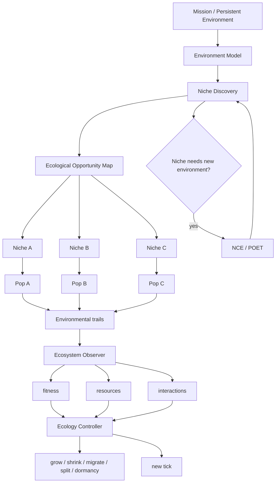

# Biome — Écologie Adaptative de GenOS

> *Biome est le protocole de GenOS pour maintenir et faire évoluer un ensemble de populations spécialisées dans un environnement dynamique, sous ressources limitées, lorsque la structure optimale du travail n'est pas connue à l'avance et doit émerger de l'interaction entre niches, populations, ressources et résultats.*

---

## 1. Définition

Soit un Biome $B_t$ à l'instant $t$ défini par le tuple :

$$B_t = (E_t, N_t, P_t, R_t, I_t)$$

où $E_t$ est l'état de l'environnement, $N_t$ l'ensemble des niches actives, $P_t$ l'ensemble des populations, $R_t$ l'allocation des ressources, $I_t$ la matrice d'interactions.

### 1.1 Ce que le runtime fait bien

| Brique | État | Référence |
|--------|------|-----------|
| Session persistante | ✓ | `biomeCoordinationService.js` |
| Matrice biofilm | ✓ | `biofilmMatrixService.js` |
| 4 rôles génériques | ✓ | `biologicalModeService.js` |
| Allocation proportionnelle | ✓ | `allocateResources()` |
| Foraging Marginal Value Theorem | ✓ | `foragingScoutHarvesterService.js` |
| Pas de Lévy | ✓ | `computeLevyFlightStep()` |
| SearchPatchService | ✓ | `searchPatchService.js` |
| NCE | ✓ | `naturalCreativeEcologyService.js` |
| POET | ✓ | `poetExecutionEngine.js` |
| Plasticité phénotypique | ✓ | `phenotypicPlasticityService.js` |
| Évolution multi-îlots | ✓ | Rust `evolution.rs` |
| Stigmergie | ✓ | `rhizomeCoordinationService.js` |
| Cryptobiose | ✓ | `cryptobiosisSporeService.js` |
| Fossilisation | ✓ | `fossilizationService.js` |

### 1.2 Le problème central : aucune boucle écologique fermée

L'implémentation ultime doit **être la boucle écologique** :

$$\text{observe} \rightarrow \text{estimate state} \rightarrow \text{decide} \rightarrow \text{grow/shrink/migrate/split} \rightarrow \text{reallocate} \rightarrow \text{change search} \rightarrow \text{observe effect}$$

### 1.3 Les 4 rôles ne doivent pas être 4 workers

L'architecture ultime est : **1 Environment Model + 1 Resource Regulation Plane + N niches + N populations + N×M individuals + 1 Ecosystem Observer Plane**.

### 1.4 La vraie unité fondamentale : la Niche

$$\text{Niche} = (\text{opportunity}, \text{environmentDescriptor}, \text{requiredCapabilities}, \text{availableResources}, \text{entryConditions}, \text{survivalConditions}, \text{exitConditions}, \text{rewardSignals}, \text{competitors}, \text{mutualists}, \text{predators}, \text{dependencies}, \text{carryingCapacity}, \text{occupancy}, \text{productivity}, \text{informationGain}, \text{uncertainty}, \text{stability}, \text{disturbanceLevel})$$

Exemples de niches GenOS : "chercher la cause dans l'historique Git", "explorer la DB", "tester l'hypothèse de race condition", "chercher une preuve formelle", "fuzzing de parser", "optimisation ILP".

### 1.5 Niche fondamentale vs réalisée

$$\text{FundamentalNiche}(a) = f(\text{DNA}, \text{tools}, \text{model}, \text{skills}, \text{memory}, \text{cognitive recipe})$$

$$\text{RealizedNiche}(a, t) = \text{FundamentalNiche}(a) \cap \text{AvailableResources}(t) \setminus \text{Competition}(t) \cap \text{MissionConstraints}(t)$$

### 1.6 Découverte dynamique de niches

$$\text{NewNiche}(t+1) = \text{DetectOpportunity}(E_t, P_t, R_t) \rightarrow \text{SpawnPopulation}(N_{new})$$

### 1.7 Références

- MAP-Elites : @url:`https://arxiv.org/abs/1504.04909`
- AURORA : @url:`https://arxiv.org/pdf/2406.04235`
- Hutchinson niche concept + Singh et al. 2024 : @url:`https://www.nature.com/articles/s44358-025-00060-x`

---

## 2. Écologie, Fitness, Carrying Capacity, Succession

### 2.1 Resources ≠ tokens

$$R_i = (\text{Tokens}, \text{Time}, \text{Calls}, \text{GPU}, \text{Memory}, \text{Tools}, \text{Concurrency}, \text{Risk}, \text{Attention})$$

Chaque niche possède une demande différente :
- Formal proof niche : high compute, low web, high verification
- Web research niche : high browsing, moderate LLM, high provenance
- Fuzzing niche : high execution, low LLM

### 2.2 Carrying capacity réelle

$$K_i = f(\text{resources}, \text{marginal productivity}, \text{contention}, \text{coordination overhead})$$

$$\text{Pressure}_i = \frac{\text{Population}_i}{K_i}$$

Si $N \ll K_i$ : peut recruter. Si $N \approx K_i$ : saturée. Si $N > K_i$ : freeze, reassign, merge, move, terminate.

### 2.3 Fitness locale et environnementale

$$\text{Fitness}(a,n,t) = \text{Success} + \text{Evidence} + \text{InformationGain} + \text{NoveltyContribution} + \text{Complementarity} - \text{Cost} - \text{Risk} - \text{ResourcePressure}$$

Un agent mauvais globalement mais excellent dans une niche rare ne doit pas être tué. Exemple : Agent A avec $\text{fitness}(\text{repo\_scan}) = .91$, $\text{fitness}(\text{web}) = .42$, $\text{fitness}(\text{formal}) = .11$.

### 2.4 EcologicalArchive

Chaque niche conserve un front de Pareto : best performer, most robust, cheapest, most novel, best verifier, best stepping stone. Référence POET stepping stones.

### 2.5 Population structurée

$$\text{Population} = (\text{populationId}, \text{nicheId}, \text{individuals}[], \text{genotypeDistribution}, \text{phenotypeDistribution}, \text{strategies}[], \text{resourcePool}, \text{localMemory}, \text{diversity}, \text{productivity}, \text{birthRate}, \text{deathRate}, \text{migrationRate}, \text{lineage})$$

### 2.6 Stratégies de reproduction

Clone best, mutate strategy, recombine two useful, spawn specialist, import from another niche, reactivate dormant spore. L'évolution multi-îlots actuelle de GenOS peut se brancher directement.

### 2.7 Relations écologiques

| Relation | Traduction GenOS |
|----------|------------------|
| Compétition | Deux populations consomment même ressource/niche |
| Mutualisme | Chacune augmente productivité de l'autre (Generator ↔ Verifier) |
| Commensalisme | A bénéficie de B sans effet notable sur B |
| Inhibition | A produit signal invalide/diminue B |
| Prédation | Population teste/détruit artefacts faibles d'une autre |

### 2.8 Détection de redondance fonctionnelle

$$\text{MarginalContribution}(B|A) \approx 0 \Rightarrow \text{shrink, redirect, merge}$$

À l'inverse, une population minoritaire produisant régulièrement des informations uniques doit être protégée.

### 2.9 Santé écologique multidimensionnelle

$$H = f(\text{Diversity}, \text{FunctionalCoverage}, \text{Productivity}, \text{ResourcePressure}, \text{DependencyHealth}, \text{RecoveryCapacity}, \text{Redundancy}, \text{Novelty}, \text{Stability})$$

Distinguer taxonomic diversity (types), functional diversity (comportements), response diversity (façons de remplir même fonction).

### 2.10 Succession écologique

EARLY SUCCESSION (exploration, requirements, repo mapping, research) → MID SUCCESSION (architecture, implementation, tests) → LATE SUCCESSION (hardening, integration, security, documentation). Populations pionnières → établies → tardive → décomposeurs.

### 2.11 Niche construction

$$\text{Environment}_{t+1} = \text{Environment}_t + \text{Artifacts}(\text{populations}_t)$$

Exemple : search population crée index/summary/cache/graph. Test population crée harness. L'environnement de recherche vient de changer.

### 2.12 Allocation des ressources

Au lieu de $w_i = \text{demand}_i \times \text{priority}_i$ :

$$\text{Allocation}_i \propto \frac{\text{MarginalValue}_i \times \text{InformationGain}_i \times \text{Criticality}_i \times \text{LearningProgress}_i \times \text{KeystoneValue}_i}{\text{Cost}_i \times \text{ResourcePressure}_i \times \text{Redundancy}_i \times \text{Risk}_i}$$

avec contraintes $R_i \ge R_{min,i}$ et $\sum R_i + R_{reserve} \le R$.

### 2.13 Références

- POET stepping stones : @url:`https://arxiv.org/abs/1901.01753`
- MAP-Elites : @url:`https://arxiv.org/abs/1504.04909`
- Résilience écologique : @url:`https://www.nature.com/articles/s44185-023-00022-6`
- Disturbance/Connectivity : @url:`https://www.nature.com/articles/s41598-021-80987-1`

---

## 3. Foraging, Biofilm, Perturbations, Communication

### 3.1 Foraging : décision optimale

La vraie décision doit tenir compte de :

$$\text{Stay}(p) \iff \text{MarginalReturn}(p) > \text{ExpectedReturn}(\text{alternatives}) - \text{SwitchCost}$$

PATCH_DEPARTURE doit produire un comportement réel : stop exploiting → select new niche/patch → move worker/population → update resource allocation.

### 3.2 Lévy flight : distance dans un espace réel

LOCAL_INTENSIVE_EXPLOITATION vs LEVY_MACRO_JUMP. Le stepLength doit être traduit en distance : capability distance, semantic distance, source distance, strategy distance, repository graph distance.

### 3.3 Le biofilm = mémoire environnementale

Le biofilm doit porter : resource gradients, risk gradients, evidence deposits, dead ends, productive niches, toxicity/repellent signals, population density, dependencies, artifacts.

Exemple : `patch:file-family/auth` yield=.02 visits=8 repellent=.91 vs `patch:git-history/oauth` yield=.76 visits=2 attractant=.83.

### 3.4 Communication par état environnemental compact

$$\text{agent} \rightarrow \text{environment} \rightarrow \text{agents}$$

Transmettre : pheromone, risk marker, occupancy, yield, claim refs. Réduction massive de tokens vs broadcast everything.

### 3.5 Perturbations contrôlées = diagnostic

GenOS peut injecter : remove one worker, reduce one niche budget, disable one source, withhold one tool, delay one dependency. Mesurer : does ecosystem continue? what compensates? which function collapses? → résistance, temps de récupération, redondance fonctionnelle, keystone populations.

### 3.6 Keystone populations

$$\text{KeystoneImpact}(p) = \text{Performance}(E) - \text{Performance}(E \setminus p)$$

Ne jamais regarder uniquement la production brute. Exemple : dependency auditor produit 2% des artifacts mais sa suppression fait chuter integration success de 94% à 51%.

### 3.7 Détection de tipping points

Biome doit observer : rising latency, increasing retries, declining marginal yield, dependency backlog, resource concentration, falling diversity, increased error correlation. Quand ces signaux dépassent un seuil :

$$\text{ECOSYSTEM\_APPROACHING\_TIPPING\_POINT}$$

### 3.8 Rewiring dynamique des interactions

$A \leftrightarrow B$ n'est pas immuable. Si $B$ cesse de fournir des informations utiles et $C$ devient meilleur voisin $\rightarrow A \leftrightarrow C$. Référence : rewiring écologique (Nature 2026).

### 3.9 XLand : challenge difficulty

$$P(\text{success}) \in [\alpha, \beta]$$

Trop facile → peu d'info. Trop dur → resource sink. Learning frontier → invest resources. Le Resource Steward devrait consommer Curiosity, pas inventer sa propre métrique.

### 3.10 TerraLingua : 4 propriétés centrales

Resource constraints, persistent artifacts, agent turnover, long-lived environment. Produit division du travail, normes coopératives, structures de groupe, lignées d'artefacts.

### 3.11 Biome + POET = boucle naturelle

Biome → niche ecology, resource dynamics, populations. Quand l'environnement lui-même doit évoluer → NCE / POET. Et inversement : POET crée nouvel environnement → Biome décide quelles populations colonisent.

### 3.12 Références

- XLand : @url:`https://deepmind.google/blog/generally-capable-agents-emerge-from-open-ended-play/`
- TerraLingua : @url:`https://arxiv.org/abs/2603.16910`
- Rewiring : @url:`https://www.nature.com/articles/s44358-026-00159-9`
- Résilience : @url:`https://www.nature.com/articles/s44185-023-00022-6`
- GovSim : @url:`https://arxiv.org/abs/2404.16698`

---

## 4. Variantes, Cas d'usage, Anti-usage, Architecture

### 4.1 Les 11 variantes

| Variant | Caractéristique | Usage |
|---------|-----------------|-------|
| **Resource Biome** | compétition/allocation ressources | budget limité, beaucoup d'agents |
| **Exploration Biome** | niches + foraging + curiosity | recherche, debugging inconnu |
| **Quality-Diversity Biome** | archive niches élites diverses | créativité, optimisation |
| **Successional Biome** | populations changent par phase | gros projets longs |
| **Resilience Biome** | redondance + perturbations + recovery | systèmes critiques |
| **Persistent Biome** | environnement longue durée | repo/project/organization |
| **Open-Ended Biome** | niches/environnements nouveaux | recherche NCE |
| **Adversarial Biome** | populations attaquent/défendent | cybersécurité |
| **Knowledge Biome** | sources = niches, agents = foragers | recherche profonde |
| **Compute Biome** | ressources matérielles | local/cloud/multi-model |
| **Multi-scale Biome** | individus→populations→communautés | très grandes missions |

Les plus importants pour la V1 ultime : Exploration, Resource, Resilience, Persistent, Quality-Diversity.

### 4.2 Cas d'usage typiques

**Bug inconnu** : Le repo est l'environnement. Initial niches : failing tests, logs, recent commits, static analysis, runtime behaviour. Après quelques ticks : static analysis yield ↓ population shrinks ; recent commits yield ↑ population grows ; logs discovers timing anomaly → new concurrency niche ; concurrency niche finds reproducible race → verifier population colonizes it.

**Deep research** : Niches = academic literature, official docs, industry reports, code/repos, community reports, contradictory evidence. Les populations se spécialisent par écosystème de source.

**Optimisation complexe** (Conway 99) : Niches = CP-SAT, ILP, local search, symmetry breaking, constructive heuristics, evolution, formal bounds. Si CP-SAT fait progrès rapide, elle croît. Si elle stagne, budget redirigé. Une solution partielle produite par une niche peut coloniser une autre (stepping stone ecological transfer).

**Cybersécurité** : Niches = attack surface, authentication, permissions, dependencies, fuzzing, configuration, business logic. Une vulnérabilité découverte crée nouvelle niche "exploitability" avec exploit reproduction population, mitigation population, regression-test population.

**Très gros repo** : Le repo est l'environnement. Les modules deviennent des habitats. Patches de recherche = directory, dependency cluster, ownership cluster, runtime path, change hotspot.

**Compute/model routing** : Habitat = local CPU, local GPU, cloud cheap, cloud frontier, formal solver. Populations = light classifiers, heavy reasoners, code workers, verifiers. Le Steward observe quality/€, quality/token, latency, failure rate et déplace les populations.

### 4.3 Quand NE PAS utiliser Biome

| Situation | Topologie alternative |
|-----------|----------------------|
| 2+2 | direct |
| Simple code patch | direct |
| Known linear workflow | A-Team |
| Three clean alternatives | Trinity |
| Well-known multidisciplinary project | A-Team |
| Shared-state realtime collaboration | Syncytium |

Tests :
- Est-ce que je connais déjà la bonne décomposition ? → A-Team
- Est-ce que je compare quelques hypothèses ? → Trinity
- Est-ce que la structure de recherche doit changer en fonction de ce qu'on découvre ? → Biome

### 4.4 Biome vs Rhizome

**Rhizome** : "Où puis-je faire pousser une nouvelle route/capacité ?"
**Biome** : "Quelles populations doivent vivre où, avec quelles ressources et quelles interactions ?"
Un Biome peut utiliser un Rhizome pour la connectivité interne.

### 4.5 Biome vs Métapopulation

**Biome** = environnement + niches + interactions + ressources
**Métapopulation** = plusieurs populations séparées avec migration, extinction, recolonisation
La métapopulation peut être une structure à l'intérieur d'un Biome (niche = debugging, metapopulation : island A → Python, island B → JS, island C → Rust).

### 4.6 Architecture ultime

### 4.7 Les 10 invariants du vrai Biome

1. No population without a niche
2. No niche without measurable opportunity or necessity
3. No resource allocation without observed marginal value
4. No "resilience" claim from diversity alone
5. No foraging decision without behavioural consequence
6. No ecological mechanism that exists only as metadata
7. No permanent population simply because it existed at t0
8. No consensus interpreted as health
9. No dominant population allowed to erase useful functional diversity without evidence
10. No ecosystem success if local successes produce global collapse

### 4.8 Les 16 mécanismes qui rendent Biome exceptionnel

1. Dynamic niche discovery
2. Quality-diversity
3. Resource metabolism
4. Information foraging
5. Carrying capacity
6. Persistent environmental memory (biofilm)
7. Population birth/death/migration
8. Succession
9. Niche construction
10. Perturbation/resilience
11. Ecological network rewiring
12. POET environment coevolution
13. NCE curiosity
14. AgentDNA/phenotype adaptation
15. Stepping-stone conservation
16. Zero-prompt stigmergic coordination

### 4.9 Objectif final

Face à une tâche dont la structure de recherche est inconnue, **le Biome découvre de meilleures niches, réalloue intelligemment son compute et conserve davantage de pistes utiles qu'un orchestrateur statique, pour un budget total identique.**

C'est à ce moment-là que le biomimétisme de GenOS devient particulièrement convaincant : **la nature n'est plus utilisée comme catalogue de noms ou de solutions ; l'écosystème devient effectivement le processus de recherche.**

### 4.10 Références complètes

- MAP-Elites : @url:`https://arxiv.org/abs/1504.04909`
- AURORA : @url:`https://arxiv.org/pdf/2406.04235`
- POET : @url:`https://arxiv.org/abs/1901.01753`
- XLand : @url:`https://deepmind.google/blog/generally-capable-agents-emerge-from-open-ended-play/`
- TerraLingua : @url:`https://arxiv.org/abs/2603.16910`
- GovSim : @url:`https://arxiv.org/abs/2404.16698`
- Résilience écologique : @url:`https://www.nature.com/articles/s44185-023-00022-6`
- Rewiring : @url:`https://www.nature.com/articles/s44358-026-00159-9`
- Hutchinson + Singh et al. : @url:`https://www.nature.com/articles/s44358-025-00060-x`
- Disturbance/Connectivity : @url:`https://www.nature.com/articles/s41598-021-80987-1`
