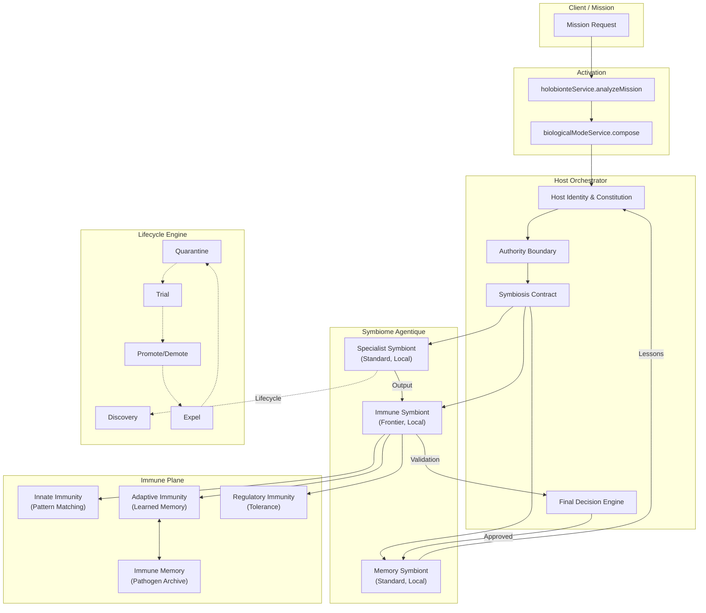
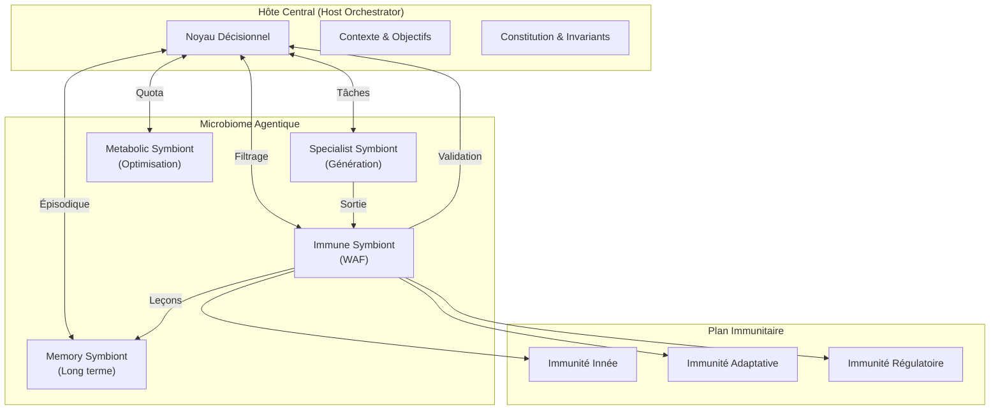
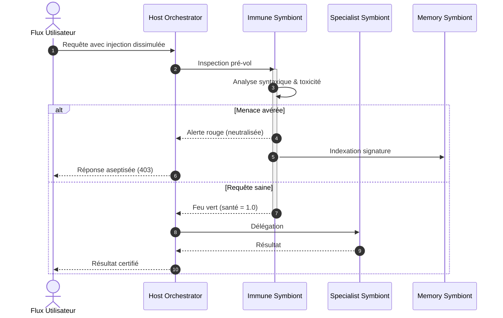
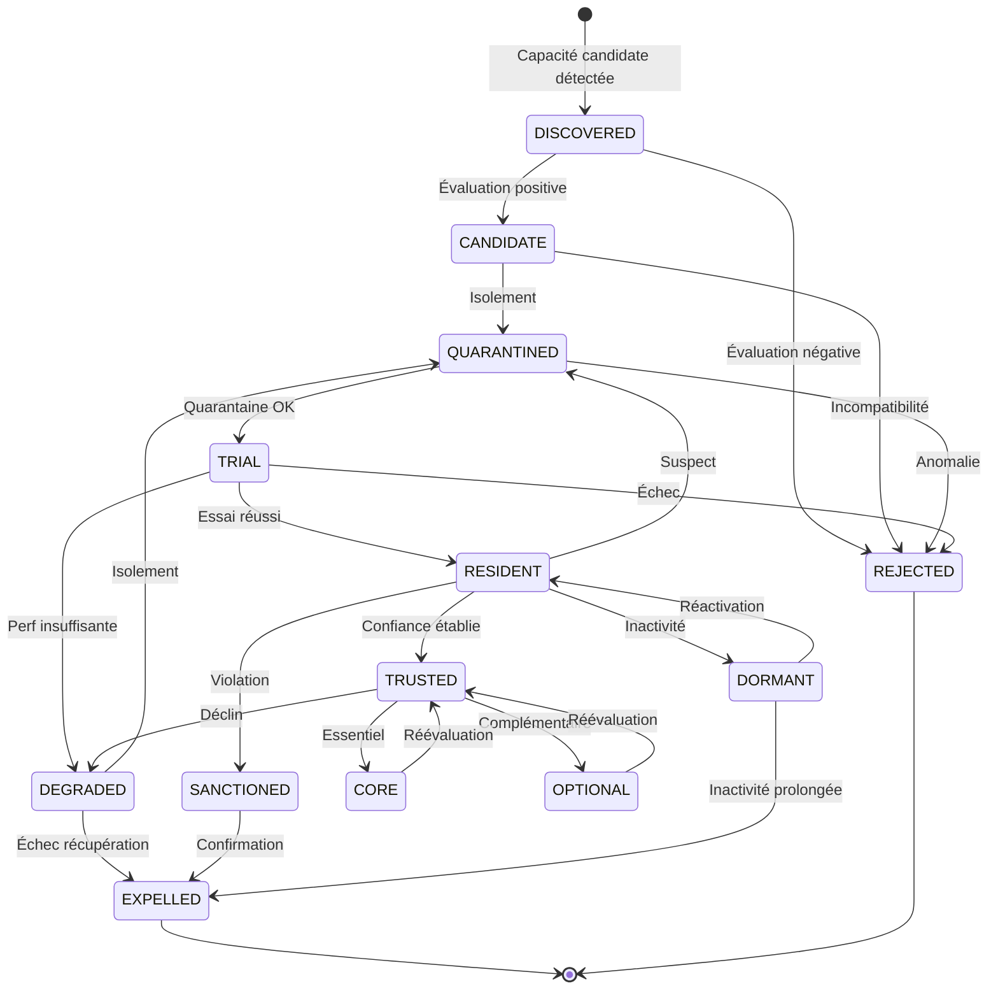
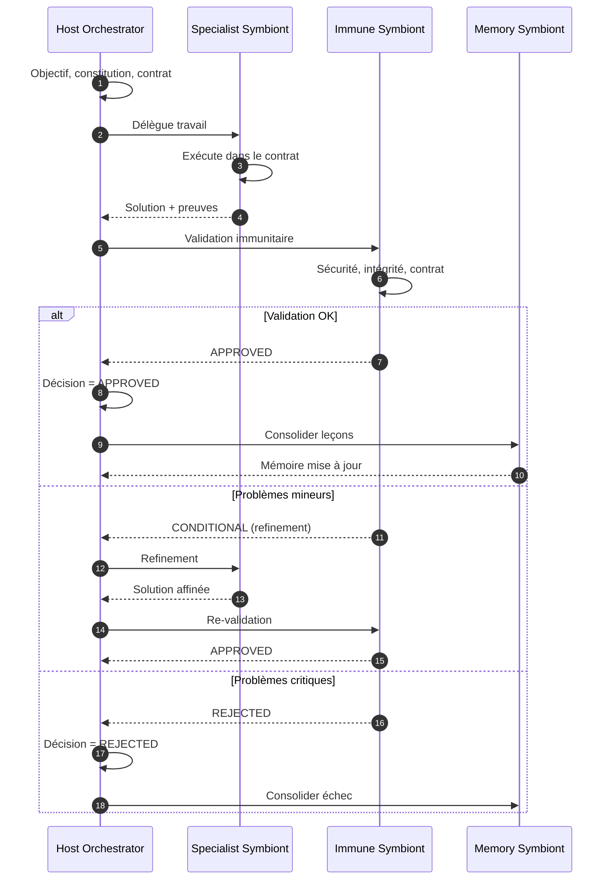

# Holobionte : Protocole de Symbiose Cognitive Host-Symbionte avec Immunité Adaptative

## 1. Définition

Holobionte dans GenOS est le protocole d'orchestration qui structure une mission comme une **collectivité intégrée host-symbiontes** où une identité cognitive stable (Host) acquiert, héberge, contrôle, nourrit, remplace et co-adapte des capacités symbiotiques spécialisées.

Contrairement aux topologies fondées sur l'égalité des agents, Holobionte repose sur une **symbiologie fonctionnelle avec autorité centrale** où :

1. **HostIdentity** : définit la mission, la constitution, la mémoire, l'autorité et la lignée ;
2. **SymbiosisContract** : formalise capacités offertes, ressources demandées, limites d'autorité et conditions de résiliation ;
3. **RelationshipValue** : mesure la valeur nette de chaque relation symbiotique ;
4. **Symbiont Lifecycle** : régit acquisition, quarantaine, essai, résidence, confiance et départ ;
5. **Immune Plane** : protège l'hôte contre comportements pathogènes, parasitaires ou dysbiotiques ;
6. **ResourceAllocation** : distribue les ressources proportionnellement à la contribution vérifiée, la criticité et la fiabilité.

Le mot « Holobionte » vient de la biologie : un holobionte est un organisme hôte et l'ensemble de ses micro-organismes symbiotiques formant une unité fonctionnelle cohérente.

Le cœur fonctionnel est réparti entre :
- [backend/src/services/biologicalModeService.js](../../../backend/src/services/biologicalModeService.js) : composition des rôles symbiotiques.
- [backend/src/services/holobionteService.js](../../../backend/src/services/holobionteService.js) : analyse de mission et activation.
- [backend/src/services/immuneSystem.js](../../../backend/src/services/immuneSystem.js) : système immunitaire adaptatif.
- [backend/src/services/agentOrchestrationState.js](../../../backend/src/services/agentOrchestrationState.js) : état partagé et synchronisation.
- [backend/src/services/symbioteRuntimeService.js](../../../backend/src/services/symbioteRuntimeService.js) : routage Cloud + Local.

Le principe : un hôte qui co-évolue avec son microbiome d'experts atteint robustesse, couverture capacitaire et adaptabilité qu'aucun agent isolé ne peut égaler.

---

## 2. Non une équipe égalitaire, mais une symbiologie fonctionnelle

GenOS applique une logique d'intégration avec autorité centrale :

1. **l'Host commande** : il pose l'objectif, la constitution, les seuils et les décisions finales ;
2. **les Symbiontes servent** : ils fournissent des capacités sans déborder du contrat ;
3. **l'Immune Plane protège** : système immunitaire adaptatif refusant sorties dangereuses, parasites et pathogènes ;
4. **le Memory Symbiont préserve** : apprentissage, lignée et patterns réutilisables ;
5. **la fusion exige l'approbation du Host** : aucun résultat sans validation du host ;
6. **le cycle de vie est continu** : symbiotes découverts, évalués, intégrés, surveillés et remplacés selon leur utilité vérifiée.

Mécanismes explicites :
- **autorité centrale** : le host décide, les symbiontes exécutent ;
- **contrat explicite** : chaque symbiote connaît ses limites, ressources et conditions de résiliation ;
- **barrière immunitaire** : `hostVeto` et `evaluateCognitiveDrift` valident chaque sortie ;
- **traçabilité** : le Memory Symbiont enregistre chaque décision, lignée, leçon ;
- **allocation proportionnelle** : ressources selon contribution vérifiée et criticité ;
- **escalade graduée** : si un symbiote ne peut pas résoudre, il escalade au host.

---

## 3. Définition mathématique du protocole symbiotique

L'orchestration Holobionte est un problème de **délégation sécurisée, d'évaluation continue et d'allocation optimale**.

### 3.1 HostIdentity et Constitution

L'Host est défini par son identité stable :

$$
H = \left( \text{identity}, \text{mission}, \text{constitution}, \text{memory}, \text{authority}, \text{lineage} \right)
$$

La constitution du host fixe les invariants non-négociables :

$$
C_H = \left( \text{primaryObjectives}, \text{nonNegotiableInvariants}, \text{authorityModel}, \text{dataPolicy}, \text{riskTolerance}, \text{requiredEvidence}, \text{essentialCapabilities}, \text{maxDependency}, \text{inheritancePolicy} \right)
$$

### 3.2 SymbiosisContract

Chaque symbionte $S$ est lié à l'Host par un contrat explicite :

$$
\text{Contract}(S) = \left( \text{offeredCapabilities}, \text{requestedResources}, \text{authority}, \text{permissions}, \text{inputs}, \text{outputs}, \text{evidenceRequirements}, \text{benefitExpected}, \text{costBudget}, \text{privacyBoundary}, \text{sandboxBoundary}, \text{immunePolicy}, \text{transmissionPolicy}, \text{adaptationPolicy}, \text{terminationConditions}, \text{dependencyLimit}, \text{lineage} \right)
$$

### 3.3 RelationshipValue

La valeur nette d'une relation symbiotique :

$$
\text{RelationshipValue}(S, H) = \underbrace{\text{HostBenefit}(S, H)}_{\text{bénéfice hôte}} + \underbrace{\text{SymbiontBenefit}(S, H)}_{\text{bénéfice symbionte}} - \underbrace{\text{HostCost}(S, H)}_{\text{coût hôte}} - \underbrace{\text{SymbiontCost}(S, H)}_{\text{coût symbionte}} - \underbrace{\text{Risk}(S, H)}_{\text{risque}}
$$

Un symbionte est maintenu tant que :

$$
\text{RelationshipValue}(S, H) > \theta_{\text{retention}}
$$

### 3.4 PartnerUtility

L'utilité d'un partenaire symbiote $S$ pour un host $H$ :

$$
\text{PartnerUtility}(S, H) = \underbrace{\text{CapabilityFit}}_{\text{adéquation}} + \underbrace{\text{ExpectedBenefit}}_{\text{bénéfice}} + \underbrace{\text{Reliability}}_{\text{fiabilité}} + \underbrace{\text{EvidenceQuality}}_{\text{preuves}} + \underbrace{\text{HistoricalCompatibility}}_{\text{historique}} - \underbrace{\text{Cost}}_{\text{coût}} - \underbrace{\text{Risk}}_{\text{risque}} - \underbrace{\text{DependencyRisk}}_{\text{dépendance}}
$$

### 3.5 Symbiont Lifecycle

Le cycle de vie d'un symbionte :

$$
\text{Lifecycle}(S) \in \left\{ \text{DISCOVERED}, \text{CANDIDATE}, \text{QUARANTINED}, \text{TRIAL}, \text{RESIDENT}, \text{TRUSTED}, \text{CORE}, \text{OPTIONAL} \right\}
$$

Chemin de promotion :

$$
\text{DISCOVERED} \xrightarrow{\text{eval}} \text{CANDIDATE} \xrightarrow{\text{quarantine}} \text{QUARANTINED} \xrightarrow{\text{trial}} \text{TRIAL} \xrightarrow{\text{validate}} \text{RESIDENT} \xrightarrow{\text{trust}} \text{TRUSTED} \xrightarrow{\text{classify}} \text{CORE} \mid \text{OPTIONAL}
$$

Chemins de dégradation :

$$
\begin{aligned}
\text{CANDIDATE} &\xrightarrow{\text{reject}} \text{REJECTED} \\
\text{TRIAL} &\xrightarrow{\text{fail}} \text{REJECTED} \mid \text{DEGRADED} \\
\text{RESIDENT} &\xrightarrow{\text{violate}} \text{SANCTIONED} \\
\text{TRUSTED} &\xrightarrow{\text{degrade}} \text{DEGRADED} \\
\text{RESIDENT} &\xrightarrow{\text{quarantine}} \text{QUARANTINED} \\
\text{TRUSTED} &\xrightarrow{\text{immune}} \text{EXPELLED} \\
\text{RESIDENT} &\xrightarrow{\text{idle}} \text{DORMANT}
\end{aligned}
$$

### 3.6 ResourceAllocation

$$
\text{ResourceAllocation}(S) \propto \frac{\text{VerifiedContribution}(S) \times \text{Criticality}(S) \times \text{Reliability}(S)}{\text{Cost}(S)}
$$

Normalisation :

$$
\sum_{S \in \text{Residents}} \text{ResourceAllocation}(S) \leq \text{TotalBudget}
$$

### 3.7 HolobiontFitness

$$
\text{HolobiontFitness}(H) = \begin{pmatrix}
\text{hostPerformance} \\
\text{hostSafety} \\
\text{resilience} \\
\text{capabilityCoverage} \\
\text{symbiontContribution} \\
\text{symbiontReliability} \\
\text{metabolicCost} \\
\text{dependencyRisk} \\
\text{monocultureRisk} \\
\text{mutualismQuality}
\end{pmatrix}
$$

### 3.8 Classification

$$
\text{Class}(S) = \begin{cases}
\text{MUTUALISTIC} & \text{si } \text{RelationshipValue}(S, H) > \theta_{\text{mutual}} \text{ et } \text{SymbiontBenefit} > 0 \\
\text{COMMENSAL} & \text{si } \text{HostBenefit} \approx 0 \text{ et } \text{SymbiontBenefit} > 0 \\
\text{NEUTRAL} & \text{si } \text{HostBenefit} \approx 0 \text{ et } \text{SymbiontBenefit} \approx 0 \\
\text{BURDENSOME} & \text{si } \text{HostCost} > \text{HostBenefit} \text{ et } \text{Risk} \text{ faible} \\
\text{PATHOBIOTIC} & \text{si } \text{Risk}(S) > \theta_{\text{patho}} \text{ ou violation immunitaire} \\
\text{PARASITIC} & \text{si } \text{SymbiontBenefit} > 0 \text{ et } \text{HostBenefit} < 0
\end{cases}
$$

### 3.9 DysbiosisRisk

$$
\text{DysbiosisRisk}(H) = \text{ResourceConcentration} + \text{CapabilityLoss} + \text{ConflictRate} + \text{PathobiontActivity} + \text{DependencyConcentration} + \text{ImmunePressure} - \text{FunctionalRedundancy}
$$

### 3.10 Phenotype et Gap

$$
\text{Phenotype}(H) = \text{CoreCapabilities}(H) \cup \bigcup_{S \in \text{Residents}} \text{ResidentSymbiontCapabilities}(S)
$$

$$
\text{Gap}(H, M) = \text{RequiredCapabilities}(M) - \text{Phenotype}(H)
$$

### 3.11 Dependency et KeystoneImpact

$$
\text{Dependency}(S) = \text{Performance}(H) - \text{Performance}(H \setminus S)
$$

$$
\text{KeystoneImpact}(S) = \text{Performance}(H) - \text{Performance}(H - S)
$$

### 3.12 MutualismGain et DependencyAdjustedGain

$$
\text{MutualismGain}(S) = \text{Performance}(H + S) - \text{Performance}(H) - \text{Cost}(S)
$$

$$
\text{DependencyAdjustedGain}(S) = \text{MutualismGain}(S) - \lambda \cdot \text{DependencyRisk}(S)
$$

où $\lambda$ est le coefficient d'aversion à la dépendance.

### 3.13 Immune Plane

**Immunité innée :**

$$
\text{InnateResponse}(x) = \begin{cases}
\text{REJECT} & \text{si } x \in \text{KnownPathogenSignatures} \\
\text{QUARANTINE} & \text{si } \text{AnomalyScore}(x) > \theta_{\text{innate}} \\
\text{ALLOW} & \text{sinon}
\end{cases}
$$

**Immunité adaptative :**

$$
\text{AdaptiveResponse}(x, t) = \begin{cases}
\text{REJECT} & \text{si } \text{Similarity}(x, \text{MemoryPathogens}) > \theta_{\text{adapt}} \\
\text{ESCALATE} & \text{si } \text{Ambiguity}(x) > \theta_{\text{amb}} \\
\text{ALLOW} & \text{si } \text{EvidenceScore}(x) > \theta_{\text{evidence}}
\end{cases}
$$

**Immunité régulatoire :**

$$
\text{RegulatoryResponse}(x) = \begin{cases}
\text{TOLERIZE} & \text{si } x \in \text{ApprovedCommensals} \text{ et } \text{Benefit}(x) \geq 0 \\
\text{PRIME} & \text{si } x \text{ est un nouvel antigène non-pathogène} \\
\text{ATTENUATE} & \text{si } \text{Inflammation}(H) > \theta_{\text{reg}}
\end{cases}
$$

### 3.14 Transmission Policies

$$
\text{TransmissionPolicy} \in \left\{ \text{VERTICAL\_REQUIRED}, \text{VERTICAL\_PREFERRED}, \text{HORIZONTAL\_OK}, \text{REACQUIRE\_EACH\_GENERATION}, \text{NEVER\_INHERIT} \right\}
$$

### 3.15 Traffic Classes

$$
\text{TrafficClass} \in \left\{ \text{CRITICAL}, \text{HIGH}, \text{NORMAL}, \text{BULK}, \text{IMMUNE}, \text{DIAGNOSTIC} \right\}
$$

Chaque classe reçoit traitement différencié en priorité, bande passante et rigueur de validation.

---

## 4. Les quatre rôles et hypothèses

Holobionte crée toujours exactement 4 agents intégrés, avec des rôles distincts et complémentaires :

### 4.1 Host Orchestrator (Frontier)

```
Role: host_orchestrator
ModelTier: frontier
Member Number: 1
Authority: Central
```

**Hypothèse :**
> "Define the host objective, authority boundary, and contract shared by the collective."

**Mission :** définit l'objectif, les limites d'autorité, le contrat, délègue au symbiotes, décide (accept/refine/reject), autorité finale sur le succès.

**Rôle dans l'holobionte :** pose l'objectif et les limites, délègue le travail spécialisé, valide et accepte les résultats, décide escalade ou rejet, responsable du succès final.

### 4.2 Specialist Symbiont (Standard)

```
Role: specialist_symbiont
ModelTier: standard
Member Number: 2
Authority: Delegated
```

**Hypothèse :**
> "Supply specialized capability while preserving the host mission and reporting evidence."

**Mission :** fournit une capacité spécialisée dans le domaine délégué, préserve la mission du host, rapporte preuves et hypothèses, ne dépasse pas l'autorité, escalade si incertain.

**Rôle dans l'holobionte :** exécute dans le domaine assigné, respecte les limites d'autorité, retourne preuves complètes, signale dépendances, escalade si sortie de domaine.

### 4.3 Immune Symbiont (Frontier)

```
Role: immune_symbiont
ModelTier: frontier
Member Number: 3
Authority: Validation Gate
```

**Hypothèse :**
> "Challenge unsafe, unsupported, or contradictory outputs before they enter the host result."

**Mission :** valide toutes les sorties du Specialist, vérifie sécurité/intégrité/contrat, identifie risques et gaps, agit comme checkpoint obligatoire avant le host.

**Rôle dans l'holobionte :** système immunitaire, valide toutes les sorties avant intégration, refuse sorties dangereuses ou non-prouvées, protège l'intégrité du host, escalade si besoin.

### 4.4 Memory Symbiont (Standard)

```
Role: memory_symbiont
ModelTier: standard
Member Number: 4
Authority: Preservation & Learning
```

**Hypothèse :**
> "Consolidate durable lessons, lineage, and reusable context for the host."

**Mission :** consolide leçons durables, enregistre la lignée, capture patterns et anti-patterns, documente rationale et trade-offs, crée artefacts pour futures incarnations.

**Rôle dans l'holobionte :** enregistre leçons durables, crée mémoire pour futures incarnations, documente rationale, préserve patterns/anti-patterns, augmente la sagesse collective.

---

## 5. Architecture du système



---

## 6. Activation et analyse de mission

Holobionte s'active par [holobionteService.js](../../../backend/src/services/holobionteService.js) et [biologicalModeService.js](../../../backend/src/services/biologicalModeService.js).

### Processus d'activation

Holobionte s'active quand :
1. **mission critique pour la sécurité** : intégrité et validation vitales ;
2. **besoin d'autorité centrale** : une autorité doit décider définitivement ;
3. **consolidation d'apprentissage** : préserver le contexte pour le futur ;
4. **domaine spécialisé avec protection** : un expert avec un gardien de sécurité.

Exemple :

```javascript
const mission = "Déploie une mise à jour de sécurité critique dans la base de données.";
const analysis = biologicalModeService.compose('holobionte', mission);
// [
//   { role: "host_orchestrator",   modelTier: "frontier", engine: "cloud", memberNumber: 1, ... },
//   { role: "specialist_symbiont", modelTier: "standard", engine: "local", memberNumber: 2, ... },
//   { role: "immune_symbiont",     modelTier: "frontier", engine: "local", memberNumber: 3, ... },
//   { role: "memory_symbiont",     modelTier: "standard", engine: "local", memberNumber: 4, ... }
// ]
```

### Conditions d'exclusion

Holobionte est **dégradée** si :
- **budget insuffisant** : moins de 4 workers ;
- **mission non-critique** : pas besoin d'autorité centrale ;
- **exploration pure** : hypothèses concurrentes sans a priori.

---

## 7. Composition et allocation

### Contrat d'entrée

```javascript
biologicalModeService.compose('holobionte', "Déploie une mise à jour de sécurité critique.")
```

### Validation stricte

1. **mission présente** : aucun Holobionte sans mission explicite ;
2. **mode reconnu** : 'holobionte' dans les modes biologiques ;
3. **quatre agents générés** : toujours exactement 4 rôles.

Erreurs :
- `BIOLOGICAL_MISSION_REQUIRED` : pas de mission
- `BIOLOGICAL_MODE_UNKNOWN` : mode inconnu

### Sortie

```javascript
[
  { role: 'host_orchestrator',   modelTier: 'frontier', engine: 'cloud', memberNumber: 1, mission: '...' },
  { role: 'specialist_symbiont', modelTier: 'standard', engine: 'local', memberNumber: 2, mission: '...' },
  { role: 'immune_symbiont',     modelTier: 'frontier', engine: 'local', memberNumber: 3, mission: '...' },
  { role: 'memory_symbiont',     modelTier: 'standard', engine: 'local', memberNumber: 4, mission: '...' }
]
```

---

## 8. Allocation de budget et modèles

$$
T_{\text{per\_agent}} = \frac{T_{\text{worker}} \times s}{4}
$$

- **Host Orchestrator** : modèle `frontier` (décision complexe), moteur `cloud` ;
- **Specialist Symbiont** : modèle `standard` (exécution rapide), moteur `local` ;
- **Immune Symbiont** : modèle `frontier` (validation complexe), moteur `local` ;
- **Memory Symbiont** : modèle `standard` (consolidation), moteur `local`.

Asymétrie cloud/host + local/symbiotes : le Host accède au modèle lourd pour les décisions finales ; les Symbiotes opèrent en local pour les tâches à haute fréquence et faible latence.

---

## 9. Exécution symbiotique et délégation

### Phase 1 : Définition du contrat par le Host

Le Host Orchestrator :
1. définit l'objectif (mission claire) ;
2. pose les limites d'autorité (host vs symbiotes) ;
3. établit le contrat (seuils, critères, escalades) ;
4. délègue au Specialist Symbiont ;
5. attend la validation du Immune Symbiont.

Exemple de contrat :
```
## Host Orchestrator Directive
### Mission
Deploy critical security patch to production database without data loss.
### Authority Boundaries
- Host retains: go/no-go, final approval
- Specialist owns: implementation, rollback plan
- Immune owns: validation, safety checks
- Memory owns: documentation
### Safety Thresholds
- Data integrity: 100% checksum required
- Rollback: mandatory, tested
- Performance degradation: < 5%
- Downtime: 0 seconds
### Escalation Rules
- Specialist cannot guarantee safety: escalate
- Immune finds critical flaw: escalate
- Memory finds historical precedent: surface for host
```

### Phase 2 : Exécution spécialisée

Le Specialist Symbiont s'exécute dans les limites du contrat :
1. technique d'implémentation ;
2. plan de rollback ;
3. données de validation (tests, métriques) ;
4. dépendances identifiées ;
5. publication des preuves au host et Immune.

### Phase 3 : Validation immunitaire

Le Immune Symbiont valide :
1. sécurité (nouvelles vulnérabilités ?) ;
2. intégrité (données cohérentes ?) ;
3. cohérence du contrat ;
4. preuves suffisantes ;
5. rejet ou approbation.

### Phase 4 : Consolidation par la Mémoire

Le Memory Symbiont consolide :
1. leçons durables ;
2. patterns identifiés ;
3. anti-patterns à éviter ;
4. ligne de temps (lineage) ;
5. artefacts réutilisables.

---

## 10. Barrière immunitaire et fusion

La fusion exige une **validation par le Immune Symbiont** et une **approbation finale du Host**.

### Processus de fusion

1. collecte solution du Specialist ;
2. Immune Symbiont valide ;
3. Host Orchestrator revoit et décide ;
4. Memory Symbiont consolide ;
5. décision finale : approuvé, rejeté, ou demande de refinement.

### Critères de validation

$$
\text{safe}(S) = \begin{cases}
1 & \text{si } S \text{ passe tous les tests de sécurité et d'intégrité} \\
0 & \text{sinon}
\end{cases}
$$

$$
\text{consistent}(S, H) = \begin{cases}
1 & \text{si } S \text{ respecte le contrat du host} \\
0 & \text{sinon}
\end{cases}
$$

$$
\text{evidenced}(S) = \begin{cases}
1 & \text{si toutes les preuves sont présentes et valides} \\
0 & \text{sinon}
\end{cases}
$$

$$
\text{canMerge} = \text{safe}(S) = 1 \text{ AND } \text{consistent}(S, H) = 1 \text{ AND } \text{evidenced}(S) = 1
$$

### Décision du Host

```javascript
if (immuneValidation.approved) {
  return { hostDecision: 'APPROVED', rationale: 'Meets contract and safety', effective_immediately: true };
} else if (immuneValidation.issues.count < 3 && immuneValidation.issues.severity === 'minor') {
  return { hostDecision: 'REFINE', refinement_focus: immuneValidation.issues };
} else {
  return { hostDecision: 'REJECTED', reason: immuneValidation.critical_issue, escalation: 'requires_human_review' };
}
```

---

## 11. Continuations et adaptations

Si le Immune Symbiont détecte des failles mineures, le Holobionte lance des **continuation rounds** ciblés.

### Allocation de continuation

- **Specialist Symbiont** : affiner la solution ;
- **Immune Symbiont** : revalider après refinement ;
- **Memory Symbiont** : documenter la correction.

Le Host Orchestrator ne relance pas directement (il reste en attente d'approbation).

### Exemple de continuation

**Round 1 :** Immune finds "Performance degradation 6%, exceeds 5% threshold" → Host = REFINE

**Continuation (Specialist) :** Optimize patch to reduce performance impact, target < 5%, maintain integrity.

**Continuation (Immune) :** Re-test performance, verify security/integrity, approve or identify remaining issues.

**Host After Continuation :** APPROVED if approved, REFINE again or escalate if issues remain, REJECTED if threshold cannot be met.

### Critères d'arrêt

- Immune Symbiont approuve ;
- budget épuisé ;
- Host escalade ;
- cycle détecté (même problème relancé 2x sans progression).

---

## 12. Sécurité

### 12.1 Provenance

$$
\text{Provenance}(S, H, t) = \left( \text{symbiontId}, \text{hostId}, \text{timestamp}, \text{contractHash}, \text{outputHash} \right)
$$

### 12.2 Rate Limiting

$$
\text{RateLimit}(S) = \begin{cases}
\text{ALLOW} & \text{si } \text{requestCount}(S, \Delta t) < \text{maxRate}(S) \\
\text{THROTTLE} & \text{sinon}
\end{cases}
$$

### 12.3 Trust Bounds

$$
\text{TrustBounds}(S) = \left( \text{maxAuthority}, \text{maxResourceAccess}, \text{maxDataExposure}, \text{maxExecutionScope} \right)
$$

### 12.4 Quarantaine

$$
\text{Quarantine}(S) = \begin{cases}
\text{ISOLATE} & \text{si } \text{AnomalyScore}(S) > \theta_{\text{quarantine}} \\
\text{RELEASE} & \text{si } \text{TrialPass}(S) = 1 \\
\text{EXTEND} & \text{si } \text{TrialInconclusive}(S) = 1
\end{cases}
$$

### 12.5 Sybil Resistance

$$
\text{SybilResistance}(S) = \text{ProofOfUniqueIdentity}(S) \times \text{ProofOfCapability}(S) \times \text{ProofOfStake}(S)
$$

---

## 13. Traffic Classes

| Classe | Priorité | Latence Cible | Validation | Exemples |
|--------|----------|---------------|------------|----------|
| **CRITICAL** | Maximale | < 100ms | Immunitaire complète | Décisions host, alertes sécurité |
| **IMMUNE** | Très haute | < 200ms | Immunitaire adaptative | Sorties du Immune Symbiont |
| **HIGH** | Haute | < 500ms | Contrat + preuves | Résultats du Specialist |
| **NORMALE** | Moyenne | < 1s | Contrat | Tâches standard |
| **BULK** | Basse | < 5s | Échantillonnage | Mémoire, indexation |
| **DIAGNOSTIQUE** | Minimale | < 10s | Logging seul | Télémétrie |

---

## 14. Cas d'usage typiques

### Cas 1 : Déploiement critique de production

**Mission :** "Déploie une mise à jour de sécurité critique sans interruption de service."

**Exécution :**
- **Host** : définit scope (5 DBs), seuils (0s downtime, < 5% perf), autorité (go/no-go) ;
- **Specialist** : implémente patch, teste rollback, vérifie data integrity ;
- **Immune** : valide sécurité (vulnerability check), intégrité (checksum), performance (baseline) ;
- **Memory** : documente processus, crée template pour futur.

**Résultat :** APPROVED. Patch deployed safely. Template saved.

### Cas 2 : Décision algorithmique critique

**Mission :** "Entraîne et déploie un modèle ML pour décisions de crédit, avec garanties de non-discrimination."

**Exécution :**
- **Host** : définit objectif (crédit), limites (sans discrimination), contrat (bias < 5%, fairness audit) ;
- **Specialist** : entraîne model, valide accuracy, documente architecture ;
- **Immune** : vérifie fairness metrics, audite biais caché, teste adversarial examples ;
- **Memory** : documente rationale, patterns de discrimination, anti-patterns.

**Résultat :** APPROVED with monitoring. Fairness checklist saved.

### Cas 3 : Modification d'architecture sécurité

**Mission :** "Modifie la policy OAuth pour ajouter MFA."

**Exécution :**
- **Host** : définit scope (OAuth flow), exigences (tous MFA, backward compat 90 jours) ;
- **Specialist** : implémente MFA, crée migration, teste compatibility ;
- **Immune** : valide sécurité (tokens, CSRF), backward compat (legacy clients), data safety (pas de perte de session) ;
- **Memory** : documente patterns MFA, anti-patterns.

**Résultat :** APPROVED. Migration plan in place. MFA template created.

---

## 15. Quand NE PAS utiliser Holobionte

### 15.1 Exploration d'hypothèses concurrentes

**Ne pas utiliser** quand la mission exige de tester plusieurs hypothèses alternatives sans a priori. Holobionte impose une autorité centrale qui décide, incompatible avec l'exploration égale d'hypothèses.

### 15.2 Prototypage rapide sans contraintes de sécurité

**Ne pas utiliser** pour un prototype ou proof of concept où la sécurité n'est pas critique. L'overhead de la validation immunitaire est disproportionné.

### 15.3 Missions strictement séquentielles

**Ne pas utiliser** quand la mission est une chaîne séquentielle sans parallélisme possible. Les symbiotes restent inactifs et le overhead est gaspillé.

### 15.4 Budget insuffisant

**Ne pas utiliser** quand le budget ne permet pas de financer 4 agents (~160k tokens). La validation immunitaire devient inutile sans budget suffisant.

### 15.5 Environnement sans système immunitaire

**Ne pas utiliser** quand l'environnement ne supporte pas IMMUNE_SYSTEM, LOCAL_INFERENCE, GRAPH_MEMORY, GENOME_EPIGENETICS. Sans système immunitaire, les sorties ne sont pas validées.

### 15.6 Missions sans autorité centrale

**Ne pas utiliser** quand la mission est intrinsèquement décentralisée et qu'aucune autorité centrale ne peut être désignée.

---

## 16. Cas d'erreur et escalade

### Erreur 1 : Budget insuffisant
```
HOLOBIONTE_BUDGET_INSUFFICIENT:
  Holobionte requires 4 agents (160,000 tokens total)
  but budget permits only 1 agent (20,000 tokens)
  Action: Holobionte is not activated. Falling back to single-agent orchestration.
```

### Erreur 2 : Specialist viole le contrat
```
SPECIALIST_AUTHORITY_VIOLATION:
  Specialist proposed to change authentication policy
  But Host authority boundary restricts auth decisions to Host only
  Action: Immune Symbiont REJECTS output. Host decides: refine or escalate.
```

### Erreur 3 : Immune détecte risque critique
```
IMMUNE_CRITICAL_REJECTION:
  Specialist passes technical tests
  But Immune detects: "Data rollback cannot be guaranteed"
  Violates Host contract: "Rollback capability: mandatory"
  Action: Host = REJECTED. Specialist must redesign.
```

### Erreur 4 : Dysbiose détectée
```
DYSBIOSIS_DETECTED:
  DysbiosisRisk(H) exceeds threshold
  Resource concentration too high, functional redundancy too low
  Action: Rebalance resources, acquire new symbionts, expel parasites.
```

### Erreur 5 : Aucune solution n'est sûre
```
HOLOBIONTE_SAFETY_IMPOSSIBLE:
  After 2 continuation rounds, Specialist cannot meet safety thresholds
  Immune confirms: unsolvable with current constraints
  Action: Escalate to human. All reports forwarded.
```

---

## 17. Système immunitaire : mécanismes détaillés

L'Immune Symbiont met en œuvre un système immunitaire logique en trois couches, inspiré par [immuneSystem.js](../../../backend/src/services/immuneSystem.js).

### Immunité innée
Réponse immédiate basée sur signatures connues : safety checks, integrity checks, contract checks, coherence checks.

### Immunité adaptative
Apprentissage continu : mémoire immunitaire (pathogènes archivés), tolérance (commensaux approuvés), escalade (antigènes ambigus).

### Immunité régulatoire
Contrôle homéostatique : atténuation si pression trop élevée, potentialisation si pathogènes actifs, maintien de l'équilibre tolérance/vigilance.

### Niveaux de rejection

| Level | Example | Action |
|-------|---------|--------|
| **Critical** | "Violates data integrity guarantee" | REJECT immediately, escalate to Host |
| **Major** | "Missing rollback capability" | REJECT, request redesign |
| **Minor** | "Performance 6% instead of <5%" | CONDITIONAL APPROVE, request refinement |
| **Informational** | "New pattern identified" | APPROVE, surface to Memory |

---

## 18. Télémétrie et observabilité

### Métriques de performance
- **hostCapabilityCoverage** : pourcentage des capacités requises couvertes ;
- **symbiontContribution** : contribution vérifiée de chaque symbionte ;
- **symbiontCost** : coût métabolique ;
- **mutualismRatio** : mutualisme total / coût total ;
- **hostPerformanceWithSymbiont** : performance holobionte complet ;
- **hostPerformanceWithoutSymbiont** : performance host seul (baseline) ;
- **hostAdaptationGain** : gain d'adaptation.

### Métriques de sécurité
- **dependencyRisk** : risque de dépendance ;
- **functionalRedundancy** : redondance fonctionnelle ;
- **partnerReplacementCost** : coût de remplacement ;
- **immuneFalsePositiveRate** / **immuneFalseNegativeRate** ;
- **dysbiosisRisk** : risque global ;
- **resourceConcentration** : concentration des ressources.

### Métriques de cycle de vie
- **horizontalAcquisitionSuccess** / **verticalTransmissionSuccess** ;
- **symbiontRetention** : taux de rétention dans le temps.

### Métriques d'exécution
- **roleCompleteness**, **hostDecisions**, **immuneValidations**, **continuationRounds**, **contractViolations**, **memoryConsolidation**, **totalCycleTime**.

---

## 19. Configuration et paramètres

```bash
export GENOS_HOLOBIONTE_ROLES=4
export GENOS_WORKER_ALLOCATION_RATIO=0.6
export GENOS_MIN_TOKENS_PER_WORKER=8000
export GENOS_HOLOBIONTE_MAX_REFINEMENTS=2
export GENOS_SYMBIONT_RETENTION_THRESHOLD=0.3
export GENOS_DEPENDENCY_AVERSION_LAMBDA=0.5
export GENOS_DYSBIOSIS_ALERT_THRESHOLD=0.7
export GENOS_IMMUNE_EVALUATION_TICK=100
export GENOS_IMMUNE_MEMORY_SIZE=1000
export GENOS_DEFAULT_TRANSMOTION_POLICY=VERTICAL_PREFERRED
```

---

## 20. Douze variantes d'Holobionte

| # | Variante | Description | Host Engine | Symbiont Engine | Cas d'usage |
|---|----------|-------------|-------------|-----------------|-------------|
| 1 | **Organelle** | Symbiotes profondément intégrés, quasi irremovables | Cloud | Local | Capacités fondamentales |
| 2 | **Adaptive Microbiome** | Symbiotes fréquemment remplacés selon l'utilité | Cloud | Local | Environments changeants |
| 3 | **Immune-Critical** | Immune Plane renforcé, validation systématique | Cloud | Local (Immune: Cloud) | Sécurité maximale |
| 4 | **Local-First** | Tous les rôles en local, latence minimale | Local | Local | Air-gapped, faible latence |
| 5 | **Cloud-Core/Edge-Symbionts** | Host cloud, symbiotes edge | Cloud | Edge | Cloud central, exécution distribuée |
| 6 | **Edge-Core/Cloud-Symbionts** | Host edge, symbiotes cloud | Edge | Cloud | Edge computing, cloud resources |
| 7 | **Memory-Rich** | Memory Symbiont renforcé, indexation massive | Cloud | Local (Memory: Cloud) | Apprentissage continu |
| 8 | **Competitive Partner** | Plusieurs Specialist en compétition | Cloud | Local | Optimisation par compétition |
| 9 | **Regenerative** | Auto-réparation et re-génération | Cloud | Local | Haute résilience |
| 10 | **Procedural** | Symbiotes générés selon le gap capacitaire | Cloud | Local | Adaptation dynamique |
| 11 | **Tool** | Symbiotes = outils externes (API, CLI) | Cloud | External | Intégration d'outils existants |
| 12 | **Cloud-Core/Edge-Sync** | Host cloud, symbiotes edge, sync asynchrone | Cloud | Edge | Cloud central, edge distribué |

---

## 21. Limitations et design notes

**Pourquoi 4 rôles :** 1 Host (autorité), 1 Specialist (exécution), 1 Immune (validation unique), 1 Memory (apprentissage non fragmenté).

**Pourquoi centralisé :** sécurité critique exige autorité claire, consensus ralentit, pas de vote bloqué.

**Pourquoi Immune en frontier :** validation complexe, falsification sophistiquée, erreur catastrophique.

**Pourquoi Symbiotes en local :** coût zéro pour embedding/validation, latence ms vs 100ms+, autorité préservée (Host seul décide).

**Pourquoi cycle de vie continu :** besoins évolutifs, commensal peut devenir pathogène, acquisition continue adaptée.

---

## 22. Comparaisons

| Aspect | Holobionte | Syncytium | Biocénose |
|--------|------------|-----------|-----------|
| **Décomposition** | Hiérarchie (4) | État partagé (4) | Communauté (4) |
| **Autorité** | Host central | Coordinateur partagé | Protocole/consensus |
| **Sécurité** | Explicite immunité | Cohérence causale | Antagoniste |
| **Apprentissage** | Maximal (Memory) | Minimal | Minimal |
| **Meilleur pour** | Production sécurisée | Temps réel couplé | Robustesse critique |
| **Host Engine** | Frontier (cloud) | Frontier (cloud) | Standard |
| **Symbiote Engine** | Standard (local) | Standard (cloud) | Standard |
| **Cycle de vie** | Continu | Fixe | Fixe |
| **Dysbiose** | Gérée | N/A | N/A |

---

## 23. Schémas Mermaid

### 23.1 Architecture Fonctionnelle Host-Symbiontes



### 23.2 Séquence de Neutralisation Symbiotique



### 23.3 Machine à états du Cycle de Vie



### 23.4 Séquence de Fusion Holobiontique



---

## 24. Références internes

- [ORCHESTRATION.md](../orchestration.md) : orchestration générale
- [SYNCYTUM.md](syncytium.md) : état partagé et synchronisation
- [BIOCENOSE.md](biocenose.md) : orchestration communautaire
- [biologicalModeService.js](../../../backend/src/services/biologicalModeService.js) : modes biologiques
- [symbioteRuntimeService.js](../../../backend/src/services/symbioteRuntimeService.js) : Cloud + Local
- [holobionteService.js](../../../backend/src/services/holobionteService.js) : service Holobionte
- [immuneSystem.js](../../../backend/src/services/immuneSystem.js) : système immunitaire
- [agentOrchestrationState.js](../../../backend/src/services/agentOrchestrationState.js) : état partagé
- CLI : `genos-cli biological deploy --mode holobionte`

## 25. Références externes

- Margulis, L. (1991). « Symbiogenesis and Symbiontism ». *Symbiosis as a Source of Evolutionary Innovation*.
- Gilbert, S. F. et al. (2012). « A symbiotic view of life: We have never been individuals ». *The Quarterly Review of Biology*.
- Zilber-Rosenberg, I. & Rosenberg, E. (2008). « Role of microorganisms in evolution ». *FEMS Microbiology Reviews*.
- Burnet, F. M. (1959). *The Clonal Selection Theory of Acquired Immunity*.
- Janeway, C. A. et al. (2001). *Immunobiology*.

---

## 26. Implementation & capacités (GenOS v3)

Câblé au runtime : voir [TOPOLOGIES_CAPACITES.md](../topologies-et-capacites.md).

- Service de coordination : `holobionteCoordinationService.js`
- Capacités requises : IMMUNE_SYSTEM, LOCAL_INFERENCE, GRAPH_MEMORY, GENOME_EPIGENETICS
- Contrat exposé par `topologyCapabilityService` et effectif dans `toolLeasePolicy.leaseForCapabilities`

### Exemple CLI

```bash
genos-cli biological deploy --mode holobionte \
  --mission "Deploy security patch" \
  --constitution host_constitution.json \
  --immune-threshold 0.9 \
  --max-refinements 2 \
  --symbiote-engine local \
  --host-engine cloud
```

### Exemple programmatique

```javascript
const { biologicalModeService } = require('./backend/src/services/biologicalModeService');
const { holobionteService } = require('./backend/src/services/holobionteService');

const mission = "Deploy critical security patch to production database.";
const constitution = {
  identity: "production-deployer-v3",
  primaryObjectives: ["secure-deployment", "zero-downtime"],
  nonNegotiableInvariants: ["data-integrity: 100%", "rollback: always"],
  authorityModel: "central-host",
  riskTolerance: "low",
  requiredEvidence: ["checksums", "tests", "rollback-verification"],
  maxDependency: 0.7,
  inheritancePolicy: "vertical-preferred"
};

const analysis = holobionteService.analyzeMission(mission, constitution);
const agents = biologicalModeService.compose('holobionte', mission, {
  constitution,
  hostEngine: 'cloud',
  symbioteEngine: 'local',
  immuneThreshold: 0.9,
  maxRefinements: 2
});

const result = await holobionteService.execute(agents, {
  onImmuneAlert: (alert) => console.warn('Immune:', alert),
  onLifecycleChange: (c) => console.log('Lifecycle:', c),
  onDysbiosisRisk: (r) => console.warn('Dysbiosis:', r)
});

console.log('Decision:', result.hostDecision);
console.log('Fitness:', result.fitness);
console.log('Artifacts:', result.memoryArtifacts);
```

### Exemple de rapport de télémétrie

```javascript
{
  missionId: "holob_20240115_1000",
  hostDecision: "APPROVED",
  totalCycleTime: 45000,
  symbiontContributions: {
    specialist: { utility: 0.92, cost: 0.15, classification: "MUTUALISTIC" },
    immune: { utility: 0.88, cost: 0.12, classification: "MUTUALISTIC" },
    memory: { utility: 0.75, cost: 0.08, classification: "COMMENSAL" }
  },
  fitness: {
    hostPerformance: 0.95,
    hostSafety: 0.98,
    resilience: 0.87,
    capabilityCoverage: 0.93,
    symbiontContribution: 0.85,
    symbiontReliability: 0.91,
    metabolicCost: 0.35,
    dependencyRisk: 0.22,
    monocultureRisk: 0.15,
    mutualismQuality: 0.89
  },
  immuneStats: {
    falsePositiveRate: 0.02,
    falseNegativeRate: 0.01,
    validationsPerformed: 47,
    rejections: 3,
    approvals: 44
  },
  lifecycleEvents: [
    { symbiont: "specialist-v2", event: "PROMOTED_TO_TRUSTED", timestamp: "2024-01-15T10:05:00Z" },
    { symbiont: "immune-v1", event: "QUARANTINE_EXPIRED", timestamp: "2024-01-15T10:03:00Z" }
  ],
  dysbiosisRisk: 0.18,
  resourceConcentration: 0.25,
  memoryArtifacts: [
    "template: safe-database-patch",
    "pattern: rollback-verification-checklist",
    "anti-pattern: deploy-without-dependency-check"
  ]
}
```
