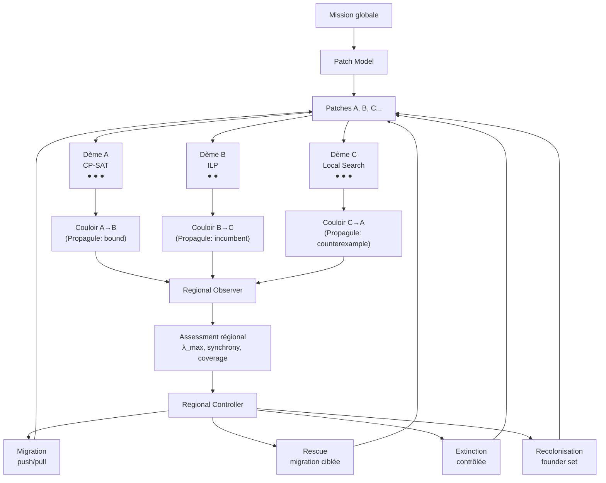
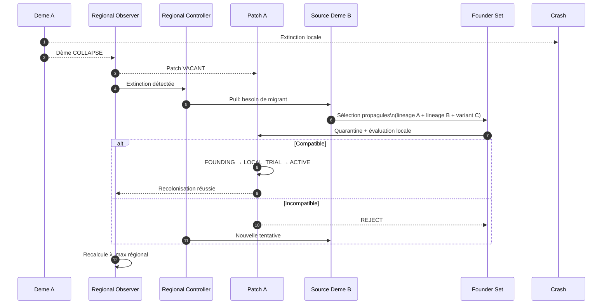
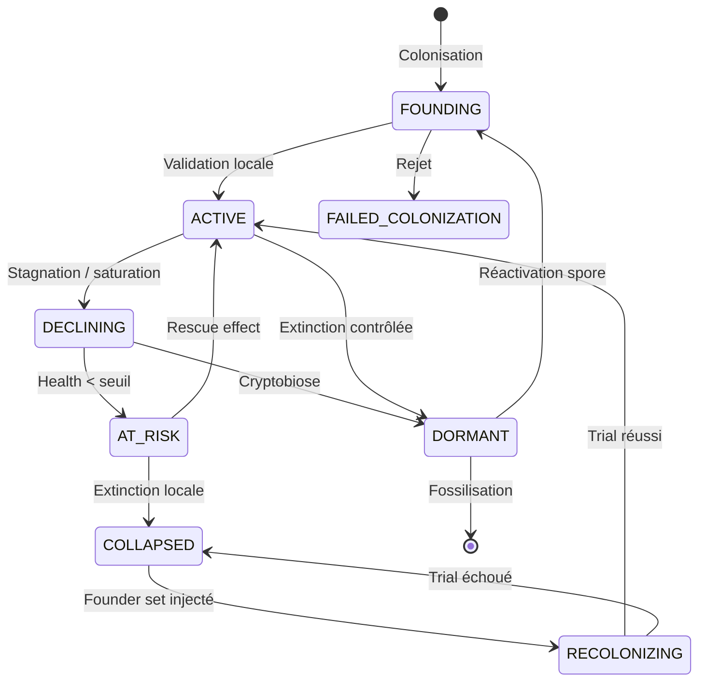

# Metapopulation : Persistance Régionale malgré l'Instabilité Locale

- **Statut** : spécification et état d'implémentation
- **Portée** : persistance régionale par populations semi-indépendantes, migration et recolonisation
- **Dernière revue** : 2026-09-25

> **Lecture du statut** — Les descriptions de rôles, variantes, scénarios et machines à états expriment le modèle visé lorsqu’elles sont présentées comme cible ou hypothèse. Les calculs, seuils et actions précédés de « réellement calculé », « implémenté » ou « défaut actuel » décrivent le code observé. Les analogies écologiques motivent le vocabulaire ; elles ne valident pas les performances du runtime.

## 1. Définition

Metapopulation dans GenOS est le mécanisme d'orchestration qui exécute une mission comme un **réseau de populations semi-indépendantes, localement adaptées et partiellement redondantes, capables d'échanger sélectivement des individus ou des connaissances, de survivre à des extinctions locales et de recoloniser les capacités perdues sans synchroniser tout le collectif**.

Le mot « Metapopulation » vient de l'écologie des populations : un système de populations séparées par des patches d'habitat, reliées par des corridors de migration, où la persistance globale émerge de la dynamique locale d'extinction et de recolonisation ([Hanski, 1998][ext-hanski]). GenOS emprunte ce concept : les dèmes (populations locales) ne fusionnent pas en un état partagé ; ils vivent, divergent, échangent, s'éteignent localement, et recolonisent les patches vacants.

Les cinq principes de conception visés par Metapopulation sont :

1. **Persistance régionale** : la capacité globale est maintenue tant que les fonctions critiques survivent dans au moins un dème et que la capacité de recolonisation reste positive ;
2. **Semi-indépendance locale** : chaque dème possède son propre espace de travail, sa mémoire locale, son budget, sa stratégie, et son évolution — les extinctions locales ne sont pas des échecs globaux ;
3. **Migration sélective** : les échanges sont typés (agents, génomes, procédures, artefacts, contre-exemples), conditionnés par la compatibilité, et validés localement par le receveur ;
4. **Anti-synchronisation contrôlée** : la connectivité est régulée pour préserver assez de diversité pour le rescue, mais pas assez pour homogénéiser ;
5. **Recolonisation fondée** : un patch vacant n'est pas restauré par clonage mais par sélection d'un *founder set* multi-linéage soumis à l'épreuve locale.

Metapopulation vise une orchestration par **dynamique de populations**, au-delà du partitionnement statique. Dans l'implémentation, « population », « extinction » et « renaissance » désignent des états et services logiciels ; ils ne démontrent pas une dynamique biologique ni une adaptation autonome générale.

Le cœur fonctionnel est réparti entre :
- [backend/src/services/metapopulationCoordinationService.js](../../../backend/src/services/metapopulationCoordinationService.js) : coordination opérationnelle, quorum, adaptation des corridors ;
- [backend/src/services/biologicalModeService.js](../../../backend/src/services/biologicalModeService.js) : composition des rôles Metapopulation ;
- [backend/src/services/proceduralMetapopulationService.js](../../../backend/src/services/proceduralMetapopulationService.js) : populations procédurales, collapse, recolonisation ;
- [crates/genos-orchestrator/src/evolution.rs](../../../crates/genos-orchestrator/src/evolution.rs) : dynamique évolutionnaire multi-îlots Rust ;
- [backend/src/services/cryptobiosisSporeService.js](../../../backend/src/services/cryptobiosisSporeService.js) : dormance et réactivation cryptobiotic ;
- [backend/src/services/fossilizationService.js](../../../backend/src/services/fossilizationService.js) : fossilisation et archive post-extinction.

Hypothèse à tester : une architecture qui préserve ses fonctions régionales après des extinctions locales pourrait mieux tolérer certaines pannes qu'un collectif où une fonction dépend d'un seul worker. Cette comparaison n'est pas établie par les analogies écologiques ; elle exige des essais à budget égal et des pannes contrôlées.

---

## 2. Non un partitionnement statique, mais une dynamique de populations

GenOS applique une logique de populations semi-indépendantes :

1. **Dèmes persistants** : chaque dème maintient son propre état, son évolution, sa mémoire — ce ne sont pas des tâches éphémères ;
2. **Adaptation locale** : la fitness est évaluée dans le contexte local du dème — `Fitness(x, deme_A) ≠ Fitness(x, deme_B)` par conception ;
3. **Migration conditionnelle** : les échanges sont typés, tracés par provenance, et validés par le receveur sous épreuve locale ;
4. **Extinction explicite** : un dème peut s'éteindre (collapse) sans que la métapopulation échoue — c'est une transition d'état, pas un incident ;
5. **Recolonisation active** : un patch vacant est recolonisé par un *founder set* sélectionné, soumis à l'épreuve locale, et cultivé jusqu'à viabilité.

Les mécanismes de résilience sont explicites :
- **patch-dème separation** : une opportunité (patch) est distincte de la population qui l'occupe — permet `extinction → patch vacant → recolonisation` ;
- **local-first validation** : jamais `A dit bon → B adopte` ; toujours `A offre propagule → B quarantaine → B évalue localement → ACCEPT / REJECT / ADAPT` ;
- **fitness locale** : la valeur d'un individu dépend du contexte local, pas d'un score global ;
- **corridor plasticity** : les routes de migration s'adaptent selon l'historique de succès/échec des échanges ;
- **source-sink awareness** : les dèmes source (producteurs nets) et sink (consommateurs nets) sont identifiés et protégés différemment ;
- **anti-synchrony governor** : la connectivité est régulée pour éviter la monoculture.

---

## 3. Modèle mathématique et portée des mesures

Cette section sépare trois niveaux : les résultats établis en écologie, les
heuristiques calculées par GenOS et les propriétés régionales souhaitées. La
notion écologique de capacité métapopulationnelle de Hanski et Ovaskainen est
la valeur propre dominante d'une matrice de paysage dérivée d'un modèle de
colonisation-extinction et de paramètres propres à l'espèce. Le nom et l'idée
sont utiles ici, mais la matrice logicielle décrite ci-dessous n'est pas cette
matrice écologique et son résultat ne prédit pas une probabilité de survie
([Hanski et Ovaskainen, 2000][ext-capacity]).

Pour les formules qui suivent, soit \(D_i\) un dème, \(P_i\) son patch,
\(C_i\) l'ensemble de ses capacités déclarées et \(f_i\) sa fitness locale
fournie à l'observateur. La fitness est rabattue dans \([0,1]\) par les
services qui calculent contribution régionale. Les champs absents ne sont pas
estimés statistiquement : ils prennent les valeurs de repli précisées avec
chaque métrique.

### 3.1 Couverture et persistance régionale

La couverture logicielle d'une capacité \(c\) est le nombre de dèmes viables
qui la déclarent :

$$
n(c) = \sum_{i \in V} \mathbf{1}[c \in C_i], \qquad
V = \{D_i : status_i \notin \{COLLAPSED, QUARANTINED, DORMANT\} \land viable_i \ne false\}.
$$

Le service de contribution identifie comme uniques les capacités dont
\(n(c)=1\). Pour un dème \(D_i\), sa mesure `regionalContribution` est
simplement le nombre de ces capacités qu'il détient :

$$
U_i = \{c \in C_i : n(c)=1\}, \qquad R_i = |U_i|.
$$

Le drapeau `protectedFromLocalCull` vaut vrai lorsque \(R_i>0\) et
\(f_i<0{,}2\) par défaut. C'est une règle de protection locale, pas une
mesure complète de valeur écologique. `SOURCE` est attribué si le dème est
viable, si son degré sortant actif dépasse son degré entrant actif et si
\(f_i\ge 0{,}6\) par défaut. `SINK` est attribué si son degré entrant dépasse
son degré sortant, ou s'il est viable avec \(f_i<0{,}25\). Ces seuils et degrés
sont des heuristiques opérationnelles ; le service ne mesure ni productivité
nette ni flux de valeur économique.

La propriété souhaitée de persistance régionale peut s'écrire :

$$
\forall c \in C_{crit},\ n(c)>0
\quad\land\quad
\text{une voie de reprise vérifiable existe pour les capacités perdues}.
$$

Cette formule est un invariant de conception. Le code ne dispose pas d'un
registre exhaustif `C_crit` et ne calcule pas un booléen global de persistance.
Les capacités observées sont celles fournies aux dèmes ; les plans de reprise
et de recolonisation restent des services explicites, avec preuves locales
requises.

### 3.2 Score de capacité du graphe de corridors

Le calculateur construit une matrice logicielle \(A\), indexée par les dèmes
conservés après exclusion des statuts `COLLAPSED`, `QUARANTINED` et `DORMANT` :

$$
A_{ij} =
\begin{cases}
q_i\,w_{ij}\,k_{ij}\,a_j & i\ne j,\; (i,j)\text{ est un corridor actif},\; P_j\text{ est disponible},\\
0 & \text{sinon.}
\end{cases}
$$

Ici \(q_i\) est `patchQuality` du dème source, à défaut `quality` ;
\(w_{ij}\) est le poids du corridor ; \(k_{ij}\) sa compatibilité ; et
\(a_j\) la disponibilité du patch cible, à défaut 1. Une cible avec
`patchAvailable: false` est aussi exclue. Les valeurs non numériques deviennent
0 et les valeurs numériques négatives sont ramenées à 0 ; elles ne sont pas
plafonnées à 1. Une absence de corridor donne donc \(A_{ij}=0\).

Le service estime ensuite la valeur propre dominante par itération de puissance
normalisée en norme \(L_1\) :

$$
v_0 = (1/n,\ldots,1/n),\quad x_k=Av_k,\quad s_k=\sum_i x_{k,i},\quad
v_{k+1}=x_k/s_k.
$$

La sortie `value` est le dernier \(s_k\), arrondi à quatre décimales. Le calcul
s'arrête lorsque deux estimations successives diffèrent de moins de
\(10^{-5}\), ou après 80 itérations ; `converged` distingue ces cas. Une
matrice nulle donne la valeur 0. Comme pour toute itération de puissance, la
convergence vers la valeur propre dominante dépend des propriétés de la
matrice et de l'initialisation ; la limite d'itérations peut donc produire une
estimation non convergée.

Ce score est un indicateur structurel du graphe fourni. Il n'utilise pas les
paramètres biologiques de Hanski-Ovaskainen, n'a pas de seuil critique validé
et n'implique pas à lui seul la persistance réelle d'une mission. Les tests
unitaires vérifient le calcul et sa convergence sur des fixtures ; ils ne
valident pas sa valeur prédictive sur des populations d'agents en production.

### 3.3 Santé, utilité de migration et fitness

Le service `assessHealth` ne calcule pas un score pondéré de santé. Il renvoie
`QUARANTINED` ou `COLLAPSED` selon le statut explicite ; sans membre, il renvoie
`UNKNOWN` et `viable: null` ; `AT_RISK` et `STRESSED` restent viables ; les
autres dèmes avec membres sont `HEALTHY`. Il ne calcule ni diversité,
productivité ou stagnation. Les déclencheurs de migration consomment des
signaux fournis (`stagnationGenerations`, `improvementDelta`, `generation`)
et appliquent les plafonds de coût, de risque de synchronisation et de budget.

Pour une migration candidate, le service d'utilité calcule, à partir des
estimations numériques fournies :

$$
B = g_{receveur} + r_{rescue} + n_{nouveauté},\qquad
C = c_{transfert} + r_{assimilation} + r_{homogénéisation},\qquad
U = B-C.
$$

La migration est `worthwhile` si \(B>C\), ou si `criticalRescue` vaut vrai.
Les termes ne sont ni appris ni calibrés par le service ; ils ne sont pas des
espérances probabilistes et leurs unités doivent être rendues comparables par
l'appelant. Le résultat est arrondi à quatre décimales. L'exception rescue
critique autorise le plan malgré un coût supérieur, sous les autres garde-fous
du cycle et les contrôles spécifiques du rescue.

Pour un rescue, le résultat observé est \(\Delta f=f_{après}-f_{avant}\).
Le rollback est demandé si
\(f_{après}<f_{avant}-\epsilon\), avec \(\epsilon=0\) par défaut ; en cas de
rollback, la pénalité de corridor vaut 0,15 par défaut. Le runtime exige aussi
une cible `AT_RISK` ou `STRESSED`, une capacité régionale unique protégée, un
adaptateur receveur mesurant la fitness et sachant annuler, et un nombre
d'essais borné. L'effet de sauvetage écologique décrit par Brown et
Kodric-Brown motive l'analogie, mais la règle logicielle n'est pas une
estimation de taux d'extinction ([Brown et Kodric-Brown, 1977][ext-brown-rescue]).

## 4. Les deux unités fondamentales : Patch et Deme

### 4.1 Patch : l'opportunité/localité

Un **patch** est une opportunité où une population pourrait vivre. Il définit le contexte environnemental, les contraintes, les ressources — sans contenir de population.

```
Patch {
    patchId: unique identifier
    environment: contexte (OS, provider, région, stratégie...)
    capacity: nombre maximum d'agents hébergés
    quality: score de qualité intrinsèque [0, 1]
    requirements: prérequis pour l'occupation
    accessibility: score d'accessibilité [0, 1]
    status: VACANT | OCCUPIED | UNAVAILABLE | QUARANTINED
}
```

Le patch est la **localité**. Il existe indépendamment de toute occupation. Un patch vacant est une opportunité non exploitée. Un patch quarantine est un environnement dangereux ou corrompu.

### 4.2 Deme : la population qui occupe

Un **dème** est une population locale attachée à un patch. Il contient les agents, l'état local, la mémoire, la stratégie, et l'histoire évolutive.

```
Deme {
    demeId: unique identifier
    patchId: patch actuellement occupé
    members: ensemble des agents locaux
    localState: état local (workspace, mémoire, procédure...)
    lineage: lignée génétique/cognitive
    localFitness: fitness dans le contexte local [0, 1]
    diversity: diversité interne [0, 1]
    status: FOUNDING | ACTIVE | DECLINING | AT_RISK | COLLAPSED | RECOLONIZING | DORMANT
    healthSignal: signal liveness compact
}
$$

Le dème est la **population vivante**. Il évolue, se reproduit, mute, échange, et peut s'éteindre. Sa fitness est évaluée localement — `Fitness(x, deme_A) ≠ Fitness(x, deme_B)` par conception.

### 4.3 Pourquoi cette séparation est essentielle

La distinction patch/dème permet le cycle fondamental de Metapopulation :

```
Dème s'éteint → Patch devient VACANT → Recolonisation par founder set → Nouveau Dème FOUNDING → ...
```

Sans cette séparation, un dème éteint ne pourrait pas être remplacé par un dème différent (autre stratégie, autre modèle, autre lignée) sur le même patch. Le patch est le **substrat** ; le dème est l'**occupant temporaire**.

---

## 5. Les cinq services de contrôle

### 5.1 DemeManager — Local Population Lifecycle

```
Role: deme_manager
ModelTier: frontier
Responsibility: Local Population Lifecycle
```

**Hypothèse :**
> "Maintain each deme as a semi-independent population with its own evolution, fitness evaluation, and local state."

**Mission assignée :**
```
Metapopulation mission: [shared mission]
Collective principle: A network of semi-independent populations with migration, extinction, and recolonization.

Your task (deme_manager):
1. Instantiate and maintain each deme in its patch context
2. Evaluate local fitness per deme (fitness is context-dependent)
3. Detect stagnation, decline, and collapse triggers
4. Trigger local evolution (mutation, reproduction, strategy change)
5. Publish health signals compact (no LLM prompt)

Return: deme states, fitness evaluations, status transitions, local evolution log
```

### 5.2 MigrationController — Typed Propagule Exchange

```
Role: migration_controller
ModelTier: frontier
Responsibility: Typed Propagule Exchange
```

**Hypothèse :**
> "Select, validate, and route typed propagules between demes under provenance, compatibility, and receiver-side validation."

**Mission assignée :**
```
Metapopulation mission: [shared mission]
Your task (migration_controller):
1. Select propagules per policy (elite, novelty, rescue, complementary, counterexample, cultural, founder)
2. Route via directed corridors (A→B may be excellent, B→A may be bad)
3. Enforce receiver-side quarantine and local validation
4. Track provenance, acceptance/rejection, and post-migration improvement
5. Adapt corridor weights based on utility history

Return: migration events, acceptance rates, corridor adaptations, utility deltas
```

### 5.3 RecolonizationController — Extinction Recovery

```
Role: recolonization_controller
ModelTier: frontier
Responsibility: Extinction Recovery
```

**Hypothèse :**
> "Recolonize vacant patches with founder sets selected from diverse lineages, subject to local trial and viability proof."

**Mission assignée :**
```
Metapopulation mission: [shared mission]
Your task (recolonization_controller):
1. Detect vacant patches and eligible source demes
2. Select founder sets (lineage A + lineage B + novel variant)
3. Instantiate founding population with restricted local trial
4. Monitor trial: FOUNDING → LOCAL_TRIAL → ACTIVE or FAILED
5. Consult fossils to avoid repeating extinct lineages
6. Trigger cryptobiotic restoration when spore available

Return: colonization events, founder sets, trial outcomes, restored capabilities
```

### 5.4 RegionalSignalController — Compact Liveness & Synchrony

```
Role: regional_signal_controller
ModelTier: standard
Responsibility: Compact Liveness & Synchrony
```

**Hypothèse :**
> "Maintain regional awareness of deme liveness, synchrony, and metapopulation capacity without LLM prompts."

**Mission assignée :**
```
Metapopulation mission: [shared mission]
Your task (regional_signal_controller):
1. Collect compact health signals from all demes (no LLM)
2. Compute regional metrics: λ_max, synchrony, coverage, fragmentation
3. Detect silent demes, correlated failures, monoculture risk
4. Trigger quorum when regional decisions are required
5. Publish regional state for monitoring

Return: regional health snapshot, synchrony matrix, quorum triggers, λ_max estimate
```

### 5.5 TopologyGovernor — Connectivity Sweet Spot

```
Role: topology_governor
ModelTier: standard
Responsibility: Connectivity Sweet Spot
```

**Hypothèse :**
> "Regulate migration topology to maintain enough connectivity for rescue but not enough for homogenization."

**Mission assignée :**
```
Metapopulation mission: [shared mission]
Your task (topology_governor):
1. Monitor synchrony across all deme pairs
2. Adjust corridor weights: increase for isolated pairs, decrease for over-synchronized pairs
3. Freeze or prune corridors that propagate failure or homogenize
4. Introduce firebreaks (temporary corridor shutdown) when correlated failure risk rises
5. Adapt topology variant (ring, stepping-stone, source-sink, small-world) per mission needs

Return: topology adjustments, corridor state, synchrony deltas, firebreak activations
```

---

## 6. Architecture du système

```text
                         MISSION GLOBALE
                               │
                               ▼
                        PATCH MODEL
                               │
            ┌──────────────────┼───────────────────┐
            ▼                  ▼                   ▼
         Patch A            Patch B             Patch C
            │                  │                   │
         Deme A             Deme B              Deme C
        ● ● ● ●            ● ● ●              ● ● ●
            │                  │                   │
            └──── corridors de migration ──────────┘
                               │
                               ▼
                    Regional Observer
                               │
         ┌─────────────────────┼─────────────────────┐
         ▼                     ▼                     ▼
      liveness            connectivity           synchrony
      fitness             migration              diversity
      lineage             source/sink            coverage
         │                     │                     │
         └────────────────────┬┴─────────────────────┘
                              ▼
                     Regional Contrôleur
                              │
      ┌───────────────────────┼──────────────────────────┐
      ▼                       ▼                          ▼
   DemeManager       MigrationController       RecolonizationController
      │                       │                          │
      └───────────────────────┴──────────────────────────┘
                              │
                              ▼
                    PERSISTANCE RÉGIONALE
```

### Fichiers d'implémentation

| Fichier | Rôle |
|---------|------|
| `backend/src/services/metapopulationCoordinationService.js` | Composition, quorum, régénération, adaptation connexions |
| `backend/src/services/biologicalModeService.js` | Définition et composition des rôles Metapopulation |
| `crates/genos-orchestrator/src/evolution.rs` | Multi-îlots Rust (sélection, reproduction, mutation, migration) |
| `backend/src/services/proceduralMetapopulationService.js` | Populations procédurales, collapse, recolonize |
| `backend/src/services/cryptobiosisSporeService.js` | Dormance et réactivation des dèmes |
| `backend/src/services/fossilizationService.js` | Fossilisation et archive |

---

## 7. Politiques de migration

Metapopulation définit sept politiques, chacune répondant à WHEN, WHAT, FROM, TO, WHY — plus SHOULD receiver accept?

### 7.1 Elite Migration

Propager rapidement une amélioration locale avérée.

$$
\text{Migrant}_{\text{elite}} = \arg\max_{x \in D_i} \text{LocalFitness}(x)
$$

Source en progression régulière, receiver en stagnation modérée. Régulée par le TopologyGovernor si synchronie élevée (risque d'homogénéisation).

### 7.2 Novelty Migration (MultiKulti)

Injecter de la diversité. L'individu est choisi pour sa **différence** avec la cible ([Araujo et al., 2008][ext-multikulti]) :

$$
\text{Migrant}_{\text{novelty}} = \arg\max_{x \in D_i} \left(\text{LocalFitness}(x) \times \left(1 - \text{Similarity}(x, D_j)\right)\right)
$$

où $\text{Similarity}(x, D_j)$ mesure la similarité moyenne entre le migrant candidat et les membres du dème cible. Quand : synchronie élevée, diversité en baisse, ou après extinction contrôlée pour recoloniser divergent.

### 7.3 Rescue Migration

Prévenir l'effondrement d'un dème AT_RISK :

$$
\text{Migrant}_{\text{rescue}} = \arg\max_{x \in \text{sources}} \left(\text{Compat}(x, D_{\text{risk}}) \times \text{ExpectedImprovement}(x, D_{\text{risk}})\right)
$$

Mécanisme **pull** : le dème en danger émet un signal de détresse avec les capacités manquantes. Injection contrôlée (peu de migrants, jamais un remplacement).

### 7.4 Complementary Migration

Transmettre une capacité manquante :

$$
\text{Migrant}_{\text{complementary}} = x \text{ such that } \text{Capability}(x) \cap \text{Missing}(D_j) \neq \emptyset
$$

Pull-based : le receveur demande une capacité $X$ ; les sources proposent les compatibles.

### 7.5 Counterexample Migration

Transmettre échec/contre-exemple/violation d'invariant. Le payload contient la condition d'échec, le contexte, la violation. Le receveur teste localement. Les erreurs deviennent des propagules défensifs pour protéger les autres dèmes.

### 7.6 Cultural Migration

Transmettre procédures, artefacts, fragments de mémoire, heuristiques — sans déplacer d'agent. Types : `PROCEDURE`, `MEMORY_FRAGMENT`, `ARTIFACT`, `TOOL_CONFIGURATION`, `VERIFIER`, `TEST`. Exploite `culturalTransmissionService` et `culturalSelectionService` de la NCE.

### 7.7 Founder Migration

Fournir les propagules initiales pour la recolonisation :

$$
\text{FounderSet}(P_j) = \text{Select}\left(\{x \in \text{sources} \mid \text{Compatible}(x, P_j)\}, k\right)
$$

avec contrainte de diversité des lignées. Seule politique qui peut être **push** par le Regional Controller lors d'une recolonisation planifiée.

---

## 8. Push vs Pull Migration

**Push** : le dème source initie l'envoi (elite, counterexample, cultural). Risque : submersion, propagules non désirées, homogénéisation par flooding. Contrôle : le receveur filtre par compatibilité et quarantaine avant assimilation.

**Pull** : le dème receveur initie la demande (rescue, complementary, recolonisation). Avantage : besoin explicite, compatibilité évaluée par le demandeur, risque de submersion faible.

**Régulation** :

$$
\text{PushRatio} \propto \frac{\text{SourceCapacity}}{\text{ReceiverDemand}} \times \frac{1}{1 + \text{SynchronyRisk}}
$$

Quand la synchronie est élevée, le push est réduit (pour éviter l'homogénéisation) et le pull est maintenu (pour cibler les besoins réels).

---

## 9. Migration adaptative

La fréquence de migration n'est pas fixe. GenOS adapte l'intervalle selon l'état local de chaque dème ([Mambrini & Sudholt, 2015][ext-adaptive]).

### 9.1 Règles d'adaptation

```
local progress élevé     → intervalle long (laisser le dème progresser seul)
stagnation détectée      → raccourcir l'intervalle (opportunité de migration)
breakthrough détecté     → export sélectif immédiat (push elite/novelty)
diversité en baisse      → augmenter novelty migration, réduire elite
dème en danger (AT_RISK) → déclencher rescue migration immédiate
synchrony élevée         → geler l'élite, ouvrir le novelty
```

### 9.2 Formule d'intervalle

Pour le corridor $(D_i, D_j)$ :

$$
\Delta t_{ij} = \Delta t_{\text{base}} \times \left(1 + \gamma_1 \cdot \text{Progress}(D_i) - \gamma_2 \cdot \text{Stagnation}(D_j) + \gamma_3 \cdot \text{Need}(D_j)\right)
$$

borné entre $\Delta t_{\min}$ et $\Delta t_{\max}$. Quand $D_j$ est en stagnation et $D_i$ en progression, $\Delta t_{ij}$ diminue — la migration est accélérée. Quand les deux dèmes stagnent, la migration est ralentie (inutile de déplacer des problèmes).

### 9.3 Breakthrough detection

Un **breakthrough** est détecté quand :

$$
\text{LocalFitness}(D_i, t) > \overline{\text{LocalFitness}}(D_i, \text{window}) + k \cdot \sigma_{\text{local}}
$$

où $k$ est un facteur de sensibilité (typiquement 2.0). Déclenche un push sélectif : le dème source offre son meilleur migrant aux dèmes cibles dont la compatibilité est positive.

---

## 10. Source-Sink Dynamics

### 10.1 Définitions

Un **source deme** produit plus de capacité, d'innovation ou de migrants utiles qu'il n'en consomme localement :

$$
\text{SourceScore}(D_i) = \text{Productivity}(D_i) - \text{LocalCost}(D_i) + \text{MigrantExports}(D_i)
$$

Un **sink deme** ne survivrait pas seul mais apporte une couverture régionale unique grâce à l'immigration :

$$
\text{SinkScore}(D_i) = \text{EnvCoverage}(D_i) + \text{UniqueCap}(D_i) - \text{LocalFitness}(D_i)
$$

### 10.2 Protection des sinks

Il serait faux de retirer un dème sink simplement parce que sa fitness locale est basse. Règle de protection :

$$
\text{SinkScore}(D_i) > \theta_{\text{protect}} \lor \text{UniqueCap}(D_i) > \theta_{\text{unique}}
$$

### 10.3 Corridors directionnels

Les corridors sont dirigés : $\text{Corridor}_{ij} \neq \text{Corridor}_{ji}$. Un source deme aura des corridors sortants forts (vers les sinks) et des corridors entrants faibles. Un sink deme aura des corridors entrants forts et des corridors sortants faibles.

---

## 11. Rescue Effect

### 11.1 Définition

Le **rescue effect** est l'injection contrôlée de migrants quand un dème approche du collapse. Inspiré par l'écologie où la migration diminue le risque d'extinction locale ([Ryser et al., 2021][ext-rescue]).

### 11.2 Mécanisme

1. Le dème $D_i$ passe en `AT_RISK` (health < $\theta_{\text{risk}}$) ;
2. Le Regional SignalController émet un signal de détresse avec les capacités manquantes ;
3. Les dèmes source proposent des propagules compatibles (rescue migration) ;
4. **Quarantaine** : le receveur teste chaque propagule en isolation avant assimilation ;
5. Si le trial local améliore la health : `ACCEPT` et le dème revient vers `ACTIVE` ;
6. Si le trial échoue : `REJECT` et la recherche continue.

### 11.3 Injection contrôlée

$$
|\text{RescueMigrants}(D_i)| \leq \max\left(1, \lfloor \beta \cdot |D_i| \rfloor\right)
$$

où $\beta \approx 0.2$. Le migrant est un **catalyseur**, pas un colon.

### 11.4 Condition de succès

$$
\text{Health}(D_i, t + \Delta t) > \theta_{\text{risk}} \land \text{Diversity}(D_i, t + \Delta t) \geq \text{Diversity}(D_i, t) - \epsilon
$$

---

## 12. Recolonisation ≠ respawn

Un patch vacant n'est pas restauré par clonage (la stratégie qui a causé l'extinction serait reproduite).

**Processus** : PATCH VACANT → sélection founder source(s) → sélection propagules → évaluation compatibilité → instantiation FOUNDING → bootstrap état local → trial local restreint → FOUNDING → ACTIVE (si viable) ou FAILED_COLONIZATION.

**Founder Set** :

$$
\text{FounderSet}(P_j) = \bigcup_{k} \{x_k \in \text{source}_k : \text{Compatible}(x_k, P_j)\}
$$

avec contrainte de diversité des lignées. Combine : lignée du dème éteint (si contexte inchangé), lignée d'un source performant, et variante novelle.

**Cryptobiotic restoration** : $\text{Restate}(P_j) = \text{Spore}(\text{lastVerified}) \setminus \text{FailedStrategy} \cup \text{FounderSet}$ (via `cryptobiosisSporeService`).

**Fossilisation** : une population éteinte laisse un fossil via `fossilizationService`. Lors de la recolonisation : $\text{AvoidRepeat} = \forall x \in \text{FounderSet} : \text{Similarity}(x, \text{Fossil}) < \theta_{\text{novel}}$.

**Cycle de vie** :

```
[*] → FOUNDING : colonisation
FOUNDING → ACTIVE : validation locale
FOUNDING → FAILED_COLONIZATION : rejet
ACTIVE → DECLINING : stagnation
DECLINING → AT_RISK : health < seuil
AT_RISK → COLLAPSED : extinction
AT_RISK → ACTIVE : rescue effect
COLLAPSED → RECOLONIZING : founder set injecté
RECOLONIZING → ACTIVE : trial réussi
RECOLONIZING → COLLAPSED : trial échoué
DECLINING → DORMANT : cryptobiose
DORMANT → FOUNDING : réactivation spore
ACTIVE → DORMANT : extinction contrôlée
DORMANT → [*] : fossilisation
```

---

## 13. Les 12 variants de Metapopulation

### 13.1 Classic Patch

**Mécanisme :** Extinction + recolonisation classique sur patches fixes.
**Quand :** Résilience générale. Plusieurs populations sur patches stables, échanges modérés.
**Topologie :** Anneau ou small-world.
**Politique :** Founder (recolonisation), Elite (migration périodique).

### 13.2 Island Search

**Mécanisme :** Îlots de recherche indépendants + migration périodique d'incumbents.
**Quand :** Optimisation dure (SAT, ILP, local search, évolutionnaire).
**Topologie :** Anneau avec migration rare (préserve la diversité).
**Politique :** Elite + Counterexample. Les bornes migrent, les aussi les contre-exemples.

### 13.3 Heterogeneous Islands

**Mécanisme :** Chaque dème utilise un algorithme, modèle, ou cognitive recipe différent.
**Quand :** Problèmes inconnus, couverture multi-stratégie ([da Silveira et al., 2022][ext-hetero]).
**Topologie :** Fully-connected mais avec validation stricte (haute diversité naturelle).
**Politique :** Complementary + Cultural.

### 13.4 Source-Sink

**Mécanisme :** Sources soutiennent sinks par migration dirigée.
**Quand :** Environnements inégaux (certains dèmes ont plus de ressources).
**Topologie :** Dirigée (sources → sinks), corridors sortants forts depuis les sources.
**Politique :** Elite (push depuis sources) + Rescue (pull depuis sinks).

### 13.5 Rescue Network

**Mécanisme :** Redondance maximale et recolonisation rapide.
**Quand :** Systèmes critiques où aucune fonction critique ne doit être perdue.
**Topologie :** Small-world (forte connectivité, courts chemins de rescue).
**Politique :** Rescue + Founder. Haute sensibilité aux signaux AT_RISK.

### 13.6 Stepping-Stone

**Mécanisme :** Migration sparse, corridor par corridor (pas de saut direct A→C).
**Quand :** Préserver la diversité, éviter l'homogénéisation.
**Topologie :** Ligne ou grille. Migration rare.
**Politique :** Novelty + Cultural. Pas d'élite (trop homogénéisant).

### 13.7 Anti-Synchrony

**Mécanisme :** Diversité volontaire, firebreaks, extinction contrôlée de dèmes redondants.
**Quand :** Réduire le risque d'échec corrélé global.
**Topologie :** Adaptive (le TopologyGovernor gèle des corridors).
**Politique :** Novelty dominante. Extinction contrôlée si synchrony > seuil.

### 13.8 Federated

**Mécanisme :** Données et états restent locaux. Seuls les propagules vérifiés migrent.
**Quand :** Sites privés, edge computing, data sovereignty, partitions réseau.
**Topologie :** Hierarchical avec corridors filtrés.
**Politique :** Cultural + Counterexample. Pas d'agent brut (pas de données brutes).

### 13.9 Ephemeral Patch

**Mécanisme :** Patches apparaissent/disparaissent dynamiquement.
**Quand :** Cloud (instances temporaires), sources temporaires, outils intermittents.
**Topologie :** Fully-connected mais volatile.
**Politique :** Elite push rapide + cryptobiotic spore (dormance quand le patch disparaît).

### 13.10 Persistent

**Mécanisme :** Dèmes résidents entre missions.
**Quand :** Projets/services longs avec évolution continue.
**Topologie :** Stable, apprise sur l'historique.
**Politique :** Toutes selon le contexte. Les dèmes accumulent mémoire locale et lignées matures.

### 13.11 Evolutionary

**Mécanisme :** Génome + mutation + migration + sélection locale.
**Quand :** NCE/optimisation évolutionnaire continue.
**Topologie :** Anneau ou small-world, paramétrable par `evolution.rs`.
**Politique :** Elite + Novelty + reproduction locale.

### 13.12 Cultural

**Mécanisme :** Les artefacts et procédures migrent plus que les agents.
**Quand :** Connaissances et procédures partagées, lignées culturelles distribuées.
**Topologie :** Small-world.
**Politique :** Cultural dominante. Les agents sont résidents ; les propagules culturels circulent.

---

## 14. Synchronie et régulation des corridors

### 14.1 Métriques réellement calculées

Pour chaque paire de dèmes, le service calcule deux mesures à partir des champs
fournis :

$$
\rho_{ij}=\operatorname{Pearson}(E_i,E_j),\qquad
J_{ij}=\frac{|S_i\cap S_j|}{|S_i\cup S_j|},\qquad
r_{ij}=\max(\max(0,\rho_{ij}),J_{ij}).
$$

\(E_i\) et \(E_j\) sont les vecteurs d'erreurs récents. La corrélation n'est
calculée que si les deux vecteurs numériques ont même longueur d'au moins 2 et
une variance non nulle ; sinon Pearson est indisponible (`null`) et contribue 0 au risque.
\(S_i\), \(S_j\) sont les ensembles `localStrategies`; lorsque leur union est
vide, le Jaccard vaut 0. Le risque est retenu si \(r_{ij}\ge 0{,}7\) par
seuil par défaut.

Le code n'agrège pas de chevauchement de modèles, de sources consultées ni
d'ascendance d'artefacts. Il ne calcule pas d'`AntiSyncIndex` régional. Ces
facteurs restent des dimensions proposées pour une étude future.

### 14.2 Action sur le graphe

Pour une paire à risque, l'application reporte le risque sur les deux arcs
\(i\to j\) et \(j\to i\). En politique `REDUCE`, chaque poids est multiplié
par \(1-\alpha\), avec \(\alpha=0{,}5\) par défaut. En politique `FREEZE`,
les deux arcs sont désactivés. Il n'y a pas de mutation automatique de dème ni
d'extinction déclenchée par cette métrique.

Le plan expose les dèmes qui détiennent des capacités uniques afin qu'un acteur
puisse tenir compte de leur intérêt régional. Cette liste n'empêche pas à elle
seule la réduction ou le gel de leurs corridors. Le bon niveau de connectivité
et le seuil \(0{,}7\) ne sont pas établis empiriquement pour les agents GenOS ;
ils restent des paramètres à évaluer sur des scénarios contrôlés.

## 15. Quorum indépendant : règle implémentée

Le service de quorum réduit les doublons de preuves partageant une même origine.
Deux membres sont regroupés s'ils partagent un `independenceGroup`, une source
(`sourceId`/`source`) ou un modèle (`modelId`/`model`). Le regroupement est
transitif : une chaîne de recouvrements forme un seul groupe. Un représentant
est choisi par groupe, en privilégiant le soutien, puis le poids le plus élevé.

Un représentant soutient si son `evidenceScore` est fini et atteint le seuil
\(\tau=0{,}5\) par défaut, sauf statut `ABSTAIN`. Son poids est son poids positif
fourni, ou 1 par défaut. La proportion et la décision sont :

$$
Q=\frac{\sum_g w_g\,\mathbf{1}[support_g]}{\sum_g w_g},\qquad
reached = (\sum_g w_g>0)\land(Q\ge q),
$$

où \(q=0{,}5\) par défaut. Un statut `ABSTAIN` interdit le soutien. Les statuts `SILENT` et `UNAVAILABLE`
sont comptés comme silences, mais le service peut encore compter leur représentant comme soutien si son `evidenceScore` atteint le seuil : le statut seul ne neutralise donc pas le score. Tous restent au dénominateur. Le résultat expose
aussi les répondants, les abstentions, les silences et le nombre de sources et
de modèles distincts non vides parmi les représentants retenus.

Cette déduplication est une heuristique de provenance, pas une preuve
statistique d'indépendance. Le service ne modélise ni dépendance causale fine,
ni corrélation conditionnelle, ni lignée autrement que par le champ fourni
`independenceGroup`. Les six quorums spécialisés listés dans les anciennes
versions de cette section (`RISK`, `DISCOVERY`, `MIGRATION`, `RESCUE`,
`EXTINCTION`, `PROMOTION`) ne sont pas six algorithmes implémentés par ce
service ; leurs politiques doivent être documentées et validées séparément.

## 16. Liveness et extinction : signaux distincts

Le classificateur de silence ne calcule ni taille de message garantie, ni santé
numérique agrégée. Il classe un heartbeat persisté selon l'ordre suivant :

1. `connected: false` donne `DISCONNECTED` ;
2. absence de heartbeat donne `UNKNOWN` ;
3. statut runtime ou heartbeat explicitement `CRASHED` donne `CRASHED` ;
4. horodatage invalide donne `UNKNOWN` ;
5. heartbeat plus vieux que 90 secondes par défaut donne `STALLED` ;
6. santé déclarée `UNKNOWN` donne `UNKNOWN` ;
7. preuve plus vieille que 15 minutes par défaut donne `NO_NEW_INFORMATION` ;

Les deux durées sont configurables. `CRASHED` n'est pas déduit d'un délai
écoulé : il exige un statut explicite. L'absence de heartbeat et l'absence de
preuve sont donc des états distincts, pas des preuves d'extinction.

Le service d'extinction applique une autre règle aux preuves fournies :

$$
status =
\begin{cases}
NOT\_EXTINCT & \text{si une fonction locale est viable ou un worker est actif},\\
UNKNOWN & \text{si un worker est absent, inconnu, ou si aucun worker n'est fourni},\\
EXTINCT & \text{sinon.}
\end{cases}
$$

Seul `EXTINCT` peut être enregistré comme extinction. Cette décision requiert
les états des workers et la viabilité des fonctions ; elle n'est pas obtenue
par le seuil de santé hypothétique présenté dans les anciennes équations. Le
contrôleur régional autonome ne lance pas encore automatiquement la boucle
d'extinction puis de recolonisation.

## 17. Speciation computationnelle

Quand deux dèmes divergent significativement (représentations incompatibles, stratégies incompatibles, taux d'acceptation ≈ 0) :

$$
\text{Divergence}(D_i, D_j) = 1 - \text{Compat}(D_i, D_j) \times \text{AcceptRate}(D_i \to D_j) \times \text{AcceptRate}(D_j \to D_i)
$$

Si $\text{Divergence}(D_i, D_j) > \theta_{\text{species}}$ → **speciés**. Actions :
- Réduire les corridors (accepter la séparation)
- Introduire un MigrationAdapter (pont de traduction)
- Traiter comme des familles de stratégies distinctes

La speciation n'est pas un échec — c'est une forme de spécialisation. Deux dèmes spécialisés dans des représentations différentes couvrent plus d'espace de recherche qu'un seul dème généraliste.

---

## 18. Migration Adapters

Quand les représentations divergent, un adapter traduit les propagules d'un format source vers un format cible. Le receiver valide la traduction localement.

**Exemple** : Dème A (SAT) → learned clause $C = (x_1 \lor \neg x_2 \lor x_3)$ ; Dème B (ILP) ne peut pas la consommer directement ; Adapter SAT→ILP traduit en inégalité linéaire $x_1 + (1 - x_2) + x_3 \geq 1$ ; Validation locale dans le contexte ILP.

```
MigrationAdapter {
    adapterId
    sourceRepresentation   // format source (ex: SAT_clause)
    targetRepresentation   // format cible (ex: ILP_constraint)
    transform(payload)     // fonction de traduction
    validityCheck(payload) // vérifie la cohérence de la traduction
    confidence             // probabilité que la traduction soit valide
    lineage                // qui a créé/testé cet adapter
}
```

L'adapter est lui-même un propagule culturel. Découverte :

$$
\text{FindAdapter}(D_i, D_j) = \{a \in \text{AdapterRegistry} : \text{sourceRepr}(a) = \text{Repr}(D_i) \land \text{targetRepr}(a) = \text{Repr}(D_j)\}
$$

Si aucun adapter n'existe, un nouveau peut être proposé par un dème qui maîtrise les deux représentations.

---

## 19. Cas d'usage

### 19.1 Optimisation multi-stratégie

```text
Deme A: CP-SAT        (● ● ● ●)
Deme B: ILP           (● ● ●)
Deme C: Local Search  (● ● ● ●)
Deme D: Evolutionary  (● ● ●)
```

Chaque dème explore localement sa stratégie. Les incumbents migrent (elite push), les contre-exemples migrent (counterexample push). Si ILP stagne : migration depuis Local Search fournit un warm-start (complementary pull). Si un dème échoue (bug solver) : collapse — aucun problème global. Le TopologyGovernor réduit les corridors entre C et D si leur synchrony augmente.

### 19.2 Multi-provider LLM

```text
Deme OpenAI:     GPT-based solvers (● ● ●)
Deme Anthropic:  Claude-based solvers (● ●)
Deme Local:      Ollama/Hermes solvers (● ● ●)
Deme Antigravity: Antigravity-based solvers (● ●)
```

Un outage OpenAI ne tue pas le collectif. Les dèmes locaux fournissent la continuité. Éviter qu'un provider unique devienne cognitivement dominant (anti-synchrony). Les procédures validées migrent (cultural) entre providers.

### 19.3 Cybersécurité distribuée

```text
Deme Web:         (● ● ●)
Deme Identity:    (● ●)
Deme Infrastructure: (● ● ●)
Deme Supply Chain: (● ●)
```

Une vulnérabilité découverte dans Identity → propagule de sécurité vérifié migre vers les autres (counterexample push). Quarantaine d'un dème contaminé → ne propage pas automatiquement son état. Recolonisation après nettoyage avec founder set incluant des stratégies de défense différentes.

### 19.4 Multi-environnement CI

```text
Deme Linux:   (● ● ● ●)
Deme Windows: (● ● ●)
Deme macOS:   (● ●)
Deme ARM:     (● ●)
```

Un patch fonctionne sur Linux → migrate vers les autres. Chaque receiver évalue localement. Si Windows rejette : adapter locally, puis une correction plus portable revient vers les autres (counterexample cycle). Dème Windows protégé comme sink unique (couverture environnementale).

### 19.5 Recherche scientifique longue

```text
Deme Formal:    (● ● ●)  — méthodes formelles
Deme Empirical: (● ●)    — expérimentation
Deme Simulation: (● ● ●) — simulation
Deme Literature: (● ●)   — analyse de littérature
```

Chaque dème maintient une école méthodologique pendant plusieurs semaines/missions. Les résultats migrent périodiquement (cultural). Les approches ne fusionnent pas prématurément. La speciation est attendue — elle représente une spécialisation.

### 19.6 Maintenance multi-repo / microservices

```text
Deme Auth:      (● ● ●)
Deme Payments:  (● ● ●)
Deme Frontend:  (● ●)
Deme Data:      (● ● ●)
```

Chaque service possède son dème résident avec mémoire locale, agents, procédures et historique. Une vulnérabilité OAuth découverte dans Auth → propagule de sécurité vérifié migre vers les autres. Si Payments est indisponible : le reste de la métapopulation continue, puis recolonisation lorsque le service revient.

---

## 20. Cas de diagnostic : exigences et limites actuelles

Les événements ci-dessous sont des scénarios de diagnostic souhaités ; les noms
entre crochets ne sont pas des codes d'erreur émis par le Regional Brain. Celui-ci
calcule actuellement des lacunes de capacités, des dèmes à risque et des paires
de corridors à réguler. Il propose le rescue et la recolonisation comme
recommandations et ne lance pas automatiquement extinction, fossilisation ou
recolonisation.

| Scénario à détecter | Preuve requise | Réponse actuellement disponible |
|---|---|---|
| Perte de couverture d'une capacité critique | Registre explicite des capacités requises et couverture observée | Le cerveau régional peut signaler une lacune si l'appelant fournit `requiredCapabilities`; le déclenchement automatique d'une recolonisation n'est pas branché. |
| Risque d'échec corrélé | Vecteurs d'erreur synchronisés ou chevauchement des stratégies | Calculer des paires à risque et réduire/geler leurs corridors selon les paramètres d'exécution. |
| Fragmentation du graphe | Graphe orienté sans corridor actif compatible | Les migrations sont bloquées faute de corridor admissible; aucun contrôleur global de connectivité n'ajoute seul des routes. |
| Dème sink sans source compatible | Connectivité et candidats compatibles observés | Le plan peut produire une recommandation de rescue; une offre requiert l'activation explicite du flux de migration et ses preuves. |
| Extinction locale | Tous les workers indisponibles et aucune fonction locale viable | `assessExtinction` renvoie `EXTINCT` ou `UNKNOWN`; un appel explicite enregistre l'extinction. |
| Pannes locales en cascade | Historique horodaté d'extinctions sur une fenêtre définie | Aucun détecteur de cascade, quorum `RISK` ou gel global automatique n'est livré. |

Les seuils de criticité, le taux d'échec régional et la capacité de
recolonisation doivent être définis par le protocole de mission. Ils ne peuvent
pas être déduits des seules heuristiques de fitness ou de capacité du graphe.

## 21. Observabilité : réponse actuelle et schéma cible

`observeRegion` renvoie actuellement la session, ses dèmes, patches et corridors,
la classification de liveness, la contribution, le plan anti-synchronie,
l'utilité/capacité et le nombre d'essais rescue. Les sous-objets principaux sont
produits par `regionalLivenessService`, `regionalContributionService`,
`antiSynchronyService` et `regionalUtilityService`.

Le bloc suivant est un schéma cible pour une télémétrie de mission complète ;
il ne décrit pas le payload actuel du cerveau régional :

```text
TargetRegionalTelemetry {
    missionAndSession
    criticalCapabilityCoverage
    demeFitnessAndStatus
    patchSuitabilityAndOccupancy
    directionalCorridorHistory
    rescueTrialsAndRollbackEvidence
    extinctionAndRecolonizationTrials
    communicationAndTokenCosts
}
```

En particulier, des champs tels que `regionalHealth`, `recolonizationCapacity`,
`antiSyncIndex`, `lambdaMax`, `falsePositiveEstimate`, la diversité causale et
le volume de communication ne sont pas tous collectés par `observeRegion`.
Une métrique absente doit rester « non mesurée » ; elle ne doit pas être
présentée comme zéro ni intégrée à un verdict sans preuve.

## 22. Paramètres disponibles dans les services

Les valeurs ci-dessous sont des valeurs de repli des options d'appel, pas des
variables d'environnement. Les fonctions de Métapopulation ne lisent pas de
configuration `GENOS_METAPOP_*` : le runtime ou son appelant doit transmettre
explicitement les options à régler.

| Service / option | Défaut actuel | Effet |
|---|---:|---|
| Liveness `staleAfterMs` | 90 000 ms | Au-delà, un heartbeat frais est classé `STALLED`. |
| Liveness `evidenceStaleAfterMs` | 900 000 ms | Au-delà, le résultat est `NO_NEW_INFORMATION`. |
| Contribution `localCullFitnessThreshold` | 0,2 | Seuil sous lequel un dème à capacité unique est marqué à protéger. |
| Anti-synchronie `threshold` | 0,7 | Risque minimal retenu dans le plan. |
| Anti-synchronie `reductionFactor` | 0,5 | Part de poids retirée par `applyAntiSynchrony`. |
| Quorum `evidenceThreshold` / `quorumRatio` | 0,5 / 0,5 | Score minimal de soutien et proportion pondérée requise. |
| Rescue `maxAttempts` / `maxTrials` | 3 / 1 | Plafond d'essais et nombre sélectionné dans un plan par défaut. |
| Rescue `maxTargetFitness` / `minimumCompatibility` | 0,35 / 0,6 | Cible éligible et compatibilité minimale. |
| Rescue `allowedRegression` / pénalité de corridor | 0 / 0,15 | Régression qui déclenche le rollback et pénalité par défaut. |
| Trigger stagnation / amélioration | 5 générations / 0,1 | Seuils par défaut des motifs de migration. |
| Capacité `maxIterations` / tolérance | 80 / 0,00001 | Limite et critère d'arrêt de l'itération de puissance. |
| Runtime régional `maxCycles` | 1, plafond 100 | Un cycle par défaut, borné à 100 par appel. |

Les options configurables ne sont pas toutes appliquées à toutes les façades ;
consulter la signature du service utilisé. Les seuils doivent être validés par
mission et ne sont pas des constantes universelles issues de la littérature.

## 23. Contrat runtime

### 23.1 MetapopulationSession

```typescript
interface MetapopulationSession {
    sessionId: string
    missionId: string
    patchModel: Patch[]
    demes: Deme[]
    migrationGraph: MigrationRoute[]
    topology: 'ring' | 'stepping_stone' | 'star' | 'small_world' |
              'source_sink' | 'hierarchical' | 'adaptive'
    status: 'FORMING' | 'ACTIVE' | 'RECOVERING' | 'DEGRADED' | 'ESCALATED'
    tickCount: number
    lambdaMax: number
    antiSyncIndex: number
}
```

### 23.2 Patch

```typescript
interface Patch {
    patchId: string
    environment: PatchEnvironment
    capacity: number
    quality: number
    requirements: string[]
    accessibility: number
    status: 'VACANT' | 'OCCUPIED' | 'UNAVAILABLE' | 'QUARANTINED'
    metadata: Record<string, unknown>
}
```

### 23.3 Deme

```typescript
interface Deme {
    demeId: string
    patchId: string
    members: string[]
    localState: DemeLocalState
    lineage: LineageRef
    localFitness: number
    diversity: number
    status: 'FOUNDING' | 'ACTIVE' | 'DECLINING' | 'AT_RISK' |
            'COLLAPSED' | 'RECOLONIZING' | 'DORMANT'
    healthSignal: LivenessSignal
    createdAt: number
    lastProgressAt: number
    migrantExports: number
    migrantImports: number
    collapseCount: number
}
```

### 23.4 Propagule

```typescript
interface Propagule {
    propaguleId: string
    sourceDemeId: string
    targetDemeId: string
    type: 'AGENT' | 'GENOME' | 'COGNITIVE_RECIPE' | 'PROCEDURE' |
          'MEMORY_FRAGMENT' | 'CLAIM' | 'COUNTEREXAMPLE' | 'ARTIFACT' |
          'TEST' | 'VERIFIER' | 'STRATEGY' | 'TOOL_CONFIGURATION'
    payloadRef: string
    lineage: LineageRef
    sourceFitness: number
    novelty: number
    migrationReason: 'elite' | 'novelty' | 'rescue' | 'complementary' |
                     'counterexample' | 'cultural' | 'founder'
    compatibilityEstimate: number
    status: 'OFFERED' | 'QUARANTINE' | 'ACCEPTED' | 'REJECTED' | 'ADAPTED'
    cost: number
    createdAt: number
    acceptedAt?: number
    rejectedAt?: number
    rejectionReason?: string
    improvement?: number
}
```

### 23.5 MigrationRoute

```typescript
interface MigrationRoute {
    sourceDemeId: string
    targetDemeId: string
    direction: 'directed' | 'bidirectional'
    weight: number
    acceptedMigrations: number
    rejectedMigrations: number
    utility: number
    adaptationHistory: CorridorAdjustment[]
    frozen: boolean
    lastAdjustmentAt: number
}
```

### 23.6 LivenessSignal

```typescript
interface LivenessSignal {
    demeId: string
    timestamp: number
    localStateVersion: number
    health: number
    lastEvidenceAt: number
    migrationCapability: 'PUSH' | 'PULL' | 'BOTH' | 'NONE'
    recoveryCapability: number
    statusTag: 'NO_SIGNAL' | 'HEALTHY_SILENCE' | 'NO_NEW_INFO' |
               'DISCONNECTED' | 'CRASHED' | 'STALLED' | 'UNKNOWN'
}
```

---

## 24. Comparaison avec les autres topologies

| Aspect | Trinity | A-Team | Biocénose | Syncytium | Metapopulation |
|--------|---------|--------|-----------|-----------|----------------|
| **Décomposition** | Hypothèses (3) | Domaines (N) | Communauté (4) | État (4) | Populations semi-indépendantes (N) |
| **Synchronisation** | Asynchrone | Asynchrone | Asynchrone | **Synchrone** | **Adaptative** |
| **État** | 3 mondes | Domaines séparés | Partagé | **Unique, partagé** | **Multiple, local** |
| **Défaillance locale** | Hypothèse rejetée | Domaine isolé | Impact modéré | Divergence | **Extinction locale ≠ échec régional** |
| **Meilleur pour** | Explorer hypothèses | Multidisciplinaire | Robustesse critique | Temps réel | **Résilience par diversité** |

**Quand choisir Metapopulation :** résilience à pannes locales multiples, plusieurs stratégies/modèles/environnements coexistants, diversité objectif, dèmes persistents, rescue/recolonisation exigences fonctionnelles.

**Quand ne pas choisir Metapopulation :** état partagé unique → Syncytium ; comparaison d'hypothèses → Trinity ; multidisciplinarité → A-Team ; communauté open → Biocénose.

---

## 25. Invariants

1. No dème without a defined patch/local context
2. No migration without provenance
3. No migrant assimilation without receiver-local validation
4. No local extinction interpreted as regional failure
5. No recolonization considered successful before local viability is re-proven
6. No global synchronization merely for convenience
7. No migration policy allowed to erase regional diversity without measurable benefit
8. No source deme allowed to become a single point of failure unnoticed
9. No silent deme counted as healthy
10. No quorum based on correlated evidence treated as independent support
11. No recovery by simply cloning the state that caused the previous collapse
12. No route adaptation from a single anecdotal outcome

La réussite d'une Métapopulation se mesure par sa capacité à préserver les fonctions régionales malgré les extinctions locales.

---

## 26. Cas d'usage typiques

Les cinq cas ci-dessous suivent le même canevas : **Mission** (ce qu'on veut accomplir), **Déroulé** (comment la métapopulation s'organise et évolue), **Résultat** (ce qui est obtenu comparativement à une approche monolithique).

### 26.1 Audit de sécurité multi-provider

**Mission** : Auditer une application web (OWASP Top 10) en exploitant plusieurs LLM simultanément sans dépendre d'un provider unique.

**Déroulé** :
- 4 dèmes hétérogènes : `Deme-OpenAI` (GPT-4o), `Deme-Anthropic` (Claude), `Deme-Local` (Llama), `Deme-Deterministic` (outils statiques : Semgrep, Bandit, ZAP).
- Chaque dème audite le même code avec ses propres méthodes.
- Découverte d'une injection SQL par Deme-Anthropic → counterexample migre vers les autres (cultural migration).
- Deme-OpenAI valide indépendamment → DISCOVERY_QUORUM atteint → la vulnérabilité est confirmée.
- Outage Deme-OpenAI (rate limit) → Deme-OpenAI passe COLLAPSED → rescue depuis Deme-Local.
- Une heuristique de fuzzing découverte par Deme-Local migre vers Deme-Anthropic (novelty).

**Résultat** : 23 vulnérabilités trouvées (vs. 14 avec un seul provider). L'outage d'un provider n'a pas interrompu l'audit. Les contre-exemples circulent, réduisant les faux négatifs.

---

### 26.2 Migration progressive d'un monolithe en microservices

**Mission** : Décomposer un monolithe Rails en microservices (Auth, Payments, Notifications, Frontend) sur 6 mois, sans interruption de service.

**Déroulé** :
- 4 dèmes persistants : `Deme-Auth`, `Deme-Payments`, `Deme-Notifications`, `Deme-Frontend`.
- Chaque dème maintient sa mémoire locale, ses procédures de déploiement, son historique de bugs.
- Une faille OAuth découverte dans Auth → propagule de sécurité vérifié migre vers Payments et Frontend (cultural).
- Le service Payments devient instable (DB overload) → Payments passe AT_RISK → rescue migration injecte une procédure de retry depuis Frontend.
- Le patch Payments est momentanément indisponible (VACANT) → les autres dèmes continuent.
- Lorsque Payments revient : recolonisation avec founder set incluant la lignée originale + une stratégie de circuit-breaker différente.

**Résultat** : Zéro interruption de service pendant la migration. Chaque service a évolué localement avec ses propres heuristiques. Les incidents ne se propagent pas.

---

### 26.3 Résolution d'un problème d'optimisation combinatoire NP-hard

**Mission** : Minimiser le coût d'un planning de 500 tâches avec contraintes de précédence, ressources, et fenêtres temporelles.

**Déroulé** :
- 4 dèmes de recherche : `Deme-CP-SAT` (OR-Tools), `Deme-ILP` (Gurobi), `Deme-LocalSearch` (tabou), `Deme-Evolutionary` (NSGA-II).
- Topologie en anneau avec migration rare (toutes les 50 générations).
- Chaque dème explore localement son espace de solutions.
- CP-SAT trouve une bonne bound → elite push vers ILP (warm-start).
- Local Search stagne → le TopologyGovernor augmente son intervalle de migration.
- Evolutionary trouve un front de Pareto intéressant → novelty migration vers les autres.
- Gurobi expire (license) → Deme-ILP COLLAPSED → les autres dèmes continuent ; l'absence d'ILP est compensée par la diversité des trois autres.

**Résultat** : Solution à 2.3% de l'optimum (vs. 4.7% avec un seul solver). La panne de Gurobi n'a pas bloqué la recherche — la diversité des algorithmes a fourni des solutions alternatives.

---

### 26.4 Intégration continue multi-plateforme

**Mission** : Garantir qu'un projet open-source compile et passe les tests sur Linux, Windows, macOS, et ARM.

**Déroulé** :
- 4 dèmes : `Deme-Linux`, `Deme-Windows`, `Deme-macOS`, `Deme-ARM`.
- Un patch passe sur Linux → migrates vers les trois autres (elite push).
- Windows rejette (API Win32 incompatible) → receiver adapte localement, puis produit un counterexample qui remonte vers Linux (counterexample cycle).
- Le dème Windows est coûteux (agents CI payants) et a une fitness locale basse → il est marqué SINK (couverture environnementale unique) → protégé contre l'extinction.
- Le dème ARM est intermittemment disponible (don hardware) → géré en mode Ephemeral Patch avec cryptobiotic spore : quand le patch disparaît, le dème passe en DORMANT ; quand il revient, réactivation depuis la spore.
- Le dème Linux est la source principale → corridors sortants forts.

**Résultat** : Compatibilité garantie sur 4 plateformes sans qu'aucune ne bloque les autres. Le coûteux dème Windows est justifié par sa couverture unique.

---

### 26.5 Veille technologique distribuée pour une équipe R&D

**Mission** : Maintenir une veille continue sur 4 domaines (LLM, crypto, robotics, climate tech) avec des écoles méthodologiques distinctes.

**Déroulé** :
- 4 dèmes : `Deme-Formal` (méthodes formelles), `Deme-Empirical` (expérimentation), `Deme-Simulation` (simulation multi-agent), `Deme-Literature` (analyse de papiers).
- Chaque dème développe ses propres procédures d'analyse, heuristiques, et critères de pertinence.
- Spéciation attendue : Formal et Simulation divergent (représentations incompatibles) → un MigrationAdapter est introduit pour traduire les modèles formels en configurations de simulation.
- Découverte d'un papier important par Literature → cultural migration vers les autres (résumé + contre-exemples identifiés).
- Le dème Empirical est coûteux en compute → il passe en DORMANT pendant les périodes de basse activité, réactivé par spore.
- Breakthrough détecté dans Simulation → push sélectif des incumbents vers les autres dèmes.

**Résultat** : Couverture de 4 domaines sans fusion prématurée. Chaque école méthodologique est préservée. Les découvertes circulent même quand certains dèmes sont dormants.

---

## 27. Quand ne pas utiliser Metapopulation

Metapopulation est puissant mais coûteux. Cette section aide à décider quand une autre topologie est plus appropriée.

### 27.1 Tableau de décision

| Si votre mission présente... | Alors préférez... | Parce que... |
|---|---|---|
| Un **état partagé unique** qui doit rester fortement cohérent | **Syncytium** | Metapopulation maintient des états locaux divergents — impossible de garantir la cohérence forte sans dégrader les dèmes |
| **3 hypothèses** à comparer sur les mêmes données | **Trinity** | Metapopulation maintient des populations longives ; Trinity est conçue pour la comparaison expérimentale éphémère |
| **Multidisciplinarité par domaines** (frontend + backend + data) | **A-Team** | Les domaines sont connus et différents ; Metapopulation divise la population, pas les expertises |
| **Communauté open** avec ressources partagées et acteurs autonomes | **Biocénose** | Les ressources sont un bien commun ; Metapopulation suppose des patches distincts avec des corridors contrôlés |
| **Un seul environnement** (un OS, un provider, une stratégie) | **Topologie simple** (pas de méta-orchestration) | La métapopulation suppose des patches distincts — si tout est identique, la diversité est artificielle |
| **Temps réel collaboratif** (édition partagée, chat, whiteboard) | **Syncytium** | Metapopulation tolère la divergence ; le temps réel exige une vue partagée unique |
| **Mission éphémère** (< 5 minutes, une seule exécution) | **Topologie élémentaire** | Le coût d'instanciation des dèmes et du Regional Controller n'est pas amorti |
| **Données massives centralisées** (un seul dataset, un seul modèle) | **Biocénose** ou **Syncytium** | Metapopulation suppose que les dèmes ont leur propre contexte ; si tout le monde lit les mêmes données, les dèmes sont redondants |

### 27.2 Tests mentaux (arbre de décision)

Avant de choisir Metapopulation, passez ces tests mentalement :

**Test 1 — « Est-ce que mes agents doivent diverger ? »**
- Si oui → Metapopulation est candidate.
- Si non (tous les agents doivent converger vers la même vue) → **Syncytium**.

**Test 2 — « Ai-je plusieurs environnements, providers, ou stratégies distincts ? »**
- Si oui → Metapopulation est candidate.
- Si non (un seul environnement, une seule approche) → **Topologie simple** ou **Biocénose**.

**Test 3 — « Est-ce que l'extinction locale est acceptable ? »**
- Si oui → Metapopulation (c'est sa raison d'être).
- Si non (toutes les fonctions critiques doivent être maintenues simultanément) → **Rescue Network** (variante Metapopulation) ou **Biocénose**.

**Test 4 — « Les patches sont-ils stables dans le temps ? »**
- Si oui → Metapopulation classique.
- Si non (les patches apparaissent/disparaissent fréquemment) → **Ephemeral Patch** (variante Metapopulation) ou **Biocénose**.

**Test 5 — « Le coût de la migration est-il justifié ? »**
- Si oui (les migrations apportent régulièrement des améliorations) → Metapopulation.
- Si non (les dèmes sont déjà optimaux, les migrations sont du bruit) → **Topologie simple** (laissez les dèmes isolés).

**Test 6 — « Ai-je besoin d'un quorum global ? »**
- Si oui → Metapopulation (6 types de quorum).
- Si non (décisions purement locales) → **Rhizome** ou topologie décentralisée.

**Règle empirique** : Si vous échouez à plus de deux tests, une autre topologie est probablement plus adaptée.

---

## 28. Références internes

- [ORCHESTRATION.md](../orchestration.md) : orchestration générale
- [SYNCYTIUM.md](syncytium.md) : orchestration par état partagé
- [TRINITY.md](trinity.md) : orchestration comparative
- [A_TEAM.md](a-team.md) : orchestration multidisciplinaire
- [BIOME.md](biome.md) : orchestration par environnement
- [BIOLOGIE_COMPUTATIONNELLE.md](../../01-concepts/biologie-computationnelle.md) : cadre biologique
- [metapopulationCoordinationService.js](../../../backend/src/services/metapopulationCoordinationService.js)
- [proceduralMetapopulationService.js](../../../backend/src/services/proceduralMetapopulationService.js)
- [cryptobiosisSporeService.js](../../../backend/src/services/cryptobiosisSporeService.js)
- [fossilizationService.js](../../../backend/src/services/fossilizationService.js)
- [evolution.rs](../../../crates/genos-orchestrator/src/evolution.rs)

---

## 29. Références externes

| Référence | Apport |
|-----------|--------|
| [Hanski 1998][ext-hanski] | Fondements : populations séparées, migration, persistance régionale |
| [Fox et al. 2017][ext-hydra] | Extinctions locales peuvent augmenter persistance régionale |
| [Ruciński et al. 2010][ext-topology] | Impact de la topologie de migration sur l'island model |
| [MultiKulti 2008][ext-multikulti] | Migration du génotype le plus différent |
| [Mambrini & Sudholt 2015][ext-adaptive] | Fréquence de migration adaptative |
| [Ryser et al. 2021][ext-rescue] | Rescue effect et drainage effect |
| [Nakazawa 2015][ext-stage] | Rescue effect dans le modèle de Levins |
| [Hanski & Ovaskainen 2000][ext-capacity] | Capacité métapopulationnelle (λ_max) |
| [da Silveira et al. 2022][ext-hetero] | Îlots hétérogènes reconfigurables |
| [Bell 2017][ext-evol-rescue] | Sauvetage évolutionnaire |

[ext-hanski]: https://www.nature.com/articles/23876
[ext-hydra]: https://www.nature.com/articles/s41559-017-0271-y
[ext-topology]: https://arxiv.org/abs/1004.4541
[ext-multikulti]: https://arxiv.org/abs/0806.2843
[ext-adaptive]: https://ieeexplore.ieee.org/document/7358494
[ext-rescue]: https://www.nature.com/articles/s41467-021-24877-0
[ext-brown-rescue]: https://esajournals.onlinelibrary.wiley.com/doi/10.2307/1935620
[ext-stage]: https://www.nature.com/articles/srep07871
[ext-capacity]: https://www.nature.com/articles/35008063
[ext-hetero]: https://arxiv.org/abs/2205.02916
[ext-evol-rescue]: https://www.annualreviews.org/content/journals/10.1146/annurev-ecolsys-110316-023011

---

## 30. Schémas d'architecture et de dynamique métapopulationnelle

### 30.1 Architecture d'une Métapopulation hétérogène



### 30.2 Séquence Extinction → Recolonisation



### 30.3 Machine à états cible du dème

La machine d'états ci-dessous décrit la cible conceptuelle. Le service de cycle de vie valide les transitions déclarées ; le Regional Brain ne pilote pas automatiquement toutes ces étapes.



### 30.4 Calcul et régulation de l'anti-synchronie

Le schéma représente le calcul réellement utilisé par le Regional Brain. Le
service reçoit des observations récentes ; il n'y a pas de mesure continue
implicite ni de cible régionale `AntiSyncIndex`.

```mermaid
flowchart LR
    Inputs[Vecteurs d'erreurs et stratégies fournis] --> Pair[Pour chaque paire de dèmes]
    Pair --> Corr[Pearson si vecteurs valides]
    Pair --> Jac[Jaccard des stratégies]
    Corr --> Risk[risque = max(max(0, Pearson), Jaccard)]
    Jac --> Risk
    Risk --> Threshold{risque >= seuil, défaut 0.7 ?}
    Threshold -->|Non| Keep[Conserver les corridors]
    Threshold -->|Oui| Plan[Inclure la paire et les arcs dirigés observés]
    Plan --> Action{Gel demandé ?}
    Action -->|Non| Reduce[Réduire le poids si le risque augmente]
    Action -->|Oui, risque >= 0.95 par défaut| Freeze[Désactiver l'arc]
    Action -->|Oui, sous le seuil de gel| Reduce
    Reduce --> Persist[Persister puis relire le graphe]
    Freeze --> Persist
```

Dans la boucle régionale, le poids est multiplié par `corridorReductionFactor`
(défaut 0,5) seulement si le risque dépasse le risque déjà enregistré. Le gel
requiert `freezeCorrelatedCorridors: true` et atteint `freezeRiskThreshold`
(défaut 0,95). Le service autonome `applyAntiSynchrony` expose un contrat
séparé : il réduit tous les corridors à risque ou les gèle lorsque son option
`freeze` est vraie. Ces chemins ne calculent ni mutation, ni extinction, ni
recolonisation.

## 31. Implémentation & capacités (GenOS v3)

Service de coordination : `metapopulationCoordinationService.js`.
Capacités requises : `QUORUM`, `SYNAPTIC_PLASTICITY`, `RESILIENCE_RECOVERY`, `GENOME_EPIGENETICS`, `SWARM_METRICS`, `EPISODIC_MEMORY`, `SIGNALING_BUS`, `PROVENANCE`, `CAPSULES_SNAPSHOTS`, `EVIDENCE_BARRIER`, `EVOLUTION_REPRODUCTION`.
Contrat exposé par `topologyCapabilityService` et rendu effectif dans les leases d'outils.

Les dèmes sont instanciés par `biologicalModeService.compose('metapopulation', mission)` avec les cinq services de contrôle. Le moteur évolutionnaire Rust (`crates/genos-orchestrator/src/evolution.rs`) gère la dynamique génétique haute-performance pour la variante Evolutionary. La cryptobiose, la fossilisation, et la recolonisation sont opérées par leurs services respectifs.

---

## 32. Architecture cible et plan d'évolution

Cette section décrit l'architecture visée et l'ordre proposé des travaux. Les étapes constituent un plan, pas une affirmation que tous ces mécanismes sont déjà disponibles. La façade publique reste `metapopulationCoordinationService.js`. Les dynamiques multi-îlots réutilisent `crates/genos-orchestrator/src/evolution.rs`, les lignées procédurales `proceduralMetapopulationService.js`, les individus `AgentDNA` et `agentEvolutionService`, ainsi que les services existants de cryptobiose, snapshots, fossilisation, signaling bus et indépendance épistémique. Le plan ne crée pas un troisième moteur évolutionnaire.

### 32.1 Modèle cible

Mission / région → registre de patches → dèmes locaux → corridors de migration dirigés → observateur régional → contrôleur régional → persistance régionale.

L'observateur régional lit la liveness persistée, les corridors et les erreurs récentes ; les mesures de contribution et de capacité dépendent des attributs fournis. Le contrôleur peut appliquer les actions bornées qui disposent d'une vérification : signaler un dème à risque, réguler des corridors, exécuter une migration explicitement demandée et passer une transition locale par Morphogenèse. Le rescue requiert un adaptateur de fitness et de rollback. L'extinction et la recolonisation sont exposées comme services explicites, pas comme décisions automatiques de cette boucle.

L'ontologie sépare explicitement :

`Metapopulation ≠ Patch ≠ Deme ≠ Individual`

Le patch décrit le contexte local disponible ; le dème est la population qui l'occupe ; les individus sont les membres du dème. Les quatre rôles historiques (`population_isolator`, `quorum_sensor`, `synaptic_adaptor`, `regeneration_steward`) deviennent progressivement des fonctions de contrôle, pas des membres obligatoires de chaque population.

### 32.2 Invariants d'architecture

- Un dème ne peut écrire qu'à l'intérieur de sa frontière locale : `writes(deme_i) ⊆ localBoundary_i`.
- Les échanges inter-dèmes passent par un corridor ou un contrat régional explicite.
- Un corridor est dirigé : `A → B` n'implique pas `B → A`.
- Un propagule est évalué par le receveur en quarantaine avant assimilation : `ACCEPT`, `ADAPT_AND_ACCEPT`, `REJECT` ou `REQUEST_MORE_EVIDENCE`.
- La fitness d'un propagule à la source ne prédit pas sa fitness dans le dème receveur.
- Une extinction locale ne devient pas automatiquement un échec régional ; une recolonisation n'est réussie qu'après un essai local viable.
- Tout événement régional déterminant conserve séquence, révision, provenance, acteur et horodatage.

### 32.3 Ordre de réalisation en 18 PR

Les chantiers de conception sont regroupés en 18 livrables cohérents. L'ordre suit les dépendances entre contrats, persistance, isolation, migration et contrôle autonome.

| PR | Livrable | Contenu principal |
|---|---|---|
| **PR1 — livré** | Contrats et session persistante | Corriger l'ontologie ; définir la session Métapopulation, les contrats canoniques et un stockage événementiel versionné, reconstructible après redémarrage. |
| **PR2 — livré** | Modèle Patch / Deme | Registre et cycle de vie des patches et dèmes ; distinguer localité, population et individu. |
| **PR3 — livré** | Isolation et liveness | Capsules workspace par dème, frontières d'écriture via l'API, état/mémoire/budget locaux ; heartbeats append-only, santé et quarantaine sur violation. |
| **PR4 — livré** | Graphe et corridors | Graphe dirigé persistant, qualité/capacité dérivées des patches et politiques ring, stepping-stone, star, small-world, fully-connected, source-sink, hierarchical et adaptive. |
| **PR5 — livré** | Propagules et quarantaine receveur | Types et provenance persistés, quarantaine du receveur, validation/assimilation par adaptateurs enregistrés, rejet tracé et reçu d'assimilation. |
| **PR6 — livré** | Politiques de migration | Sélection elite, novelty, rescue, complementary, counterexample, cultural et founder ; plan push par receveur et requêtes pull ciblées. |
| **PR7 — livré** | Déclencheurs adaptatifs | Déclencher selon stagnation, amélioration ou génération, sous les limites de coût, risque de synchronisation et budget. |
| **PR8 — livré** | Source/sink et contribution régionale | Classer sources/sinks, mesurer la couverture de capacités distinctes et protéger les dèmes uniques malgré une fitness locale faible. |
| **PR9 — livré** | Rescue effect | Essais bornés depuis une source compatible, mesure du bénéfice et rollback avec reçu si le dème cible régresse ; corridor pénalisé. |
| **PR10 — livré** | Extinction et reprise | Déclarer l'extinction seulement si tous les workers sont indisponibles et qu'aucune fonction locale ne reste viable ; libérer le patch, conserver l'historique des causes et préparer la reprise avec références cryptobiose/snapshot/fossile et exclusion des lignées ayant déjà échoué. |
| **PR11 — livré** | Recolonisation vérifiée | Détecter les patches vacants, filtrer les lignées déjà échouées sur le patch, exiger deux lignées distinctes, garder le patch vacant pendant l'essai et ne créer le nouveau dème qu'après preuve locale de viabilité ; enregistrer les échecs. |
| **PR12 — livré** | Quorum indépendant | Pondérer une seule preuve par groupe indépendant (source ou modèle), garder abstentions et silences dans le dénominateur sans les compter comme soutien, et exposer la diversité des sources/modèles. |
| **PR13 — livré** | Anti-synchronie | Détecter les erreurs corrélées et le recouvrement de stratégies ; réduire le poids ou geler les corridors dirigés exposés et signaler les dèmes portant une capacité régionale unique. |
| **PR14 — livré** | Utilité et capacité régionale | Calculer la valeur nette bénéfice/coût de chaque migration, conserver les exceptions de rescue critique, estimer la capacité du réseau par itération de la matrice de corridors et exposer les mesures comme observations régionales. |
| **PR15 — livré** | Pont Rust et procédural | Ajouter l'adaptateur de contrat d'îlot vers le moteur multi-îlots Rust, valider ses rapports et synchroniser extinctions/recolonisations avec `proceduralMetapopulationService.js` ; l'évolution Rust échoue explicitement si son adaptateur d'exécution n'est pas configuré. |
| **PR16 — livré** | Variantes et persistance | Définir les profils équilibré/résilient/exploratoire/conservateur comme politiques ; appliquer une autorisation de souveraineté fail-closed aux références fédérées, reconnaître les scopes persistants et valider explicitement les baux de daemons résidents. |
| **PR17 — livré** | Topologies imbriquées et Morphogenèse | Proposer une topologie locale par dème à partir de son fitness, de ses échecs et de sa stagnation ; exclure Métapopulation du niveau local et exécuter le changement uniquement via la transition Morphogenèse transactionnelle et réversible. |
| **PR18 — livré** | Runtime régional autonome | Exécuter les cycles `OBSERVE → DIAGNOSE → PLAN → EXECUTE → VERIFY → RECORD`, borner leur nombre, respecter demande d'arrêt/session inactive/budget épuisé, bloquer les actions incomplètes ou non vérifiées et inscrire chaque issue au journal de session. Fournir un benchmark déterministe des métriques de capacité et de synchronie : `node backend/bin/metapopulation-benchmark.cjs [répétitions]`. |

### 32.4 Tests d'acceptation régionaux

| Scénario | Résultat attendu |
|---|---|
| Un worker tombe, mais la fonction locale reste viable | Le dème n'est pas déclaré éteint. |
| Tous les workers d'un dème disparaissent | Dème `COLLAPSED`, patch `VACANT` ; les autres continuent si les fonctions régionales restent couvertes. |
| Un claim migré n'a pas de provenance | Rejet. |
| Une procédure migrée est incompatible | Adaptateur applicable ou rejet explicite. |
| Un dème demande une compétence absente | Migration pull ciblée vers une source compatible. |
| Le rescue détériore le dème cible | Rollback et corridor pénalisé selon le résultat. |
| Une recolonisation échoue à l'essai local | Échec enregistré et patch laissé vacant. |
| Une lignée a échoué pour la même cause | Elle est pénalisée comme fondatrice. |
| Plusieurs dèmes partagent modèle et source | Leur poids de quorum indépendant diminue. |
| Un dème est silencieux | Le silence n'est jamais interprété automatiquement comme une bonne santé. |
| Les migrations homogénéisent les stratégies | Le contrôle anti-synchronie intervient. |
| Un dème a une fitness basse, mais une couverture unique | Il est conservé si sa contribution régionale le justifie. |
| Un corridor est utile dans un sens et nuisible dans l'autre | Les poids A→B et B→A divergent. |
| Un ring est coupé ou un provider tombe | Fragmentation détectée ; les autres domaines de panne continuent. |
| Le runtime redémarre | Patches, dèmes, routes et événements sont reconstruits depuis la persistance. |
| Un dème exécute Trinity | Le niveau régional reste Métapopulation. |

### 32.5 Benchmarks et programme d'évaluation scientifique

Le benchmark actuellement livré n'est pas une comparaison à budget égal entre architectures.

`node backend/bin/metapopulation-benchmark.cjs [répétitions]` exécute des fixtures synthétiques déterministes de 12, 24 et 48 dèmes, avec deux corridors par dème et des vecteurs d'erreur sinusoïdaux. Il mesure le temps d'exécution de `calculateCapacity` et `planAntiSynchrony`, ainsi que la valeur estimée, le nombre d'itérations, l'état de convergence, les paires affectées et l'action planifiée. Le nombre de répétitions est borné à 1–100 (7 par défaut) ; les durées dépendent de la machine et ne sont pas déterministes.

Ce microbenchmark vérifie le comportement et le coût de ces deux calculateurs sur des tailles fixes. Il ne mesure pas la réussite de mission, la résistance à une panne réelle, le temps de recolonisation, la qualité par token, ni le bénéfice causal d'une migration. Il ne compare pas un modèle unique, A-Team, Biome ou les variantes Métapopulation et ne fournit aucun résultat scientifique sur leur supériorité.

Une comparaison scientifique reste à réaliser : définir des tâches et critères avant exécution ; comparer les architectures et ablations sous les mêmes modèles, versions, prompts, limites de temps/tokens/outils et accès aux données ; apparier les runs par tâche et condition ; randomiser l'ordre ; injecter des pannes reproductibles ; répéter sur plusieurs tâches ; publier les fixtures, les exclusions, les résultats bruts et les intervalles d'incertitude. Les critères principaux devraient inclure la réussite de mission après panne, la conservation des fonctions critiques, le temps de reprise et le coût total. Aucun seuil de succès n'est fixé avant la publication de ce protocole.


### 32.6 Critère de réussite

Une Métapopulation réussit si les fonctions régionales critiques sont préservées, les défaillances locales contenues, les migrations sélectivement utiles, la diversité régionale suffisante, la capacité de recolonisation disponible et aucune défaillance systémique non résolue.

> Une bonne Métapopulation GenOS n'est pas celle où aucun dème ne meurt. C'est celle où des dèmes peuvent mourir sans que l'intelligence collective perde sa capacité à continuer, apprendre et recoloniser.

## Runtime régional livré : migration vérifiée

Le Regional Brain exécute une migration lorsqu'un cycle reçoit explicitement
`enableMigration: true` et un signal adaptatif déclenché. Il sélectionne au
plus un candidat selon la politique demandée, vérifie l'utilité attendue et le
corridor dirigé, puis place le propagule en quarantaine. L'adaptateur du
receveur reste seul responsable de valider, assimiler avec reçu de provenance,
ou rejeter. Le runtime relit ensuite l'issue terminale dans la persistance avant
d'enregistrer le cycle comme vérifié.

L'appelant fournit encore les candidats, les signaux et le contexte local du
receveur. Une erreur pendant la revue laisse la migration en quarantaine pour
reprise idempotente. Le rescue est piloté avec mesures de fitness avant/après
et rollback lorsqu'une capacité unique protégée régresse ; il requiert un
adaptateur receveur dédié et garde un nombre d'essais borné. L'extinction et la
recolonisation ne sont pas encore automatisées par cette boucle.
