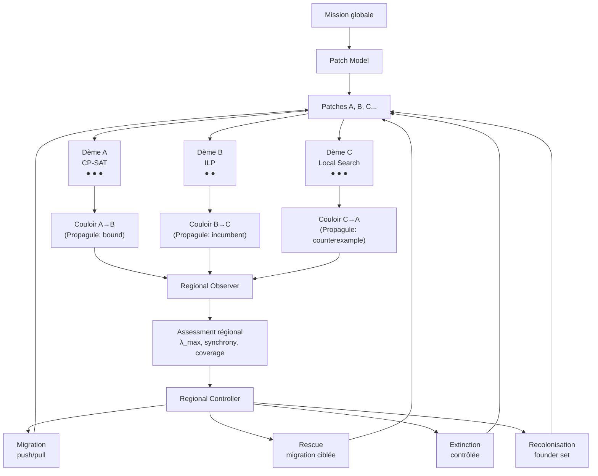
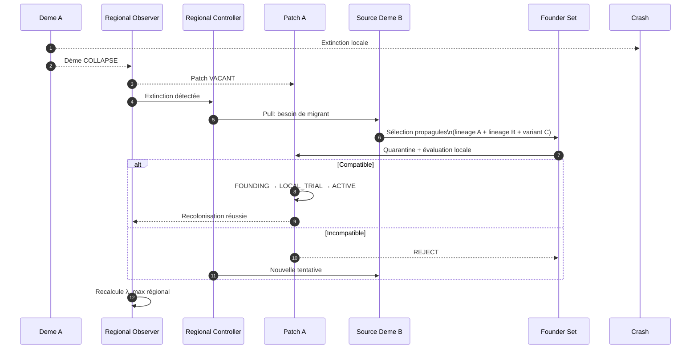
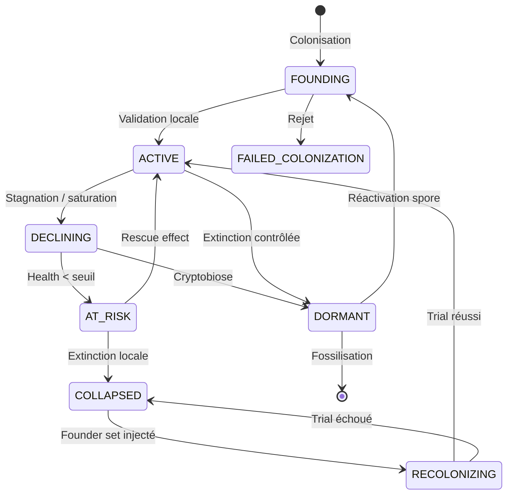

# Metapopulation : Persistance Régionale malgré l'Instabilité Locale

## 1. Principe fondamental

> **Metapopulation est le protocole de GenOS pour maintenir une capacité globale grâce à plusieurs dèmes semi-indépendants, localement adaptés et partiellement redondants, capables d'échanger sélectivement des individus ou des connaissances, de survivre à des extinctions locales et de recoloniser les capacités perdues sans synchroniser tout le collectif.**

Le mot important n'est pas « population ». C'est **persistance régionale malgré l'instabilité locale**.

La distinction avec les autres topologies est fondamentale :

```text
Trinity
    plusieurs hypothèses concurrentes
    → laquelle résiste aux preuves ?

A-Team
    plusieurs expertises complémentaires
    → comment faire fonctionner leurs contributions ensemble ?

Biome
    environnement + populations + niches + ressources
    → quelles niches valent encore la peine ?

Metapopulation
    plusieurs dèmes semi-indépendants
    → comment survivre aux extinctions locales
      tout en préservant les fonctions régionales ?
```

**A-Team divise la fonction. Metapopulation divise la population.**

Exemple — A-Team ferait :
```text
Backend + Security + Data
```

Metapopulation peut faire :
```text
3 populations backend
    backend-Europe
    backend-US
    backend-local
```

Les deux peuvent être imbriqués.

---

## 2. Ce que le runtime actuel fait réellement

`backend/src/services/metapopulationCoordinationService.js` tient aujourd'hui en trois mécanismes simples.

Le quorum `senseQuorum(...)` transforme chaque `evidenceScore` en vote binaire selon un seuil puis calcule un ratio pondéré.

La plasticité `connectionWeights(...)` fait essentiellement `newWeight = clamp(oldWeight + outcome × 0.1)`.

La régénération `regenerationPlan(...)` prend une liste de rôles perdus et retourne `respawn/skipped/sources = lineage + episodic_memory + cryptobiosis` mais ne restaure effectivement aucune population.

Donc il existe actuellement : calcul de quorum, calcul de poids de route, plan théorique de respawn — mais pas encore : dèmes persistants, migration, dispersion, extinction locale, source/sink, rescue effect, recolonisation, colonisation de patches, fitness locale, diversité inter-dèmes, contrôle de synchronisation.

La documentation elle-même décrit des dèmes, corridors de migration, extinction et recolonisation que le runtime Node ne réalise pas encore.

---

## 3. GenOS possède pourtant déjà deux briques très importantes

Il ne faut surtout pas créer un troisième moteur indépendant.

Dans `crates/genos-orchestrator/src/evolution.rs` GenOS possède déjà un vrai modèle multi-îlots (`Population`, `Island`, `Individual`) avec sélection locale, reproduction, mutation, novelty archive, migration. La migration actuelle est simple (toutes les 3 générations, best island i → remplace worst island i+1 en anneau) mais c'est une véritable migration.

Et dans `backend/src/services/proceduralMetapopulationService.js` existent déjà `populations/collapsed/recolonizers` avec `markCollapsed()`, `recolonize()`.

L'implémentation ultime doit donc converger vers :
```text
Node Metapopulation Runtime ↔ Rust multi-island evolution ↔ Procedural Metapopulation ↔ AgentDNA / lineage / cryptobiosis
```

et pas ajouter encore une représentation.

---

## 4. L'unité fondamentale doit devenir le Dème

J'utiliserais un terme distinct de `population` pour éviter les confusions.

```text
Metapopulation
    ├── Deme A
    │    ├ agent A1
    │    ├ agent A2
    │    └ agent A3
    │
    ├── Deme B
    │    ├ agent B1
    │    └ agent B2
    │
    └── Deme C
         ├ agent C1
         └ agent C2
```

Un **dème** est une population locale attachée à un contexte particulier. Exemples : Deme Linux / Windows / macOS ; Deme provider OpenAI / Anthropic / local model ; Deme Europe / Afrique / US ; Deme strategy CP-SAT / ILP / local-search.

Le point important est que les dèmes sont **semi-indépendants**. Ils ne sont pas simplement des workers.

---

## 5. Patch et Deme doivent être différents

Un **patch** est une opportunité/localité où une population pourrait vivre. Un **dème** est la population qui l'occupe.

```text
Patch
    id, environment, capacity, quality, requirements
    accessibility, status (VACANT / OCCUPIED / UNAVAILABLE / QUARANTINED)

Deme
    id, patchId, members, localState, lineage
    localFitness, diversity, status (FOUNDING / ACTIVE / DECLINING / AT_RISK / COLLAPSED / RECOLONIZING / DORMANT)
```

Cette séparation est essentielle pour implémenter réellement `extinction → patch vacant → recolonization`.

---

## 6. Différence fondamentale avec A-Team et Biome

**A-Team** suppose que les domaines sont connus et différents. **Metapopulation** peut avoir des capacités largement similaires mais fonctionner dans des environnements différents, avec des stratégies différentes, des historiques différents, des modèles différents.

**Biome** répond à « Quelles populations/niches doivent exister dans cet environnement, et où investir les ressources ? »
**Metapopulation** répond à « Comment plusieurs populations localement autonomes peuvent-elles rester globalement viables malgré leur séparation et leurs extinctions locales ? »

On peut parfaitement avoir `Biome → niche debugging → Metapopulation → Python debugging deme + JS debugging deme + Rust debugging deme`.

---

## 7. L'extinction locale ne doit pas être considérée comme un échec global

C'est justement la raison d'être de la topologie. La propriété recherchée est :
```text
local failure ≠ regional failure
```

Par exemple : Deme A crashes, Deme B survives, Deme C survives → Metapopulation remains functional.

En écologie, la persistance régionale peut exister malgré des extinctions locales, tant que les populations survivantes peuvent recoloniser les patches vacants ([Nature:23876][1]).

La métrique principale ne doit pas être `all populations healthy` mais :
$$RegionalPersistence = CriticalFunctionsMaintained \land RecolonizationCapacity > 0$$

---

## 8. Les types d'extinction doivent être explicites

Une extinction de dème peut venir de : worker failures, resource exhaustion, provider outage, environment removal, security quarantine, strategy collapse, irrecoverable corruption, intentional retirement.

Il ne faut surtout pas appeler `one worker failed` une extinction. Un dème est éteint lorsque `local function can no longer be sustained` malgré ses mécanismes locaux de recovery.

---

## 9. Introduire l'extinction contrôlée

Parfois, tuer localement une population peut améliorer la santé globale. Des travaux écologiques ont montré que des extinctions locales peuvent, dans certaines dynamiques, empêcher une synchronisation catastrophique des populations et améliorer la persistance de la métapopulation ([Nature:s41559-017-0271-y][2]).

Pour GenOS, cela donne : Deme A, B, C deviennent presque identiques (même modèle, même stratégies, même échecs). La résilience devient mauvaise. GenOS peut décider de `retire / reset C` puis recoloniser C avec différentes stratégies/modèles/linéages pour casser la monoculture. Ce serait une forme de **controlled extinction for diversity recovery**.

---

## 10. La synchronisation globale peut être dangereuse

Si toutes les populations copient immédiatement chaque découverte (`A finds X → B adopts X → C adopts X`) on obtient fast convergence mais aussi fast correlated failure.

En métapopulation naturelle, une trop forte synchronisation peut augmenter le risque que toutes les populations passent simultanément dans un état défavorable ; l'asynchronie peut au contraire permettre la recolonisation depuis une population encore viable ([Nature:s41559-017-0271-y][2]).

Donc GenOS doit mesurer `Synchrony(A,B)` sur errors, strategy, outputs, state, fitness trajectories — et maintenir `enough connectivity to rescue, but not enough to homogenize`.

C'est probablement **l'un des principes les plus importants de la Métapopulation ultime**.

---

## 11. Il faut donc un Synchronization Governor

Il devrait détecter :
```text
too isolated    → no rescue possible
balanced        → local autonomy + useful migration
too synchronized → monoculture / correlated failure
```

On cherche le **Connectivity sweet spot**, pas le maximum communication.

Les travaux sur les island models montrent que la topologie et la fréquence de migration affectent fortement l'équilibre entre propagation des bonnes solutions et préservation de la diversité ; dans certains problèmes, des topologies en anneau avec migration rare évitent mieux les optima locaux que des graphes très connectés ([arXiv:1004.4541][3]).

---

## 12. La migration devient le mécanisme central

Aujourd'hui, le Node runtime n'en a pas. Le Rust possède `best migrant → next island → replace worst`. Cela doit devenir beaucoup plus général.

Une migration doit répondre à cinq questions : WHEN migrate? WHAT migrate? FROM where? TO where? WHY? Et ajouter SHOULD receiver accept it?

---

## 13. Ce qui migre ne doit pas forcément être un agent

Un migrant peut être : AGENT, GENOME, COGNITIVE_RECIPE, PROCEDURE, MEMORY_FRAGMENT, CLAIM, COUNTEREXAMPLE, ARTIFACT, TEST, VERIFIER, STRATEGY, TOOL_CONFIGURATION.

J'appellerais l'objet général **Propagule** :
```text
Propagule {
    sourceDeme, targetDeme
    type: PROCEDURE
    payloadRef, lineage
    sourceFitness, novelty
    migrationReason
    compatibilityEstimate
}
```

Donc on peut transmettre une bonne technique sans déplacer tout l'agent.

---

## 14. Toute migration doit être locale-validation-first

C'est crucial. Une bonne solution dans A peut être mauvaise dans B. Donc jamais `A says good → B adopts`. Mais `A exports propagule → B quarantine → B evaluates in local environment → ACCEPT / REJECT / ADAPT`.

La fitness devient `Fitness(x, deme_A) ≠ Fitness(x, deme_B)` par défaut.

---

## 15. Les policies de migration doivent être nombreuses

### Elite migration
`send best` — utile quand on veut propager rapidement une amélioration.

### Novelty migration
`send most different useful candidate` — pour injecter de la diversité. MultiKulti a notamment testé une politique où l'individu envoyé est choisi pour sa différence avec la population cible, avec de meilleures résultats que certaines politiques best/random sur les problèmes étudiés ([arXiv:0806.2843][4]).

### Rescue migration
`send individual most likely to restore failing deme`.

### Complementary migration
`receiver lacks capability X → send X`.

### Counterexample migration
`send failure/counterexample` — très utile pour éviter la répétition d'erreurs.

### Cultural migration
`send procedure / memory / artifact` — pas agent.

### Founder migration
Pour recolonisation.

---

## 16. Migration push et pull

Deux modes. PUSH : Deme A discovers something exceptional → exports it. PULL : Deme B is declining → requests migrant with capability X. Le pull est particulièrement important pour le rescue effect.

---

## 17. La fréquence de migration doit être adaptative

Pas `every 3 generations` comme seule possibilité. Il existe des travaux montrant qu'adapter l'intervalle de migration en fonction des progrès observés peut réduire la communication tout en restant compétitif avec de bons intervalles fixes ([IEEE Xplore:Mambrini][5]).

Une politique GenOS pourrait faire :
```text
local progress high       → leave deme alone
stagnation rising         → migration opportunity increases
major breakthrough        → selective export
diversity collapsing      → reduce elite migration / increase novelty migration
deme at risk              → rescue migration
```

---

## 18. Source–Sink doit devenir une primitive

Un **source deme** produit plus de capacité/innovation qu'il n'en consomme. Un **sink deme** ne survivrait pas seul mais peut rester utile grâce à l'immigration. En écologie, des populations sources peuvent soutenir des populations sinks et produire un rescue effect ([Nature:s41467-021-24877-0][6]).

Pour GenOS : Deme A quality=.95 cost=.30 exports useful techniques → SOURCE. Deme B quality=.65 cost=.80 but unique Windows environment → SINK. Il serait faux de tuer B simplement parce que sa fitness locale est basse.

---

## 19. Donc fitness locale ≠ valeur régionale

Définir `LocalFitness(d)` mais aussi `RegionalContribution(d)` avec : unique capability, unique environment coverage, migrant exports, rescue capability, diversity contribution, failure decorrelation. Un dème médiocre localement peut avoir une grande valeur régionale.

---

## 20. Rescue effect

Lorsqu'un dème approche du collapse (health ↓, diversity ↓, capacity ↓) le système cherche source deme with compatible migrants et injecte small controlled migration pour rétablir function, diversity ou productive lineage. Le rescue effect est précisément l'un des mécanismes classiques par lesquels la migration peut diminuer le risque d'extinction locale ([Nature:srep07871][7]). Mais il ne faut pas transformer cela en `always migrate when failing` car trop de migration peut homogénéiser les populations.

---

## 21. Recolonisation ≠ respawn

Aujourd'hui `regenerationPlan() → respawn role`. Une vraie recolonisation :
```text
PATCH vacant → choose founder source(s) → select propagules → evaluate local compatibility
→ instantiate founder population → bootstrap local state → restricted local trial → grow if viable
```

Il peut être préférable de ne **pas restaurer exactement la population morte**. Si elle est morte parce que sa stratégie locale était mauvaise, la cloner reproduirait le problème.

---

## 22. Founder sets plutôt qu'un clone unique

Pour recoloniser : `Founder set = lineage A + lineage B + novel variant C` puis laisser la sélection locale déterminer la combinaison viable. Cela réduit l'effet monoculture.

---

## 23. Les cryptobiosis spores prennent ici tout leur sens

GenOS possède déjà `cryptobiosisSporeService` et des snapshots. Une population peut conserver `lastVerifiedState, genomes, procedures, critical artifacts, local memory, interface contracts` sous forme de spore. Lors d'une extinction : `spore + migrants + current patch environment → recolonized deme`. C'est beaucoup plus riche que `restart worker`.

---

## 24. Les fossiles deviennent également utiles

Une population éteinte peut laisser `failure cause, genotype, phenotype, fitness history, environment, successful descendants` via la fossilisation existante. Lors d'une recolonisation future : `do not repeat extinct lineage blindly`. On consulte les fossiles. C'est une vraie boucle : `extinction → autopsy/fossilization → future colonization policy`.

---

## 25. Metapopulation Capacity

Il existe en écologie une notion très intéressante proposée par Hanski et Ovaskainen : la **metapopulation capacity**, dérivée de la valeur propre dominante d'une matrice représentant la structure/connectivité du paysage ([Nature:35008063][8]).

Je ne copierais évidemment pas directement l'équation biologique comme si elle prouvait la viabilité d'agents. Mais GenOS peut construire une analogue computationnelle.

Matrice :
$$M_{ij} = Quality_i \times Connectivity_{ij} \times Compatibility_{ij} \times Availability_j$$

Puis $\lambda_{max}(M)$ comme mesure **heuristique** de capacité régionale. Si `λ regional ↓` le collectif devient fragile même si chaque dème semble localement correct. Ce serait beaucoup plus pertinent qu'un simple `populationCount`.

---

## 26. La connectivité doit être structurée

Variants de graphe :
```text
ring              → très bonne diversité, diffusion lente
stepping-stone    → migration sparse locale
star              → diffusion rapide depuis centre
fully-connected   → diffusion rapide, risque homogénéisation
source-sink       → sources exportent vers plusieurs sinks
small-world       → compromis localité / propagation
hierarchical      → niveaux régionaux / locaux
adaptive          → liens appris
```

La topologie ne doit jamais être arbitraire. Les island models montrent que la topologie de migration peut changer matériellement les performances et la diversité ([arXiv:1004.4541][3]).

---

## 27. Le `connectionWeights()` actuel doit être remplacé

Actuellement `outcome +2 → +0.2, outcome -5 → -0.5`. Ce n'est pas de la plasticité fiable. Une route doit être évaluée sur : accepted migrants, rejected migrants, migrant local improvement, unique information transferred, latency, cost, failure propagation, diversity loss.

Exemple :
$$Utility_{ij} = Benefit_{recipient} + Novelty + RescueValue - Cost - FailurePropagation - Homogenization$$

Puis adaptation bornée.

---

## 28. Les routes doivent pouvoir être directionnelles

`A → B` peut être excellent. `B → A` peut être mauvais. Donc `migrationGraph` doit être dirigé. Source/sink en dépend.

---

## 29. Quorum doit changer de rôle

Le quorum reste utile. Mais il ne doit plus être le mécanisme central de Métapopulation. Je le réserverais aux décisions **régionales** : declare systemic risk, change migration policy, launch recolonization, freeze a corridor, global mission completion, regional resource emergency. Les dèmes n'ont pas besoin d'un quorum global pour leur travail quotidien.

---

## 30. Il faut plusieurs types de quorum

Pas un seul `evidenceScore >= .5`. Je créerais conceptuellement : RISK_QUORUM, DISCOVERY_QUORUM, MIGRATION_QUORUM, RESCUE_QUORUM, EXTINCTION_QUORUM, PROMOTION_QUORUM. Et surtout `quorum decision → specific action`. Un quorum sans action associée est juste une statistique.

---

## 31. Corriger le faux quorum

Le dépôt le prévoit déjà conceptuellement : `METAPOPULATION_FALSE_QUORUM`. Mais il faut l'implémenter réellement. Trois dèmes utilisant même modèle, même source, même prompt ne sont pas trois signaux indépendants. Le quorum doit intégrer : source independence, lineage diversity, model diversity, evidence independence, error correlation — exactement comme pour Trinity, mais au niveau des populations.

---

## 32. Le silence doit être un état explicite

Il faut distinguer : NO_SIGNAL, HEALTHY_SILENCE, NO_NEW_INFORMATION, DISCONNECTED, CRASHED, STALLED, UNKNOWN. Actuellement une population absente du tableau ne compte simplement pas. C'est dangereux.

---

## 33. Liveness régional

Chaque dème doit publier périodiquement un signal compact : `alive, localStateVersion, health, lastEvidenceAt, migrationCapability, recoveryCapability` — sans prompt LLM. Cela permet un vrai détecteur d'extinction.

---

## 34. Local autonomy doit être réelle

Chaque dème possède workspace/sandbox, local memory, local budget, local population, local strategy, local evolution — et peut continuer même si regional controller temporarily unavailable, jusqu'à une limite prédéfinie. C'est important pour la résilience.

---

## 35. Heterogeneous Island Metapopulation

Chaque dème peut utiliser different algorithm, different model, different cognitive recipe, different toolchain. Les heterogeneous island models exploitent déjà l'idée de faire tourner des algorithmes différents sur les différents îlots, et certains travaux proposent même de reconfigurer dynamiquement les algorithmes des îlots selon leurs performances ([arXiv:2205.02916][9]).

Pour GenOS :
```text
Deme A: Codex + symbolic debugging
Deme B: Claude + causal diagnosis
Deme C: local model + fuzzing
Deme D: deterministic static tools
```

Les bons artifacts migrent.

---

## 36. Mais contrairement à Trinity…

Ces dèmes ne sont pas nécessairement trois hypothèses expérimentales. Ils peuvent vivre longtemps, évoluer localement et échanger périodiquement. Trinity : `experiment → compare → decide`. Métapopulation : `live → diverge → exchange → fail locally → recolonize → continue`. C'est fondamentalement temporel.

---

## 37. Les variants de Metapopulation

| Variant | Mécanisme principal | Cas |
|---------|---------------------|-----|
| **Classic Patch** | extinction + recolonisation | résilience générale |
| **Island Search** | îlots de recherche + migration | optimisation, hard search |
| **Heterogeneous Islands** | modèles/algorithmes différents | problèmes inconnus |
| **Source–Sink** | sources soutiennent sinks | environnements inégaux |
| **Rescue Network** | redondance et recolonisation | systèmes critiques |
| **Stepping-Stone** | migration sparse locale | préserver diversité |
| **Anti-Synchrony** | diversité volontaire, firebreaks | réduire correlated failure |
| **Federated Metapopulation** | données/états restent locaux | sites privés / edge |
| **Ephemeral Patch** | patches apparaissent/disparaissent | cloud, sources, outils temporaires |
| **Persistent Metapopulation** | dèmes résident entre missions | projets/services longs |
| **Evolutionary Metapopulation** | genome + mutation + migration | NCE/optimisation |
| **Cultural Metapopulation** | artifacts migrent plus que les agents | connaissances/procédures |

Les plus importantes pour commencer sont : Island Search, Heterogeneous Islands, Rescue Network, Source–Sink, Anti-Synchrony.

---

## 38. Variant Anti-Synchrony

Celui-ci pourrait devenir particulièrement distinctif. Objectif : prevent global correlated failure. On mesure `Correlation(Error_i, Error_j)` ainsi que strategy overlap, model overlap, retrieval overlap, artifact ancestry.

Si la population globale devient trop homogène : reduce migration, freeze some corridors, mutate one deme, change provider, recolonize a patch with divergent founders. Le but n'est pas la diversité décorative. C'est un **firebreak cognitif**.

---

## 39. Variant Federated

Cas extrêmement pratique. Supposons Hospital A, B, C ou Paris server, Brazzaville server, Dakar server. Les données doivent rester locales. Chaque dème travaille localement. Ce qui peut migrer : verified aggregate, procedure, model update, anonymized claim, test, counterexample — mais pas les données brutes. Métapopulation devient alors une architecture très naturelle pour privacy, data sovereignty, network partitions, regional outages.

---

## 40. Cas d'utilisation : optimisation difficile

```text
Deme A: CP-SAT
Deme B: MILP
Deme C: local search
Deme D: evolutionary search
```

Ils explorent localement. Migration : incumbents, bounds, constraints, counterexamples. Si ILP stagne : migration from local search peut lui fournir un warm-start. Si un deme devient inutilisable : collapse — aucun problème global.

---

## 41. Cas : bug très difficile

Contrairement au Biome qui explore les niches de recherche, Métapopulation peut maintenir plusieurs communautés de debugging :
```text
Deme A: static analysis family
Deme B: dynamic reproduction family
Deme C: history/bisect family
Deme D: formal invariant family
```

Chaque dème peut contenir plusieurs agents et s'améliorer localement. Une reproduction de bug trouvée par B migre vers A, C, D comme artifact. Mais leurs stratégies locales restent distinctes.

---

## 42. Cas : maintenance multi-repo / microservices

Chaque service peut avoir son dème résident : Auth Deme, Payments Deme, Frontend Deme, Data Deme. Ils possèdent leur mémoire locale, agents, procédures et historique. Une vulnérabilité OAuth découverte dans Auth : verified security propagule peut migrer vers les autres dèmes concernés. Si Payments est indisponible : reste de la métapopulation continue puis recolonisation lorsque le service revient.

---

## 43. Cas : multi-région

Très naturel. Europe, US, Africa, Asia — chaque dème a local infrastructure, local constraints, local data, local failures. Une solution validée dans un environnement peut migrer vers les autres. Mais le receiver doit la tester localement avant assimilation.

---

## 44. Cas : multi-provider LLM

Cela rejoint ton abstraction : Codex, Claude, Hermes, Antigravity, Ollama... On peut créer des dèmes provider-local. Un outage Provider A down ne tue pas le collectif. Et surtout, on peut éviter qu'un provider unique devienne génétiquement/cognitivement dominant.

---

## 45. Cas : cybersécurité distribuée

Deme Web, Deme Identity, Deme Infrastructure, Deme Supply Chain — ou des dèmes isolés par environnement. Une contamination d'un dème : quarantine — ne doit pas propager automatiquement son état. Une population propre peut recoloniser le patch après nettoyage. C'est beaucoup plus proche de disaster recovery que d'un simple Red Team.

---

## 46. Cas : CI multi-environnements

Linux Deme, Windows Deme, macOS Deme, ARM Deme. Un patch fonctionne sur Linux. Il migrate vers les autres environnements. Chaque receiver évalue localement. Si Windows rejette : adapt locally. Puis une correction plus portable peut revenir vers les autres. Très bon cas d'usage pratique.

---

## 47. Cas : deep research à fortes frontières de provenance

Academic Deme, Official Sources Deme, Code/Repo Deme, Industry Deme, Community Deme — on garde local provenance, local methodology, local evidence, et on fait migrer seulement les claims suffisamment vérifiés. Cela empêche un mauvais cluster de sources de contaminer immédiatement tout le raisonnement.

---

## 48. Cas : longue recherche scientifique

Chaque dème peut maintenir une école méthodologique différente pendant plusieurs semaines/missions : formal, empirical, simulation, literature. Des résultats migrent. Les approches ne fusionnent pas prématurément. C'est plus proche de la façon dont des communautés scientifiques distribuées avancent que d'un débat unique.

---

## 49. Persistent Metapopulation

Comme pour Biome, il faut une version persistante. Mais la sémantique diffère. Biome persistant : one evolving ecosystem. Métapopulation persistante : network of resident semi-independent demes. Par exemple GenOS project : Repo Deme, Benchmark Deme, Security Deme, Research Deme, Release Deme — ils peuvent vivre entre les missions.

---

## 50. Les daemons peuvent être résidents locaux

Chaque dème peut posséder ses propres daemons. Repo A : architecture daemon, bug daemon. Repo B : architecture daemon, regression daemon. Les daemons ne broadcastent pas tout. Ils publient des propagules lorsque quelque chose a une valeur régionale.

---

## 51. Local culture

Chaque dème doit pouvoir développer local procedures, local heuristics, local terminology, local memory — sans que tout soit immédiatement globalisé. Puis certaines pratiques deviennent des migrants culturels. Cela exploite très bien `culturalTransmissionService` et `culturalSelectionService` de la NCE.

---

## 52. Speciation computationnelle

Si deux dèmes divergent beaucoup (representations incompatible, strategies incompatible, migrant acceptance ≈ 0) GenOS peut détecter `incipient speciation`. Opérationnellement, cela signifie simplement `low cross-deme compatibility`. Le système peut alors : reduce migration, introduce translation bridge, or treat as separate strategy families.

---

## 53. Migration adapters

Très important pour cette speciation. Exemple : Deme SAT → learned clause. Deme ILP cannot directly consume SAT clause. Mais un adapter peut traduire `learned constraint → linear inequality` si transformation valide. Donc `Propagule → MigrationAdapter(sourceRepresentation, targetRepresentation) → receiver-local validation`. C'est une capacité très intéressante.

---

## 54. Migration doit avoir un coût

Chaque déplacement doit consommer tokens, context, validation, latency, integration risk. Donc :
$$MigrationValue = ExpectedReceiverGain + RescueValue + NoveltyValue - TransferCost - AssimilationRisk - HomogenizationRisk$$

Migration seulement si valeur positive ou nécessité critique.

---

## 55. Il faut apprendre les politiques de migration

Sur l'historique : source, target, propagule type, reason, local pre-state, local post-state, accepted?, improvement?, diversity loss? Puis GenOS apprend `what tends to migrate well from A to B?`. C'est bien plus riche que `weight += 0.1`.

---

## 56. Le receiver doit avoir le dernier mot

Invariant : `Source may offer. Regional controller may recommend. Receiver decides assimilation under local evidence.` Sauf mécanisme de sécurité global explicitement supérieur. Cela protège l'adaptation locale.

---

## 57. Regional Memory

Je ne créerais pas une mémoire globale contenant tout. La mémoire régionale doit surtout connaître : demes, patches, capabilities, health, lineages, routes, migration history, verified regional facts. Les détails locaux restent locaux. C'est compatible avec le principe de faible communication.

---

## 58. Recolonisation doit mesurer le succès

Une population recolonisée n'est pas automatiquement considérée récupérée. Cycle : `VACANT → FOUNDING → LOCAL_TRIAL → ESTABLISHING → ACTIVE` ou `FOUNDING → FAILED_COLONIZATION`. Le `Regeneration Steward` actuel doit devenir ce **Recolonization Controller**.

---

## 59. Rescue ≠ recolonization

Différence utile : `RESCUE` = population still alive, migration prevents collapse. `RECOLONIZATION` = population already extinct, patch is vacant. Le runtime doit conserver cette distinction.

---

## 60. Evolutionary rescue

Une population menacée peut être sauvée non seulement par migration directe, mais par adaptation de ses propres descendants. La théorie d'« evolutionary rescue » combine justement dégradation environnementale, variation, abondance et adaptation ([Annual Reviews:Bell 2017][10]). Pour GenOS : deme failing because environment changed peut mutate strategy locally avant de demander une migration. Puis local adaptation + external rescue peuvent être comparés.

---

## 61. Migration ne doit pas toujours être bénéfique

Important. Un migrant très performant peut replace local diversity, spread bad assumptions, synchronize failures, destroy a locally adapted solution. Donc il faut mesurer `migration load` au sens computationnel : `receiver performance after migration`. Pas présumer que l'échange est positif.

---

## 62. Les îles Rust doivent être généralisées

L'actuel `ring, best migrant, every 3 generations, replace worst` devient un moteur configurable : `migrationTopology, migrationTrigger, migrantSelection, recipientSelection, acceptancePolicy, replacementPolicy, migrationBudget`. Mais ce moteur Rust devrait rester l'implémentation haute-performance des dynamiques évolutionnaires. Le Node runtime orchestre identity, memory, evidence, workspace, policies. Le Rust gère fast population dynamics.

---

## 63. Le proceduralMetapopulationService doit devenir l'archive procédurale régionale

Il sait aujourd'hui seulement add, collapse, recolonize, count diversity. Je le ferais devenir l'autorité pour : procedural lineages by deme, procedure migration, local procedural fitness, recolonization seed, collapsed procedures. Pas l'autorité runtime sur les agents.

---

## 64. Capability contract actuel incomplet

La Métapopulation déclare actuellement : QUORUM, SYNAPTIC_PLASTICITY, RESILIENCE_RECOVERY, GENOME_EPIGENETICS, SWARM_METRICS, EPISODIC_MEMORY. Mais pour une véritable Métapopulation, il manque conceptuellement au minimum : SIGNALING_BUS, PROVENANCE, CAPSULES_SNAPSHOTS, EVIDENCE_BARRIER, et probablement EVOLUTION_REPRODUCTION selon le variant. Une métapopulation incapable d'échanger des migrants avec provenance et de restaurer un snapshot n'est pas réellement opérationnelle.

---

## 65. `quorum_with_abstention` ne devrait probablement pas rester l'organisation universelle

C'est une organisation de décision collective. Or une Métapopulation passe la majeure partie de son temps sans décision collective globale. Je verrais plutôt : default = adaptive sparse migration network. Puis ponctuellement quorum_with_abstention quand une décision régionale le nécessite. Le profil MODE_PROFILES dit d'ailleurs déjà `communication: adaptive_neighbors`, alors qu'aucune vraie organisation `adaptive_neighbors` n'est aujourd'hui matérialisée comme telle. Il faut résoudre cette incohérence.

---

## 66. Les quatre rôles actuels doivent devenir des services de contrôle

Comme pour Biome. `population_isolator, quorum_sensor, synaptic_adaptor, regeneration_steward` ne devraient pas forcément consommer quatre LLM. Ils deviennent : DemeManager, RegionalSignalController, MigrationGraphController, RecolonizationController. Un LLM est consulté seulement lorsque l'interprétation nécessite de la cognition. Les vrais agents résident dans les dèmes.

---

## 67. Metapopulation Health

Je mesurerais :
$$H = RegionalCoverage + DemeDiversity + RecolonizationCapacity + SourceCapacity + ConnectivityAdequacy - SynchronizationRisk - FragmentationRisk - CorrelatedFailureRisk$$

avec dimensions séparées. Pas un score unique uniquement.

---

## 68. Métriques essentielles

```text
activeDemes, vacantPatches
localExtinctionRate, colonizationRate, recolonizationSuccess
migrationRate, migrationAcceptance, migrationBenefit
sourceSinkBalance
regionalCoverage
lineageDiversity, strategyDiversity
crossDemeErrorCorrelation
synchrony
fragmentation
rescueEvents, rescueSuccess
meanRecoveryTime
metapopulationCapacity
regionalFailureProbability estimate
```

La dernière doit rester une estimation empirique, pas une pseudo-probabilité inventée.

---

## 69. Tests de perturbation

Métapopulation doit pouvoir répondre à `What happens if Deme A disappears?` Puis `A dies → regional function survives? → who becomes source? → can patch A be recolonized? → how long? → what diversity is lost?` C'est la vraie preuve de résilience.

---

## 70. Cas où Métapopulation est supérieure à Biome

3 regional clusters, each can perform full mission, each has local constraints, network unreliable → Métapopulation. Mais many specialized populations, sharing resources, in one evolving search environment → Biome.

---

## 71. Cas où Métapopulation est supérieure à Trinity

3 long-lived solver populations, occasionally exchange progress → Métapopulation. 3 controlled hypotheses, compared once → Trinity.

---

## 72. Cas où Métapopulation est supérieure à Rhizome

Known semi-independent demes, need persistence + migration → Métapopulation. Network doesn't know where capabilities should grow → Rhizome.

---

## 73. Cas où Métapopulation est supérieure à Syncytium

Métapopulation veut local states intentionally different. Syncytium veut one shared convergent state. Ce sont presque des philosophies opposées.

---

## 74. Ce qui pourrait réellement rendre l'utilisation exceptionnelle

Le différenciateur ne serait pas « GenOS fait de la migration entre agents ». Les island models le font depuis longtemps. Ce serait cette combinaison :
```text
persistent semi-independent demes
+ local environment-specific fitness
+ typed propagules
+ agent / procedure / memory / artifact migration
+ receiver-side quarantine and validation
+ adaptive migration timing
+ adaptive migration topology
+ source–sink dynamics
+ rescue effect
+ actual extinction
+ verified recolonization
+ lineage-aware founder selection
+ cryptobiotic restoration
+ fossil-informed recovery
+ anti-synchrony control
+ correlated-failure firebreaks
+ heterogeneous models/algorithms
+ regional metapopulation capacity
+ cultural migration
+ nested GenOS topologies
```

C'est là que GenOS pourrait aller beaucoup plus loin qu'un simple island model.

---

## 75. Architecture ultime

```text
                         MISSION
                            │
                            ▼
                      PATCH MODEL
                            │
             ┌──────────────┼───────────────┐
             ▼              ▼               ▼
          Patch A         Patch B         Patch C
             │              │               │
          Deme A           Deme B          Deme C
        ● ● ● ●           ● ● ●          ● ● ●
             │              │               │
             └──── migration corridors ─────┘
                            │
                            ▼
                    Regional Observer
                            │
          ┌─────────────────┼───────────────────┐
          ▼                 ▼                   ▼
       liveness        connectivity          synchrony
       fitness          migration            diversity
       lineage          source/sink          coverage
          │                 │                   │
          └──────────────┬──┴───────────────────┘
                         ▼
                   Regional Controller
                         │
      ┌──────────────────┼───────────────────────┐
      ▼                  ▼                       ▼
   migration           rescue                extinction
   corridor adapt      diversify             quarantine
   colonize            evolve                recolonize
      │                  │                       │
      └──────────────────┴───────────────────────┘
                         │
                         ▼
                   REGIONAL PERSISTENCE
```

---

## 76. Les invariants que je fixerais

```text
No deme without a defined patch/local context.
No migration without provenance.
No migrant assimilation without receiver-local validation.
No local extinction interpreted as regional failure.
No recolonization considered successful before local viability is re-proven.
No global synchronization merely for convenience.
No migration policy allowed to erase regional diversity without measurable benefit.
No source deme allowed to become a single point of failure unnoticed.
No silent deme counted as healthy.
No quorum based on correlated evidence treated as independent support.
No recovery by simply cloning the state that caused the previous collapse.
No route adaptation from a single anecdotal outcome.
No "resilience" claim without actual perturbation/recovery evidence.
```

Et surtout : **La réussite d'une Métapopulation ne se mesure pas par l'absence d'extinctions locales. Elle se mesure par sa capacité à préserver les fonctions régionales malgré ces extinctions.**

---

## 77. Contrat runtime

### MetapopulationSession

```typescript
MetapopulationSession {
    sessionId
    missionId
    patchModel
    demes[]
    migrationGraph
    topology  // ring | stepping_stone | star | small_world | source_sink | hierarchical | adaptive
    regionalController
    observer
    status
    tickCount
}
```

### Patch

```typescript
Patch {
    patchId
    environment
    capacity
    quality
    requirements
    accessibility
    status  // VACANT | OCCUPIED | UNAVAILABLE | QUARANTINED
}
```

### Deme

```typescript
Deme {
    demeId
    patchId
    members[]
    localState
    lineage
    localFitness
    diversity
    status  // FOUNDING | ACTIVE | DECLINING | AT_RISK | COLLAPSED | RECOLONIZING | DORMANT
    healthSignal  // compact liveness without LLM prompt
}
```

### Propagule

```typescript
Propagule {
    propaguleId
    sourceDemeId
    targetDemeId
    type  // AGENT | GENOME | COGNITIVE_RECIPE | PROCEDURE | MEMORY_FRAGMENT | CLAIM | COUNTEREXAMPLE | ARTIFACT | TEST | VERIFIER | STRATEGY | TOOL_CONFIGURATION
    payloadRef
    lineage
    sourceFitness
    novelty
    migrationReason
    compatibilityEstimate
    status  // OFFERED | QUARANTINE | ACCEPTED | REJECTED | ADAPTED
}
```

### MigrationRoute

```typescript
MigrationRoute {
    sourceDemeId
    targetDemeId
    direction  // directed
    weight
    acceptedMigrations
    rejectedMigrations
    utility
    adaptationHistory
}
```

---

## 78. Architecture du système (fichiers)

| Fichier | Rôle |
|---------|------|
| `backend/src/services/metapopulationCoordinationService.js` | Composition, quorum, régénération, adaptation connexions |
| `backend/src/services/biologicalModeService.js` | Définition et composition des rôles Metapopulation |
| `crates/genos-orchestrator/src/evolution.rs` | Multi-îlots Rust (sélection, reproduction, mutation, migration) |
| `backend/src/services/proceduralMetapopulationService.js` | Populations procédurales, collapse, recolonize |
| `backend/src/services/cryptobiosisSporeService.js` | Dormance et réactivation des dèmes |
| `backend/src/services/fossilizationService.js` | Fossilisation et archive |
| `backend/src/services/agentRecovery/dispatchWorkerRecovery.js` | Dispatch de récupération worker |
| `backend/src/services/agentRecovery/organizationDecision.js` | Décision d'organisation post-échec |
| `backend/src/services/axolotlRegenerationService.js` | Service de régénération fonctionnelle |
| `crates/genos-orchestrator/src/director_planning.rs` | Planification avec dynamiques métapopulationnelles |

---

## 79. Télémétrie et observabilité

Nouvelles métriques enregistrées pour chaque session Metapopulation :
```text
sessionId, topology, tickCount
demes: [{demeId, patchId, status, health, localFitness, diversity, size}]
patches: [{patchId, status, capacity, quality, occupancy}]
migrationGraph: [{source, target, weight, accepted, rejected, utility}]
regionalHealth: {regionalCoverage, demeDiversity, recolonizationCapacity, sourceCapacity, synchronyRisk}
extinctions: [{demeId, type, timestamp, recoveryStatus}]
rescues: [{sourceDeme, targetDeme, success}]
migrations: [{propaguleId, type, source, target, accepted, improvement}]
metapopulationCapacity: λ_max estimate
quorumActivations: {total, falsePositive, missed}
```

---

## 80. Références internes

- [ORCHESTRATION.md](../orchestration.md) : orchestration générale, budgets, gates et preuves
- [TRINITY.md](trinity.md) : orchestration comparative par hypothèses
- [A_TEAM.md](a-team.md) : orchestration multidisciplinaire par domaines
- [BIOME.md](biome.md) : orchestration par environnement et populations
- [RHIZOME.md](rhizome.md) : orchestration décentralisée par capacités et ponts
- [BIOLOGIE_COMPUTATIONNELLE.md](../../01-concepts/biologie-computationnelle.md) : cadre biologique général
- [metapopulationCoordinationService.js](../../../backend/src/services/metapopulationCoordinationService.js) : coordination opérationnelle
- [biologicalModeService.js](../../../backend/src/services/biologicalModeService.js) : définition des rôles
- Tests : [backend/tests/test_biome_wiring.js](../../../backend/tests/test_biome_wiring.js)

---

## 81. Références externes

| Référence | Apport pour Metapopulation |
|-----------|----------------------------|
| [Hanski, Metapopulation Dynamics 1998](https://www.nature.com/articles/23876) | Fondements : populations séparées, migration, persistance régionale |
| [Fox et al., Spatial Hydra Effect 2017](https://www.nature.com/articles/s41559-017-0271-y) | Extinctions locales peuvent augmenter persistance régionale |
| [Ruciński et al., Migration Topology 2010](https://arxiv.org/abs/1004.4541) | Impact de la topologie de migration sur l'island model |
| [MultiKulti, Araujo et al. 2008](https://arxiv.org/abs/0806.2843) | Migration du génotype le plus différent |
| [Mambrini & Sudholt, Adaptive Migration 2015](https://ieeexplore.ieee.org/document/7358494) | Fréquence de migration adaptative |
| [Ryser et al., Landscape Heterogeneity 2021](https://www.nature.com/articles/s41467-021-24877-0) | Rescue effect et drainage effect |
| [Nakazawa, Stage-Specific Distribution 2015](https://www.nature.com/articles/srep07871) | Rescue effect dans le modèle de Levins |
| [Hanski & Ovaskainen, Metapopulation Capacity 2000](https://www.nature.com/articles/35008063) | Capacité métapopulationnelle (λ_max) |
| [da Silveira et al., Reconfigurable Heterogeneous Islands 2022](https://arxiv.org/abs/2205.02916) | Îlots hétérogènes reconfigurables |
| [Bell, Evolutionary Rescue 2017](https://www.annualreviews.org/content/journals/10.1146/annurev-ecolsys-110316-023011) | Sauvetage évolutionnaire |

---

## 82. Implementation & capacités (GenOS v3)

Depuis la v3, cette topologie est câblée au runtime :
- Service de coordination : `metapopulationCoordinationService.js`.
- Capacités requises : `QUORUM`, `SYNAPTIC_PLASTICITY`, `RESILIENCE_RECOVERY`, `GENOME_EPIGENETICS`, `SWARM_METRICS`, `EPISODIC_MEMORY`, `SIGNALING_BUS`, `PROVENANCE`, `CAPSULES_SNAPSHOTS`, `EVIDENCE_BARRIER`.
- Contrat exposé par `topologyCapabilityService` et rendu effectif dans les leases d'outils.

---

*Schémas d'architecture et de dynamique métapopulationnelle*

### Architecture d'une Métapopulation hétérogène



### Séquence Extinction → Recolonisation



### Machine à états Dème


