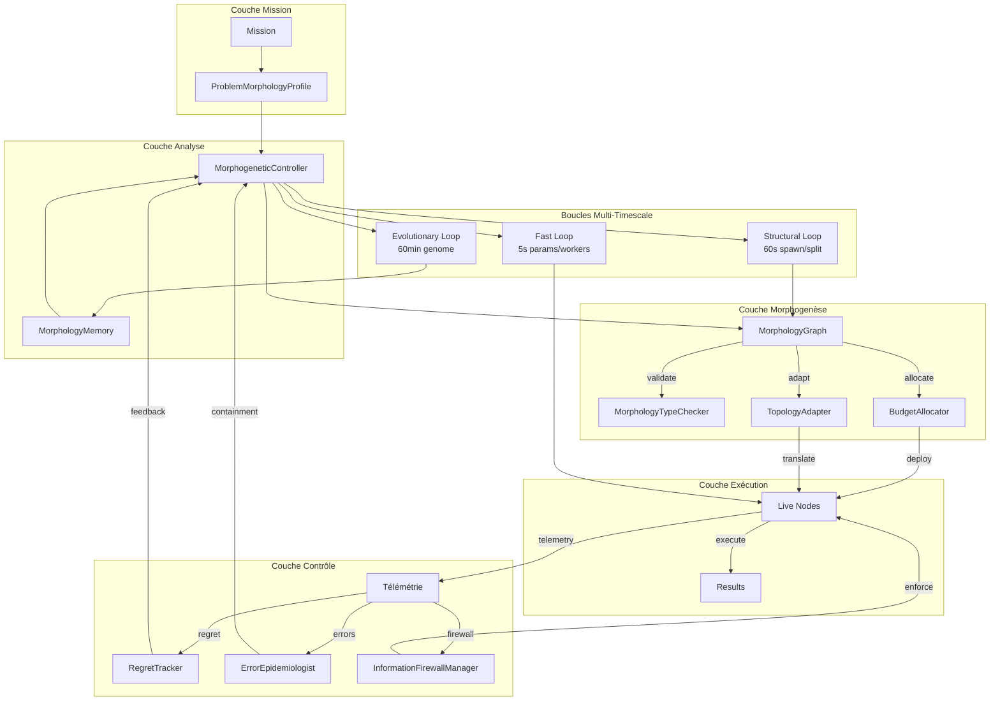
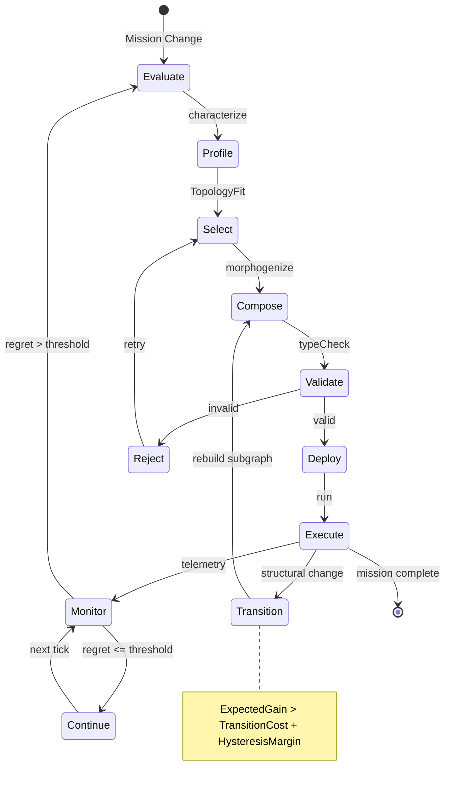
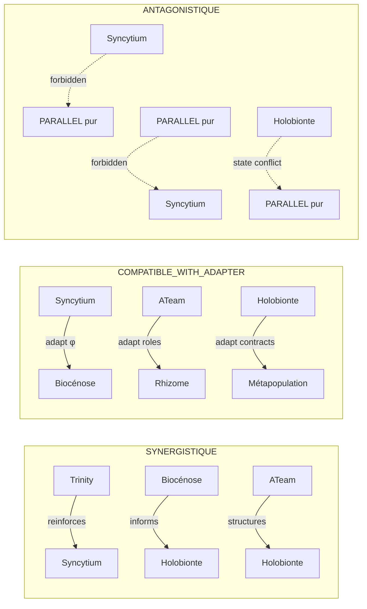

# Morphogenèse : Construction Dynamique des Organisations Cognitives

- **Statut** : Cadre opérationnel du noyau GenOS
- **Portée** : construction, composition, séparation, fusion, transformation et destruction dynamique des organisations cognitives
- **Dernière revue** : 2026-09-26

---

## 1. Définition

La **Morphogenèse** GenOS est le système de contrôle qui construit, compose, imbrique, sépare, fusionne, transforme et détruit dynamiquement les organisations cognitives nécessaires à une mission, en utilisant les topologies comme primitives spécialisées.

Contrairement à un orchestrateur qui exécute un plan fixe, la Morphogenèse maintient un **MorphologyGraph** vivant. Son graphe de containment/autorité peut être arborescent, tandis que les communications, le partage d'état, les preuves, les ressources et les migrations sont représentés par des liens transversaux.

La proposition d'architecture distingue trois échelles de contrôle; ces
cadences et capacités ne sont pas garanties par le runtime courant :

1. **Boucle rapide** (secondes/minutes) : ajustements paramétriques, migration de workers, changement de paramètres de communication
2. **Boucle structurelle** (minutes/heures) : spawn/retire de nœuds, split/merge, changement de variante topologique
3. **Boucle évolutive** (heures/jours) : mutation de la morphogenome, adaptation des politiques de transition, apprentissage des signatures de problème

### 1.1 Principe Fondateur

$$\text{Morphogenèse} : \text{Mission} \times \text{Contexte} \times \text{Preuves} \mapsto \text{MorphologyGraph}$$

La Morphogenèse vise, pour toute mission et tout contexte, une morphologie **valide**, **bornée par le budget**, et **la meilleure connue au vu des preuves courantes**; elle peut être Pareto-efficiente lorsque les éléments disponibles le permettent. Elle ne prétend pas démontrer une optimalité globale.

---

## 2. Spécification formelle et statut des modèles

Les formules de cette fiche ont des statuts différents. Elles sont soit des
invariants vérifiables sur une structure concrète, soit des définitions
opérationnelles candidates, soit des propositions de conception. Une formule
ne devient pas un théorème parce qu'elle est écrite en notation mathématique.
Sauf indication explicite et preuve avec hypothèses, métriques et domaine de
validité, les scores et seuils ci-dessous sont des heuristiques à calibrer, et
les opérateurs décrivent une sémantique souhaitée plutôt qu'une garantie du
runtime. Les tests de contrat démontrent seulement les cas et invariants qu'ils
exécutent.

Dans cette documentation, **vérifié formellement** signifie accepté par un
vérificateur de preuve avec son environnement explicite; **invariant logiciel**
signifie contrôlé par une précondition ou un validateur; **résultat empirique**
exige un protocole et des données reproductibles; **heuristique** désigne une
règle déterministe ou un score non validé; **analogie** est un vocabulaire
inspiré d'un autre domaine. Ces statuts ne sont pas interchangeables.

## 2.1 Représentation du MorphologyGraph

Le MorphologyGraph est un graphe dont chaque sommet est un **MorphologyNode**. Le containment définit une hiérarchie acyclique; les autres relations sont des arêtes typées transversales.

$$\text{MorphologyGraph} = \langle \text{root} : \text{MorphologyNode}, \; \mathcal{T} : \text{TopologyRegistry}, \; \mathcal{P} : \text{ProblemMorphologyProfile} \rangle$$

Chaque **MorphologyNode** est défini par :

$$\text{MorphologyNode} = \langle \; \text{id}, \; \text{topology}, \; \text{variant}, \; \text{scope}, \; \text{mission}, \; \text{children}[], \; \text{workers}[], \; \text{capabilities}[], \; \text{inputContract}, \; \text{outputContract}, \; \text{stateBoundary}, \; \text{authorityBoundary}, \; \text{communicationPolicy}, \; \text{evidencePolicy}, \; \text{budget}, \; \text{lifecycle}, \; \text{parent} \; \rangle$$

où :
- $\text{id}$ : identifiant unique (UUID v7)
- $\text{topology} \in \{\text{Trinity}, \text{ATeam}, \text{Biome}, \text{Biocénose}, \text{Holobionte}, \text{Syncytium}, \text{Rhizome}, \text{Métapopulation}\}$
- $\text{variant}$ : paramétrage spécifique de la topology (ex. Syncytium avec CRDTs LWW vs. SYNC avec consensus)
- $\text{scope}$ : sous-espace de mission assigné au nœud
- $\text{mission}$ : objectif cognitif local
- $\text{children} : [\text{MorphologyNode}]$ — sous-nœuds imbriqués
- $\text{workers} : [\text{Agent}]$ — agents affectés à ce nœud
- $\text{capabilities} : [\text{Capability}]$ — capacités requises/disponibles
- $\text{inputContract}$ : contrat d'entrée (schéma, préconditions)
- $\text{outputContract}$ : contrat de sortie (schéma, postconditions)
- $\text{stateBoundary}$ : frontière d'état (état privé vs. partagé)
- $\text{authorityBoundary}$ : frontière d'autorité (droits de décision)
- $\text{communicationPolicy}$ : politique de communication inter-nœuds
- $\text{evidencePolicy}$ : politique de promotion des preuves
- $\text{budget}$ : budget alloué (tokens, cycles, stockage, bande passante)
- $\text{lifecycle}$ : état du cycle de vie
- $\text{parent} : \text{MorphologyNode} \cup \{\text{null}\}$ — nœud parent (null pour la racine)

**Invariant structurel** :

$$\forall n \in \text{MorphologyGraph} : \; n \notin \text{descendants}(n) \;\land\; |\text{children}(n)| \le \text{MaxChildren}$$

Le graphe comprend des vues distinctes pour le containment, la communication, l'autorité, le partage d'état, les preuves, les ressources et les migrations. Une arête doit déclarer son type et ses extrémités; elle ne modifie pas implicitement l'autorité ou le containment.

### 2.2 ProblemMorphologyProfile

Le **ProblemMorphologyProfile** vise à caractériser le problème pour guider le choix morphologique. La fiche définit 19 dimensions proposées dans $[0, 1]$. Ces bornes ne garantissent pas que les dimensions soient mesurées ou calibrées; confiance, références de preuve et date d'observation sont des extensions de conception et ne doivent être décrites comme présentes que si le schéma du profil les stocke effectivement.

$$\text{ProblemMorphologyProfile} = \langle \; \sigma_{\text{epistemic}}, \; \sigma_{\text{separability}}, \; \sigma_{\text{decidability}}, \; \sigma_{\text{decomposability}}, \; \sigma_{\text{coupling}}, \; \sigma_{\text{staleReadCost}}, \; \sigma_{\text{authorityAsymmetry}}, \; \sigma_{\text{deliberativeNeed}}, \; \sigma_{\text{dissentImportance}}, \; \sigma_{\text{structureUnknownness}}, \; \sigma_{\text{ecologicalComplexity}}, \; \sigma_{\text{resourceCompetition}}, \; \sigma_{\text{localAutonomy}}, \; \sigma_{\text{persistenceNeed}}, \; \sigma_{\text{failureCorrelation}}, \; \sigma_{\text{capabilityUncertainty}}, \; \sigma_{\text{adversarialRisk}}, \; \sigma_{\text{privacySeparation}}, \; \sigma_{\text{temporalHorizon}} \; \rangle$$

| Dimension | Définition | Hypothèse de conception à évaluer |
|-----------|-----------|---------------------|
| $\sigma_{\text{epistemic}}$ | Incertitude épistémique (connaissances incomplètes) | Pourrait justifier l'évaluation de Trinity ou Rhizome |
| $\sigma_{\text{separability}}$ | Séparabilité des hypothèses | Pourrait justifier l'évaluation de PARALLEL ou COMPETE |
| $\sigma_{\text{decidability}}$ | Décidabilité expérimentale | Pourrait justifier l'évaluation de Trinity ou A-Team |
| $\sigma_{\text{decomposability}}$ | Décomposabilité fonctionnelle | Pourrait justifier NEST ou SEQUENCE |
| $\sigma_{\text{coupling}}$ | Couplage d'état entre sous-problèmes | Pourrait justifier l'évaluation de Syncytium ou Holobionte |
| $\sigma_{\text{staleReadCost}}$ | Coût de lecture périmée | Pourrait motiver un mécanisme de fraîcheur; la topologie seule ne le garantit pas |
| $\sigma_{\text{authorityAsymmetry}}$ | Asymétrie d'autorité requise | Pourrait justifier A-Team ou NEST sous contrat d'autorité vérifié |
| $\sigma_{\text{deliberativeNeed}}$ | Besoin de délibération collective | Pourrait justifier l'évaluation de Biocénose ou Biome |
| $\sigma_{\text{dissentImportance}}$ | Importance du dissentiment | Pourrait justifier la conservation de propositions divergentes |
| $\sigma_{\text{structureUnknownness}}$ | Inconnue structurelle | Pourrait motiver l'exploration par Rhizome ou Métapopulation |
| $\sigma_{\text{ecologicalComplexity}}$ | Complexité écologique | Pourrait motiver Biocénose ou Holobionte |
| $\sigma_{\text{resourceCompetition}}$ | Compétition pour les ressources | Pourrait motiver COMPETE ou Métapopulation |
| $\sigma_{\text{localAutonomie}}$ | Autonomie locale requise | Favorise Métapopulation, FEDERATE |
| $\sigma_{\text{persistenceNeed}}$ | Besoin de persistance | Pourrait motiver Holobionte ou Biome |
| $\sigma_{\text{failureCorrelation}}$ | Corrélation des défaillances | Pourrait motiver une isolation; PARALLEL ne garantit pas à lui seul l'indépendance des pannes |
| $\sigma_{\text{capabilityUncertainty}}$ | Incertitude sur les capacités | Pourrait motiver une comparaison COMPETE ou une communauté Biocénose |
| $\sigma_{\text{adversarialRisk}}$ | Risque adversarial | Pourrait motiver des voies indépendantes; BRIDGE n'est pas en soi une défense |
| $\sigma_{\text{privacySeparation}}$ | Séparation privacy | Pourrait motiver des frontières PARALLEL/NEST, sous réserve de contrôles effectifs |
| $\sigma_{\text{temporalHorizon}}$ | Horizon temporel | Peut influer sur les coûts de persistance et de séquencement |

**Score d'affectation topologique — forme illustrative** :

$$\text{TopologyFit}(T, P) = \vec{w}_T \cdot \text{proj}_T(P)$$

où $\vec{w}_T$ et $\text{proj}_T$ devraient être appris ou justifiés par
validation. Cette formule n'est pas la spécification exacte du résolveur
implémenté et aucune calibration empirique de ces 19 dimensions n'est affirmée.

### 2.3 Algèbre des Topologies

La conception décrit huit opérateurs de composition. Le terme « foncteur » au
sens de la théorie des catégories n'est pas établi ici : catégories source et
cible, morphismes et préservation de composition/identité ne sont pas définis.
On les traite comme des opérateurs logiciels candidats dont les contrats
doivent être spécifiés et testés séparément.

#### 2.3.1 NEST — Composition Hiérarchique

Soient $M_{\text{host}}$ et $M_{\text{inner}}$ deux morphologies. $\text{NEST}(M_{\text{host}}, M_{\text{inner}})$ construit une morphologie où $M_{\text{inner}}$ s'exécute à l'intérieur du périmètre d'autorité de $M_{\text{host}}$.

$$\text{NEST}(M_{\text{host}}, M_{\text{inner}}) = \langle A_{\text{host}} \cup A_{\text{inner}}, \; \mathcal{R}_{\text{host}} \rhd \mathcal{R}_{\text{inner}}, \; \Lambda_{\text{host}} \circ \Lambda_{\text{inner}} \rangle$$

où $\rhd$ signifie que les ressources de l'intérieur sont une sous-allocation des ressources de l'hôte : $\sum_{r \in \text{inner}} r \le \mathcal{R}_{\text{host}}$.

**Propriétés** :
- Transitivité : $\text{NEST}(\text{NEST}(M_1, M_2), M_3) = \text{NEST}(M_1, \text{NEST}(M_2, M_3))$
- Non-commutativité : $\text{NEST}(M_1, M_2) \neq \text{NEST}(M_2, M_1)$

#### 2.3.2 PARALLEL — Exécution Convergente Indépendante

Soit $\mathcal{M} = \{M_1, \ldots, M_n\}$ un ensemble de morphologies indépendantes. $\text{PARALLEL}(\mathcal{M})$ exécute chaque $M_i$ sur une partition disjointe de l'espace d'entrée.

$$\text{PARALLEL}(\mathcal{M}) = \left\langle \bigsqcup_{i=1}^n A_i, \; \prod_{i=1}^n \mathcal{R}_i, \; \bigparallel_{i=1}^n \Lambda_i \right\rangle$$

Condition d'indépendance stricte :

$$\forall i \neq j : \; \text{writes}(M_i) \cap \text{writes}(M_j) = \emptyset$$

**Score de parallélisme** :

$$\text{ParScore}(\mathcal{M}) = \frac{\sum_{i=1}^n \text{U}(M_i)}{\max_i \text{U}(M_i) \cdot n} \in [0, 1]$$

#### 2.3.3 SEQUENCE — Composition Séquentielle

$\text{SEQUENCE}(M_1, \ldots, M_n)$ impose que $M_{i+1}$ ne démarre que si $M_i$ a produit un artifact de preuve validé par un gate $G_i$.

$$\text{SEQUENCE}(\vec{M}) = \left\langle \overrightarrow{A}, \; \overrightarrow{\mathcal{R}}, \; \Lambda_1 \xrightarrow{G_1} \Lambda_2 \xrightarrow{G_2} \cdots \xrightarrow{G_{n-1}} \Lambda_n \right\rangle$$

**Décomposition du regret** :

$$\text{MorphologicalRegret}(\text{SEQUENCE}(\vec{M})) = \sum_{i=1}^n \text{MR}(M_i) + \sum_{i=1}^{n-1} \text{HandoffRegret}(M_i, M_{i+1})$$

#### 2.3.4 GATE — Ramification Conditionnelle

$\text{GATE}(M_{\text{cond}}, M_{\text{true}}, M_{\text{false}})$ évalue une morphologie conditionnelle et sélectionne l'une des deux branches.

$$\text{GATE}(M_c, M_t, M_f) = \begin{cases} M_t & \text{if } \text{Evaluate}(M_c) = \top \\ M_f & \text{if } \text{Evaluate}(M_c) = \bot \end{cases}$$

**GATE utility avec incertitude** :

$$\text{U}(\text{GATE}(M_c, M_t, M_f)) = \sigma \cdot \text{U}(M_t) + (1 - \sigma) \cdot \text{U}(M_f)$$

où $\sigma$ est le niveau de confiance de l'évaluation.

#### 2.3.5 COMPETE — Arène de Sélection

$\text{COMPETE}(\mathcal{M}, \text{selector})$ place les morphologies de $\mathcal{M}$ en concurrence pour une ressource unique.

$$\text{COMPETE}(\mathcal{M}, \text{selector}) = \text{selector}(\mathcal{M})$$

**CompetitorScore** :

$$\text{CompetitorScore}(M_i) = \frac{\text{U}(M_i)}{\sum_{j=1}^n \text{U}(M_j)}$$

#### 2.3.6 WRAP — Enrobage Contextuel

$\text{WRAP}(M, \text{env})$ enveloppe une morphologie dans un environnement contextuel.

$$\text{WRAP}(M, \text{env}) = \langle A_M, \; \mathcal{R}_M \ominus \text{env}.r_{\text{cost}}, \; \text{env}_{\text{pre}} \circ \Lambda_M \circ \text{env}_{\text{post}} \rangle$$

**Coût contextuel** :

$$\text{ContextCost}(\text{env}) = \sum_{o \in \text{observers}(\text{env})} \text{cost}(o) + \text{latency}(\text{env})$$

#### 2.3.7 BRIDGE — Pont Inter-Topologique

$\text{BRIDGE}(M_s, M_d, \phi)$ construit une fonction de traduction $\phi$ entre deux morphologies aux sémantiques différentes.

$$\text{BRIDGE}(M_s, M_d, \phi) = \langle A_s \cup A_d, \; \mathcal{R}_s + \mathcal{R}_d + \text{transCost}(\phi), \; \Lambda_s \xrightarrow{\phi} \Lambda_d \rangle$$

**Condition de fidélité** :

$$\text{Fidelity}(\phi) = \frac{|\{x \in \text{Outputs}(M_s) : \phi(x) \in \text{ValidInputs}(M_d)\}|}{|\text{Outputs}(M_s)|}$$

$$\text{Fidelity}(\phi) \ge \tau_{\text{bridge}} \quad (\tau_{\text{bridge}} = 0.85)$$

#### 2.3.8 FEDERATE — Fédération Morphologique

$\text{FEDERATE}(\mathcal{M}, \text{gov})$ combine plusieurs morphologies sous un contrat de gouvernance partagée.

$$\text{FEDERATE}(\mathcal{M}, \text{gov}) = \left\langle \bigcup_{i=1}^n A_i, \; \sum_{i=1}^n \mathcal{R}_i, \; \biguplus_{i=1}^n \Lambda_i \; \text{s.t.} \; \text{gov} \right\rangle$$

Contrat de gouvernance :

$$\text{gov} = \langle \text{quorum}, \; \text{rights}, \; \text{disputeResolution}, \; \text{exitPolicy}, \; \text{joinPolicy} \rangle$$

**FederationValue** :

$$\text{FederationValue}(\mathcal{M}, \text{gov}) = \sum_{i=1}^n \text{U}(M_i) + \text{MutualismGain}(\mathcal{M}) - \text{GovernanceCost}(\text{gov})$$

### 2.4 TopologyContract

Chaque morphologie et composition est régie par un **TopologyContract** qui spécifie les obligations sémantiques, épistémiques et opérationnelles.

$$\text{TopologyContract} = \langle \; \text{topologyId}, \; \text{problemSemantics}, \; \text{inputSemantics}, \; \text{outputSemantics}, \; \text{independenceModel}, \; \text{stateModel}, \; \text{authorityModel}, \; \text{communicationModel}, \; \text{evidenceModel}, \; \text{lifecycleModel}, \; \text{scalabilityModel}, \; \text{resourceModel}, \; \text{failureModes}[], \; \text{strengths}[], \; \text{weaknesses}[], \; \text{compatibleCompositions}[], \; \text{forbiddenCompositions}[], \; \text{transitionIn}[], \; \text{transitionOut}[], \; \text{observables}[] \; \rangle$$

#### 2.4.1 Composantes Sémantiques

$$\text{problemSemantics} = \langle \text{domain}, \; \text{granularity}, \; \text{uncertaintyProfile}, \; \text{constraintSurface}, \; \text{objectiveFunction} \rangle$$

$$\text{inputSemantics} = \langle \text{schema}, \; \text{preconditions}, \; \text{triggerConditions}, \; \text{priority} \rangle$$

$$\text{outputSemantics} = \langle \text{schema}, \; \text{postconditions}, \; \text{artifacts}, \; \text{qualityBounds} \rangle$$

#### 2.4.2 Composantes Opérationnelles

$$\text{independenceModel} = \langle \text{level}, \; \text{mechanism}, \; \text{verification}, \; \text{boundaries} \rangle$$

$$\text{stateModel} = \langle \text{topology}, \; \text{mutability}, \; \text{sharing}, \; \text{convergence}, \; \text{freshness} \rangle$$

$$\text{authorityModel} = \langle \text{structure}, \; \text{decisionRights}, \; \text{escalationPath}, \; \text{vetoPower} \rangle$$

$$\text{communicationModel} = \langle \text{pattern}, \; \text{protocol}, \; \text{frequency}, \; \text{bandwidth}, \; \text{latencyBudget} \rangle$$

#### 2.4.3 Composantes Épistémiques et Cycliques

$$\text{evidenceModel} = \langle \text{granularity}, \; \text{calibration}, \; \text{promotionCriteria}, \; \text{archivePolicy}, \; \text{auditTrail} \rangle$$

$$\text{lifecycleModel} = \langle \text{phases}, \; \text{transitions}, \; \text{termination}, \; \text{rollback}, \; \text{timeout} \rangle$$

$$\text{scalabilityModel} = \langle \text{horizontal}, \; \text{vertical}, \; \text{agentLimit}, \; \text{degradationCurve}, \; \text{bottleneckProfile} \rangle$$

$$\text{resourceModel} = \langle \text{budget}, \; \text{allocationPolicy}, \; \text{overcommitRatio}, \; \text{reclaimPolicy}, \; \text{accounting} \rangle$$

#### 2.4.4 Composantes de Risque et Composition

$$\text{failureModes} = \{F_i\}, \quad F_i = \langle \text{cause}, \; \text{symptom}, \; \text{mitigation} \rangle$$

$$\text{strengths} = \{S_i\}, \quad \text{weaknesses} = \{W_i\}$$

$$\text{compatibleCompositions} \subseteq \{\text{NEST}, \text{PARALLEL}, \text{SEQUENCE}, \text{GATE}, \text{COMPETE}, \text{WRAP}, \text{BRIDGE}, \text{FEDERATE}\}$$

$$\text{forbiddenCompositions} \subseteq \{\text{NEST}, \text{PARALLEL}, \text{SEQUENCE}, \text{GATE}, \text{COMPETE}, \text{WRAP}, \text{BRIDGE}, \text{FEDERATE}\}$$

$$\text{compatibleCompositions} \cap \text{forbiddenCompositions} = \emptyset$$

$$\text{transitionIn} = \langle \text{adapter}, \; \text{validators}, \; \text{warmup} \rangle$$

$$\text{transitionOut} = \langle \text{adapter}, \; \text{validators}, \; \text{cooldown} \rangle$$

$$\text{observables} = \{O_i\}, \quad O_i = \langle \text{name}, \; \text{type}, \; \text{aggregation}, \; \text{retention} \rangle$$

### 2.5 Morphology Type Checker

Le Morphology Type Checker valide qu'une composition respecte les contrats des sous-morphologies. Il exécute sept vérifications formelles.

#### 2.5.1 Vérification de Compatibilité d'Authority

$$\text{AuthorityCompatible}(M_i, M_j) = \left( \text{authorityModel}(M_i).\text{structure} \in \text{compatibleStructures}(\text{authorityModel}(M_j).\text{structure}) \right)$$

Structures compatibles :

$$\text{compatibleStructures} = \begin{cases} \text{centralized} \leftrightarrow \text{hierarchical} \\ \text{democratic} \leftrightarrow \text{meritocratic} \\ \text{hierarchical} \leftrightarrow \text{rotating} \end{cases}$$

#### 2.5.2 Vérification de Compatibilité de Sémantique d'État

$$\text{StateSemanticsCompatible}(M_i, M_j) = \left( \text{stateModel}(M_i).\text{topology} \times \text{stateModel}(M_j).\text{topology} \notin \text{forbiddenPairs} \right)$$

#### 2.5.3 Vérification des Frontières de Vie Privée

$$\text{PrivacyBoundariesCompatible}(M_i, M_j) = \forall b_i, b_j : \text{classify}(b_i) \cap \text{classify}(b_j) \neq \text{RESTRICTED}$$

#### 2.5.4 Vérification du Contrat de Preuves

$$\text{EvidenceContractCompatible}(M_i, M_j) = \left| \text{evidenceModel}(M_i).\text{calibration} - \text{evidenceModel}(M_j).\text{calibration} \right| \le \epsilon$$

#### 2.5.5 Vérification de la Préservation de l'Indépendance

$$\text{IndependencePreserved}(\mathcal{M}) = \forall i : \text{IndependenceIndex}(\mathcal{M}_i) \ge \tau_{\text{ind}}$$

#### 2.5.6 Vérification du Budget de Ressources

$$\text{ResourceBudgetValid}(\mathcal{M}) = \sum_{i=1}^n \text{resourceModel}(M_i).\text{budget} \le \text{globalBudget} \cdot \text{overcommitRatio}$$

#### 2.5.7 Vérification de Cohérence du Lifecycle

$$\text{LifecycleCoherent}(\mathcal{M}) = \forall i, j : \text{lifecycleModel}(M_i).\text{timeout} \ge \text{lifecycleModel}(j).\text{warmup} + \text{latency}(M_i, M_j)$$

#### 2.5.8 Algorithme Complet

```javascript
function morphologyTypeCheck(morphology, globalBudget, config) {
  const results = {
    authorityCompatible: true,
    stateSemanticsCompatible: true,
    privacyBoundariesCompatible: true,
    evidenceContractCompatible: true,
    independencePreserved: true,
    resourceBudgetValid: true,
    lifecycleCoherent: true,
    violations: []
  };

  function check(node, parentContract) {
    if (node.type === 'topology') {
      const contract = getContract(node.name);
      if (parentContract && !authorityCompatible(parentContract, contract)) {
        results.authorityCompatible = false;
        results.violations.push({ type: 'authority', parent: parentContract, child: contract });
      }
      if (parentContract && !stateSemanticsCompatible(parentContract, contract)) {
        results.stateSemanticsCompatible = false;
        results.violations.push({ type: 'stateSemantics', parent: parentContract, child: contract });
      }
      if (parentContract && !privacyBoundariesCompatible(parentContract, contract)) {
        results.privacyBoundariesCompatible = false;
        results.violations.push({ type: 'privacy', parent: parentContract, child: contract });
      }
      if (parentContract && !evidenceContractCompatible(parentContract, contract)) {
        results.evidenceContractCompatible = false;
        results.violations.push({ type: 'evidence', parent: parentContract, child: contract });
      }
      return contract;
    }
    if (node.type === 'composition') {
      const subContracts = node.children.map(child => check(child, parentContract));
      if (!independencePreserved(subContracts)) {
        results.independencePreserved = false;
        results.violations.push({ type: 'independence', children: subContracts });
      }
      if (!resourceBudgetValid(subContracts, globalBudget)) {
        results.resourceBudgetValid = false;
        results.violations.push({ type: 'budget', children: subContracts, budget: globalBudget });
      }
      if (!lifecycleCoherent(subContracts)) {
        results.lifecycleCoherent = false;
        results.violations.push({ type: 'lifecycle', children: subContracts });
      }
      return deriveCompositionContract(node.operator, subContracts);
    }
    if (node.type === 'direct') {
      return deriveDirectContract(node);
    }
  }

  check(morphology, null);
  return results;
}
```

---

## 3. Les Rôles

La Morphogenèse distribue des rôles spécialisés pour le contrôle morphologique.

### 3.1 MorphogeneticController

Le contrôleur central qui maintient le MorphologyGraph et exécute les boucles de contrôle.

$$\text{MorphogeneticController} = \langle \text{graph}, \; \text{policy}, \; \text{memory}, \; \text{telemetry}, \; \text{regretTracker} \rangle$$

Responsabilités :
- Évaluation continue du ProblemMorphologyProfile
- Décision de spawn/retire/split/merge
- Calcul du MorphologicalRegret et du MorphologicalEfficiency
- Application des morphogenetic invariants
- Gestion de l'hystérésis et anti-flapping

### 3.2 TopologyAdapter

Convertit les outputs/inputs entre topologies aux sémantiques différentes.

$$\text{TopologyAdapter} = \langle \phi_{\text{translate}}, \; \text{fidelity}, \; \text{latency}, \; \text{stateMapper} \rangle$$

Responsabilités :
- Traduction des contrats de sortie d'une topology vers les contrats d'entrée d'une autre
- Maintien de la fidélation au-dessus de $\tau_{\text{bridge}}$
- Migration d'état entre frontières topologiques
- Validation de la cohérence sémantique post-traduction

### 3.3 MorphologyMemory

Stocke et indexe l'historique des morphologies utilisées.

$$\text{MorphologyMemory} = \langle \text{signatureIndex}, \; \text{topologyLog}, \; \text{mutationHistory}, \; \text{performanceIndex} \rangle$$

Chaque entrée mémoire est :

$$\text{MorphologyMemoryEntry} = \langle \; \text{problemSignature}, \; \text{morphologyUsed}, \; \text{topologyTree}, \; \text{parameters}, \; \text{models}, \; \text{cost}, \; \text{performance}, \; \text{failures}, \; \text{transitions}, \; \text{successfulLocalMutations} \; \rangle$$

### 3.4 ErrorEpidemiologist

Traque les erreurs dans le MorphologyGraph et évalue leur propagation.

$$\text{ErrorEpidemiologist} = \langle \text{errorRegistry}, \; \text{transmissionGraph}, \; \text{amplificationModel}, \; \text{containmentPolicy} \rangle$$

### 3.5 InformationFirewallManager

Gère les quatre types de pare-feux informationnels.

$$\text{InformationFirewallManager} = \langle \; \text{INDEPENDENCE\_FIREWALL}, \; \text{PRIVACY\_FIREWALL}, \; \text{AUTHORITY\_FIREWALL}, \; \text{STATE\_FIREWALL} \; \rangle$$

---

## 4. Architecture

L'architecture de la Morphogenèse est organisée en cinq couches :

1. **Couche Mission** : réception et caractérisation des missions
2. **Couche Analyse** : construction du ProblemMorphologyProfile
3. **Couche Morphogenèse** : construction du MorphologyGraph via l'algèbre des topologies
4. **Couche Exécution** : déploiement et contrôle des nœuds morphologiques
5. **Couche Mémoire** : persistance et apprentissage des morphologies passées

### 4.1 Flux de Construction

$$\text{Mission} \xrightarrow{\text{characterize}} \text{ProblemMorphologyProfile} \xrightarrow{\text{morphogenize}} \text{MorphologyGraph} \xrightarrow{\text{validate}} \text{ValidatedMorphology} \xrightarrow{\text{deploy}} \text{LiveMorphology}$$

### 4.2 Relations entre Topologies

Les huit topologies entretiennent trois types de relations :

| Relation | Définition | Exemples |
|----------|-----------|----------|
| **SYNERGISTIQUE** | La composition améliore les deux parties | Biocénose + Holobionte, Trinity + Syncytium |
| **COMPATIBLE_WITH_ADAPTER** | Nécessite un TopologyAdapter pour communiquer | Syncytium + Biocénose, A-Team + Rhizome |
| **ANTAGONISTIQUE** | Incompatibilité structurelle (forbiddenCompositions) | Syncytium + PARALLEL pur |

### 4.3 Signatures Naturelles des 8 Topologies

| Topology | Signature naturelle | Problèmes typiques | σ dominant |
|----------|--------------------|--------------------|------------|
| **Trinity** | Hypothèse → Expérience → Synthèse | Exploration scientifique | σ_epistemic, σ_decidability |
| **A-Team** | Rôles spécialisés, autorité hiérarchique | Ingénierie dirigée | σ_authorityAsymmetry, σ_decomposability |
| **Biome** | Écosystème de dépendances mutuelles | Systèmes complexes persistants | σ_ecologicalComplexity, σ_persistenceNeed |
| **Biocénose** | Délibération collective, quorum | Validation, éthique, jugement | σ_deliberativeNeed, σ_dissentImportance |
| **Holobionte** | Hôte + symbiotes, contrat mutualiste | Systèmes à composantes interdépendantes | σ_coupling, σ_persistenceNeed |
| **Syncytium** | État nucléaire partagé, convergence | Cohérence temps réel | σ_coupling, σ_staleReadCost |
| **Rhizome** | Connexions horizontales, pas de centre | Exploration non dirigée | σ_structureUnknownness, σ_dissentImportance |
| **Métapopulation** | Populations isolées, migration | Parallélisme avec partage tardif | σ_localAutonomy, σ_resourceCompetition |

Les organisations historiques telles que `specialist_expert_committee`, `red_blue_coevolution` et `strategy_arena` sont des **patterns d'organisation**, variantes ou politiques de communication composés à partir de ces primitives. Elles ne constituent pas des topologies de même niveau que les huit primitives.

### 4.4 Contrats de topologie et variants

Le `TopologyContract v2` décrit pour chaque primitive ses sémantiques d'entrée et de sortie, modèles d'indépendance, d'état, d'autorité, de communication, de preuve, de ressources et de cycle de vie. Il documente aussi les forces, limites, modes de défaillance, relations, transitions et observables connus. Ces déclarations sont des contraintes de conception, pas une preuve que chaque runtime les applique déjà.

Les variants gardent le même identifiant topologique et portent des paramètres explicites. Une relation absente du registre est considérée comme non spécifiée et requiert un adaptateur ou une décision de composition avant déploiement.

---

## 5. Activation

La Morphogenèse s'active selon un protocole en trois phases.

### 5.1 Phase de Caractérisation

Le problème entrant est analysé pour produire le ProblemMorphologyProfile.

$$\text{Mission} \xrightarrow{\text{analyze}} \text{ProblemMorphologyProfile}$$

### 5.2 Phase de Morphogenèse

Le profil est utilisé pour construire le MorphologyGraph initial.

$$\text{ProblemMorphologyProfile} \xrightarrow{\text{morphogenize}} \text{MorphologyGraph}$$

Algorithme de morphogenèse initiale :

1. **Sélection topologique** : choisir la topology racine via $\text{TopologyFit}(T, P)$
2. **Décomposition** : si $\sigma_{\text{decomposability}} > \tau_{\text{split}}$, créer des sous-nœuds
3. **Imbrication** : imbriquer les sous-nœuds selon les dépendances d'état
4. **Contratage** : générer les TopologyContract pour chaque nœud
5. **Validation** : exécuter le Morphology Type Checker
6. **Allocation** : allouer le budget global entre les nœuds

### 5.3 Phase de Déploiement

Le MorphologyGraph validé est déployé dans le runtime agentique.

$$\text{ValidatedMorphology} \xrightarrow{\text{deploy}} \text{LiveMorphology}$$

---

## 6. Composition

La composition morphologique est le processus de construction du MorphologyGraph via l'algèbre des topologies.

### 6.1 Grammar Formelle

La morphologie d'une composition GenOS suit une grammaire hors-contexte strictement typée.

```
<Morphology>    ::= <Direct>
                  | <Topology>
                  | <Composition>

<Direct>        ::= "Direct" "(" <HandlerSpec> ")"

<Topology>      ::= <TopologyName> "(" <TopologyConfig> ")"

<TopologyName>  ::= "Trinity" | "ATeam" | "Biome" | "Biocenose"
                  | "Holobionte" | "Syncytium" | "Rhizome" | "Metapopulation"

<Composition>   ::= "NEST(" <Morphology> "," <Morphology> ")"
                  | "PARALLEL(" <MorphologyList> ")"
                  | "SEQUENCE(" <StepList> ")"
                  | "GATE(" <Morphology> "," <Morphology> "," <Morphology> ")"
                  | "COMPETE(" <MorphologyList> "," <SelectorSpec> ")"
                  | "WRAP(" <Morphology> "," <EnvSpec> ")"
                  | "BRIDGE(" <Morphology> "," <Morphology> "," <TranslateSpec> ")"
                  | "FEDERATE(" <MorphologyList> "," <GovSpec> ")

<MorphologyList> ::= <Morphology> { "," <Morphology> }

<StepList>      ::= <Step> { "," <Step> }

<Step>          ::= "{" "morphology" ":" <Morphology> "," "gate" ":" <GateSpec> "}"
```

### 6.2 Règles de Typage

Chaque production de la grammaire est accompagnée d'une règle de typage :

$$\frac{\Gamma \vdash m_1 : \tau_1 \quad \Gamma \vdash m_2 : \tau_2 \quad \text{AuthorityCompatible}(\tau_1, \tau_2)}{\Gamma \vdash \text{NEST}(m_1, m_2) : \text{NEST}(\tau_1, \tau_2)}$$

$$\frac{\Gamma \vdash m_i : \tau_i \quad \forall i \neq j : \text{writes}(\tau_i) \cap \text{writes}(\tau_j) = \emptyset}{\Gamma \vdash \text{PARALLEL}(\{m_i\}) : \text{PARALLEL}(\{\tau_i\})}$$

$$\frac{\Gamma \vdash M_c : \tau_{\text{cond}} \quad \Gamma \vdash M_t : \tau \quad \Gamma \vdash M_f : \tau}{\Gamma \vdash \text{GATE}(M_c, M_t, M_f) : \tau}$$

---

## 7. Allocation

L'allocation distribue le budget global entre les nœuds morphologiques.

### 7.1 Budget Nœud

$$\text{budget} = \langle \text{tokens}, \; \text{cycles}, \; \text{storage}, \; \text{bandwidth} \rangle$$

### 7.2 Politiques d'Allocation

| Politique | Formule | Usage |
|-----------|---------|-------|
| **equal** | $b_i = B / n$ | PARALLEL sans asymétrie |
| **proportional** | $b_i = B \cdot \frac{w_i}{\sum w_j}$ | Pondération par importance |
| **priority** | $b_i = B \cdot \frac{p_i}{\sum p_j}$ | Urgence différentielle |
| **market** | Enchères entre nœuds | COMPETE explicite |
| **auction** | Vickrey-Clarke-Groves | Allocation Pareto-optimale |

### 7.3 Sur-allocation Contrôlée

$$\sum_{i=1}^n \text{budget}(M_i) \le \text{globalBudget} \cdot \text{overcommitRatio}$$

où $\text{overcommitRatio} \in [1, \infty)$ permet une sur-allocation contrôlée pour absorber les pics de demande.

### 7.4 Récupération

Les ressources inutilisées sont réclamées selon la politique de reclaim :

$$\text{reclaim}(M_i) = \text{budget}(M_i) - \text{consumed}(M_i) \quad \text{si} \; \text{idle}(M_i) > \tau_{\text{idle}}$$

---

## 8. Exécution

L'exécution d'une morphologie est un processus multi-niveaux.

### 8.1 Exécution Nœud

Chaque nœud morphologique exécute sa mission selon sa topology assignée.

$$\text{execute}(M_i) = \text{topology}(M_i).\text{run}(M_i.\text{mission}, M_i.\text{workers}, M_i.\text{inputContract})$$

### 8.2 Exécution Composite

Pour les nœuds composites, l'exécution suit l'opérateur :

$$\text{execute}(\text{NEST}(M_h, M_i)) = \text{execute}(M_h) \mid \text{execute}(M_i \subset M_h)$$

$$\text{execute}(\text{PARALLEL}(\mathcal{M})) = \bigparallel_{i} \text{execute}(M_i)$$

$$\text{execute}(\text{SEQUENCE}(\vec{M})) = \text{execute}(M_1) \xrightarrow{G_1} \text{execute}(M_2) \xrightarrow{G_2} \cdots$$

### 8.3 Hand-off entre Nœuds

Le passage entre deux nœuds implique :

1. Validation du outputContract du nœud sortant
2. Traduction via TopologyAdapter si nécessaire
3. Vérification de l'inputContract du nœud entrant
4. Mise à jour des preuves promotionnelles

$$\text{handOff}(M_{\text{out}}, M_{\text{in}}) = \text{validate}_{\text{out}} \circ \text{adapt}_{\phi} \circ \text{validate}_{\text{in}}$$

---

## 9. Barrière

La barrière morphologique empêche les transitions invalides et protège l'intégrité du graphe.

### 9.1 Types de Barrières

| Barrière | Fonction | Condition de passage |
|----------|----------|---------------------|
| **AuthorityBarrier** | Vérifie la compatibilité d'autorité | AuthorityCompatible check |
| **StateBarrier** | Vérifie la compatibilité d'état | StateSemanticsCompatible check |
| **EvidenceBarrier** | Vérifie la compatibilité des preuves | EvidenceContractCompatible check |
| **BudgetBarrier** | Vérifie le budget disponible | ResourceBudgetValid check |
| **LifecycleBarrier** | Vérifie la cohérence du cycle de vie | LifecycleCoherent check |

### 9.2 Transition Cost

Le coût d'une transition morphologique :

$$\text{TransitionCost}(M_{\text{old}}, M_{\text{new}}) = \alpha \cdot \text{StateMigrationCost} + \beta \cdot \text{WarmupCost} + \gamma \cdot \text{ValidationCost}$$

### 9.3 Hystérésis et Anti-flapping

Pour éviter les oscillations morphologiques, une transition n'est effectuée que si :

$$\text{ExpectedGain} > \text{TransitionCost} + \text{HysteresisMargin}$$

où $\text{HysteresisMargin} = \eta \cdot \text{U}(M_{\text{current}})$ et $\eta \in [0.05, 0.2]$.

---

## 10. Continuations

Les continuations permettent la reprise structurée après interruption ou transition.

### 10.1 Snapshot Morphologique

$$\text{MorphologySnapshot} = \langle \text{graphState}, \; \text{workerStates}, \; \text{evidenceBuffer}, \; \text{communicationBuffer}, \; \text{telemetryBuffer} \rangle$$

### 10.2 Point de Reprise

$$\text{ContinuationPoint} = \langle \text{nodeId}, \; \text{phase}, \; \text{progress}, \; \text{snapshot}, \; \text{validUntil} \rangle$$

### 10.3 Reprise

$$\text{resume}(\text{ContinuationPoint}) = \text{restore}(\text{snapshot}) \circ \text{validate} \circ \text{continueFrom}(\text{phase})$$

---

## 11. Télémétrie

La télémétrie morphologique capture les métriques de santé et de performance.

### 11.1 Observables par Nœud

| Observable | Type | Agrégation | Description |
|-----------|------|-----------|-------------|
| `node.utility` | float | sum | Utilité locale du nœud |
| `node.cost` | float | sum | Coût cumulé du nœud |
| `node.latency` | float | max | Latence d'exécution |
| `node.errorRate` | float | avg | Taux d'erreur |
| `node.evidencePromotion` | float | ratio | Taux de promotion des preuves |
| `node.budgetConsumption` | float | ratio | Ratio budget utilisé / alloué |
| `node.coordinationOverhead` | float | sum | Surcoût de coordination |

### 11.2 Observables Globaux

| Observable | Type | Description |
|-----------|------|-------------|
| `global.regret` | float | MorphologicalRegret cumulé |
| `global.efficiency` | float | MorphologicalEfficiency globale |
| `global.coupling` | float | CouplingScore global |
| `global.diversity` | float | CognitiveDiversity du graphe |
| `global.dysbiosisRisk` | float | Risque de dysbiose |
| `global.transitionRate` | float | Taux de transitions par minute |
| `global.mutationRate` | float | Taux de mutations morphologiques |

---

## 12. Configuration

La configuration de la Morphogenèse est définie par le **MorphogeneticConfig**.

$$\text{MorphogeneticConfig} = \langle \; \text{maxChildren}, \; \text{maxDepth}, \; \text{defaultTopology}, \; \text{overcommitRatio}, \; \text{hysteresisMargin}, \; \text{bridgeThreshold}, \; \text{typeCheckOnTransition}, \; \text{memoryRetention}, \; \text{antiFlapWindow}, \; \text{firewallPolicy}, \; \text{timescaleConfig} \; \rangle$$

| Paramètre | Valeur par défaut | Description |
|-----------|------------------|-------------|
| `maxChildren` | 8 | Nombre maximal de sous-nœuds par nœud |
| `maxDepth` | 6 | Profondeur maximale du graphe |
| `defaultTopology` | Trinity | Topology par défaut pour les nœuds non spécifiés |
| `overcommitRatio` | 1.5 | Facteur de sur-allocation autorisé |
| `hysteresisMargin` | 0.1 | Marge d'hystérésis (10% de l'utilité courante) |
| `bridgeThreshold` | 0.85 | Seuil de fidélité pour BRIDGE |
| `typeCheckOnTransition` | true | Exécuter le type checker à chaque transition |
| `memoryRetention` | 30 days | Durée de rétention des entrées mémoire |
| `antiFlapWindow` | 300s | Fenêtre anti-flapping minimale entre transitions |
| `firewallPolicy` | STRICT | Politique des pare-feux (PERMISSIVE, STANDARD, STRICT) |

### 12.1 Configuration Multi-timescale

$$\text{timescaleConfig} = \langle \; \text{fastIntervalMs}, \; \text{structuralIntervalMs}, \; \text{evolutionaryIntervalMs} \; \rangle$$

| Échelle | Intervalle | Opérations |
|---------|-----------|------------|
| **Fast** | 5 000 ms | Paramètres, migration workers, communication |
| **Structural** | 60 000 ms | Spawn/retire, split/merge, changement de variante |
| **Evolutionary** | 3 600 000 ms | Mutation morphogenome, adaptation politiques |

---

## 13. Limites

### 13.1 Limites Structurelles

- **MaxChildren** : un nœud ne peut pas avoir plus de 8 enfants directs
- **MaxDepth** : la profondeur du graphe est limitée à 6 niveaux
- **SharedWrites** : un nœud Syncytium ne peut pas contenir un sous-nœud PARALLEL pur (SharedWrites conflictuels)

### 13.2 Limites de Transition

- **Anti-flap** : une transition morphologique ne peut pas se produire dans les 300 secondes suivant la précédente sur le même sous-arbre
- **Hystérésis** : le gain attendu doit dépasser le coût de transition de au moins 10%
- **Fidélité** : un BRIDGE avec une fidélité < 0.85 est interdit

### 13.3 Limites de Ressources

- **Budget global** : la somme des budgets alloués ne peut pas dépasser $\text{globalBudget} \cdot \text{overcommitRatio}$
- **AgentLimit** : chaque topology a un nombre maximal d'agents (ex. Syncytium : 50, Métapopulation : 100+)
- **MemoryPressure** : au-delà de 10 000 entrées mémoire, les entrées les plus anciennes sont purgées

### 13.4 Limites Épistémiques

- **Calibration drift** : si la calibration d'un nœud dérive de plus de $\epsilon = 0.1$, il doit être recalibré ou retiré
- **Evidence stagnation** : un nœud qui n'a promu aucune preuve en $2 \times \text{timeout}$ est candidat à l'autophagie

---

## 14. Comparaisons

### 14.1 Morphogenèse vs. Orchestration Statique

| Aspect | Orchestration Statique | Morphogenèse GenOS |
|--------|----------------------|-------------------|
| Structure | Plan fixe | Graphe vivant |
| Adaptabilité | Aucune | Multi-timescale |
| Optimisation | Offline | Continuous regret minimization |
| Complexité | $O(1)$ planning | $O(n \cdot d)$ control loops |

### 14.2 Morphogenèse vs. Multi-Agent Systèmes Classiques

| Aspect | MAS Classique | Morphogenèse GenOS |
|--------|--------------|-------------------|
| Topologies | 1 (fixe) | 8 (spécialisées) |
| Composition | Ad hoc | Algèbre formelle |
| Validation | Runtime only | Type checker a priori |
| Métriques | Utility only | Multi-objective regret framework |

### 14.3 Morphogenèse vs. Organoid Computing

| Aspect | Organoid Computing | Morphogenèse GenOS |
|--------|-------------------|-------------------|
| Medium | Biologique | Computationnel |
| Contrôle | Chimique | Algorithmique |
| Précision | Faible | Formelle |
| Vitesse | Lent (heures) | Rapide (secondes) |

---

## 15. Références

| Concept | Référence |
|---------|-----------|
| Trinity | [trinity.md](trinity.md) |
| A-Team | [a-team.md](a-team.md) |
| Biome | [biome.md](biome.md) |
| Biocénose | [biocenose.md](biocenose.md) |
| Holobionte | [holobionte.md](holobionte.md) |
| Syncytium | [syncytium.md](syncytium.md) |
| Rhizome | [rhizome.md](rhizome.md) |
| Métapopulation | [metapopulation.md](metapopulation.md) |
| Noyau de contrôle morphogénétique | [../noyau-controle-morphogenetique.md](../noyau-controle-morphogenetique.md) |
| ADR 0045 — noyau morphogénétique | [../adr/0045-noyau-controle-morphogenetique.md](../adr/0045-noyau-controle-morphogenetique.md) |
| ADR 0040 — morphogenèse Git contrefactuelle | [../adr/0040-morphogenese-git-contrefactuel.md](../adr/0040-morphogenese-git-contrefactuel.md) |
| ADR 0038 — boucle de contrôle cognitif | [../adr/0038-boucle-controle-cognitif-morphogenese.md](../adr/0038-boucle-controle-cognitif-morphogenese.md) |
| Épistémologie et évidence | [../01-concepts/epistemologie-et-evidence.md](../01-concepts/epistemologie-et-evidence.md) |
| Runtime agentique | [../01-concepts/runtime-agentique.md](../01-concepts/runtime-agentique.md) |
| Index documentation | [../README.md](../README.md) |

---

## 16. Schémas Mermaid

### 16.1 Vue d'Ensemble de l'Architecture Morphogénétique



### 16.2 Cycle de Transition Morphologique



### 16.3 Relations entre Topologies



### 16.4 Morphogenesis Multi-Timescale Control

```mermaid
gantt
    title Morphogenetic Control Loops
    dateFormat X
    axisFormat %s

    section Fast Loop (5s)
    Param tuning           :done, f1, 0, 5s
    Worker migration       :active, f2, 5s, 5s
    Communication adjust   :f3, 10s, 5s

    section Structural Loop (60s)
    Spawn/Retire nodes     :s1, 60s, 60s
    Split/Merge            :s2, 120s, 60s
    Variant change         :s3, 180s, 60s

    section Evolutionary Loop (60min)
    Morphogenome mutation  :e1, 3600s, 3600s
    Policy adaptation      :e2, 7200s, 3600s
    Memory consolidation   :e3, 10800s, 3600s
```

---

## 17. Implementation

### 17.1 Construction d'une Morphologie

```javascript
// Exemple complet : Morphogenèse d'une mission de recherche
const morphology = federate(
  [
    // Branche 1 : exploration scientifique — Trinity imbriquée
    nest(
      holobionte({
        host: "research-lead",
        symbionts: ["hypothesis-generator", "experiment-designer", "analyzer"]
      }),
      sequence([
        { morphology: trinity({ hypothesis: "protein-folding-variant-A" }), gate: "p-value < 0.05" },
        { morphology: trinity({ hypothesis: "protein-folding-variant-B" }), gate: "replication-confirmed" }
      ])
    ),

    // Branche 2 : validation éthique — Biocénose
    biocenose({
      community: ["ethics-reviewer", "bias-auditor", "stakeholder-proxy"],
      quorum: 0.67,
      deliberationRounds: 3
    }),

    // Branche 3 : monitoring — Syncytium
    syncytium({
      nuclei: ["log-aggregator", "anomaly-detector", "alert-dispatcher"],
      syncIntervalMs: 5000,
      conflictPolicy: "escalate"
    })
  ],
  {
    quorum: 0.6,
    rights: { research: 0.5, ethics: 0.3, monitoring: 0.2 },
    disputeResolution: "weighted-vote",
    exitPolicy: "graceful-degradation"
  }
);

// Validation morphologique
const validation = morphologyTypeCheck(morphology, globalBudget, {
  hysteresisMargin: 0.1,
  antiFlapWindow: 300,
  bridgeThreshold: 0.85
});

console.log(validation);
// { authorityCompatible: true, stateSemanticsCompatible: true, ... }
```

### 17.2 Sélection Topologique via ProblemMorphologyProfile

```javascript
function selectTopology(profile, candidates) {
  let bestFit = -Infinity;
  let bestTopology = null;

  for (const topology of candidates) {
    const fit = topologyFit(topology, profile);
    if (fit > bestFit) {
      bestFit = fit;
      bestTopology = topology;
    }
  }
  return { topology: bestTopology, score: bestFit };
}

// Usage
const profile = {
  epistemicUncertainty: 0.8,
  hypothesisSeparability: 0.3,
  experimentalDecidability: 0.9,
  functionalDecomposability: 0.6,
  stateCoupling: 0.4,
  staleReadCost: 0.2,
  authorityAsymmetry: 0.7,
  deliberativeNeed: 0.3,
  dissentImportance: 0.2,
  structureUnknownness: 0.7,
  ecologicalComplexity: 0.4,
  resourceCompetition: 0.3,
  localAutonomy: 0.5,
  persistenceNeed: 0.6,
  failureCorrelation: 0.2,
  capabilityUncertainty: 0.5,
  adversarialRisk: 0.1,
  privacySeparation: 0.3,
  temporalHorizon: 0.6
};

const result = selectTopology(profile, ALL_TOPOLOGIES);
console.log(`Selected: ${result.topology} (score: ${result.score.toFixed(3)})`);
// Selected: Trinity (score: 0.847)
```

### 17.3 Adaptation Dynamique

```javascript
class MorphogeneticController {
  constructor(config) {
    this.graph = null;
    this.config = config;
    this.memory = new MorphologyMemory();
    this.regretTracker = new RegretTracker();
    this.lastTransitionTime = 0;
  }

  async adapt(mission, context, evidence) {
    const profile = characterize(mission, context, evidence);
    const currentUtility = this.graph ? computeUtility(this.graph) : 0;

    // Rechercher dans la mémoire
    const remembered = this.memory.lookup(profile);
    const candidateMorphology = remembered
      ? adaptFromMemory(remembered, profile)
      : this.morphogenize(profile);

    const candidateUtility = simulateUtility(candidateMorphology);
    const transitionCost = this.computeTransitionCost(candidateMorphology);
    const expectedGain = candidateUtility - currentUtility;

    // Hystérésis et anti-flapping
    const now = Date.now();
    const timeSinceLast = now - this.lastTransitionTime;
    const hysteresis = this.config.hysteresisMargin * currentUtility;

    if (expectedGain > transitionCost + hysteresis && timeSinceLast > this.config.antiFlapWindow * 1000) {
      await this.transition(candidateMorphology);
      this.lastTransitionTime = now;
      this.regretTracker.record(currentUtility, candidateUtility, profile);
    }
  }

  morphogenize(profile) {
    const root = selectTopology(profile, ALL_TOPOLOGIES);
    const graph = buildMorphologyGraph(root, profile);
    return validateAndRepair(graph, this.config);
  }
}
```

### 17.4 Gestion des Pare-feux Informationnels

```javascript
class InformationFirewallManager {
  constructor(policy = 'STANDARD') {
    this.policy = policy;
    this.firewalls = {
      INDEPENDENCE_FIREWALL: new IndependenceFirewall(policy),
      PRIVACY_FIREWALL: new PrivacyFirewall(policy),
      AUTHORITY_FIREWALL: new AuthorityFirewall(policy),
      STATE_FIREWALL: new StateFirewall(policy)
    };
  }

  checkTransition(oldNode, newNode) {
    const results = {
      independence: this.firewalls.INDEPENDENCE_FIREWALL.check(oldNode, newNode),
      privacy: this.firewalls.PRIVACY_FIREWALL.check(oldNode, newNode),
      authority: this.firewalls.AUTHORITY_FIREWALL.check(oldNode, newNode),
      state: this.firewalls.STATE_FIREWALL.check(oldNode, newNode)
    };

    return {
      allowed: Object.values(results).every(r => r.allowed),
      violations: Object.entries(results).filter(([_, r]) => !r.allowed)
    };
  }
}
```

### 17.5 Épidémiologie des Erreurs

```javascript
class ErrorEpidemiologist {
  trackError(error, nodeId, morphology) {
    const R_error = this.computeReproductionRate(error, morphology);
    const origin = this.traceOrigin(error, nodeId);
    const transmission = this.modelTransmission(error, morphology);
    const amplification = this.estimateAmplification(error, morphology);
    const containment = this.determineContainment(error, morphology);

    return {
      R_error,          // Taux de reproduction de l'erreur
      origin,           // Nœud d'origine
      transmission,     // Vecteurs de transmission
      amplification,    // Facteur d'amplification
      containment       // Stratégie de confinement
    };
  }

  computeReproductionRate(error, morphology) {
    // Nombre moyen d'agents affectés par l'erreur
    const affectedWorkers = morphology.workers.filter(w => isAffected(w, error));
    return affectedWorkers.length / morphology.workers.length;
  }
}
```

### 17.6 Morphology Memory Lookup

```javascript
class MorphologyMemory {
  constructor(config) {
    this.entries = new Map();
    this.signatureIndex = new Map();
    this.retentionMs = config.memoryRetention * 24 * 3600 * 1000;
  }

  lookup(profile) {
    const signature = computeSignature(profile);
    const matches = this.signatureIndex.get(signature) || [];

    // Trouver l'entrée la plus similaire avec performance élevée
    return matches
      .filter(e => Date.now() - e.timestamp < this.retentionMs)
      .sort((a, b) => b.performance - a.performance)[0] || null;
  }

  record(entry) {
    const signature = computeSignature(entry.problemSignature);
    if (!this.signatureIndex.has(signature)) {
      this.signatureIndex.set(signature, []);
    }
    this.signatureIndex.get(signature).push(entry);
    this.entries.set(entry.id, entry);
  }
}
```

---

## 18. Morphogenetic Operations

Les opérations morphogénétiques sont les primitives de modification du MorphologyGraph.

### 18.1 SPAWN_NODE

Crée un nouveau nœud morphologique dans le graphe.

$$\text{SPAWN\_NODE}(M_{\text{parent}}, \text{topology}, \text{config}) \mapsto M_{\text{new}}$$

```javascript
function spawnNode(parent, topology, config) {
  const node = {
    id: uuidv7(),
    topology: topology,
    variant: config.variant || 'default',
    scope: config.scope,
    mission: config.mission,
    children: [],
    workers: [],
    capabilities: config.capabilities || [],
    inputContract: config.inputContract,
    outputContract: config.outputContract,
    stateBoundary: config.stateBoundary || { type: 'private' },
    authorityBoundary: config.authorityBoundary,
    communicationPolicy: config.communicationPolicy,
    evidencePolicy: config.evidencePolicy,
    budget: config.budget,
    lifecycle: 'spawning',
    parent: parent.id
  };
  parent.children.push(node);
  return node;
}
```

### 18.2 RETIRE_NODE

Retire un nœud du graphe après migration de ses workers et état.

$$\text{RETIRE\_NODE}(M_{\text{target}}) \mapsto \text{true}$$

```javascript
async function retireNode(target) {
  // 1. Migrer les workers vers le parent
  target.workers.forEach(w => migrateWorker(w, target.parent));
  // 2. Migrer l'état vers le parent ou un frère
  await migrateState(target, target.parent);
  // 3. Déconnecter les communications
  disconnectNode(target);
  // 4. Supprimer du graphe
  const parent = findNode(target.parent);
  parent.children = parent.children.filter(c => c.id !== target.id);
  return true;
}
```

### 18.3 NEST / UNNEST

Imbibe ou extrait un nœud dans un autre.

$$\text{NEST}(M_{\text{host}}, M_{\text{inner}}) \mapsto M_{\text{host}}'$$

$$\text{UNNEST}(M_{\text{inner}}) \mapsto M_{\text{inner}}'$$

### 18.4 SPLIT / MERGE

Divise un nœud en plusieurs sous-nœuds ou fusionne des nœuds frères.

$$\text{SPLIT}(M_{\text{target}}, \{s_i\}) \mapsto \{M_i\}$$

$$\text{MERGE}(\{M_i\}) \mapsto M_{\text{merged}}$$

### 18.5 WRAP / UNWRAP

Ajoute ou retire un environnement contextuel.

$$\text{WRAP}(M, \text{env}) \mapsto M'$$

$$\text{UNWRAP}(M) \mapsto M_{\text{core}}$$

### 18.6 BRIDGE / UNBRIDGE

Crée ou supère un pont entre deux nœuds.

$$\text{BRIDGE}(M_s, M_d, \phi) \mapsto \text{Bridge}$$

$$\text{UNBRIDGE}(\text{Bridge}) \mapsto \text{true}$$

### 18.7 MIGRATE_WORKER / MIGRATE_STATE

Déplace un agent ou de l'état entre nœuds.

$$\text{MIGRATE\_WORKER}(w, M_{\text{src}}, M_{\text{dst}}) \mapsto \text{true}$$

$$\text{MIGRATE\_STATE}(s, M_{\text{src}}, M_{\text{dst}}) \mapsto \text{true}$$

### 18.8 CHANGE_VARIANT / CHANGE_PARAMETERS / CHANGE_COMMUNICATION

Modifie la variante topologique, les paramètres, ou la politique de communication d'un nœud.

$$\text{CHANGE\_VARIANT}(M, v_{\text{new}}) \mapsto M'$$

$$\text{CHANGE\_PARAMETERS}(M, p_{\text{new}}) \mapsto M'$$

$$\text{CHANGE\_COMMUNICATION}(M, \text{policy}_{\text{new}}) \mapsto M'$$

### 18.9 FREEZE / THAW

Gèle ou dégèle l'exécution d'un nœud.

$$\text{FREEZE}(M) \mapsto M_{\text{frozen}}$$

$$\text{THAW}(M_{\text{frozen}}) \mapsto M$$

### 18.10 PROMOTE / DEMOTE

Élève ou réduit le niveau d'autorité d'un nœud.

$$\text{PROMOTE}(M) \mapsto M' \quad \text{authorityBoundary}.$$

$$\text{DEMOTE}(M) \mapsto M' \quad \text{authorityBoundary}.$$

### 18.11 Morphogenetic Invariants

Les opérations morphogénétiques respectent les invariants suivants :

1. **Invariant de Hiérarchie** : $\forall n : n \notin \text{descendants}(n)$
2. **Invariant de Budget** : $\sum_{i} \text{budget}(M_i) \le \text{globalBudget} \cdot \text{overcommitRatio}$
3. **Invariant d'Autorité** : les boundaries d'autorité forment une hiérarchie ou un DAG de gouvernance
4. **Invariant d'État** : les stateBoundaries partitionnent l'espace d'état global
5. **Invariant de Preuves** : les preuves ne circulent que si les evidencePolicy source et destination sont compatibles
6. **Invariant d'Indépendance** : les sous-nœuds PARALLEL ont des writes disjoints
7. **Invariant de Fidélité** : les BRIDGE maintiennent $\text{Fidelity} \ge \tau_{\text{bridge}}$
8. **Invariant de Lifecycle** : les transitions de phase respectent la matrice $\mathbf{T}$
9. **Invariant Anti-flapping** : $\Delta t_{\text{transition}} > \text{antiFlapWindow}$
10. **Invariant d'Hystérésis** : $\text{ExpectedGain} > \text{TransitionCost} + \text{HysteresisMargin}$
11. **Invariant de Profondeur** : $\text{depth}(n) \le \text{maxDepth}$
12. **Invariant d'Enfants** : $|\text{children}(n)| \le \text{maxChildren}$
13. **Invariant de Calibration** : $|\text{Cal}(M_i) - \text{Cal}(M_j)| \le \epsilon$ pour les nœuds en communication

---

## 19. Morphology Patterns

Le catalogue de patterns morphogénétiques fournit des compositions éprouvées.

### 19.1 Experimental Engineering

**Problème** : Explorer un espace d'hypothèses avec validation expérimentale.

$$\text{ExperimentalEngineering} = \text{SEQUENCE}(\text{PARALLEL}(\{\text{Trinity}_i\}), \; \text{Biocénose}_{\text{review}}, \; \text{ATeam}_{\text{impl}})$$

```javascript
const pattern = sequence([
  { morphology: parallel([
    trinity({ hypothesis: "approach-A" }),
    trinity({ hypothesis: "approach-B" }),
    trinity({ hypothesis: "approach-C" })
  ]), gate: "all-complete" },
  { morphology: biocenose({ community: ["reviewer-1", "reviewer-2"] }), gate: "consensus" },
  { morphology: aTeam({ roles: ["architect", "coder", "tester"] }), gate: "deployed" }
]);
```

### 19.2 Independent Engineering Worlds

**Problème** : Développer plusieurs composants indépendants en parallèle avec intégration tardive.

$$\text{IndependentWorlds} = \text{PARALLEL}(\{\text{Holobionte}_i\})$$

```javascript
const pattern = parallel([
  holobionte({ host: "backend", symbionts: ["api", "db", "cache"] }),
  holobionte({ host: "frontend", symbionts: ["ui", "state", "routing"] }),
  holobionte({ host: "infra", symbionts: ["deploy", "monitor", "scale"] })
], { mergePolicy: "late-binding" });
```

### 19.3 Federated Shared State

**Problème** : Plusieurs équipes partageant un état global avec gouvernance.

$$\text{FederatedState} = \text{FEDERATE}(\{\text{Holobionte}_i\}, \; \text{gov})$$

```javascript
const pattern = federate([
  { morphology: holobionte({ host: "team-a", symbionts: [...] }), weight: 0.4 },
  { morphology: holobionte({ host: "team-b", symbionts: [...] }), weight: 0.35 },
  { morphology: holobionte({ host: "team-c", symbionts: [...] }), weight: 0.25 }
], { quorum: 0.66, disputeResolution: "weighted-vote" });
```

### 19.4 Discovery to Delivery

**Problème** : Pipeline de la recherche scientifique à la livraison opérationnelle.

$$\text{DiscoveryDelivery} = \text{SEQUENCE}(\text{Rhizome}_{\text{explore}}, \; \text{Trinity}_{\text{validate}}, \; \text{ATeam}_{\text{build}}, \; \text{Biome}_{\text{operate}})$$

```javascript
const pattern = sequence([
  { morphology: rhizome({ seed: "research-papers", maxNodes: 50 }), gate: "knowledge-mapped" },
  { morphology: trinity({ hypothesis: "extract" }), gate: "validated" },
  { morphology: aTeam({ roles: ["architect", "dev", "qa"] }), gate: "shipped" },
  { morphology: biome({ ecosystem: ["prod", "staging", "canary"] }), gate: "stable" }
]);
```

### 19.5 Scientific Ecosystem

**Problème** : Recherche collaborative avec délibération collective et spécialisation.

$$\text{ScientificEcosystem} = \text{NEST}(\text{Biome}_{\text{framework}}, \; \text{FEDERATE}(\{\text{Trinity}_i, \text{Biocénose}_j\}))$$

### 19.6 Persistent Cognitive Host

**Problème** : Système à longue durée de vie avec maintenance évolutive.

$$\text{PersistentHost} = \text{Holobionte}(\text{host}, \; \{\text{symbionts}\})$$

où les symbionts sont remplacés indépendamment au fil du temps.

### 19.7 Evidence Council

**Problème** : Validation de revues complexes avec quorum élevé.

$$\text{EvidenceCouncil} = \text{Biocénose}(\text{community}, \; \text{quorum}=0.9, \; \text{rounds}=5)$$

### 19.8 Resilient Development

**Problème** : Développement résilient aux défaillances avec isolation des composants.

$$\text{ResilientDev} = \text{PARALLEL}(\{\text{NEST}(\text{ATeam}_i, \; \text{Syncytium}_{\text{coord}})\})$$

Chaque branche est isolée ; les défaillances ne se propagent pas.

---

## 20. Utility Multiobjectif

L'utilité morphologique est un vecteur multidimensionnel projeté sur une scalaire.

### 20.1 Définition

$$\text{U}(M) = \vec{w} \cdot \vec{v}(M) = \sum_{k=1}^{K} w_k \cdot v_k(M)$$

où $\sum_k w_k = 1$ et les composantes sont :

$$v_1 = \text{Quality}, \quad v_2 = \text{Evidence}, \quad v_3 = \text{Robustness}, \quad v_4 = \text{InformationGain}, \quad v_5 = \text{Adaptability}$$

$$v_6 = -\text{Tokens}, \quad v_7 = -\text{Latency}, \quad v_8 = -\text{CoordinationCost}, \quad v_9 = -\text{FailurePropagation}, \quad v_{10} = -\text{PrivacyRisk}, \quad v_{11} = -\text{TransitionCost}$$

### 20.2 Forme Développée

$$\text{U}(M) = w_Q Q + w_E E + w_R R + w_{IG} IG + w_A A - w_T T - w_L L - w_{CC} CC - w_{FP} FP - w_{PR} PR - w_{TC} TC$$

### 20.3 Poids par Défaut

| Composante | Poids par défaut | Justification |
|-----------|-----------------|---------------|
| $w_Q$ | 0.20 | Qualité primaire |
| $w_E$ | 0.15 | Preuves épistémiques |
| $w_R$ | 0.15 | Robustesse opérationnelle |
| $w_{IG}$ | 0.10 | Gain informationnel |
| $w_A$ | 0.10 | Adaptabilité future |
| $w_T$ | 0.10 | Coût en tokens |
| $w_L$ | 0.08 | Latence |
| $w_{CC}$ | 0.05 | Coût de coordination |
| $w_{FP}$ | 0.04 | Propagation de défaillances |
| $w_{PR}$ | 0.02 | Risque privacy |
| $w_{TC}$ | 0.01 | Coût de transition |

---

## 21. MorphologicalRegret

Le regret morphologique mesure ce qui a été perdu par rapport à la morphologie optimale.

$$\text{MorphologicalRegret}(M_{\text{actual}}, M^*) = \text{U}(M^*) - \text{U}(M_{\text{actual}})$$

### 21.1 Regret Cumulé

$$\text{CumulativeRegret}(T) = \sum_{t=1}^{T} \text{MorphologicalRegret}(M_t, M_t^*)$$

### 21.2 Borne de Regret

Pour une morphologie choisie par un algorithme $\epsilon$-greedy avec $\epsilon_t = \min(1, \frac{c|\mathcal{M}|}{t})$ :

$$\mathbb{E}[\text{CumulativeRegret}(T)] \le \frac{|\mathcal{M}|}{c} + c \sum_{t=1}^{T} \frac{1}{t} = \mathcal{O}(c \log T)$$

### 21.3 HandoffRegret

$$\text{HandoffRegret}(M_i, M_{i+1}) = \text{U}(M_i \to M_{i+1}) - \text{U}(M_i \to M_{i+1}^*)$$

Perte sémantique lors du passage entre deux morphologies.

---

## 22. MorphologicalEfficiency

L'efficacité morphologique mesure le rapport entre utilité produite et ressources consommées.

$$\text{MorphologicalEfficiency}(M) = \frac{\text{U}(M)}{\text{Cost}(M)}$$

### 22.1 Coût Total

$$\text{Cost}(M) = \alpha \cdot \text{tokenCost} + \beta \cdot \text{computeCost} + \gamma \cdot \text{timeCost} + \delta \cdot \text{coordinationCost}$$

### 22.2 Efficacité Relative

$$\text{RelativeEfficiency}(M) = \frac{\text{MorphologicalEfficiency}(M)}{\text{MorphologicalEfficiency}(M_{\text{baseline}})}$$

### 22.3 Efficacité Nette

$$\text{NetEfficiency}(M) = \text{MorphologicalEfficiency}(M) - \text{TransitionOverhead}(M) - \text{CoordinationOverhead}(M)$$

---

## 23. MorphologicalNecessity

La nécessité morphologique mesure à quel point une sous-morphologie est indispensable.

$$\text{MorphologicalNecessity}(T_i, \mathcal{M}) = \text{U}(\mathcal{M}) - \text{U}(\mathcal{M} - T_i)$$

### 23.1 Necessity Index

$$\text{NecessityIndex}(T_i, \mathcal{M}) = \max\left(0, \frac{\text{U}(\mathcal{M}) - \text{U}(\mathcal{M} \setminus \{T_i\})}{\text{U}(\mathcal{M}) - \text{U}_{\min}}\right)$$

### 23.2 Interprétation

| NecessityIndex | Interprétation |
|---------------|---------------|
| $[0, 0.1)$ | Redondant — candidat à l'autophagie |
| $[0.1, 0.3)$ | Utile mais substituable |
| $[0.3, 0.7)$ | Important — contribue significativement |
| $[0.7, 1.0)$ | Indispensable — retrait catastrophique |

---

## 24. Morphological Debt et Morphological Stress

### 24.1 Morphological Debt

La dette morphologique mesure l'écart entre la morphologie courante et la morphologie idéale sous contrainte.

$$\text{MorphologicalDebt}(M) = \text{U}(M^*) - \text{U}(M) - \text{TransitionCost}(M \to M^*)$$

Une dette positive signifie que le système fonctionne en dessous de son potentiel mais que la transition vers l'optimal est trop coûteuse.

### 24.2 Accumulation de Dette

$$\text{DebtAccumulation}(t) = \int_0^t \text{MorphologicalRegret}(\tau) \cdot e^{-\lambda(t-\tau)} \, d\tau$$

où $\lambda$ est le facteur d'oubli exponentiel.

### 24.3 Morphological Stress

Le stress morphologique mesure la pression exercée sur le graphe par les contraintes contradictoires.

$$\text{MorphologicalStress}(M) = \frac{\text{Demand}(M) - \text{Capacity}(M)}{\text{Capacity}(M)}$$

### 24.4 Seuils de Stress

| Stress | Niveau | Action |
|--------|--------|--------|
| $[0, 0.3)$ | Faible | Surveillance |
| $[0.3, 0.6)$ | Modéré | Optimisation locale |
| $[0.6, 0.8)$ | Élevé | Restructuration partielle |
| $[0.8, 1.0)$ | Critique | Réfection majeure |

---

## 25. Morphology Grammar (Formelle Complète)

### 25.1 BNF Étendue

```
<Morphology>    ::= <Direct>
                  | <Topology>
                  | <Composition>

<Direct>        ::= "Direct" "(" <HandlerSpec> ")"

<Topology>      ::= <TopologyName> "(" <TopologyConfig> ")"

<TopologyName>  ::= "Trinity" | "ATeam" | "Biome" | "Biocenose"
                  | "Holobionte" | "Syncytium" | "Rhizome" | "Metapopulation"

<Composition>   ::= "NEST(" <Morphology> "," <Morphology> ")"
                  | "PARALLEL(" <MorphologyList> ")"
                  | "SEQUENCE(" <StepList> ")"
                  | "GATE(" <Morphology> "," <Morphology> "," <Morphology> ")"
                  | "COMPETE(" <MorphologyList> "," <SelectorSpec> ")"
                  | "WRAP(" <Morphology> "," <EnvSpec> ")"
                  | "BRIDGE(" <Morphology> "," <Morphology> "," <TranslateSpec> ")"
                  | "FEDERATE(" <MorphologyList> "," <GovSpec> ")

<MorphologyList> ::= <Morphology> { "," <Morphology> }

<StepList>      ::= <Step> { "," <Step> }

<Step>          ::= "{" "morphology" ":" <Morphology> "," "gate" ":" <GateSpec> "}"
```

### 25.2 Sémantique Dénotationnelle

$$\llbracket \text{NEST}(M_1, M_2) \rrbracket = \lambda \sigma . \; \llbracket M_1 \rrbracket (\llbracket M_2 \rrbracket \sigma)$$

$$\llbracket \text{PARALLEL}(\mathcal{M}) \rrbracket = \lambda \sigma . \; \bigsqcup_{i} \llbracket M_i \rrbracket (\sigma_i)$$

$$\llbracket \text{SEQUENCE}(\vec{M}) \rrbracket = \lambda \sigma . \; \llbracket M_n \rrbracket \circ \cdots \circ \llbracket M_1 \rrbracket \sigma$$

---

## 26. Counterfactual Morphology Arena

L'arène contrefactuelle compare plusieurs morphologies candidates simultanément.

### 26.1 Définition

$$\text{CA}(\mathcal{M}) = \{F_0, F_1, F_2\}$$

où :
- $F_0$ = stay current (garder la morphologie actuelle)
- $F_1$ = candidate 1
- $F_2$ = candidate 2

### 26.2 Sélection

$$\text{Winner} = \arg\max_{F_i} \mathbb{E}[\text{U}(F_i) - \text{TransitionCost}(F_0 \to F_i)]$$

### 26.3 Protocole

1. Construire les candidats $F_1, F_2$ via le moteur de morphogenèse
2. Simuler leur exécution sur le ProblemMorphologyProfile courant
3. Calculer le regret attendu pour chaque candidat
4. Appliquer si $\text{ExpectedGain} > \text{TransitionCost} + \text{HysteresisMargin}$
5. Enregistrer le résultat dans la MorphologyMemory

---

## 27. Morphology Memory

La mémoire morphologique stocke l'historique pour accélérer les décisions futures.

### 27.1 Structure

$$\text{MorphologyMemoryEntry} = \langle \; \text{problemSignature}, \; \text{morphologyUsed}, \; \text{topologyTree}, \; \text{parameters}, \; \text{models}, \; \text{cost}, \; \text{performance}, \; \text{failures}, \; \text{transitions}, \; \text{successfulLocalMutations} \; \rangle$$

### 27.2 Signature de Problème

$$\text{problemSignature} = \text{hash}(\text{ProblemMorphologyProfile})$$

### 27.3 Indexation

Les entrées sont indexées par signature de problème pour une recherche $O(1)$ en moyenne.

### 27.4 Rétention

Les entrées sont purgées après `memoryRetention` jours (par défaut 30 jours) ou lorsque la pression mémoire dépasse 10 000 entrées.

### 27.5 Mutation Locale

Les mutations locales réussies sont enregistrées pour réutilisation :

$$\text{successfulLocalMutations} = \{\langle \text{operation}, \text{context}, \text{outcome} \rangle\}$$

---

## 28. Error Epidemiology

L'épidémiologie des erreurs traque la propagation des défaillances dans le MorphologyGraph.

### 28.1 Taux de Reproduction de l'Erreur

$$R_{\text{error}} = \frac{\text{nombre d'agents affectés secondairement}}{\text{nombre d'agents affectés primairement}}$$

### 28.2 Origine

$$\text{origin}(e) = \langle \text{nodeId}, \; \text{timestamp}, \; \text{rootCause}, \; \text{trigger} \rangle$$

### 28.3 Transmission

$$\text{transmission}(e) = \langle \text{path}, \; \text{amplification}, \; \text{latency}, \; \text{detectionDelay} \rangle$$

### 28.4 Amplification

$$\text{amplification}(e) = \frac{\text{impactTotal}}{\text{impactInitial}}$$

### 28.5 Confinement

$$\text{containment}(e) = \langle \text{strategy}, \; \text{scope}, \; \text{effectiveness}, \; \text{cost} \rangle$$

Stratégies : ISOLATE, DEGRADE, TERMINATE, REDIRECT.

---

## 29. Information Firewalls

Les pare-feux informationnels protègent les frontières entre nœuds morphologiques.

### 29.1 INDEPENDENCE_FIREWALL

Empêche la création de dépendances non déclarées entre nœuds indépendants.

$$\text{check}(M_i, M_j) = \text{writes}(M_i) \cap \text{writes}(M_j) = \emptyset$$

### 29.2 PRIVACY_FIREWALL

Empêche la fuite de données privées entre nœuds à boundaries de classification différentes.

$$\text{check}(M_i, M_j) = \text{classify}(M_i) \cap \text{classify}(M_j) \neq \text{RESTRICTED}$$

### 29.3 AUTHORITY_FIREWALL

Empêche la prise de décision non autorisée à travers les boundaries d'autorité.

$$\text{check}(M_i, M_j) = \text{authorityModel}(M_i) \in \text{compatibleStructures}(\text{authorityModel}(M_j))$$

### 29.4 STATE_FIREWALL

Empêche les conflits d'état entre nœuds aux sémantiques d'état incompatibles.

$$\text{check}(M_i, M_j) = \text{stateModel}(M_i) \times \text{stateModel}(M_j) \notin \text{forbiddenPairs}$$

---

## 30. Multi-Timescale Control

Cette décomposition est une cible d'architecture. Les durées affichées sont des
ordres de grandeur proposés, pas des périodes garanties par le runtime.

### 30.1 Fast Morphogenesis (secondes/minutes)

Ajustements paramétriques rapides :
- Changement de paramètres de communication
- Migration de workers entre nœuds
- Ajustement des taux de convergence
- Modification des timeouts

$$\text{FastMorphogenesis} : \Delta t \in [5\text{s}, 60\text{s}]$$

### 30.2 Structural Morphogenesis (minutes/heures)

Restructurations structurelles :
- Spawn/retire de nœuds
- Split/merge de sous-graphes
- Changement de variante topologique
- Changement de topology (avec Type Check)

$$\text{StructuralMorphogenesis} : \Delta t \in [1\text{min}, 60\text{min}]$$

### 30.3 Evolutionary Morphogenesis (heures/jours)

Adaptations évolutives :
- Mutation du morphogenome
- Adaptation des politiques de transition
- Consolidation de la mémoire morphologique
- Apprentissage des signatures de problème

$$\text{EvolutionaryMorphogenesis} : \Delta t \in [1\text{h}, 24\text{h}]$$

---

## 31. Fractal Morphogenesis (cible de conception)

La morphogenèse fractale permet aux sous-orchestrateurs d'opérer leur propre morphogenèse locale.

### 31.1 Principe

Tout nœud composite peut embarquer un **sous-orchestrateur morphogénétique** qui gère son propre MorphologyGraph local.

$$\text{FractalMorphogenesis} = \text{NEST}(\text{globalOrchestrator}, \; \{\text{localOrchestrator}_i\})$$

### 31.2 Invariants souhaités

- Chaque sous-orchestrateur respecte les contraints du parent
- Le budget local est une sous-allocation du budget parent
- Les transitions locales sont validées par le Type Checker local ET global
- La communication inter-niveaux passe par les TopologyAdapter

### 31.3 Profondeur Récursive

$$0 \le \text{fractalDepth} \le \text{maxDepth}$$

La marge fixe de deux niveaux n'a pas de justification générale. Si une
application réserve des niveaux au contrôle global, elle doit les encoder dans
son propre budget de profondeur et vérifier cette contrainte.

---

## 32. Minimum Sufficient Morphology

### 32.1 Principe

$$\widehat M = \arg\min_{M \in \mathcal{C}_{tested}} \text{Cost}(M) \quad \text{s.t.} \quad \widehat Q(M) \ge \tau_Q$$

Cette notation décrit un objectif expérimental sur un ensemble fini de candidats
testés. $\widehat Q$ est une estimation de qualité assortie d'un protocole et
d'incertitude; $\mathcal{C}_{tested}$ dépend du budget d'exploration. Elle ne
garantit ni l'existence d'un candidat satisfaisant ni le minimum global sur
toutes les morphologies possibles. Dans l'implémentation actuelle, l'optimalité
de cet objectif n'est pas établie.

### 32.2 Application

1. Définir une population finie de candidats et les contraintes dures
2. Mesurer leur qualité et leur coût sous un protocole commun
3. Estimer l'incertitude, y compris celle de formalisation et d'observation
4. Comparer les candidats admissibles; rapporter la frontière mesurée, pas un optimum global

### 32.3 Avantage

- Minimise le coût initial
- Réduit la dette morphologique
- Permet l'incrémentalisme structurel

---

## 33. Autophagie Organisationnelle et Apoptose Locale

### 33.1 Autophagie Organisationnelle

L'autophagie organisationnelle retire automatiquement les sous-morphologies devenues inutiles.

Règle candidate, non seuil runtime validé : une politique peut retirer un nœud
quand sa contribution marginale estimée reste négative après prise en compte
de l'incertitude, du coût de transition et des exigences de réversibilité. Les
valeurs historiques `0.1` et `0.2` ne sont pas des seuils calibrés et ne
constituent pas une recommandation par défaut.

### 33.2 Apoptose Locale

L'apoptose locale est la terminaison contrôlée d'un nœud sans affecter le reste du graphe.

$$\text{apoptose}(M_i) = \text{migrateState}(M_i, \text{parent}) \circ \text{migrateWorkers}(M_i, \text{parent}) \circ \text{retireNode}(M_i)$$

### 33.3 Différence

| Aspect | Autophagie | Apoptose |
|--------|-----------|----------|
| Déclencheur | Faible nécessité | Mission accomplie |
| Cible | Sous-arbre | Nœud unique |
| État | Absorbé par le parent | Migré vers le parent |
| Workers | Redistribués | Migrés ou terminés |

---

## 34. Contraintes morphogénétiques candidates

Ces contraintes sont des objectifs de validation. Elles ne s'appliquent que
lorsqu'un validateur concret les impose; la présence dans ce tableau ne prouve
pas qu'elles sont toutes vérifiées sur chaque chemin d'exécution.

| # | Invariant | Formule | Sévérité |
|---|-----------|---------|----------|
| 1 | Hiéracy | $\forall n : n \notin \text{descendants}(n)$ | Critique |
| 2 | Budget | $\sum_i \text{budget}_i \le \text{global} \cdot \text{overcommitRatio}$ | Critique |
| 3 | Autorité | $\text{authorityBoundaries}$ forment hiérarchie/DAG | Élevé |
| 4 | État | $\text{stateBoundaries}$ partitionnent l'espace global | Élevé |
| 5 | Preuves | $\text{evidencePolicy}$ compatibles entre nœuds communicants | Élevé |
| 6 | Indépendance | $\text{PARALLEL}$ → writes disjoints | Critique |
| 7 | Fidélité | $\text{BRIDGE}$ → $\text{Fidelity} \ge \tau_{\text{bridge}}$ | Élevé |
| 8 | Lifecycle | Transitions respectent $\mathbf{T}$ | Élevé |
| 9 | Anti-flap | $\Delta t > \text{antiFlapWindow}$ | Modéré |
| 10 | Hystérésis | $\text{Gain} > \text{Cost} + \text{Margin}$ | Modéré |
| 11 | Profondeur | $\text{depth} \le \text{maxDepth}$ | Élevé |
| 12 | Enfants | $|\text{children}| \le \text{maxChildren}$ | Élevé |
| 13 | Calibration | $|\text{Cal}_i - \text{Cal}_j| \le \epsilon$ entre nœuds communicants | Modéré |

---

## 35. StateMigrationPlan

Le plan de migration d'état assure la cohérence lors des transitions topologiques.

### 35.1 Structure

$$\text{StateMigrationPlan} = \langle \; \text{sourceTopology}, \; \text{targetTopology}, \; \text{stateMap}, \; \text{validators}, \; \text{rollback}, \; \text{estimatedCost} \; \rangle$$

### 35.2 Génération

```javascript
function generateStateMigrationPlan(sourceNode, targetTopology) {
  const sourceState = captureState(sourceNode);
  const mapping = findStateMapping(sourceNode.topology, targetTopology);

  return {
    sourceTopology: sourceNode.topology,
    targetTopology: targetTopology,
    stateMap: mapping,
    validators: generateValidators(sourceState, mapping),
    rollback: createSnapshot(sourceNode),
    estimatedCost: estimateMigrationCost(sourceState, mapping)
  };
}
```

### 35.3 Exécution

$$\text{executeMigration}(\text{plan}) = \text{freeze}(\text{source}) \circ \text{transfer}(\text{plan.stateMap}) \circ \text{validate}(\text{plan.validators}) \circ \text{thaw}(\text{target})$$

---

## 36. Topology Adapter

Le Topology Adapter convertit les outputs/inputs entre topologies.

### 36.1 Signature

$$\text{TopologyAdapter} = \langle \; \phi_{\text{out}}, \; \phi_{\text{in}}, \; \text{fidelity}, \; \text{latency}, \; \text{stateMapper} \; \rangle$$

### 36.2 Traduction

$$\phi_{\text{out}} : \text{Outputs}(T_s) \to \text{Inputs}(T_d)$$

$$\phi_{\text{in}} : \text{Inputs}(T_d) \to \text{Outputs}(T_s)^{-1}$$

### 36.3 Coût de Traduction

$$\text{transCost}(\phi) = \alpha \cdot \text{typeDistance}(T_s, T_d) + \beta \cdot \text{schemaGap}(T_s, T_d) + \gamma \cdot \text{latency}(\phi)$$

Forme de coût candidate seulement : les trois termes doivent être rendus
comparables (normalisation ou conversion explicite) avant pondération; les
coefficients ne sont pas calibrés ici.

### 36.4 Fidélité

La fidélité ne peut être estimée qu'à partir d'un corpus défini d'entrées et de
critères de conservation sémantique. Un simple taux d'acceptation de schéma ne
mesure pas la préservation du sens. Tout seuil $\tau_{\text{bridge}}$ exige une
justification par risque et une validation dédiée; cette expression est une
proposition de mesure, pas un seuil global présentement garanti.

---

## 37. CouplingScore

La formule historique ci-dessous est un indice candidat, non une métrique
calibrée. Ses facteurs mélangent comptages, fréquences et coûts, et certains
termes peuvent être indéfinis (par exemple intervalle ou taux nul); leur produit
n'a donc pas d'échelle universelle.

$$\text{CouplingScore}(M) = \text{SharedWrites} \times \text{DependencyDensity} \times \text{UpdateFrequency} \times \text{StalenessCost}$$

### 37.1 SharedWrites

$$\text{SharedWrites}(M) = \frac{|\{(i, j) : i \neq j \land \text{writes}(M_i) \cap \text{writes}(M_j) \neq \emptyset\}|}{|\mathcal{M}| \cdot (|\mathcal{M}| - 1)}$$

### 37.2 DependencyDensity

$$\text{DependencyDensity}(M) = \frac{2 \cdot |\mathcal{E}_{\text{dep}}|}{|\mathcal{M}| \cdot (|\mathcal{M}| - 1)}$$

### 37.3 UpdateFrequency

$$\text{UpdateFrequency}(M) = \frac{1}{|\mathcal{M}|} \sum_{i=1}^{|\mathcal{M}|} \frac{\text{mutationRate}(M_i)}{\text{syncInterval}(M_i)}$$

### 37.4 StalenessCost

$$\text{StalenessCost}(M) = \frac{1}{|\mathcal{M}|} \sum_{i=1}^{|\mathcal{M}|} \frac{\text{freshnessRequirement}_i^{-1}}{\text{mutationRate}_i} \cdot \text{impactFactor}_i$$

### 37.5 Calibration et usage

Les anciens seuils numériques sont retirés : ils n'étaient pas dérivés d'un
jeu de mesures ou d'une analyse de sensibilité. Avant d'utiliser cet indice pour
déclencher une restructuration, il faut définir les unités/fenêtres, traiter les
valeurs manquantes et nulles, normaliser les composantes sur un jeu de référence,
puis mesurer sa relation avec les conflits et coûts observés. En attendant,
utiliser les signaux élémentaires comme observables séparés et ne pas interpréter
le score comme un diagnostic de pathologie.

---

## 38. MorphologyGenome

Le MorphologyGenome est la représentation sérialisable du MorphologyGraph.

$$\text{MorphologyGenome} = \langle \; \text{rootTopology}, \; \text{topologyNodes}[], \; \text{nesting}[], \; \text{variants}[], \; \text{communicationEdges}[], \; \text{authorityEdges}[], \; \text{stateBoundaries}[], \; \text{transitionPolicies}[], \; \text{budgets}[] \; \rangle$$

### 38.1 Sérialisation

```javascript
function serializeMorphology(graph) {
  return {
    rootTopology: graph.root.topology,
    topologyNodes: flatten(graph).map(n => ({
      id: n.id,
      topology: n.topology,
      variant: n.variant,
      scope: n.scope,
      mission: n.mission,
      capabilities: n.capabilities,
      parent: n.parent
    })),
    nesting: extractNesting(graph),
    variants: extractVariants(graph),
    communicationEdges: extractCommEdges(graph),
    authorityEdges: extractAuthorityEdges(graph),
    stateBoundaries: extractStateBoundaries(graph),
    transitionPolicies: extractTransitionPolicies(graph),
    budgets: extractBudgets(graph)
  };
}
```

### 38.2 Désérialisation

$$\text{deserialize}(\text{MorphologyGenome}) \mapsto \text{MorphologyGraph}$$

### 38.3 Mutation du Genome

Les mutations du morphogenome (évolutionary morphogenesis) suivent :

$$\text{mutate}(\text{genome}) = \text{applyMutation}(\text{genome}, \text{selectMutationType}(\text{fitnessLandscape}))$$

Types de mutation : addNode, removeNode, changeTopology, changeVariant, changeParameter, addEdge, removeEdge.

---

## 39. Hystérésis et Anti-Flapping

### 39.1 Principe

Pour éviter les oscillations morphologiques, une transition n'est effectuée que si le gain attendu dépasse le coût de transition plus une marge d'hystérésis.

### 39.2 Condition

$$\text{borneInf}(\Delta\widehat{Q}) > \widehat{C}_{transition} + H$$

Condition de décision candidate si les quantités sont estimées sur une même
échelle et si la borne d'incertitude est disponible. La marge $H$ doit être
choisie par validation du coût des oscillations et des transitions manquées;
la plage historique de $\eta$ n'est pas empiriquement justifiée.

### 39.3 Fenêtre Anti-Flap

$$\Delta t_{\text{entre transitions}} \ge \text{antiFlapWindow}$$

La valeur de la fenêtre dépend de la latence, de la durée de mission et du coût
de migration; 300 secondes est retiré comme constante universelle.

### 39.4 Délai Progressif

En cas de transitions répétées, le délai augmente :

$$\text{antiFlapWindow}_n = \text{antiFlapWindow}_0 \cdot b^{\text{flapCount}}, \quad b > 1$$

Cette forme géométrique est une option de conception; base, plafond et reset
doivent être définis et testés pour le contrôleur concerné avant d'être décrits
comme un comportement disponible.

---

## 40. Cas d'Usage Typiques

### 40.1 Recherche Scientifique Complexe

**Contexte** : Découverte de nouveaux matériaux avec validation expérimentale.
**Morphogenèse** : SEQUENCE(PARALLEL({Trinity_i}), Biocénose_validation, A-Team_implémentation)
**Pourquoi** : σ_epistemic élevé, σ_decidability élevé, σ_deliberativeNeed modéré.

### 40.2 Développement Plateforme Multi-Équipes

**Contexte** : Plateforme SaaS avec 5 équipes autonomes partageant un état commun.
**Morphogenèse** : FEDERATE({Holobionte_i}, gov)
**Pourquoi** : σ_localAutonomy élevé, σ_coupling modéré, σ_authorityAsymmetry faible.

### 40.3 Exploration Non Dirigée

**Contexte** : Veille technologique sans objectif précis.
**Morphogenèse** : Rhizome(seed, maxNodes=100)
**Pourquoi** : σ_structureUnknownness élevé, σ_dissentImportance élevé, σ_decomposability faible.

### 40.4 Validation Éthique de Modèles IA

**Contexte** : Audit de biais d'un modèle de langage.
**Morphogenèse** : Biocénose(community, quorum=0.9, rounds=5)
**Pourquoi** : σ_deliberativeNeed élevé, σ_dissentImportance élevé, σ_ecologicalComplexity modéré.

### 40.5 Système Temps Réel Critique

**Contexte** : Trading algorithmique avec contraintes de latence.
**Morphogenèse** : Syncytium(nuclei, syncIntervalMs=100, conflictPolicy=lww)
**Pourquoi** : σ_coupling élevé, σ_staleReadCost élevé, σ_persistenceNeed élevé.

---

## 41. Quand NE PAS Utiliser Morphogenèse

Les seuils et durées ci-dessous sont des heuristiques illustratives, non des
règles universelles. Ils doivent être validés sur les tâches et budgets visés.

### 41.1 Problèmes Simples et Déterministes

Un faible score de profilage pourrait suggérer de commencer par une exécution
simple. Les seuils `0.2` ne sont pas calibrés et ne garantissent ni suffisance
ni économie de coût.

### 41.2 Missions Ultra-Courtes (< 5 minutes)

Pour une mission courte, comparer le coût d'initialisation aux gains mesurés;
la limite de cinq minutes n'est pas une frontière empirique établie.

### 41.3 Systèmes à Contraintes Rigides Non-Négociables

Si les contraintes de sécurité ou de compliance interdisent toute restructuration dynamique, la morphogenèse est inappropriée.

### 41.4 Environnements sans Observabilité

Les décisions adaptatives dépendent des observables effectivement disponibles.
Une télémétrie insuffisante augmente l'incertitude; son effet précis doit être
établi pour chaque contrôleur.

### 41.5 Équipes Non-Entraînées à la Cognition Distribuée

Les risques de coordination doivent être mesurés dans le contexte visé; la
notion de « dysbiose » est ici une métaphore, pas un diagnostic validé.

### 41.6 Budget Ultra-Restricté

Si le budget ne permet qu'un seul agent, la morphogenèse ne peut pas opérer. Utiliser Direct.

---

## 42. Vocabulaire des métriques candidates

Les expressions ci-dessous sont des définitions de travail pour un protocole
d'évaluation. Elles ne sont pas un tableau de métriques opérationnelles
uniformément fournies par le runtime. Toute comparaison exige une utilité
orientée (quels critères sont minimisés/maximisés), une échelle commune, une
gestion des observations manquantes et une estimation d'incertitude.

| Nom | Interprétation proposée | Précaution |
|-----|-------------------------|------------|
| Utilité $U(M)$ | Agrégation multi-critères d'une morphologie | Poids et unités à définir; score non universel |
| Regret | Écart à un meilleur candidat de référence | $M^*$ n'est connu que pour un ensemble fini évalué, sauf oracle |
| Efficacité | Progrès vérifié rapporté aux ressources consommées | Définir progrès, coût et budget partagé |
| Nécessité marginale | Variation observée après ajout/retrait d'un nœud | Nécessite ablation ou contrefactuel valide |
| Fidélité d'adaptation | Préservation de propriétés sémantiques sur un corpus | Acceptation de schéma seule insuffisante |
| Risque / gain mutualiste | Agrégats de risques ou de gains conjoints | Hypothèses d'indépendance et unité à expliciter |
| Coût de transition | Coûts mesurés de migration, démarrage et validation | Ne pas sommer des grandeurs d'unités différentes sans normalisation |

---

## 43. Propriétés algébriques : statut

Les lois algébriques dépendent de la sémantique et des contrats de chaque
opérateur. Le tableau historique de cette fiche affirmait associativité,
commutativité ou idempotence sans préciser l'égalité observée (structure,
sorties, effets, coût), les préconditions, ni la gestion des échecs. Ces
affirmations sont retirées comme propriétés établies.

Pour démontrer une loi, il faut définir une sémantique déterministe, préciser
les hypothèses de compatibilité des entrées et comparer les résultats selon une
équivalence déclarée. En particulier, l'ordre parallèle peut changer les effets
si les écritures se recouvrent; un DAG de dépendances ne suffit pas à assurer la
confluence. Un CRDT converge seulement sous ses hypothèses de réplication,
commutativité/idempotence des opérations, livraison et résolution des conflits;
cela ne prouve pas la confluence de l'organisation complète.

La monotonie de l'utilité avec le nombre d'agents n'est pas établie. Le coût de
coordination, le budget, les dépendances et la qualité peuvent évoluer avec le
nombre d'agents; une condition exprimée par un risque de dysbiose ne suffit pas
sans fonction d'utilité définie et preuve. Cette propriété reste une hypothèse
expérimentale à étudier, pas un théorème du runtime.

---

## 44. Conclusion

La Morphogenèse GenOS est le système de contrôle vivant qui donne aux organisations cognitives la capacité de s'auto-structurer, de s'adapter et d'évoluer. En combinant l'algèbre des topologies, le type checking formel, les métriques multi-objectifs et le contrôle multi-ellescales, elle permet aux systèmes GenOS de naviguer la complexité cognitive avec la précision d'un système formel et l'adaptabilité d'un organisme vivant.

---

*Fiche au standard Syncytium. Pour toute référence croisée, voir [syncytium.md](syncytium.md).*

## 45. État d'implémentation du runtime

Le dépôt contient des services Node pour le graphe morphologique, son
validation et son typage, l'évaluation et les contraintes, les transitions,
les baux, les reçus et l'observabilité. Des adaptateurs relient également
plusieurs topologies, dont Rhizome et Holobionte, au parcours morphogénétique.
Le runtime v2 sépare l'évaluation de la proposition, l'adjudication du noyau,
l'autorisation et l'application.

Cette architecture ne signifie pas que toutes les topologies ni tous les
adaptateurs sont raccordés dans une exécution de bout en bout. L'adjudication
Rust est fournie au runtime Node par l'application via `kernel.adjudicate`;
en son absence, le runtime refuse de poursuivre. Il faut donc distinguer les
composants présents, les parcours testés et les intégrations effectivement
déployées.

Les tests d'invariants, de compositions et de contrat du benchmark vérifient
des propriétés ciblées. Le benchmark non stationnaire fournit un protocole et
des métriques; il ne constitue pas un résultat comparatif tant que les
baselines sont raccordées et qu'une exécution mesurée n'est pas publiée.
Aucune optimalité globale, supériorité empirique ni intégration de production
ne découle de la seule présence de ces composants. Pour l'état précis du
noyau de contrôle et ses limites, voir [noyau de contrôle morphogénétique](../noyau-controle-morphogenetique.md).

## 46. Inventaire du branchement (audit du 2026-09-25)

Le registre, le résolveur, l'ontologie, le contrat de capacités et le dispatch
commun déclarent les mêmes huit identifiants canoniques. Les composeurs sont
maintenant tous adressables par ce dispatch :

| Topologie | Point de composition | État du dispatch commun |
| --- | --- | --- |
| Trinity | `trinityService.compose` | Dispatch dédié; trois chambres produites |
| A-Team | `aTeamService.analyzeMission` et `aTeamService.compose` | Dispatch dédié; au moins deux domaines requis |
| Biome | `biomeCoordinationService.composeBiome` | Dispatch dédié |
| Biocénose | `biocenoseService.prepareCommunity` | Dispatch dédié; dépend de la base |
| Holobionte | `holobionteCoordinationService.composeHolobiont` | Dispatch dédié |
| Syncytium | `syncytiumCoordinationService.createSession` | Dispatch dédié |
| Rhizome | `rhizomeCoordinationService.composeRhizome` | Dispatch dédié |
| Métapopulation | `metapopulationCoordinationService.createMetapopulationSession` | Dispatch dédié |

Les tests de planification vérifient que chaque topologie canonique peut être
sélectionnée et inscrite comme racine du graphe. Les tests de câblage dédiés
couvrent les composeurs Biome, Biocénose, Holobionte, Syncytium, Rhizome et
Métapopulation; Trinity et A-Team ont aussi un test du dispatch commun.

Une seule conversion inter-topologies spécialisée était enregistrée et
testée au 2026-09-25 : Trinity vers A-Team, à partir des affirmations vérifiées
(plus un adaptateur Syncytium vers Trinity). Depuis 2026-09-26, l'opérateur
BRIDGE transporte en outre un `MorphologyTransferBundle` canonique
(artefacts, affirmations, preuves, incertitudes, décisions, questions ouvertes,
capsules d'état, capacités, ressources, provenance, reçu source), vérifié par
`migrationValidator` (contrat `requiredOutputs`, préservation sémantique,
estimation de perte, provenance) avec refus fermé en cas de violation. Le
service de transition refuse les autres changements de topologie tant qu'un
adaptateur n'existe pas. Les huit plans ne démontrent donc pas que les huit
runtimes peuvent se convertir les uns vers les autres. Le classement traite
maintenant les coûts comme des pénalités directes et préserve les valeurs
numériques nulles, notamment zéro. Voir [ADR 0108](../../adr/0108-branchement-topologies-fail-closed.md).

## 47. Graphe exécutable et topologies câblées (2026-09-26)

Le `MorphologyGraph` n'est plus seulement descriptif : une expression
(`TOPOLOGY`, `NEST`, `PARALLEL`, `SEQUENCE`, `GATE`, `COMPETE`, `WRAP`,
`BRIDGE`, `FEDERATE`) est validée, normalisée, annotée (budgets subdivisés
top-down), aplatie vers un graphe typé, puis contrôlée
(structure/containment, arité des opérateurs, ports, frontières, budgets
enfants ≤ parent, refus fermé). Voir
[morphologyCompiler.js](../../../backend/src/services/morphogenesis/graph/morphologyCompiler.js),
[morphologyTypeChecker.js](../../../backend/src/services/morphogenesis/graph/morphologyTypeChecker.js),
[morphologyBudgetChecker.js](../../../backend/src/services/morphogenesis/graph/morphologyBudgetChecker.js).

Les huit opérateurs ont une sémantique d'exécution réelle dans
`MorphologyRuntime` : `PARALLEL` avec barrière de jointure
(`allSettled`, branches isolées, fusion déterministe), `SEQUENCE` avec gate
de preuve post-étape (étape bloquée, pas sautée silencieusement), `NEST`
avec état inner isolé et sorties filtrées par `outputPorts`, `GATE` avec
reçu complet (condition, observations, confiance, branches sélectionnée et
rejetée, raison), `COMPETE` avec budgets comparables et protocole de
sélection, `WRAP` sans mutation du parent, `BRIDGE` avec contrat et
provenance, `FEDERATE` avec quorum, détection de dispute et autorités
intersectées. Chaque feuille `TOPOLOGY` et chaque opérateur émet un reçu ;
l'input mission traverse jusqu'aux feuilles (pass-through quand le parent
n'a pas encore produit de sortie).

Les huit topologies sont câblées via des plugins explicites
(`installTopologyPlugins`, voir la
[référence des plugins](../../03-reference/plugins-topologies-morphogenese.md)) :
cinq contrôleurs en processus (Trinity, A-Team, Rhizome, Syncytium,
Biocénose), Biome sur écologie in-memory réelle, Holobionte et
Métapopulation sur leurs runtimes réels persistés (SQLite natif, sinon
repli `node:sqlite` explicite dans le reçu). Chaque feuille impose son
contrat d'entrée (ballots Biocénose, `capability`+exécuteur+allocation
Holobionte, mission Métapopulation) avec refus fermé sinon.

Le runtime expose en outre `applyPatch` (pipeline
validation→contrefactuel→adjudication→transaction→vérification→commit/rollback)
et `changeVariant` (changement de variant pas cher, sans reconstruction),
et enregistre chaque exécution réussie dans le magasin d'expérience
(best-effort, sans jamais casser l'exécution). Les contrôleurs sont
déterministes (plus de `Math.random` ni `Date.now` dans les décisions).

Limites maintenues : le planificateur historique sélectionne encore une
topologie unique (le graphe composite vient du compilateur, pas du
`morphogenesisPlannerService`) ; les boucles rapide/structurelle/évolutive
ne sont pas tickées par le runtime ; les constantes du résolveur restent
des priors non calibrés ; le benchmark non stationnaire reste un protocole
sans campagne publiée. Voir [ADR 0133](../../adr/0133-graphe-morphologique-executable-et-plugins-topologies.md).
