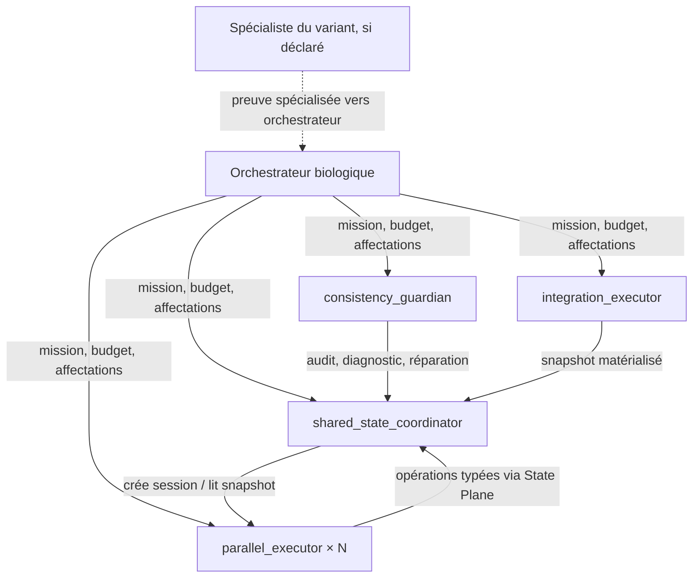
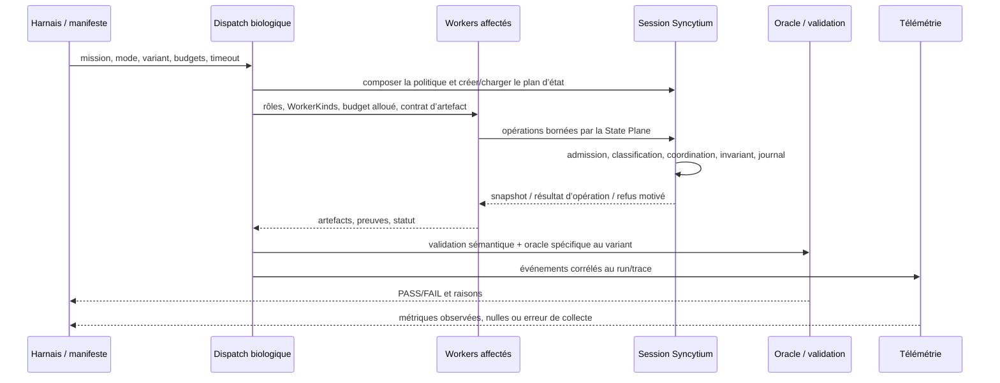

# Protocole d’exécution et de preuve des missions Syncytium

- **Statut** : protocole opératoire documenté à partir du runtime Node et de ses tests ciblés.
- **Version du relevé** : 2026-10-04.
- **Portée** : exécutions déterministes des 13 variants Syncytium, préparation d’une campagne avec travailleurs, collecte de preuves et limites de validation.
- **À lire avec** : [Syncytium — modèle et garanties](syncytium.md), [topologies et capacités](../topologies-et-capacites.md).

## 1. Ce que signifie « réussi »

Un variant réussit une mission seulement si son oracle propre passe. Le fait qu’une session soit créée, qu’un variant soit sélectionné ou qu’un worker réponde ne suffit pas. Chaque cas doit préciser :

1. les préconditions et l’état initial ;
2. les opérations et leur ordre/concurrence ;
3. les effets attendus et les refus attendus ;
4. les invariants à préserver ;
5. les données de preuve à conserver (identifiants d’opérations, versions, snapshot et résultat de l’oracle).

Le résultat global est **PASS** seulement si toutes les assertions prévues passent. Un rejet est un succès uniquement quand le scénario exige précisément ce rejet et vérifie son motif. Les champs non mesurés restent `null`/« non mesuré » ; ils ne sont jamais interprétés comme zéro.

### Niveaux de charge

Pour uniformiser les futures campagnes, classer les scénarios selon le travail et les interleavings, pas selon leur longueur de prompt :

| Niveau | Forme de l’essai | Preuve minimale |
| --- | --- | --- |
| Simple | Une règle, deux acteurs au plus, pas de panne injectée | État final et une assertion centrale |
| Moyen | Plusieurs opérations causales, au moins un contrôle de refus ou retry | État final, journal causal, raison du refus/retry |
| Difficile | Concurrence, plusieurs invariants ou transitions de panne/réconciliation | Ordre/interleaving reproduit, invariants avant/après, compte des opérations |
| Très complexe | Charge multi-acteurs, transitions répétées, adversité/pannes, restitution | Seed/scénario reproductible, preuves par transition, oracle final et invariants |

Les niveaux sont une échelle de protocole, pas une garantie de temps. Les missions fournies couvrent les scénarios spécifiques ci-dessous ; ces libellés de niveau ne remplacent pas leurs oracles.

## 2. Deux axes à ne pas confondre

**Topologie d’orchestration** (plan externe) : `syncytium` est l’un des huit modes biologiques. `isolated_baseline` sert de comparaison dans le benchmark biologique. Le runner de benchmark actuel compare ces deux plans ; il ne compare pas automatiquement les huit modes entre eux.

**Variant Syncytium** (politique interne) : la session sélectionne une politique parmi les treize ci-dessous. Elle configure schéma, réplication, zone de cohérence, réparation et conditions d’arrêt. Un variant n’est donc pas une topologie supplémentaire.

Le routeur de politique accepte un `variantId` explicite ; sinon il choisit selon les signaux textuels de la mission et sa priorité. Pour une expérience reproductible, fournir toujours le variant explicitement. La recommandation lexicale `analyzeMission` ne constitue pas une preuve de compatibilité ni d’exécution.

## 3. Missions par variant et oracles distinctifs

| Variant | Mission / propriété discriminante | Oracle à vérifier |
| --- | --- | --- |
| Hard | Mutations critiques sous lease, fence monotone et transactions sérialisables | Ancien fence refusé, aucun commit stale, ordre transactionnel stable, récupération autorisée seulement après expiration |
| Soft | Partition, deltas locaux et réconciliation éventuelle | Politique de partition respectée, deltas utiles conservés, anti-entropie couvre les deltas attendus sans doublons |
| Document | Édition structurée causale, commentaires, attribution et annulation | Blocs typés/auteurs préservés, commentaire ciblé, undo compensatoire auditable et non rejoué deux fois |
| Code | Changements de fichiers sous hash attendu, locks de dépendances et merge gate | Écriture stale/lockée rejetée ; merge fermé sans build passant ou test passant, ouvert après preuves valides |
| Blackboard | Événements append-only classés par priorité, réponse et TTL | Vue active ordonnée, questions non résolues exactes ; expiration de vue sans effacement d’historique |
| Graph | Changements de nœuds/arêtes soumis aux invariants du graphe | Pas d’arête pendante/cycle interdit ; projection limitée aux racines, profondeurs et types demandés |
| Epistemic | Claims, preuves, réfutations, provenance, dates et vérification indépendante | Contradictions conservées ; vérification de soi/source réutilisée rejetée ; projection « à date » fidèle |
| Transactional | Ressources rares, réservations atomiques/idempotentes et expirations | Compteurs jamais négatifs, retry idempotent sans double débit, libération cohérente, deadlock rendu explicite |
| Local-First | File hors ligne, horloges logiques et synchronisation au retour | Ordre local conservé, relation de sync/vector clocks vérifiable, plafonds hors-ligne appliqués |
| Speculative | Branches isolées, budget et promotion contrôlée | Zéro budget traité comme budget épuisé valide ; dépassement et gate échoué interdisent la promotion |
| Hierarchical | Domaines/régions et frontières de cohérence | Opérations restent dans leur domaine ; franchissement critique bloque ou coordonne selon la règle configurée |
| Real-Time Control | Contrôle/reflexes avec préconditions et réponse failsafe | Échéance et invariant respectés dans le modèle testé ; conflit de version réessayé ou arrêt sûr vérifié |
| Human–AI | Consentement, présence, autorité, approbation et attribution | Action critique attend l’approbation requise ; retrait/refus appliqué ; annulation conserve auteur et audit |

Les formulations détaillées des 52 missions initiales (13 variants × 4 niveaux) sont conservées dans le texte fourni par l’utilisateur. Pour un rapport de campagne, recopier chaque énoncé et attacher son oracle plutôt que ne garder que cette synthèse.

## 4. Budget, durée et répétitions

### Contrat d’exécution

Le dispatch biologique accepte un objet `executionBudget` avec `tokens`, `events`, `latencyMs` et `costUsd` selon les chemins de workers. Le timeout d’enveloppe est `timeoutMs`. Les workers autonomes reçoivent une allocation dérivée du budget commun ; les tokens et certains budgets sont répartis selon les affectations. Un budget de mission doit être traité comme un plafond : enregistrer le plafond demandé **et** l’usage réellement rapporté.

Le runner de benchmark prend un budget obligatoire, une mission, `variantId`, `timeoutMs`, répétitions et `expectedClaims`. Il lance à budget égal le baseline isolé puis Syncytium, attend les workers, valide les membres et n’invente pas les métriques qui manquent. Pour que le résultat soit comparable, garder le même budget et le même nombre de workers dans chaque paire.

### Caps de départ recommandés pour une campagne LLM

Ces plafonds sont des **valeurs de planification à calibrer**, pas les budgets ni les durées mesurés dans les tests déterministes de ce relevé :

| Niveau | Tokens max par exécution | Événements max | Timeout |
| --- | ---: | ---: | ---: |
| Simple | 1 500 | 30 | 90 s |
| Moyen | 3 000 | 60 | 150 s |
| Difficile | 5 000 | 100 | 240 s |
| Très complexe | 8 000 | 160 | 360 s |

Pour 52 cas lancés une fois, le plafond brut est de **214 500 tokens** ; les répétitions le multiplient. Définir en plus un plafond `costUsd` explicite dans le manifeste de campagne avant d’autoriser un dispatch LLM. Ne pas convertir des tokens en dollars sans connaître le modèle, ses tarifs en vigueur et la ventilation entrée/sortie. Interrompre la campagne si le plafond global est atteint. Une répétition de chaque cas est le minimum fonctionnel ; trois répétitions sont recommandées pour toute comparaison sensible à l’ordonnancement. Le budget de temps d’une campagne est la somme des timeouts des cas, plus le temps d’initialisation et de validation ; ne pas confondre ce plafond avec le temps réellement observé.

### Exécutions déterministes relevées le 2026-10-04

Les suites citées en §11 appellent directement les services Syncytium du backend Node. Elles ne démarrent pas de modèles LLM, ne dépensent pas de tokens et ne mesurent pas un coût API. Les 13 tests variant dédiés ont rendu PASS en environ **5,2 s cumulées** (processus Node séparés, temps mur observé de cette séquence). C’est une durée de test locale, pas un SLA de mission ou une prédiction des workers.

## 5. Topologies, composition et workers

Une composition Syncytium ajoute quatre responsabilités de base :

| Rôle | Plan de service | Responsabilité runtime |
| --- | --- | --- |
| `shared_state_coordinator` | State Plane | Créer session, snapshot, appliquer opérations/transactions |
| `parallel_executor` (multiplicité N) | Execution Nuclei | Exécuter une opération typée depuis un acteur et un domaine |
| `consistency_guardian` | Invariant/Security Plane | Auditer, expliquer, localiser les fautes, choisir/réaliser une réparation |
| `integration_executor` | Materialization Plane | Matérialiser un snapshot et lister les snapshots |

Les deux rôles de coordination indiqués par `biologicalModeService` (coordinateur et guardian) sont de tier `frontier` ; executor/intégrateur sont `standard` suivant ce catalogue. Le choix final de `WorkerKind` est fait par exigences de capacités et affectations demandées ; un tier de modèle ne prouve pas qu’un modèle est disponible ni qu’il a été appelé.

La politique ajoute actuellement un worker spécialiste pour cinq variants : `code → code_semantic_reviewer`, `graph → graph_analyzer`, `document → causal_reconstructor`, `epistemic → epistemic_specialist`, `transactional → transactional_validator`. Les huit autres variants n’ont pas de worker spécialiste déclaré dans `syncytiumVariantWorkerService`. Chaque rôle spécialiste est résolu ensuite vers un `WorkerKind` compatible. La présence dans une composition n’équivaut pas à une exécution réussie.

### Carte relationnelle logique



Les flèches vers le plan d’état représentent des appels de services/API et des écritures au même journal/session ; elles ne prouvent pas une messagerie directe pair-à-pair entre travailleurs. Les relations persistées de `agent_relations` sont un autre graphe, avec classes `lineage`, `organizational`, `collaborative`, `social`, `epistemic`, `adversarial`. La composition Syncytium ne crée pas automatiquement ces arêtes ; les créer explicitement si une expérimentation en dépend et enregistrer leurs IDs.

## 6. Schéma de campagne et séquence d’exécution

Le runner `biologicalBenchmarkRunnerService` accepte une enveloppe équivalente à :

```json
{
  "mission": "Énoncé d’un cas et de son oracle",
  "variantId": "transactional",
  "repetitions": 1,
  "budget": { "tokens": 3000, "events": 60, "latencyMs": 150000, "costUsd": 0.25 },
  "timeoutMs": 150000,
  "expectedClaims": [],
  "workerAssignments": {}
}
```

Les valeurs du JSON ne sont qu’un exemple de forme ; l’allowance monétaire doit être décidée par campagne. `expectedClaims: []` signifie « recall sémantique non mesuré », pas score parfait.



Ordre recommandé : (1) figer commit, runtime, configuration, seed, variant, manifest et oracle ; (2) créer un run ID unique ; (3) valider budget, timeout, disponibilité des workers et isolation DB ; (4) exécuter le cas, conserver chaque réponse/rejet et la version de session ; (5) prendre snapshot et vérifier les invariants ; (6) calculer l’oracle sans corriger le résultat après coup ; (7) vider la file télémétrique, archiver les preuves et produire le rapport ; (8) rejouer le même seed/cas lorsque l’exécution est stochastique.

Pour le benchmark comparatif, répéter à budget égal avec `isolated_baseline` puis `syncytium` et garder le même profil d’affectation. Les résultats générés par les workers ne doivent pas être réinjectés dans le baseline.

## 7. Nosologie et traitement des anomalies

« Nosologie » désigne ici la taxonomie technique d’anomalies, pas un diagnostic médical des modèles. Le runtime Syncytium dispose de conditions d’arrêt et de réparation par politique, de contrôles d’autorité/schéma/invariants, d’un service de conflits sémantiques, d’explication causale, de localisation de fautes et de réparation locale. Utiliser d’abord ces preuves propres au mécanisme : code d’erreur, opération, acteur/domaine, invariant affecté, snapshot avant/après et décision du routeur.

Le catalogue médical GenOS est distinct et opère sur un **clinical state** d’agent (par ex. `mutation_drift`, `plasmid_overload`, `immune_exhaustion`, `iatrogenic_toxicity`, `cell_cycle_malignancy`, `cognitive_metastasis`, `inflammatory_cytokine_storm`, `quarantine_breach`, `senescence_escape`). Les tests Syncytium exécutés ici n’ont pas invoqué cette surveillance. Ne transformer ni un conflit de données ni un timeout en pathologie d’agent par simple analogie. Si la surveillance médicale est utilisée dans une campagne, documenter l’identifiant du clinical state, les signaux mesurés, la confiance, la sévérité, la biopsie/diagnostic et toute quarantaine/ thérapie comme un canal distinct ; aucune de ces actions ne remplace l’oracle du variant.

Taxonomie opérationnelle à reporter dans le manifeste (classification recommandée, non un nouveau code d’erreur) : `invariant_violation`, `authority_violation`, `stale_state`, `semantic_conflict`, `budget_exhausted`, `deadline_missed`, `partition_or_replica_lag`, `worker_failure`, `evidence_missing`, `telemetry_loss`. Pour chaque anomalie, consigner `expected/observed`, sévérité, agent/acteur, variant, opId/txId, traceId, preuve primaire et disposition (`retry`, `repair`, `reject`, `quarantine`, `manual_review`). Ne fermer l’incident qu’après assertion post-réparation.

## 8. Échanges et moyens de communication

Le canal Syncytium vérifiable est d’abord le service d’état : une session partagée, opérations typées et identifiées, snapshots, transactions, changements de réplica/deltas lorsqu’ils sont activés, historique et services d’audit/réparation. Le nucleus d’exécution transmet `actorId` et `domainId` à chaque opération ; les portes de schéma, domaine, autorité, zone de cohérence et invariant s’appliquent selon l’API choisie.

Les autres services GenOS exposent enveloppes de communication/signaux, routage selon relation, checkpoint, common ground et métriques de communication. Les utiliser seulement si le dispatch/worker les appelle et si le run en conserve le reçu. La documentation d’une enveloppe ou d’un service n’est pas la preuve que les membres Syncytium se sont échangé un message dans cette exécution. Éviter un broadcast redondant : envoyer les informations nécessaires à l’orchestrateur ou aux consommateurs ciblés, et mesurer les décisions, livraisons, accusés et rejets séparément.

## 9. Télémétrie et format de preuve

`telemetryObserver` émet dans un ring buffer borné, diffuse aux clients SSE scopés, peut synchroniser sur disque, persister en base et fan-out vers les webhooks configurés. Les clés sensibles sont masquées. Le contrat valide `eventType` en `UPPER_SNAKE_CASE`, fixe un timestamp serveur (tolérance client ±60 s) et enrichit le scope avec `organizationId`, `projectId`, `traceId` et `requestId` lorsque disponibles. La télémétrie est best-effort : suivre les compteurs de file abandonnée/erreurs, appeler `flush()` et contrôler son résultat avant d’annoncer la collecte complète.

Enregistrer au minimum par run :

- `runId`, `traceId`, date UTC, commit, version Node, mode, variant, niveau, seed, répétition ;
- mission et oracle versionnés, budgets demandés/réels, timeout, durées murales (dispatch, workers, validation) ;
- workers prévus/lancés/terminés, `WorkerKind`, affectations et erreurs ;
- `sessionId`, révision/snapshot, opIds/txIds, acteurs/domaines, refus/retries, invariants avant/après ;
- résultat et raisons détaillées, conflits détectés et conflits de référence ;
- tokens/coût seulement si la source les rapporte ; sinon `null` ;
- état de collecte télémétrique : événements attendus/reçus, `flush.flushed`, `pending`, pertes et erreurs.

Le rapport du benchmark biologique expose certains compteurs mais retourne explicitement `null` pour des mesures que le runtime ne collecte pas (par ex. toutes les mises à jour distribuées ou la quantité d’opérations sûres sans coordination). Le taux de rappel des claims vaut `null` quand aucun claim attendu n’est fourni. Laisser ces valeurs nulles jusqu’à l’ajout d’un instrument mesurable.

## 10. Carte relationnelle persistée des agents

Séparer trois notions dans les rapports : (a) le graphe logique des rôles (§5), (b) le graphe d’interactions effectives tiré des traces, (c) les relations persistées du service `crossAgentRelationalService`. Une relation persistée est une arête orientée entre deux agents distincts, avec classe/type autorisés, propriétés (familiarité, autorité, confiance de domaine, indépendance épistémique, corrélation d’erreurs, divulgation), scope organisation/projet et provenance. Elle doit être explicitement créée et relue ; ne pas déduire « collaborateur » de la seule coprésence dans la topologie.

Pour éviter une fausse indépendance dans l’évaluation, tracer `epistemicIndependence` et `errorCorrelation` des réviseurs. Un worker dérivé du même prompt, contexte ou réponse initiale peut partager les mêmes erreurs ; sa présence ne transforme pas la revue en oracle indépendant.

## 11. Résultats exécutés et limites au 2026-10-04

Exécutés depuis le checkout `GenOS-plan`, avec Node, contre les API/services backend du dépôt. Chaque processus a rendu `PASS` :

| Couverture | Suite |
| --- | --- |
| Hard | `backend/tests/test_syncytium_hard_variant.js` |
| Soft | `backend/tests/test_syncytium_soft_variant.js` |
| Document | `backend/tests/test_syncytium_document_variant.js` |
| Code | `backend/tests/test_syncytium_code_variant.js` |
| Blackboard | `backend/tests/test_syncytium_blackboard_variant.js` |
| Graph | `backend/tests/test_syncytium_graph_variant.js` |
| Epistemic | `backend/tests/test_syncytium_epistemic_variant.js` |
| Transactional | `backend/tests/test_syncytium_transactional_variant.js` |
| Local-First | `backend/tests/test_syncytium_local_first_variant.js` |
| Speculative | `backend/tests/test_syncytium_speculative_variant.js` |
| Hierarchical | `backend/tests/test_syncytium_hierarchical_variant.js` |
| Real-Time Control | `backend/tests/test_syncytium_realtime_control_variant.js` |
| Human–AI | `backend/tests/test_syncytium_human_ai_variant.js` |
| Politique (13/13), lacunes Hard/Code/Transactional, workers spécialistes, wiring, six corrections récentes | `test_syncytium_variant_policies.js`, `test_syncytium_variant_gaps.js`, `test_syncytium_variant_worker_service.js`, `test_syncytium_wiring.js`, `test_syncytium_mission_repairs.js` |

Les suites spécialisées exécutent des cas de service concrets (fences, partitions, undo, hash/locks/build gate, événements TTL, graphes, provenance, réservations, files locales, branches, frontières, failsafe, autorité humaine). Les cinq vérifications finales couvrent sélection/configuration des 13 politiques, lacunes correctives, composition des spécialistes, session/opérations/snapshot et six régressions (HLC/replicas, budget/gate Speculative, projection Epistemic datée, citation/attribution/undo, compaction Soft, retry failsafe).

**Conclusion de preuve :** oui, les treize familles de tests de service actuellement ciblées passent sur ce checkout. Cela ne prouve pas que les 52 énoncés utilisateur (quatre niveaux par variant) ont chacun été lancés comme des missions séparées ; ne prouve pas non plus le résultat d’un dispatch autonome de workers LLM, une comparaison de baseline, une répétabilité multi-run, une garantie distribuée/physique temps réel ou la mesure de tous les champs de benchmark. Aucun worker LLM n’a été invoqué dans ces essais, et aucun coût/tokens API n’a été consommé.

## 12. Suite pour valider les missions LLM de bout en bout

Avant cette campagne, transformer les 52 énoncés en manifestes versionnés avec un oracle par cas ; choisir des affectations `WorkerKind` et un plafond de coût global ; isoler la base et le workspace ; vérifier que le dispatch attend bien la fin de tous les workers. Lancer d’abord un cas simple par variant, examiner les artefacts et la télémétrie, puis les niveaux supérieurs. Toute erreur de worker, timeout, preuve manquante ou divergence d’oracle vaut FAIL pour le cas. Comparer ensuite chaque cas avec le baseline sous mêmes budgets/affectations/répétitions. Publier un rapport PASS/FAIL par cas, les métriques nulles explicitement, les incidents nosologiques le cas échéant et les liens vers les preuves brutes.

La campagne n’est complète que lorsque les **52 lignes** ont un résultat terminal, un oracle évalué et une provenance de preuve. Une suite technique passant n’autorise pas à marquer les quatre niveaux d’un variant « oui » par extrapolation.
