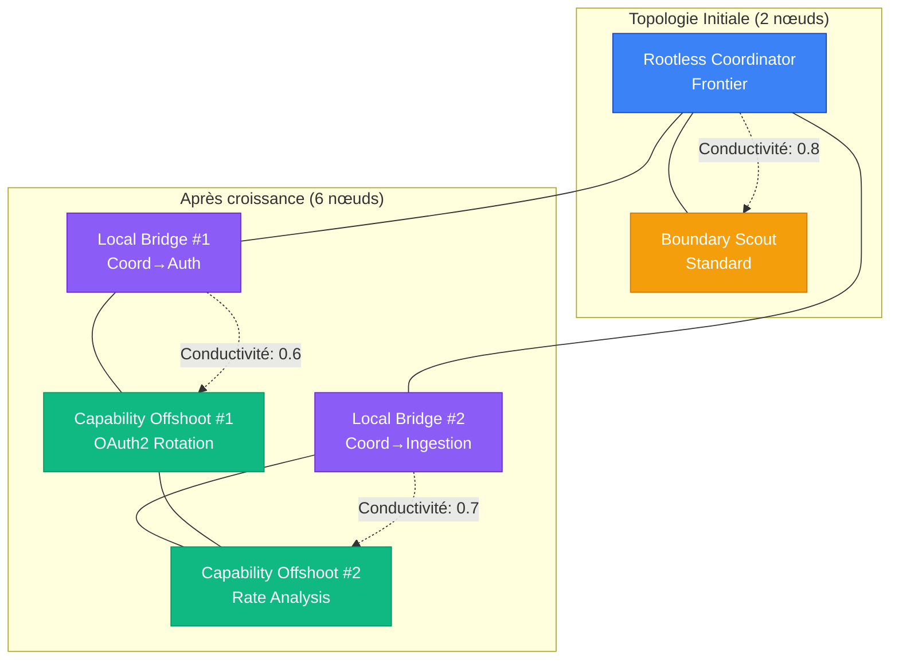
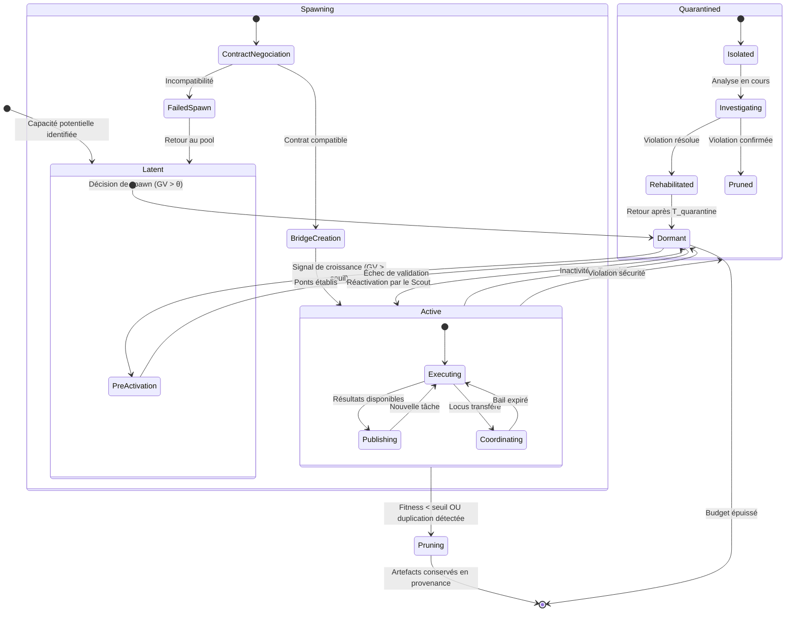
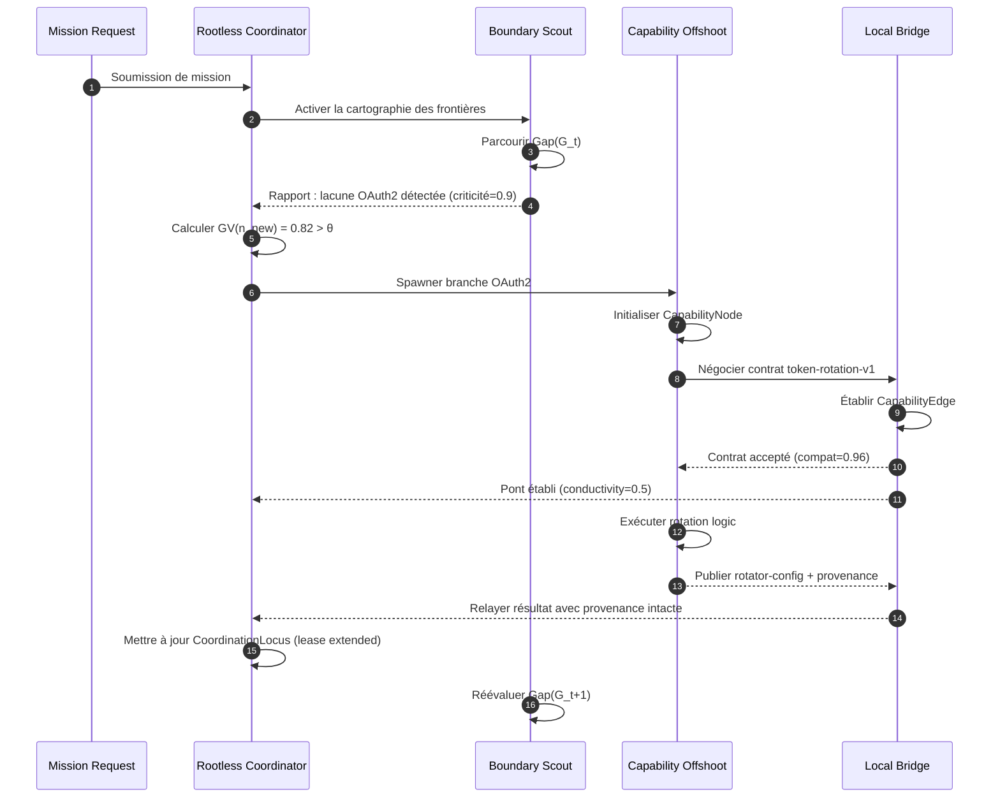
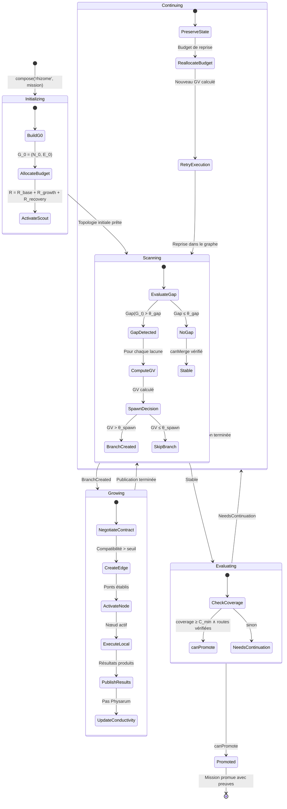
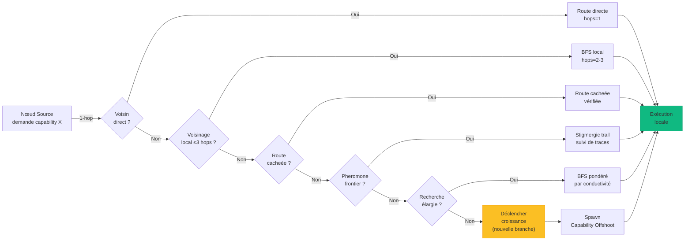

# Rhizome : Orchestration Décentralisée par Ramification de Capacités

## 1. Définition

Rhizome dans GenOS est le protocole d'orchestration qui fait croître une mission comme un **réseau décentralisé de capacités reliées par des ponts locaux**. Au lieu de construire une hiérarchie fixe ou de répartir la mission dans des branches isolées, Rhizome ajoute des points de coordination là où le réseau rencontre un manque, une frontière ou une nouvelle dépendance.

Le concept vient du rhizome biologique : une structure souterraine qui ne possède pas un centre unique et peut produire de nouvelles pousses à partir de plusieurs points. Dans GenOS, une mission peut se développer depuis plusieurs points d'entrée. Une capacité locale peut devenir un nouveau nœud, un pont peut changer de route, et une défaillance locale ne détruit pas la totalité du réseau.

Les quatre rôles exposés par le mode sont :

1. **Rootless Coordinator** : coordonne la mission sans devenir une autorité centrale permanente ;
2. **Capability Offshoot** : crée une capacité locale lorsqu'une lacune apparaît dans le réseau ;
3. **Local Bridge** : relie les branches voisines et préserve les preuves malgré les changements de route ;
4. **Boundary Scout** : explore les frontières, les capacités manquantes, les goulets d'étranglement et les possibilités d'extension.

Le principe collectif est :

> « A decentralized collective that grows new coordination points wherever capability is needed. »

Le cœur fonctionnel est réparti entre :

- [backend/src/services/biologicalModeService.js](../../../backend/src/services/biologicalModeService.js) : composition des quatre rôles rhizomatiques.
- [backend/src/services/rhizomeCoordinationService.js](../../../backend/src/services/rhizomeCoordinationService.js) : sessions, traces stigmergiques, recherche de membres et pas Physarum.

---

## 2. Non un pool de workers indépendants, mais un graphe dynamique sans centre

Rhizome ne signifie pas l'absence de coordination. Il remplace une autorité centrale fixe par une **coordination distribuée et réversible** :

1. le Coordinator maintient les objectifs et les règles communes ;
2. les Offshoots ajoutent des capacités au plus près des besoins ;
3. les Bridges rendent les interfaces et les preuves transportables ;
4. le Scout cherche les zones non couvertes et les nouvelles routes ;
5. le réseau peut déplacer la coordination lorsque les besoins changent.

Les garanties essentielles sont :

- aucune branche ne devient l'unique source de vérité par défaut ;
- chaque nouvelle capacité possède un périmètre et un critère d'arrêt ;
- chaque pont publie les contrats et preuves qu'il transporte ;
- une route locale défaillante peut être contournée ou reconstruite ;
- l'extension du réseau reste bornée par le budget et la profondeur de fan-out.

Rhizome est adapté aux missions exploratoires, aux architectures modulaires, aux enquêtes multi-sources et aux travaux où la bonne décomposition n'est pas connue au départ.

---

## 3. Définition mathématique

### 3.1 Le Graphe Dynamique Rhizomatique

Soit :

- $M$ : mission globale ;
- $G_t = (N_t, E_t)$ : graphe Rhizome à l'instant $t$ ;
- $N_t$ : ensemble de nœuds de capacité ou de coordination ;
- $E_t$ : ensemble de ponts (arêtes) entre nœuds ;
- $c(n)$ : capacité fournie par le nœud $n$ ;
- $D(M)$ : capacités nécessaires à la mission ;
- $P$ : preuves publiées par les nœuds et les ponts ;
- $R$ : budget global d'extension.

Le graphe $G_t$ évolue selon des opérations atomiques :

$$\text{mutate}(G_t, op) = \begin{cases} G_{t+1} = (N_t \cup \{n_{new}\}, E_t) & \text{if } op = \text{spawn}(n_{new}) \\ G_{t+1} = (N_t, E_t \cup \{e_{new}\}) & \text{if } op = \text{bridge}(e_{new}) \\ G_{t+1} = (N_t \setminus \{n\}, E_t \setminus \text{incident}(n)) & \text{if } op = \text{prune}(n) \\ G_{t+1} = (N_t, E_t \setminus \{e\}) & \text{if } op = \text{sever}(e) \end{cases}$$

Chaque opération atomique préserve l'invariant de connexité partielle : la suppression d'un nœud ou d'une arête ne fragmente pas le graphe au-delà d'un seuil de redondance configurable $f_{min}$.

### 3.2 CapabilityNode : Structure d'un nœud

Un nœud $n \in N_t$ est défini par la tuple :

$$n = (\text{id}, \text{role}, \text{capabilities}[], \text{inputs}[], \text{outputs}[], \text{requirements}[], \text{state}, \text{reliability}, \text{cost}, \text{latency})$$

où :

| Champ | Type | Description |
|---|---|---|
| `id` | string | Identifiant unique du nœud |
| `role` | enum | `rootless_coordinator`, `capability_offshoot`, `local_bridge`, `boundary_scout` |
| `capabilities` | string[] | Liste des capacités déployées par le nœud |
| `inputs` | string[] | Dépendances entrantes requises |
| `outputs` | string[] | Produits sortants publiés |
| `requirements` | string[] | Permissions et ressources nécessaires |
| `state` | enum | `latent`, `active`, `dormant`, `pruned`, `quarantined` |
| `reliability` | float ∈ [0,1] | Historique de succès mesuré |
| `cost` | {tokens, latencyMs} | Coût d'exécution observé |
| `latency` | float (ms) | Latence moyenne de réponse |
| `fitness` | float ∈ [0,1] | Score de contribution au réseau |

Le score de fitness évolue selon :

$$\text{fitness}(n)_{t+1} = (1 - \delta) \cdot \text{fitness}(n)_t + \delta \cdot \text{qualityScore}(n_{\text{latest}})$$

où $\delta \in (0, 1]$ est le facteur d'apprentissage et $\text{qualityScore}$ agrège la précision, la rapidité et la pertinence des produits du nœud.

### 3.3 CapabilityEdge : Structure d'un pont

Un pont $e \in E_t$ est défini par la tuple :

$$e = (\text{id}, \text{from}, \text{to}, \text{contract}, \text{compatibility}, \text{conductivity}, \text{latency}, \text{cost}, \text{successRate}, \text{pheromone}, \text{repellent})$$

où :

| Champ | Type | Description |
|---|---|---|
| `id` | string | Identifiant unique du pont |
| `from`, `to` | string | Nœuds source et destination |
| `contract` | object | Protocole, schémas d'entrée/sortie, version |
| `compatibility` | float ∈ [0,1] | Compatibilité des contrats entre producteur et consommateur |
| `conductivity` | float | Conductivité Physarum $K_e(t)$ |
| `latency` | float (ms) | Latence de transport |
| `cost` | {tokens} | Coût de transmission |
| `successRate` | float ∈ [0,1] | Taux de succès historique |
| `pheromone` | float | Intensité de la phéromone positive |
| `repellent` | float | Intensité du répulsif négatif |
| `trailType` | enum | Type de trace stigmergique |
| `provenance` | string[] | Chaîne de provenance |

### 3.4 Couverture et Lacunes

La couverture du réseau mesure la proportion de capacités requises qui sont accessibles :

$$\text{coverage}(G_t, M) = \frac{|D(M) \cap \bigcup_{n \in N_t} c(n)|}{|D(M)|}$$

Le **BoundaryDetector** calcule la lacune $\text{Gap}(g)$ comme la différence entre le besoin et les capacités atteignables depuis le sous-graphe $g$ :

$$\text{Gap}(g) = \text{Need}(M) - \text{ReachableCapabilities}(G_t, g)$$

où $\text{ReachableCapabilities}(G_t, g) = \bigcup_{n \in \text{reachable}(g)} c(n)$.

La fonction $\text{reachable}(g)$ retourne l'ensemble des nœuds accessibles depuis $g$ par parcours en largeur borné par la profondeur de ponts $h_{max}$ :

$$\text{reachable}(g) = \{ n \in N_t \mid \exists \text{ chemin } g \leadsto n \text{ de longueur } \leq h_{max} \}$$

La **criticité d'une lacune** est pondérée par le nombre de chemins dépendants :

$$\text{criticality}(\text{gap}_i) = 1 + \alpha \cdot |\{ e \in E_t \mid \text{gap}_i \in \text{dependencies}(e) \}|$$

où $\alpha$ est un facteur d'amplification (par défaut 0.1).

### 3.5 Valeur de Croissance

La création d'une nouvelle branche est justifiée par la **Valeur de Croissance** ($GV$) :

$$GV(n_{new}) = \mathbb{E}[U(n_{new})] \times C_{need} \times \text{Conf}_{gap} - C_{create} - C_{coord} - C_{dup}$$

où :

- $\mathbb{E}[U(n_{new})]$ : utilité attendue de la nouvelle capacité, estimée par le Scout à partir des similarités passées ;
- $C_{need}$ : criticité du besoin (0.0 à 1.0) ;
- $\text{Conf}_{gap}$ : confiance dans la détection de la lacune (0.0 à 1.0), basée sur le nombre d'observations indépendantes ;
- $C_{create}$ : coût de création (tokens, temps), normalisé par le budget disponible ;
- $C_{coord}$ : coût de coordination (ponts, synchronisation), normalisé par le budget disponible ;
- $C_{dup}$ : risque de duplication avec une capacité existante.

La duplication est mesurée par la similarité cosinus entre la nouvelle capacité et les capacités existantes :

$$C_{dup} = \lambda_{dup} \times \max_{n \in N_t} \text{sim}(c(n_{new}), c(n))$$

où $\lambda_{dup}$ est le poids du risque de duplication (par défaut 0.3).

Le **seuil de spawn** $\theta_{spawn}$ détermine si une croissance est justifiée :

$$\text{shouldSpawn}(n_{new}) = \begin{cases} 1 & \text{if } GV(n_{new}) > \theta_{spawn} \land \text{budgetRemaining} \geq C_{create} \\ 0 & \text{sinon} \end{cases}$$

### 3.6 Conductivité Physarum

Inspiré par la dynamique de flux du Physarum polycephalum, la conductivité de chaque pont évolue selon l'équation différentielle :

$$\frac{dK_e}{dt} = \alpha \cdot \phi_e^{util}(t) - \beta \cdot K_e(t) \cdot \mathbb{1}_{[\phi_e^{util}(t) = 0]}$$

où :

- $K_e(t)$ : conductivité du pont $e$ à l'instant $t$ ;
- $\alpha$ : taux de renforcement (learning rate, défaut 0.3) ;
- $\beta$ : taux de décroissance (decay rate, défaut 0.1) ;
- $\phi_e^{util}(t)$ : flux d'utilité transporté par le pont pendant l'intervalle ;
- $\mathbb{1}_{[\phi_e^{util}(t) = 0]}$ : indicateur de non-utilisation.

La version discrète par pas de temps $\Delta t$ :

$$K_e(t + \Delta t) = K_e(t) \cdot (1 - \beta)^{\Delta t} + \alpha \cdot \phi_e^{util}$$

La probabilité de routage par le pont $e$ suit un softmax sur les conductivités :

$$P(\text{route via } e) = \frac{\exp(K_e(t) / \tau)}{\sum_{e' \in \text{out}(n)} \exp(K_{e'}(t) / \tau)}$$

où $\tau$ est la température exploratoire ($\tau \to 0$ : exploitation pure ; $\tau \to \infty$ : exploration uniforme ; défaut 0.5).

Le flux d'utilité $\phi_e^{util}$ est calculé à partir des résultats de transport :

$$\phi_e^{util} = \text{successRate}(e) \cdot \frac{\text{dataVolume}(e)}{\text{latency}(e)} \cdot \text{trailBoost}(e)$$

où $\text{trailBoost}(e)$ est un facteur multiplicatif basé sur les phéromones positives :

$$\text{trailBoost}(e) = 1 + \gamma \cdot \text{pheromone}(e) - \delta \cdot \text{repellent}(e)$$

avec $\gamma = 0.2$ et $\delta = 0.4$ par défaut.

### 3.7 Stigmergie et Évaporation Adaptative

Le système de stigmergie dépose des traces (phéromones et répulsifs) sur les nœuds et les arêtes. L'intensité d'une trace $\rho$ suit :

$$\rho(t + \Delta t) = \rho(t) \cdot e^{-\lambda_{evap}(\sigma) \cdot \Delta t} + \Delta\rho_{deposit}$$

Le taux d'évaporation $\lambda_{evap}$ est adaptatif selon le type de signal $\sigma$ :

$$\lambda_{evap}(\sigma) = \begin{cases} \lambda_{fast} & \text{if } \sigma \in \{ \text{ROUTE_FAILURE}, \text{DEAD_END}, \text{HIGH_COST} \} \\ \lambda_{slow} & \text{if } \sigma \in \{ \text{CAPABILITY_FOUND}, \text{ROUTE_SUCCESS} \} \\ \lambda_{base} & \text{otherwise} \end{cases}$$

avec par défaut $\lambda_{fast} = 0.15$, $\lambda_{slow} = 0.02$, $\lambda_{base} = 0.05$.

Les types de traces supportés :

| SignalType | Définition | Taux d'évaporation | Demi-vie indicative |
|---|---|---|---|
| `CAPABILITY_FOUND` | Une nouvelle capacité a été identifiée | $\lambda_{slow}$ | longue |
| `ROUTE_SUCCESS` | Un chemin viable a été emprunté avec succès | $\lambda_{slow}$ | longue |
| `ROUTE_FAILURE` | Un chemin s'est révélé infranchissable | $\lambda_{fast}$ | courte |
| `DEAD_END` | Un sous-graphe est un cul-de-sac confirmé | $\lambda_{fast}$ | courte |
| `HIGH_COST` | La route est fonctionnelle mais coûteuse | $\lambda_{fast}$ | courte |
| `COORDINATION_BRANCH` | Point de coordination temporaire actif | $\lambda_{base}$ | moyenne |
| `BOUNDARY_FRONTIER` | Frontière exploratoire ouverte | $\lambda_{base}$ | moyenne |
| `QUARANTINE_VIOLATION` | Nœud placé en quarantaine | $\lambda_{fast}$ | courte |

L'évaporation adaptative permet au réseau d'oublier rapidement les signaux négatifs (échec, impasse) tout en conservant durablement les découvertes positives.

### 3.8 Fitness d'un Pont

La qualité d'un pont est évaluée par une fonction de fitness multidimensionnelle :

$$F(e) = w_p \cdot P_e + w_c \cdot C_{compat} - w_l \cdot L_e - w_r \cdot R_e$$

où :

- $P_e$ : score de provenance des éléments transportés (0 à 1) ;
- $C_{compat}$ : compatibilité des contrats entre producteur et consommateur (0 à 1) ;
- $L_e$ : latence normalisée du pont (0 à 1) ;
- $R_e$ : risque de perte ou d'ambiguïté (0 à 1) ;
- $w_p, w_c, w_l, w_r$ : poids de pondération ($\sum w_i = 1$ par convention, défaut $w_p=0.3, w_c=0.3, w_l=0.2, w_r=0.2$).

La provenance $P_e$ est calculée comme :

$$P_e = \frac{|\text{provenanceChain}(e) \cap \text{verifiedSources}|}{|\text{provenanceChain}(e)|}$$

Le risque $R_e$ combine la variance de latence et le taux d'échec :

$$R_e = \eta \cdot \text{Var}(\text{latency}_e) + (1 - \eta) \cdot (1 - \text{successRate}_e)$$

avec $\eta = 0.5$ par défaut.

### 3.9 Conditions de Fusion et de Promotion

Une mission peut être promue si le réseau couvre le périmètre critique et si chaque dépendance indispensable dispose d'une route vérifiée :

$$\text{canMerge}(G_t, M) = \begin{cases} 1 & \text{si } \text{coverage}(G_t, M) \geq C_{min} \land \forall d \in D_{critical}, \text{routeVerified}(d) = 1 \\ 0 & \text{sinon} \end{cases}$$

avec $C_{min} = 0.95$ par défaut.

La vérification d'une route $\text{routeVerified}(d)$ exige :

$$\text{routeVerified}(d) = \begin{cases} 1 & \text{si } \exists \text{ chemin } n_{source} \leadsto n_{target} \text{ avec } \forall e \in \text{chemin}, F(e) \geq F_{min} \land \text{provenance}(e) = \text{intacte} \\ 0 & \text{sinon} \end{cases}$$

avec $F_{min} = 0.4$ par défaut.

### 3.10 CoordinationLocus

Le Coordinator est un **CoordinationLocus** temporaire dont la structure est :

$$\text{CoordinationLocus} = (\text{scope}, \text{holder}, \text{reason}, \text{leaseUntil}, \text{transferConditions}, \text{authorityBounds})$$

où :

| Champ | Type | Description |
|---|---|---|
| `scope` | subgraph | Périmètre de la coordination $G_{scope} \subseteq G_t$ |
| `holder` | nodeID | Nœud actuellement détenteur du locus |
| `reason` | string | Raison de la coordination actuelle |
| `leaseUntil` | timestamp | Horodatage d'expiration du bail |
| `transferConditions` | predicate[] | Conditions déclenchant le transfert |
| `authorityBounds` | {allowed, forbidden} | Bornes d'autorité |

Le Coordinator transfère la coordination lorsque :

$$\text{shouldTransfer}(locus) = \begin{cases} 1 & \text{si } t > \text{leaseUntil} \lor \text{holder.reliability} < \theta_{min} \\ 0 & \text{sinon} \end{cases}$$

avec $\theta_{min} = 0.3$ par défaut.

La durée du bail est calculée dynamiquement :

$$\text{leaseDuration} = \text{baseLease} \cdot \left(1 + \frac{\text{networkStability}}{2}\right)$$

où $\text{networkStability}$ est la proportion de nœuds fiables dans le scope.

---

## 4. Les quatre rôles et hypothèses

Rhizome compose exactement quatre membres. Les membres 1 et 3 utilisent le tier `frontier` ; les membres 2 et 4 utilisent le tier `standard`.

### 4.1 Rootless Coordinator (Frontier)

```
Role: rootless_coordinator
ModelTier: frontier
Member Number: 1
Responsibility: Distributed mission coordination
```

**Hypothèse :**
> « Coordinate the mission without becoming a permanent central authority. »

**Mission assignée :**
```
Rhizome shared mission: [shared mission]
Collective principle: A decentralized collective that grows new coordination points wherever capability is needed.
Role hypothesis: Coordinate the mission without becoming a permanent central authority.

Your task (rootless_coordinator):
1. Define shared objectives, invariants, and boundaries
2. Publish decisions that require global consistency
3. Select a temporary coordination point when needed
4. Avoid concentrating all operations on a single node
5. Transfer coordination to a better-placed branch when conditions change

Return: Coordination decisions, invariants, boundary conditions, transfer triggers
```

**Modèle de coordination :** Le Coordinator est un **CoordinationLocus** temporaire. Il détient un bail de coordination qui expire selon des conditions explicites. Lorsque le bail expire ou que sa fiabilité descend sous le seuil, le locus est transféré à un autre nœud mieux placé.

Le Coordinator publie des **invariants** que toutes les branches doivent respecter :

- `evidence-provenance` : toute preuve doit avoir une provenance vérifiable ;
- `no-single-source-of-truth` : aucune branche ne devient autoritaire sans validation croisée ;
- `budget-bound` : la croissance reste dans le budget alloué ;
- `modularity-preserved` : chaque branche reste indépendamment testable.

### 4.2 Capability Offshoot (Standard)

```
Role: capability_offshoot
ModelTier: standard
Member Number: 2
Responsibility: Local capability growth
```

**Hypothèse :**
> « Grow a new local capability branch where the current network has a gap. »

**Mission assignée :**
```
Rhizome shared mission: [shared mission]
Collective principle: A decentralized collective that grows new coordination points wherever capability is needed.
Role hypothesis: Grow a new local capability branch where the current network has a gap.

Your task (capability_offshoot):
1. Identify an explicitly bounded gap in capability coverage
2. Create or activate a local capability to fill the gap
3. Produce evidence directly tied to the gap
4. Publish prerequisites, inputs, and outputs
5. Avoid creating a branch if an existing capability suffices

Return: Capability created, evidence bundle, inputs consumed, outputs produced, budget used
```

**Modèle d'un CapabilityNode :**

```javascript
{
  id: 'node-101',
  role: 'capability_offshoot',
  capabilities: ['oauth2-token-rotation', 'rate-limit-analysis'],
  inputs: ['auth-service-logs', 'token-expiry-policies'],
  outputs: ['rotator-config', 'evidence-bundle'],
  requirements: ['read:auth-logs', 'write:policy-docs'],
  state: 'active',           // latent | active | dormant | pruned | quarantined
  reliability: 0.94,         // historique de succès (0-1)
  cost: { tokens: 12000, latencyMs: 8500 },
  latency: 4200,             // ms moyen de réponse
  fitness: 0.87,             // score de contribution au réseau
  createdAt: 1694862000000,
  lastActivity: 1694862045000
}
```

### 4.3 Local Bridge (Frontier)

```
Role: local_bridge
ModelTier: frontier
Member Number: 3
Responsibility: Inter-branch continuity
```

**Hypothèse :**
> « Bridge neighboring branches and preserve evidence across changing routes. »

**Mission assignée :**
```
Rhizome shared mission: [shared mission]
Collective principle: A decentralized collective that grows new coordination points wherever capability is needed.
Role hypothesis: Bridge neighboring branches and preserve evidence across changing routes.

Your task (local_bridge):
1. Translate contracts between neighboring branches
2. Transport evidence with provenance intact
3. Detect interface incompatibilities
4. Preserve an alternative route when possible
5. Flag context loss or transmission ambiguity

Return: Bridge contracts, provenance chain, translations performed, routes established
```

**Modèle d'un CapabilityEdge :**

```javascript
{
  id: 'edge-42',
  from: 'node-1',           // Rootless Coordinator
  to: 'node-101',           // Capability Offshoot
  contract: {
    protocol: 'token-rotation-v1',
    inputSchema: { type: 'array', items: { type: 'log-entry' } },
    outputSchema: { type: 'rotator-config' },
    version: '1.0.0'
  },
  compatibility: 0.96,       // compatibilité des contrats (0-1)
  conductivity: 0.78,        // Physarum conductivity K_e
  latency: 380,              // ms
  cost: { tokens: 800 },
  successRate: 0.98,         // taux de succès historique
  pheromone: 4.2,            // intensité de la phéromone
  repellent: 0.0,            // intensité du répulsif (si échec)
  trailType: 'ROUTE_SUCCESS',
  provenance: ['auth-service-logs-v3', 'policy-docs-v2'],
  establishedAt: 1694862005000
}
```

### 4.4 Boundary Scout (Standard)

```
Role: boundary_scout
ModelTier: standard
Member Number: 4
Responsibility: Frontier discovery and risk detection
```

**Hypothèse :**
> « Scout for missing capabilities, bottlenecks, and opportunities to extend the network. »

**Mission assignée :**
```
Rhizome shared mission: [shared mission]
Collective principle: A decentralized collective that grows new coordination points wherever capability is needed.
Role hypothesis: Scout for missing capabilities, bottlenecks, and opportunities to extend the network.

Your task (boundary_scout):
1. Traverse the frontier of the network
2. Search for uncovered dependencies
3. Identify bottlenecks
4. Detect extension opportunities
5. Distinguish genuine gaps from unnecessary duplication

Return: Gap reports, bottleneck alerts, extension proposals, risk assessments
```

---

## 5. Architecture du système



Le flux d'exécution suit six phases :

1. **Ancrage initial** : le Coordinator définit la mission, les invariants et un premier CoordinationLocus ;
2. **Cartographie des frontières** : le Scout évalue $\text{Gap}(g)$ pour chaque frontière du graphe ;
3. **Ramification** : l'Offshoot calcule $GV(n_{new})$ pour chaque lacune et décide de spawn ;
4. **Connexion** : le Bridge négocie les contrats et établit les CapabilityEdges ;
5. **Exécution locale** : chaque branche exécute son périmètre indépendamment et publie les résultats ;
6. **Fusion ou contraction** : quand $\text{coverage} \geq C_{min}$ et les routes sont vérifiées, promotion.

---

## 6. Activation

Rhizome s'active par [backend/src/services/rhizomeCoordinationService.js](../../../backend/src/services/rhizomeCoordinationService.js) et [backend/src/services/biologicalModeService.js](../../../backend/src/services/biologicalModeService.js).

### Conditions d'activation

Rhizome s'active quand :

1. **mission exploratoire** : la mission révèle progressivement ses sous-problèmes ;
2. **coordination multiple** : plusieurs points de coordination sont nécessaires ;
3. **capacités modulaires** : les capacités peuvent être ajoutées localement ;
4. **routes évolutives** : les chemins entre domaines peuvent changer ;
5. **résilience par chemins alternatifs** : la tolérance à la panne locale prime sur la synchronisation instantanée.

Exemple :

```javascript
const mission = 'Investigate a distributed incident across services and external dependencies.';
const members = biologicalModeService.compose('rhizome', mission);

// members.length === 4
// members[0].role === 'rootless_coordinator'
// members[1].role === 'capability_offshoot'
// members[2].role === 'local_bridge'
// members[3].role === 'boundary_scout'
```

### Validation de composition

La composition valide :

1. **mission présente** : aucun Rhizome sans mission explicite ;
2. **mode reconnu** : 'rhizome' parmi les modes biologiques ;
3. **quatre membres générés** : toujours exactement 4 rôles.

Si validation échoue :

- `BIOLOGICAL_MISSION_REQUIRED` : pas de mission ;
- `BIOLOGICAL_MODE_UNKNOWN` : mode inconnu.

---

## 7. Composition et allocation

### Contrat d'entrée

```javascript
biologicalModeService.compose('rhizome', 'Investigate a distributed incident across services and external dependencies.')
```

### Sortie

La composition retourne un tableau de 4 agents contextualisés :

```javascript
[
  { role: 'rootless_coordinator', modelTier: 'frontier', memberNumber: 1, mission: '...' },
  { role: 'capability_offshoot', modelTier: 'standard', memberNumber: 2, mission: '...' },
  { role: 'local_bridge', modelTier: 'frontier', memberNumber: 3, mission: '...' },
  { role: 'boundary_scout', modelTier: 'standard', memberNumber: 4, mission: '...' }
]
```

### Allocation de budget

Le budget se répartit entre la topologie initiale et une réserve de croissance :

$$R = R_{baseline} + R_{growth} + R_{recovery}$$

où :

- $R_{baseline}$ : budget pour les 2 nœuds initiaux (Coordinator + Scout) ;
- $R_{growth}$ : budget pour les nouvelles branches (Offshoots + Bridges) ;
- $R_{recovery}$ : réserve de récupération en cas de panne locale ($0.2 \cdot R$ par défaut).

Le coût d'une nouvelle branche est borné :

$$C_{branch} \geq C_{min} \quad \text{et} \quad \sum_{\text{branches}} C_{branch} \leq R_{growth}$$

avec $C_{min} = 2000$ tokens par défaut.

---

## 8. Principe de croissance minimale

Rhizome suit un **principe de croissance minimale** : toujours privilégier la réutilisation avant la création. L'ordre de préférence est :

$$\text{reuse} \rightarrow \text{reconfigure} \rightarrow \text{bridge} \rightarrow \text{adapt} \rightarrow \text{activate dormant} \rightarrow \text{spawn worker} \rightarrow \text{spawn collective}$$

Formellement, la décision de croissance suit cette chaîne :

$$\text{growDecision}(g) = \begin{cases} \text{reuse}(n_{existing}) & \text{if } \exists n \in N_t : c(n) \cap \text{Gap}(g) \neq \emptyset \\ \text{reconfigure}(n) & \text{if } \exists n : \text{adaptable}(n, \text{Gap}) \\ \text{bridge}(e_{new}) & \text{if } \exists n_{src}, n_{tgt} : \text{compatibles}(n_{src}, n_{tgt}) \\ \text{adapt}(n) & \text{if } \exists n : \text{mutable}(n) \land \text{cost}(adapt) < \text{cost}(spawn) \\ \text{activate}(n_{dormant}) & \text{if } \exists n : \text{state}(n) = \text{dormant} \land c(n) \cap \text{Gap}(g) \neq \emptyset \\ \text{spawn worker} & \text{if } GV(n_{new}) > \theta_{spawn} \land \text{budget available} \\ \text{spawn collective} & \text{if } \text{Gap trop large pour un seul worker} \end{cases}$$

### Garde-fous de croissance

| Garde-fou | Symbole | Valeur par défaut | Description |
|---|---|---|---|
| Nombre max de branches | $B_{max}$ | 8 | Limite le fan-out simultané |
| Profondeur max | $h_{max}$ | 4 | Longueur maximale d'une chaîne de ponts |
| Budget min par branche | $C_{min}$ | 2000 tokens | En dessous, la branche n'est pas viable |
| Réserve de récupération | $R_{recovery}$ | 20% de R | Budget non-consommable pour reprises |
| Expiration d'inactivité | $T_{expire}$ | 60s | Délai avant dormance d'une inactive |
| Seuil de duplication | $\theta_{dup}$ | 0.85 | Similarité au-dessus de laquelle on réutilise |
| Seuil de croissance | $\theta_{spawn}$ | 0.6 | GV minimale pour justifier spawn |
| Profondeur de scout | $s_{depth}$ | 3 | Profondeur de BFS du Scout |

---

## 9. Routage local-first

Le routage dans Rhizome privilégie les chemins locaux et explicites. L'ordre de recherche est :

$$1\text{-hop} \rightarrow \text{local neighborhood} \rightarrow \text{cached route} \rightarrow \text{stigmergic frontier} \rightarrow \text{broader search} \rightarrow \text{grow new branch}$$

### Algorithme de routage

```javascript
function routeToCapability(sourceNode, targetCapability, G_t, options = {}) {
  const { maxHops = 4, useCache = true, useStigmergy = true } = options;
  
  // 1. Vérification 1-hop (voisin direct)
  const direct = G_t.edges
    .filter(e => e.from === sourceNode.id)
    .map(e => G_t.nodes.find(n => n.id === e.to))
    .find(n => n.capabilities.includes(targetCapability));
  if (direct) return { path: [sourceNode, direct], hops: 1, source: '1-hop' };

  // 2. Voisinage local (2-3 hops, BFS borné)
  const localPath = bfs(sourceNode, targetCapability, G_t, { maxDepth: 3 });
  if (localPath) return { path: localPath, hops: localPath.length - 1, source: 'neighborhood' };

  // 3. Route cacheée
  if (useCache) {
    const cached = routeCache.get(sourceNode.id, targetCapability);
    if (cached && verifyRoute(cached, G_t)) {
      return { path: cached.path, hops: cached.path.length - 1, source: 'cached' };
    }
  }

  // 4. Frontière stigmergique (suivre les phéromones)
  if (useStigmergy) {
    const stigmergicPath = followPheromoneTrail(sourceNode, targetCapability, G_t);
    if (stigmergicPath) {
      return { path: stigmergicPath, hops: stigmergicPath.length - 1, source: 'stigmergic' };
    }
  }

  // 5. Recherche élargie (BFS complet avec conductivité)
  const broadPath = weightedBfs(sourceNode, targetCapability, G_t, {
    maxDepth: maxHops,
    weight: (edge) => edge.conductivity * edge.successRate
  });
  if (broadPath) {
    routeCache.set(sourceNode.id, targetCapability, { path: broadPath, ts: Date.now() });
    return { path: broadPath, hops: broadPath.length - 1, source: 'broad-search' };
  }

  // 6. Aucune route : déclencher une croissance
  return { path: null, hops: Infinity, source: 'grow', triggerGrowth: true };
}
```

### Qualité du routage

La qualité d'une route est évaluée par :

$$Q(\text{path}) = \left( \prod_{e \in \text{path}} F(e) \right) \times \left( 1 - \frac{\text{hops}(\text{path})}{h_{max}} \right) \times \left( 1 - \frac{\sum_{e} \text{latency}(e)}{T_{max}} \right)$$

Le cache de routage utilise une politique LRU avec TTL adaptatif :

$$\text{cacheTTL}(e) = \text{baseTTL} \cdot \left(1 + \frac{\text{pheromone}(e)}{\text{pheromone}_{max}}\right)$$

---

## 10. Exécution distribuée

### Phase 1 : Ancrage initial

Le Coordinator définit la mission, ses invariants et un premier point de coordination. Cet ancrage est provisoire : il fournit un départ, pas un centre permanent.

```javascript
const anchor = {
  missionId: 'rhizome-incident-12345',
  timestamp: 1694862000000,
  invariants: ['evidence-provenance', 'no-single-source-of-truth', 'budget-bound'],
  boundaries: { maxBranches: 8, maxDepth: 4, maxTokens: 50000 },
  initialTopology: {
    nodes: [
      { id: 'coord-1', role: 'rootless_coordinator', state: 'active' },
      { id: 'scout-1', role: 'boundary_scout', state: 'scanning' }
    ],
    edges: [{ from: 'coord-1', to: 'scout-1', kind: 'coordination', conductivity: 0.9 }]
  }
};
```

### Phase 2 : Cartographie des frontières

Le Boundary Scout parcourt les frontières et identifie les lacunes :

```javascript
const gapReport = {
  timestamp: 1694862001000,
  gaps: [
    { capability: 'oauth2-token-rotation', criticality: 0.9, confidence: 0.95 },
    { capability: 'rate-limit-analysis', criticality: 0.7, confidence: 0.88 }
  ],
  bottlenecks: ['centralized-auth-service'],
  opportunities: ['token-cache-warming']
};
```

### Phase 3 : Ramification

L'Offshoot calcule la Valeur de Croissance pour chaque lacune et décide de spawn :

```javascript
function evaluateGrowth(gap, G_t, budget) {
  const expectedUtility = estimateUtility(gap.capability);
  const needCriticality = gap.criticality;
  const gapConfidence = gap.confidence;
  const creationCost = estimateSpawnCost(gap.capability);
  const coordinationCost = estimateBridgeCost(G_t);
  const duplicationRisk = computeDuplicationRisk(gap.capability, G_t);
  
  const GV = expectedUtility * needCriticality * gapConfidence
           - creationCost / budget.total
           - coordinationCost / budget.total
           - duplicationRisk;
  
  return { capability: gap.capability, GV, viable: GV > 0.6 && budget.remaining >= creationCost };
}
```

### Phase 4 : Connexion

Le Local Bridge établit les ponts et traduit les contrats :

```javascript
function establishBridge(sourceNode, targetNode, G_t) {
  const contract = negotiateContract(sourceNode.outputs, targetNode.inputs);
  const bridge = {
    id: `edge-${sourceNode.id}-${targetNode.id}`,
    from: sourceNode.id,
    to: targetNode.id,
    contract: {
      protocol: contract.protocol,
      inputSchema: contract.inputSchema,
      outputSchema: contract.outputSchema,
      version: contract.version
    },
    compatibility: contract.compatibility,
    conductivity: 0.5,        // initial conductivity (Physarum)
    latency: estimateLatency(sourceNode, targetNode),
    cost: { tokens: 500 },
    successRate: 1.0,         // optimistic initial
    pheromone: 1.0,
    repellent: 0.0,
    provenance: [sourceNode.id],
    establishedAt: Date.now()
  };
  G_t.edges.push(bridge);
  return bridge;
}
```

### Phase 5 : Exécution locale et réévaluation

Chaque branche exécute son périmètre indépendamment, publie les résultats, et le Scout réévalue la frontière.

### Phase 6 : Fusion ou contraction

Lorsque la couverture est suffisante, le réseau fusionne. Les branches devenues inutiles sont contractées sans perdre la provenance.

```javascript
function decideContraction(G_t) {
  return G_t.nodes.filter(n => {
    if (n.state !== 'active') return false;
    const isRedundant = G_t.nodes.some(other => 
      other.id !== n.id && 
      other.state === 'active' &&
      setEquals(other.capabilities, n.capabilities)
    );
    const isInactive = (Date.now() - n.lastActivity) > 60000;
    const isLowValue = n.fitness < 0.3;
    return isRedundant || (isInactive && isLowValue);
  });
}
```

---

## 11. Barrière d'évidence et provenance

Chaque branche doit produire un dossier vérifiable :

```
Rhizome branch result
- Capability addressed
- Scope and boundary
- Evidence and tests
- Assumptions
- Incoming dependencies
- Outgoing dependencies
- Bridge contract used
- Alternative routes considered
- Unresolved risks
- Suggested next growth or contraction
```

Le Local Bridge doit préserver au minimum :

- l'identité de la branche productrice ;
- la version du contrat ;
- les entrées utilisées ;
- la chaîne des transformations ;
- les preuves originales ;
- les décisions de traduction ou d'adaptation.

La barrière refuse une promotion lorsque :

- la capacité annoncée ne couvre pas la lacune déclarée ;
- la preuve a perdu sa provenance ;
- une dépendance critique n'a pas de route vérifiée ;
- une branche a dépassé sa frontière ;
- deux branches publient des contrats incompatibles.

---

## 12. Continuations et résilience

La structure Rhizome est conçue pour continuer après une perte locale :

- un Bridge peut rerouter une dépendance vers une branche voisine ;
- un Offshoot peut reconstruire une capacité à partir d'un contrat et d'une mémoire disponibles ;
- le Scout peut rechercher une nouvelle capacité externe ;
- le Coordinator peut déplacer temporairement la coordination ;
- une branche saine peut poursuivre son périmètre sans attendre la réparation d'une autre.

Une continuation doit préciser :

```
Continuation request
- Failed branch or route
- Last verified state
- Preserved evidence
- Replacement capability or bridge
- New budget and deadline
- Conditions for rejoining the network
```

Critères d'arrêt d'une continuation :

- la capacité critique est reconstruite et reliée ;
- une route alternative est vérifiée ;
- le budget de reprise est épuisé ;
- la croissance entre dans un cycle ;
- la mission n'est plus viable sans arbitrage humain.

---

## 13. Télémétrie

La télémétrie d'un Rhizome rend visible la forme et la santé du réseau :

| Métrique | Définition | Formule indicative |
|---|---|---|
| `capabilityCoverage` | Proportion de capacités requises couvertes | $\text{coverage}(G_t, M)$ |
| `meanPathLength` | Longueur moyenne des routes entre capacités | $\frac{1}{\|N_t\|^2} \sum_{i,j} d(i,j)$ |
| `routeSuccessRate` | Taux de succès des routages tentés | $\frac{\text{successful routes}}{\text{total routes}}$ |
| `growthEvents` | Nombre d'événements de croissance (spawns) | $\| \{ t \mid \|N_{t+1}\| > \|N_t\| \} \|$ |
| `growthPrecision` | Proportion de croissance utile (non contractée) | $\frac{\text{spawns kept}}{\text{total spawns}}$ |
| `trailPredictiveness` | Capacité des traces à prédire les bonnes routes | précision du suivi stigmergique |
| `structuralEfficiency` | Efficacité structurelle (couverture / nœuds) | $\frac{\text{coverage}}{\|N_t\|}$ |
| `activeBranches` | Nombre de branches actives | $\| \{ n \mid \text{state}(n) = \text{active} \} \|$ |
| `orphanedBranches` | Branches sans route utile | branches sans arête sortante active |
| `conductivityVariance` | Variance des conductivités Physarum | $\text{Var}(\{ K_e \mid e \in E_t \})$ |
| `coordinationTransfers` | Nombre de transferts du CoordinationLocus | compteur d'événements |
| `duplicationRate` | Taux de capacités dupliquées évitées | $\frac{\text{reused}}{\text{reused} + \text{spawned}}$ |
| `fitnessMean` | Fitness moyenne des nœuds actifs | $\frac{1}{\|N_{active}\|} \sum_{n \in N_{active}} \text{fitness}(n)$ |

---

## 14. Configuration et garde-fous

### Variables d'environnement

```bash
# Limites structurelles
export RHIZOME_MAX_BRANCHES=8
export RHIZOME_MAX_BRANCH_DEPTH=4
export RHIZOME_MIN_BRANCH_BUDGET=2000
export RHIZOME_MAX_BRIDGE_HOPS=4

# Physarum
export RHIZOME_PHYSARUM_ALPHA=0.3
export RHIZOME_PHYSARUM_BETA=0.1
export RHIZOME_PHYSARUM_TEMP=0.5

# Stigmergie
export RHIZOME_PHEROMONE_DECAY_SLOW=0.02
export RHIZOME_PHEROMONE_DECAY_FAST=0.15
export RHIZOME_PHEROMONE_DECAY_BASE=0.05

# Croissance
export RHIZOME_GROWTH_THRESHOLD=0.6
export RHIZOME_DUPLICATION_THRESHOLD=0.85

# Sécurité
export RHIZOME_RATE_LIMIT_PER_NODE=10
export RHIZOME_TRUST_BOUND=0.3
export RHIZOME_QUARANTINE_DURATION=300000

# Budget
export RHIZOME_RECOVERY_RESERVE_RATIO=0.2
export RHIZOME_CONVERGENCE_TIMEOUT=60000

# Généraux (partagés)
export GENOS_MAX_AUTONOMOUS_WORKERS=6
export GENOS_WORKER_ALLOCATION_RATIO=0.6
export GENOS_MIN_TOKENS_PER_WORKER=8000
```

### Garde-fous minimaux

- limiter le nombre et la profondeur des branches ;
- imposer un budget minimal et une date d'expiration ;
- exiger une provenance complète sur les ponts critiques ;
- empêcher les cycles de routage (détection de boucles dans $G_t$) ;
- réserver un budget de récupération non-consommable ;
- bloquer la fusion en cas de fragmentation ou de perte de preuve.

---

## 15. Sécurité

### Provenance

Chaque donnée transitant par un pont porte un enregistrement de provenance immuable. Toute donnée dont la provenance est incomplète ou corrompue est rejetée par la barrière.

### Rate Limiting

Chaque nœud est soumis à un taux maximal de requêtes par intervalle :

$$\text{rate}(n, \Delta t) \leq \text{RATE\_LIMIT}(n)$$

Tout dépassement déclenche un **circuit breaker** qui isole temporairement le nœud du graphe.

### Trust Bounds

Chaque nœud possède un score de confiance $\text{trust}(n) \in [0, 1]$. En dessous du seuil $\theta_{trust}$, le nœud est considéré comme non-fiable :

$$\text{isTrusted}(n) = \begin{cases} 1 & \text{if } \text{trust}(n) \geq \theta_{trust} \\ 0 & \text{otherwise} \end{cases}$$

Le score de confiance est mis à jour selon :

$$\text{trust}(n)_{t+1} = \text{trust}(n)_t + \gamma \cdot (\text{successRate}(n) - \text{trust}(n)_t)$$

avec $\gamma = 0.1$ par défaut.

### Quarantaine

Un nœud qui viole les invariants de sécurité (provenance corrompue, rate limit dépassé, comportement anormal) est placé en quarantaine :

$$\text{quarantine}(n) = \begin{cases} \text{isolate}(n, G_t) & \text{if } \text{violation}(n) \land \text{severity}(n) \geq \theta_{quarantine} \\ \text{warn}(n) & \text{otherwise} \end{cases}$$

La quarantaine retire le nœud du graphe de routage, préserve ses artefacts pour investigation, et réactive le nœud après $T_{quarantine}$ si la violation est résolue.

---

## 16. Les 12 variantes de Rhizome

Rhizome dispose de 12 variantes, chacune optimisée pour un profil de mission :

| # | Variante | Caractéristique principale | Usage |
|---|---|---|---|
| 1 | **Persistent** | Conductivité lente, traces durables | Missions longues, apprentissage continu |
| 2 | **Ephemeral** | Conductivité rapide, traces courtes | Missions courtes, adaptation rapide |
| 3 | **Exploratory** | Température $\tau$ élevée, scout dominant | Découverte de territoire inconnu |
| 4 | **Routing** | Priorité à l'optimisation des ponts | Routage optimal, flux établis |
| 5 | **Growth** | Seuil de spawn bas, budget de croissance élevé | Extension maximale du réseau |
| 6 | **Resilient** | Ponts redondants, récupération prioritaire | Tolérance aux pannes |
| 7 | **Sparse** | Faible densité de ponts, budget limité | Missions légères, peu de ressources |
| 8 | **Small-World** | Quelques hubs fortement connectés | Réseaux à haut diamètre réduit |
| 9 | **Private** | Quarantaine stricte, trust élevé requis | Missions sensibles, données privées |
| 10 | **Cross-Representation** | Ponts entre types de capacités hétérogènes | Intégration multi-domaines |
| 11 | **Procedural** | Nœuds générés par procédé algorithmique | Pipelines structurés |
| 12 | **Self-Healing** | Réparation autonome, reconfiguration | Systèmes critiques, autonomie totale |

Chaque variante est une spécialisation de la configuration par défaut :

```javascript
const variants = {
  persistent:  { alpha: 0.2, beta: 0.05, tau: 0.3, decaySlow: 0.01 },
  ephemeral:   { alpha: 0.5, beta: 0.3,  tau: 0.8, decayFast: 0.25 },
  exploratory: { alpha: 0.3, beta: 0.1,  tau: 1.5, scoutPriority: 'max' },
  routing:     { tau: 0.2, conductivityWeight: 0.9 },
  growth:      { growthThreshold: 0.4, growthReserveRatio: 0.5 },
  resilient:   { minRedundantPaths: 2, recoveryReserveRatio: 0.4 },
  sparse:      { maxBranches: 4, maxDensity: 0.3 },
  smallWorld:  { hubCount: 2, hubConnectivity: 0.8 },
  private:     { trustBound: 0.7, quarantineDuration: 600000 },
  crossRepr:   { heteroBridgeCompat: 0.6 },
  procedural:  { algorithmSeed: 'deterministic', pipelineDepth: 6 },
  selfHealing: { autoReconfigure: true, maxSelfRepairRounds: 5 }
};
```

---

## 17. Machine à états d'un nœud Rhizome



---

## 18. Schémas Mermaid

### 18.1 Séquence de bourgeonnement et connexion latérale



### 18.2 Machine à états du cycle de croissance



### 18.3 Flux de routage local-first



---

## 19. Comparaisons

### 19.1 Tableau comparatif complet

| Aspect | Trinity | A-Team | Biocénose | Holobionte | Syncytium | Biome | Rhizome |
|--------|---------|--------|-----------|------------|-----------|-------|---------|
| **Unité de décomposition** | Hypothèses | Domaines | Communauté | Hôte et symbiotes | État partagé | Populations | Capacités et branches |
| **Coordination** | Comparaison | Spécialisation | Consensus adversarial | Hiérarchie intégrée | Synchronisation continue | Interactions écologiques | Routage distribué |
| **Centre** | Orchestrateur | Orchestrateur | Protocole partagé | Hôte | Coordinator | Mapper / Observer | Aucun centre permanent |
| **État** | Branches séparées | Local par domaine | Propositions isolées | Contrat hôte | Unique et partagé | Environnement + états locaux | Graphe + routes + états locaux |
| **Risque principal** | Mauvaise hypothèse | Lacune de domaine | Collusion ou faux consensus | Symbiote non sûr | Conflit d'état | Effet émergent | Fragmentation ou croissance excessive |
| **Meilleur usage** | Comparer des alternatives | Mission multidisciplinaire | Robustesse par adversité | Production gouvernée | Collaboration temps réel | Systèmes interdépendants | Exploration modulaire et résiliente |
| **Synchronisation** | Asynchrone | Asynchrone | Asynchrone | Asynchrone | Synchrone < 1s | Écologique | Locale et événementielle |
| **Résilience** | Moyenne | Moyenne | Élevée | Élevée | Moyenne (single point) | Élevée | Élevée (pas de centre) |
| **Modularité** | Faible | Moyenne | Élevée | Moyenne | Faible | Moyenne | Élevée |

### 19.2 Critères de choix

Choisir **Rhizome** quand :

- les capacités nécessaires ne sont pas connues au départ ;
- la mission révèle progressivement ses sous-problèmes ;
- plusieurs points de coordination dynamiques sont requis ;
- la résilience par chemins alternatifs est prioritaire ;
- l'architecture est modulaire et évolutive.

Choisir un autre mode quand :

- une autorité hôte claire existe → **Holobionte** ;
- l'état doit être unique et synchronisé en continu → **Syncytium** ;
- des hypothèses alternatives doivent être comparées → **Trinity** ;
- la falsification adversariale est le mécanisme principal → **Biocénose**.

---

## 20. Cas d'usage typiques

### 20.1 Enquête sur une panne distribuée

**Mission :** comprendre une panne traversant plusieurs services et dépendances externes.

- le Coordinator définit les invariants et les critères de preuve ;
- le Scout repère les zones non couvertes (auth, ingestion, cache) ;
- un Offshoot analyse la chaîne de déploiement ;
- un autre point de capacité est ajouté pour la base de données ;
- les Bridges relient logs, changements et dépendances ;
- le réseau reroute l'enquête si une source devient indisponible.

### 20.2 Migration progressive d'une plateforme

**Mission :** migrer plusieurs composants sans dépendre d'un plan totalement connu à l'avance.

Une branche traite le contrat API, une autre la persistance, une autre l'observabilité. Les Bridges traduisent les versions et le Scout détecte les consommateurs non cartographiés. Une nouvelle branche apparaît lorsqu'un système ancien est découvert.

### 20.3 Recherche multi-sources

**Mission :** produire une analyse à partir de sources hétérogènes.

Chaque Offshoot explore une famille de sources. Les Bridges relient les faits communs et conservent la provenance. Le Scout détecte les angles morts, les sources redondantes et les contradictions avant la synthèse.

### 20.4 Développement modulaire

**Mission :** faire évoluer un produit dont l'architecture comprend plusieurs modules faiblement couplés.

Les capacités de test, d'API, d'interface et d'exploitation poussent depuis différents points. Les contrats de pont évitent qu'un module annonce une réussite incompatible avec ses voisins.

### 20.5 Système de monitoring auto-extensible

**Mission :** construire un observatoire qui s'adapte automatiquement aux nouvelles métriques.

Le Scout détecte quand un nouveau type de métrique n'est pas couvert, l'Offshoot crée un analyseur dédié, le Bridge connecte le flux de données, et le Coordinator met à jour les invariants d'alerte.

---

## 21. Quand NE PAS utiliser Rhizome

### 21.1 Tâches strictement séquentielles

Quand chaque étape dépend exclusivement de la précédente et qu'aucun parallélisme n'est possible, Rhizome introduit une complexité inutile. Préférer un pipeline linéaire ou une orchestration séquentielle.

### 21.2 État global fortement cohérent requis

Quand tous les agents doivent voir exactement le même état au même instant, la synchronisation locale de Rhizome est insuffisante. Préférer **Syncytium** pour la cohérence continue.

### 21.3 Budget extrêmement contraint

Avec moins de 4 workers ou un budget total insuffisant pour la topologie initiale plus une réserve de croissance, Rhizome ne peut pas s'activer correctement. Réduire le budget en dessous de $R_{baseline} + R_{recovery}$ empêche toute ramification.

### 21.4 Autorité hiérarchique explicite requise

Quand l'autorité doit être concentrée dans un hôte clair et que les relations de subordination sont explicites, le modèle rootless de Rhizome est inadapté. **Holobionte** offre une hiérarchie intégrée.

### 21.5 Latence ultra-faible garantie

Quand chaque milliseconde de synchronisation compte et que le système doit garantir des temps de réponse déterministes, le routage exploratoire de Rhizome ne convient pas. Le softmax de conductivité introduit une latence de décision non déterministe.

### 21.6 Pas de modularité des capacités

Si la mission est un bloc monolithique qui ne peut pas être décomposé en capacités indépendantes, le principe de ramification de Rhizome est inapplicable. Le graphe resterait un singleton sans bénéfice de distribution.

---

## 22. Implementation & capacités

Cette topologie est câblée au runtime. Voir [TOPOLOGIES_CAPACITES.md](../topologies-et-capacites.md).

- Service de coordination : `rhizomeCoordinationService.js`.
- Capacités requises : `DYNAMIC_GRAPH`, `STIGMERGIC_TRAIL`, `PHYSARUM_CONDUCTIVITY`, `LOCAL_ROUTING`.
- Contrat exposé par `topologyCapabilityService` et rendu effectif dans les leases d'outils (`toolLeasePolicy.leaseForCapabilities`).

---

## 23. Commandes CLI

```bash
# Composition et exécution d'une mission Rhizome
cargo run -p genos-cli -- biological --mode rhizome \
  --mission "Investigate a distributed incident across services and external dependencies"

# Variante spécifique
cargo run -p genos-cli -- biological --mode rhizome \
  --variant resilient \
  --mission "Build self-healing monitoring"

# Export du graphe dynamique en JSON
cargo run -p genos-cli -- rhizome export --output artifacts/rhizome_graph.json

# Serveur de télémétrie temps réel (dashboard D3.js)
cargo run -p genos-cli -- rhizome serve --port 4790
```

---

## 24. Références internes

- [ORCHESTRATION.md](../orchestration.md) : orchestration générale, budgets, gates et preuves
- [TOPOLOGIES_CAPACITES.md](../topologies-et-capacites.md) : capacités par topologie
- [BIOLOGIE_COMPUTATIONNELLE.md](../../01-concepts/biologie-computationnelle.md) : cadre biologique général
- [biologicalModeService.js](../../../backend/src/services/biologicalModeService.js) : composition des rôles Rhizome
- [rhizomeCoordinationService.js](../../../backend/src/services/rhizomeCoordinationService.js) : service de coordination Rhizome
- [agentAutonomyPlanService.js](../../../backend/src/services/agentAutonomyPlanService.js) : plan d'autonomie
- [agentFleetService.js](../../../backend/src/services/agentFleetService.js) : fleet de workers et barrière d'évidence
- [agentOrchestrationState.js](../../../backend/src/services/agentOrchestrationState.js) : état et télémétrie de mission

## Références externes

- **Physarum polycephalum** : Tero et al. (2010), "Rules for Biologically Inspired Adaptive Network Design", *Science*.
- **Stigmergie** : Grassé (1959), "La reconstruction du nid chez les termites", *Insectes Sociaux*.
- **Graphes dynamiques** : Casteigts et al. (2012), "Time-Varying Graphs and Dynamic Networks", *Int. J. Parallel Emergent Distrib. Syst*.
- **Routage par phéromones** : Dorigo et al. (2006), "Ant Colony Optimization", *IEEE Computational Intelligence Magazine*.
- **Similarité cosinus et détection de duplication** : Manning et al. (2008), *Introduction to Information Retrieval*, Cambridge University Press.
- **Rhizome philosophique** : Deleuze & Guattari (1980), *Mille Plateaux*, Éditions de Minuit — fondation conceptuelle de la décentralisation sans centre.

---

## 25. Glossaire

| Terme | Définition |
|---|---|
| $G_t = (N_t, E_t)$ | Graphe Rhizome dynamique à l'instant $t$ |
| CapabilityNode | Nœud du graphe représentant une capacité, ses entrées, sorties et état |
| CapabilityEdge | Arête du graphe représentant un pont entre deux capacités avec contrat |
| BoundaryScanner | Détecteur de lacunes $\text{Gap}(g) = \text{Need} - \text{Reachable}$ |
| GrowthValue ($GV$) | Valeur de croissance d'un nouveau nœud |
| CoordinationLocus | Structure de coordination temporaire (scope, holder, lease) |
| Conductivity ($K_e$) | Conductivité Physarum d'un pont |
| Pheromone ($\rho$) | Trace stigmergique positive (renforcement) |
| Repellent | Trace stigmergique négative (évitement) |
| Fitness ($F(e)$) | Score multidimensionnel de qualité d'un pont |
| TrailType | Type de trace stigmergique (CAPABILITY_FOUND, ROUTE_SUCCESS, etc.) |
| Stigmergie | Mécanisme de coordination indirecte par dépôt de traces dans l'environnement |
| Physarum | Modèle de conductivité adaptative inspiré de l'organisme *Physarum polycephalum* |
