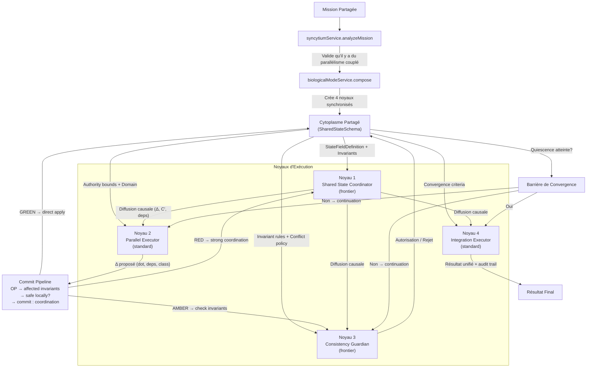
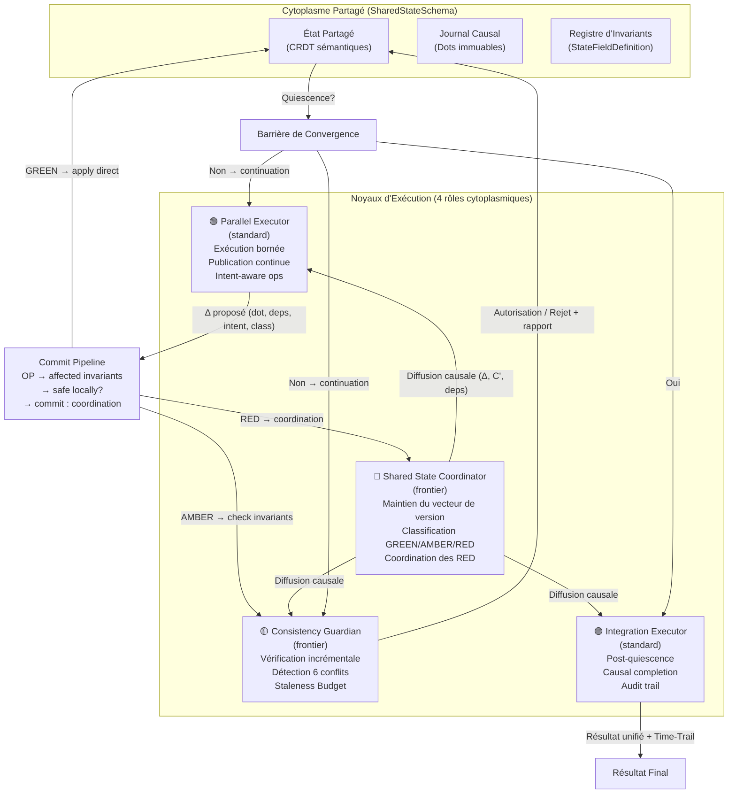
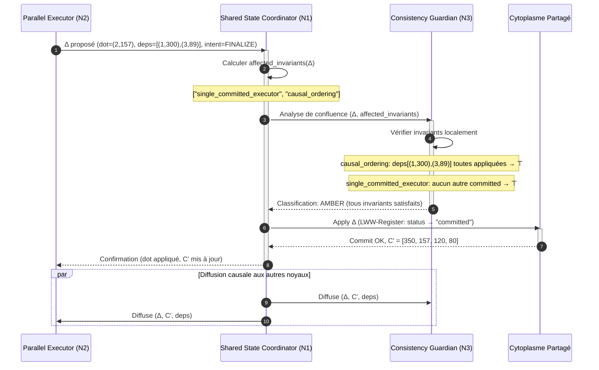
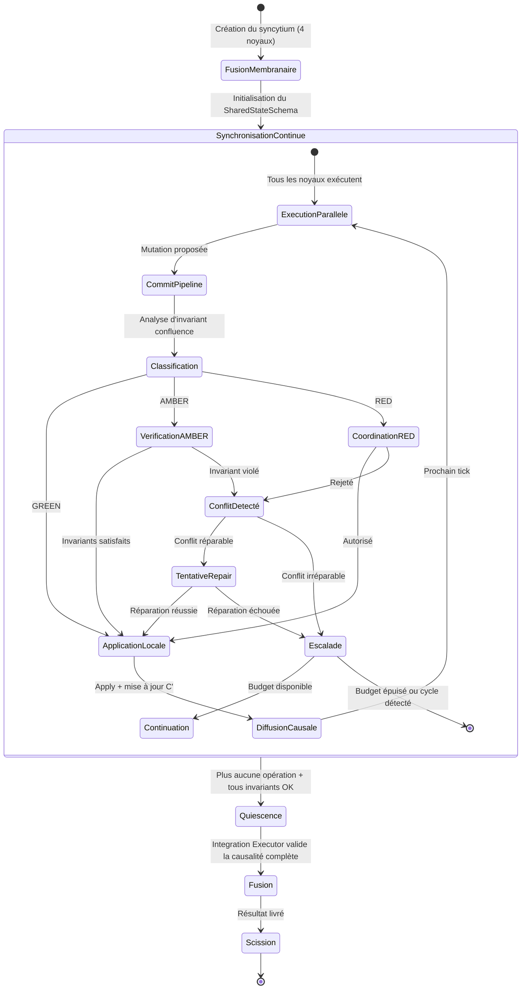
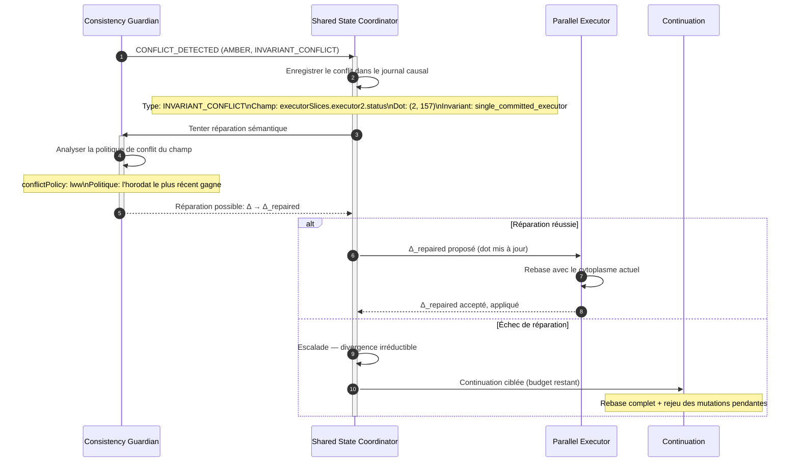
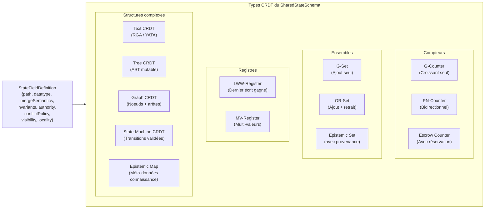

# Syncytium : Protocole de Fusion Cytoplasmique Multinucléée

- **Statut** : Cadre conceptuel — architecture cible planifiée pour une orchestration à état partagé, multinucléée et convergente.
- **Portée** : modèle complet du protocole Syncytium, de la composition et du commit causal à la convergence, la reprise et l'exploitation.
- **Dernière revue** : 2026-09-25

> **Statut scientifique et mathématique.** Les équations de cette fiche sont un modèle de conception, sauf indication explicite contraire. Elles ne constituent ni une preuve du comportement du dépôt ni une mesure expérimentale. Le code actuel expose notamment un conseil morphogénétique partiel ; il ne réalise pas le protocole distribué décrit ci-dessous. Les propriétés CRDT ne valent que sous les hypothèses propres au type et au protocole de réplication considérés.

## 1. Définition

Syncytium est un **modèle de conception d'orchestration autour d'un état partagé**. Il propose que plusieurs unités travaillent sur des opérations liées à un état commun, avec des règles explicites de fusion, de causalité et de validation. La fiche décrit une architecture cible ; elle ne garantit pas à elle seule la réplication, la convergence ni la préservation des invariants en production.

En biologie, une fibre musculaire squelettique est une cellule multinucléée formée par fusion de précurseurs. Ses noyaux ne sont pas des processus indépendants : ils partagent une cellule, mais leur transcription et la distribution des ARN et protéines sont spatialement régulées. La notion de « domaine myonucléaire » est un modèle discuté et variable, pas une frontière où un noyau serait le seul à agir. L'analogie avec GenOS est donc limitée au partage d'un environnement et à la spécialisation locale ; elle ne justifie aucune propriété de cohérence informatique.

Le principe fondateur est :

> **Hypothèse de conception :** lorsque plusieurs spécialistes modifient un état commun, des types de données répliqués et des invariants explicites peuvent permettre de séparer les opérations fusionnables de celles qui exigent une coordination. La détection des conflits dépend de la définition des opérations, des invariants et du protocole effectivement exécuté.

Syncytium se distingue conceptuellement des autres topologies GenOS par trois objectifs :

1. **Convergence conditionnelle** : certaines familles de CRDT convergent si leurs conditions de livraison, d'identification et de fusion sont satisfaites.
2. **Validité applicative** : un schéma peut déclarer des contraintes, mais leur seule déclaration ne les vérifie pas.
3. **Coordination selon les invariants** : l'analyse de confluence peut établir si des opérations peuvent être appliquées sans coordination ; cette fiche ne fournit pas un vérificateur formel général.

---

## 2. Modèle mathématique et garanties conditionnelles

Les symboles ci-dessous définissent un vocabulaire pour raisonner sur la conception. Ils ne spécifient pas une implémentation complète.

### 2.1 Formalisation du modèle Syncytium

Soit :
- $M$ : mission et contraintes ;
- $S$ : état logique ;
- $R = \{r_1, \ldots, r_n\}$ : réplicas ou participants (aucun nombre fixe n'est impliqué) ;
- $o$ : opération, avec son auteur et son contexte causal si le protocole les fournit ;
- $I(S)$ : prédicat indiquant que l'état respecte les invariants applicatifs ;
- $H$ : relation « arrive avant » (happens-before) sur les opérations.

Le système peut être décrit abstraitement par :

$$X = \langle M, S, R, I, H, P \rangle$$

où $P$ désigne le protocole de réplication et de coordination choisi. Il n'est pas nécessairement périodique : une durée de tick $\tau$ ne peut être introduite que si le système implémente réellement une synchronisation périodique.

Une opération candidate $o$ transforme un état par une fonction partielle $apply$ :

$$apply(S, o) = S' \quad\text{si l'opération est autorisée et ses préconditions sont satisfaites}$$

La diffusion, la validation et le traitement d'un rejet sont des étapes du protocole à définir ; elles ne découlent pas de cette notation.

### 2.2 Réplication et convergence

Le terme CRDT recouvre plusieurs constructions, avec des préconditions distinctes. Pour un **CRDT à état** (state-based), l'état forme généralement un semi-treillis join-semilattice et la fusion est un join : elle est associative, commutative et idempotente. La convergence éventuelle suppose notamment que les états locaux évoluent de façon monotone et que les informations de fusion finissent par être échangées ([Shapiro et al., rapport INRIA RR-7506](https://inria.hal.science/inria-00555588/document)).

Pour un **CRDT à opérations** (operation-based), la preuve dépend des opérations concurrentes, de leur livraison et de l'exécution par les réplicas. On ne peut donc pas affirmer que chaque mutation ou chaque type mentionné dans cette fiche est commutatif, idempotent ou tolère un ordre arbitraire. Un LWW-register, par exemple, impose une règle de résolution déterministe et peut perdre une mise à jour ; convergence ne signifie ni absence de perte sémantique ni respect automatique des invariants.

**Propriété conditionnelle visée :** si deux réplicas partent d'états compatibles, appliquent le même ensemble d'opérations admissibles selon le même type CRDT et satisfont les hypothèses de livraison et de fusion de ce type, alors ils convergent vers des états équivalents. Cette propriété est un résultat du protocole CRDT précis, pas une preuve de Syncytium au niveau applicatif.

### 2.3 Schéma et validité applicative

Dans le schéma cible, chaque champ peut être décrit par une `StateFieldDefinition` :

$$\text{StateFieldDefinition} = \langle \text{path}, \text{datatype}, \text{mergeSemantics}, \text{invariants}, \text{authority}, \text{conflictPolicy}, \text{visibility}, \text{locality} \rangle$$

où :
- **path** : chemin de l'état partagé (executorSlices.executor1.status) ;
- **datatype** : type CRDT (counter, set, register, mv-register, text-crdt, tree-crdt, graph-crdt, state-machine-crdt, epistemic-set, epistemic-map, escrow-counter) ;
- **mergeSemantics** : sémantique de fusion (LWW, Union, Max, Custom) ;
- **invariants** : prédicats $\phi$ qui doivent rester vrais ;
- **authority** : noyau autorisé à écrire dans ce champ ;
- **conflictPolicy** : politique en cas de conflit (reject, repair, escalate) ;
- **visibility** : portée de visibilité (public, role-private, nucleus-private) ;
- **locality** : localité du champ (hot, cold, frozen).

On peut représenter la validité d'un état par :

$$Valid(S) = WellTyped(S) \land \bigwedge_{I \in \mathcal{I}} I(S)$$

Cette formule définit un objectif. Elle n'implique pas que toutes les opérations soient contrôlées : l'implémentation doit exécuter les validations sur les bons états et faire échouer ou coordonner les transitions invalides.

### 2.4 Préservation des invariants et invariant-confluence

Les invariants sont des prédicats logiques sur l'état. À chaque opération proposée :

$$Valid(S) \land apply(S,o)=S' \implies Valid(S')$$

La formule exprime la préservation pour une transition séquentielle. En environnement concurrent, valider chaque branche isolément ne suffit pas toujours : la fusion de deux états valides peut être invalide. Invariant-confluence étudie précisément si des états valides issus d'un même état antérieur peuvent être fusionnés tout en restant valides. Une sélection incrémentale des invariants à vérifier n'est sûre que si les dépendances de chaque invariant sont complètes et fiables.

**Invariants incrémentaux** : Pour chaque opération $\Delta$, le système calcule l'ensemble des invariants potentiellement affectés :

$$\text{affected\_invariants}(\Delta) = \{I \in \mathcal{I} \mid \text{depends}(I) \cap \text{writes}(\Delta) \neq \emptyset\}$$

où $\text{depends}(I)$ est l'ensemble des chemins de l'état dont dépend l'invariant $I$, et $\text{writes}(\Delta)$ est l'ensemble des chemins modifiés par $\Delta$.

### 2.5 Quand la coordination peut-elle être évitée ?

L'analyse d'invariant confluence détermine si une opération peut être appliquée localement sans coordination globale, ou si elle exige une coordination. Soient $\Delta_i$ et $\Delta_j$ deux opérations proposées par des noyaux distincts.

L'indépendance de l'ordre des opérations est une propriété plus forte et différente de l'invariant-confluence. Une écriture possible de l'indépendance de replay est :

$$\forall \pi \in AllowedOrders(\mathcal{O}) : replay(S_0,\pi(\mathcal{O})) \equiv replay(S_0,\mathcal{O})$$

Les ordres autorisés doivent respecter les dépendances causales et les hypothèses du type de données. L'équivalence $\equiv$ doit être définie par le modèle ; elle n'implique pas nécessairement l'égalité octet par octet.

Le cadre d'invariant-confluence de Bailis et al. établit, pour un ensemble donné de transactions, d'invariants, d'états accessibles et d'une fonction de fusion, si une exécution sans coordination peut préserver la validité. Il ne se réduit pas à tester si un type CRDT « commute ». La conclusion dépend du modèle formel retenu et des hypothèses d'accès et de fusion ([Bailis et al., PVLDB 2015](https://www.vldb.org/pvldb/vol8/p185-bailis.pdf)).

Une formulation simplifiée de la condition étudiée est :

$$\forall S_0,S_1,S_2:\; I(S_0) \land I(S_1) \land I(S_2) \land reachable(S_0,S_1) \land reachable(S_0,S_2) \implies I(merge(S_1,S_2))$$

Cette formule suppose que `merge` et l'ensemble des transactions accessibles sont ceux définis par le modèle analysé ; ce n'est pas un test complet pour toute application.

Formellement :

$$I\text{-confluent}(T,I,merge) \Rightarrow \text{coordination-free execution may preserve } I$$

La non-I-confluence indique qu'une exécution sans coordination n'est pas suffisante pour garantir l'invariant sous le modèle étudié ; elle ne prescrit pas à elle seule un mécanisme de coordination particulier.

### 2.6 Classes GREEN, AMBER et RED (classification proposée)

Ces catégories sont une convention de conception locale, non une taxonomie standard des CRDT. Leur classification doit être calculée par un composant réel avant qu'on puisse lui attribuer un effet de sûreté.

**GREEN — Sans coordination dans le modèle étudié** : ne classer ainsi que si les propriétés du type de données et la I-confluence des transactions ont été établies pour les invariants concernés. La commutativité seule ne suffit pas.

Exemples : incrémenter un compteur G-Counter, ajouter un élément à un G-Set, publier un heartbeat.

**AMBER — Vérification conditionnelle** : le modèle exige des préconditions ou contrôles précis. Une vérification locale ne protège pas d'une course avec une autre réplique, sauf si le protocole garantit l'exclusion, la sérialisation ou une vérification de la fusion.

Exemples à analyser selon la sémantique exacte : suppression avec tombstone, mise à jour de registre avec règle de résolution, modification de valeur soumise à une borne globale.

**RED — Coordination requise** : le modèle établit qu'une exécution sans coordination ne préserve pas l'invariant ; il faut alors choisir un protocole de coordination adapté (verrou, lease, transaction, séquenceur, ou autre mécanisme prouvé).

Le caractère « critique » d'un invariant n'implique pas à lui seul que toute opération le concernant doive être coordonnée ; c'est la preuve de sûreté sous le modèle retenu qui guide la décision.

### 2.7 Causalité : relation happened-before et vecteurs de version

Lamport a défini une relation partielle happened-before et des horloges scalaires qui la respectent : si $a$ arrive avant $b$, alors $L(a)<L(b)$ ; la réciproque est fausse ([Lamport, 1978](https://lamport.azurewebsites.net/pubs/time-clocks.pdf)). Un vecteur de version peut représenter davantage d'information causale dans des systèmes adaptés, mais aucun mécanisme de ce type n'est garanti par cette fiche.

Pour une relation causale $\rightarrow$ :

$$\Delta_i \rightarrow \Delta_j \implies L(\Delta_i) < L(\Delta_j)$$

Un vecteur de version, lorsqu'il est utilisé, est indexé par les identités des participants et comparé composante par composante. La taille fixe de quatre participants n'est pas une propriété mathématique du modèle.

**Comparaison causale** : Pour deux vecteurs $V$ et $V'$ :

$$V \leq V' \iff \forall j : v_j \leq v'_j$$

$$V < V' \iff V \leq V' \land V \neq V'$$

$$V \parallel V' \iff \neg(V \leq V') \land \neg(V' \leq V)$$

**Identifiant d'opération :** un couple (participant, séquence locale) peut servir d'identifiant unique si les identités et séquences ne sont jamais réutilisées. Un tel identifiant n'ordonne pas totalement les opérations : deux dots concurrents peuvent être incomparables causalement.

**Contexte causal** : une opération peut transporter le contexte des événements observés. Ce contexte compact n'est pas nécessairement la liste explicite des dépendances à appliquer en premier :

$$context(o) = V_i \quad\text{(représentation possible si un vecteur de version est utilisé)}$$

**Livraison causale (conditionnelle au protocole)** : si une opération déclare un contexte causal explicite, ce contexte peut servir à différer son application jusqu'à réception des dépendances :

$$\text{canApply}(\Delta) = \forall d \in \text{deps}(\Delta) : d \in \text{applied}(\mathcal{S})$$

### 2.8 Distinguer concurrence, chevauchement d'écriture et conflit applicatif

Le syncytium distingue fondamentalement la concurrence du conflit :

**Concurrence :** deux opérations sont concurrentes si aucune ne précède l'autre selon happened-before.

$$\Delta_i \parallel \Delta_j \iff \neg(\Delta_i \rightarrow \Delta_j) \land \neg(\Delta_j \rightarrow \Delta_i)$$

La concurrence est normale et attendue dans un syncytium. Elle ne produit pas de conflit si les opérations commutent.

**Write Collision** : Deux opérations $\Delta_i$ et $\Delta_j$ entrent en collision d'écriture si elles ciblent le même chemin de l'état partagé.

$$\text{collide}(\Delta_i, \Delta_j) \iff \text{writes}(\Delta_i) \cap \text{writes}(\Delta_j) \neq \emptyset$$

Un chevauchement n'est pas un conflit en soi ; il faut examiner les sémantiques du type de données et les invariants. Inversement, deux écritures distinctes peuvent ensemble violer un invariant.

**Conflit applicatif** : deux opérations créent un conflit si, selon le modèle applicatif, leur exécution ou leur fusion rend l'état invalide ou si aucune règle de résolution admise n'existe. Des opérations sur des champs distincts peuvent violer ensemble un invariant ; un chevauchement d'écriture n'est ni nécessaire ni suffisant.

$$conflict(o_1,o_2,S) \iff \neg Valid(merge(apply(S,o_1),apply(S,o_2))) \quad\text{(si les deux branches sont admissibles)}$$

**Principe fondamental** :

$$\text{Concurrence} \neq \text{Collision} \neq \text{Conflict}$$

Deux opérations concurrentes peuvent être fusionnables pour un type donné ; deux opérations causalement ordonnées peuvent néanmoins violer une règle métier. Une collision d'écriture n'établit donc ni l'existence ni l'absence d'un conflit applicatif.

---

## 3. Quatre rôles envisagés dans le modèle

La conception décrit quatre responsabilités possibles. Ce nombre n'est pas une exigence mathématique ni une propriété biologique transposable ; la composition effective dépend du runtime et ne prouve pas l'existence d'un état répliqué partagé.

### 3.1 Shared State Coordinator (Frontier)

```
Role: shared_state_coordinator
ModelTier: frontier
Member Number: 1
Responsibility: State Integrity
```

**Hypothèse :**
> « Maintain the shared mission state and make coordination decisions visible to every agent. »

**Mission assignée :**
```
Syncytium shared mission: [shared mission]
Collective principle: A multinuclear collective sharing one continuously synchronized living state.
Role hypothesis: Maintain the shared mission state and make coordination decisions visible to every agent.

Your task (shared_state_coordinator):
1. Initialize the SharedStateSchema with all declared fields and invariants
2. Maintain the causal version vector and track all applied dots
3. Classify every incoming operation as GREEN, AMBER, or RED
4. Execute the commit pipeline for every proposed mutation
5. Make all coordination decisions transparent and logged
6. Detect when state exceeds the Staleness Budget threshold
7. Coordinate snapshot cycles and tombstone garbage collection

Return: State transitions log, causal vector evolution, coordination decisions, conflict resolutions
```

**Rôle dans le syncytium :**
- Initialise le schéma sémantique (StateFieldDefinition) à partir de la mission
- Maintient le vecteur de version global $\mathcal{C}$
- Exécute le commit pipeline pour chaque opération
- Détecte les dépassements du Staleness Budget
- Coordonne les snapshots adaptatifs et le GC des tombstones
- Garantit que chaque décision de coordination est enregistrée avec sa causalité

### 3.2 Parallel Executor (Standard)

```
Role: parallel_executor
ModelTier: standard
Member Number: 2
Responsibility: Bounded Execution
```

**Hypothèse :**
> « Execute a bounded slice in parallel while continuously publishing state changes. »

**Mission assignée :**
```
Syncytium shared mission: [shared mission]
Collective principle: A multinuclear collective sharing one continuously synchronized living state.
Role hypothesis: Execute a bounded slice in parallel while continuously publishing state changes.

Your task (parallel_executor):
1. Execute a specific bounded slice of work within your myonuclear domain
2. Do NOT modify state outside your declared authority
3. Publish state changes immediately as they happen with full causal metadata
4. Listen for state updates from other nuclei and rebase if necessary
5. Adapt execution based on concurrent mutations from other executors
6. Stop when the bounded domain is exhausted or invariant blocks progress
7. Report intent before mutation and outcome after commit

Return: Results of slice execution, state changes published with causal dots, adaptations made
```

**Rôle dans le syncytium :**
- Exécute sa tranche de travail dans les limites de son domaine d'autorité
- Publie chaque mutation avec son dot $(N_i, \text{seq}_i)$ et son dependency set
- Écoute les mutations des autres noyaux et adapte son exécution
- Respecte les classifications GREEN/AMBER/RED du Coordinator
- Génère des rapports d'intention avant mutation (intent-aware operations)

### 3.3 Consistency Guardian (Frontier)

```
Role: consistency_guardian
ModelTier: frontier
Member Number: 3
Responsibility: Invariant Enforcement
```

**Hypothèse :**
> « Detect conflicting assumptions, stale state, and invariant violations immediately. »

**Mission assignée :**
```
Syncytium shared mission: [shared mission]
Collective principle: A multinuclear collective sharing one continuously synchronized living state.
Role hypothesis: Detect conflicting assumptions, stale state, and invariant violations immediately.

Your task (consistency_guardian):
1. Watch all state changes in real-time with causal ordering
2. Verify incremental invariants for every AMBER operation
3. Authorize or reject every RED operation after invariant confluence analysis
4. Detect all six semantic conflict types (WRITE, SCHEMA, DEPENDENCY, AUTHORITY, INVARIANT, INTENT)
5. Measure Staleness Budget consumption per nucleus
6. Trigger adaptive synchronization frequency when hot regions are detected
7. Halt processing if a critical invariant is violated and escalate

Return: Invariant check log, conflicts detected by type, staleness measurements, sync frequency recommendations
```

**Rôle dans le syncytium :**
- Vérifie les invariants incrémentaux pour chaque opération AMBER
- Autorise ou rejette les opérations RED après analyse de confluence
- Détecte les 6 types de conflits sémantiques
- Mesure le Staleness Budget de chaque noyau
- Déclenche l'adaptation de la fréquence de synchronisation
- Arrête le syncytium si un invariant critique est violé

### 3.4 Integration Executor (Standard)

```
Role: integration_executor
ModelTier: standard
Member Number: 4
Responsibility: Convergence & Merging
```

**Hypothèse :**
> « Integrate the collective result without allowing divergent local branches to survive unnoticed. »

**Mission assignée :**
```
Syncytium shared mission: [shared mission]
Collective principle: A multinuclear collective sharing one continuously synchronized living state.
Role hypothesis: Integrate the collective result without allowing divergent local branches to survive unnoticed.

Your task (integration_executor):
1. Collect all state slices from parallel executors after quiescence
2. Verify causal completeness: all dependency sets are satisfied
3. Detect any divergent branches (local states that differ from the converged cytoplasm)
4. Require consensus before accepting any divergent state
5. Produce a Time-Travel audit trail from the causal operation log
6. Deliver final unified result with provenance attribution

Return: Integrated result, causal completeness report, divergence detection, final converged state
```

**Rôle dans le syncytium :**
- Collecte les tranches exécutées après quiescence cytoplasmique
- Vérifie la complétude causale : tous les dependency sets sont satisfaits
- Détecte les branches divergentes (états locaux qui diffèrent du cytoplasme convergent)
- Exige un consensus avant d'accepter un état divergent
- Produit la piste d'audit Time-Travel à partir du journal causal
- Livre le résultat unifié final avec attribution de provenance

---

## 4. Architecture du Protocole



### Cycle de vie d'une opération

```
Parallel Executor                    Shared State Coordinator                Consistency Guardian
       │                                      │                                      │
       │  Δ proposé (dot, deps, class)        │                                      │
       ├─────────────────────────────────────>│                                      │
       │                                      │  Analyse d'invariant confluence      │
       │                                      ├─────────────────────────────────────>│
       │                                      │                                      │
       │                                      │  Rapport d'analyze (GREEN/AMBER/RED)  │
       │                                      │<─────────────────────────────────────┤
       │                                      │                                      │
       │                                      │  [GREEN] → apply direct              │
       │                                      │  [AMBER] → check local invariants    │
       │                                      │  [RED] → coordination globale        │
       │                                      │                                      │
       │  Confirmation (C' appliqué, dot ok)   │                                      │
       │<─────────────────────────────────────┤                                      │
       │                                      │                                      │
       │  Diffusion causale aux autres noyaux │                                      │
       ├─────────────────────────────────────>│─────────────────────────────────────>│
```

---

## 5. Activation du Protocole

### Critères de pertinence (conception)

La conception considère la topologie pertinente quand la mission présente les caractéristiques suivantes :

1. **Parallélisme couplé** : la mission se décompose en plusieurs tranches qui partagent des champs d'état et dont les résultats sont mutuellement dépendants.
2. **Cohérence stricte requise** : la divergence temporaire entre les noyaux n'est pas acceptable — les invariants doivent être préservés à chaque tick.
3. **Latence tolérée** : les contraintes de latence et les coûts de coordination sont mesurés sur le déploiement visé.
4. **Signaux disponibles** : le conseiller morphogénétique peut recevoir les mesures nécessaires à son heuristique.

### Calcul du CouplingScore

La formule historique ci-dessous n'est pas une métrique dimensionnellement définie : elle multiplie une proportion, une densité, une fréquence (avec unité) et un coût sans préciser l'échelle de normalisation. Elle ne doit pas servir de seuil universel ni être présentée comme un résultat scientifique.

Le conseiller morphogénétique implémenté utilise une heuristique distincte. Il accepte quatre composantes de couplage normalisées dans $[0,1]$ (directement ou dérivées de compteurs et références fournis), puis calcule leur produit :

$$C = w_s \times d \times u \times c_s$$

où :
- $w_s$ : densité d'écritures partagées ;
- $d$ : densité des dépendances ;
- $u$ : fréquence relative des mises à jour ;
- $c_s$ : coût relatif des lectures périmées.

Ce produit est une heuristique de conseil, non une mesure validée du « couplage ». Une composante manquante rend le score indéterminé ; elle n'est pas remplacée par zéro. En l'absence de ces composantes, le conseiller ne recommande pas A-Team sur la seule base d'un couplage faible ; d'autres signaux explicitement fournis peuvent toutefois proposer une autre topologie. Le seuil de faible couplage est $0{,}2$ dans le code actuel, combiné à un faible niveau d'écritures partagées ou de dépendances et à l'absence d'invariants partagés. C'est un paramètre d'implémentation, pas un seuil scientifique.

Les autres signaux de transition utilisent leurs propres seuils configurés dans le code. Une recommandation peut produire un plan morphogénétique validé, mais ne déclenche pas elle-même une transition.

### Exemple de composition de rôles (illustratif)

```javascript
const mission = "Orchestrate real-time collaborative refactoring of a 50-file codebase across 4 specialized teams.";
const analysis = biologicalModeService.compose('syncytium', mission);

// La composition propose quatre rôles ; elle ne crée pas à elle seule un état CRDT partagé.
// [
//   { role: 'shared_state_coordinator', modelTier: 'frontier', memberNumber: 1,
//     mission: 'Syncytium shared mission: ...\nRole hypothesis: Maintain the shared mission state...' },
//   { role: 'parallel_executor', modelTier: 'standard', memberNumber: 2,
//     mission: 'Syncytium shared mission: ...\nRole hypothesis: Execute a bounded slice...' },
//   { role: 'consistency_guardian', modelTier: 'frontier', memberNumber: 3,
//     mission: 'Syncytium shared mission: ...\nRole hypothesis: Detect conflicting assumptions...' },
//   { role: 'integration_executor', modelTier: 'standard', memberNumber: 4,
//     mission: 'Syncytium shared mission: ...\nRole hypothesis: Integrate the collective result...' }
// ]
```

### Cas où une autre topologie peut convenir

Les indications ci-dessous sont des recommandations de conception, pas des exclusions exécutées par le runtime :
- **Mission strictement séquentielle** : une seule tranche, pas de parallélisme.
- **Budget insuffisant** : moins de 4 workers ne peuvent être financés.
- **Tolérance à la divergence** : la mission accepte la cohérence finale → utiliser Biocénose.
- **Indépendance épistémique** : les tranches doivent rester isolées → utiliser Trinity.

---

## 6. Composition et Allocation

### Contrat de composition

```javascript
biologicalModeService.compose('syncytium', "Orchestrate real-time collaborative editing with shared state.")
```

Dans la conception proposée, la composition validerait :
1. **Mission explicite** : aucune composition sans mission.
2. **Mode reconnu** : 'syncytium' parmi les modes biologiques.
3. **Quatre rôles envisagés** : les rôles décrits dans cette fiche sont une proposition de composition.
4. **Schéma partagé** : la génération et la validation automatique d'un SharedStateSchema restent à démontrer.

### Allocation du budget

Une règle possible de répartition est :

$$T_{\text{per\_nucleus}} = \frac{T_{\text{worker}} \times s}{4}$$

où :
- $T_{\text{worker}}$ : budget alloué aux workers.
- $s$ : fraction affectée à ce groupe (choix de configuration, sans valeur par défaut validée).
- $4$ : nombre de rôles cytoplasmiques.

### Modèles utilisés

| Rôle | Modèle | Justification |
|------|--------|---------------|
| Shared State Coordinator | `frontier` | Orchestration d'état complexe, analyse d'invariant confluence |
| Parallel Executor | `standard` | Exécution rapide dans un domaine borné |
| Consistency Guardian | `frontier` | Vérification d'invariants complexes, détection de conflits sémantiques |
| Integration Executor | `standard` | Agrégation et merge post-quiescence |

L'alternance frontier/standard équilibre coût et complexité aux deux postes critiques : état et cohérence.

---

## 7. Exécution : Le Commit Pipeline

Le commit pipeline est le mécanisme central par lequel chaque opération est évaluée avant d'être appliquée au cytoplasme partagé.

### Pipeline d'une opération

```
┌─────────────────────────────────────────────────────────────────┐
│                    COMMIT PIPELINE                               │
│                                                                 │
│  Δ proposé                                                      │
│    │                                                            │
│    ├─ 1. Calculer le dot (N_i, seq_i)                           │
│    ├─ 2. Calculer le dependency set deps(Δ)                     │
│    ├─ 3. Déterminer les affected_invariants(Δ)                  │
│    │                                                            │
│    ├─ 4. Classifier : GREEN / AMBER / RED                       │
│    │                                                            │
│    ├─ [GREEN] ──→ apply direct → diffuser                       │
│    │                                                            │
│    ├─ [AMBER] ──→ Vérifier les affected_invariants localement   │
│    │               ├─ Tous satisfaits → apply → diffuser        │
│    │               └─ Un violé → CONFLICT_DETECTED              │
│    │                                                            │
│    └─ [RED] ──→ Coordination globale via Coordinator            │
│                   ├─ Autorisation → apply → diffuser             │
│                   └─ Rejet → CONFLICT_DETECTED                  │
│                                                                 │
│  CONFLICT_DETECTED ──→ Enregistrer le type de conflit           │
│                        ──→ Tenter réparation sémantique         │
│                        ──→ Escalader si irréparable             │
└─────────────────────────────────────────────────────────────────┘
```

### AtomicOperationGroup

Les opérations qui doivent être atomiques sont regroupées en `AtomicOperationGroup` :

```rust
struct AtomicOperationGroup {
    group_id: Dot,
    preconditions: Vec<Predicate>,      // Doivent être vrais avant application
    writes: Vec<Operation>,             // Mutations à appliquer ensemble
    postconditions: Vec<Predicate>,     // Doivent être vrais après application
    conflict_policy: ConflictPolicy,    // Que faire en cas de conflit
}
```

**Application atomique** : Les `writes` d'un groupe sont appliquées ensemble ou pas du tout. Si une seule `postcondition` échoue après application, tout le groupe est annulé (rollback partiel) et le conflit est enregistré.

### Exemple de commit pipeline (illustratif)

```javascript
// Parallel Executor 2 propose une mutation
const operation = {
  dot: (2, 157),                    // Noyau 2, séquence 157
  deps: [(1, 300), (3, 89)],       // Dépend de ces dots déjà appliqués
  target: "executorSlices.executor2.status",
  datatype: "lww-register",
  value: "committed",
  intent: "signal_slice_completion"
};

// Étape 1 : Le Coordinator analyse la confluence
const classification = coordinator.classify(operation);
// → AMBER (LWW-Register commute mais l'invariant "un seul Executor peut être 'committed' à la fois" existe)

// Étape 2 : Le Consistency Guardian vérifie les invariants affectés
const affectedInvariants = schema.getAffectedInvariants(operation.target);
// → ["single_committed_executor", "causal_ordering"]

const checkResult = guardian.checkInvariants(affectedInvariants, operation);
// → { single_committed_executor: ⊤, causal_ordering: ⊤ }

// Étape 3 : Application locale
if (checkResult.allSatisfied) {
  cytoplasm.apply(operation);
  coordinator.updateVector(operation.dot);
  coordinator.diffuse(operation, cytoplasm.versionVector);
}
```

---

## 8. Barrière de Convergence et Fusion

### Condition de quiescence

Le syncytium atteint la quiescence cytoplasmique quand :

$$quiescent(S) \iff pending(S)=\varnothing \land Valid(S) \land CausallyComplete(S)$$

La quiescence n'est pas un point fixe déductible de l'état seul : elle suppose une connaissance suffisante des producteurs et des opérations en transit. Sans mécanisme de suivi des participants et des messages en vol, une file vide localement ne prouve pas qu'il n'y a plus de travail.

### Critères de fusion

La fusion est possible si :

$$\text{canMerge} = \begin{cases} \top & \text{si } \text{quiescence}(\mathcal{S}) = \top \land \forall I \in \mathcal{I} : I(\mathcal{S}) = \top \land \text{causalCompleteness}(\mathcal{S}) = \top \\ \bot & \text{sinon} \end{cases}$$

**Causal completeness** : tous les dots appliqués dans le cytoplasme ont leurs dépendances satisfaites :

$$\text{causalCompleteness}(\mathcal{S}) = \forall \Delta \in \text{applied}(\mathcal{S}) : \forall d \in \text{deps}(\Delta) : d \in \text{applied}(\mathcal{S})$$

### Rapport d'intégration (exemple fictif)

L'exemple suivant est une sortie fictive destinée à illustrer un format de rapport ; il ne provient pas d'une campagne ni d'une exécution vérifiée :

```
## Rapport de Fusion Syncytium

### Convergence
- Quiescence atteinte au tick T=847
- Tous les noyaux ont épuisé leurs opérations en attente
- État causal complet : 0 dépendance insatisfaite
- Status : CONVERGED ✓

### Invariants
- single_committed_executor : ✓ (un seul noyau committed à chaque tick)
- causal_ordering : ✓ (tous les dots appliqués dans l'ordre causal)
- budget_conservation : ✓ (tokens consommés ≤ budget alloué)

### Résultat Intégré
- Cytoplasme final : 1,247 champs, 342 mutations atomiques
- Divergence détectée : 0
- Conflits résolus : 3 (2 AMBER locaux, 1 RED coordonné)
- Temps total : 84.7 secondes
- Time-Trail audit : disponible sur 1,247 états intermédiaires

### Décision
MERGE : Le syncytium a convergé. L'état final est causalement complet et tous les invariants sont satisfaits.
```

---

## 9. Continuations et Resynchronisation

Quand la quiescence n'est pas atteinte après un nombre configurable de ticks, le syncytium lance des **continuations ciblées**.

### Politique de continuation

Une continuation s'active si :

$$\text{continuation\_needed} = \text{ticks\_since\_quiescence} > \theta_{\text{continuation}} \land \text{budget\_remaining} > 0$$

### Cibles de continuation

| Noyau | Cible de continuation |
|-------|-----------------------|
| Parallel Executor | Relancer avec le cytoplasme le plus récent, rebase des mutations pendantes |
| Consistency Guardian | Révalider les invariants avec le nouveau cytoplasme |
| Integration Executor | Réintégrer après relance des autres noyaux |

Le Shared State Coordinator reste actif pendant les continuations — il ne relance pas.

### Critères d'arrêt

Une continuation s'arrête si :
- Quiescence atteinte + invariants OK → fusion.
- Budget épuisé → escalade.
- Cycle détecté (même problème relancé 2×) → escalade.
- Divergence irréductible → escalade vers arbitrage humain.

---

## 10. Télémétrie

### Métriques continues

Le syncytium expose un flux de télémétrie structuré à chaque tick :

```rust
struct SyncytiumTelemetry {
    tick: u64,
    vector: VersionVector,
    pending_ops: [usize; 4],           // Opérations en attente par noyau
    staleness_budget: [f32; 4],        // Budget de staleness restant par noyau
    conflict_rate: f32,                // Taux de conflit sur la dernière fenêtre
    sync_frequency: f32,               // Fréquence de synchronisation adaptative actuelle
    hot_region_activity: Vec<PathActivity>, // Activité par région hot/cold
    backpressure_level: BackpressureLevel,   // Niveau de contre-pression
}
```

### Estimation du retard causal (modèle)

Le modèle peut estimer le retard d'un replica à partir d'un vecteur de version :

$$lag_i = \max_j\bigl(V_{global}[j] - V_i[j]\bigr)$$

Une resynchronisation pourrait être envisagée si ce retard dépasse un seuil configuré ; la formule seule ne déclenche aucun mécanisme.

### Journal causal structuré

Chaque opération est enregistrée avec :

```json
{
  "dot": [2, 157],
  "tick": 847,
  "vector": [350, 157, 120, 80],
  "nucleus": "parallel_executor",
  "classification": "AMBER",
  "target": "executorSlices.executor2.status",
  "intent": "signal_slice_completion",
  "deps": [[1, 300], [3, 89]],
  "affected_invariants": ["single_committed_executor", "causal_ordering"],
  "outcome": "APPLIED"
}
```

---

## 11. Configuration

### Variables d'environnement proposées (non vérifiées)

Les noms, valeurs et comportements ci-dessous décrivent une configuration cible ; le dépôt ne confirme pas que le runtime les lit ou applique ces réglages.

Les noms, seuils et valeurs de l'exemple suivant décrivent le modèle cible ; ils ne sont pas présentés comme des variables prises en charge par le runtime actuel.

```bash
# Période de synchronisation (ms entre chaque tick)
export GENOS_SYNCYTIUM_SYNC_TICK=100

# Budget de staleness (ticks max en retard)
export GENOS_SYNCYTIUM_STALENESS_BUDGET=10

# Seuil de backpressure (taille de file d'attente)
export GENOS_SYNCYTIUM_BACKPRESSURE_THRESHOLD=100

# Politique de partition par défaut
export GENOS_SYNCYTIUM_PARTITION_POLICY=QUEUE_OPERATION

# Timeout de convergence avant escalade (ms)
export GENOS_SYNCYTIUM_CONVERGENCE_TIMEOUT=60000

# Taille de fenêtre de garbage collection
export GENOS_SYNCYTIUM_GC_MARGIN=50

# Granularité des snapshots adaptatifs
export GENOS_SYNCYTIUM_SNAPSHOT_DELTA_THRESHOLD=1000
```

### Configuration cible par mission (exemple non exécutable)

```yaml
syncytium:
  sync_tick_ms: 100
  staleness_budget: 10
  partition_policy: QUEUE_OPERATION
  convergence_timeout_ms: 60000
  adaptive_sync:
    base_frequency_hz: 10
    conflict_high_threshold: 0.1
    conflict_low_threshold: 0.001
  backpressure:
    queue_threshold: 100
    latency_threshold_ms: 500
  regions:
    hot_sync_multiplier: 0.5
    cold_sync_multiplier: 2.0
```

---

## 12. Limites

### Scalabilité structurelle

Le modèle d'exemple utilise quatre rôles. Le nombre de participants et le coût induit doivent être évalués pour chaque protocole :

La complexité de coordination dépend du graphe de communication, des invariants et du protocole. Aucune borne $O(n^2)$ n'est établie ici ; elle doit être déduite d'un algorithme concret et mesurée.

Pour les missions nécessitant plus de 4 unités, utiliser des topologies emboîtées (A-Team avec Syncytium local, ou Rhizome avec Syncytium cluster).

### Latence minimale

Il n'existe pas de borne universelle de période déduite de la seule latence réseau. La latence de bout en bout dépend aussi du transport, du traitement, des files, des reprises et du modèle de cohérence. Toute cible de synchronisation doit être mesurée sur le déploiement visé.

Une contrainte temps réel requiert une analyse de pire temps d'exécution (WCET), des hypothèses de charge et un environnement matériel définis ; le seuil de 10 ms n'est pas une règle générale.

### Budget mémoire

Les structures suivantes sont des composantes possibles d'un budget mémoire, pas une loi de proportionnalité mesurée :

$$M_{total} = M_{journal}+M_{snapshots}+M_{tombstones}+M_{index}+M_{buffers}+M_{runtime}$$

Le garbage collection compense partiellement, mais les missions à très haut taux de mutation peuvent nécessiter un archivage externe.

### Tolérance aux partitions

Le comportement en partition dépend du protocole choisi : opérations bloquées, mises en attente ou acceptées localement n'offrent pas les mêmes garanties. Cette fiche ne démontre ni tolérance aux partitions ni reprise sûre.

---

## 13. Comparaisons avec les Autres Topologies

| Aspect | Trinity | A-Team | Biocénose | Holobionte | Rhizome | Syncytium |
|--------|---------|--------|-----------|------------|---------|-----------|
| **Décomposition** | Hypothèses (3) | Domaines (N) | Communauté (4) | Hiérarchie (4) | Capacités (N) | État (4) |
| **Autorité** | Orchest. central | Domaines isolés | Protocole/consensus | Host central | Aucune autorité | Coordinator |
| **Synchronisation** | Selon implémentation | Selon implémentation | Selon implémentation | Selon implémentation | Selon implémentation | **Cible : état partagé** |
| **Consistency** | À vérifier | À vérifier | À vérifier | À vérifier | À vérifier | **À spécifier et vérifier** |
| **Parallélisme** | Limité (3 mondes) | Bon | Bon | Délégué | Maximal | **Maximal** |
| **État partagé** | Non | Non | Non | Partiel | Non | **Oui** |
| **Conflit handling** | Confrontation | Isolation | Vote | Host décide | Ignore | **Détection structurelle** |
| **Meilleur pour** | Explorer hypothèses | Multidisciplinaire | Robustesse critique | Production sécurisée | Ramification libre | **Temps réel collaboratif** |

Ce tableau compare des intentions de conception, pas des garanties vérifiées ou une mesure comparative des performances.

### Choix de la topologie

$$\text{topology} = \begin{cases} \text{Trinity} & \text{if } \text{épistémie multiple requise} \\ \text{A-Team} & \text{if } \text{domaines disciplinaires isolés} \\ \text{Biocénose} & \text{if } \text{cohérence finale suffisante} \\ \text{Holobionte} & \text{if } \text{hiérarchie stricte} \\ \text{Rhizome} & \text{if } \text{ramification de capacités} \\ \text{Syncytium} & \text{if } \text{état partagé strict requis} \end{cases}$$

---

## 14. Schémas Mermaid

### 14.1 Topologie du Syncytium Multinucléé



### 14.2 Séquence de Commit Causal



### 14.3 Machine à États de la Convergence Cytoplasmique



---

## 15. Architecture technique prévue

Cette section distingue les responsabilités de l'architecture cible des capacités réellement raccordées. Aucun audit de cohérence séparé n'est publié dans ce dépôt.

### Capacités raccordées au runtime

Les variants disposent désormais de services métier dédiés, raccordés à la façade Syncytium :

- **Hard** : leases avec fencing tokens monotones et transactions sérialisables vérifiant
  le détenteur, l'expiration et la version d'état.
- **Soft** : réconciliation des réplicas, routage sélectif, mesure de fraîcheur et bundles
  d'anti-entropie compressés avec taille et empreinte bornées.
- **Document** : sections séquencées, blocs typés, marques de texte, attribution,
  commentaires et édition compensatoire avec audit.
- **Blackboard** : objets typés append-only, priorités, expiration en lecture et suivi
  des questions ouvertes.
- **Graph** : projection bornée par profondeur et types d'arêtes, en plus des contrôles
  d'intégrité existants.
- **Epistemic** : claims datés, provenance, contradictions déclarées, mises à jour de
  confiance et vérifications indépendantes.
- **Local-First** : horloges hybrides logiques et autorité hors ligne limitée par champs,
  nombre d'opérations et échéance.
- **Speculative** : lignées de branches, plafonds d'exécution et comparaison différentielle.
- **Hierarchical** : coupe-circuits régionaux qui isolent opérations et transactions.
- **Real-Time Control** : ordonnanceur logiciel EDF, contrôle de watchdog, reçus WCET
  déclaratifs et sortie fail-safe `STOP_AND_REPAIR`.
- **Human–AI** : zones d'autorité humaine, consentement, pause, attribution, approbation
  et édition compensatoire.

Ces services restent des mécanismes locaux du runtime GenOS. La compression d'anti-entropie
ne fournit pas de transport, les reçus WCET sont déclarés et non mesurés par un banc certifié,
et une édition compensatoire ou un undo ne renverse pas un effet externe déjà exécuté.
Les capacités suivantes ne sont donc pas revendiquées comme acquises : CRDT AST/texte riche
complet, stockage local chiffré, escrow distribué, transactions cross-région atomiques,
stockage Kuzu/Ladybug, copie spéculative copy-on-write et garanties temps réel certifiées.

Une intégration partielle permet désormais de demander un **conseil de transition morphogénétique** depuis une session Syncytium persistée, via l'opération `morphogenesis` de `genos_topology_session`. Cette analyse lit l'instantané de la session (domaines actifs, invariants et cohérence), combine ces données avec les signaux de transition fournis par l'appelant, puis peut construire un plan avec le planificateur Morphogenèse.

Les signaux de couplage acceptent soit une valeur normalisée entre 0 et 1, soit un couple de compteurs pour la densité d'écritures partagées, la densité de dépendances, la fréquence de mises à jour et le coût des lectures périmées. Si un signal de couplage requis manque, le score reste indéterminé et le conseiller ne propose pas A-Team sur la seule base d'un couplage faible ; les données absentes ne sont pas assimilées à zéro. Les autres signaux explicites peuvent toutefois guider une recommandation différente. Les signaux explicites de conflit sémantique, d'expérimentabilité, de centralité des désaccords et d'autonomie régionale peuvent aussi orienter la recommandation.

Une transition proposée n'est pas exécutée automatiquement. Pour une session incohérente, l'analyse bloque la planification (`SYNCYTIUM_INCONSISTENT`). Le plan éventuel est validé par le planificateur Morphogenèse ; un plan invalide est écarté (`MORPHOGENESIS_PLAN_INVALID`). `planningContextComplete` indique seulement si l'inventaire des agents a été fourni : sa valeur ne signifie ni que la transition a été appliquée ni que l'exécution est complète. Les recommandations, seuils et sorties du plan sont des aides à la décision, pas des preuves de performance.

Le service de benchmark agrège des compteurs fournis par l'appelant et calcule quatre ratios : conflits sémantiques manqués, opérations sûres sans coordination, violations d'invariants promues hors Syncytium et mises à jour pertinentes délivrées. Un ratio sans dénominateur exploitable est retourné comme non mesuré. L'agrégateur compare les budgets par tâche, mais ne lance pas lui-même les scénarios : aucune campagne réelle ni aucun gain empirique n'est établi par cette capacité. Voir le [protocole de benchmark Syncytium](../../06-benchmarks/benchmark-syncytium.md).

Le Syncytium doit s'intégrer au runtime GenOS au moyen des composants suivants :

- **Service de coordination :** `syncytiumCoordinationService.js` — commit pipeline, barrière de convergence et classification des opérations.
- **Moteur CRDT Rust :** `crates/genos-cli/src/commands/syncytium_crdt/` — structures conflict-free avec horloges causales et journal immuable.
- **Service de mission :** `syncytiumService.js` — analyse de mission et recommandation d'activation.
- **État partagé :** registre de session et stockage de la topologie — cytoplasme partagé, versions causales et invariants.

### Capacités requises

Le contrat cible requiert les capacités runtime suivantes :
- `CRDT_SHARED_STATE` — structures CRDT sémantiques avec fusion commutative.
- `SIGNALING_BUS` — diffusion causale des mutations avec métadonnées complètes.
- `OUTPUT_GOVERNOR` — contrôle des émissions pour éviter la saturation (backpressure).

### Interface d'exploitation prévue

Les commandes ci-dessous illustrent l'interface visée pour le déploiement, l'analyse et l'exécution headless :

```bash
# Déployer un syncytium avec dashboard web et WebSocket
genos biological deploy --mode syncytium --serve --port 4791

# Analyser une mission sans déploiement
genos syncytium analyze --mission "Orchestrate collaborative refactoring"

# Exécuter un syncytium headless
genos biological deploy --mode syncytium --headless --budget 200000
```

---

## 16. Références

### Fondations CRDT

1. **Shapiro, M., Preguiça, N., Baquero, C., & Zawirski, M.** (2011). *A Comprehensive Study of Convergent and Commutative Replicated Data Types.* INRIA Technical Report RR-7506.
2. **Preguiça, N., et al.** (2014). *Conflict-free Replicated Data Types (CRDTs).* Encyclopedia of Database Systems.
3. **Baquero, C., et al.** (2017). *Pure Operation-Based CRDTs.* PaPoC 2017.

### Causalité et horloges

4. **Lamport, L.** (1978). *Time, Clocks, and the Ordering of Events in a Distributed System.* Communications of the ACM, 21(7), 558–565.
5. **Petrangeli, S., et al.** (2020). *A Tree-Crdt for Collaborative Editing.* ICDCS 2020.
6. **Nedelec, B., et al.** (2016). *CRDTs for Real-time Collaborative Editing.* PaPoC 2016.

### Analyse de confluence et invariants

7. **Bieniusa, A., et al.** (2012). *An Optimization for Reactivity in Conflict-free Replicated Data Types.* DISC 2012.
8. **Bieniusa, A., et al.** (2012). *An Invariant Checker for CRDTs.* LADC 2012.
9. **Preguiça, N.** (2011). *Coordination-Free Replication of Concurrent Data Types.* Universidade de Lisboa.

### Détection de conflits et fusion

10. **Zawirski, M., et al.** (2016). *On the Detection of Conflicts in CRDTs.* PaPoC 2016.
11. **Petrangeli, S., et al.** (2014). *Merging CRDTs: A Comprehensive Study.* PaPoC 2014.

### Systèmes distribués et CAP

12. **Brewer, E.** (2012). *CAP Twelve Years Later: How the "Rules" Have Changed.* Computer, 45(2), 23–29.

### Biologie computationnelle

13. **Allen, D. L., et al.** (2001). *Myonuclear domains in skeletal muscle.* Muscle & Nerve, 24(9), 1132–1140.

### Internes GenOS

14. [ORCHESTRATION.md](../orchestration.md) : orchestration générale, gates et phases
15. [A_TEAM.md](a-team.md) : orchestration multidisciplinaire
16. [TRINITY.md](trinity.md) : orchestration comparative
17. [BIOCENOSE.md](biocenose.md) : orchestration communautaire
18. [HOLOBIONTE.md](holobionte.md) : orchestration hiérarchisée intégrée
19. [RHIZOME.md](rhizome.md) : orchestration décentralisée par ramification
20. [BIOLOGIE_COMPUTATIONNELLE.md](../../01-concepts/biologie-computationnelle.md) : cadre biologique général

---

## Annexes A : Espaces d'état proposés

Les annexes A à N et P à S contiennent des contrats, formules et mécanismes envisagés. Ce sont des esquisses à formaliser et à implémenter ; leur présence ne signifie pas qu'ils existent dans le runtime. Les politiques de partition, réparation, snapshots, GC, leases et backpressure requièrent des preuves séparées, adaptées à leurs modèles de panne.


Le syncytium maintient cinq espaces logiques distincts au sein de l'état partagé, chacun avec ses propres règles de cohérence et de visibilité.

### Logical State (État Logique)

L'état logique est la représentation canonique de la mission — la « vérité terrain » que tous les noyaux consultent. Il est structuré en CRDT et soumis à tous les invariants.

$$\mathcal{S}_{\text{logical}} = \{\text{path} \mapsto \text{StateFieldDefinition}\}$$

### Workspace (Espace de Travail)

Chaque noyau possède un workspace local — un espace de travail temporaire où il prépare ses mutations avant de les proposer au cytoplasme. Le workspace n'est pas partagé : il est local à chaque noyau.

$$\mathcal{W}_{N_i} = \{\text{prepared\_ops}\}$$

### Epistemic (État Épistémique)

L'état épistémique capture ce que chaque noyau sait du cytoplasme — sa version du vecteur de version et son horizon causal.

$$\mathcal{E}_{N_i} = \langle V_i, \text{horizon}_i \rangle$$

où $\text{horizon}_i$ est l'ensemble des dots connus de $N_i$. Cet état permet de détecter la staleness : si $\text{horizon}_i$ est en retard sur le vecteur global, le noyau est stale.

### Coordination (État de Coordination)

L'état de coordination suit les opérations RED en cours de coordination — les locks distribués, les votes en attente, les AtomicOperationGroup préparés.

$$\mathcal{C}_{\text{coord}} = \{\text{active\_groups}, \text{pending\_votes}, \text{distributed\_leases}\}$$

### Presence (État de Présence)

L'état de présence signale que chaque noyau est actif et synchronisé — un heartbeat mis à jour à chaque tick.

$$\mathcal{P}_{N_i} = \langle \text{last\_heartbeat}, \text{staleness\_budget\_remaining}\rangle$$

---

## Annexes B : Les Six Types de Conflits Sémantiques

Le Semantic Conflict Detector classe les conflits en six types distincts, chacun avec sa propre stratégie de résolution.

| Type de conflit | Stratégie par défaut |
|-----------------|---------------------|
| WRITE_CONFLICT | conflictPolicy du champ (LWW, Union, ou Custom merge) |
| SCHEMA_CONFLICT | REJECT immédiat, log d'erreur |
| DEPENDENCY_CONFLICT | QUEUE l'opération jusqu'à ce que les deps soient satisfaites |
| AUTHORITY_CONFLICT | REJECT, escalade au Coordinator |
| INVARIANT_CONFLICT | REJECT, tenter réparation sémantique |
| INTENT_CONFLICT | Coordination RED obligatoire, arbitrage |

### Définitions formelles

**WRITE_CONFLICT** : Deux opérations modifient le même champ avec des valeurs qui ne commutent pas.

$$\text{WRITE\_CONFLICT}(\Delta_i, \Delta_j) = \text{writes}(\Delta_i) \cap \text{writes}(\Delta_j) \neq \emptyset \land \neg\text{canMergeCRDT}(\Delta_i, \Delta_j)$$

**SCHEMA_CONFLICT** : Une opération viole le type de données déclaré dans le StateFieldDefinition.

$$\text{SCHEMA\_CONFLICT}(\Delta) = \text{type}(\Delta.\text{value}) \neq \text{schema}(\Delta.\text{path}).\text{datatype}$$

**DEPENDENCY_CONFLICT** : Une opération est appliquée alors que ses dépendances ne sont pas toutes satisfaites.

$$\text{DEPENDENCY\_CONFLICT}(\Delta) = \exists d \in \text{deps}(\Delta) : d \notin \text{applied}(\mathcal{S})$$

**AUTHORITY_CONFLICT** : Une opération est proposée par un noyau qui n'a pas l'autorité sur le champ ciblé.

$$\text{AUTHORITY\_CONFLICT}(\Delta) = \Delta.\text{nucleus} \neq \text{schema}(\Delta.\text{path}).\text{authority}$$

**INVARIANT_CONFLICT** : Une opération produirait un état violant un invariant déclaré.

$$\text{INVARIANT\_CONFLICT}(\Delta) = \exists I \in \text{affected\_invariants}(\Delta) : I(\mathcal{S} \circ \Delta) = \bot$$

**INTENT_CONFLICT** : Deux opérations ont des intentions sémantiquement incompatibles.

$$\text{INTENT\_CONFLICT}(\Delta_i, \Delta_j) = \text{intentsIncompatible}(\Delta_i.\text{intent}, \Delta_j.\text{intent})$$

---

## Annexes C : Intent-Aware Operations

Chaque opération porte une déclaration d'intention (`intent`) qui permet au système de détecter les conflits sémantiques au-delà de la simple collision d'écriture.

### Modèle d'intention

```rust
struct OperationIntent {
    verb: IntentVerb,           // CREATE, READ, UPDATE, DELETE, FINALIZE, RESET, etc.
    target: String,             // Chemin de l'état ciblé
    scope: IntentScope,         // LOCAL, DOMAIN, GLOBAL
    exclusivity: Exclusivity,   // NONE, SHARED, EXCLUSIVE
    outcome: String,            // Description du résultat attendu
}
```

### Classification des intentions

Les intentions sont classées selon leur compatibilité :

**Intentions compatibles** (peuvent coexister) :
- `READ` + `READ` : plusieurs lecteurs simultanés.
- `UPDATE` (champ A) + `UPDATE` (champ B) : champs distincts, CRDT commutatifs.
- `HEARTBEAT` + toute intention : le heartbeat est non-bloquant.

**Intentions conflictuelles** (nécessitent coordination) :
- `FINALIZE` + `RESET` : finalisation vs réinitialisation.
- `DELETE` + `UPDATE` : suppression vs modification.
- `FINALIZE` + `UPDATE` : finalisation vs modification post-finalisation.

**Détection d'incompatibilité** :

$$\text{intentsIncompatible}(i_1, i_2) = \exists r \in \text{conflictRules} : r.\text{matches}(i_1) \land r.\text{matches}(i_2)$$

---

## Annexes D : SharedStateSchema — Types de Données Sémantiques

Le SharedStateSchema déclare les types de données sémantiques du cytoplasme. Chaque type est une structure CRDT avec ses propres règles de fusion.

| Type | Structure CRDT | Usage typique |
|------|----------------|---------------|
| `g-counter` | Grow-only Counter | Compteurs croissants (tokens, ops) |
| `pn-counter` | Positive-Negative Counter | Soldes, compteurs bidirectionnels |
| `g-set` | Grow-only Set | Collections sans retrait |
| `or-set` | Observed-Removed Set | Collections avec retrait |
| `lww-register` | Last-Writer-Wins Register | Valeurs scalaires avec horodatage |
| `mv-register` | Multi-Value Register | Scalaires avec conservation des conflits |
| `text-crdt` | RGA / YATA CRDT | Édition collaborative de texte |
| `tree-crdt` | Replicated Tree | Structures hiérarchiques mutables |
| `graph-crdt` | Replicated Graph | Graphes avec nœuds et arêtes |
| `state-machine-crdt` | State Machine CRDT | Transitions d'état avec validation |
| `epistemic-set` | Epistemic Set | Ensembles avec connaissance partagée |
| `epistemic-map` | Epistemic Map | Maps avec méta-données épistémiques |
| `escrow-counter` | Escrow Counter | Compteurs avec réservation de budget |

---

## Annexes E : Time Travel — Rembobinage et Exploration Causale

Le journal causal immuable permet de reconstituer l'état à n'importe quel point de l'exécution.

### explain(path, version)

Pour comprendre pourquoi un champ a une valeur donnée à un instant donné :

```javascript
const explanation = syncytium.explain("deployment.state", {
  version: { tick: 600, vector: [350, 200, 120, 80] }
});

// Résultat :
// {
//   value: "review",
//   provenance: [
//     { dot: (1, 280), tick: 450, nucleus: "shared_state_coordinator",
//       operation: "UPDATE deployment.state = 'draft' → 'review'",
//       causalDependencies: [(1, 279)] },
//     { dot: (3, 95), tick: 445, nucleus: "consistency_guardian",
//       operation: "APPROVE transition draft→review'",
//       causalDependencies: [(1, 278)] }
//   ]
// }
```

### Counterfactual Time Travel

Le syncytium permet d'explorer des contre-factuels — des branches alternatives de l'histoire :

```javascript
// Créer une branche contrefactuelle à partir du tick 500
const counterfactual = syncytium.branch("what-if-executor2-failed", {
  fromTick: 500,
  override: {
    "executorSlices.executor2.status": "failed"
  }
});

// Simuler l'impact sur le reste du cytoplasme
const simulation = counterfactual.simulate({ ticksForward: 100 });
// → Impact : executor3 doit reprendre la slice 2, temps additionnel estimé : 30 ticks
```

Les branches contrefactuelles sont des snapshots divergents qui ne modifient pas le cytoplasme principal. Elles sont utiles pour :
- L'analyse d'impact pré-commit (les opérations RED).
- L'audit post-convergence.
- La génération de rapports « et si... » pour l'utilisateur.

---

## Annexes F : Snapshot Adaptatif, Garbage Collection et Tombstones

### Snapshot Adaptatif

Le syncytium produit des snapshots adaptatifs — leur fréquence et granularité s'adaptent à la dynamique de l'état :

Le choix d'un intervalle de snapshot est une politique d'ingénierie à mesurer selon le coût des snapshots, la fréquence des mutations, la durée de reprise visée et les contraintes de stockage.

Une fréquence plus élevée peut réduire le travail de reprise au prix d'écritures supplémentaires ; le compromis et la taille des snapshots dépendent de la structure de l'état et doivent être mesurés.

### Garbage Collection

Les opérations anciennes sont collectées quand elles ne sont plus nécessaires à la convergence :

$$canGC(x) \Rightarrow stable(x) \land noLiveReference(x)$$

La stabilité doit être établie par un protocole de stabilité, en prenant en compte les réplicas hors ligne, la rétention et les reprises. Une marge fixe sur des vecteurs n'est pas, à elle seule, une preuve de sûreté du GC.

### Tombstones

Dans un OR-Set fondé sur des tombstones, ceux-ci conservent l'information causale de suppression afin qu'une réplique retardataire ne réintroduise pas l'élément. D'autres constructions peuvent encoder ou compacter les suppressions autrement ; le mécanisme précis appartient au type de données utilisé.

$$\text{tombstone}(\text{element}) = \langle \text{elementId}, \text{removedAt}: \text{dot} \rangle$$

Un tombstone ne peut être collecté que si aucun état ni message retardé pertinent ne peut réintroduire l'élément supprimé. Cela exige un protocole de stabilité et une politique explicite pour les réplicas absents.

---

## Annexes G : Les Variantes du Syncytium

Le protocole de base se décline en plusieurs variantes spécialisées selon le domaine d'application.

| Variante | Usage principal | Types dominants | Zones de cohérence |
|----------|-----------------|-----------------|-------------------|
| **Hard Syncytium** | Missions critiques (finance, réglementaire) | state-machine-crdt, lww-register | SERIALIZABLE, IMMUTABLE |
| **Soft Syncytium** | Indicateurs et métriques | g-counter, g-set | EVENTUAL, CAUSAL |
| **Document Syncytium** | Édition collaborative de documents | text-crdt | CAUSAL |
| **Code Syncytium** | Refactoring collaboratif de code | tree-crdt, text-crdt | CAUSAL, SERIALIZABLE |
| **Blackboard Syncytium** | Tableaux noirs (systèmes IA classiques) | epistemic-set | INVARIANT_PRESERVING |
| **Graph Syncytium** | Modélisation de systèmes complexes | graph-crdt | CAUSAL |
| **Epistemic Syncytium** | Collaboration épistémique | epistemic-map | INVARIANT_PRESERVING |
| **Transactional Syncytium** | Workflows métier (ACID) | state-machine-crdt | SERIALIZABLE |
| **Local-First Syncytium** | Machines distinctes avec latence réseau | g-counter, or-set | EVENTUAL, CAUSAL |
| **Speculative Syncytium** | Exploration contrefactuelle | tous types | CAUSAL |
| **Hierarchical Syncytium** | Missions multi-échelles | tree-crdt, state-machine-crdt | SERIALIZABLE |
| **Real-Time Control Syncytium** | Systèmes de contrôle temps réel | state-machine-crdt, lww-register | SERIALIZABLE |
| **Human-AI Syncytium** | Collaboration humain-agent | text-crdt, epistemic-map | CAUSAL |

---

## Annexes H : Zones de cohérence proposées

Ces étiquettes décrivent des garanties visées, pas des garanties fournies automatiquement par le `SharedStateSchema`. Chaque zone nécessite des mécanismes d'exécution et des tests adaptés. En particulier, « invariant-preserving » exige de préciser si la propriété couvre un replica, une transaction ou la fusion de plusieurs états.

| Zone | Garantie | Usage typique |
|------|----------|---------------|
| **EVENTUAL** | Convergence finale, divergence temporaire possible | Métriques, heartbeats |
| **CAUSAL** | Opérations causalement liées visibles dans l'ordre | Statuts, contenus |
| **INVARIANT_PRESERVING** | Invariants désignés vérifiés selon un protocole à préciser | Données métier avec contraintes |
| **SERIALIZABLE** | Transactions apparaissent comme exécutées en séquence | Déploiements, workflows |
| **IMMUTABLE** | Écrit une fois, lu ensuite | Description de mission, configuration |
| **APPEND_ONLY** | Ne peut que croître | Journaux, historiques |

---

## Annexes I : Politique de partition envisagée

En cas de partition réseau, une implémentation pourrait appliquer une politique explicite. Le tableau suivant est une proposition ; aucune politique de partition ni valeur par défaut n'est établie par ce document :

| Politique | Comportement |
|-----------|--------------|
| **ALLOW_LOCAL_MUTATION** | Le noyau partitionné continue à muter son workspace local. Les mutations sont mises en file d'attente et diffusées à la reconnexion. |
| **ALLOW_READ_ONLY** | Le noyau partitionné peut lire le dernier état connu mais ne peut pas proposer de mutations. |
| **QUEUE_OPERATION** | Les opérations proposées sont mises en file d'attente et évaluées à la reconnexion. |
| **REJECT_OPERATION** | Les opérations proposées sont rejetées immédiatement. Le noyau doit se reconnecter pour continuer. |

Les choix entre mise en attente, rejet et mutation locale impliquent des compromis différents de disponibilité et de validité ; il faut les définir pour le système et ses invariants.

---

## Annexes J : Topologies Emboîtées

Le syncytium peut être composé avec d'autres topologies GenOS pour des architectures multi-échelles.

### A-Team avec Syncytium local

Un A-Team (équipe multidisciplinaire) déploie un Syncytium local au sein de chaque domaine disciplinaire.

```
A-Team
├── Domaine Refactoring → Syncytium (4 noyaux spécialisés en refactoring)
├── Domaine Testing → Syncytium (4 noyaux spécialisés en test)
└── Domaine Documentation → Syncytium (4 noyaux spécialisés en doc)
```

Chaque domaine est un syncytium indépendant avec son propre cytoplasme et ses propres invariants. Les domaines communiquent via les canaux inter-domaines de l'A-Team.

### Rhizome avec Syncytium cluster

Un Rhizome (réseau décentralisé de capacités) regroupe plusieurs syncytiums en cluster.

$$\text{Rhizome} = \{\text{Syncytium}_1, \text{Syncytium}_2, \ldots, \text{Syncytium}_n\}$$

Chaque syncytium maintient son propre cytoplasme, mais les syncytiums partagent un épistemic state global pour la coordination inter-cluster.

---

## Annexes K : Sécurité et Fiabilité

### Ownership et Lease vérifiés avant apply

Avant d'appliquer toute opération, le système vérifie que le noyau proposant possède un **lease valide** sur le champ ciblé.

$$\text{canApply}(\Delta) = \text{validLease}(\Delta.\text{nucleus}, \Delta.\text{target}) \land \text{authorityCheck}(\Delta.\text{nucleus}, \Delta.\text{target})$$

Un lease est un ticket temporaire qui autorise un noyau à écrire dans un champ :

$$\text{Lease} = \langle \text{nucleus}, \text{field}, \text{expiresAt}, \text{permissions} \rangle$$

### Fault Attribution

Quand un invariant est violé, le système attribue la faute au noyau responsable via le dot de l'opération :

$$\text{faultOwner}(\text{invariantViolation}) = \Delta.\text{dot}.\text{nucleus}$$

où $\Delta$ est l'opération dont l'application a causé la violation.

### Automatic Local Repair

Pour certains types de conflits, le système tente une réparation automatique :

$$\text{attemptRepair}(\Delta, \mathcal{S}) = \begin{cases} \Delta_{\text{repaired}} & \text{if } \text{canRepair}(\Delta, \mathcal{S}) \\ \text{ESCALATE} & \text{otherwise} \end{cases}$$

### Semantic Repair

La réparation sémantique utilise la politique de conflit du champ :
- **LWW** : la valeur avec l'horodat le plus récent gagne.
- **Union** : les valeurs sont fusionnées (pour les sets et maps).
- **Max** : la valeur maximale gagne (pour les compteurs).
- **Custom** : une fonction de merge définie par la mission est appelée.

---

## Annexes L : Backpressure, Staleness Budget et Régulation Adaptative

### Backpressure

Quand le taux de mutations dépasse la capacité de diffusion, le syncytium applique une contre-pression :

$$\text{backpressure}(N_i) = \begin{cases} \text{slowDown} & \text{if } \text{queueSize}(N_i) > \theta_{\text{queue}} \\ \text{delayDiffusion} & \text{if } \text{networkLatency} > \theta_{\text{latency}} \\ \text{normal} & \text{otherwise} \end{cases}$$

### Staleness Budget

Un budget exprimé en opérations mesure un retard causal, pas un temps écoulé. Pour exprimer un retard temporel, il faut des horodatages, une borne d'horloge et une définition des messages en transit.

$$remainingOps_i = \max(0, \theta_{ops} - lag_i)$$

où $lag_i = \max_j(V_{global}[j]-V_i[j])$ si $V_{global}$ est le join composante par composante des vecteurs connus. Cette mesure compte un retard en opérations, pas en ticks. Un seuil temporel exige des horloges et des hypothèses supplémentaires.

Un système peut définir une action de resynchronisation lorsque ce budget opérationnel est épuisé, mais cette fiche ne spécifie ni n'implémente cette action.

### Adaptive Sync Frequency

La règle suivante est une heuristique de conception à évaluer ; elle ne prouve pas qu'une fréquence plus élevée réduit le taux de conflit ou améliore les performances :

$$\tau_{\text{new}} = \tau_{\text{base}} \times \begin{cases} 0.5 & \text{if } \text{conflictRate} > \theta_{\text{high}} \\ 1.0 & \text{if } \theta_{\text{low}} \leq \text{conflictRate} \leq \theta_{\text{high}} \\ 2.0 & \text{if } \text{conflictRate} < \theta_{\text{low}} \end{cases}$$

### Hot/Cold Regions

Les champs du schema sont classés par localité :
- **Hot** : modifiés fréquemment → synchronisation plus fréquente, snapshots plus denses.
- **Cold** : modifiés rarement → synchronisation normale, snapshots espacés.
- **Frozen** : jamais modifiés → pas de synchronisation, snapshot initial seulement.

---

## Annexes M : Scénarios d'usage illustratifs

### Cas 1 : Édition collaborative en temps réel (scénario)

**Mission :** « Orchestrer l'édition collaborative d'un document de 50 pages par 4 rédacteurs spécialisés. »

**Syncytium activé :** Document Syncytium avec `text-crdt` dominant.

**Résultat :** Le document converge avec tous les deltas intégrés dans l'ordre causal. Les conflits de chevauchement sont résolus par la politique de merge du text-crdt.

### Cas 2 : Refactoring coordonné multi-service (scénario)

**Mission :** « Déployer une nouvelle API à travers 5 microservices avec état de déploiement partagé. »

**Syncytium activé :** Transactional Syncytium avec `state-machine-crdt` pour l'état de déploiement.

**Résultat :** Tous les services sont déployés dans l'ordre de dépendance correct, avec un audit trail causal complet.

### Cas 3 : Calcul parallèle avec état partagé (scénario)

**Mission :** « Calculer une simulation distribuée avec partage d'état intermédiaire. »

**Syncytium activé :** Hard Syncytium avec champs SERIALIZABLE pour les résultats intermédiaires.

**Résultat :** La simulation converge vers un état cohérent qui respecte tous les invariants physiques.

### Cas 4 : Gestion de projet temps réel (scénario)

**Mission :** « Coordonner 4 équipes sur un backlog partagé avec prioritisation dynamique. »

**Syncytium activé :** Epistemic Syncytium avec `epistemic-map` pour le backlog et `graph-crdt` pour les dépendances.

---

## Annexes N : Quand NE PAS Utiliser Syncytium

### Ne pas utiliser Syncytium si :

1. **Mission strictement séquentielle** : une seule tranche, pas de parallélisme. Utiliser un pipeline linéaire ou Trinity.
2. **Tranches totalement indépendantes** : les résultats de chaque tranche n'affectent pas les autres. Utiliser A-Team.
3. **Tolérance à la divergence** : la mission accepte que les noyaux divergent temporairement et convergent finalement. Utiliser Biocénose.
4. **Indépendance épistémique requise** : les tranches doivent développer des hypothèses contradictoires sans s'influencer. Utiliser Trinity.
5. **Ressources limitées** : comparer le coût des participants et de leur coordination au bénéfice attendu du partage.
6. **Faible besoin de partage** : comparer les coûts de coordination attendus aux contraintes de la mission.
7. **Missions hiérarchiques strictes** : un host central doit contrôler tous les aspects. Utiliser Holobionte.
8. **Missions rhizomatiques** : les capacités doivent se ramifier librement sans état partagé. Utiliser Rhizome.

### Test rapide

$$\text{adéquation}(T) = f(\text{partage d'état}, \text{invariants}, \text{latence tolérée}, \text{coût de coordination})$$

Ces éléments sont des critères d'orientation conceptuels, pas des conditions suffisantes ni des règles exécutées automatiquement.

---

## Annexes O : Analogie biologique et limites

Une fibre musculaire squelettique est un syncytium formé lors de la fusion de myoblastes. Cette ressemblance de vocabulaire inspire le modèle, mais ne constitue pas une homologie fonctionnelle ni une preuve de sûreté informatique.

### Myofibre squelettique

Une myofibre peut contenir de nombreux noyaux dans un cytoplasme continu. Les profils de transcription varient selon la position et la fonction des noyaux. Le « domaine myonucléaire » désigne une hypothèse de territoire fonctionnel ; sa taille, sa stabilité et son pouvoir explicatif restent discutés. Les ARN peuvent être transportés et localisés, tandis que certaines protéines diffusent plus largement : les produits nucléaires ne sont donc pas simplement confinés à des territoires étanches. Ces nuances sont discutées dans une revue récente sur les domaines myonucléaires ([Murach et al., 2023](https://pmc.ncbi.nlm.nih.gov/articles/PMC9931674/)) ; la compartimentation fonctionnelle et l'hétérogénéité nucléaire ont aussi été observées par séquençage de noyaux uniques ([Kim et al., 2020](https://www.nature.com/articles/s41467-020-20064-9)).

**Observation prudente** : le partage d'un cytoplasme est compatible avec une hétérogénéité transcriptionnelle et une organisation spatiale. Il ne signifie ni indépendance des noyaux ni confinement exclusif des produits à une zone.

### Transposition dans GenOS

| Biologie | Syncytium GenOS |
|----------|-----------------|
| Sarcoplasme (cytoplasme partagé) | État partagé (SharedStateSchema) |
| Myonoyau | Noyau cognitif (rôle cytoplasmique) |
| Myonuclear domain | Domaine d'autorité (StateFieldDefinition.authority) |
| Produits de transcription | Mutations (opérations sur l'état) |
| Communication moléculaire et transport intracellulaire | Flux de messages et d'opérations (analogie fonctionnelle seulement) |
| Activité coordonnée de la fibre | Coordination des participants (analogie, sans équivalent mécaniste) |
| Signaux physiologiques | Contraintes et objectifs de mission (analogie) |

### Spécialisation locale malgré cytoplasme partagé

Dans le modèle logiciel, un domaine d'autorité peut être défini par :

$$\text{authorityDomain}(r_i) = \{f \mid authority(f)=r_i\}$$

Cette définition décrit une règle d'accès logicielle. Elle ne formalise pas le domaine myonucléaire biologique. Les règles d'écriture partagée doivent être décidées par le schéma, la politique de fusion et les invariants ; l'autorité seule ne rend pas une fusion sûre.

La biologie n'impose donc ni quatre rôles, ni un partage d'autorité, ni un algorithme CRDT.

---

## Annexes P : Exemple Complet de Schéma

```javascript
const syncytiumSchema = {
  missionId: "refactor_2026",
  fields: [
    {
      path: "mission.description",
      datatype: "immutable-register",
      mergeSemantics: "once",
      invariants: [],
      authority: "shared_state_coordinator",
      conflictPolicy: "reject",
      visibility: "public",
      locality: "frozen",
      consistencyZone: "IMMUTABLE"
    },
    {
      path: "executorSlices.*.status",
      datatype: "lww-register",
      mergeSemantics: "lww",
      invariants: ["status ∈ {idle, running, committed, failed}"],
      authority: "parallel_executor",
      conflictPolicy: "lww",
      visibility: "public",
      locality: "hot",
      consistencyZone: "CAUSAL"
    },
    {
      path: "executorSlices.*.output",
      datatype: "text-crdt",
      mergeSemantics: "rga",
      invariants: ["length ≤ 100000"],
      authority: "parallel_executor",
      conflictPolicy: "merge",
      visibility: "public",
      locality: "hot",
      consistencyZone: "CAUSAL"
    },
    {
      path: "metrics.tokenUsage",
      datatype: "pn-counter",
      mergeSemantics: "sum",
      invariants: ["value ≥ 0", "value ≤ mission.budget"],
      authority: "shared_state_coordinator",
      conflictPolicy: "repair",
      visibility: "public",
      locality: "cold",
      consistencyZone: "EVENTUAL"
    },
    {
      path: "deployment.state",
      datatype: "state-machine-crdt",
      mergeSemantics: "valid-transitions-only",
      invariants: ["transition ∈ validTransitions(deployment.state)"],
      authority: "shared_state_coordinator",
      conflictPolicy: "escalate",
      visibility: "public",
      locality: "hot",
      consistencyZone: "SERIALIZABLE"
    },
    {
      path: "knowledgebase.facts",
      datatype: "epistemic-set",
      mergeSemantics: "union-with-provenance",
      invariants: ["no-contradictory-facts"],
      authority: "consistency_guardian",
      conflictPolicy: "escalate",
      visibility: "public",
      locality: "cold",
      consistencyZone: "INVARIANT_PRESERVING"
    }
  ]
};
```

---

## Annexes Q : Définition Complète de StateFieldDefinition

```rust
struct StateFieldDefinition {
    path: String,                    // Chemin dot-notation
    datatype: CRDTType,              // Type CRDT
    mergeSemantics: MergeSemantics,  // Politique de fusion
    invariants: Vec<Predicate>,      // Invariants sémantiques
    authority: NucleusRole,          // Rôle autorisé à écrire
    conflictPolicy: ConflictPolicy,  // Politique de conflit
    visibility: Visibility,          // Portée de visibilité
    locality: Locality,              // Hot/Cold/Frozen
    consistencyZone: ConsistencyZone // Zone de cohérence
}
```

---

## Annexes R : Continuation et Reprise sur Conflit



---

## Annexes S : Hiérarchie des Types CRDT



---

## Annexes T : Références Internes

- [Orchestration](../README.md) : index des concepts et contrats d'orchestration.
- [A-Team](a-team.md), [Trinity](trinity.md), [Biocénose](biocenose.md), [Holobionte](holobionte.md) et [Rhizome](rhizome.md) : autres topologies.
- [Biologie computationnelle](../../01-concepts/biologie-computationnelle.md) : cadre biologique général.
- [biologicalModeService.js](../../../backend/src/services/biologicalModeService.js) : composition actuelle des rôles.
- [syncytiumService.js](../../../backend/src/services/syncytiumService.js) : analyse de mission et journal actuel.
- [syncytiumCoordinationService.js](../../../backend/src/services/syncytiumCoordinationService.js) : service de session actuel.
- [syncytiumCrdtService.js](../../../backend/src/services/syncytiumCrdtService.js) : journal et reconstruction actuels.
- [syncytiumCytoplasmService.js](../../../backend/src/services/syncytiumCytoplasmService.js) : modèle heuristique des flux.
