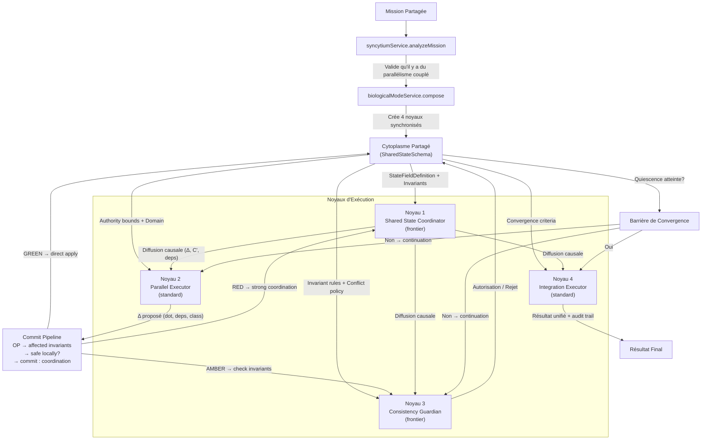
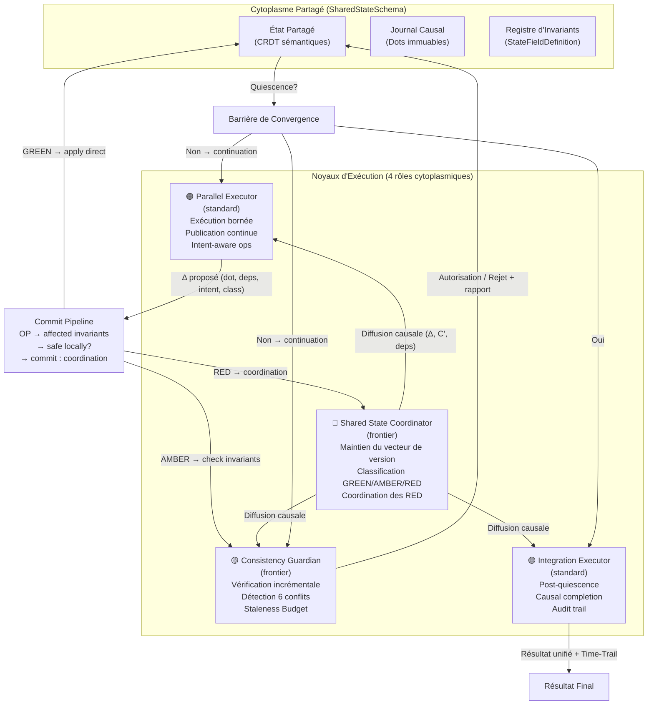
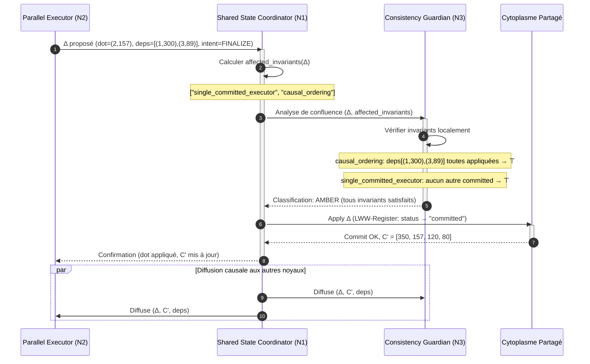
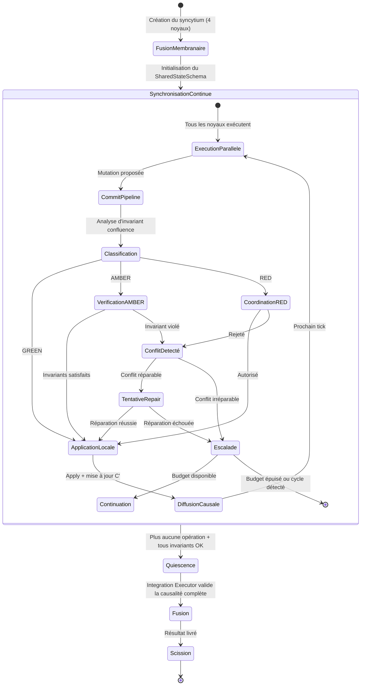
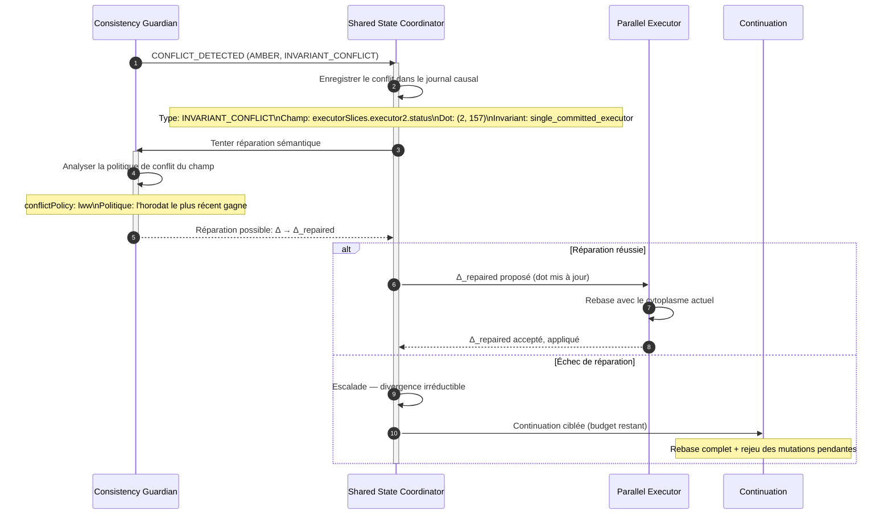
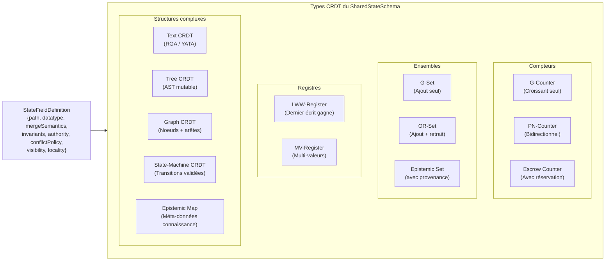

# Syncytium : Protocole de Fusion Cytoplasmique Multinucléée

- **Statut** : Cadre conceptuel — architecture cible planifiée pour une orchestration à état partagé, multinucléée et convergente.
- **Portée** : modèle complet du protocole Syncytium, de la composition et du commit causal à la convergence, la reprise et l'exploitation.
- **Dernière revue** : 2026-09-24

## 1. Définition

Syncytium est le **protocole d'orchestration par état partagé vivant** de GenOS, dans lequel plusieurs unités cognitives spécialisées travaillent simultanément sur un même état continu, convergent par fusion cytoplasmique et maintiennent des garanties de cohérence causale stricte à chaque tick de synchronisation.

Le mot « Syncytium » vient de la biologie du développement : un syncytium vrai (comme les muscles squelettiques ou le syncytiotrophoblaste placentaire) est une masse multinucléée où des milliers de noyaux partagent un cytoplasme commun sans membrane de séparation. Chaque noyau conserve son identité transcriptionnelle (son programme d'expression local), mais les produits de transcription diffusent librement dans le cytoplasme partagé. GenOS emprunte ce principe : chaque unité cognitive conserve son mandat local, ses invariants privés et son autorité décisionnelle, mais opère sur un état partagé dont les mutations sont visibles immédiatement et convergent mathématiquement.

Le principe fondateur est :

> **Quand une mission exige que plusieurs spécialistes modifient simultanément le même état avec des garanties de cohérence, Syncytium fait de cet état un cytoplasme commun : chaque mutation locale diffuse, chaque conflit est détecté structurellement, et la convergence est garantie par construction mathématique — non par négociation ad hoc.**

Syncytium se distingue des autres topologies GenOS par trois propriétés fondamentales :

1. **ReplicaConvergence (G1)** : deux répliques qui ont vu les mêmes opérations convergent vers le même état, quel que soit l'ordre de réception — garantie par la structure CRDT du shared state.
2. **SemanticCoherence (G2)** : l'état partagé ne contient que des valeurs valides selon le schéma sémantique déclaré — les types ne sont pas de simples types mémoire mais des invariants sémantiques.
3. **InvariantPreservation (G3)** : les invariants déclarés dans le `SharedStateSchema` sont vérifiés à chaque opération ; aucune mutation ne peut produire un état qui viole un invariant sans déclencher une escalade immédiate.

---

## 2. Définition Mathématique du Protocole de Fusion Cytoplasmique

### 2.1 Formalisation du Syncytium

Soit :
- $\mathcal{M}$ : mission partagée (intention globale, ressources, bornes) ;
- $\mathcal{S}_t$ : état partagé vivant au tick $t$ — un cytoplasme structuré en CRDT ;
- $\mathcal{N} = \{N_1, N_2, N_3, N_4\}$ : ensemble des noyaux (unités cognitives) ;
- $\Delta_i$ : mutation proposée par le noyau $N_i$ ;
- $\mathcal{I} = \{I_1, \ldots, I_k\}$ : ensemble des invariants déclarés ;
- $\mathcal{C}$ : vecteur de version causal global ;
- $\mathcal{D}$ : dependency set de l'opération courante.

Le syncytium est défini comme le tuple :

$$\text{Syncytium} = \langle \mathcal{M}, \mathcal{S}_t, \mathcal{N}, \mathcal{I}, \mathcal{C}, \mathcal{D}, \tau \rangle$$

où $\tau$ est la période de synchronisation (tick).

À chaque tick de synchronisation $\tau$, pour chaque noyau $N_i$ :

$$\text{if } \text{InvariantConvergent}(\Delta_i, \mathcal{S}_t, \mathcal{I}) = \top :$$

$$\mathcal{S}_{t+1} = \mathcal{S}_t \circ \Delta_i$$

$$\text{diffuse}(\mathcal{S}_{t+1}, \mathcal{C}')$$

$$\text{else} :$$

$$\text{CONFLICT\_DETECTED}(\Delta_i, \mathcal{S}_t, \mathcal{I}, \text{conflictType})$$

### 2.2 Convergence des Répliques (Garantie G1)

L'état partagé est structuré en CRDT (Conflict-free Replicated Data Type). Pour chaque champ du `SharedStateSchema`, la structure mathématique garantit :

**Commutativité** : l'ordre d'application des mutations n'affecte pas l'état final.

$$\forall \Delta_i, \Delta_j : \mathcal{S} \circ \Delta_i \circ \Delta_j = \mathcal{S} \circ \Delta_j \circ \Delta_i$$

**Idempotence** : appliquer la même mutation deux fois a le même effet que l'appliquer une fois.

$$\forall \Delta_i : \mathcal{S} \circ \Delta_i \circ \Delta_i = \mathcal{S} \circ \Delta_i$$

**Associativité** : le regroupement des mutations n'affecte pas le résultat.

$$\forall \Delta_i, \Delta_j, \Delta_k : (\mathcal{S} \circ \Delta_i) \circ (\Delta_j \circ \Delta_k) = \mathcal{S} \circ (\Delta_i \circ \Delta_j) \circ \Delta_k$$

**Théorème de Convergence** : Soient $\mathcal{S}^A$ et $\mathcal{S}^B$ deux répliques du même état partagé. Si $\mathcal{S}^A$ et $\mathcal{S}^B$ ont intégré le même ensemble d'opérations $\mathcal{O} = \{\Delta_1, \ldots, \Delta_n\}$ (quel que soit l'ordre), alors :

$$\mathcal{S}^A = \mathcal{S}^B$$

**Preuve par induction structurelle** : immédiat pour les G-Counter (commutativité de l'addition) et les G-Set (idempotence de l'union). Pour les structures à états complexes (OR-Set, LWW-Register, PN-Counter), la preuve utilise l'unicité des identifiants d'opération et la monotonicité du vecteur de version.

### 2.3 Cohérence Sémantique (Garantie G2)

La cohérence sémantique est garantie par le `SharedStateSchema`. Chaque champ de l'état est une `StateFieldDefinition` :

$$\text{StateFieldDefinition} = \langle \text{path}, \text{datatype}, \text{mergeSemantics}, \text{invariants}, \text{authority}, \text{conflictPolicy}, \text{visibility}, \text{locality} \rangle$$

où :
- **path** : chemin de l'état partagé (executorSlices.executor1.status) ;
- **datatype** : type CRDT (counter, set, register, mv-register, text-crdt, tree-crdt, graph-crdt, state-machine-crdt, epistemic-set, epistemic-map, escrow-counter) ;
- **mergeSemantics** : sémantique de fusion (LWW, Union, Max, Custom) ;
- **invariants** : prédicats $\phi$ qui doivent rester vrais ;
- **authority** : noyau autorisé à écrire dans ce champ ;
- **conflictPolicy** : politique en cas de conflit (reject, repair, escalate) ;
- **visibility** : portée de visibilité (public, role-private, nucleus-private) ;
- **locality** : localité du champ (hot, cold, frozen).

La cohérence sémantique globale est :

$$\text{SemanticCoherence}(\mathcal{S}) = \forall f \in \text{schema}(\mathcal{S}) : \text{Valid}(f.\text{datatype}, f.\text{path}(\mathcal{S})) \land \bigwedge_{I \in f.\text{invariants}} I(f.\text{path}(\mathcal{S}))$$

### 2.4 Préservation des Invariants (Garantie G3)

Les invariants sont des prédicats logiques sur l'état. À chaque opération proposée :

$$\text{InvariantPreservation}(\Delta, \mathcal{S}, \mathcal{I}) = \forall I \in \text{affected\_invariants}(\Delta) : I(\mathcal{S} \circ \Delta) = I(\mathcal{S})$$

L'analyse d'invariant confluence détermine quels invariants sont affectés par une opération donnée. Cette analyse est incrémentale : seuls les invariants dont les champs dépendants sont modifiés sont réévalués.

**Invariants incrémentaux** : Pour chaque opération $\Delta$, le système calcule l'ensemble des invariants potentiellement affectés :

$$\text{affected\_invariants}(\Delta) = \{I \in \mathcal{I} \mid \text{depends}(I) \cap \text{writes}(\Delta) \neq \emptyset\}$$

où $\text{depends}(I)$ est l'ensemble des chemins de l'état dont dépend l'invariant $I$, et $\text{writes}(\Delta)$ est l'ensemble des chemins modifiés par $\Delta$.

### 2.5 Analyse d'Invariant Confluence : Quand la Coordination est-elle Nécessaire ?

L'analyse d'invariant confluence détermine si une opération peut être appliquée localement sans coordination globale, ou si elle exige une coordination. Soient $\Delta_i$ et $\Delta_j$ deux opérations proposées par des noyaux distincts.

**Définition (Confluence)** : Un ensemble d'opérations $\mathcal{O}$ est confluent si et seulement si :

$$\forall \pi \in \text{permutations}(\mathcal{O}) : \text{replay}(\mathcal{S}_0, \pi(\mathcal{O})) = \text{replay}(\mathcal{S}_0, \mathcal{O})$$

Autrement dit, l'ordre d'application ne change pas l'état final.

**Théorème de Coordination** : La coordination est inutile si et seulement si l'opération satisfait simultanément :
1. **Confluence structurelle** : le type CRDT sous-jacent commute avec lui-même ;
2. **Confluence sémantique** : l'opération ne peut pas produire d'état violant un invariant partagé.

Formellement :

$$\text{needsCoordination}(\Delta) = \begin{cases} \bot & \text{if } \text{isCommutativeCRDT}(\Delta.\text{datatype}) \land \text{invariantsSafe}(\Delta) \\ \top & \text{otherwise} \end{cases}$$

**Analyse structurelle** : Pour les types purs (G-Counter, G-Set, OR-Set, PN-Counter), la confluence structurelle est automatique. Pour les types à état (LWW-Register, MV-Register, State-Machine CRDT), la confluence dépend des horodatages et des politiques de merge.

**Analyse sémantique** : Pour chaque invariant $I$ potentiellement affecté par $\Delta$ :

$$\text{invariantsSafe}(\Delta) = \forall I \in \text{affected\_invariants}(\Delta) : \text{canNeverViolate}(I, \Delta)$$

Si un invariant peut être violé par une exécution concurrente de $\Delta$, la coordination est requise.

### 2.6 Classes d'Opérations : GREEN, AMBER, RED

Les opérations du syncytium sont classées en trois catégories selon leur besoin de coordination :

**GREEN — Coordination-free** : L'opération commute structurellement et ne peut jamais violer un invariant. Application immédiate, diffusion asynchrone.

$$\text{classify}(\Delta) = \text{GREEN} \iff \text{isCommutativeCRDT}(\Delta) \land \forall I \in \text{affected}(\Delta) : \text{invariantsAlwaysSatisfied}(I, \Delta)$$

Exemples : incrémenter un compteur G-Counter, ajouter un élément à un G-Set, publier un heartbeat.

**AMBER — Conditionally Coordinated** : L'opération commute structurellement mais peut potentiellement violer un invariant en présence de concurrence. Vérification locale des invariants avant commit.

$$\text{classify}(\Delta) = \text{AMBER} \iff \text{isCommutativeCRDT}(\Delta) \land \exists I \in \text{affected}(\Delta) : \text{invariantsConditionallySatisfied}(I, \Delta)$$

Exemples : supprimer un élément d'un OR-Set, mettre à jour un LWW-Register, modifier un champ numérique avec contrainte de borne.

**RED — Strongly Coordinated** : L'opération ne commute pas ou affecte un invariant critique. Coordination globale obligatoire avant application.

$$\text{classify}(\Delta) = \text{RED} \iff \neg\text{isCommutativeCRDT}(\Delta) \lor \exists I \in \text{affected}(\Delta) : I.\text{critical} = \top$$

Exemples : transition d'une state-machine CRDT, réorganisation d'un tree CRDT, mutation d'un champ sous lease exclusif.

### 2.7 Causalité : Vecteur de Version, Dot, Dependency Set

Le syncytium ne se contente pas d'horloges de Lamport. Il maintient une causalité complète à trois niveaux :

**Horloge de Lamport** : Pour tout couple d'opérations $(\Delta_i, \Delta_j)$ :

$$\Delta_i \rightarrow \Delta_j \implies L(\Delta_i) < L(\Delta_j)$$

où $\rightarrow$ est la relation de causalité de happens-before :

$$\Delta_i \rightarrow \Delta_j \iff \text{same nucleus et } \Delta_i \text{ avant } \Delta_j \text{ dans l'ordre local}$$

$$\lor \text{ diffusion } \Delta_i \text{ reçue par le noyau de } \Delta_j \text{ avant que } \Delta_j \text{ soit proposée}$$

**Vecteur de Version** : Chaque noyau $N_i$ maintient un vecteur $V_i = (v_{i,1}, v_{i,2}, v_{i,3}, v_{i,4})$ où $v_{i,j}$ est le nombre d'opérations du noyau $N_j$ connues de $N_i$.

**Comparaison causale** : Pour deux vecteurs $V$ et $V'$ :

$$V \leq V' \iff \forall j : v_j \leq v'_j$$

$$V < V' \iff V \leq V' \land V \neq V'$$

$$V \parallel V' \iff \neg(V \leq V') \land \neg(V' \leq V)$$

**Dot (Event Identifier)** : Chaque opération porte un identifiant unique $\text{dot} = (N_i, \text{seq}_i)$ où $\text{seq}_i$ est un compteur monotone local au noyau. Le dot est totalement ordonné par rapport au vecteur de version.

**Dependency Set** : Chaque opération $\Delta$ porte un ensemble de dépendances $\text{deps}(\Delta)$ — l'ensemble des dots des opérations qui doivent être appliquées avant $\Delta$. Pour un noyau $N_i$ :

$$\text{deps}(\Delta_i) = \{(N_j, s) \mid s \leq v_{i,j}\}$$

**Causal Delivery** : Une opération $\Delta$ n'est appliquée que lorsque toutes ses dépendances ont été intégrées :

$$\text{canApply}(\Delta) = \forall d \in \text{deps}(\Delta) : d \in \text{applied}(\mathcal{S})$$

### 2.8 Distinguer Concurrence de Conflit

Le syncytium distingue fondamentalement la concurrence du conflit :

**Concurrence** : Deux opérations $\Delta_i$ et $\Delta_j$ sont concurrentes si elles sont proposées à des ticks distincts sans relation causale entre elles.

$$\Delta_i \parallel \Delta_j \iff \neg(\Delta_i \rightarrow \Delta_j) \land \neg(\Delta_j \rightarrow \Delta_i)$$

La concurrence est normale et attendue dans un syncytium. Elle ne produit pas de conflit si les opérations commutent.

**Write Collision** : Deux opérations $\Delta_i$ et $\Delta_j$ entrent en collision d'écriture si elles ciblent le même chemin de l'état partagé.

$$\text{collide}(\Delta_i, \Delta_j) \iff \text{writes}(\Delta_i) \cap \text{writes}(\Delta_j) \neq \emptyset$$

La collision d'écriture n'est pas un conflit en soi : si le type CRDT sous-jacent commute, les deux opérations fusionnent sans intervention.

**Conflit** : Un conflit est une situation où l'application simultanée de deux opérations produit un état qui viole un invariant, ou où les opérations ne commutent pas et ne peuvent pas être fusionnées automatiquement.

$$\text{conflict}(\Delta_i, \Delta_j) \iff \text{collide}(\Delta_i, \Delta_j) \land \neg\text{canMerge}(\Delta_i, \Delta_j, \mathcal{I})$$

**Principe fondamental** :

$$\text{Concurrence} \neq \text{Collision} \neq \text{Conflict}$$

Deux opérations concurrentes sur le même champ peuvent ne jamais entrer en conflit si le CRDT commute. Deux opérations non concurrentes (causalement ordonnées) sur le même champ ne produisent jamais de conflit car elles sont séquentielles. Seule la conjonction de collision + non-commutativité + invariant potentiellement violé constitue un conflit.

---

## 3. Les Quatre Rôles Cytoplasmiques

Syncytium crée toujours exactement 4 noyaux densément synchronisés, avec des rôles complémentaires inspirés par la spécialisation des myonoyaux biologiques.

### 3.1 Shared State Coordinator (Frontier)

```
Role: shared_state_coordinator
ModelTier: frontier
Member Number: 1
Responsibility: State Integrity
```

**Hypothèse :**
> « Maintain the shared mission state and make coordination decisions visible to every agent. »

**Mission assignée :**
```
Syncytium shared mission: [shared mission]
Collective principle: A multinuclear collective sharing one continuously synchronized living state.
Role hypothesis: Maintain the shared mission state and make coordination decisions visible to every agent.

Your task (shared_state_coordinator):
1. Initialize the SharedStateSchema with all declared fields and invariants
2. Maintain the causal version vector and track all applied dots
3. Classify every incoming operation as GREEN, AMBER, or RED
4. Execute the commit pipeline for every proposed mutation
5. Make all coordination decisions transparent and logged
6. Detect when state exceeds the Staleness Budget threshold
7. Coordinate snapshot cycles and tombstone garbage collection

Return: State transitions log, causal vector evolution, coordination decisions, conflict resolutions
```

**Rôle dans le syncytium :**
- Initialise le schéma sémantique (StateFieldDefinition) à partir de la mission
- Maintient le vecteur de version global $\mathcal{C}$
- Exécute le commit pipeline pour chaque opération
- Détecte les dépassements du Staleness Budget
- Coordonne les snapshots adaptatifs et le GC des tombstones
- Garantit que chaque décision de coordination est enregistrée avec sa causalité

### 3.2 Parallel Executor (Standard)

```
Role: parallel_executor
ModelTier: standard
Member Number: 2
Responsibility: Bounded Execution
```

**Hypothèse :**
> « Execute a bounded slice in parallel while continuously publishing state changes. »

**Mission assignée :**
```
Syncytium shared mission: [shared mission]
Collective principle: A multinuclear collective sharing one continuously synchronized living state.
Role hypothesis: Execute a bounded slice in parallel while continuously publishing state changes.

Your task (parallel_executor):
1. Execute a specific bounded slice of work within your myonuclear domain
2. Do NOT modify state outside your declared authority
3. Publish state changes immediately as they happen with full causal metadata
4. Listen for state updates from other nuclei and rebase if necessary
5. Adapt execution based on concurrent mutations from other executors
6. Stop when the bounded domain is exhausted or invariant blocks progress
7. Report intent before mutation and outcome after commit

Return: Results of slice execution, state changes published with causal dots, adaptations made
```

**Rôle dans le syncytium :**
- Exécute sa tranche de travail dans les limites de son domaine d'autorité
- Publie chaque mutation avec son dot $(N_i, \text{seq}_i)$ et son dependency set
- Écoute les mutations des autres noyaux et adapte son exécution
- Respecte les classifications GREEN/AMBER/RED du Coordinator
- Génère des rapports d'intention avant mutation (intent-aware operations)

### 3.3 Consistency Guardian (Frontier)

```
Role: consistency_guardian
ModelTier: frontier
Member Number: 3
Responsibility: Invariant Enforcement
```

**Hypothèse :**
> « Detect conflicting assumptions, stale state, and invariant violations immediately. »

**Mission assignée :**
```
Syncytium shared mission: [shared mission]
Collective principle: A multinuclear collective sharing one continuously synchronized living state.
Role hypothesis: Detect conflicting assumptions, stale state, and invariant violations immediately.

Your task (consistency_guardian):
1. Watch all state changes in real-time with causal ordering
2. Verify incremental invariants for every AMBER operation
3. Authorize or reject every RED operation after invariant confluence analysis
4. Detect all six semantic conflict types (WRITE, SCHEMA, DEPENDENCY, AUTHORITY, INVARIANT, INTENT)
5. Measure Staleness Budget consumption per nucleus
6. Trigger adaptive synchronization frequency when hot regions are detected
7. Halt processing if a critical invariant is violated and escalate

Return: Invariant check log, conflicts detected by type, staleness measurements, sync frequency recommendations
```

**Rôle dans le syncytium :**
- Vérifie les invariants incrémentaux pour chaque opération AMBER
- Autorise ou rejette les opérations RED après analyse de confluence
- Détecte les 6 types de conflits sémantiques
- Mesure le Staleness Budget de chaque noyau
- Déclenche l'adaptation de la fréquence de synchronisation
- Arrête le syncytium si un invariant critique est violé

### 3.4 Integration Executor (Standard)

```
Role: integration_executor
ModelTier: standard
Member Number: 4
Responsibility: Convergence & Merging
```

**Hypothèse :**
> « Integrate the collective result without allowing divergent local branches to survive unnoticed. »

**Mission assignée :**
```
Syncytium shared mission: [shared mission]
Collective principle: A multinuclear collective sharing one continuously synchronized living state.
Role hypothesis: Integrate the collective result without allowing divergent local branches to survive unnoticed.

Your task (integration_executor):
1. Collect all state slices from parallel executors after quiescence
2. Verify causal completeness: all dependency sets are satisfied
3. Detect any divergent branches (local states that differ from the converged cytoplasm)
4. Require consensus before accepting any divergent state
5. Produce a Time-Travel audit trail from the causal operation log
6. Deliver final unified result with provenance attribution

Return: Integrated result, causal completeness report, divergence detection, final converged state
```

**Rôle dans le syncytium :**
- Collecte les tranches exécutées après quiescence cytoplasmique
- Vérifie la complétude causale : tous les dependency sets sont satisfaits
- Détecte les branches divergentes (états locaux qui diffèrent du cytoplasme convergent)
- Exige un consensus avant d'accepter un état divergent
- Produit la piste d'audit Time-Travel à partir du journal causal
- Livre le résultat unifié final avec attribution de provenance

---

## 4. Architecture du Protocole



### Cycle de vie d'une opération

```
Parallel Executor                    Shared State Coordinator                Consistency Guardian
       │                                      │                                      │
       │  Δ proposé (dot, deps, class)        │                                      │
       ├─────────────────────────────────────>│                                      │
       │                                      │  Analyse d'invariant confluence      │
       │                                      ├─────────────────────────────────────>│
       │                                      │                                      │
       │                                      │  Rapport d'analyze (GREEN/AMBER/RED)  │
       │                                      │<─────────────────────────────────────┤
       │                                      │                                      │
       │                                      │  [GREEN] → apply direct              │
       │                                      │  [AMBER] → check local invariants    │
       │                                      │  [RED] → coordination globale        │
       │                                      │                                      │
       │  Confirmation (C' appliqué, dot ok)   │                                      │
       │<─────────────────────────────────────┤                                      │
       │                                      │                                      │
       │  Diffusion causale aux autres noyaux │                                      │
       ├─────────────────────────────────────>│─────────────────────────────────────>│
```

---

## 5. Activation du Protocole

### Conditions d'activation

Syncytium s'active quand la mission présente les caractéristiques suivantes :

1. **Parallélisme couplé** : la mission se décompose en plusieurs tranches qui partagent des champs d'état et dont les résultats sont mutuellement dépendants.
2. **Cohérence stricte requise** : la divergence temporaire entre les noyaux n'est pas acceptable — les invariants doivent être préservés à chaque tick.
3. **Borne de latence** : la synchronisation doit avoir lieu dans un budget de temps configurable (par défaut 100ms entre ticks).
4. **Couplage mesurable** : le CouplingScore de la mission dépasse le seuil d'activation du syncytium.

### Calcul du CouplingScore

Le CouplingScore quantifie le degré de dépendance mutuelle entre les tranches d'une mission :

$$\text{CouplingScore} = \text{SharedWrites} \times \text{DependencyDensity} \times \text{UpdateFrequency} \times \text{StalenessCost}$$

où :
- **SharedWrites** : proportion de champs écrits par plus d'un noyau (entre 0 et 1) ;
- **DependencyDensity** : nombre moyen de dépendances par opération (normalisé) ;
- **UpdateFrequency** : fréquence moyenne des mutations par seconde ;
- **StalenessCost** : coût d'une lecture stale (entre 0 et 1, où 1 signifie qu'une lecture stale est catastrophique).

Syncytium est activé quand :

$$\text{CouplingScore} > \theta_{\text{syncytium}}$$

où $\theta_{\text{syncytium}}$ est le seuil de configuration (par défaut 0.6).

### Exemple d'activation

```javascript
const mission = "Orchestrate real-time collaborative refactoring of a 50-file codebase across 4 specialized teams.";
const analysis = biologicalModeService.compose('syncytium', mission);

// Résultat : 4 noyaux cytoplasmiques
// [
//   { role: 'shared_state_coordinator', modelTier: 'frontier', memberNumber: 1,
//     mission: 'Syncytium shared mission: ...\nRole hypothesis: Maintain the shared mission state...' },
//   { role: 'parallel_executor', modelTier: 'standard', memberNumber: 2,
//     mission: 'Syncytium shared mission: ...\nRole hypothesis: Execute a bounded slice...' },
//   { role: 'consistency_guardian', modelTier: 'frontier', memberNumber: 3,
//     mission: 'Syncytium shared mission: ...\nRole hypothesis: Detect conflicting assumptions...' },
//   { role: 'integration_executor', modelTier: 'standard', memberNumber: 4,
//     mission: 'Syncytium shared mission: ...\nRole hypothesis: Integrate the collective result...' }
// ]
```

### Conditions d'exclusion

Syncytium n'est **pas activé** si :
- **Mission strictement séquentielle** : une seule tranche, pas de parallélisme.
- **Budget insuffisant** : moins de 4 workers ne peuvent être financés.
- **Tolérance à la divergence** : la mission accepte la cohérence finale → utiliser Biocénose.
- **Indépendance épistémique** : les tranches doivent rester isolées → utiliser Trinity.

---

## 6. Composition et Allocation

### Contrat de composition

```javascript
biologicalModeService.compose('syncytium', "Orchestrate real-time collaborative editing with shared state.")
```

La composition valide :
1. **Mission explicite** : aucune composition sans mission.
2. **Mode reconnu** : 'syncytium' parmi les modes biologiques.
3. **Quatre noyaux générés** : toujours exactement 4 rôles cytoplasmiques.
4. **Schéma séminal** : le SharedStateSchema est dérivé de la mission.

### Allocation du budget

Le budget est réparti entre les quatre rôles :

$$T_{\text{per\_nucleus}} = \frac{T_{\text{worker}} \times s}{4}$$

où :
- $T_{\text{worker}}$ : budget alloué aux workers.
- $s$ : ratio d'allocation (typiquement 0.6–0.8).
- $4$ : nombre de rôles cytoplasmiques.

### Modèles utilisés

| Rôle | Modèle | Justification |
|------|--------|---------------|
| Shared State Coordinator | `frontier` | Orchestration d'état complexe, analyse d'invariant confluence |
| Parallel Executor | `standard` | Exécution rapide dans un domaine borné |
| Consistency Guardian | `frontier` | Vérification d'invariants complexes, détection de conflits sémantiques |
| Integration Executor | `standard` | Agrégation et merge post-quiescence |

L'alternance frontier/standard équilibre coût et complexité aux deux postes critiques : état et cohérence.

---

## 7. Exécution : Le Commit Pipeline

Le commit pipeline est le mécanisme central par lequel chaque opération est évaluée avant d'être appliquée au cytoplasme partagé.

### Pipeline d'une opération

```
┌─────────────────────────────────────────────────────────────────┐
│                    COMMIT PIPELINE                               │
│                                                                 │
│  Δ proposé                                                      │
│    │                                                            │
│    ├─ 1. Calculer le dot (N_i, seq_i)                           │
│    ├─ 2. Calculer le dependency set deps(Δ)                     │
│    ├─ 3. Déterminer les affected_invariants(Δ)                  │
│    │                                                            │
│    ├─ 4. Classifier : GREEN / AMBER / RED                       │
│    │                                                            │
│    ├─ [GREEN] ──→ apply direct → diffuser                       │
│    │                                                            │
│    ├─ [AMBER] ──→ Vérifier les affected_invariants localement   │
│    │               ├─ Tous satisfaits → apply → diffuser        │
│    │               └─ Un violé → CONFLICT_DETECTED              │
│    │                                                            │
│    └─ [RED] ──→ Coordination globale via Coordinator            │
│                   ├─ Autorisation → apply → diffuser             │
│                   └─ Rejet → CONFLICT_DETECTED                  │
│                                                                 │
│  CONFLICT_DETECTED ──→ Enregistrer le type de conflit           │
│                        ──→ Tenter réparation sémantique         │
│                        ──→ Escalader si irréparable             │
└─────────────────────────────────────────────────────────────────┘
```

### AtomicOperationGroup

Les opérations qui doivent être atomiques sont regroupées en `AtomicOperationGroup` :

```rust
struct AtomicOperationGroup {
    group_id: Dot,
    preconditions: Vec<Predicate>,      // Doivent être vrais avant application
    writes: Vec<Operation>,             // Mutations à appliquer ensemble
    postconditions: Vec<Predicate>,     // Doivent être vrais après application
    conflict_policy: ConflictPolicy,    // Que faire en cas de conflit
}
```

**Application atomique** : Les `writes` d'un groupe sont appliquées ensemble ou pas du tout. Si une seule `postcondition` échoue après application, tout le groupe est annulé (rollback partiel) et le conflit est enregistré.

### Exemple de commit pipeline

```javascript
// Parallel Executor 2 propose une mutation
const operation = {
  dot: (2, 157),                    // Noyau 2, séquence 157
  deps: [(1, 300), (3, 89)],       // Dépend de ces dots déjà appliqués
  target: "executorSlices.executor2.status",
  datatype: "lww-register",
  value: "committed",
  intent: "signal_slice_completion"
};

// Étape 1 : Le Coordinator analyse la confluence
const classification = coordinator.classify(operation);
// → AMBER (LWW-Register commute mais l'invariant "un seul Executor peut être 'committed' à la fois" existe)

// Étape 2 : Le Consistency Guardian vérifie les invariants affectés
const affectedInvariants = schema.getAffectedInvariants(operation.target);
// → ["single_committed_executor", "causal_ordering"]

const checkResult = guardian.checkInvariants(affectedInvariants, operation);
// → { single_committed_executor: ⊤, causal_ordering: ⊤ }

// Étape 3 : Application locale
if (checkResult.allSatisfied) {
  cytoplasm.apply(operation);
  coordinator.updateVector(operation.dot);
  coordinator.diffuse(operation, cytoplasm.versionVector);
}
```

---

## 8. Barrière de Convergence et Fusion

### Condition de quiescence

Le syncytium atteint la quiescence cytoplasmique quand :

$$\text{quiescence}(\mathcal{S}_t) = \top \iff \forall N_i \in \mathcal{N} : \text{pending\_ops}(N_i) = 0 \land \forall I \in \mathcal{I} : I(\mathcal{S}_t) = \top$$

Formellement, la quiescence est un point fixe :

$$\text{quiescence}(\mathcal{S}) = \forall \Delta : \text{canApply}(\Delta, \mathcal{S}) = \bot \land \text{InvariantPreservation}(\mathcal{S}, \mathcal{I}) = \top$$

### Critères de fusion

La fusion est possible si :

$$\text{canMerge} = \begin{cases} \top & \text{si } \text{quiescence}(\mathcal{S}) = \top \land \forall I \in \mathcal{I} : I(\mathcal{S}) = \top \land \text{causalCompleteness}(\mathcal{S}) = \top \\ \bot & \text{sinon} \end{cases}$$

**Causal completeness** : tous les dots appliqués dans le cytoplasme ont leurs dépendances satisfaites :

$$\text{causalCompleteness}(\mathcal{S}) = \forall \Delta \in \text{applied}(\mathcal{S}) : \forall d \in \text{deps}(\Delta) : d \in \text{applied}(\mathcal{S})$$

### Rapport d'intégration

Quand la quiescence est atteinte et la causalité complète, l'Integration Executor produit :

```
## Rapport de Fusion Syncytium

### Convergence
- Quiescence atteinte au tick T=847
- Tous les noyaux ont épuisé leurs opérations en attente
- État causal complet : 0 dépendance insatisfaite
- Status : CONVERGED ✓

### Invariants
- single_committed_executor : ✓ (un seul noyau committed à chaque tick)
- causal_ordering : ✓ (tous les dots appliqués dans l'ordre causal)
- budget_conservation : ✓ (tokens consommés ≤ budget alloué)

### Résultat Intégré
- Cytoplasme final : 1,247 champs, 342 mutations atomiques
- Divergence détectée : 0
- Conflits résolus : 3 (2 AMBER locaux, 1 RED coordonné)
- Temps total : 84.7 secondes
- Time-Trail audit : disponible sur 1,247 états intermédiaires

### Décision
MERGE : Le syncytium a convergé. L'état final est causalement complet et tous les invariants sont satisfaits.
```

---

## 9. Continuations et Resynchronisation

Quand la quiescence n'est pas atteinte après un nombre configurable de ticks, le syncytium lance des **continuations ciblées**.

### Politique de continuation

Une continuation s'active si :

$$\text{continuation\_needed} = \text{ticks\_since\_quiescence} > \theta_{\text{continuation}} \land \text{budget\_remaining} > 0$$

### Cibles de continuation

| Noyau | Cible de continuation |
|-------|-----------------------|
| Parallel Executor | Relancer avec le cytoplasme le plus récent, rebase des mutations pendantes |
| Consistency Guardian | Révalider les invariants avec le nouveau cytoplasme |
| Integration Executor | Réintégrer après relance des autres noyaux |

Le Shared State Coordinator reste actif pendant les continuations — il ne relance pas.

### Critères d'arrêt

Une continuation s'arrête si :
- Quiescence atteinte + invariants OK → fusion.
- Budget épuisé → escalade.
- Cycle détecté (même problème relancé 2×) → escalade.
- Divergence irréductible → escalade vers arbitrage humain.

---

## 10. Télémétrie

### Métriques continues

Le syncytium expose un flux de télémétrie structuré à chaque tick :

```rust
struct SyncytiumTelemetry {
    tick: u64,
    vector: VersionVector,
    pending_ops: [usize; 4],           // Opérations en attente par noyau
    staleness_budget: [f32; 4],        // Budget de staleness restant par noyau
    conflict_rate: f32,                // Taux de conflit sur la dernière fenêtre
    sync_frequency: f32,               // Fréquence de synchronisation adaptative actuelle
    hot_region_activity: Vec<PathActivity>, // Activité par région hot/cold
    backpressure_level: BackpressureLevel,   // Niveau de contre-pression
}
```

### Détection de staleness

Le Consistency Guardian mesure la staleness de chaque noyau :

$$\text{staleness}(N_i) = \max(V_{\text{global}}) - \min(V_i)$$

Quand $\text{staleness}(N_i) > \theta_{\text{staleness}}$, une resynchronisation ciblée est déclenchée.

### Journal causal structuré

Chaque opération est enregistrée avec :

```json
{
  "dot": [2, 157],
  "tick": 847,
  "vector": [350, 157, 120, 80],
  "nucleus": "parallel_executor",
  "classification": "AMBER",
  "target": "executorSlices.executor2.status",
  "intent": "signal_slice_completion",
  "deps": [[1, 300], [3, 89]],
  "affected_invariants": ["single_committed_executor", "causal_ordering"],
  "outcome": "APPLIED"
}
```

---

## 11. Configuration

### Variables d'environnement

```bash
# Période de synchronisation (ms entre chaque tick)
export GENOS_SYNCYTIUM_SYNC_TICK=100

# Budget de staleness (ticks max en retard)
export GENOS_SYNCYTIUM_STALENESS_BUDGET=10

# Seuil de backpressure (taille de file d'attente)
export GENOS_SYNCYTIUM_BACKPRESSURE_THRESHOLD=100

# Seuil du CouplingScore pour activation automatique
export GENOS_SYNCYTIUM_COUPLING_THRESHOLD=0.6

# Politique de partition par défaut
export GENOS_SYNCYTIUM_PARTITION_POLICY=QUEUE_OPERATION

# Timeout de convergence avant escalade (ms)
export GENOS_SYNCYTIUM_CONVERGENCE_TIMEOUT=60000

# Taille de fenêtre de garbage collection
export GENOS_SYNCYTIUM_GC_MARGIN=50

# Granularité des snapshots adaptatifs
export GENOS_SYNCYTIUM_SNAPSHOT_DELTA_THRESHOLD=1000
```

### Configuration par mission

```yaml
syncytium:
  sync_tick_ms: 100
  staleness_budget: 10
  coupling_threshold: 0.6
  partition_policy: QUEUE_OPERATION
  convergence_timeout_ms: 60000
  adaptive_sync:
    base_frequency_hz: 10
    conflict_high_threshold: 0.1
    conflict_low_threshold: 0.001
  backpressure:
    queue_threshold: 100
    latency_threshold_ms: 500
  regions:
    hot_sync_multiplier: 0.5
    cold_sync_multiplier: 2.0
```

---

## 12. Limites

### Scalabilité structurelle

Syncytium est conçu pour 4 noyaux. Au-delà, la complexité de coordination croît quadratiquement :

$$\text{coordination\_cost} = O(n^2) \text{ pour } n > 4$$

Pour les missions nécessitant plus de 4 unités, utiliser des topologies emboîtées (A-Team avec Syncytium local, ou Rhizome avec Syncytium cluster).

### Latence minimale

La période de synchronisation $\tau$ est bornée inférieurement par la latence réseau :

$$\tau \geq 2 \times \text{network\_latency} + \text{processing\_time}$$

Pour les systèmes temps réel avec $\tau < 10\text{ms}$, utiliser Real-Time Control Syncytium avec WCET analysis.

### Budget mémoire

Le journal causal et les snapshots adaptatifs consomment de la mémoire proportionnellement au taux de mutation :

$$\text{memory\_usage} = \text{journal\_size} + \text{snapshot\_size} + \text{tombstone\_overhead}$$

Le garbage collection compense partiellement, mais les missions à très haut taux de mutation peuvent nécessiter un archivage externe.

### Tolérance aux partitions

Le syncytium tolère les partitions temporaires selon la politique configurée, mais une partition prolongée d'un noyau en zone SERIALIZABLE bloque les opérations RED. Le mode QUEUE_OPERATION permet de continuer avec les autres noyaux, mais la convergence est retardée jusqu'à la reconnexion.

---

## 13. Comparaisons avec les Autres Topologies

| Aspect | Trinity | A-Team | Biocénose | Holobionte | Rhizome | Syncytium |
|--------|---------|--------|-----------|------------|---------|-----------|
| **Décomposition** | Hypothèses (3) | Domaines (N) | Communauté (4) | Hiérarchie (4) | Capacités (N) | État (4) |
| **Autorité** | Orchest. central | Domaines isolés | Protocole/consensus | Host central | Aucune autorité | Coordinator |
| **Synchronisation** | Asynchrone | Asynchrone | Asynchrone | Asynchrone | Asynchrone | **Synchrone** |
| **Consistency** | Comparative | Per-domain | Consensus | Hierarchical | Aucune | **Strong** |
| **Parallélisme** | Limité (3 mondes) | Bon | Bon | Délégué | Maximal | **Maximal** |
| **État partagé** | Non | Non | Non | Partiel | Non | **Oui** |
| **Conflit handling** | Confrontation | Isolation | Vote | Host décide | Ignore | **Détection structurelle** |
| **Meilleur pour** | Explorer hypothèses | Multidisciplinaire | Robustesse critique | Production sécurisée | Ramification libre | **Temps réel collaboratif** |

### Choix de la topology

$$\text{topology} = \begin{cases} \text{Trinity} & \text{if } \text{épistémie multiple requise} \\ \text{A-Team} & \text{if } \text{domaines disciplinaires isolés} \\ \text{Biocénose} & \text{if } \text{cohérence finale suffisante} \\ \text{Holobionte} & \text{if } \text{hiérarchie stricte} \\ \text{Rhizome} & \text{if } \text{ramification de capacités} \\ \text{Syncytium} & \text{if } \text{état partagé strict requis} \end{cases}$$

---

## 14. Schémas Mermaid

### 14.1 Topologie du Syncytium Multinucléé



### 14.2 Séquence de Commit Causal



### 14.3 Machine à États de la Convergence Cytoplasmique



---

## 15. Architecture technique prévue

Cette section décrit les composants visés par la conception Syncytium. Elle présente les responsabilités attendues une fois l'architecture raccordée au runtime ; les jalons d'implémentation et les écarts observés sont suivis séparément dans [l'audit de cohérence](syncytium_audit_report.json).

Le Syncytium doit s'intégrer au runtime GenOS au moyen des composants suivants :

- **Service de coordination :** `syncytiumCoordinationService.js` — commit pipeline, barrière de convergence et classification des opérations.
- **Moteur CRDT Rust :** `crates/genos-cli/src/commands/syncytium_crdt/` — structures conflict-free avec horloges causales et journal immuable.
- **Service de mission :** `syncytiumService.js` — analyse de mission et recommandation d'activation.
- **État partagé :** registre de session et stockage de la topologie — cytoplasme partagé, versions causales et invariants.

### Capacités requises

Le contrat cible requiert les capacités runtime suivantes :
- `CRDT_SHARED_STATE` — structures CRDT sémantiques avec fusion commutative.
- `SIGNALING_BUS` — diffusion causale des mutations avec métadonnées complètes.
- `OUTPUT_GOVERNOR` — contrôle des émissions pour éviter la saturation (backpressure).

### Interface d'exploitation prévue

Les commandes ci-dessous illustrent l'interface visée pour le déploiement, l'analyse et l'exécution headless :

```bash
# Déployer un syncytium avec dashboard web et WebSocket
genos biological deploy --mode syncytium --serve --port 4791

# Analyser une mission sans déploiement
genos syncytium analyze --mission "Orchestrate collaborative refactoring"

# Exécuter un syncytium headless
genos biological deploy --mode syncytium --headless --budget 200000
```

---

## 16. Références

### Fondations CRDT

1. **Shapiro, M., Preguiça, N., Baquero, C., & Zawirski, M.** (2011). *A Comprehensive Study of Convergent and Commutative Replicated Data Types.* INRIA Technical Report RR-7506.
2. **Preguiça, N., et al.** (2014). *Conflict-free Replicated Data Types (CRDTs).* Encyclopedia of Database Systems.
3. **Baquero, C., et al.** (2017). *Pure Operation-Based CRDTs.* PaPoC 2017.

### Causalité et horloges

4. **Lamport, L.** (1978). *Time, Clocks, and the Ordering of Events in a Distributed System.* Communications of the ACM, 21(7), 558–565.
5. **Petrangeli, S., et al.** (2020). *A Tree-Crdt for Collaborative Editing.* ICDCS 2020.
6. **Nedelec, B., et al.** (2016). *CRDTs for Real-time Collaborative Editing.* PaPoC 2016.

### Analyse de confluence et invariants

7. **Bieniusa, A., et al.** (2012). *An Optimization for Reactivity in Conflict-free Replicated Data Types.* DISC 2012.
8. **Bieniusa, A., et al.** (2012). *An Invariant Checker for CRDTs.* LADC 2012.
9. **Preguiça, N.** (2011). *Coordination-Free Replication of Concurrent Data Types.* Universidade de Lisboa.

### Détection de conflits et fusion

10. **Zawirski, M., et al.** (2016). *On the Detection of Conflicts in CRDTs.* PaPoC 2016.
11. **Petrangeli, S., et al.** (2014). *Merging CRDTs: A Comprehensive Study.* PaPoC 2014.

### Systèmes distribués et CAP

12. **Brewer, E.** (2012). *CAP Twelve Years Later: How the "Rules" Have Changed.* Computer, 45(2), 23–29.

### Biologie computationnelle

13. **Allen, D. L., et al.** (2001). *Myonuclear domains in skeletal muscle.* Muscle & Nerve, 24(9), 1132–1140.

### Internes GenOS

14. [ORCHESTRATION.md](../orchestration.md) : orchestration générale, gates et phases
15. [A_TEAM.md](a-team.md) : orchestration multidisciplinaire
16. [TRINITY.md](trinity.md) : orchestration comparative
17. [BIOCENOSE.md](biocenose.md) : orchestration communautaire
18. [HOLOBIONTE.md](holobionte.md) : orchestration hiérarchisée intégrée
19. [RHIZOME.md](rhizome.md) : orchestration décentralisée par ramification
20. [BIOLOGIE_COMPUTATIONNELLE.md](../../01-concepts/biologie-computationnelle.md) : cadre biologique général

---

## Annexes A : Les Cinq États Logiques Partagés

Le syncytium maintient cinq espaces logiques distincts au sein de l'état partagé, chacun avec ses propres règles de cohérence et de visibilité.

### Logical State (État Logique)

L'état logique est la représentation canonique de la mission — la « vérité terrain » que tous les noyaux consultent. Il est structuré en CRDT et soumis à tous les invariants.

$$\mathcal{S}_{\text{logical}} = \{\text{path} \mapsto \text{StateFieldDefinition}\}$$

### Workspace (Espace de Travail)

Chaque noyau possède un workspace local — un espace de travail temporaire où il prépare ses mutations avant de les proposer au cytoplasme. Le workspace n'est pas partagé : il est local à chaque noyau.

$$\mathcal{W}_{N_i} = \{\text{prepared\_ops}\}$$

### Epistemic (État Épistémique)

L'état épistémique capture ce que chaque noyau sait du cytoplasme — sa version du vecteur de version et son horizon causal.

$$\mathcal{E}_{N_i} = \langle V_i, \text{horizon}_i \rangle$$

où $\text{horizon}_i$ est l'ensemble des dots connus de $N_i$. Cet état permet de détecter la staleness : si $\text{horizon}_i$ est en retard sur le vecteur global, le noyau est stale.

### Coordination (État de Coordination)

L'état de coordination suit les opérations RED en cours de coordination — les locks distribués, les votes en attente, les AtomicOperationGroup préparés.

$$\mathcal{C}_{\text{coord}} = \{\text{active\_groups}, \text{pending\_votes}, \text{distributed\_leases}\}$$

### Presence (État de Présence)

L'état de présence signale que chaque noyau est actif et synchronisé — un heartbeat mis à jour à chaque tick.

$$\mathcal{P}_{N_i} = \langle \text{last\_heartbeat}, \text{staleness\_budget\_remaining}\rangle$$

---

## Annexes B : Les Six Types de Conflits Sémantiques

Le Semantic Conflict Detector classe les conflits en six types distincts, chacun avec sa propre stratégie de résolution.

| Type de conflit | Stratégie par défaut |
|-----------------|---------------------|
| WRITE_CONFLICT | conflictPolicy du champ (LWW, Union, ou Custom merge) |
| SCHEMA_CONFLICT | REJECT immédiat, log d'erreur |
| DEPENDENCY_CONFLICT | QUEUE l'opération jusqu'à ce que les deps soient satisfaites |
| AUTHORITY_CONFLICT | REJECT, escalade au Coordinator |
| INVARIANT_CONFLICT | REJECT, tenter réparation sémantique |
| INTENT_CONFLICT | Coordination RED obligatoire, arbitrage |

### Définitions formelles

**WRITE_CONFLICT** : Deux opérations modifient le même champ avec des valeurs qui ne commutent pas.

$$\text{WRITE\_CONFLICT}(\Delta_i, \Delta_j) = \text{writes}(\Delta_i) \cap \text{writes}(\Delta_j) \neq \emptyset \land \neg\text{canMergeCRDT}(\Delta_i, \Delta_j)$$

**SCHEMA_CONFLICT** : Une opération viole le type de données déclaré dans le StateFieldDefinition.

$$\text{SCHEMA\_CONFLICT}(\Delta) = \text{type}(\Delta.\text{value}) \neq \text{schema}(\Delta.\text{path}).\text{datatype}$$

**DEPENDENCY_CONFLICT** : Une opération est appliquée alors que ses dépendances ne sont pas toutes satisfaites.

$$\text{DEPENDENCY\_CONFLICT}(\Delta) = \exists d \in \text{deps}(\Delta) : d \notin \text{applied}(\mathcal{S})$$

**AUTHORITY_CONFLICT** : Une opération est proposée par un noyau qui n'a pas l'autorité sur le champ ciblé.

$$\text{AUTHORITY\_CONFLICT}(\Delta) = \Delta.\text{nucleus} \neq \text{schema}(\Delta.\text{path}).\text{authority}$$

**INVARIANT_CONFLICT** : Une opération produirait un état violant un invariant déclaré.

$$\text{INVARIANT\_CONFLICT}(\Delta) = \exists I \in \text{affected\_invariants}(\Delta) : I(\mathcal{S} \circ \Delta) = \bot$$

**INTENT_CONFLICT** : Deux opérations ont des intentions sémantiquement incompatibles.

$$\text{INTENT\_CONFLICT}(\Delta_i, \Delta_j) = \text{intentsIncompatible}(\Delta_i.\text{intent}, \Delta_j.\text{intent})$$

---

## Annexes C : Intent-Aware Operations

Chaque opération porte une déclaration d'intention (`intent`) qui permet au système de détecter les conflits sémantiques au-delà de la simple collision d'écriture.

### Modèle d'intention

```rust
struct OperationIntent {
    verb: IntentVerb,           // CREATE, READ, UPDATE, DELETE, FINALIZE, RESET, etc.
    target: String,             // Chemin de l'état ciblé
    scope: IntentScope,         // LOCAL, DOMAIN, GLOBAL
    exclusivity: Exclusivity,   // NONE, SHARED, EXCLUSIVE
    outcome: String,            // Description du résultat attendu
}
```

### Classification des intentions

Les intentions sont classées selon leur compatibilité :

**Intentions compatibles** (peuvent coexister) :
- `READ` + `READ` : plusieurs lecteurs simultanés.
- `UPDATE` (champ A) + `UPDATE` (champ B) : champs distincts, CRDT commutatifs.
- `HEARTBEAT` + toute intention : le heartbeat est non-bloquant.

**Intentions conflictuelles** (nécessitent coordination) :
- `FINALIZE` + `RESET` : finalisation vs réinitialisation.
- `DELETE` + `UPDATE` : suppression vs modification.
- `FINALIZE` + `UPDATE` : finalisation vs modification post-finalisation.

**Détection d'incompatibilité** :

$$\text{intentsIncompatible}(i_1, i_2) = \exists r \in \text{conflictRules} : r.\text{matches}(i_1) \land r.\text{matches}(i_2)$$

---

## Annexes D : SharedStateSchema — Types de Données Sémantiques

Le SharedStateSchema déclare les types de données sémantiques du cytoplasme. Chaque type est une structure CRDT avec ses propres règles de fusion.

| Type | Structure CRDT | Usage typique |
|------|----------------|---------------|
| `g-counter` | Grow-only Counter | Compteurs croissants (tokens, ops) |
| `pn-counter` | Positive-Negative Counter | Soldes, compteurs bidirectionnels |
| `g-set` | Grow-only Set | Collections sans retrait |
| `or-set` | Observed-Removed Set | Collections avec retrait |
| `lww-register` | Last-Writer-Wins Register | Valeurs scalaires avec horodatage |
| `mv-register` | Multi-Value Register | Scalaires avec conservation des conflits |
| `text-crdt` | RGA / YATA CRDT | Édition collaborative de texte |
| `tree-crdt` | Replicated Tree | Structures hiérarchiques mutables |
| `graph-crdt` | Replicated Graph | Graphes avec nœuds et arêtes |
| `state-machine-crdt` | State Machine CRDT | Transitions d'état avec validation |
| `epistemic-set` | Epistemic Set | Ensembles avec connaissance partagée |
| `epistemic-map` | Epistemic Map | Maps avec méta-données épistémiques |
| `escrow-counter` | Escrow Counter | Compteurs avec réservation de budget |

---

## Annexes E : Time Travel — Rembobinage et Exploration Causale

Le journal causal immuable permet de reconstituer l'état à n'importe quel point de l'exécution.

### explain(path, version)

Pour comprendre pourquoi un champ a une valeur donnée à un instant donné :

```javascript
const explanation = syncytium.explain("deployment.state", {
  version: { tick: 600, vector: [350, 200, 120, 80] }
});

// Résultat :
// {
//   value: "review",
//   provenance: [
//     { dot: (1, 280), tick: 450, nucleus: "shared_state_coordinator",
//       operation: "UPDATE deployment.state = 'draft' → 'review'",
//       causalDependencies: [(1, 279)] },
//     { dot: (3, 95), tick: 445, nucleus: "consistency_guardian",
//       operation: "APPROVE transition draft→review'",
//       causalDependencies: [(1, 278)] }
//   ]
// }
```

### Counterfactual Time Travel

Le syncytium permet d'explorer des contre-factuels — des branches alternatives de l'histoire :

```javascript
// Créer une branche contrefactuelle à partir du tick 500
const counterfactual = syncytium.branch("what-if-executor2-failed", {
  fromTick: 500,
  override: {
    "executorSlices.executor2.status": "failed"
  }
});

// Simuler l'impact sur le reste du cytoplasme
const simulation = counterfactual.simulate({ ticksForward: 100 });
// → Impact : executor3 doit reprendre la slice 2, temps additionnel estimé : 30 ticks
```

Les branches contrefactuelles sont des snapshots divergents qui ne modifient pas le cytoplasme principal. Elles sont utiles pour :
- L'analyse d'impact pré-commit (les opérations RED).
- L'audit post-convergence.
- La génération de rapports « et si... » pour l'utilisateur.

---

## Annexes F : Snapshot Adaptatif, Garbage Collection et Tombstones

### Snapshot Adaptatif

Le syncytium produit des snapshots adaptatifs — leur fréquence et granularité s'adaptent à la dynamique de l'état :

$$\text{snapshotInterval} = f(\text{mutationRate}, \text{invariantViolationRate}, \text{stalenessBudget})$$

Quand le taux de mutation est élevé, les snapshots sont plus fréquents mais plus légers (delta seulement). Quand le taux est faible, les snapshots sont complets mais espacés.

### Garbage Collection

Les opérations anciennes sont collectées quand elles ne sont plus nécessaires à la convergence :

$$\text{canGC}(\Delta) = \forall N_i : \Delta \in \text{applied}(N_i) \land \Delta.\text{dot} < \min(V_i) - \theta_{\text{gc}}$$

où $\theta_{\text{gc}}$ est une marge de sécurité configurable.

### Tombstones

Les suppressions (dans les OR-Set, par exemple) sont marquées par des tombstones — des marqueurs qui indiquent qu'un élément a été supprimé à un point causal donné. Les tombstones sont nécessaires pour garantir la convergence : sans eux, une suppression pourrait être « oubliée » par un noyau qui n'a pas encore vu l'élément.

$$\text{tombstone}(\text{element}) = \langle \text{elementId}, \text{removedAt}: \text{dot} \rangle$$

Les tombstones sont eux-mêmes soumis au GC une fois que tous les noyaux les ont intégrés.

---

## Annexes G : Les Variantes du Syncytium

Le protocole de base se décline en plusieurs variantes spécialisées selon le domaine d'application.

| Variante | Usage principal | Types dominants | Zones de cohérence |
|----------|-----------------|-----------------|-------------------|
| **Hard Syncytium** | Missions critiques (finance, réglementaire) | state-machine-crdt, lww-register | SERIALIZABLE, IMMUTABLE |
| **Soft Syncytium** | Indicateurs et métriques | g-counter, g-set | EVENTUAL, CAUSAL |
| **Document Syncytium** | Édition collaborative de documents | text-crdt | CAUSAL |
| **Code Syncytium** | Refactoring collaboratif de code | tree-crdt, text-crdt | CAUSAL, SERIALIZABLE |
| **Blackboard Syncytium** | Tableaux noirs (systèmes IA classiques) | epistemic-set | INVARIANT_PRESERVING |
| **Graph Syncytium** | Modélisation de systèmes complexes | graph-crdt | CAUSAL |
| **Epistemic Syncytium** | Collaboration épistémique | epistemic-map | INVARIANT_PRESERVING |
| **Transactional Syncytium** | Workflows métier (ACID) | state-machine-crdt | SERIALIZABLE |
| **Local-First Syncytium** | Machines distinctes avec latence réseau | g-counter, or-set | EVENTUAL, CAUSAL |
| **Speculative Syncytium** | Exploration contrefactuelle | tous types | CAUSAL |
| **Hierarchical Syncytium** | Missions multi-échelles | tree-crdt, state-machine-crdt | SERIALIZABLE |
| **Real-Time Control Syncytium** | Systèmes de contrôle temps réel | state-machine-crdt, lww-register | SERIALIZABLE |
| **Human-AI Syncytium** | Collaboration humain-agent | text-crdt, epistemic-map | CAUSAL |

---

## Annexes H : Zones de Cohérence

Les champs du SharedStateSchema peuvent être assignés à différentes zones de cohérence, chacune offrant des garanties distinctes :

| Zone | Garantie | Usage typique |
|------|----------|---------------|
| **EVENTUAL** | Convergence finale, divergence temporaire possible | Métriques, heartbeats |
| **CAUSAL** | Opérations causalement liées visibles dans l'ordre | Statuts, contenus |
| **INVARIANT_PRESERVING** | Aucun invariant local violé | Données métier avec contraintes |
| **SERIALIZABLE** | Transactions apparaissent comme exécutées en séquence | Déploiements, workflows |
| **IMMUTABLE** | Écrit une fois, lu ensuite | Description de mission, configuration |
| **APPEND_ONLY** | Ne peut que croître | Journaux, historiques |

---

## Annexes I : Politique de Partition

Quand un noyau est partitionné (perte de connectivité), le syncytium applique une politique configurable :

| Politique | Comportement |
|-----------|--------------|
| **ALLOW_LOCAL_MUTATION** | Le noyau partitionné continue à muter son workspace local. Les mutations sont mises en file d'attente et diffusées à la reconnexion. |
| **ALLOW_READ_ONLY** | Le noyau partitionné peut lire le dernier état connu mais ne peut pas proposer de mutations. |
| **QUEUE_OPERATION** | Les opérations proposées sont mises en file d'attente et évaluées à la reconnexion. |
| **REJECT_OPERATION** | Les opérations proposées sont rejetées immédiatement. Le noyau doit se reconnecter pour continuer. |

La politique par défaut est **QUEUE_OPERATION** pour les champs CAUSAL et EVENTUAL, et **REJECT_OPERATION** pour les champs SERIALIZABLE et IMMUTABLE.

---

## Annexes J : Topologies Emboîtées

Le syncytium peut être composé avec d'autres topologies GenOS pour des architectures multi-échelles.

### A-Team avec Syncytium local

Un A-Team (équipe multidisciplinaire) déploie un Syncytium local au sein de chaque domaine disciplinaire.

```
A-Team
├── Domaine Refactoring → Syncytium (4 noyaux spécialisés en refactoring)
├── Domaine Testing → Syncytium (4 noyaux spécialisés en test)
└── Domaine Documentation → Syncytium (4 noyaux spécialisés en doc)
```

Chaque domaine est un syncytium indépendant avec son propre cytoplasme et ses propres invariants. Les domaines communiquent via les canaux inter-domaines de l'A-Team.

### Rhizome avec Syncytium cluster

Un Rhizome (réseau décentralisé de capacités) regroupe plusieurs syncytiums en cluster.

$$\text{Rhizome} = \{\text{Syncytium}_1, \text{Syncytium}_2, \ldots, \text{Syncytium}_n\}$$

Chaque syncytium maintient son propre cytoplasme, mais les syncytiums partagent un épistemic state global pour la coordination inter-cluster.

---

## Annexes K : Sécurité et Fiabilité

### Ownership et Lease vérifiés avant apply

Avant d'appliquer toute opération, le système vérifie que le noyau proposant possède un **lease valide** sur le champ ciblé.

$$\text{canApply}(\Delta) = \text{validLease}(\Delta.\text{nucleus}, \Delta.\text{target}) \land \text{authorityCheck}(\Delta.\text{nucleus}, \Delta.\text{target})$$

Un lease est un ticket temporaire qui autorise un noyau à écrire dans un champ :

$$\text{Lease} = \langle \text{nucleus}, \text{field}, \text{expiresAt}, \text{permissions} \rangle$$

### Fault Attribution

Quand un invariant est violé, le système attribue la faute au noyau responsable via le dot de l'opération :

$$\text{faultOwner}(\text{invariantViolation}) = \Delta.\text{dot}.\text{nucleus}$$

où $\Delta$ est l'opération dont l'application a causé la violation.

### Automatic Local Repair

Pour certains types de conflits, le système tente une réparation automatique :

$$\text{attemptRepair}(\Delta, \mathcal{S}) = \begin{cases} \Delta_{\text{repaired}} & \text{if } \text{canRepair}(\Delta, \mathcal{S}) \\ \text{ESCALATE} & \text{otherwise} \end{cases}$$

### Semantic Repair

La réparation sémantique utilise la politique de conflit du champ :
- **LWW** : la valeur avec l'horodat le plus récent gagne.
- **Union** : les valeurs sont fusionnées (pour les sets et maps).
- **Max** : la valeur maximale gagne (pour les compteurs).
- **Custom** : une fonction de merge définie par la mission est appelée.

---

## Annexes L : Backpressure, Staleness Budget et Régulation Adaptative

### Backpressure

Quand le taux de mutations dépasse la capacité de diffusion, le syncytium applique une contre-pression :

$$\text{backpressure}(N_i) = \begin{cases} \text{slowDown} & \text{if } \text{queueSize}(N_i) > \theta_{\text{queue}} \\ \text{delayDiffusion} & \text{if } \text{networkLatency} > \theta_{\text{latency}} \\ \text{normal} & \text{otherwise} \end{cases}$$

### Staleness Budget

Chaque noyau a un **budget de staleness** — le nombre maximal de ticks pendant lesquels il peut être en retard sur le vecteur global sans être considéré comme stale.

$$\text{stalenessBudget}(N_i) = \theta_{\text{staleness}} - \text{lag}(N_i)$$

où $\text{lag}(N_i) = \max(V_{\text{global}}) - \min(V_i)$.

Quand le budget est épuisé : $\text{stalenessBudget}(N_i) = 0 \implies \text{triggerResync}(N_i)$

### Adaptive Sync Frequency

La fréquence de synchronisation $\tau$ s'adapte dynamiquement :

$$\tau_{\text{new}} = \tau_{\text{base}} \times \begin{cases} 0.5 & \text{if } \text{conflictRate} > \theta_{\text{high}} \\ 1.0 & \text{if } \theta_{\text{low}} \leq \text{conflictRate} \leq \theta_{\text{high}} \\ 2.0 & \text{if } \text{conflictRate} < \theta_{\text{low}} \end{cases}$$

### Hot/Cold Regions

Les champs du schema sont classés par localité :
- **Hot** : modifiés fréquemment → synchronisation plus fréquente, snapshots plus denses.
- **Cold** : modifiés rarement → synchronisation normale, snapshots espacés.
- **Frozen** : jamais modifiés → pas de synchronisation, snapshot initial seulement.

---

## Annexes M : Cas d'Usage Typiques

### Cas 1 : Édition collaborative en temps réel

**Mission :** « Orchestrer l'édition collaborative d'un document de 50 pages par 4 rédacteurs spécialisés. »

**Syncytium activé :** Document Syncytium avec `text-crdt` dominant.

**Résultat :** Le document converge avec tous les deltas intégrés dans l'ordre causal. Les conflits de chevauchement sont résolus par la politique de merge du text-crdt.

### Cas 2 : Refactoring coordonné multi-service

**Mission :** « Déployer une nouvelle API à travers 5 microservices avec état de déploiement partagé. »

**Syncytium activé :** Transactional Syncytium avec `state-machine-crdt` pour l'état de déploiement.

**Résultat :** Tous les services sont déployés dans l'ordre de dépendance correct, avec un audit trail causal complet.

### Cas 3 : Calcul parallèle avec état partagé

**Mission :** « Calculer une simulation distribuée avec partage d'état intermédiaire. »

**Syncytium activé :** Hard Syncytium avec champs SERIALIZABLE pour les résultats intermédiaires.

**Résultat :** La simulation converge vers un état cohérent qui respecte tous les invariants physiques.

### Cas 4 : Gestion de projet temps réel

**Mission :** « Coordonner 4 équipes sur un backlog partagé avec prioritisation dynamique. »

**Syncytium activé :** Epistemic Syncytium avec `epistemic-map` pour le backlog et `graph-crdt` pour les dépendances.

---

## Annexes N : Quand NE PAS Utiliser Syncytium

### Ne pas utiliser Syncytium si :

1. **Mission strictement séquentielle** : une seule tranche, pas de parallélisme. Utiliser un pipeline linéaire ou Trinity.
2. **Tranches totalement indépendantes** : les résultats de chaque tranche n'affectent pas les autres. Utiliser A-Team.
3. **Tolérance à la divergence** : la mission accepte que les noyaux divergent temporairement et convergent finalement. Utiliser Biocénose.
4. **Indépendance épistémique requise** : les tranches doivent développer des hypothèses contradictoires sans s'influencer. Utiliser Trinity.
5. **Ressources limitées** : le budget ne permet qu'un ou deux workers. Syncytium exige 4 noyaux.
6. **Couplage faible** : le CouplingScore est inférieur au seuil. Les avantages ne justifient pas le coût de coordination.
7. **Missions hiérarchiques strictes** : un host central doit contrôler tous les aspects. Utiliser Holobionte.
8. **Missions rhizomatiques** : les capacités doivent se ramifier librement sans état partagé. Utiliser Rhizome.

### Test rapide

$$\text{useSyncytium} = \text{CouplingScore} > \theta \land \text{budget} \geq 4 \land \text{parallelism} > 1 \land \text{strictConsistency}$$

Si l'une de ces conditions est fausse, évaluer les alternatives.

---

## Annexes O : Biomimétisme — Myonuclear Domains Biologiques

Le syncytium s'inspire directement de la physiologie des myofibres squelettiques — de vrais syncytiums biologiques formés par la fusion de plusieurs myoblastes.

### Myofibre squelettique

Une myofibre squelettique contient des centaines de noyaux partageant un cytoplasme commun (le sarcoplasme). Chaque noyau gouverne un volume local appelé **myonuclear domain** — une région du sarcoplasme où il est le seul à transcrire ses gènes.

**Principe clé** : le partage du cytoplasme n'efface pas la spécialisation locale. Chaque noyau exprime un programme transcriptionnel adapté à sa position dans la fibre.

### Transposition dans GenOS

| Biologie | Syncytium GenOS |
|----------|-----------------|
| Sarcoplasme (cytoplasme partagé) | État partagé (SharedStateSchema) |
| Myonoyau | Noyau cognitif (rôle cytoplasmique) |
| Myonuclear domain | Domaine d'autorité (StateFieldDefinition.authority) |
| Produits de transcription | Mutations (opérations sur l'état) |
| Jonctions communicantes (gap junctions) | Canaux de diffusion causale |
| Contraction synchronisée | Quiescence cytoplasmique |
| Innervation motrice | Mission partagée |

### Spécialisation locale malgré cytoplasme partagé

Formellement, le myonuclear domain d'un noyau $N_i$ est :

$$\text{domain}(N_i) = \{f \in \text{schema} \mid f.\text{authority} = N_i\}$$

Et la propriété de spécialisation est :

$$\forall N_i \neq N_j : \text{writes}(N_i) \cap \text{writes}(N_j) \subseteq \{f \mid f.\text{conflictPolicy} \neq \text{reject}\}$$

Les noyaux peuvent partager des champs d'écriture, mais seulement si la politique de conflit permet la fusion (c'est-à-dire si le CRDT sous-jacent commute).

---

## Annexes P : Exemple Complet de Schéma

```javascript
const syncytiumSchema = {
  missionId: "refactor_2026",
  fields: [
    {
      path: "mission.description",
      datatype: "immutable-register",
      mergeSemantics: "once",
      invariants: [],
      authority: "shared_state_coordinator",
      conflictPolicy: "reject",
      visibility: "public",
      locality: "frozen",
      consistencyZone: "IMMUTABLE"
    },
    {
      path: "executorSlices.*.status",
      datatype: "lww-register",
      mergeSemantics: "lww",
      invariants: ["status ∈ {idle, running, committed, failed}"],
      authority: "parallel_executor",
      conflictPolicy: "lww",
      visibility: "public",
      locality: "hot",
      consistencyZone: "CAUSAL"
    },
    {
      path: "executorSlices.*.output",
      datatype: "text-crdt",
      mergeSemantics: "rga",
      invariants: ["length ≤ 100000"],
      authority: "parallel_executor",
      conflictPolicy: "merge",
      visibility: "public",
      locality: "hot",
      consistencyZone: "CAUSAL"
    },
    {
      path: "metrics.tokenUsage",
      datatype: "pn-counter",
      mergeSemantics: "sum",
      invariants: ["value ≥ 0", "value ≤ mission.budget"],
      authority: "shared_state_coordinator",
      conflictPolicy: "repair",
      visibility: "public",
      locality: "cold",
      consistencyZone: "EVENTUAL"
    },
    {
      path: "deployment.state",
      datatype: "state-machine-crdt",
      mergeSemantics: "valid-transitions-only",
      invariants: ["transition ∈ validTransitions(deployment.state)"],
      authority: "shared_state_coordinator",
      conflictPolicy: "escalate",
      visibility: "public",
      locality: "hot",
      consistencyZone: "SERIALIZABLE"
    },
    {
      path: "knowledgebase.facts",
      datatype: "epistemic-set",
      mergeSemantics: "union-with-provenance",
      invariants: ["no-contradictory-facts"],
      authority: "consistency_guardian",
      conflictPolicy: "escalate",
      visibility: "public",
      locality: "cold",
      consistencyZone: "INVARIANT_PRESERVING"
    }
  ]
};
```

---

## Annexes Q : Définition Complète de StateFieldDefinition

```rust
struct StateFieldDefinition {
    path: String,                    // Chemin dot-notation
    datatype: CRDTType,              // Type CRDT
    mergeSemantics: MergeSemantics,  // Politique de fusion
    invariants: Vec<Predicate>,      // Invariants sémantiques
    authority: NucleusRole,          // Rôle autorisé à écrire
    conflictPolicy: ConflictPolicy,  // Politique de conflit
    visibility: Visibility,          // Portée de visibilité
    locality: Locality,              // Hot/Cold/Frozen
    consistencyZone: ConsistencyZone // Zone de cohérence
}
```

---

## Annexes R : Continuation et Reprise sur Conflit



---

## Annexes S : Hiérarchie des Types CRDT



---

## Annexes T : Références Internes

- [Orchestration](../README.md) : index des concepts et contrats d'orchestration.
- [A-Team](a-team.md), [Trinity](trinity.md), [Biocénose](biocenose.md), [Holobionte](holobionte.md) et [Rhizome](rhizome.md) : autres topologies.
- [Biologie computationnelle](../../01-concepts/biologie-computationnelle.md) : cadre biologique général.
- [biologicalModeService.js](../../../backend/src/services/biologicalModeService.js) : composition actuelle des rôles.
- [syncytiumService.js](../../../backend/src/services/syncytiumService.js) : analyse de mission et journal actuel.
- [syncytiumCoordinationService.js](../../../backend/src/services/syncytiumCoordinationService.js) : service de session actuel.
- [syncytiumCrdtService.js](../../../backend/src/services/syncytiumCrdtService.js) : journal et reconstruction actuels.
- [syncytiumCytoplasmService.js](../../../backend/src/services/syncytiumCytoplasmService.js) : modèle heuristique des flux.
- [Audit de cohérence](syncytium_audit_report.json) : écarts d'implémentation et défauts relevés.
