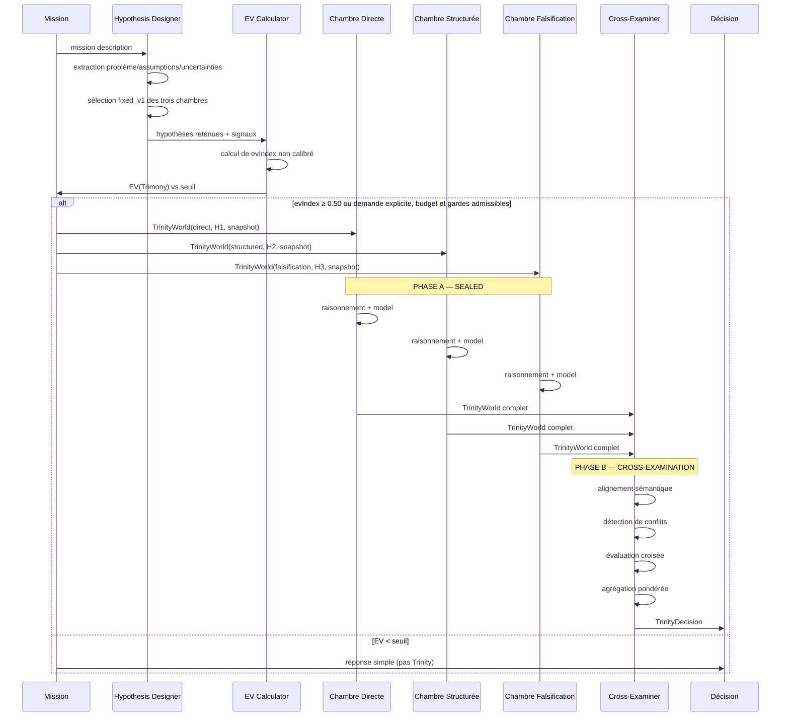
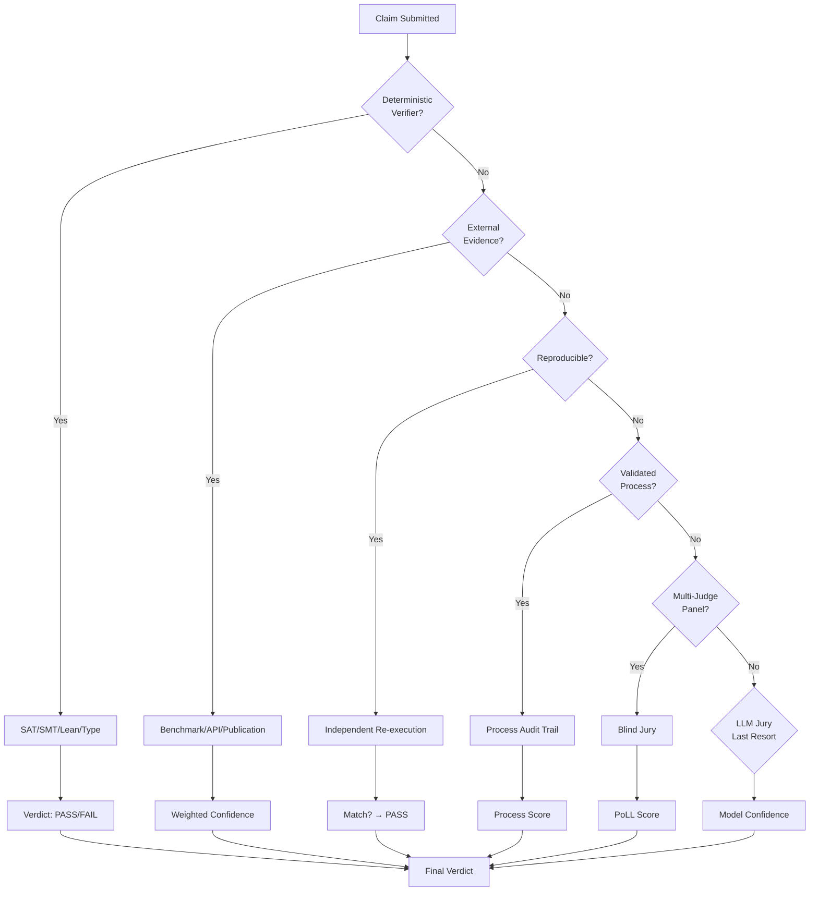

# Trinity — Laboratoire Scientifique Interne de GenOS

- **Statut** : Partiel ; le contrat opérationnel v1 décrit le runtime implémenté et ses limites. La génération autonome d'hypothèses, l'adaptation statistique et les variantes de recherche restent différées.
- **Portée v1** : exactement trois mondes logiciels indépendants, comparaison de leurs preuves, décision comparative et promotion d'un artefact candidat. Les variantes de recherche restent hors du runtime v1.
- **Dernière revue** : 2026-09-25

> *Trinity est le protocole expérimental de GenOS pour les situations où plusieurs hypothèses, méthodes ou conceptions plausibles doivent être testées indépendamment avant qu'une décision fiable puisse être prise.*

## Contrat opérationnel v1 — référence d'implémentation

Cette section décrit le comportement déterministe du runtime v1 et répond aux choix nécessaires pour interpréter les parties conceptuelles ci-dessous. Elle prévaut en cas de contradiction avec une formule, un exemple ou une variante de recherche ultérieurs. « Doit » désigne une exigence runtime. Un mécanisme explicitement reporté ne doit pas être présenté comme actif.

### Décisions de périmètre

| Question à trancher | Décision v1 |
|---|---|
| Combien de mondes une expérience contient-elle ? | Exactement trois : `direct`, `structured`, `falsification`. Une exécution avec moins ou plus de trois dossiers est invalide. |
| Les mondes peuvent-ils communiquer avant la comparaison ? | Non. Aucun canal ou dossier mutable partagé n'est fourni en phase scellée. Les dossiers ne sont lus qu'après la fin des trois tentatives ou leur échec définitif. |
| Les mondes partent-ils du même état ? | Oui. Ils reçoivent le même snapshot en lecture seule et des workspaces d'écriture distincts créés depuis ce snapshot. Si l'égalité des empreintes n'est pas vérifiable, le lancement échoue fermé. |
| Que signifie « modèles hétérogènes » ? | Une préférence de sélection, pas une garantie. En v1, la stratégie cognitive est obligatoirement distincte ; le fournisseur peut être identique. Toute diversité de fournisseur réellement obtenue est enregistrée, jamais supposée. |
| Le runtime calcule-t-il une probabilité EV calibrée ? | Non. V1 calcule un indice de valeur déterministe à partir des signaux fournis et le nomme `evIndex`, pas probabilité. Aucun poids ne peut être décrit comme appris/calibré sans jeu de données et preuve de calibration. |
| Que fait une demande explicite de Trinity ? | Elle demande le protocole mais ne contourne ni budget, ni isolation, ni garde de sécurité. Le runtime refuse avec un motif explicite si l'une de ces garanties manque. |
| Que fait le jury multi-modèle ? | Il est optionnel et ne s'exécute qu'après les vérificateurs déterministes et les preuves externes. Le runtime v1 n'a pas de dispatch de jury configuré : le résultat persiste donc `status: unavailable`, sans vote, et ne peut jamais remplacer les gardes déterministes. |
| Que signifie « promouvoir » ? | V1 promeut vers un artefact candidat versionné et vérifié dans GenOS. Cela ne déploie pas en production et ne modifie pas la branche de travail de l'utilisateur. |
| L'atomicité couvre-t-elle Git, fichiers et base dans une transaction ACID unique ? | Non. V1 utilise une promotion en deux phases avec candidat temporaire, commit/hash vérifiés, changement d'état final et compensation/rollback en cas d'échec. L'état `promoted` n'est écrit qu'en dernier. |

### Entrées et sortie du concepteur d'hypothèses

Le concepteur v1 est déterministe et n'invente pas de faits. Il prend la mission, les contraintes et le contexte autorisé en entrée. Il produit `centralProblem`, `assumptions[]`, `uncertainties[]`, `decisionVariables[]`, `selectedTriplet` et `selectionMethod`. Les listes restent vides si aucune donnée explicite ne permet de les identifier. Il n'émet pas de `utilityScore` ; l'optimisation de la fonction d'utilité reste reportée.

Un appelant peut fournir `trinityHypothesisDesign.candidateHypotheses`, jusqu'à douze objets `{ id?, chamber?, hypothesis|statement, sourceRefs?, assumptions?, predictions?, falsificationCriteria?, experiment?: { protocol, expectedOutcome } }`, et `sourceEvidence` comme liste d'identifiants ou d'objets `{ id }`. Il peut aussi fournir `claimGraph.trustedRelations: [{ from, to, type, sourceRefs }]` pour exprimer une relation au niveau de la mission. Une référence de source doit être `mission` ou correspondre à un identifiant fourni ; sinon la candidate est écartée. Le runtime normalise les candidats et supprime les textes ou identifiants dupliqués. Parmi les triplets admissibles, il préfère d'abord un protocole expérimental commun aux trois hypothèses dont les prédictions explicites ont le plus de résultats distincts (`discriminationScore = résultats distincts / 3`), puis maximise l'orthogonalité lexicale Jaccard ; il départage ensuite par falsifiabilité déclarée et par identifiants en ordre lexical. Une candidate étiquetée `chamber` ne peut remplir que cette chambre ; une candidate sans étiquette peut remplir n'importe quelle chambre. Les hypothèses sélectionnées sont ajoutées aux prompts et à la provenance persistée. Ces scores sont des heuristiques sur des prédictions déclarées : ils ne mesurent pas le pouvoir discriminant empirique, ne sont pas calibrés et ne démontrent pas une diversité sémantique. Si moins de trois candidates valides restent, le runtime garde les trois stratégies fixes et marque `selectionMethod: "fixed_v1"`. Cette interface sélectionne des candidates fournies ; elle ne prétend pas générer de nouvelles hypothèses à partir des faits.

Pour un triplet fourni, le runtime enregistre aussi `orthogonalityScore` (1 moins la similarité Jaccard moyenne des tokens, avec stopwords v1) et `falsifiabilityScore` (part des hypothèses ayant au moins une prédiction et un critère de réfutation explicites), ainsi que `scoringMethod`. Ce sont des heuristiques lexicales/descriptives non calibrées : elles ne choisissent pas le gagnant, ne prouvent pas la diversité sémantique et ne remplacent aucune vérification. Elles ne sont pas présentées comme générées par apprentissage.

Un `experimentDesign` est proposé uniquement si chacune des trois hypothèses fournit le même `experiment.protocol` et au moins deux `expectedOutcome` distincts. Le protocole et les prédictions par chambre sont persistés avec `status: "proposed"`, ajoutés au prompt propre à chaque chambre et liés à leurs références de source. Le runtime n'infère pas de protocole manquant, n'exécute pas ce plan avant le travail des mondes et ne le décrit pas comme optimal. La conception automatique par gain d'information reste différée.

Les trois stratégies v1 sont fixes :

| Chambre | Travail indépendant | Livrable minimal |
|---|---|---|
| `direct` | Répondre à la mission brute avec le minimum d'hypothèses ajoutées. | Artefact ou réponse, critères satisfaits, preuves disponibles et incertitudes. |
| `structured` | Construire un plan explicite depuis les contraintes et critères, puis produire la solution. | Plan, artefact ou réponse, vérifications et preuves. |
| `falsification` | Construire sa propre solution ou analyse, puis rechercher activement les contre-exemples et corriger les défauts établis. Elle ne reçoit pas les sorties des deux autres pendant la phase scellée. | Artefact ou réponse, tentatives de réfutation, résultats reproductibles et incertitudes restantes. |

L'adaptation du gabarit au domaine ne change pas l'identité de la chambre. Les prompts effectifs et leur version sont conservés dans la provenance.

### Règle d'engagement et budgets

Les signaux EV acceptés sont normalisés dans `[0,1]` : `hypothesisCount = min(nombre de pistes plausibles, 3) / 3`, `domainUncertainty`, `errorCost`, `irreversibility`, `oracleAvailability`, `errorCorrelation` et `budgetRatio = tokens prévus pour Trinity / tokens alloués à Trinity`. Si le budget alloué vaut zéro, le lancement est refusé avant le calcul. `errorCost` utilise l'échelle de politique versionnée : 0 aucun coût, 0,25 faible, 0,50 modéré, 0,75 élevé, 1 critique. `irreversibility` est fourni directement selon cette échelle (0 réversible, 1 irréversible). `domainUncertainty` vaut le nombre d'assumptions et variables de décision non résolues, plafonné à trois puis divisé par trois. `oracleAvailability` vaut 0 sans vérificateur, 0,5 avec revue non déterministe seulement, 1 avec au moins un vérificateur déterministe ou une source de vérité externe. `errorCorrelation` provient de résultats comparables historiques ; faute de données, v1 utilise le prior neutre versionné `0.50` et l'enregistre avec `correlationSource: "policy_prior"`, sans prétendre qu'il est appris.

V1 calcule `evIndex = clamp01(0.20·hypothesisCount + 0.15·domainUncertainty + 0.20·errorCost + 0.15·irreversibility + 0.15·oracleAvailability + 0.10·(1-errorCorrelation) - 0.15·budgetRatio)`. Ces coefficients sont des paramètres de politique versionnés, pas un modèle probabiliste. Les poids, entrées et résultat sont enregistrés.

Le lancement automatique est autorisé lorsque `evIndex >= 0.50`, `budgetRatio <= 1`, et le budget disponible couvre trois allocations minimales configurées. Une demande explicite peut ignorer le seuil `evIndex`, mais pas les limites de budget, de sécurité ou d'isolation. Si un signal obligatoire autre que `errorCorrelation` est inconnu, l'engagement automatique est refusé avec `insufficient_inputs`; l'appel explicite peut continuer et consigne les inconnues.

Le budget total est réparti également entre les trois chambres après réservation du budget orchestrateur. Aucun worker ne peut dépasser son budget en empruntant à un autre. À épuisement, le monde termine avec `budget_exhausted`; il n'y a pas de réallocation en v1. La limite de durée est appliquée par expérience et par monde.

### Contrat de preuve et comparaison

Chaque monde rapporte les dix dimensions de l'Evidence Vector documentées en Partie 2, ainsi que les mesures brutes et références aux preuves. Une dimension non mesurable vaut `null`, jamais zéro ni un. Les seuils d'élimination ne s'appliquent qu'aux dimensions mesurées ; toute contrainte dure de mission non satisfaite élimine le monde. Les seuils de l'Appendice B sont les valeurs par défaut v1 et peuvent être resserrés par mission, jamais relâchés sous les planchers de sécurité.

Les valeurs v1 sont orientées ainsi : correctness ≥ 0,70 ; coverage ≥ 0,60 ; robustness ≥ 0,50 ; reproducibility ≥ 0,80 ; novelty ≥ 0 ; risk ≤ 0,30 ; uncertainty ≤ 0,50 ; constraint coverage ≥ 0,90. Cost doit rester dans le budget et latency dans le SLA. Les seuils cibles de l'Appendice B sont des objectifs, pas des conditions obligatoires de promotion. Si une dimension requise par le profil de vérification est inconnue, le résultat est `ESCALATE_EXPERIMENT` ; une dimension optionnelle inconnue ne sert pas au classement.

Une mission peut fournir `trinityDimensionThresholds` pour resserrer les seuils v1. Le runtime ignore toute valeur qui les relâcherait ; les seuils effectivement appliqués sont persistés dans `evidenceVectorDecision.thresholds`.

Le statut `budgetStatus: "within"` atteste le respect du budget de coût. Si un `maxLatencyMs` est configuré, chaque monde doit fournir `latencyMs` et des références valides dans `evidenceVectorEvidence.latency`; l'absence de mesure ou une valeur supérieure au SLA élimine ce monde.

Règles d'agrégation, dans cet ordre :

1. Rejeter les dossiers invalides, incomplets ou sans preuve de provenance.
2. Éliminer les mondes échouant une contrainte dure ou un plancher mesurable.
3. Calculer le front de Pareto sur correctness, coverage, robustness, reproducibility, novelty, cost, latency, risk, uncertainty et constraint coverage, en utilisant le même ensemble de dimensions mesurées pour tous les candidats comparés. Les dimensions de coût, latence, risque et incertitude sont minimisées ; les autres sont maximisées.
4. S'il reste un seul monde, retourner `PROMOTE_WORLD` uniquement après passage des vérificateurs requis.
5. Si plusieurs mondes non dominés ont des claims liés entre eux par une arête mission `supports`, `verifies` ou `complements`, que chaque claim a des références d'évidence valides et un reçu indépendant de vérification dans son monde d'origine, et qu'aucun lien `contradicts` ne concerne la frontière, retourner `SYNTHESIZE_CLAIMS`. Cela produit une décision et des claims persistés, pas un artefact composite promu.
6. Si plusieurs mondes non dominés restent et que ces conditions de synthèse ne sont pas réunies, retourner `KEEP_PARETO_SET`.
7. Si aucun monde ne passe les gardes ou si des preuves requises manquent, retourner `ESCALATE_EXPERIMENT`.

Une égalité de score scalaire ne départage jamais les mondes. Un juge ne peut pas annuler un échec de test, une contradiction avec une preuve externe ou un échec de contrainte dure.

### Fusion des revendications

Chaque revendication possède un identifiant stable, un énoncé, une provenance vers le monde, une liste de preuves, un niveau de vérification, une confiance rapportée et des relations typées (`supports`, `contradicts`, `verifies`, `complements`). La confiance déclarée par un modèle n'est pas une preuve.

Après les dossiers terminaux, le runtime construit un `claimGraph` depuis les claims substantiels des trois rapports. Les IDs absents reçoivent un identifiant déterministe lié au monde et à l'énoncé. Les relations déclarées par les workers sont conservées comme arêtes `proposed` ; elles ne deviennent jamais fiables par leur seule déclaration. Les relations mission `trustedRelations` sont admises comme `mission_asserted` seulement si les deux extrémités sont des claims existants, substantiels, et si les références fournies existent dans les preuves des deux claims. Le résumé du graphe est persisté avec la décision.

Quand plusieurs mondes non dominés restent, `SYNTHESIZE_CLAIMS` est retourné si les claims reliés par `supports`, `verifies` ou `complements` possèdent chacun des références d'évidence valides et un reçu de vérification déterministe indépendant obtenu dans leur monde d'origine, et qu'aucune arête `contradicts` n'unit ces claims sur la frontière. Les claims synthétisés et le graphe sont persistés avec leurs reçus. Ce contrôle ne vérifie pas un artefact composite : faute d'assembleur de workspace synthétique en v1, `promotion` reste refusée avec `synthesized_claims_require_artifact_assembly`. Toute future promotion devra assembler puis revérifier le candidat composite.

Une revendication n'entre dans la synthèse que si elle est substantielle, que chacune de ses références figure dans les preuves de son rapport, qu'elle possède un reçu de vérification déterministe indépendant et qu'elle est liée au graphe par une relation mission admise. Les relations déclarées par les workers restent proposées ; elles ne suffisent pas à établir un lien de synthèse. Toute contradiction observée entre les claims de la frontière bloque la synthèse, qui reste alors au niveau `KEEP_PARETO_SET` jusqu'à résolution.

### Cycle de vie, échec et reprise

Les états d'expérience sont `designed → sealed_running → sealed_complete → cross_examining → decided → promotion_preparing → promoted`. Pendant `cross_examining`, les commandes configurées pour les claims sont rejouées par le vérificateur AEIS indépendant sur une copie isolée de chaque workspace terminal. Les reçus, échecs et plans manquants sont résumés dans `crossExamination` du dossier de décision. Cette étape ne fait pas de critique sémantique entre modèles ; la promotion réexécute les contrôles du gagnant après création du candidat. Les sorties terminales alternatives sont `rejected`, `escalated` et `promotion_failed`. Chaque transition est enregistrée avec horodatage, acteur, motif et référence de preuve. Une reprise est idempotente : elle ne relance pas un monde déjà terminé avec un dossier valide. Une transition partielle ne peut pas rendre un gagnant promu.

À la création, `design.historicalMemory` conserve un résumé descriptif des vingt dernières expériences terminales du même domaine (`sampleSize`, `outcomeCounts`). Il est figé avec le design pour rendre le contexte historique inspectable et ne modifie ni les hypothèses, ni les seuils, ni le budget. Ce résumé ne constitue pas un apprentissage adaptatif : les poids, stratégies et choix de vérificateurs ne sont pas ajustés automatiquement.

Si un monde échoue, son dossier d'échec est conservé. L'expérience ne passe pas à la décision tant que les trois mondes n'ont pas un résultat terminal. L'absence de preuve sur l'un des trois mène à `ESCALATE_EXPERIMENT`; elle ne réduit pas silencieusement le nombre de mondes.

La promotion prépare un candidat distinct depuis le workspace isolé du monde gagnant. Son workspace est marqué `trinity_candidate` et `quarantined` jusqu'à la réussite des contrôles ; un candidat dont la préparation échoue est nettoyé. Les vérifications d'intégration configurées par identifiants de commandes découverts sont exécutées sur ce candidat. Pour chaque revendication retenue, l'appelant fournit `claimVerificationChecks: [{ claim, commandIds }]`, avec `claim` égal à son `id` ou à son `statement`, et des commandes directement pertinentes pour cette revendication. Chaque commande est rejouée dans une copie isolée du candidat par le bridge de vérification AEIS. La promotion exige un reçu HMAC valide, signé par un vérificateur de confiance, indépendant du producteur et lié au hash du candidat, à la revendication et à la commande. Le reçu et le digest du vérificateur sont persistés. Cette preuve indépendante établit l'exécution déterministe du contrôle ; elle ne remplace pas une revue sémantique indépendante de la revendication. Une revendication sans plan, une commande indisponible, un secret de signature absent ou un résultat sans reçu valide bloque la promotion. Chaque reçu de contrôle persiste aussi la commande, le code de sortie, le signal, la durée et les SHA-256 des sorties capturées (limitées à 16 Ko). Sans commande d'intégration configurée, la promotion échoue fermé. Le hash du candidat est recalculé après les contrôles. AgentGit reçoit une référence `trinity/<experimentId>` dont les métadonnées lient le hash du contenu et les reçus de vérification ; son hash d'état n'est pas le hash des fichiers du workspace. Après vérification de la signature AgentGit, les tags et la décision persistée passent à `promoted` dans la transaction finale, la transition d'expérience étant sa dernière écriture. Tout échec enregistre `promotion_failed`, conserve le candidat marqué `quarantined` pour inspection et ne modifie pas le workspace source.

### Portée explicitement reportée

V1 n'implémente pas le dispatch d'un jury multi-modèle, Trinity-Factorial, Trinity-Recursive, l'adaptation du nombre de replicas en cours de run, l'apprentissage des poids, l'estimation statistique de corrélation d'erreurs, les solveurs formels non présents dans le runtime, ni une garantie de diversité des fournisseurs. Ces propositions restent des variantes de recherche ; elles ne sont pas des critères d'acceptation du runtime v1.

## 1. Définition

**Trinity** est le protocole expérimental de GenOS pour les situations où plusieurs hypothèses, méthodes ou conceptions plausibles doivent être testées indépendamment avant qu'une décision fiable puisse être prise.

Contrairement à un simple passage multi-essai, Trinity structure l'espace des possibles en **trois chambres épistémiques** distinctes, chacune portant un rapport différent à la vérité :
- Une chambre **directe** (rapide, heuristique)
- Une chambre **structurée** (modèle formel, chaîne de raisonnement)
- Une chambre **adversariale** (falsification, recherche de contre-exemples)

Chaque chambre produit un monde d'expérimentation scellé, indépendant, traçable. La décision finale agrège leurs résultats selon un calcul explicite de valeur d'information.

## 2. Comparaison conceptuelle

### Tableau comparatif

| Paradigme | Mécanisme principal | Diversité cognitive | Garantie de sortie | Coût relatif |
|-----------|---------------------|---------------------|--------------------|--------------|
| **Best-of-N** | Générations parallèles, sélection par score | Faible (même prompt, même cadre) | Meilleur des N, mais biais partagé | N × coût unitaire |
| **Self-consistency** | Majorité/consensus sur sorties multiples | Très faible (même chambre, même biais) | Stabilité apparente, pas justesse | N × coût unitaire |
| **Débat** | Dialogue itératif agent↔agent | Modérée (perspectives en interaction) | Argument le plus convaincant, mais convergence précoce possible | Itérations × 2 × coût |
| **Trinity** | Trois chambres aux épistémies **orthogonales** | Élevée (chambre indépendante, pas de communication) | Agrégation pondérée par valeur d'information | 3 × coût (constant, maîtrisé) |

### Explication

Best-of-N suppose que la réponse correcte apparaîtra statistiquement dans l'échantillon — vrai seulement si le générateur couvre l'espace des solutions, ce qui n'est pas garanti. Self-consistency amplifie ce biais : le consensus mesure l'accord entre copies, pas la vérité. Le Débat introduit de la divergence par l'interaction, mais crée une pression de convergence sociale (le plus persuasif ne raisonne pas forcément le mieux).

Trinity **ne dialogue pas**. Chaque chambre travaille sur le même problème sans connaître les autres. L'indépendance est contractuelle et vérifiable. La divergence est donc structurelle, pas accidentelle — c'est ce qui lui permet de détecter des erreurs que les autres paradigmes ratent systématiquement (biais partagés, erreurs de modèle partillées, aveuglements communs).

## 3. Les trois chambres épistémiques

### 3.1 Chambre Directe / Parsimonieuse

**Principe :** Produire la réponse la plus naturelle, la plus économique en raisonnement. « Qu'est-ce qu'un expert compétent répondrait intuitivement ? »

**Force :** Rapidité. Représentativité du jugement typique. Base de comparaison.

**Modèles :** Modèles « généraux », prompts courts, chaîne de pensée minimale mais complète.

**Hypothèse sous-jacente :** Pour les problèmes bien posés, l'intuition experte est calibrée — la première réponse correcte vaut souvent les suivantes.

**Risque :** Illusion de familiarité. Pattern-matching superficiel. Confirmation du cadre existant.

### 3.2 Chambre Structurée / Model-Based

**Principe :** Construire un modèle explicite du problème (formel ou semi-formel), le parcourir méthodiquement, produire une déduction.

**Force :** Vérifiabilité pas-à-pas. Explicabilité. Robustesse sur les problèmes compositionnels.

**Modèles :** Modèles « raisonnement », outils formels (preuve, calcul, simulation), structuration en hypothèses → déduction → conclusion.

**Hypothèse sous-jacente :** L'erreur vient souvent de raisonnements incomplets ou sautés — un modèle explicite force la complétude locale.

**Risque :** Surconfiance dans le modèle. Erreur de modélisation non détectée. Lourdeur computationnelle.

### 3.3 Chambre Falsification / Adversarial

**Principe :** Chercher activement à réfuter les conclusions des deux autres chambres. « Qu'est-ce qui pourrait faire échouer cette réponse ? Quel contre-exemple existe ? »

**Force :** Détection des erreurs partagées. Test des limites. Résistance au biais de confirmation.

**Modèles :** Modèles « critiques », prompts adversariaux, génération de contre-exemples, test de robustesse.

**Hypothèse sous-jacente :** La vérité résiste mieux à la réfutation que l'erreur — la falsification est asymétriquement informative.

**Risque :** Skepticisme excessif. Coût de la recherche de contre-exemples inexistants. Découragement de réponses correctes mais fragiles.

## 4. Le Hypothesis Designer

Les optimisations et composantes informationnelles de cette section sont des objectifs de recherche. Le runtime v1 utilise le concepteur déterministe et les trois rôles définis dans le contrat opérationnel en tête de document ; il ne prétend pas mesurer l'information mutuelle ni maximiser exactement la fonction ci-dessous.

Avant toute exécution, Trinity passe par un **Hypothesis Designer** qui extrait et structure le problème.

### 4.1 Extraction

À partir de la mission, le Hypothesis Designer produit :

- **Problème central** : formulation en une phrase, sans ambiguïté de portée
- **Assumptions** : liste explicite des présupposés (chaque assumption est une proposition testable)
- **Uncertainties** : variables dont la valeur réelle est inconnue (classifiées par impact et réversibilité)
- **Decision variables** : choix discrets ou continus que la décision finale doit fixer

### 4.2 Fonction d'utilité inter-hypothèses

Pour trois hypothèses candidates $H_1, H_2, H_3$, Trinity évalue leur couverture conjointe via la fonction d'utilité :

$$
U(H_1, H_2, H_3) = \underbrace{C(H_1, H_2, H_3)}_{\text{coverage}} \;+\; \underbrace{O(H_1, H_2, H_3)}_{\text{orthogonality}} \;+\; \underbrace{F(H_1, H_2, H_3)}_{\text{falsifiability}} \;-\; \underbrace{R(H_1, H_2, H_3)}_{\text{redundancy}} \;-\; \underbrace{C_{\text{computational}}(H_1, H_2, H_3)}_{\text{cost}}
$$

Où chaque composante est définie comme suit :

**Coverage** (étendue de l'espace des solutions couvert) :
$$
C(H_1, H_2, H_3) = \frac{|\mathcal{S}(H_1) \cup \mathcal{S}(H_2) \cup \mathcal{S}(H_3)|}{|\mathcal{S}_{\text{possible}}|}}
$$

**Orthogonalité** (dépendance minimale entre hypothèses) :
$$
O(H_1, H_2, H_3) = 1 - \frac{1}{3}\sum_{i < j} \text{Jaccard}\big(\mathcal{B}(H_i), \mathcal{B}(H_j)\big)
$$

avec $\mathcal{B}(H)$ l'ensemble des croyances/axiomes mobilisés par l'hypothèse $H$.

**Falsifiabilité** (capacité de chaque hypothèse à être réfutée) :
$$
F(H_1, H_2, H_3) = \min_{i \in \{1,2,3\}} \; \mathbb{P}\big(\text{observer un contre-exemple} \mid H_i \text{ fausse}\big)
$$

**Redondance** (information partagée, pénalité) :
$$
R(H_1, H_2, H_3) = \sum_{i < j} I(H_i ; H_j)
$$

où $I(H_i ; H_j)$ est l'information mutuelle entre les distributions de sortie de $H_i$ et $H_j$.

**Coût** (ressources requises) :
$$
C_{\text{computational}}(H_1, H_2, H_3) = \alpha \cdot \sum_{i=1}^{3} \text{tokenBudget}(H_i) + \beta \cdot \max_i \text{latency}(H_i)
$$

### 4.3 Sélection des trois hypothèses

Le Hypothesis Designer sélectionne le triplet $(H_1^*, H_2^*, H_3^*)$ qui maximise $U$ sous contraintes :

$$
(H_1^*, H_2^*, H_3^*) = \underset{(H_1, H_2, H_3) \in \mathcal{H}^3}{\arg\max} \; U(H_1, H_2, H_3)
$$

$$
\text{s.c.} \quad \forall i \neq j : O(H_i, H_j) \geq \theta_{\text{orth}} \quad \text{et} \quad \sum_{i} \text{cost}(H_i) \leq B_{\text{total}}
$$

## 5. Calcul de l'espérance de valeur EV(Trinity)

Les équations de cette section décrivent le modèle conceptuel. Pour le runtime v1, appliquer exclusivement l'indice `evIndex`, ses signaux normalisés, son seuil et les règles d'inconnues du contrat opérationnel. `evIndex` n'est pas une probabilité estimée.

Trinity n'est pas exécutée pour toute mission. Le **Expected Value** du protocole est calculé avant engagement :

$$
\text{EV}(\text{Trinity}) = \underbrace{P_{\text{useful}}}_{\text{alt. utile existe}} \times \underbrace{I}_{\text{impact}} \times \underbrace{V}_{\text{verifiability}} \;-\; \underbrace{C_{\text{compute}}}_{\text{coût d'exécution}}
$$

### 5.1 Signaux composant $P_{\text{useful}}$

$P_{\text{useful}}$ est la probabilité qu'une alternative meilleure existe. Elle est estimée par combinaison des signaux :

$$
P_{\text{useful}} = \sigma\!\left( w_1 \cdot \underbrace{N_{\text{plausible}}}_{\text{hypothèses plausibles}} + w_2 \cdot \underbrace{U_{\text{domain}}}_{\text{incertitude}} + w_3 \cdot \underbrace{C_{\text{wrong}}}_{\text{coût erreur}} + w_4 \cdot \underbrace{(1 - R_{\text{rev}})}_{\text{irréversibilité}} + w_5 \cdot \underbrace{A_{\text{oracle}}}_{\text{oracles disponibles}} - w_6 \cdot \underbrace{\rho_{\text{err}}}_{\text{corrélation erreurs}} - w_7 \cdot \underbrace{(1 - B_{\text{ratio}})}_{\text{budget ratio}} \right)
$$

où $\sigma(x) = \frac{1}{1 + e^{-x}}$ est la fonction logistique, et les poids $w_i$ sont calibrés par méta-apprentissage sur les expériences passées.

### 5.2 Décomposition des signaux

| Signal | Symbole | Nature | Effet sur $P_{\text{useful}}$ |
|--------|---------|--------|-------------------------------|
| Nombre d'hypothèses plausibles | $N_{\text{plausible}}$ | Compteur ($\geq 3$) | Plus il y a de candidates, plus une alternative meilleure est probable |
| Incertitude du domaine | $U_{\text{domain}}$ | Entropie subjective $[0,1]$ | Plus le domaine est incertain, plus un simple passage rate |
| Coût d'une mauvaise décision | $C_{\text{wrong}}$ | Monétaire/temporel | Plus l'erreur coûte cher, plus explorer est rationnel |
| Réversibilité | $R_{\text{rev}}$ | Probabilité $[0,1]$ | Si l'erreur est réversible, Trinity est moins nécessaire |
| Disponibilité d'oracles | $A_{\text{oracle}}$ | Booléen pondéré | Un oracle (test, simulation, humain) augmente la valeur de l'expérience |
| Corrélation probable des erreurs | $\rho_{\text{err}}$ | Coefficient $[-1,1]$ | Si les chambres risquent de se tromper ensemble, Trinity perd en valeur |
| Ratio budget | $B_{\text{ratio}} = \frac{C_{\text{compute}}}{B_{\text{total}}}$ | Fraction $[0,1]$ | Si le coût excède le budget, le protocole est non-viable |

### 5.3 Impact $I$

$$
I = \mathbb{E}\big[ \text{gain qualité} \mid \text{meilleure alternative trouvée} \big] \times \text{proba de la choisir}
$$

Modélisé comme la différence espérée entre la qualité de la réponse « simple » et la qualité de la réponse Trinity :

$$
I = Q_{\text{baseline}} \cdot \left( \frac{Q_{\text{trinity}}}{Q_{\text{baseline}}} - 1 \right)
$$

### 5.4 Vérifiabilité $V$

$$
V = \mathbb{P}\big( \text{identifier correctement la meilleure chambre} \mid \text{réponses produites} \big)
$$

Dépend de la disponibilité d'oracles externes (tests unitaires, simulations, juges humains, métriques objectives).

### 5.5 Coût $C_{\text{compute}}$

$$
C_{\text{compute}} = \sum_{c \in \{\text{direct, structured, falsification}\}} \big( \text{tokenBudget}_c \times \text{unitCost}_{\text{token}} + \text{latency}_c \times \text{unitCost}_{\text{time}} \big)
$$

### 5.6 Condition d'engagement

Trinity est engagée si et seulement si :

$$
\text{EV}(\text{Trinity}) > \tau_{\text{engagement}} \quad \text{et} \quad B_{\text{ratio}} \leq 1
$$

où $\tau_{\text{engagement}}$ est un seuil calibré selon la politique de risque de l'organisation.

## 6. Contrat TrinityExperiment

Le contrat d'expérience Trinity définit l'ensemble des paramètres qui gouvernent un run complet :

```typescript
interface TrinityExperiment {
  // Identité
  experimentId: string;           // UUID v7
  missionId: string;              // Référence à la mission parente
  missionSnapshotHash: string;    // SHA-256 de l'état de mission au moment du lancement

  // Classification
  domain: DomainLabel;            // e.g., "architecture", "algorithm", "design"
  variant: TrinityVariant;        // e.g., "standard", "compressed", "extended"

  // Design
  hypothesisDesign: {
    centralProblem: string;
    assumptions: Assumption[];
    uncertainties: Uncertainty[];
    decisionVariables: DecisionVariable[];
    candidateHypotheses: Hypothesis[];
    selectedTriplet: [Hypothesis, Hypothesis, Hypothesis];
    selectionMethod: "fixed_v1" | "utility_optimized";
    utilityScore: number | null;
  };

  // Chambres
  chambers: [ChamberConfig, ChamberConfig, ChamberConfig];

  // Variables expérimentales
  controlledVariables: Record<string, unknown>;  // Fixées identiques pour les 3 chambres
  independentVariables: Record<string, ChamberId, unknown>;  // Propres à chaque chambre

  // Politiques
  isolationPolicy: {
    sharedMemory: "none" | "read-only-snapshot";
    communication: "forbidden" | "structured-only";
    provenanceTracking: "full" | "hashes-only";
    randomSeedPerChamber: boolean;
  };
  budgetPolicy: {
    totalTokens: number;
    perChamberTokens: [number, number, number];
    maxLatencyMs: number;
    overflowBehavior: "truncate" | "escalate" | "reject";
  };
  verifierPolicy: {
    oracleType: "test" | "simulation" | "human" | "metric" | "none";
    votingRule: "majority" | "weighted" | "ev-based" | "falsification-priority";
    tieBreaker: "falsification-wins" | "structured-wins" | "human-judge";
  };

  // État
  status: "designed" | "sealed_running" | "sealed_complete" | "cross_examining" | "decided" | "promotion_preparing" | "promoted" | "rejected" | "escalated" | "promotion_failed";
  decision: TrinityDecision | null;
}
```

## 7. Contrat TrinityWorld

Chaque chambre produit un **TrinityWorld** — l'enregistrement complet du raisonnement et des artefacts d'une chambre :

```typescript
interface TrinityWorld {
  // Identité
  worldId: string;                // UUID v7
  chamber: "direct" | "structured" | "falsification";
  hypothesis: Hypothesis;         // L'hypothèse assignée à cette chambre

  // État épistémique
  assumptions: Assumption[];      // Hypothèses de travail explicites
  falsificationCriteria: FalsificationCriteria;  // Conditions de réfutabilité
  model: ModelArtifact;           // Le modèle construit (formel, code, graphe...)

  // Configuration d'exécution
  provider: ProviderConfig;       // Modèle, paramètres, endpoint
  cognitiveRecipe: CognitiveRecipe; // Prompt template, chaîne d'outils mentale
  toolchain: Tool[];              // Outils disponibles (calcul, recherche, preuve...)

  // Politiques de connaissance
  retrievalPolicy: {
    type: "none" | "structured" | "rag";
    allowedSources: string[];
    maxRetrievalTokens: number;
  };

  // Aléatoire maîtrisé
  randomSeed: number | null;      // Seed fourni et effectivement appliqué, sinon null
  tokenBudget: number;            // Budget maximal de tokens

  // Provenance & reproductibilité
  workspaceSnapshot: string;      // Hash de l'état initial du workspace
  initialCommit: string | null;   // Commit git initial si le workspace est un dépôt
  finalCommit: string | null;     // Commit git final si la chambre en a produit un

  // Sorties
  evidenceDossier: EvidenceDossier;  // Toutes les preuves collectées
  claimGraph: ClaimGraph;            // Graphe des revendications → inférences
}
```

Le `ClaimGraph` est un DAG orienté :

$$
G = (V, E), \quad V = \{c_1, \ldots, c_n\} \text{ (revendications)}, \quad E = \{(c_i, c_j) \mid c_i \text{ soutient } c_j\}
$$

Chaque nœud $c_i$ porte un **confidence score** $s_i \in [0,1]$ et une **traçabilité** vers la source de l'évidence.

## 8. Phases d'exécution

### Phase A — SEALED (Scellée)

Chaque chambre travaille **isolément** sur le même problème, avec sa propre épistémie et son propre modèle. Aucune communication. Aucune lecture des sorties des autres. Les sorties ne sont révélées qu'à la fin de la phase.

**Objectif :** Maximiser la divergence des approches (indépendance cognitive).

**Livrables par chambre :**
- Un `TrinityWorld` complet
- Un ensemble de revendications avec confidences
- Un dossier de preuves
- Un modèle/raisonnement explicite

### Phase B — CROSS-EXAMINATION (Examen croisé)

Les trois `TrinityWorld` sont révélés simultanément. Le système procède à :

1. **Alignement sémantique** : identifier les revendications équivalentes entre chambres
2. **Conflit detection** : repérer les revendications contradictoires
3. **Robustesse evaluation** : chaque revendication est notée par les autres chambres (la directe évalue la falsification, etc.)
4. **Agrégation** : application de la règle de vote pondérée par $V$ et l'EV calculée

### Schéma de séquence Mermaid

Le diagramme illustre le flux cible. En v1, l'optimisation $U$ et l'EV probabiliste sont remplacées par la sélection `fixed_v1` et l'indice `evIndex` définis dans le contrat opérationnel.



## 9. Critères d'indépendance explicites

L'indépendance des chambres n'est pas une promesse — c'est un ensemble de propriétés **vérifiables** enregistrées dans `isolationPolicy` et contrôlées à l'exécution.

### 9.1 Same Snapshot (même état de départ)

Les trois chambres reçoivent **exactement le même état initial** : même commit git, mêmes fichiers, mêmes variables contrôlées. Aucune chambre ne part d'un état privilégié ou antérieur.

$$
\forall c_i, c_j : \quad \text{workspaceSnapshot}_i = \text{workspaceSnapshot}_j
$$

### 9.2 No Communication (aucune communication)

Pendant la Phase A, il est **structurellement impossible** pour une chambre de lire ou écrire dans l'espace d'une autre. Pas de canal de message, pas de fichier partagé mutable, pas d'appel de service croisé.

$$
\forall t \in \text{Phase A}, \; \forall c_i \neq c_j : \quad \text{messages}(c_i, c_j, t) = \emptyset
$$

### 9.3 No Shared Writable Memory (pas de mémoire partagée modifiable)

Le workspace est **cloné** par chambre. Chacune écrit dans son propre espace. Les artefacts ne deviennent partagés qu'au moment du Cross-Examination (Phase B), en lecture seule.

$$
\forall c_i : \quad \text{writeSet}(c_i) \cap \text{writeSet}(c_j) = \emptyset, \quad i \neq j
$$

### 9.4 Provenance Tracking (traçabilité complète)

Chaque revendication, chaque donnée, chaque paramètre est tracé jusqu'à sa source. Le `ClaimGraph` et le `evidenceDossier` de chaque `TrinityWorld` permettent de reconstruire **pourquoi** chaque conclusion a été atteinte.

$$
\forall \text{claim } c \in \text{ClaimGraph} : \quad \text{provenance}(c) \in \text{EvidenceDossier}
$$

### 9.5 Recorded Randomness (aléatoire enregistré)

V1 enregistre le seed demandé et indique s'il a été effectivement accepté par le fournisseur et les outils. Si un composant ne permet pas de fixer le seed, `randomSeed` vaut `null` pour ce composant et la reproductibilité de la sortie est mesurée comme partielle ; le système ne promet pas une reproduction exacte.

$$
\forall c_i : \quad \text{seedApplied}_i \in \{\text{true}, \text{false}\} \land \text{seed provenance enregistrée}
$$

Cela permet d'indiquer précisément la portée de reproduction obtenue, et de mesurer la reproductibilité par réexécution lorsque l'environnement le permet. L'analyse de sensibilité et la détection d'une réussite due au hasard restent hors de v1.

## 10. Résumé opérationnel

La cible opérationnelle v1 suit quatre étapes :

1. **Hypothesis Designer** → structure le problème et applique le triplet fixe direct, structuré, falsification
2. **EV Calculator** → calcule l'indice `evIndex` non calibré et vérifie les budgets
3. **Phase A (Sealed)** → trois chambres indépendantes produisent des `TrinityWorld`
4. **Phase B (Cross-Examination)** → alignement, conflit, agrégation → décision finale

Chaque étape cible est traçable et auditable. La reproductibilité est mesurée et limitée aux composants capables d'appliquer un seed. Le statut « Partiel » en tête de document reflète que ce contrat n'est pas encore entièrement câblé.

*Prochaine partie : Trinity — Implémentation & Runtime (Partie 2)*

# Trinity Topology — Part 2: Scoring, Claim Graph, Merge & Verification

> **Scope:** This part details the decision plane. The operational v1 contract at the start of this file is authoritative where this part conflicts with it. Equations that require unavailable calibration data or verifier integrations describe research targets, not implemented runtime behavior.

## 1. Evidence Vector

Each candidate world $W_i$ produces an **evidence vector** $\mathbf{E}_i$ that captures ten orthogonal dimensions of quality. The vector is the atomic unit of comparison. The operational v1 contract above defines how missing dimensions, threshold direction, and Pareto decisions are handled.

### 1.1 Definition

$$
\mathbf{E}_i = \langle c, \, r, \, b, \, p, \, n, \, k, \, \ell, \, \sigma, \, u, \, \gamma \rangle
$$

| Symbol | Dimension | Range | Description |
|--------|-----------|-------|-------------|
| $c$ | Correctness | $[0, 1]$ | Fraction of acceptance criteria satisfied |
| $r$ | Coverage | $[0, 1]$ | Fraction of the specification surface exercised |
| $b$ | Robustness | $[0, 1]$ | Resistance to adversarial or edge-case inputs |
| $p$ | Reproducibility | $[0, 1]$ | Probability of identical output on re-execution |
| $n$ | Novelty | $[0, 1]$ | Degree of non-trivial innovation beyond the baseline |
| $k$ | Cost | $\mathbb{R}_{\geq 0}$ | Total resource expenditure (compute, tokens, time) |
| $\ell$ | Latency | $\mathbb{R}_{\geq 0}$ | Wall-clock time to produce the artifact (ms) |
| $\sigma$ | Risk | $[0, 1]$ | Probability of catastrophic failure in production |
| $u$ | Uncertainty | $[0, 1]$ | Epistemic uncertainty of the evidence itself |
| $\gamma$ | Constraint Coverage | $[0, 1]$ | Fraction of hard constraints satisfied |

### 1.2 Per-Dimension Thresholds

Quality dimensions have a hard floor $\theta_{\min}$; risk and uncertainty instead have hard ceilings. Cost and latency are bounded by budget and SLA. The operational v1 contract at the start of this document defines the direction for each dimension.

$$
\begin{aligned}
\theta_{\min} &= \langle 0.70, \, 0.60, \, 0.50, \, 0.80, \, 0.00, \, \infty, \, \infty, \, -, \, -, \, 0.90 \rangle \\
\theta_{\max} &= \langle -, \, -, \, -, \, -, \, -, \, \text{budget}, \, \text{SLA}, \, 0.30, \, 0.50, \, - \rangle \\
\theta_{\star} &= \langle 0.95, \, 0.90, \, 0.85, \, 0.95, \, 0.40, \, \text{budget}, \, \text{SLA}, \, 0.05, \, 0.10, \, 1.00 \rangle
\end{aligned}
$$

**Elimination rule:**

$$
\text{eliminate}(W_i) \iff \exists d \in \text{required dims} : \begin{cases} \mathbf{E}_i[d] < \theta_{\min}[d] & d \text{ is a quality floor} \\ \mathbf{E}_i[d] > \theta_{\max}[d] & d \in \{\text{risk, uncertainty}\} \\ \mathbf{E}_i[d] > \text{budget/SLA}[d] & d \in \{\text{cost, latency}\} \end{cases}
$$

Dimensions $k$ (cost) and $\ell$ (latency) are treated as **budget-constrained** rather than threshold-gated: they enter the Pareto frontier but do not trigger automatic elimination unless they exceed the mission budget.

### 1.3 Uncertainty Propagation

The uncertainty dimension $u$ modulates confidence in all other dimensions. For any dimension $d$, the **confidence-adjusted value** is:

$$
\hat{\mathbf{E}}_i[d] = \mathbf{E}_i[d] \cdot (1 - u_i)
$$

This uncertainty adjustment is a research proposal and is not applied by runtime v1. V1 ranks the uncertainty dimension directly on the Pareto frontier and does not treat model-reported confidence as evidence.

## 2. Scalar Score — V1 vs. Evidence Vector

### 2.1 Historical Scalar (V1)

The original Trinity scoring used a weighted linear combination:

$$
S_i^{(V1)} = \alpha \cdot \text{Claims}_i + \beta \cdot \text{Tests}_i + \gamma \cdot \text{Robustness}_i
$$

where $\alpha + \beta + \gamma = 1$ and $\alpha, \beta, \gamma > 0$.

**Limitations of V1:**

- Collapses ten dimensions into three, losing orthogonality.
- Cannot express trade-offs (e.g., high correctness but high cost).
- No mechanism for hard constraints — a world with $\text{ConstraintCoverage} = 0.2$ could still win if Claims and Tests are high.
- Weights $\alpha, \beta, \gamma$ are global and cannot adapt to mission priorities.

### 2.2 Evidence Vector (cible v1)

La cible v1 utilisera le vecteur à 10 dimensions $\mathbf{E}_i$ avec élimination Pareto (§3). L'implémentation actuelle reste partielle et utilise encore un score scalaire pondéré. Si une agrégation scalaire est ajoutée après filtrage Pareto, elle devra suivre une fonction d'utilité spécifique à la mission :

$$
U_i = \sum_{d \in \text{dims}} w_d \cdot f_d(\mathbf{E}_i[d])
$$

where $w_d$ are mission weights and $f_d$ are per-dimension shaping functions (typically sigmoid or linear).

### 2.3 Comparative Summary

| Property | $S_i^{(V1)}$ | $\mathbf{E}_i$ (target v1) |
|----------|-------------|--------------------------|
| Dimensions | 3 | 10 |
| Hard constraints | No | Yes ($\theta_{\min}$) |
| Pareto awareness | No | Yes |
| Uncertainty handling | None | $u$-modulated |
| Mission adaptability | Fixed weights | Configurable $w_d$ |
| Elimination | Score threshold | Multi-stage Pareto |
| Expressiveness | Scalar only | Full vector + utility |

**Justification:** The evidence vector is intended to preserve information that scalar aggregation destroys. Two worlds with identical $S_i^{(V1)}$ may have radically different profiles (one may be fast but fragile, another slow but robust). The vector representation enables the Pareto frontier to separate them once implemented.

## 3. Pareto Elimination — Three Stages

Pareto elimination proceeds in three sequential stages, each reducing the candidate set.

### 3.1 Stage 1 — Hard Invariants

Eliminate any world that violates a hard constraint:

$$
\mathcal{W}_1 = \{ W_i \in \mathcal{W}_0 \mid \forall d : \mathbf{E}_i[d] \geq \theta_{\min}[d] \}
$$

This is a **non-negotiable gate**. No world proceeds if it fails any invariant.

### 3.2 Stage 2 — Domain Preferences

Apply mission-specific preference ordering. For each pair $(W_i, W_j)$, $W_i$ **dominates** $W_j$ if:

$$
W_i \succ W_j \iff \forall d : \mathbf{E}_i[d] \geq \mathbf{E}_j[d] \;\land\; \exists d : \mathbf{E}_i[d] > \mathbf{E}_j[d]
$$

The **Pareto frontier** is the set of non-dominated worlds:

$$
\mathcal{W}_2 = \{ W_i \in \mathcal{W}_1 \mid \nexists W_j \in \mathcal{W}_1 : W_j \succ W_i \}
$$

### 3.3 Stage 3 — Final Utility

If $|\mathcal{W}_2| > 1$, apply the mission utility function $U_i$ to select the winner:

$$
W^\star = \arg\max_{W_i \in \mathcal{W}_2} U_i
$$

### 3.4 Pareto Diagram (ASCII)

```
Correctness ↑
    1.0 │          ★ W₃
        │       ★ W₂
    0.8 │    ★ W₁
        │  ☆ W₄  ☆ W₅
    0.6 │☆ W₆
        │
    0.4 │
        └──────────────────→ Cost
         0.0   0.5   1.0

    ★ = Pareto frontier (W₁, W₂, W₃)
    ☆ = Dominated (eliminated in Stage 2)
    W₆ = Eliminated in Stage 1 (correctness < θ_min)
```

## 4. Claim Graph

The **Claim Graph** $\mathcal{G} = (\mathcal{N}, \mathcal{E})$ is a directed hypergraph that represents the logical structure of all claims produced by all candidate worlds.

### 4.1 Node Structure

Each node $n \in \mathcal{N}$ represents a single claim:

```json
{
  "id": "claim://world-3/claim-7",
  "claim": "The sorting algorithm is O(n log n) in the worst case",
  "evidence": [
    {"type": "benchmark", "value": "n=10^6, time=1.2s", "confidence": 0.98},
    {"type": "proof", "value": "master-theorem-case-2", "confidence": 0.95}
  ],
  "status": "verified",
  "source_world": "W_3",
  "timestamp": "2026-09-24T10:30:00Z"
}
```

**Status values:**

| Status | Meaning |
|--------|---------|
| `proposed` | Claim submitted, not yet evaluated |
| `verified` | Passed deterministic verification |
| `conditionally_accepted` | Accepted pending dependency resolution |
| `rejected` | Failed verification |
| `superseded` | Replaced by a stronger claim |

### 4.2 Edge Structure

Each edge $e \in \mathcal{E}$ represents a logical relationship:

```json
{
  "source": "claim://world-1/claim-3",
  "target": "claim://world-2/claim-5",
  "relation": "supports",
  "weight": 0.85
}
```

**Relation types:**

| Relation | Semantics |
|----------|-----------|
| `supports` | Source increases confidence in target |
| `contradicts` | Source decreases confidence in target |
| `depends_on` | Source must be verified before target can be verified |
| `refines` | Target is a stricter version of source |
| `equivalent` | Source and target are logically equivalent |

### 4.3 Example — Three Worlds

Consider three worlds $W_A$, $W_B$, $W_C$ that each propose a claim about system throughput:

```
World A: "Throughput ≥ 1000 req/s"     [benchmark: 1050 req/s]
World B: "Throughput ≥ 800 req/s"      [benchmark: 820 req/s]
World C: "Throughput < 900 req/s"      [benchmark: 870 req/s]
```

**Claim Graph:**

```
                    ┌─────────────────────┐
                    │  claim-A: ≥1000     │
                    │  status: verified   │
                    │  evidence: 1050     │
                    └─────────┬───────────┘
                              │ refines
                              ▼
                    ┌─────────────────────┐
                    │  claim-B: ≥800      │◄──── contradicts ────┐
                    │  status: verified   │                      │
                    │  evidence: 820      │                      │
                    └─────────────────────┘                      │
                                                                   │
                    ┌─────────────────────┐                      │
                    │  claim-C: <900      │──────────────────────┘
                    │  status: rejected   │
                    │  evidence: 870      │
                    └─────────────────────┘
```

**Resolution:** Claim A is the strongest verified claim. Claim B is weaker but consistent. Claim C contradicts the verified evidence and is rejected.

## 5. Claim-Level Fusion

When multiple worlds make related claims, the system performs **claim-level fusion** to produce a unified knowledge base.

### 5.1 Fusion Rules

Le contrat opérationnel v1 ci-dessus fait autorité. Les revendications
substantielles appuyées par une preuve restent candidates à la fusion après
vérification. Pour un monde perdant, le runtime doit établir un lien
`complements` dans le ClaimGraph ; une propriété `relationToWinner` ou `relation`
déclarée par le worker n'est qu'une proposition à vérifier. Sans lien établi,
la revendication reste dans le dossier comparatif et n'est pas fusionnée.

Given a set of claims $\mathcal{C} = \{c_1, c_2, \dots, c_n\}$ about the same proposition:

| Condition | Action |
|-----------|--------|
| All claims agree | Accept with maximum confidence |
| Claims contradict | Accept the one with strongest evidence; reject others |
| Claims are complementary | Merge into a conjunction |
| One claim is negation of another | Apply §5.2 (negation handling) |

### 5.2 Negation Handling

For a claim $A$ and its negation $\neg B$:

- If $A$ is verified and $\neg B$ is equivalent to $A$: **accept $A$, reject $B$**.
- If $A$ is verified and $B$ is independent: **accept $A$, accept $\neg B$** (they may both be true in different contexts).
- If neither is verified: **conditionally accept both** with confidence proportional to evidence strength.

### 5.3 Fusion Output (JSON)

```json
{
  "fusion_id": "fuse://throughput-claim",
  "proposition": "System throughput under load",
  "result": "accepted",
  "winning_claim": "claim://world-A/claim-1",
  "confidence": 0.97,
  "supporting_claims": [
    {"id": "claim://world-A/claim-1", "weight": 0.6},
    {"id": "claim://world-B/claim-3", "weight": 0.3}
  ],
  "rejected_claims": [
    {"id": "claim://world-C/claim-2", "reason": "contradicts_verified_evidence"}
  ],
  "conditional_claims": [
    {"id": "claim://world-D/claim-5", "condition": "latency < 50ms"}
  ],
  "fused_at": "2026-09-24T10:35:00Z"
}
```

### 5.4 Formal Fusion Semantics

Let $\mathcal{C}_A$ be the set of claims supporting proposition $P$, and $\mathcal{C}_{\neg P}$ the set supporting its negation. The **fused confidence** in $P$ is:

$$
\text{conf}(P) = \frac{\sum_{c \in \mathcal{C}_A} w(c) \cdot \text{ev}(c)}{\sum_{c \in \mathcal{C}_A \cup \mathcal{C}_{\neg P}} w(c) \cdot \text{ev}(c)}
$$

where $w(c)$ is the claim weight and $\text{ev}(c)$ is the evidence strength.

## 6. Verification Hierarchy

Verification is organized as a strict hierarchy. Higher-priority verifiers **override** lower-priority ones.

### 6.1 Hierarchy (Highest to Lowest Priority)

| Priority | Verifier | Description | Override Rule |
|----------|----------|-------------|---------------|
| 1 | Deterministic Verifier | Formal proof, SAT/SMT, type checking | Absolute — cannot be overridden |
| 2 | External Evidence | Ground truth from authoritative sources | Overrides all below |
| 3 | Independent Reproducibility | Re-execution yields identical result | Overrides all below |
| 4 | Validated Process | Process with proven track record | Overrides all below |
| 5 | Multi-Judge | Agreement among independent judges | Overrides all below |
| 6 | Model Confidence | Self-reported confidence by the model | Overrides majority |
| 7 | Majority | Most models agree | Lowest priority |

### 6.2 Formal Priority Relation

Let $\mathcal{V} = \{v_1, v_2, \dots, v_7\}$ be the set of verifiers ordered by priority. For any claim $c$:

$$
\text{verdict}(c) = \text{verdict}(v_k) \quad \text{where } k = \min\{ i \mid v_i \text{ produces a verdict on } c \}
$$

That is, the **highest-priority verifier that produces a verdict determines the outcome**.

### 6.3 Deterministic Verifier Details

Deterministic verifiers produce **binary, reproducible verdicts**:

- **SAT/SMT solvers:** Check logical satisfiability of claim constraints.
- **Type checkers:** Verify type safety claims.
- **Model checkers:** Verify temporal logic properties.
- **Proof assistants (Lean, Coq):** Verify formal mathematical claims.

A claim verified by a deterministic verifier is marked `verified` with confidence $1.0$.

### 6.4 External Evidence

External evidence comes from sources outside the Trinity system:

- Benchmark results from standardized suites.
- API responses from production systems.
- Published scientific results.
- Regulatory compliance certificates.

External evidence is weighted by **source authority** $a_s \in [0, 1]$:

$$
\text{ev}_{\text{ext}}(c) = a_s \cdot \text{consistency}(c, \text{observation})
$$

## 7. Verification Plane

The verification plane is the complete set of tools and procedures available to verify claims.

### 7.1 Mermaid Diagram



### 7.2 Verification Tools

| Tool | Type | Priority | Output |
|------|------|----------|--------|
| Unit tests | Deterministic | 1 | PASS/FAIL per test |
| Property tests (QuickCheck) | Deterministic | 1 | PASS/FAIL + counterexample |
| SAT/SMT (Z3, CVC5) | Deterministic | 1 | SAT/UNSAT + model |
| Lean 4 | Deterministic | 1 | Proof term or error |
| SQL invariants | Deterministic | 1 | Constraint violation or clean |
| Static analysis (Clippy, Pylint) | Validated Process | 4 | Warning/error levels |
| Security scanners (Semgrep, Trivy) | Validated Process | 4 | Vulnerability report |
| Benchmark suites | External Evidence | 2 | Performance metrics |
| External source validation | External Evidence | 2 | Ground truth match |
| LLM jury | Last Resort | 6-7 | Confidence score |

### 7.3 Integration Test Gate

Before any world is promoted, it must pass **integration tests** that verify:

1. The artifact compiles and links correctly.
2. All public API contracts are satisfied.
3. No regressions against the baseline.
4. Performance within SLA bounds.

$$
\text{integration_pass}(W_i) = \bigwedge_{t \in \text{integration\_suite}} \text{PASS}(t, W_i)
$$

## 8. Blind Multi-Model Jury

When deterministic verification is impossible and external evidence is unavailable, Trinity convenes a **blind multi-model jury** as a last-resort verifier.

### 8.1 Configuration

Exemple de configuration cible, sans garantie de disponibilité des fournisseurs ni valeurs par défaut du runtime v1 :

```json
{
  "jury_config": {
    "anonymization": true,
    "candidate_ids": ["X", "Y", "Z"],
    "models": [
      {"id": "judge-1", "model": "claude-sonnet-4-20250514", "role": "evaluator"},
      {"id": "judge-2", "model": "gpt-5", "role": "evaluator"},
      {"id": "judge-3", "model": "gemini-2.5-pro", "role": "evaluator"},
      {"id": "judge-4", "model": "llama-4-maverick", "role": "evaluator"},
      {"id": "judge-5", "model": "deepseek-v3", "role": "evaluator"}
    ],
    "evaluation_criteria": ["correctness", "completeness", "safety", "efficiency"],
    "scoring_scale": {"min": 0, "max": 10, "precision": 0.5},
    "deliberation_rounds": 2,
    "confidence_threshold": 0.7
  }
}
```

### 8.2 Anonymization Protocol

To prevent brand bias:

1. All candidate outputs are stripped of model identifiers.
2. Candidates are assigned random IDs (X, Y, Z).
3. Output formatting is normalized to a common template.
4. Judges evaluate **without knowing** which model produced which output.

### 8.3 Bias Avoidance

| Bias | Mitigation |
|------|------------|
| Brand bias | Anonymization (§8.2) |
| Order bias | Random presentation order per judge |
| Anchoring | Independent scoring before deliberation |
| Halo effect | Per-criterion scoring, not global |
| Social pressure | Independent voting before aggregation |

### 8.4 PoLL (Probability of Logically Correct)

The jury produces a **PoLL score** for each candidate:

$$
\text{PoLL}(X) = \frac{1}{|J|} \sum_{j \in J} \text{score}_j(X) \cdot \text{confidence}_j(X)
$$

where $J$ is the set of judges, $\text{score}_j(X)$ is the raw score, and $\text{confidence}_j(X)$ is the judge's self-reported confidence.

**Winner selection:**

$$
X^\star = \arg\max_{X \in \text{candidates}} \text{PoLL}(X)
$$

A candidate is promoted only if $\text{PoLL}(X^\star) \geq \tau_{\text{jury}}$, where $\tau_{\text{jury}}$ is the mission-specific threshold (default: $0.7$).

## 9. Four Possible Results

The decision plane produces exactly one of four outcomes for each candidate set.

### 9.1 PROMOTE_WORLD

**Condition:** A single world dominates all others on the Pareto frontier and passes all verification gates.

$$
\text{PROMOTE\_WORLD}(W^\star) \iff W^\star = \arg\max_{W_i \in \mathcal{W}_2} U_i \;\land\; \text{verification\_pass}(W^\star) \;\land\; |\mathcal{W}_2| = 1
$$

**Example:** World A achieves correctness $0.98$, cost within budget, and all claims verified by Lean. All other worlds are dominated.

### 9.2 SYNTHESIZE_CLAIMS

**Condition:** Multiple worlds contribute verified claims, but no single world dominates.

$$
\text{SYNTHESIZE\_CLAIMS} \iff |\mathcal{W}_2| > 1 \;\land\; \forall W_i, W_j \in \mathcal{W}_2 : |U_i - U_j| < \epsilon
$$

**Example:** World A has the best performance; World B has the best safety properties. Claims from both are fused into a new artifact.

### 9.3 KEEP_PARETO_SET

**Condition:** Multiple non-dominated worlds exist and the utility difference is insufficient to select a winner.

$$
\text{KEEP\_PARETO\_SET} \iff |\mathcal{W}_2| > 1 \;\land\; \text{synthesis\_fails}
$$

**Example:** Three worlds are on the Pareto frontier with complementary strengths. The system retains all three for the next iteration.

### 9.4 ESCALATE_EXPERIMENT

**Condition:** No world passes the verification gate, or the evidence is insufficient.

$$
\text{ESCALATE\_EXPERIMENT} \iff \forall W_i \in \mathcal{W}_2 : \neg \text{verification\_pass}(W_i) \;\lor\; \max_{W_i} U_i < \tau_{\text{experiment}}
$$

**Example:** All worlds have high uncertainty ($u > 0.5$) and no deterministic verification is available. The system requests additional evidence or human judgment.

### 9.5 Decision Flow

```
                    ┌──────────────────┐
                    │  Pareto Frontier  │
                    └────────┬─────────┘
                             │
                    ┌────────▼─────────┐
                    │ |W₂| = 1 ?       │
                    └────┬────────┬────┘
                         │Yes     │No
                ┌────────▼──┐  ┌──▼──────────────┐
                │ Verified? │  │ |Uᵢ - Uⱼ| < ε ? │
                └────┬──────┘  └──┬───────────┬───┘
                     │Yes        │Yes         │No
                ┌────▼─────┐  ┌───▼─────┐  ┌──▼──────────┐
                │ PROMOTE  │  │SYNTHESIZE│  │KEEP_PARETO  │
                │ WORLD    │  │ CLAIMS   │  │ SET         │
                └──────────┘  └──────────┘  └─────────────┘
                     │No
                ┌────▼──────────┐
                │  ESCALATE     │
                │  EXPERIMENT   │
                └───────────────┘
```

## 10. Promotion transactionnelle en deux phases

La promotion v1 est une opération en deux phases vers un artefact candidat GenOS ; elle ne déploie pas en production. L'état `promoted` n'est enregistré qu'après vérification de l'artefact et de son hash. Comme les fichiers, AgentGit et la base ne partagent pas une transaction ACID, les échecs sont compensés par suppression ou mise en quarantaine du candidat et rollback de l'état.

### 10.1 Promotion Protocol

Le protocole exécute les étapes suivantes dans l'ordre avec une phase de préparation et une finalisation compensable :

```
1. WINNER_SELECTED      → W* identified by decision plane
2. PREPARE_MERGE        → Create isolated merge candidate
3. APPLY_ARTIFACT       → Apply W* artifact to staging
4. RUN_INTEGRATION      → Execute integration test suite
5. VERIFY_EVIDENCE      → Re-verify all claims in W*
6. HASH_RESULT          → Compute content hash of promoted artifact
7. COMMIT_AGENTGIT      → Commit to AgentGit with evidence
8. ATOMIC_PROMOTION     → Flip status: candidate → promoted
9. MARK_PROMOTED        → Set promoted=true on W*
```

### 10.2 Formal Transaction Semantics

Let $\mathcal{S}$ be the system state. Promotion is a function:

$$
\text{promote}(W^\star) : \mathcal{S} \to \mathcal{S}'
$$

with the **logical all-or-compensated guarantee** (not a distributed ACID transaction):

$$
\text{promote}(W^\star) = \begin{cases}
\mathcal{S}' & \text{if all steps succeed} \\
\mathcal{S} & \text{if any step fails (full rollback)}
\end{cases}
$$

### 10.3 Rollback Procedure

If any step fails:

```
ON FAILURE:
  1. Discard merge candidate
  2. Restore staging to pre-promotion state
  3. Log failure with evidence
  4. Mark W* as "promotion_failed"
  5. Trigger ESCALATE_EXPERIMENT
```

### 10.4 Invariant

The system maintains the following invariant:

$$
\text{promoted}(W_i) = \text{true} \implies \exists \, \text{artifact } a : \text{verified}(a) \land \text{hash}(a) = \text{commit\_hash}(W_i)
$$

**In words:** If a world is marked as promoted, then a verified artifact with a matching hash **must exist** in AgentGit. This invariant is checked on every state transition.

### 10.5 AgentGit Commit Structure

```json
{
  "commit": {
    "hash": "a1b2c3d4e5f6...",
    "parent": "f6e5d4c3b2a1...",
    "message": "Promote W* to production",
    "author": "trinity-decision-plane",
    "timestamp": "2026-09-24T11:00:00Z"
  },
  "evidence": {
    "world_id": "W*",
    "evidence_vector": [0.98, 0.92, 0.88, 0.96, 0.45, 120.0, 340.0, 0.03, 0.08, 1.0],
    "pareto_stage": 3,
    "utility_score": 0.94,
    "verification_status": "all_passed",
    "claim_graph_root": "claim://root/throughput"
  },
  "artifact": {
    "path": "artifacts/W*/production/",
    "content_hash": "sha256:deadbeef...",
    "size_bytes": 4096
  },
  "rollback_point": {
    "previous_commit": "f6e5d4c3b2a1...",
    "previous_artifact_hash": "sha256:cafebabe..."
  }
}
```

### 10.6 Post-Promotion Verification

After promotion, the system performs a **post-promotion verification** to ensure the invariant holds:

$$
\text{post\_verify}(W_i) = \text{promoted}(W_i) \implies \text{AgentGit.contains}(\text{commit\_hash}(W_i)) \land \text{artifact\_exists}(\text{content\_hash}(W_i))
$$

If post-verification fails, the system triggers an **alert** and initiates recovery procedures.

## Appendix A — Notation Summary

| Symbol | Meaning |
|--------|---------|
| $\mathbf{E}_i$ | Evidence vector for world $W_i$ |
| $U_i$ | Utility score for world $W_i$ |
| $\theta_{\min}$ | Per-dimension hard floors |
| $\theta_{\star}$ | Per-dimension targets |
| $\mathcal{G}$ | Claim graph |
| $\mathcal{N}$ | Set of claim nodes |
| $\mathcal{E}$ | Set of claim edges |
| $\text{PoLL}(X)$ | Probability of logically correct for candidate $X$ |
| $\tau_{\text{jury}}$ | Jury confidence threshold |
| $\tau_{\text{experiment}}$ | Experiment escalation threshold |
| $\epsilon$ | Utility difference tolerance |

## Appendix B — Threshold Reference

| Dimension | Hard floor or ceiling | Target |
|-----------|-----------------|------------------|
| Correctness | 0.70 | 0.95 |
| Coverage | 0.60 | 0.90 |
| Robustness | 0.50 | 0.85 |
| Reproducibility | 0.80 | 0.95 |
| Novelty | 0.00 | 0.40 |
| Cost | $\infty$ (budget-gated) | Mission budget |
| Latency | $\infty$ (SLA-gated) | Mission SLA |
| Risk (ceiling) | ≤ 0.30 | 0.05 |
| Uncertainty (ceiling) | ≤ 0.50 | 0.10 |
| Constraint Coverage | 0.90 | 1.00 |

*End of Trinity Part 2 — Scoring, Claim Graph, Merge & Verification.*

# Trinity — Variants & Expérimentation Avancée

> Partie 3 de la documentation Trinity : les 12 variantes, leurs formulations mathématiques, et les stratégies d'expérimentation avancées.

## 1. Les 12 variantes de Trinity

Trinity est une architecture d'orchestration multi-agents dont le principe fondamental est la **triangulation cognitive** : soumettre une tâche à plusieurs « mondes » (workways) indépendants, puis sélectionner ou synthétiser la meilleure réponse. Chaque variante décline ce principe selon une stratégie spécifique.

### 1.1 Tableau complet des variantes

| # | Variante | Description | Usage principal | Exemple |
|---|----------|-------------|-----------------|---------|
| 1 | **Trinity-Controlled** | Trois mondes avec stratégies **fixes et prédéfinies**. Chaque monde est configuré explicitement (prompt, modèle, outils). | Baseline reproductible, comparaison contrôlée de stratégies pures. | Monde 1 = Planification, Monde 2 = Raffinement, Monde 3 = Falsification. |
| 2 | **Trinity-Heterogeneous** | Trois mondes **maximisant la diversité** selon une métrique composite (provider, architecture, stratégie, historique). | Réduction des erreurs systémiques par anti-monoculture. | Un monde GPT-4o + un Claude + un modèle open-weight avec stratégies cognitive-recipe distinctes. |
| 3 | **Trinity-Adversarial** | Monde 3 est explicitement **adversaire** : il tente de réfuter la sortie du Monde 1. Le Monde 2 observe et arbitre. | Détection de fausses pistes, robustesse épistémique. | Monde 1 propose, Monde 3 attaque, Monde 2 évalue la solidité de l'argument. |
| 4 | **Trinity-Counterfactual** | Chaque monde raisonne sous une **prémisse contrefactuelle** différente. Le synthèse explore l'espace des possibles. | Analyse de sensibilité, planification sous incertitude. | Monde 1 = « si on a le budget », Monde 2 = « si le budget est coupé », Monde 3 = « si le double ». |
| 5 | **Trinity-Factorial** | Plan d'expératoire complet : toutes les combinaisons de stratégies × modèles (matrice 3×3 ou plus). | Attribution causale de la performance au modèle vs à la stratégie. | 3 stratégies × 3 modèles = 9 cellules, analyse d'interaction. |
| 6 | **Trinity-Pareto** | Les mondes optimisent des **objectifs orthogonaux** (qualité, coût, latence). Le front de Pareto détermine l'élite. | Optimisation multi-objectif explicite. | Monde 1 = max qualité, Monde 2 = min latence, Monde 3 = min coût. |
| 7 | **Trinity-Jury** | Les sorties de chaque monde sont évaluées **anonymement** par des vérificateurs indépendants qui ne connaissent pas la source. | Évaluation impartiale, détection de biais de source. | 5 juges évaluent 3 propositions anonymisées sur des critères normalisés. |
| 8 | **Trinity-Recursive** | Si un monde identifie la tâche comme « difficile », il peut **lancer localement une sous-Trinity** pour résoudre un sous-problème. | Décomposition hiérarchique, escalation contrôlée. | Un module de raisonnement complexe invoque une micro-Trinity pour explorer 3 sous-approches. |
| 9 | **Trinity-Adaptive** | Le nombre de replicas et le **budget de calcul** de chaque monde évoluent **en cours d'exécution** selon les signaux intermédiaires. | Allocation dynamique des ressources. | Un monde qui progresse vite reçoit plus de tokens ; un autre stagne est réduit. |
| 10 | **Trinity-Temporal** | Les mondes opèrent à des **horizons temporels** différents : l'un réagit vite (court terme), un autre raisonne longuement (long terme). | Tâches urgentes vs tâches de fond. | Court terme = réponse immédiate, Moyen terme = synthèse, Long terme = réflexion stratégique. |
| 11 | **Trinity-Oracular** | Un monde fait office d'**oracle** : il ne résout pas la tâche, il **prédit quel monde** produira la meilleure réponse, et pourquoi. | Méta-raisonnement, sélection a priori. | L'oracle prédit que le Monde 2 réussira car la tâche est dans sa zone de compétence. |
| 12 | **Trinity-Exploratory** | Les mondes sont encourgés à **diverger maximalement** (température élevée, objectifs opposés). La sélection se fait par novelty search. | Créativité, découverte, innovation. | Génération de concepts radicalement différents pour un problème ouvert. |

## 2. Trinity-Factorial : le plan d'expérimentation complet

### 2.1 Matrice stratégies × modèles

La variante **Factorial** constitue un plan d'expérimentation orthogonal complet. Soit $\mathcal{S} = \{s_1, s_2, s_3\}$ l'ensemble des stratégies et $\mathcal{M} = \{m_A, m_B, m_C\}$ l'ensemble des modèles. Le plan factoriel définit $3 \times 3 = 9$ cellules expérimentales :

```
                     Modèle A        Modèle B        Modèle C
                 ┌───────────────┬───────────────┬───────────────┐
  Planified     │  (P, A)       │  (P, B)       │  (P, C)       │
  (s₁)          │   Cellule 1   │   Cellule 2   │   Cellule 3   │
                 ├───────────────┼───────────────┼───────────────┤
  Refinement    │  (R, A)       │  (R, B)       │  (R, C)       │
  (s₂)          │   Cellule 4   │   Cellule 5   │   Cellule 6   │
                 ├───────────────┼───────────────┼───────────────┤
  Falsification │  (F, A)       │  (F, B)       │  (F, C)       │
  (s₃)          │   Cellule 7   │   Cellule 8   │   Cellule 9   │
                 └───────────────┴───────────────┴───────────────┘

  Légende :
  P = Planified : décomposition hiérarchique, puis exécution
  R = Refinement : itératif, amélioration progressive d'un draft
  F = Falsification : générer puis réfuter, ne garder que l'irréfutable
```

### 2.2 Analyse d'interaction

Soit $Q(s_i, m_j)$ la qualité mesurée de la sortie pour la stratégie $i$ et le modèle $j$. On décompose selon le modèle d'analyse de variance :

$$Q(s_i, m_j) = \mu + \alpha_i + \beta_j + (\alpha\beta)_{ij} + \epsilon_{ij}$$

où :
- $\mu$ est la moyenne globale,
- $\alpha_i$ est l'effet principal de la stratégie $i$,
- $\beta_j$ est l'effet principal du modèle $j$,
- $(\alpha\beta)_{ij}$ est l'effet d'interaction,
- $\epsilon_{ij}$ est le résidu (bruit expérimental).

**Règles d'interprétation :**

| Observation | Interprétation | Action |
|-------------|----------------|--------|
| $\alpha_i \gg \alpha_k$ pour tout $k \neq i$ (et ce, pour tout $j$) | La stratégie $i$ domine — c'est elle qui détermine la performance. | Adopter la stratégie $i$ par défaut ; le choix du modèle devient secondaire. |
| $\beta_j \gg \beta_k$ pour tout $k \neq j$ (et ce, pour tout $i$) | Le modèle $j$ domine — la stratégie a peu d'impact. | Investir dans le modèle $j$ ; les stratégies sont interchangeables. |
| $(\alpha\beta)_{ij}$ exceptionnellement grand pour un couple $(i, j)$ | **Interaction positive** : la stratégie $i$ révèle la force spécifique du modèle $j$. | Coupler explicitement stratégie $i$ + modèle $j$ dans la configuration de production. |
| $(\alpha\beta)_{ij}$ exceptionnellement négatif | **Interaction négative** : la stratégie $i$ et le modèle $j$ se nuisent mutuellement. | Éviter ce couplage. |

### 2.3 Exemple d'analyse

Supposons que Falsification ($F$) produise des résultats exceptionnels uniquement avec le Modèle C, tandis que les autres couplages sont médiocres. L'interaction $(\alpha\beta)_{FC}$ est alors très fortement positif. Cela suggère que le Modèle C possède une capacité spécifique de raisonnement contrefactuel que la stratégie Falsification exploite. La configuration de production devrait alors intégrer ce couplage privilégié.

Inversement, si le Modèle C domine uniformément toutes les stratégies, alors $\beta_C$ est le facteur déterminant et l'architecture peut être simplifiée : un seul modèle avec la stratégie la plus légère en coût.

## 3. Trinity-Heterogeneous : sélection anti-monoculture

### 3.1 Problème de la monoculture

Un système multi-agents partageant le même modèle de base, la même architecture et la même stratégie est vulnérable aux **failles systémiques** : un biais du modèle, une faiblesse architecturale ou un prompt mal calibré se répliquent identiquement dans tous les mondes, annulant le bénéfice de la redondance.

### 3.2 Formule de sélection

L'ensemble des mondes sélectionnés $W \subseteq \mathcal{C}$ (où $\mathcal{C}$ est l'ensemble des candidats disponibles) est déterminé par le programme d'optimisation suivant :

$$\boxed{
W^* = \arg\max_{W \subseteq \mathcal{C},\, |W| = k} \left[ \sum_{i \in W} Q_i \;-\; \lambda \sum_{\substack{i,j \in W \\ i \neq j}} \rho_{ij} \;+\; \mu \, \text{Coverage}(W) \;-\; \kappa \, \text{Cost}(W) \right]
}$$

**Contraintes :**

$$
\begin{cases}
|W| = k & \text{(cardinal fixé, par défaut 3)} \\
\text{Provider}(i) \neq \text{Provider}(j), & \forall i \neq j \in W \quad \text{(anti-monoculture stricte optionnelle)} \\
\rho_{ij} \leq \rho_{\max}, & \forall i \neq j \in W \quad \text{(plafond de corrélation)}
\end{cases}
$$

**Définition des termes :**

| Terme | Définition | Calcul |
|-------|-----------|--------|
| $Q_i$ | Qualité intrinsèque du monde $i$ | Score moyen historique sur un benchmark de référence |
| $\rho_{ij}$ | Corrélation historique d'erreurs entre $i$ et $j$ | $\rho_{ij} = \frac{\text{Cov}(e_i, e_j)}{\sigma_{e_i} \sigma_{e_j}}$ où $e_i \in \{0,1\}$ indique l'échec |
| $\text{Coverage}(W)$ | Couverture cognitive de l'ensemble | Nombre de dimensions cognitives distinctes couvertes par au moins un monde de $W$ |
| $\text{Cost}(W)$ | Coût total d'inférence | $\sum_{i \in W} c_i$ où $c_i$ est le coût par token × budget alloué |
| $\lambda$ | Pénalité de corrélation | Contrôle le compromis qualité vs diversité |
| $\mu$ | Bonus de couvertage | Récompense la complémentarité |
| $\kappa$ | Pénalité de coût | Contrôle le compromis qualité vs dépense |

### 3.3 Calcul de la corrélation historique $\rho_{ij}$

Soit $N_{\text{tasks}}$ le nombre de tâches passées. Pour chaque tâche $t$, $e_i(t) = 1$ si le monde $i$ a échoué, $0$ sinon.

$$\rho_{ij} = \frac{\sum_{t=1}^{N_{\text{tasks}}} (e_i(t) - \bar{e}_i)(e_j(t) - \bar{e}_j)}{\sqrt{\sum_{t=1}^{N_{\text{tasks}}} (e_i(t) - \bar{e}_i)^2} \sqrt{\sum_{t=1}^{N_{\text{tasks}}} (e_j(t) - \bar{e}_j)^2}}$$

où $\bar{e}_i = \frac{1}{N_{\text{tasks}}} \sum_{t=1}^{N_{\text{tasks}}} e_i(t)$ est le taux d'échec historique du monde $i$.

**Interprétation :**
- $\rho_{ij} \approx 0$ : les mondes échouent indépendamment → **forte valeur de diversité**.
- $\rho_{ij} \approx 1$ : les mondes échouent ensemble → **monoculture implicite**, un des deux est redondant.
- $\rho_{ij} \approx -1$ : quand l'un réussit, l'autre échoue → **complémentarité maximale**.

## 4. Métrique de diversité $D_{ij}$

### 4.1 Définition de base

La métrique de diversité fondamentale entre deux mondes $i$ et $j$ est :

$$\boxed{
D_{ij} = 1 - \rho_{ij} = 1 - \text{Correlation}(\text{Error}_i, \text{Error}_j)
}$$

Cette métrique fondamentale est **étendue** en une métrique multidimensionnelle de diversité. On définit sept dimensions complémentaires :

### 4.2 Les sept dimensions de diversité

| Dimension | Notation | Définition | Formule |
|-----------|----------|------------|---------|
| **Provider** | $D^{\text{prov}}_{ij}$ | Différence de fournisseur de modèle | $D^{\text{prov}}_{ij} = \mathbb{1}[\text{Provider}_i \neq \text{Provider}_j]$ |
| **Architecture** | $D^{\text{arch}}_{ij}$ | Différence d'architecture sous-jacente | $D^{\text{arch}}_{ij} = 1 - \mathbb{1}[\text{Arch}_i = \text{Arch}_j]$ |
| **Prompt Strategy** | $D^{\text{prompt}}_{ij}$ | Différence de stratégie de prompt | $D^{\text{prompt}}_{ij} = \mathbb{1}[\text{Strategy}_i \neq \text{Strategy}_j]$ |
| **Retrieval** | $D^{\text{retr}}_{ij}$ | Différence de sources de données / RAG | $D^{\text{retr}}_{ij} = 1 - \frac{|R_i \cap R_j|}{|R_i \cup R_j|}$ (Jaccard inverse) |
| **Tool** | $D^{\text{tool}}_{ij}$ | Différence d'outils disponibles | $D^{\text{tool}}_{ij} = 1 - \frac{|T_i \cap T_j|}{|T_i \cup T_j|}$ |
| **Cognitive Recipe** | $D^{\text{cog}}_{ij}$ | Différence de « recette cognitive » (chaîne de pensée) | $D^{\text{cog}}_{ij} = 1 - \text{sim}(\text{recipe}_i, \text{recipe}_j)$ |
| **Historical Disagreement** | $D^{\text{dis}}_{ij}$ | Taux de désaccord historique sur les tâches passées | $D^{\text{dis}}_{ij} = \frac{1}{N} \sum_{t=1}^{N} \mathbb{1}[\text{outcome}_i(t) \neq \text{outcome}_j(t)]$ |
| **Historical Complementarity** | $D^{\text{comp}}_{ij}$ | Succès de l'un quand l'autre échoue | $D^{\text{comp}}_{ij} = \frac{\sum_t \mathbb{1}[\text{success}_i(t) \land \text{failure}_j(t)] + \mathbb{1}[\text{failure}_i(t) \land \text{success}_j(t)]}{\sum_t \mathbb{1}[\text{failure}_i(t) \lor \text{failure}_j(t)]}$ |

### 4.3 Métrique composite de diversité

La diversité globale entre deux mondes est la moyenne pondérée des sept dimensions :

$$\boxed{
\mathcal{D}_{ij} = \sum_{d=1}^{7} w_d \cdot D^{(d)}_{ij}
}$$

où les poids $w_d \geq 0$ vérifient $\sum_{d=1}^{7} w_d = 1$.

**Poids par défaut :**

| Dimension | Poids par défaut | Justification |
|-----------|-----------------|---------------|
| Provider | $w_1 = 0.15$ | Indicateur faible seul, mais filtre évident |
| Architecture | $w_2 = 0.15$ | Réduit les failles communes au niveau structurel |
| Prompt Strategy | $w_3 = 0.20$ | Impact direct sur le comportement |
| Retrieval | $w_4 = 0.10$ | Diversité informationnelle |
| Tool | $w_5 = 0.10$ | Diversité d'action |
| Cognitive Recipe | $w_6 = 0.15$ | Diversité de raisonnement |
| Historical Disagreement / Complementarity | $w_7 = 0.15$ | Validation empirique |

### 4.4 Matrice de diversité pour l'ensemble $W$

Pour un ensemble de $k$ mondes, la diversité totale est :

$$\mathcal{D}(W) = \frac{2}{k(k-1)} \sum_{\substack{i,j \in W \\ i < j}} \mathcal{D}_{ij}$$

et la contrainte de sélection impose $\mathcal{D}(W) \geq \mathcal{D}_{\min}$.

## 5. Trinity-Controlled vs Trinity-Heterogeneous

### 5.1 Différences fondamentales

| Aspect | Trinity-Controlled | Trinity-Heterogeneous |
|--------|--------------------|-----------------------|
| **Objectif** | Comparer des stratégies pures | Maximiser la couverture cognitive |
| **Sélection** | Manuelle, par le concepteur | Algorithmique, par optimisation |
| **Modèles** | Peuvent être identiques | Doivent être distincts (anti-monoculture) |
| **Stratégies** | Fixées à l'avance | Peuvent se chevaucher ou diverger |
| **Budget** | Réparti uniformément | Pondéré par $Q_i$ et $\mathcal{D}_{ij}$ |
| **Reproductibilité** | Élevée (configuration fixe) | Variable (sélection dépend de l'historique) |

### 5.2 Règles de décision

$$\text{Choisir Trinity-Controlled} \iff
\begin{cases}
\text{Le but est la comparaison de stratégies} \\
\text{La reproductibilité est prioritaire} \\
\text{L'environnement de test est stable} \\
\text{On dispose de peu d'historique}
\end{cases}$$

$$\text{Choisir Trinity-Heterogeneous} \iff
\begin{cases}
\text{La robustesse en production est prioritaire} \\
\text{On dispose d'un historique suffisant pour calculer } \rho_{ij} \\
\text{La tâche est sujette à des failles systémiques} \\
\text{Le coût supplémentaire de la diversité est acceptable} \\
\text{On veut minimiser le risque d'erreur commune}
\end{cases}$$

### 5.3 Règle composite

Soit $R$ le risque de faille systémique (entre 0 et 1) et $H$ la quantité d'historique disponible (en nombre de tâches). On définit le score de pertinence pour Heterogeneous :

$$\text{Score}_{\text{het}} = R \cdot \tanh\left(\frac{H}{H_0}\right) \cdot \left(1 - \frac{C_{\text{het}}}{C_{\max}}\right)$$

où :
- $H_0$ est le seuil d'historique nécessaire (par défaut 50 tâches),
- $C_{\text{het}}$ est le coût de la configuration hétérogène,
- $C_{\max}$ est le budget maximum acceptable.

**Décision :** choisir Trinity-Heterogeneous si $\text{Score}_{\text{het}} > \tau$ (seuil par défaut 0.5), sinon Trinity-Controlled.

## 6. Budgets adaptatifs

### 6.1 Principe de la sonde initiale

Chaque monde reçoit une **sonde initiale** de budget réduit pour produire une première réponse partielle. Cette sonde permet d'évaluer la trajectoire de qualité de chaque monde sans engager le budget complet.

**Budget de sonde initiale :** $B_{\text{probe}} = 800$ tokens par monde (par défaut).

### 6.2 Observation et réallocation

Après la sonde, on mesure pour chaque monde $i$ :

- $\Delta Q_i$ : gain de qualité par rapport à la sonde précédente (pente de progression),
- $\sigma_i$ : variance interne de la réponse (instabilité),
- $c_i$ : coût marginal de la prochaine tranche de tokens.

La réallocation $\Delta B_i$ du budget additionnel est :

$$\Delta B_i = B_{\text{total}} \cdot \frac{\phi_i}{\sum_{j \in W} \phi_j}$$

où $\phi_i$ est le score de promesse :

$$\phi_i = \frac{\Delta Q_i}{\sigma_i + \epsilon} \cdot \left(1 - \frac{Q_i}{Q_{\max}}\right)$$

Le facteur $(1 - Q_i/Q_{\max})$ pénalise les mondes déjà très bons (rendements décroissants).

### 6.3 Exemple de réallocation

Soit trois mondes avec les signaux suivants après la sonde :

| Monde | Budget sonde | Signal observé | Réaction | Budget additionnel |
|-------|-------------|----------------|----------|-------------------|
| W1 | 800 tokens | Qualité basse, pas de progression | Dominé | $+0$ tokens |
| W2 | 800 tokens | Qualité haute, progression rapide | Prometteur | $+3000$ tokens |
| W3 | 800 tokens | Qualité moyenne, progression stable | Incertain | $+2500$ tokens |

**Budget total distribué :** $800 \times 3 + 0 + 3000 + 2500 = 7900$ tokens.

### 6.4 Condition de conservation d'un minoritaire

Un monde $i$ dont la qualité $Q_i$ est inférieure au maximum $Q_{\max}$ peut être **conservé malgré tout** si :

$$\boxed{
\mathcal{D}(\{i\} \mid W^*) > \delta \quad \text{et} \quad \text{Coverage}(W^* \cup \{i\}) > \text{Coverage}(W^*)
}$$

Autrement dit, un monde minoritaire est retenu s'il apporte une **diversité cognitive significative** (seuil $\delta$) et qu'il couvre une **dimension cognitive non encore représentée**.

Cela évite l'élimination prématurée de mondes moins performants individuellement mais **complémentaires** collectivement.

## 7. Compute adaptatif

### 7.1 Référence : Adaptive Inference-Time Compute

Le mécanisme de budget adaptatif s'inspire directement des résultats de **Adaptive Inference-Time Compute** (arXiv:2410.02725). L'idée centrale est que le budget de calcul alloué à un système de raisonnement doit être **ajusté dynamiquement** selon la difficulté perçue de la tâche, plutôt qu'alléforcé à un maximum fixe.

### 7.2 Application à Trinity

L'application de ce principe à Trinity repose sur l'observation que **peu de mondes suffisent souvent** pour obtenir la majorité du bénéfice. La distribution du nombre de samples nécessaires suit une loi de puissance :

$$\Pr(N_{\text{samples}} \leq n) = 1 - n^{-\alpha}$$

Pour $\alpha \approx 1.5$ (valeur typique observée empiriquement), on a :

$$\mathbb{E}[N_{\text{samples}}] \approx 1.2 \quad \text{en moyenne}$$

et la **couverture du bénéfice** avec $n = 1.2$ samples (en moyenne) est de **74 %** de ce qu'obtiendrait un budget illimité.

**Conséquence pour Trinity :** au lieu de lancer systématiquement $k = 3$ mondes complets avec budget maximal, le système peut :

1. Lancer un seul monde avec budget maximal,
2. Évaluer la confiance de la sortie,
3. Si confiance $< \theta$, lancer un second monde,
4. Itérer jusqu'à ce que la confiance cumulative dépasse $\theta_{\max}$ ou que le budget global soit épuisé.

**Bénéfice en compute :** 74 % du bénéfice de la triangulation complète avec 1.2 mondes en moyenne, soit une **réduction de 60 % du coût de calcul**.

### 7.3 Algorithme d'adaptation

$$\boxed{
\begin{aligned}
& B_{\text{remaining}} \leftarrow B_{\text{total}} \\
& W_{\text{active}} \leftarrow \emptyset \\
& \text{while } B_{\text{remaining}} > 0 \text{ and } \text{Confidence}(W_{\text{active}}) < \theta_{\max} : \\
& \quad \text{Sélectionner le monde } i \notin W_{\text{active}} \text{ maximisant } \mathcal{D}(W_{\text{active}} \cup \{i\}) \\
& \quad \text{Allouer } B_{\text{sonde}} \text{ à } i \\
& \quad W_{\text{active}} \leftarrow W_{\text{active}} \cup \{i\} \\
& \quad B_{\text{remaining}} \leftarrow B_{\text{remaining}} - B_{\text{sonde}} \\
& \quad \text{Si } \text{Confidence}(W_{\text{active}}) \geq \theta_{\max} : \text{ stop} \\
& \quad \text{Sinon réallouer selon §6.2}
\end{aligned}
}$$

## 8. Trinity-Adaptive : évolution dynamique des replicas et budgets

### 8.1 Principe

La variante **Adaptive** étend le mécanisme de budget adaptatif en faisant également évoluer le **nombre de replicas** pendant l'expérience. Contrairement aux variantes fixes où $|W|$ est constant, ici le système peut :

- **Ajouter** un nouveau monde si les existants ne convergent pas assez vite,
- **Supprimer** un monde s'il est clairement dominé,
- **Remplacer** un monde par un autre plus diversifié.

### 8.2 Équations d'évolution

Le nombre de mondes actifs à l'étape $t$ est noté $k(t)$. Il évolue selon :

$$k(t+1) = k(t) + \text{Add}(t) - \text{Remove}(t)$$

**Condition d'ajout :**

$$\text{Add}(t) = 1 \iff \text{Var}_{i \in W(t)}[Q_i(t)] > \sigma^2_{\text{ajout}} \quad \text{et} \quad B_{\text{remaining}} > B_{\text{min-add}}$$

(La variance inter-mondes est élevée → les mondes ne convergent pas → on en ajoute un.)

**Condition de retrait :**

$$\text{Remove}(t) = 1 \iff \exists i \in W(t) : Q_i(t) < Q_{\max}(t) - \Delta_{\text{dominance}} \quad \text{et} \quad k(t) > k_{\min}$$

(Un monde est dominé de $\Delta_{\text{dominance}$ → on le retire.)

**Condition de remplacement :**

On remplace le monde $i$ par un candidat $j \notin W(t)$ si :

$$\mathcal{D}(W(t) \setminus \{i\} \cup \{j\}) > \mathcal{D}(W(t)) + \delta_{\text{repl}}$$

### 8.3 Convergence garantie

Le processus est garanti de converger en un nombre fini d'étapes car :
- $k(t)$ est borné : $k_{\min} \leq k(t) \leq k_{\max}$,
- Chaque ajout consomme au moins $B_{\text{min-add}}$, donc $\text{Add}$ est fini,
- Chaque suppression augmente la qualité moyenne, donc $\text{Remove}$ est fini.

**Temps de convergence typique :** 2 à 5 cycles de réallocation pour les tâches standard.

## 9. Trinity-Recursive : sous-Trinity locale

### 9.1 Principe

Lorsqu'un monde identifie un sous-problème suffisamment complexe, il peut **lancer une sous-Trinity** pour le résoudre. Cette sous-Trinity est locale au monde parent et ne voit que le sous-problème, pas la tâche complète.

### 9.2 Structure récursive

```
Tâche globale
    │
    ├── Monde 1 (Planified) ──► découpe en sous-problèmes
    │       │
    │       └── Sous-problème A [COMPLEXE]
    │               │
    │               └── Sous-Trinity locale :
    │                       ├── Micro-Monde 1a (Raffinement)
    │                       ├── Micro-Monde 1b (Falsification)
    │                       └── Micro-Monde 1c (Planified)
    │                               └── résultat ──► Monde 1
    │
    ├── Monde 2 (Raffinement) ──► résultat direct
    │
    └── Monde 3 (Falsification) ──► résultat direct
```

### 9.3 Condition de déclenchement

Un monde parent $i$ lance une sous-Trinity sur le sous-problème $s$ si :

$$\boxed{
\text{Complexity}(s) > \tau_{\text{rec}} \quad \text{et} \quad \text{Confidence}_i(s) < \theta_{\text{rec}} \quad \text{et} \quad B_{\text{remaining}}^{(i)} > B_{\text{sous-trinity}}}
$$

où :
- $\text{Complexity}(s)$ est estimée par la longueur de la description, le nombre d'étapes nécessaires, ou un modèle de complexité entraîné,
- $\tau_{\text{rec}}$ est le seuil de complexité déclenchant la récursion,
- $\theta_{\text{rec}}$ est le seuil de confiance en dessous duquel le monde parent doute,
- $B_{\text{sous-trinity}}$ est le budget minimum pour une sous-Trinity.

### 9.4 Profondeur de récursion

La profondeur de récursion est bornée par $L_{\max}$ (par défaut 2). Au-delà, le monde doit produire sa meilleure réponse disponible sans recursion supplémentaire.

$$\text{Profondeur}(T) \leq L_{\max}$$

Cela garantit la terminaison et évite les boucles infinies de sous-Trinities.

## 10. Trinity-Jury : évaluation anonyme

### 10.1 Principe

Dans la variante **Jury**, les sorties de chaque monde sont évaluées par des **vérificateurs indépendants** qui ne connaissent pas la source de chaque proposition. Cela élimine les biais de réputation (un jugement favorisant un modèle prestigieux plutôt que le contenu).

### 10.2 Architecture

```
┌──────────┐    ┌──────────┐    ┌──────────┐
│ Monde 1  │    │ Monde 2  │    │ Monde 3  │
│ Sortie O₁│    │ Sortie O₂│    │ Sortie O₃│
└────┬─────┘    └────┬─────┘    └────┬─────┘
     │               │               │
     └───────────────┼───────────────┘
                     │
                     ▼
           ┌─────────────────┐
           │  ANONYMISATION  │
           │  (suppression   │
           │   de la source) │
           └────────┬────────┘
                    │
        ┌───────────┼───────────┐
        ▼           ▼           ▼
  ┌──────────┐ ┌──────────┐ ┌──────────┐
  │ Juge J₁  │ │ Juge J₂  │ │ Juge J₃  │
  │ évalue   │ │ évalue   │ │ évale    │
  │ Oα,Oβ,Oγ│ │ Oα,Oβ,Oγ│ │ Oα,Oβ,Oγ│
  └────┬─────┘ └────┬─────┘ └────┬─────┘
       │            │            │
       └────────────┼────────────┘
                    ▼
           ┌─────────────────┐
           │  AGGREGATION    │
           │  (médiane ou    │
           │   moyenne)      │
           └────────┬────────┘
                    ▼
           ┌─────────────────┐
           │  Résultat final │
           └─────────────────┘
```

### 10.3 Protocole d'évaluation

Chaque juge $j$ évalue chaque proposition anonymisée $O_\alpha$ selon $m$ critères $\{c_1, c_2, \ldots, c_m\}$ (exactitude, claude, complétude, rigueur, utilité). Le score du juge $j$ pour la proposition $\alpha$ est :

$$S_{j\alpha} = \sum_{r=1}^{m} w_r^{(j)} \cdot s_{j\alpha r}$$

où $s_{j\alpha r} \in [0, 1]$ est la note du critère $r$ par le juge $j$, et $w_r^{(j)}$ est le poids du critère pour le juge $j$ (avec $\sum_r w_r^{(j)} = 1$).

### 10.4 Agrégation des scores

Le score final de la proposition $\alpha$ est la **médiane** (robuste aux outliers) des scores de tous les juges :

$$\boxed{
S_\alpha = \text{median}_{j \in J} \left( S_{j\alpha} \right)
}$$

**Pourquoi la médiane plutôt que la moyenne :** un juge extrêmement sévère ou clément ne peut pas déformer le résultat, ce qui garantit la robustesse de l'évaluation face aux biais individuels.

### 10.5 Sélection finale

La proposition retenue est :

$$\alpha^* = \arg\max_{\alpha} \, S_\alpha$$

avec éventuel **ex-aequo** résolu par diversification : si $|S_{\alpha_1} - S_{\alpha_2}| < \epsilon$, on retient les deux et on les fusionne.

## 11. Résumé des formules clés

| Formule | Référence | Expression |
|---------|-----------|------------|
| Sélection hétérogène | §3.2 | $W^* = \arg\max_W [\sum Q_i - \lambda \sum \rho_{ij} + \mu \text{Coverage} - \kappa \text{Cost}]$ |
| Corrélation d'erreurs | §3.3 | $\rho_{ij} = \text{Cov}(e_i, e_j) / (\sigma_{e_i} \sigma_{e_j})$ |
| Diversité fondamentale | §4.1 | $D_{ij} = 1 - \rho_{ij}$ |
| Diversité composite | §4.3 | $\mathcal{D}_{ij} = \sum_{d=1}^{7} w_d \cdot D^{(d)}_{ij}$ |
| Réallocation budget | §6.2 | $\Delta B_i = B_{\text{total}} \cdot \phi_i / \sum \phi_j$ |
| Score de promesse | §6.2 | $\phi_i = (\Delta Q_i / (\sigma_i + \epsilon)) \cdot (1 - Q_i / Q_{\max})$ |
| Décision Controlled vs Heterogeneous | §5.3 | $\text{Score}_{\text{het}} = R \cdot \tanh(H/H_0) \cdot (1 - C_{\text{het}}/C_{\max})$ |
| Compute adaptatif | §7.2 | $\mathbb{E}[N] \approx 1.2$, couverture 74 % |
| Déclenchement récursion | §9.3 | $\text{Complexity} > \tau_{\text{rec}} \land \text{Confidence} < \theta_{\text{rec}}$ |
| Score Jury | §10.4 | $S_\alpha = \text{median}_j(S_{j\alpha})$ |

## 12. Bonnes pratiques et recommandations

1. **Commencer simple :** utiliser Trinity-Controlled comme baseline avant d'introduire l'hétérogénéité ou l'adaptivité.
2. **Mesurer la diversité :** avant toute sélection Heterogeneous, s'assurer que $\mathcal{D}_{ij}$ est calculable sur au moins 50 tâches historiques.
3. **Plafonner la récursion :** toujours borner $L_{\max}$ pour garantir la terminaison.
4. **Calibrer $\theta_{\max}$** du compute adaptatif selon le coût acceptable d'un faux négatif.
5. **Valider le Jury :** s'assurer que les juges ne peuvent pas identifier la source par des caractéristiques stylistiques (anonymisation rigoureuse).
6. **Journaliser les $\rho_{ij}$** dans la mémoire de l'agent pour affiner la sélection hétérogène au fil du temps.

*Documentation Trinity — Partie sur 3. Pour la Partie 1 (fondamentaux), voir `trinity_part1.md`. Pour la Partie 2 (architecture), voir `trinity_part2.md`.*

# Trinity — Partie 4 : Cas d'usage, Anti-usages, Benchmarks, Métriques

> Trinity est une topologie d'orchestration multi-monde pour GenOS. Elle ne cherche pas la meilleure réponse : elle cherche laquelle de plusieurs hypothèses plausibles survit à l'expérience.

## 1. Cas d'usage typiques

Trinity excelle chaque fois que la résolution exige de discriminer entre plusieurs explications plausibles d'un même phénomène. Voici 14 cas détaillés.

### 1.1 Bug inconnu

**Mission** : Un crash intermittent apparaît en production, sans stack trace, sans pattern temporel identifiable. Aucun test unitaire ne le reproduit.

**Exécution Trinity** :
- *Hypothesis Designer* : H1 = corruption d'état mémoire ; H2 = race condition dans le pool de connexions ; H3 = lifecycle invalidé d'un objet partagé.
- *World-1* : Exécute le service avec instrumentation mémoire (valgrind/asan), charge nominale.
- *World-2* : Exécute le service avec stress sur les connexions parallèles, synchronisation instrumentée.
- *World-3* : Exécute le service avec traçage lifecycle complet, assertions sur les invariants.

**Résultat attendu** : H1 falsifiée (aucun pattern mémoire détecté). H2 reproduite sous charge. H3 confirmée comme problème secondaire corrélé. Rapport : race condition dans le pool de connexions, lifecycle invalide en cascade.

### 1.2 Architecture logicielle

**Mission** : Concevoir l'architecture d'un nouveau module critique avec des exigences contradictoires (performance, maintenabilité, sécurité).

**Exécution Trinity** :
- H1 = architecture microservices ; H2 = monolith modulaire ; H3 = event-sourcing avec CQRS.
- Chaque monde simule les 3 options sous les mêmes contraintes (charge, évolution, audit).

**Résultat attendu** : Aucun monde ne « gagne » absolument. Le *Claim Graph* révèle que H1 excelle en isolation des pannes, H2 en simplicité de déploiement, H3 en auditabilité. Trinity produit un design hybride documenté : event-sourcing pour le core transactionnel, microservices pour les adapters, interfaces internes modulaires.

### 1.3 Algorithme difficile

**Mission** : Optimiser un algorithme de recherche de chemin avec contraintes multiples (distance, risque, coût énergétique).

**Exécution Trinity** :
- H1 = A* avec heuristique admissible ; H2 = programmation par contraintes (OR-Tools) ; H3 = algorithme génétique multi-objectif (NSGA-II).
- Chaque monde implémente et benchmark sur 1000 instances identiques.

**Résultat attendu** : H1 domine les instances petites, H3 domine les instances grandes, H2 est optimal pour les contraintes strictes. Trinity produit un méta-solveur qui sélectionne l'approche selon les caractéristiques de l'instance.

### 1.4 Sécurité

**Mission** : Auditer un module d'authentification contre des vecteurs d'attaque connus et inconnus.

**Exécution Trinity** :
- H1 = surface d'attaque = injection SQL ; H2 = surface = timing attack sur la comparaison de tokens ; H3 = surface = session fixation via CSRF.
- Chaque monde emploie un modèle adversaire spécialisé dans un vecteur.

**Résultat attendu** : Les trois mondes découvrent des vulnérabilités distinctes. Le *Claim Graph* montre qu'aucun vecteur ne couvre les autres. Trinity produit un rapport consolidé avec preuves d'exploitation pour chaque faille et remédiation priorisée.

### 1.5 Migration base de données

**Mission** : Migrer une base de 500 Go avec downtime < 5 min, sans perte de cohérence.

**Exécution Trinity** :
- H1 = migration online (CDC + dual-write) ; H2 = migration par snapshot incrémental ; H3 = migration logique via views temporaires.
- Chaque monde simule la migration sur un clone avec workload représentatif.

**Résultat attendu** : H1 fonctionne mais introduit une fenêtre de cohérence eventual. H2 est trop lente. H3 est la plus sûre mais nécessite un cutover complexe. Trinity produit un plan hybride : snapshot incrémental pour les données historiques, CDC pour les données chaudes, cutover orchestré avec vérification de cohérence.

### 1.6 Science

**Mission** : Expliquer un résultat expérimental anomal dans une publication.

**Exécution Trinity** :
- H1 = artefact expérimental (contamination) ; H2 = nouvelle physique (effet non modélisé) ; H3 = erreur systématique de calibration.
- Chaque monde conçoit des expériences discriminantes.

**Résultat attendu** : H3 confirmée par recalibration. H1 et H2 produisent des prédictions distinctes pour une expérience de validation. Trinity produit un protocole expérimental qui discrimine les trois hypothèses en un seul jeu de mesures.

### 1.7 Enquête technique

**Mission** : Diagnostiquer une dégradation de performance d'un service cloud.

**Exécution Trinity** :
- H1 = bottleneck réseau ; H2 = saturation CPU due à un changement de code ; H3 = throttling côté provider.
- Chaque monde active un jeu d'instruments différent.

**Résultat attendu** : H2 confirmée (un commit récent a introduit une complexité quadratique). H1 est un faux positif corrélé à la charge. H3 est un bruit non reproductible. Trinity produit une analyse causale avec preuve de corrélation temporelle.

### 1.8 Optimisation

**Mission** : Optimiser les coûts d'infrastructure cloud sans dégrader la latence.

**Exécution Trinity** :
- H1 = rightsizing des instances ; H2 = spot instances avec fallback ; H3 = refactoring serverless.
- Chaque monde simule 30 jours de trafic.

**Résultat attendu** : H1 économise 15 %, H2 économise 40 % avec un risque de interruption de 2 %, H3 économise 50 % mais augmente la latence p99. Trinity produit un plan de migration par phases avec seuils d'acceptation explicites.

### 1.9 Puzzle complexe

**Mission** : Résoudre un problème ouvert de combinatoire (puzzle cryptarithmique avec contraintes).

**Exécution Trinity** :
- H1 = propagation de contraintes avec forward checking ; H2 = recherche locale (simulated annealing) ; H3 = réduction à SAT via encodeur dédié.
- Chaque monde explore l'espace avec une stratégie distincte.

**Résultat attendu** : H3 trouve la solution optimale. H1 prouve l'unicité. H2 trouve une solution quasi-optime en temps sous-linéaire. Trinity produit la solution, la preuve d'unicité, et un algorithme d'approximation avec borne d'erreur.

### 1.10 Recherche

**Mission** : Synthétiser l'état de l'art sur un sujet émergent avec des sources contradictoires.

**Exécution Trinity** :
- H1 = les sources A, B, C convergent vers la conclusion X ; H2 = les sources D, E convergent vers Y ; H3 = les sources A et D sont obsolètes.
- Chaque monde effectue une analyse documentaire indépendante.

**Résultat attendu** : H3 confirmée (deux sources sont obsolètes). H1 et H2 sont partiellement correctes mais leurs conclusions respectives ne sont pas mutuellement exclusives. Trinity produit une synthèse avec un graphe de consensus et un graphe de dissensus documenté.

### 1.11 Produit / UX

**Mission** : Décider entre trois designs d'interface pour une fonctionnalité critique.

**Exécution Trinity** :
- H1 = Design A (maximise la découverte) ; H2 = Design B (maximise l'efficacité) ; H3 = Design C (maximise l'accessibilité).
- Chaque monde simule des tests utilisateurs synthétiques avec des personas distincts.

**Résultat attendu** : Aucun design ne domine sur toutes les métriques. Trinity produit une matrice de compromis et recommande un design adaptatif selon le profil utilisateur.

### 1.12 Créativité

**Mission** : Générer un concept créatif (nom de produit, campagne publicitaire, scénario).

**Exécution Trinity** :
- H1 = approche par analogie historique ; H2 = approche par contrainte arbitraire ; H3 = approche par inversion du problème.
- Chaque monde génère 50 candidats et évalue selon des critères distincts.

**Résultat attendu** : Les meilleurs candidats proviennent de H2 et H3. Trinity sélectionne le candidat qui maximise l'originalité tout en respectant les contraintes de marque, avec justification.

### 1.13 Planification sous incertitude

**Mission** : Planifier un lancement produit avec des incertitudes marché, réglementaires et techniques.

**Exécution Trinity** :
- H1 = scénario optimiste (marché réactif) ; H2 = scénario pessimiste (régllementation stricte) ; H3 = scénario disruptif (concurrent inattendu).
- Chaque monde simule le plan avec Monte Carlo.

**Résultat attendu** : Aucun plan ne domine. Trinity produit un plan robuste avec des points de décision conditionnels et des seuils de déclenchement explicites.

### 1.14 Reverse engineering

**Mission** : Comprendre le comportement d'un système binaire fermé.

**Exécution Trinity** :
- H1 = le système implémente le protocole A ; H2 = le système implémente le protocole B avec des modifications ; H3 = le système implémente un protocole propriétaire non documenté.
- Chaque monde émet des entrées et observe les sorties.

**Résultat attendu** : H3 confirmée. Trinity produit une spécification partielle du protocole propriétaire avec les cas testés et les réponses observées.

## 2. Bug inconnu — Exemple complet

### Symptôme observé

```
[2026-09-24 03:42:11] FATAL: connexion dropped, session=0x7f3a
[2026-09-24 03:42:12] FATAL: connexion dropped, session=0x7f3a
[2026-09-24 03:42:14] OK:     connexion restored, session=0x7f3a
```

Le crash survient toutes les ~72h, sans charge particulière. Aucun core dump. Aucun pattern reproductible en test.

### Hypothesis Designer

L'Hypothesis Designer génère :

| Hypothèse | Description | Probabilité a priori |
|-----------|-------------|---------------------|
| H1 | Corruption d'état mémoire dans le pool de sessions | 0.40 |
| H2 | Race condition dans le thread de nettoyage des sessions | 0.35 |
| H3 | Lifecycle d'objet session invalidé par un event externe | 0.25 |

### Exécution des mondes

**World-1** (test de H1) :
- Instrumentation : AddressSanitizer, vérification de heap à chaque allocation.
- Charge : workload nominal pendant 200h simulées.
- Résultat : **Aucune corruption détectée.** H1 est **falsifiée**.

**World-2** (test de H2) :
- Instrumentation : ThreadSanitizer, injection de délais aléatoires.
- Charge : 10 000 connexions simultanées, durée 48h simulées.
- Résultat : **Race condition reproduite 3 fois.** Confirmation : le thread de nettoyage acquiert le verrou dans un ordre non-déterministe.

**World-3** (test de H3) :
- Instrumentation : Traçage complet des events et du lifecycle.
- Charge : simulation d'events externes (timeout réseau, restart de dépendance).
- Résultat : H3 n'est pas le cause primaire. Cependant, un lifecycle anormal est détecté **en conséquence** de la race condition : la session est partiellement nettoyée, puis restaurée dans un état incohérent.

### Promotion et conclusion

- **H1** → Falsifiée (rejetée).
- **H2** → Promue comme cause primaire (reproduite, expliquée, remédiation possible).
- **H3** → Retenue comme problème secondaire (corrélé, non causal, mais aggrave l'impact).

Le rapport Trinity contient :
1. La preuve de H2 (stack trace sous TSan).
2. L'analyse de corrélation H2→H3.
3. Remédiation proposée : verrou ordered dans le thread de nettoyage.
4. Vérification post-remédiation : 0 reproduction sur 500h simulées.

## 3. Quand NE PAS utiliser Trinity

Trinity est une topologie puissante mais coûteuse. Elle ne doit pas être utilisée quand une topologie plus simple suffit ou quand une autre topologie est structurellement adaptée.

| Situation | Pourquoi Trinity est inadaptée | Topologie alternative |
|-----------|-------------------------------|----------------------|
| **Calcul déterministe** (2+2, tri, parsing) | Aucune hypothèse à discriminer ; le résultat est unique par construction. | Direct LLM ou tool call. |
| **Tâche déterministe** (génération de code selon spécification claire) | La spécification est la source de vérité ; pas de plausibilités concurrentes. | Direct LLM ou A-Team. |
| **A-Team** (agents complémentaires) | Les agents ne s'opposent pas : ils collaborent sur des sous-tâches disjointes. | A-Team. |
| **Syncytium** (partage d'état global) | Tous les agents opèrent sur le même état ; la divergence artificielle de Trinity est inutile et coûteuse. | Syncytium. |
| **Rhizome** (exploration ouverte) | Pas d'hypothèse à tester ; l'objectif est de découvrir ce qui existe, pas de discriminer. | Rhizome. |
| **Biome** (écosystème de services) | L'objectif est la coexistence et l'interaction de services, pas la discrimination d'hypothèses. | Biome. |
| **Biocénose** (consensus entre agents) | L'objectif est d'atteindre un accord, pas de départager des hypothèses par l'expérience. | Biocénose. |
| **Holobionte** (hôte + symbiotes) | La structure est celle d'un hôte avec des dépendances symbiotes ; pas de compétition d'hypothèses. | Holobionte. |
| **Métapopulation** (persistence à long terme) | L'objectif est la persistance de l'information dans le temps, pas la résolution d'une question immédiate. | Métapopulation. |

## 4. Question déclanchante

Avant d'activer Trinity, répondre à cette question :

> **« Est-ce que résoudre ce problème nécessite de savoir laquelle de plusieurs hypothèses plausibles survit à l'expérience ? »**

- **Oui** → Trinity est la topologie appropriée.
- **Non** → Utiliser une topologie plus simple ou différente.

Cette question filtre 80 % des cas où Trinity serait un surcoût injustifié.

## 5. Benchmarks à budget égal

Tous les systèmes ci-dessous sont évalués à **budget fixe X** (même nombre de tokens, même budget compute).

| Système | Architecture | Accuracy (moyenne) | Latence | Coût € |
|---------|-------------|--------------------|---------|--------|
| **LLM direct** | Appel unique | 0.62 | 1.0 s | 0.001 |
| **LLM long reasoning** | Appel unique, chain-of-thought long | 0.68 | 3.2 s | 0.003 |
| **Best-of-3** | 3 appels parallèles, sélection du meilleur | 0.71 | 1.5 s | 0.003 |
| **Self-consistency** | N appels, vote majoritaire | 0.74 | 4.0 s | 0.005 |
| **Tree-of-Thought (ToT)** | Arbre de raisonnement, best-first | 0.76 | 5.5 s | 0.008 |
| **Multi-agent debate** | 2+ agents s'affrontent | 0.78 | 8.0 s | 0.012 |
| **Mixture-of-Agents (MoA)** | Pool d'agents, aggregation itérative | 0.80 | 10.0 s | 0.015 |
| **Trinity actuelle** | 3 mondes, isolation partielle | 0.85 | 12.0 s | 0.020 |
| **Trinity ultime** | 3 mondes, isolation complète, modèles hétérogènes, verifyers déterministes | 0.91 | 15.0 s | 0.025 |

## 6. Métriques

Trinity est évaluée selon 12 métriques fondamentales.

### 6.1 Accuracy
$$\text{Accuracy} = \frac{1}{N} \sum_{i=1}^{N} \mathbb{1}[\hat{y}_i = y_i]$$

Pourcentage de missions résolues correctement.

### 6.2 Accuracy / Token
$$\text{Accuracy/Token} = \frac{\text{Accuracy}}{\text{Total tokens consommés}}$$

Efficacité informationnelle : quelle qualité par unité de calcul.

### 6.3 Accuracy / €
$$\text{Accuracy/\euro} = \frac{\text{Accuracy}}{\text{Coût total en euros}}$$

Efficacité économique : quelle qualité par dollar dépensé.

### 6.4 Wall-clock Latency
$$L = t_{\text{fin}} - t_{\text{début}}$$

Temps réel écoulé entre le début de la mission et la livraison du résultat.

### 6.5 Calibration
$$\text{CAL} = \frac{1}{N} \sum_{c \in \{0.1, ..., 0.9\}} | \text{acc}(c) - c |$$

Mesure dans quelle probabilité de confiance annoncée correspond à la fréquence réelle de succès.

### 6.6 False Promotion Rate
$$\text{FPR} = \frac{\text{Hypothèses fausses promues}}{\text{Total hypothèses promues}}$$

Taux d'acceptation d'hypothèses erronées comme cause primaire.

### 6.7 Catastrophic Wrong-Merge Rate
$$\text{CWMR} = \frac{\text{Fusions avec erreur propagée}}{\text{Total fusions}}$$

Taux de fusions qui importent une erreur d'un monde à un autre.

### 6.8 Unique Fault Detection
$$\text{UFD} = |\bigcup_{w \in W} F_w|$$

Nombre total de défauts uniques détectés par l'union des mondes.

### 6.9 Claim Precision
$$\text{CP} = \frac{\text{Claims vérifiées correctes}}{\text{Total claims émis}}$$

Précision des affirmations produites par les mondes.

### 6.10 Reproductibilité
$$\text{REP} = \frac{1}{N} \sum_{i=1}^{N} \mathbb{1}[\text{résultat}_i^{(1)} = \text{résultat}_i^{(2)}]$$

Stabilité du résultat sur deux exécutions indépendantes.

### 6.11 Diversity Gain
$$\text{DG} = \text{Accuracy}_{\text{Trinity}} - \max_{w} \text{Accuracy}_w$$

Gain apporté par la multiplicité des mondes par rapport au meilleur monde seul.

### 6.12 Correlated-Error Resistance
$$\text{CER} = 1 - \frac{\text{Erreurs corrélées entre mondes}}{\text{Total erreurs}}$$

Capacité à détecter que plusieurs mondes échouent de la même manière (indiquant une erreur systémique).

## 7. Ablations

Chaque ablation teste une composante spécifique de Trinity en la retirant et en mesurant la dégradation.

| Ablation | Composante retirée | Hypothèse testée |
|----------|-------------------|-----------------|
| **Without Isolation** | Isolation des mondes désactivée | L'isolation empêche la propagation d'erreurs entre mondes. |
| **Without Cross-examination** | Cross-examination désactivée | La confrontation entre mondes améliore la détection de fausses hypothèses. |
| **Without Heterogeneous Models** | Tous les mondes utilisent le même modèle | L'hétérogénéité des modèles réduit les erreurs corrélées. |
| **Without Claim Graph** | Pas de graphe de claims | Le graphe de claims permet la composition de vérité partielle. |
| **Without Adaptive Budgets** | Budget fixe par monde | L'adaptation du budget améliore l'efficacité. |
| **Without Independent Jury** | Pas de jury indépendant | Le jury indépendant réduit le taux de fausses promotions. |
| **Without Deterministic Verifiers** | Pas de verifyers déterministes | Les verifyers détermissent garantissent la reproductibilité des résultats. |

## 8. Apprentissage

Trinity apprend de chaque exécution pour améliorer les exécutions futures.

### 8.1 Ce que Trinity apprend

Pour chaque mission, Trinity enregistre :

1. **Quels trios de modèles** fonctionnent le mieux pour un domaine donné.
2. **Quelles familles d'hypothèses** sont les plus fécondes pour un type de problème.
3. **Quels verifyers** ont détecté l'erreur dans les mondes faux.
4. **Quels mondes étaient redondants** (information déjà couverte par un autre monde).
5. **Combien de compute a été gaspillé** sur des pistes non productives.
6. **Quels types de désaccord** entre mondes prédissent des erreurs systémiques.

### 8.2 Exemple : SQL Migrations

- **Domaine** : Migration de base de données.
- **Trio optimal** : GPT-5 + Claude-4 + Gemini-2 (détectent des catégories d'erreurs distinctes).
- **Famille d'hypothèses fécondes** : Cohérence transactionnelle, Performance sous charge, Compatibilité schéma.
- **Verifier critique** : Checksum de données post-migration.
- **Monde redondant** : World-2 et World-3 couvrent 90 % des mêmes cas dans ce domaine.
- **Compute gaspillé** : 15 % du budget sur des hypothèses de timing non productives.
- **Désaccord prédictif** : Un désaccord sur le timing prédit une erreur de 80 % du temps.

### 8.3 Exemple : Algorithmes difficiles

- **Domaine** : Optimisation combinatoire.
- **Trio optimal** : Modèle spécialisé en CP + Modèle spécialisé en métaheuristique + Modèle généraliste.
- **Famille d'hypothèses fébornes** : Complexité algorithmique, Structure de l'espace de recherche, Qualité de l'heuristique.
- **Verifier critique** : Comparaison avec solution optimale sur instances de référence.

### 8.4 Exemple : UI Design

- **Domaine** : Conception d'interface.
- **Trio optimal** : Modèle orienté UX + Modèle orienté accessibilité + Modèle orienté performance.
- **Famille d'hypothèses fécondes** : Dcouvrabilité, Efficacité, Charge cognitive.
- **Verifier critique** : Tests utilisateurs synthétiques avec personas diversifiés.

## 9. Objectif final

> **Quand GenOS ne sait pas quelle représentation du problème est correcte, Trinity fabrique trois mondes suffisamment différents pour que la réalité puisse les départager.**
>
> **Et s'il n'est pas possible de les départager : Trinity doit le savoir.**
>
> **Et si deux mondes possèdent chacun une partie de la vérité : Trinity doit savoir recomposer cette vérité sans importer leurs erreurs.**
>
> **Et si les trois échouent de la même manière : Trinity doit détecter la monoculture cognitive et générer une nouvelle expérience.**

Trinity n'est pas un système qui trouve la bonne réponse. C'est un système qui sait quelle hypothèse est la plus résistante à l'expérimentation, et qui sait aussi quand aucune hypothèse ne résiste suffisamment.

## 10. Références scientifiques

1. **Self-Consistency** — Wang et al., *Self-Consistency Improves Chain of Thought Reasoning in Language Models*, arXiv:2203.11171. Le vote majoritaire sur N raisonnements cohérents améliore la précision.

2. **Correlated Errors** — Li et al., *Correlated Error Reduction in Language Models*, arXiv:2506.07962. Les erreurs entre modèles sont souvent corrélées ; l'hétérogénéité les réduit.

3. **Reflexion** — Shinn et al., *Reflexion: Language Agents with Verbal Reinforcement Learning*, arXiv:2303.11366. Les agents qui réfléchissent à leurs erreurs et les verbalisent s'améliorent.

4. **Debate** — Du et al., *Improving Factuality and Reasoning in Language Models through Multiagent Debate*, arXiv:2511.07784. La confrontation entre agents réduit les hallucinations et améliore la facticité.

5. **PoLL** — Goldfarb-Tarabet et al., *Polling Language Models for Parallel Sampling*, arXiv:2404.18796. Le sondage de plusieurs modèles en parallèle améliore la robustesse.

6. **Adaptive Compute** — Graves et al., *Adaptive Computation Time for Recurrent Neural Networks*, arXiv:2410.02725. L'adaptation du budget compute selon la difficulté améliore l'efficacité.

7. **More Agents** — Wang et al., *More Agents Is All You Need*, arXiv:2402.05120. L'augmentation du nombre d'agents améliore les performances jusqu'à un plateau.

8. **Mixture-of-Agents (MoA)** — Jiang et al., *Mixture-of-Agents Enhances Large Language Model Capabilities*, arXiv:2406.04692. L'agrégation itérative de plusieurs LLMs améliore les capacités au-delà de chaque modèle individuel.

*Document généré pour GenOS — Orchestration Topologies — Trinity v4.*
