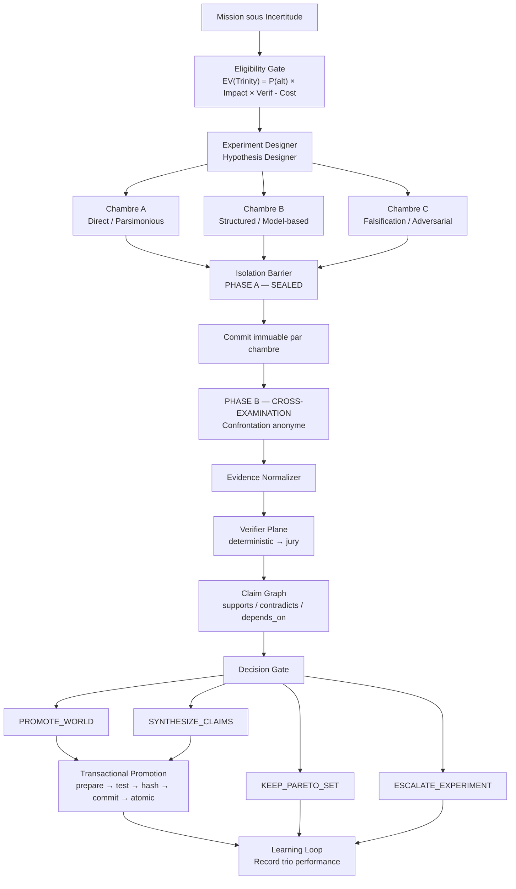
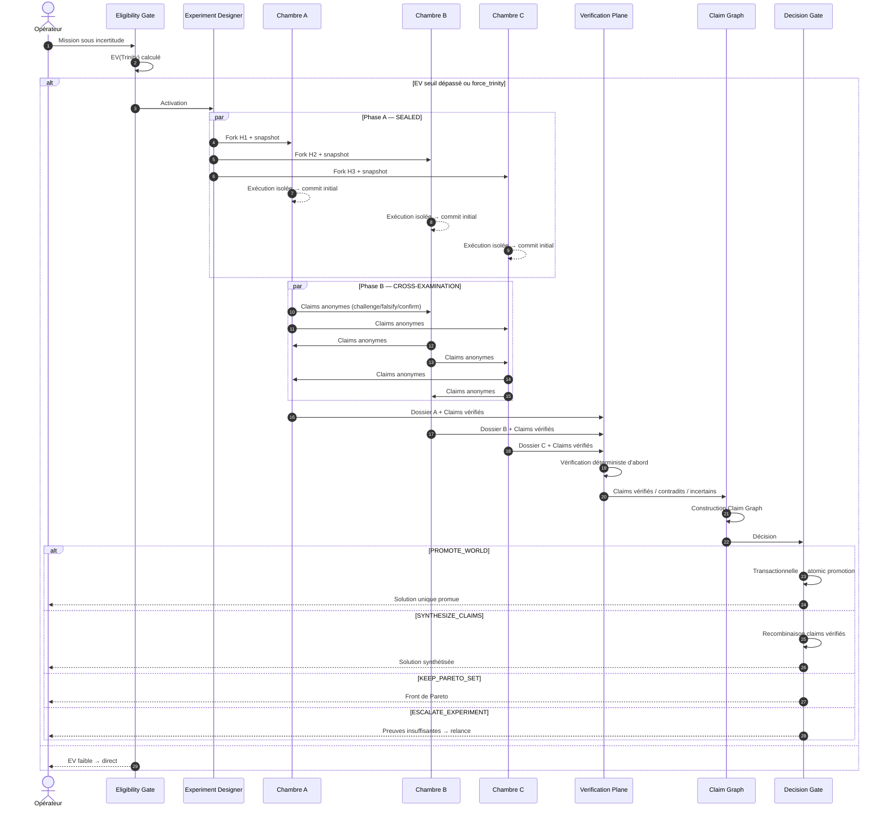

# Trinity : Orchestration Expérimentale sous Incertitude

## 1. Principe fondamental

> **Trinity est le protocole expérimental de GenOS pour les situations où plusieurs hypothèses, méthodes ou conceptions plausibles doivent être testées indépendamment avant qu'une décision fiable puisse être prise.**

La différence avec un simple ensemble de trois agents est fondamentale :

```text
Trois agents ordinaires
    = 3 réponses

Best-of-N
    = N réponses → prendre la meilleure

Self-consistency
    = N raisonnements → voter

Débat
    = plusieurs agents → discussion → consensus

Trinity ultime
    = concevoir des hypothèses réellement distinctes
      → les tester dans des mondes contrôlés
      → préserver leur indépendance
      → produire des preuves comparables
      → confronter uniquement après engagement
      → localiser accords / contradictions
      → vérifier
      → sélectionner OU recombiner OU relancer
      → apprendre quel protocole expérimental fonctionne
```

Beaucoup plus proche de la **méthode expérimentale** que d'une architecture multi-agent classique.

Appuyé par plusieurs résultats : Self-Consistency montre que plusieurs chemins de raisonnement peuvent fortement augmenter les performances [Wang 2022, arXiv:2203.11171] ; Tree of Thoughts montre l'intérêt d'explorer plusieurs trajectoires ; les travaux sur le débat multi-agent montrent que la confrontation peut améliorer raisonnement et factualité.

Mais le piège essentiel documenté par Kim et al. [arXiv:2506.07962] : **plusieurs agents ne garantissent pas plusieurs erreurs indépendantes**. Des corrélations d'erreurs importantes, y compris entre grands modèles et fournisseurs différents. Et Wu et al. [arXiv:2511.07784] montrent que la pression majoritaire peut empêcher une minorité correcte de renverser un consensus erroné.

C'est précisément là que Trinity se différencie.

---

## 2. Trinity actuelle : ce qui est déjà bon

La structure actuelle du HEAD `v3` est saine :

```text
Mission
  ↓
trinityService.analyzeMission()
  ↓
compose()
  ↓
World 1 ─┐
World 2 ─┼── exécution indépendante
World 3 ─┘
  ↓
dossiers d'évidence
  ↓
trinityComparativeBarrier
  ↓
scoreWorldEvidence()
  ↓
mergeTrinityEvidence()
  ↓
promoteWinner()
```

Il y a de vraies choses derrière : `trinity_worlds`, de vrais workers, une barrière d'évidence, de la télémétrie, un superviseur détaché, une promotion et des tests dédiés. La base est bonne.

Mais plusieurs problèmes empêchent Trinity d'être expérimentalement rigoureuse.

---

## 3. Problème n°1 : l'expérience actuelle est confondue

Aujourd'hui :

| Monde | Méthode | Modèle |
|-------|---------|--------|
| W1 | Direct | standard |
| W2 | Planned | frontier |
| W3 | Self-correcting | frontier |

Si W2 bat W1, quelle est la cause ?

```text
planification ?
meilleur modèle ?
plus de capacité de raisonnement ?
plus de contexte ?
différence de budget réel ?
```

Impossible à savoir.

Pour une Trinity scientifique, une expérience comparant les stratégies doit d'abord utiliser :

```text
same model
same context
same snapshot
same token budget
same tools
same evidence requirements
different strategy only
```

Puis une autre variante de Trinity peut volontairement comparer les modèles.

Il faut donc distinguer **Trinity-Controlled** et **Trinity-Heterogeneous**.

---

## 4. Problème n°2 : les pondérations par domaine ne fonctionnent pas

Dans `trinityService.js`, le code définit `DOMAIN_WEIGHTS` par domaine (creative_writing, security, data, product_design, software_engineering) mais `scoreWorldEvidence()` fait d'abord `adaptive.routeWeights(domain) || DOMAIN_WEIGHTS[domain]`. Or `routeWeights()` retourne toujours un objet. Donc les `DOMAIN_WEIGHTS` ne servent pratiquement jamais au scoring effectif.

Pire : `trinity-supervisor.cjs` exécute `mergeTrinityEvidence(reports, { domain: 'puzzle_design', threshold: 0.70 })` quelle que soit la mission, et `puzzle_design` ne fait pas partie des profils Trinity.

La bonne architecture serait :

```text
domain prior
    +
historical learned adjustment
    +
task-specific verifier availability
    =
effective weights
```

Mathématiquement :

$$
w_{effective} = normalize(w_{domain\ prior} + \Delta w_{learned} + \Delta w_{mission})
$$

et jamais `adaptive weights OR domain weights`.

---

## 5. Problème n°3 : W3 ne doit pas être « self-correction »

C'est une faiblesse conceptuelle. Le modèle qui a produit une erreur possède souvent les mêmes biais lorsqu'on lui demande « Vérifie maintenant si tu t'es trompé ». La self-correction peut aider mais n'est pas équivalente à une falsification indépendante [Shinn 2023, Reflexion].

Les trois archétypes fondamentaux deviennent :

| Chambre Trinity | Principe |
|-----------------|----------|
| **Direct / Parsimonious** | Trouver la solution la plus simple avec le minimum d'hypothèses |
| **Structured / Model-based** | Formaliser, décomposer, planifier, modéliser avant d'agir |
| **Falsification / Adversarial** | Construire indépendamment puis chercher activement des contre-exemples et des conditions d'échec |

Le troisième monde reste capable de produire une solution complète — il n'est pas uniquement critique. Mais son principe épistémique devient : **essayer de tuer sa propre hypothèse et celles qu'il rencontrera plus tard**. C'est beaucoup plus fort.

---

## 6. Cas d'utilisation précis de Trinity

Trinity n'est pas une topologie universelle. Elle devient excellente lorsque le problème possède **plusieurs explications ou solutions plausibles, non trivialement comparables**.

| Situation | Pourquoi Trinity |
|-----------|------------------|
| Bug inconnu | Tester trois hypothèses causales indépendantes |
| Architecture logicielle | Comparer plusieurs designs avant un choix coûteux |
| Algorithme difficile | Explorer plusieurs formulations mathématiques |
| Sécurité | Implémentation minimale vs threat model vs attaque/falsification |
| Migration DB | Plusieurs stratégies de migration + invariants + rollback |
| Science | Hypothèses concurrentes et expériences discriminantes |
| Enquête technique | Plusieurs scénarios causaux compatibles avec les observations |
| Optimisation | Méthodes différentes produisant des fronts coût/performance distincts |
| Puzzle complexe | Plusieurs formalismes de résolution indépendants |
| Recherche | Tester simultanément plusieurs interprétations |
| Produit/UX | Plusieurs conceptions complètes concurrentes |
| Créativité | Direct spontané vs planifié vs expérimental/révision |
| Planification sous incertitude | Plusieurs modèles du futur |
| Reverse engineering | Plusieurs modèles explicatifs d'un système opaque |

### Exemple : Bug inconnu

Trinity actuelle pourrait faire :

```text
W1 = inspect code directly
W2 = systematic debugging plan
W3 = inspect and self-correct
```

Trinity ultime ferait mieux :

```text
Observed symptom
      │
      ▼
Hypothesis Designer
      │
      ├── H1: state corruption
      ├── H2: race condition
      └── H3: invalid lifecycle assumption

W1 tests H1 independently
W2 tests H2 independently
W3 tests H3 independently

      ↓

Evidence:
H1 falsified
H2 reproduced under load
H3 explains only secondary symptom

      ↓

H2 promoted
+
H3 claim retained as secondary issue
```

Ce n'est plus trois styles de réponses. C'est une **expérience causale**.

---

## 7. Quand NE PAS utiliser Trinity

| Mission | Meilleure forme |
|---------|-----------------|
| `2+2` | direct |
| Tâche parfaitement déterministe | direct |
| Plusieurs métiers complémentaires | A-Team |
| Tout le monde doit éditer le même état | Syncytium |
| Recherche ouverte d'opportunités/capacités | Rhizome |
| Écosystème de populations et ressources | Biome |
| Communauté qui doit construire un consensus | Biocénose |
| Système hôte + extensions spécialisées | Holobionte |
| Résilience de groupes semi-indépendants | Métapopulation |
| **Plusieurs hypothèses concurrentes** | **Trinity** |

La question déclenchant Trinity :

> **« Est-ce que résoudre ce problème nécessite de savoir laquelle de plusieurs hypothèses plausibles survit à l'expérience ? »**

---

## 8. Trinity doit pouvoir s'activer toute seule

Aujourd'hui `analyzeMission()` recommande Trinity si le mot est demandé explicitement ou si la demande ressemble à une interview-for-plan. C'est trop restrictif.

Morphogenesis et l'orchestrateur devraient calculer :

$$
EV(Trinity) = P(\text{alternative utile}) \times Impact \times Verifiability - ComputeCost
$$

avec des signaux :

```text
nombre d'hypothèses plausibles
incertitude
coût d'une mauvaise décision
réversibilité
disponibilité d'oracles
corrélation probable des erreurs
budget disponible
```

Un bug trivial → Trinity value ≈ faible.
Une refonte auth avec trois architectures plausibles et fort risque sécurité → Trinity value ≈ élevée.
L'utilisateur peut toujours forcer `force_trinity=true`.

---

## 9. Les variantes de Trinity

| Variante | Fonction |
|----------|----------|
| **Trinity-Controlled** | Même modèle, mêmes ressources, seule la stratégie varie |
| **Trinity-Heterogeneous** | Modèles/fournisseurs différents pour réduire les erreurs corrélées |
| **Trinity-Adversarial** | constructeur / alternative / falsificateur |
| **Trinity-Counterfactual** | chaque monde modifie une hypothèse causale |
| **Trinity-Factorial** | stratégie × modèle × outils ; permet d'isoler les causes de performance |
| **Trinity-Pareto** | conserve plusieurs solutions non dominées au lieu d'un unique gagnant |
| **Trinity-Jury** | outputs évalués anonymement par plusieurs vérificateurs indépendants |
| **Trinity-Recursive** | un monde difficile peut lancer localement une sous-Trinity |
| **Trinity-Adaptive** | budgets et nombre de replicas évoluent pendant l'expérience |
| **Trinity-Temporal** | mondes lancés à des moments différents selon les informations acquises |
| **Trinity-Oracular** | comparaison dominée par des vérificateurs déterministes |
| **Trinity-Exploratoire** | trois familles d'hypothèses, chacune contenant plusieurs variantes |

Les plus importantes : Controlled, Heterogeneous, Factorial, Jury et Adaptive.

---

## 10. Trinity-Factorial pourrait être particulièrement puissante

Trois stratégies (Direct, Planned, Falsification) × trois modèles (A, B, C) :

```text
                 A        B        C
Direct          D-A      D-B      D-C
Planned         P-A      P-B      P-C
Falsification   F-A      F-B      F-C
```

On mesure alors :

```text
effet stratégie
effet modèle
interaction stratégie × modèle
```

- Si `Planned` gagne avec A, B et C → c'est probablement la stratégie.
- Si C gagne dans les trois lignes → c'est principalement le modèle.
- Si `Falsification-C` est exceptionnel mais les autres Falsification faibles → interaction particulière.

Autrement plus informatif que Standard direct vs Frontier planned vs Frontier critic.

---

## 11. Le mécanisme biomimétique multi-provider est pertinent… mais sa métrique est fausse

GenOS possède déjà `heteropaternalSuperfecundation.js`. Mais il calcule :

```js
diversityScore = uniqueProviders / fathers.length
```

puis peut annoncer `paternal_independence_guarantee: true` / `zero shared paternal bias`.

Ce n'est scientifiquement pas défendable. OpenAI + Anthropic + Google n'implique pas $D = 1$ ni $error\ correlation = 0$.

La diversité doit devenir empirique :

$$
D_{ij} = 1 - Correlation(Error_i, Error_j)
```

complétée par :

```text
provider diversity
architecture/model-family diversity
prompt strategy diversity
retrieval diversity
tool diversity
cognitive-recipe diversity
historical disagreement
historical complementary success
```

Trinity sélectionne les mondes via :

$$
\max_W \left[ \sum_i Q_i - \lambda\sum_{i \ne j}\rho_{ij} + \mu Coverage(W) - \kappa Cost(W) \right]
$$

où $\rho_{ij}$ est leur corrélation historique d'erreurs. C'est une vraie **sélection d'équipe anti-monoculture**.

---

## 12. Les mondes doivent être aveugles… jusqu'au bon moment

Le modèle optimal n'est pas `W1 parle à W2 → W2 influence W3 → tout le monde converge` (on perd l'indépendance) mais l'isolation permanente perd une opportunité de correction.

### PHASE A — SEALED

```text
W1     W2     W3
│      │      │
aucune communication
│      │      │
commit initial
```

### PHASE B — CROSS-EXAMINATION

```text
anonymous W1 claims ──► W2/W3
anonymous W2 claims ──► W1/W3
anonymous W3 claims ──► W1/W2

Chaque monde peut seulement :
- challenge
- falsify
- confirm
- request evidence
```

Le premier dossier est **immuable**. On sait ainsi ce qu'il pensait indépendamment et ce qu'il a changé après confrontation.

Cohérent avec [Wu 2025, arXiv:2511.07784] : la diversité aide, mais la pression de majorité peut étouffer une correction indépendante.

---

## 13. Le vote majoritaire ne devrait quasiment jamais décider Trinity

Supposons W1 = faux, W2 = faux, W3 = correct. Deux contre un. La majorité perd.

Principe : **evidence > popularity**. Plus précisément :

```text
deterministic verifier
    > external evidence
    > independent reproducibility
    > validated process evidence
    > multi-judge evaluation
    > model confidence
    > majority
```

Pour les problèmes objectivement vérifiables, on ne devrait même pas demander à un LLM de départager ce qu'un test peut décider.

---

## 14. Il faut séparer générateurs et juges

Actuellement le système de scoring est structurel et l'orchestrateur fait ensuite la synthèse. Pour Trinity ultime : un **Verification Plane** indépendant.

```text
Worlds
  ↓
Evidence Normalizer
  ↓
Verifier Router
  ├── Unit tests
  ├── property tests
  ├── SAT/SMT
  ├── Lean
  ├── SQL invariants
  ├── static analysis
  ├── security scanners
  ├── benchmark
  ├── external source validation
  └── LLM jury (last resort / subjective)
```

Pour les juges LLM : un panel diversifié est préférable à un seul gros juge [Verga 2024, PoLL, arXiv:2404.18796].

Les sorties devraient surtout être évaluées **à l'aveugle** :

```text
Candidate X
Candidate Y
Candidate Z
```

pas `Claude candidate` / `GPT candidate` ni `World 1 Basic` / `World 3 Advanced`.

---

## 15. Le scoring actuel est trop simple

Actuellement :

$$
S_i = \alpha Claims + \beta Tests + \gamma Robustness
$$

C'est une bonne V1 mais ça compresse énormément d'informations dans un scalaire.

Passage à un vecteur :

$$
E_i = (correctness, coverage, robustness, reproducibility, novelty, cost, latency, risk, uncertainty, constraintCoverage)
$$

Puis :

```text
Pareto elimination
       ↓
hard invariants
       ↓
domain preferences
       ↓
final utility
```

Un monde extrêmement robuste mais légèrement plus coûteux ne devrait pas disparaître parce qu'un score pondéré lui donne 0.81 contre 0.82.

---

## 16. Il faut passer du « winner world » au « claim graph »

Actuellement `mergeTrinityEvidence()` prend le winner puis ajoute les claims des mondes perdants comme `[World 1 cross-perspective]` sans validation individuelle. Cela peut contaminer une excellente solution avec un claim faux.

La bonne structure :

```text
                  ┌── Claim A ─ evidence ─ verified
World 1 ──────────┼── Claim B ─ evidence ─ contradicted
                  └── Claim C

World 2 ───────────── Claim D ─ verified

World 3 ───────────── Claim ¬B ─ verified
```

Puis construire :

```text
Claim Graph

A ─ supports ─► D
B ─ contradicts ─► ¬B
C ─ depends_on ─► A
```

La fusion devient :

```text
accept A
reject B
accept ¬B
accept D
conditionally accept C
```

Au lieu de `World 2 won → copy World 2`.

Cela permet à Trinity de découvrir qu'**aucun monde n'était entièrement correct**, mais que la solution correcte est recomposable à partir des trois.

---

## 17. Il faut quatre résultats possibles, pas deux

Actuellement : `merge` ou `escalate`.

| Résultat | Signification |
|----------|---------------|
| `PROMOTE_WORLD` | Un monde domine réellement |
| `SYNTHESIZE_CLAIMS` | Aucun monde complet ne domine, mais des composants vérifiés sont combinables |
| `KEEP_PARETO_SET` | Plusieurs réponses restent valides selon des compromis différents |
| `ESCALATE_EXPERIMENT` | Preuves insuffisantes ou contradiction non résolue |

Exemple architecture :

```text
Solution A: cheap + simple
Solution B: expensive + very robust
```

Incorrect de forcer un unique gagnant si aucune préférence utilisateur ne départage coût et robustesse.

---

## 18. Le merge doit devenir transactionnel

Le bug actuel de `promoteWinner()` : le monde est marqué `merged` avant que `createMergeArtifact()` ait forcément réussi. Le test `test_trinity_promotion.js` valide même `promoted === true, artifact === null`. Cet invariant est incorrect.

L'ordre ultime :

```text
Winner selected
      ↓
prepare isolated merge candidate
      ↓
apply artifact
      ↓
run integration tests
      ↓
verify evidence
      ↓
hash result
      ↓
commit AgentGit
      ↓
atomic promotion
      ↓
mark winner promoted
```

Si quoi que ce soit échoue : rollback, winner remains unpromoted.

> Invariant : **`promoted = true ⇒ verified artifact exists`** — toujours.

---

## 19. Les erreurs Trinity ne doivent plus être silencieuses

Dans `workerEvidenceBarrier.js` : `await applyTrinityComparison(...).catch(() => {})`. Une panne de la barrière Trinity peut être silencieusement ignorée et la synthèse générale continuer.

Ce n'est pas acceptable pour un mécanisme censé être une **barrière**.

```text
TRINITY comparison failed → NO PROMOTION
```

Une erreur d'observabilité peut éventuellement être best-effort. Une erreur du mécanisme de décision ne le peut pas.

---

## 20. Les trois mondes ne doivent pas forcément recevoir le même budget

Le partage `1/3, 1/3, 1/3` est simple mais sous-optimal.

Inspiré par [Manvi 2024, arXiv:2410.02725] :

```text
Initial probe
W1 = 800 tokens
W2 = 800 tokens
W3 = 800 tokens

↓ observation

W1 looks dominated
W2 promising
W3 uncertain but unique

↓ next allocation

W1 +0
W2 +3000
W3 +2500
```

On conserve un monde s'il possède : unique verified evidence, unique hypothesis coverage, important unresolved contradiction, high information gain.

Attention : une minorité ne doit jamais être éliminée uniquement parce qu'elle est minoritaire.

---

## 21. Trinity conserve « trois » sans être limitée à trois agents

Trois chambres épistémiques, pas nécessairement trois processus.

```text
TRINITY

CHAMBER A
Direct / Parsimonious
    ├─ replica A1
    ├─ replica A2
    └─ replica A3

CHAMBER B
Structured / Model-based
    ├─ replica B1
    └─ replica B2

CHAMBER C
Falsification / Adversarial
    ├─ replica C1
    ├─ replica C2
    └─ replica C3
```

Chaque monde conceptuel peut utiliser : one model, several samples, several providers, formal solver, sub-agents. Cela permet d'intégrer Self-Consistency ou More Agents Is All You Need sans transformer Trinity en simple vote massif [Li 2024, arXiv:2402.05120].

---

## 22. Le Hypothesis Designer doit remplacer les profils regex fixes

Aujourd'hui `security → [baseline, threat model, adversarial]`, `data → [...]`, `creative → [...]`. C'est bien comme bootstrap.

Mais la Trinity ultime conçoit elle-même son expérience. Elle extrait :

```text
problem, assumptions, uncertainties, decision variables
known failure modes, available verifiers, cost of error
```

puis cherche trois hypothèses maximisant :

$$
Utility(H_1,H_2,H_3) = Coverage + Orthogonality + Falsifiability - Redundancy - Cost
```

Exemple : « Pourquoi mon API ralentit seulement en production ? »

Le meilleur Trinity n'est probablement pas `direct / planned / self-correcting` mais :

```text
H1 = DB contention
H2 = event-loop / CPU saturation
H3 = downstream network dependency
```

Le style de raisonnement vient ensuite.

---

## 23. Trinity doit apprendre quels trios fonctionnent

GenOS possède déjà `adaptiveParameterService`. Mais l'apprentissage ultime doit porter sur :

```text
(domain, task features)
       ↓
which hypothesis families worked?
which model families complemented each other?
which verifier caught the error?
which worlds were redundant?
how much compute was wasted?
what kinds of disagreement predicted errors?
```

À terme Trinity devrait savoir :

```text
For SQL migrations:
  Direct + invariant-first + rollback-adversarial
  has historically beaten
  Direct + planned + generic critic

For hard algorithms:
  constructive + mathematical-formal + search/falsifier
  works better.

For UI:
  direct designer + flow-first + accessibility/usability critic
  works better.
```

Les trios deviennent eux-mêmes un objet d'évolution. Cohérent avec la philosophie GenOS : nature n'est pas une base de solutions, mais un ensemble de processus de recherche. Trinity apprend **quel processus comparatif** employer.

---

## 24. Architecture cible

```text
                     USER MISSION
                          │
                          ▼
                  [Eligibility Gate]
                  Is comparison useful?
                          │
                          ▼
                 [Experiment Designer]
              ┌───────────┼───────────┐
              ▼           ▼           ▼
          Chamber A   Chamber B   Chamber C
          hypothesis  hypothesis  hypothesis
              │           │           │
              └──── same base snapshot ────┘
                          │
                          ▼
                 [Isolation Barrier]
                    SEALED EXECUTION
                          │
              ┌───────────┼───────────┐
              ▼           ▼           ▼
           dossier A   dossier B   dossier C
              │           │           │
              └────── commitment ─────┘
                          │
                          ▼
                 [Evidence Normalizer]
                          │
                          ▼
                [Cross-Examination]
                          │
                          ▼
                 [Verifier Plane]
              deterministic first
                          │
                          ▼
                     Claim Graph
                          │
                          ▼
                   [Decision Gate]
              ┌───────────┼───────────┬────────────┐
              ▼           ▼           ▼            ▼
           PROMOTE    SYNTHESIZE     PARETO      ESCALATE
              │           │           │            │
              └───────────┴───────────┘            │
                          │                        │
                          ▼                        │
               [Transactional Promotion]          │
                          │                        │
                          └──────────────┬─────────┘
                                         ▼
                                  [Learning Loop]
```

---

## 25. Contrat runtime

### TrinityExperiment

```typescript
TrinityExperiment {
    experimentId
    missionId
    missionSnapshotHash
    domain
    variant  // controlled | heterogeneous | adversarial | factorial | counterfactual | pareto | jury | recursive | adaptive | temporal | oracular | exploratory
    hypothesisDesign
    chambers[3]
    controlledVariables
    independentVariables
    isolationPolicy
    budgetPolicy
    verifierPolicy
    status
    decision  // PROMOTE | SYNTHESIZE | PARETO | ESCALATE
}
```

### TrinityWorld

```typescript
TrinityWorld {
    worldId
    chamber  // A | B | C
    hypothesis
    assumptions
    falsificationCriteria
    model
    provider
    cognitiveRecipe
    toolchain
    retrievalPolicy
    randomSeed
    tokenBudget
    workspaceSnapshot
    initialCommit
    finalCommit
    evidenceDossier
    claimGraph
}
```

Cela rend la comparaison reproductible.

---

## 26. Les critères d'indépendance doivent être explicites

Invariants forts :

```text
same initial mission snapshot
same initial repository snapshot
no world-to-world communication before commitment
no shared writable memory
all external inputs provenance-tracked
model/provider recorded
retrieval sources recorded
tool calls recorded
randomness/seed recorded where available
```

On calcule alors une vraie **independence receipt**. Pas `different providers => independent` mais `independence = measured and auditable`.

---

## 27. Comment Trinity devient réellement exceptionnelle

Le différenciateur n'est pas d'avoir trois LLM. Le différenciateur est cette combinaison :

```text
automatic experimental design
+ orthogonal hypothesis generation
+ sealed independent execution
+ empirical error-correlation modelling
+ adaptive compute allocation
+ deterministic verification whenever possible
+ blind multi-model jury when necessary
+ post-commit cross-examination
+ claim-level contradiction graph
+ Pareto-aware synthesis
+ transactional promotion
+ historical learning over experiment designs
+ Morphogenesis integration
```

C'est exactement le genre de combinaison qu'il faudrait mesurer pour avoir une chance de démontrer quelque chose de nettement plus riche qu'un Best-of-N, Self-Consistency, Debate ou Mixture-of-Agents [Wang 2024, MoA, arXiv:2406.04692].

---

## 28. Comment le prouver

Éviter le benchmark injuste : `1 LLM × 10k tokens` vs `Trinity × 3 × 10k tokens`.

Le vrai benchmark doit inclure :

| Système | Budget total |
|---------|-------------:|
| LLM direct | X |
| LLM long reasoning | X |
| Best-of-3 | X |
| Self-consistency | X |
| Tree of Thoughts | X |
| Multi-agent debate | X |
| MoA | X |
| Trinity actuelle | X |
| Trinity ultime | X |

Mesures :

```text
accuracy / task success
accuracy per token
accuracy per euro
wall-clock latency
calibration
false promotion rate
catastrophic wrong-merge rate
unique fault detection
claim precision
reproducibility
diversity gain
correlated-error resistance
```

Ablations :

```text
without isolation
without cross-examination
without heterogeneous models
without claim graph
without adaptive budgets
without independent jury
without deterministic verifiers
```

Ainsi on sait **pourquoi** Trinity fonctionne.

---

## 29. Objectif final pour Trinity

On ne cherche plus à obtenir « trois agents qui répondent différemment ». On cherche :

> **Quand GenOS ne sait pas quelle représentation du problème est correcte, Trinity fabrique trois mondes suffisamment différents pour que la réalité puisse les départager.**

Et s'il n'est pas possible de les départager : **Trinity doit le savoir.**

Et si deux mondes possèdent chacun une partie de la vérité : **Trinity doit savoir recomposer cette vérité sans importer leurs erreurs.**

Et si les trois échouent de la même manière : **Trinity doit détecter la monoculture cognitive et générer une nouvelle expérience, pas simplement recommencer trois fois.**

C'est l'implémentation ultime de Trinity : **le laboratoire scientifique interne de GenOS**.

---

## 30. Architecture du système (fichiers)

| Fichier | Rôle |
|---------|------|
| `backend/src/services/trinityService.js` | Analyse de mission, détection de domaine, composition des trois chambres |
| `backend/src/services/trinityComparativeBarrier.js` | Barrière de fusion, Claim Graph, promotion transactionnelle |
| `backend/src/services/agentAutonomyPlanService.js` | Éligibilité EV(Trinity), activation conditionnelle |
| `backend/src/services/agentOrchestrationState.js` | État partagé, synchronisation, isolation |
| `backend/src/db/schema-tables-core.js` | Table `trinity_worlds` |
| `backend/bin/trinity-supervisor.cjs` | Supervision de mission Trinity |
| `backend/bin/topologyHandlers.cjs` | Handler `handleTrinity` pour l'orchestrateur |
| `shared/toolDefinitions.json` | Définition outil MCP `deploy_trinity` |

---

## 31. Télémétrie et observabilité

Nouvelles métriques enregistrées pour chaque mission Trinity :

```text
experimentId, variant
hypothesisDesign (H1, H2, H3)
chambers: { A: {model, provider, strategy}, B: {...}, C: {...} }
isolationPolicy: {phase, communication_receipts}
evidenceVector: { correctness, coverage, robustness, reproducibility, novelty, cost, latency, risk, uncertainty, constraintCoverage }
claimGraph: { nodes, edges, verified, contradicted, accepted, rejected }
decision: PROMOTE | SYNTHESIZE | PARETO | ESCALATE
verificationPath: deterministic | jury | hybrid
crossExamination: { phaseA_initial_commit, phaseB_changes }
budgetAllocation: { initial, adaptive, final }
independenceReceipt: { correlation_matrix, diversity_metrics }
learningFeedback: { trio_id, success, wasted_compute }
```

---

## 32. Moniteur TUI natif (`genos run --mode trinity --monitor`)

GenOS intègre une interface terminal interactive temps réel (Rust / ratatui) permettant de visualiser l'exécution contrefactuelle des 3 chambres en simultané.

```text
backend/src/services/trinityMonitorServer.js
  ↓ NDJSON TCP 127.0.0.1:4590
genos-tui (crates/genos-cli/src/commands/trinity_tui/)
  ├── live.rs      : client TCP, reconnexion automatique
  ├── model.rs     : applique snapshot / log / barrier
  └── view.rs      : rend 3 colonnes + panneau Barrière d'Évidence
```

Protocole NDJSON :

```json
{"type":"snapshot", missionId, prompt, worlds:[...], barrier:{status, detail}}
{"type":"log", missionId, worldNumber, line, severity, timestamp}
{"type":"barrier", missionId, status, detail}
{"type":"claim_graph", missionId, nodes:[...], edges:[...]}
{"type":"decision", missionId, decision, reasoning}
```

Commande :

```bash
genos run --mode trinity --monitor
genos run --mode trinity --monitor --mission-id trinity_1234567890_ab12
genos trinity split-screen --simulation
genos trinity split-screen --simulation --prompt "Implémenter un parser Bencode en Rust avec gestion d'erreurs stricte"
```

---

## 33. Références internes

- [ORCHESTRATION.md](../orchestration.md) : orchestration générale, gates et phases
- [A_TEAM.md](a-team.md) : orchestration multidisciplinaire
- [RUNTIME_AGENTIQUE.md](../../01-concepts/runtime-agentique.md) : runtime des agents autonomes
- [PRIMITIVES_EXECUTABLES.md](../primitives-executables.md) : outils d'exécution et isolation
- [TOPOLOGIES_ET_CAPACITES.md](../topologies-et-capacites.md) : capacités Trinity dans v3
- [trinityService.js](../../../backend/src/services/trinityService.js) : implémentation analyse
- [trinityComparativeBarrier.js](../../../backend/src/services/trinityComparativeBarrier.js) : barrière comparative
- [trinityDeploy.service.js](../../../backend/src/services/deploy/trinityDeploy.service.js) : déploiement
- [agentAutonomyPlanService.js](../../../backend/src/services/agentAutonomyPlanService.js) : activation
- CLI TUI Rust : [crates/genos-cli/src/commands/trinity_tui/](../../../crates/genos-cli/src/commands/trinity_tui)
- Serveur monitoring : [backend/src/services/trinityMonitorServer.js](../../../backend/src/services/trinityMonitorServer.js)
- Tests : [backend/tests/test_trinity_comparative_merge.js](../../../backend/tests/test_trinity_comparative_merge.js)

---

## 34. Références externes

| Référence | Apport pour Trinity |
|-----------|---------------------|
| [Wang 2022, Self-Consistency](https://arxiv.org/abs/2203.11171) | Plusieurs chemins de reasoning → amélioration sur tâches complexes |
| [Kim 2025, Correlated Errors](https://arxiv.org/abs/2506.07962) | Erreurs corrélées même entre fournisseurs distincts — diversité doit être mesurée |
| [Shinn 2023, Reflexion](https://arxiv.org/abs/2303.11366) | Self-correction ≠ falsification indépendante |
| [Wu 2025, Debate Study](https://arxiv.org/abs/2511.07784) | Diversité > pression majoritaire |
| [Verga 2024, PoLL](https://arxiv.org/abs/2404.18796) | Panel de modèles > juge unique |
| [Manvi 2024, Adaptive Compute](https://arxiv.org/abs/2410.02725) | Allocation dynamique du compute |
| [Li 2024, More Agents](https://arxiv.org/abs/2402.05120) | Échantillonnage multi-agent ≠ comparaison d'hypothèses structurées |
| [Wang 2024, MoA](https://arxiv.org/abs/2406.04692) | Layers séquentielles ≠ mondes initialement indépendants |

---

## 35. Implementation & capacités (GenOS v3)

Depuis la v3, cette topologie est câblée au runtime :

- Service de coordination : `trinityComparativeBarrier.js + trinityService.js`.
- Capacités requises : `EVIDENCE_BARRIER`, `EPISTEMICS_BARRIER`, `ARENA_COMPETITION`, `PROMOTION_GATE`, `CLAIM_GRAPH`, `VERIFICATION_PLANE`.
- Contrat exposé par `topologyCapabilityService` et rendu effectif dans les leases d'outils.

---

*Schémas d'architecture et d'expérimentation*

### Architecture Trinity ultime



### Séquence Trinity avec Phase A/B



### Machine à états Trinity

```mermaid
stateDiagram-v2
    [*] --> Eligibilité

    state Eligibilité {
        [*] --> CalculEV
        CalculEV --> Activé : EV seuil ou force_trinity
        CalculEV --> Refusé : EV faible
    }

    Eligibilité --> ExperimentDesigner : Activé
    ExperimentDesigner --> SealedExecution : 3 hypothèses conçues

    state SealedExecution {
        [*] --> ChamberA
        [*] --> ChamberB
        [*] --> ChamberC
        ChamberA --> CommitA : Commit immuable
        ChamberB --> CommitB : Commit immuable
        ChamberC --> CommitC : Commit immuable
    }

    SealedExecution --> CrossExamination : Tous commits prêts

    state CrossExamination {
        [*] --> AnonymousClaims
        AnonymousClaims --> ChallengePhase
        ChallengePhase --> RevisedClaims
    }

    CrossExamination --> EvidenceNormalization
    EvidenceNormalization --> VerifierPlane
    VerifierPlane --> ClaimGraph

    state ClaimGraphConstruction {
        [*] --> BuildGraph
        BuildGraph --> VerifyNodes
        VerifyNodes --> DetectContradictions
    }

    ClaimGraph --> DecisionGate

    state DecisionGate {
        [*] --> Evaluate
        Evaluate --> Promote : Un monde domine
        Evaluate --> Synthesize : Claims recombinables
        Evaluate --> Pareto : Multi-objectif
        Evaluate --> Escalate : Preuves insuffisantes
    }

    Promote --> TransactionalPromotion
    Synthesize --> TransactionalPromotion

    state TransactionalPromotion {
        [*] --> PrepareArtifact
        PrepareArtifact --> RunTests
        RunTests --> HashResult
        HashResult --> CommitAgentGit
        CommitAgentGit --> AtomicMark
    }

    TransactionalPromotion --> LearningLoop
    Pareto --> LearningLoop
    Escalate --> LearningLoop

    state LearningLoop {
        [*] --> RecordTrio
        RecordTrio --> UpdateStrategies
    }

    LearningLoop --> [*]
```


