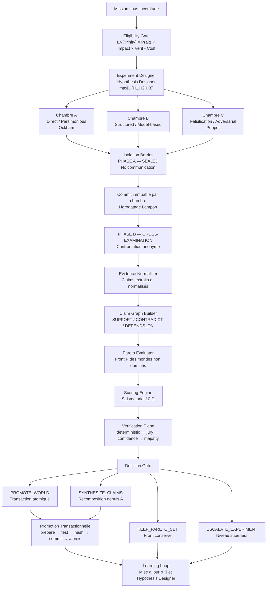
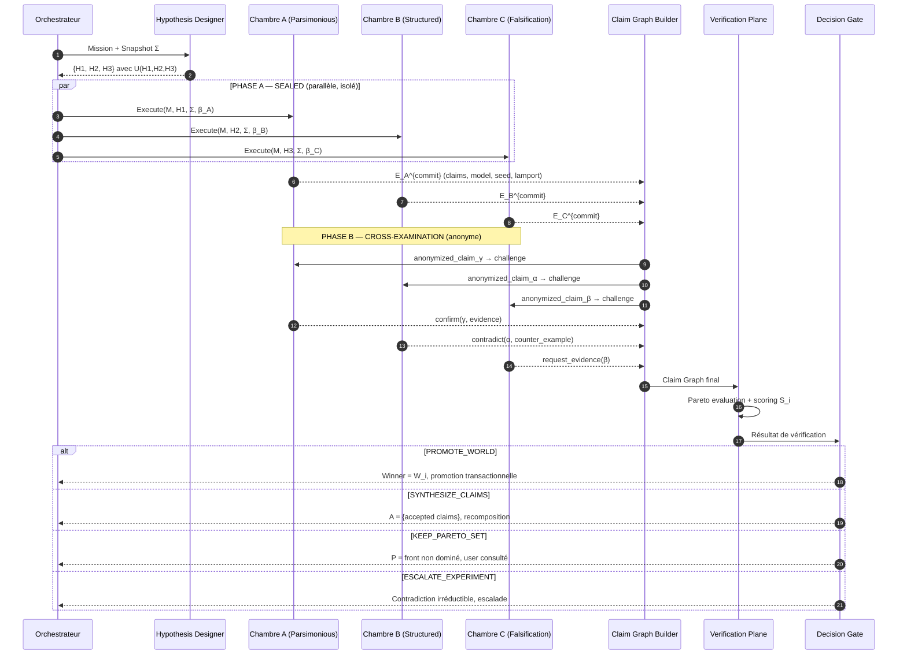
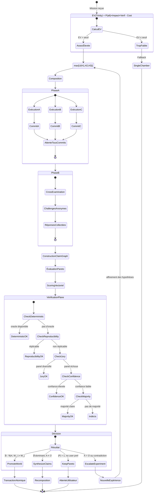

# Trinity : Laboratoire Expérimental Interne de GenOS

## 1. Définition

Trinity dans GenOS est le **protocole d'expérimentation comparative sous incertitude**, capable de concevoir automatiquement des expériences indépendantes, de maximiser la diversité épistémique utile, de mesurer les preuves produites par chaque chambre, de localiser les désaccords et de décider s'il faut sélectionner un monde, synthétiser les claims acceptés, conserver un front de Pareto, ou refuser de conclure et escalader.

Trinity n'est pas un ensemble de trois agents. C'est un **protocole expérimental** où chaque « monde » est une épistémie indépendante qui teste une hypothèse distincte. La structure ternaire (3 chambres épistémiques) permet : majorité + diversité + gestion de budget — le nombre 3 est le sweet spot empirique entre couverture et coût.

Le principe fondamental est :
> **Quand GenOS ne sait pas quelle représentation du problème est correcte, Trinity fabrique trois mondes suffisamment différents pour que la réalité puisse les départager.**

Et s'il n'est pas possible de les départager : **Trinity doit le savoir.**

Et si deux mondes possèdent chacun une partie de la vérité : **Trinity doit savoir recomposer cette vérité sans importer leurs erreurs.**

Et si les trois échouent de la même manière : **Trinity doit détecter la monoculture cognitive et générer une nouvelle expérience.**

Le cœur fonctionnel est réparti entre :
- [backend/src/services/trinityService.js](../../../backend/src/services/trinityService.js) : analyse, composition et sélection.
- [backend/src/services/trinityComparativeBarrier.js](../../../backend/src/services/trinityComparativeBarrier.js) : barrière de fusion et promotion transactionnelle.

---

## 2. Non trois agents, mais un protocole expérimental

GenOS applique une logique d'indépendance épistémique stricte :

1. **Hypothèses distinctes** : chaque chambre reçoit une hypothèse générée pour maximiser l'orthogonalité.
2. **Isolation phase A** : aucune communication entre mondes avant engagement immuable.
3. **Confrontation anonyme phase B** : cross-examination sans identité de l'auteur.
4. **Claim Graph** : les preuves sont reliées par des relations causales (SUPPORT, CONTRADICT, DEPENDS_ON).
5. **Décision mathématique** : Pareto, scoring vectoriel, et efficacité de Ne décident objectivement.

Les mécanismes de cohérence sont explicites :
- **indépendance initiale** : chaque chambre part du même snapshot mais développe sa propre chaîne.
- **commit immuable** : le premier dossier de chaque chambre est horodaté et ne peut être modifié.
- **confrontation structurée** : phase B n'autorise que challenge/falsify/confirm/request.
- **merge conditionnel** : la promotion n'est qu'un des quatre résultats possibles.

---

## 3. Définition Mathématique du Protocole Expérimental

### 3.1 Formalisation du problème expérimental

Soit :
- $M$ : mission partagée (snapshot initial unique) ;
- $\mathcal{H} = \{H_1, H_2, H_3\}$ : ensemble de trois hypothèses distinctes générées par l'Hypothesis Designer ;
- $W_i$ : le monde (chambre) $i$ exécutant l'hypothèse $H_i$ ;
- $E_i$ : dossier d'évidence produit par $W_i$ ;
- $\vec{S}_i$ : vecteur de score multidimensionnel de $W_i$ ;
- $\mathcal{C} = (\mathcal{V}, \mathcal{E})$ : Claim Graph global ;
- $\mathcal{P}$ : front de Pareto des mondes non dominés.

L'exécution de chaque chambre est une fonction déterministe conditionnelle :

$$W_i = \text{Execute}(M, H_i, \Sigma, \beta_i)$$

où $\Sigma$ est le snapshot initial partagé (même contexte, même mission, mêmes outils) et $\beta_i$ est le budget alloué à la chambre $i$.

Le dossier d'évidence produit par $W_i$ est structuré :

$$E_i = \{ \text{claims}_i, \text{evidence}_i, \text{provenance}_i, \text{failures}_i, \text{uncertainties}_i, \text{model}_i, \text{provider}_i, \text{seed}_i \}$$

### 3.2 Efficacité de $N_e$ : Descorrélation des Erreurs

L'efficacité de $N$ chambres épistémiques dépend de la corrélation de leurs erreurs. Si les trois chambres échouent exactement de la même manière (monoculture), le gain est nul. L'efficacité $N_e$ est :

$$N_e = \frac{N}{1 + \rho(N - 1)}$$

où :
- $N = 3$ : nombre de chambres ;
- $\rho$ : coefficient de corrélation moyen entre les erreurs des chambres.

Pour $\rho = 0$ (indépendance totale) : $N_e = 3$ — gain linéaire.
Pour $\rho = 1$ (monoculture parfaite) : $N_e = 1$ — aucun gain.

L'objectif de l'Hypothesis Designer est de minimiser $\rho$ en maximisant l'orthogonalité des hypothèses. La corrélation estimée à partir des résultats empiriques :

$$\hat{\rho}_{ij} = \frac{|\text{Failures}_i \cap \text{Failures}_j|}{|\text{Failures}_i \cup \text{Failures}_j|}$$

### 3.3 Scoring Vectoriel Multidimensionnel

Le scoring est un vecteur à 10 dimensions :

$$\vec{S}_i = (c_i, v_i, r_i, p_i, n_i, \ell_i, \tau_i, \sigma_i, \kappa_i, \chi_i)$$

où :
- $c_i$ : **correctness** $\in [0,1]$ — proportion de claims vérifiés vrais ;
- $v_i$ : **coverage** $\in [0,1]$ — étendue du domaine couvert par les claims ;
- $r_i$ : **robustness** $\in [0,1]$ — résistance aux variations d'entrée ;
- $p_i$ : **reproducibility** $\in [0,1]$ — stabilité inter-runs (variance inverse) ;
- $n_i$ : **novelty** $\in [0,1]$ — contribution informationnelle inédite par rapport aux autres chambres ;
- $\ell_i$ : **cost** $\in [0,\infty)$ — tokens + ressources consommés ;
- $\tau_i$ : **latency** $\in [0,\infty)$ — temps de réponse ;
- $\sigma_i$ : **risk** $\in [0,1]$ — probabilité estimée d'impact négatif ;
- $\kappa_i$ : **uncertainty** $\in [0,1]$ — confiance épistémique inverse ;
- $\chi_i$ : **constraintCoverage** $\in [0,1]$ — proportion de contraintes de la mission couvertes.

La score composite scalaire utilisé pour la sélection, sous contrainte de Pareto-dominance :

$$\text{best} = \arg\max_{i} \left[ \sum_{k \in \{c,v,r,p,n\}} \lambda_k S_{i,k} - \sum_{k \in \{\ell,\tau,\sigma,\kappa\}} \mu_k S_{i,k} \right]$$

avec $\lambda_k, \mu_k$ des poids normalisés ($\sum \lambda + \sum \mu = 1$).

### 3.4 Pareto Elimination et Front de Pareto

Un monde $W_i$ est **dominé** s'il existe $W_j$ tel que :

$$\forall k \in \{c, v, r, p, n\} : S_{j,k} \geq S_{i,k}$$

$$\forall k \in \{\ell, \tau, \sigma, \kappa\} : S_{j,k} \leq S_{i,k}$$

$$\exists k : \text{inequality is strict}$$

L'ensemble des mondes non dominés forme le front de Pareto :

$$\mathcal{P} = \{W_i \mid \nexists W_j : W_j \succ W_i\}$$

Propriété clé : un monde extrêmement robuste mais légèrement plus coûteux ne disparaît pas du front, même si un score pondéré scalaire le pénalise. Le front conserve les solutions non dominées, ce qui permet les quatre résultats distincts.

Le rang de Pareto d'un monde (nombre de couches qu'il faut retirer avant de le dominer) :

$$\text{rank}(W_i) = \min\{r \mid W_i \in \mathcal{P}_r\}, \quad \mathcal{P}_0 = \{W_1, W_2, W_3\}$$

### 3.5 Hypothesis Designer : Génération Automatique des Hypothèses

L'Hypothesis Designer cherche un triplet d'hypothèses maximisant une utilité épistémique composite :

$$\max_{\{H_1, H_2, H_3\} \subset \mathcal{H}} \; U(H_1, H_2, H_3)$$

avec :

$$U = \underbrace{\sum_{i=1}^{3} \text{Coverage}(H_i)}_{\text{couverture mission}} + \underbrace{\sum_{i<j} \text{Orthogonality}(H_i, H_j)}_{\text{diversité}} + \underbrace{\sum_{i=1}^{3} \text{Falsifiability}(H_i)}_{\text{testabilité}} - \underbrace{\sum_{i<j} \text{Redundancy}(H_i, H_j)}_{\text{recouvrement}} - \underbrace{\sum_{i=1}^{3} \text{Cost}(H_i)}_{\text{coût}}$$

Chaque composante est définie formellement :

**Couverture** :
$$\text{Coverage}(H_i) = \frac{|\text{Claims}(H_i) \cap \text{Claims}(M)|}{|\text{Claims}(M)|}$$

**Orthogonalité** (Jardistance des espaces de claims) :
$$\text{Orthogonality}(H_i, H_j) = 1 - \frac{|\text{Claims}(H_i) \cap \text{Claims}(H_j)|}{|\text{Claims}(H_i) \cup \text{Claims}(H_j)|} = 1 - J(H_i, H_j)$$

**Falsifiabilité** :
$$\text{Falçability}(H_i) = \mathbb{P}(\text{observer un contre-exemple} \mid H_i \text{ fausse})$$

Cela quantifie à quel point une hypothèse est testable — une hypothèse vague (« le système est correct ») a une falsifiabilité basse ; une hypothèse précise (« le système retourne 42 pour toute entrée positive ») a une falsifiabilité élevée.

**Redondance** (chevauchement des modèles sous-jacents) :
$$\text{Redundancy}(H_i, H_j) = \frac{|\text{Model}_i \cap \text{Model}_j|}{|\text{Model}_i \cup \text{Model}_j|}$$

### 3.6 Claim Graph : Structure des Preuves

Le Claim Graph $\mathcal{C} = (\mathcal{V}, \mathcal{E})$ est le modèle global des preuves produites par les trois chambres.

**Nœuds** $\mathcal{V}$ : chaque claim $v$ est un tuple $(w_i, \text{statement}, \text{status}, \text{timestamp}, \text{lamport})$.

**Relations** $\mathcal{E}$ :
- $\text{SUPPORT}(v_1, v_2)$ : $v_1$ apporte une évidence qui renforce $v_2$ ;
- $\text{CONTRADICT}(v_1, v_2)$ : $v_1$ apporte une évidence qui affaiblit $v_2$ ;
- $\text{DEPENDS\_ON}(v_1, v_2)$ : $v_1$ n'est valide que si $v_2$ est valide.

Chaque claim porte un état :

$$\text{status}(v) \in \{\text{verified}, \text{contradicted}, \text{uncertain}, \text{accepted}, \text{rejected}\}$$

L'ensemble des claims acceptés (preuves solides pour la synthèse) :

$$\mathcal{A} = \{v \in \mathcal{V} \mid \text{status}(v) = \text{verified}\} \setminus \{v \in \mathcal{V} \mid \exists w : \text{CONTRADICT}(w, v) \land \text{status}(w) = \text{verified}\}$$

Cela permet à Trinity de découvrir qu'**aucun monde n'était entièrement correct**, mais que la solution correcte est recomposable à partir des claims vérifiés de plusieurs chambres.

### 3.7 Allocation Adaptative du Budget

Le partage initial $(1/3, 1/3, 1/3)$ est le point de départ ; le protocole affine dynamiquement. À chaque tour $k$ :

$$T_i^{(k)} = T_i^{(k-1)} + \Delta T_i^{(k)}$$

avec :

$$\Delta T_i^{(k)} = \begin{cases} 0 & \text{if } W_i \text{ is dominated in } \mathcal{P}^{(k-1)} \\ \alpha \cdot \frac{\text{InformationGain}(W_i^{(k)})}{\sum_j \text{InformationGain}(W_j^{(k)})} \cdot T_{\text{remaining}} & \text{otherwise} \end{cases}$$

L'information gain d'une chambre est mesurée par le nombre de nouveaux claims vérifiés qu'elle produit au tour $k$ :

$$\text{InformationGain}(W_i^{(k)}) = |\mathcal{A}_i^{(k)} \setminus \mathcal{A}_i^{(k-1)}|$$

**Condition d'adaptation** (inspirée par [Manvi 2024, arXiv:2410.02725]) : une chambre reçoit plus de budget si son rendement marginal est supérieur au rendement attendu des alternatives moins le coût de commutation :

$$\text{MarginalReturn}(W_i) > \max_{j \neq i} \; \text{ExpectedReturn}(W_j) - \text{SwitchCost}$$

Une minorité (une chambre sur trois) n'est jamais éliminée uniquement parce qu'elle est minoritaire. Elle est conservée si elle possède au moins un claim vérifié unique ou une couverture d'hypothèse unique.

### 3.8 Sélection Anti-Monoculture

La sélection de l'équipe (ou du monde gagnant) évite la monoculture via une fonction de qualité corrigée par la diversité :

$$\max_{\mathcal{W} \subseteq \{W_1, W_2, W_3\}} \; \left[ \sum_{i \in \mathcal{W}} Q_i - \lambda \sum_{i \neq j \in \mathcal{W}} \rho_{ij} + \mu \cdot \text{Coverage}(\mathcal{W}) - \kappa \cdot \text{Cost}(\mathcal{W}) \right]$$

où :
- $Q_i$ : qualité intrinsèque (score composite scalaire) de $W_i$ ;
- $\rho_{ij}$ : corrélation d'erreur historique entre $W_i$ et $W_j$ ;
- $\lambda$ : pénalité de monoculture ;
- $\mu$ : bonus de couverture ;
- $\kappa$ : pénalité de coût.

La diversité effective entre deux chambres est :

$$D_{ij} = 1 - \rho_{ij}$$

Quand $\rho_{ij} \to 1$, la sélection rejette les deux chambres ensemble même si individuellement elles ont la plus haute qualité — cela force la diversité.

### 3.9 Promotion Transactionnelle

La promotion d'un monde (ou d'un claim) est une transaction atomique en six phases :

$$\text{Winner selected} \xrightarrow{t_1} \text{prepare artifact} \xrightarrow{t_2} \text{apply} \xrightarrow{t_3} \text{test} \xrightarrow{t_4} \text{hash} \xrightarrow{t_5} \text{commit} \xrightarrow{t_6} \text{atomic promotion}$$

Si une étape échoue :

$$\exists t_i : \text{failure}(t_i) \implies \text{rollback}(t_1 \to t_{i-1})$$

**Invariant fondamental** :

$$\text{promoted} = \text{true} \implies \text{verified artifact exists}$$

Cet invariant est vérifié par le Consistency Guardian avant commit. Aucun état incohérent (promoted mais sans artifact) n'est autorisé.

### 3.10 Les Quatre Résultats Possibles

Le protocole produit exactement quatre résultats mutuellement exclusifs :

| Résultat | Condition mathématique | Action |
|----------|------------------------|--------|
| `PROMOTE_WORLD` | $\exists i : \forall j \neq i : W_i \succ W_j \land \mathcal{A}_i \neq \emptyset$ | Promotion transactionnelle du gagnant |
| `SYNTHESIZE_CLAIMS` | $\nexists i : W_i \succ \forall j$ mais $\mathcal{A} \neq \emptyset$ | Recomposition à partir des claims acceptés |
| `KEEP_PARETO_SET` | $|\mathcal{P}| > 1 \land \nexists \text{ user preference}$ | Conservation du front, demande utilisateur |
| `ESCALATE_EXPERIMENT` | $\mathcal{A} = \emptyset \lor \text{contradiction irréductible}$ | Escalade vers niveau supérieur |

La probabilité de chaque résultat dépend de l'efficacité $N_e$ et de la qualité des hypothèses :

$$\mathbb{P}(\text{PROMOTE}) \approx \frac{1}{1 + e^{-(\Delta S - \theta)}}$$

où $\Delta S$ est l'écart entre le meilleur score et le second, et $\theta$ un seuil configurable.

---

## 4. Les Trois Chambres Épistémiques et Hypothèses

Trinity crée toujours exactement 3 chambres épistémiques, avec des rôles cognitifs distincts et des hypothèses contradictoires.

### 4.1 Chambre A : Direct / Parsimonious (Ockham)

```
Role: parsmonious_solver
ModelTier: standard
Chamber Number: A
Cognitive Bias: Minimization
```

**Hypothèse** :
> « La solution correcte est la plus simple compatible avec les contraintes. Moins d'hypothèses internes signifie moins de surfaces d'erreur. »

**Mission assignée** :
```
Trinity shared mission: [shared mission]
Collective principle: Three independent epistemic chambers testing distinct hypotheses.
Role hypothesis: The simplest solution with the fewest assumptions is most likely correct.

Your task (parsmonious_solver):
1. Solve the mission using the minimal number of explicit assumptions
2. Prefer brute, direct implementation over complex frameworks
3. Do not introduce intermediate abstractions unless strictly necessary
4. Every added mechanism must justify itself by a concrete constraint
5. Return the simplest correct solution you can construct

Return: Solution artifacts, assumptions list, justification for each non-obvious choice
```

**Modèle cognitif** :
- **Stratégie** : réduire la complexité (Ockham computationnel) ;
- **Résultat typique** : implémentation minimale, rapide, potentiellement fragile aux cas limites ;
- **Couverture** : élevée pour les cas nominaux, faible pour les cas limites ;
- **Falsifiabilité** : haute (solution précise et peu paramétrée).

### 4.2 Chambre B : Structured / Model-based

```
Role: structured_modeler
ModelTier: frontier
Chamber Number: B
Cognitive Bias: Formalization
```

**Hypothèse** :
> « Une formalisation explicite du problème avant toute exécution produit une solution plus robuste. La rigueur du modèle compense le coût de spécification. »

**Mission assignée** :
```
Trinity shared mission: [shared mission]
Collective principle: Three independent epistemic chambers testing distinct hypotheses.
Role hypothesis: Explicit formal modeling before execution yields robust solutions.

Your task (structured_modeler):
1. Formalize the mission into an explicit model (types, invariants, pre/post conditions)
2. Decompose the model into verifiable sub-properties
3. Plan the execution based on the model, not ad-hoc exploration
4. Document every design decision with its model justification
5. Verify each sub-property before declaring success

Return: Formal model, decomposition tree, verification report, solution artifacts
```

**Modèle cognitif** :
- **Stratése** : spécifier avant d'exécuter ;
- **Résultat typique** : solution robuste mais plus coûteuse ;
- **Couverture** : large (le modèle capture les cas limites) ;
- **Falsifiabilité** : haute (invariants formels testables).

### 4.3 Chambre C : Falsification / Adversarial (Popper)

```
Role: adversarial_falsifier
ModelTier: frontier
Chamber Number: C
Cognitive Bias: Refutation
```

**Hypothèse** :
> « La preuve la plus forte est la survie à une tentative systématique de réfutation. Construire l'hypothèse puis chercher activement ses conditions d'échec. »

**Mission assignée** :
```
Trinity shared mission: [shared mission]
Collective principle: Three independent epistemic chambers testing distinct hypotheses.
Role hypothesis: The strongest evidence is survival under systematic adversarial testing.

Your task (adversarial_falsifier):
1. First, construct your own solution to the mission (do not skip this step)
2. Then, switch to adversarial mode: search for counter-examples systematically
3. Test edge cases, invalid inputs, race conditions, boundary violations
4. For each failure found, document: input, expected, actual, root cause
5. If your own solution fails, rebuild from the failure evidence
6. The goal is not to confirm your solution but to destroy it — what survives is strong

Return: Your solution, falsification attempts (pass/fail), survived counter-examples, failure taxonomy
```

**Modèle cognitif** :
- **Stratégie** : construire puis détruire (falsification poppérienne) ;
- **Résultat typique** : solution très robuste aux cas limites mais potentiellement sur-conçue ;
- **Couverture** : maximale (test systématique des frontières) ;
- **Falsifiabilité** : maximale par construction.

**Pourquoi pas « Self-Correction » ?** La self-correction aide mais n'est pas équivalente à une falsification indépendante. Le modèle qui a produit une erreur possède souvent les mêmes biais lorsqu'on lui demande de vérifier son propre travail [Shinn 2023]. La Chambre C est physiquement séparée des autres et ne connaît pas leur existence pendant la Phase A — son adversarialité est donc authentiquement indépendante.

---

## 5. Architecture du Système

```text
Mission sous Incertitude
        |
        v
[Eligibility Gate]
  EV(Trinity) = P(alt) × Impact × Verif - Cost
        |
        v
[Experiment Designer / Hypothesis Designer]
  Génère {H1, H2, H3} max[U(H1,H2,H3)]
        |
        v
[Chambre A: Parsmonious]    [Chambre B: Structured]    [Chambre C: Falsification]
  Snapshot Σ                  Snapshot Σ                  Snapshot Σ
  Budget β_A                  Budget β_B                  Budget β_C
        |                         |                         |
        v                         v                         v
[PHASE A — SEALED] : Aucune communication entre chambres
        |                         |                         |
        v                         v                         v
[Commit immuable par chambre]  ←  Horodatage Lamport  →
        |                         |                         |
        v                         v                         v
[PHASE B — CROSS-EXAMINATION] : Confrontation anonyme
  A.challenges(B) anonymisé   B.challenges(C) anonymisé   C.challenges(A) anonymisé
        |                         |                         |
        v                         v                         v
[Evidence Normalizer] : Claims extraits et normalisés
        |
        v
[Claim Graph Builder] : SUPPORT / CONTRADICT / DEPENDS_ON
        |
        v
[Pareto Evaluator] : Front P des mondes non dominés
        |
        v
[Scoring Engine] : S_i vectoriel 10-D
        |
        v
[Verification Plane] : deterministic → reproducibility → jury → confidence → majority
        |
        v
[Decision Gate]
        |
        +--> PROMOTE_WORLD      (transaction atomique)
        +--> SYNTHESIZE_CLAIMS  (recomposition depuis A)
        +--> KEEP_PARETO_SET    (front conservé, utilisateur consulté)
        +--> ESCALATE_EXPERIMENT (vers niveau supérieur)
        |
        v
[Learning Loop] : Mise à jour des corrélations ρ_ij et de l'Hypothesis Designer
```

---

## 6. Activation et Éligibilité

Trinity s'active quand plusieurs hypothèses plausibles coexistent et qu'un test expérimentale est la seule voie vers une décision fiable.

### Processus d'activation

Trinity s'active quand au moins trois de ces conditions sont réunies :

1. **incertitude épistémique élevée** : plusieurs hypothèses plausibles concurrentes ;
2. **coût d'erreur significatif** : une mauvaise décision est coûteuse ou irréversible ;
3. **vérifiabilité disponible** : il existe des oracles, des tests, ou des métriques objectives ;
4. **diversité exploitable** : les solutions plausibles ne sont pas corrélées (ρ faible estimé) ;
5. **budget suffisant** : au moins 3 chambres × budget minimum par chambre.

### Calcul de l'éligibilité

Le système calcule la valeur attendue de Trinity :

$$\text{EV}(\text{Trinity}) = P(\text{alternative utile}) \times \text{Impact} \times \text{Verifiability} - \text{ComputeCost}$$

Signaux utilisés pour estimer chaque terme :

| Signal | Contribue à | Exemple |
|--------|-------------|---------|
| Nombre d'hypothèses plausibles | $P(\text{alternative})$ | 3 architectures → élevé |
| Incertitude du demandeur | $P(\text{alternative})$ | "Je ne sais pas quelle approche" → élevé |
| Coût d'une mauvaise décision | $\text{Impact}$ | Refonte auth → élevé |
| Réversibilité | $\text{Impact}$ | Trivial → faible |
| Disponibilité d'oracles | $\text{Verifiability}$ | Tests unitaires existants → élevé |
| Corrélation probable des erreurs | $\text{ComputeCost}$ | Modèles différents → faible ρ |
| Budget disponible | $\text{ComputeCost}$ | Budget serré → élevé coût relatif |

Un bug trivial → EV faible (pas de Trinity).
Une refonte auth avec trois architectures plausibles → EV élevée.
L'utilisateur peut toujours forcer `force_trinity=true`.

---

## 7. Composition et Isolation

### Contrat d'entrée

```javascript
trinityService.compose('heterogeneous', "Design authentication with three competing architectures")
```

### Validation stricte

La composition valide :
1. **mission présente** : aucune Trinity sans mission explicite ;
2. **mode reconnu** : 'controlled' | 'heterogeneous' | 'adversarial' | 'counterfactual' | 'factorial' | 'pareto' | 'jury' | 'recursive' | 'adaptive' | 'oracular' | 'exploratory' ;
3. **trois chambres générées** : toujours exactement 3 chambres épistémiques ;
4. **hypothèses distinctes** : l'Hypothesis Designer garantit l'orthogonalité minimale.

Si validation échoue :
- `TRINITY_MISSION_REQUIRED` : pas de mission
- `TRINITY_MODE_UNKNOWN` : variante inconnue
- `TRINITY_HYPOTHESIS_COLLISION` : hypothèses trop redondantes

### Sortie

La composition retourne un tableau de 3 chambres contextualisées :

```javascript
[
  {
    chamber: "A",
    role: "parsmonious_solver",
    modelTier: "standard",
    hypothesis: "The simplest solution with the fewest assumptions...",
    isolationPolicy: { phase: "SEALED", communication: false },
    budget: 8000
  },
  {
    chamber: "B",
    role: "structured_modeler",
    modelTier: "frontier",
    hypothesis: "Explicit formal modeling before execution...",
    isolationPolicy: { phase: "SEALED", communication: false },
    budget: 12000
  },
  {
    chamber: "C",
    role: "adversarial_falsifier",
    modelTier: "frontier",
    hypothesis: "Systematic falsification of own and others' claims...",
    isolationPolicy: { phase: "SEALED", communication: false },
    budget: 12000
  }
]
```

### Isolation Phase A — SEALED

Pendant la Phase A, chaque chambre fonctionne en isolation totale :
- même snapshot initial de la mission ;
- même snapshot initial du repository ;
- aucune communication chambre-à-chambre ;
- aucune mémoire partagée modifiable ;
- tous les inputs externes tracés (provenance) ;
- modèle et fournisseur enregistrés ;
- sources de retrieval enregistrées ;
- appels d'outils enregistrés ;
- graine aléatoire (seed) enregistrée ;
- horodatage Lamport assigné à chaque claim produit.

### Confrontation Phase B — CROSS-EXAMINATION

La Phase B active la confrontation anonyme :
- les claims de la Chambre A sont présentées anonymement aux Chambres B et C ;
- chaque chambre peut uniquement : **challenge / falsify / confirm / request evidence** ;
- le premier dossier (Phase A) reste **immuable** — on sait ce que chambres pensaient indépendamment et ce qu'elles ont modifié après confrontation ;
- les modifications post-confrontation sont horodatées et tracées.

---

## 8. Allocation de Budget et Modèles

Le budget total est réparti entre les trois chambres selon la variante :

### Allocation par défaut (équilibrée)

$$T_{\text{per\_chamber}} = \frac{T_{\text{worker}} \times s}{3}$$

où $s$ est le ratio d'allocation (typiquement 0.6–0.8).

### Allocation adaptative (variante Adaptive)

L'information gain ajuste la répartition à chaque tour. Une chambre qui produit plus de nouveaux claims vérifiés reçoit une fraction plus grande du budget restant.

### Modèles utilisés

| Chambre | Modèle | Justification |
|---------|--------|---------------|
| A (Parsimonious) | standard | Exécution rapide et directe |
| B (Structured) | frontier | Formalisation complexe, spécification |
| C (Falsification) | frontier | Adversarial testing nécessite le plus de capacité |

---

## 9. Exécution et Barrière de Fusion

### Phase A : Exécution Scellée

Chaque chambre exécute la mission en isolation. Le dossier d'engagement produit par chaque chambre est :

$$E_i^{\text{commit}} = \{ \text{claims}_i, \text{model}_i, \text{seed}_i, \text{timestamp}_i^{\text{lamport}}, \text{workspace}_i^{\text{hash}} \}$$

### Phase B : Cross-Examination

```text
T=0ms: Chambre A produit claim α (vérifié par test)
T=0ms: Chambre B produit claim β (vérifié par modèle formel)
T=0ms: Chambre C produit claim γ (contre-exemple trouvé)

T=100ms: Phase B active — claims anonymisés
  Challenge: anonymized_claim_α → Chambre B : "Pouvez-vous reproduire ?"
  Challenge: anonymized_claim_β → Chambre C : "Contre-exemple ?"
  Challenge: anonymized_claim_γ → Chambre A : "Validez-vous ?"

T=200ms: Réponses collectées
  B confirme α avec preuve indépendente
  C réfute β avec contre-exemple
  A ne peut pas réfuter γ

T=300ms: Claim Graph mis à jour
  SUPPORT(α, β) = weakened
  CONTRADICT(γ, β) = verified
```

### Barrière de Fusion

La fusion (ou tout autre résultat) est soumise à la barrière :

$$\text{canDecide} = \text{allChambersCommitted} \land \text{phaseBConcluded} \land \text{claimGraphConsistent}$$

La cohérence du Claim Graph est vérifiée : aucun cycle CONTRADICT non résolu, aucune dépendance DEPENDS_ON sur un claim contradicted.

---

## 10. Vérification Plane Indépendante

Pour les problèmes objectivement vérifiables, le système hiérarchise les vérificateurs par fiabilité décroissante :

$$\text{VerifierRank} = \begin{cases} 1 & \text{déterministic (tests, oracles)} \\ 2 & \text{external evidence (sources primaires)} \\ 3 & \text{independent reproducibility (réplication)} \\ 4 & \text{multi-judge evaluation (panel diversifié)} \\ 5 & \text{model confidence (auto-évaluation)} \\ 6 & \text{majority (vote simple)} \end{cases}$$

La règle : **le premier vérificateur disponible dans la hiérarchie décide**. On ne demande pas à un LLM de départager ce qu'un test peut trancher.

### Vérification LLM : Panel Diversifié

Pour les juges LLM (niveau 4), un panel diversifié (PoLL [Verga 2024]) est préférable à un seul gros juge. Les sorties sont évaluées **à l'aveugle** : Candidate X / Y / Z, sans révéler l'identité du modèle.

### Vérification externe

Pour le niveau 2, les sources primaires (documentation officielle, spécification RFC, sources académiques) priment sur toute évaluation LLM.

---

## 11. Continuations et Nouvelles Expériences

Si la décision est `ESCALATE_EXPERIMENT`, Trinity peut lancer une nouvelle expérience avec des hypothèses raffinées.

### Conditions de continuation

1. **contradiction irréductible** : deux claims vérifiés se contredisent ;
2. **monoculture détectée** : $\rho > 0.8$ entre toutes les chambres ;
3. **budget restant suffisant** : au moins 50% du budget initial ;
4. **hypothèse raffinable** : l'Hypothesis Designer peut générer un nouveau triplet plus orthogonal.

### Exemple de continuation

**Round 1** : trois architectures (REST, GraphQL, gRPC) → contradiction entre performances et sécurité. Décision : ESCALATE.

**Round 2** : l'Hypothesis Designer raffine en testant trois patterns d'auth (JWT, OAuth2, mTLS) indépendamment du protocole.

---

## 12. Télémétrie et Observabilité

Le système enregistre pour chaque expérience Trinity :

```
experimentId, variant
hypothesisDesign: { H1, H2, H3, U(H1,H2,H3), coverage, orthogonality, falsifiability }
chambers: { A: {model, provider, strategy, budget, claims}, B: {...}, C: {...} }
isolationPolicy: { phaseA_duration, phaseB_duration, communication_receipts }
evidenceVector: { correctness, coverage, robustness, reproducibility, novelty, cost, latency, risk, uncertainty, constraintCoverage }
claimGraph: { nodes, edges, verified, contradicted, accepted, rejected, cycles }
decision: PROMOTE | SYNTHESIZE | PARETO | ESCALATE
verificationPath: deterministic | reproducibility | jury | hybrid | majority
crossExamination: { phaseA_initial_commit, phaseB_changes, challenges_per_chamber }
budgetAllocation: { initial, adaptive, final, information_gain_per_round }
independenceReceipt: { correlation_matrix[3][3], Ne_effective, diversity_metrics }
learningFeedback: { trio_id, success, wasted_compute, refined_hypotheses }
```

Ces métriques aident à :
- **valider l'efficacité** : Trinity sélectionne-t-elle correctement ou produit-elle du bruit ?
- **détecter la monoculture** : les corrélations ρ restent-elles faibles ?
- **optimiser l'Hypothesis Designer** : l'utilité U prédit-elle bien le résultat ?
- **mesurer le coût expérimental** : le surcoût de 3 chambres est-il justifié par le gain Ne ?

---

## 13. Configuration et Paramètres

### Variables d'environnement

```bash
# Nombre de chambres Trinity (toujours 3, non configurable)
export GENOS_TRINITY_CHAMBERS=3

# Budget minimum par chambre (tokens)
export GENOS_TRINITY_MIN_TOKENS_PER_CHAMBER=8000

# Seuil d'orthogonalité minimale pour les hypothèses
export GENOS_TRINITY_MIN_ORTHOGONALITY=0.3

# Seuil de Pareto pour décider PROMOTE_WORLD
export GENOS_TRINITY_PROMOTE_THRESHOLD=0.15

# Pénalité de monoculture (lambda dans la sélection anti-monoculture)
export GENOS_TRINITY_MONOCULTURE_PENALTY=0.5

# Nombre maximal de tours d'allocation adaptative
export GENOS_TRINITY_MAX_ADAPTIVE_ROUNDS=3

# Seuils d'éligibilité
export GENOS_TRINITY_ELIGIBILITY_MIN_HYPOTHESES=2
export GENOS_TRINITY_ELIGIBILITY_MIN_VERIFIABILITY=0.4
export GENOS_TRINITY_ELIGIBILITY_MAX_CORRELATION=0.85

# Force Trinity quelle que soit l'éligibilité
export GENOS_TRINITY_FORCE=false
```

---

## 14. Variants de Trinity

| Variante | Structure | Quand l'utiliser |
|----------|-----------|------------------|
| **Controlled** | Même modèle, mêmes ressources, seule la stratégie varie | Isoler l'effet de la stratégie épistémique |
| **Heterogeneous** | Modèles/fournisseurs différents | Sécuriser contre les biais partagés |
| **Adversarial** | Constructeur / alternative / falsificateur dédiés | Sécurité, robustesse critique |
| **Counterfactual** | Chaque chambre modifie une hypothèse causale | Bug inconnu, causalité |
| **Factorial** | stratégie × modèle (matrice 3×3) | Isoler les causes de performance |
| **Pareto** | Conserve toutes les solutions non dominées | Multi-objectif explicite |
| **Jury** | Évaluation anonyme par vérificateurs diversifiés | Qualité subjective |
| **Recursive** | Sous-Trinity locale pour un sous-problème | Sous-problème complexe |
| **Adaptive** | Budgets évoluent pendant l'expérience | Budget limité |
| **Oracular** | Vérificateurs déterministes en priorité | Problème objectivement vérifiable |
| **Exploratory** | Trois familles d'hypothèses larges | Espace de solutions étendu |
| **Temporal** | Trois horizons temporels (court/moyen/long terme) | Décisions sous incertitude temporelle |
| **Recursive-Adaptive** | Combinaison recursive + adaptive | Sous-problèmes multiples avec budget contraint |

Les plus utilisés : **Controlled**, **Heterogeneous**, **Factorial**, **Adaptive**, **Oracular**.

### 14.1 Trinity-Factorial : Stratégie × Modèle

La variante la plus scientifiquement puissante. Trois stratégies (Direct, Structured, Falsification) × trois modèles (A, B, C) :

```text
                 Model A    Model B    Model C
Direct           D-A        D-B        D-C
Structured       S-A        S-B        S-C
Falsification    F-A        F-B        F-C
```

On mesure alors :
- **effet stratégie** : $\bar{S} - \bar{D}$, $\bar{F} - \bar{D}$ ;
- **effet modèle** : $\bar{A} - \bar{B}$, $\bar{A} - \bar{C}$ ;
- **interaction** : l'effet de Falsification dépend-il du modèle ?

Si `Structured` gagne avec A, B et C → c'est la stratégie.
Si C gagne dans les trois lignes → c'est le modèle.
Si `Falsification-C` est exceptionnel mais les autres Falsification faibles → interaction particulière.

Le modèle statistique est une ANOVA à deux facteurs :

$$S_{ij} = \mu + \alpha_i + \beta_j + (\alpha\beta)_{ij} + \epsilon_{ij}$$

où $\alpha_i$ est l'effet stratégie, $\beta_j$ l'effet modèle, et $(\alpha\beta)_{ij}$ l'interaction.

---

## 15. Cas d'usage Typiques

### Cas 1 : Choix d'architecture sous incertitude

**Mission** : « Choisir entre REST, GraphQL, et gRPC pour une API critique. »

**Trinity activé** : variante Heterogeneous (3 modèles différents) + Factorial (3 stratégies × 3 modèles).

**Résultat attendu** : `SYNTHESIZE_CLAIMS` — les trois protocoles ont des claims vérifiés corrects ; la solution optimale combine les forces de chacun.

### Cas 2 : Bug inconnu avec causalité multiple

**Mission** : « Diagnostiquer un bug intermittent où trois causes plausibles coexistent. »

**Trinité activé** : variante Counterfactual — chambre teste l'hypothèse qu'une seule cause est active.

**Résultat attendu** : `PROMOTE_WORLD` si une seule cause domine, `SYNTHESIZE_CLAIMS` si les causes interagissent.

### Cas 3 : Refonte de sécurité critique

**Mission** : « Redessiner l'authentification avec trois schémas possibles (JWT, OAuth2, mTLS). »

**Trinité activé** : variante Adversarial — la Chambre C teste systématiquement les failles de sécurité.

**Résultat attendu** : Le schéma qui survit à la falsification adversariale est promu.

---

## 16. Cas d'erreur et Escalade

### Erreur 1 : Budget insuffisant

```
TRINITY_BUDGET_INSUFFICIENT:
  Trinity requires 3 chambers (24,000 tokens minimum)
  but the budget permits only 1 chamber (6,000 tokens)
  Action: Trinity is not activated. Falling back to orchestration simple.
```

### Erreur 2 : Hypothèses non orthogonalisables

```
TRINITY_HYPOTHESIS_COLLISION:
  L'Hypothesis Designer cannot generate 3 hypotheses
  with orthogonality > 0.3. The problem space is too constrained.
  Action: Fall back to single-chamber execution with confidence interval.
```

### Erreur 3 : Monoculture persistante

```
TRINITY_MONOCULTURE_DETECTED:
  After 2 continuation rounds, ρ > 0.85 between all chambers.
  Cognitive diversity has collapsed.
  Action: Escalate to human — Trinity cannot break the monoculture automatically.
```

### Erreur 4 : Contradiction irréductible

```
TRINITY_IRREDUCIBLE_CONTRADICT:
  Claims A.verified AND B.verified, CONTRADICT(A, B) = true.
  Neither claim can be falsified by further evidence.
  Action: ESCALATE_EXPERIMENT — human arbitration required.
```

---

## 17. Limitations et Design Notes

### Pourquoi 3 chambres ?

- **2 chambres** : pas de majorité, pas de décision claire en cas d'égalité ;
- **3 chambres** : majorité + diversité + sweet spot coût/couverture ;
- **4+ chambres** : surcoût disproportionné pour le gain Ne marginal.

L'efficacité $N_e$ justifie le choix : pour $\rho = 0.3$, $N_e = 3 / (1 + 0.3 \times 2) = 1.875$. Passer à 4 chambres pour le même ρ ne donnerait que $N_e = 4 / (1 + 0.3 \times 3) = 2.1$ — gain marginal de 12% pour un surcoût de 33%.

### Pourquoi le Claim Graph plutôt qu'un simple vote ?

Un vote majoritaire peut sélectionner un monde qui contient 60% de vérité et 40% d'erreurs. Le Claim Graph permet de ne retenir que les claims vérifiés de chaque monde, même minoritaires, et de rejeter les claims faux même s'ils viennent du gagnant.

### Pourquoi la Phase B est-elle anonyme ?

Si la Chambre B sait que la Chambre A est « le falsificateur adversarial », elle peut inconsciemment renforcer ses propres défenses au lieu d'évaluer objectivement les claims. L'anonymat force l'évaluation sur le fond.

### Quand Trinity est-elle inappropriée ?

- **bug trivial** : une seule hypothèse plausible → pas de diversité à exploiter ;
- **mission strictement séquentielle** : pas de parallélisme épistémique ;
- **urgence extrême** : le surcoût de 3 chambres n'est pas acceptable ;
- **décision réversible et peu coûteuse** : le coût de Trinity dépasse le bénéfice.

---

## 18. Comparaisons avec les Autres Topologies

| Aspect | Trinity | Syncytium | A-Team | Biocénose |
|--------|---------|-----------|--------|-----------|
| **Décomposition** | Hypothèses (3) | État partagé (4 rôles) | Domaines (N) | Communauté (4) |
| **Autorité** | Barrière mathématique | Shared State Coordinator | Orchestrateur | Protocole/consensus |
| **Synchronisation** | Asynchrone (phase A) puis structurée (phase B) | Synchrone (< 1s) | Asynchrone | Asynchrone |
| **Cohérence** | Comparative + Claim Graph | Strong (CRDT, Lamport) | Per-domain | Consensus |
| **Décision** | Pareto + Claim Graph | Quiescence + invariants | Domaines isolés | Vote communautaire |
| **Meilleur pour** | Explorer hypothèses sous incertitude | Temps réel collaboratif | Multidisciplinaire | Robustesse critique |
| **Efficacité Ne** | $N_e = N/(1+\rho(N-1))$ | 4 rôles fixés | N domaines | 4 agents |
| **Coût relatif** | 3× (3 chambres) | 4× (4 rôles) | N× (N domaines) | 4× |

Trinity est la seule topologie où la **décision est un résultat du protocole** (4 résultats possibles) plutôt qu'un choix de l'orchestrateur.

---

## 19. Quand NE PAS utiliser Trinity

Trinity est puissante mais coûteuse. Un surcoût de 3 chambres n'est justifié que si l'incertitude épistémique est suffisamment élevée pour réclamer une falsification structurée. Voici les cas où une topologie plus simple suffit — ou où Trinity peut nuire.

### 19.1 Tableau des situations de non-éligibilité

| Situation | Pourquoi Trinity nuit | Alternative recommandée |
|-----------|----------------------|------------------------|
| **Mission strictement séquentielle** | Aucun parallélisme épistémique possible ; les chambres ne peuvent pas explorer indépendamment | Orchestration simple (1 chambre, 1 hypothèse) |
| **Urgence extrême (SLA < seuil)** | Le surcoût de 3 chambres et de la barrière de fusion ajoute de la latence non acceptable | Syncytium (temps réel) ou décision humaine directe |
| **Décision réversible et peu coûteuse** | Le coût de Trinity dépasse le bénéfice attendu de la falsification | Single-chamber avec rollback rapide |
| **Espace des hypothèses < 3** | Trinity exige au moins 3 hypothèses orthogonales ; si le problème est trop contraint, la chambre C n'a rien à falsifier | Orchestration simple avec intervalle de confiance |
| **Monoculture détectable a priori** | Si toutes les chambres utiliseraient la même approche (ρ > 0.85 garanti), Trinity ne produit aucune diversité utile | Intervention humaine ou Biocénose (protocole communautaire) |
| **Données insuffisantes pour falsification** | La Chambre C a besoin de données pour tester les failles des autres ; sans elle, la barrière comparative devient un vote, pas un protocole expérimental | Refus d'exécution ou collecte préalable |
| **Budget < seuil minimum (24k tokens)** | Trinity ne peut pas démarrer avec moins de 3 chambres complètes | Single-chamber ou escalade vers l'humain |
| **Problème déjà résolu historiquement** | Si le claim est déjà vérifié dans le Claim Graph avec `verified: true` et aucune contradiction active, Trinity est un gaspillage de ressources | Promotion directe depuis le Claim Graph |

### 19.2 Tests mentaux : « Dois-je activer Trinity ? »

Appliquez ces tests avant chaque activation. Si **l'un** d'entre eux échoue, Trinity n'est pas indiqué.

**Test 1 — « Et si la réponse est évidente ? »**
> Si un humain expert répond à cette question en moins de 30 secondes avec > 95 % de confiance, le gain informationnel de Trinity est proche de zéro. *→ Orchestration simple.*

**Test 2 — « Et si les 3 chambres répondent la même chose ? »**
> Si, en anticipant les approches des chambres A, B et C, vous prévoyez ρ > 0,85 entre leurs réponses, Trinity n'apporte aucune diversité. *→ Biocénose ou escalade humaine.*

**Test 3 — « Et si la Chambre C n'a rien à falsifier ? »**
> Si les hypothèses A et B sont si similaires que C ne peut pas concevoir de test discriminant, la barrière de fusion dégénère en accord sans valeur épistémique. *→ Single-chamber.*

**Test 4 — « Et si le coût de l'erreur est inférieur au coût de Trinity ? »**
> Si une décision erronée coûte moins cher que l'exécution de Trinity (24k+ tokens, latence de la barrière, Verification Plane), l'investissement n'est pas justifié. *→ Single-chamber avec rollback.*

**Test 5 — « Et si le problème n'a pas d'hypothèse falsifiable ? »**
> Si le claim est « cette implémentation est correcte » sans hypothèse alternative testable (pas de Chambre C possible), Trinity ne peut pas produire de résultat expérimental. *→ Verification Plane directe.*

**Test 6 — « Et si le budget doit être préservé pour la suite ? »**
> Si le budget mission ne permet qu'une seule exécution Trinity et aucune continuation en cas de `CONTINUE`, le protocole risque de s'arrêter sans décision finale. *→ Réserver le budget pour des chambres simples avec escalade progressive.*

### 19.3 Décision rapide

```
if (hypothèses_orthogonales < 3)               → SINGLE_CHAMBER
if (budget < TRINITY_MIN_BUDGET)               → SINGLE_CHAMBER
if (corrélation_anticipée > 0,85)               → BIOCENOSE
if (urgence && latence_trinity > sla)           → SYNCYTIUM
if (coût_erreur < coût_trinity)                → SINGLE_CHAMBER
if (claim_déjà_vérifié)                        → PROMOTION_DIRECTE
else                                            → TRINITY_ACTIVER
```

---

## 20. Références internes

- [ORCHESTRATION.md](../orchestration.md) : orchestration générale, gates et phases
- [TOPOLOGIES_CAPACITES.md](../topologies-et-capacites.md) : capacités et contrats de topologie
- [trinityService.js](../../../backend/src/services/trinityService.js) : analyse et composition
- [trinityComparativeBarrier.js](../../../backend/src/services/trinityComparativeBarrier.js) : barrière de fusion transactionnelle
- [EPISTEMOLOGIE_ET_EVIDENCE.md](../../01-concepts/epistemologie-et-evidence.md) : cadre épistémologique de GenOS

---

## 21. Références externes

| Référence | Apport pour Trinity |
|-----------|---------------------|
| [Wang 2022, Self-Consistency](https://arxiv.org/abs/2203.11171) | Plusieurs chemins de raisonnement → amélioration de la décision |
| [Kim 2025, Correlated Errors](https://arxiv.org/abs/2506.07962) | Erreurs corrélées même entre fournisseurs — la diversité doit être mesurée, pas supposée |
| [Shinn 2023, Reflexion](https://arxiv.org/abs/2303.11366) | Self-correction ≠ falsification indépendante — justifie la Chambre C séparée |
| [Wu 2025, Debate Study](https://arxiv.org/abs/2511.07784) | Diversité > pression majoritaire — justifie la sélection anti-monoculture |
| [Verga 2024, PoLL](https://arxiv.org/abs/2404.18796) | Panel de modèles > juge unique — Verification Plane niveau 4 |
| [Manvi 2024, Adaptive Compute](https://arxiv.org/abs/2410.02725) | Allocation dynamique du budget — variante Adaptive |
| [Li 2024, More Agents](https://arxiv.org/abs/2402.05120) | Échantillonnage multi-agent ≠ comparaison d'hypothèses structurées |
| [Wang 2024, MoA](https://arxiv.org/abs/2406.04692) | Layers séquentielles ≠ mondes initialement indépendants |
| [Fisher 1935, Design of Experiments](https://archive.org/details/designofexperime00fise) | Planification expérimentale et analyse factorielle — variante Factorial |
| [Popper 1959, Logic of Scientific Discovery](https://archive.org/details/logicscientificd00popp) | Falsifiabilité comme critère de démarcation — Chambre C |

---

## 22. Schémas Mermaid

### 22.1 Architecture du Protocole Expérimental Trinity



### 22.2 Séquence d'Expérimentation (Phase A et Phase B)



### 22.3 Machine à États du Protocole Trinity



---

## 23. Exemples de Code

### 23.1 Composition et lancement

```javascript
const trinityService = require('../../../backend/src/services/trinityService');

const result = await trinityService.run({
  mission: "Choose the optimal architecture for the new payment service: REST, GraphQL, or gRPC",
  mode: 'heterogeneous',
  forceTrinity: false,
  budget: 36000,  // 12000 per chamber
  hypothesisConstraints: {
    minOrthogonality: 0.4,
    minFalsifiability: 0.6
  },
  verifierPreference: 'deterministic-first',
  adaptiveBudget: {
    enabled: true,
    maxRounds: 3,
    informationGainThreshold: 0.1
  }
});

console.log(result.decision);
// PROMOTE_WORLD | SYNTHESIZE_CLAIMS | KEEP_PARETO_SET | ESCALATE_EXPERIMENT

if (result.decision === 'SYNTHESIZE_CLAIMS') {
  console.log('Accepted claims from multiple chambers:');
  result.acceptedClaims.forEach(c => {
    console.log(`  [${c.chamber}] ${c.statement} (verified: ${c.verifiedBy})`);
  });
}
```

### 23.2 Claim Graph — construction et requête

```javascript
const { ClaimGraph } = require('../../../backend/src/services/trinityClaimGraph');

const graph = new ClaimGraph();

// Ajouter des claims depuis les chambres
graph.addClaim('A', 'REST is simplest for CRUD operations', { verified: true, lamport: 1 });
graph.addClaim('B', 'GraphQL optimizes read-heavy workloads', { verified: true, lamport: 2 });
graph.addClaim('C', 'gRPC provides lowest latency for internal services', { verified: true, lamport: 3 });

// Ajouter des relations découvertes pendant Phase B
graph.addEdge('A1', 'B1', 'SUPPORT');       // REST simplicity supports GraphQL's structured queries
graph.addEdge('C1', 'B1', 'CONTRADICT');     // gRPC's speed contradicts GraphQL's overhead

// Requêter les claims acceptés
const accepted = graph.getAcceptedClaims();
// Returns claims verified AND not contradicted by other verified claims

// Détecter les contradictions irréductibles
const irreducible = graph.findIrreducibleContradictions();
```

### 23.3 Pareto evaluation

```javascript
const { evaluateParetoFront } = require('../../../backend/src/services/trinityPareto');

const chambers = [
  { id: 'A', score: { correctness: 0.9, coverage: 0.7, robustness: 0.6, reproducibility: 0.8, novelty: 0.3, cost: 0.2, latency: 0.1, risk: 0.1, uncertainty: 0.2, constraintCoverage: 0.8 } },
  { id: 'B', score: { correctness: 0.85, coverage: 0.9, robustness: 0.85, reproducibility: 0.9, novelty: 0.6, cost: 0.4, latency: 0.3, risk: 0.15, uncertainty: 0.1, constraintCoverage: 0.9 } },
  { id: 'C', score: { correctness: 0.8, coverage: 0.95, robustness: 0.95, reproducibility: 0.7, novelty: 0.8, cost: 0.5, latency: 0.4, risk: 0.2, uncertainty: 0.15, constraintCoverage: 0.85 } }
];

const pareto = evaluateParetoFront(chambers);
console.log('Front de Pareto :', pareto.map(c => c.id));
// ['A', 'B', 'C'] — all are non-dominated on different dimensions

const dominated = chambers.filter(c => !pareto.includes(c));
console.log('Chambres dominées :', dominated.map(c => c.id));
// []
```

### 23.4 Sélection anti-monoculture

```javascript
const { selectAntiMonoculture } = require('../../../backend/src/services/trinitySelection');

const qualities = { A: 0.85, B: 0.90, C: 0.80 };
const correlations = { 'A-B': 0.7, 'A-C': 0.3, 'B-C': 0.8 };  // ρ_ij history

const selected = selectAntiMonoculture({
  candidates: ['A', 'B', 'C'],
  qualities,
  correlations,
  lambda: 0.5,   // monoculture penalty
  mu: 0.3,       // coverage bonus
  kappa: 0.2,    // cost penalty
  coverage: { 'A-B': 0.8, 'A-C': 0.9, 'B-C': 0.85 },
  cost: { 'A-B': 0.3, 'A-C': 0.4, 'B-C': 0.5 }
});

console.log('Sélection anti-monoculture :', selected);
// ['A', 'C'] — A and C selected despite B having highest Q, because A-B and B-C are highly correlated
```

---

## 24. Implementation & Capacités (GenOS v3)

Depuis la v3, cette topologie est câblée au runtime :

- **Service de coordination** : `trinityService.js` + `trinityComparativeBarrier.js`.
- **Claim Graph** : `trinityClaimGraph.js` pour la construction et requête des preuves.
- **Pareto & Scoring** : `trinityPareto.js` et `trinityScoring.js` pour l'évaluation multidimensionnelle.
- **Hypothesis Designer** : intégré à `trinityService.js` pour la génération automatique des hypothèses.
- **Capabilities requises** : `EVIDENCE_BARRIER`, `EPISTEMIC_INDEPENDENCE`, `CLAIM_GRAPH`, `VERIFICATION_PLANE`, `EXPERIMENTAL_DESIGN`, `PARETO_SELECTION`, `TRANSACTIONAL_PROMOTION`, `HYPOTHESIS_GENERATION`, `CROSS_EXAMINATION`, `EVIDENCE_NORMALIZATION`.
- **Contrat exposé par** `topologyCapabilityService` et rendu effectif dans les leases d'outils (`toolLeasePolicy.leaseForCapabilities`).

---

*Fin de la documentation Trinity — Laboratoire Expérimental Interne de GenOS*
