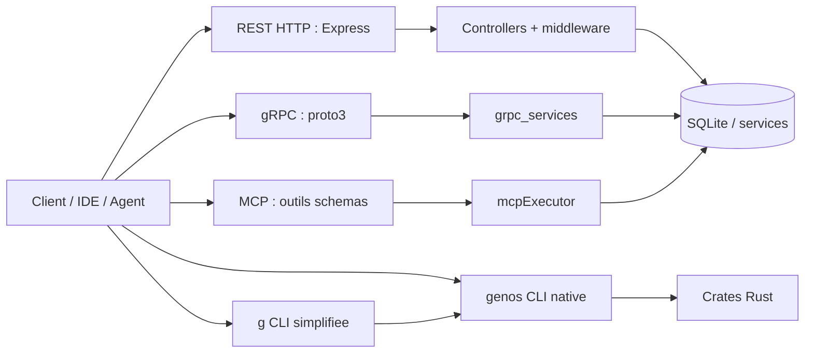
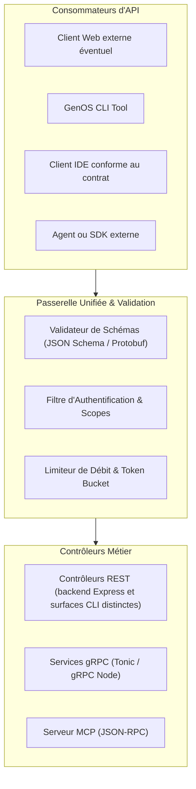
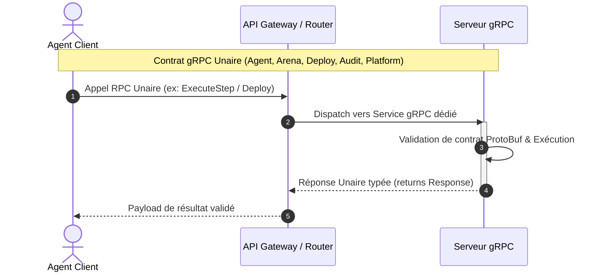

# API et contrats

## Definition

GenOS expose un plan de controle par REST/HTTP, gRPC/proto3, MCP et deux CLI Rust. Un contrat definit le chemin, la forme des donnees, les permissions, les codes d'erreur et les limites de compatibilite d'une de ces surfaces. Ces surfaces partagent des concepts (workspace, agent, snapshot, outil) mais ne sont pas des alias parfaits : chaque protocole possede son nommage, son envelope et ses garanties.

L'implementation REST est assemblee dans [backend/src/app.js](../../backend/src/app.js), les descripteurs gRPC sont dans [backend/proto](../../backend/proto), les services dans [backend/src/grpc_services](../../backend/src/grpc_services), et les contrats MCP dans [backend/src/services/mcpContract.js](../../backend/src/services/mcpContract.js). Le binaire natif est [crates/genos-cli/src/main.rs](../../crates/genos-cli/src/main.rs) ; la CLI simplifiee est [crates/genos-simple-cli/src/main.rs](../../crates/genos-simple-cli/src/main.rs).

## Architecture



Le serveur HTTP demarre typiquement sur `PORT=4000`. Les probes publiques sont `GET /healthz`, `GET /readyz` et `GET /livez`. Les routes `/api/*` passent ensuite par l'authentification globale, les permissions par route, le scope tenant quand il est requis, puis l'enveloppe d'erreur commune. gRPC ecoute par defaut en loopback sur `GRPC_PORT=50051`; un bind non loopback sans paire `GENOS_GRPC_TLS_KEY` / `GENOS_GRPC_TLS_CERT` est refuse.

## REST : controllers et routes

Les modules de routes declarent l'URL, les permissions et le controller. Le controller valide et orchestre les services ; les erreurs remontent vers `errorHandler`. Les familles principales sont :

| Prefixe | Responsabilite |
| --- | --- |
| `/api/auth`, `/api/sso`, `/api/secrets` | identite, session et secrets |
| `/api/workspaces`, `/api/workflows`, `/api/releases` | etat de travail, workflows et promotion |
| `/api/memory`, `/api/lineage`, `/api/trajectories`, `/api/traces` | memoire, provenance et traces |
| `/api/swarm`, `/api/arena`, `/api/strategies`, `/api/experiments` | orchestration et evaluation |
| `/api/mcp/*`, `/api/rust/*` | outils MCP et pont CLI natif (`POST /api/rust/models/generate` inclus, voir `rustBridgeRoutes.js`) |
| `/api/ide`, `/api/integrations`, `/api/webhooks`, `/api/plugins` | integrations externes |
| `/api/schema/*`, `/api/config/*`, `/api/control-plane/*` | metadonnees et operations |

Exemple REST pour executer un outil MCP (`backend/src/routes/mcpRoutes.js` monté sous `/api`, soit `POST /api/mcp/execute` ; variantes `POST /api/mcp/tools/test` et `POST /api/mcp/tools/dry-run`) :

```http
POST /api/mcp/execute
Authorization: Bearer <access-token>
Content-Type: application/json

{
  "toolName": "genos_replay",
  "args": { "snapshot_id": "snap-123" },
  "timeoutMs": 30000
}
```

Le controller normalise aussi `tool_name`/`timeout_ms` au niveau de l'envelope, mais les arguments d'outils doivent suivre le schema MCP. Le resultat repond `200` lorsqu'il est reussi, `502` lorsqu'un transport MCP configure echoue, et `503` lorsqu'il n'est pas configure ou qu'un garde-fou le bloque.

### Succes REST

REST n'a pas une enveloppe de succes universelle. Les lectures repondent souvent directement l'objet ou la liste ; les commandes peuvent repondre `{ "success": true, ... }`, `{ "accepted": true, ... }` ou une ressource creee avec `201`. Le client doit donc interpreter simultanement le code HTTP et le schema specifique de l'endpoint, pas uniquement un champ `success`.

Les en-tetes `X-Request-Id` et `X-Trace-Id` sont attaches par l'application. Les erreurs REST suivent l'enveloppe :

```json
{
  "error": {
    "code": "WORKSPACE_NOT_FOUND",
    "message": "Workspace not found in this project.",
    "requestId": "req-...",
    "traceId": "trace-...",
    "details": {}
  }
}
```

`requestId`, `traceId` et `details` sont optionnels. Ne pas parser un message humain pour piloter un client : utiliser `error.code` et le statut HTTP.

## Codes HTTP et erreurs

[backend/src/middleware/errorHandler.js](../../backend/src/middleware/errorHandler.js) centralise la correspondance suivante :

| HTTP | Codes typiques | Sens |
| ---: | --- | --- |
| 400 | `INVALID_ARGUMENT`, `VALIDATION_ERROR` | requete invalide |
| 401 | `UNAUTHORIZED`, `AUTH_REQUIRED` | authentification absente/invalide |
| 403 | `FORBIDDEN`, `PERMISSION_DENIED`, `ZERO_TRUST_DENIED` | autorisation refusee |
| 404 | `NOT_FOUND`, `*_NOT_FOUND` | ressource introuvable |
| 409 | `CONFLICT`, `DUPLICATE_RESOURCE` | conflit de version ou doublon |
| 422 | `UNPROCESSABLE_ENTITY` | donnees comprises mais non acceptables |
| 429 | `TOO_MANY_REQUESTS` | limitation de debit |
| 502 | `MCP_TOOL_ERROR` dans certains controllers | transport aval configure en echec |
| 503 | `TOOL_LOCKED`, `CIRCUIT_OPEN`, `UNAVAILABLE` | outil/service bloque ou indisponible |
| 504 | `TIMEOUT` | deadline expiree |

Une route inconnue repond `404` avec `NOT_FOUND`. Une exception non mappee repond `500` avec `INTERNAL_SERVER_ERROR`. Les controllers peuvent toutefois produire des reponses specialisees ; le schema de l'endpoint reste la source de verite.

## gRPC et proto3

Chaque fichier `.proto` declare un package `genos.<domaine>`, un service et des messages proto3. Les noms de champs gRPC sont en `snake_case`, par exemple :

```proto
service McpService {
  rpc ListTools (Empty) returns (ToolsListResponse);
  rpc CallTool (ToolCallRequest) returns (ToolCallResponse);
}

message ToolCallRequest {
  string tool_name = 1;
  string arguments_json = 2;
  uint32 timeout_ms = 3;
}
```

Le service MCP gRPC renvoie `contract_version: "genos.mcp/v1"` dans les succes. `CallTool` analyse `arguments_json`, execute l'outil et retourne le resultat serialize dans `content_json`. Pour une erreur gRPC correcte, le client doit lire le statut du callback, pas seulement le message de reponse.

[backend/src/services/grpcErrorMapper.js](../../backend/src/services/grpcErrorMapper.js) mappe les erreurs de domaine :

| Code de domaine | Statut gRPC |
| --- | --- |
| `INVALID_ARGUMENT`, `BAD_REQUEST` | `INVALID_ARGUMENT` |
| `*_NOT_FOUND` | `NOT_FOUND` |
| `UNAUTHENTICATED` | `UNAUTHENTICATED` |
| `FORBIDDEN`, `PERMISSION_DENIED` | `PERMISSION_DENIED` |
| `ALREADY_EXISTS` | `ALREADY_EXISTS` |
| `RESOURCE_EXHAUSTED` | `RESOURCE_EXHAUSTED` |
| `TIMEOUT` | `DEADLINE_EXCEEDED` |
| `UNAVAILABLE`, `TOOL_LOCKED`, `CIRCUIT_OPEN` | `UNAVAILABLE` |
| `FAILED_PRECONDITION` | `FAILED_PRECONDITION` |
| autre | `INTERNAL` |

### Limite gRPC : echecs dans le payload

La normalisation n'est pas universelle. Certains services historiques signalent un echec applicatif par une reponse gRPC transport-reussie, par exemple `success: false`, `exit_code`, `status` ou `error`, au lieu de retourner un statut gRPC non-OK. `CommandService.ExecuteCommand` repond ainsi `success: false` et `status: "invalid_command"` pour une commande invalide. Des services generes ou anciens peuvent aussi convertir une exception en valeurs vides ou booleen `false`.

Un client robuste doit donc appliquer :

$$
Succes_{operation} = (status_{gRPC}=OK) \land (success \ne false) \land (status_{payload}\notin Echec)
$$

Ne deduire aucune reussite metier du seul transport `OK`. Les nouveaux services doivent privilegier `grpcErrorMapper` et un code gRPC non-OK pour les erreurs de protocole, permission, indisponibilite et deadline.

## MCP : schemas, nommage et execution

MCP est la surface d'outils pour les agents. La version exposee est `genos.mcp/v1`. `getToolInputSchema()` construit les schemas JSON par outil et `mcpArgumentValidation` controle les types, champs obligatoires, bornes et caracteres dangereux avant execution.

Les arguments MCP sont canoniquement en `snake_case` : `agent_id`, `source_id`, `timeout_ms`, `mutation_rate`. Les envelopes HTTP acceptent temporairement `toolName`/`tool_name` et `timeoutMs`/`timeout_ms`. Pour certains outils, les alias historiques camelCase sont detectes afin de fournir un diagnostic ; le client doit migrer vers `snake_case` et ne jamais envoyer deux alias de valeurs differentes.

| Regle MCP | Exemple |
| --- | --- |
| chaine requise | `snapshot_id` non vide |
| entier non negatif | `budget_steps`, `tokens` |
| tableau de chaines sur | `scenarios`, `facts`, `steps` |
| enum | `backend` est `directory`, `hardlink` ou `copy_on_write` |
| timeout | normalise et borne par l'executor |

### Gating et validation des outils

Le service [`biomimeticToolGatingService.js`](../../backend/src/services/biomimeticToolGatingService.js)
classe lexicalement une requête et peut proposer des outils candidats. Ses valeurs
en millivolts sont des scores heuristiques internes : elles ne modélisent pas une
mesure physiologique et ne prouvent ni besoin d'outil, ni correction, ni absence
d'hallucination. Le RPC `McpService.EvaluateGating` expose ce calcul ; le résultat
ne remplace pas une autorisation.

Le helper `validateStericOrSchema()` dans `mcpContract.js` appelle un calcul
heuristique de correspondance d'arguments (`mcpLigandReceptorService.js`). Il est
couvert comme helper par un test unitaire, mais aucun appel de production à ce
helper n'a été trouvé dans le dispatch MCP. Il ne réalise pas une liaison chimique,
ne mesure pas une énergie de Gibbs et ne doit jamais être traité comme validation
de sécurité ou de schéma. Le dispatch backend appelle séparément
`validateToolArguments()`, puis vérifie registre, lease et gardes d'exécution.

`checkCnidocyteReflex()` compare quelques signatures textuelles et mesure le temps
local de son propre calcul. Ce filtre est incomplet par nature : il ne garantit pas
la détection d'injection et ne remplace ni parsing, ni validation, ni autorisation.
Le test [`test_cnidocyte_reflex_interception.js`](../../backend/tests/test_cnidocyte_reflex_interception.js)
vérifie ces signatures et cas synthétiques seulement.

Les tests [`test_mcp_direct_call_enforcement.js`](../../backend/tests/test_mcp_direct_call_enforcement.js),
[`test_mcp_server_parity.js`](../../backend/tests/test_mcp_server_parity.js) et
[`test_mcp_timeout_contract.js`](../../backend/tests/test_mcp_timeout_contract.js)
couvrent respectivement des cas d'enforcement, la parité minimale et le délai ; ils
ne certifient pas individuellement l'ensemble des outils MCP.

## CLI native et CLI simplifiee

### `genos` : CLI native

Le binaire Rust `genos` execute directement les commandes `agent`, `snapshot`, `diff`, `hallucination`, `replay`, `evolution`, `capsule`, `audit`, `merge`, `world`, `platform`, `strategy` et autres sous-commandes declarees par Clap. Il imprime principalement des objets JSON et utilise le code de sortie du processus comme premier signal de succes.

Le pont backend [backend/src/services/genosCli.js](../../backend/src/services/genosCli.js) lance le binaire dans une racine dediee et retourne une structure non rejetee :

```json
{
  "ok": false,
  "code": "BIN_NOT_FOUND",
  "error": "genos binary not found..."
}
```

En cas de lancement effectif, lire `ok`, `exitCode`, `stdout`, `stderr` et, si parse, `json`. Un JSON qui contient `success:true` ne doit pas contredire un `exitCode` non nul. Le bridge REST attache aussi le code de sortie CLI et une receipt de validation de schema quand un schema s'applique.

### `g` : CLI simplifiee

La CLI `g` est une couche ergonomique, non une seconde API native. Elle demarre/arrete un serveur, controle un PID, relaie des commandes vers `genos-cli` et consulte parfois l'API HTTP via `GENOS_API_URL` ou `GENOS_PORT`. Son port de repli est `8085`, distinct du backend Node `4000` : configurer explicitement l'URL pour eviter de viser la mauvaise surface.

Certaines commandes `g` possedent des valeurs par defaut demonstratives (`latest-snapshot`, `default-parent`). Elles sont des aides de CLI et ne garantissent pas l'existence de la ressource. Les operations destructrices demandent `--yes`.

## Versions et backward compatibility

GenOS n'expose pas un unique versionnement semantique transversal a REST, gRPC, MCP et CLI. Les regles explicites actuelles sont :

| Surface | Regle effective |
| --- | --- |
| Manifeste/JSON schema | `apiVersion` et `kind` font partie du contrat de fichier |
| MCP | version d'envelope `genos.mcp/v1` dans reponses et header REST |
| IDE | contrat JSON versionne ; meme major et client minor >= serveur minor |
| gRPC | compatibilite proto3 usuelle : conserver numeros de champs et RPC existants |
| REST | pas de prefixe `/v1` global ; compatibilite par aliases et evolution de controller |
| CLI | version du binaire et schemas de sortie a verifier par commande |

La compatibilite IDE est appliquee dans [backend/src/controllers/ideController.js](../../backend/src/controllers/ideController.js) : un major different ou un minor client inferieur produit `426 INCOMPATIBLE_IDE_VERSION`. Cette asymetrie signifie qu'un client plus recent dans le meme major est accepte, mais ses capacites ne sont pas garanties sans negotiation explicite.

Pour preserver la backward compatibility : ajouter des champs optionnels, conserver les noms/numéros proto existants, annoncer une nouvelle version MCP si le schema canonique change, accepter un alias temporaire sans ambiguite, et retourner un code d'erreur explicite avant de retirer l'ancien champ. Ne pas introduire un champ `success:true` comme substitut d'un resultat metier verifie.

## Reponses de succes mensongeres : prevention

Un "succes mensonger" survient lorsqu'un signal technique positif masque une absence de resultat applique ou verifie. Les exemples importants sont :

| Anti-pattern | Lecture correcte |
| --- | --- |
| HTTP `200` + `{ success:false }` | operation non reussie, meme si le transport REST l'est |
| gRPC `OK` + `success:false`/`error` | echec applicatif ; inspecter le payload |
| CLI exit `0` + rapport `UNVERIFIED` | commande terminee, conclusion non prouvee |
| replay `reconstructed` | trace ou etat reconstruit, pas re-execution deterministe externe |
| tool non configure `503` | aucune execution, pas un resultat vide valide |
| commande IDE enregistree mais `501` | contrat declare, handler absent |

Le client doit verifier l'invariant suivant avant une action irreversible :

$$
Eligible = TransportOK \land OperationOK \land EvidenceValide \land PolitiqueSatisfaite
$$

Dans GenOS, `EvidenceValide` peut inclure sortie de test, provenance ou approval receipt selon le contrat. `TransportOK` seul ne suffit jamais pour une promotion, un merge ou une conclusion metier.

## Cas d'utilisation

| Besoin | Surface recommandee | Controle |
| --- | --- | --- |
| Application Studio/web | REST `/api/*` | code HTTP, `error.code`, trace/request ID |
| Service interne type | gRPC/proto | statut gRPC et champ `success`/`status` |
| Agent ou IDE outille | MCP | schema d'outil, `snake_case`, permissions et timeout |
| Automatisation locale/offline | `genos` | `exitCode`, JSON schema et artefacts |
| Operateur interactif | `g` | URL API explicite, PID et `--yes` pour effets destructifs |
| Integration IDE | `/api/ide` | version compatible et scope workspace/tenant |

## Comparaison avec le marche

| Approche | Point fort habituel | Positionnement GenOS |
| --- | --- | --- |
| APIs REST SaaS | conventions HTTP, OpenAPI, evolution `/v1` | nombreuses routes et erreurs uniformes, mais pas de version majeure REST globale : les clients doivent versionner leurs integrations avec soin |
| gRPC microservices | schemas stricts et compatibilite par tags | protos riches et TLS hors loopback ; certains handlers legacy encodent encore l'echec dans le payload |
| MCP standard | decouverte d'outils et schemas JSON | ajoute politiques tenant/zero trust/circuit breaker et `genos.mcp/v1` ; les clients doivent appliquer le snake_case canonique |
| CLIs cloud | code de sortie et JSON automatise | `genos` privilegie les operations locales et le bridge ; `g` privilegie l'ergonomie mais depend d'une configuration de port/API coherente |
| API gateways | auth, quotas, trace et envelopes uniformes | middleware applicatif gere auth et correlation ; l'operateur reste responsable du proxy, TLS HTTP et politiques de production |

Le choix GenOS favorise l'operabilite multi-protocole et la verification d'actions d'agents. Son cout est une heterogeneite historique : aucun client ne doit supposer que tous les endpoints partagent les memes champs de succes ou la meme strategie de version.

## Checklist client et verification

1. Negocier ou verifier la version MCP/IDE/CLI avant une operation critique.
2. Envoyer les noms canoniques `snake_case` pour MCP et les champs proto.
3. Controler code HTTP ou statut gRPC, puis le statut applicatif du payload.
4. Conserver `requestId`, `traceId`, `exitCode`, `stderr` et receipts d'evidence pour audit.
5. Refuser promotion/merge lorsqu'une sortie est `unverified`, `reconstructed`, `accepted` ou `approvalRequired` sans les preuves/politiques complementaires.

Executer les tests de contrat concernes :

```powershell
node backend/tests/test_mcp_direct_call_enforcement.js
node backend/tests/test_mcp_server_parity.js
node backend/tests/test_mcp_timeout_contract.js
node backend/tests/test_security_immune_grpc_errors.js
node backend/tests/test_genome_manifest_validation.js
```

Le test de manifeste requiert le binaire Rust `target/debug/genos.exe` sous Windows. Les tests confirment les scenarios couverts ; ils ne rendent pas automatiquement compatibles les schemas non versionnes ni les integrations tierces.


---

## Schémas Complémentaires d'Architecture des Protocoles d'API

### 1. Passerelle Multi-Protocoles (REST, gRPC, MCP, CLI)



Les clients Web, extensions IDE et SDK de ce schéma sont des consommateurs
possibles, pas des applications distribuées par ce dépôt. Le backend REST est
Express ; Axum est utilisé par la CLI Rust pour ses fonctions locales, pas comme
deuxième implémentation du backend REST.

### 2. Séquence d'échange gRPC unaire



Le flux SSE disponible est `GET /api/telemetry/stream` (également
`GET /api/telemetry`) via `telemetryRoutes` et `telemetryController.streamSSE`.
Il exige les contrôles tenant/permission de télémétrie, envoie un événement de
connexion, jusqu'à dix événements récents et les événements reçus par le service
de télémétrie. Le contrat ne promet pas des événements nommés `evidence_barrier`
ou `complete` pour chaque mission.

### 3. Contrat de Gating Biomimétique des Outils (`EvaluateGating` & `BIOMIMETIC_GATING_POLICY`)

Le RPC `EvaluateGating` applique un classement lexical pour proposer ou non des
outils candidats. Il ne garantit pas l'absence d'hallucination et ne remplace pas
les contrôles d'autorisation à l'exécution. Les seuils en mV sont des valeurs
heuristiques, pas une simulation ni une mesure biologique. `AgentMission` transporte
des champs de configuration de gating, mais cela ne garantit pas que chaque client
ou runtime les applique.

```mermaid
sequenceDiagram
    autonumber
    actor Client as Client / Orchestrateur
    participant Gating as biomimeticToolGatingService
    participant Contract as mcpContract (BIOMIMETIC_GATING_POLICY)
    participant LLM as Modèle Compact 7B

    Client->>Gating: evaluateToolGating(query, candidateTools)
    Note over Gating: Calcul Vm (repos -70mV, seuil -55mV)\n+ Filtrage Thalamique
    alt Vm < Seuil (Requête purement conversationnelle)
        Gating-->>Client: requiresTools=false, disinhibitedTools=[]
        Client->>LLM: Prompt direct sans schémas d'outils
        LLM-->>Client: Réponse fluide en langage naturel
    else Vm >= Seuil (Action système requise)
        Gating-->>Contract: getGatedToolSchemas(query, disinhibitedTools)
        Contract-->>Client: Schémas stricts des seuls outils désinhibés
        Client->>LLM: Prompt ciblé avec schémas pertinents (1 à 3 outils)
        LLM-->>Client: Réponse du modèle ; la validité doit être vérifiée séparément
    end
```

#### Extensions Protobuf :
* **`AgentMission` (`proto/agent.proto`) :**
  - `bool tool_gating_enabled = 21` : Active le gating amont pour la mission.
  - `float gating_threshold_mv = 22` : Seuil de dépolarisation critique en mV (défaut : `-55.0`).
  - `string disinhibited_tools_json = 23` : Tableau JSON des outils autorisés après désinhibition striatale.
* **`McpService` (`proto/mcp.proto`) :**
  - RPC `EvaluateGating (GatingRequest) returns (GatingResponse)` :
    - `GatingRequest` : `{ string query = 1; repeated string candidate_tools = 2; float threshold_mv = 3; }`
    - `GatingResponse` : `{ bool requires_tools = 1; repeated string disinhibited_tools = 2; float membrane_potential_mv = 3; string gate_state = 4; string reason = 5; }`

## Voir aussi (AgentDNA)

- [AGENT_DNA_RUNTIME.md](../01-concepts/agent-dna-runtime.md) — surface REST `/api/genomes` (list/get/import), opérations `POST /api/genomes/:id/operations/:op`, innovations (`/api/genomes/innovations`) et politique de signature (`/api/genomes/policy`).


