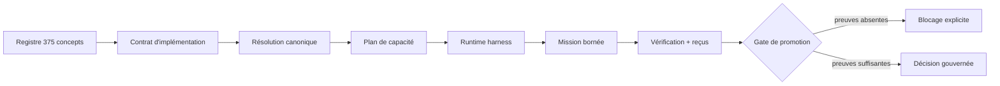

# Contrats philosophiques dans l’Ontogenèse

- **Statut** : Partiel — préparation expérimentale raccordée, validation runtime séparée
- **Portée** : résolution des concepts philosophiques, plans de mission et runtime harness
- **Dernière revue** : 2026-10-05
- **Référence principale** : [ADR 0319](../adr/0319-raccord-contrats-philosophiques-ontogenese.md)

Cette fiche décrit comment les contrats d’implémentation des 375 concepts
philosophiques entrent dans le cycle Ontogenèse. Elle distingue trois niveaux
qui ne doivent jamais être confondus :

1. le concept et sa tradition restent déclaratifs ;
2. le contrat décrit un comportement à expérimenter ;
3. le runtime peut recevoir ce contrat comme contexte, sans obtenir une
   permission ni une promotion implicite.

La règle d’autorité reste celle du dépôt : un transport réussi n’est pas une
preuve de décision valide.

## 1. Définition et statut

Un **contrat philosophique** est la compilation versionnée d’une entrée du
registre vers une interprétation opérationnelle. Il contient notamment un
invariant, un mécanisme partagé, des cibles GenOS, des observables, des tests de
falsification, des limites, un scénario et une expérience comparative.

Le compilateur se trouve dans
`backend/src/philosophy/implementationContracts.js`. Il produit 375 contrats :
21 pilotes détaillés et 354 contrats reliés à un mécanisme partagé avec l’état
`mapped-pending-behavior`. Cet état signifie que le contrat est préparé pour une
expérience ; il ne signifie pas que le comportement est intégré ou validé.

| État | Signification | Autorité accordée |
| --- | --- | --- |
| `ready-for-experiment` | schéma, scénario, falsification et matrice expérimentale valides | contexte de planification seulement |
| `tested` | une expérience a produit un reçu de scénario admissible | aucune promotion seule |
| `integrated` | scénario et runtime ont produit les reçus requis | soumission à la gate générale |
| `validated` | scénario, runtime et vérification indépendante sont présents | décision de promotion encore gouvernée |

La maturité du contrat est distincte du statut du concept (`implemented`,
`partial`, `interpretive`, `disputed`, `planned` ou `registered`) et de la
maturité du service associé.

## 2. Pipeline complet

```text
Registre philosophique
        ↓
Compilateur de contrats
        ↓
Résolution Ontogenèse
        ↓
Plan de capacité de mission
        ↓
Runtime harness / runner
        ↓
Observations + reçus
        ↓
Vérification indépendante
        ↓
Gate de promotion
```

Les contrats sont résolus à deux moments :

- `canonicalConceptRegistry` attache le contrat complet et une référence
  compacte à chaque entrée philosophique ;
- `missionCapabilityPlanService` déduplique les contrats sélectionnés ou
  explicitement demandés et les inscrit dans `philosophicalContracts`.

Le `runtimeHarness` transmet ensuite cette liste au runner dans le champ
`philosophicalContracts`. Le runner reçoit donc une spécification et ses
conditions d’audit ; il ne reçoit pas de droit supplémentaire.

## 3. Structure d’une référence transportée

Le plan ne recopie pas nécessairement le contrat complet dans chaque message.
Il transporte une référence compacte :

```json
{
  "id": "epistemology.knowledge",
  "category": "evaluation",
  "maturity": "tested",
  "compilationState": "pilot",
  "readiness": "ready-for-experiment",
  "scenarioId": "scenario.evaluation",
  "experimentId": "experiment.ed9a1aae18606d9a",
  "evidenceRequired": [
    "scenario-input",
    "scenario-output",
    "comparison-receipt"
  ],
  "topologies": [
    "isolated_critics",
    "centralized",
    "federated",
    "peer_to_peer"
  ],
  "promotionEligible": false
}
```

Les identifiants de scénario et d’expérience sont déterministes à partir de
l’identifiant du concept et de la catégorie. Une modification de ces éléments
doit donc produire une nouvelle empreinte expérimentale et être couverte par
les tests du registre.

## 4. Résolution dans le registre canonique

`resolveConceptReference(reference, topology)` suit l’ordre de résolution
existant : adaptateur, worker, cycle de vie, runtime, capacité, interface,
chaîne centrale, philosophie, graphe de capacités, documentation.

Lorsqu’une entrée philosophique est trouvée, la réponse comporte :

| Champ | Rôle |
| --- | --- |
| `source: philosophy` | indique que la référence vient du registre philosophique |
| `available` | indique si la lecture est autorisée par la topologie demandée |
| `executable: false` | interdit de présenter le concept comme primitive runtime |
| `implementationContract` | contrat complet pour inspection et planification |
| `implementationContractReference` | version compacte pour le plan et le runner |
| `access: read` | limite l’usage à la lecture et à la préparation |

L’absence de topologie ou de capacité de lecture peut donc bloquer le concept
dans `blockedConcepts`, sans supprimer son contrat du catalogue. Cette
distinction permet de diagnostiquer un problème d’autorisation sans transformer
un concept en capacité implicite.

## 5. Plan de capacité Ontogenèse

`buildMissionCapabilityPlan()` conserve les champs historiques du plan et ajoute :

```json
{
  "philosophicalContracts": {
    "required": true,
    "promotionEligible": false,
    "contracts": ["… références compactes …"]
  }
}
```

Les entrées proviennent de l’union des concepts sélectionnés par le domaine et
des concepts explicitement résolus. Elles sont dédupliquées par identifiant
stable. Le plan est donc déterministe pour une même mission, une même
topologie et un même registre.

Le plan conserve également :

- `resolvedConcepts`, y compris les concepts bloqués ;
- `blockedConcepts` et `blockedCapabilities` ;
- `topologyContract` et l’organisation choisie ;
- `evidence`, qui exige des vérifications indépendantes avant promotion ;
- `recovery`, qui garde les bornes de reprise et le dead-letter `WAITING_INPUT`.

## 6. Transmission au runtime

Le runtime harness construit une requête qui contient :

```text
conceptResolution       → provenance et disponibilité des références
missionCapabilityPlan   → contrat de planification complet
philosophicalContracts  → références des contrats philosophiques
requiredTools           → leases déjà calculées par la topologie
requiresEvidenceBeforePromotion = true
```

Le texte de mission expose les contrats comme contexte contrôlé. Il rappelle
la topologie, la variante, les concepts bloqués et les preuves attendues. Un
worker ne peut pas utiliser ce contexte pour modifier une lease, contourner
`authority`, écrire hors du workspace ou promouvoir un résultat.



## 7. Scénarios, topologies et preuves

Chaque contrat déclare un scénario dans l’une des cinq catégories :

| Catégorie | Perturbation | Observation attendue |
| --- | --- | --- |
| `state` | retirer ou perturber une représentation d’état | différence d’état détectée et tracée |
| `transformation` | exécuter une variation contrôlée | transition et effet comparables |
| `constraint` | soumettre une action interdite | action signalée ou refusée |
| `organization` | comparer deux organisations | coût et distribution des décisions mesurés |
| `evaluation` | retirer une preuve ou changer un critère | confiance ou verdict révisé |

La matrice minimale compare `isolated_critics`, `centralized`, `federated` et
`peer_to_peer`. Cette déclaration définit le protocole attendu ; elle ne prouve
pas que chaque topologie a été exécutée ni qu’une variante est supérieure.

Les preuves minimales du plan sont :

1. `scenario-input` — entrée normalisée et contexte initial ;
2. `scenario-output` — sortie observée et métriques ;
3. `comparison-receipt` — comparaison contrôlée avec le baseline.

Pour progresser, la barrière de maturité exige ensuite :

| Cible | Reçus requis |
| --- | --- |
| `observable` | `observation-receipt` |
| `tested` | `scenario-receipt` |
| `integrated` | `scenario-receipt`, `runtime-receipt` |
| `validated` | précédents + `independent-receipt` |

`assessContractPromotion` signale les reçus manquants et maintient
`promotionEligible: false`. Il ne remplace ni l’exécution, ni la gate générale,
ni l’approbation éventuellement requise.

## 8. Cycle de vie d’une mission

1. **Planification** : résolution des concepts et compilation du plan.
2. **Admission** : contrôle de topologie, budgets, leases et autorité.
3. **Exécution** : runner isolé avec `requiresEvidenceBeforePromotion`.
4. **Vérification** : contrôles configurés, empreinte du workspace et preuves.
5. **Intégration** : passage par l’écrivain unique d’Ontogenèse.
6. **Réévaluation** : conservation des échecs, décisions et contre-exemples.
7. **Promotion** : uniquement après gate et preuves applicables.

Un échec du contrat philosophique retourne une observation falsifiante ou un
blocage ; il ne devient pas automatiquement une erreur de la théorie source.
Inversement, un scénario réussi ne démontre pas une vérité philosophique
générale : il démontre seulement un comportement dans le protocole exécuté.

## 9. Vérification reproductible

Les tests de raccordement sont :

```powershell
node backend/tests/test_ontogenesis_concept_registry.js
node backend/tests/test_ontogenesis_capability_plan.js
node backend/tests/test_ontogenesis_mission_context.js
node backend/tests/test_ontogenesis_developmental_runtime.js
node backend/tests/test_ontogenesis_strategy_bridge.js
npm --prefix backend run test:quality
```

Les tests vérifient notamment que :

- les 375 concepts restent présents dans le catalogue canonique ;
- un concept philosophique expose son contrat et sa référence compacte ;
- les contrats sélectionnés entrent dans le plan et la requête du harness ;
- les références sont dédupliquées et restent non promouvables ;
- les concepts non disponibles restent bloqués sans élargir les autorisations.

## 10. Limites et non-objectifs

- Le raccordement ne crée pas 375 modules runtime.
- Un contrat `ready-for-experiment` n’est pas une preuve d’exécution.
- Le harness ne certifie pas la validité philosophique d’une interprétation.
- Les topologies déclarées doivent encore être exécutées avec des protocoles et
  des baselines réelles pour produire des reçus.
- L’absence de capacité `genos_philosophy` peut bloquer la lecture runtime ;
  le contrat reste consultable dans le registre local.
- La résolution de contrat ne modifie ni lease, ni budget, ni branche, ni
  approbation humaine.

## Voir aussi

- [Registre philosophique](registre-philosophique.md) — source et gouvernance des 375 entrées.
- [Contrats stables de l’Ontogenèse](ontogenese-contrats.md) — persistance, états, intégration et CLI.
- [Ontogenèse](../01-concepts/ontogenese.md) — modèle conceptuel et boucle de mission.
- [Morphogenèse](../02-orchestration/topologies/morphogenese.md) — sélection et composition des organisations.
- [Schéma des contrats](../../spec/implementation-contract.schema.json) — format versionné.
- [ADR 0318](../adr/0318-contrats-implementation-concepts.md) — compilation des contrats.
- [ADR 0319](../adr/0319-raccord-contrats-philosophiques-ontogenese.md) — raccord au cycle Ontogenèse.
