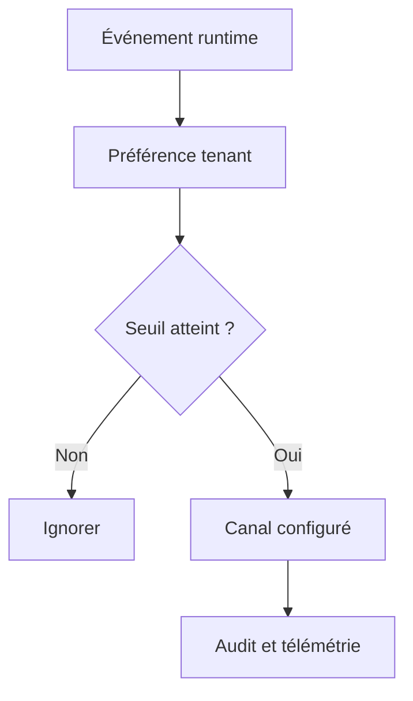

# Notifications et alertes tenant-scoped

- **Statut** : Implémenté
- **Portée** : préférences persistées, seuils et canaux d’événements.
- **Dernière revue** : 2026-09-18

## 1. Modèle

Les préférences sont stockées dans `notification_preferences` et portent le scope
organisation/projet. Elles ne doivent pas permettre à un projet de modifier les
préférences d’un autre.



## 2. Décision

\[
Notify(e,p)=Enabled(p,e.type)\land Severity(e)\geq Threshold(p)
\]

L’écriture est acceptée seulement si le tenant de la requête correspond au tenant de
la préférence.

## 3. Exemple

```http
POST /api/evaluation/notifications
Content-Type: application/json

{"WORKER_FAILED":{"enabled":true,"channels":["telemetry"],"threshold":"warning"}}
```

## 4. Migration et vérification

La migration de portée transforme les préférences historiques en préférences
tenant-scoped. Une validation doit vérifier la conservation des valeurs, l’isolation
entre projets et le comportement par défaut d’un événement non configuré.

## 5. Limites

Une notification est un signal d’exploitation, pas une preuve de correction. La
télémétrie et l’audit doivent conserver les identifiants de corrélation permettant de
reconstruire l’événement d’origine.
