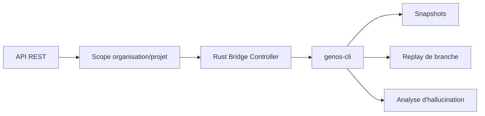

# Pont REST vers le cœur Rust et analyse des hallucinations

- **Statut** : Implémenté
- **Portée** : snapshots, diff, replay et opérations d’analyse exposés par le backend.
- **Dernière revue** : 2026-09-18

## 1. Architecture



Le bridge est une fenêtre contrôlée vers `genos-cli`. Il ne contourne ni les
permissions backend ni le confinement tenant.

## 2. Routes

| Méthode | Route | Fonction |
| --- | --- | --- |
| `GET` | `/api/rust/status` | état du bridge |
| `GET` | `/api/rust/snapshots` | liste des snapshots |
| `POST` | `/api/rust/snapshots` | crée un snapshot |
| `POST` | `/api/rust/hallucination/detect` | détecte |
| `POST` | `/api/rust/hallucination/analyze` | analyse |
| `POST` | `/api/rust/hallucination/extract` | extrait |
| `POST` | `/api/rust/hallucination/simulate` | simule |
| `POST` | `/api/rust/replay` | rejoue une branche |
| `POST` | `/api/rust/diff` | compare deux snapshots |

## 3. Modèle d’analyse

L’analyse compare les affirmations et les éléments d’evidence :

\[
H=f(C,E,S,R)
\]

où `C` désigne les claims, `E` les evidences, `S` le snapshot et `R` la trajectoire
rejouée. Une affirmation non prouvée n’est pas nécessairement une affirmation fausse ;
elle doit rester marquée comme incertaine.

## 4. Exemple

```http
POST /api/rust/diff
Content-Type: application/json

{"left":"snapshot-a.json","right":"snapshot-b.json"}
```

Le client doit vérifier le statut de l’opération et le rapport produit, pas seulement
l’absence d’erreur de transport.

## 5. Garde-fous

Toutes les opérations nécessitent un scope explicite. Les opérations mutantes exigent
une permission d’écriture ; replay et simulation sont soumises aux permissions
d’expérimentation. Les erreurs du CLI doivent être propagées avec un code non ambigu.
