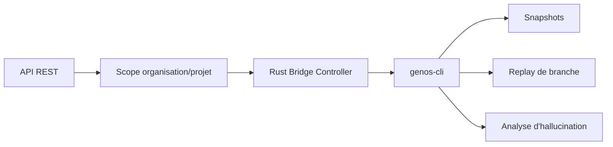

# Pont REST vers le cœur Rust et analyse des hallucinations

- **Statut** : intégré, avec ingestion biologique tenant-scoped
- **Portée** : snapshots, diff, replay, opérations d’analyse, reçus biologiques et autorisations cliniques via backend.
- **Dernière revue** : 2026-10-06 (contrat clinique).

## 1. Architecture


```mermaid
flowchart LR
  REST[API REST] --> Guard[Scope organisation/projet]
  Guard --> Bridge[Rust Bridge Controller]
  Bridge --> CLI[genos-cli]
  CLI --> Snapshot[Snapshots]
  CLI --> Replay[Replay de branche]
  CLI --> Analysis[Analyse d'hallucination]
```

Le bridge est une fenêtre contrôlée vers `genos-cli`. Il ne contourne ni les
permissions backend ni le confinement tenant.

## 2. Routes

| Méthode | Route | Fonction |
| --- | --- | --- |
| `GET` | `/api/rust/status` | état du bridge |
| `POST` | `/api/rust/biological-receipts` | ingère un reçu Rust après authentification, permission `experiment:run` et vérification que la mission appartient au projet courant |
| `POST` | `/api/rust/clinical-authorizations` | émet une autorisation signée après scope mission, permission security:manage, approbation explicite et permission all du signataire; ne déclenche pas de traitement |
| `GET` | `/api/rust/snapshots` | liste des snapshots |
| `POST` | `/api/rust/snapshots` | crée un snapshot |
| `POST` | `/api/rust/hallucination/detect` | détecte |
| `POST` | `/api/rust/hallucination/analyze` | analyse |
| `POST` | `/api/rust/hallucination/extract` | extrait |
| `POST` | `/api/rust/hallucination/simulate` | simule |
| `POST` | `/api/rust/replay` | rejoue une branche |
| `POST` | `/api/rust/diff` | compare deux snapshots |

Le reçu est dans `body.receipt` (ou directement dans le corps JSON). Une
nouvelle ingestion répond `201`; un doublon identique répond `200`. Le contrôle
de tenant exige une appartenance projet en écriture pour l'agent rattaché à la
mission. Cette route ne prouve pas encore l'origine Rust du contenu et aucun
expéditeur Rust automatique n'est branché.

### Autorisation clinique

La cellule doit appartenir à la population Rust courante et disposer d’un génome et d’un reçu source. Les variantes et paramètres sont validés avant signature. La CLI restaure le journal et applique le type et la cible signés; son reçu conserve applied, no_target ou refused. Sans journal ou autorisation, elle renvoie not_executed. Voir le [contrat API et CLI](api-et-contrats.md#autorisation-et-application-cliniques) et le [bilan daté](../06-qualite-preuves/validation-nosologie.md), qui ne déclare pas de réussite du parcours HTTP → Rust complet.

## 3. Modèle d’analyse

L’analyse compare les affirmations et les éléments d’evidence :

\[
H=f(C,E,S,R)
\]

où `C` désigne les claims, `E` les evidences, `S` le snapshot et `R` la trajectoire
rejouée. Une affirmation non prouvée n’est pas nécessairement une affirmation fausse ;
elle doit rester marquée comme incertaine.

## 4. Exemple

```http
POST /api/rust/diff
Content-Type: application/json

{"left":"snapshot-a.json","right":"snapshot-b.json"}
```

Le client doit vérifier le statut de l’opération et le rapport produit, pas seulement
l’absence d’erreur de transport.

## 5. Garde-fous

Toutes les opérations nécessitent un scope explicite. Les opérations mutantes exigent
une permission d’écriture ; replay et simulation sont soumises aux permissions
d’expérimentation. Les erreurs du CLI doivent être propagées avec un code non ambigu.
