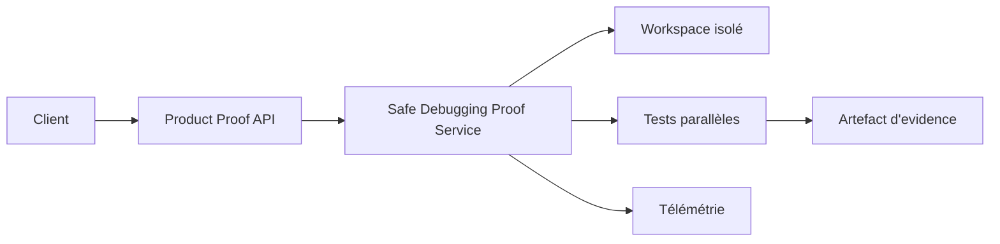

# Preuves produit et safe debugging

- **Statut** : Implémenté
- **Portée** : API Product Proofs, preuve de débogage parallèle sûr et inspection de workspace.
- **Dernière revue** : 2026-09-18

## 1. Objectif

Une réponse HTTP réussie ne constitue pas une preuve de correction. Le service Product
Proofs expose une exécution contrôlée du scénario de safe debugging et conserve les
événements permettant de vérifier le résultat.

## 2. Contrat HTTP

La surface est montée sous `/api/product-proofs` :

| Méthode | Route | Fonction |
| --- | --- | --- |
| `GET` | `/safe-debugging` | décrit la preuve disponible |
| `POST` | `/safe-debugging/run` | exécute la preuve complète |
| `GET` | `/safe-debugging/workspaces/:workspaceId` | inspecte un workspace |
| `POST` | `/safe-debugging/workspaces/:workspaceId/run` | exécute le test du workspace |

Les opérations d’écriture exigent une permission d’expérimentation et un scope
organisation/projet explicite.

## 3. Architecture



## 4. Modèle de preuve

La validité exige la conjonction des étapes :

\[
P_{valid}=P_{transport}\land P_{execution}\land P_{test}\land P_{evidence}
\]

Un transport réussi mais une exécution non vérifiée produit donc une réponse non
probante. Le service émet `PRODUCT_PROOF_STARTED`, `PRODUCT_PROOF_COMPLETED` ou
`PRODUCT_PROOF_FAILED`.

## 5. Exemple

```http
POST /api/product-proofs/safe-debugging/run
Content-Type: application/json

{"mission":"reproduire une erreur dans deux branches isolées"}
```

Le résultat doit être lu avec le code HTTP, le statut d’exécution et l’artefact
d’evidence. Un `202` ou un champ `success` seul ne suffit pas.

## 6. Limites et validation

La preuve couvre le scénario implémenté ; elle ne démontre pas la correction générale
d’un modèle ni l’absence de bugs hors du workspace testé. Les tests associés doivent
vérifier un succès, un échec de test et un workspace hors scope.

Voir [epistemologie-et-evidence.md](../01-concepts/epistemologie-et-evidence.md) et
[tests-et-validation.md](../06-qualite-preuves/tests-et-validation.md).
