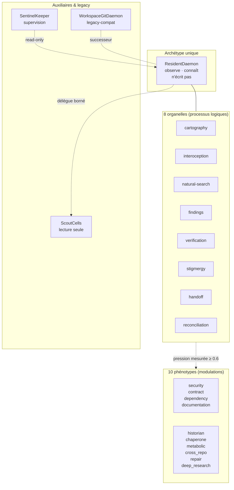
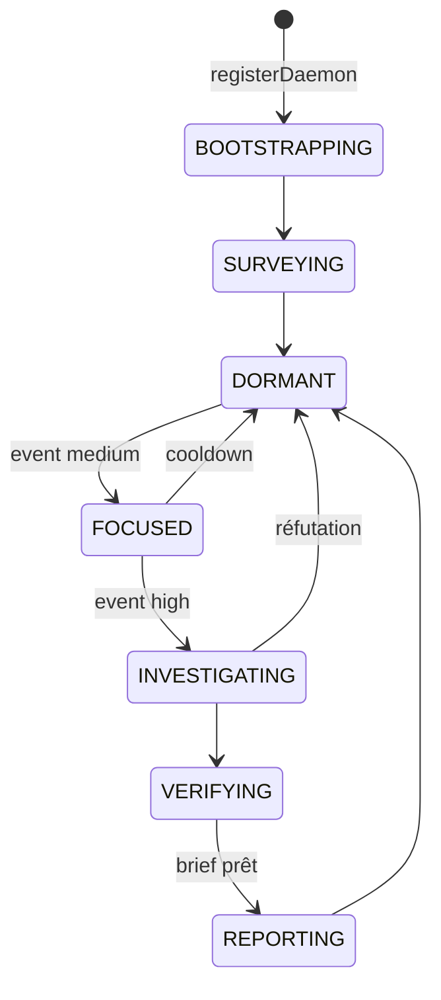
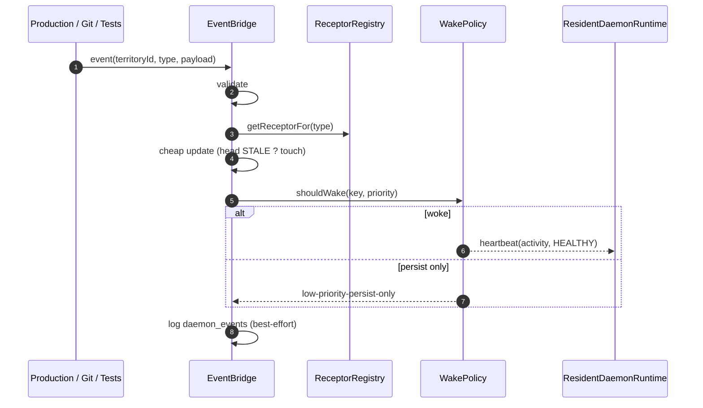
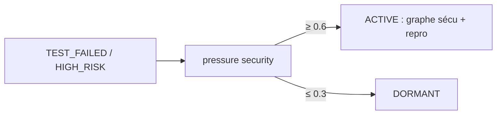
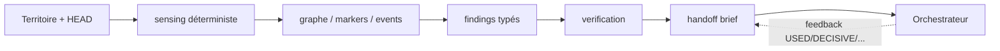
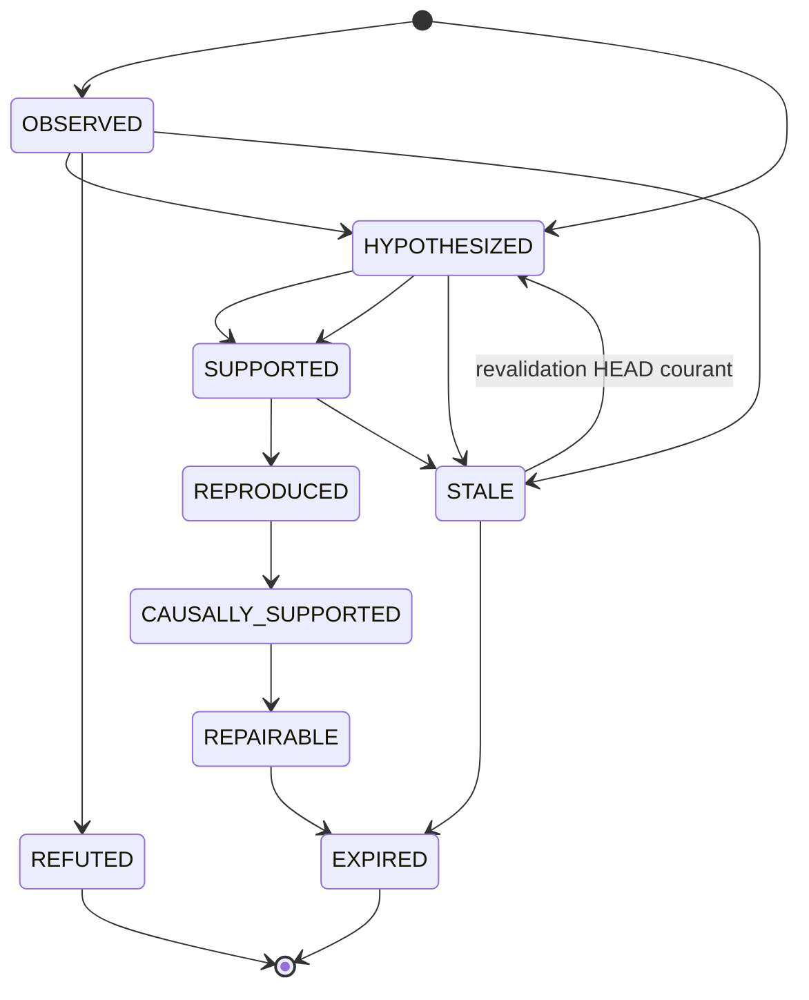
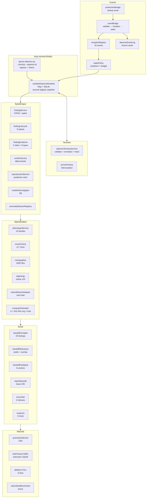

# Types de daemons GenOS

- **Statut** : Partiel — archétype `ResidentDaemon` implémenté (runtime, territoires, findings, handoffs, réconciliation, évaluation) ; maturité `EXPERIMENTAL` ; preuve live trop petite pour conclure.
- **Portée** : `backend/src/services/daemon/*`, `backend/bin/genos-daemon.cjs`, génomes `agents/daemons/*`, specs `spec/daemon-*.schema.json` et `spec/resident-daemon.schema.json`.
- **Dernière revue** : 2026-09-25

Ce document est le catalogue de référence des daemons. Il suit le même niveau
d'exigence que la fiche [Morphogenèse](../02-orchestration/topologies/morphogenese.md) :
définition, statut des modèles, représentation formelle, contrats, architecture,
processus, schémas par type, garde-fous et état d'implémentation. Chaque affirmation
décrit l'état réel du code ; la présence d'un service ou d'un test ne prouve pas
un bénéfice en mission réelle.

Règle de fond : un transport réussi n'est pas une décision valide. Un signal daemon
n'est pas une preuve. Une finding n'est jamais « vraie » : elle a un statut, des
preuves typées, des limitations et une provenance.

Références normatives :

- [ADR 0034](../adr/0034-resident-daemon-ecology.md) — écologie des daemons résidents (accepté).
- [ADR 0079](../adr/0079-daemons-symbiontes-residents.md) — daemons comme symbiontes résidents (accepté).
- [État de maturité des daemons](../04-exploitation/etat-maturite-daemons.md) — revue de référence.
- [Types de workers](types-de-workers.md) — catalogue des 19 `WorkerKind`, dont `resident_daemon`.

---

## 1. Définition

Un **daemon GenOS** est un processus agentique persistant, lié à un territoire,
dont la fonction première est de maintenir un modèle du territoire fondé sur des
preuves, à travers les missions :

> Le daemon observe et connaît. L'orchestrateur décide. Le worker intervient.
> Jamais l'inverse.

Formellement (définition opérationnelle, pas un théorème) :

```text
Daemon : Territoire × Sondes × PolitiqueSignal → SignauxProvenancés
Finding : Territoire × HEAD × Claim × PreuvesTypées × Limitations → StatutÉpistémique
```

Invariants centraux (ADR 0034, génome, schémas) :

1. **Observation seule.** `filesystem_write = false`, `git_push = false`,
   `merge = false`. Signaux autorisés : `READ, INDEX, OBSERVE, TEST_SAFE, SNAPSHOT, SIGNAL`.
2. **Territoire ≠ vérité globale.** Toute connaissance est scopée `territoire + HEAD`.
   Un finding établi sur `HEAD=ABC` ne vaut pas vérité sur `HEAD=XYZ` sans revalidation.
3. **Persistance ≠ autorité.** Être résident ne confère aucun droit d'écriture, de
   commit, de push ou de merge. Toute mutation exige un lease ou un gate explicite
   (ex. `RepairEpisode`).
4. **Signal ≠ preuve.** Un `TERRITORY_BRIEF_READY` ordonne l'attention ; il ne
   prouve rien. La promotion passe par les gates d'évidence et la gouvernance.
5. **Dégradation gracieuse.** Pas de daemon = la mission continue. Daemon périmé =
   `brief.stale = true`. Daemon crashé = la mission continue. Le pont de production
   ne lève jamais et ne crée jamais de territoire implicite.

Non-objectifs : le daemon ne choisit pas la mission humaine, n'exécute pas de
mission, ne fait pas de spawn, ne répare pas directement, ne pousse pas de branche,
n'admet pas de symbionte.

---

## 2. Statut des modèles

Comme pour la morphogenèse, les formules de cette fiche ont des statuts différents :

| Statut | Signification | Exemple daemon |
|---|---|---|
| **Invariant logiciel** | contrôlé par précondition, validateur ou `CHECK` SQL | `filesystemWrite const false`, transitions findings fermées, `headSha ^[a-f0-9]{40}$` |
| **Résultat empirique** | protocole + données reproductibles | point live 2026-09-24 (2 triples, fixture, modèle local) — directionnel, pas une promotion |
| **Heuristique** | règle déterministe ou score non calibré | seuils phénotypes `0.6 / 0.3`, cooldown wake `5 s`, poids de pertinence, utilité LLM `0.25` |
| **Analogie** | vocabulaire biologique d'organisation | archétype, organelles, phénotypes, stigmergie, interoception, métabolisme |
| **Vérifié formellement** | accepté par un prouveur avec environnement explicite | aucun dans le périmètre daemon à ce jour |

Conséquence : les seuils, poids et scores ci-dessous sont des heuristiques à
calibrer. Les opérateurs décrivent une sémantique souhaitée et testée sur les cas
couverts, pas une garantie universelle. Les tests de contrat démontrent seulement
les cas qu'ils exécutent.

---

## 3. Cartographie des types

Il n'existe qu'un seul **archétype** de daemon résident. Tout le reste est soit
un **organe interne** (organelle), soit un **phénotype écologique** (modulation
d'attention sous pression), soit un **auxiliaire borné**, soit un **legacy
reclassé**. Il n'y a jamais une liste de daemons spécialisés lancés au démarrage.

| Catégorie | Membres | Nature réelle dans le code |
|---|---|---|
| Archétype unique | `ResidentDaemon` | `agents/daemons/resident_daemon.agent.json`, `spec/resident-daemon.schema.json`, `residentDaemonRuntime.js` |
| Organelles (8) | `cartography`, `interoception`, `natural-search`, `findings`, `verification`, `stigmergy`, `handoff`, `reconciliation` | modules sous `backend/src/services/daemon/*`, jamais des processus séparés |
| Phénotypes (10) | `security`, `contract`, `dependency`, `documentation`, `historian`, `chaperone`, `metabolic`, `cross_repo`, `repair`, `deep_research` | lignes `daemon_phenotypes` + `PHENOTYPE_PROFILES`, modulent organes/mémoire/rang handoff, jamais l'identité |
| Auxiliaire borné | `ScoutCells` | `scouting/scoutColonyService.js`, lecture seule, TTL 5 min, 12 cellules max |
| Superviseur control plane | `SentinelDaemonKeeper` | `agents/integration/sentinel_daemon_keeper.agent.json`, `daemonSupervisorService.js` + `daemonAgentAutostart.js`, vue liveness seule, ne produit pas de findings métier |
| Compatibilité historique | `WorkspaceGitDaemon` | `agents/orchestration/workspace_git_daemon.agent.json`, `daemonRepoWorkerService.js`, autofix en no-op permanent |
| Candidat Holobionte | kind `DAEMON` | adaptateur Holobionte (ADR 0079) : découverte ≠ admission, exécution sous runtime daemon |



---

## 4. Représentation formelle

### 4.1 Descripteur daemon

```text
DaemonDescriptor = ⟨ id, territoryId, genomeRef, activity, health,
  authority, organelles, cognitiveRevisions, createdAt, updatedAt ⟩
```

- `id : ^daemon\.[a-z0-9]+(-[a-z0-9]+)*$`
- `territoryId : ^territory\.[a-z0-9]+(-[a-z0-9]+)*$`
- `genomeRef = agents/daemons/resident_daemon.agent.json`
- `activity ∈ {BOOTSTRAPPING, SURVEYING, DORMANT, FOCUSED, INVESTIGATING, VERIFYING, REPORTING}`
- `health ∈ {HEALTHY, STRESSED, DEGRADED, SENESCENT, APOPTOTIC}`
- `authority = { filesystemWrite: false, gitPush: false, merge: false, allowedSignals ⊂ {READ, INDEX, OBSERVE, TEST_SAFE, SNAPSHOT, SIGNAL} }`
- `organelles ⊂ {cartography, interoception, natural-search, findings, verification, stigmergy, handoff, reconciliation}`
- `cognitiveRevisions : integer ≥ 0` — révisions coûteuses (mutations phénotype,
  rebuilds, promotions repair échouées), pas des ticks.

**Invariants :**

```text
∀ d : writes_mission(d) = ∅ ∧ spawn(d) = ∅ ∧ promote_direct(d) = faux
∀ d : activity(d) ∈ TRANSITIONS[prev] ∨ activity(d) = prev
territory(d1) = territory(d2) ∧ d1 ≠ d2 → daemon-territory-conflict
```

Source : `spec/resident-daemon.schema.json`, `backend/src/services/daemon/residentDaemonRuntime.js:21-48`.

### 4.2 Territoire

```text
DaemonTerritory = ⟨ id, organizationId, projectId, workspaceId, repoIdentity,
  rootPath, scopePath, ref, headSha, state, parentTerritoryId?, metadata? ⟩
```

- `id : ^territory\.…`, `headSha : ^[a-f0-9]{40}$` (SHA Git complet, jamais deviné).
- `state ∈ {BOOTSTRAPPING, SURVEYING, ACTIVE, DORMANT, STALE, DEGRADED, APOPTOTIC}`.
- `scopePath` normalisé `/…/` avec slash final.
- `ACTIVE → STALE` automatique quand `headSha` avance (`updateHead`).
- `isKnowledgeStale ⇔ territory.headSha ≠ findingHeadSha`.

Source : `spec/daemon-territory.schema.json`, `backend/src/services/daemon/daemonTerritoryService.js:23-42`.

### 4.3 Finding

```text
DaemonFinding = ⟨ id, territoryId, claim, scope, headSha, status,
  supporting[6], contradicting[6], dependencies, limitations[≥1],
  hypothesisId?, createdBy, provenanceRecordIds ⟩
```

- `id : ^finding\.…`, `claim ≥ 10 chars`, `scope.type ∈ {file, symbol, directory, module, test, endpoint, schema, config, dependency, invariant, cross-cutting}`.
- `status ∈ {OBSERVED, HYPOTHESIZED, SUPPORTED, REPRODUCED, CAUSALLY_SUPPORTED, REPAIRABLE, REFUTED, STALE, EXPIRED}`.
- Preuves : `side ∈ {supporting, contradicting}`, `evidenceType ∈ {observational, experimental, formal, causal, replicated, adversarial}`.
- `limitations` obligatoires (≥ 1). Un finding sans limitations sur-déclare sa portée.
- `createdBy ∈ daemon.* | natural-search.* | orchestrator.* | worker.* | human.*`.
- Provenance = `provenance_records` existants, jamais un `daemon_provenance` parallèle.

Source : `spec/daemon-finding.schema.json`, `backend/src/services/daemon/findings/findingService.js:18-43`.

---

## 5. Schéma de l'archétype ResidentDaemon

### 5.1 Contrat

| Champ | Valeur canonique | Fichier |
|---|---|---|
| `apiVersion` / `kind` | `genos.daemon/v1` / `ResidentDaemon` | `spec/resident-daemon.schema.json:21-22` |
| `role` génome | `resident_daemon` | `agents/daemons/resident_daemon.agent.json:8-12` |
| `name_meaning` | « Observe et connaît ; ne décide pas des missions ; n'intervient pas » | génome `:11` |
| `hayflick_limit` | `50`, unité `cognitive_revision` | génome `:36-40` |
| `allowed_tools` | `genos_read, genos_index, genos_snapshot, genos_signal, genos_test_safe` | génome `:64-66` |
| Tables | `daemon_territories`, `daemon_runtime_state`, `daemon_events` | migrations `037`, `038` |

```json
{
  "apiVersion": "genos.daemon/v1",
  "kind": "ResidentDaemon",
  "id": "daemon.veille-backend-01",
  "territoryId": "territory.genos-backend",
  "genomeRef": "agents/daemons/resident_daemon.agent.json",
  "activity": "DORMANT",
  "health": "HEALTHY",
  "authority": {
    "filesystemWrite": false,
    "gitPush": false,
    "merge": false,
    "allowedSignals": ["READ", "INDEX", "OBSERVE", "TEST_SAFE", "SNAPSHOT", "SIGNAL"]
  },
  "organelles": ["cartography", "interoception", "natural-search", "findings", "verification", "stigmergy", "handoff", "reconciliation"],
  "cognitiveRevisions": 0,
  "createdAt": "2026-09-25T00:00:00.000Z",
  "updatedAt": "2026-09-25T00:00:00.000Z"
}
```

### 5.2 Cycle d'activité



- 7 activités, 5 santés, transitions déterministes (`TRANSITIONS`).
- `registerDaemon` exige `daemonId + territoryId`, conflit si territoire différent.
- `heartbeat` sur daemon inconnu → `{updated:false, errors:['unknown-daemon']}`, jamais de throw.
- Host minimal : `backend/bin/genos-daemon.cjs` — `--territory` + `--daemon-id` requis,
  refuse de démarrer si territoire non enregistré, 4 signaux souscrits
  (`TERRITORY_FILE_CHANGED, TERRITORY_COMMIT, ORCHESTRATOR_ENTERED, KNOWLEDGE_STALE`),
  fallback `KNOWLEDGE_STALE` 60 s, heartbeat 30 s, shutdown `SIGINT/SIGTERM` gracieux.

Source : `backend/src/services/daemon/residentDaemonRuntime.js:21-173`,
`backend/bin/genos-daemon.cjs:22-123`.

---

## 6. Schémas des territoires et événements

### 6.1 Territoire — schéma JSON

```json
{
  "apiVersion": "genos.daemon/v1",
  "kind": "DaemonTerritory",
  "id": "territory.genos-backend",
  "organizationId": "org.genos",
  "projectId": "proj.genos",
  "workspaceId": "ws.local",
  "repoIdentity": "genos",
  "rootPath": "C:/Users/Shadow/Documents/GitHub/GenOS",
  "scopePath": "/backend/src/services/daemon/",
  "ref": "main",
  "headSha": "aaaaaaaaaaaaaaaaaaaaaaaaaaaaaaaaaaaaaaaa",
  "state": "ACTIVE",
  "createdAt": "2026-09-25T00:00:00.000Z",
  "lastObservedAt": "2026-09-25T00:00:00.000Z"
}
```

Table `daemon_territories` (migration 037) avec `CHECK` sur l'état, index par
`workspace_id / repo_identity / state`. `daemon_runtime_state` porte
`(daemon_id, territory_id, activity, health, cognitive_revisions, last_heartbeat_at)`.

### 6.2 Éveil et récepteurs — schéma logique

```text
Event → validate(territoryId, knownEvent) → cheapUpdate(head|touch)
  → wakePolicy(priority, cooldown, budget) → heartbeat? → log(daemon_events)
```

- 16 événements connus (`daemonReceptorRegistry.js:18-35`).
- `high` = candidat LLM (`TEST_FAILED, BUILD_FAILED, AGENT_FAILED, FINDING_REFUTED, RESOURCE_ORPHANED`).
- `medium` = sensing focalisé (`wakeActivity: FOCUSED`).
- `low` = persistance seule (`wakeActivity: null`, ex. `TEST_RECOVERED, AGENT_COMPLETED`).
- Seul `ORCHESTRATOR_ENTERED` demande un handoff (`handoffRequested: true`).
- Wake policy : `cooldown 5 s` par `(territoire, eventType)`, `10 wakes / 60 s` max,
  `low-priority-persist-only` ne réveille jamais. Temps injecté, sans LLM.
- Timer 60 min = filet de rattrapage, pas le système nerveux.
- `ingestEvent` retourne `llmRequired: false` ; le handoff est en `try/catch`
  et ne bloque jamais l'ingestion. Écriture `daemon_events` en best-effort.



Source : `backend/src/services/daemon/daemonEventBridgeService.js:3-145`,
`backend/src/services/daemon/daemonReceptorRegistry.js:14-66`,
`backend/src/services/daemon/daemonWakePolicyService.js:15-58`.

---

## 7. Schémas par phénotype (10 familles)

Règle commune (code réel) :

```text
pressure(family, territory) ∈ [0,1]  (clamp01, jamais inventée)
status = ACTIVE si pressure ≥ 0.6 | DORMANT si ≤ 0.3 | sinon garde current (hystérésis)
```

- Table `daemon_phenotypes(territory_id, family CHECK 10, status CHECK ACTIVE|DORMANT, pressure, budded_at, updated_at, PK(territory_id, family))`.
- `assignFamily` = `INSERT … ON CONFLICT DO UPDATE`, `budded_at` conservé
  (`COALESCE`) pour la réversibilité : un retour en dormance n'efface pas l'historique.
- Chaque phénotype ne module que `organes / mémoire / rang handoff`, jamais
  l'identité du daemon (`PHENOTYPE_PROFILES`).

Schéma ligne générique :

```json
{
  "territory_id": "territory.genos-backend",
  "family": "security",
  "status": "ACTIVE",
  "pressure": 0.82,
  "budded_at": "2026-09-25T00:00:00.000Z",
  "updated_at": "2026-09-25T00:00:00.000Z"
}
```

Source : `backend/src/services/daemon/specialization/phenotypeService.js:26-263`,
`backend/src/db/migrations/migrateDaemonPhenotype.js:18-28`.

### 7.1 `security` — signature de menace

- **Pression** : `max(test_failure_pressure, |HIGH_RISK| / 10)`.
- **Organes** : `cartographer.security-graph`, `investigator.security-detectors`,
  `verifier.security-repro`, `handoff.security-brief`. **Mémoire** : `threat-signature`.
- **Schéma logique** :



- **Exemple** : 3 `TEST_FAILED` + marqueur `HIGH_RISK intensity 8` → `pressure ≈ 0.8` → `ACTIVE`.
- **Limite** : ne prouve pas une vulnérabilité ; il ordonne l'attention vers le Verifier.

### 7.2 `contract` — dérive producteur/consommateur

- **Pression** : `max(|CONTRACT_DRIFT| / 10, count(broken-import) / 3)`.
- **Organes** : `cartographer.producer-contract-consumer`, `investigator.contract-detectors`,
  `verifier.consumer-replay`, `handoff.contract-brief`. **Mémoire** : `contract-evolution`.
- **Exemple** : 2 findings `broken-import` vivants → `pressure ≈ 0.66` → `ACTIVE`.
- **Limite** : le replay consommateur constate ; il ne corrige pas le contrat.

### 7.3 `dependency` — churn et compatibilité

- **Pression** : `max(count(broken-import) / 3, 0.5 × change_rate)`.
- **Organes** : `cartographer.dependents-graph`, `investigator.churn-detectors`,
  `verifier.compatibility-repro`, `handoff.dependency-brief`. **Mémoire** : `compatibility-history`.
- **Exemple** : `change_rate 0.9` seul → `pressure 0.45` → garde l'état courant (hystérésis), pas d'activation.
- **Limite** : le graphe suit les imports relatifs locaux ; `..` hors root rejeté.

### 7.4 `documentation` — dérive code/doc

- **Pression** : `max(count(missing-sibling-test) / 3, 0.5 × knowledge_staleness)`.
- **Organes** : `cartographer.code-doc-edges`, `investigator.drift-detectors`,
  `verifier.example-repro`, `handoff.doc-drift-brief`. **Mémoire** : `code-doc-evolution`.
- **Exemple** : 1 `missing-sibling-test` + `staleness 0.8` → `pressure 0.4` → ni activation ni mise en dormance.
- **Limite** : signale un déficit d'exemples ; ne génère pas la doc manquante.

### 7.5 `historian` — échecs répétés et churn historique

- **Pression** : `max((flaky + regression + repeated) / 4, REFUTED / 5, 0.5 × change_rate, FINDING_REFUTED / 5)`.
- **Organes** : `cartographer.temporal-graph`, `investigator.similarity-search`,
  `verifier.commit-replay`, `handoff.causal-history-brief`. **Mémoire** : `deep-temporal`.
- **Exemple** : 6 findings `REFUTED` → `pressure 1.2 → clamp 1.0` → `ACTIVE`.
- **Limite** : le replay de commits éclaire ; il n'établit pas seul la causalité complète
  (snapshot + contrôle + intervention différés dans `reproductionService.js:9-12`).

### 7.6 `chaperone` — structures neuves mal intégrées

- **Pression** : `max(missing-sibling-test / 2, unintegrated-component, 0.6 × change_rate, AGENT_FAILED / 3, integration_pressure)`.
- **Organes** : `cartographer.integration-edges`, `investigator.folding-detectors`,
  `verifier.registration-check`, `handoff.integration-brief`. **Mémoire** : `recent-structures`.
- **Exemple** : composant sans test + `change_rate 1.0` → `pressure ≥ 0.6` → `ACTIVE`.
- **Limite** : le check d'enregistrement constate l'intégration ; il ne la force pas.

### 7.7 `metabolic` — pression ressources

- **Pression** : `max(build_failure_pressure, orphan_pressure, 0.5 × change_rate)`.
- **Organes** : `cartographer.resource-flow`, `investigator.resource-anomalies`,
  `verifier.measured-repro`, `handoff.resource-brief`. **Mémoire** : `resource-history`.
- **Exemple** : `orphan_pressure 0.7` → `ACTIVE` même sans échec build.
- **Limite** : mesure `daemon_events` + `daemon_territories` ; 10 variables `DEFERRED`
  restent explicitement absentes (`daemonTerritoryInteroceptionService.js:38-49`).

### 7.8 `cross_repo` — dérive de contrats partagés

- **Pression** : `max(CONTRACT_DRIFT, broken-import / 2, 0.5 × PERFORMANCE_REGRESSION)`.
- **Organes** : `cartographer.cross-territory-edges`, `investigator.divergence-detectors`,
  `verifier.cross-replay`, `handoff.symbiont-brief`. **Mémoire** : `shared-schema-history`.
- **Exemple** : `CONTRACT_DRIFT 0.9` → `ACTIVE` ; `PERFORMANCE_REGRESSION` seule à `0.4` → `0.2`, insuffisant.
- **Limite** : `PERFORMANCE_REGRESSION` est locale (non pontée Rhizome) ; le cross-replay
  compare, il ne synchronise pas les dépôts.

### 7.9 `repair` — opportunité de réparation, jamais patch direct

- **Pression** : `max(REPAIRABLE / 2, (OPEN + CLAIMED) / 3, repair_backlog_pressure, test-regression / 5)`.
- **Organes** : `cartographer.opportunity-map`, `investigator.readiness-check`,
  `verifier.outcome-monitor`, `handoff.repair-brief`. **Mémoire** : `repair-outcomes`.
- **Schéma épisode** (lease bornée, worker en capsule isolée) :

```json
{
  "id": "repair.auth-contract-drift-001",
  "finding_id": "finding.auth-contract-drift-001",
  "status": "OPEN",
  "branch_name": "genos-repair/auth-contract-drift-001",
  "lease": {
    "ttlMs": 86400000,
    "budget": { "toolCalls": 50, "tokens": 20000 },
    "allowedCommands": ["read", "test-safe", "snapshot", "patch-scoped"],
    "forbidden": ["git_push", "merge", "commit-direct"]
  }
}
```

- Statuts `OPEN → CLAIMED → SUCCEEDED | FAILED`, expirés → `EXPIRED`.
  `claimEpisode` exige `workerId` ; `closeEpisode` exige `CLAIMED → SUCCEEDED|FAILED`.
  Déduplication par `finding_id UNIQUE`. Gate : finding non `REPAIRABLE` → `finding-not-repairable`.
- **Limite** : le service ne touche jamais au filesystem ; aucun exécuteur worker,
  aucune vérification post-`SUCCEEDED`, aucune gouvernance push/merge n'est câblée
  dans `repair/`. Seuls `expireEpisodes` et le fichage `abandoned-branch` sur `FAILED`.

Source : `backend/src/services/daemon/repair/repairEpisodeService.js:26-237`.

### 7.10 `deep_research` — déficit de connaissance locale

- **Pression** : `max(0.6 × staleness, DEAD_END, KNOWLEDGE_STALE / 3, stale-documentation / 3)`.
- **Organes** : `cartographer.knowledge-gaps`, `investigator.deficit-detectors`,
  `verifier.source-triangulation`, `handoff.research-brief`. **Mémoire** : `external-sources`.
- **Exemple** : `knowledge_staleness 1.0` seule → `0.6` → `ACTIVE` au seuil.
- **Limite** : la triangulation de sources oriente la recherche ; elle ne valide pas
  une source externe comme preuve interne.

---

## 8. Schémas des organelles (8)

Les organelles sont des modules, pas des daemons. Schéma commun :



### 8.1 `cartography` — graphe territorial incrémental

- `MAX_FILES 2000`, `MAX_FILE_BYTES 200 Ko`, `SKIP_DIRS = node_modules, .git, .genos, dist, build, target, coverage, .next, vendor`.
- `scanTerritory` (full walk) vs `updateFiles` (invalide + réindexe).
- IDs déterministes `territoryId::kind::path[::name]`, arêtes `territoryId::relation::source=>target`.
- Invalidation : uniquement le sous-graphe du fichier (nœuds + arêtes sortantes) ;
  les arêtes entrantes sont préservées.
- Adaptateur JS par regex uniquement, imports relatifs `./` et `../` seuls,
  symboles top-level (`function/class/const arrow`) dédupliqués, jamais inventés,
  `..` hors root rejeté.

Source : `backend/src/services/daemon/cartography/cartographerService.js:24-209`,
`graphStore.js:13-20`, `graphInvalidation.js:17-27`, `languageAdapters/javascriptAdapter.js:12-39`.

### 8.2 `interoception` — pression mesurée

- 10 variables `MEASURED`, 10 `DEFERRED` (absence explicite, pas de valeur devinée).
- Dérivées de `daemon_events` + `daemon_territories` :
  `change_rate = changes / 10`, pressions test/build/orphelin/handoff par comptage,
  `staleness` via `last_observed_at`.
- `cartographyPressure = 0.5 × change + 0.5 × staleness`,
  `wakeUrgency = max(test, build, orphan)`, `deferReasoning` si machine stressée.

Source : `backend/src/services/daemon/daemonTerritoryInteroceptionService.js:25-144`.

### 8.3 `natural-search` — adaptateur sans état

- Zéro moteur dupliqué. `observationHash = sha256(territory|head|detector|scope|claim)[0:16]`,
  `prior 0.4`, `proposeFromObservation(ledger injecté)`, `mapTerritoryToPressure`.
- Transforme `territorial observation → GenOS search event`. Les daemons deviennent
  un nouveau milieu pour Natural Search, pas un second moteur.

Source : `backend/src/services/daemon/daemonNaturalSearchAdapter.js:11-82`.

### 8.4 `findings` — lifecycle fermé



- Initiaux autorisés : `OBSERVED, HYPOTHESIZED` uniquement, sinon `invalid-initial-status`.
- Toute autre transition → `forbidden-transition:X->Y`. Terminaux : `REFUTED, EXPIRED`
  (réfuté reste réfuté).
- `STALE` = sortie commit-aware : tout finding vivant dont `head_sha ≠ nouveau HEAD`
  passe `STALE`. Retour unique `STALE → HYPOTHESIZED` avec `headSha` valide et égal
  au HEAD courant, sinon `revalidation-head-required` / `revalidation-head-not-current`.
- Auto-chaînage : sur `→ REPAIRABLE`, `openEpisode` via `repair.openEpisode`, erreurs ignorées.
- Evidence : `side ∈ {supporting, contradicting}`, 6 natures, chaque item exige
  `findingId, side, evidenceType, description, provenanceRecordId`. Vue
  `v_daemon_evidence_balance(finding_id, supporting, contradicting, total)`.

Schéma finding minimal :

```json
{
  "apiVersion": "genos.daemon/v1",
  "kind": "DaemonFinding",
  "id": "finding.auth-contract-drift-001",
  "territoryId": "territory.genos-backend",
  "claim": "Le contrat auth a dérivé : le consommateur attend un champ supprimé.",
  "scope": { "type": "file", "value": "backend/src/services/auth.js" },
  "headSha": "aaaaaaaaaaaaaaaaaaaaaaaaaaaaaaaaaaaaaaaa",
  "status": "OBSERVED",
  "limitations": ["single test run", "not causally verified"],
  "createdBy": "daemon.veille-backend-01"
}
```

Source : `backend/src/services/daemon/findings/findingService.js:18-188`,
`findingLifecycleService.js:13-48`, `findingEvidenceService.js:16-58`,
`spec/daemon-finding.schema.json:58-159`.

### 8.5 `verification` — règles déterministes, sans LLM

Ordre strict :

1. Fraîcheur HEAD : HEAD bougé → preuve `supporting/observational` + `STALE`.
2. Existence scope : scope `file|test` disparu du graphe → preuve
   `contradicting/observational` → `EXPIRED`. Autres scopes → `scope-nonlocal`, sans transition.
3. Règle détecteur (`test-regression, flaky-signal, broken-import, missing-sibling-test`) :
   - `test-regression` : `TEST_RECOVERED` post-création → `REFUTED`, sinon reproduction → preuve `replicated` + `OBSERVED → HYPOTHESIZED` puis `→ SUPPORTED`.
   - `flaky-signal` : nouvel événement → preuve `replicated` → `SUPPORTED`.
   - `broken-import` : import toujours irrésolu → `SUPPORTED`, résolu → `REFUTED`.
   - `missing-sibling-test` : test apparu → `REFUTED`, sinon `still-untested` sans transition.
   - Inconnu → `no-rule:X`, sans transition.
4. Refuse les terminaux. Chaque transition annexe une preuve typée.

Reproduction = nouvel événement `TEST_FAILED|BUILD_FAILED` strictement postérieur
à `createdAt` sur même scope `file|test`, pas une relecture. Causale complète
(snapshot + contrôle + intervention) explicitement différée.

**Écart réel** : aucun code backend n'émet aujourd'hui
`SUPPORTED → REPRODUCED → CAUSALLY_SUPPORTED → REPAIRABLE`. Ces arêtes existent
dans `TRANSITIONS` mais seul `SUPPORTED` est produit par le Verifier.

Source : `backend/src/services/daemon/verification/verifierService.js:23-190`,
`reproductionService.js:9-60`.

### 8.6 `stigmergy` — marqueurs d'attention, jamais vérité

- `MARKER_KINDS = TEST_INSTABILITY, CONTRACT_DRIFT, PERFORMANCE_REGRESSION, HIGH_RISK, DEAD_END, VERIFIED_OK`.
- `depositMarker` upsert, intensité clamp `±10` ; `depositRepellent` intensité négative.
- `evaporateMarkers(rate 0.1, FLOOR 0.05, DELETE si ABS < floor)` ;
  `readAttention ORDER BY ABS(intensity) DESC LIMIT 20`.
- Table `daemon_stigmergy_markers(territory_id, scope, kind, intensity, PK(territory_id, scope, kind))`.
- `PERFORMANCE_REGRESSION` locale seule (non pontée). Pont Rhizome via
  `daemonRhizomeAdapter.js` : `toRhizomeTrail` + double dépôt daemon + rhizome.

Schéma marqueur :

```json
{ "territory_id": "territory.genos-backend", "scope": "backend/src/services/auth.js", "kind": "HIGH_RISK", "intensity": 8 }
```

Source : `backend/src/services/daemon/daemonStigmergyService.js:11-111`,
`backend/src/services/rhizome/variants/daemonRhizomeAdapter.js:6-42`.

### 8.7 `handoff` — brief orienté mission, signal zero-texte

- Compiler (D11) : sur `ORCHESTRATOR_ENTERED`, compile `TerritoryBrief` depuis
  territoire + graphe + findings + stigmergie, persiste en `daemon_handoffs`,
  retourne `{brief, signal: TERRITORY_BRIEF_READY}`.
- Inclus : top 20 findings, 10 dead-ends `REFUTED`, 50 tests, findings ouverts
  (`NOT IN (REFUTED, EXPIRED)`), phénotypes actifs, attention stigmergique, `stalenessWarnings`.
- Signal zero-texte = `{briefId, territoryId, headSha, relevanceClass}` seulement.
- Pertinence déterministe sans LLM : poids `REPAIRABLE 6, CAUSALLY_SUPPORTED 5,
  REPRODUCED 4, SUPPORTED 3, HYPOTHESIZED 2, OBSERVED 1, STALE 0.5` + overlap
  lexical mission plafonné à 3. `relevanceClass : top ≥ 6 → high, ≥ 2 → medium, sinon low`.
- Feedback (D12) : verdicts `USED, DECISIVE, IRRELEVANT, STALE, WRONG, INCOMPLETE`
  par `(brief, finding)`. `relevanceScore = 2×decisive + used − irrelevant − stale − 2×wrong − 0.5×incomplete`.
  `demote` si `presentations ≥ 8` et jamais `used/decisive`. Plasticité :
  `DECISIVE/USED → state_changed`, `WRONG/STALE → ignored`. `READY → CONSUMED` à la consommation.

Schéma brief :

```json
{
  "briefId": "brief.2026-09-25-001",
  "territoryId": "territory.genos-backend",
  "headSha": "aaaaaaaaaaaaaaaaaaaaaaaaaaaaaaaaaaaaaaaa",
  "relevanceClass": "high",
  "findings": ["finding.auth-contract-drift-001"],
  "stalenessWarnings": []
}
```

Source : `backend/src/services/daemon/handoff/handoffCompilerService.js:23-166`,
`handoffRelevanceService.js:12-52`, `handoffFeedbackService.js:18-95`.

### 8.8 `reconciliation` — hygiène à deux vitesses, jamais destructive

`sweep({territoryId})` retourne un reçu compté :

- `expireFindings` : `expires_at ≤ now` et `NOT IN (REFUTED, EXPIRED)` → `EXPIRED`.
- `pruneEvents` : `daemon_events` > 30 j supprimés.
- `expireHandoffs` : `READY` > 7 j → `EXPIRED`.
- `evaporateMarkers` taux 0.2.
- `expireEpisodes` : `OPEN|CLAIMED` au-delà `expires_at` → `EXPIRED`.
- `expireOrphanedEpisodes` : épisode dont finding `REFUTED|EXPIRED` → `EXPIRED` sans grace.
- `expireStaleHeadBriefs` : `READY` à `head_sha ≠ HEAD` → `EXPIRED`, `brief_json` conservé.
- `pruneDanglingEdges` : arêtes à extrémité manquante supprimées.
- Ressources étrangères jamais mutées → fichées `SUSPECT` avec grace 7 j :
  `KINDS = blocked-agent, stale-runtime, orphan-workspace, stuck-capsule, abandoned-branch`.
  `upsertSuspect` (`sightings++`), `markResolved` quand liveness revient, `SUSPECT|RESOLVED`.

Source : `backend/src/services/daemon/reconciliation/reconcilerService.js:12-168`,
`suspectService.js:17-113`, `repairEpisodeService.js:225-237`.

---

## 9. Schémas des auxiliaires et legacy

### 9.1 `ScoutCells` — reconnaissance auxiliaire bornée

N'est pas une catégorie de daemon. Lecture seule, durée limitée, jamais
écriture, commit, spawn, promotion ou budget de spawn.

```json
{
  "profile": "ScoutCell",
  "authority": { "read": true, "analyze": true, "execute": false, "write": false, "spawn": false, "delegate": false, "promote": false, "spawnBudget": 0 },
  "defaults": { "maxCells": 12, "budget": 1000, "ttlMs": 300000, "llmRatio": 0.05 },
  "strategies": ["architecture", "git-history", "tests", "by-path", "by-symbol"]
}
```

`checkCellPreconditions` refuse si le profil autorise `write || spawn || promote`.
Leur contribution doit être évaluée séparément.

Source : `backend/src/services/daemon/scouting/scoutColonyService.js:6-235`,
`backend/src/services/agents/phenotypeRegistryService.js:28-38`.

### 9.2 `SentinelDaemonKeeper` — superviseur du control plane

Génome reclassé, pas un producteur de findings métier.

```json
{
  "name": "SentinelDaemonKeeper",
  "lifecycle": "reclassified-control-plane",
  "authority_scope": "process-lifecycle-only",
  "produces_business_findings": false
}
```

- `daemonSupervisorService.js` : vue liveness read-only.
  `DEFAULT_STALE_AFTER_MS 90000`. Sans territoire → `DEGRADED`.
  `age null / > stale → STALE`, `health ≠ HEALTHY → DEGRADED`.
  `recommendedAction : none si HEALTHY sinon inspect-process-and-territory`.
  Les décisions de restart restent au host / process manager.
- `daemonController.js` + `daemonAgentAutostart.js` : `GET /status`, `POST /configure`,
  `POST /autostart`, `POST /audit`. Aucun endpoint resident-daemon / territoire / event.
- Ses résultats opérationnels doivent être mesurés séparément des findings métier.

Source : `agents/integration/sentinel_daemon_keeper.agent.json:11-33`,
`backend/src/services/daemon/daemonSupervisorService.js:1-57`,
`backend/src/controllers/daemonController.js:7-56`.

### 9.3 `WorkspaceGitDaemon` — compatibilité historique

```json
{
  "name": "WorkspaceGitDaemon",
  "lifecycle": "legacy-compat",
  "note": "Ancien modèle daemon = cron/autofix worker. Canonique : ResidentDaemon observe, Finding ouvre RepairEpisode, Worker répare sous lease, Verifier contrôle, Gouvernance autorise push/merge.",
  "successor": "DaemonRepairEpisode + Worker"
}
```

- `runAutofixCycle()` = no-op permanent `{attempted:false, reason:AUTOFIX_DEPRECATION_REASON}`.
  Raison : `deprecated since D15: mtime autofix removed — open a RepairEpisode…`.
  `pickCandidateFile` au mtime supprimé. Le module ne conserve que la maintenance
  de branches (sync + MR), n'écrit plus jamais de patch.
- Branches `genos-daemon/*` remplacées par `genos-repair/<finding>`.
- Garder en compatibilité, sans nouvelle capacité autonome. Les réparations suivent
  `RepairEpisode → Worker → vérification → gouvernance`.

Source : `agents/orchestration/workspace_git_daemon.agent.json:32-34`,
`backend/src/services/daemonRepoWorkerService.js:6-81`,
`backend/src/services/daemonAgentAutostart.js:262-277`.

### 9.4 Candidat Holobionte kind `DAEMON`

L'adaptateur crée, en session persistante uniquement, un candidat symbionte kind
`DAEMON` avec identifiant conforme, territoire, capacités et références de preuve.
Cadence basse, exécution locale, portée persistante déclarées. Il passe ensuite
par le contrat et les gates d'admission Holobionte habituels ; l'adaptateur ne
l'admet ni ne l'exécute. Une même identité daemon ne peut pas être enregistrée
deux fois. Le cycle de vie d'exécution reste sous contrôle du runtime daemon.

Source : [ADR 0079](../adr/0079-daemons-symbiontes-residents.md:15-39).

---

## 10. Architecture



Séparation runtime v2 : proposition (daemon) / évaluation (verifier, détecteurs) /
adjudication (gates) / autorisation (lease repair, gouvernance push/merge) /
application (worker en capsule). Le backend Node ne charge pas directement le
crate Rust ; il reconstruit les contrats canoniques et contrôle les actions MCP
incompatibles avec l'autorité.

Fichiers : `backend/src/services/daemon/*` (12 services racine + `cartography/`,
`evaluation/`, `findings/`, `handoff/`, `investigation/`, `maturity/`,
`reconciliation/`, `repair/`, `scheduling/`, `scouting/`, `specialization/`,
`verification/`), `backend/bin/genos-daemon.cjs`, `backend/src/routes/daemonRoutes.js`,
`backend/src/controllers/daemonController.js`.

---

## 11. Processus d'exécution et validation

### 11.1 Boucle nominale

```text
register(territory) → survey(scanTerritory) → dormant
  → event → cheapUpdate → wake? → focused sensing
  → finding(OBSERVED) → evidence → verifier(SUPPORTED?)
  → handoff(ORCHESTRATOR_ENTERED) → feedback → reconciler(sweep)
```

1. Enregistrer le territoire (`createTerritory`, `ON CONFLICT DO NOTHING`).
2. Démarrer le host avec `--territory` + `--daemon-id` (refus sinon).
3. Balayer (`scanTerritory`) puis dormir ; le pont de production annonce
   `ORCHESTRATOR_ENTERED` sans créer de territoire.
4. Ingérer les événements, mettre à jour `head` ou `last_observed_at`, réveiller
   sous cooldown/budget, journaliser en best-effort.
5. Ouvrir des findings `OBSERVED/HYPOTHESIZED` avec claim falsifiable et
   limitations obligatoires, attacher des preuves typées vers `provenance_records`.
6. Vérifier (fraîcheur → existence scope → règle détecteur), sans LLM.
7. Compiler le brief sur entrée orchestrateur, signaler en zero-texte,
   laisser l'orchestrateur consommer et noter.
8. Réconcilier (expirations, évaporation, suspects avec grace).

### 11.2 Ordonnancement métabolique

`computeScheduler.js` : `U = EIG × Relevance × Urgency / (Compute + Interference)`,
`LLM_UTILITY_THRESHOLD 0.25`, `GRAPH_PRESSURE_FLOOR 0.3`.

- `cheap-sensing` toujours non gaté.
- `incremental-graph-update` si pression ≥ 0.3.
- `static-checks` si urgence > 0.
- `llm-reasoning` gaté (utilité basse, budget épuisé ou `deferReasoning` → refus).
- `deep-causal-replay` si idle + valeur > 0.7.
- `memory-consolidation` si `DORMANT`.

---

## 12. Persistance

| Table | Rôle | Fichier migration |
|---|---|---|
| `daemon_territories` | territoires + HEAD + état | `migrateDaemonTerritory.js` |
| `daemon_runtime_state` | `(daemon_id, territory_id, activity, health, revisions, heartbeat)` | `migrateDaemonTerritory.js` |
| `daemon_events` | journal `(territory_id, event_type, priority, woke, handoff_requested, payload_json, created_at)` | `migrateDaemonEvents.js`, `migrateDaemonEventPayload.js` |
| `territory_graph_nodes/edges` | graphe cartographié | cartography |
| `daemon_findings` | findings + `detector_id` (migration 042) | `migrateDaemonFindings.js` |
| `daemon_finding_evidence` | preuves `(side × 6 types)` | `migrateDaemonFindings.js` |
| `v_daemon_evidence_balance` | vue `(supporting, contradicting, total)` | `migrateDaemonEvidenceView.js` |
| `daemon_stigmergy_markers` | `(territory_id, scope, kind, intensity)` | `migrateDaemonStigmergy.js` |
| `daemon_handoffs` | briefs `(relevance_class, READY\|CONSUMED\|EXPIRED, brief_json)` | `migrateDaemonHandoffs.js` |
| `daemon_handoff_feedback` | verdicts `(brief_id, finding_id, 6 verdicts)` | `migrateDaemonHandoffFeedback.js` |
| `daemon_repair_episodes` | `(finding_id UNIQUE, lease_json, branch, worker_id, OPEN\|CLAIMED\|SUCCEEDED\|FAILED\|EXPIRED)` | `migrateDaemonRepair.js` (050) |
| `daemon_reconcile_suspects` | `(territory_id, kind × 5, ref, SUSPECT\|RESOLVED, sightings)` | `migrateDaemonSuspects.js` (056) |
| `daemon_phenotypes` | `(territory_id, family × 10, ACTIVE\|DORMANT, pressure, budded_at)` | `migrateDaemonPhenotype.js` (054) |
| `daemon_eval_runs`, `daemon_promotions` | runs A/B/C, ablations, warm-start ; décisions `EXPERIMENTAL → STABLE\|EXPERIMENTAL` | evaluation, maturity |

Pas de FK stricte `daemon_events → territoires` : les orphelins restent
requêtables pour le Reconciler. `payload_json` ajouté après coup. `detector_id`
ajouté par migration 042.

---

## 13. Maturité et promotion

Statut global : `EXPERIMENTAL` (ADR 0034). Gate D20 (`promotionService.js:21-25,
148-159`) :

- `MIN_RUNS 3` paires warm, `MIN_MEAN_RECALL_GAIN 1`, `FULL` dominant sur ablations,
  `MAX_FALSE_FINDING_RATE 0.5`, `staleErrors = 0`, `suitesGreen = true`,
  `MIN_LIVE_PROTOCOLS 3` dont `MIN_LIVE_BETTER_RATE 2/3` pour C.
- `decidePromotion` persiste toujours `daemon_promotions(EXPERIMENTAL → STABLE|EXPERIMENTAL, verdict, evidence_json)`.
- Jamais de promotion proxy seule.

Protocole live A/B/C (`liveProtocolRunner.js:25-122`) :

- `A/B` sur territoire froid, `C` sur territoire chaud, même `protocolId`.
- Verdict `warmSolved / digestSolved / coldSolved / tokenDelta`.
- Sans `executor = function` → `{ran:false, reason:no-live-executor}`, zéro ligne écrite.
- Sans `headSha` → `{ran:false, reason:unknown-head}`. Reçus `kind = live-protocol` par bras + HEAD.
- **Point 2026-09-24** : hors ligne, `llama3.1:8b`, `T=0`, localisation require fautif
  sur fixture, `n = 2` triples, reçus hors arbre : A échoue 2/2, B et C réussissent
  2/2, C ≈ B (~280 tokens vs 73 échec A). Directionnel, pas une promotion.

Ablation (`ablationRunner.js:24-81`) : bras
`FULL, no-stigmergy, no-negative-memory, polling, no-territorial-history, raw-digest`.
Même brief `FULL` dégradé (pas de recompilation), persisté `kind = ablation`,
deltas vs `FULL`. Warm-start (`warmStartBenchmark.js:31-81`) : métriques
`recalledFindings, recalledDeadEnds, relevanceRank, stalenessWarnings, attentionSignals`,
comparaison cold vs warm (`recallGain / deadEndGain`). Proxy de connaissance,
pas un succès LLM bout en bout.

---

## 14. Comparaison avec le marché

| Approche | Différence GenOS |
|---|---|
| Cron LLM / autofix bot | rejeté : `pickCandidateFile` au mtime supprimé, `runAutofixCycle` en no-op, réparation par `RepairEpisode` sous lease + worker + vérification + gouvernance |
| Agent de veille conversationnel | le daemon n'est pas conversationnel ; il émet des signaux zero-texte avec provenance, sans choisir la mission |
| Indexeur / embeddings seuls | le graphe territorial + findings typées + lifecycle + evidence gates, pas un simple index vectoriel |
| Superviseur qui redémarre | `daemonSupervisorService` read-only ; les restarts restent au host / process manager |

---

## 15. Limites, garde-fous, non-objectifs

1. Maturité `EXPERIMENTAL` ; preuve live trop petite (2 triples, 1 fixture, 1 modèle local).
2. `SUPPORTED → REPRODUCED → CAUSALLY_SUPPORTED → REPAIRABLE` non émis par le backend
   à ce jour ; seul `SUPPORTED` est produit par le Verifier.
3. Causale complète différée (snapshot + contrôle + intervention).
4. Aucun exécuteur worker / vérification post-`SUCCEEDED` / gouvernance push-merge
   câblé dans `repair/` ; seuls expiration et fichage `abandoned-branch`.
5. 10 variables d'interoception `DEFERRED` explicitement absentes.
6. `PERFORMANCE_REGRESSION` non pontée ; adaptateur JS par regex ; graphe plafonné
   (2000 fichiers, 200 Ko) avec répertoires exclus.
7. Routes `daemonRoutes.js` limitées à Sentinel/autostart/audit ; aucun endpoint
   resident-daemon / territoire / event.
8. Documentation d'exploitation encore partiellement en termes d'audit/autofix
   historiques : distinguer le host du runtime résident actuel.
9. `WorkspaceGitDaemon` en compatibilité, sans nouvelle capacité autonome.
10. Gains et coûts par phénotype à établir séparément ; reprise après redémarrage
    et supervision à vérifier en conditions opérationnelles.

Quand NE PAS utiliser un daemon : tâche ponctuelle sans besoin de persistance ;
budget one-shot sans observabilité consommée ; besoin d'action immédiate
(le daemon ne répare pas) ; contraintes interdisant toute observation continue ;
privacy sans contrôles effectifs (frontières seules insuffisantes) ; attente
d'une preuve là où seul un signal d'attention est fourni.

---

## 16. Contraintes candidates

| # | Invariant | Sévérité |
|---|---|---|
| 1 | `filesystemWrite = gitPush = merge = false` | Critique |
| 2 | `writes_mission = ∅ ∧ spawn = ∅ ∧ promote_direct = faux` | Critique |
| 3 | `headSha ^[a-f0-9]{40}$`, jamais deviné ; migration legacy sans SHA valide → `skipped` | Critique |
| 4 | connaissance scopée `territory + HEAD` ; `STALE` si `headSha ≠ HEAD` | Élevé |
| 5 | transitions findings fermées ; `REFUTED` terminal ; init `OBSERVED/HYPOTHESIZED` seuls | Élevé |
| 6 | `limitations ≥ 1`, `claim ≥ 10 chars`, `scope.type + value` requis | Élevé |
| 7 | evidence `2 sides × 6 types` + `provenanceRecordId` vers `provenance_records` | Élevé |
| 8 | `repair` : finding `REPAIRABLE` + `finding_id UNIQUE` + lease 24 h + `OPEN → CLAIMED → SUCCEEDED\|FAILED` | Élevé |
| 9 | phénotype : seuils `0.6 / 0.3` + hystérésis + `budded_at` conservé | Modéré |
| 10 | wake : cooldown 5 s + `10 / 60 s` + `low` jamais réveillé | Modéré |
| 11 | handoff : zero-texte `{briefId, territoryId, headSha, relevanceClass}` + `READY → CONSUMED\|EXPIRED` | Modéré |
| 12 | reconciler : tables `daemon_*` mutées, ressources étrangères → `SUSPECT` + grace 7 j | Modéré |
| 13 | `daemon cannot write without lease`, `repair cannot escape workspace`, `expired lease blocks mutation` | Critique |

---

## 17. État d'implémentation et inventaire

| Élément | État dans le dépôt | Limite principale |
|---|---|---|
| ResidentDaemon | runtime, événements, findings, handoffs, réconciliation, évaluation implémentés | `EXPERIMENTAL` ; preuve live directionnelle seule |
| 10 phénotypes | pressions toutes mesurées, `ACTIVE/DORMANT` persistés | gains/coûts par famille à établir |
| 8 organelles | modules implémentés, jamais des processus | causale complète et `REPRODUCED+` non émis |
| ScoutCells | bornées, TTL 5 min, lecture seule | pas des daemons ; contribution à évaluer |
| SentinelDaemonKeeper | superviseur read-only reclassé | mesurer séparément des findings métier |
| WorkspaceGitDaemon | compatibilité historique | autofix déprécié ; réparations via épisode + worker |
| Candidat Holobionte `DAEMON` | adaptateur + gates d'admission | découverte ≠ autorité ; exécution sous runtime daemon |

Sources du dépôt (liens relatifs) :

- `../../agents/daemons/resident_daemon.agent.json` — génome canonique.
- `../../agents/integration/sentinel_daemon_keeper.agent.json` — superviseur reclassé.
- `../../agents/orchestration/workspace_git_daemon.agent.json` — compatibilité historique.
- `../../spec/resident-daemon.schema.json` — contrat `ResidentDaemon`.
- `../../spec/daemon-territory.schema.json` — contrat `DaemonTerritory`.
- `../../spec/daemon-finding.schema.json` — contrat `DaemonFinding`.
- `../../spec/resident-daemon.schema.json`, `../../spec/daemon-territory.schema.json` — patterns `daemon.*`, `territory.*`, `finding.*`.
- `../../backend/src/services/daemon/residentDaemonRuntime.js` — host logique, 7 activités, 5 santés.
- `../../backend/src/services/daemon/daemonTerritoryService.js` — territoires, `STALE` auto.
- `../../backend/src/services/daemon/daemonEventBridgeService.js` — pipeline event → wake → log.
- `../../backend/src/services/daemon/specialization/phenotypeService.js` — 10 familles, seuils, profils.
- `../../backend/src/services/daemon/repair/repairEpisodeService.js` — lease 24 h, branches `genos-repair/*`.
- `../../backend/bin/genos-daemon.cjs` — host minimal CLI.
- [ADR 0034](../adr/0034-resident-daemon-ecology.md), [ADR 0079](../adr/0079-daemons-symbiontes-residents.md),
  [maturité](../04-exploitation/etat-maturite-daemons.md), [workers](types-de-workers.md).
