# Types de workers GenOS

- **Statut** : Vocabulaire de référence aligné sur le code au 2026-09-25. Partiel assumé : les 19 types ont des contrats et des validateurs d'artefacts typés ; le dispatch imbriqué du sous-orchestrateur reste désactivé côté Node.
- **Portée** : `crates/genos-worker` (autorité Rust), registre Node des phénotypes et des `WorkerKind`, vocabulaire des rôles de mission, preuves et dispatch.
- **Dernière revue** : 2026-09-25

---

## 1. Définition

Les **types de workers** GenOS sont les 19 phénotypes d'exécution du runtime worker commun. Ils répondent à la question : *quel contrat d'autorité, de cognition, de mémoire, de communication et de preuves s'applique à un agent enfant pour une mission donnée ?*

Contrairement à un simple rôle de mission (`implementation`, `analyst`, `frontend_developer`), un type de worker est un **contrat exécutable** : il est résolu depuis un identifiant canonique, reconstruit côté serveur à l'incarnation, appliqué aux appels d'outils MCP, et vérifié à la barrière de preuves par un artefact typé avec provenance.

### 1.1 Principe fondateur

$$\text{Worker} : \text{Mission} \times \text{Contrat} \times \text{Lease} \mapsto \text{Dossier typé}$$

Le worker vise, pour toute mission et tout contexte, un dossier **valide** (artefact attendu conforme), **sourcé** (provenance présente) et **borné** (scope, budget, itérations respectés). Il ne prétend jamais qu'un transport réussi vaut décision valide : un succès sans preuve n'est pas un succès vérifié.

La proposition d'architecture distingue trois couches de contrat ; seule la couche Rust est l'autorité de conception, la couche Node est une projection appliquée :

1. **Contrat Rust** (`crates/genos-worker`) : `WorkerRuntimeContract` commun + 19 presets + invariants `check_action` + cycle universel + dossiers typés.
2. **Contrat Node effectif** (`backend/src/services/agents/workerKindService.js` + `phenotypeRegistryService.js`) : catalogue des 19 identifiants, profils d'autorité projetés, reconstruction serveur, refus fail-closed.
3. **Preuve consommée** (`workerArtifactContract.js` + `workerEvidenceBarrier*.js`) : `evidenceReport.workerArtifact` typé, champs requis, provenance, barrière `SATISFIED` vs `PARTIAL`.

---

## 2. Spécification formelle et statut des modèles

Les formules de cette fiche ont des statuts différents. Elles sont soit des invariants vérifiables sur une structure concrète, soit des définitions opérationnelles, soit des propositions de conception. Une formule ne devient pas un théorème parce qu'elle est écrite en notation mathématique. Sauf indication explicite avec hypothèses, métriques et domaine de validité, les scores et seuils sont des heuristiques à calibrer, et les opérateurs décrivent une sémantique souhaitée plutôt qu'une garantie du runtime. Les tests de contrat démontrent seulement les cas qu'ils exécutent.

Dans cette documentation, **vérifié formellement** signifie accepté par un vérificateur de preuve avec son environnement explicite ; **invariant logiciel** signifie contrôlé par une précondition ou un validateur ; **résultat empirique** exige un protocole et des données reproductibles ; **heuristique** désigne une règle déterministe ou un score non validé ; **analogie** est un vocabulaire inspiré d'un autre domaine. Ces statuts ne sont pas interchangeables.

## 2.1 Représentation du WorkerRuntimeContract

Le contrat commun est défini dans `crates/genos-worker/src/contract.rs` (~215 lignes). Chaque worker, quel que soit son type, est incarné sous le même `WorkerRuntimeContract` ; seul le preset remplit différemment les champs.

$$\text{WorkerRuntimeContract} = \langle \text{identity}, \text{mission}, \text{niche}, \text{cognition}, \text{capabilities}, \text{authority}, \text{lease}, \text{memory}, \text{comms}, \text{resources}, \text{evidence}, \text{resilience}, \text{lifecycle}, \text{bornes} \rangle$$

Champs exacts (`contract.rs` L126-L148, `#[serde(default)]`) :

| Champ | Type Rust | Sémantique |
|---|---|---|
| `identity` | `WorkerIdentity { agent_id, parent_id, lineage, phenotype }` | `phenotype` vaut toujours `WorkerKind::name()` (vérifié par test). |
| `mission` | `WorkerMission { objective, scope, success_criteria, stop_conditions }` | `objective` et `scope` non vides exigés par `validate_contract`. |
| `niche` | `WorkerNiche { environment, function, domain }` | `environment = scope`, `function = kind.name()`, `domain = None` sauf `specialist` (`declared_niche`). |
| `cognitive_recipe` | `Option<String>` | Recette courante (`adversarial`, `divergent`, `deterministic`, …). |
| `allowed_recipe_changes` | `bool` | Seul `creative_worker` le porte à `true` dans les presets. |
| `allowed_strategies` | `Vec<String>` | `adaptive_worker` et dérivés : `["controlled_probe", "causal_bisection"]`. |
| `local_strategy_changes` | `bool` | Changements locaux autorisés ou non. |
| `expressed_capabilities` | `Vec<String>` | Ex. `niche_analysis`, `procedural_host`. |
| `requestable_capabilities` | `Vec<String>` | Capacités demandables au parent. |
| `authority` | `AuthorityProfile { read, execute, write, delegate, spawn, promote, topology_change, genome_change }` | Défaut : `read=true`, tout le reste `false` (`contract.rs` L49-L62). Aucun preset ne met `promote=true` (test `worker_presets_cannot_promote`). |
| `delegation_depth` | `u32` | `0` partout sauf `sub_orchestrator = 1` (Rust). |
| `spawn_budget` | `u32` | `0` partout sauf `sub_orchestrator = 5` (Rust). |
| `tool_lease` | `Vec<String>` | Lease courant seul : `assigned_tools`, `safe_test`, `solver`, `safe_probe`, `snapshot`, `spawn_capped`, `checkpoint_restore`. |
| `memory` | `MemoryProfile { working, episodic, semantic, procedural, ancestral }` | Défaut `working:true, episodic:true, semantic:"bounded", procedural:"bounded", ancestral:false`. |
| `comms` | `CommsProfile { policy, allowed_targets, max_messages }` | Socle `parent_only`, `[]`, `8`. Variantes : `signal_on_finding` (daemon), `bridge` + `32` (liaison). |
| `resources` | `ResourceBudget { tokens, time_ms, cpu_ms }` | Socle `8000 / 300_000 / 60_000`. Variantes : `procedural` et `formal` `tokens=0`, `sub_orchestrator` `tokens=20_000`. |
| `evidence` | `EvidenceSpec { required_artifacts, provenance_required }` | Toujours non vide ; `provenance_required=true` dans le socle. |
| `resilience` | `ResilienceSpec { max_retries, checkpoint_each_n_steps }` | Reprises et points de reprise. |
| `lifecycle` | `LifecycleSpec { ttl_ms, max_iterations }` | `scout=1`, `bounded=10`, `adaptive=20`, `verifier=5`, `medical=8`, `recovery=3`, `sub_orchestrator=30`, `daemon=None` (illimité). |
| `max_strategy_changes` | `u32` | `adaptive=3`, autres `0` sauf héritage. |
| `max_cognitive_changes` | `u32` | `adaptive=2`, `creative=2`, autres `0` sauf héritage. |

**Invariant structurel (Rust)** :

$$\forall c \in \text{WorkerRuntimeContract} : c.\text{evidence.required\_artifacts} \neq \emptyset \land (c.\text{authority.spawn} \Rightarrow c.\text{spawn\_budget} > 0 \land \text{``spawn\_capped''} \in c.\text{tool\_lease})$$

Validé par `validate_contract()` (`contract.rs` L208-L215) qui agrège `check_mission` (objectif/scope non vides), `check_spawn_coherence` (spawn ⇒ budget + lease + tokens ; non-spawn ⇒ budget `0` ; `delegate ⇔ delegation_depth > 0`), `check_evidence` (artefacts non vides) et `check_lease` (`execute ⇒ tool_lease` non vide).

### 2.2 AgentPhenotype, WorkerKind et familles

Définis dans `crates/genos-worker/src/phenotype.rs` (~279 lignes). Le principe ADR 0043 est : **un même génome, des phénotypes différenciés**. Tout nouveau type = un phénotype + un preset, pas une classe.

$$\text{AgentPhenotype} = \langle \text{persistence}, \text{cognition}, \text{epistemic\_role}, \text{specialization}, \text{organizational\_role}, \text{adaptation}, \text{delegation\_depth}, \text{spawn\_budget}, \text{memory}, \text{communication}, \text{authority} \rangle$$

Enums exacts :

- `Persistence` : `Ephemeral | Mission | Resident`.
- `CognitionMode` : `Deterministic | Bounded | Adaptive | Creative`.
- `EpistemicRole` : `Producer | Verifier | Adversary | Experimenter | Synthesizer`.
- `OrgRole` : `None | Liaison | SubOrchestrator`.
- `AdaptationLevel` : `None | Local | BoundedCollective`.
- `WorkerFamily` : `Sensory | Execution | Epistemic | AdaptiveRepair | Organizational`.

Les 19 `WorkerKind` exacts (`phenotype.rs` L88-L160, `all()`, `name()`, `family_of()`) :

| # | Variante Rust | `name()` canonique | Famille |
|---|---|---|---|
| 1 | `ScoutCell` | `scout_cell` | Sensory |
| 2 | `ResidentDaemon` | `resident_daemon` | Sensory |
| 3 | `BoundedWorker` | `bounded_worker` | Execution |
| 4 | `AdaptiveWorker` | `adaptive_worker` | Execution |
| 5 | `Specialist` | `specialist` | Execution |
| 6 | `ProceduralExecutor` | `procedural_executor` | Execution |
| 7 | `SymbioticWorker` | `symbiotic_worker` | Execution |
| 8 | `VerifierWorker` | `verifier_worker` | Epistemic |
| 9 | `RedWorker` | `red_worker` | Epistemic |
| 10 | `ExperimentalWorker` | `experimental_worker` | Epistemic |
| 11 | `FormalWorker` | `formal_worker` | Epistemic |
| 12 | `SynthesisWorker` | `synthesis_worker` | Epistemic |
| 13 | `CreativeWorker` | `creative_worker` | AdaptiveRepair |
| 14 | `MedicalWorker` | `medical_worker` | AdaptiveRepair |
| 15 | `RecoveryWorker` | `recovery_worker` | AdaptiveRepair |
| 16 | `ForensicWorker` | `forensic_worker` | AdaptiveRepair |
| 17 | `LiaisonWorker` | `liaison_worker` | Organizational |
| 18 | `TeachingWorker` | `teaching_worker` | Organizational |
| 19 | `SubOrchestrator` | `sub_orchestrator` | Organizational |

`default_phenotype()` (`phenotype.rs` L190-L261) donne les différenciations : `ScoutCell` (`Ephemeral, Deterministic, memory="none"`), `ResidentDaemon` (`Resident, Bounded, memory="territory"`), `AdaptiveWorker`/`Specialist` (`Adaptive + Local`), `ProceduralExecutor` (`Deterministic`), `VerifierWorker` (`Verifier`), `RedWorker` (`Adversary`), `ExperimentalWorker` et `FormalWorker` (`Experimenter`, `Formal` + `Deterministic`), `SynthesisWorker` (`Synthesizer`), `CreativeWorker` (`Creative + Local`), `Medical/Recovery/Forensic` (`Adaptive + BoundedCollective`), `LiaisonWorker`/`TeachingWorker` (`OrgRole::Liaison`, comms `bridge` / mémoire `cultural`), `SubOrchestrator` (`SubOrchestrator + BoundedCollective + depth=1 + budget=5`).

Fonctions de plasticité : `niche_fit(phenotype, niche) = 1.0` si niche égale, `0.2` si différente, `0.5` si aucune spécialisation ; `dedifferentiate()` clone avec `specialization=None, cognition=Adaptive, adaptation=Local`.

### 2.3 Cycle universel partagé

Défini dans `crates/genos-worker/src/cycle.rs` (~187 lignes). Ordre nominal : `INCARNATE → LOAD → PERCEIVE → … → ACT → EVIDENCE → MEMOIRE → COMMUNICATION → CONTINUE / ADAPT / ESCALATE / TERMINATE`.

Les 18 `CycleStep` exacts : `Incarnate, LoadSelf, LoadMission, LoadAuthority, Perceive, UpdateEpistemics, RetrieveMemory, CheckRegulation, SelectRecipe, SelectStrategy, SelectProcedures, Act, CollectReceipts, AssessEvidence, UpdateMemory, Communicate, Review, Done`. `next()` chaîne linéairement jusqu'à `Done`.

$$\text{review} : \text{WorkerState} \times \text{ReviewDecision} \mapsto \{\text{Continue}, \text{Adapt}, \text{RequestCapability}, \text{Escalate}, \text{Terminate}\}$$

Priorité de `decide_outcome` : `success ⇒ Terminate` ; `unhealthy ∨ need_parent ⇒ Escalate` ; `blocked ∧ ¬need_adaptation ⇒ Escalate` ; `need_capability ⇒ RequestCapability` ; `need_adaptation ⇒ Adapt` ; sinon `Continue`. Budget (`tokens_spent ≥ token_budget`) ou itérations (`iteration ≥ max_iterations`) épuisés ⇒ `Done + Terminate`. `Continue|Adapt` incrémente `iteration` et repart à `Perceive` ; `RequestCapability|Escalate` va à `Communicate` ; `Terminate` va à `Done`.

`WorkerState` porte `step, iteration, max_iterations (défaut 10), tokens_spent, token_budget (défaut 8000), strategy_changes / max (défaut 3), cognitive_changes / max (défaut 2), recipe_trajectory, strategy_trajectory, receipts`. `record_strategy_change` / `record_cognitive_change` refusent (`false`) au-delà du plafond, sinon incrémentent et tracent.

Ce cycle est une **définition opérationnelle candidate côté Rust** : le backend Node n'exécute pas `cycle.rs` tel quel ; il applique un pipeline mission + barrière de preuves décrit en §8-§9. Ne pas présenter le cycle comme exécuté par Node.

### 2.4 Dossiers typés

Définis dans `crates/genos-worker/src/dossier.rs` (~145 lignes). Principe : le parent consomme un `WorkerDossier` typé + artefacts spécialisés, jamais du texte libre.

`WorkerDossier` : `worker_id, objective, scope, status (chaîne libre : "completed", "blocked", …), progress, claims, artifacts, tests, receipts, provenance, unresolved, confidence, rejected_hypotheses, actions_taken, strategy_trajectory, cognitive_trajectory, tokens_spent, requested_capabilities, escalation, recommendations, health`. Note : `status` est une `String`, pas l'enum `WorkerStatus` ; seul `status_name()` fait le pont (`Completed→"completed"`, etc.). `is_verified_success() = status=="completed" ∧ artifacts≠∅ ∧ provenance≠∅`.

Artefacts spécialisés exacts :

| Artefact | Champs Rust | Rôle |
|---|---|---|
| `ScoutObservation` | `question, territory, observations, confidence, evidence_refs, uncertainties` | Observation sourcée. |
| `VerificationReport` | `claim, verdict: Accept\|Reject\|Unresolved, counterexamples, provenance_ok, uncertainty` | Verdict ternaire ; `unresolved(claim)` donne `Unresolved, provenance_ok=false, uncertainty=1.0`. |
| `CreativeCandidate` | `hypothesis, novelty, expected_value, assumptions, falsification_test, provenance` | Jamais promu directement (commentaire code). |
| `ClinicalReport` | `symptoms, candidate_diagnoses, evidence, selected_diagnosis, uncertainty, therapy_options` | Diagnostic, jamais terminaison auto. |
| `AdaptiveEnvelope` | `objective, scope, allowed_strategies, allowed_recipes, capability_ceiling, max_*, escalation_rules` | Plafond d'adaptation. |
| `Escalation` | `kind, reason` | Remontée au parent. |

### 2.5 Invariants et vérification des actions

Annoncés comme « 20 règles universelles » (`lib.rs`, `invariants.rs` L1), **encodés réellement comme 8 numéros** dans `crates/genos-worker/src/invariants.rs` (~146 lignes) : règles `1, 2, 4, 5, 6, 8, 13, 15`, plus règle `9` via `is_verified_success`. Les règles `3, 7, 10, 11, 12, 14, 16-20` sont absentes du fichier : ce sont des objectifs de conception, pas des validateurs concrets. Cette fiche ne les présente pas comme appliqués.

`ActionRequest` : `kind, uses_lease, tool, wants_spawn, wants_delegate, wants_promotion, active_spawn_count, requested_delegation_depth, wants_authority_gain, wants_topology_change, wants_genome_change, scope, has_receipt`.

Checks privés appelés par `check_action()` :

- `check_authority_gain` : `wants_authority_gain ⇒ deny(1)` ; `wants_promotion ∧ ¬authority.promote ⇒ deny(4)` ; `wants_topology_change ∧ ¬topology_change ⇒ deny(5)` ; `wants_genome_change ∧ ¬genome_change ⇒ deny(6)`.
- `check_lease` : `uses_lease ∧ (tool=None ∨ tool ∉ tool_lease) ⇒ deny(2, "outil hors lease courant")`.
- `check_spawn` : `wants_spawn ∧ ¬authority.spawn ⇒ deny(8)` ; `∧ ¬uses_lease ⇒ deny(2)` ; `active_spawn_count ≥ spawn_budget ⇒ deny(8, "budget de spawn épuisé")` ; `requested_delegation_depth > delegation_depth ⇒ deny(8)`.
- `check_delegate` : symétrique (permission, lease, profondeur).
- `check_scope` : `scope ≠ mission.scope ⇒ deny(13, "travail hors scope : signaler au parent")`.
- `check_receipt` : toute action impactante (`write, spawn, delegate, promote, topology, execute`) sans `has_receipt ⇒ deny(15)`.

`is_verified_success(has_artifacts, has_provenance) = has_artifacts ∧ has_provenance` (règle 9).

---

## 3. Les 19 presets Rust : garanties encodées

Source : `crates/genos-worker/src/presets.rs` (~299 lignes). Chaque fabrique prend un unique `PresetInput { agent_id, parent_id, objective, scope }` (contrainte ≤ 3 paramètres). Le socle `base_contract()` donne à tous : `phenotype=kind.name()`, `mission={objective, scope}`, `niche={scope, kind}`, `comms={parent_only, [], 8}`, `resources={8000, 300_000, 60_000}`, `evidence={["dossier"], provenance:true}`.

Table fidèle au code (identifiant → deltas → artefact attendu vérifié par `tests.rs` L31-L57) :

| Identifiant | Fabrique | Garantie du preset | Artefact attendu |
|---|---|---|---|
| `scout_cell` | `scout_preset` | Lecture seule, mémoire `working:true, episodic:false, semantic/procedural:"none"`, `max_iterations=1`. | `scout_observation` |
| `resident_daemon` | `daemon_preset` | `read+execute`, lease `["safe_probe","snapshot"]`, `comms="signal_on_finding"`, `max_iterations=None` (illimité). | `dossier` (socle) |
| `bounded_worker` | `bounded_preset` | `read+execute`, lease `["assigned_tools"]`, `max_iterations=10`, sans spawn. | `dossier` |
| `adaptive_worker` | `adaptive_preset` (= bounded +) | `local_strategy_changes=true`, `allowed=["controlled_probe","causal_bisection"]`, `max_strategy=3, max_cognitif=2`, `itérations=20`. | `dossier` |
| `specialist` | `specialist_preset` (= adaptive +) | `niche.domain="declared_niche"`, `expressed=["niche_analysis"]`. | `dossier` |
| `procedural_executor` | `procedural_preset` | `execute=true`, lease `["solver"]`, `recipe="deterministic"`, `tokens=0` (zéro LLM). | `dossier` |
| `symbiotic_worker` | `symbiotic_preset` (= bounded +) | `expressed=["procedural_host"]` ; autorité = intersection hôte (commentaire). | `dossier` |
| `verifier_worker` | `verifier_preset` | `read+execute`, lease `["safe_test"]`, `itérations=5`, sans écriture. | `verification_report` |
| `red_worker` | `red_preset` (= verifier +) | `recipe="adversarial"` ; jamais de promotion directe (aucun preset ne met `promote=true`). | `verification_report` |
| `experimental_worker` | `experimental_preset` (= bounded +) | Hypothèse → protocole → mesures. | `experiment_record` |
| `formal_worker` | `formal_preset` (= procedural +) | Hérite `tokens=0`, `lease=["solver"]`, `recipe="deterministic"`. | `formal_certificate` |
| `synthesis_worker` | `synthesis_preset` | Lecture seule, synthèse sans écraser les désaccords. | `synthesis_dossier` |
| `creative_worker` | `creative_preset` | Lecture seule, `recipe="divergent"`, `allowed_recipe_changes=true`, `max_cognitif=2`. | `creative_candidate` |
| `medical_worker` | `medical_preset` (= verifier +) | `itérations=8`, diagnostic, jamais terminaison auto. | `clinical_report` |
| `recovery_worker` | `recovery_preset` (= bounded +) | Lease `["checkpoint_restore"]`, `itérations=3`. | `dossier` |
| `forensic_worker` | `forensic_preset` (= verifier +) | Autopsie causale post-incident. | `causal_dossier` |
| `liaison_worker` | `liaison_preset` | Lecture seule, `comms={bridge, 32}`. | `dossier` |
| `teaching_worker` | `teaching_preset` | Lecture seule. | `training_packet` |
| `sub_orchestrator` | `suborchestrator_preset` (= adaptive +) | `delegate=true, spawn=true`, lease `["spawn_capped"]`, `depth=1, budget=5`, `tokens=20_000`, `itérations=30`. Seul preset avec spawn/delegate. | `dossier` |

`preset_for(kind, input)` dispatche exhaustivement les 19 branches. Tests Rust (`tests.rs`, 16 tests) : chaque kind a `phenotype==name()`, `evidence` non vide, `validate_contract==[]` ; table des 19 artefacts ; `scout` lecture seule éphémère ; `sub` spawn borné vs `bounded` sans spawn ; aucun preset ne promeut ; spawn/délégation plafonnés ; `procedural` zéro token ; familles couvrant tous les kinds ; changements bornés ; routage `review` ; dossier exige preuves ; `niche_fit`/`dedifferentiate` ; objectif/scope validés.

Ces garanties sont **encodées par le preset** ; elles ne prouvent pas à elles seules leur application par les deux runtimes (voir §5 et §45).

---

## 4. Architecture Node : registre, phénotypes et contrats effectifs

### 4.1 Catalogue canonique Node

Source : `backend/src/services/agents/workerKindService.js` (124 lignes). `KINDS` gèle les 19 triplets `[famille, artefact, authorityPhenotype]` :

```
scout_cell: Sensory / scout_observation / ScoutCell
resident_daemon: Sensory / dossier / ResidentDaemon
bounded_worker: Execution / dossier / BoundedWorker
adaptive_worker: Execution / dossier / AdaptiveWorker
specialist: Execution / dossier / Specialist
procedural_executor: Execution / dossier / BoundedWorker
symbiotic_worker: Execution / dossier / BoundedWorker
verifier_worker: Epistemic / verification_report / Verifier
red_worker: Epistemic / verification_report / Verifier
experimental_worker: Epistemic / experiment_record / BoundedWorker
formal_worker: Epistemic / formal_certificate / BoundedWorker
synthesis_worker: Epistemic / synthesis_dossier / Verifier
creative_worker: AdaptiveRepair / creative_candidate / BoundedWorker
medical_worker: AdaptiveRepair / clinical_report / Verifier
recovery_worker: AdaptiveRepair / dossier / BoundedWorker
forensic_worker: AdaptiveRepair / causal_dossier / Verifier
liaison_worker: Organizational / dossier / BoundedWorker
teaching_worker: Organizational / training_packet / ScoutCell
sub_orchestrator: Organizational / dossier / SubOrchestrator
```

Seuls 7 profils d'autorité distincts sont réutilisés côté Node (`ScoutCell, ResidentDaemon, BoundedWorker, AdaptiveWorker, Specialist, Verifier, SubOrchestrator`). Les types sans profil dédié sont projetés sur un profil existant, sans prétendre que cela équivaut à un phénotype Rust spécialisé.

`ROLE_ALIASES` (16 entrées) : `implementation→bounded_worker`, `frontend_developer→bounded_worker`, `independent_reviewer→verifier_worker`, `neutral_observer→scout_cell`, `verifier→verifier_worker`, `red_team→red_worker`, `blue_team→bounded_worker`, `analyst→bounded_worker`, `recovery_specialist→recovery_worker`, `contract_auditor→verifier_worker`, `strategist→sub_orchestrator`, `literary_author/direct_author/planned_author/dramaturg→creative_worker`, `literary_critic→verifier_worker`.

`PROMPT_RULES` (19 consignes, une par kind) : ex. `scout_cell` « Observe only… », `bounded_worker` « Complete only the assigned scope using the current tool lease… », `verifier_worker` « Verify independently and return Accept, Reject, or Unresolved… », `creative_worker` « …do not promote it », `sub_orchestrator` « Coordinate only this subgraph; do not alter global topology or promote results; honor spawn and depth ceilings. » Cette dernière formulation est **trompeuse côté Node** : le contrat effectif met spawn/depth à `0` (voir §4.3) ; elle décrit le plafond Rust, pas l'autorisation Node.

### 4.2 Phénotypes Node réellement stockés

Source : `backend/src/services/agents/phenotypeRegistryService.js` (261 lignes). Seulement **9 objets gelés** : `ScoutCell, BoundedWorker, AdaptiveWorker, Specialist, Verifier, SubOrchestrator, Orchestrator, ResidentDaemon, Reconciler`. `listPhenotypes()` ne retourne que ces 9.

| Phénotype | spawn / delegate / write / strategy | Budget / profondeur |
|---|---|---|
| `ScoutCell` | tous faux | `0 / 0` |
| `BoundedWorker` | tous faux | `0 / 0` |
| `AdaptiveWorker` | `strategy:true` seul | `0 / 0` |
| `Specialist` | `write:true` | `0 / 0` |
| `Verifier` | `read/analyze/execute` seuls | `0 / 0` |
| `SubOrchestrator` (brut) | `write/spawn/delegate/strategy:true` | `5 / 1` |
| `Orchestrator` | `FULL_AUTHORITY` | `12 / 2` |
| `ResidentDaemon` | `spawn:false, execute:false` | `0 / 0` |
| `Reconciler` | `write:true` | `0 / 0` |

`getPhenotype(id)` : lookup direct, sinon normalisation → `KINDS`/`ROLE_ALIASES` → `kindDefinition` → base `authorityPhenotype` + `applyAuthorityOverrides`, avec identifiant synthétique PascalCase. C'est ce qui crée les phénotypes virtuels (`ProceduralExecutor`, `RedWorker`, …) sans les stocker. Point critique : `canSpawn('SubOrchestrator')===true` sur le brut, mais `getPhenotype('sub_orchestrator')` passe par les overrides (`spawn:false`) ⇒ `canSpawn===false`. Le contrat effectif annule le phénotype brut.

`Orchestrator` n'est pas un type de worker dans `WorkerKind`. `Reconciler` est une extension Node hors des 19 canoniques.

### 4.3 Contrat Node effectif et overrides

`AUTHORITY_OVERRIDES` (6 entrées) : `resident_daemon:{execute:true}`, `specialist:{write:false}`, `creative_worker:{execute:false}`, `synthesis_worker:{execute:false}`, `liaison_worker:{execute:false}`, `sub_orchestrator:{write:false, spawn:false, delegate:false}` avec commentaire : « Node's mission dispatcher currently rejects worker-originated spawning. Keep the effective contract honest until nested dispatch is implemented. »

`applyAuthorityOverrides(kind, profile) = {…profile, write:false, …OVERRIDES[kind]}` — `write:false` forcé par défaut.

`buildWorkerContract(kind, mission)` : `getAuthorityProfile(phenotype)` + overrides + `mission:{objective, scope}` + `identity:{workerKind, parentId}` + `version:1`. Durcissements explicites : `authority={spawn:false, delegate:false, topology:false}` pour **tous**, `spawnBudget=0, delegationDepth=0` pour tous, `strategy` vraie seulement pour `adaptive_worker|specialist|sub_orchestrator`, `limits.maxIterations = scout?1 : sub?30 : null`.

Fonctions : `normalize()` (trim + camel→snake + `[\s-]`→`_` + minuscules), `resolveWorkerKind(explicit, role)` (explicite inconnu ⇒ `UNKNOWN_WORKER_KIND` ; sinon kind direct, alias, ou défaut sûr `bounded_worker`), `kindDefinition()`, `promptRule()`, `evidenceRule()` (via `workerArtifactContract.artifactInstruction`).

---

## 5. Activation : incarnation, persistance et verrou au démarrage

### 5.1 Persistance

Le type et le contrat dérivé sont persistés dans `agents.metadata_json = JSON.stringify({workerKind, workerContract})` via `backend/bin/orchestratorActions.cjs` (`insertWorker`) et `backend/src/services/agentFleetWorkers.js` (`workerInsertValues`, `workerIdentity`) avec `execution_mode='worker'`, prompt, scope et identifiant d'orchestrateur parent.

### 5.2 Reconstruction serveur (jamais confiance au JSON stocké sauf mission)

Principe ADR 0064 : « l'incarnation reconstruit le contrat côté serveur ; les données fournies par l'appelant ne définissent pas l'autorité ».

- `agents/workerContractEnforcement.js` (`enforcePersistedWorkerTool`) : relit `execution_mode, metadata_json, role`, si `worker` alors `resolveWorkerKind(metadata.workerKind, role)` + `buildWorkerContract(kind, mission)` puis assertion d'outil.
- `agentRuntimeAdapter/missionBootstrap.js` (`resolveWorkerIdentity`) : recalcule le kind, `WORKER_KIND_MISMATCH` si divergence, puis `buildWorkerContract` + `assertRuntimeContract`. Tout contrat muté avec `spawn/delegate/budget>0` échoue au boot avec `UNSUPPORTED_WORKER_DELEGATION`.
- `agents/agentIncarnationService.js` (`incarnateAgent`) : écrase `request.workerKind/workerContract` par `resolve + build` ; `computeLease` (rôle/caps → DNA → phénotype → provided, `stripOrchestrate`) ; `setupAuthority` (`allowFileEdits = ap.allowFileEdits ∧ contract.authority.write`, `permittedToolSet`, `executionMode:'worker'`).
- `orchestratorDispatchService.js` (`buildWorkerMission`) : même pattern + injection `Worker kind: X. promptRule(X)` dans le prompt.
- `agentAuthorityService.js` : expose seulement `agent.workerKind` ; ne fait pas confiance à l'autorité stockée ; un `execution_mode==='worker'` ne peut pas devenir orchestrateur (`ORCHESTRATOR_REQUIRED`), exige `parent_agent_id==orchestratorId` et même `workspace_id`.

### 5.3 Dispatch réel générique

`agentFleetWorkers.js` (`createAutonomousWorkers`) : validation des affectations (limite garage), `resolveWorkerKind(assignment.workerKind, assignment.role)` en boucle, `INSERT` worker, compensation `includePersistedWorkers` en erreur. `buildWorkerPrompt` injecte `Worker kind: X. promptRule(X)` + bloc créatif. `effectiveToolLease` via `workerToolLeaseForCapabilities`, intersecté DNA/affectation. **Aucun branchement `if kind===sub_orchestrator`** : les 19 kinds passent par le même tuyau ; `sub_orchestrator` est persisté et dispatché comme worker ordinaire avec `spawn:0`.

---

## 6. Rôles de mission, exécuteurs et topologies : ce qui n'est pas un type

- Les rôles de mission (`implementation`, `independent_reviewer`, `analyst`, `frontend_developer`, `strategist`, `dramaturg`, …) décrivent une affectation. Ils sont résolus via `ROLE_ALIASES` ou `KINDS` direct, sinon `bounded_worker` par défaut. Ils ne sont pas des identifiants `WorkerKind`.
- `local`, `codex`, `caller_mcp` désignent un exécuteur ou un chemin d'exécution (`cognitiveExecutor.js`, `missionLease.js`), pas un phénotype. `caller_mcp` exige `GENOS_MCP_SAMPLING_URL` sinon `MCP_SAMPLING_UNAVAILABLE`.
- Les topologies (Trinity, A-Team, Biome, Biocénose, Holobionte, Syncytium, Rhizome, Métapopulation ; voir `docs/02-orchestration/topologies/morphogenese.md`) décrivent l'organisation d'une mission ; elles peuvent affecter plusieurs workers sans créer de nouveaux types canoniques.
- `authorityMatrixService.js` expose 13 dimensions (`read, analyze, signal, execute, write, delegate, spawn, promote, mutate, topology, strategy, escalate, reconcile`) et 8 profils canoniques + `Reconciler` hors-spec. C'est un lookup pur sans effet de bord. `can('SubOrchestrator','spawn')===true` mais `can('sub_orchestrator','spawn')===false` après overrides.

---

## 7. Allocation : budgets, leases et plafonds

### 7.1 Budgets par preset Rust (conception)

$$\text{budget} = \langle \text{tokens}, \text{time\_ms}, \text{cpu\_ms} \rangle$$

Socle `8000 / 300_000 / 60_000`. Variantes : `procedural` et `formal` `tokens=0` (zéro LLM, solveur seul) ; `sub_orchestrator` `tokens=20_000`, `depth=1`, `budget=5`, `itérations=30` ; `daemon` itérations illimitées (`None`) ; `scout=1`, `bounded=10`, `adaptive=20`, `verifier=5`, `medical=8`, `recovery=3`.

`WorkerState` applique `tokens_spent ≥ token_budget ⇒ Terminate` et `iteration ≥ max_iterations ⇒ Terminate`, avec trajectoires `recipe_trajectory` / `strategy_trajectory` et `receipts` tracés.

### 7.2 Baux d'outils fail-closed côté Node

- `toolLeasePolicy.js` : `WORKER_BASE_LEASE` restreint, `ORCHESTRATOR_CORE_LEASE` large. `restrictProvidedLease` ne peut que restreindre ; `genos_orchestrate` toujours retiré.
- `missionLease.js` (`enforceMissionToolLease`) : fraîcheur du bail (`AGENT_TOOL_LEASE_STALE`), dérivation, restriction, et si `contract.authority.execute===false ⇒ toolLease=[]` (concerne `ScoutCell`, `ResidentDaemon` brut, `creative/synthesis/liaison` après overrides).
- `workerContractEnforcement.js` : `AUTHORITY_TOOLS = {spawn:[genos_create, genos_fork, genos_delegate_worker], promote:[genos_record_decision, genos_merge], topology:[genos_change_organization, genos_topology_session], strategy:[genos_change_strategy], write:[genos_run, genos_execute_primitive]}`, `toolAction()` défaut `execute`, `assertWorkerToolAllowed()` ⇒ `WORKER_CONTRACT_DENIED` (403 via `mcpController.js` `resolveToolAuthorization`, avant `platformSafety`, audit et circuit-breaker).
- `assertRuntimeContract()` : `version!==1` ou `identity.workerKind!==kind ⇒ INVALID_WORKER_CONTRACT` ; tout `spawn/delegate/budget/depth ⇒ UNSUPPORTED_WORKER_DELEGATION`.
- Après barrière, `stripDelegationTools` retire `genos_delegate_worker, genos_trinity_launch` du lease et des outils obligatoires (`synthesisOnly=true`, `dispatchWorkers=[]`).
- Bail opérateur MCP (`mcpExecutor/config.js`) : `GENOS_MCP_LEASE`, `GENOS_MCP_DISABLED_TOOLS`, `GENOS_MCP_LEASE_EXPIRES_AT`, `GENOS_MCP_EXPOSE_ALL` (fail-closed), distinct du bail agent.

---

## 8. Exécution : pipeline, dépendances et quiescence

Le seul dispatch par étapes est `workerEvidenceBarrierPipeline.js` (orchestrateur → workers, concurrent par étape, dépendances `dependsOn/pipelineStage`, handoffs typés, garage, réconciliation, quiescence). Dépendances même-étage ou inconnues ⇒ `INVALID_WORKER_DEPENDENCY` ; étape bloquée sans evidence ou status `completed` du prérequis ⇒ `WORKER_DEPENDENCY_NOT_READY` ; dernière étape `ignoreRound=true`.

Quiescence (`workerEvidenceBarrierQuiescence.js`) : `idle/blocked` comptent comme quiescents, 2 passes stables, `timeoutMs` défaut `60_000` (barrière : `workerBarrierTimeoutMs ?? min(8000, timeoutMs*0.35)` ou `60_000`), codes `WORKER_BARRIER_TIMEOUT/CANCELLED/NOT_FOUND/NO_EVIDENCE/STRICT_PARTIAL`.

`subOrchestratorService.js` (363 lignes) existe mais n'est **pas raccordé** : machine à baux en mémoire (`collectiveStateService`), `requestEscalation/evaluateEscalation/grantLease/buildToolLease/canSpawnWorker/createSubOrchestrator/spawnWorkerFromSubOrch` via `incarnateAgent` mémoire collective, jamais `agents` SQL ni `startMission` ni `dispatchWorkerMission`. Zéro appelant hors auto-références. Son `SUB_ORCH_LEASE_TOOLS` (15 outils dont `genos_delegate_worker`) et `defaultLease {maxDepth:1, maxChildren:5}` sont inopérants côté Node : `incarnateAgent` reconstruit un contrat `spawn:false` et le boot refuserait tout spawn.

---

## 9. Barrière de preuves : artefact typé et provenance

### 9.1 Types d'artefacts Node

Source : `backend/src/services/agents/workerArtifactContract.js` (82 lignes). 10 types `REQUIRED_FIELDS` :

```
scout_observation: [observations]
dossier: [claims]
verification_report: [verdict, evidence]
experiment_record: [hypothesis, protocol, measurements]
formal_certificate: [claim, solver, result]
synthesis_dossier: [synthesis, sources]
creative_candidate: [candidate]
clinical_report: [diagnoses, uncertainty]
causal_dossier: [causalChain, evidence]
training_packet: [prerequisites, steps, evidence]
```

`contentIsValid()` : `dossier` exige `claims=[{statement non vide + evidence}]` ; `verification_report` exige `verdict ∈ accept/reject/unresolved + evidence||reproductionEvidence`. `hasProvenance() = provenance ∨ evidenceRefs` via `hasEvidenceItem`. `artifactInstruction(contract)` : « Return `evidenceReport.workerArtifact` as `{type, content, provenance}` ; type must be … Required content fields … Provenance must contain source references. » Injectée via `evidenceRule()` dans `agentIncarnationService.js` (asymétrie factuelle : `orchestratorDispatchService` n'injecte que `promptRule`, pas `evidenceRule`).

### 9.2 Validation à la barrière

`validateWorkerArtifact(dossier, worker)` : si `requiredArtifacts` vide ⇒ `true` (no-op) ; sinon pour chaque attendu, `artifact.type===attendu + champs + contenu valide + provenance`, sinon `INVALID_WORKER_ARTIFACT`. `reportOf()` cherche le dernier rapport porteur (`event.evidenceReport || payload.evidenceReport || payload.report`) en ordre inverse.

Câblage `SATISFIED` : `workerEvidenceBarrier.js` (`finishSatisfiedBarrier`) ⇒ `validateWorkerDossiers(dossiers, workers, {contract})` ⇒ `dossierValidation.js` vérifie exhaustivité (`INCOMPLETE_WORKER_EVIDENCE`) puis artefact par worker. Local : `workerEvidenceBarrierLocal.js` (chaperon immunitaire + `assertClaimsHaveEvidence`, sauf `no_answer` prouvé).

Chemin partiel dégradé : `isUsablePartialDossier = evidenceReport || noAnswerProof` — seuil volontairement plus bas que l'artefact typé. `TIMEOUT/DEGRADED ⇒ PARTIAL`, jamais `SATISFIED` en partiel (`WORKER_EVIDENCE_BARRIER_PARTIAL`). Mode strict (`strict!==false`) rejette même le partiel (`WORKER_BARRIER_STRICT_PARTIAL` / `WORKER_BARRIER_NO_EVIDENCE`). Terminaux honnêtes.

Formule du succès vérifié (règle 9) :

$$\text{is\_verified\_success} = (\text{artifacts} \neq \emptyset) \land (\text{provenance} \neq \emptyset)$$

---

## 10. Continuations : snapshots, reprises et escalades

- `CycleOutcome` Rust : `Continue` (itération++, retour `Perceive`), `Adapt` (changement borné puis `Perceive`), `RequestCapability` / `Escalate` (vers `Communicate`), `Terminate` (vers `Done`). `Escalation{kind, reason}` et `AdaptiveEnvelope` cadrent la remontée.
- Côté Node : `subOrchestratorService` définit `ESCALATION_REASONS`, `requestEscalation/evaluateEscalation/grantLease/revokeLease`, mais sans persistance SQL ni dispatch enfant : ce sont des baux mémoire, pas des continuations exécutées.
- Barrière : reprise par `retry`, `revokeLease`, dépendances `dependsOn`, handoffs typés et réconciliation ; timeouts et annulations terminaux explicites (voir §8).

---

## 11. Télémétrie : observables par worker

Par worker (Rust `WorkerDossier` + `WorkerState`) : `status, progress, claims, artifacts, tests, receipts, provenance, unresolved, confidence, rejected_hypotheses, actions_taken, strategy_trajectory, cognitive_trajectory, tokens_spent, requested_capabilities, escalation, recommendations, health`, plus `step, iteration/max_iterations, tokens_spent/budget, strategy_changes/max, cognitive_changes/max`.

Côté Node : `metadata_json.workerKind`, `workerContract` reconstruit, `promptRule` injecté, `toolLease` effectif, `evidenceReport.workerArtifact`, codes barrière (`SATISFIED/PARTIAL/TIMEOUT/STRICT_PARTIAL/INVALID_WORKER_ARTIFACT/WORKER_CONTRACT_DENIED/UNSUPPORTED_WORKER_DELEGATION/UNKNOWN_WORKER_KIND/WORKER_KIND_MISMATCH`), audit MCP et circuit-breaker.

---

## 12. Configuration

| Paramètre | Source | Effet réel |
|---|---|---|
| `GENOS_MCP_LEASE`, `GENOS_MCP_DISABLED_TOOLS`, `GENOS_MCP_LEASE_EXPIRES_AT`, `GENOS_MCP_EXPOSE_ALL` | `mcpExecutor/config.js` | Bail opérateur, fail-closed ; `exposeAll` interdit en prod sans flag unsafe. |
| `GENOS_MCP_SAMPLING_URL` | `cognitiveExecutor.js` | Exigé pour `caller_mcp`, sinon `MCP_SAMPLING_UNAVAILABLE`. |
| `workerBarrierTimeoutMs`, `timeoutMs` | `workerEvidenceBarrierQuiescence.js` | `barrier = workerBarrierTimeoutMs ?? min(8000, timeoutMs*0.35)` ou `60_000`. |
| `strict` (barrière) | `workerEvidenceBarrier.js` | `strict!==false` rejette le partiel. |
| Garage / limites d'affectation | `agentFleetWorkers.js` | Plafond d'enfants à la création. |

Aucune variable ne réactive le spawn imbriqué : il est durci à `false/0` dans `buildWorkerContract` et refusé par `assertRuntimeContract`.

---

## 13. Limites

### 13.1 Limites structurelles

- Le backend ne charge pas le crate Rust : il applique une **traduction Node** des invariants, pas l'implémentation Rust elle-même ; toute divergence nécessite des tests de parité (ADR 0064).
- Les profils génériques Node ne reproduisent pas toute la sémantique des presets Rust (ex. `procedural_executor/symbiotic_worker` projetés sur `BoundedWorker`, `formal_worker` sur `BoundedWorker` alors que Rust hérite `procedural` avec `tokens=0`).
- `WorkerDossier.status` est une chaîne libre côté Rust ; seule la convention `"completed"` + artefacts + provenance vaut succès vérifié.
- `FormalWorker.default_phenotype` est `Experimenter`, pas `Verifier` : la formalisation est une expérimentation déterministe, pas une vérification indépendante.

### 13.2 Limites de transition

- Dispatch imbriqué désactivé : `sub_orchestrator` Node = coordinateur sans spawn (`spawn/delegate/write:false`, `budget/depth:0`). Ne pas exposer un budget que le runtime n'applique pas.
- `subOrchestratorService.js` non raccordé : baux mémoire, pas de `INSERT` worker ni de `startMission` enfant.
- `enforcePersistedWorkerTool` n'est appelé que dans `mcpController.resolveToolAuthorization`, pas dans le pipeline barrière lui-même.

### 13.3 Limites de ressources

- `execute:false ⇒ toolLease=[]` : concerne les profils effectifs sans exécution.
- `write:false` par défaut côté Node (même `Specialist` de base, pourtant `write:true`, est forcé à `false` sauf override ; `sub_orchestrator` forcé `write:false`).
- `validateWorkerArtifact` no-op si `requiredArtifacts` vide ; `reportOf` ne regarde que le dernier rapport porteur.

### 13.4 Limites épistémiques

- Barrière partielle ≠ preuve complète : `evidenceReport || noAnswerProof` suffit en partiel, artefact typé + provenance exigés seulement en `SATISFIED`.
- `PROMPT_RULES.sub_orchestrator` parle de plafonds spawn/depth alors que le contrat les met à `0` : formulation héritée du preset Rust, à lire comme plafond de conception, pas comme autorisation Node.
- `orchestratorDispatchService` n'injecte pas `evidenceRule` (seul `agentIncarnationService` le fait) : asymétrie à corriger ou à documenter comme telle.
- Les 20 invariants annoncés n'en codent que 8 (+ succès vérifié) : le reste est objectif de validation, applicable uniquement si un validateur concret l'impose.

---

## 14. Comparaisons

### 14.1 Types de workers vs rôles de mission

Les rôles décrivent *qui fait quoi* dans une mission ; les types décrivent *sous quel contrat*. Un même `bounded_worker` peut porter les rôles `implementation`, `frontend_developer`, `analyst` ou `blue_team` sans changer de garanties. Traiter le rôle comme identifiant de type est rejeté (ADR 0064) : les rôles sont des alias opérationnels incomplets.

### 14.2 Types de workers vs exécuteurs

`local`, `codex`, `caller_mcp` répondent à *où/comment le code tourne* ; les types répondent à *avec quelles permissions et quelles preuves*. Un `verifier_worker` peut tourner en `local` ou via `caller_mcp` sans changer de verdict ternaire exigé.

### 14.3 Types de workers vs topologies

Les topologies (voir `morphogenese.md`) composent des organisations ; les workers les peuplent. Une A-Team ou une Trinity peut affecter plusieurs workers (`bounded`, `verifier`, `liaison`, …) sans créer de nouveaux types canoniques.

---

## 15. Références

| Document | Rôle |
|---|---|
| [ADR 0043](../adr/0043-runtime-worker-phenotypes.md) | Runtime worker commun et phénotypes composables (19 types, 5 familles). |
| [ADR 0044](../adr/0044-matrice-autorite-gates-double-runtime.md) | Matrice d'autorité Node et gates double runtime. |
| [ADR 0064](../adr/0064-registre-workerkind-node-et-dispatch.md) | Registre canonique Node et raccordement au dispatch. |
| `crates/genos-worker/src/lib.rs` | Runtime unique, 20 invariants annoncés, dossiers typés. |
| `crates/genos-worker/src/contract.rs` | `WorkerRuntimeContract` et `validate_contract`. |
| `crates/genos-worker/src/phenotype.rs` | `AgentPhenotype`, `WorkerKind`, `family_of`, `niche_fit`, `dedifferentiate`. |
| `crates/genos-worker/src/cycle.rs` | Cycle universel 18 étapes, `review`, plafonds. |
| `crates/genos-worker/src/dossier.rs` | `WorkerDossier`, `ScoutObservation`, `VerificationReport`, `CreativeCandidate`, `ClinicalReport`. |
| `crates/genos-worker/src/presets.rs` | 19 fabriques `*_preset()` + `preset_for()`. |
| `crates/genos-worker/src/invariants.rs` | `check_action`, `is_verified_success`. |
| `crates/genos-worker/src/tests.rs` | 16 tests de contrat et table des 19 artefacts. |
| `backend/src/services/agents/workerKindService.js` | Catalogue Node `KINDS`, alias, consignes, overrides, `buildWorkerContract`. |
| `backend/src/services/agents/phenotypeRegistryService.js` | 9 phénotypes stockés, phénotypes virtuels, `canSpawn`. |
| `backend/src/services/agents/workerContractEnforcement.js` | `AUTHORITY_TOOLS`, `assertWorkerToolAllowed`, `assertRuntimeContract`. |
| `backend/src/services/agents/workerArtifactContract.js` | 10 types d'artefacts, `validateWorkerArtifact`. |
| `backend/src/services/agents/subOrchestratorService.js` | Baux mémoire non raccordés (363 lignes). |
| `backend/src/services/agentFleetWorkers.js` | Dispatch générique réel, persistance `metadata_json`. |
| `backend/src/services/orchestratorDispatchService.js` | Construction mission worker + `promptRule`. |
| `backend/src/services/agentRuntimeAdapter/missionBootstrap.js` | Verrou `WORKER_KIND_MISMATCH` / `UNSUPPORTED_WORKER_DELEGATION`. |
| `backend/src/services/authorityMatrixService.js` | Lookup 13 dimensions, alias, `can/validateAction`. |
| [Morphogenèse](../02-orchestration/topologies/morphogenese.md) | Cadre transversal qui compose les organisations peuplées par ces workers. |
| [Noyau de contrôle morphogénétique](../02-orchestration/noyau-controle-morphogenetique.md) | Gouvernance de l'orchestrateur Rust. |
| [Épistémologie et evidence](../01-concepts/epistemologie-et-evidence.md) | Statuts preuve / heuristique / analogie. |

---

## 16. Schémas Mermaid

### 16.1 Vue d'ensemble : du kind au dossier vérifié

```mermaid
flowchart LR
  KIND["WorkerKind canonique<br/>19 snake_case"] --> RESOLVE["resolveWorkerKind<br/>explicit > kind > alias > bounded"]
  RESOLVE --> BUILD["buildWorkerContract<br/>profil + overrides<br/>spawn/delegate/topology=false"]
  BUILD --> PERSIST["agents.metadata_json<br/>workerKind + workerContract"]
  PERSIST --> BOOT["missionBootstrap<br/>reconstruction + assertRuntimeContract"]
  BOOT --> DISPATCH["agentFleetWorkers<br/>INSERT + prompt + lease"]
  DISPATCH --> MCP["mcpController<br/>enforcePersistedWorkerTool"]
  MCP --> BARRIER["workerEvidenceBarrier<br/>validateWorkerArtifact"]
  BARRIER --> DOSSIER["Dossier SATISFIED<br/>artefact typé + provenance"]
```

### 16.2 Cycle Rust et barrière Node

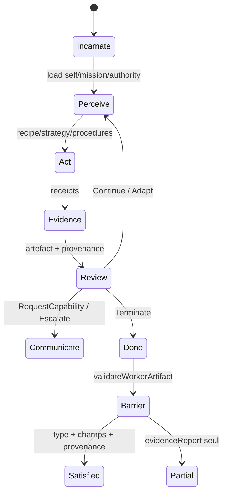

### 16.3 Familles et artefacts

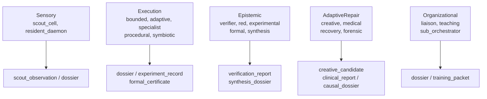

### 16.4 Schémas par type (contrat réel → exécution → preuve)

Chaque schéma suit le même gabarit : `preset Rust` (autorité, lease, budget) → `contrat Node effectif` (`buildWorkerContract`, spawn/delegate/topologie à `false`) → `garde MCP` → `artefact` → `barrière`. Les valeurs sont celles de `presets.rs`, `workerKindService.js` et `workerArtifactContract.js`. Aucun schéma n'invente une capacité non codée.

#### 16.4.1 `scout_cell`

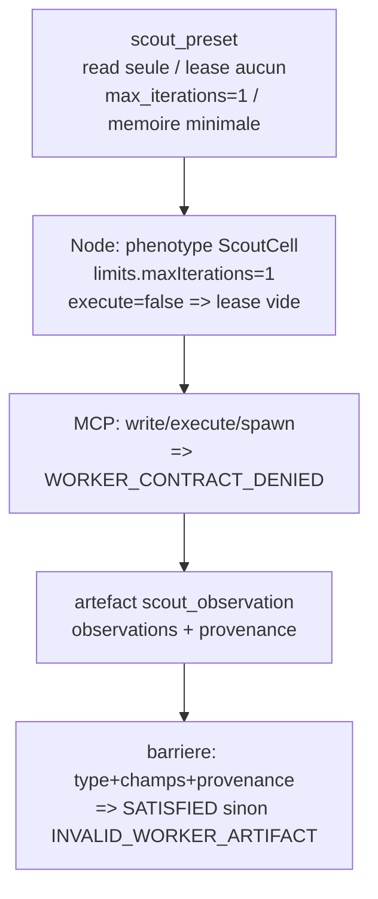

#### 16.4.2 `resident_daemon`

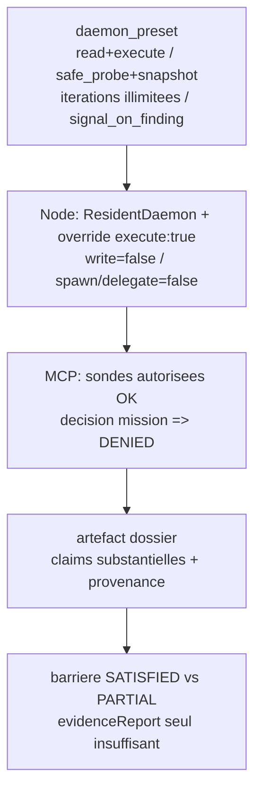

#### 16.4.3 `bounded_worker`

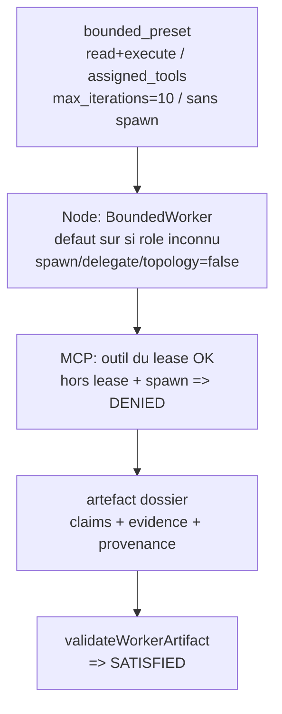

#### 16.4.4 `adaptive_worker`

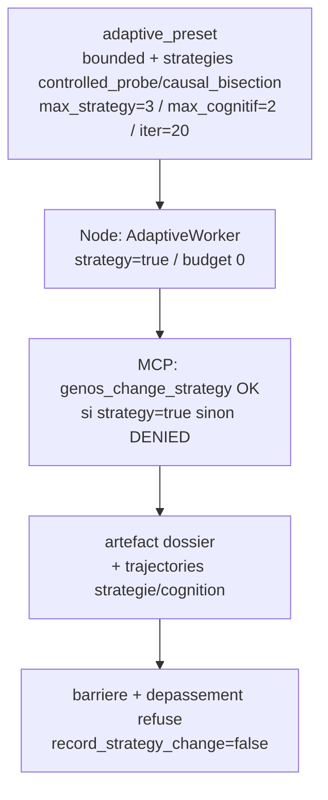

#### 16.4.5 `specialist`

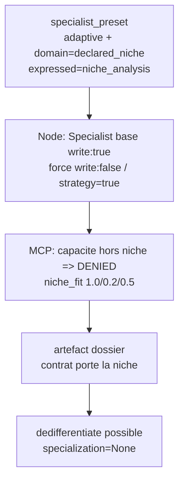

#### 16.4.6 `procedural_executor`

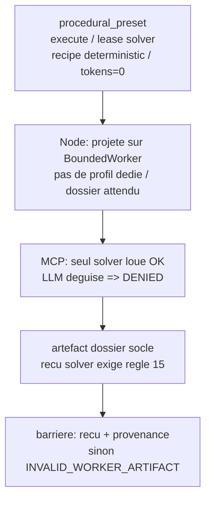

#### 16.4.7 `symbiotic_worker`

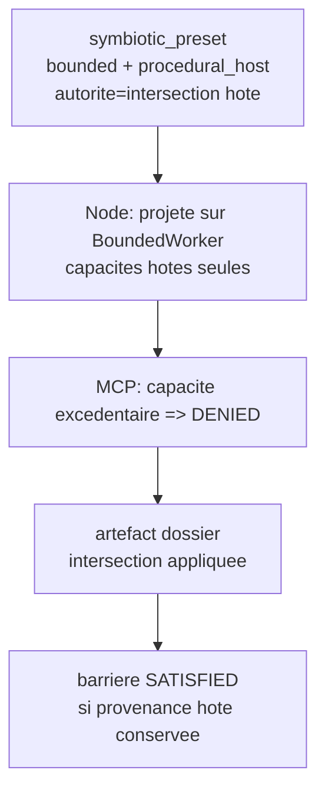

#### 16.4.8 `verifier_worker`

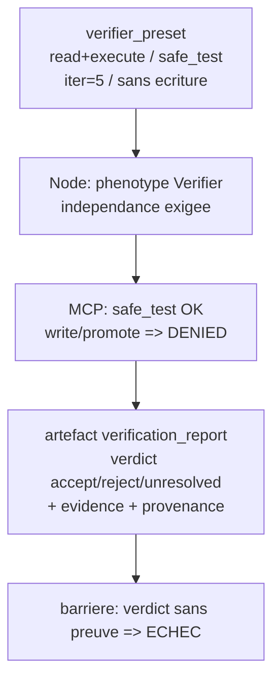

#### 16.4.9 `red_worker`

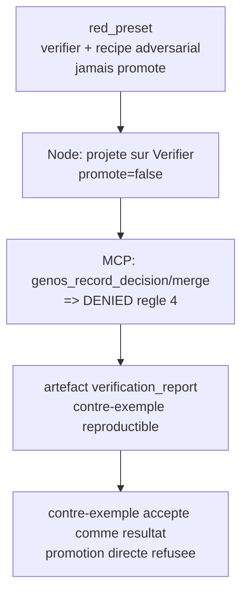

#### 16.4.10 `experimental_worker`

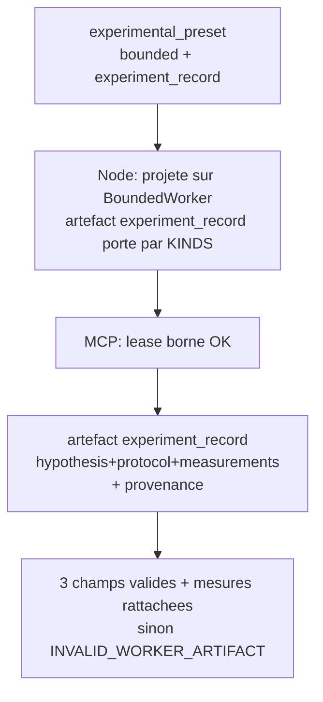

#### 16.4.11 `formal_worker`

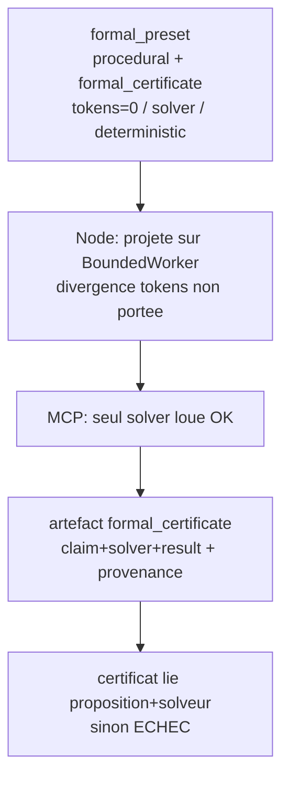

#### 16.4.12 `synthesis_worker`

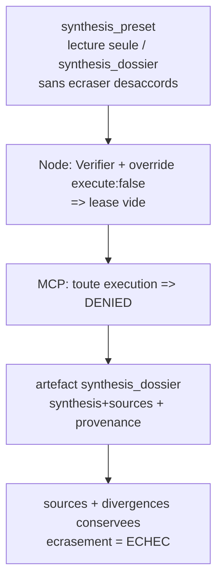

#### 16.4.13 `creative_worker`

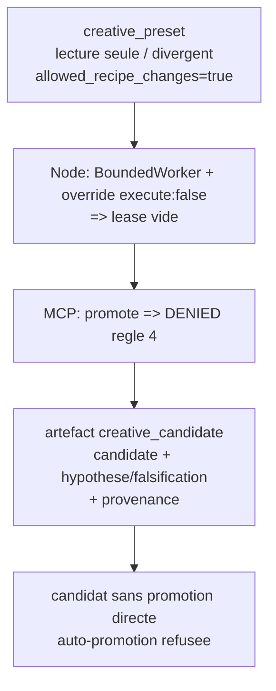

#### 16.4.14 `medical_worker`

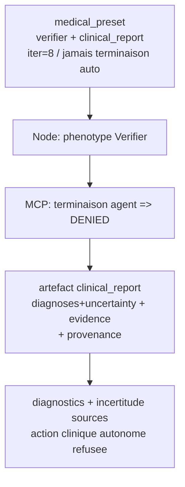

#### 16.4.15 `recovery_worker`

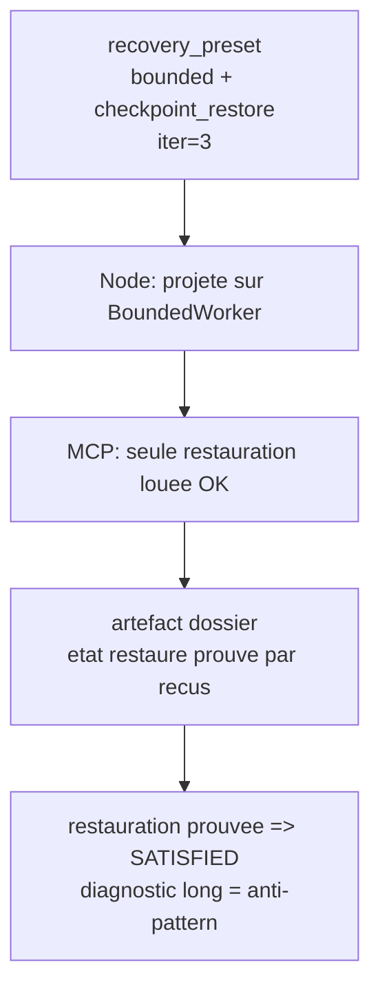

#### 16.4.16 `forensic_worker`

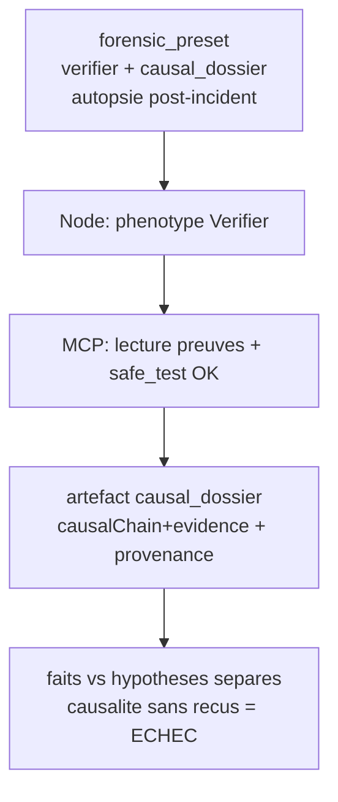

#### 16.4.17 `liaison_worker`

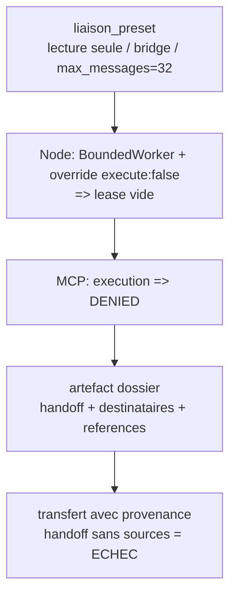

#### 16.4.18 `teaching_worker`

```mermaid
flowchart TD
  P["teaching_preset<br/>lecture seule / training_packet"] --> N["Node: phenotype ScoutCell<br/>seul kind non-scout sur ce profil"]
  N --> MCP["MCP: execution => DENIED"]
  MCP --> ART["artefact training_packet<br/>prerequisites+steps+evidence<br/>+ provenance"]
  ART --> B["procedure validee seule transmise<br/>non etayee = ECHEC"]
```

#### 16.4.19 `sub_orchestrator`

```mermaid
flowchart TD
  P["suborchestrator_preset Rust<br/>spawn+delegate / spawn_capped<br/>depth=1 budget=5 tokens=20000 iter=30"] --> N["Node: buildWorkerContract durcit<br/>spawn=false delegate=false<br/>budget=0 depth=0 write=false"]
  N --> BOOT["boot: contrat mute avec spawn<br/>=> UNSUPPORTED_WORKER_DELEGATION"]
  BOOT --> MCP["MCP: genos_create/fork/delegate<br/>=> WORKER_CONTRACT_DENIED"]
  MCP --> ART["artefact dossier<br/>coordinateur sans enfants"]
  ART --> SVC["subOrchestratorService NON raccorde<br/>baux memoire seuls / zero appelant"]
```

---

## 17. Implémentation : construire et contrôler un worker

### 17.1 Construire un contrat Rust

```rust
use genos_worker::presets::{PresetInput, preset_for};
use genos_worker::phenotype::WorkerKind;

let input = PresetInput::new("w1", "Diagnostiquer X", "module-auth")
    .with_parent("parent");
let contract = preset_for(WorkerKind::VerifierWorker, &input);
assert!(genos_worker::contract::validate_contract(&contract).is_empty());
```

### 17.2 Résoudre et construire côté Node

```js
const workerKinds = require('./agents/workerKindService');
const kind = workerKinds.resolveWorkerKind(assignment.workerKind, assignment.role);
const contract = workerKinds.buildWorkerContract(kind, mission);
// contract = { version:1, identity:{workerKind}, mission, authority:{spawn:false,...}, evidence:{requiredArtifacts}, limits }
```

### 17.3 Faire respecter le contrat à l'appel MCP

```js
const { enforcePersistedWorkerTool, assertRuntimeContract } = require('./agents/workerContractEnforcement');
await enforcePersistedWorkerTool(db, agentId, toolName); // 403 WORKER_CONTRACT_DENIED si hors autorité
assertRuntimeContract(contract, kind); // UNSUPPORTED_WORKER_DELEGATION si spawn/delegate/budget
```

### 17.4 Valider l'artefact à la barrière

```js
const { validateWorkerArtifact } = require('./agents/workerArtifactContract');
validateWorkerArtifact(dossier, worker); // INVALID_WORKER_ARTIFACT si type/champs/provenance manquants
```

---

## 18. Fiches détaillées des 19 types

Chaque fiche suit le même gabarit : responsabilité → preset Rust → contrat Node effectif → artefact et validation → consigne de mission → limites et anti-patterns. Les garanties Rust sont encodées ; les autorisations Node sont celles de `buildWorkerContract` (spawn/delegate/topologie toujours `false`, `write:false` par défaut).

### 18.1 `scout_cell` (Sensorielle)

- **Responsabilité** : observation seule, sourcée, sans exécution ni modification.
- **Preset** : `scout_preset` — lecture seule, mémoire minimale, 1 itération, `scout_observation`.
- **Node** : `authorityPhenotype=ScoutCell`, `limits.maxIterations=1`, `execute` selon profil (bail vide si `execute:false`).
- **Artefact** : `scout_observation[observations]` + `provenance ∨ evidenceRefs`.
- **Consigne** : « Observe only. Return structured observations, references, confidence, and uncertainties; do not execute or modify files. »
- **Critère de complétude** : une action d'écriture/exécution est refusée (`WORKER_CONTRACT_DENIED`) et une observation sourcée passe `validateWorkerArtifact`.
- **Anti-pattern** : l'utiliser pour exécuter ou modifier des fichiers ; lui demander une décision de mission.

### 18.2 `resident_daemon` (Sensorielle)

- **Responsabilité** : surveillance persistante d'un territoire, signalement de découvertes.
- **Preset** : `daemon_preset` — `read+execute`, lease `safe_probe/snapshot`, `signal_on_finding`, itérations illimitées, `dossier` socle.
- **Node** : `authorityPhenotype=ResidentDaemon` + override `{execute:true}` ; `write:false` forcé.
- **Artefact** : `dossier[claims]` avec `claims=[{statement + evidence}]` + provenance.
- **Consigne** : « Monitor the assigned territory and report findings with evidence; do not make mission decisions. »
- **Critère** : sondes autorisées passent, actions de mission refusées, signal avec provenance.
- **Anti-pattern** : décision de mission autonome ; persistance confondue avec autorité d'écriture.

### 18.3 `bounded_worker` (Exécution)

- **Responsabilité** : exécution bornée du scope avec le lease courant, sans spawn.
- **Preset** : `bounded_preset` — `read+execute`, `assigned_tools`, 10 itérations.
- **Node** : `authorityPhenotype=BoundedWorker`, défaut sûr (`bounded_worker` si rôle inconnu).
- **Artefact** : `dossier` substantié + provenance.
- **Consigne** : « Complete only the assigned scope using the current tool lease; return evidence and provenance. »
- **Critère** : action du lease passe, action hors lease et spawn refusés.
- **Anti-pattern** : élargissement de scope (règle 13 : signaler au parent au lieu d'élargir).

### 18.4 `adaptive_worker` (Exécution)

- **Responsabilité** : adaptation locale de stratégie sous plafond.
- **Preset** : `adaptive_preset` — `controlled_probe/causal_bisection`, `max_strategy=3, max_cognitif=2`, 20 itérations.
- **Node** : `authorityPhenotype=AdaptiveWorker`, `strategy:true`.
- **Artefact** : `dossier` + trajectoires `strategy_trajectory/recipe_trajectory` tracées.
- **Consigne** : « Use only the contract strategies and change strategy within the stated budget. »
- **Critère** : stratégie autorisée passe, dépassement refusé (`record_strategy_change=false`).
- **Anti-pattern** : changement cognitif non borné ; stratégies hors contrat.

### 18.5 `specialist` (Exécution)

- **Responsabilité** : adaptation locale dans une niche déclarée.
- **Preset** : `specialist_preset` — `domain="declared_niche"`, `niche_analysis`, plasticité `niche_fit/dedifferentiate`.
- **Node** : `authorityPhenotype=Specialist` (base `write:true`) mais `write:false` forcé par `applyAuthorityOverrides` + override `specialist:{write:false}` ; `strategy:true`.
- **Artefact** : `dossier` ; le contrat porte la niche.
- **Consigne** : « Work within the declared niche and state when the task falls outside it. »
- **Critère** : niche portée, capacité hors niche refusée, sortie de niche déclarée.
- **Anti-pattern** : prétendre que la projection Node équivaut au phénotype Rust sans vérifier persistance/autorité divergentes.

### 18.6 `procedural_executor` (Exécution)

- **Responsabilité** : procédure déterministe, zéro budget tokens, reçu solver.
- **Preset** : `procedural_preset` — lease `solver`, `deterministic`, `tokens=0`.
- **Node** : projeté sur `BoundedWorker` (pas de profil Node dédié) ; `dossier` attendu côté Node (pas de `formal_certificate`).
- **Artefact** : Rust `dossier` socle ; reçu solver exigé par reçu d'action (règle 15).
- **Consigne** : « Use deterministic procedures only and return solver receipts. »
- **Critère** : seul le solver loué accessible, reçu validant l'exécution.
- **Anti-pattern** : appel LLM déguisé ; tokens non nuls.

### 18.7 `symbiotic_worker` (Exécution)

- **Responsabilité** : hôte procédural, capacités limitées par le contrat hôte.
- **Preset** : `symbiotic_preset` — `procedural_host`, intersection des capacités (commentaire).
- **Node** : projeté sur `BoundedWorker`.
- **Artefact** : `dossier`.
- **Consigne** : « Use only procedures and capabilities granted by the host contract. »
- **Critère** : intersection appliquée, capacité excédentaire refusée.
- **Anti-pattern** : capacité hors hôte ; autorité propre au-delà de l'hôte.

### 18.8 `verifier_worker` (Épistémique)

- **Responsabilité** : vérification indépendante, tests sûrs, rapport ternaire.
- **Preset** : `verifier_preset` — `read+execute`, `safe_test`, 5 itérations, `verification_report`.
- **Node** : `authorityPhenotype=Verifier`.
- **Artefact** : `verification_report[verdict, evidence]` avec `verdict ∈ accept/reject/unresolved` + `evidence||reproductionEvidence` + provenance.
- **Consigne** : « Verify independently and return Accept, Reject, or Unresolved with reproduction evidence. »
- **Critère** : verdict étayé passe ; verdict sans preuve échoue (`INVALID_WORKER_ARTIFACT`).
- **Anti-pattern** : vérification par le producteur lui-même ; verdict sans reproduction.

### 18.9 `red_worker` (Épistémique)

- **Responsabilité** : revue adversariale issue du preset de vérification.
- **Preset** : `red_preset` — `verifier + recipe="adversarial"`, jamais promotion directe.
- **Node** : projeté sur `Verifier`.
- **Artefact** : `verification_report` (contre-exemple reproductible accepté comme résultat).
- **Consigne** : « Act as an adversarial reviewer; report falsifiable failure cases and evidence. »
- **Critère** : contre-exemple reproductible accepté ; promotion directe refusée (règle 4).
- **Anti-pattern** : promotion du contre-exemple en décision sans gate parent.

### 18.10 `experimental_worker` (Épistémique)

- **Responsabilité** : hypothèse, protocole et mesures dans un dossier dédié.
- **Preset** : `experimental_preset` — bounded + `experiment_record`.
- **Node** : projeté sur `BoundedWorker` ; artefact `experiment_record` porté par `KINDS`.
- **Artefact** : `experiment_record[hypothesis, protocol, measurements]` + provenance.
- **Consigne** : « State the hypothesis and protocol, record measurements, and preserve uncertainty. »
- **Critère** : trois champs validés, mesures rattachées au protocole.
- **Anti-pattern** : mesures sans protocole ; hypothèse sans falsification.

### 18.11 `formal_worker` (Épistémique)

- **Responsabilité** : exécution déterministe avec certificat attendu.
- **Preset** : `formal_preset` — hérite `procedural` (`tokens=0`, `solver`, `deterministic`), `formal_certificate`.
- **Node** : projeté sur `BoundedWorker` (divergence à noter : Node ne porte pas `tokens=0`).
- **Artefact** : `formal_certificate[claim, solver, result]` + provenance.
- **Consigne** : « Return a formal certificate tied to the exact claim and solver result. »
- **Critère** : certificat identifiant proposition, solveur et résultat vérifiable.
- **Anti-pattern** : certificat découplé du solveur réellement loué.

### 18.12 `synthesis_worker` (Épistémique)

- **Responsabilité** : synthèse préservant désaccords et provenance, sans écriture.
- **Preset** : `synthesis_preset` — lecture seule, `synthesis_dossier`.
- **Node** : `authorityPhenotype=Verifier` + override `{execute:false}` (bail vide).
- **Artefact** : `synthesis_dossier[synthesis, sources]` + provenance.
- **Consigne** : « Synthesize the dossiers while preserving material disagreements and provenance. »
- **Critère** : sources et divergences conservées, écriture refusée.
- **Anti-pattern** : écrasement des désaccords ; synthèse sans sources.

### 18.13 `creative_worker` (Adaptation et réparation)

- **Responsabilité** : production de candidats sans promotion directe.
- **Preset** : `creative_preset` — lecture seule, `divergent`, `allowed_recipe_changes=true`, `max_cognitif=2`, `creative_candidate`.
- **Node** : projeté sur `BoundedWorker` + override `{execute:false}`.
- **Artefact** : `creative_candidate[candidate]` + provenance ; côté Rust `hypothesis/assumptions/falsification_test` exigés par la sémantique.
- **Consigne** : « Return a candidate artifact with assumptions and a falsification test; do not promote it. »
- **Critère** : hypothèses + falsification présentes ; promotion refusée (règle 4).
- **Anti-pattern** : auto-promotion du candidat ; candidat sans test de falsification.

### 18.14 `medical_worker` (Adaptation et réparation)

- **Responsabilité** : diagnostic avec rapport clinique, sans action clinique autonome.
- **Preset** : `medical_preset` — verifier + `clinical_report`, 8 itérations, jamais terminaison auto.
- **Node** : `authorityPhenotype=Verifier`.
- **Artefact** : `clinical_report[diagnoses, uncertainty]` + provenance ; côté Rust `symptoms/evidence/therapy_options`.
- **Consigne** : « Return candidate diagnoses, evidence, uncertainty, and therapy options; do not terminate agents. »
- **Critère** : diagnostics et incertitude sourcés ; aucune terminaison autonome.
- **Anti-pattern** : thérapie appliquée sans gate humain/parent.

### 18.15 `recovery_worker` (Adaptation et réparation)

- **Responsabilité** : restauration par lease dédié, vite, en 3 itérations max.
- **Preset** : `recovery_preset` — bounded + `checkpoint_restore`, 3 itérations.
- **Node** : projeté sur `BoundedWorker`.
- **Artefact** : `dossier` (état restauré prouvé par reçus + provenance).
- **Consigne** : « Use only the leased recovery action, then report the restored state and remaining risks. »
- **Critère** : seule la restauration louée passe, état restauré prouvé.
- **Anti-pattern** : diagnostic long au lieu de restaurer ; restauration hors lease.

### 18.16 `forensic_worker` (Adaptation et réparation)

- **Responsabilité** : analyse causale post-incident, faits séparés des hypothèses.
- **Preset** : `forensic_preset` — verifier + `causal_dossier`.
- **Node** : `authorityPhenotype=Verifier`.
- **Artefact** : `causal_dossier[causalChain, evidence]` + provenance.
- **Consigne** : « Reconstruct the causal chain from receipts and evidence; separate facts from hypotheses. »
- **Critère** : chaîne causale référençant éléments observés, faits vs hypothèses distingués.
- **Anti-pattern** : causalité sans reçus ; hypothèses présentées comme faits.

### 18.17 `liaison_worker` (Organisationnelle)

- **Responsabilité** : pont de communication entre groupes, sans exécution.
- **Preset** : `liaison_preset` — lecture seule, `bridge`, `max_messages=32`.
- **Node** : projeté sur `BoundedWorker` + override `{execute:false}`.
- **Artefact** : `dossier` (transfert avec destinataires, références, provenance).
- **Consigne** : « Bridge the assigned groups with a concise handoff that preserves source references. »
- **Critère** : transfert avec références et provenance ; exécution refusée.
- **Anti-pattern** : exécution au lieu de pont ; handoff sans sources.

### 18.18 `teaching_worker` (Organisationnelle)

- **Responsabilité** : transmission d'une procédure validée dans un paquet de formation.
- **Preset** : `teaching_preset` — lecture seule, `training_packet`.
- **Node** : `authorityPhenotype=ScoutCell` (seul kind avec ce phénotype hors `scout_cell`).
- **Artefact** : `training_packet[prerequisites, steps, evidence]` + provenance.
- **Consigne** : « Transmit only a validated procedure with prerequisites, steps, and supporting evidence. »
- **Critère** : prérequis, étapes et preuves validés ; procédure non étayée échoue.
- **Anti-pattern** : enseignement d'une procédure non validée par la barrière.

### 18.19 `sub_orchestrator` (Organisationnelle)

- **Responsabilité (conception Rust)** : coordination locale bornée — 5 enfants, profondeur 1, `tokens=20_000`, 30 itérations, lease `spawn_capped`.
- **Preset** : `suborchestrator_preset` — seul avec `spawn+delegate`, `depth=1`, `budget=5`.
- **Node effectif** : `authorityPhenotype=SubOrchestrator` mais `buildWorkerContract` durcit `spawn:false, delegate:false, topology:false, budget:0, depth:0` et override `write:false`. `getPhenotype('sub_orchestrator')` ⇒ `canSpawn=false`. `assertRuntimeContract` refuse tout contrat muté avec spawn/delegate/budget.
- **Artefact** : `dossier`.
- **Consigne** : voir §4.1 (plafonds = conception Rust, pas autorisation Node).
- **Critère** : chaque enfant hériterait budget réduit et autorisations bornées **si** le dispatch imbriqué existait ; en l'état, toute tentative spawn/délégation est refusée (`UNSUPPORTED_WORKER_DELEGATION` au boot, `WORKER_CONTRACT_DENIED` au MCP).
- **Anti-pattern** : annoncer un budget inutilisable ; coder un chemin qui suppose des enfants réellement dispatchés.

---

## 19. Patterns d'usage : composer sans créer de types

- **Exploration → livraison** : `scout_cell` (observation) → `bounded_worker` (implémentation) → `verifier_worker` (Accept/Reject/Unresolved) → `liaison_worker` (handoff). Ne crée aucun kind : rôles `neutral_observer/implementation/independent_reviewer` via alias.
- **Arène expérimentale** : `experimental_worker` (hypothèse/protocole/mesures) + `red_worker` (falsification) + `synthesis_worker` (désaccords préservés). Gate parent seul promeut.
- **Réparation** : `recovery_worker` (restaure, 3 itérations) puis `forensic_worker` (autopsie) puis `medical_worker` (diagnostic + incertitude). Jamais de terminaison auto.
- **Connaissance persistante** : `resident_daemon` (territoire, `signal_on_finding`) + `teaching_worker` (paquet validé) + `specialist` (niche). Plasticité par `niche_fit/dedifferentiate`.
- **Coordination sans spawn** : `sub_orchestrator` Node comme coordinateur de sous-graphe (pas de lancement d'enfants) ; tout besoin d'enfants repasse par l'orchestrateur parent et le dispatch générique.

---

## 20. Utilité et coût : forme illustrative

Aucune calibration empirique des pondérations n'est affirmée. La forme suivante est une **heuristique candidate** pour comparer deux affectations de workers, pas la spécification du dispatch implémenté :

$$\text{WorkerFit}(k, M) = \text{niche\_fit}(k, M) \cdot \text{lease\_cover}(k, M) \cdot \text{evidence\_ready}(k)$$

où `niche_fit ∈ {1.0, 0.5, 0.2}` (Rust), `lease_cover` mesure la couverture du lease requis par le lease du preset, et `evidence_ready` vaut `1` si l'artefact attendu est validable par `validateWorkerArtifact`, `0` sinon. Poids et seuils exigent justification par tests de parité Rust/Node avant tout usage décisionnel.

Coût total (heuristique) :

$$\text{Cost}(k) = \alpha \cdot \text{tokens}(k) + \beta \cdot \text{iterations}(k) + \gamma \cdot \text{coordination}(k)$$

avec `tokens/iterations` issus des presets (§7.1) et `coordination` majorée par `comms.max_messages` (`8` socle, `32` liaison). Coefficients non calibrés.

---

## 21. Regret d'affectation : définition prudente

Le regret d'avoir choisi `k` plutôt que le meilleur connu `k*` pour une mission `M` au vu des preuves courantes :

$$\text{AssignmentRegret}(k, M) = \max_{k^*} E[U(k^*, M) - U(k, M) \mid \text{preuves}]$$

$U$ combine dossier vérifié (`is_verified_success`), coût (§20) et délai barrière. Sans protocole reproductible et domaine de validité, c'est une **définition**, pas un résultat empirique. Aucune borne `O(·)` n'est affirmée.

---

## 22. Efficacité : succès vérifié par coût

$$\text{Efficiency}(k, M) = \frac{\mathbb{1}[\text{is\_verified\_success}(k, M)]}{\text{Cost}(k) + \text{TransitionCost}}$$

`TransitionCost` = migration + warmup + validation si réaffectation. Efficacité relative et nette exigent même numéraire et mêmes preuves ; à défaut, comparer seulement des cas exécutés par les mêmes validateurs.

---

## 23. Nécessité : quand un type spécialisé se justifie

$$\text{NecessityIndex}(k, M) = P(\text{échec avec bounded\_worker} \mid M) - P(\text{échec avec } k \mid M)$$

Interprétation candidate (seuils non calibrés, à évaluer) : `< 0.1` générique suffit ; `0.1–0.3` envisager le spécialiste ; `> 0.3` évaluer le surcoût. Ne jamais lire un seuil comme frontière empirique.

---

## 24. Dette et stress d'affectation

- **Dette** : accumulation de workers génériques là où un spécialiste sourcé réduirait les refus barrière (`INVALID_WORKER_ARTIFACT` répétés, partiels `TIMEOUT/DEGRADED`).
- **Stress** : `idle/blocked` prolongés, quiescence forcée, `STRICT_PARTIAL` répétés. Seuils `0.3/0.6/0.8` parfois cités : **heuristiques illustratives**, pas constantes universelles. Réponse : autopsie `forensic_worker`, pas élargissement sauvage du lease.

---

## 25. Grammaire des affectations (forme complète candidate)

```bnf
<Assignment>  ::= <Kind> <Mission> <Lease> <Evidence>
<Kind>        ::= "scout_cell" | "resident_daemon" | "bounded_worker" | "adaptive_worker"
                | "specialist" | "procedural_executor" | "symbiotic_worker"
                | "verifier_worker" | "red_worker" | "experimental_worker"
                | "formal_worker" | "synthesis_worker" | "creative_worker"
                | "medical_worker" | "recovery_worker" | "forensic_worker"
                | "liaison_worker" | "teaching_worker" | "sub_orchestrator"
<Mission>     ::= <Objective> <Scope>
<Lease>       ::= "assigned_tools" | "safe_test" | "safe_probe" | "snapshot"
                | "solver" | "spawn_capped" | "checkpoint_restore"
<Evidence>    ::= "scout_observation" | "dossier" | "verification_report"
                | "experiment_record" | "formal_certificate" | "synthesis_dossier"
                | "creative_candidate" | "clinical_report" | "causal_dossier"
                | "training_packet"
```

Règles de typage (candidates, à tester contre `validate_contract` + `validateWorkerArtifact`) :

$$\frac{\Gamma \vdash k : \text{Kind} \quad \Gamma \vdash M : \text{Mission}}{\Gamma \vdash \text{build}(k, M) : \text{Contract}} \qquad \frac{\Gamma \vdash c : \text{Contract} \quad \text{validate\_contract}(c) = \emptyset}{\Gamma \vdash c \; \text{ok}}$$

---

## 26. Arène contrefactuelle des affectations

Protocole candidat : pour une mission `M`, construire `F_0` = `bounded_worker` (rester générique), `F_1, F_2` = deux specialists candidats via presets ; exécuter mondes bornés ; vainqueur `argmax E[U − TransitionCost]` ; jamais de promotion sans `validateWorkerArtifact` + provenance. Sans exécution bornée réelle, l'arène est une proposition, pas une garantie runtime.

---

## 27. Mémoire des affectations

Structure candidate : `signature = hash(kind, scope, artefact, verdict barrière)` ; indexation par niche et famille ; rétention bornée ; mutation locale (`dedifferentiate`) seulement. Confondre la mémoire Node (`territory`, `cultural`, `bounded`) avec la persistance Rust (`Ephemeral/Mission/Resident`) est une erreur : ce sont deux couches distinctes.

---

## 28. Épidémiologie des erreurs de workers

Taux candidat `R_error` : nombre moyen de dossiers invalides engendrés par un dossier invalide non confiné. Origine (preset fautif, lease trop large, artefact sans provenance), transmission (handoff `liaison` sans sources, synthèse écrasant les désaccords), amplification (promotion sans gate), confinement (`ISOLATE/DEGRADE/TERMINATE/REDIRECT` au niveau barrière + `WORKER_CONTRACT_DENIED` au MCP). `writes` disjoints et pare-feux informationnels restent des objectifs, pas des diagnostics automatiques.

---

## 29. Pare-feux informationnels des workers

- `INDEPENDENCE` : `verifier/red` indépendants du producteur ; jamais de vérification de soi.
- `PRIVACY` : `scope` borné (règle 13) ; hors-scope ⇒ signaler au parent.
- `AUTHORITY` : pas d'auto-augmentation (règle 1), pas de promotion/topologie/génome sans permission (règles 4/5/6).
- `STATE` : lease courant seul (règle 2), reçu obligatoire si impact (règle 15).

---

## 30. Contrôle multi-échelles (proposition, pas garantie runtime)

| Échelle | Cadence proposée | Objet |
|---|---|---|
| Rapide | secondes/minutes | Ajustements lease, migration de workers, paramètres comms. |
| Structurelle | minutes/heures | Spawn/retire (Rust seul), split/merge, changement de variante. |
| Évolutive | heures/jours | Mutation `dedifferentiate`, politiques de transition, signatures. |

Ces cadences sont des ordres de grandeur proposés, pas des garanties du runtime courant.

---

## 31. Fractale des workers (cible de conception)

Principe : un `sub_orchestrator` pourrait opérer sa propre coordination locale sous les mêmes invariants. Invariants souhaités : budget enfant ≤ budget parent, profondeur ≤ 1 (Rust), autorité = intersection. En l'état Node, la profondeur effective est `0` et le spawn est refusé : la fractale est une cible, pas une capacité.

---

## 32. Minimum suffisant : le worker le plus simple qui prouve

Principe expérimental : préférer `bounded_worker` par défaut, ne spécialiser que si `NecessityIndex` et preuves barrière l'exigent, sur un ensemble de cas testés fini. Aucune optimalité globale n'est établie.

---

## 33. Autophagie et apoptose des workers

- **Autophagie** : retirer un worker `idle > τ` et récupérer son budget (`reclaim = budget − consumed`). Règle candidate, seuils non calibrés.
- **Apoptose** : `migrateState ∘ migrateWorkers ∘ retire` pour un worker malsain (`unhealthy ⇒ Escalate ⇒ Terminate`).
- **Différence** : l'autophagie optimise, l'apoptose confine.

---

## 34. Contraintes workers candidates

| # | Contrainte | Sévérité | Validateur réel |
|---|---|---|---|
| 1 | Pas d'auto-augmentation d'autorité | Critique | `check_action` r.1 + `enforcePersistedWorkerTool` |
| 2 | Outil dans le lease courant seul | Critique | `check_action` r.2 + `WORKER_CONTRACT_DENIED` |
| 3 | Pas de promotion sans permission | Élevé | `check_action` r.4 (aucun preset ne promeut) |
| 4 | Pas de changement topologie/génome sans permission | Élevé | `check_action` r.5/6 |
| 5 | Spawn/délégation bornés | Élevé | `check_action` r.8 + `UNSUPPORTED_WORKER_DELEGATION` |
| 6 | Scope borné | Élevé | `check_action` r.13 |
| 7 | Reçu si impact | Élevé | `check_action` r.15 |
| 8 | Artefact typé + provenance | Élevé | `validateWorkerArtifact` + `INVALID_WORKER_ARTIFACT` |
| 9 | Succès = preuves + provenance | Critique | `is_verified_success` |
| 10 | Contrat reconstruit serveur | Critique | `missionBootstrap` + `incarnateAgent` |
| 11 | Kind explicite inconnu refusé | Élevé | `UNKNOWN_WORKER_KIND` |
| 12 | Mismatch kind dispatché refusé | Élevé | `WORKER_KIND_MISMATCH` |
| 13 | Barrière stricte : pas de partiel | Modéré | `WORKER_BARRIER_STRICT_PARTIAL` |

Les contraintes sans validateur concret restent des objectifs de validation.

---

## 35. Plan de migration d'un worker

Structure : `⟨worker, source_scope, target_scope, lease_delta, artefact_requis⟩`. Génération : `dedifferentiate` si niche change, sinon réincarnation `resolve + build`. Exécution : nouveau `INSERT` + `startMission` + barrière neuve ; jamais de mutation silencieuse du contrat persisté.

---

## 36. Adaptateur de niche

Signature candidate : `adapt(workers, niche) → workers'`. Traduction : `niche_fit` pour choisir, `dedifferentiate` pour assouplir, `specialist` pour resserrer. Coût : `TransitionCost`. Fidélité : taux d'acceptation barrière ≠ préservation du sens ; seuil `τ` exige justification risque.

---

## 37. Score de couplage des workers

Indice candidat mélangeant écritures partagées, densité de dépendances (`dependsOn`), fréquence de mises à jour et coût de lecture périmée. Seuils retirés : ne pas l'interpréter comme diagnostic automatique. Un `PARALLEL` de workers n'isole les pannes que si `writes` disjoints **et** validateur effectif.

---

## 38. Génome d'affectation

Sérialisation : `metadata_json{workerKind, workerContract{version, identity, mission, authority, evidence, limits}}`. Désérialisation : reconstruction, jamais confiance. Mutation : `dedifferentiate` côté Rust ; côté Node, réincarnation via `incarnateAgent`.

---

## 39. Hystérésis et anti-flapping des réaffectations

Principe : ne réaffecter que si `Gain > Cost + Marge`, avec fenêtre anti-flap et délai progressif. Formes `borneInf(ΔQ) > C + H`, `η historique`, `300 s` universel : **candidates**, normalisation et calibration requises. La barrière applique déjà `2 passes stables` et timeouts explicites (§8).

---

## 40. Cas d'usage typiques

1. **Audit de code** : `scout_cell` (cartographie) → `bounded_worker` (correctifs) → `verifier_worker` (reproduction) → `forensic_worker` (chaîne causale).
2. **Ingénierie exploratoire** : `experimental_worker` + `red_worker` + `synthesis_worker`, gate parent seul.
3. **Restauration incident** : `recovery_worker` (3 itérations) → `medical_worker` (diagnostic + incertitude) → `teaching_worker` (procédure validée diffusée).
4. **Veille territoriale** : `resident_daemon` illimité + `liaison_worker` (handoff `bridge/32`) + `specialist` (niche).
5. **Preuve formelle** : `formal_worker` (`solver` + `formal_certificate`) + `verifier_worker` indépendant.

---

## 41. Quand NE PAS utiliser un type spécialisé

1. **Tâche simple et déterministe** : `bounded_worker` ou `procedural_executor` suffisent ; un `adaptive/specialist` ajoute du coût sans preuve de gain.
2. **Mission ultra-courte** : le coût d'incarnation + barrière dépasse le gain ; utiliser l'exécuteur direct.
3. **Contraintes rigides non négociables** : si le lease interdit l'outil requis, changer de type ne contourne pas le refus — élargir le lease au niveau parent ou renoncer.
4. **Sans observabilité** : sans `evidenceReport` ni provenance, aucun verdict `Accept` n'est établissable ; rester en `PARTIAL` honnête.
5. **Preuves insuffisantes** : sans `experiment_record` ou `formal_certificate` validable, ne pas invoquer `formal/medical/forensic` comme garantie.
6. **Budget ultra-restreint** : un seul agent ⇒ pas de `liaison/synthesis/sub_orchestrator` utiles ; utiliser `bounded_worker` direct.

Seuils et durées ci-dessus sont des heuristiques illustratives, pas des frontières empiriques.

---

## 42. Vocabulaire des métriques candidates

| Métrique | Précaution |
|---|---|
| `niche_fit` (1.0/0.5/0.2) | Implémenté Rust, pas calibré comme probabilité. |
| `lease_cover` | Couverture ensembliste, pas garantie d'exécution. |
| `evidence_ready` | Validabilité par `validateWorkerArtifact`, pas vérité. |
| `AssignmentRegret` | Définition, pas borne mesurée. |
| `Efficiency` | Exige même numéraire et mêmes validateurs. |
| `NecessityIndex` | Seuils non calibrés. |
| `R_error` | Candidat, pas diagnostic automatique. |

---

## 43. Propriétés algébriques : statut

Associativité, commutativité, idempotence ou monotonie des compositions de workers **retirées comme propriétés établies** : elles exigeraient sémantique déterministe + équivalence déclarée + validateurs communs. `CRDT ≠ confluence organisationnelle`. Chaque composition se teste séparément contre `validate_contract` et `validateWorkerArtifact`.

---

## 44. Conclusion

Les 19 types de workers sont un vocabulaire exécutable commun : mêmes contrats, mêmes cycles, mêmes dossiers côté Rust ; mêmes identifiants, mêmes artefacts, mêmes refus fail-closed côté Node. La présence au catalogue ne vaut pas raccordement de bout en bout : chaque type n'est complet que si ses critères positifs et négatifs sont vérifiés dans le runtime concerné, avec artefact typé et provenance à la barrière.

---

## 45. État d'implémentation du runtime (audit 2026-09-25)

- **Rust** : `genos-worker` expose contrat, cycle (18 étapes), dossiers, 8 règles `check_action` (+ succès vérifié), 19 presets, 16 tests. Annonce « 20 invariants » : seuls 8 numéros + succès vérifié sont encodés ; le reste est objectif de conception.
- **Node** : `workerKindService` (19 `KINDS`, 16 alias, 19 consignes, 6 overrides, `resolve/normalize/kindDefinition/buildWorkerContract/promptRule/evidenceRule`), `phenotypeRegistryService` (9 phénotypes stockés + virtuels), `workerContractEnforcement` (`AUTHORITY_TOOLS`, `WORKER_CONTRACT_DENIED`, `UNSUPPORTED_WORKER_DELEGATION`), `missionBootstrap` (`WORKER_KIND_MISMATCH`), `agentFleetWorkers` (dispatch générique, `metadata_json`), `authorityMatrixService` (lookup 13 dimensions), `workerArtifactContract` (10 types, `INVALID_WORKER_ARTIFACT`), barrières `SATISFIED/PARTIAL/STRICT`.
- **Délégation bornée** : un worker `sub_orchestrator` peut lancer au plus cinq enfants d'un seul niveau via `genos_delegate_worker`. Le backend vérifie le contrat persisté et son expiration, limite les kinds enfants à `scout_cell`, `bounded_worker`, `adaptive_worker` et `verifier_worker`, puis attend la fin de mission et retourne l'état et le résultat. La durée de vie du contrat est d'une heure et le budget de mission enfant est plafonné à 10 000 tokens.
- **Asymétries connues** : ces limites sont exécutées uniquement par le backend Node ; elles ne remplacent pas les contrats Rust. Les projections `procedural/symbiotic/formal` sur `BoundedWorker` et `teaching_worker` sur `ScoutCell` restent à harmoniser.
- Le backend applique une traduction Node des invariants, pas le crate Rust : parité à tester ; aucun pont Rust→Node sûr et défini n'existe (ADR 0064).

## 46. Inventaire du dispatch (audit 2026-09-25)

| Chemin | Rôle réel |
|---|---|
| `agentFleetWorkers.createAutonomousWorkers` | Dispatch générique des 19 kinds, `resolve + INSERT + prompt + lease`. |
| `agents/agentIncarnationService.incarnateAgent` | Reconstruction `resolve + build`, `computeLease`, `setupAuthority`, injection `promptRule + evidenceRule`. |
| `orchestratorDispatchService.buildWorkerMission` | `resolve + build`, injection `promptRule + evidenceRule`. |
| `agentRuntimeAdapter/missionBootstrap.resolveWorkerIdentity` | Verrou boot : `MISMATCH` et refus des contrats imbriqués non pris en charge. |
| `controllers/mcpController.resolveToolAuthorization` | `enforcePersistedWorkerTool` → 403 `WORKER_CONTRACT_DENIED`. |
| `workerEvidenceBarrier*.js + dossierValidation.js` | `validateWorkerDossiers` → `validateWorkerArtifact` → `SATISFIED` vs `PARTIAL`. |
| `agents/subOrchestratorDispatchService.js` | Dispatch MCP authentifié, création SQL via `agentFleetWorkers`, supervision synchrone via `startMission`. |
| `authorityMatrixService.js` | Lookup pur, aucun effet de bord. |

Voir ADR 0043 (phénotypes), ADR 0044 (matrice et gates), ADR 0064 (registre et dispatch).
