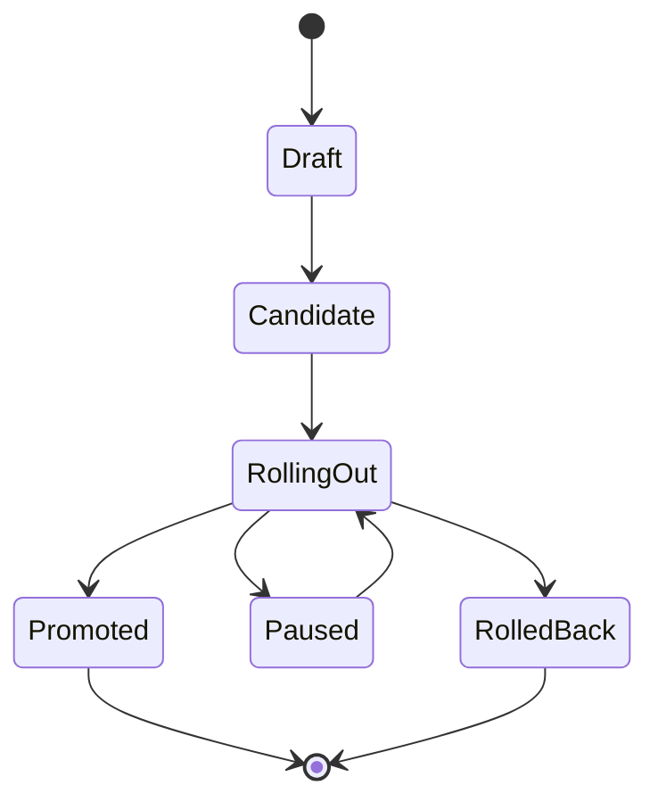

# Releases, rollouts et chargeback

- **Statut** : Implémenté
- **Portée** : cycle de release, promotion, rollout canary/A-B, métriques et coûts.
- **Dernière revue** : 2026-09-18

## 1. Cycle de vie



Une promotion de production exige un rollout réussi, sauf override explicite justifié.

## 2. Stratégies

- **Canary** : expose progressivement une variante candidate ;
- **A/B** : compare plusieurs variantes sur une population configurée ;
- **Rollback** : remet la release précédente après une décision négative.

Les variantes sont enregistrées dans `release_rollout_metrics` avec requêtes, erreurs,
latence, tokens et coût.

## 3. Décision mathématique

Pour une variante `v`, on calcule :

\[
ErrorRate_v=\frac{errors_v}{max(requests_v,1)}
\]

Une promotion peut être autorisée si :

\[
Promote(v)=ErrorRate_v<\epsilon
\land Latency_{p95,v}<L
\land Cost_v<C
\land Evidence_v=valid
\]

Les seuils sont des politiques d’exploitation, pas des garanties statistiques absolues.

## 4. Routes

| Méthode | Route | Fonction |
| --- | --- | --- |
| `GET` | `/api/releases` | liste les releases |
| `POST` | `/api/releases` | crée une release |
| `POST` | `/api/releases/:id/promote` | promeut |
| `POST` | `/api/releases/:id/rollback` | rollback |
| `POST` | `/api/releases/:id/rollouts` | crée un rollout |
| `POST` | `/api/releases/rollouts/:rolloutId/metrics` | enregistre des métriques |
| `POST` | `/api/releases/rollouts/:rolloutId/decide` | décide le résultat |
| `GET` | `/api/releases/chargeback` | agrège l’usage et les coûts |

## 5. Exemple

```json
{
  "strategy": "canary",
  "config": {
    "variants": [
      {"name":"stable","weight":90},
      {"name":"candidate","weight":10}
    ],
    "thresholds": {"errorRate":0.02,"p95LatencyMs":1200}
  }
}
```

Puis une métrique :

```json
{
  "variant":"candidate",
  "requestCount":1000,
  "errorCount":8,
  "latencyMs":420000,
  "tokens":180000,
  "costUsd":2.40
}
```

## 6. Rollback et chargeback

Une décision négative ferme le rollout et empêche la promotion associée. Les métriques
acceptées alimentent le ledger d’usage, ce qui permet de relier coût, organisation,
projet, release et variante.

## 7. Limites

Un faible taux d’erreur ne détecte pas une régression non observée ou un biais de
population. Les décisions doivent conserver la configuration, les seuils, les
métriques et la justification dans l’audit.
