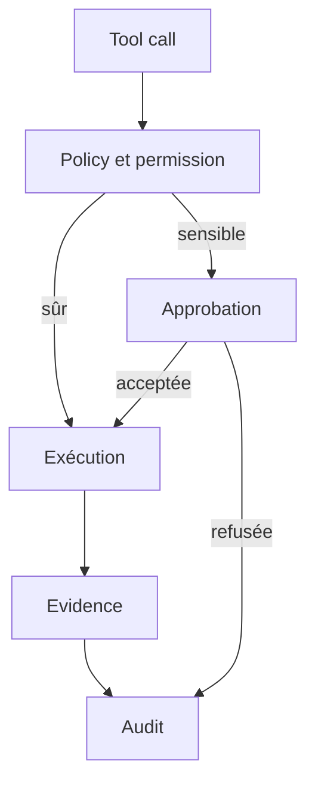

# Approbations et contrôles de la Platform API

- **Statut** : Implémenté
- **Portée** : validation des tool calls, approbations, incidents et graphe causal.
- **Dernière revue** : 2026-09-18

## 1. Flux de contrôle



## 2. Invariant d’exécution

\[
Execute(x)=Policy(x)\land Scope(x)\land Lease(x)\land Approval(x)
\]

Une approbation ne remplace donc ni la permission, ni le scope, ni le bail d’outil.

## 3. Surface exposée

- `/api/platform/tool-calls/validate` : validation préalable d’un appel ;
- `/api/platform/approvals` : création et consultation d’approbations ;
- `/api/platform/approvals/:id/decision` : décision humaine ;
- `/api/platform/incidents/:incidentId/replay` : rejeu ;
- `/api/platform/incidents/bisect` : bisection ;
- `/api/platform/causal-graph` : lecture du graphe causal ;
- `/api/platform/telemetry/summary` : résumé tenant-scoped.

## 4. Exemple

```json
{
  "tool": "genos_execute_primitive",
  "risk": "amber",
  "organizationId": "org-1",
  "projectId": "project-1",
  "reason": "mutation contrôlée d’un workspace"
}
```

## 5. Limites

Le contrôle applicatif ne constitue pas une garantie de sécurité noyau ou réseau. Les
résultats doivent être corrélés avec l’audit, la télémétrie et l’evidence de l’action.
