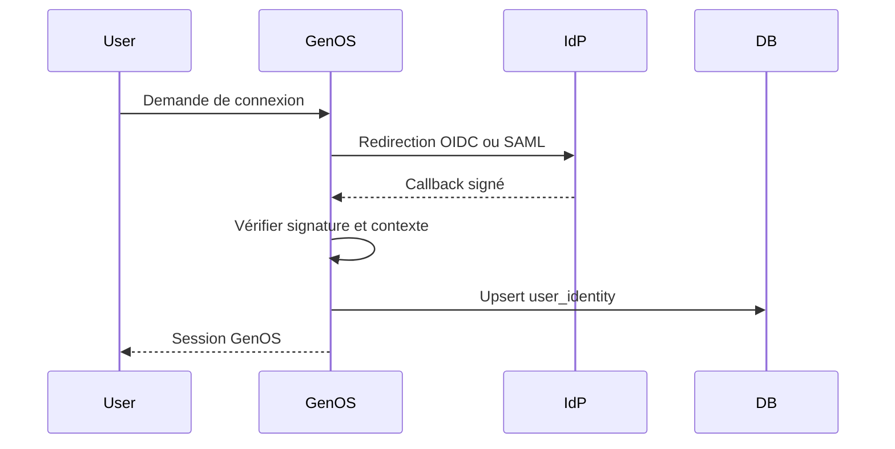

# Fédération d’identité OIDC et SAML

- **Statut** : Implémenté
- **Portée** : fournisseurs OIDC/SAML, validation des callbacks et identités fédérées.
- **Dernière revue** : 2026-09-18

## 1. Périmètre

GenOS accepte deux protocoles de fédération dans `sso_providers` : OIDC et SAML.
Les secrets et certificats sont conservés via le coffre de secrets. Les informations
sensibles d’un fournisseur ne sont pas révélées à un appelant non privilégié.

## 2. Flux



## 3. Invariants de validation

Une identité n’est acceptée que si :

\[
Accept = Signature \land Issuer \land Audience \land Freshness \land Context
\]

Pour OIDC, `Context` inclut le nonce et le code verifier PKCE. Pour SAML, il inclut
la requête corrélée `InResponseTo`, la durée d’expiration, l’issuer IdP et les
assertions signées.

Les tokens expirés, les audiences incorrectes, les algorithmes non supportés et les
certificats absents sont rejetés.

## 4. Routes

| Méthode | Route | Usage |
| --- | --- | --- |
| `GET` | `/api/sso/providers` | liste publique réduite ou liste administrateur |
| `POST` | `/api/sso/providers` | crée ou remplace un fournisseur |
| `GET` | `/api/sso/start/:id` | démarre OIDC |
| `GET` | `/api/sso/saml/:id/start` | démarre SAML |
| `GET` | `/api/sso/callback/:id` | callback OIDC |
| `POST` | `/api/sso/saml/:id/acs` | assertion consumer service SAML |

## 5. Exemple SAML minimal

```json
{
  "id": "corporate-idp",
  "protocol": "saml",
  "issuer": "https://idp.example/metadata",
  "redirectUri": "https://genos.example/api/sso/saml/corporate-idp/acs",
  "entryPoint": "https://idp.example/sso",
  "idpCertificate": "-----BEGIN CERTIFICATE-----...",
  "spEntityId": "genos-production"
}
```

## 6. Limites

La fédération authentifie une identité ; elle ne décide pas seule de l’autorité
tenant. Le rôle et les permissions GenOS restent soumis au modèle d’autorité local.
Les tests doivent couvrir le rejeu, l’expiration, la mauvaise audience et le mauvais
certificat.
