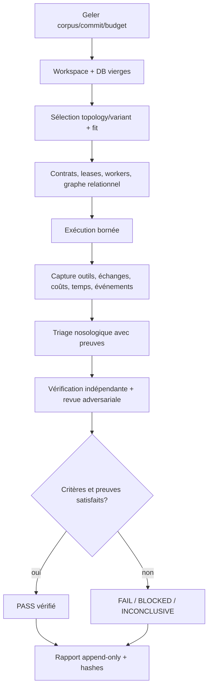
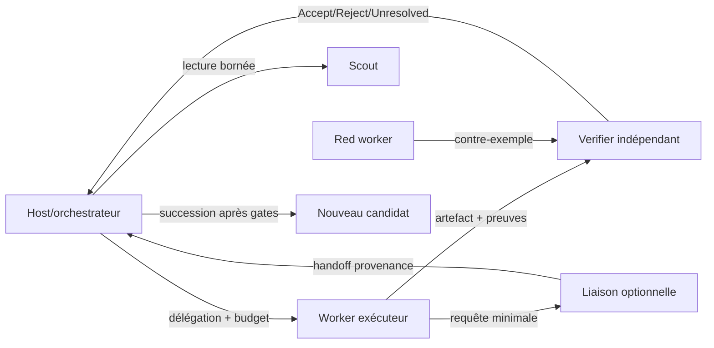

# Protocole d'exécution des missions Holobionte

- **Statut** : runner de mission variant exécutable; campagne complète non exécutée
- **Objet** : comparer topologies et workers sur les missions discriminantes et archiver les preuves
- **Référence** : le commit V3 est inscrit dans chaque campagne
- **Date** : 2026-10-04

Ce document sépare les valeurs appliquées par défaut des paramètres préenregistrés
par expérience. Une sélection de variant, un message transporté, un événement de
télémétrie ou une suite simulée ne constitue pas, seul, une preuve de réussite métier.

## 1. Corpus et unité d'essai

L'unité primaire est une cellule `(missionId, topologyId, holobiontVariantId,
workerProfileId, replicateId)`. Chaque cellule reçoit une copie identique du
workspace, de la mission, des données et des critères. Un vérificateur indépendant
rend le verdict selon un oracle gelé avant l'essai.

Les **12 missions rouges** de [la fiche de benchmark](benchmark-longitudinal-holobionte.md)
sont le corpus primaire; chacune cible un variant Holobionte et sa porte distinctive.
Les niveaux simple/moyen/difficile localisent des régressions; le test transversal
mesure la continuité de l'hôte. Garder ces jeux séparés dans l'analyse.

Geler identifiants, formulations, entrées, oracles, ordre, hash SHA-256, commit,
versions et configuration. Utiliser une DB et un workspace vierges par cellule; ne
pas faire circuler de cache ou mémoire mutable entre bras.

## 2. Axes de comparaison

### 2.1 Les huit topologies

| ID | Mode | Contraste |
| --- | --- | --- |
| `trinity` | Trinity | mondes isolés, stratégies comparées |
| `a-team` | A-Team | spécialités coordonnées, contrats d'équipe |
| `biome` | Biome | population spécialisée dans un environnement |
| `biocenose` | Biocénose | coopération/compétition et jugement collectif |
| `holobionte` | Holobionte | Host persistant, symbiontes, admission/succession |
| `syncytium` | Syncytium | état partagé, synchronisation |
| `rhizome` | Rhizome | ramification décentralisée des capacités |
| `metapopulation` | Métapopulation | populations semi-indépendantes |

La Morphogenèse construit ces modes; elle n'est pas un neuvième mode. Voir le
[catalogue des topologies](../02-orchestration/topologies/README.md).

### 2.2 Les douze variants Holobionte

| Variant | Mission primaire | Porte principale |
| --- | --- | --- |
| `organelle` | cœur | restauration + rollback + approbation; fermeture des dépendances |
| `adaptive-microbiome` | microbiome | fitness/diversité/dysbiose sans remplacement automatique |
| `immune-critical` | immunité | deux vérificateurs indépendants; danger inconnu bloqué |
| `local-first` | localité | traitement local, confidentialité, preuve de non-export si exigée |
| `regenerative` | réparation | dommage, restauration, lignée, ressources, approbation d'apoptose |
| `cloud-core/edge-symbionts` | cloud + edge | lease valide couvrant capacité, connectivité et confidentialité |
| `edge-core/cloud-symbionts` | edge + cloud | local par défaut, capacité distante, redaction, connectivité vérifiée |
| `memory-rich` | mémoire | conflits/provenance, procédures vérifiées, confidentialité, pas d'oubli auto |
| `competitive-partner` | compétition | budgets égaux, essais vérifiés, marge, approbation séparée |
| `procedural` | procédure | lacune → contrat → trial → décision d'admission |
| `tool` | outil | manifeste, lease, permissions, santé, révocation et schémas |
| `cloud-core/edge-sync` | synchronisation | autorité, provenance, causalité, conflits gardés |

Le [benchmark longitudinal](benchmark-longitudinal-holobionte.md) est différent :
12 bras d'ablations, 50–100 missions distinctes dans le même ordre pour chaque bras.
Les seules 12 missions rouges ne satisfont pas ce contrat.

### 2.3 Kinds et variants de workers

`workerKindService` donne famille, artefact et phénotype d'autorité;
`workerPolicyService` donne les limites. Kind et topology sont deux dimensions.
Les permissions viennent du contrat/lease, jamais du nom de rôle seul.

| Famille | Kinds | Plafonds runtime |
| --- | --- | --- |
| Sensorielle | `scout_cell`, `resident_daemon` | scout 1 itération; daemon 30 min |
| Exécution | `bounded_worker`, `adaptive_worker`, `specialist`, `procedural_executor`, `symbiotic_worker` | bounded/procedural/symbiotic 10; adaptive/specialist 20, ≤3 changements stratégie, ≤2 cognitifs |
| Épistémique | `verifier_worker`, `red_worker`, `experimental_worker`, `formal_worker`, `synthesis_worker` | verifier/red 5; autres 10 |
| Réparation | `creative_worker`, `medical_worker`, `recovery_worker`, `forensic_worker` | 10, 8, 3 et 5 respectivement |
| Organisationnelle | `liaison_worker`, `teaching_worker`, `sub_orchestrator` | liaison 10/32 messages; teaching 10; sub-orchestrator 30/5 enfants/10 000 tokens |

Les kinds procédural et formel sont déterministes avec `maxTokens: 0`. Valider les
méthodes par `assertMethodCompatibility`. Le `sub_orchestrator` reste limité à son
sous-graphe; `spawn`, `write` et `delegate` ne sont pas accordés implicitement.
Composition minimale d'une mission à gate : exécuteur, `verifier_worker` indépendant,
`red_worker` de falsification, puis `synthesis_worker` optionnel qui garde les
désaccords.

## 3. Budget, temps et critères d'arrêt

### 3.1 Défauts réellement appliqués

`budgetCoherenceService.normalizeMissionBudget` fixe :

| Ressource | Défaut | Application |
| --- | ---: | --- |
| Tokens | 100 000 | entrée + sortie |
| Coût | 1,00 USD | estimation avant, observé après |
| Latence | 60 000 ms | deadline mission/runtime local |
| Événements | 100 | plafond du runtime |
| Part workers | 60 % | pool workers |
| Réserve orchestration | 40 % | planification, coordination, vérification |

Les parts somment à 1 (±0,01); les pools ne dépassent pas l'enveloppe. Le coût
fournisseur n'est pas réservé atomiquement et n'est exact qu'après réponse.
Timeouts documentés : tentative modèle 30 s; barrière de preuve 60 s par défaut;
terminaison gracieuse 5 s. Limites d'itérations worker et deadline murale s'appliquent
ensemble.

### 3.2 Profil, répétitions et plafond

La première campagne emploie `budgetProfile: "v3-default"`. Toute surcharge doit
être versionnée avant l'exécution; aucun budget n'est augmenté après observation.
Arrêter au verdict, budget épuisé, timeout, annulation ou blocage fail-closed.
Distinguer `TIMED_OUT`, `CANCELLED`, `BUDGET_EXHAUSTED`, `DEPENDENCY_MISSING`,
`EVIDENCE_MISSING` et `BLOCKED`; aucun ne devient réussite.

Faire un passage de calibration non noté, puis trois répétitions notées par cellule
non déterministe. Rejouer une fois les parcours déterministes. Sans seed contrôlable
et archivée, inscrire `seed: null` et ne pas déclarer la répétition reproductible.

- Primaire : 12 missions × variant cible × 3 répétitions = **36 cellules**.
- Baseline single-agent : 12 cellules.
- Balayage topologique : 12 × 8 = **96 cellules/répétition**, si compatible.
- Balayage worker : couvrir les 19 kinds au moins une fois sur une mission compatible;
  aucun produit cartésien n'est implicite.
- Longitudinal : 50–100 missions × 12 bras, campagne distincte.

Coût plafond : `cellules × répétitions × plafond USD/cellule`; temps séquentiel :
`cellules × répétitions × deadline`. Run local sans appel fournisseur : coût modèle
nul, mais durée et événements restent mesurés.

## 4. Séquence et enveloppe d'exécution



États : `CREATED → PREFLIGHTED → CONFIGURED → RUNNING → VERIFYING →
PASS|FAIL|BLOCKED|INCONCLUSIVE → ARCHIVED`. Chaque transition garde runId,
horodatage serveur, agent et preuve. Transport, sortie non vide et événement
terminal seuls ne produisent pas `PASS`.

Enveloppe de résultat (format du harnais à créer, **pas un endpoint existant**) :

```json
{
  "schema":"genos.holobiont-mission-run/v1","campaignId":"holo-2026-10-red-01",
  "runId":"run-<uuid>","missionId":"H01-organelle-red","sourceCommit":"<git-sha>",
  "corpusHash":"sha256:<digest>","replicateId":"r1","seed":null,
  "topology":{"id":"holobionte","variant":"organelle","selectionSource":"explicit"},
  "budget":{"tokensLimit":100000,"costUsdLimit":1,"latencyMsLimit":60000,"eventsLimit":100,"workerShare":0.6,"orchestratorReserve":0.4},
  "usage":{"tokens":0,"costUsd":0,"latencyMs":0,"events":0,"workerIterations":0},
  "agents":[{"agentId":"host-1","kind":"sub_orchestrator","role":"host","capabilities":[],"contractId":null}],
  "relations":[],"communications":[],"nosology":[],
  "assertions":[{"id":"core-preserved","status":"PASS","evidenceRefs":["artifact:1"]}],
  "verdict":"INCONCLUSIVE","evidenceRefs":[],"verifierIds":[],
  "startedAt":"<server-iso>","finishedAt":"<server-iso>"
}
```

Chaque compteur note sa provenance (`provider-receipt`, runtime ou projection); ne
pas additionner tokens mesurés et projetés. Preuves : artefacts par contenu; secrets
et données personnelles expurgés.

## 5. Nosologie et triage

Utiliser [`symbiontFailureClassifier.js`](../../backend/src/services/holobionte/health/symbiontFailureClassifier.js),
qui requiert au moins une preuve et valide les scores [0,1]. Classes et seuils :

| Classe | Signal | Réponses suggérées (non exécutées automatiquement) |
| --- | --- | --- |
| `INCOMPETENT` | contribution <0,3 ou échec ≥0,7 | avertir, limiter |
| `STALE` | stale ≥0,8 | avertir, réduire contexte |
| `OVERCONFIDENT` | fausses alertes ≥0,7 | avertir, restreindre scope |
| `RESOURCE_HUNGRY` | pression ≥0,8 | limiter/réduire ressources |
| `CONTRACT_VIOLATING` | violation du contrat | révoquer outil/restreindre scope |
| `COMPROMISED` | intégrité violée | quarantaine/dormance |
| `PATHOBIOTIC` | pathobioticité | quarantaine/expulsion |
| `REDUNDANT` | redondance ≥0,8 | dormance/expulsion |
| `DEPENDENCY_RISK` | dépendance ≥0,8 | réduire ressources/scope |

Familles auto-immunes, nosocomiales/infectieuses, iatrogènes, dégénératives et les
neuf familles documentaires sont un vocabulaire de classement, pas neuf moteurs
diagnostiques branchés. Rapporter séparément `operationalClass`, `conceptualFamily`,
faits, incertitude, preuves et décision. Ne jamais déclencher thérapie, expulsion ou
admission sur le seul libellé.

Triage : (1) capturer faits/preuves; (2) isoler propagation si compromission,
pathobioticité ou violation prouvée; (3) recalibrer les faux positifs sans lever une
gate; (4) corriger scope au run suivant; (5) rejouer en environnement neuf avec
nouveaux reçus et conserver l'original.

## 6. Échanges et carte relationnelle des agents

### 6.1 Canaux et messages

La politique décrit le silence par défaut, puis stigmergie, signal sans texte,
message structuré, dialecte compilé, micro-utterance (1 tour/200 tokens), dialogue
borné (≤8 tours/2 000 tokens, artefact obligatoire) et escalade humaine. L'état
est partiel : messages d'organisation/enveloppes versionnées branchés; mesure réelle
des coûts et adaptateurs généraux pas tous raccordés.

Par échange consigner `messageId`, `runId`, émetteur/destinataires, canal, intention,
références sémantiques, grounding/ack, heure, taille mesurée ou estimée, lease et
livraison. Corps complet dans artefact contrôlé; télémétrie contient hash/référence
et données expurgées. `transport_ack` ≠ `semantic_ack`; criticité peut exiger
vérification indépendante ou confirmation humaine.

Ne pas confondre : `agent_organization_messages` (coordination), Signal Plane
(choix du signal), MCP/backend/CLI (outils sous lease), SSE/`telemetryObserver`
(observation) et `agent_relations` (arêtes, ni transport ni permission).

### 6.2 Graphe de cellule



L'arête persistée est `{sourceAgentId,targetAgentId,relationType,relationClass,
scope,metadata,evidenceRefs}`. `delegates`, `depends_on`, `verifies`,
`communicates_with`, `adversary`, `replaces` sont des labels à valider dans le
registre réel; ils ne confèrent pas eux-mêmes d'autorité ni d'indépendance.
Contrat/lease autorise l'action. Arêtes orientées, scope organisation/projet et
hash de provenance conservés. Graphe minimal : Host→workers, worker→artefact,
worker→verifier, red→verifier, verifier→Host. Ajouter `depends_on` pour les
capacités critiques et `replaces` seulement après succession autorisée.

## 7. Télémétrie et mesures

`telemetryObserver.emitEvent` valide `UPPER_SNAKE_CASE`, normalise l'heure serveur
(tolérance client ±60 s), attache session/trace/request/tenant si présents, expurge
les clés token/secret/password/API key et publie ring buffer, bus, SSE et persistance
asynchrone. Capacités documentées : buffer 10 000, file persistence par défaut
4 096, compteurs `droppedEvents`/`persistenceErrors`. `telemetry_events` stocke
event/session/agent/type/action/detail/payload/severity/scope/date.

Le runner de mission variant émet effectivement `HOLO_RUN_CREATED`,
`HOLO_VARIANT_SELECTED`, `HOLO_VERIFICATION_COMPLETED` et `HOLO_RUN_TERMINAL`.
Les événements workers, messages, outils, preuves et nosologie nécessitent encore
des producteurs raccordés à leurs services réels; leurs noms ne sont pas émis par
ce runner. La télémétrie détaillée des outils et communications reste à relier.

Mesures par cellule :

- verdict/assertions, couverture, blocages sûrs/dangereux, fausses autorisations;
- tokens mesurés/projetés, USD, latence par phase, événements, outils et itérations;
- messages/fan-out/taille/grounding/acks/pertes/doublons/latence d'accusé;
- admissions dangereuses, redondance, dépendance, dysbiose, récupération/remplacement;
- refs/hash/provenance, vérificateurs et indépendance connue.

Afficher numérateur et dénominateur; dénominateur nul ou donnée manquante → `null`,
pas zéro. Preuve/télémétrie manquante → `INCONCLUSIVE`. Présenter distributions et
désaccords, pas seulement une moyenne.

## 8. Rôles de vérification et archivage

- Exécuteur : ne vérifie pas sa sortie.
- Verifier : oracle préenregistré, `Accept`/`Reject`/`Unresolved`, preuve de reproduction.
- Red worker : tente de falsifier les gates/verdict, si possible à l'aveugle.
- Synthesis worker : agrège sans transformer `Unresolved` en `Accept`.
- Opérateur : approuve transitions irréversibles et signe le rapport.

Archiver manifest, corpus/hashes, commit, dépendances, budgets, topology/variant/
workers, relations, sorties expurgées, messages/références, reçus outils, preuves,
événements, diagnostics, verdicts et rapport. Les fichiers sont append-only et liés
au manifest par SHA-256.

## 9. Commandes et limite de capacité

Après installation :

```powershell
node backend/tests/test_holobiont_variants.js
node backend/tests/test_holobiont_variant_runtime_contracts.js
node backend/tests/test_holobiont_longitudinal_benchmark.js
```

Le runner persistant d'un variant se lance avec un adaptateur JavaScript local :

```powershell
node backend/bin/genos-holobionte-mission.cjs backend/campaign-adapters/mission.cjs
```

Le contrôle sans écriture s'exécute avec `--preflight` après le chemin de l'adaptateur.
Il vérifie les champs de mission, la compatibilité du variant, les callbacks de
preuve/verdict, le nombre de vérificateurs et le budget. Le lancement normal refuse
également de commencer si ce précontrôle bloque.

L'adaptateur exporte `createMissionInput()` avec mission, host, `variantId`,
`variantOperations`, budget, adaptateurs réels et vérificateurs. Le runner écrit dans
la DB GenOS configurée, transmet un signal d'annulation aux opérations, persiste les
événements du Host et refuse `PASS` sans deux vérificateurs distincts, assertions
réussies et preuves. Un adaptateur absent, un service distant non configuré ou une
preuve non vérifiable laisse l'essai bloqué ou inconclusif. La commande ne fabrique
pas les reçus cloud, outil ou agent dont la mission a besoin.

Les missions de worker, leurs relations, échanges et classifications nosologiques ne
sont pas créés automatiquement par ce runner; ils doivent être fournis et reliés par
les adaptateurs de campagne avant que ces mesures soient disponibles. Ces suites
testent des contrats/runners, pas la campagne live. Le runner longitudinal
reçoit un `runMission` injectable; aucun adaptateur ne lance automatiquement les
12 prompts rouges sur 8 topologies × 19 kinds ni les douze bras longitudinaux. Le
corpus et les adaptateurs de la campagne réelle restent à fournir. Les tests intégrés requièrent `sqlite3` et modules
natifs (`npm ci`, `npm ci --prefix backend`). Ce document n'affirme pas que la
campagne réelle est exécutée.

## 10. Références

- [Missions discriminantes / benchmark longitudinal](benchmark-longitudinal-holobionte.md)
- [Communication](../02-orchestration/communication.md) et [relations inter-agents](../02-orchestration/relations-inter-agents.md)
- [Catalogue des topologies](../02-orchestration/topologies/README.md)
- [Nosologie](../01-concepts/nosologie/README.md) et [budgets/runtime](../01-concepts/runtime-agentique.md)
- [Worker kinds](../../backend/src/services/agents/workerKindService.js), [politiques workers](../../backend/src/services/agents/workerPolicyService.js)
- [Runner longitudinal](../../backend/src/services/holobionte/benchmark/longitudinalBenchmarkService.js)
