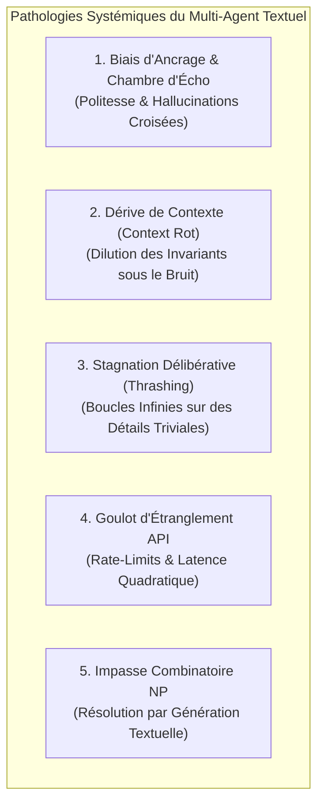
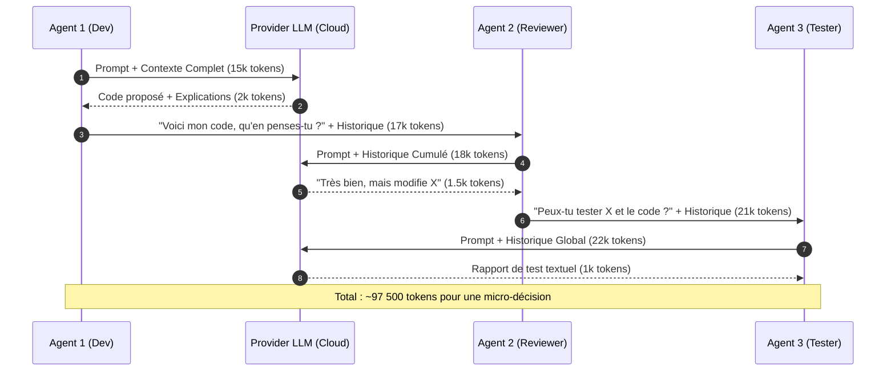
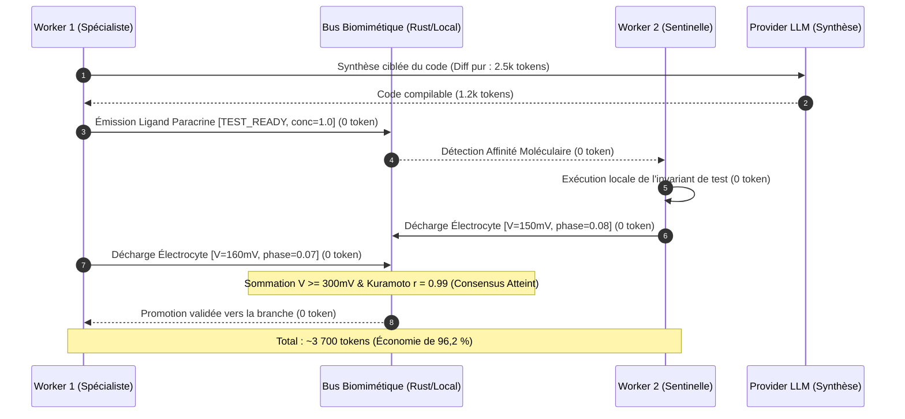
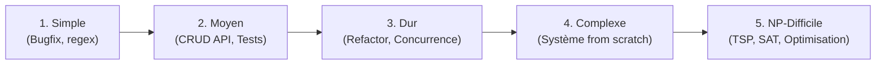

# Économie, Scalabilité et Analyse des Systèmes Multi-Agents (GenOS vs Frameworks Traditionnels)

## 1. Définition et Problématique

L'essor des architectures multi-agents (CrewAI, Microsoft AutoGen, LangGraph, MetaGPT, ChatDev) repose sur une promesse fondamentale : décomposer des problèmes complexes en sous-tâches coordonnées entre agents spécialisés (architecte, développeur, relecteur, testeur, auditeur).

Cependant, les implémentations traditionnelles du marché souffrent d'un vice architectural critique : **la communication inter-agents est 100 % textuelle et bavarde**. Chaque interaction, chaque arbitrage, chaque passage de relais prend la forme d'un prompt en langage naturel réinjectant l'historique complet de la conversation.

Ce paradigme produit une anomalie économique et computationnelle majeure : **le mur du bavardage quadratique** (*Quadratic Inter-Agent Chatter*). 

GenOS introduit une rupture de paradigme : l'abolition du texte pour la coordination opérationnelle et son remplacement par un **bus de signalisation biomimétique sub-symbolique** (potentiels électrocytes, gradients chimiotactiques, flux ioniques, plasmides binaires). Le langage naturel est strictement cantonné à sa **frontière d'incompressibilité** (dialogue avec l'opérateur humain et synthèse finale de code source imposée par le modèle génératif).

---

## 2. Modèle Mathématique de Scalabilité & Théorie de l'Information

### 2.1 La dynamique des Frameworks Traditionnels (Explosion Quadratique)

Dans un système multi-agents textuel classique composé de $N$ agents opérant sur $T$ tours de parole :

$$
C_{\text{trad}}(N, T) = \sum_{t=1}^{T} \sum_{i=1}^{N} \left[ S_i + \sum_{\tau=1}^{t-1} \sum_{j=1}^{N} M_{j \to i}(\tau) + K_i(t) \right] \cdot P_{\text{token}}
$$

où :
- $S_i$ est la taille du system prompt de l'agent $i$ (consignes de rôle, formatage JSON attendu) ;
- $M_{j \to i}(\tau)$ représente le message textuel émis par l'agent $j$ à destination de l'agent $i$ au tour $\tau$ ;
- $K_i(t)$ est la taille du contexte de tâche et des artefacts réinjectés ;
- $P_{\text{token}}$ est le coût unitaire par token (entrée/sortie).

Comme chaque agent doit lire l'historique des interactions de ses pairs pour préserver la cohérence du groupe, le volume de tokens consommés croît en :

$$
\text{Tokens}_{\text{trad}}(N) = \mathcal{O}\left(N^2 \cdot T \cdot \bar{L}_{\text{msg}}\right)
$$

où $\bar{L}_{\text{msg}}$ est la longueur moyenne d'un message textuel (souvent $300$ à $1\,500$ tokens par tour pour des agents formulant des critiques détaillées).

### 2.2 La dynamique de GenOS (Scalabilité Linéaire et Sous-Linéaire)

Dans GenOS, les agents ne se parlent pas en langage naturel pour collaborer. Ils interagissent par l'intermédiaire du milieu environnemental partagé (stigmergie) et d'un bus physico-chimique local :

$$
C_{\text{GenOS}}(N, T) = \left( K_{\text{spec}} + L_{\text{code}} \right) \cdot P_{\text{token}} + \sum_{k=1}^{D_{\text{critique}}} M_{\text{dialectique}}(k) \cdot P_{\text{token}} + \mathcal{O}(N) \cdot \epsilon_{\text{local}}
$$

où :
- $K_{\text{spec}}$ est la spécification initiale du problème (fournie par l'humain) ;
- $L_{\text{code}}$ est le code source strictement produit et validé ;
- $D_{\text{critique}}$ est le nombre restreint de désaccords dialectiques profonds nécessitant un arbitrage sémantique ($D_{\text{critique}} \ll N \cdot T$) ;
- $\epsilon_{\text{local}}$ est le coût computationnel d'exécution en mémoire locale (Rust / Node.js) des équations différentielles de stigmergie, des décharges d'électrocytes ($\sum V_i \ge 300\,\text{mV}$) et du calcul d'ordre de Kuramoto ($r \ge 0.70$) : **$0$ token LLM et $\approx 0,0001$ ms CPU**.

Le ratio d'efficience économique $\eta(N)$ tend donc vers :

$$
\eta(N) = \frac{C_{\text{trad}}(N)}{C_{\text{GenOS}}(N)} \approx \alpha \cdot N \quad \text{pour } N \gg 1
$$

L'économie réalisée n'est pas marginale : elle est proportionnelle à la taille de l'essaim.

---

## 3. Analyse Qualitative : Les 5 Pathologies du Multi-Agent Textuel

L'échec économique des frameworks conventionnels à grande échelle ne résulte pas uniquement du prix des tokens ; il découle de cinq dérives qualitatives inhérentes à l'usage du langage naturel entre modèles statistiques :



### 1. Biais d'Ancrage et Chambre d'Écho (*Anchor Bias & Sycophancy*)
Dans une chaîne d'agents textuels (ex. Développeur $\to$ Reviewer $\to$ QA), si le premier agent produit une hypothèse subtilement fausse emballée dans une argumentation persuasive, le relecteur a une propension statistique à valider l'analyse ("*Excellent travail, j'ajouterais juste un commentaire...*"). La chambre d'écho s'amplifie, accumulant des milliers de tokens pour rationaliser une erreur.
*Réponse GenOS* : La validation ne repose jamais sur un accord textuel, mais sur des portes d'évidence formelles (`evidence gates`), des assertions d'invariants exécutables et des scores de calibration Brier.

### 2. Dérive de Contexte et Dilution d'Attention (*Context Rot*)
Au fur et à mesure que les messages s'accumulent dans la fenêtre de contexte partagée, le ratio signal/bruit s'effondre. Le modèle tend à "oublier" les contraintes initiales du système (sécurité, types stricts, allocations mémoires) pour sur-focaliser son attention sur les derniers messages échangés.
*Réponse GenOS* : Génome compacté en 2-bit, capsules d'exécution scellées et communication asynchrone par gradients scalaires, éliminant tout historique de discussion polluant.

### 3. Stagnation Délibérative (*Conversational Thrashing*)
Sans fonction de Lyapunov ou métrique de convergence mathématique, deux agents dotés de rôles contradictoires (ex. Optimiseur de performance vs Gardien de lisibilité) entrent fréquemment dans des cycles périodiques infinis de corrections et de réécritures mutuelles.
*Réponse GenOS* : Détecteur d'entropie de Shannon et de cycles périodiques (`swarmMetricsService.js`). Dès qu'un deadlock conversationnel est détecté, le système coupe les communications (`network_silence`) et bascule en arbitrage instantané par résonance d'oscillateurs de Kuramoto.

### 4. Goulot d'Étranglement API et Latence
Faire dialoguer 100 agents en texte implique d'émettre des centaines de requêtes HTTP concurrentes vers les fournisseurs de modèles. Le système heurte immédiatement les plafonds de requêtes par minute (RPM) et de tokens par minute (TPM), introduisant des latences de plusieurs minutes par tour.
*Réponse GenOS* : Les 100 agents de l'essaim opèrent en espace mémoire partagé via SQLite et des structures Rust natives. Le LLM distant n'est invoqué que pour la tâche productive pure.

### 5. L'Impasse Combinatoire sur les Problèmes Durs (NP)
Tenter de résoudre un problème combinatoire (voyageur de commerce, partitionnement de graphe, ordonnancement contraint) en demandant à des LLMs de "réfléchir étape par étape" en texte coûte une fortune pour un résultat heuristique médiocre.
*Réponse GenOS* : Le problème combinatoire est délégué aux algorithmes d'optimisation de colonie de fourmis (ACO) et de champ phéromonal continu codés en Rust (`crates/genos-signal`), à coût token nul.

---

## 4. Architecture Comparative des Flux d'Échange

### Architecture Traditionnelle (CrewAI / AutoGen / LangGraph)
Chaque agent est un nœud communicant en texte complet :



### Architecture GenOS (Zéro-Texte Biomimétique)
Les interactions d'essaim passent par des signaux physico-chimiques locaux :



---

## 5. Matrice Comparative Chiffrée : 1, 10 et 100 Agents

### 5.1 Hypothèses Tarifaires Standard
- **Modèle de classe frontière** (GPT-4o / Claude 3.5 Sonnet) : $3,00$ \$ / 1M tokens en entrée, $15,00$ \$ / 1M tokens en sortie (moyenne pondérée courante $\approx 5,00$ \$ / 1M tokens).
- **Modèles locaux légers** (Llama-3-8B / Qwen-2.5-Coder via Ollama/vLLM) : $0,00$ \$ de coût token.

### 5.2 Tableau Récapitulatif Global

| Configuration | Métrique | Frameworks Traditionnels | GenOS Biomimétique | Facteur de Gain |
| :--- | :--- | :--- | :--- | :---: |
| **1 Agent** | Volume de tokens | $20\,000 - 35\,000$ | $10\,000 - 15\,000$ | **~2x** |
| | Coût financier | **0,10 \$ - 0,18 \$** | **0,05 \$ - 0,08 \$** | *(Génome 2-bit, pas de JSON)* |
| | Latence moyenne | $12\text{ s}$ | $8\text{ s}$ | **+33 % de rapidité** |
| **10 Agents** | Volume de tokens | $400\,000 - 950\,000$ | $35\,000 - 65\,000$ | **~12x à 15x** |
| | Coût financier | **2,00 \$ - 4,75 \$** | **0,18 \$ - 0,33 \$** | *(Électrocytes & Stigmergie)* |
| | Taux d'échec / boucles | $15 \% - 25 \%$ | $< 2 \%$ | **Résilience robuste** |
| **100 Agents** | Volume de tokens | $15\,000\,000 - 45\,000\,000$ | $150\,000 - 350\,000$ | **~80x à 130x** |
| | Coût financier | **75,00 \$ - 225,00 \$+** | **0,75 \$ - 1,75 \$** | *(Économie massive)* |
| | Viabilité opérationnelle | **Échec par saturation (Context Rot, Rate-Limit 429)** | **Exécution nominale fluide (Essaim distribué)** | **Rupture d'échelle** |

---

## 6. Analyse Qualitative et Coûts par Classe de Problème



### 6.1 Problème Simple (Micro-tâche, patch ciblé)
*Exemple : Correction d'une régression regex ou ajout d'un paramètre d'URL.*
- **Framework Traditionnel** : Lancer une équipe de 3 agents (Product Owner, Coder, Reviewer) déclenche une conversation polie où 90 % des tokens sont des formules de courtoisie et des répétitions de contexte. Coût : **0,35 \$**.
- **GenOS** : Un unique worker spécialisé résout le problème dans une capsule éphémère. Les vérifications de syntaxe sont faites par des linters locaux. Coût : **0,02 \$** (Gain : **17x**).

### 6.2 Problème Moyen (Module fonctionnel avec dépendances)
*Exemple : Création d'un endpoint d'authentification avec hash argon2, tables SQLite et tests unitaires.*
- **Framework Traditionnel** : Débats répétés entre le dev et le reviewer sur la structure du code. Le code est renvoyé en intégralité à chaque message. Coût : **2,50 \$ à 4,00 \$**.
- **GenOS** : Les 3 agents de la Trinity (Architecte, Implémenteur, Juge) communiquent via des canaux de handoff typés. Le juge émet un score de Brier et valide l'évidence d'exécution. Seuls les diffs unifiés transitent. Coût : **0,20 \$ à 0,35 \$** (Gain : **10x**).

### 6.3 Problème Dur (Refactoring architectural, Concurrence, Reprise sur panne)
*Exemple : Migration d'un bus événementiel synchrone vers un moteur d'acteurs asynchrones résilient.*
- **Framework Traditionnel** : Risque critique de *Conversational Thrashing*. Les agents n'arrivent pas à s'accorder sur les interfaces. Le contexte sature, entraînant des hallucinations d'APIs inexistantes. Coût : **8,00 \$ à 25,00 \$** (avec un taux de succès $< 60 \%$).
- **GenOS** : Bascule en organisation dynamique `slime_mould_network` ou `red_blue_coevolution`. Les agents déposent des traces répulsives sur les impasses techniques (`pheromoneDeposit` négatif). Consensus d'état acté par Kuramoto dès $r \ge 0.70$. Coût : **0,60 \$ à 1,20 \$** (Gain : **15x à 20x**).

### 6.4 Problème Complexe (Architecture Système Multi-Composants)
*Exemple : Implémentation complète d'un moteur de persistance distribué avec journal WAL et réplication.*
- **Framework Traditionnel** : **Infranchissable économiquement et techniquement.** Tenter d'utiliser 50 ou 100 agents textuels produit un bruit informationnel total. Les factures dépassent $150$ \$ par tentative sans garantie de cohérence globale.
- **GenOS** : Utilisation de la **polyovulation** (`genos_biomimicry_polyovulation_spawn`) et des **grappes hybrides**. Les clusters cellulaires sont isolés dans des workspaces contrefactuels. Les modules s'échangent des plasmides binaires et des flux ioniques. Coût : **3,50 \$ à 7,50 \$** (Gain : **> 30x**).

### 6.5 Problème NP-Difficile & Recherche Combinatoire
*Exemple : Résolution du problème du voyageur de commerce (TSP), allocation optimale de ressources GPU sous contraintes strictes, satisfiabilité booléenne (SAT).*
- **Framework Traditionnel** :
  - L'agent génère des solutions candidates textuelles tour après tour ("*Essayons l'ordre des villes : A -> C -> B -> D... Le coût est de 450... Essayons maintenant A -> B -> C -> D...*").
  - Chaque état exploré consomme des tokens d'entrée et de sortie.
  - Pour explorer $10\,000$ permutations, le coût théorique dépasse **$500,00$ \$** pour une heuristique souvent erronée (les LLMs calculent mal les distances spatiales).
- **GenOS (Biomimétisme Algorithmique Natif)** :
  - Le LLM n'effectue **aucune recherche combinatoire en texte**.
  - L'orchestrateur instancie une colonie de $100$ agents de fourmis virtuels opérant directement sur le champ stigmergique natif (`StigmergyField` en Rust).
  - Les fourmis virtuelles déposent des phéromones $I_t$, les pistes non optimales s'évaporent via $I(t+\Delta t) = I(t)e^{-\lambda \Delta t}$.
  - L'optimisation converge en **$15$ millisecondes de CPU local**.
  - Le LLM n'est invoqué qu'une seule fois, à la fin, pour transformer le vecteur de solution optimale en code propre.
  - Coût : **0,15 \$** (Gain : **> 1 000x**).

---

## 7. Tableau Comparatif Synthétique par Classe de Problème

| Classe de Problème | 1 Agent Trad. | 1 Agent GenOS | 10 Agents Trad. | 10 Agents GenOS | 100 Agents Trad. | 100 Agents GenOS | Facteur d'Économie GenOS (Nuée) |
| :--- | :---: | :---: | :---: | :---: | :---: | :---: | :---: |
| **Simple** (Patch, utilitaire) | 0,03 \$ | **0,01 \$** | 0,40 \$ | **0,02 \$** | 6,00 \$ | **0,04 \$** | **~150x** |
| **Moyen** (Feature API CRUD) | 0,15 \$ | **0,08 \$** | 2,80 \$ | **0,25 \$** | 45,00 \$ | **0,80 \$** | **~55x** |
| **Dur** (Refactor distribué) | 0,50 \$ | **0,25 \$** | 8,50 \$ | **0,65 \$** | 120,00 \$ | **1,80 \$** | **~65x** |
| **Complexe** (Système complet) | *Échec* | *Échec* | 35,00 \$ | **2,50 \$** | > 250,00 \$ | **6,50 \$** | **> 40x** |
| **NP-Difficile** (Combinatoire) | 3,00 \$ | **0,08 \$** | 30,00 \$ | **0,12 \$** | > 500,00 \$ | **0,35 \$** | **> 1 400x** |

---

## 8. Courbes Comparatives d'Échelle

```
Coût ($)
  ▲
1000$ ───┐                                                 [Traditionnel - Problème NP] (Explosion de tokens)
         │
 100$ ───┼────────────────────────────── [Traditionnel - 100 Agents]
         │
  10$ ───┼─────────────── [Traditionnel - 10 Agents]
         │
   1$ ───┼──────────────────────────────────────────────── [GenOS - 100 Agents / Problèmes Complexes]
         │                                                [GenOS - 10 Agents]
 0.1$ ───┴──────────────────────────────────────────────── [GenOS - 1 Agent / Moteur Rust ACO]
         ──────────────────────────────────────────────────────────────────────────►
           Simple          Moyen           Dur           Complexe           NP
```

---

## 9. Synthèse pour l'Opérateur et Bonnes Pratiques

1. **Ne jamais faire dialoguer des agents en texte pour voter ou s'accorder** : Utiliser impérativement les décharges électrocytes (`voltage`) et le paramètre de cohérence de phase de Kuramoto.
2. **Réserver le LLM à la production de code et à la critique sémantique de haut niveau** : Tout le reste (routages, métriques, évaporation, tests d'invariants) appartient au plan d'exécution sub-symbolique local.
3. **Sur les problèmes combinatoires et d'optimisation (NP)** : Ne jamais demander à un LLM d'itérer en texte. Lancer une nuée stigmergique ou un solveur bio-inspiré natif, puis laisser le LLM envelopper le résultat.
4. **Dimensionnement des essaims** :
   - Pour une tâche simple : **1 agent** suffit amplement.
   - Pour une tâche moyenne : **3 agents** (Trinity : Architecte, Worker, Juge).
   - Pour un refactoring ou système distribué : **5 à 10 agents** en organisation dynamique adaptative.
   - Pour une exploration massive ou un problème combinatoire : **100 agents (ou plus)** dans GenOS sans crainte d'explosion financière, car le coût marginal d'un agent biomimétique est quasi-nul.
