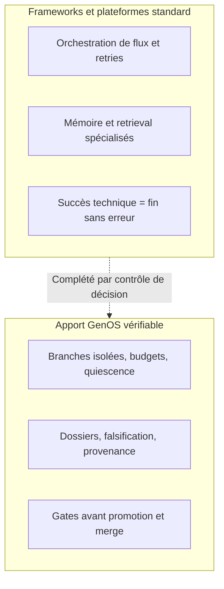

# Panorama concurrentiel GenOS

- **Statut** : référence maintenue ; les statuts GenOS suivent la règle `matrice-cohérence` (code + contrat + nominal + refus + preuve + limite).
- **Dernière revue** : 2026-09-26
- **Sources code** : inventaire `docs/03-reference/inventaire-technique.md` du 2026-09-22 (172 outils runtime, 91 handlers bio), matrice `docs/06-qualite-preuves/matrice-coherence-code-docs.md` du 2026-09-19, audit `docs/06-qualite-preuves/audit-affirmations-operationnelles.md` du 2026-09-19, contrat mission `docs/02-orchestration/orchestration.md` (`Partiel`, revue 2026-09-25).

## 1. Objet et méthode

Positionne GenOS face aux familles substituables ou complémentaires, sur capacités publiquement documentées. Ni benchmark de performance, ni attestation de conformité, ni recommandation d'achat. Toute capacité concurrente se revalide dans le déploiement concerné.

| Statut GenOS | Signification |
| --- | --- |
| Opérationnel | Code + contrat + exemple + nominal + refus + preuve reproductible + limite connue. |
| Partiel | Surface présente avec limites, dépendances ou cas non couverts. |
| Expérimental | Opt-in, prototype, sans garantie de production. |
| Conceptuel | Modèle d'organisation ; pas une promesse produit. |

Différenciateur : réunir autour d'une même décision agentique l'état, la provenance, les budgets, l'isolation, la preuve et la promotion. GenOS n'est pas un remplacement monolithique.

## 2. Lecture rapide

| Domaine | Alternatives les plus proches | Position GenOS |
| --- | --- | --- |
| Runtime agentique | LangGraph, CrewAI, AutoGen/AG2, Microsoft Agent Framework, Semantic Kernel, OpenAI Agents SDK, LlamaIndex Workflows, Haystack | Runtime contrôlé avec état, preuves et promotion ; moins large en SDK/écosystème. |
| Workflows durables | Temporal, Airflow 3.x, Prefect 3.x (rapprochement Dagster 2026), Dagster, Argo, Flyte, n8n, Camunda 8, Step Functions, Azure Durable | Décisions d'agents avec garde-fous ; moins mature comme ordonnanceur généraliste. |
| Mémoire et retrieval | Mem0, Letta, Zep/Graphiti, LangChain/LlamaIndex, Pinecone, Weaviate, Qdrant, Milvus, pgvector, Neo4j | Mémoire liée à identité/provenance/politiques ; pas une base vectorielle spécialisée. |
| Modèles et routage | LiteLLM, OpenRouter, Portkey, Kong/Cloudflare AI Gateway, Helicone (maintenance), Ollama, vLLM, NVIDIA NIM | Routage local/cloud avec identité du modèle servi, intégré au contrôle d'exécution. |
| Optimisation | DSPy, Optuna, Ray Tune, EvoAgentX | Sélection sous budget + gate ; pas une plateforme AutoML. |
| MCP et IDE | MCP SDK/serveurs, Claude Desktop/Code, Cursor, VS Code, JetBrains | Surface REST/gRPC/MCP/CLI/IDE gouvernée par leases ; pas un IDE. |
| Sécurité et identité | Keycloak, Auth0/Okta, OPA, Cedar, Vault, Lakera | Autorité/scopes/gates près de l'action ; pas IdP, coffre ou SIEM complet. |
| Observabilité et éval | Langfuse, LangSmith, Phoenix, Braintrust, Weave, OpenTelemetry, Datadog | Trace liée à promotion ; écosystème d'analyse plus restreint. |
| Sandbox | Docker, Kubernetes, gVisor, Firecracker, E2B, Daytona, Modal | Politiques d'exécution ; isolation réelle = adaptateur + image + réseau. |

## 3. Comparaison par concept GenOS

Chaque ligne GenOS est justifiée par code + test + doc. `Partiel/Expérimental` quand un adaptateur, un mode ou une boucle reste à vérifier.

### 3.1 Topologies (8) et organisations (19)

Code : `trinityService.js`, `aTeamService.js`, `biocenoseService.js`, `holobionteService.js`, `syncytiumCrdtService.js`, `rhizomeCoordinationService.js`, `biomeCoordinationService.js`, `metapopulationCoordinationService.js`, `dynamicOrganizationService.js`, `topologySessionStore.js`, `topologyCapabilityService.js`. Tests : `test_trinity_*`, `test_a_team*.js`, `test_biocenose_*`, `test_holobionte_*`, `test_syncytium_*`, `test_rhizome_*`, `test_biome_*`, `test_metapopulation_*`, `test_dynamic_organization.js`. Docs : `docs/02-orchestration/topologies-et-capacites.md`, `docs/02-orchestration/orchestration.md`.

| Concept GenOS | Statut | Concurrents : ce qu'ils font | Écart |
| --- | --- | --- | --- |
| Trinity (3 mondes scellés, barrière comparative, `merge_trinity`) | Opérationnel | LangGraph `interrupt`/time-travel ; CrewAI hiérarchique ; AutoGen GroupChat/Magentic-One ; Agent Framework patterns sequential/concurrent/handoff | Aucun n'impose 3 chambres scellées + empreintes snapshot identiques + promotion du gagnant comme invariant. |
| A-Team (domaines, handoffs, arbitrage) | Opérationnel | Mêmes + MetaGPT/ChatDev (rôles) | Handoffs GenOS liés à dossiers de preuve ; ailleurs coordination conversationnelle. |
| Biocénose (quorum, Brier, byzantin) | Opérationnel | Ray, quorum applicatif ad hoc | Brier pondéré + abstention + veto minoritaire câblés ; ailleurs à construire. |
| Holobionte (hôte + symbiotes, veto) | Opérationnel/Partiel selon primitive | Pas d'équivalent direct | Veto immunitaire et inférence locale disponibles comme primitives, appel non garanti sur chaque chemin. |
| Syncytium (CRDT, sessions persistées) | Opérationnel | CRDT génériques (Yjs/Automerge), acteurs distribués | Sessions `topology_sessions` + snapshot/CRDT exposés via `genos_topology_session` ; pas de consensus distribué global. |
| Rhizome/Biome (sessions, stigmergie, foraging, allocation) | Opérationnel, boucle auto proposée | Algorithmes essaim (boids, physarum, grey-wolf) en libs | Opérations explicites (`snapshot/deposit/route/slime`, `allocate/forage/health`) ; routage multi-hop auto et boucle fermée restent proposés. |
| Métapopulation (quorum pondéré, lignage, recovery) | Opérationnel | Partitionnement applicatif | Quorum + régénération exposés, déclenchés explicitement. |
| 19 organisations dynamiques | Opérationnel | Patterns codés à la main | `flockingBoids/fishSchool/slimeMould/greyWolf` déterministes locaux, une étape par décision, pas de boucle haute fréquence. |

Limite transverse (`orchestration.md`) : le préparateur historique (`single_agent/parallel_forks/trinity`) reste le plan physique principal ; Morphogenèse V2 est en shadow opt-in (`GENOS_MORPHOGENESIS_V2_SHADOW`) sans commit ; transition inter-topologies en échec fermé sans adaptateur testé (seul Trinity→A-Team couvert).

### 3.2 Preuve, falsification, promotion

Code : `agentEvidenceService.js`, `strategyPromotionGate.js`, `strategyPromotionPolicyService.js`, `epistemic/aeisPromotionBridge.js`, `hallucinationMonitoringService.js`. Tests : `test_promotion_gate.js`, `test_collective_decision_evidence_gate.js`, `test_worker_dossiers_suite.js`, `test_no_answer_proof_remediation.js`, `test_conclusion_provenance_integrity.js`, `test_counterexamples_falsification.js`. Doc : `docs/01-concepts/epistemologie-et-evidence.md`.

| Concept GenOS | Statut | Concurrents | Écart |
| --- | --- | --- | --- |
| Claims/evidence, dossiers, influence citée, `no_answer` borné, provenance Merkle | Opérationnel | LangSmith/Phoenix/Langfuse (traces, scores, datasets) ; Braintrust (scorers, CI) | Eux observent ce qui s'est passé ; GenOS bloque la promotion sans claims étayés (`success + 0 claim = failed`), exige `usedClaims` réels et approbation liée au hash SHA-256. |
| Hypothèses falsifiables, contre-exemples, `beliefGate` seuil 0.6 | Opérationnel/Partiel | DSPy (`compile` sur métrique + trainset) ; Evals ; garde-fous Azure AI Foundry ; Lakera (détection probabiliste) | GenOS privilégie liens explicites + heuristiques lexicales, pas une preuve logique générale ; score `evidenceScore` = priorisation, pas vérité ; DSPy optimise qualité moyenne, GenOS refuse promotion sans preuve même si métrique haute. |
| Gates `require_replay/independent_verification/human_approval`, `preserve_rejected_branches` | Opérationnel | OPA/Cedar (policy), GitHub protections de branche, LaunchDarkly (flags) | Gates GenOS liées au payload et au replay ; une violation rend `eligible:false` ; `reconstructed` accepté par défaut — exiger `replayVerified===true` + artefacts + approbation pour risque élevé. |

### 3.3 Workspaces, snapshots, forks, replay, lineage

Code : `workspaceSnapshotStore.js`, `workspaceSnapshot*.js`, `agentWorkspaceLifecycleService.js`, `trajectoryService.js`, `forkIdentityService.js`, `agentGitController/`, `rustBridgeService.js`. Tests : `test_snapshot_limits.js`, `test_agent_state_snapshot_contract.js`, `test_replay_truthfulness.js`, `test_agent_branch/diff/commit_contract.js`. Docs : `docs/02-orchestration/workspaces-contrefactuel.md`, `docs/02-orchestration/git-agents.md`.

| Concept GenOS | Statut | Concurrents | Écart |
| --- | --- | --- | --- |
| Snapshots/forks/diffs/replay, capsules isolées, lineage | Opérationnel | Git/GitHub/GitLab (fichiers) ; DVC/LakeFS/Pachyderm (données) ; MLflow/W&B (expériences) ; Temporal/Dagster (replay workflows) | GenOS versionne contexte/budgets/preuves/états, pas seulement fichiers ; merge auto soumis à politique, conflit = échec post-promotion. Rejeu total non garanti si dépendances externes non capturées — même limite générale. |

### 3.4 Budgets, fan-out, recovery bornée, équité

Code : `tokenAllocationService.js`, `agentFleetService.js`, `agentRoundService.js`, `workerFailureRecoveryService.js`, `agentRecoveryService.js`, `inferenceGatewayService.js`, `orchestrationActionExecutor.js`. Tests : `test_token_allocation.js`, `test_orchestration_evidence_barrier.js`, `test_worker_failure_recovery.js`, `test_mission_decomposition_invariants.js`.

| Concept GenOS | Statut | Concurrents | Écart |
| --- | --- | --- | --- |
| Split 60/40, `MAX_AUTONOMOUS_WORKERS=3` (configurable 100+ en tissus), successive halving, quiescence, dédup, `MAX_RECOVERY=3`, fairness tenant | Opérationnel | Temporal (retries/dedup/visibility) ; Airflow/Prefect (retries, files) ; LiteLLM/proxy (budgets clés) | GenOS ajoute budget cognitif par branche + sélection survivants Pareto + reprise causée (`mutate/fork/bisect/replace/escalate`) + équité `organizationId:projectId`. Pas de `exactly-once` sur effets externes ; capacité 100 = paramètre, pas benchmark. |

### 3.5 Mémoire, plasticité, retrieval

Code : `vectorMemoryService.js` (768D, blob, RRF), `embeddingProvider.js` (Xenova/Ollama/OpenAI, rejet zéro-vecteur), `synapticPlasticityService.js`, `sleepCycle.js`, `memoryController.js`. Tests : `test_vector_memory_contracts.js`, `test_fts_vec_integrity.js`, `test_stdp_*`, `test_memory_invariants.js`. Docs : `docs/01-concepts/memoire-et-apprentissage.md`, `docs/01-concepts/neurobiologie-et-plasticite.md`.

| Concept GenOS | Statut | Concurrents | Écart |
| --- | --- | --- | --- |
| Épisodique/sémantique + provenance + hybride dense/BM25 + consolidation sommeil | Opérationnel | Mem0 (faits ADD/UPDATE/DELETE) ; Letta (RAM/blocs + archival) ; Zep/Graphiti (graphe temporel `valid_at/invalid_at`) ; Pinecone/Weaviate/Qdrant/Milvus/pgvector ; Neo4j | Stores spécialisés plus scalables en index/filtrage ; GenOS lie mémoire à décision/politique/rétention, avec STDP. |
| STDP 3-facteurs, pruning C3/CD47 | Partiel | Rare hors labo | Présent runtime, couverture et généralisation limitées ; ne pas présenter comme mémoire biologique validée. |

### 3.6 Modèles, routage, inférence

Code : `modelRouter.js`, `modelRoutingPolicy.js`, `modelRouteRunner.js`, `localModelDiscovery.js`. Tests : `test_model_router_policy_order.js`, `test_model_auto_route.js`, `test_prefer_local_strict.js`. Docs : `docs/03-reference/modeles-et-providers.md`.

| Concept GenOS | Statut | Concurrents | Écart |
| --- | --- | --- | --- |
| Multi-provider cloud/local/OpenAI-compatible, fallback ordonné, parallèle sous coût explicite, identité demandée/servie + ledger | Opérationnel | LiteLLM (100+ providers, fallback YAML) ; OpenRouter (300-400 modèles, routage coût/latence, Fusion) ; Portkey (fallback multi-niveaux, caches, guardrails) ; Ollama/vLLM/NIM (moteurs) | Gateways plus larges en catalogue/cache/audit ; GenOS = arbitre intégré au contrôle d'exécution (droit de partir, budget de branche, preuve au retour). Consommateur, pas fournisseur de fondation. |

### 3.7 MCP, leases, CLI, IDE

Code : `mcpToolRegistry.js`, `toolLeasePolicy.js` (fail-closed), `mcpArgumentValidation.js`, `circuitBreaker.js`, `mcp/index.js`, `shared/toolDefinitions.json` (27 entrées) vs 172 runtime. Tests : `test_mcp_*`, `test_tool_lease_restriction.js`, `test_capability_lease.js`, `test_ide_contract.js`. Docs : `docs/03-reference/outils-mcp.md`, `docs/03-reference/api-et-contrats.md`.

| Concept GenOS | Statut | Concurrents | Écart |
| --- | --- | --- | --- |
| Registre déclarations, leases par capacités, allowlist, `genos_orchestrate` jamais réintroduit, circuit breaker, contrat `genos.ide/v1` | Opérationnel | MCP SDK/serveurs, Copilot/Cursor/Windsurf/Cline, Continue, JetBrains AI | IDE/assistants meilleurs en édition/complétion ; GenOS gouverne outils appelés et promotion des effets. 172 outils runtime sans preuve nominale/refus unitaire chacun ; aucune extension VS Code/JetBrains livrée ; définition ≠ handler câblé. |

### 3.8 Workflows et jobs généralistes

Références : Temporal, Airflow, Prefect, Dagster, Argo, Flyte, n8n, Camunda, Step Functions, Azure Durable.

Temporal et orchestrateurs données supérieurs en planification distribuée, SLA, reprise workers, très grande échelle. GenOS privilégie transitions décisionnelles, budgets cognitifs, sélection après évaluation. Intégrer un ordonnanceur éprouvé pour charges critiques longue durée, pas d'équivalence. Détail : Temporal = event-sourcing + retries/dedup ; Airflow = DAG batch schedulé ; Prefect/Dagster (rapprochement 2026) = flows/assets event-driven ; Argo/Flyte = K8s/ML ; n8n = visuel 400+ intégrations sans durable execution sémantique ; Camunda = BPMN/DMN régulé ; Step Functions/Durable = state machines cloud-locked.

### 3.9 Sécurité, identité, sandbox, persistance, observabilité

Code : `middleware/auth.js`, `controllers/authController.js`, `secretVault.js`, `pathSafety.js`, `vfsSandboxService.js`, `db/schema*.js`, `migrations/*`, `telemetryObserver.js`, `telemetryPersist.js`. Tests : `test_auth_bootstrap.js`, `test_tenancy.js`, `test_path_traversal.js`, `test_telemetry_contract.js`, `test_db.js`, `test_schema_drift.js`.

| Concept GenOS | Statut | Concurrents | Écart |
| --- | --- | --- | --- |
| Identités/rôles/tenants/leases, approbation explicite, VFS sandboxé, SQLite WAL + sqlite-vec + FTS5, télémétrie redactée + SSE | Opérationnel | Keycloak/Auth0 (IdP), Vault (secrets), OPA/Cedar (policy), Lakera (guardrails probabilistes) ; Docker/K8s/gVisor/Firecracker/E2B/Daytona/Modal ; Langfuse/LangSmith/Phoenix/Braintrust/Weave/OTel/Datadog ; Postgres/SQLite/Supabase | GenOS n'est ni IdP ni coffre ni SIEM ; barrière réelle = adaptateur + image + egress + secrets ; SQLite = couche domaine, pas SGBD distribué ; trace GenOS liée à promotion, dashboards = OTel/Datadog/Langfuse. Daytona ≥0.186 requis (CVE-2026-54319/54321) ; Helicone en maintenance, éviter en greenfield. |

## 4. Matrice de choix

| Situation | Choisir GenOS | Conserver ou ajouter |
| --- | --- | --- |
| Agent modifiant dépôt/config | Oui, état/isolation/preuve/promotion | GitHub/GitLab, CI/CD, sandbox durci, revue humaine |
| Assistant de code en IDE | Comme gouverneur de tools/effets | Copilot, Cursor, Windsurf, Cline, Continue |
| Workflow données planifié/massif | Pour décisions agentiques dans étapes | Temporal, Airflow, Prefect, Dagster, Argo, Flyte |
| RAG très grande échelle | Pour provenance et règles d'usage | Qdrant, Weaviate, Pinecone, Milvus, Elasticsearch, Neo4j |
| Multi-agent de recherche peu risqué | Possible, souvent surdimensionné | LangGraph, CrewAI, AutoGen, Agent Framework |
| Action autonome à impact élevé | Oui si gates/identité/sandbox configurés | IdP, OPA/Cedar, Vault, SIEM, CI/CD, approbation humaine |
| Parc fournisseurs large | Pour router/auditer sous budget | LiteLLM, Portkey, OpenRouter + Ollama/vLLM/NIM |
| Optimisation prompts/params | Sous contrainte budget + gate | DSPy, Optuna, Ray Tune ; EvoAgentX en recherche seule |
| Observabilité prod | Pour relier trace à promotion | OTel, Datadog, Langfuse, LangSmith, Phoenix |

## 5. Limites et critères d'évaluation

Scénario reproductible commun : action avec outil externe en permission minimale ; preuve fonctionnelle attendue ; panne modèle/réseau/worker ; fork concurrent + promotion/rejet ; audit identité/modèle servi/outil/entrées/sorties/coûts/approbations ; restauration montrant limites du rejeu externe.

Points GenOS à vérifier : maturité effective par primitive, adaptateur sandbox/déploiement, opt-in expérimentaux, couverture du flux. Rappel audit 2026-09-19 : 341 déclarations de routes dont 110 à correspondance littérale en tests (pas de matrice route→contrat→test), 41 services proto ≠ RPC démontrés, `test:security` et `test:grpc` en échec au moment de l'audit (`CORS/ETIMEDOUT`, `AgentService.StartMission`), 172 outils runtime vs 27 définitions partagées, SSE sans garantie `evidence_barrier/complete`, job ≠ `exactly-once`, fixture blob 103→88 octets (14,56 %) non généralisable. Analogies biologiques = invariants de conception, pas preuves de sécurité/disponibilité/émergence.

Positions relatives illustratives, non mesurées. Aucun score, aucun benchmark joint.

## 6. Sources à maintenir

Réviser à chaque évolution majeure des contrats ou du catalogue providers. Sources : documentation GenOS et index lié ; Model Context Protocol ; LangGraph, CrewAI, AutoGen/AG2, Microsoft Agent Framework, Semantic Kernel, OpenAI Agents SDK, LlamaIndex, Haystack ; Temporal, Airflow, Prefect, Dagster, Argo, Flyte, n8n, Camunda, Step Functions, Azure Durable ; Mem0, Letta, Zep/Graphiti, Pinecone, Weaviate, Qdrant, Milvus, pgvector, Neo4j ; LiteLLM, OpenRouter, Portkey, Ollama, vLLM, NIM ; DSPy, Optuna, Ray Tune ; Langfuse, LangSmith, Phoenix, Braintrust, Weave, OpenTelemetry, Datadog ; Keycloak, Auth0, OPA, Cedar, Vault, Lakera ; Docker, Kubernetes, gVisor, Firecracker, E2B, Daytona, Modal. Liens = points d'entrée, pas preuves. Toute allégation de coût/sécurité/performance se revalide sur versions et offres utilisées.
