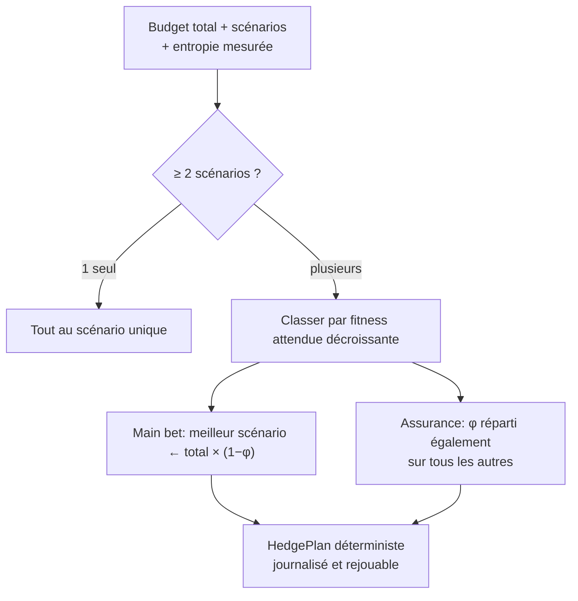

# Bet-Hedging — Assurance par Diversification sous Incertitude

> **Concept biologique** : bet-hedging bactérien (switching stochastique, fitness géométrique)
> **Statut** : implémenté (`genos-core::biomimicry::bet_hedging`)
> **Recherche amont** : `docs/research/fr/BIOMIMICRY_BET_HEDGING.md`

## 1. Pourquoi

### 1.1 Le problème : optimiser la moyenne, ruiner la queue gauche
Le réflexe naturel face à l'incertitude est de tout miser sur le scénario le plus probable (ou de répartir au feeling). Les deux échouent différemment :
- tout miser ⇒ risque de ruine de lignée si le scénario choisi ne se réalise pas ;
- répartir sans critère ⇒ ni performance ni protection.

Les bactéries ont résolu cela : en environnement imprévisible, elles produisent délibérément des descendants phénotypiquement hétérogènes. Le critère n'est PAS la moyenne — c'est la **fitness géométrique** E[log], qui pénalise massivement les zéros. Le bet-hedging est de l'assurance, pas de l'exploration optimiste.

### 1.2 Bénéfices
| Bénéfice | Mécanisme |
|---|---|
| Survivance garantie aux chocs | Au moins un descendant viable dans chaque scénario plausible |
| Dimensionnement formel | φ = f(entropie mesurée), fini le feeling |
| Discipline budgétaire | Plafond φ ≤ 0.40 : l'assurance ne mange jamais la stratégie |
| Reproductibilité | Plans déterministes (tie-break par nom) → rejouables |

## 2. Comment

### 2.1 Modèle
```
Scenario   = { name, expected_fitness }
φ(entropy) = clamp(0.10 + 0.30 × entropy, 0.05, 0.40)
Plan       = { main_scenario, main_budget = total × (1−φ),
               insurance: [(scénario, budget)], insurance_fraction }
```

Règles d'allocation :
1. **Main bet** → scénario à fitness attendue maximale (tie-break alphabétique pour la reproductibilité) ;
2. **Assurance** → fraction φ répartie ÉGALEMENT entre tous les autres scénarios (equal-weight : robuste sans estimation de probabilités) ;
3. **Plancher permanent** : même à entropie nulle, φ ≥ 0.05 — le switching stochastique biologique n'est jamais nul ;
4. **Conservation exacte** : main + assurances = budget total (reste unité par unité distribué aux premières assurances).

### 2.2 Schéma



Exemple (budget 1000, entropie 0.55, φ≈0.27) :
```
aggressive   (fitness 0.9)  → main bet     : 731
conservative (fitness 0.6)  → assurance    : 136
regulatory-b (fitness 0.3)  → assurance    : 133
```

## 3. Quand — orchestrateur vs worker

| Acteur | Responsabilité |
|---|---|
| **Orchestrateur** | Estime l'entropie (seuils existants, volatilité des événements) ; énumère les scénarios plausibles avec fitness attendues ; invoque `allocate` à chaque génération de forks ; journalise le plan et, plus tard, quel scénario s'est réalisé (calibration). |
| **Worker** | Exécute son scénario assigné ; les phénotypes « assurance » peuvent être dormants (spores) ou conservateurs. |
| **Humain** | Définit les scénarios non-dérivables (réglementaire, concurrentiel) ; arbitre quand une assurance gagne (le plan doit savoir perdre honnêtement). |

Déclencheurs : campagne de forks (`branch_evolution`), entrée sur marché inconnu, changement réglementaire envisagé, entropie franchissant un seuil.

## 4. Combinaisons et interactions

| Avec… | Interaction |
|---|---|
| **Pareto** existant (`genos-eval/pareto.rs`) | Pareto optimise la frontière arithmétique ; le bet-hedging choisit SUR la frontière selon le critère géométrique. Complémentaires, pas concurrents. |
| **Néoténie** | Les spawns-néoténiques forcés sont une assurance démographique ; bet-hedging diversifie les forks, néoténie diversifie les rôles. |
| **Spéciation** (doc sœur) | Une branche « insurance » qui réussit peut devenir une espèce divergente volontaire. |
| **Équilibres ponctués** | Après un saut évolutif validé, l'entropie chute ⇒ φ baisse ⇒ retour à la concentration. Le système respire. |
| **Cryptobiose** | Les descendants d'assurance à faible fitness attendue naissent souvent sporés : coût quasi nul tant que dormant. |
| **Entropie existante** (`evolution_set_entropy_threshold`) | Source naturelle du paramètre entropy. |

## 5. API

### 5.1 Rust
```rust
let scenarios = vec![
    Scenario { name: "aggressive".into(), expected_fitness: 0.9 },
    Scenario { name: "conservative".into(), expected_fitness: 0.6 },
];
let plan = allocate(1000, &scenarios, 0.55)?;
assert_eq!(plan.main_scenario, "aggressive");
assert_eq!(plan.main_budget + insured_sum(&plan), 1000); // conservation exacte
```

### 5.2 Tool MCP
`biomimicry_bet_hedge_allocate` — `total_budget`, `entropy`, `scenario[]` (`name:expected_fitness`).

### 5.3 CLI
```bash
genos biomimicry bio-feature --feature bet-hedging --action allocate \
  --param total_budget=1000 --param entropy=0.55 \
  --param scenario="aggressive:0.9" --param scenario="conservative:0.6" \
  --param scenario="regulatory-b:0.3"
# Main bet: aggressive gets 731/1000 units
#   insurance: conservative gets 136
#   insurance: regulatory-b gets 133
# Insurance fraction: 26.9%
```

## 6. Tests
`cargo test -p genos-core bet_hedging` :
- erreur sans scénarios ; tout-à-un quand un seul ;
- main bet vers la fitness maximale ;
- assurance croissante avec l'entropie, bornée [50‰, 400‰] ;
- conservation exacte du budget avec reste unitaire déterministe.

## 7. Limites connues
- Equal-weight entre assurances : optimal sans estimation de probabilités, sous-optimal si elles sont connues (extension bayésienne possible).
- Critère géométrique approché via la structure main/assurance, pas calculé explicitement sur les distributions.
- L'entropie reste fournie : son calcul automatique depuis la volatilité des événements DAG est l'intégration suivante.
