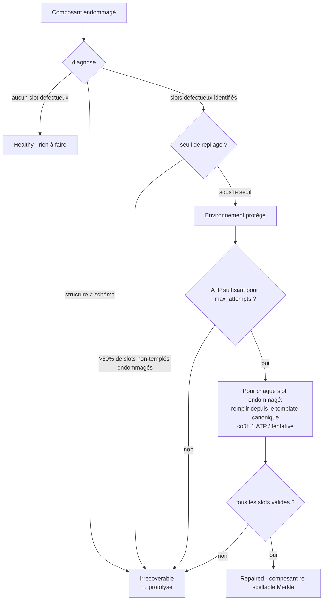
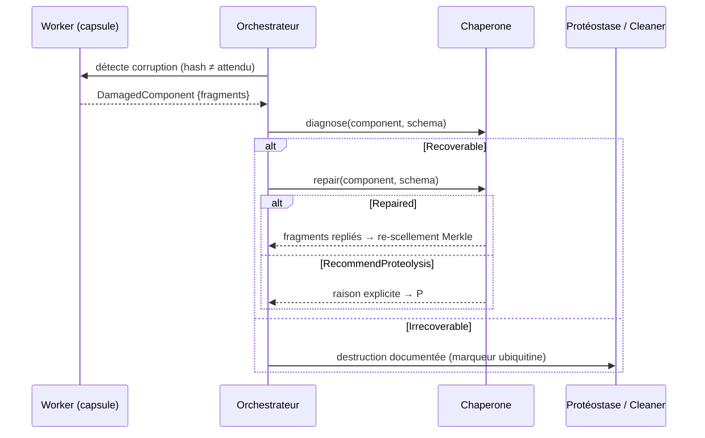

# Chaperonnes Moléculaires — Réparation Conservative avant Destruction

> **Concept biologique** : chaperonnes moléculaires Hsp70/GroEL, repliage assisté
> **Statut** : implémenté (`genos-core::biomimicry::chaperone`)
> **Recherche amont** : `docs/research/fr/BIOMIMICRY_CHAPERONES.md`

## 1. Pourquoi

### 1.1 Le trou dans le spectre de récupération
Avant ce module, GenOS disposait de deux extrêmes :
- **rollback** (`genos revert`) : restaure un point antérieur mais **détruit tout le travail ultérieur** ;
- **autophagie/Cleaner** : nettoie les composants endommagés mais est **destructif par nature**.

Il manquait l'intermédiaire que la vie a optimisé depuis l'origine des protéines : la **réparation conservative**. Une protéine mal repliée n'est pas jetée — une chaperonne (Hsp70) la prend dans un environnement protégé et lui fait rejouer son repliage à partir de sa propre séquence survivante, pour un coût ATP modeste. Seules les agrégations irrécupérables partent au protéasome.

### 1.2 Bénéfice mesurable
Un composant corrompu à 20 % (3 fragments valides sur 4) est réparé pour ~2 ATP là où le rollback coûterait des milliers de tokens et le nettoyage perdrait les fragments valides.

## 2. Comment

### 2.1 Modèle de données
```
DamagedComponent = { id, kind, fragments[] }        fragment vide = slot mal replié
CanonicalSchema  = { kind, slots: [SlotValidator], templates: [Option<String>] }
SlotValidator    = NonEmpty | ContainsMarker(s) | MaxLen(n)
Chaperone        = { max_attempts=3, atp_per_attempt=1, atp_budget=5 }
```

### 2.2 Algorithme



Règles biologiques respectées :
1. **Réparer avant de jeter** — `diagnose` ne coûte aucun ATP.
2. **Le repliage utilise la séquence survivante** — les fragments valides sont conservés tels quels ; seuls les slots endommagés sont re-remplis.
3. **Pas d'agrégat infini** — tentatives plafonnées (`max_attempts`) et budget ATP explicite ; l'épuisement produit une recommandation de protolyse *justifiée*.
4. **La réparation peut échouer** — si un template viole lui-même son validateur, la tentative est gaspillée (réalité du repliage).

### 2.3 Séquence d'usage type



## 3. Quand — orchestrateur vs worker

| Acteur | Responsabilité |
|---|---|
| **Worker** | Signale ses propres corruptions (auto-diagnostic de hash) ; fournit ses fragments. Ne décide JAMAIS de sa propre réparation. |
| **Orchestrateur** | Choisit entre chaperonne / rollback / protolyse selon le diagnostic ; fournit les schémas canoniques (registre de types versionné) ; alloue le budget ATP. |
| **Protéostase** (future extension ubiquitine) | Reçoit `RecommendProteolysis { reason }` et exécute la destruction marquée + archivage fossile préalable. |

Déclencheurs typiques : intégrité Merkle en écart, échec répété d'un opéron, composant HGT mal assimilé, corruption post-crash partielle.

## 4. Combinaisons et interactions

| Avec… | Interaction |
|---|---|
| **Checkpoints** (`cycle-checkpoints.md`) | Un gate bloqué sur composant corrompu → chaperonne → re-évaluation du gate. Le gate reste maître de la progression. |
| **Cleaner / autophagie existante** | La chaperonne est EN AMONT : elle réduit le volume arrivant au Cleaner avec justification écrite. |
| **Régénération** (blastème) | Si >50 % endommagé : hors périmètre chaperonne → régénération depuis fossiles/traces. |
| **AMPK** | Le budget ATP est la monnaie commune ; en mode catabolique strict, `atp_budget` baisse et davantage de composants partent en protolyse (trade-off assumé). |
| **HGT / plasmides** | Un plasmide mal assimilé (fragments incohérents) passe d'abord par la chaperonne avant d'être refusé. |

## 5. API

### 5.1 Rust
```rust
let mut chaperone = Chaperone::new(3, 5);
let schema = CanonicalSchema::plain("memory_index", 3);
let component = DamagedComponent { id: "c2".into(), kind: "memory_index".into(),
    fragments: vec!["alpha".into(), "".into(), "gamma".into()] };
match chaperone.repair(&component, &schema) {
    RepairOutcome::Repaired(folded) => { /* re-sceller */ }
    RepairOutcome::RecommendProteolysis { reason } => { /* proteostase */ }
}
```

### 5.2 Tool MCP
`biomimicry_chaperone_repair` — `component_id`, `kind`, `fragments[]` (chaîne vide = slot endommagé), `templates[]` optionnel (`"-"` = pas de template), `max_attempts`, `atp_budget`.

### 5.3 CLI
```bash
genos biomimicry bio-feature --feature chaperone --action repair \
  --param component_id=mem-42 --param kind=memory_index \
  --param fragment=alpha --param fragment= --param fragment=gamma \
  --param template=- --param template=idx:42 --param template=-
# Component mem-42 repaired:
#   slot[0] = alpha
#   slot[1] = idx:42
#   slot[2] = gamma
```

## 6. Tests
`cargo test -p genos-core chaperone` :
- composant sain non modifié (zéro ATP dépensé) ;
- remplissage d'un slot depuis le template canonique ;
- incohérence structurelle → irrécupérable ;
- majorité non-templée endommagée → protolyse (pas de fabrication) ;
- budget ATP insuffisant → protolyse sans tenter.

## 7. Limites connues
- Les validateurs sont volontairement syntaxiques (`NonEmpty`, marqueur, longueur) ; la validation sémantique profonde reste du ressort des gates et du replay.
- Les schémas canoniques doivent être fournis par l'orchestrateur — un registre de schémas signés par type de composant est l'évolution naturelle.
- La chaperonne ne répare pas les *relations* entre composants (c'est le territoire du replay causal et de la régénération).
