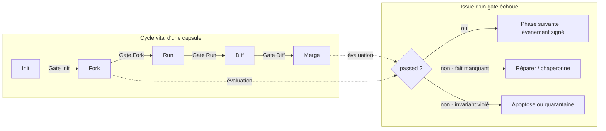
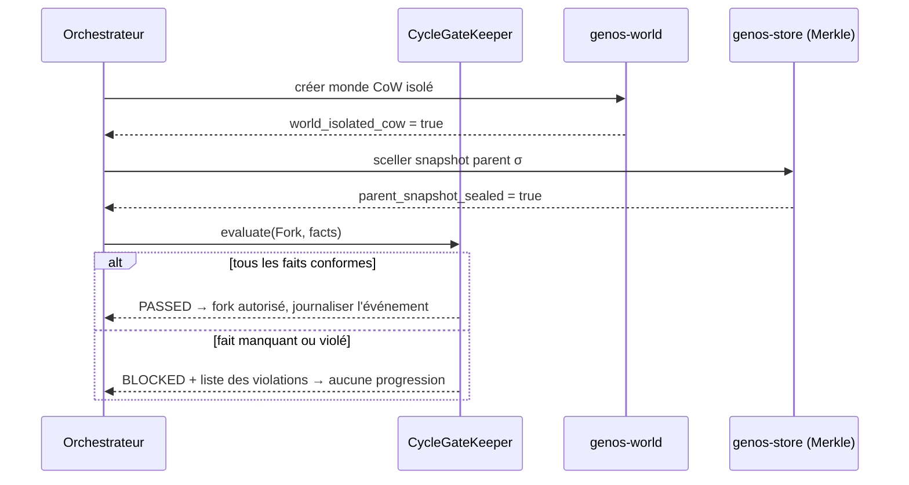

# Checkpoints du Cycle Cellulaire — Gates de Progression Obligatoires

> **Concept biologique** : checkpoints G1/S, G2/M et spindle du cycle cellulaire
> **Statut** : implémenté (`genos-core::biomimicry::cycle_checkpoints`)
> **Recherche amont** : `docs/research/fr/BIOMIMICRY_CELL_CYCLE_CHECKPOINTS.md`

## 1. Pourquoi

### 1.1 Le problème résolu
Avant ce module, les garde-fous de GenOS étaient **épars et implicites** : le merge gating existait (« merge only what passes checks »), mais rien n'imposait formellement qu'un fork vérifie la cohérence de son génome avant divergence, ou qu'un run exige un snapshot pré-scellé. Les erreurs coûteuses étaient détectées *tard* — au merge, après avoir consommé tokens, budget et temps humain.

La biologie a résolu ce problème depuis un milliard d'ans : une cellule ne passe jamais en mitose si son ADN n'est pas intégralement répliqué (checkpoint G2/M). Un checkpoint défaillant produit une cellule cancéreuse — jamais une cellule viable qui « ira vite ». La règle est absolue : **pas de phase suivante sans validation formelle de la précédente**.

### 1.2 Ce que ça apporte quantitativement
| Bénéfice | Mécanisme |
|---|---|
| Échecs précoces bon marché | Une incohérence de génome bloque à `Init` (~0 token) au lieu d'exploser au `Merge` |
| Audit trivial | Le rapport de gate est déterministe et rejouable ; il peut être scellé comme événement DAG signé |
| Uniformisation | Toutes les phases partagent le même formalisme `règle → fait → verdict`, fini aux règles ad hoc |

## 2. Comment

### 2.1 Formalisme
```
Gate(phase) = { rule_1..rule_n }        rule = { fact, expected ∈ {true, false} }
Report     = { passed, checked_rules, missing_facts[], violated_rules[] }
Sémantique : fail-closed — un fait ABSENT bloque la progression,
             comme un checkpoint biologique qui halte sur l'incertitude.
```

### 2.2 Gates par défaut (calquées sur les invariants GenOS)

| Phase | Règles requises (`requires`) | Règles interdites (`forbids`) |
|---|---|---|
| **Init** | `genome_coherent`, `niche_available`, `budget_allocated` | `genome_state_leak` |
| **Fork** | `parent_snapshot_sealed`, `world_isolated_cow`, `budget_allocated` | — |
| **Run** | `pre_run_snapshot_sealed`, `invariants_respected` | `cross_world_leak` |
| **Diff** | `diff_complete`, `replay_verified` | — |
| **Merge** | `pareto_validated`, `heredity_proven`, `replay_verified` | `cross_world_leak` |

Des règles personnalisées peuvent être ajoutées par organisation via `CycleGateKeeper::register`.

### 2.3 Schéma d'ensemble



### 2.4 Schéma séquence (fork)



## 3. Quand — orchestrateur vs worker

| Acteur | Responsabilité | Moment |
|---|---|---|
| **Orchestrateur** (runtime, huddle, humain) | Appelle `evaluate()` AVANT chaque transition de phase ; refuse de lancer l'opération si BLOCKED ; journalise les verdicts comme événements DAG | Avant chaque appel à fork/run/diff/merge |
| **Worker** (la capsule elle-même) | Fournit les faits (son état réel) ; ne s'auto-évalue pas pour décider de progresser — c'est le gate qui décide | À la demande de l'orchestrateur |
| **Humain** | Peut durcir les gates par défaut (règles additionnelles) ; ne peut jamais les assouplir silencieusement (tout assouplissement est une mutation explicite du registre) | Configuration |

Règle d'or : le worker ne « négocie » jamais avec un gate. Comme dans la cellule, il n'existe pas de voie de contournement — seulement la réparation puis re-évaluation.

## 4. Combinaisons et interactions

| Avec… | Interaction |
|---|---|
| **Chaperonnes** (`chaperone.md`) | Gate bloqué sur composant corrompu → tentative de réparation chaperonne → re-évaluation |
| **Merge gating existant** | Le gate Merge *formalise* le gating existant ; les deux coexistent, le gate est évalué en premier |
| **Cryptobiose** | Une capsule sporée sort du cycle vital (pas de gates tant que dormante) ; germination = nouveau passage Init |
| **Allostasie / AMPK** | `budget_allocated` est fourni par la couche énergétique ; un budget insuffisant bloque au Init/Fork |
| **Interférons** | Une capsule en état antiviral gèle ses transitions Fork/Merge (fait `cross_world_leak` conservateur) |
| **Mitose contrôlée** | La mitose exige que tous les gates du cycle soient PASSSED — condition d'entrée formelle |

## 5. API

### 5.1 Rust (`genos-core::biomimicry`)
```rust
let keeper = CycleGateKeeper::with_defaults();
let mut facts = Facts::new();
facts.insert("parent_snapshot_sealed".into(), true);
facts.insert("world_isolated_cow".into(), true);
facts.insert("budget_allocated".into(), true);
let report = keeper.evaluate(Phase::Fork, &facts);
assert!(report.passed);
```

### 5.2 Tool MCP
`biomimicry_gate_evaluate` — arguments : `phase` (requis), plus tout fait booléen nommé (`"true"`/`"false"`). Fail-closed.

### 5.3 CLI
```bash
genos biomimicry bio-feature --feature gate --action evaluate \
  --param phase=fork --param parent_snapshot_sealed=true \
  --param world_isolated_cow=true --param budget_allocated=true
# Gate fork : PASSED (3 règles vérifiées)
# code de sortie ≠ 0 si BLOCKED
```

## 6. Tests
`cargo test -p genos-core biomimicry` couvre :
- blocage fail-closed sur faits manquants ;
- passage avec faits complets ;
- violation d'interdit (`forbids_cross_world_leak`) au Merge ;
- exigence stricte de cohérence génomique au Init ;
- parsing robuste des paramètres CLI.

## 7. Limites et garde-fous connus
- Les faits sont déclarés par l'appelant : la confiance repose sur l'honnêteté de la couche qui les produit (à terme : production automatique depuis `genos-store`/`genos-world` plutôt que déclaration).
- Les règles par défaut sont minimales ; elles doivent être durcies par déploiement, pas remplacées.
- Aucun gate n'est évalué « en vol » pendant une phase : ils bornent les transitions, pas l'exécution interne (le Run a ses propres mécanismes : AMPK, nociception).
