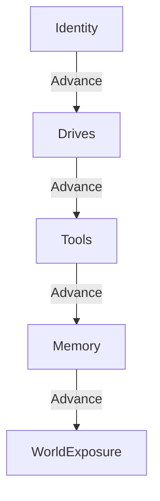

# Embryogenèse — Bootstrapping Progressif des Agents

> **Concept biologique** : embryogenèse (clivage, blastulation, gastrulation, organogenèse).
> **Statut** : implémenté (`genos-core::biomimicry::embryogenesis`)
> **Recherche amont** : `docs/research/fr/BIOMIMICRY_EMBRYOGENESIS.md`

## 1. Pourquoi

### 1.1 Le problème : Boot Atomique
Traditionnellement, un agent IA démarre d'un coup (boot atomique). S'il y a une erreur dans la configuration des outils ou de la mémoire, l'agent échoue souvent en pleine exécution (Run), consommant inutilement des tokens (LLM).

La biologie résout cela avec l'embryogenèse : un développement en phases strictes. Une erreur précoce bloque le développement, évitant un "organisme" malformé.

### 1.2 Bénéfices
| Bénéfice | Mécanisme |
|---|---|
| **Économie de ressources** | Détection d'erreurs (malformations) avant les appels coûteux aux LLMs. |
| **Traçabilité** | Chaque phase est validée et scellée par un snapshot. |

## 2. Comment

### 2.1 Les 5 Phases
1. **Identity** : Définition de base.
2. **Drives** : Motivations de l'agent.
3. **Tools** : Connexion aux outils.
4. **Memory** : Instanciation de la mémoire (RAG, STDP).
5. **WorldExposure** : L'agent interagit avec son environnement (GenOS).



## 3. Quand — orchestrateur vs worker

| Acteur | Responsabilité |
|---|---|
| **Orchestrateur** | Appelle l'API d'avancement pour valider chaque étape d'un nouvel agent. |
| **Worker** | S'assure de ne pas agir dans le World tant qu'il n'est pas en phase finale. |

## 4. API

### 4.1 CLI
```bash
genos biomimicry bio-feature --feature embryogenesis --action advance \
  --param agent_id=ag_123 \
  --param current_phase=identity \
  --param preconditions_met=true
```
