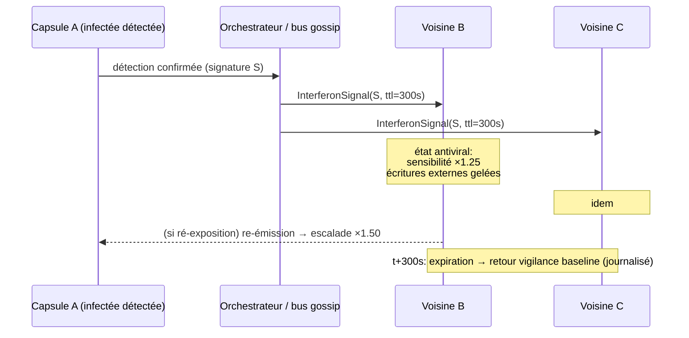
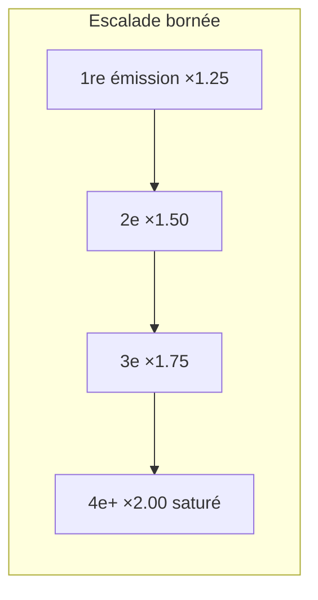

# Interférons — Alerte Préventive du Voisinage à Risque

> **Concept biologique** : signalisation paracrine antivirale (interférons de type I)
> **Statut** : implémenté (`genos-core::biomimicry::interferon`)
> **Recherche amont** : `docs/research/fr/BIOMIMICRY_INTERFERONS.md`

## 1. Pourquoi

### 1.1 Le problème : la défense est plus lente que la propagation
Quand une capsule confirme une attaque, ses voisines restent naïves jusqu'à leur propre rencontre avec la menace — l'attaquant pivote plus vite que la rumeur. La biologie a une réponse dédiée : la cellule infectée sécrète des **interférons**, et les cellules voisines entrent en état antiviral *avant* d'être touchées. La défense se propage plus vite que le pathogène.

### 1.2 Positionnement dans la famille de signaux
| Signal | Portée | Durée | Coût | Module |
|---|---|---|---|---|
| Phéromones (stigmergie) | topologique, locale | courte (évaporation) | minime | `swarm.rs` existant |
| **Interférons** | **paracrine (voisinage déclaré)** | **brève (TTL)** | faible | ce module |
| Hormones endocriniennes | globale flotte | longue (demi-vie) | modéré | futur (`endocrine.md`) |
| Inflammation | systémique | transitoire contrôlée | élevé | futur (`inflammation.md`) |

## 2. Comment

### 2.1 Modèle
```
InterferonSignal = { source_capsule, signature_tokens[], ttl_seconds }
AntiviralState   = { sensitivity_boost, external_writes_frozen, expires_at_secs, emissions_seen }
sensitivity_boost(emissions) = 1.0 + 0.25 × min(emissions_seen, 4)     // palier → saturation ×2.0
```

Propriétés clés :
- **Paracrine** : l'émission ne va qu'au voisinage déclaré (`neighbors[]`), pas à toute la flotte.
- **Escalade avec saturation** : chaque ré-émission augmente la sensibilité (+25 %) et prolonge la fenêtre, plafonnée à ×2.0 — comme l'amplification biologique bornée.
- **Réflexe conservateur** : gel des écritures externes tant que l'état est actif.
- **Auto-extinction** : expiration au TTL ; le retour à la vigilance normale est journalisé (ids des voisins écroulés).

### 2.2 Schémas





## 3. Quand — orchestrateur vs worker

| Acteur | Responsabilité |
|---|---|
| **Worker** | Confirme la menace (jamais sur simple suspicion — c'est le rôle de l'inflammation) ; émet l'interféron avec la signature normalisée. Ne décide pas du rayon. |
| **Orchestrateur** | Calcule le voisinage à risque (même monde, même lignée, même opérateur humain — cf. gap junctions pour les couples intimes) ; agrège les états antiviraux ; journalise émissions/escalades/expirations. |
| **Voisines** | Appliquent l'état reçu : boost des détecteurs locaux, gel des écritures externes, journalisation verbeuse temporaire. |

Déclencheurs d'émission : confirmation immunitaire (mémoire vaccinale), verdict nociception, détection Merkle locale.

## 4. Combinaisons et interactions

| Avec… | Interaction |
|---|---|
| **Vaccination** | Un hit mémoire (`respond()`) peut déclencher l'interféron avec la signature reconnue — la mémoire rend l'alerte précoce et précise. |
| **Inflammation** (future) | Si >X voisines escaladent en fenêtre T, l'inflammation globale est candidate (cascade graduée). |
| **Gap junctions** | Les couples mutualistes intimement couplés reçoivent l'interféron en priorité absolue (latence minimale). |
| **SAR** | L'interféron protège l'instant ; SAR convertit l'incident résolu en amorçage durable. Chaîne : interféron → analyse → SAR prime. |
| **Checkpoints** | Une voisine primée gèle ses transitions Fork/Merge à écritures externes (fait `cross_world_leak` conservateur). |
| **Gossip mycorhizien** existant | Transport naturel du signal dans les déploiements distribués. |

## 5. API

### 5.1 Rust
```rust
let signal = InterferonSignal::new("capsule-a", "prompt injection exfiltration", 300);
let primed = emit(&signal, &["b".into(), "c".into()], now_secs);
// merge_into(Some(&old_state), &incoming, now, ttl) -> escalade ou reset post-expiration
// expire(&states, now) -> ids retournés à la baseline
```

### 5.2 Tool MCP
`biomimicry_interferon_emit` — `source_id`, `signature`, `neighbors[]`, `ttl_seconds`.

### 5.3 CLI
```bash
genos biomimicry bio-feature --feature interferon --action emit \
  --param source=capsule-a --param signature="prompt injection exfiltration" \
  --param neighbor=capsule-b --param neighbor=capsule-c --param ttl_seconds=300
# Interferon emitted by capsule-a: 2 neighbors primed for 300s
#   capsule-b: sensitivity x1.25, writes frozen until t+300s
```

## 6. Tests
`cargo test -p genos-core interferon` :
- émission primant tout le voisinage avec boost initial exact ;
- escalade progressive puis saturation à ×2.0 ;
- reset complet après expiration (retour première exposition) ;
- `expire()` ne liste que les états écroulés.

## 7. Limites connues
- Le voisinage est déclaré par l'appelant : la découverte automatique du rayon pertinent (topologie de dépendances) est un point d'intégration `genos-world`.
- Le gel des écritures est contractuel (les workers doivent le respecter), pas technique — l'enforcement mécanique appartient aux frontières `genos-world`.
- Pas de routage multi-sauts : un interféron ne se propage pas lui-même (biologiquement fidèle — c'est une signalisation locale).
