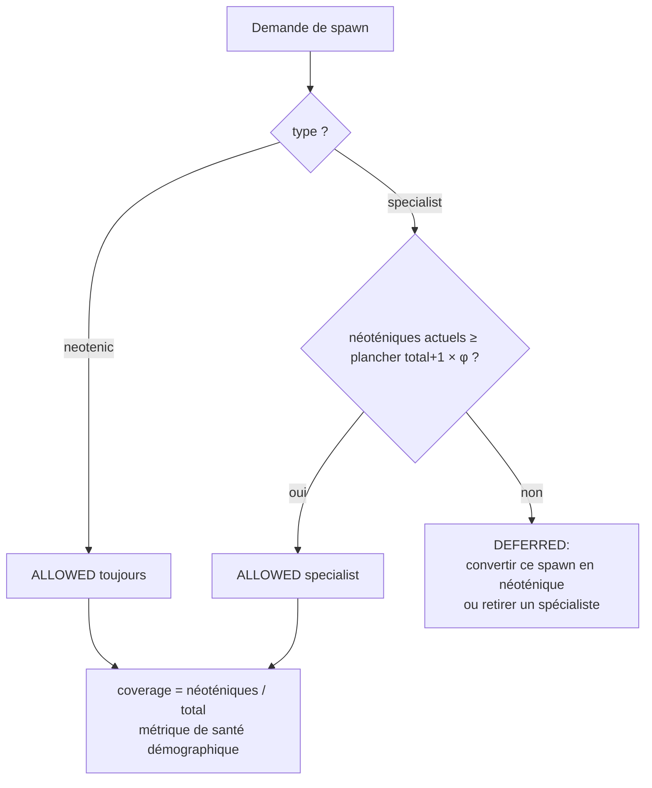

# Néoténie — Conservation Démographique de la Plasticité

> **Concept biologique** : néoténie (axolotl), extension des périodes plastiques (humain)
> **Statut** : implémenté (`genos-core::biomimicry::neoteny`)
> **Recherche amont** : `docs/research/fr/BIOMIMICRY_NEOTENY.md`

## 1. Pourquoi

### 1.1 Le problème : la flotte mature devient rigide
À mesure qu'une flotte optimise, chaque agent se spécialise : réflexes compilés (procéduralisation), budgets d'exploration réalloués à la production, heuristiques figées. La performance immédiate monte, l'adaptabilité s'effondre — le prochain changement de stack ou de modèle coûte une reformation complète. C'est l'équivalent organisationnel du vieillissement démographique.

La biologie conserve délibérément des traits juvéniles à l'âge adulte (l'axolotl reste larvaire et se reproduit ; l'humain prolonge ses périodes critiques) : ce trade-off plasticité/spécialisation est un **levier démographique**, pas individuel.

### 1.2 Bénéfices
| Bénéfice | Mécanisme |
|---|---|
| Adaptabilité garantie | Quota φ_neo : la flotte ne peut plus perdre tous ses explorateurs |
| Absorption des migrations | Les néoténiques changent de stack sans reformation coûteuse |
| Test A/B sans biais | Évaluation de nouvelles pratiques par des agents sans procédures anciennes |
| Trade-off explicite | Le coût (performance brute inférieure) est quantifié par le quota |

## 2. Comment

### 2.1 Modèle
```
NeotenicTraits = { play_budget_protected=true, proceduralization_deferred=true,
                   epigenetic_openness=true }
NeotenyPolicy  = { fraction φ ∈ [0.05, 0.5] }        // défaut 0.2
SpawnDecision  = Allowed{as_neotenic} | Deferred{reason}

Plancher = ⌊(total+1) × φ⌋
Règle    : un spawn « specialist » est DEFERRED si neotenic_agents < plancher
           un spawn « neotenic » passe toujours
```

Traits néoténiques canoniques :
1. **Budget jeu protégé** — non-réallisable par AMPK hors famine extrême (`play.md`) ;
2. **Procéduralisation différée** — même quand les gates de readiness passent, pas de compilation en réflexe (`proceduralization.md`) ;
3. **Ouverture épigénétique** — triggers conditionnels larges, apprentissage non contraint.

### 2.2 Flux de décision



## 3. Quand — orchestrateur vs worker

| Acteur | Responsabilité |
|---|---|
| **Orchestrateur** | Consulte `decide_spawn()` à CHAQUE création ; maintient le recensement (total / néoténiques) ; convertit les spawns refusés en néoténiques plutôt que les jeter ; surveille `coverage()`. |
| **Worker néoténique** | Vit avec ses traits ouverts : budget jeu actif, pas de réflexes figés, épigénétique plastique. Ne demande jamais sa propre spécialisation. |
| **Humain** | Fixe φ par flotte selon la volatilité du domaine (0.05 stable → 0.3+ turbulent) ; peut autoriser des exceptions documentées. |

Déclencheurs typiques : montée en charge (tentation de tout spécialiser), changement de provider annoncé, revue trimestrielle de diversité comportementale.

## 4. Combinaisons et interactions

| Avec… | Interaction |
|---|---|
| **Jeu animal** (`play.md` futur tool) | Le budget protégé du néoténique est LE canal d'exploration sérendipitaire de la flotte. |
| **Procéduralisation cérébelleuse** | Refus explicite pour les néoténiques même si readiness OK — c'est le trait juvénile central. |
| **Bet-hedging** (doc sœur) | Les spawns-néoténiques forcés SONT une forme d'assurance démographique ; bet-hedging diversifie les forks, néoténie diversifie les rôles. |
| **Spéciation** (doc sœur) | Une espèce spécialisée qui diverge garde son quota néoténique : chaque espèce a sa réserve. |
| **Sénescence** (doc sœur) | Un néoténique ne devient jamais zombie par inactivité productive : son exploration EST sa production. |
| **Épigénétique existante** | L'ouverture se matérialise en marqueurs épigénétiques larges héritables. |

## 5. API

### 5.1 Rust
```rust
let policy = NeotenyPolicy::new(0.2);
// Plancher pour 11 agents = 2 ; un seul néoténique :
assert!(matches!(
    policy.decide_spawn(10, 1, SpawnRequest::Specialist),
    SpawnDecision::Deferred { .. }
));
assert_eq!(
    policy.decide_spawn(10, 2, SpawnRequest::Specialist),
    SpawnDecision::Allowed { as_neotenic: false }
);
```

### 5.2 Tool MCP
`biomimicry_neoteny_quota` — `total_agents`, `neotenic_agents`, `request`, `fraction`.

### 5.3 CLI
```bash
genos biomimicry bio-feature --feature neoteny --action quota \
  --param total_agents=10 --param neotenic_agents=1 --param request=specialist
# Erreur: spawn deferred: specialist spawn would breach the neotenic reserve; ...
```

## 6. Tests
`cargo test -p genos-core neoteny` :
- clamp de φ dans [0.05, 0.5] ;
- spawn néoténique toujours permis ;
- conversion/deferred du spécialiste sous le plancher, permis au-dessus ;
- métrique de coverage exacte ;
- traits canoniques tous ouverts.

## 7. Limites connues
- Binaire néoténique/spécialiste : une granularité continue (spectre de plasticité par trait) serait plus fidèle.
- Le quota protège le NOMBRE mais pas l'hétérogénéité INTERNE des néoténiques (risque de clonage mitotique massif de néoténiques identiques — combiner avec dégénérescence hétérogène).
- φ fixe : devrait idéalement répondre à la volatilité mesurée de l'environnement (lien entropie/bet-hedging).
