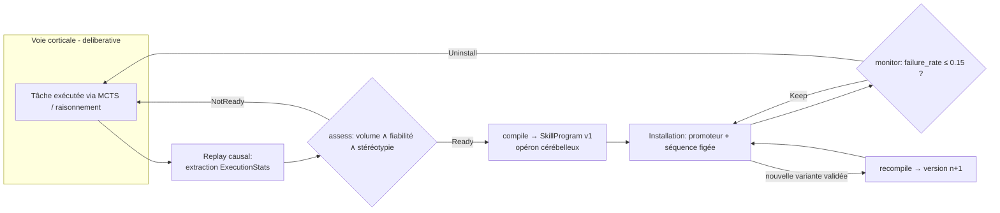
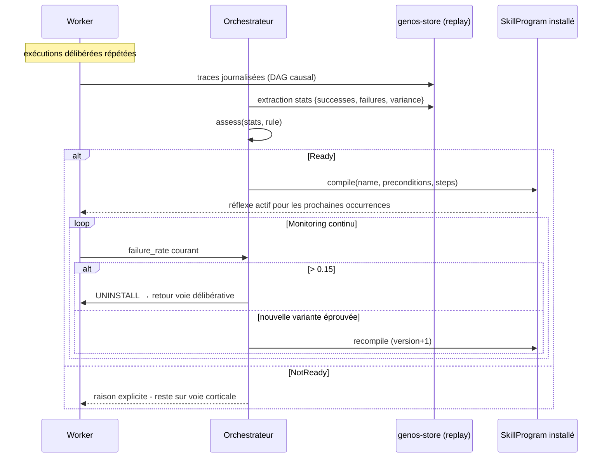

# Procéduralisation Cérébelleuse — Compilation des Compétences en Réflexes

> **Concept biologique** : automatisation cérébelleuse des gestes appris, consolidation procédurale
> **Statut** : implémenté (`genos-core::biomimicry::proceduralization`)
> **Recherche amont** : `docs/research/fr/BIOMIMICRY_CEREBELLUM.md`

## 1. Pourquoi

### 1.1 Le problème : payer le raisonnement intégral à chaque exécution
Une tâche répétée (pipeline de release, requête de diagnostic récurrente) repasse par le chemin délibératif complet — MCTS, appels modèle, vérifications — même après la 50e exécution identique. Le cerveau a résolu ce gaspillage : le geste d'abord contrôlé consciemment (cortex, lent, coûteux) devient **procédural** (cervelet, rapide, quasi gratuit) après suffisamment de répétitions stéréotypées. La consolidation procédurale libère les ressources corticales pour les problèmes réellement nouveaux.

### 1.2 Bénéfices
| Bénéfice | Mécanisme |
|---|---|
| Coût décroissant par tâche répétée | Le raisonnement n'est payé qu'à l'apprentissage ; le réflexe tourne sans tokens |
| Réversibilité totale | Monitoring continu ; dégradation ⇒ désinstallation vers le chemin cortical (jamais de réflexe aveugle persistant) |
| Diffusion par HGT | Un SkillProgram est un opéron cérébelleux : transférable par plasmides aux agents pairs |
| Historique versionné | Chaque raffinement incrémente la version (recompile) — traçabilité du réflexe |

## 2. Comment

### 2.1 Modèle
```
ExecutionStats = { successes, failures, variance_proxy }     // issu du replay causal
ReadinessRule  = { min_successes=20, min_success_rate=0.95, max_variance=0.10 }
SkillProgram   = { name, version, preconditions[], steps[], postconditions[] }
DEPROCEDURALIZATION_FAILURE_RATE = 0.15
```

Trois conditions biologiques avant compilation :
1. **Volume** (`min_successes`) : assez d'épisodes pour que le pattern soit réel ;
2. **Fiabilité** (`min_success_rate ≥ 0.95`) : le geste marche presque toujours ;
3. **Stéréotypie** (`variance_proxy ≤ 0.10`) : les trajectoires réussies sont reproductibles — un geste incohérent ne peut pas devenir réflexe.

### 2.2 Cycle de vie



### 2.3 Séquence type



## 3. Quand — orchestrateur vs worker

| Acteur | Responsabilité |
|---|---|
| **Worker** | Exécute ; ses traces alimentent les stats. Ne s'auto-procéduralise pas : la compilation est une décision orchestrateur. |
| **Orchestrateur** | Extrait les stats depuis le replay ; applique la ReadinessRule ; installe/désinstalle les réflexes ; décide des diffusions HGT ; ajuste les règles par classe de tâche. |
| **Phase de sommeil** (`forgetting.rs` existant) | Moment privilégié : compilation pendant l'off-line, comme la consolidation biologique nocturne. |
| **Humain** | Valide les réflexes touchant à des actions irréversibles (déploiement, destruction). |

Déclencheurs : seuil de répétition atteint sur une tâche, coût unitaire délibératif jugé excessif, préparation d'un clone mitotique (hériterait du réflexe).

## 4. Combinaisons et interactions

| Avec… | Interaction |
|---|---|
| **HGT / plasmides** existants | Le SkillProgram EST le payload plasmidique idéal : compétence figée, testable, versionnée, transmissible sans ré-apprentissage. |
| **Checkpoints** | Un réflexe ne court que si ses preconditions sont vraies (fait évalué au gate Run) — pas de réflexe hors contexte. |
| **Arc réflexe** (`reflex_gate` futur) | La procéduralisation crée les règles réflexes ; le ReflexGate les route. Complémentaires : réflexe = réponse stéréotypée, procéduralisation = sa fabrication contrôlée et réversible. |
| **Néoténie** | Les agents néoténiques ont la procéduralisation retardée : plasticité préservée. |
| **AMPK** | Installer un réflexe coûte un peu d'ATP ; économiser ensuite massivement. En famine, désinstaller les réflexes rarement utilisés (économie cérébelleuse). |
| **RPE dopaminergique** | δ ≈ 0 persistant sur la tâche = signal qu'il n'y a plus rien à apprendre → candidat procéduralisation. |

## 5. API

### 5.1 Rust
```rust
let stats = ExecutionStats { successes: 30, failures: 1, variance_proxy: 0.05 };
let program = compile("release-pipeline",
    vec!["tests_green".into()],
    vec!["build".into(), "sign".into(), "deploy".into()],
    vec![], &stats, &ReadinessRule::default())?;
assert!(matches!(monitor(0.05), Health::Keep));
assert!(matches!(monitor(0.30), Health::Uninstall { .. }));
```

### 5.2 Tool MCP
`biomimicry_skill_proceduralize` — `skill`, `successes`, `failures`, `variance`, `steps[]`, `preconditions[]`, `failure_rate`.

### 5.3 CLI
```bash
genos biomimicry bio-feature --feature proceduralization --action compile \
  --param skill=release-pipeline --param successes=30 --param failures=1 \
  --param variance=0.05 --param step=build --param step=sign --param step=deploy \
  --param precondition=tests_green

genos biomimicry bio-feature --feature proceduralization --action monitor \
  --param skill=release-pipeline --param failure_rate=0.30
# uninstalling reflex 'release-pipeline' back to deliberative path: ...
```

## 6. Tests
`cargo test -p genos-core proceduralization` :
- échantillon insuffisant → NotReady ;
- trajectoire non stéréotypée → NotReady malgré succès élevé ;
- compilation réussie d'une tâche stéréotypée fiable ;
- recompilation versionnée avec conservation du contrat ;
- désinstallation au-delà du seuil de dégradation.

## 7. Limites connues
- `variance_proxy` est fourni par l'appelant : son calcul automatique depuis les durées/étapes du replay est l'intégration suivante.
- Le réflexe compilé est déclaratif (séquence d'étapes nommées) : l'exécution effective reste branchée sur l'outillage existant.
- Seuil unique de désinstallation (0.15) : devrait être paramétrable par criticité de tâche.
