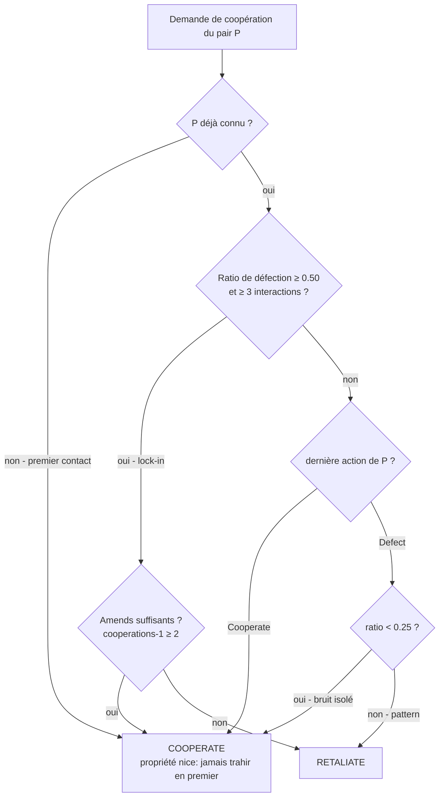
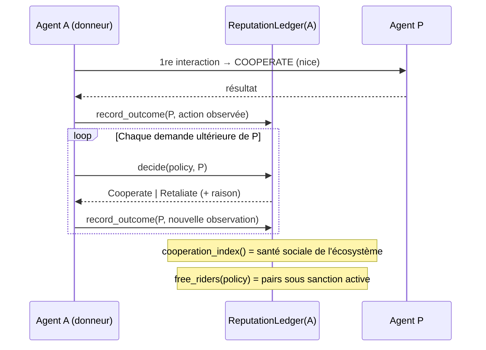

# Altruisme Réciproque — Coopération Conditionnelle et Sanction des Resquilleurs

> **Concept biologique** : altruisme réciproque (Trivers), tournois d'Axelrod, punition des tricheurs
> **Statut** : implémenté (`genos-core::biomimicry::reciprocity`)
> **Recherche amont** : `docs/research/fr/BIOMIMICRY_RECIPROCAL_ALTRUISM.md`

## 1. Pourquoi

### 1.1 Le problème : le free-riding dégrade les écosystèmes multi-agents
Dans un écosystème d'agents partageant caches, artefacts et budgets, quelques agents consommateurs-sans-contribution suffisent à dissoudre la coopération (« tragédie des communs »). Sans reconnaissance individuelle ni mémoire des interactions — exactement les conditions identifiées par Trivers chez les chauves-souris vampires — la coopération n'est pas stable.

### 1.2 La solution biologique validée
Le tournoi d'Axelrod a montré que **Tit-for-Tat** (coopérer d'abord, rendre coup pour coup) domine évolutionnairement toute stratégie purement égoïste, à quatre conditions : être *nice* (ne jamais trahir en premier), *rétorsif* (punir immédiatement), *clément* (redevenir coopératif si l'autre le fait) et *non-enviable* (pas de score à « piller »). Ce module encode ces propriétés avec une tolérance au bruit de type Tit-for-Two-Tats.

## 2. Comment

### 2.1 Modèle
```
PeerAction        = Cooperate | Defect
PeerRecord        = { cooperations, defections, last_action }
ReciprocityPolicy = { sanction_threshold=0.5, amends_interactions=2 }
Decision          = Cooperate | Retaliate
ReputationLedger  = { peers: Map<id, PeerRecord> }   // état par agent, persistable
```

### 2.2 Arbre de décision



Propriétés garanties :
1. **Nice** : un pair inconnu reçoit toujours la coopération d'abord.
2. **Rétorsif** : une défection en pattern est immédiatement reflétée.
3. **Clément** : deux interactions cooperatives consécutives lèvent un lock-in.
4. **Tolérant au bruit** : une défection isolée d'un partenaire bien comporté (ratio < 0.25) est pardonnée — évite les vendettes stochastiques.

### 2.3 Séquence type



## 3. Quand — orchestrateur vs worker

| Acteur | Responsabilité |
|---|---|
| **Worker** | Tient son ledger local (mémoire individuelle — condition biologique de l'altruisme réciproque) ; consulte `decide()` avant tout partage coûteux ; enregistre chaque issue observée. |
| **Orchestrateur** | Agrège les indices de coopération (santé sociale flotte) ; diffuse les listes de free-riders comme signal (pas comme verdict centralisé) ; arbitre les contestations via replay causal. |
| **Mutualisme contractuel** (`organization/symbiosis.rs`) | Le contrat formalise la coopération ; le ledger réciproque la protège au quotidien entre contrats. |

Déclencheurs de consultation : partage de cache/artefact, réponse à une demande d'aide, entrée dans un huddle, allocation kin-biased.

## 4. Combinaisons et interactions

| Avec… | Interaction |
|---|---|
| **Mutualisme / symbiose** existante | Le contrat définit QUOI partager ; la réciprocité décide À QUI. Un partenaire mutualiste en défaut répété est sanctionné par le ledger avant résiliation formelle. |
| **Sélection sexuelle** | La réputation réciproque est un signal honnête bon marché pour le pool de breeding. |
| **Kin selection** | La règle de Hamilton alloue aux parents ; le ledger filtre les parents resquilleurs malgré la parenté. |
| **Quorum sensing / huddles** | Les votes des pairs sous sanction peuvent être dépondérés (poids = indice de coopération individuel). |
| **Fossiles / phylogénie** | Réputation héritable partiellement : une lignée de free-riders porte le stigmate (dissuasion généalogique). |

## 5. API

### 5.1 Rust
```rust
let mut ledger = ReputationLedger::default();
let policy = ReciprocityPolicy::default();
assert_eq!(ledger.decide(&policy, "new-peer"), Decision::Cooperate);
ledger.record_outcome("new-peer", PeerAction::Defect);
ledger.record_outcome("new-peer", PeerAction::Defect);
// ratio 1.0 → lock-in
assert_eq!(ledger.decide(&policy, "new-peer"), Decision::Retaliate);
```

### 5.2 Tool MCP
`biomimicry_reciprocity_decide` — `peer_id`, `cooperations`, `defections`, `last_action`.

### 5.3 CLI
```bash
genos biomimicry bio-feature --feature reciprocity --action decide \
  --param peer_id=capsule-x --param cooperations=4 --param defections=1 \
  --param last_action=defect
# Peer capsule-x: interactions=5 defection_ratio=0.20
# Decision: COOPERATE   (bruit isolé pardonné)
```

## 6. Tests
`cargo test -p genos-core reciprocity` :
- premier contact → coopération (nice) ;
- miroir fidèle de la dernière action ;
- défection isolée d'un bon pair pardonnée (bruit) ;
- lock-in du free-rider + levée après amends soutenus ;
- index de coopération global et liste des free-riders.

## 7. Limites connues
- Ledger strictement local : pas encore de réputation inter-flottes (nécessiterait gossip signé — extension naturelle via `network.rs`).
- Actions binaires Cooperate/Defect : les contributions partielles exigeraient une granularité continue.
- La punition est passive (refus futur) ; une punition active coûteuse (punition altruiste institutionnalisée) reste à modéliser.
