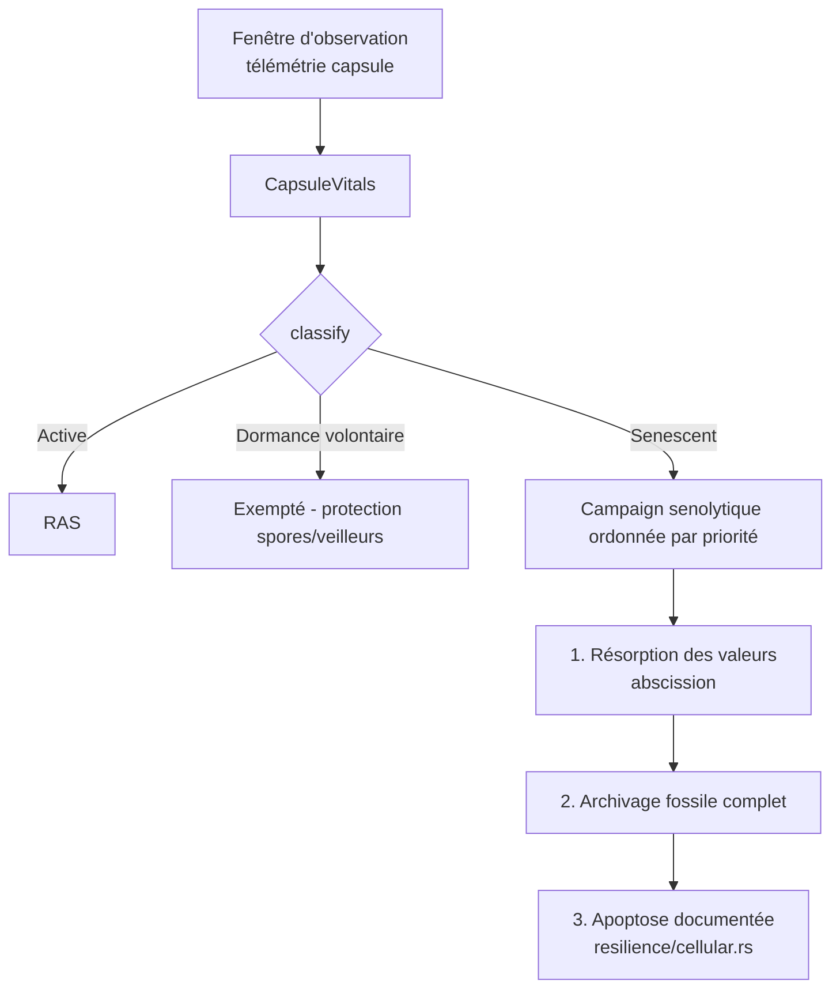

# Sénescence Cellulaire — Détection et Élimination des Zombies

> **Concept biologique** : cellules sénescentes, syndrome SASP, sénolytiques
> **Statut** : implémenté (`genos-core::biomimicry::senescence`)
> **Recherche amont** : `docs/research/fr/BIOMIMICRY_CELLULAR_SENESCENCE.md`

## 1. Pourquoi

### 1.1 Le problème : l'état intermédiaire toxique
Le modèle binaire mort/vivant de GenOS rate l'état le plus coûteux : la capsule **zombie** — vivante, consommatrice de ressources, mais improductive et surtout **nocive pour ses voisines** (verrous tenus qui bloquent des merges, phéromones obsolètes qui égarent les navigateurs, alertes répétées sans action). La biologie nomme cela sénescence cellulaire ; le facteur toxique émis est le **SASP** (Senescence-Associated Secretory Phenotype). Les organismes jeunes éliminent ces cellules (immunosurveillance) ; les vieux les accumulent — et c'est corrélé au vieillissement global.

### 1.2 Bénéfices
| Bénéfice | Mécanisme |
|---|---|
| Capture du pire des mondes | Zombie = vivant ∧ improductif ∧ consommateur (∧ nocif) |
| Priorisation par nuisance | Score SASP = nuisances externes / ressources consommées → les toxiques d'abord |
| Exemption explicite | Dormance volontaire (spores, spécialistes rares) jamais flaggée |
| Métrique démographique | % de zombies = hygiène de flotte mesurable dans le temps |

## 2. Comment

### 2.1 Modèle
```
CapsuleVitals   = { productive_ticks, idle_ticks, resources_consumed,
                    negative_externalities, intentional_dormancy }
idle_ratio      = idle / (idle + productive)
SASP            = negative_externalities / max(1, resources_consumed)
Seuils          = { min_idle_ratio=0.9, min_idle_ticks=50 }
```

Classification :
- `IntentionallyDormant` — dormance déclarée ⇒ jamais zombie (protection des spores et veilleurs) ;
- `Senescent` — ratio d'inactivité ≥ 0.9 ET ≥ 50 ticks d'inactivité ;
- `Active` — tout le reste.

Priorité sénolytique : `1000 + ⌈SASP×100⌉` — les zombies nuisibles passent avant les simples drains.

### 2.2 Pipeline senolytique



La chaîne senolytique réutilise les mécanismes existants : rien n'est inventé, on orchestre abscission → fossile → apoptose dans le bon ordre.

## 3. Quand — orchestrateur vs worker

| Acteur | Responsabilité |
|---|---|
| **Worker** | Publie ses vitals (ticks productifs/idles) dans sa télémétrie. S'auto-déclarer sain ne suffit jamais : le verdict vient du classificateur. |
| **Orchestrateur** | Fait tourner l'assessment périodique (fenêtres glissantes) ; maintient le rapport d'hygiène de flotte ; lance les campagnes senolytiques ordonnées ; distingue zombie de dormant via le flag d'intention. |
| **Humain** | Valide les campagnes touchant des capsules à longue vie ou mutualistes contractuelles. |

Déclencheurs : fin de projet (flotte entière à auditer), incident de contention (verrous), budget AMPK catabolique strict (il faut couper), audit mensuel d'hygiène.

## 4. Combinaisons et interactions

| Avec… | Interaction |
|---|---|
| **Abscission** | Étape 1 obligatoire du protocole : récupérer artefacts et apprentissages AVANT toute destruction. |
| **Apoptose** existante (`cellular.rs`) | Étape finale exécutée proprement après archivage. |
| **Télomères** (doc sœur) | Compteur épuisé sans restauration → candidat sénescence répliquative ; les deux modules se renforcent. |
| **AMPK** | En mode conservation, les seuils se durcissent (min_idle_ratio abaissé) : la famine accélère l'élimination. |
| **Allostasie** | Charge allostatique chronique non suivie de production = signal pré-sénescent. |
| **Fossiles** | Tout zombie supprimé reste rejouable depuis son fossile (garantie anti-perte). |

## 5. API

### 5.1 Rust
```rust
let vitals = CapsuleVitals {
    productive_ticks: 2, idle_ticks: 98,
    resources_consumed: 200, negative_externalities: 10,
    intentional_dormancy: false,
};
assert!(matches!(vitals.classify(&SenescenceThresholds::default()),
                 VitalState::Senescent { .. }));
let report = fleet_hygiene(vec![("toxic", &vitals)]);
// report.senescent == ["toxic"] — ordonné par nuisance décroissante
```

### 5.2 Tool MCP
`biomimicry_senescence_assess` — `capsule_id`, `productive_ticks`, `idle_ticks`, `resources_consumed`, `negative_externalities`, `intentional_dormancy`.

### 5.3 CLI
```bash
genos biomimicry bio-feature --feature senescence --action assess \
  --param capsule_id=zombie-7 --param productive_ticks=2 --param idle_ticks=98 \
  --param resources_consumed=200 --param negative_externalities=10
# Erreur (exit ≠ 0): SENESCENT zombie (sasp=0.050) — senolytic cleanup recommended
```

## 6. Tests
`cargo test -p genos-core senescence` :
- capsule productive → Active ;
- zombie flaggé avec score SASP exact ;
- dormance volontaire exemptée même à 100 % d'inactivité ;
- jeunes capsules pas flaggées prématurément (plancher de ticks) ;
- hygiène de flotte : zombies triés par nuisance décroissante.

## 7. Limites connues
- Les externalités négatives sont déclarées par l'orchestrateur : leur mesure automatique (verrous tenus, alertes vides) est le point d'intégration suivant.
- Seuils fixes par défaut : devraient s'adapter au type de rôle (un veilleur nocturne a un profil d'inactivité légitime différent).
- Pas encore de boucle senolytique automatisée : ce module diagnostique et priorise, l'exécution passe par abscission/apoptose existants.
