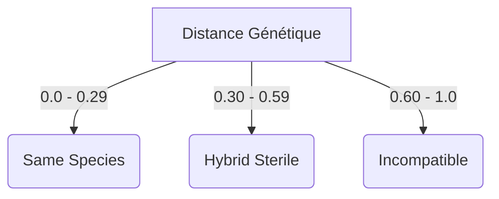

# Spéciation Allopatrique — Divergence et Compatibilité

> **Concept biologique** : spéciation allopatrique — divergence génétique par isolement géographique menant à l'incompatibilité reproductive.
> **Statut** : implémenté (`genos-core::biomimicry::speciation`)
> **Recherche amont** : `docs/research/fr/BIOMIMICRY_SPECIATION.md`

## 1. Pourquoi

### 1.1 Le problème : Merge conflictuel et corruption
En GenOS, des branches divergentes d'une même architecture évoluent parfois trop loin l'une de l'autre pour être fusionnées sans corruption. Si un essaim A développe des outils incompatibles avec l'essaim B, forcer un `cognitive_merge` produit un agent hybride défectueux.

La biologie gère cela via les frontières d'espèces :
- Mêmes espèces : croisement/merge facile.
- Stérilité hybride : le croisement marche, le descendant fonctionne mais ne peut plus se reproduire (fin de lignée).
- Incompatibilité : croisement refusé.

### 1.2 Bénéfices
| Bénéfice | Mécanisme |
|---|---|
| **Prévention des conflits** | Vérification déterministe de la distance génétique (allèles) avant d'autoriser un croisement. |
| **Exploration sans risque** | On peut tolérer des hybrides (stérilité hybride) pour tester une fonction isolée, sans polluer le pool génétique à long terme. |
| **Modélisation de la dérive** | La distance génétique est estimée via le temps passé en isolement (allopatrie) dans des mondes séparés. |

## 2. Comment

### 2.1 Calcul de la distance
La distance génétique entre deux pools d'allèles est calculée via l'inverse de l'indice de Jaccard :
`Distance = 1.0 - (Intersection / Union)`

### 2.2 Seuils de Spéciation
- `hybrid_threshold` (défaut 0.30) : Distance au-delà de laquelle l'hybride est marqué stérile.
- `speciation_threshold` (défaut 0.60) : Distance au-delà de laquelle les espèces sont incompatibles.



## 3. Quand — orchestrateur vs worker

| Acteur | Responsabilité |
|---|---|
| **Orchestrateur** | Évalue la compatibilité avant de déclencher un breed/merge entre deux flottes ou lignées. |
| **Worker** | S'assure que s'il porte un `SterilityMark`, il refuse de forker/breeder. |

## 4. Combinaisons et interactions

| Avec… | Interaction |
|---|---|
| **Bet-Hedging** (doc sœur) | Les phénotypes d'assurance isolés vont progressivement accumuler de la distance jusqu'à spéciation. |
| **Gènes Hox** | Les différences dans les gènes Hox structurels augmentent drastiquement la distance, forçant l'incompatibilité rapide. |

## 5. API

### 5.1 Rust
```rust
let distance = genetic_distance(&alleles_a, &alleles_b);
let verdict = boundary.verdict(distance);
```

### 5.2 Tool MCP
`biomimicry_speciation_check` — `allele-a[]`, `allele-b[]`, `hybrid_threshold`, `speciation_threshold`.

### 5.3 CLI
```bash
genos biomimicry bio-feature --feature speciation --action check \
  --param allele-a=op_reasoning \
  --param allele-a=op_coding \
  --param allele-b=op_reasoning \
  --param allele-b=op_creative
```
