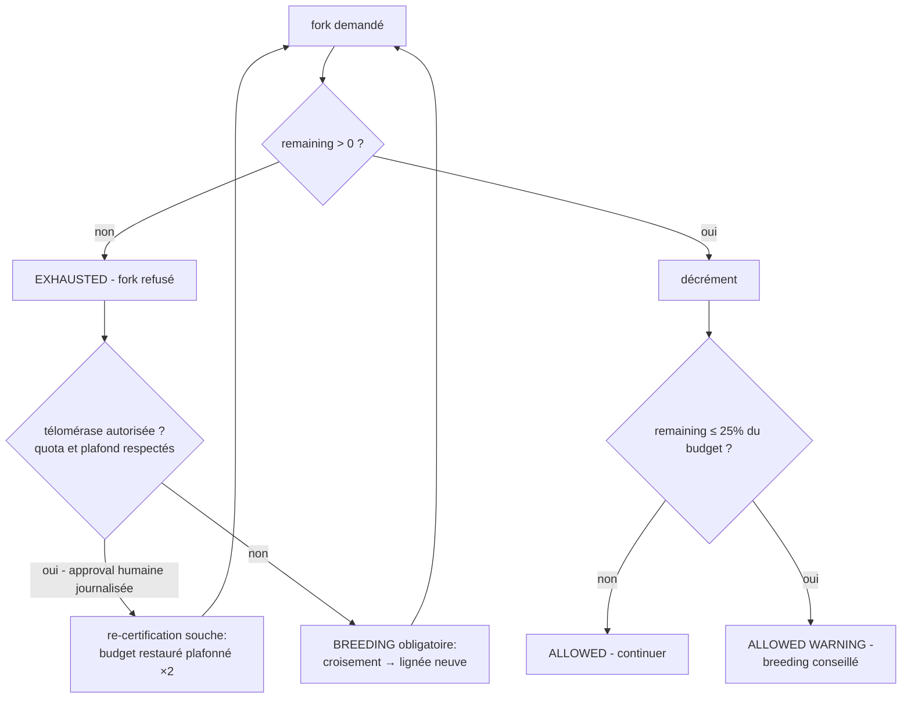
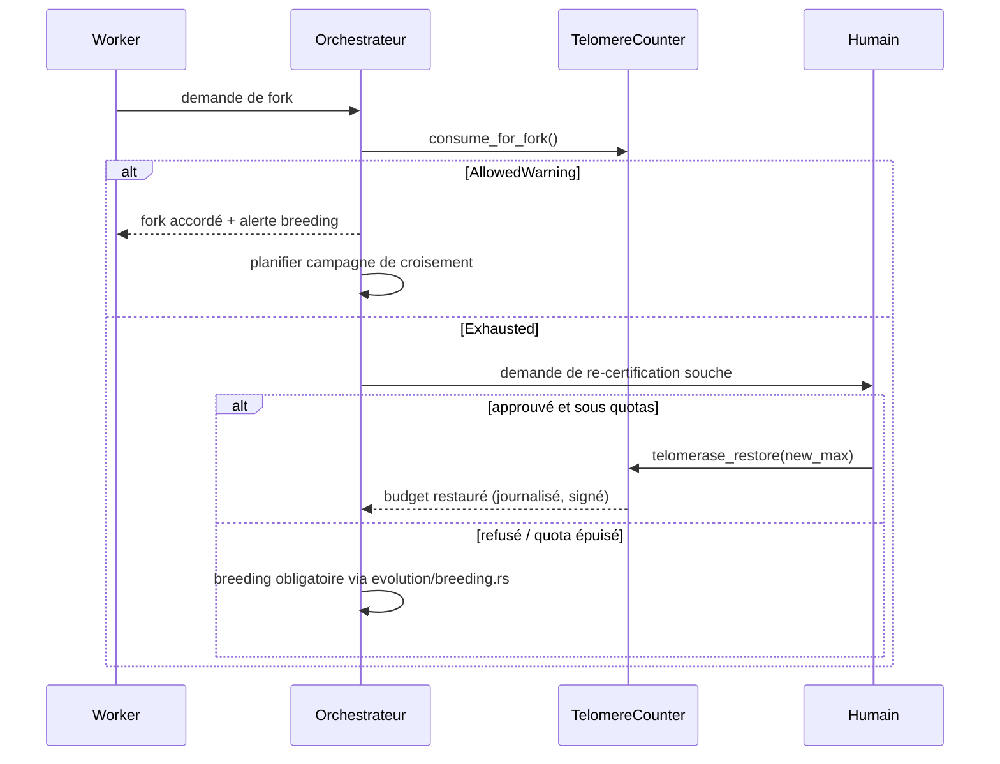

# Télomères — Limite de Divisions Intégrée (Hayflick)

> **Concept biologique** : érosion télomérique, limite de Hayflick, télomérase des cellules souches
> **Statut** : implémenté (`genos-core::biomimicry::telomere`)
> **Recherche amont** : `docs/research/fr/BIOMIMICRY_TELOMERES.md`

## 1. Pourquoi

### 1.1 Le problème : la dérive cumulée des copies
Chaque fork copie l'état d'une capsule avec ses micro-divergences ; une lignée qui se fork indéfiniment accumule dérive sur dérive, toujours plus loin du génome validé. Aucun mécanisme existant ne borne cette expansion clonale — c'est l'équivalent computationnel du cancer : croissance incontrôlée de copies dégénérées.

La biologie impose une **mortalité répliquative** : chaque division raccourcit les télomères ; après ~50 divisions (limite de Hayflick), la cellule entre en sénescence. Ce garde-fou protège l'organisme et force le renouvellement via les cellules souches — les seules autorisées à activer la télomérase.

### 1.2 Bénéfices
| Bénéfice | Mécanisme |
|---|---|
| Borne la dérive cumulée | Compteur de forks intégré, fail-closed à zéro |
| Incitation au brassage | Lignée épuisée ⇒ breeding obligatoire (le brassage génétique redevient le seul chemin) |
| Anti-immortalisation | La « télomérase » est explicite, plafonnée (×2 max) et quota-limitée |
| Signal précoce | Zone d'alerte dès 25 % de budget restant |

## 2. Comment

### 2.1 Modèle
```
TelomereCounter = { remaining, max_forks }
ForkVerdict     = Allowed{remaining_after} | AllowedWarning{remaining_after} | Exhausted
Zone d'alerte   : remaining_after ≤ ⌈max_forks × 0.25⌉
telomerase_restore(new_max, count, quota) :
  - refuse si count ≥ quota (par défaut 2)            → breeding forcé
  - refuse si new_max > 2 × max_forks                  → plafond anti-immortalisation
  - refuse si new_max ≤ remaining                      → restauration doit être utile
```

### 2.2 Cycle de vie d'une lignée



### 2.3 Séquence type



## 3. Quand — orchestrateur vs worker

| Acteur | Responsabilité |
|---|---|
| **Worker** | Porte son compteur dans ses métadonnées ; le présente à toute demande de fork. Ne peut ni le réinitialiser ni le contourner. |
| **Orchestrateur** | Évalue le compteur AVANT tout fork (gate supplémentaire) ; planifie le breeding en zone d'alerte ; refuse les forks épuisés sans exception. |
| **Humain** | Seule source d'approbation de la télomérase (re-certification souche depuis snapshot fossile + validation complète). Chaque restauration est un événement signé. |

## 4. Combinaisons et interactions

| Avec… | Interaction |
|---|---|
| **Breeding** existant (`evolution/breeding.rs`) | Issue légitime d'une lignée épuisée : le brassage produit des enfants au budget neuf. |
| **Mitose contrôlée** | Une mitose consomme aussi du télomère (c'est une division) ; la vérification Merkle post-clonage n'exempte pas du compteur. |
| **Fossiles / spores** | La re-certification souche part d'un snapshot fossile validé, pas de l'état courant dérivé. |
| **Sénescence cellulaire** (doc sœur) | Un compteur épuisé sans restauration bascule en sénescence répliquative → candidat senolytique si zombie. |
| **Néoténie** (doc sœur) | Les agents néoténiques gardent un budget générationnel élevé mais subissent le même plafond anti-immortalisation. |
| **Sénescence négligeable** (doc sœur) | La classe Longevity désactive le compteur MAIS hérite de la surveillance renforcée obligatoire. |

## 5. API

### 5.1 Rust
```rust
let mut counter = TelomereCounter::new(10);
assert!(matches!(counter.consume_for_fork(), ForkVerdict::Allowed { .. }));
counter.remaining = 0;
assert_eq!(counter.consume_for_fork(), ForkVerdict::Exhausted);
counter.telomerase_restore(15, 0, 2)?;   // re-certification souche plafonnée
```

### 5.2 Tool MCP
`biomimicry_telomere_fork` — `capsule_id`, `remaining`, `max_forks` requis ; `action` (`fork`|`restore`), `new_max`, `restoration_count`, `max_restorations`.

### 5.3 CLI
```bash
genos biomimicry bio-feature --feature telomere --action fork \
  --param capsule_id=agent-42 --param remaining=0 --param max_forks=50
# Hayflick limit reached for agent-42: fork refused; ...

genos biomimicry bio-feature --feature telomere --action restore \
  --param capsule_id=agent-42 --param remaining=0 --param max_forks=50 \
  --param new_max=60 --param restoration_count=0
```

## 6. Tests
`cargo test -p genos-core telomere` :
- décréments successifs puis blocage fail-closed à zéro ;
- entrée en zone d'alerte à 25 % du budget exactement ;
- restauration dans le plafond ×2 avec comptage de quota ;
- refus des restaurations non croissantes et hors quota ;
- `should_breed()` vrai en zone d'alerte/exhaustion seulement.

## 7. Limites connues
- Le compteur est déclaratif (porté par les métadonnées) : son enforcement matériel exigerait une écriture systématique dans le DAG à chaque fork.
- Plafond ×2 et quota par défaut (2) sont des constantes prudentielles, pas des valeurs biologiques — à calibrer par déploiement.
- La dérive elle-même n'est pas mesurée ici (distance au génome fondateur) : le télomère est un proxy temporel, à combiner avec les mesures phylogénétiques existantes.
