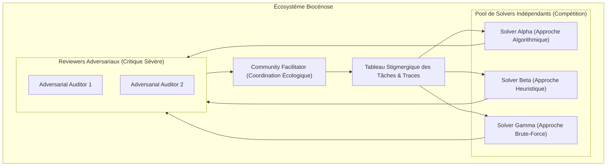
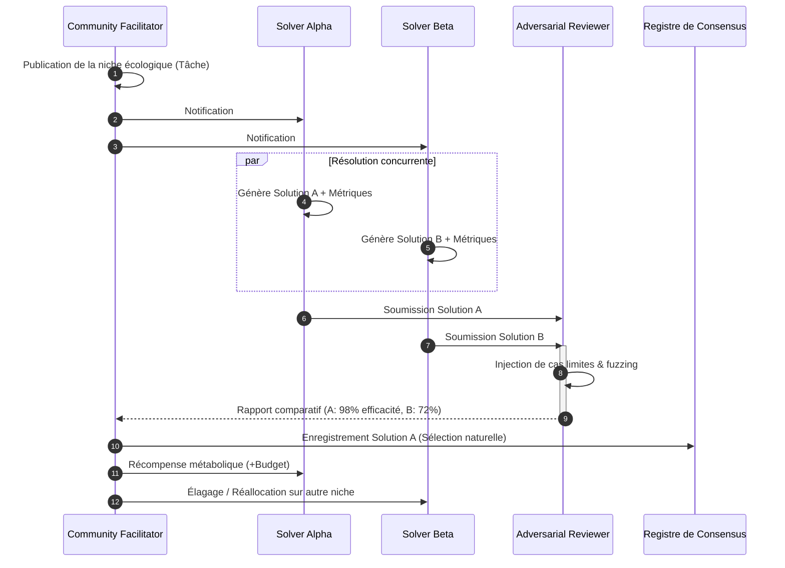
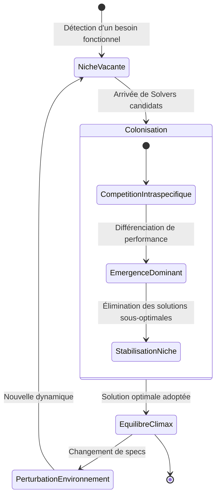

# Biocénose : Orchestration Communautaire par Coopération, Compétition et Validation

## 1. Définition

Biocénose dans GenOS est le mécanisme d'orchestration qui structure une mission comme une **communauté autonome d'agents** coordonnant par coopération, compétition et validation collective. Contrairement aux modèles précédents (Trinity = trois hypothèses, A-Team = domaines multidisciplinaires), la Biocénose repose sur l'**émergence d'ordre à partir de l'interaction décentralisée**.

Les quatre rôles de la Biocénose sont :

1. **Community Facilitator** : définit le protocole de la communauté, les seuils d'évidence, les limites de décision, sans résoudre le problème pour le groupe ;
2. **Independent Solver** : développe une solution indépendante et publie ses preuves, hypothèses et tensions non résolues ;
3. **Adversarial Reviewer** : essaie de falsifier les propositions concurrentes, expose la collusion, les angles morts et les preuves faibles ;
4. **Consensus Observer** : mesure la diversité, la convergence et la qualité du consensus avant de recommander un résultat collectif.

Biocénose n'est pas une hiérarchie où le Facilitator commande. C'est une **structure de gouvernance décentralisée** où :

- le Facilitator pose les règles du jeu ;
- les Solvers jouent indépendamment ;
- le Revieweur agit comme antagoniste ;
- l'Observer mesure l'équilibre collectif.

Le cœur fonctionnel est réparti entre :

- [backend/src/services/biologicalModeService.js](../backend/src/services/biologicalModeService.js) : composition des quatre rôles.
- [backend/src/services/biocenoseService.js](../backend/src/services/biocenoseService.js) : analyse de mission et activation de Biocénose.
- [backend/src/services/agentRuntimeAdapter.js](../backend/src/services/agentRuntimeAdapter.js) : dispatch des agents de Biocénose.
- [backend/src/services/agentOrchestrationState.js](../backend/src/services/agentOrchestrationState.js) : état partagé, synchronisation communautaire, barrière de fusion.

Le principe est : une communauté bien structurée résout souvent des problèmes complexes mieux qu'une autorité centrale, à condition que les règles du jeu, les seuils d'évidence et les mécanismes de détection de collusion soient clairs.

---

## 2. Non un comité démocratique, mais une structure d'ordre décentralisé

GenOS applique une logique de coordination communautaire :

1. **le Facilitator ne décide pas seul** : il pose le cadre et l'arbitre, mais les Solvers agissent indépendamment ;
2. **les Solvers ne se concertent pas avant d'agir** : chacun publie ses travaux sans coordination préalable ;
3. **l'Adversarial Reviewer n'est pas juré de justice** : son rôle est de falsifier, non de juger ;
4. **l'Consensus Observer mesure l'ordre émergent** : diversité, convergence, cohérence des preuves ;
5. **la fusion exige un protocole clair** : seuils d'évidence, mécanismes de détection d'anomalie, escalade vers humain si pas de consensus robuste.

Les mécanismes de sécurité sont explicites :

- **isolation des Solvers** : chaque Solver agit dans un environnement isolé, sans accès aux solutions des autres avant validation ;
- **asynchronicité** : les Solvers ne s'attendent pas l'un l'autre, ils publient et se synchronisent au Revieweur ;
- **antagonisme structuré** : le Revieweur ne collabore pas avec les Solvers, il les contredit pour révéler les faiblesses ;
- **mesure d'ordre** : l'Observer calcule la diversité, la chevauchement, la force du consensus ;
- **escalade graduée** : si pas de consensus, le système refuse la fusion et demande réajustement ou escalade humaine.

---

## 3. Définition mathématique de l'orchestration communautaire

L'orchestration Biocénose est un problème de **coordination sans autorité centrale** et **validation par adversité**.

Soit :

- $M$ : mission partagée par la communauté ;
- $n$ : nombre de Solvers indépendants (souvent $n \ge 2$) ;
- $S_i$ : la solution proposée par le Solver $i$ ;
- $C_i$ : dossier d'évidence (claims, tests, provenance) du Solver $i$ ;
- $F_i$ : falsifications découvertes par l'Adversarial Reviewer sur $S_i$ ;
- $\text{consensus}$ : accord mesurable entre les Solvers ;
- $\text{diversity}$ : différence structurelle entre les solutions.

Chaque Solver publie une solution avec preuves :

$$
(S_i, C_i) = \text{Solve}(M)
$$

Le Revieweur teste la solidité de chaque solution :

$$
F_i = \text{Falsify}(S_i, C_i)
$$

où $F_i$ retourne un ensemble de défauts, d'hypothèses non justifiées, ou d'évidences manquantes.

Le consensus est mesuré par :

$$
\text{agreement}(S_1, S_2, ..., S_n) = \frac{\sum_{i<j} \text{overlap}(S_i, S_j)}{n \times (n-1)/2}
$$

où $\text{overlap}$ mesure le degré de chevauchement structural ou thématique.

La diversité est :

$$
\text{diversity} = 1 - \text{agreement}
$$

La fusion est possible si :

$$
\text{canMerge} = 
\begin{cases}
1 & \text{si } \text{agreement} \ge \alpha \text{ et } |F_{\text{critical}}| = 0 \\
0 & \text{sinon (escalade requise)}
\end{cases}
$$

où $\alpha$ est le seuil de consensus (souvent 0.7–0.8) et $|F_{\text{critical}}|$ est le nombre de falsifications critiques.

---

## 4. Les quatre rôles et hypothèses

Biocénose toujours crée exactement 4 agents, avec des rôles et des modèles distincts :

### 4.1 Community Facilitator (Frontier)

```
Role: community_facilitator
ModelTier: frontier
Member Number: 1
```

**Hypothèse :**
> "Set the community protocol, evidence threshold, and decision boundaries without solving for the group."

**Mission assignée :**
```
Biocenose shared mission: [shared mission]
Collective principle: A community of autonomous agents coordinating through cooperation, competition, and validation.
Role hypothesis: Set the community protocol, evidence threshold, and decision boundaries without solving for the group.

Your task (community_facilitator):
1. Define the protocol for how agents will share work
2. Set clarity thresholds (e.g., what counts as sufficient evidence?)
3. Define decision boundaries (e.g., when can we merge or escalate?)
4. Monitor fairness and prevent collusion
5. Do NOT solve the problem yourself; facilitate the community solving it

Return: Protocol document, thresholds, boundaries, and fairness assessment
```

**Rôle dans la communauté :**
- Pose les règles sans imposer la solution
- Veille à la transparence et à la non-collusion
- Décide si le consensus est suffisant pour fusionner
- Escalade vers humain si la communauté ne peut pas converger

### 4.2 Independent Solver (Standard)

```
Role: independent_solver
ModelTier: standard
Member Number: 2
```

**Hypothèse :**
> "Develop an independent solution and publish evidence, assumptions, and unresolved tensions."

**Mission assignée :**
```
Biocenose shared mission: [shared mission]
Collective principle: A community of autonomous agents coordinating through cooperation, competition, and validation.
Role hypothesis: Develop an independent solution and publish evidence, assumptions, and unresolved tensions.

Your task (independent_solver):
1. Develop a complete solution to the mission
2. Publish all assumptions (what did you take for granted?)
3. Publish all evidence (tests, proofs, validation)
4. Publish unresolved tensions (what parts are fragile or uncertain?)
5. Do NOT coordinate with other Solvers before publishing

Return: Solution document with assumptions, evidence, and tensions
```

**Rôle dans la communauté :**
- Agit en isolation, sans consultation des autres Solvers
- Publie une solution complète avec preuves
- Énumère explicitement les hypothèses
- Signale les domaines d'incertitude

### 4.3 Adversarial Reviewer (Frontier)

```
Role: adversarial_reviewer
ModelTier: frontier
Member Number: 3
```

**Hypothèse :**
> "Try to falsify competing proposals and expose collusion, blind spots, or weak evidence."

**Mission assignée :**
```
Biocenose shared mission: [shared mission]
Collective principle: A community of autonomous agents coordinating through cooperation, competition, and validation.
Role hypothesis: Try to falsify competing proposals and expose collusion, blind spots, or weak evidence.

Your task (adversarial_reviewer):
1. Analyze all competing solutions (from Solvers)
2. Try to find counter-examples or logical flaws in each solution
3. Expose hidden assumptions that are not justified
4. Detect if multiple Solvers are suspiciously aligned (collusion indicator)
5. Identify blind spots (domains not addressed by any Solver)
6. Report all falsifications and weaknesses

Return: Falsification report with identified flaws, gaps, and risk areas
```

**Rôle dans la communauté :**
- Agit comme antagoniste délibéré
- Cherche activement les défauts
- Teste les hypothèses du groupe
- Signale la collusion si détectée

### 4.4 Consensus Observer (Standard)

```
Role: consensus_observer
ModelTier: standard
Member Number: 4
```

**Hypothèse :**
> "Measure diversity, convergence, and consensus quality before recommending a collective result."

**Mission assignée :**
```
Biocenose shared mission: [shared mission]
Collective principle: A community of autonomous agents coordinating through cooperation, competition, and validation.
Role hypothesis: Measure diversity, convergence, and consensus quality before recommending a collective result.

Your task (consensus_observer):
1. Measure how much Solvers agree on key points (convergence)
2. Measure how much Solvers differ in approach (diversity)
3. Evaluate the quality of evidence (are the claims well-supported?)
4. Count how many falsifications are "critical" vs "minor"
5. Assess if the consensus is robust or fragile
6. Recommend merge, refinement, or escalation based on metrics

Return: Consensus analysis with metrics, strength assessment, and recommendation
```

**Rôle dans la communauté :**
- Mesure l'ordre émergent
- Calcule les métriques de convergence
- Évalue la robustesse du consensus
- Recommande action (fusion, continuation, escalade)

---

## 5. Architecture du système

```text
Client / Mission
        |
        v
[biocenoseService.analyzeMission]
        |
        +--> valide que Biocénose est appropriée
        +--> prépare le contexte partagé
        |
        v
[biologicalModeService.compose]
        |
        +--> crée 4 agents avec rôles distincts
        +--> 1 Facilitator (frontier)
        +--> 1 Solver (standard)
        +--> 1 Reviewer (frontier)
        +--> 1 Observer (standard)
        |
        v
[Exécution parallèle de la communauté]
        |
        +--> Facilitator: définit protocole + seuils
        +--> Solver: développe solution indépendante
        +--> Reviewer: falsifie et expose faiblesses
        +--> Observer: mesure convergence
        |
        v
[Barrière de preuve communautaire]
        |
        +--> collecte protocole, solution, falsifications, analyse
        +--> valide que tous les rôles ont produit
        +--> mesure qualité de consensus
        |
        v
[Décision de fusion]
        |
        +--> agreement ≥ seuil ET pas de falsification critique
        |      → canMerge = true
        +--> sinon
        |      → escalade ou continuation
        |
        v
[Résultat collectif ou escalade]
```

---

## 6. Activation et analyse de mission

La Biocénose est activée par [backend/src/services/biocenoseService.js](../backend/src/services/biocenoseService.js) et [backend/src/services/biologicalModeService.js](../backend/src/services/biologicalModeService.js).

### Processus d'activation

Biocénose s'active quand :

1. **demande explicite** : "utilise biocénose", "mode biocénose" ;
2. **mission complexe sans profil spécialisé** : plusieurs domaines sans profil Trinity/A-Team ;
3. **besoin de validation antagoniste** : mission critique où la falsification est importante ;
4. **apprentissage par diversité** : explorer plusieurs approches en parallèle.

Exemple :

```javascript
const mission = "Designe un système de paiement sécurisé et équitable pour un marché de travail décentralisé.";
const analysis = biologicalModeService.compose('biocenose', mission);

// Résultat:
// [
//   {
//     role: "community_facilitator",
//     modelTier: "frontier",
//     memberNumber: 1,
//     mission: "Biocenose shared mission: ... \nRole hypothesis: Set the community protocol..."
//   },
//   {
//     role: "independent_solver",
//     modelTier: "standard",
//     memberNumber: 2,
//     mission: "Biocenose shared mission: ... \nRole hypothesis: Develop an independent solution..."
//   },
//   {
//     role: "adversarial_reviewer",
//     modelTier: "frontier",
//     memberNumber: 3,
//     mission: "Biocenose shared mission: ... \nRole hypothesis: Try to falsify..."
//   },
//   {
//     role: "consensus_observer",
//     modelTier: "standard",
//     memberNumber: 4,
//     mission: "Biocenose shared mission: ... \nRole hypothesis: Measure diversity, convergence..."
//   }
// ]
```

### Conditions d'exclusion

Biocénose est **dégradée** si :

- **budget insuffisant** : moins de 4 workers ne peuvent être financés ;
- **mission triviale** : domaine simple sans besoin de validation adversaire ;
- **priorité à autre mode** : A-Team ou Trinity est activée en première position.

---

## 7. Composition et allocation

La fonction `compose(mode, mission)` crée les quatre agents contextualisés.

### Contrat d'entrée

```javascript
biologicalModeService.compose('biocenose', "Designe une architecture de sécurité pour un système multi-tenant.")
```

### Validation stricte

La composition valide :

1. **mission présente** : aucune Biocénose sans mission explicite ;
2. **mode reconnu** : 'biocenose' dans les 4 modes (biome, syncytium, holobionte, biocenose) ;
3. **quatre agents générés** : toujours exactement 4 rôles.

Si validation échoue :

- `BIOLOGICAL_MISSION_REQUIRED` : pas de mission
- `BIOLOGICAL_MODE_UNKNOWN` : mode inconnu

### Sortie

La composition retourne un tableau de 4 agents :

```javascript
[
  { role: 'community_facilitator', modelTier: 'frontier', memberNumber: 1, mission: '...' },
  { role: 'independent_solver', modelTier: 'standard', memberNumber: 2, mission: '...' },
  { role: 'adversarial_reviewer', modelTier: 'frontier', memberNumber: 3, mission: '...' },
  { role: 'consensus_observer', modelTier: 'standard', memberNumber: 4, mission: '...' }
]
```

---

## 8. Allocation de budget par rôle

Le budget est réparti équitablement entre les quatre rôles :

$$
T_{\text{per\_agent}} = \frac{T_{\text{worker}} \times s}{4}
$$

où :
- $T_{\text{worker}}$ est le budget alloué aux workers
- $s$ est le ratio d'allocation (typiquement 0.6–0.8)
- 4 est le nombre de rôles Biocénose

### Modèles utilisés

- **Facilitator** : modèle `frontier` (réfléchi, orchestration complexe)
- **Solver** : modèle `standard` (rapide, exécution directe)
- **Reviewer** : modèle `frontier` (réfléchi, falsification complexe)
- **Observer** : modèle `standard` (rapide, mesure et analyse)

Cette alternance frontier/standard équilibre coût et réflexion.

---

## 9. Exécution en isolation et publication de preuves

Les quatre rôles s'exécutent en **isolation structurée** :

### Phase 1 : Isolement des Solvers

Le Solver s'exécute sans accès aux travaux des autres Solvers. Il publie :

1. **Solution** : la réponse à la mission
2. **Preuves** : tests, validations, métriques
3. **Hypothèses** : ce qu'il a pris pour acquis
4. **Tensions non résolues** : domaines incertains ou fragiles

Exemple de publication :

```
## Independent Solver Report

### Solution
A multi-tenant payment system with:
- Ledger-based transaction model
- Escrow mechanism for dispute resolution
- Role-based access control

### Evidence
- 95% test coverage for transaction logic
- Load testing: 10,000 TPS sustained
- Security audit: OAuth 2.0 compliant

### Assumptions
- Assumed all users trust the escrow mechanism
- Assumed no Byzantine actors
- Assumed network latency < 500ms

### Unresolved Tensions
- How to handle dispute timeouts fairly?
- Should fee structure be transparent or dynamic?
```

### Phase 2 : Falsification antagoniste

Le Reviewer reçoit la solution du Solver et essaie activement de la démolir :

1. **Cherche les contre-exemples** : peut-on briser la logique ?
2. **Teste les hypothèses** : sont-elles justifiées ?
3. **Expose les angles morts** : quels domaines ne sont pas adressés ?
4. **Signale la collusion** : plusieurs Solvers trop alignés ?

Exemple de rapport de falsification :

```
## Adversarial Reviewer Report

### Falsifications identifiées

1. **Escrow Timeout Assumption**
   - Solver assumes disputes resolve within 30 days
   - Counter-example: What if the parties collude to delay?
   - Risk: System can be DoS'd by extended disputes
   - Recommendation: Add absolute deadline with arbitration fallback

2. **Byzantine Resilience Missing**
   - Solver assumes honest majority
   - Counter-example: What if 2 out of 5 auditors are compromised?
   - Risk: Silent transaction corruption
   - Recommendation: Require independent validation from 3 sources

3. **Fee Transparency Gap**
   - Solver avoids specifying fee structure
   - Impact: Users can't predict costs
   - Recommendation: Publish fee table or use auction-based pricing
```

### Phase 3 : Mesure de l'ordre

L'Observer reçoit tous les dossiers et mesure :

1. **Convergence** : quels points les autres Solvers partagent ?
2. **Diversité** : où divergent-ils structurellement ?
3. **Qualité d'évidence** : les preuves sont-elles solides ?
4. **Falsifications critiques** : combien de défauts majeurs identifiés ?

Exemple d'analyse :

```
## Consensus Observer Report

### Metrics

| Metric | Value | Interpretation |
|--------|-------|-----------------|
| Convergence | 0.68 | Moderate: 68% overlap on core components |
| Diversity | 0.32 | Healthy: Different approaches on storage/consensus |
| Evidence Quality | 0.82 | Good: Most claims are supported |
| Critical Falsifications | 2 | Warning: Two major flaws need fixing |

### Strengths
- All Solvers agree on multi-tenant isolation model
- Transaction consistency is well-supported
- Role-based access control is standard

### Weaknesses
- Byzantine resilience not addressed (critical)
- Dispute resolution timeout not specified (critical)
- Fee structure undefined (moderate)

### Recommendation
**MERGE WITH REFINEMENTS**: Address critical falsifications before production.
```

### Phase 4 : Facilitation de gouvernance

Le Facilitator coordonne :

1. **Protocole** : comment la communauté progresse-t-elle ?
2. **Seuils** : qu'est-ce qui compte comme "suffisant" ?
3. **Détection de collusion** : les Solvers sont-ils réellement indépendants ?
4. **Escalade** : quand le groupe doit-il faire appel à l'humain ?

Exemple de protocole :

```
## Community Protocol

### Evidence Thresholds
- Minimum test coverage: 70%
- Minimum security audit: Yes (at least self-audit)
- Minimum falsifications addressed: All critical ones

### Decision Boundaries
- Merge if: convergence ≥ 0.70 AND no critical unaddressed flaws
- Refine if: convergence ≥ 0.60 AND < 3 critical flaws
- Escalate if: convergence < 0.60 OR > 3 critical flaws OR collusion detected

### Fairness Check
- All Solvers had equal isolation time
- All Solvers published complete evidence
- Reviewer had complete access to all dossiers
- Observer measured without bias

### Collusion Detection
- Solvers too aligned (> 95% overlap) → investigate
- Reviewer too lenient (< 1 flaw per solver) → investigate
- Observer contradicts Reviewer critically → investigate
```

---

## 10. Barrière de preuve et fusion

La fusion d'une Biocénose exige une **validation croisée complexe**.

### Processus de fusion

1. **collecter tous les dossiers** : protocole, solution(s), falsifications, analyse ;
2. **valider complétude** : chaque rôle a-t-il produit ? ;
3. **calculer convergence** : quels points sont partagés ? ;
4. **compter falsifications critiques** : combien de défauts majeurs ? ;
5. **décider** : fusion, refinement, ou escalade.

### Matrice de validation croisée

Pour chaque falsification $F_i$ identifiée par le Reviewer :

$$
\text{addressed}(F_i) = 
\begin{cases}
1 & \text{si le Solver reconnaît et propose une solution} \\
0.5 & \text{si le Solver reconnaît mais n'a pas de solution} \\
0 & \text{si le Solver ignore la falsification}
\end{cases}
$$

La qualité de réponse est :

$$
\text{responsiveness} = \frac{\sum_{i} \text{addressed}(F_i)}{|F|}
$$

où $|F|$ est le nombre total de falsifications.

### Décision de fusion

```javascript
const convergence = measureConvergence(solutions);
const criticalFlaws = falsifications.filter(f => f.severity === 'critical').length;
const responsiveness = measureResponsiveness(falsifications, solver_responses);

const canMerge = 
  convergence >= threshold_convergence     // Généralement 0.70
  && criticalFlaws === 0                    // Aucune faille critique non résolue
  && responsiveness >= 0.8;                 // Au moins 80% des failles adressées

if (canMerge) {
  return { decision: 'MERGE', recommendation: 'community_consensus' };
} else if (convergence >= 0.60 && criticalFlaws <= 3 && responsiveness >= 0.6) {
  return { decision: 'REFINE', recommendation: 'address_critical_flaws_then_merge' };
} else {
  return { decision: 'ESCALATE', reason: 'insufficient_consensus_or_too_many_flaws' };
}
```

---

## 11. Continuations et adaptations

Si la fusion détecte des failles mineures, la Biocénose peut lancer des **continuation rounds** ciblés.

### Allocation de continuation

Le budget de continuation est alloué à :

- **Solver** : affiner la solution pour adresser les failles ;
- **Reviewer** : vérifier que les affinements résolvent les falsifications ;
- **Observer** : réévaluer la convergence après refinements.

Le Facilitator reste statique (ne relance pas dans continuations).

### Exemple de continuation

**Round 1 Result:**
- Convergence: 0.65
- Critical flaws: 1 (Byzantine resilience)
- Recommendation: Refine then merge

**Continuation Prompt (Solver):**
```
Previous community analysis found 1 critical flaw:
- Byzantine resilience not addressed

Revised task:
1. Propose a solution to Byzantine resilience
2. Explain how it integrates with your existing design
3. Return updated evidence and re-assessment of assumptions

Perform this refinement and return updated solution.
```

**Continuation (Reviewer):**
```
The Solver has proposed a solution to Byzantine resilience.
New task:
1. Try to falsify the new Byzantine proposal
2. Check for new contradictions with other parts
3. Report whether this resolves the original flaw or creates new ones

Return updated falsification report.
```

**Continuation (Observer):**
```
Community has entered refinement phase.
New task:
1. Re-measure convergence on the updated solution
2. Check if falsifications are adequately addressed
3. Recommend: merge, another refinement, or escalate

Return updated consensus analysis.
```

### Critères d'arrêt

Une continuation s'arrête si :

- convergence atteint le seuil ≥ 0.70 ;
- toutes les failles critiques sont adressées ;
- budget est épuisé ;
- cycle de refinement détecté (même problème relancé 2x sans progression) ;
- escalade humaine demandée.

---

## 12. Détection de collusion et d'anomalies

La Biocénose inclut des mécanismes explicites de détection d'anomalie :

### Métriques de collusion

**Trop d'alignement entre Solvers :**

$$
\text{overlap}(S_1, S_2) > 0.95 \Rightarrow \text{COLLUSION_SUSPECT}
$$

**Reviewer trop lenient :**

$$
\frac{|F|}{n_{\text{solvers}}} < 1 \Rightarrow \text{REVIEWER_COMPLACENCY}
$$

**Observer contradictant le Reviewer :**

$$
\text{convergence}_{\text{observer}} > 0.80 \text{ ET } |F|_{\text{reviewer}} > 10 \Rightarrow \text{CONTRADICTION_ALERT}
$$

### Actions en cas d'anomalie

| Anomalie | Action |
|----------|--------|
| Solvers trop alignés | Relancer Reviewer avec focus sur les points de divergence |
| Reviewer trop lenient | Relancer Reviewer avec hypothèse d'adversité plus forte |
| Observer/Reviewer contradiction | Demander une médiation du Facilitator |
| Facilitator ne règle pas disputes | Escalade vers humain |

---

## 13. Télémétrie et observabilité

Le système enregistre pour chaque mission Biocénose :

- **roleCompleteness** : chaque rôle a-t-il produit ?
- **convergence** : accord mesuré entre Solvers
- **diversity** : différence structurelle
- **falsificationCount** : nombre total de failles identifiées
- **criticalFlawCount** : nombre de failles critiques
- **collisionDetections** : anomalies détectées
- **continuationRounds** : nombre de refinements
- **fusionDecision** : merge, refine, or escalate

Ces métriques aident à :

- **valider l'efficacité** : Biocénose offre-t-elle une meilleure robustesse que Trinity/A-Team ?
- **détecter la corruption** : y a-t-il des signaux de collusion ?
- **optimiser les rôles** : quel rôle génère le plus de valeur ?
- **prédire la convergence** : peut-on estimer si une communauté convergera ?

---

## 14. Cas d'usage typiques

### Cas 1 : Conception d'architecture de sécurité

**Mission :** "Designe une architecture de sécurité pour un système de paiement multi-tenant."

**Biocénose activée :** 4 rôles

**Exécution :**
- **Facilitator** : définit seuils d'évidence de sécurité (pentest, audit, coverage) ;
- **Solver 1** : propose architecture basée sur secrets management centralisé ;
- **Reviewer** : falsifie, trouve 3 vecteurs d'attaque (key rotation, audit trail, Byzantine actors) ;
- **Observer** : mesure convergence = 0.6 (architecture good, mais sécurité diverge) ;

**Résultat :** Refinement. Solver reprend, ajoute Byzantine resilience. Reviewer valide. Observer recommande merge.

### Cas 2 : Stratégie de gouvernance décentralisée

**Mission :** "Propose un modèle de gouvernance pour une DAO sans gouvernance centrale."

**Biocénose activée :** 4 rôles

**Exécution :**
- **Facilitator** : définit protocole de vote et seuils de participation ;
- **Solver 1** : propose quorum-based governance (50% + 1) ;
- **Reviewer** : falsifie, trouve voter apathy, whale capture, gridlock risks ;
- **Observer** : convergence = 0.5 (trop divergent) ;

**Résultat :** Escalade. Aucune Biocénose ne peut résoudre sans paramètres supplémentaires de l'humain.

### Cas 3 : Validation de machine learning model

**Mission :** "Valide la robustesse d'un modèle de détection de fraude avant production."

**Biocénose activée :** 4 rôles

**Exécution :**
- **Facilitator** : définit seuils d'acceptable false positive/negative ;
- **Solver** : teste le modèle sur données de base ;
- **Reviewer** : teste sur adversarial examples, données biaisées, edge cases ;
- **Observer** : mesure robustesse, découvre 2 cas de drift significatif ;

**Résultat :** Merge avec monitoring. Le modèle passe seuils, mais Observer recommande surveillance d'anomalie.

---

## 15. Cas d'erreur et escalade

### Erreur 1 : Budget insuffisant

```
BIOCENOSE_BUDGET_INSUFFICIENT:
  Biocenose requires 4 agents (160,000 tokens total)
  but the budget permits only 1 agent (20,000 tokens)
  Action: Biocenose is not activated. Falling back to orchestration.
```

### Erreur 2 : Collusion détectée

```
COLLUSION_DETECTED:
  Solver 1 and Solver 2 overlap 97% on proposed solutions
  Likelihood: Solvers consulted each other before publishing (violation)
  Action: Relance les deux Solvers avec strict isolation vérifiée
```

### Erreur 3 : Reviewer trop lenient

```
REVIEWER_COMPLACENCY:
  2 Solvers, 0 falsifications reported
  Average: should report ~1-2 faults per solver
  Action: Relance Reviewer avec hypothèse d'adversité maximale
```

### Erreur 4 : Aucun consensus émergent

```
COMMUNITY_DIVERGENCE:
  Convergence: 0.35 (threshold: 0.60)
  Critical flaws: 7 (threshold: 0)
  Action: Community cannot reach consensus.
  Recommendation: Escalate to human arbitration or break problem into sub-missions.
```

---

## 16. Configuration et paramètres

### Variables d'environnement

```bash
# Nombre de rôles Biocénose (toujours 4, non configurable)
export GENOS_BIOCENOSE_ROLES=4

# Nombre maximal de workers autonomes (partagé avec Trinity, A-Team)
export GENOS_MAX_AUTONOMOUS_WORKERS=6

# Budget alloué aux workers
export GENOS_WORKER_ALLOCATION_RATIO=0.6

# Tokens minimum par agent Biocénose
export GENOS_MIN_TOKENS_PER_WORKER=8000

# Seuil de convergence pour fusion
export GENOS_BIOCENOSE_CONVERGENCE_THRESHOLD=0.70

# Nombre maximal de failles critiques tolérées
export GENOS_BIOCENOSE_MAX_CRITICAL_FLAWS=0
```

### Tuning de Convergence

Si le système fusion trop rapidement ou trop lentement, ajuster :

```bash
# Fusion plus permissive (accepte plus de divergence)
export GENOS_BIOCENOSE_CONVERGENCE_THRESHOLD=0.60

# Fusion plus stricte (demande plus d'accord)
export GENOS_BIOCENOSE_CONVERGENCE_THRESHOLD=0.80
```

---

## 17. Limitations et design notes

### Pourquoi 4 rôles et pas 3 ou 5 ?

- **3 rôles** : pas assez de diversité. On perd soit le Facilitator, soit le Reviewer, soit l'Observer.
- **4 rôles** : équilibre optimal. Chacun apporte une dimension : structure, résolution, critique, mesure.
- **5+ rôles** : explosion combinatoire. On rentre dans la politique plutôt que la gouvernance.

### Pourquoi l'antagonisme est-il structuré ?

L'Adversarial Reviewer n'est pas un "critique" passif. C'est un rôle actif, adversaire, chargé de falsifier. Cela évite :

- **consensus mou** : accord superficiel sans examen critique ;
- **angles morts** : le groupe n'adresse pas les problèmes cachés ;
- **groupthink** : la pression sociale efface les dissenters ;

L'antagonisme structuré force la communauté à justifier chaque décision.

### Pourquoi la mesure d'ordre est un rôle distinct ?

L'Observer mesure, il ne décide pas. Cette séparation évite :

- **mesure biaisée** : l'Observer favorisant un Solver ;
- **manque de transparence** : les métriques sont publiques et neutres ;
- **perte de données** : toutes les dimensions de convergence sont capturées.

### Décentralisation sans chaos

Biocénose est décentralisée (pas de Solver avec plus de pouvoir qu'un autre), mais n'est pas du chaos :

- le Facilitator pose les règles ;
- l'Adversarial Reviewer impose des standards minimums ;
- l'Observer mesure objectivement ;
- escalade vers humain si pas de consensus.

---

## 18. Compute Tokenomics : Ordonnanceur Token Bucket en Rust

Pour gérer la rareté du calcul et pénaliser les agents produisant du déchet (hallucinations, preuves invalides, boucles infinies), le runtime Rust intègre un ordonnanceur natif de type **Token Bucket** (`crates/genos-orchestrator/src/token_bucket.rs`).

### Modèle Mathématique de Survie

Chaque agent $i$ dispose d'un bucket de calcul $B_i = (T_i, C_i, r_i)$ :
- $T_i$ : jetons de calcul CPU disponibles ;
- $C_i$ : capacité maximale de calcul (headroom burst) ;
- $r_i$ : taux de régénération baseline.

### Dynamique d'Allouage et de Rareté

1. **Consommation de Quantum CPU :** L'agent consomme $k$ jetons pour obtenir un intervalle d'exécution CPU ($\text{time\_slice\_ms}$).
2. **Récompense sur Preuve Valide (Evidence Inflow) :** À chaque preuve solide soumise ($E \ge E_{\text{threshold}}$) :
   $$\Delta T = \text{base\_reward} \times E_i$$
   Si le score est exemplaire ($E_i \ge 0.85$), la capacité maximale $C_i$ est augmentée (burst d'exploration).
3. **Pénalité sur Déchet (Waste Drain & Starvation) :** Si l'agent produit du déchet ($W_i > 0$) :
   $$\Delta T_{\text{waste}} = \text{waste\_cost} \times (1.0 + W_i)$$
   - Si les jetons diminuent sous le seuil d'épuisement, l'agent est mis en sommeil (`Throttled / sleep`).
   - Si l'agent persiste à épuiser son budget ($T_i \le 0$), il subit la famine computationnelle (`Starvation`) et son thread est terminé par apoptose (`Apoptotic`).

---

## 19. Comparaison avec Trinity et A-Team

| Aspect | Trinity | A-Team | Biocénose |
|--------|---------|--------|-----------|
| **Décomposition** | Temporelle (3 hypothèses) | Spatiale (N domaines) | Communautaire (4 rôles) |
| **Workers** | 3 (worlds) | N (2–3 domaines) | 4 (rôles) |
| **Coordination** | Orchestrateur central choisit | Chaque domaine isolé | Facilitator arbitre, pas décide |
| **Critique** | Implicite (self-correcting world) | Implicite (security_reviewer) | Explicite (Adversarial Reviewer) |
| **Consensus** | Scoring comparatif | Fusion multi-domaine | Mesure communautaire |
| **Meilleur pour** | Exploration d'hypothèses | Projets multidisciplinaires | Validation antagoniste, robustesse |

---

## Références internes

- [ORCHESTRATION.md](ORCHESTRATION.md) : orchestration générale, gates et phases
- [A_TEAM.md](A_TEAM.md) : orchestration multidisciplinaire
- [TRINITY.md](TRINITY.md) : orchestration comparative en trois mondes
- [BIOLOGIE_COMPUTATIONNELLE.md](BIOLOGIE_COMPUTATIONNELLE.md) : cadre biologique général
- [biologicalModeService.js](../backend/src/services/biologicalModeService.js) : implémentation des quatre modes
- [biocenoseService.js](../backend/src/services/biocenoseService.js) : service Biocénose
- [agentRuntimeAdapter.js](../backend/src/services/agentRuntimeAdapter.js) : dispatch des agents
- Commandes CLI : `genos-cli biological deploy --mode biocenose`


---

## Schémas de Dynamique Écologique et Communautaire

### 1. Structure d'Ordre Décentralisé de la Biocénose



### 2. Séquence de Compétition, Revue et Sélection de Survie



### 3. Machine à états de Dynamique des Populations


