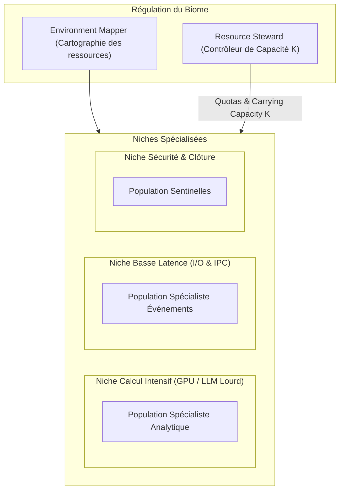
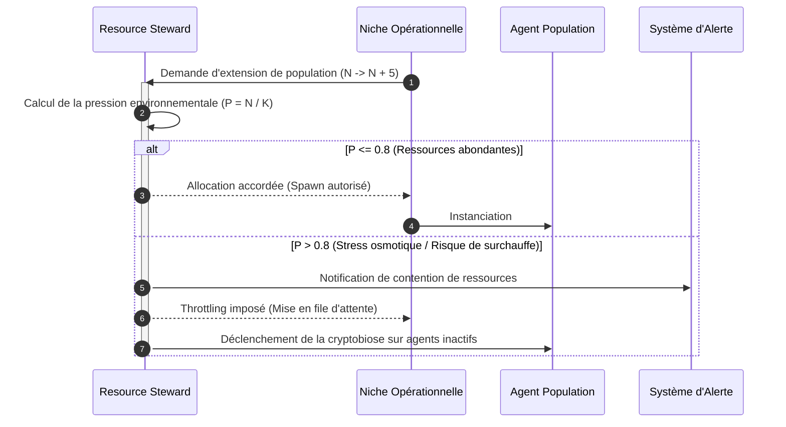
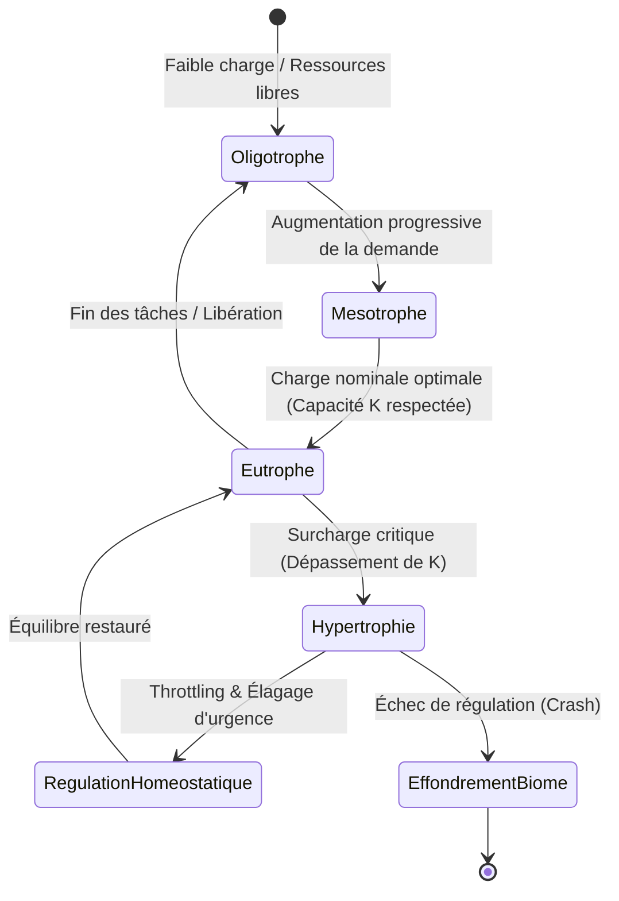

# Biome : Orchestration par Environnement et Populations Spécialisées

## 1. Définition

Biome dans GenOS est un mode d'orchestration qui représente une mission comme un **environnement opérationnel contenant plusieurs populations d'agents spécialisées**. Chaque population possède un périmètre local, ses ressources et ses dépendances, tandis qu'un observateur suit les interactions à l'échelle de l'écosystème.

Le concept biologique est utile lorsque la mission ne se réduit ni à une hiérarchie, ni à une compétition d'hypothèses, ni à un état partagé unique. Elle ressemble plutôt à un environnement : plusieurs populations travaillent en parallèle, consomment des ressources communes, dépendent les unes des autres et peuvent produire des effets émergents.

Les quatre rôles de Biome sont :

1. **Environment Mapper** : cartographie la mission, ses contraintes, ses interfaces et ses ressources disponibles ;
2. **Resource Steward** : répartit les ressources entre les populations en préservant la résilience et les chemins de récupération ;
3. **Population Specialist** : possède une population spécialisée et restitue des preuves locales ainsi que ses dépendances voisines ;
4. **Ecosystem Observer** : observe les interactions globales, les goulets d'étranglement et les risques émergents.

Le cœur fonctionnel actuellement exposé est :

- [backend/src/services/biologicalModeService.js](../backend/src/services/biologicalModeService.js) : définition et composition des quatre rôles ;
- [backend/src/services/agentAutonomyPlanService.js](../backend/src/services/agentAutonomyPlanService.js) : plan d'autonomie et activation des workers ;
- [backend/src/services/agentFleetService.js](../backend/src/services/agentFleetService.js) : création, exécution et validation des workers ;
- [backend/src/services/agentOrchestrationState.js](../backend/src/services/agentOrchestrationState.js) : état de mission, continuations et télémétrie ;
- [backend/src/services/agentRuntimeAdapter.js](../backend/src/services/agentRuntimeAdapter.js) : adaptation du runtime d'agent.

À la différence d'un service `biomeService.js` dédié, la définition actuelle de Biome est portée par le service générique des modes biologiques. Les mécanismes détaillés ci-dessous décrivent le protocole d'orchestration attendu autour de ce contrat.

---

## 2. Un environnement opérationnel, pas une simple liste d'agents

Biome ne signifie pas seulement « lancer quatre workers ». Il impose une lecture écologique de la mission :

1. **un environnement** contient la mission, ses contraintes, ses interfaces et ses ressources ;
2. **des populations** possèdent des sous-domaines cohérents plutôt que des tâches arbitraires ;
3. **des ressources limitées** doivent être allouées sans épuiser une population critique ;
4. **des dépendances** relient les populations et doivent être publiées avec chaque résultat ;
5. **un observateur global** vérifie que l'écosystème reste viable, même si chaque population réussit localement.

Les principes de sécurité sont explicites :

- cartographier les interfaces avant le fan-out ;
- limiter les ressources par population et par phase ;
- préserver une capacité de reprise pour les populations critiques ;
- publier les preuves locales et les dépendances externes ;
- refuser une fusion lorsque l'ensemble est localement correct mais globalement incohérent.

Biome est donc adapté aux missions dont les problèmes sont spécialisés mais interdépendants : produit et sécurité, code et exploitation, données et conformité, ou encore plusieurs sous-systèmes d'une même plateforme.

---

## 3. Définition mathématique

Soit :

- $M$ : mission globale ;
- $E$ : environnement de la mission ;
- $P = \{p_1, \ldots, p_n\}$ : populations spécialisées ;
- $R$ : budget de ressources disponible ;
- $R_i$ : budget attribué à la population $p_i$ ;
- $D_i$ : dépendances publiées par $p_i$ ;
- $L_i$ : évidence locale produite par $p_i$ ;
- $G$ : état global observé par l'Ecosystem Observer.

L'allocation doit respecter :

$$
\sum_{i=1}^{n} R_i \leq R
$$

et chaque population doit conserver un minimum opérationnel :

$$
R_i \geq R_{min,i}
$$

La qualité locale d'une population peut être représentée par :

$$
Q_i = w_e E_i + w_c C_i + w_d D_i
$$

où :

- $E_i$ mesure la solidité de l'évidence locale ;
- $C_i$ mesure la couverture du périmètre ;
- $D_i$ mesure la qualité des dépendances publiées ;
- $w_e + w_c + w_d = 1$.

La viabilité écologique ne dépend pas seulement de la moyenne locale :

$$
V(E) = \min_i(Q_i) - \lambda B(E) - \mu K(E)
$$

où $B(E)$ mesure les goulets d'étranglement et $K(E)$ les conflits ou dépendances non résolus. L'écosystème ne peut être promu que si :

$$
\text{canMerge}(E) = 1 \iff V(E) \geq V_{min} \land \forall i\;D_i\text{ est résolue ou explicitement acceptée}
$$

Cette définition évite qu'une population très performante masque une population critique non viable.

---

## 4. Les quatre rôles

La composition actuelle de Biome produit exactement quatre rôles. Les membres 1 et 3 utilisent le tier `frontier`; les membres 2 et 4 utilisent le tier `standard`.

### 4.1 Environment Mapper

```text
Role: environment_mapper
ModelTier: frontier
Member Number: 1
Responsibility: Mission topology and constraints
```

**Hypothèse :**
> « Map the mission environment, constraints, interfaces, and available resources. »

Le Mapper établit :

- les frontières de l'environnement ;
- les populations nécessaires ;
- les interfaces entre populations ;
- les contraintes et invariants ;
- les ressources disponibles ;
- les dépendances qui peuvent bloquer une population.

Son livrable n'est pas une solution locale, mais une carte exploitable par les autres rôles.

### 4.2 Resource Steward

```text
Role: resource_steward
ModelTier: standard
Member Number: 2
Responsibility: Capacity, fairness and recovery
```

**Hypothèse :**
> « Allocate resources across agent populations while preserving resilience and recovery paths. »

Le Steward :

- répartit budget, temps et capacité d'inférence ;
- évite qu'une population monopolise les ressources ;
- réserve une capacité pour les reprises ;
- ajuste les allocations selon les signaux de l'observateur ;
- rend chaque arbitrage traçable.

### 4.3 Population Specialist

```text
Role: population_specialist
ModelTier: frontier
Member Number: 3
Responsibility: Local domain evidence
```

**Hypothèse :**
> « Own a specialized population and return local evidence plus dependencies on neighboring populations. »

Le Specialist :

- prend en charge un sous-domaine spécialisé ;
- produit des résultats et preuves locales ;
- déclare les hypothèses utilisées ;
- signale ses dépendances aux autres populations ;
- ne présente pas une réussite locale comme une réussite globale.

### 4.4 Ecosystem Observer

```text
Role: ecosystem_observer
ModelTier: standard
Member Number: 4
Responsibility: Global health and emergent risk
```

**Hypothèse :**
> « Observe ecosystem-wide interactions, bottlenecks, and emergent risks. »

L'Observer :

- agrège les signaux des populations ;
- détecte les goulets d'étranglement ;
- cherche les risques émergents ;
- mesure la couverture et la viabilité globale ;
- recommande fusion, reprise, rebalancement ou escalade.

---

## 5. Architecture du système

```text
Client / Mission
        |
        v
[biologicalModeService.compose('biome', mission)]
        |
        +--> Environment Mapper : carte, interfaces, contraintes
        +--> Resource Steward   : allocation et réserves
        +--> Population Specialist : preuves d'une population
        +--> Ecosystem Observer : santé et risques globaux
        |
        v
[Agent autonomy plan]
        |
        +--> initialise l'environnement
        +--> ouvre les populations autorisées
        +--> attribue budget et limites
        |
        v
[Exécution des populations]
        |
        +--> résultats locaux
        +--> dépendances publiées
        +--> signaux de ressources
        +--> alertes globales
        |
        v
[Observation et barrière d'évidence]
        |
        +--> couverture locale vérifiée
        +--> interfaces vérifiées
        +--> goulets d'étranglement détectés
        +--> risques émergents classifiés
        |
        v
[Fusion, reprise ou escalade]
```

L'architecture ne suppose pas que les quatre rôles correspondent à quatre sous-tâches fixes. Le Specialist peut représenter une population composée de plusieurs workers autonomes ; les quatre membres Biome définissent le protocole de lecture et de gouvernance de l'environnement.

---

## 6. Activation

Biome est pertinent lorsque la mission présente :

1. **plusieurs domaines spécialisés** ;
2. **des dépendances entre domaines** mais pas un état unique à modifier à chaque instant ;
3. **des ressources partagées** à arbitrer ;
4. **un risque d'interactions émergentes** ;
5. **un besoin de résilience**, avec reprise d'une population sans redémarrer tout l'écosystème.

Exemple de composition réellement exposée :

```javascript
const agents = biologicalModeService.compose(
  'biome',
  'Prepare a secure multi-service production release.'
);

// agents.length === 4
// agents[0].role === 'environment_mapper'
// agents[1].role === 'resource_steward'
// agents[2].role === 'population_specialist'
// agents[3].role === 'ecosystem_observer'
```

La composition valide le mode et la présence d'une mission. Une mission vide produit `BIOLOGICAL_MISSION_REQUIRED`; un mode inconnu produit `BIOLOGICAL_MODE_UNKNOWN`.

Biome est moins approprié si :

- la tâche est strictement linéaire ;
- toutes les branches doivent modifier le même état à chaque étape ;
- l'objectif principal est de comparer trois hypothèses ;
- une seule spécialité suffit ;
- la mission exige un hôte hiérarchique clairement dominant.

---

## 7. Composition et contrat des membres

L'appel générique est :

```javascript
biologicalModeService.compose('biome', mission)
```

Chaque entrée retournée contient :

```javascript
{
  role: 'environment_mapper',
  modelTier: 'frontier',
  memberNumber: 1,
  mission: 'Biome shared mission: ...'
}
```

La mission de chaque membre contient quatre éléments contractuels :

- la mission partagée ;
- le principe collectif de Biome ;
- l'hypothèse propre au rôle ;
- l'instruction de retourner preuves, changements d'état et contraintes d'intégration.

Le contrat de composition ne prétend pas, à lui seul, créer une topologie de populations ou un ordonnanceur de ressources dédié. Cette topologie doit être fournie par le plan d'autonomie et les services d'exécution associés.

---

## 8. Allocation des ressources

Le Resource Steward répartit le budget sans réduire une population critique à une capacité inutilisable. Pour un budget worker $T_w$ et des poids $a_i$ :

$$
R_i = T_w \cdot \frac{a_i}{\sum_j a_j}
$$

avec :

$$
R_i \geq R_{min,i}
$$

Si cette contrainte est impossible, Biome doit réduire le nombre de populations, reporter une population non critique ou refuser l'activation. Il ne doit pas produire quatre populations nominales dont aucune ne peut terminer son périmètre.

Les ressources à surveiller comprennent :

- tokens et temps d'inférence ;
- nombre de workers actifs ;
- profondeur de fan-out ;
- capacité de reprise ;
- accès aux outils et aux artefacts ;
- budget de validation et de synthèse.

Une allocation équilibrée n'est pas nécessairement une allocation égale : le Mapper et l'Observer peuvent nécessiter davantage de raisonnement, tandis qu'une population locale bien bornée peut fonctionner avec un budget standard.

---

## 9. Cycle de vie d'un Biome

### Phase 1 : Cartographie

L'Environment Mapper identifie les frontières, les populations, les ressources et les interfaces. Il produit une carte versionnée avant le fan-out.

### Phase 2 : Établissement des niches

Chaque population reçoit :

- un objectif local ;
- un périmètre ;
- ses entrées et sorties ;
- ses invariants ;
- ses dépendances ;
- son budget et son critère d'arrêt.

### Phase 3 : Allocation

Le Resource Steward attribue les capacités et conserve une réserve de récupération. Une population bloquée doit pouvoir demander une reprise ciblée.

### Phase 4 : Croissance locale

Le Population Specialist exécute le travail spécialisé et publie régulièrement : résultats, preuves, hypothèses, risques et dépendances.

### Phase 5 : Observation

L'Ecosystem Observer compare l'état des populations et recherche les effets transverses : conflit d'interface, saturation de ressource, absence de couverture ou dépendance circulaire.

### Phase 6 : Maturité

Le Biome atteint la maturité lorsque les populations ont terminé, les dépendances sont résolues ou acceptées, les invariants sont vérifiés et l'observateur ne détecte plus de risque bloquant.

---

## 10. Évidence et barrière de fusion

Une population ne peut pas être fusionnée uniquement sur la base d'un texte de conclusion. Elle doit fournir un dossier d'évidence :

```text
Population result
- Scope covered
- Claims and supporting evidence
- Assumptions
- Dependencies on neighboring populations
- Tests or checks performed
- Unresolved risks
- Requested integration action
```

La barrière de fusion vérifie quatre niveaux :

1. **niveau local** : la population a-t-elle produit une preuve suffisante ? ;
2. **niveau interface** : ses sorties respectent-elles les contrats voisins ? ;
3. **niveau ressource** : aucune population critique n'est-elle épuisée ou ignorée ? ;
4. **niveau écosystème** : l'ensemble est-il viable selon l'Observer ?

La fusion est refusée si une population est localement convaincante mais incompatible avec l'environnement global.

---

## 11. Intégration et dépendances

Biome ne fusionne pas les résultats dans un ordre arbitraire. L'Integration Layer doit :

1. construire un graphe des dépendances publiées ;
2. identifier les sorties qui sont des prérequis ;
3. vérifier les contrats aux frontières ;
4. détecter les cycles ou incompatibilités ;
5. intégrer les populations selon un ordre causal ;
6. transmettre les décisions et les risques à l'Observer.

Une dépendance peut être :

- **résolue** : la population fournisseuse a livré et le consommateur a validé ;
- **tolérée** : elle est explicitement acceptée comme risque borné ;
- **bloquante** : aucune fusion globale n'est permise ;
- **circulaire** : elle exige une replanification ou une escalade.

L'Ecosystem Observer doit conserver une vue globale même lorsque l'intégration est effectuée par les services génériques d'orchestration.

---

## 12. Continuations et résilience

Biome favorise la reprise ciblée. Une erreur dans une population ne doit pas automatiquement détruire les résultats valides des populations voisines.

Une continuation peut :

- réallouer du budget à une population bloquée ;
- demander au Specialist de compléter une preuve manquante ;
- recalculer une interface après modification d'une population voisine ;
- demander à l'Observer de réévaluer un risque émergent ;
- réduire le périmètre d'une population non critique.

Le Resource Steward réserve une partie du budget pour ces reprises. La continuation doit conserver la provenance de la première tentative et indiquer ce qui a changé.

Critères d'arrêt :

- toutes les populations sont viables et leurs dépendances sont résolues ;
- le budget de continuation est épuisé ;
- un cycle de dépendances persiste ;
- un invariant global reste violé ;
- une intervention humaine est requise.

---

## 13. Télémétrie

Les signaux utiles à un Biome comprennent :

- `populationCount` : nombre de populations actives ;
- `populationHealth` : état local de chaque population ;
- `resourceAllocation` : budget attribué et consommé ;
- `resourceSaturation` : populations proches de l'épuisement ;
- `dependencyCount` : dépendances déclarées ;
- `unresolvedDependencies` : dépendances encore bloquantes ;
- `interfaceFailures` : incompatibilités entre populations ;
- `bottleneckDuration` : durée des goulots d'étranglement ;
- `recoveryRounds` : nombre de continuations ;
- `emergentRisks` : risques détectés par l'Observer ;
- `globalViability` : score de viabilité avant fusion.

La télémétrie doit permettre de répondre à trois questions :

1. quelle population est en difficulté ? ;
2. cette difficulté est-elle locale ou provoquée par une interaction ? ;
3. faut-il réparer, rebalancer, replanifier ou escalader ?

---

## 14. Cas d'usage

### Cas 1 : Livraison multi-service

**Mission :** préparer une release sur plusieurs services avec sécurité, données et exploitation.

- **Mapper** cartographie les services, versions, interfaces et contraintes de déploiement ;
- **Steward** réserve une capacité pour les migrations et le rollback ;
- **Specialist** traite la population code, tests ou infrastructure qui lui est assignée ;
- **Observer** détecte qu'une migration de schéma bloque une version applicative pourtant valide localement.

La fusion n'est autorisée qu'après validation de l'ordre de déploiement et du chemin de récupération.

### Cas 2 : Système de recherche avec données hétérogènes

**Mission :** produire une analyse à partir de sources structurées, documents et signaux externes.

Les populations travaillent sur l'ingestion, la qualité des données, l'analyse et la conformité. L'Observer recherche les biais introduits par une source commune ou les contradictions entre populations.

### Cas 3 : Réponse à incident

**Mission :** diagnostiquer une panne et préparer une restauration contrôlée.

Une population examine les logs, une autre l'infrastructure, une autre les changements récents. Le Steward protège la capacité nécessaire aux vérifications et au rollback. L'Observer empêche qu'une hypothèse locale soit promue comme cause racine sans corrélation inter-populations.

### Cas 4 : Produit complexe

**Mission :** faire évoluer une fonctionnalité impliquant UX, API, persistance et opérations.

Le Biome rend visibles les interfaces et dépendances entre populations. Une sortie UX non traduite dans le contrat API est détectée comme risque d'écosystème plutôt que comme simple défaut d'une population.

---

## 15. Erreurs et escalade

### Environnement sous-spécifié

```text
BIOME_ENVIRONMENT_UNMAPPED
La mission ne permet pas d'identifier clairement ses frontières ou populations.
Action : demander une cartographie complémentaire avant le fan-out.
```

### Allocation insuffisante

```text
BIOME_RESOURCE_FLOOR_UNSATISFIABLE
Le budget disponible ne permet pas d'atteindre les minima des populations critiques.
Action : réduire le périmètre, reporter une population ou escalader.
```

### Dépendance circulaire

```text
BIOME_DEPENDENCY_CYCLE
Deux populations attendent chacune une sortie de l'autre.
Action : replanifier l'interface ou demander un arbitrage.
```

### Risque émergent

```text
BIOME_ECOSYSTEM_RISK
Chaque résultat local est acceptable, mais leur interaction viole un invariant global.
Action : bloquer la fusion et lancer une continuation ciblée.
```

### Épuisement d'une population

```text
BIOME_POPULATION_EXHAUSTED
Une population critique a consommé son budget sans preuve suffisante.
Action : réallouer la réserve, réduire le périmètre ou escalader.
```

---

## 16. Configuration et garde-fous

Les paramètres effectifs dépendent du plan d'autonomie et des services génériques. Une configuration Biome doit au minimum contrôler :

```text
BIOME_MAX_POPULATIONS
BIOME_MIN_RESOURCE_PER_POPULATION
BIOME_RECOVERY_RESERVE_RATIO
BIOME_MAX_DEPENDENCY_DEPTH
BIOME_CONVERGENCE_TIMEOUT
GENOS_MAX_AUTONOMOUS_WORKERS
GENOS_WORKER_ALLOCATION_RATIO
```

Ces noms décrivent les contrôles attendus du protocole ; ils ne constituent pas tous des variables d'environnement actuellement implémentées. La source de vérité pour les valeurs réellement disponibles reste la configuration des services d'orchestration et du runtime.

Garde-fous recommandés :

- limite de fan-out par population ;
- profondeur maximale de dépendances ;
- budget réservé aux reprises ;
- timeout de l'Observer ;
- exigence d'évidence pour chaque sortie ;
- arrêt sur invariant global violé.

---

## 17. Limites et choix de conception

### Biome n'est pas une cohérence forte

Lorsque tous les agents doivent partager le même état à chaque instant, [SYNCYTIUM.md](SYNCYTIUM.md) est plus adapté. Biome tolère des états locaux temporaires, à condition que les interfaces et dépendances soient publiées avant la fusion.

### Biome n'est pas une hiérarchie

Quand une autorité hôte doit imposer un contrat et arbitrer directement des symbiotes, [HOLOBIONTE.md](HOLOBIONTE.md) est préférable.

### Biome n'est pas une compétition d'hypothèses

Quand la question est « quelle stratégie ou explication résiste le mieux ? », [TRINITY.md](TRINITY.md) fournit une structure comparative plus nette.

### Risque de silo

Des populations trop isolées peuvent optimiser leur propre score et négliger l'écosystème. L'Observer et les dépendances obligatoires sont donc essentiels.

### Risque de sur-observation

Un Observer trop actif peut devenir un goulot d'étranglement. Il doit détecter les interactions significatives et non valider chaque micro-étape locale.

### Limite du contrat actuel

La définition générique expose les rôles et leurs hypothèses, mais le dépôt ne fournit pas actuellement de service Biome dédié comparable aux services spécialisés documentés pour certains autres modes. Les détails de topologie, de ressource et de population doivent donc rester alignés sur le plan générique d'autonomie jusqu'à l'ajout d'une implémentation spécialisée.

---

## 18. Comparaison avec les autres modes biologiques

| Aspect | Trinity | A-Team | Biocénose | Holobionte | Syncytium | Biome |
|--------|---------|--------|-----------|------------|-----------|-------|
| **Unité de décomposition** | Hypothèses | Domaines | Communauté | Hôte et symbiotes | État partagé | Populations |
| **Coordination** | Comparaison | Spécialisation | Consensus adversarial | Hiérarchie intégrée | Synchronisation continue | Interactions écologiques |
| **État** | Branches séparées | Local par domaine | Propositions isolées | Contrat de l'hôte | Unique et partagé | Environnement + états locaux |
| **Rôle de contrôle** | Scoring | Orchestrateur | Facilitator / Observer | Host | Coordinator / Guardian | Mapper / Observer |
| **Risque principal** | Mauvaise hypothèse retenue | Lacune de domaine | Collusion ou faux consensus | Symbiote non sûr | Conflit d'état | Effet émergent ou ressource saturée |
| **Meilleur usage** | Explorer des alternatives | Mission multidisciplinaire | Robustesse par adversité | Production gouvernée | Collaboration temps réel | Systèmes interdépendants |

Le choix peut se résumer ainsi :

- choisir **Biome** quand le problème est un écosystème de populations et d'interfaces ;
- choisir **Syncytium** quand la cohérence instantanée d'un état unique domine ;
- choisir **Biocénose** quand l'indépendance et la falsification sont prioritaires ;
- choisir **Holobionte** quand une autorité hôte doit intégrer des capacités spécialisées ;
- choisir **A-Team** quand la décomposition par domaines suffit ;
- choisir **Trinity** quand plusieurs hypothèses doivent être comparées.

---

## Références internes

- [ORCHESTRATION.md](ORCHESTRATION.md) : orchestration générale, budgets, gates et preuves
- [A_TEAM.md](A_TEAM.md) : orchestration multidisciplinaire par domaines
- [TRINITY.md](TRINITY.md) : orchestration comparative par hypothèses
- [BIOCENOSE.md](BIOCENOSE.md) : orchestration communautaire et validation adversariale
- [HOLOBIONTE.md](HOLOBIONTE.md) : orchestration hôte-symbiotes
- [SYNCYTIUM.md](SYNCYTIUM.md) : orchestration par état partagé synchronisé
- [BIOLOGIE_COMPUTATIONNELLE.md](BIOLOGIE_COMPUTATIONNELLE.md) : cadre biologique général
- [biologicalModeService.js](../backend/src/services/biologicalModeService.js) : définition et composition des rôles Biome
- [agentAutonomyPlanService.js](../backend/src/services/agentAutonomyPlanService.js) : plan d'autonomie
- [agentFleetService.js](../backend/src/services/agentFleetService.js) : fleet de workers et barrière d'évidence
- [agentOrchestrationState.js](../backend/src/services/agentOrchestrationState.js) : état et télémétrie de mission
- [agentRuntimeAdapter.js](../backend/src/services/agentRuntimeAdapter.js) : adaptation du runtime


---

## Schémas d'Architecture et de Régulation Environnementale

### 1. Architecture des Niches Écologiques du Biome



### 2. Séquence de Régulation de la Capacité de Portance (Carrying Capacity K)



### 3. Machine à états du Cycle Écologique du Biome


