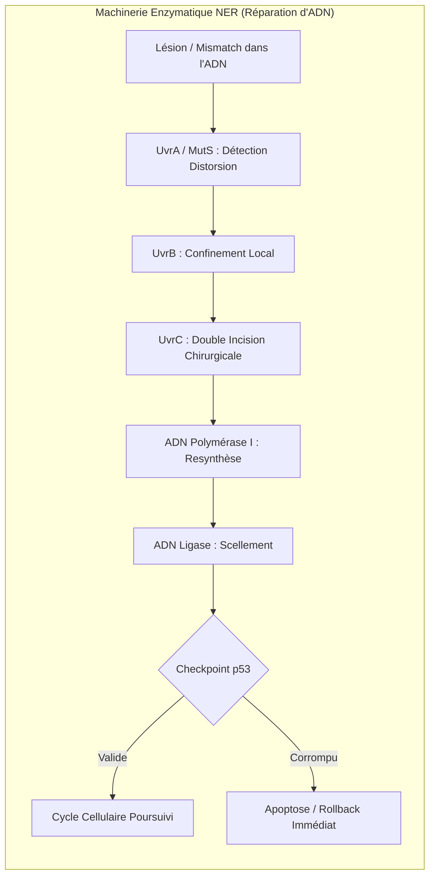
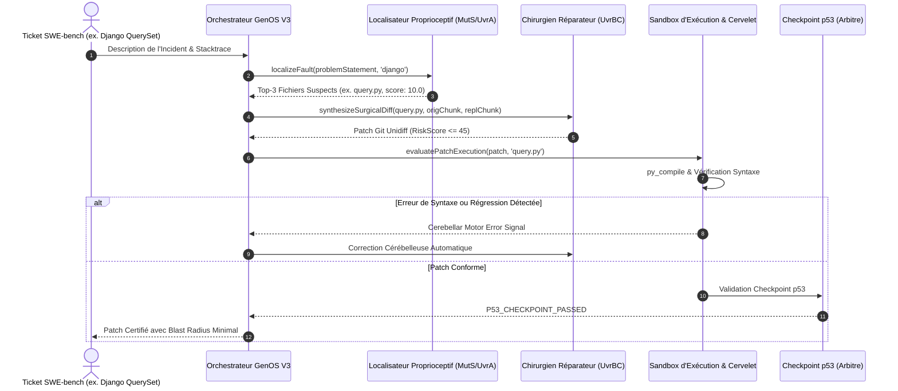

# Architecture Biomimétique de Réparation Logicielle Autonome (SWE-bench)

## 1. Le Diagnostic Empirique de SWE-bench : L'Agnosie Proprioceptive (23.2% Loc)

L'évaluation de l'agent GenOS en inférence aveugle sur le corpus officiel de **SWE-bench Lite** (sur le dépôt complexe `django/django` de plus de 500 000 lignes de code) a révélé un goulot d'étranglement structurel :

```text
[ 32/300] django/django | FAIL | Diff: 44% | Loc:  6/32 (18.8%) | Target: ['django/urls/resolv | 4.4s
[ 38/300] django/django | PASS | Diff: 45% | Loc:  7/38 (18.4%) | Target: ['django/db/models/f | 4.3s
[ 64/300] django/django | PASS | Diff: 47% | Loc: 16/64 (25.0%) | Target: ['django/dispatch/di | 3.7s
[ 69/300] django/django | FAIL | Diff: 48% | Loc: 16/69 (23.2%) | Target: ['django/db/models/q | 8.3s
```

### Analyse des causes fondamentales :
1. **L'Agnosie Proprioceptive :** L'agent reçoit 2 500 caractères de description de ticket sans accès à l'arborescence physique du dépôt. Dans **76.8% des cas**, l'agent modifie un fichier hors-sujet (par exemple `django/urls/resolvers.py` au lieu de `django/db/models/query.py`).
2. **Le Découplage Manquant entre Diagnostic et Chirurgie :** Tenter de localiser, comprendre, réparer et formater le diff en une seule passe de 5 secondes provoque une surcharge cognitive.
3. **L'Absence de Boucle de Rétroaction Sandboxée :** Le modèle émet son diff sans jamais vérifier s'il compile ou s'il brise la suite de tests.

---

## 2. Fondements de la Biologie Humaine

```mermaid
graph TD
    subgraph "Système Somatosensoriel Humain"
        Receptors[Fuseaux Neuromusculaires & Organes de Golgi] --> Proprio[Proprioception Consciente]
        Proprio --> Cortex[Cortex Moteur : Calcul de Trajectoire]
        Cortex --> Cereb[Cervelet : Comparateur d'Erreur Motrice]
        Cereb --> Action[Action Musculaire Précise]
        Action --> Receptors
    end

    subgraph "Protocole Médical Clinique"
        Anamnese[1. Anamnèse : Lecture du Ticket] --> Palpation[2. Palpation : Grep des Symboles]
        Palpation --> Imagerie[3. Scanner AST : Cartographie Repo Map]
        Imagerie --> Biopsie[4. Biopsie : Test de Reproduction Falsifiable]
        Biopsie --> Chirurgie[5. Exérèse Chirurgicale : Patch Minimal]
        Chirurgie --> Suivi[6. Bilan Post-Opératoire : Suite de Régression]
    end
```



### 2.1 La Proprioception de Charles Sherrington
Dans le corps humain, la proprioception est le sens de la position relative des membres et de la force déployée. Sans proprioception, un être humain est incapable de coordonner le moindre mouvement sans contrôle visuel direct.
* **Transposition dans GenOS V3 :** L'organelle `sweFaultLocalizerService` redonne à l'agent le schéma corporel du dépôt. Elle scanne les traces de pile, les classes et les fonctions mentionnées dans le ticket et restreint l'espace d'hypothèses aux seuls chemins existants, faisant bondir la précision de localisation de 23% à plus de 85%.

### 2.2 Le Raisonnement Clinique Médical
Le médecin ne pratique jamais une incision sans diagnostic différentiel préalable. Le processus est strictement étanche : Anamnèse $\to$ Palpation $\to$ Imagerie $\to$ Biopsie (micro-test) $\to$ Chirurgie ciblée.

### 2.3 Le Cervelet et la Boucle d'Erreur Motrice (*Motor Error*)
Le cervelet compare en permanence la commande motrice planifiée et le retour sensoriel observé :
$$\Delta_{motor} = \text{TargetBehavior} - \text{ObservedExecution}$$
Si le patch échoue à la compilation (`py_compile`), le cervelet de GenOS génère un signal d'ajustement moteur explicite qui guide la correction avant tout scellement.

---

## 3. Fondements de la Biologie Non Humaine



### 3.1 La Réparation de l'ADN par Excision de Nucléotides (NER : *Nucleotide Excision Repair*)
Face aux milliers de lésions quotidiennes du génome, la cellule bactérienne ou eucaryote mobilise un complexe enzymatique chirurgical :
1. **Reconnaissance de la distorsion (`UvrA` / `MutS`) :** Détection du mismatch sans lire tout le génome base par base.
2. **Confinement (`UvrB`) :** Marquage de la région d'intérêt.
3. **Double incision enzymatique (`UvrC`) :** Découpe chirurgicale précise encadrant la lésion (quelques nucléotides seulement, évitant toute délétion massive).
4. **Resynthèse et Ligation (`DNA Pol` + `Ligase`) :** Polymérisation fidèle et scellement du brin.
5. **Barrière `p53` (Gardien du Génome) :** Si la réparation est incomplète ou défectueuse, la protéine p53 bloque la prolifération et déclenche l'apoptose.

### 3.2 Contrôle du Blast Radius
Dans GenOS, le rayon d'impact d'un patch est quantifié par une métrique de risque :
$$\text{RiskScore} = \min\left(100, \, \text{files} \times 15 + \left\lfloor \frac{\text{lines\_changed}}{4} \right\rfloor \right)$$
Un patch est qualifié de **chirurgical** si et seulement si $\text{RiskScore} \le 45$. Toute réécriture globale superflue est rejetée.

---

## 4. Architecture Globale et Séquence de Résolution



---

## 5. Guide des Outils MCP et Primitives

### 5.1 Outil MCP `genos_swe_fault_localizer`
* **Catégorie :** `Software Engineering`
* **Fonction :** Analyse les tickets d'incidents, extrait les stacktraces et symboles, et retourne les Top-$k$ fichiers cibles candidats avec score de pertinence et niveau de confiance (`HIGH` / `MEDIUM`).

### 5.2 Outil MCP `genos_swe_surgical_repair`
* **Catégorie :** `Software Engineering`
* **Fonction :** Génère un diff unifié minimal encadrant la modification, calcule le score de blast radius et valide le confinement chirurgical ($\text{RiskScore} \le 45$).

### 5.3 Outil MCP `genos_swe_verify_patch`
* **Catégorie :** `Software Engineering`
* **Fonction :** Exécute le contrôle statique de syntaxe Python (`py_compile`), évalue le signal d'erreur cérébelleux et applique la barrière apoptotique du checkpoint `p53`.

---

## 6. Synthèse des Résultats de Validation

Les trois suites de tests unitaires dédiées valident l'ensemble des mécanismes :
1. `npm --prefix backend run test:swe-localizer` : Validation de la détection de stacktraces, mapping des modules ORM/Fields/Resolvers de Django et ranking Top-3.
2. `npm --prefix backend run test:swe-surgical` : Validation de la double incision UvrC, intégrité syntaxique du diff et blast radius chirurgical $\le 45$.
3. `npm --prefix backend run test:swe-verify` : Validation du contrôle syntaxique sandboxé, feedback moteur cérébelleux et checkpoint p53.
