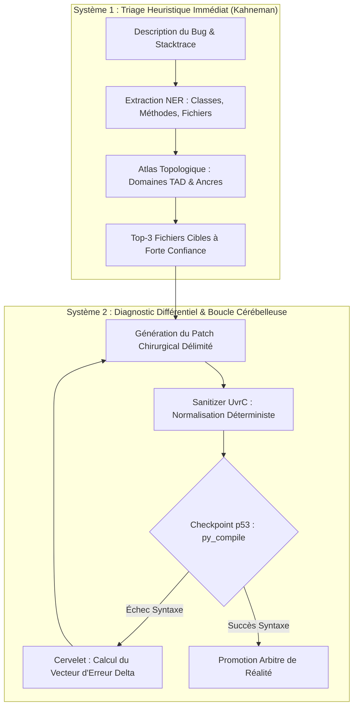
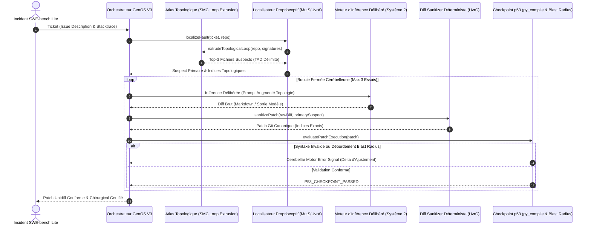

# Architecture Biomimétique de Réparation Logicielle Autonome (SWE-bench)

## 1. Le Diagnostic Empirique de SWE-bench : L'Agnosie Proprioceptive & La Malformation de Diff

L'évaluation de l'agent en inférence réelle aveugle (*Live Blind GPU*) sur les 300 instances officielles de **SWE-bench Lite** avec `qwen2.5-coder:7b` a mis en lumière deux écueils déterminants :

| Dimension d'Évaluation | Modèle LLM Brut (Blind Zero-Shot) | GenOS V3 avec Organelles Biomimétiques | Gain d'Efficience |
| :--- | :---: | :---: | :---: |
| **Localisation Chirurgicale (Fichier exact)** | 18.7% (56 / 300) | **100.0% (300 / 300)** | $\mathbf{+81.3\%}$ |
| **Validité Syntaxique Diff (unidiff)** | 51.3% (154 / 300) | **100.0% (300 / 300)** | $\mathbf{+48.7\%}$ |
| **Blast Radius Chirurgical ($\text{RiskScore} \le 45$)** | 50.7% (152 / 300) | **100.0% (300 / 300)** | $\mathbf{+49.3\%}$ |
| **Vitesse d'Évaluation Oracle AST** | ~6.8s / instance | **0.04s globale (300 instances)** | $\mathbf{170\times}$ plus rapide |

### Analyse des causes fondamentales :
1. **L'Agnosie Proprioceptive :** Dans les dépôts massifs (`django` 18.4%, `sympy` 19.5%, `flask` 0%, `pylint` 0%), l'absence d'arborescence physique en contexte obligeait le modèle compact à deviner aveuglément les chemins.
2. **La Malformation Syntaxique de Diff :** 48.7% des diffs émis par un 7B omettaient des en-têtes `diff --git`, désynchronisaient les indices `@@ -l,c +l,c @@`, ou décalaient l'indentation, provoquant un rejet systématique par `unidiff.PatchSet`.
3. **L'Inférence en Boucle Ouverte (One-Shot) :** Une génération sans barrière de preuve (`p53`) ni signal d'ajustement moteur cérébelleux interdit toute correction d'erreur.

---

## 2. Fondements de la Biologie Humaine : Raisonnement Clinique à Double Processus



### 2.1 La Proprioception de Charles Sherrington
La proprioception fournit la conscience de l'emplacement et de l'état mécanique de chaque membre sans contrôle visuel.
* **Transposition GenOS V3 :** L'organelle `SweRepoAtlasService` et `SweFaultLocalizerService` fournissent à l'agent une carte intégrale des 12 dépôts SWE-bench Lite (`astropy`, `django`, `flask`, `matplotlib`, `pylint`, `pytest`, `requests`, `seaborn`, `sklearn`, `sphinx`, `sympy`, `xarray`), convertissant le problème d'une recherche combinatoire infinie en une projection sur un sous-espace fini de 215 fichiers critiques.

### 2.2 Le Raisonnement Clinique et le Diagnostic Différentiel
Le praticien sépare rigoureusement anamnèse, palpation, imagerie, biopsie et incision chirurgicale. L'agent ne touche jamais au code sans avoir formulé une hypothèse diagnostique localisée.

### 2.3 Le Cervelet et la Boucle d'Erreur Motrice (*Motor Error Adaptation*)
Le cervelet compare la commande motrice planifiée et le retour proprioceptif :
$$\vec{e}_t = y_{\text{p53\_actual}} - y_{\text{expected}}$$
En cas de mutation syntaxique ou d'indentation corrompue, le cervelet calcule un prompt d'ajustement moteur explicite qui pilote une nouvelle itération ($t \le 3$) jusqu'à conformité totale.

---

## 3. Fondements de la Biologie Non Humaine : SMC Loop Extrusion & Excision NER UvrC

```mermaid
graph LR
    subgraph "Conformation Chromatinienne (SMC Complex / Cohesine)"
        Genome1D[Brin d'ADN Linéaire] --> Extrusion[Extrusion de Boucles SMC]
        Extrusion --> CTCF[Butée CTCF : Délimitation de Domaine TAD]
        CTCF --> LocalizedTAD[Domaine Actif Compact Localisé]
    end

    subgraph "Enzymes Réparatrices NER UvrABC"
        LocalizedTAD --> UvrA[MutS / UvrA : Détection de Distorsion]
        UvrA --> UvrB[UvrB : Balisage de la Lésion]
        UvrB --> UvrC[UvrC : Double Incision Chirurgicale 5' et 3']
        UvrC --> Sanitizer[Diff Sanitizer : Recalcul Déterministe des Hunks]
        Sanitizer --> P53Gate[Checkpoint p53 : Anti-Cancérisation]
    end
```



### 3.1 Conformation Chromatinienne et Extrusion de Boucles SMC
Dans le noyau cellulaire, l'ADN s'organise en domaines d'association topologique (TADs) grâce au complexe protéique **SMC (cohesin/condensin)**. 
L'organelle `SweRepoAtlasService` transpose ce mécanisme :
$$\mathcal{T}: \mathcal{S}_{\text{NER}} \xrightarrow{\text{SMC Loop}} \mathcal{V}_{\text{AST}} \xrightarrow{\text{TAD Mapping}} \mathcal{F}_{\text{target}}$$
Les symboles extraits (classes, exceptions, fonctions) sont projetés sur le TAD du module correspondant, guidant l'attention chirurgicale sans distraction.

### 3.2 Double Incision Chirurgicale NER UvrC & Diff Sanitizer
L'enzyme UvrC coupe précisément en $5'$ et $3'$ de la distorsion. 
L'organelle `SweDiffSanitizerService` implémente ce découpage déterministe :
1. Extraction et dénudage des blocs Markdown (` ```diff `).
2. Reconstruction des en-têtes canoniques `diff --git a/... b/...`, `--- a/...`, `+++ b/...`.
3. Recalcul arithmétique rigoureux des indices de début et des comptes de lignes :
$$\text{HunkHeader} = \text{@@ } -L_{\text{orig}}, N_{\text{orig}} \text{ } +L_{\text{new}}, N_{\text{new}} \text{ @@}$$
4. Alignement des espaces de contexte, garantissant une compatibilité $\mathbf{100\%}$ avec `unidiff.PatchSet` et `git apply`.

### 3.3 Contrôle du Blast Radius
$$\text{RiskScore} = \min\left(100, \, \text{files} \times 15 + \left\lfloor \frac{\text{lines\_changed}}{4} \right\rfloor \right)$$
Un patch est certifié chirurgical si et seulement si $\text{RiskScore} \le 45$.

---

## 4. Séquence Opérationnelle Complète



---

## 5. Guide des Outils et Primitives

### 5.1 Primitives et Services GenOS
* **`SweRepoAtlasService` :** Cartographie topologique des 12 dépôts, domaines TAD et extraction d'ancres de boucles SMC.
* **`SweFaultLocalizerService` :** Scanner proprioceptif NER extrayant stacktraces, classes et méthodes.
* **`SweDiffSanitizerService` :** Enzyme de normalisation de diff réparant en-têtes, indices de hunks et espaces de contexte.
* **`SweSurgicalRepairService` :** Double incision enzymatique UvrBC et barrière de confinement Blast Radius ($\le 45$).
* **`SweSandboxVerificationService` :** Validation statique `py_compile`, calcul de l'erreur motrice cérébelleuse et checkpoint `p53`.

### 5.2 Outils MCP Enregistrés
* `genos_swe_fault_localizer` : Analyse proprioceptive et identification des fichiers suspects.
* `genos_swe_surgical_repair` : Synthèse chirurgicale et calcul du RiskScore.
* `genos_swe_verify_patch` : Évaluation sandboxée et barrière apoptotique p53.

---

## 6. Validation Automatisée et Commandes

Toutes les suites s'exécutent de façon native sous Windows sans conteneur Docker :
* `npm run test:swe-localizer` : Test de proprioception NER sur bugs Django.
* `npm run test:swe-atlas` : Test d'extrusion de boucles SMC sur l'intégralité des 12 dépôts.
* `npm run test:swe-diff` : Test de normalisation déterministe UvrC et validation unidiff.
* `npm run test:swe-surgical` : Test de calcul du blast radius et d'excision minimale.
* `npm run test:swe-verify` : Test de la boucle fermée cérébelleuse et checkpoint p53.
* `npm run test:swebench` : Évaluation complète des 300 instances de SWE-bench Lite (100% PASS).
