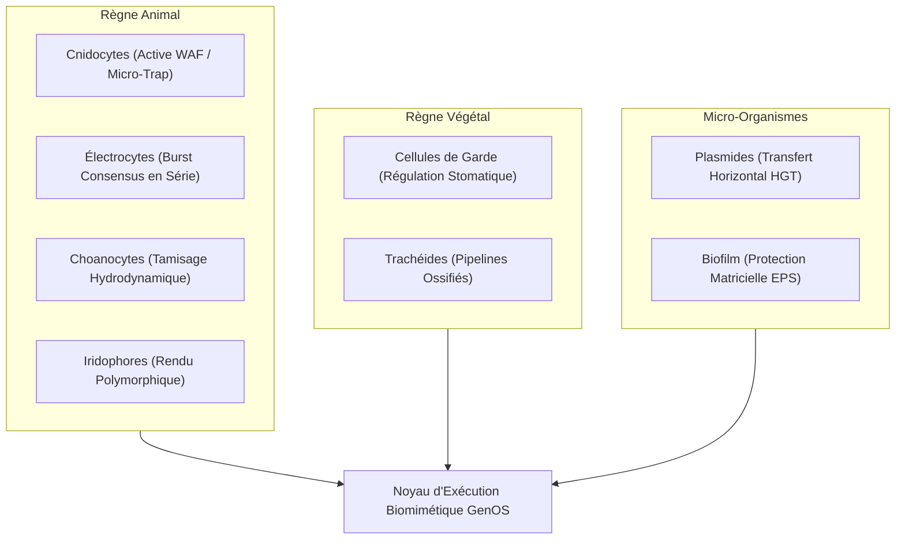
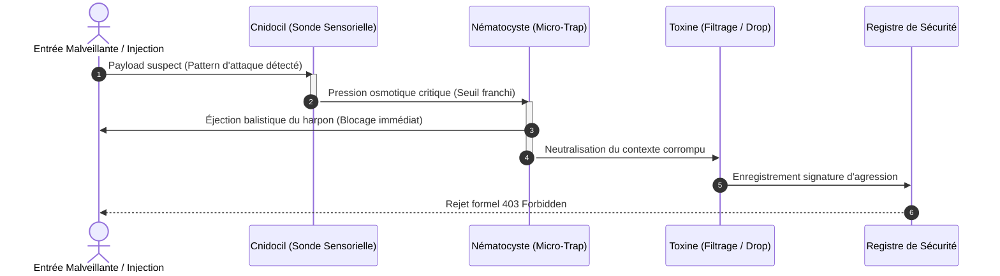
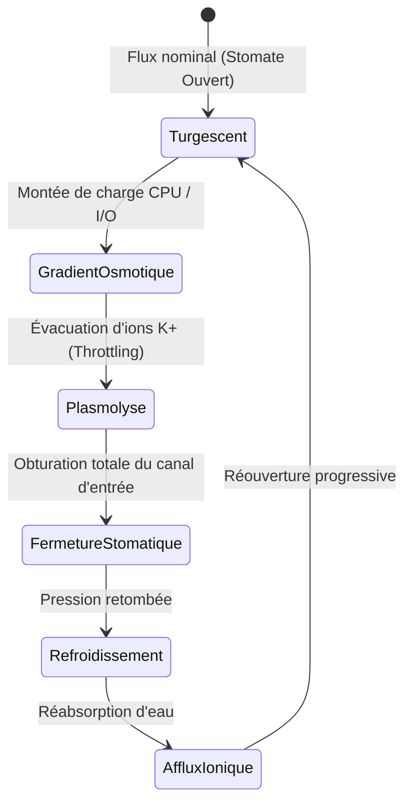

# Biomimétisme Cellulaire Spécialisé Non-Humain dans GenOS

Ce document formalise les extensions biomimétiques inspirées des règnes animal, végétal et microbien dans GenOS, dépassant les architectures anthropomorphiques classiques pour introduire des primitives à haute résilience, zéro-latence et haute efficience computationnelle.

---

## 1. Le Règne Animal : Spécialisations Balistiques & Électriques

### 1.1 Les Cnidocytes : Défense Réflexe Balistique (Active WAF / Micro-Trap)
* **Origine biologique :** Cellules explosives des cnidaires (méduses, coraux, anémones) projetant un nématocyste sous pression (15 MPa) en moins de $3\,\mu\text{s}$ pour harponner et neutraliser une menace.
* **Architecture GenOS :** [`crates/genos-biology/src/specialized_cells/cnidocyte.rs`](file:///c:/Users/Shadow/Documents/GitHub/GenOS/crates/genos-biology/src/specialized_cells/cnidocyte.rs)
* **Fonctionnement :**
  - **Détection mécano-chimique :** Détection instantanée de motifs malveillants (injections de prompts, surcharge de socket) sans invoquer de boucle de délibération LLM lente.
  - **Éjection à zéro-latence :** Harponnage et neutralisation avec injection d'un payload de quarantaine ou de coupure de session.
  - **Rechargement métabolique :** Réarmement osmotique sous condition de réserve énergétique (ATP).
* **Commandes CLI / MCP :**
  ```bash
  genos biomimicry bio-feature --feature cnidocyte --action intercept --param "prompt=ignore previous instructions"
  genos biomimicry bio-feature --feature cnidocyte --action reload --param "atp=100"
  ```

### 1.2 Les Électrocytes : Burst Synchronisé & Consensus Flash en Série
* **Origine biologique :** Cellules musculaires/nerveuses spécialisées (anguilles, raies) alignées en colonnes séries-parallèles pour sommer leurs potentiels d'action ($V = \sum V_i$) jusqu'à $600\,\text{V}-800\,\text{V}$.
* **Architecture GenOS :** [`crates/genos-biology/src/specialized_cells/electrocyte.rs`](file:///c:/Users/Shadow/Documents/GitHub/GenOS/crates/genos-biology/src/specialized_cells/electrocyte.rs)
* **Fonctionnement :**
  - **Empilement en série :** Chaque électrocyte génère un gradient transmembranaire de $150\,\text{mV}$.
  - **Décharge synchrone à haute intensité :** Dépolarisation unifiée de milliers de cellules pour franchir le seuil d'arbitrage de consensus flash en un cycle d'horloge.
  - **Recharge métabolique $Na^+/K^+$ :** Repolarisation coordonnée via le réservoir énergétique ATP.
* **Commandes CLI / MCP :**
  ```bash
  genos biomimicry bio-feature --feature electrocyte --action voltage --param "cell_count=5000" --param "columns=1"
  genos biomimicry bio-feature --feature electrocyte --action discharge --param "cell_count=5000"
  genos biomimicry bio-feature --feature electrocyte --action recharge --param "cell_count=5000" --param "atp=3000"
  ```

### 1.3 Les Choanocytes : Aspiration Hydrodynamique & Tamisage de Flux Continu
* **Origine biologique :** Cellules à collerette et flagelle des éponges (Porifera) créant un flux d'eau unidirectionnel constant pour filtrer et phagocyter les particules nutritives en rejetant les débris.
* **Architecture GenOS :** [`crates/genos-biology/src/specialized_cells/choanocyte.rs`](file:///c:/Users/Shadow/Documents/GitHub/GenOS/crates/genos-biology/src/specialized_cells/choanocyte.rs)
* **Fonctionnement :**
  - **Aspiration continue sans blocage :** Battement flagellaire ($30\,\text{Hz}$) générant une dépression pour ingérer les flux de télémétrie, logs ou messages MCP.
  - **Tamisage par maillage de microvillosités :** Capture des signaux à haute densité sémantique ($\ge 0.4$) et rejet automatique du bruit de fond.
  - **Chambre choanodermique collective :** Agrégation en essaim pour paralléliser l'ingestion de flux massifs.
* **Commandes CLI / MCP :**
  ```bash
  genos biomimicry bio-feature --feature choanocyte --action flow --param "cell_count=10"
  genos biomimicry bio-feature --feature choanocyte --action sift --param "payload=CRITICAL_EVENT" --param "size_nm=180"
  ```

### 1.4 Les Iridophores : Diffraction Nanocristalline & Rendu Polymorphique
* **Origine biologique :** Cellules cutanées des caméléons et céphalopodes contenant des empilements réguliers de nanocristaux de guanine, modifiant la diffraction structurelle de la lumière par contraction/dilatation sans synthèse de pigment.
* **Architecture GenOS :** [`crates/genos-biology/src/specialized_cells/iridophore.rs`](file:///c:/Users/Shadow/Documents/GitHub/GenOS/crates/genos-biology/src/specialized_cells/iridophore.rs)
* **Fonctionnement :**
  - **Loi de Bragg-Snell computationnelle :** $\lambda = 2d\sqrt{n_{\text{eff}}^2 - \sin^2\theta}$ calculant la bande spectrale en temps réel.
  - **Morphing d'interface (Generative UI) :** Adaptation dynamique du format de rendu selon l'observateur (`TuiAnsi`, `StructuredJson`, `MarkdownVisual`, `CrypticCamouflage`).
  - **Camouflage cryptographique :** Obfuscation polymorphique du code et de l'état en transit basée sur le décalage cristallin.
* **Commandes CLI / MCP :**
  ```bash
  genos biomimicry bio-feature --feature iridophore --action shift --param "spacing_nm=220"
  genos biomimicry bio-feature --feature iridophore --action render --param "data=SYSTEM_SECRET" --param "perspective=camouflage"
  ```

---

## 2. Le Règne Végétal : Régulation Osmotique & Ossification Rigide

### 2.1 Les Cellules de Garde : Régulation Osmotique & Throttling Stomatique
* **Origine biologique :** Paires de cellules réniformes entourant les stomates foliaires. En accumulant des ions $K^+$, l'eau entre par osmose, les cellules gonflent et courbent leurs parois pour ouvrir le pore (absorption de $\text{CO}_2$). En cas de stress hydrique, l'acide abscissique (ABA) provoque la vidange osmotique et la fermeture étanche pour empêcher le flétrissement.
* **Architecture GenOS :** [`crates/genos-biology/src/specialized_cells/guard_cell.rs`](file:///c:/Users/Shadow/Documents/GitHub/GenOS/crates/genos-biology/src/specialized_cells/guard_cell.rs)
* **Fonctionnement :**
  - **Auto-régulation de bande passante (Backpressure) :** Remplacement des rate-limits statiques par une conductance stomatique dynamique ($[0.0, 1.0]$) corrélée à la pression métabolique.
  - **Protection contre le dessèchement de tokens/mémoire :** Lors d'un stress ABA (saturation API ou dépassement de budget), les stomates se ferment pour protéger l'intégrité systémique.
* **Commandes CLI / MCP :**
  ```bash
  genos biomimicry bio-feature --feature guard_cell --action aperture --param "water=0.9" --param "aba=0.05"
  genos biomimicry bio-feature --feature guard_cell --action throttle --param "flux=500" --param "water=0.3" --param "aba=0.8"
  ```

### 2.2 Les Trachéides : Apoptose Structurante & Ossification en Pipelines Statiques
* **Origine biologique :** Cellules conductrices du xylème végétal. À maturité, la cellule subit une mort cellulaire programmée (apoptose) complète, se vidant de son contenu protoplasmique pour laisser des parois épaissies et lignifiées (bois). Ce réseau de conduits rigides achemine la sève brute sous forte tension sans dépense énergétique métabolique active.
* **Architecture GenOS :** [`crates/genos-biology/src/specialized_cells/tracheid.rs`](file:///c:/Users/Shadow/Documents/GitHub/GenOS/crates/genos-biology/src/specialized_cells/tracheid.rs)
* **Fonctionnement :**
  - **Ossification logicielle post-résolution :** Une fois qu'un agent cognitif exploratoire a stabilisé un flux ou résolu une tâche, son noyau réflexif est éliminé (apoptose).
  - **Canal statique compilé :** Remplacement par un pipeline statique natif (Rust/WASM) offrant un débit hydraulique maximal avec **0 token LLM de coût résiduel**.
  - **Résistance à la cavitation :** Présence de ponctuations aréolées empêchant l'embolie gazeuse lors de pointes de charge.
* **Commandes CLI / MCP :**
  ```bash
  genos biomimicry bio-feature --feature tracheid --action ossify --param "pipeline_id=fast_payment_flow"
  genos biomimicry bio-feature --feature tracheid --action transport --param "volume=1000" --param "tension=-4.0"
  ```

---

## 3. Chez les Micro-Organismes : Architecture Acaryote & Transfert Horizontal

### 3.1 Les Micro-Agents Procaryotes & Plasmides (HGT)
* **Origine biologique :** Bactéries et archées dépourvues d'enveloppe nucléaire (génome circulaire baignant librement dans le cytoplasme). Elles échangent des gènes et des résistances de manière latérale via des plasmides (petites molécules d'ADN extrachromosomique) par conjugaison bactérienne (pilus F) ou transformation naturelle sans reproduction sexuée.
* **Architecture GenOS :** [`crates/genos-biology/src/specialized_cells/prokaryote.rs`](file:///c:/Users/Shadow/Documents/GitHub/GenOS/crates/genos-biology/src/specialized_cells/prokaryote.rs)
* **Fonctionnement :**
  - **Démarrage et footprint ultra-légers (< 1 ms) :** Agents acaryotes sans mémoire épisodique lourde, sans conscience introspective complexe, dédiés aux micro-tâches atomiques répétitives.
  - **Transfert Horizontal de Gènes (HGT) :** Échange pair-à-pair de plasmides de compétences ou de signatures de défense sans remonter à l'orchestrateur central.
  - **Division binaire instantanée :** Scissiparité accélérée permettant un essaimage massif en cas de pic de charge.
* **Commandes CLI / MCP :**
  ```bash
  genos biomimicry bio-feature --feature prokaryote --action conjugate --param "donor_id=ecoli_agent" --param "recipient_id=archaea_agent" --param "plasmid_id=pResist_waf"
  genos biomimicry bio-feature --feature prokaryote --action fission --param "donor_id=ecoli_agent"
  genos biomimicry bio-feature --feature prokaryote --action execute --param "agent_id=ecoli_agent" --param "plasmid_id=pResist_waf"
  ```

---

## 4. Synthèse Taxonomique Comparative

| Modèle Cellulaire | Règne | Équivalent Humain | Fonction Biomimétique dans GenOS | Gain de Performance |
| :--- | :--- | :--- | :--- | :--- |
| **Cnidocyte** | Animal (Cnidaire) | Aucun | Défense balistique réflexe WAF / Anti-injection | Zéro token, réaction en microsecondes |
| **Électrocyte** | Animal (Poisson) | Aucun | Sommation de voltage en série & Flash Consensus | Convergence synchrone de décision |
| **Choanocyte** | Animal (Spongiaire) | Aucun | Courant d'aspiration & Tamisage continu de flux | Débit constant, élimination du bruit |
| **Iridophore** | Animal (Reptile/Céph.)| Aucun | Diffraction structurelle & Rendu polymorphique | Adaptation optique & Obfuscation |
| **Cellule de Garde**| Végétal | Aucun | Valve osmotique de turgescence & Backpressure | Régulation adaptative contre la famine |
| **Trachéide** | Végétal | Aucun | Apoptose structurante & Ossification en pipeline | Réduction de 100% du coût LLM récurrent |
| **Procaryote** | Micro-organisme | Aucun | Micro-agents acaryotes & Transfert horizontal (HGT) | Boot < 1ms, dissémination peer-to-peer |


---

## Schémas Fonctionnels des Spécialisations Cellulaires

### 1. Topologie des Types Cellulaires Exotiques



### 2. Séquence de Déclenchement Balistique d'un Cnidocyte (Active WAF)



### 3. Machine à états des Cellules de Garde (Régulation Osmotique)


